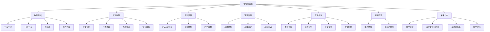

# 测度论的批判性分析与认知映射

## 目录

- [测度论的批判性分析与认知映射](#测度论的批判性分析与认知映射)
  - [目录](#目录)
  - [1. 引言：测度论的多维度价值](#1-引言测度论的多维度价值)
  - [2. 历史演进与概念发展](#2-历史演进与概念发展)
    - [2.1 从Riemann到Lebesgue：思维范式的转变](#21-从riemann到lebesgue思维范式的转变)
    - [2.2 公理化与抽象：从具象到形式](#22-公理化与抽象从具象到形式)
    - [2.3 历史人物的多元视角](#23-历史人物的多元视角)
  - [3. 测度论核心概念的形式化分析](#3-测度论核心概念的形式化分析)
    - [3.1 σ-代数：结构化的可区分性](#31-σ-代数结构化的可区分性)
    - [3.2 测度：一致量化的本质](#32-测度一致量化的本质)
    - [3.3 可测函数：结构保持的转换](#33-可测函数结构保持的转换)
    - [3.4 积分：整合的形式化](#34-积分整合的形式化)
  - [4. 关键定理的思维脉络与层次](#4-关键定理的思维脉络与层次)
    - [4.1 测度的连续性定理](#41-测度的连续性定理)
    - [4.2 收敛定理群：极限与积分的交换](#42-收敛定理群极限与积分的交换)
    - [4.3 Radon-Nikodym定理：测度的结构剖析](#43-radon-nikodym定理测度的结构剖析)
  - [5. 认知结构的映射分析](#5-认知结构的映射分析)
    - [5.1 σ-代数与概念形成](#51-σ-代数与概念形成)
  - [理论基础](#理论基础)
    - [本体论假设](#本体论假设)
    - [形式化定义](#形式化定义)
  - [核心定理与证明](#核心定理与证明)
    - [定理1：粗糙集基本性质](#定理1粗糙集基本性质)
    - [定理2：粗糙度测度](#定理2粗糙度测度)
    - [定理3：属性约简与依赖度](#定理3属性约简与依赖度)
  - [认知结构与表征](#认知结构与表征)
    - [认知映射表](#认知映射表)
    - [粗糙集与人类认知的核心联系](#粗糙集与人类认知的核心联系)
  - [历史发展与人物贡献](#历史发展与人物贡献)
    - [Pawlak学派（经典粗糙集）](#pawlak学派经典粗糙集)
    - [扩展学派](#扩展学派)
    - [历史视角解读](#历史视角解读)
  - [与其他理论的关联](#与其他理论的关联)
    - [与模糊集合论的比较](#与模糊集合论的比较)
    - [与概率论的比较](#与概率论的比较)
    - [与计算机科学和AI的联系](#与计算机科学和ai的联系)
  - [应用领域](#应用领域)
    - [医学诊断与生物信息学](#医学诊断与生物信息学)
    - [模式识别与图像处理](#模式识别与图像处理)
    - [决策支持系统](#决策支持系统)
    - [数据挖掘与知识发现](#数据挖掘与知识发现)
  - [批判性思考](#批判性思考)
    - [理论局限性](#理论局限性)
    - [深层认识论挑战](#深层认识论挑战)
  - [未来发展方向](#未来发展方向)
  - [思维导图：粗糙集理论的多维视角](#思维导图粗糙集理论的多维视角)
  - [粗糙集合论的进阶分析与扩展](#粗糙集合论的进阶分析与扩展)
  - [粗糙集的代数结构与公理化](#粗糙集的代数结构与公理化)
    - [近似算子的公理特性](#近似算子的公理特性)
    - [粗糙集与模态逻辑的联系](#粗糙集与模态逻辑的联系)
  - [高级粗糙集模型](#高级粗糙集模型)
    - [变精度粗糙集(VPRS)](#变精度粗糙集vprs)
    - [决策理论粗糙集(DTRS)](#决策理论粗糙集dtrs)
    - [多粒度粗糙集(MGRS)](#多粒度粗糙集mgrs)
  - [粗糙集与信息论的深层联系](#粗糙集与信息论的深层联系)
    - [粗糙熵与信息量](#粗糙熵与信息量)
    - [粗糙集的互信息分析](#粗糙集的互信息分析)
  - [深度哲学思考：粗糙集作为认识论工具](#深度哲学思考粗糙集作为认识论工具)
    - [认识论三元论](#认识论三元论)
    - [认知层次的动态演化](#认知层次的动态演化)
  - [前沿研究方向与开放问题](#前沿研究方向与开放问题)
    - [粗糙深度学习](#粗糙深度学习)
    - [量子粗糙集](#量子粗糙集)
    - [开放问题与挑战](#开放问题与挑战)

## 1. 引言：测度论的多维度价值

测度论代表了人类思维对"量化"概念的终极抽象，超越了传统的长度、面积和体积的直观理解。
它不仅是现代数学分析的基础，更是连接形式科学、信息科学和认知结构的关键桥梁。
本文从批判性视角出发，探索测度论的多层面价值：

- **数学基础价值**：为概率论、泛函分析和调和分析提供严格的理论基础
- **认知映射价值**：反映人类如何结构化地认识世界、分类事物和整合信息
- **方法论价值**：提供跨学科的形式化工具，处理不确定性、复杂性和连续性
- **哲学价值**：引发关于可测性、无穷性和形式化极限的深刻思考

通过多维度的批判性分析，本文将揭示测度论如何在严格的数学形式与丰富的认知内涵之间建立连接，
以及它如何为理解人工智能、信息处理和复杂系统提供关键洞见。

## 2. 历史演进与概念发展

### 2.1 从Riemann到Lebesgue：思维范式的转变

19世纪末到20世纪初，测度论的发展标志着数学思维的一次革命性转变。
这一转变可以通过积分理论的演化清晰地看到：

```math
Riemann积分思路：
1. 将定义域[a,b]分割为子区间
2. 在每个子区间选一点计算函数值
3. 形成黎曼和S = ∑f(ξᵢ)·Δxᵢ
4. 当分割最大长度→0时，若和收敛则为积分值
```

```math
Lebesgue积分思路：
1. 将函数值域分割为层次y₁<y₂<...
2. 考察函数值落在每层的集合Eᵢ = {x: yᵢ₋₁ < f(x) ≤ yᵢ}
3. 计算每个集合的测度μ(Eᵢ)
4. 形成勒贝格和S = ∑yᵢ·μ(Eᵢ)
```

这一转变本质上是**视角的根本性转换**：从"分割定义域再观察函数值"到"分割值域再测量反向映射集合"。这种思维的转变类似于科学中的范式转换，不仅解决了积分理论的技术难题，更开启了全新的数学视野。

Lebesgue的创新在于认识到：要建立更强大的积分理论，首先需要解决"哪些集合可以被测量"的问题，而不是直接定义积分。这种"先测度、后积分"的方法论，奠定了现代分析的基石。

### 2.2 公理化与抽象：从具象到形式

测度论的发展经历了从具体到抽象的演进过程：

1. **初始阶段**：针对欧氏空间中的几何直观，解决长度、面积和体积的一般性定义
2. **中间阶段**：Borel、Lebesgue等人扩展可测集概念，发展外测度理论
3. **公理化阶段**：提取核心性质，建立抽象测度论框架
4. **泛化阶段**：发展到任意集合、拓扑空间和更一般的数学结构

这种抽象化过程的思维模式与人类认知发展有深刻相似性：从具体经验到抽象概念的提升。测度论的公理化体现了数学思维追求本质结构、寻找统一原则的特性。

公理化的核心贡献在于揭示了不同测度概念之间的共同结构，这种结构既满足数学的严格要求，又捕捉了人类对"量化"的基本直觉。

### 2.3 历史人物的多元视角

测度论的发展离不开多位数学家的独特贡献和视角：

- **Émile Borel (1871-1956)**：初步发展了Borel集和Borel测度，关注可数性和极限过程，将测度与概率联系起来。
  > "测度理论的核心在于确定哪些集合可以被赋予大小，以及如何合理地进行这种赋值。"

- **Henri Lebesgue (1875-1941)**：发展了外测度方法，建立了新积分理论，解决了傅里叶级数收敛问题。
  > "积分的本质不是无限小切分，而是测量函数值对应集合的大小。"

- **Johann Radon (1887-1956)**：研究线性泛函与测度的关系，发展了表示定理，奠定了分布理论基础。
  > "每个线性泛函背后都隐藏着一个测度。"

- **Andrey Kolmogorov (1903-1987)**：将测度论作为概率论的基础，建立了概率公理系统，发展了复杂性理论。
  > "概率是满足规范性公理的一类特殊测度。"

每位数学家的视角都提供了测度论不同侧面的理解，从集合论基础(Borel)到积分应用(Lebesgue)，从泛函分析(Radon)到概率本质(Kolmogorov)。这些多元视角共同塑造了测度论的丰富内涵，反映了形式科学中思想交融的复杂性。

## 3. 测度论核心概念的形式化分析

### 3.1 σ-代数：结构化的可区分性

σ-代数作为测度论的基础结构，定义了"什么是可测量的"，其形式化定义揭示了深层的认知和逻辑结构：

**定义**：设X为非空集合，F是X的子集族。若F满足：

1. $X \in F$（全集可测）
2. $A \in F \Rightarrow X\setminus A \in F$（对补集封闭）
3. $\{A_n\}_{n=1}^{\infty} \subset F \Rightarrow \bigcup_{n=1}^{\infty} A_n \in F$（对可数并封闭）
则称F为X上的σ-代数，(X,F)称为可测空间。

**隐含原理分析**：

1. **完备性原则**：全集可测确保了整个讨论域是可把握的，这是任何测量系统的基本要求。
2. **二元区分原则**：补集封闭性确保了任何可识别的概念，其否定也是可识别的，体现了二元逻辑的基本要求。
3. **可数聚合原则**：可数并的封闭性允许从基本概念构建复杂概念，但仅限于可数步骤，反映了人类认知的构造性约束。

σ-代数的重要性在于它提供了一个既足够丰富又有适当约束的结构，这种平衡使得我们能够定义一致的测度，同时避免悖论（如Banach-Tarski悖论）。

从形式证明角度，σ-代数的属性允许我们通过基本操作推导更复杂的性质：

**命题**：若F是σ-代数，则：

1. $\emptyset \in F$（空集可测，由全集和补集封闭性推导）
2. 对可数交集封闭：$\{A_n\}_{n=1}^{\infty} \subset F \Rightarrow \bigcap_{n=1}^{\infty} A_n \in F$
3. 对集合差封闭：$A, B \in F \Rightarrow A \setminus B \in F$

**证明示例**：
对于可数交集封闭性，利用De Morgan定律：
$\bigcap_{n=1}^{\infty} A_n = X \setminus \bigcup_{n=1}^{\infty} (X \setminus A_n)$
由于每个$X \setminus A_n \in F$（补集封闭性），且$\bigcup_{n=1}^{\infty} (X \setminus A_n) \in F$（可数并封闭性），所以$X \setminus \bigcup_{n=1}^{\infty} (X \setminus A_n) \in F$（再次应用补集封闭性）。

这种形式推导展示了σ-代数内部的逻辑连贯性，类似于从公理出发构建定理的思维过程。

### 3.2 测度：一致量化的本质

测度将"大小"概念形式化，其核心在于保持加法性质，同时处理无限情况：

**定义**：给定可测空间(X,F)，函数μ: F → [0,∞]称为测度，如果：

1. μ(∅) = 0（空集测度为零）
2. 可数可加性：若{$A_n$}是F中互不相交的可测集序列，则μ($\bigcup_{n=1}^{\infty} A_n$) = $\sum_{n=1}^{\infty} μ(A_n)$

这种定义的精妙之处在于它的简洁性与强大表达力的平衡。仅通过这两条公理，我们就能推导出测度的丰富性质：

**形式化推导链**：

1. **单调性**：若$A \subset B$，则$μ(A) \leq μ(B)$
   - 证明：$B = A \cup (B \setminus A)$，两集合不相交
   - 由可数可加性：$μ(B) = μ(A) + μ(B \setminus A)$
   - 由非负性：$μ(B \setminus A) \geq 0$，故$μ(A) \leq μ(B)$

2. **次可加性**：对任意可测集序列{$A_n$}（不一定不相交），
   $μ(\bigcup_{n=1}^{\infty} A_n) \leq \sum_{n=1}^{\infty} μ(A_n)$

3. **连续性**：
   - 从下连续：若$A_1 \subset A_2 \subset ...$，则$μ(\bigcup_{n=1}^{\infty} A_n) = \lim_{n \to \infty} μ(A_n)$
   - 从上连续：若$B_1 \supset B_2 \supset ...$且$μ(B_1) < \infty$，则$μ(\bigcap_{n=1}^{\infty} B_n) = \lim_{n \to \infty} μ(B_n)$

这些性质展现了测度的数学美学：从简单公理出发，能够推导出丰富而自然的性质体系。特别是连续性定理，它建立了测度与极限操作的深刻联系，为积分理论提供了基础。

从本质上看，测度的可数可加性是其核心特征，它反映了如何将"整体"与"部分"关联起来的原则，类似于人类思维中的组合与分解能力。

### 3.3 可测函数：结构保持的转换

可测函数是连接不同可测空间的桥梁，其定义体现了"结构保持"的核心思想：

**定义**：给定可测空间(X,F_X)和(Y,F_Y)，函数f:X→Y称为可测函数，若对任意$B \in F_Y$，有$f^{-1}(B) \in F_X$。

可测函数的定义揭示了一个深刻的数学原则：**在转换过程中保持可测性结构**。这种定义方式与连续函数（保持拓扑结构）、同态映射（保持代数结构）有着相似的思维模式。

从形式证明角度，可测函数具有丰富的运算闭合性：

**定理**：若f, g是可测函数，c是常数，则以下函数也是可测的：

1. c·f
2. f + g
3. f · g
4. f / g（在g ≠ 0处）
5. max(f, g)和min(f, g)
6. lim sup f_n和lim inf f_n（对可测函数序列）

这些闭合性质的证明涉及对原像的分析，例如：

**示例证明**：证明f + g的可测性
对于任意Borel集B，需证明(f + g)^(-1)(B) ∈ F_X
注意到(f + g)^(-1)(B) = {x : f(x) + g(x) ∈ B}
= {x : (f(x), g(x)) ∈ {(s,t) : s + t ∈ B}}
利用f×g的可测性以及加法运算的Borel可测性，可证明结果集合属于F_X。

可测函数的这种闭合性质展示了它作为数学工具的强大之处：一旦我们确立了基本的可测函数，就可以通过各种运算构造出更复杂的可测函数，而不必每次都回到定义验证。

在随机变量的背景下，可测函数的概念变得尤为重要：随机变量本质上是从概率空间到实数空间的可测函数，它保证了概率测度可以通过函数被"推送"到实数空间，形成概率分布。

### 3.4 积分：整合的形式化

Lebesgue积分是测度论的核心应用，它以一种全新的方式定义了函数的积分：

**构造过程**：

1. 首先定义简单函数的积分：对于$s = \sum_{i=1}^{n} a_i \chi_{A_i}$（其中$\chi_{A_i}$是指示函数），定义
   $\int s d\mu = \sum_{i=1}^{n} a_i \mu(A_i)$

2. 对于非负可测函数f，定义
   $\int f d\mu = \sup\{\int s d\mu : 0 \leq s \leq f, s是简单函数\}$

3. 对于一般可测函数f，将其分解为正部和负部：f = f^+ - f^-，定义
   $\int f d\mu = \int f^+ d\mu - \int f^- d\mu$（当两个积分不同时为∞）

这种构造方法的精妙之处在于它先处理最简单的函数（阶梯函数），然后通过逼近处理更复杂的函数，体现了数学中常见的"从简单到复杂"的构造性思维。

Lebesgue积分的核心优势体现在其收敛定理中：

**单调收敛定理**：若{f_n}是非负可测函数序列，且f_1 ≤ f_2 ≤ ...，几乎处处收敛于f，则
$\lim_{n\to\infty} \int f_n d\mu = \int f d\mu$

**控制收敛定理**：若{f_n}几乎处处收敛于f，且存在可积函数g使得|f_n| ≤ g，则
$\lim_{n\to\infty} \int f_n d\mu = \int f d\mu$

这些定理允许在广泛的条件下交换极限和积分顺序，这是Lebesgue积分相比Riemann积分的关键优势，也是它在分析学中广泛应用的原因。

从认知角度看，积分对应于加权聚合过程：测度μ提供"权重"，函数f提供"值"，积分则是按权重聚合所有值的过程。这种聚合模式类似于人类思维中的评估加权过程。

## 4. 关键定理的思维脉络与层次

### 4.1 测度的连续性定理

测度的连续性定理揭示了测度与极限操作的深刻关系：

**从下连续性**：若{A_n}是递增的可测集序列（A_1 ⊆ A_2 ⊆ ...），则
$\mu(\cup_{n=1}^{\infty} A_n) = \lim_{n\to\infty} \mu(A_n)$

**从上连续性**：若{B_n}是递减的可测集序列（B_1 ⊇ B_2 ⊇ ...）且μ(B_1) < ∞，则
$\mu(\cap_{n=1}^{\infty} B_n) = \lim_{n\to\infty} \mu(B_n)$

**思维层次分析**：

1. **第一层次：直观理解**
   - 从下连续性对应于"逐渐扩大的区域，其测度应逐渐增加并趋向极限"
   - 从上连续性对应于"逐渐收缩的区域，其测度应逐渐减小并趋向极限"

2. **第二层次：形式化证明**
   - 从下连续性利用可数可加性和集合差运算
   - 从上连续性需要有限性条件避免∞-∞型无意义结果

3. **第三层次：认知映射**
   - 反映了人类对连续变化过程的理解模式
   - 建立了离散近似与连续极限之间的桥梁

这些定理的重要性在于它们将离散的可数可加性与连续的极限过程联系起来，为测度论提供了处理连续变化的能力。从形式证明看，它们都是可数可加性的深层推论，展示了简单公理如何生成复杂性质。

### 4.2 收敛定理群：极限与积分的交换

Lebesgue积分理论的核心优势体现在其收敛定理群中，这些定理形成了一个相互关联的网络：

```text
                       单调收敛定理 (MCT)
                             |
                             v
Fatou引理 <----------> 控制收敛定理 (DCT)
```

**单调收敛定理**：函数序列单调增加时的极限交换条件
**Fatou引理**：极限值积分的下界估计
**控制收敛定理**：被优函数限制时的极限交换条件

这些定理之间存在逻辑推导关系：单调收敛定理可用于证明Fatou引理，而Fatou引理结合控制条件可导出控制收敛定理。
这种层次化的证明结构反映了数学思维中的构建性特征。

从思维脉络看，这组定理解决了一个核心问题：**何时可以安全地交换极限和积分顺序？**这个问题的重要性体现在：

1. 微积分基本定理的推广
2. 常微分方程解的构造
3. 傅里叶级数收敛性分析
4. 概率论中的期望和大数定律

收敛定理群的证明涉及对测度空间结构的深入利用，展示了测度论框架的强大之处：它提供了处理无限过程的严格工具，弥补了早期分析学的不足。

### 4.3 Radon-Nikodym定理：测度的结构剖析

Radon-Nikodym定理是测度论中最深刻的结果之一，它揭示了测度之间的关系结构：

**定理**：设μ,ν为σ-有限测度，若ν << μ（ν绝对连续于μ），则存在非负可测函数f使得对所有可测集E，有：
$\nu(E) = \int_E f d\mu$

这一函数f称为Radon-Nikodym导数，记为$\frac{d\nu}{d\mu}$。

**思维脉络分析**：

1. **动机层面**：理解两个测度之间的关系，特别是一个测度如何"依附于"另一个测度
2. **概念层面**：引入"绝对连续"概念，定义为μ(A)=0蕴含ν(A)=0
3. **证明层面**：利用Hilbert空间方法或通过构造性序列逼近
4. **应用层面**：概率论中的条件期望、测度分解理论、泛函分析中的表示定理

这一定理具有深远的认知意义：它表明在适当条件下，一个复杂测度可以被分解为一个基础测度与一个"密度函数"的组合。
这种分解模式类似于将复杂现象分解为基础规律和特定条件的科学思维方式。

从历史人物视角，Radon和Nikodym的工作展示了如何将测度概念与泛函分析相融合，体现了20世纪数学中不同分支交叉融合的趋势。

## 5. 认知结构的映射分析

### 5.1 σ-代数与概念形成

σ-代数的结构与人类认知中的概念形成过程存在深刻的对应关系：

| σ-代数特性 | 认知对应 | 形式化解释 |
|------------|---------|------------|
| 全集包含 | 世界模型的整体性 | 认知系统需要一个完整的参考框架 |
| 补集封闭 | 二元区分能力 | 识别概念的同时识别非此概念 |
| 可数并封闭 | 概念组合能力 | 从基本概念构建复杂概念 |
| 可数交封闭 | 特征交集识别 | 识别多重条件同时满足的情况 |

从认知科学角度，概念形成涉及以下步骤，与σ-代数的构造有惊人相似性：

1. **基本范畴区分**：将感知世界分割为可区分单元（对应于基本可测集）
2. **逻辑组合**：通过"与"、"或"、"非"运算组合基本概念（对应于集合运算）
3. **层级化结构**：形成概念的层级网络（对应于由基础集合生成的σ-代数）
4. **认知封闭性**：保持概念系统的内部一致性和完备性（对应于σ-代数的封闭性）

这种对应关系不是偶然的：它反映了人类思维和形式化数学之间的深层联系。
σ-代数可以被视为人类概念系统的一种理想化模型，展示了"什么是可以被清晰辨识的"的数学刻

## 理论基础

粗糙集合论(Rough Set Theory, RST)由波兰数学家Zdzisław Pawlak于1982年提出，作为处理不确定性和模糊信息的数学工具。其核心思想建立在以下基础上：

### 本体论假设

- **不确定性的内在性**：不确定性源于知识粒度而非传统概率论视角下的随机性
- **近似等价性**：以近似等价替代传统集合论的精确归属
- **三域划分**：将传统的"属于/不属于"二分法扩展为"必然属于/可能属于/必然不属于"

### 形式化定义

设$U$为论域(全集)，$R$为$U$上的等价关系，则$(U,R)$构成一个近似空间。对任意$X \subseteq U$:

- **下近似**：$\underline{R}(X) = \{x \in U \mid [x]_R \subseteq X\}$
- **上近似**：$\overline{R}(X) = \{x \in U \mid [x]_R \cap X \neq \emptyset\}$
- **边界区域**：$BN_R(X) = \overline{R}(X) - \underline{R}(X)$

**知识表示框架**：

- **信息系统**：四元组$(U, A, V, f)$，其中$U$是对象集，$A$是属性集，$V$是值域，$f$是信息函数
- **不可分辨关系**：对于属性子集$B \subseteq A$，$(x, y) \in IND(B) \iff \forall a \in B, f(x, a) = f(y, a)$
- **等价类**：$[x]_B = \{y \in U \mid (x, y) \in IND(B)\}$

## 核心定理与证明

### 定理1：粗糙集基本性质

对于任意$X, Y \subseteq U$，以下性质成立：

1. $\underline{R}(X) \subseteq X \subseteq \overline{R}(X)$
2. $\underline{R}(\emptyset) = \overline{R}(\emptyset) = \emptyset$，$\underline{R}(U) = \overline{R}(U) = U$
3. $\overline{R}(X \cup Y) = \overline{R}(X) \cup \overline{R}(Y)$
4. $\underline{R}(X \cap Y) = \underline{R}(X) \cap \underline{R}(Y)$
5. $X \subseteq Y \Rightarrow \underline{R}(X) \subseteq \underline{R}(Y)$且$\overline{R}(X) \subseteq \overline{R}(Y)$
6. $\underline{R}(X^c) = (\overline{R}(X))^c$且$\overline{R}(X^c) = (\underline{R}(X))^c$

**证明示例**（性质3）：
要证明$\overline{R}(X \cup Y) = \overline{R}(X) \cup \overline{R}(Y)$

对任意$x \in \overline{R}(X \cup Y)$，根据定义有$[x]_R \cap (X \cup Y) \neq \emptyset$  
即$([x]_R \cap X) \cup ([x]_R \cap Y) \neq \emptyset$  
所以$[x]_R \cap X \neq \emptyset$或$[x]_R \cap Y \neq \emptyset$  
因此$x \in \overline{R}(X)$或$x \in \overline{R}(Y)$，即$x \in \overline{R}(X) \cup \overline{R}(Y)$

反之，若$x \in \overline{R}(X) \cup \overline{R}(Y)$，则$x \in \overline{R}(X)$或$x \in \overline{R}(Y)$  
即$[x]_R \cap X \neq \emptyset$或$[x]_R \cap Y \neq \emptyset$  
所以$[x]_R \cap (X \cup Y) \neq \emptyset$  
因此$x \in \overline{R}(X \cup Y)$

综上所述，$\overline{R}(X \cup Y) = \overline{R}(X) \cup \overline{R}(Y)$。

### 定理2：粗糙度测度

集合$X$相对于关系$R$的粗糙度定义为：
$$\rho_R(X) = 1 - \frac{|\underline{R}(X)|}{|\overline{R}(X)|}$$

当且仅当$BN_R(X) = \emptyset$时，$\rho_R(X) = 0$（$X$为$R$-精确集）；  
当$BN_R(X) \neq \emptyset$时，$\rho_R(X) > 0$（$X$为$R$-粗糙集）。

### 定理3：属性约简与依赖度

1. **属性依赖度**：对于决策表$(U, C \cup D)$，决策属性$D$对条件属性$C$的依赖度为：
   $$\gamma_C(D) = \frac{|POS_C(D)|}{|U|}$$
   其中$POS_C(D) = \bigcup_{X \in U/D} \underline{C}(X)$是$C$正域。

2. **约简定义**：$R \subseteq C$是$C$的约简，如果满足：
   - $\gamma_R(D) = \gamma_C(D)$（保持依赖度）
   - 对任意$a \in R$，$\gamma_{R-\{a\}}(D) < \gamma_R(D)$（最小性）

3. **约简计算**：寻找最小约简是NP-难问题，可通过辨识矩阵和辨识函数求解。

## 认知结构与表征

粗糙集理论与人类认知结构存在深刻对应关系：

### 认知映射表

| 粗糙集概念 | 认知过程 | 表征特性 |
|----------|---------|--------|
| 等价类 | 概念形成 | 将相似事物归为一类 |
| 下近似 | 确定性知识 | 无歧义的认知判断 |
| 上近似 | 可能性推理 | 基于现有知识的合理外推 |
| 边界区域 | 认知模糊区 | 知识不足导致的判断犹豫 |
| 粗糙度 | 认知不确定性 | 对概念模糊程度的量化 |

### 粗糙集与人类认知的核心联系

1. **粒度认知**：人类思维自然倾向于将连续世界离散化为认知粒度，粗糙集的等价类正是这种粒度化的形式表达。

2. **层次推理**：粗糙集通过上下近似区分"确定"与"可能"，反映了人类从确定知识边界向不确定领域推理的认知过程。

3. **类比认知**：等价关系强调相似性比较，与人类基于类比的认知高度一致。

4. **知识演化**：属性约简过程模拟了人类知识精炼，从繁杂细节中提取关键特征的能力。

## 历史发展与人物贡献

### Pawlak学派（经典粗糙集）

- **Zdzisław Pawlak (1926-2006)**：粗糙集理论创始人，提出基础框架，将不确定性从概率框架中解放
- **Roman Słowiński**：发展了基于优势关系的粗糙集方法，扩展到多准则决策问题
- **Andrzej Skowron**：发展了辨识函数和粗糙集的逻辑基础

### 扩展学派

- **Yiyu Yao**：提出基于邻域的粗糙集模型，将粗糙集与拓扑学、模态逻辑联系起来
- **Wojciech Ziarko**：提出变精度粗糙集(VPRS)，允许可控误差，增强了噪声处理能力
- **Hung Son Nguyen**：发展了近似空间的代数结构理论

### 历史视角解读

Pawlak提出粗糙集理论的历史背景包括：

1. **数学基础**：对集合论基础的反思，寻找处理不确定性的非概率方法
2. **人工智能兴起**：1970年代专家系统和符号主义AI需要处理不精确知识
3. **波兰逻辑学派**：受到Tarski、Łukasiewicz多值逻辑思想的影响
4. **东欧数学传统**：注重理论严谨性和形式化方法

## 与其他理论的关联

### 与模糊集合论的比较

| 维度 | 粗糙集合论 | 模糊集合论 |
|-----|----------|----------|
| 不确定性来源 | 知识不完备性 | 概念模糊性 |
| 数学表示 | 上/下近似 | 隶属度函数 |
| 主观性程度 | 较低（基于观察） | 较高（依赖隶属度设定） |
| 决策机制 | 基于规则归纳 | 基于隶属度计算 |
| 哲学基础 | 知识论（认识论） | 语义论（语言学） |

粗糙集强调不确定性源于知识粗糙，而非对象本身的模糊；
模糊集则认为对象自身具有模糊隶属度。
两种理论反映不同维度的不确定性。

### 与概率论的比较

| 维度 | 粗糙集合论 | 概率论 |
|-----|----------|-------|
| 不确定性表征 | 上/下近似边界 | 概率分布 |
| 数学基础 | 集合论与关系 | 测度论 |
| 解释框架 | 认识论不确定性 | 随机性不确定性 |
| 参数依赖 | 无参数（经典） | 依赖概率估计 |
| 对先验知识要求 | 低 | 高 |

粗糙集处理知识不完备导致的不确定性，概率论处理随机性导致的不确定性，二者互补而非替代。

### 与计算机科学和AI的联系

粗糙集为机器学习和AI提供了特有贡献：

1. **特征选择**：属性约简为降维提供了理论基础
2. **规则学习**：通过决策表生成可解释的IF-THEN规则
3. **处理不完整数据**：能直接从数据中提取规则，无需假设缺失值分布
4. **可解释AI**：生成的决策规则具有透明性，支持可解释AI发展

## 应用领域

粗糙集理论已在多个领域取得成功应用：

### 医学诊断与生物信息学

- **疾病诊断**：通过症状-疾病决策表建立诊断规则
- **基因表达分析**：识别关键基因，降低基因芯片数据维度
- **药物发现**：筛选分子特征，预测药物活性

### 模式识别与图像处理

- **图像分割**：处理边界模糊的图像区域
- **特征提取**：从高维图像数据中提取关键特征
- **对象识别**：在不完整或嘈杂图像中识别对象

### 决策支持系统

- **多准则决策**：处理多属性评价和排序问题
- **风险分析**：在信息不完全情况下评估风险
- **推荐系统**：基于粗糙集规则的个性化推荐

### 数据挖掘与知识发现

- **关联规则挖掘**：发现数据中的强关联规则
- **聚类分析**：基于不可分辨关系的数据聚类
- **异常检测**：识别不符合主要决策规则的对象

## 批判性思考

### 理论局限性

1. **对等价关系的强依赖**：
   - 经典粗糙集要求不可分辨关系满足自反性、对称性和传递性
   - 现实关系往往不满足传递性，限制了应用范围
   - 虽有扩展模型（如基于容忍关系的粗糙集），但增加了复杂性

2. **不确定性表征的粗糙性**：
   - 仅区分"确定属于"、"确定不属于"和"不确定"三类
   - 无法像模糊集那样表达不确定性的程度差异
   - 在需要细致程度区分的场景下表现力不足

3. **计算复杂性挑战**：
   - 寻找最小属性约简是NP-难问题
   - 对大数据集计算上下近似的效率问题
   - 虽有启发式算法，但可能得到次优解

4. **对噪声数据的敏感性**：
   - 基于严格等价关系的模型对噪声敏感
   - 即使微小噪声也可能导致等价类剧变
   - 虽有变精度模型，但参数选择缺乏理论指导

### 深层认识论挑战

1. **"知识粒度"的主观性**：
   - 粗糙集理论声称避免主观性，但属性选择本身具有主观因素
   - 不同属性集会导致不同的粗糙近似，但缺乏选择最佳属性集的客观标准

2. **关系与语义的脱节**：
   - 不可分辨关系基于属性值相等，忽略了语义相似性
   - 难以处理隐含语义和上下文依赖的认知情境

3. **静态知识假设**：
   - 经典粗糙集假设知识结构（不可分辨关系）是静态的
   - 缺乏对知识动态演化过程的内生机制

4. **确定性与不确定性的二元分离**：
   - 将知识严格划分为确定与不确定部分
   - 忽略了认知中确定性与不确定性的连续过渡

## 未来发展方向

1. **数学理论扩展**：
   - 发展非对称关系下的粗糙集理论
   - 研究粗糙集与深度拓扑结构的联系
   - 探索粗糙集理论在范畴论框架下的重构

2. **与深度学习融合**：
   - 结合神经网络自动学习最优粒度
   - 利用粗糙集增强深度模型的可解释性
   - 开发粗糙-神经混合架构，兼具可解释性和表达能力

3. **动态粗糙集**：
   - 建立粗糙知识演化的数学模型
   - 研究时变数据中的粗糙近似
   - 探索认知粒度自适应机制

4. **粗糙集理论的哲学深化**：
   - 探讨粗糙集与认知科学的更深联系
   - 研究粗糙集视角下的科学认识论
   - 发展基于粗糙集的不确定性统一理论

## 思维导图：粗糙集理论的多维视角



粗糙集合论作为一种独特的不确定性处理框架，在理论建构、认知模拟和实际应用方面都展现出独特价值。
通过批判性分析其内在结构、思维脉络和与其他理论的关联，我们不仅能更深入理解其本质与局限，也能启发面向未来的理论扩展与应用创新。
粗糙集最独特的贡献在于提供了一种新的认识论视角：知识是基于粒度的，精确性和不确定性共存于我们对世界的理解中，这种视角不仅改变了我们处理不确定性的数学方法，也深化了我们对认知本质的哲学思考。

您希望我继续探讨粗糙集合论的更多内容。以下是更深入的分析：

## 粗糙集合论的进阶分析与扩展

## 粗糙集的代数结构与公理化

粗糙集理论的数学基础可通过代数结构进一步形式化：

### 近似算子的公理特性

上近似算子 $\overline{R}$ 和下近似算子 $\underline{R}$ 构成一对对偶算子，满足以下公理：

1. $\underline{R}(X \cap Y) = \underline{R}(X) \cap \underline{R}(Y)$
2. $\overline{R}(X \cup Y) = \overline{R}(X) \cup \overline{R}(Y)$
3. $X \subseteq Y \implies \underline{R}(X) \subseteq \underline{R}(Y)$ 和 $\overline{R}(X) \subseteq \overline{R}(Y)$
4. $\underline{R}(X) \subseteq X \subseteq \overline{R}(X)$
5. $\underline{R}(\underline{R}(X)) = \overline{R}(\underline{R}(X)) = \underline{R}(X)$
6. $\overline{R}(\overline{R}(X)) = \underline{R}(\overline{R}(X)) = \overline{R}(X)$

这些公理构成了粗糙集理论的形式基础，使其能够嵌入更广泛的数学框架中。

### 粗糙集与模态逻辑的联系

粗糙集的上下近似可以映射到模态逻辑中的"必然"(□)和"可能"(◇)算子：

- 下近似 $\underline{R}(X)$ 对应于 □X（必然X）
- 上近似 $\overline{R}(X)$ 对应于 ◇X（可能X）

这种对应关系揭示了粗糙集理论在逻辑表达上的深层含义，并为形式化不确定性推理提供了基础。

## 高级粗糙集模型

### 变精度粗糙集(VPRS)

变精度粗糙集(Variable Precision Rough Set)引入容错机制，定义为：

$\underline{R}_\beta(X) = \{x \in U \mid \frac{|[x]_R \cap X|}{|[x]_R|} \geq 1-\beta\}$

$\overline{R}_\beta(X) = \{x \in U \mid \frac{|[x]_R \cap X|}{|[x]_R|} > \beta\}$

其中$\beta \in [0, 0.5)$是误分类阈值。这使粗糙集能够处理带噪声的数据，提高了实用性。

### 决策理论粗糙集(DTRS)

决策理论粗糙集将贝叶斯决策风险引入粗糙集框架：

- 定义条件风险$R(α|[x])$为在等价类$[x]$上采取行动$α$的期望损失
- 引入最小风险决策原则，形式化地结合成本-收益分析
- 优化在不确定性条件下的决策策略

### 多粒度粗糙集(MGRS)

多粒度粗糙集处理多个不同粒度级别的信息：

- 利用多个等价关系$\{R_1, R_2, ..., R_n\}$描述不同粒度视角
- 定义乐观(optimistic)和悲观(pessimistic)多粒度近似
- 更好地模拟人类从多角度、多尺度分析问题的认知过程

## 粗糙集与信息论的深层联系

### 粗糙熵与信息量

粗糙集理论中的不确定性可通过信息论量化：

- **粗糙熵**：$H_R(X) = -\log_2(1-\rho_R(X))$，度量关于X的知识不确定性
- **条件粗糙熵**：$H_R(X|Y)$度量已知Y条件下对X的不确定性
- **联合粗糙熵**：$H_R(X,Y)$度量X和Y的联合不确定性

这些度量建立了粗糙集理论与信息论的形式桥梁，使得信息增益可用于评估属性重要性。

### 粗糙集的互信息分析

对于属性集P和Q，可定义基于粗糙集的互信息：

$I_R(P;Q) = H_R(P) - H_R(P|Q) = H_R(Q) - H_R(Q|P)$

这为属性间依赖关系提供了信息论解释，丰富了特征选择的理论基础。

## 深度哲学思考：粗糙集作为认识论工具

### 认识论三元论

粗糙集的上近似、下近似和边界区构成了一种认识论三元论：

1. **确定知识**（下近似）：可靠的、确证的信念，构成知识的核心
2. **未知边界**（边界区）：当前认知能力无法确定的灰色地带
3. **确定非知识**（下近似的补集）：可靠地知道"不是"的部分

这种三元结构挑战了传统二元认识论（知道/不知道），更符合科学探索的实际进程。

### 认知层次的动态演化

粗糙集理论暗示了知识发展的动态模式：

```text
┌───────────────────────────────────────────┐
│                                           │
│  未知空间  →  边界认知  →  确定知识  →  新的未知  │
│     ↑                                 │   │
│     └─────────────────────────────────┘   │
│                                           │
└───────────────────────────────────────────┘
```

科学知识的进步不是简单地从"不知道"到"知道"，而是一个复杂的螺旋上升过程：确定知识的扩展揭示了新的未知边界，推动认知不断深化和重构。

## 前沿研究方向与开放问题

### 粗糙深度学习

粗糙集与深度学习的融合是一个新兴领域：

- **粗糙卷积网络**：将粗糙近似引入卷积操作，增强对边界模糊对象的识别
- **粗糙自编码器**：利用粗糙集原理设计隐层表示，提高特征提取能力
- **可解释深度模型**：通过粗糙集提取的规则解释深度网络决策过程

### 量子粗糙集

量子计算框架下的粗糙集理论：

- 将经典近似空间扩展到量子状态空间
- 定义量子上下近似算子，处理量子不确定性
- 探索量子加速的粗糙集算法

### 开放问题与挑战

1. **最优粒度选择**：如何自动确定最适合特定问题的知识粒度？
2. **动态粗糙集**：如何在数据流和概念漂移环境中更新粗糙近似？
3. **可伸缩性**：如何设计能处理超大规模数据的高效粗糙集算法？
4. **跨域知识转移**：如何利用粗糙集框架在不同领域间转移知识？
5. **自适应粒度学习**：如何设计能自动调整粒度级别的智能系统？

粗糙集理论虽已有四十余年历史，但仍处于活跃发展阶段，特别是在与新兴技术融合、解决实际问题和探索认知基础方面存在广阔空间。通过不断扩展其数学基础、应用范围和哲学内涵，粗糙集有望继续为不确定性处理和人工智能发展作出重要贡献。
