# 测度论的批判性分析：从数学结构到认知映射

## 目录

- [测度论的批判性分析：从数学结构到认知映射](#测度论的批判性分析从数学结构到认知映射)
  - [目录](#目录)
  - [1. 引言：测度论的历史脉络与理论定位](#1-引言测度论的历史脉络与理论定位)
  - [2. 测度论的数学基础与形式结构](#2-测度论的数学基础与形式结构)
    - [2.1. σ-代数：事件的抽象结构化](#21-σ-代数事件的抽象结构化)
    - [2.2. 测度：量化的形式化原则](#22-测度量化的形式化原则)
    - [2.3. 可测函数与结构保持映射](#23-可测函数与结构保持映射)
    - [2.4. 积分：聚合的抽象模式](#24-积分聚合的抽象模式)
    - [2.5. 定理的内在联系与证明思路](#25-定理的内在联系与证明思路)
  - [3. 历史发展与人物贡献视角](#3-历史发展与人物贡献视角)
    - [3.1. 早期贡献者：从黎曼到勒贝格](#31-早期贡献者从黎曼到勒贝格)
    - [3.2. 现代框架的奠基者](#32-现代框架的奠基者)
    - [3.3. 哥尔摩哥洛夫与概率测度理论](#33-哥尔摩哥洛夫与概率测度理论)
    - [3.4. 拓展与应用领域的开创者](#34-拓展与应用领域的开创者)
  - [4. 测度论与认知结构的映射关系](#4-测度论与认知结构的映射关系)
    - [4.1. 范畴辨识与σ-代数](#41-范畴辨识与σ-代数)
    - [4.2. 重要性评估与测度](#42-重要性评估与测度)
    - [4.3. 认知转换与可测函数](#43-认知转换与可测函数)
    - [4.4. 信息整合与积分](#44-信息整合与积分)
  - [5. 测度论与其他学科的互联性](#5-测度论与其他学科的互联性)
    - [5.1. 与概率论的共生关系](#51-与概率论的共生关系)
    - [5.2. 与泛函分析的互补关系](#52-与泛函分析的互补关系)
    - [5.3. 在计算机科学中的应用](#53-在计算机科学中的应用)
    - [5.4. 与量子理论的平行性](#54-与量子理论的平行性)
  - [6. 定理的证明与思想分析](#6-定理的证明与思想分析)
    - [6.1. 卡拉特奥多里扩张定理的证明与含义](#61-卡拉特奥多里扩张定理的证明与含义)
    - [6.2. 拉东-尼科迪姆定理的哲学解读](#62-拉东-尼科迪姆定理的哲学解读)
    - [6.3. 单调收敛定理的认知对应](#63-单调收敛定理的认知对应)
    - [6.4. 控制收敛定理的深层思想](#64-控制收敛定理的深层思想)
  - [7. 测度论的哲学解读与批判性思考](#7-测度论的哲学解读与批判性思考)
    - [7.1. 测度论与形式化思维的限度](#71-测度论与形式化思维的限度)
    - [7.2. 零测集与"几乎处处"概念的认识论意义](#72-零测集与几乎处处概念的认识论意义)
    - [7.3. 可测性作为认知边界的隐喻](#73-可测性作为认知边界的隐喻)
    - [7.4. 对测度论的本质主义与建构主义解读](#74-对测度论的本质主义与建构主义解读)
  - [8. 未来发展方向与研究前沿](#8-未来发展方向与研究前沿)
    - [8.1. 非交换测度论与量子信息](#81-非交换测度论与量子信息)
    - [8.2. 分形测度与复杂系统](#82-分形测度与复杂系统)
    - [8.3. 深度学习中的测度论应用](#83-深度学习中的测度论应用)
    - [8.4. 信息几何与统计测度](#84-信息几何与统计测度)
  - [9. 结论](#9-结论)
  - [思维导图](#思维导图)

## 1. 引言：测度论的历史脉络与理论定位

测度论作为现代数学分析的基石，源于19世纪末20世纪初对集合大小进行精确量化的数学需求。
它不仅是对长度、面积、体积等几何概念的抽象推广，更是对积分理论的根本重构。
在人类认知史上，测度论代表了从具体到抽象、从直观到形式的重要认知跃迁，
标志着数学思维从处理有限离散结构向无限连续结构的深化。

测度论的核心在于解决"如何系统地给集合赋予大小"这一根本问题，这不仅具有数学技术意义，还反映了人类认知中对复杂性和不确定性的形式化处理能力。
从认知角度看，测度论提供了一种将直观感知（大小、多少）转化为精确数学结构的范式。

## 2. 测度论的数学基础与形式结构

### 2.1. σ-代数：事件的抽象结构化

σ-代数是测度论的基础结构，它形式化了"可测量"的概念边界。给定集合X上的σ-代数F是X的子集族，满足：

- 全集X∈F
- 若A∈F，则补集A^c∈F
- 若{A_n}⊂F是可数集合族，则∪A_n∈F

从认知角度，σ-代数体现了人类分类思维的形式化：我们识别事物（集合）、理解对立面（补集）、形成复合概念（并集）。博雷尔σ-代数作为由开集生成的最小σ-代数，反映了从基本感知单元构建复杂认知结构的过程。

形式化证明：
设F_1, F_2是两个σ-代数，则F_1∩F_2也是σ-代数。
证明：

1. X∈F_1且X∈F_2，所以X∈F_1∩F_2
2. 若A∈F_1∩F_2，则A∈F_1且A∈F_2，因此A^c∈F_1且A^c∈F_2，所以A^c∈F_1∩F_2
3. 若{A_n}⊂F_1∩F_2是可数集合族，则{A_n}⊂F_1且{A_n}⊂F_2，因此∪A_n∈F_1且∪A_n∈F_2，所以∪A_n∈F_1∩F_2

这一性质体现了认知分类系统的交叉与融合能力。

### 2.2. 测度：量化的形式化原则

测度μ是从σ-代数F到[0,∞]的函数，满足：

- 非负性：μ(A)≥0，∀A∈F
- 空集映射：μ(∅)=0
- 可数可加性：对于互不相交的可数集合族{A_n}⊂F，有μ(∪A_n)=Σμ(A_n)

可数可加性（而非有限可加性）是测度最核心的数学特性，它处理了无限的本质问题，体现了连续性思维对离散加和的超越。

从认知映射看，测度对应于人类对"量"的抽象把握，包括：

- 基本量感（非负性）
- 无与有的区分（空集映射）
- 部分与整体关系的理解（可加性）

### 2.3. 可测函数与结构保持映射

可测函数f:(X,F_X)→(Y,F_Y)满足：对任意B∈F_Y，f^(-1)(B)∈F_X。

可测函数的核心意义在于保持结构——从一个可测空间到另一个可测空间的映射，保持了"可测量性"这一基本特性。从认知角度，可测函数对应于我们在不同认知框架间建立对应关系的能力，是概念转换和映射的形式化。

重要性质：若f,g可测，则f+g, fg, max(f,g), min(f,g)也可测。这反映了认知组合的基本运算。

### 2.4. 积分：聚合的抽象模式

勒贝格积分的核心创新在于对值域而非定义域的分割，这是一种思维方式的根本转变。其构建步骤：

1. 简单函数积分：∫φdμ = Σa_i·μ(A_i)，其中φ=Σa_i·1_{A_i}
2. 非负可测函数积分：∫fdμ = sup{∫φdμ | 0≤φ≤f, φ简单}
3. 一般函数积分：∫fdμ = ∫f^+dμ - ∫f^-dμ

积分作为"广义求和"，代表了人类认知中的聚合思维——将分散的信息（函数值）按特定规则（测度）汇总，是从微观到宏观的认知跃迁。

### 2.5. 定理的内在联系与证明思路

测度论三大核心收敛定理构成了其理论威力的核心：

**单调收敛定理(MCT)**：若{f_n}非负可测且f_1≤f_2≤...，f=lim f_n，则∫fdμ=lim∫f_ndμ

证明核心思路：对任意简单函数φ≤f，存在N使得φ≤f_N，因此∫φdμ≤∫f_Ndμ≤lim∫f_ndμ，取上确界得∫fdμ≤lim∫f_ndμ。反向不等式由单调性直接得出。

**法图引理**：对非负可测函数列{f_n}，∫(liminf f_n)dμ ≤ liminf∫f_ndμ

**控制收敛定理(DCT)**：若f_n→f几乎处处，且存在g∈L^1(μ)使|f_n|≤g，则∫f_ndμ→∫fdμ

这三个定理体现了不同条件下极限与积分交换的条件，反映了连续与离散、局部与整体、过程与结果之间的深刻关系，是对人类极限思维的精确形式化。

## 3. 历史发展与人物贡献视角

### 3.1. 早期贡献者：从黎曼到勒贝格

黎曼(Bernhard Riemann, 1826-1866)通过定义域分割创建的积分理论，奠定了分析数学的基础，但面临不连续函数处理的局限。

勒贝格(Henri Lebesgue, 1875-1941)1902年在其博士论文中提出的革命性积分理论，通过值域分割和测度论基础，从根本上扩展了可积函数类，成为现代分析的转折点。勒贝格的核心贡献不仅是技术性的，更是认知方式的转变——从对象本身(定义域)转向对象的性质(值域)。

### 3.2. 现代框架的奠基者

博雷尔(Émile Borel, 1871-1956)通过引入以开集生成的σ-代数（博雷尔集），为测度理论提供了关键结构。

卡拉特奥多里(Constantin Carathéodory, 1873-1950)的外测度理论和扩张定理，解决了从简单测度构造复杂测度的问题，提供了测度论技术框架。

哈恩(Hans Hahn, 1879-1934)和约丹(Camille Jordan, 1838-1922)对测度理论的公理化和一般化做出重要贡献。

### 3.3. 哥尔摩哥洛夫与概率测度理论

哥尔摩哥洛夫(Andrey Kolmogorov, 1903-1987)在1933年《概率论基础》中将测度论应用于概率理论，创建了概率的公理化体系，使概率从直觉推理转变为严格数学理论。他的工作体现了从具体随机现象到抽象测度结构的认知升华。

### 3.4. 拓展与应用领域的开创者

拉东(Johann Radon, 1887-1956)的拉东测度和拉东-尼科迪姆定理，扩展了测度理论的应用范围。

里斯(Frigyes Riesz, 1880-1956)和费舍尔(Ernst Fischer, 1875-1954)通过里斯-费舍尔定理证明了L^p空间的完备性，为泛函分析奠定基础。

维纳(Norbert Wiener, 1894-1964)将测度论应用于随机过程，创建了维纳过程理论，建立了布朗运动的数学模型。

## 4. 测度论与认知结构的映射关系

### 4.1. 范畴辨识与σ-代数

人类认知的基本能力之一是范畴辨识——将世界划分为可辨别的类别。σ-代数正是这种分类能力的形式化：

- 补集运算对应于范畴的二元对立思维
- 并集运算对应于范畴的组合与扩展
- 交集运算（σ-代数的推论性质）对应于范畴的交叉与细化

从认知科学角度，σ-代数可视为一种"可辨识事件的封闭系统"，与人类的概念形成机制高度一致。

### 4.2. 重要性评估与测度

测度对应于人类对事物重要性、显著性的评估能力：

- μ(A)可理解为事件A的"心理权重"或"认知显著性"
- 可数可加性反映了组合评估的线性特性
- 连续性（如单调收敛）对应于渐进式认知评估的稳定性

人脑对信息的概率评估机制与测度的数学性质存在深刻同构，暗示了测度理论可能反映了认知评估的内在机制。

### 4.3. 认知转换与可测函数

可测函数作为保持结构的映射，对应于认知领域中的概念转换和信息编码：

- 保持可测性对应于保持信息的可辨识性
- 函数组合对应于认知处理的序列化
- 极限性质对应于认知中的渐进学习和适应

可测函数提供了理解认知中"信息如何转换但保持可理解性"的数学模型。

### 4.4. 信息整合与积分

积分作为加权求和，对应于人类信息整合的认知过程：

- 简单函数的分段常值特性类似于人类对连续信息的离散化处理
- 逼近过程反映了从粗略到精细的认知精化
- 非负函数到一般函数的扩展对应于从单向到双向评估的认知复杂化

勒贝格积分的值域分割策略可能对应于人脑处理信息时的"特征聚类"机制，暗示了人类对信息的处理可能更倾向于按"相似性"而非"时空连续性"组织。

## 5. 测度论与其他学科的互联性

### 5.1. 与概率论的共生关系

测度论为概率论提供了严格的数学基础，使概率从直觉概念转变为精确的数学结构：

- 概率空间(Ω,F,P)是测度空间的特例，P(Ω)=1
- 随机变量是可测函数
- 期望值是积分

哥尔摩哥洛夫公理是测度论在不确定性定量描述上的经典应用，体现了抽象数学在实际推理中的强大解释力。

### 5.2. 与泛函分析的互补关系

测度论与泛函分析相互促进，共同构建了现代分析的核心：

- L^p空间作为测度空间上的函数空间，具有完备性（里斯-费舍尔定理）
- 勒贝格积分作为线性泛函，连接了测度论与算子理论
- 弱收敛概念源于测度论但发展为泛函分析的核心工具

这种互补关系揭示了数学中抽象结构如何通过不同视角得到深化和拓展。

### 5.3. 在计算机科学中的应用

测度论概念在计算机科学中得到创造性应用：

- 信息论中，信息熵可视为特定测度空间上的积分
- 机器学习中，概率测度用于表征数据分布和不确定性
- 计算复杂性理论中，复杂度测度量化算法效率

特别是在人工智能领域，测度论提供了处理不确定性的严格框架，支持了从符号AI到统计学习的范式转换。

### 5.4. 与量子理论的平行性

量子力学的数学结构与测度论存在深刻平行：

- 量子态空间上的测度对应于概率幅
- 可测函数类似于量子可观测量
- 不确定性原理可通过测度论的变形解释

冯·诺伊曼(John von Neumann)利用测度论重构量子力学的工作，展示了抽象数学在物理理论形式化中的关键作用。

## 6. 定理的证明与思想分析

### 6.1. 卡拉特奥多里扩张定理的证明与含义

**定理**：设μ*是X上的外测度，F是μ*-可测集族，则F是σ-代数，且μ*在F上的限制是测度。

**证明思路**：

1. 验证F是σ-代数：包含∅和X，对补集封闭，对可数并封闭
2. 验证μ*在F上满足测度的公理：μ*(∅)=0，可数可加性

这一定理的深层含义在于建立了从"粗略估计"(外测度)到"精确测量"(测度)的桥梁，类似于人类认知从近似直觉到精确判断的转变过程。它还表明"可测性"是一种本质特性，而非人为定义。

### 6.2. 拉东-尼科迪姆定理的哲学解读

**定理**：设μ,ν是σ-有限测度，若ν绝对连续关于μ(即μ(A)=0⇒ν(A)=0)，则存在非负可测函数f使得ν(A)=∫_A fdμ。

这一定理揭示了不同测度间的关系可通过密度函数表达，反映了不同"评价系统"间的相互转换机制。从认知角度，这对应于不同价值框架之间的可通约性——如何将一个参考框架中的判断转换为另一个框架中的等价判断。

### 6.3. 单调收敛定理的认知对应

**定理**：若{f_n}非负可测且单调递增，f=lim f_n，则∫fdμ=lim∫f_ndμ。

这一定理对应于人类认知中的连续性预期——渐进变化的过程会导致渐进变化的结果，反映了人类思维对稳定性和可预测性的依赖。它形式化了"整体是部分极限的极限"这一直觉，但通过严格证明确保了这种直觉在何种条件下是可靠的。

### 6.4. 控制收敛定理的深层思想

**定理**：若f_n→f几乎处处，且存在g∈L^1(μ)使|f_n|≤g，则f∈L^1(μ)且∫f_ndμ→∫fdμ。

这一定理体现了"在适当约束条件下，局部收敛导致整体收敛"的深刻原理，对应于人类认知中的"有界理性"——在信息有限但受控的情况下，仍能得出合理且稳定的结论。"主控函数g"可类比为认知框架中的"先验约束"或"元规则"。

## 7. 测度论的哲学解读与批判性思考

### 7.1. 测度论与形式化思维的限度

测度论作为形式化系统展现了数学的强大，但同时也揭示了形式化的内在限制：

- 不可测集的存在（如Vitali集）表明并非所有集合都能被赋予"大小"
- 这反映了形式系统无法穷尽所有直觉概念的哲学困境

这一限制与哥德尔不完备定理平行，提示我们任何形式系统都存在"盲点"，数学形式化与认知直觉之间存在永恒张力。

### 7.2. 零测集与"几乎处处"概念的认识论意义

测度论中"几乎处处"(a.e.)概念允许我们忽略零测集上的行为，这反映了一种哲学立场：

- 忽略"无关紧要"的特例而关注主体
- 区分"本质"与"偶然"的形式化方法
- 反映了科学中"主导因素"与"噪声"的区分

这种思想方式与科学规律的统计本质相一致，提供了处理复杂性和不确定性的认识论框架。

### 7.3. 可测性作为认知边界的隐喻

可测性概念暗示了认知的边界：

- 可测集对应于"可认知"的对象
- 不可测集对应于超出当前认知框架的领域
- σ-代数作为认知封闭系统，定义了"可思考的范围"

从这一角度，测度论不仅是数学理论，还是对人类认知能力与局限的形式化反思。

### 7.4. 对测度论的本质主义与建构主义解读

测度论可从两种对立哲学视角解读：

- **本质主义视角**：测度作为客观存在的"大小"的揭示
- **建构主义视角**：测度作为人类创造的形式工具，无需对应于独立实在

这两种解读各有优势：本质主义解释了数学的"不合理的有效性"；建构主义解释了数学中的多元化和创造性。测度论的发展历程支持一种辩证理解：数学既反映某种客观性，又包含人类建构的创造性元素。

## 8. 未来发展方向与研究前沿

### 8.1. 非交换测度论与量子信息

传统测度论基于交换代数，而量子系统的数学描述需要非交换代数结构。非交换测度论将测度概念推广到非交换环境，为量子信息处理提供数学基础。这一方向反映了从经典到量子的认知范式转换。

### 8.2. 分形测度与复杂系统

分形维数和豪斯多夫测度扩展了传统测度，用于描述具有分形特性的复杂结构。这反映了从规则几何到不规则复杂性的认知深化，为复杂系统研究提供了数学工具。

### 8.3. 深度学习中的测度论应用

现代机器学习，特别是深度学习，隐含了对高维数据空间上测度的估计。Wasserstein距离等最优传输理论的测度工具，为生成模型提供了理论基础。测度论可能成为理解深度学习本质的关键视角。

### 8.4. 信息几何与统计测度

信息几何将统计模型视为黎曼流形，其中Fisher信息矩阵定义度量，概率测度定义点。这一融合方向揭示了测度论、微分几何和信息论的深层连接，为人工智能提供了新的理论视角。

## 9. 结论

测度论作为数学分析的基础，其价值远超技术层面，它是一种思维方式的结晶。通过将直观的"大小"概念抽象为严格的数学结构，测度论不仅推动了数学内部的发展，还影响了从物理学到经济学的多个领域。

从认知角度，测度论反映了人类思维从具体到抽象、从直觉到形式的演化；从哲学角度，它揭示了形式化与直觉间的永恒张力；从学科交叉角度，它展示了抽象数学如何为多样化应用提供统一基础。

测度论的核心贡献不仅是一组定理和技术，更是一种处理连续性、不确定性和复杂性的思维范式，这种范式在人类认知与人工智能的发展中将继续发挥关键作用。

## 思维导图

```mermaid
graph TD
    A[测度论] --> B[数学基础]
    A --> C[认知映射]
    A --> D[学科交叉]
    A --> E[哲学反思]
    
    B --> B1[σ-代数]
    B --> B2[测度]
    B --> B3[可测函数]
    B --> B4[积分]
    B --> B5[收敛定理]
    
    B1 --> B11[博雷尔σ-代数]
    B1 --> B12[可测空间]
    
    B2 --> B21[勒贝格测度]
    B2 --> B22[概率测度]
    B2 --> B23[测度扩张]
    
    B3 --> B31[简单函数]
    B3 --> B32[可测性条件]
    
    B4 --> B41[勒贝格积分]
    B4 --> B42[积分性质]
    
    B5 --> B51[单调收敛定理]
    B5 --> B52[法图引理]
    B5 --> B53[控制收敛定理]
    B5 --> B54[Fubini定理]
    
    C --> C1[范畴辨识]
    C --> C2[重要性评估]
    C --> C3[信息转换]
    C --> C4[认知整合]
    
    D --> D1[概率论]
    D --> D2[泛函分析]
    D --> D3[计算机科学]
    D --> D4[量子理论]
    
    D1 --> D11[随机变量]
    D1 --> D12[大数定律]
    
    D2 --> D21[L^p空间]
    D2 --> D22[巴拿赫空间]
    
    D3 --> D31[信息论]
    D3 --> D32[机器学习]
    
    E --> E1[形式化限度]
    E --> E2[几乎处处概念]
    E --> E3[认知边界]
    E --> E4[本质vs建构]
```

