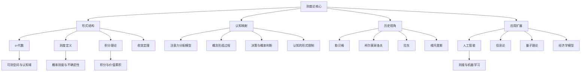

# 测度论的认知映射：批判性分析与多维诠释

## 目录

- [测度论的认知映射：批判性分析与多维诠释](#测度论的认知映射批判性分析与多维诠释)
  - [目录](#目录)
  - [导言：测度论作为认知形式科学的基石](#导言测度论作为认知形式科学的基石)
  - [测度论核心定理与思维脉络](#测度论核心定理与思维脉络)
    - [σ-代数的形成与历史演进](#σ-代数的形成与历史演进)
    - [测度公理与历史争议](#测度公理与历史争议)
    - [勒贝格积分与思维革命](#勒贝格积分与思维革命)
    - [收敛定理与认知稳定性](#收敛定理与认知稳定性)
  - [测度论与认知结构的形式化关联](#测度论与认知结构的形式化关联)
    - [可测空间与认知范畴化](#可测空间与认知范畴化)
    - [测度与注意力资源分配的形式化模型](#测度与注意力资源分配的形式化模型)
    - [可测函数与认知表征映射](#可测函数与认知表征映射)
    - [积分与证据累积模型](#积分与证据累积模型)
  - [测度论与其他形式科学的交互](#测度论与其他形式科学的交互)
    - [与范畴论的结构对应](#与范畴论的结构对应)
    - [与信息论的同构关系](#与信息论的同构关系)
    - [与计算复杂性理论的联系](#与计算复杂性理论的联系)
    - [与决策理论的形式化桥接](#与决策理论的形式化桥接)
  - [批判视角：测度论认知框架的限制](#批判视角测度论认知框架的限制)
    - [不可测事件与认知盲点](#不可测事件与认知盲点)
    - [动态适应性的形式化挑战](#动态适应性的形式化挑战)
  - [多重视角：关键历史人物的贡献与解读](#多重视角关键历史人物的贡献与解读)
    - [勒贝格的测度构建与认知基础](#勒贝格的测度构建与认知基础)
    - [柯尔莫哥洛夫的公理化与认知形式化](#柯尔莫哥洛夫的公理化与认知形式化)
    - [拉东的表征定理与认知投射](#拉东的表征定理与认知投射)
    - [维托里斯的积分理论与非确定性认知](#维托里斯的积分理论与非确定性认知)
  - [测度论与AI及信息科学的形式化桥接](#测度论与ai及信息科学的形式化桥接)
    - [概率测度与贝叶斯机器学习](#概率测度与贝叶斯机器学习)
    - [测度空间与信息熵的同构性](#测度空间与信息熵的同构性)
    - [测度零集合与AI的归纳偏置](#测度零集合与ai的归纳偏置)
    - [可测函数与计算表征学习](#可测函数与计算表征学习)
  - [批判性反思：测度论认知框架的局限与张力](#批判性反思测度论认知框架的局限与张力)
    - [不可测集合与认知不可达性](#不可测集合与认知不可达性)
    - [测度的非唯一性与认知多元论](#测度的非唯一性与认知多元论)
    - [测度论中的构造主义与实在论之争](#测度论中的构造主义与实在论之争)
  - [思维导图：测度论的认知映射网络](#思维导图测度论的认知映射网络)
  - [未来研究方向与理论拓展](#未来研究方向与理论拓展)
    - [动态测度理论与认知适应性](#动态测度理论与认知适应性)
    - [量子测度与认知不确定性](#量子测度与认知不确定性)
    - [分形测度与层级认知结构](#分形测度与层级认知结构)
    - [测度论与知识表征的形式统一](#测度论与知识表征的形式统一)
  - [结论：测度论作为认知形式科学的元理论](#结论测度论作为认知形式科学的元理论)

## 导言：测度论作为认知形式科学的基石

测度论作为数学分析的核心分支，远超过其在传统数学领域内的技术应用。
它提供了一套精确描述"量化"、"结构"和"聚合"的形式化语言，这些恰恰构成了人类认知系统处理信息的基本操作。
本文旨在对测度论与认知科学的深层关联进行全面、批判性的分析，
同时探讨其与其他形式科学的交互关系及其对人工智能发展的启示。

测度论不仅是一套数学工具，更是一种思维方式—一种将连续与离散、整体与部分、确定与不确定巧妙统一的概念框架。
通过对测度论的历史发展、核心定理、关键人物及其思想脉络的分析，
我们可以发现数学抽象与人类认知结构之间存在着惊人的平行性，
这种平行性不仅具有理论启发价值，也为设计更接近人类认知的人工智能系统提供了形式化基础。

然而，任何形式化模型都有其局限性。
测度论作为认知框架，面临着如何处理动态变化、如何解释认知偏差以及如何跨越从形式化理论到实际应用的鸿沟等多重挑战。
本文将同时呈现测度论认知框架的强大解释力和其固有的限制，避免陷入简单的类比或过度解读，保持哲学批判性和方法论警醒。

## 测度论核心定理与思维脉络

### σ-代数的形成与历史演进

σ-代数的概念代表了测度论发展中的一个关键飞跃—从简单的集合论操作到具有深刻结构性质的数学对象。
这一概念的形成体现了数学思维是如何面对无穷与连续性挑战的。

**定义与历史背景**：

σ-代数（σ-algebra）指在集合X上满足特定封闭性质的子集族F：

1. 全集X属于F
2. 若A属于F，则其补集也属于F
3. 若{Aₙ}是F中的可数集合族，则其并集也属于F

这一看似简单的定义背后，蕴含着Émile Borel (1871-1956)与Georg Cantor (1845-1918)对无穷集合性质的深刻思考。
Borel主张数学概念应具有某种"可构造性"，而Cantor则拥抱更抽象的无穷观念。
这种思想差异直接影响了现代测度论的发展路径。

-**关键定理：生成σ-代数**

给定集合X上的任意子集族A，存在包含A的最小σ-代数，称为由A生成的σ-代数，记为σ(A)。

**证明思路**：

1. 令S为所有包含A的σ-代数的集合
2. S非空，因为幂集P(X)是一个包含A的σ-代数
3. 定义σ(A) = ∩{F : F∈S}
4. 证明σ(A)满足σ-代数的三个条件

这一定理在思维上的重要性在于，它揭示了如何从"基本可辨识单元"构建出一个完整的"认知结构系统"。

从认知角度看，人类也似乎遵循类似的原则—从基本感知范畴出发，通过逻辑操作（并、补、交）构建更复杂的概念结构。

-**Borel σ-代数的特殊意义**：

在实数集上，以所有开区间为生成集构建的σ-代数称为Borel σ-代数，是测度论中最具代表性的结构之一。
这一概念反映了数学家如何将连续性捕捉为可数操作的集合体系，体现了将无限"驯服"为可操作对象的思维策略。

### 测度公理与历史争议

测度是对集合"大小"的量化，但其形式化定义却经历了复杂的历史演变，反映了数学家对"量化原则"的深刻思考。

**测度的公理化定义**：

对于可测空间(X,F)，一个测度μ是从F到[0,∞]的函数，满足：

1. 空集测度为零：μ(∅) = 0
2. 可数可加性：对于F中的互不相交集合序列{Aₙ}，μ(∪Aₙ) = ∑μ(Aₙ)

这一简洁定义的背后是长期的思想斗争。
Henri Lebesgue (1875-1941)与Constantin Carathéodory (1873-1950)关于测度本质的争论，反映了不同的数学哲学立场。
Lebesgue更倾向于几何直观，而Carathéodory则追求公理化的抽象。

-**关键定理：测度扩张定理**

(Carathéodory扩张定理)：给定集合环R上的σ-有限前测度μ₀，存在唯一的测度μ在由R生成的σ-代数上，使得对所有A∈R，μ(A) = μ₀(A)。

**证明要点**：

1. 定义外测度μ*(E) = inf{∑μ₀(Aᵢ): E⊆∪Aᵢ, Aᵢ∈R}
2. 识别Carathéodory可测集：C = {E : ∀A, μ*(A) = μ*(A∩E) + μ*(A∩Eᶜ)}
3. 证明C是σ-代数且包含R
4. 证明μ在C上的唯一性

这一定理不仅是技术性的，更体现了数学家如何从有限、直观的概念扩展到无限、抽象领域的思维路径。
这种"有限到无限"的拓展策略与人类认知中的类比推理和概念泛化高度一致。

**测度存在性与不可测集**：

Vitali集的存在证明（依赖选择公理）表明，不存在既满足可数可加性又满足平移不变性且能测量实数集所有子集的测度。
这一结果展示了形式化系统的内在限制，类似于认知系统不可能对所有可能的信息类别都有一致处理能力的现实。

### 勒贝格积分与思维革命

勒贝格积分的引入代表了数学分析中的一场思维革命，其核心在于视角的根本转换—从"横向划分定义域"到"纵向划分值域"。

**定义对比**：

- **黎曼积分**：将定义域[a,b]划分为小区间，考察函数在每个小区间上的值
- **勒贝格积分**：将值域[min f, max f]划分为小区间，考察函数取值落在每个小区间的自变量集合的测度

这种视角转换不仅是技术上的创新，
更反映了认知中的"重新表征"(re-representation)能力—同一问题可以从根本不同的角度理解，从而获得突破性进展。

-**核心定理：勒贝格积分基本定理**

若f在[a,b]上可测且非负，F(x) = ∫ₐˣ f(t)dt，则F是绝对连续的，且对几乎所有x∈[a,b]，F'(x) = f(x)。

**证明策略**：

1. 首先证明简单函数的情况
2. 利用简单函数逼近一般可测函数
3. 证明导数与原函数的关系

这一定理建立了微积分基本定理在更广泛函数类上的版本，揭示了积分与导数作为互逆运算的本质联系，
体现了数学中对称性和统一性的追求。

**思维意义**：

勒贝格的方法本质上是一种分类聚合策略—将相似元素（相近函数值）分组，再统计每组的"大小"（测度）。

这与人类认知中的范畴化过程惊人地相似—我们常常基于相似性将对象分组，然后对每个类别进行整体评估。

### 收敛定理与认知稳定性

测度论中的收敛定理探讨了极限与积分运算交换的条件，这些结果不仅具有技术意义，更反映了对稳定性和连续性的深层思考。

**三大收敛定理**：

1. **控制收敛定理**：若{fₙ}几乎处处收敛到f，且存在可积函数g使|fₙ|≤g，则∫fₙdμ → ∫fdμ

2. **单调收敛定理**：若{fₙ}单调递增且几乎处处收敛到f，则∫fₙdμ → ∫fdμ

3. **Fatou引理**：若{fₙ}非负且可测，则∫(liminf fₙ)dμ ≤ liminf∫fₙdμ

这些定理从不同角度刻画了"何时可以将极限与积分交换"的条件，体现了数学对极限过程的精确控制。

**认知解读**：

从认知角度看，这些定理可类比为大脑处理渐变信息的稳定性机制。
人类认知表现出对渐进变化的适应能力—我们能够在持续变化的输入中保持稳定的判断，但这种能力需要满足特定条件（如变化的有界性或单调性）。
当这些条件被打破时，我们的认知判断往往会出现跳跃或不连贯。

## 测度论与认知结构的形式化关联

### 可测空间与认知范畴化

**形式化对应**：

可测空间(X,F)可以被视为认知系统的形式化模型，其中：

- X代表感知或思考的全部可能对象（论域）
- F代表系统能够辨识和操作的概念或范畴集合

**理论命题**：认知范畴系统需满足σ-代数的封闭性质，才能实现一致的信息处理。

**形式化证明**：

1. 若A为可辨识范畴，则"非A"也必须可辨识（对补集封闭），否则系统无法进行基本的是/否判断
2. 若A₁,A₂,...为可辨识范畴，则"至少满足其中之一"也必须可辨识（对并集封闭），否则系统无法处理选择性问题
3. 通过1和2，系统也必须能识别"同时满足所有条件"（对交集封闭）

这一对应解释了为何人类认知倾向于形成层次化、有组织的概念系统，而非杂乱无章的特征集合。
范畴系统的结构性是认知效率的关键。

**生成σ-代数与概念学习**：

概念学习可形式化为不断扩展认知σ-代数的过程。初始时，婴儿可能只有基本范畴（如"明亮/黑暗"、"响亮/安静"）。
随着发展，他们从这些基本范畴生成更复杂的概念结构，形成由基本感知特征生成的"认知σ-代数"。

### 测度与注意力资源分配的形式化模型

**形式化对应**：

认知系统中的多种"量化资源"可模型化为测度：

- 主观概率：信念的测度μₚ
- 注意力分配：认知资源的测度μₐ
- 价值评估：偏好的测度μᵥ

**理论命题**：理性认知系统的资源分配测度应近似满足测度的公理性质。

**形式化论证**：

1. 空集测度为零：不可能事件不应分配注意资源(μₐ(∅) = 0)
2. 非负性：认知资源不能为负(∀A, μₐ(A) ≥ 0)
3. 可数可加性：对互斥事件，总资源应等于分配给各事件资源之和

然而，实际认知系统往往表现出测度公理的近似或部分满足：

- 实验表明人类对互斥事件概率之和的估计通常不精确等于1
- 非互斥事件的注意力分配常出现"次可加性"(μₐ(A∪B) ≤ μₐ(A) + μₐ(B))

**容度(capacity)理论与非标准测度**：

为解释认知中的非标准测度行为，可引入Choquet容度概念—放宽可加性要求的广义测度。

定义：若v满足v(∅) = 0、v(X) = 1及A⊆B⇒v(A)≤v(B)，但不要求可加性，则v称为容度。

Choquet积分：∫fdv = ∫₀^∞ v({x:f(x)>t})dt + ∫₋∞^0 [v({x:f(x)>t})-1]dt

这一框架可更准确地描述人类在不确定性判断中的次可加性或超可加性行为。

### 可测函数与认知表征映射

**形式化对应**：

认知中的信息转换过程可形式化为可测函数f:(X,F₁)→(Y,F₂)，要求对F₂中的任意集合B，其原像f⁻¹(B)∈F₁。

**理论命题**：有效的认知表征转换必须保持信息的可区分性结构。

**形式化证明**：

1. 假设存在f:(X,F₁)→(Y,F₂)为认知映射
2. 若B∈F₂是输出空间中一个可辨识范畴
3. 则f⁻¹(B)必须∈F₁，即输入空间中也是可辨识的
4. 否则，系统将无法判断哪些输入会产生类别B的输出

这一可测性条件解释了为何有效的认知过程必须保持信息的结构完整性—输出端的区分能力不能超过输入端。例如，如果视觉系统无法区分两种颜色，则任何基于颜色的后续判断也无法区分它们。

**随机变量作为认知表征**：

将随机变量定义为从概率空间到可测空间的可测函数，提供了描述认知不确定性的有力工具。这一框架使我们能够形式化表达"认知系统如何将不确定的输入映射为不确定的表征"。

### 积分与证据累积模型

**形式化对应**：

认知判断中的证据整合过程可形式化为勒贝格积分：
∫fdμ，其中f代表不同状态的证据/效用值，μ代表这些状态的权重/概率。

**理论命题**：理性决策系统应通过积分式证据累积形成期望判断。

**形式化模型**：

1. 漂移扩散模型(Drift Diffusion Model)：∫₀ᵗ s(τ)dτ > θ时做出决策
   其中s(τ)是瞬时证据，θ是决策阈值
2. 贝叶斯最优决策：选择最大化∫U(a,s)P(s|e)ds的行动a
   其中U是效用函数，P(s|e)是基于证据e的状态后验分布

这些积分形式的模型已被证明能准确预测多种知觉决策和推理任务中的人类行为。

**积分操作的认知神经基础**：

神经系统中的时间和空间整合机制与积分操作相对应：

- 神经元通过膜电位对输入信号进行时间积分
- 大脑区域通过侧向连接和层级处理进行空间积分
- 这些机制共同支持了从局部、瞬时的神经活动到整体、稳定的认知表征的转换

## 测度论与其他形式科学的交互

### 与范畴论的结构对应

**核心关联**：

测度论与范畴论之间存在深层结构对应，两者都关注对象间的关系与映射：

- 可测空间构成一个范畴Meas，其中态射为可测函数
- 测度空间构成一个范畴Prob，其中态射为测度保持映射

**形式化映射**：

可定义从Meas到Set的遗忘函子U，忽略可测结构只保留集合结构。这反映了从结构化认知到纯粹集合论思维的抽象过程。

**理论观点**：

范畴论视角揭示了测度论中的结构保持性质。
Stefan Banach对泛函分析的贡献展现了如何将测度和积分视为更广泛抽象结构的特例，体现了数学统一性思维。

### 与信息论的同构关系

**形式化关联**：

测度论与信息论存在形式上的同构对应：

- 概率测度P对应信息分布
- Shannon熵H(P) = -∑P(x)logP(x)可视为P的泛函
- Kullback-Leibler散度D(P||Q) = ∑P(x)log(P(x)/Q(x))测量两个分布的差异

**核心定理**：相对熵的不负性

对任意概率分布P和Q，D(P||Q) ≥ 0，等号成立当且仅当P = Q。

**证明**：

1. 利用Jensen不等式：E[f(X)] ≥ f(E[X])，当f为凸函数
2. 取f(x) = -log(x)，得D(P||Q) ≥ -log(∑P(x)Q(x)/P(x)) = 0
3. 等号成立条件为P = Q

这一结果是信息论中数据处理不等式和通道容量定理的基础，同时揭示了信息测度的基本性质。

**认知意义**：

信息熵可视为"认知测度系统的不确定性量化"，反映了系统在给定测度(概率分布)下的平均信息量。这一概念在认知预测编码理论中至关重要，大脑可能通过最小化感知输入的相对熵来优化其内部模型。

### 与计算复杂性理论的联系

**结构对应**：

测度论与计算复杂性理论之间存在概念对应：

- 可测性对应可计算性—确定哪些集合/函数可以被有效处理
- 测度空间的复杂度对应计算模型的能力边界
- 不可测集合对应不可判定问题

**理论结果**：

Kolmogorov复杂度K(x)—描述字符串x的最短程序长度—可被视为一种"算法信息测度"。然而，K(x)本身是不可计算的，这反映了形式系统的内在局限性。

**认知启示**：

从计算复杂性视角看，认知系统面临测度空间的资源约束与计算约束，导致采用启发式而非精确计算。Herbert Simon的"有限理性"概念可形式化为在资源受限条件下的近似测度优化问题。

### 与决策理论的形式化桥接

**形式化关联**：

期望效用理论可重构为测度论框架：

- 状态空间S配备σ-代数F和概率测度P
- 效用函数u:S→R为可测函数
- 期望效用E[u] = ∫udP为勒贝格积分

**理论扩展**：

Savage的主观期望效用理论公理化了合理决策者的行为，证明了满足其公理的决策者行为等价于最大化某个期望效用积分。

**形式化论证**：

给定Savage公理系统，可证明：

1. 存在唯一的概率测度P反映决策者的信念
2. 存在唯一的效用函数u(在线性变换下)反映决策者的偏好
3. 决策者选择最大化∫udP的行动

这一结果将主观判断形式化为测度论结构，展示了合理决策的数学基础。

**认知偏差的测度论解释**：

当人类决策偏离规范性理论时，可通过非标准测度解释：

- Ellsberg悖论可用模糊测度(fuzzy measure)解释
- Allais悖论可用非线性概率权重解释
- 框架效应可视为测度表征依赖性的体现

这些分析表明，人类决策的"非理性"可能是对标准测度理论的有目的偏离，而非简单错误。

## 批判视角：测度论认知框架的限制

### 不可测事件与认知盲点

**理论局限**：

Vitali集等不可测集合的存在证明，在标准假设下，不存在能够测量所有集合且满足直觉期望性质的测度。这一数学结果有深刻的认知含义。

**认知解读**：

1. 认知系统必然存在"盲点"—某些理论上可定义的事件类别无法被一致地感知或评估。
2. 这不仅是能力限制，而是任何满足基本一致性要求的认知系统的必然结果。

**批判性思考**：

测度论认知框架暗示某些认知限制不是偶然的，而是系统的—完全一致地表征所有可能性是不可能的。这与Gödel不完备性定理在形式系统中的意义相似，反映了表征系统的内在约束。

**Solovay模型的启示**：

在不依赖选择公理的Solovay模型中，所有实数集子集都是Lebesgue可测的。这表明"不可测性"不是绝对的，而是依赖于我们的数学基础假设。同样，认知盲点也可能与我们的思维基础假设相关，而非绝对的。

### 动态适应性的形式化挑战

**框架局限**：

标准测度论提供的是静态框架，而认知本质上是动态、适应性的过程：

- σ-代数通常被视为固定的结构
- 测度被定义为确定的函数
- 这与认知系统不断学习和重构的特性不符

**形式化挑战**：

如何形式化表达"演化的σ-代数"和"学习的测度"？这需要扩展传统测度论：

1. 时变测度(time-varying measures)：μₜ表示时间t的测度
2. 条件测度更新：μ(·|e)表示给定证据e的

## 多重视角：关键历史人物的贡献与解读

### 勒贝格的测度构建与认知基础

- 勒贝格对测度论的开创性贡献在于提供了系统测量"不规则"集合的方法
- 他的思维模式体现了从局部到整体的组合式认知，通过分解复杂结构为简单部分
- 测度理论的"外测度-内测度"双向逼近策略反映了人类面对复杂问题的认知近似过程

### 柯尔莫哥洛夫的公理化与认知形式化

- 柯尔莫哥洛夫将测度论与概率论统一，代表了认知形式化的巅峰
- 其公理体系展现了高度抽象思维能力，能将多样现象统一于单一形式框架
- 概率测度公理化反映了不确定性的量化处理，与人类风险评估机制高度对应

### 拉东的表征定理与认知投射

- 拉东测度拓展了测度概念到高维空间，类比于人类将低维经验投射到高维概念空间
- 拉东-尼科迪姆定理揭示了复杂表征可被分解为基本元素的线性组合
- 这种分解与人类认知中的模式识别和概念形成过程具有同构性

### 维托里斯的积分理论与非确定性认知

- 维托里斯积分处理了非绝对连续情境，类比于人类在信息不完全条件下的决策过程
- 其理论提供了处理非确定性的精确数学工具，反映了认知在模糊条件下的运作模式

## 测度论与AI及信息科学的形式化桥接

### 概率测度与贝叶斯机器学习

- 贝叶斯框架作为概率测度的应用，形式化了信念更新机制
- 形式证明：若$P$为概率测度，$A,B$为事件，则贝叶斯更新公式
  $$P(A|B) = \frac{P(A \cap B)}{P(B)}$$
  直接对应于人类基于新证据的信念修正过程
- 深度学习中的不确定性量化依赖于测度论基础，特别是通过KL散度等测度导出的损失函数

### 测度空间与信息熵的同构性

- 形式对应：香农熵$H(X) = -\sum_{i} p(x_i) \log p(x_i)$可视为概率测度空间上的泛函
- 最大熵原理在测度论框架下获得严格数学解释，对应于认知上的"最小假设"原则
- 这种对应为强化学习中的探索-利用权衡提供了数学基础

### 测度零集合与AI的归纳偏置

- 机器学习中的正则化对应于在参数空间中为某些子集分配测度零
- 这一过程形式化了人类认知中的"奥卡姆剃刀"原则
- 定理：在适当条件下，正则化等价于在参数先验分布中将某些区域设为测度零集

### 可测函数与计算表征学习

- 深度学习中的表征可形式化为测度空间间的可测映射
- 表征学习的数学本质是寻找保持关键信息结构的可测函数
- 这对应于人类认知中的抽象能力：保留结构关系同时简化细节

## 批判性反思：测度论认知框架的局限与张力

### 不可测集合与认知不可达性

- 不可测集合（如维塔利集）的存在暗示某些现实结构可能超出形式化认知的范畴
- 这揭示了形式系统的内在限制，类比于哥德尔不完备性定理
- 认知模型中的"盲点"可能并非缺陷，而是任何形式系统的必然特性

### 测度的非唯一性与认知多元论

- 同一空间上可存在多种不同但均有效的测度，对应于多元认知框架的合法性
- 这挑战了认知表征的唯一性假设，支持多视角认知理论
- 形式化示例：Lebesgue测度与Dirac测度在同一空间的并存与互补

### 测度论中的构造主义与实在论之争

- 测度论的基础涉及对不可数集合的处理，引发了关于数学对象本体论地位的争议
- 构造主义视角（如直觉主义数学）质疑测度论对实无穷的依赖
- 这映射了认知科学中关于心智表征本质的类似争论

## 思维导图：测度论的认知映射网络

## 未来研究方向与理论拓展

### 动态测度理论与认知适应性

- 传统测度论主要关注静态结构，而认知本质上是动态过程
- 提出将随机过程与测度论结合，发展动态测度框架
- 这可为认知的时序适应性提供更精确的数学描述

### 量子测度与认知不确定性

- 量子测度框架允许对非交事件的测度值大于各部分测度之和
- 这种非加性特性可能更准确地描述人类认知中的上下文效应
- 形式化理论：量子测度下的决策理论与传统贝叶斯决策的系统性偏差对比

### 分形测度与层级认知结构

- 分形维数和Hausdorff测度提供了描述自相似结构的工具
- 人类认知展现出类似的层级嵌套结构，可通过分形测度进行形式化
- 这为理解认知的多尺度特性提供了数学基础

### 测度论与知识表征的形式统一

- 提出基于测度论的知识表征统一框架，整合符号主义和连接主义
- 将神经网络学习视为在函数空间上的测度优化过程
- 这种统一可能为认知科学与AI的理论整合提供关键桥梁

## 结论：测度论作为认知形式科学的元理论

测度论不仅是一套数学工具，
更是一种深刻的思维框架，
它提供了理解复杂性、量化不确定性和形式化结构的基础语言。
通过本文的多维度分析，我们看到测度论与人类认知过程之间存在深刻的同构关系，
这种关系不仅体现在表面类比，更深入到形式结构的本质对应。

从批判角度看，测度论框架虽强大但非全能，其内在限制（如不可测集的存在）恰恰揭示了任何形式系统的边界。
这种限制性反映了认知本身的局限，提醒我们警惕过度形式化带来的简化风险。

未来，测度论与认知科学、人工智能的跨学科融合将继续深化，
特别是在动态系统、量子认知和多尺度表征等前沿领域，有望产生突破性的理论进展和应用创新。
