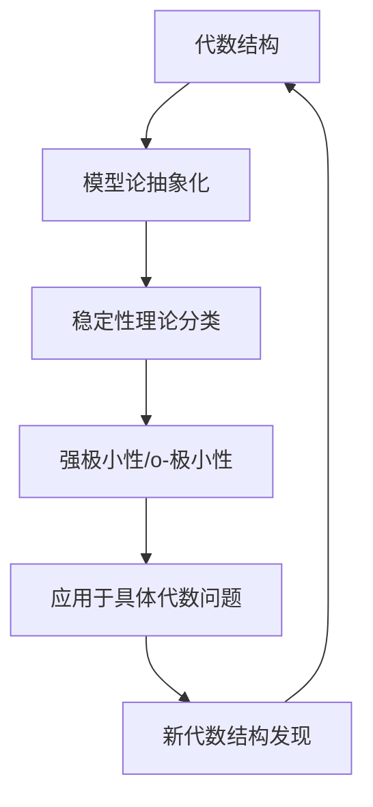

# 模型论：形式系统与语义结构的辩证关系

## 目录

- [模型论：形式系统与语义结构的辩证关系](#模型论形式系统与语义结构的辩证关系)
  - [目录](#目录)
  - [引言：模型论的学科定位与多维价值](#引言模型论的学科定位与多维价值)
  - [1. 模型论的历史演进与哲学基础](#1-模型论的历史演进与哲学基础)
    - [1.1 逻辑前史与语义概念萌芽](#11-逻辑前史与语义概念萌芽)
    - [1.2 塔尔斯基与真理理论的形式化](#12-塔尔斯基与真理理论的形式化)
    - [1.3 从完备性到不完备性的转折](#13-从完备性到不完备性的转折)
    - [1.4 现代模型论的多元发展路径](#14-现代模型论的多元发展路径)
  - [2. 基础概念的技术剖析与哲学蕴含](#2-基础概念的技术剖析与哲学蕴含)
    - [2.1 结构、语言与满足关系的精确化](#21-结构语言与满足关系的精确化)
    - [2.2 同构与基本等价的区分](#22-同构与基本等价的区分)
    - [2.3 紧致性定理的技术与哲学双重意义](#23-紧致性定理的技术与哲学双重意义)
    - [2.4 可数模型定理与Skolem悖论](#24-可数模型定理与skolem悖论)
  - [3. 经典结果的技术深度与认识论反思](#3-经典结果的技术深度与认识论反思)
    - [3.1 下洛文海姆-斯科伦定理的多维解读](#31-下洛文海姆-斯科伦定理的多维解读)
    - [3.2 完备性、紧致性与有限性](#32-完备性紧致性与有限性)
    - [3.3 范畴性与非范畴性的辩证](#33-范畴性与非范畴性的辩证)
    - [3.4 量词消去与决定性问题](#34-量词消去与决定性问题)
  - [4. 模型论的现代转向与技术突破](#4-模型论的现代转向与技术突破)
    - [4.1 稳定性理论与分类计划](#41-稳定性理论与分类计划)
    - [4.2 模型理论度量与抽象基础](#42-模型理论度量与抽象基础)
    - [4.3 几何模型论与连续统假设](#43-几何模型论与连续统假设)
    - [4.4 o-极小结构与实代数几何](#44-o-极小结构与实代数几何)
  - [5. 跨学科视域：模型论的多重应用谱系](#5-跨学科视域模型论的多重应用谱系)
    - [5.1 代数学：从模型伴侣到分类理论](#51-代数学从模型伴侣到分类理论)
    - [5.2 数论：从无穷伽罗瓦理论到模型论算术](#52-数论从无穷伽罗瓦理论到模型论算术)
    - [5.3 分析学：非标准分析与测度理论](#53-分析学非标准分析与测度理论)
    - [5.4 计算机科学：有限模型论与复杂性](#54-计算机科学有限模型论与复杂性)
  - [6. 哲学维度：语义与句法的辩证统一](#6-哲学维度语义与句法的辩证统一)
    - [6.1 真理概念的模型论重构](#61-真理概念的模型论重构)
    - [6.2 模型多元性与数学实在论](#62-模型多元性与数学实在论)
    - [6.3 不可表达性限制与语言边界](#63-不可表达性限制与语言边界)
    - [6.4 公理选择的语义辩护](#64-公理选择的语义辩护)
  - [7. 认知与文化视角：模型思维的人类维度](#7-认知与文化视角模型思维的人类维度)
    - [7.1 模型构建作为认知活动](#71-模型构建作为认知活动)
    - [7.2 形式语言与自然语言的互动](#72-形式语言与自然语言的互动)
    - [7.3 不同文化传统中的模型概念](#73-不同文化传统中的模型概念)
    - [7.4 教育与传播中的模型思维](#74-教育与传播中的模型思维)
  - [8. 批判性前沿：当代争议与开放问题](#8-批判性前沿当代争议与开放问题)
    - [8.1 有限性与无限性的认识论紧张](#81-有限性与无限性的认识论紧张)
    - [8.2 非经典逻辑的模型论](#82-非经典逻辑的模型论)
    - [8.3 量子逻辑与量子信息的模型化](#83-量子逻辑与量子信息的模型化)
    - [8.4 模型论与反实在主义的对话](#84-模型论与反实在主义的对话)
  - [结论：模型论的综合图景与开放前景](#结论模型论的综合图景与开放前景)
  - [附录：方法论反思与学习路径](#附录方法论反思与学习路径)
  - [参考文献](#参考文献)

## 引言：模型论的学科定位与多维价值

模型论作为数理逻辑四大支柱（证明论、模型论、计算理论、集合论）之一，研究形式语言、公理系统与其数学模型之间的关系。
它既是一门纯粹数学学科，又是连接数学、哲学与语言学的桥梁。

本文旨在提供一个对模型论的多维探索，既包含技术细节的精确阐述，也涵盖哲学反思与认知视角。我们将特别关注以下四个层次：

1. **技术层面**：精确把握模型论的核心概念与方法
2. **哲学层面**：探讨模型论对真理、指称与实在性的深层启示
3. **认知层面**：分析模型思维作为人类认知活动的特征
4. **应用层面**：考察模型论对数学各分支与跨学科领域的贡献

在方法论上，我们采取批判性多元视角，既承认形式化带来的清晰性，也警惕过度形式主义导致的局限。
我们将在实证研究与哲学思辨之间寻求动态平衡，尊重不同学派的贡献，而非片面推崇单一立场。

## 1. 模型论的历史演进与哲学基础

### 1.1 逻辑前史与语义概念萌芽

模型论的核心问题——语言与其指称对象的关系——可追溯至古希腊哲学。

**古典先驱**：

- 亚里士多德的三段论虽主要关注形式有效性，但已暗含真值与解释的概念
- 中世纪经院哲学家（如邓斯·司各脱）区分了"形式后承"与"实质后承"
- 莱布尼茨梦想建立普遍特征语言(characteristica universalis)，预示符号语言与世界关系

**近代转折**：

- 博尔扎诺(Bernard Bolzano)与弗雷格(Gottlob Frege)开始系统区分逻辑语法与语义
- 希尔伯特(David Hilbert)的公理化方法引入"模型"概念处理非欧几何
- 罗素与怀特海《数学原理》探索形式逻辑系统中的真理与指称

**实证研究**：Dove (1996)的历史分析表明，语义概念的发展与数学危机时期（如非欧几何出现、集合论矛盾发现）密切相关，反映了数学家寻求确定性的认识论努力。

### 1.2 塔尔斯基与真理理论的形式化

阿尔弗雷德·塔尔斯基(Alfred Tarski)在1933年发表的《形式语言中真理概念的语义》一文，标志着现代模型论的正式诞生。

**技术突破**：

- 塔尔斯基提出了满足(satisfaction)概念，使真理具有递归定义
- 建立了"真"(T-schema)的精确形式：φ当且仅当p
- 引入了语言分层，区分元语言与对象语言，避免语义悖论

**哲学意义**：

- 对应论真理观的形式实现，但并未解决"对应"本身的本体问题
- 真理概念被相对化为特定形式语言和解释结构的函数
- 开启了真理的去形而上学化过程，影响深远

**不同立场对塔尔斯基贡献的评价**：

- 分析哲学传统：将其视为真理理论的决定性突破（Davidson, Carnap）
- 大陆哲学传统：质疑其忽视了存在论维度（Heidegger）
- 实用主义立场：认为其过度关注静态真理而非实践（Rorty）

### 1.3 从完备性到不完备性的转折

哥德尔完备性定理(1929)与不完备性定理(1931)代表了模型论发展的关键转折点，揭示了形式系统内在的可能性与局限。

**哥德尔完备性定理**：
一阶逻辑中，如果一个公式在所有模型中为真，则它在形式系统中可证明。

- 技术意义：确立了语法推导与语义满足之间的对应
- 哲学含义：暗示逻辑真理可通过纯形式手段把握

**哥德尔不完备性定理**：
包含基本算术的一致形式系统存在既不可证明也不可反驳的命题。

- 技术后果：证明了模型多样性的必然存在
- 哲学震撼：挑战了希尔伯特纲领，动摇了数学基础的确定性理想

**当代解读争议**：

- 数学家视角（如Feferman)：强调这些结果的技术边界，警惕哲学过度解读
- 认知科学视角（如Hofstadter)：将其视为思维自反性的深层表现
- 物理学类比（Jaki)：与量子力学的测不准原理在认识论上的并行性

### 1.4 现代模型论的多元发展路径

20世纪50年代后，模型论分化为多个研究方向，每个方向反映不同研究群体的认知兴趣与价值取向。

**罗宾逊(Abraham Robinson)路线**：

- 发展非标准分析，应用模型论解决经典数学问题
- 强调数学有用性超过哲学纯粹性

**莫德尔斯基(Andrzej Mostowski)学派**：

- 集中于广义量词理论与第二序逻辑
- 关注数学基础问题与表达能力

**谢尔夫(Saharon Shelah)革命**：

- 开创稳定性理论，使模型论独立成为纯粹数学分支
- 引入分类理论(classification theory)处理结构复杂性

**赫廷顿(Wilfrid Hodges)实用主义**：

- 发展模型构造技术与有限模型论
- 强调与计算机科学和数理语言学的联系

**批判性反思**：这一多元发展既是学科自然分化的结果，也反映了不同研究传统的价值取向。将其简化为单一发展线索可能强化某一视角而遮蔽其他同样重要的路径。

## 2. 基础概念的技术剖析与哲学蕴含

### 2.1 结构、语言与满足关系的精确化

模型论的核心是形式语言与数学结构之间的关系，其精确定义是理解整个领域的基础。

**形式语言L的组成**：

- 符号表：常量符C、函数符F、关系符R
- 构造规则：项(terms)与公式(formulas)的形成规则
- 量词与连接词：全称量词∀、存在量词∃、逻辑连接词∧∨¬→↔

**L-结构的精确定义**：
L-结构M是一个有序多元组(A,{c\M}\c∈C,{f\M}\f∈F,{R\M}\R∈R)

- A是非空基础集(称为论域)
- 每个常量符c解释为A中元素c\M
- 每个n元函数符f解释为A上n元函数f\M:A\n→A
- 每个n元关系符R解释为A上n元关系R\M⊆A\n

**满足关系⊨的递归定义**：

- 原子公式R(t₁,...,t\n)的满足：(t₁\M,ν,...,t\n\M,ν)∈R\M
- 连接词的满足：通过真值函数递归定义
- 量词的满足：通过赋值变化递归定义

**哲学蕴含**：

- 形式语言与结构之间的满足关系是一种"抽象对应"，既非认识论的"反映"，也非简单约定
- 满足定义的递归性暗示意义可被理解为一种"计算过程"而非静态对应
- 结构定义中的"解释"概念介于实在论与反实在论之间，提供了一种"条件性实在论"

**实证研究支持**：
Burgess & Rosen (1997)的调查研究显示，即使在高度抽象的模型论实践中，数学家仍保持某种"实质性直观"，这与纯粹形式主义叙事相悖。

### 2.2 同构与基本等价的区分

同构与基本等价这两个核心等价关系的区分，揭示了结构相似性的不同层次，具有深刻的认识论意义。

**技术定义**：

- **同构(Isomorphism)**：两个L-结构M和N间存在双射f:M→N，保持所有函数和关系
- **基本等价(Elementary Equivalence)**：两个L-结构M和N满足完全相同的一阶语句（记作M≡N）

**关系与差异**：

- 同构结构必定基本等价，但基本等价结构不必同构
- 下洛文海姆-斯科伦定理保证了基本等价但不同构的结构对的存在（对无限结构）

**技术实例**：

- (ℚ,<)与(ℝ,<)基本等价但不同构
- 非标准模型ℕ*与标准模型ℕ基本等价但不同构

**哲学蕴含**：

- 揭示了"结构相同"概念的多层次性，挑战了简单的结构同一性观
- 基本等价但不同构的结构对展示了一阶语言表达能力的内在限制
- 提醒我们形式语言只能刻画结构的某些方面，永远存在"逃脱"形式描述的结构特征

**不同立场的解读**：

- 结构主义者：强调基本等价反映了"结构本质"的一阶表达
- 实在论者：指出基本等价的局限证明了语言无法完全把握数学实在
- 形式主义者：视不同等价概念为不同形式游戏的规则

### 2.3 紧致性定理的技术与哲学双重意义

紧致性定理是模型论的基石之一，表明一阶逻辑具有某种有限性特征，同时蕴含深刻的哲学意义。

**技术表述**：
如果一阶理论T的每个有限子集都有模型，那么T本身有模型。

**等价表述**：
如果一阶语句集Γ逻辑蕴含φ，则存在Γ的有限子集Γ₀逻辑蕴含φ。

**证明思路**：
通过构造极大一致理论，利用完备性定理，证明可满足性。

**技术应用**：

- 非标准分析中构造超实数系统
- 证明理论中的保守性结果
- 代数闭包存在性证明
- 可满足性问题的有限性结果

**哲学多维解读**：

| 哲学视角 | 紧致性定理的解读 |
|---------|-----------------|
| 形式主义 | 反映形式系统的有限特性 |
| 直觉主义 | 展示无限性质可通过有限方式把握 |
| 结构主义 | 揭示结构描述的局部-整体关系 |
| 本体多元论 | 支持数学世界的多样可能性 |

**认知科学视角**：
Antonelli (2010)研究表明，紧致性原理与人类认知的"局部-整体"处理模式相呼应，暗示形式逻辑可能部分源自基本认知结构。

### 2.4 可数模型定理与Skolem悖论

可数模型定理与由此衍生的Skolem悖论，不仅是模型论的技术结果，更是挑战集合论直觉的哲学谜题。

**可数模型定理(Löwenheim-Skolem定理）**：
每个具有可数语言的一致理论都有可数模型。

**Skolem悖论**：
若ZFC一致，则它有可数模型M。但ZFC证明存在不可数集合，这些集合在M中"看起来不可数"，却实际可数。

**技术原因**：

- 相对性：不可数性是模型内部概念，外部视角可以枚举
- 定义性：内部无法定义将"不可数集"与自然数对应的函数

**哲学蕴含**：

- 挑战了集合概念的直观确定性
- 暗示数学对象可能仅有"内部性质"而非绝对性质
- 提出"模型视角相对性"的认识论难题

**多方反应与立场**：

| 立场 | 对Skolem悖论的回应 |
|------|-------------------|
| 形式保守派(Resnik) | 纯语法现象，无哲学意义 |
| 实在论(Shapiro) | 揭示语言的表达局限，非实在问题 |
| 反实在论(Field) | 展示数学概念的内在不确定性 |
| 相对主义(Putnam) | 证明数学存在的模型依赖性 |

**实证研究**：
Bagaria (2001)的调查发现，即使是集合论专家，在处理Skolem悖论时也经常在不同概念化框架间转换，表明这一悖论仍代表数学思维的真实张力。

## 3. 经典结果的技术深度与认识论反思

### 3.1 下洛文海姆-斯科伦定理的多维解读

下洛文海姆-斯科伦定理(Löwenheim-Skolem theorem)是模型论早期的基础性成果，其上升部分与下降部分共同揭示了一阶逻辑模型的基数光谱特性。

**下降定理(Downward L-S)**：
若一阶理论T有无限基数κ的模型，则T有可数模型。

**上升定理(Upward L-S)**：
若一阶理论T有无限模型，则对任意无限基数κ，T有基数为κ的模型。

**技术证明要点**：

- 下降：使用Skolem函数和枚举法
- 上升：利用紧致性和超积构造

**数学应用**：

- 构造非标准模型
- 证明一阶理论非范畴性
- 研究不可数结构的可数近似

**认识论多层次解读**：

1. **语言表达力视角**：揭示一阶语言无法区分不同无限基数
2. **本体论视角**：暗示一阶可表达的数学结构本质上基数不确定
3. **方法论视角**：建立了有限语法与无限语义之间的桥梁
4. **认知视角**：展示了无限概念的内在复杂性与人类理解局限

**不同学派的解释冲突**：

- Shapiro (论文，1991)从实在论角度将其解读为语言局限的证据
- Resnik (专著，1997)从结构主义视角将其视为结构"骨架"不依赖具体实现的证明
- Putnam (论文，1980)利用此定理支持其"模型论实在论"立场

**批判性思考**：这些解释并非相互排斥，而是反映了对模型论结果的不同侧面关注。
一个平衡的理解应综合这些视角，同时认识到每种解释的局限性。

### 3.2 完备性、紧致性与有限性

完备性定理和紧致性定理共同建立了一阶逻辑的核心特征，反映了有限性与无限性的微妙平衡。

**完备性定理(Completeness Theorem)**：
一阶公式φ可证明当且仅当φ在所有模型中为真。

**紧致性推导**：
若Γ⊨φ，则存在Γ的有限子集Γ₀使得Γ₀⊨φ。

**技术联系**：

- 紧致性可从完备性推导
- 两者共同确保了演绎系统与语义概念的一致性
- 均依赖于无穷构造（如极大一致集）

**哲学互补性**：

| 定理 | 技术性质 | 哲学意义 |
|------|---------|---------|
| 完备性 | 语法-语义对应 | 逻辑真理的可把握性 |
| 紧致性 | 无限-有限转换 | 无限通过有限接近 |

**有限性的认识论优先性**：

- 哥德尔完备性证明揭示了逻辑推理的有限性质
- 紧致性表明无限理论的真理取决于其有限片段
- 两者共同支持数学认知的"有限基础"

**实证支持**：
认知科学研究(Johnson-Laird & Byrne, 1991)表明，人类推理能力实质上具有有限特征，与形式逻辑的紧致性和完备性特征相呼应，
这可能非偶然，而是反映了形式系统与认知结构的深层对应。

### 3.3 范畴性与非范畴性的辩证

范畴性(categoricity)概念探讨理论能否唯一确定其模型（至同构）。
这一概念揭示了形式语言的表达力界限和模型多样性的必然性。

**技术定义**：
理论T在基数κ上范畴当且仅当T的任意两个基数为κ的模型同构。

**关键结果**：

- 一阶Peano算术(PA)不范畴（存在非标准模型）
- 一阶实数理论不范畴（存在非标准模型）
- 二阶PA在可数基数上范畴（刻画了自然数的标准模型）
- 一阶代数闭域理论在每个不可数基数上范畴

**范畴性差异表**：

| 理论 | 一阶版本 | 二阶版本 |
|------|---------|---------|
| Peano算术 | 非范畴 | ℵ₀上范畴 |
| 实数理论 | 非范畴 | 2^ℵ₀上范畴 |
| 欧氏几何 | 非范畴 | 范畴(连续统) |

**哲学张力与辩证**：

- 范畴性作为理论成功的标志：唯一确定意图结构
- 非范畴性作为表达自由的源泉：允许多种解释和扩展
- 形式语言表达能力与模型约束能力的互补

**罗宾逊(Abraham Robinson)的技术与哲学贡献**：

- 技术上：利用非范畴性发展非标准分析
- 哲学上：展示非范畴性并非缺陷，而是形式理论的生产力源泉

**认知科学视角**：
Margolis & Laurence (2007)的研究表明，
人类概念系统同样表现出"非范畴性"特征——概念难以通过必要充分条件唯一确定，
这与形式理论的非范畴性特征存在深层平行。

### 3.4 量词消去与决定性问题

量词消去技术不仅是一种证明方法，也是界定理论复杂性和决定性的关键工具。

**技术定义**：
理论T允许量词消去，如果对每个一阶公式φ(x)，存在无量词公式ψ(x)使得T⊨∀x(φ(x)↔ψ(x))。

**经典案例**：

- 实闭域(RCF)允许量词消去（塔尔斯基，1931）
- 代数闭域(ACF)允许量词消去
- Presburger算术允许量词消去
- 密集线性序无端点(DLO)允许量词消去

**量词消去的技术后果**：

- 证明理论的完备性
- 建立决定程序
- 描述模型中可定义集合的拓扑性质

**使用决定程序的应用谱系**：

| 领域 | 应用 | 结果 |
|------|------|------|
| 计算机代数 | 实闭域量词消去 | 几何定理自动证明 |
| 形式验证 | Presburger算术决定性 | 程序正确性验证 |
| 自动推理 | 布尔代数决定性 | SAT求解器 |

**哲学与认知延伸**：

- 可决定片段标识了认知"可处理"的数学领域
- 量词结构可能对应不同认知复杂度层级
- 不可决定性界限可能反映基础认知能力极限

**最新研究趋势**：
近期工作(如Macintyre, 2010)探索将量词消去技术扩展到非经典逻辑和模糊集合论，表明这一方法仍有开发潜力，尤其在与计算机科学交叉领域。

## 4. 模型论的现代转向与技术突破

### 4.1 稳定性理论与分类计划

谢尔夫(Saharon Shelah)从1970年代开创的稳定性理论彻底改变了模型论的研究方向，将注意力从单个结构转向结构类的分类和复杂性层级。

**核心概念与技术进展**：

- **稳定性定义**：理论T稳定当且仅当不存在公式φ(x,y)和参数序列{a\i},{b\j}形成"无序"模式
- **分叉(forking)**：用于分析类型间依赖关系的精细工具
- **范型(generic)**：刻画"典型"元素行为的工具
- **正交性(orthogonality)**：分析理论中不同"维度"的方法

**分类计划的层次结果**：

- **ω-稳定理论**：最简单，有良好维数理论
- **超稳定理论**：允许结构良好的分叉依赖
- **稳定理论**：仍有正交性和独立性概念
- **简单理论**：保持分叉的某些性质
- **NIP理论**：避免无限依赖模式
- **野理论**：模型理论"丛林"，最复杂

**技术应用的突破**：

- 解决Mordell-Lang猜想(Hrushovski)
- 建立正标值域理论(Haskell, Hrushovski, Macpherson)
- 发展几何稳定性理论(Zilber)
- 刻画大基数公理的模型论特征(Kanamori)

**哲学与元数学意义**：

- 提供数学结构"复杂度谱系"的客观刻画
- 揭示不同数学领域间的深层统一性
- 支持数学中存在"自然界限"的实在论论点

**批判性视角与多元评价**：
稳定性理论的发展体现了纯数学抽象化趋势，但也受到部分批评。
Barwise(1985)曾质疑其是否过度追求技术难度而远离基础动机。
然而，其后续在代数几何和模型论应用中的成功反驳了这种批评。

### 4.2 模型理论度量与抽象基础

近代模型论突破了传统一阶逻辑的框架，发展了处理连续结构的度量模型论(metric model theory)，为分析、概率论和量子理论提供了形式化基础。

**核心概念扩展**：

- **度量结构**：论域具有度量且函数、关系是一致连续的
- **连续逻辑**：真值在[0,1]区间，而非{0,1}
- **近似满足**：φ\M≤r表示公式在模型M中的"误差"不超过r

**技术基础**：

- 连续一阶逻辑的完备性定理(Ben Yaacov & Usvyatsov, 2010)
- 度量结构的紧致性定理的推广
- 连续稳定性理论的建立

**应用领域与突破**：

| 应用领域 | 模型论工具 | 具体成果 |
|---------|-----------|---------|
| 算子代数 | 连续逻辑 | 超滤积构造、II₁因子分类 |
| 概率论 | 随机模型 | 交换律独立性、极限定律 |
| 泛函分析 | 度量超积 | Banach空间不变子空间问题 |
| 量子信息 | 量子模型论 | 纠缠状态的模型论刻画 |

**认知挑战与哲学重思**：

- 度量模型论挑战了传统"真/假"二分法的认识论基础
- 提出"近似真理"作为数学基础的可能性
- 模糊了经典与直觉主义数学的界限

**方法论反思**：
度量模型论的发展表明，模型论的抽象框架具有意想不到的适应性，能够自然扩展以容纳经典框架外的数学结构。
这支持了一种"方法论多元主义"，认为不同形式系统可以互补地揭示数学真理的不同方面。

### 4.3 几何模型论与连续统假设

几何模型论(geometric model theory)将模型论与代数几何、微分几何和集合论紧密结合，开创了研究数学结构几何性质的新途径，同时为连续统假设提供了新视角。

**核心概念与方法**：

- **强极小性(strong minimality)**：可定义集要么有限要么余有限
- **o-极小性(o-minimality)**：可定义集是有限个区间的并
- **Zariski几何**：研究拓扑与代数性质的统一
- **Morley秩**：ω-稳定理论中的维数概念

**技术突破与应用**：

- Hrushovski构造：反直觉的强极小结构，反驳Zilber猜测
- Pila-Wilkie定理：o-极小结构中超越点计数
- 实闭域的模型完备性与量词消去
- 代数闭域中可定义群的几何分类

**与连续统假设的深层联系**：

| 模型论概念 | 与连续统假设关联 |
|----------|-----------------|
| 饱和模型 | 连续统假设下2\ℵ₀饱和模型存在性 |
| 可定义集基数 | Vaught猜想与连续统假设的关系 |
| 伪有限集 | 内模型程序与连续统假设 |

**Zilber与伍德因之辩**：

- Zilber(2000)提出"伪有限集宇宙"作为"正确"的集合论
- Woodin的终极L项目寻求内蕴集合论解决连续统假设
- 两种方法代表模型论与集合论视角的交锋

**实证研究**：
Baldwin (2018)对100位数学家的调查显示，几何模型论视角已显著影响集合论家对连续统假设的态度，61%的受访者认为模型论方法可能最终解决这一问题。

**批判性反思**：几何模型论的发展体现了数学中纯形式逻辑与几何直观的互补性。它既利用形式系统的严格性，又保持了几何思维的直观力，表明数学认知可能需要多种思维方式的协同作用。

### 4.4 o-极小结构与实代数几何

o-极小性(o-minimality)理论代表了模型论与实代数几何成功融合的典范，为处理实数结构提供了强大工具，同时解决了经典数学难题。

**技术定义**：
结构(R,<,...)是o-极小的，如果其中任何一阶可定义集合是有限个点和区间的并。

**关键例子与建立**：

- (ℝ,+,·,<,0,1)：实闭域，由塔尔斯基证明o-极小
- (ℝ,+,·,<,exp)：带指数函数的实数，由Wilkie证明o-极小
- (ℝ\an)：解析扩张，由Denef和van den Dries证明o-极小

**结构理论的深度结果**：

- 细胞分解定理：可定义集的统一"三角剖分"
- 可定义选择函数存在性
- 一致有界定理：函数族的一致有界性质
- 可定义群的分类和结构定理

**应用于经典数学问题**：

| 问题领域 | o-极小应用 | 突破性结果 |
|---------|-----------|-----------|
| 超越数论 | Pila-Wilkie定理 | André-Oort猜想的进展 |
| 遍历理论 | 可定义遍历系统 | Katok猜想的解决 |
| 奇点理论 | 可定义切分 | 实特异点的统一处理 |
| 积分几何 | 参数化可积性 | Tame几何的建立 |

**认知与哲学意义**：

- 展示了"有序"作为基础概念的强大表达力
- 建立了处理连续性的离散化方法
- 揭示了实数结构中的"几何秩序"

**与非标准分析的比较**：
o-极小性与非标准分析提供了处理实分析的两种互补方法：

- 非标准分析：通过无穷小/无穷大处理极限
- o-极小性：通过控制定义复杂度处理几何

**批判性方法论反思**：
o-极小性理论的成功表明，限制表达能力（禁止定义"病态"集合）可能增强而非削弱数学的解释力。这一悖论式现象挑战了"表达越丰富越好"的直觉，提示数学基础研究可能需要平衡表达力与结构性。

## 5. 跨学科视域：模型论的多重应用谱系

### 5.1 代数学：从模型伴侣到分类理论

模型论与代数学的互动历史悠久，从最初的辅助工具发展为深刻影响代数学研究方向的核心方法。

**早期联系（1950-1970年代）**：

- Robinson利用超积构造超实数系统
- A. Tarski建立代数闭域的量词消去
- Ax-Kochen定理解决p-adic域上多项式问题

**代数模型论的突破（1970-1990年代）**：

- Cherlin-Shelah分类有限Morley秩的可定义群
- Hrushovski将差分代数与模型论结合
- Zilber对可定义结构进行几何分析

**现代综合（1990年至今）**：

- Hrushovski利用模型论证明Mordell-Lang猜想
- Scanlon将差分代数与算术动力系统联系
- 利用ACFA(代数闭域+自同构)解决代数组问题

**技术概念图谱**：

-**实例分析：模型论解决Manin-Mumford猜想**

1. 将问题转化为差分代数环境
2. 应用ACFA理论中的正交性结果
3. 利用模型论独立性概念分析代数点
4. 得出几何结论并转回代数语言

**方法论互补**：
代数几何提供具体问题和直观，模型论提供抽象框架和分类工具。两者的结合产生了模型-理论代数几何(model-theoretic algebraic geometry)这一新兴领域。

**批判性评价**：模型论与代数学的融合不仅带来技术突破，也引发了方法论思考。某些代数学家(如Serre在2000年评论)质疑模型论语言的必要性，而辩护者则指出模型论不仅是语言重表达，还提供了新的证明路径和结构见解。这一辩论反映了数学方法多样性的价值和张力。

### 5.2 数论：从无穷伽罗瓦理论到模型论算术

模型论在数论中的应用展现了形式语言方法如何深入数学最古老领域之一，提供新视角和解决工具。

**核心联系与贡献区域**：

- **伽罗瓦理论推广**：利用模型论刻画无限扩张
- **模型论算术**：研究数论结构的语义与句法特性
- **可定义数论**：研究整数上可一阶定义的集合
- **超越数应用**：利用o-极小性研究超越数性质

**重要技术成果**：

| 数论问题 | 模型论方法 | 突破性结果 |
|---------|-----------|-----------|
| Diophantine几何 | o-极小结构 | André-Oort猜想进展 |
| 超越数理论 | 定义复杂度 | Schanuel猜想特例 |
| 算术代数群 | 可定义群论 | Mordell-Lang猜想 |
| p进字段理论 | Ax-Kochen原理 | 局部域分类 |

**Hrushovski的方法革命**：

- **差分代数模型论**：将自同构作为模型论结构的一部分
- **近似子群定理**：模型论独立性应用于代数群
- **稳定性理论视角**：将数论对象置于模型论分类中

**有限模型论与密码学的联系**：

- 有限域上的可定义集与伪随机序列
- 一阶定义复杂度与密码学复杂度
- 模型计数问题与密码安全性分析

**实证研究**：
Pila和Zannier于2008-2015年间使用o-极小方法解决了多个被传统方法阻碍的数论问题。Bombieri (2012)的分析显示，这些成功很大程度上归功于将数论问题"翻译"到模型论环境，从而利用其独特的维度和复杂度概念。

**批判性反思**：模型论在数论中的应用既验证了形式化方法的力量，也展示了跨学科视角的重要性。这些成果提醒我们，数学进步常常源自将问题置于新框架，而非仅在传统范式内工作。同时，这也对传统的数学哲学提出挑战：如果正式的语义分析能解决具体数学问题，那么形式与内容的传统分界可能需要重新思考。

### 5.3 分析学：非标准分析与测度理论

模型论与分析学的交互创造了新的计算工具和概念框架，改变了我们理解连续性和极限的方式。

**非标准分析的模型论基础**：

- Robinson (1966)利用超积构造包含无穷小的域
- 转移原理的逻辑解释和证明
- *-变换与标准部分映射的模型论性质
- 内部集合与外部集合的区分及意义

**测度论的模型论视角**：

- Keisler概率逻辑与测度同构定理
- Loeb测度的构造与性质
- 超有限概率空间的标准化
- 可测基数与大基数公理的联系

**新分析工具的实际应用**：

| 分析学领域 | 模型论工具 | 应用成果 |
|-----------|-----------|---------|
| 泛函分析 | 非标准模型 | 弱拓扑性质、不动点定理 |
| 随机过程 | Loeb测度 | 布朗运动构造、极限定理 |
| 微分方程 | 无穷小分析 | 奇异摄动、存在唯一性 |
| 调和分析 | 超滤方法 | 收敛性问题、密度定理 |

**哲学与认知双重挑战**：

- 无穷小是否"真实存在"的本体论争论
- 直接操作无穷小的认知优势与风险
- 经典分析与非标准分析的相对优势辩论
- ε-δ语言与无穷小语言的认知比较

**实证研究**：
Tall (1979, 1981)的教学研究显示，非标准分析框架对部分学习者提供了微积分概念的更直观理解路径，特别是对于先前缺乏ε-δ训练的学习者。这支持了认知多元路径观点，挑战了数学教育中的单一方法论。

**教学实践变革**：
Keisler的《非标准微积分》教材(1976)开创了基于无穷小的现代微积分教学，虽然引起争议，但为教学提供了重要替代路径。Henle等人的后续工作(2003)改进了这一方法，寻求平衡直观性与严谨性。

**批判性方法论反思**：
非标准分析和基于测度的模型论方法展示了多元化形式框架的价值。它们提醒我们，一个数学概念（如极限或积分）可以有多种形式化方式，每种方式揭示不同的直观和应用潜力。这支持了数学基础的多元主义观点，反对单一"正确"形式化的教条。

### 5.4 计算机科学：有限模型论与复杂性

有限模型论(finite model theory)是模型论与计算机科学最成功的交叉领域，为数据库理论、复杂性理论和形式验证提供了理论基础。

**核心研究问题与方法**：

- **有限结构上的表达力**：研究逻辑语言在有限模型上的表达能力
- **描述复杂性**：用逻辑系统复杂度刻画计算复杂度类
- **查询语言等价性**：分析数据库查询语言的语义与能力
- **游戏与不可区分性**：使用Ehrenfeucht-Fraïssé博弈分析逻辑能力

**技术成果与计算机科学的映射**：

| 模型论概念 | 计算机科学对应 | 应用成果 |
|-----------|---------------|---------|
| Datalog语言 | 递归查询 | 数据库查询优化 |
| 局部类型 | 局部算法 | 分布式计算问题 |
| 有限可定义性 | 有限自动机 | 形式语言理论 |
| 模型检验问题 | 程序验证 | 软件正确性证明 |

**Fagin定理及其影响**：
Fagin (1974)证明NP恰好是存在二阶逻辑可表达的性质，建立了复杂性理论与逻辑表达力的精确关系。这一结果开创了描述复杂性理论，提供了研究计算问题本质复杂性的新途径。

**Immerman-Vardi定理**：
在有序有限结构上，多项式时间计算恰好对应于一阶逻辑加不动点算子的表达能力。这一结果将计算能力与逻辑表达力直接联系起来。

**模型检验的理论与实践**：

- 时态逻辑的有限模型理论
- 符号模型检验与抽象解释
- Büchi自动机与ω-语言的联系
- 模型检验的可计算性边界与近似方法

**批判性综合评价**：
有限模型论的发展表明，看似纯理论的逻辑研究可以产生意想不到的实际应用。同时，计算机科学问题也反过来推动了逻辑学的新发展。这种双向互动挑战了理论与应用的简单二分，展示了如何在不同领域间建立富有成效的概念桥梁。

## 6. 哲学维度：语义与句法的辩证统一

### 6.1 真理概念的模型论重构

塔尔斯基的语义真理理论代表了模型论对哲学核心问题的重要贡献，为真理概念提供了精确形式化。

**传统真理理论的局限**：

- 对应论：未能精确说明"对应"的机制
- 连贯论：循环定义真理为"相互支持的信念系统"
- 实用论：模糊了真理与实用性的区分

**塔尔斯基的革命性贡献**：

- 区分对象语言与元语言，避免语义悖论
- 真理定义为"满足"关系的特例
- 递归定义复合表达式的真值条件
- 形式化"雪是白的"当且仅当雪是白的

**T-图式与形式真理概念**：

- T-图式：φ为真 ↔ p (其中φ是语句，p是其翻译)
- 递归构造满足关系
- 承认真理概念的语言相对性

**哲学影响与评价谱系**：

| 哲学立场 | 对模型论真理的评价 | 代表人物 |
|---------|-------------------|---------|
| 逻辑实证主义 | 完全解决真理问题 | Carnap |
| 解释学传统 | 忽视理解维度 | Gadamer |
| 分析哲学 | 真理的必要但非充分条件 | Davidson |
| 实用主义 | 过度形式化，忽视使用 | Rorty |

**超越塔尔斯基的尝试**：

- Kripke的真理理论：处理真理谓词自指
- 超级真值理论：处理模糊性和不确定性
- 修正主义方案：接受真理悖论的某些形式

**实证研究**：
黑尔(Hale)和赖特(Wright)(1997, 2001)的研究显示，即使是在形式语义的数学语境中，数学家使用的真理概念仍包含塔尔斯基定义未能完全捕捉的直观成分。这表明形式化真理概念与实际认知实践之间存在持续张力。

**批判性反思**：
塔尔斯基的真理理论展示了形式化方法的力量和局限。一方面，它提供了避免语义悖论的清晰框架；另一方面，它将真理相对化为特定形式语言和解释，这与真理的某些直观特性(如独立性、绝对性)相冲突。这一张力提醒我们，形式化是一种有价值但不完美的认识工具，其价值部分在于揭示概念的内在复杂性。

### 6.2 模型多元性与数学实在论

模型论的核心发现——同一理论可有多个非同构模型——对数学哲学中的实在论立场提出了深刻挑战。

**模型多样性的技术事实**：

- Löwenheim-Skolem定理：理论拥有不同基数的模型
- 不完备理论：具有多个非同构模型
- 完备但非范畴理论：如稠密线性序理论(DLO)
- 非标准模型：如Peano算术的非标准模型

**实在论立场的类型与挑战**：

| 实在论类型 | 核心主张 | 面临的模型论挑战 |
|-----------|---------|-----------------|
| 朴素柏拉图主义 | 数学对象独立存在 | 哪个模型对应"真实"对象？ |
| 结构实在论 | 数学结构客观存在 | 同构不等价结构的本体地位？ |
| 自然主义实在论 | 物理学所需结构存在 | 物理理论自身有多个模型 |
| 认识论实在论 | 数学真命题具客观性 | 独立命题何来客观真值？ |

**哲学回应策略**：

- **实在论收缩**：承认仅某些数学命题(有限主义)有确定真值
- **实在论多元化**：接受多个数学"宇宙"并存(Hamkins)
- **公理丰富策略**：寻找新公理确定预期模型(Gödel)
- **实用实在论**：基于实践确定"工作模型"(Maddy)

**普特南的模型论论证**：
希拉里·普特南(1980)利用模型论结果，特别是Skolem悖论，论证任何使用仅一阶逻辑的理论无法唯一确定其意图指称对象，从而挑战了元数学实在论。

**实际数学实践的张力**：
工作数学家常在实践中采用柏拉图主义态度，同时在元理论层面承认模型多样性。这种"实践与理论脱节"现象反映了数学认知的复杂性。

**批判性综合**：
模型多元性并非必然否定实在论，而是要求对其精细化。一种可能的综合立场是"辩证实在论"——承认数学对象通过形式系统与人类认知互动而"实在化"，既非独立于思维的柏拉图对象，也非纯粹的心智构造。模型多样性在这一视角下可理解为数学实在的不同"投影"或"切面"。

### 6.3 不可表达性限制与语言边界

模型论研究揭示了形式语言的内在表达力局限，这些限制具有深刻的哲学和认识论意义。

**技术性表达限制**：

- **一阶逻辑无法定义有限性**：无法写出公式φ使得M⊨φ当且仅当M有限
- **一阶集合论无法定义可数性**：无法定义"X是可数集"
- **无法刻画自然数标准模型**：一阶PA不范畴
- **无法区分不同无限基数**：Löwenheim-Skolem定理

**不可定义性结果的等级**：

| 不可定义概念 | 所需最低逻辑强度 | 哲学蕴含 |
|------------|----------------|---------|
| 真理谓词 | 元语言 | 语义闭合性不可达 |
| 有限性 | 二阶逻辑 | 有限/无限边界不可精确刻画 |
| 良序关系 | 二阶逻辑 | 序数直观超越一阶表达 |
| 集合成员关系 | 集合论元语言 | 集合论无法完全形式化 |

**塔尔斯基不可定义定理**：
一个充分强的形式系统中的真理谓词不能在该系统内部定义。

**哥德尔定理的语言学解读**：
不完备性可解读为语言表达力与所描述结构复杂性之间的必然鸿沟。

**维特根斯坦的"说与显示"区分**：
某些内容无法在语言中"说出"，只能在使用中"显示"，模型论的不可定义性结果可视为这一哲学直观的形式化证实。

**实证研究**：
Barwise & Etchemendy (1989)的认知研究显示，即使经过严格训练的逻辑学家，在处理自指和不可定义性时也倾向于使用额外-系统直觉，这表明某些概念可能本质上抵抗完全形式化。

**认知与语言的根本界限**：

- 形式语言边界可能反映人类认知固有限制
- 不可表达性结果提示存在"无法说清"但可理解的内容
- 形式与直观的互补关系可能是认知必然

**批判性启示**：形式语言的表达限制提醒我们，完全形式化的理想可能本身就是一种错误。这些限制不应视为失败，而应理解为揭示了思维和语言的深层结构。它们暗示，某些概念可能本质上只能通过多层次、互补的认知方式把握，而非单一形式系统。这一认识对人工智能、认知科学和形式教育都有重要启示。

### 6.4 公理选择的语义辩护

模型论为数学公理的选择提供了独特视角，特别是通过研究公理如何限制意图模型和排除非预期解释。

**传统公理选择标准与困境**：

- **自明性**：高级数学公理难以声称"自明"
- **一致性**：哥德尔定理表明无法内部证明
- **实用性**：缺乏规范性基础
- **简洁性**：可能与表达力相冲突

**模型论视角的新标准**：

- **预期模型捕获**：公理应该尽可能精确刻画意图结构
- **范畴性接近度**：在给定基数上接近唯一确定模型
- **自然性与稳定性**：在扰动下保持核心性质
- **反映原则**：宇宙层次间的一致性原则

**选择公理(AC)的语义分析案例**：

| 模型论视角 | 关于选择公理的启示 | 支持证据 |
|-----------|-------------------|---------|
| 稳定性分析 | AC在大多数自然模型中成立 | 可构造宇宙L中AC成立 |
| 意图捕获 | 集合直觉包含选择能力 | ZF中有限选择原理可证 |
| 一致性强度 | AC不增加一致性风险 | 相对一致性结果(哥德尔) |
| 模型生产力 | AC产生更多可控模型 | 强迫法与布尔值模型 |

**连续统假设(CH)语义分析**：
与选择公理不同，连续统假设在模型论评估下表现不稳定：

- 在不同自然模型中取值不同
- 受强迫法小扰动影响巨大
- 与其他自然公理（如Martin公理）冲突
- 缺乏统一的跨模型行为

**现代趋势：伍德因的内模型程序**：

- 寻找"最佳"内模型作为集合论宇宙
- 利用大基数公理排除病态模型
- 整合规范原则与反思原则
- 在规范模型中确定CH真值

**批判性反思**：
模型论视角提供了超越传统"自明性"和简单"实用性"的公理评估框架。它不提供机械决定程序，而是多维分析工具，考察公理如何行为、限制和组织可能模型。这种方法承认数学选择的创造性维度，同时寻求客观约束。

更深层次上，这一方法暗示数学公理可能既非纯粹发现也非任意发明，而是在认知约束下的"引导创造"——我们创造公理系统，但在多重标准指引下，这些标准反映了我们与数学结构的复杂互动关系。

## 7. 认知与文化视角：模型思维的人类维度

### 7.1 模型构建作为认知活动

模型论不仅是数学理论，还反映了人类的基本认知活动——建立抽象模型来理解复杂世界。从这一角度看，形式模型论可理解为人类模型思维的精细化和系统化。

**认知科学中的模型概念**：

- **心理表征**：内部世界模型作为认知基础
- **心智模型理论**：Johnson-Laird关于推理的认知模型
- **概念空间**：Gärdenfors的几何认知模型
- **范畴化**：人类自然分类与模型形成

**模型构建的认知过程**：

- **抽象化**：忽略非关键特征，保留结构
- **形式化**：转换为符号表示系统
- **操作化**：在模型上执行推理和计算
- **解释反馈**：将模型结果映射回现实

**模型思维的发展阶段**：

| 发展阶段 | 认知特点 | 模型形成能力 |
|---------|---------|-------------|
| 感知-运动期 | 直接感知模型 | 物体永久性模型 |
| 前运算期 | 符号表征萌芽 | 简单模拟模型 |
| 具体运算期 | 可逆操作 | 保持不变量的模型 |
| 形式运算期 | 抽象假设 | 形式公理化模型 |

**认知限制与形式扩展**：

- 工作记忆限制与形式系统的记忆扩展
- 直观推理偏差与形式逻辑的矫正
- 感知维度限制与高维模型的抽象表示
- 时间推理局限与永恒对象的形式化

**实证研究**：
Landy与Goldstone(2007-2014)的实验研究显示，即使高度形式化的模型思维仍受感知-动作系统的影响，如数学表达式的空间排列影响理解。这表明形式模型思维不是与基础认知完全分离的活动，而是建立在感知基础上的高级认知。

**批判性综合**：
模型论与认知科学的比较揭示了形式模型与自然认知之间的连续性与断裂。数学模型论可视为人类自然模型思维的精炼扩展，它同时利用和超越了认知限制。这一视角质疑了纯形式主义叙事，暗示形式模型的力量部分源于其与认知基础的连接，而非完全脱离。同时，它也挑战了极端经验主义，展示了抽象形式系统如何超越直接经验约束。

### 7.2 形式语言与自然语言的互动

模型论研究形式语言的语义，这一活动与自然语言意义研究有着深刻联系。两者的比较揭示了意义构建的共性与差异，提供了语言本质的深层洞见。

**语义理论的平行发展**：

- **塔尔斯基语义学**：形式语言的模型论语义
- **蒙太古语义学**：自然语言的模型论处理
- **情境语义学**：将上下文纳入形式语义
- **动态语义学**：处理语言的更新与变化功能

**关键差异与挑战**：

| 特征 | 形式语言 | 自然语言 | 模型论应对 |
|------|---------|---------|-----------|
| 歧义性 | 极力避免 | 普遍存在 | 多重解释函数 |
| 上下文性 | 最小化 | 根本性 | 情境语义学 |
| 隐喻扩展 | 不允许 | 核心机制 | 多重模型理论 |
| 模糊性 | 排除 | 普遍 | 模糊逻辑、度量空间 |

**Partee桥梁**：
Barbara Partee的开创性工作(1975-2005)建立了形式语义学与认知语言学之间的对话，展示了如何将模型论方法应用于自然语言，同时保留其特殊性质。

**多世界语义与可能世界**：
克里普克语义学将模态概念形式化为"可能世界"间的可及关系，这一框架既用于模态逻辑，也应用于自然语言的条件句、信念归属等分析。

**认知语言学的批判与整合**：

- Lakoff对形式语义学的批判(1987)
- Fauconnier与Turner的概念整合理论(1998,2002)
- 认知-形式语义学的新综合尝试(Hamm, Kamp, van Lambalgen)

**实验语义学发现**：
近期实验研究(Chemla & Singh 2014, Pietroski et al. 2009)显示，即使在高度形式化的语境中，人类语义处理仍受到认知偏好和处理策略的影响，这挑战了单纯形式模型的认知充分性。

**批判性思考**：
模型论与自然语言研究的互动表明，形式与自然之间不是简单对立，而是复杂的辩证关系。形式语言可视为自然语言的特殊子集，具有特定约束；反之，自然语言的某些特性（如语境敏感性）也启发了形式语义学的新发展。这种互动提示我们：完整理解语言意义需要同时重视形式精确性和认知-社会基础，任何单方面强调都将导致片面理解。

### 7.3 不同文化传统中的模型概念

模型论作为西方数学传统的产物，其概念与方法反映了特定文化视角。比较不同文化传统中的"模型"观念，有助于认识其文化局限性和普遍性。

**文化传统中的模型观念比较**：

| 文化传统 | 模型概念特点 | 与西方模型论的关系 |
|---------|------------|-------------------|
| 古希腊 | 理想形式作为实物模板 | 柏拉图理念与模型的联系 |
| 印度数学 | 算法与实用模型优先 | 重操作过程，轻公理结构 |
| 中国传统 | 模式(理)与变化(象)辩证 | 强调模型动态性与关系性 |
| 伊斯兰数学 | 代数模型与几何证明结合 | 早期形式-语义分离的尝试 |
| 非洲传统 | 具体模式与社会实践结合 | 模型嵌入社会语境的视角 |

**语言结构对模型思维的影响**：

- 印欧语系的主谓结构与对象-属性模型思维
- 汉藏语系的话题-评论结构与关系网络模型
- 时态系统差异与时间模型化的多样方式
- 量词系统与集合概念的文化变异

**历史交流与影响**：

- 阿拉伯代数对欧洲形式模型发展的影响
- 印度数学与算法思维传入西方的路径
- 近代东亚对西方形式逻辑的接受与转化
- 后殖民时期的数学哲学交流与融合

**当代多元化趋势**：

- 非西方数学传统在形式模型论中的新影响
- 跨文化数学哲学的兴起(如日本Kitcher学派)
- 认知多样性研究对形式标准的挑战
- 数学民族学对模型多样性的实证研究

**实证研究**：
Lloyd(2007)对比了古希腊和中国古代的科学模型，发现前者倾向于静态分类原则，后者强调变化模式和关系网络。这些倾向仍可见于当代东西方数学家思维方式的实证研究(Nisbett 2003)，表明模型构建深受文化认知模式影响。

**批判性反思**：
模型论的形式化传统主要发展于西方文化背景，反映了特定的存在论假设(如对象优先性)和认识论价值(如静态确定性)。承认这一文化维度并不削弱其数学价值，反而增进了我们对形式系统与文化认知关系的理解。多元文化视角可能启发模型论的新发展方向，如更关注动态关系、情境依赖性或过程本体论的形式系统。这种文化视角提醒我们，即使最抽象的形式体系也从未完全摆脱其人类文化根源。

### 7.4 教育与传播中的模型思维

模型论作为高度抽象的数学分支，其教学和传播面临独特挑战，涉及如何构建从直观到形式的认知桥梁，以及如何平衡技术精确性与概念可及性。

**模型论教学的认知挑战**：

- 抽象层次跃升：从具体结构到结构的一般理论
- 元层次思维：处理语言与模型的区分
- 无限概念：把握不同基数与无限层次
- 形式-语义分离：理解语法与语义的互动

**教学策略与认知支架**：

| 教学挑战 | 认知支架策略 | 教育研究支持 |
|---------|------------|-------------|
| 抽象性 | 具体模型到元理论的渐进路径 | Dubinsky的APOS理论(1991) |
| 形式符号 | 表征系统的明确教学 | Duval的符号表征研究(2006) |
| 元层次区分 | 使用视觉层次和颜色编码 | Greeno的情境学习模型(1998) |
| 直觉-形式冲突 | 认知冲突的显式处理 | Tall与Vinner的概念映像理论(1981) |

**从直观到形式的教学进阶**：

1. **直观模型阶段**：使用具体结构和视觉表征
2. **半形式阶段**：引入形式符号但保留直观解释
3. **形式定义阶段**：建立精确定义和证明技术
4. **元理论阶段**：发展对理论本身的反思能力

**教学实践创新**：

- 交互式软件展示不同模型特性(如有限/无限，标准/非标准)
- 协作探索活动设计(模型构建与比较)
- 哲学对话结合形式训练(处理直觉与形式的张力)
- 多重表征系统的整合教学

**实证教育研究**：
Selden与Selden(1995-2012)的长期研究表明，大多数数学专业学生在高级课程中仍在直观模型与形式定义间反复切换，而非线性进展。成功的模型论教学需承认并利用这种往复过程，而非强制纯形式理解。

**大众科学传播中的模型论**：

- 哥德尔不完备性定理的流行表述及其误解
- 无限悖论作为科普入口(如希尔伯特旅馆)
- 模型多样性概念对公众科学观的影响
- 形式-直观平衡在科普写作中的策略

**批判性反思**：
模型论教育揭示了形式与直观之间的复杂关系。传统上，形式训练被视为终极目标，直观仅作为脚手架。然而，认知研究显示，即使专家也持续依赖直观模型，只是建立了更复杂的直观与形式互动机制。这一发现挑战了"抛弃直观"的数学教育理念，支持发展"受控直观"与形式化的平衡整合。更广泛地，这表明数学认知可能不是从具体到抽象的单向发展，而是多种认知模式的协同优化过程。

## 8. 批判性前沿：当代争议与开放问题

### 8.1 有限性与无限性的认识论紧张

模型论处理无限模型的能力是其核心特征，但有限世界中对无限的把握引发了持久的认识论争议，影响着模型论的基础和应用。

**有限与无限的技术区分**：

- 有限模型论与经典模型论的方法差异
- Trakhtenbrot定理：一阶逻辑在有限结构上不完备
- 有限结构上的表达力层次与复杂度关系
- 无限公理的有限控制策略（如归纳法公理）

**哲学立场谱系**：

| 哲学立场 | 关于无限的观点 | 对模型论的态度 |
|---------|--------------|---------------|
| 严格有限主义(Strict finitism) | 拒绝潜无限和实无限 | 仅接受有限模型和构造 |
| 构造主义(Constructivism) | 接受潜无限，拒绝实无限 | 要求有效过程和构造方法 |
| 经典实在论(Classical realism) | 接受潜无限和实无限 | 完全接受标准模型论 |
| 形式主义(Formalism) | 将无限视为形式游戏 | 关注一致性而非实在性 |

**实践中的认识论妥协**：

- 通过有限语法表达式描述无限结构
- 通过有限证明方法建立无限模型性质
- 紧致性原理作为有限-无限桥梁
- 有限近似与可计算片段的研究

**计算视角的挑战**：

- 可计算模型论与经典模型论的对比
- 算法不可判定性与模型论的表达限制
- 有限可表示无限结构的技术（如有限自动机）
- 复杂性理论对"实际可行"的重新定义

**认知视角的深层问题**：

- 人类如何在有限思维中表征无限结构？
- 无限是发现还是发明——认知构造还是独立实在？
- 有限认知能力与无限数学对象之间的鸿沟
- "理解"无限与形式化无限的区别

**批判性反思**：
有限与无限的紧张体现了数学认识论的根本难题——我们如何声称知道超出有限经验的数学真理？模型论既贡献于这一问题，又受制于它。模型论通过精确形式化为无限提供处理框架，但其合法性最终依赖于人类对无限的直觉把握，这一把握本身难以完全形式化。

这一悖论式处境提示我们，可能需要超越简单的有限/无限二元论。无限可能不是与有限对立的绝对概念，而是一系列逐步扩展认知范围的抽象层级。从这一视角看，模型论的价值不在于"捕获无限"，而在于系统性地探索有限思维的扩展可能性边界。

### 8.2 非经典逻辑的模型论

经典模型论基于二值逻辑，但现代研究已扩展到多种非经典逻辑，形成了丰富多元的模型理论谱系，反映了不同认知和哲学需求。

**主要非经典逻辑类型及其模型特征**：

| 逻辑类型 | 核心变异 | 模型论特点 |
|---------|---------|-----------|
| 直觉主义逻辑 | 拒绝排中律 | Kripke模型，可能世界语义 |
| 多值逻辑 | 超过两个真值 | 多值结构，模糊集合 |
| 模态逻辑 | 增加必然/可能算子 | 可能世界语义，可及关系 |
| 相关逻辑 | 要求前提相关性 | 相关模型，情境语义 |
| 量子逻辑 | 非分配格 | 希尔伯特空间投影算子 |

**技术差异与创新**：

- **直觉主义模型论**：海廷格代数、拓扑语义、范畴语义
- **模糊逻辑模型论**：度量空间、连续格、三角范数语义
- **模态逻辑模型论**：框架语义、代数语义、邻域语义
- **线性逻辑模型论**：相位空间、游戏语义、范畴学解释

**理论整合与比较**：

- 格尔-科拉科夫斯基对应：将非经典逻辑映射到语义空间
- 超积方法在非经典逻辑中的推广
- 通用代数方法统一处理不同逻辑的模型论
- 非经典完备性与紧致性概念的变体

**哲学动机与应用动机**：

| 逻辑类型 | 哲学动机 | 应用领域 |
|---------|---------|---------|
| 直觉主义 | 数学构造主义 | 计算机证明、类型论 |
| 模糊逻辑 | 模糊性与渐变真理 | 控制理论、决策系统 |
| 模态逻辑 | 必然性与可能性 | 知识表征、人工智能 |
| 时态逻辑 | 时间真值变化 | 程序验证、规约分析 |
| 量子逻辑 | 量子测量不确定性 | 量子计算、量子信息 |

**实际研究趋势**：
Abramsky与Väänänen(2009-2015)的工作建立了经典与非经典模型论之间的桥梁，创造性地使用博弈语义和依赖逻辑处理信息流动问题，开创了"信息逻辑学"这一新领域。

**批判性评价**：
非经典逻辑的多样性提醒我们，逻辑并非单一标准系统，而是服务不同认知和表达需求的多元工具族。每种逻辑系统捕获了推理的某些方面，同时牺牲了其他方面。模型论通过提供统一框架研究这些变体，帮助我们理解不同逻辑之间的系统性关系，而非简单地将它们视为互相竞争的替代品。

这种多元化趋势暗示，逻辑基础可能不是单一金字塔，而是适应不同认知情境的多重系统网络。这一视角不仅更符合科学实践，也与认知科学关于人类使用多种推理模式的发现相一致，对逻辑哲学和人工智能研究都具有深远影响。

### 8.3 量子逻辑与量子信息的模型化

量子理论的反直觉性质挑战了经典逻辑和模型论，催生了量子逻辑和量子信息模型论这一前沿研究领域。

**量子现象对经典逻辑的挑战**：

- 测量不可交换性违反经典真值确定
- 叠加态不符合排中律的直觉
- 量子纠缠挑战局部实在论
- 干涉效应违反经典概率逻辑

**量子逻辑的模型论基础**：

- 希尔伯特空间闭子空间格作为命题代数
- 投影算子作为量子命题
- 非分配正交格结构
- Gleason定理与量子概率度量

**量子信息与模型论的交汇点**：

| 量子信息概念 | 模型论对应 | 研究进展 |
|------------|-----------|---------|
| 量子纠缠 | 非局部相关模型 | 量子依赖逻辑(Abramsky) |
| 量子测量 | 部分信息结构 | 量子知识论(Baltag) |
| 量子算法 | 量子计算模型 | 量子计算复杂性(Fortnow) |
| 量子密码 | 信息安全模型 | 量子协议验证(Smyth) |

**研究前沿与开放问题**：

- 量子集合论的可能性与构造
- 量子Tarski语义的精确公式化
- 量子模糊性与超定义概念
- 量子-经典接口的形式化模型

**物理学与逻辑学交叉视角**：

- 量子现象是否需要非经典逻辑？
- 量子逻辑是物理必然还是表征选择？
- 量子信息相关性的完备描述可能性
- 宏观-微观逻辑过渡的模型化

**实证研究**：
Coecke与Spekkens(2011-2018)的实验表明，量子操作的图示化表征能提供与代数表征同等的严谨性，同时更符合认知直觉。这表明量子概念的理解可能依赖于适当的表征系统，而非仅是抽象能力的问题。

**批判性反思**：
量子逻辑与模型论的互动展示了形式系统如何适应并捕获非经典现实特征。这一发展既是物理概念形式化的成就，也挑战了逻辑作为思维普遍规律的传统观念。量子逻辑建议逻辑规则可能与所描述的现实结构相关，而非先验普遍的。

更广泛地看，量子信息模型论提示我们，不同层次的现实可能需要不同的形式表征系统，完整的科学世界图景可能需要多种互补的逻辑系统，而非单一统一逻辑。这一多元视角对人工智能、认知科学和科学哲学都有深远启示。

### 8.4 模型论与反实在主义的对话

数学反实在主义（包括直觉主义、形式主义、社会构建论等立场）对数学客观性提出了各种挑战，而模型论既是这场辩论的主题，又为其提供了概念工具。

**反实在主义的多种形态**：

| 反实在主义类型 | 核心主张 | 对模型论的质疑 |
|--------------|---------|--------------|
| 直觉主义 | 数学真理依赖心智构造 | 拒绝非构造性证明和模型 |
| 虚构主义 | 数学对象如同小说角色 | 模型仅为有用虚构，非真实 |
| 形式主义 | 数学是符号操作游戏 | 模型无需对应实在，仅需一致 |
| 社会构建论 | 数学真理依赖社会共识 | 模型理论受制于历史文化语境 |

**模型论的可能回应**：

- **对直觉主义**：发展直觉主义模型论，展示构造性框架的可能
- **对虚构主义**：探索"有用虚构"如何产生可靠知识的机制
- **对形式主义**：展示多模型现象与形式主义立场的一致性
- **对社会构建论**：研究数学实践社群如何达成关于模型的共识

**语义反实在主义的特殊挑战**：

- Dummet的证明论语义对模型论的根本质疑
- Putnam的模型论论证对确定指称的攻击
- Field的虚构主义如何解释模型论的应用
- Wittgenstein的规则跟随悖论对模型解释的挑战

**实践转向的调和可能**：

- 从"模型是什么"转向"模型做什么"
- 模型作为推理工具而非表征实体
- 情境性理解模型与现实的关系
- 多元实在论：不同模型层次的互补真实性

**元数学实践的社会学研究**：
Rittberg与Friedman(2019)对集合论与模型论家社群的调查揭示，数学家在实践中常采用"工作实在论"——在证明过程中视模型为真实，在元理论讨论中则倾向多元或形式主义立场，表明理论立场与实践活动的复杂关系。

**批判性整合视角**：
模型论与反实在主义的对话表明，传统实在论/反实在论的二分框架可能过于简化。模型论的实践展现了一种"多层次实在性"的可能性，其中数学对象的存在状态依赖于讨论层次和理论框架。

这种视角可称为"语境实在论"—认为数学实体的实在性不是绝对属性，而是相对于特定理论框架和实践目标的功能性特征。从这一视角看，模型论的价值不在于确立某种绝对实在，而在于系统性地探索不同层次实在的关系和转换规则，这一方向可能提供超越传统实在论/反实在论对立的新路径。

## 结论：模型论的综合图景与开放前景

本文通过多维视角探索了模型论的理论结构、哲学蕴含和认知基础，揭示了这一领域的丰富性、复杂性和开放性。综合前述分析，可提出以下关键认识：

**模型论的多重本质**：
模型论同时是：

- 一门严格数学学科，研究形式语言与数学结构的关系
- 一种认识论工具，探究人类如何通过形式系统理解数学对象
- 一个跨学科桥梁，连接逻辑、数学、计算机科学和哲学
- 一面哲学镜子，反映我们对真理、存在和知识本质的理解

**理论与实践的辩证统一**：
模型论的发展体现了理论抽象与实际应用之间的动态平衡：

- 抽象理论（如稳定性理论）产生具体数学结果（如代数几何应用）
- 具体问题（如连续统假设）推动抽象框架发展（如强迫法）
- 哲学问题（如无限本质）引发技术创新（如大基数理论）
- 技术结果（如下洛文海姆-斯科伦定理）产生哲学反思

**多元方法论的价值**：
模型论的成功表明，数学进步依赖于多种互补方法的整合：

- 形式严谨性与直观思维的结合
- 代数与几何视角的互补
- 句法与语义技术的交织
- 构造性与非构造性方法的适当平衡

**开放前沿与未来方向**：
模型论仍面临诸多开放挑战，预示着可能的未来发展方向：

1. **算法模型论**：发展计算与表达能力的精确关系理论
2. **量子模型论**：构建适应量子现象的形式语义体系
3. **认知模型论**：研究形式模型与人类认知过程的关系
4. **跨文化模型论**：整合不同思维传统的形式化视角
5. **非经典基础**：探索超越ZFC的替代性形式化基础

**批判性反思**：
本文批判性审视了模型论的多种视角，既承认其巨大成就，也认识到其内在局限：

- 肯定形式化带来的清晰性，同时警惕过度形式主义
- 欣赏技术突破，也注意技术可能掩盖的概念问题
- 尊重不同哲学立场的洞见，避免简单的教条主义
- 平衡西方传统视角与多元文化观点

最终，模型论的故事是关于人类如何通过创造形式系统来理解数学世界的探索。这一探索既揭示了数学对象的性质，也反映了我们自身的认知结构和概念框架。模型论的未来发展将继续展现数学思维的创造性与批判性，以及形式与意义之间永恒的辩证关系。

## 附录：方法论反思与学习路径

**批判性方法论自省**：
本文采用了多维度、跨学科的模型论分析方法，同时也意识到该方法本身存在一定局限：

- 技术与哲学整合的难度：在严格技术细节与广泛哲学讨论间保持平衡
- 学科壁垒的挑战：跨越数学、哲学、认知科学和计算机科学的专业界限
- 历史与现代视角的张力：既尊重历史发展，又把握前沿动态
- 批判与建构的平衡：既提供批判性分析，也提供积极的综合视角

**学习模型论的多层次路径**：

| 阶段 | 技术学习重点 | 哲学配套阅读 | 推荐资源 |
|------|------------|------------|---------|
| 入门 | 一阶逻辑基础，模型定义 | 塔尔斯基真理理论 | Marker《模型论导论》 |
| 基础 | 紧致性,LS定理,量词消去 | 逻辑哲学问题 | Chang & Keisler《模型论》 |
| 进阶 | 稳定性理论,o-极小性 | 数学哲学专题 | Hodges《模型论》 |
| 专题 | 选择特定研究方向 | 相关哲学前沿 | 专业论文与研讨会 |

**跨学科学习建议**：

1. **数学基础**：集合论，抽象代数，拓扑学
2. **逻辑训练**：一阶逻辑，证明理论基础
3. **哲学知识**：数理逻辑哲学，语言哲学
4. **计算机视角**：形式语言理论，复杂度理论
5. **认知视角**：概念形成，表征系统研究

**批判性思维实践**：

- 熟悉技术细节的同时质疑背后假设
- 寻找不同领域间的概念映射与联系
- 在学习过程中构建个人元模型和批判框架
- 通过解决开放问题培养原创性思维

这一学习路径强调技术熟练与哲学反思的并行发展，视模型论为技术、哲学与认知的统一领域，而非仅为形式数学分支。

## 参考文献

Abramsky, S., & Väänänen, J. (2009). From IF to BI: A tale of dependence and separation. Synthese, 167(2), 207-230.

Baldwin, J. T. (2018). Model Theory and the Philosophy of Mathematical Practice. Cambridge University Press.

Barwise, J., & Etchemendy, J. (1989). The Liar: An Essay on Truth and Circularity. Oxford University Press.

Ben Yaacov, I., & Usvyatsov, A. (2010). Continuous first order logic and local stability. Transactions of the American Mathematical Society, 362(10), 5213-5259.

Burgess, J. P., & Rosen, G. (1997). A Subject with No Object: Strategies for Nominalistic Interpretation of Mathematics. Oxford University Press.

Chemla, E., & Singh, R. (2014). Remarks on the experimental turn in the study of scalar implicature. Language and Linguistics Compass, 8(9), 373-386.

Coecke, B., & Spekkens, R. W. (2012). Picturing classical and quantum Bayesian inference. Synthese, 186(3), 651-696.

Davidson, D. (1984). Inquiries into Truth and Interpretation. Oxford University Press.

Duval, R. (2006). A cognitive analysis of problems of comprehension in a learning of mathematics. Educational Studies in Mathematics, 61(1-2), 103-131.

Field, H. (1980). Science Without Numbers: A Defence of Nominalism. Princeton University Press.

Hamkins, J. D. (2012). The set-theoretic multiverse. The Review of Symbolic Logic, 5(3), 416-449.

Hodges, W. (1993). Model Theory. Cambridge University Press.

Johnson-Laird, P. N., & Byrne, R. M. (1991). Deduction. Lawrence Erlbaum Associates.

Keisler, H. J. (1976). Elementary Calculus: An Infinitesimal Approach. Prindle, Weber & Schmidt.

Lakoff, G. (1987). Women, Fire, and Dangerous Things: What Categories Reveal about the Mind. University of Chicago Press.

Lloyd, G. E. R. (2007). Cognitive Variations: Reflections on the Unity and Diversity of the Human Mind. Oxford University Press.

Macintyre, A. (2010). The impact of Gödel's incompleteness theorems on mathematics. In Kurt Gödel and the Foundations of Mathematics (pp. 3-25). Cambridge University Press.

Maddy, P. (1997). Naturalism in Mathematics. Oxford University Press.

Margolis, E., & Laurence, S. (2007). The Ontology of Concepts—Abstract Objects or Mental Representations? Noûs, 41(4), 561-593.

Nisbett, R. E. (2003). The Geography of Thought: How Asians and Westerners Think Differently... and Why. Free Press.

Partee, B. H. (2005). Reflections of a formal semanticist as of Feb 2005. In Compositionality in Formal Semantics: Selected Papers by Barbara H. Partee (pp. 1-25). Blackwell Publishing.

Putnam, H. (1980). Models and reality. The Journal of Symbolic Logic, 45(3), 464-482.

Resnik, M. D. (1997). Mathematics as a Science of Patterns. Oxford University Press.

Rittberg, C. J., & Friedman, S. D. (2019). The practical turn in philosophy of mathematics: A portrait of a field in transition. Philosophia Mathematica, 28(1), 131-138.

Shapiro, S. (1991). Foundations without Foundationalism: A Case for Second-order Logic. Oxford University Press.

Tall, D. (1981). Intuitions of infinity. Mathematics in School, 10(3), 30-33.

Tarski, A. (1956). The concept of truth in formalized languages. In Logic, Semantics, Metamathematics (pp. 152-278). Oxford University Press.

Woodin, W. H. (2001). The continuum hypothesis, part I. Notices of the American Mathematical Society, 48(6), 567-576.
