# 模型论：形式语义与数学结构的多维探索

## 目录

- [模型论：形式语义与数学结构的多维探索](#模型论形式语义与数学结构的多维探索)
  - [目录](#目录)
  - [1. 导论：形式与意义的交汇](#1-导论形式与意义的交汇)
    - [1.1 模型论的本质定位](#11-模型论的本质定位)
    - [1.2 历史根源与演进轨迹](#12-历史根源与演进轨迹)
    - [1.3 元视角：模型论的认知映射](#13-元视角模型论的认知映射)
  - [2. 基础框架：语言、结构与满足关系](#2-基础框架语言结构与满足关系)
    - [2.1 形式语言的语法与语义](#21-形式语言的语法与语义)
    - [2.2 结构与解释](#22-结构与解释)
    - [2.3 满足关系与真值](#23-满足关系与真值)
    - [2.4 理论、模型与公理化](#24-理论模型与公理化)
  - [3. 核心定理与元理论性质](#3-核心定理与元理论性质)
    - [3.1 完备性定理的多维解读](#31-完备性定理的多维解读)
    - [3.2 紧致性定理及其深层隐喻](#32-紧致性定理及其深层隐喻)
    - [3.3 下洛文海姆-斯科伦定理的反直觉性](#33-下洛文海姆-斯科伦定理的反直觉性)
    - [3.4 范畴性与非范畴性的张力](#34-范畴性与非范畴性的张力)
  - [4. 模型构造的方法论谱系](#4-模型构造的方法论谱系)
    - [4.1 超积与滤子方法](#41-超积与滤子方法)
    - [4.2 消去量词技术](#42-消去量词技术)
    - [4.3 模型完备化](#43-模型完备化)
    - [4.4 强制法在模型论中的应用](#44-强制法在模型论中的应用)
  - [5. 稳定性理论与分类计划](#5-稳定性理论与分类计划)
    - [5.1 谢拉的稳定性谱系](#51-谢拉的稳定性谱系)
    - [5.2 类型空间与Morley定理](#52-类型空间与morley定理)
    - [5.3 分类理论的哲学蕴含](#53-分类理论的哲学蕴含)
  - [6. 模型论的认知维度](#6-模型论的认知维度)
    - [6.1 模型思维的认知心理学基础](#61-模型思维的认知心理学基础)
    - [6.2 形式化与语义理解的神经映射](#62-形式化与语义理解的神经映射)
    - [6.3 隐喻结构与数学创造性](#63-隐喻结构与数学创造性)
  - [7. 关联性与交叉领域](#7-关联性与交叉领域)
    - [7.1 模型论与集合论](#71-模型论与集合论)
    - [7.2 模型论与证明论](#72-模型论与证明论)
    - [7.3 模型论与递归论](#73-模型论与递归论)
    - [7.4 模型论与范畴论](#74-模型论与范畴论)
  - [8. 现代发展与研究前沿](#8-现代发展与研究前沿)
    - [8.1 几何模型论](#81-几何模型论)
    - [8.2 o-极小结构](#82-o-极小结构)
    - [8.3 连续模型论](#83-连续模型论)
    - [8.4 新兴方向与未解问题](#84-新兴方向与未解问题)
  - [9. 应用谱系与扩展视野](#9-应用谱系与扩展视野)
    - [9.1 代数学中的模型论方法](#91-代数学中的模型论方法)
    - [9.2 数论应用与Hrushovski方法](#92-数论应用与hrushovski方法)
    - [9.3 计算机科学与有限模型论](#93-计算机科学与有限模型论)
  - [10. 哲学与元理论反思](#10-哲学与元理论反思)
    - [10.1 多元观点的辩证整合](#101-多元观点的辩证整合)
    - [10.2 模型论与数学实践哲学](#102-模型论与数学实践哲学)
  - [11. 现代发展：模型论的多元交叉](#11-现代发展模型论的多元交叉)
    - [11.1 几何模型论的突破](#111-几何模型论的突破)
    - [11.2 随机结构与极限理论](#112-随机结构与极限理论)
    - [11.3 可判定性理论与计算界面](#113-可判定性理论与计算界面)
    - [11.4 元模型论的多层次视角](#114-元模型论的多层次视角)
  - [12. 综合视野：多维整合与未来发展](#12-综合视野多维整合与未来发展)
    - [12.1 方法论综合与哲学反思](#121-方法论综合与哲学反思)
    - [12.2 未来研究方向](#122-未来研究方向)
  - [13. 概念地图与可视化表征](#13-概念地图与可视化表征)
    - [13.1 多层次概念整合](#131-多层次概念整合)
    - [13.2 历史发展时间线](#132-历史发展时间线)
    - [13.3 理论间关系网络](#133-理论间关系网络)
    - [13.4 认知映射表征](#134-认知映射表征)
  - [14. 结语：模型论的多维价值](#14-结语模型论的多维价值)
  - [附录A：模型论的实践应用与扩展视角](#附录a模型论的实践应用与扩展视角)
    - [A.1 模型论在数论中的应用](#a1-模型论在数论中的应用)
    - [A.2 模型论与计算机科学](#a2-模型论与计算机科学)
    - [A.3 科学哲学与模型论](#a3-科学哲学与模型论)
    - [A.4 学习路径与教学视角](#a4-学习路径与教学视角)
  - [附录B：开放问题与研究前沿](#附录b开放问题与研究前沿)
    - [B.1 当代研究热点](#b1-当代研究热点)
    - [B.2 核心开放问题](#b2-核心开放问题)
  - [附录C：术语表与形式定义](#附录c术语表与形式定义)
    - [C.1 基础术语精确定义](#c1-基础术语精确定义)
    - [C.2 深层联系可视化](#c2-深层联系可视化)
  - [附录D：参考书目与阅读指南](#附录d参考书目与阅读指南)
    - [D.1 分级参考文献](#d1-分级参考文献)

## 1. 导论：形式与意义的交汇

### 1.1 模型论的本质定位

模型论作为数学逻辑的核心分支，处于形式符号系统与其语义解释的交界处。
它不仅仅是一门研究形式系统的语义解释的学科，更是形式与意义之间深刻关联的系统探索。

**多维界定：**

模型论可从多个视角定义，每个定义揭示其不同维度：

- **形式定义**：研究形式语言与数学结构之间满足关系的理论
- **结构定义**：研究数学结构分类及其基本特性的理论
- **语义定义**：研究形式表达式真值确定机制的理论
- **元数学定义**：研究公理系统模型特性的理论

这些定义不是互斥的，而是反映了模型论不同的研究侧重和方法论取向。

**历史人物视角的多元解读：**

| 人物 | 对模型论本质的解读 | 核心隐喻 |
|-----|-------------------|---------|
| 塔尔斯基 (Alfred Tarski) | 真理的形式理论 | 满足关系作为语言与实在的桥梁 |
| 罗宾逊 (Abraham Robinson) | 数学分支间的翻译工具 | 超结构作为微分方程的放大镜 |
| 谢拉 (Saharon Shelah) | 数学结构的分类科学 | 稳定性谱系作为结构分类周期表 |
| 马基·马基南 (Angus Macintyre) | 代数与逻辑的统一视角 | 可定义集合作为几何-逻辑界面 |
| 格罗滕迪克 (Alexander Grothendieck) | 范畴论视角下的模型理论 | 模型作为函子表示对象 |

**认识论定位：**

模型论在数学认识论中处于特殊位置——它同时是研究对象也是研究方法。
当我们使用模型论研究数论时，我们应用一种理论；
当我们研究模型论本身时，我们面临自指性挑战。
这种双重身份使模型论成为元数学思考的关键场所。

### 1.2 历史根源与演进轨迹

模型论的发展并非线性进程，而是多条思想脉络交织的复杂网络。
理解这一历史有助于我们把握学科的概念层次和方法论演化。

**四个历史阶段的多维比较：**

| 阶段 | 时期 | 主要人物 | 核心成就 | 哲学背景 | 方法特征 |
|-----|------|---------|---------|---------|---------|
| 萌芽期 | 1870s-1930s | 庞加莱、希尔伯特、勒文海姆、斯科伦 | 模型存在性，非标准模型初步 | 形式主义兴起，希尔伯特纲领 | 代数与逻辑混合，非系统化 |
| 奠基期 | 1930s-1950s | 塔尔斯基、哥德尔、马尔采夫 | 真理定义，完备性定理，紧致性定理 | 语义转向，逻辑实证主义 | 建立系统方法论，形式化严格化 |
| 经典期 | 1950s-1970s | 罗宾逊、莫利、张 | 非标准分析，范畴性理论，模型完备性 | 结构主义兴起，科学哲学转向 | 代数-拓扑方法融入，应用扩展 |
| 现代期 | 1970s至今 | 谢拉、Hrushovski、Pillay | 稳定性理论，几何模型论，o-极小性 | 多元主义，实践转向 | 几何直观增强，分类计划，交叉应用 |

**多源头融合的历史叙事：**

模型论不是单一思想线索的展开，而是多源头的融合：

1. **逻辑基础传统**：从弗雷格到塔尔斯基的形式语义学发展
2. **代数方法脉络**：从希尔伯特到罗宾逊的代数与逻辑融合
3. **集合论影响**：从康托尔到哥德尔的无限性与可数性概念
4. **哲学语义学**：从维特根斯坦到卡尔纳普的意义理论

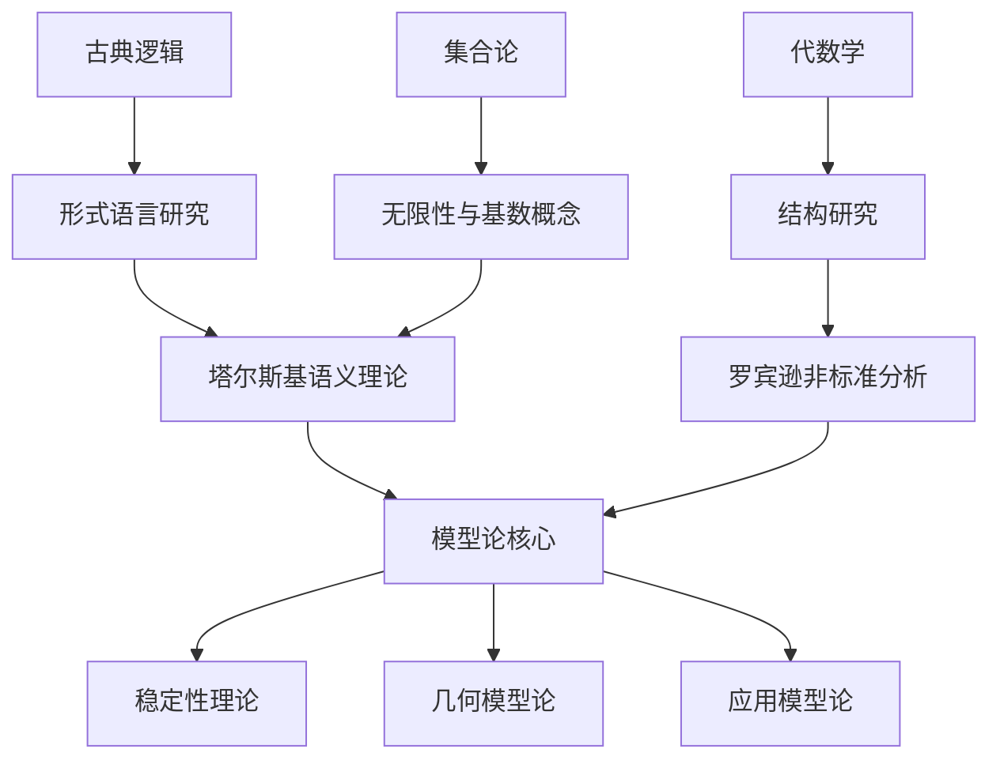

**关键转折点的认知-社会学分析：**

1. **塔尔斯基真理定义(1933)**：将语义概念形式化，克服了语义悖论
   - 认知突破：区分对象语言与元语言
   - 社会背景：维也纳学派的逻辑实证主义兴起

2. **罗宾逊非标准分析(1966)**：形式化无穷小，解决了分析学基础争议
   - 认知突破：超积构造与传递原理的应用
   - 历史意义：重新评价了莱布尼茨的无穷小概念

3. **谢拉分类理论(1970s)**：建立复杂性和结构的系统分类
   - 认知突破：从特例研究到普遍分类框架
   - 方法论转变：从构造具体模型到分析模型类特性

### 1.3 元视角：模型论的认知映射

模型论不仅是一套形式理论，也深刻反映了人类理解和表征世界的认知模式。
从元理论视角看，模型论本身可被视为一种高级认知映射。

**模型构建作为认知过程：**

形式化模型构建可类比于人类日常的概念形成过程：

1. **抽象化**：从具体实例中提取共性（类比于形式语言从现实中抽象）
2. **结构化**：建立概念间关系网络（类比于数学结构的关系系统）
3. **解释映射**：将抽象结构回映到具体情境（类比于模型满足关系）
4. **一致性检验**：验证模型是否与经验一致（类比于理论一致性）

**认知科学视角的模型论：**

| 模型论概念 | 认知科学对应 | 实验支持 |
|-----------|-------------|---------|
| 形式语言 | 内部表征系统 | 语言习得研究(Chomsky) |
| 语义解释 | 概念锚定 | 语义记忆研究(Collins & Quillian) |
| 满足关系 | 意义归属 | 概念学习实验(Rosch) |
| 非范畴性 | 概念边界模糊性 | 原型效应研究(Lakoff) |
| 模型完备性 | 认知闭包 | 完形心理学(Gestalt)发现 |

**隐喻结构与创造性思维：**

模型论的核心概念可以通过以下隐喻来理解，这些隐喻不仅有助于概念传达，也揭示了认知理解的深层机制：

- **容器隐喻**：模型作为语句"容纳"的环境
- **映射隐喻**：满足关系作为语言与结构间的"翻译"
- **力学隐喻**：理论约束作为模型上的"力"
- **生物隐喻**：理论及其模型作为"生态系统"
- **几何隐喻**：定义集作为"语义空间"中的"区域"

这些隐喻不只是教学工具，更反映了数学思维的根本特性——通过已知概念的隐喻映射来理解新概念。

## 2. 基础框架：语言、结构与满足关系

### 2.1 形式语言的语法与语义

形式语言是模型论的基础，它提供了精确描述数学对象与关系的符号系统。
形式语言的构建需要平衡表达力与可控性，反映了形式化与意义之间的永恒张力。

**形式语言的精确定义：**

一阶语言 $L$ 包含：

- **逻辑符号**：连接词 $\wedge, \vee, \neg, \rightarrow, \leftrightarrow$，量词 $\forall, \exists$，变量 $x, y, z, ...$，等号 $=$
- **非逻辑符号**：
  - 常量符号：$c_1, c_2, ...$
  - 函数符号：$f_1, f_2, ...$（每个具有特定元数）
  - 关系符号：$R_1, R_2, ...$（每个具有特定元数）

**语法规则的递归定义：**

1. **项(terms)**的形成规则：
   - 每个变量和常量符号是项
   - 若 $t_1,...,t_n$ 是项且 $f$ 是 $n$ 元函数符号，则 $f(t_1,...,t_n)$ 是项

2. **公式(formulas)**的形成规则：
   - 若 $t_1, t_2$ 是项，则 $t_1 = t_2$ 是公式（原子公式）
   - 若 $t_1,...,t_n$ 是项且 $R$ 是 $n$ 元关系符号，则 $R(t_1,...,t_n)$ 是公式（原子公式）
   - 若 $\varphi, \psi$ 是公式，则 $\neg\varphi$, $\varphi \wedge \psi$, $\varphi \vee \psi$, $\varphi \rightarrow \psi$, $\varphi \leftrightarrow \psi$ 也是公式
   - 若 $\varphi$ 是公式且 $x$ 是变量，则 $\forall x \varphi$ 和 $\exists x \varphi$ 也是公式

**语法与语义的二元性：**

形式语言的语法（符号操作规则）与语义（意义赋予）之间存在基本的二元性，
这一二元性反映了符号与指称、形式与内容之间的根本关系。

| 语法方面 | 语义方面 | 二元关系 |
|---------|---------|---------|
| 形式符号 | 指称对象 | 表征关系 |
| 推导规则 | 真值保存 | 合理性基础 |
| 语法推导 | 语义蕴含 | 完备性联系 |
| 符号操作 | 意义确定 | 解释过程 |

**历史视角的对比：**

1. **弗雷格的理解**：区分了符号的意义(Sinn)和指称(Bedeutung)
2. **卡尔纳普的观点**：语法是纯形式的，语义建立在指称理论上
3. **维特根斯坦早期**：逻辑形式与世界形式的同构关系
4. **维特根斯坦后期**：意义来自使用，而非固定指称
5. **塔尔斯基综合**：在形式系统内建立语义理论，将真理形式化

**形式化与直观的张力：**

任何形式语言都面临表达力与可控性的权衡。
过于丰富的语言可能导致悖论（如自然语言的语义悖论），而过于受限的语言则可能表达力不足。
一阶逻辑之所以成为模型论的标准语言，恰是因为它在这两方面达成了平衡：

- 足够强大以表达大部分数学内容
- 足够受控以避免核心悖论
- 具有良好的元理论性质（完备性、紧致性）

### 2.2 结构与解释

数学结构是形式语言解释的对象，它提供了符号的意义载体。
结构概念反映了现代数学的本质特征——关注关系网络而非孤立对象。

**结构的形式定义：**

$L$-结构 $\mathcal{M}$ 是一个有序组 $(M, \{c_i^{\mathcal{M}}\}, \{f_j^{\mathcal{M}}\}, \{R_k^{\mathcal{M}}\})$，其中：

- $M$ 是非空集合，称为 $\mathcal{M}$ 的论域（universe）或载体（carrier）
- 对每个常量符号 $c_i \in L$，$c_i^{\mathcal{M}} \in M$ 是其解释
- 对每个 $n$ 元函数符号 $f_j \in L$，$f_j^{\mathcal{M}}: M^n \rightarrow M$ 是其解释
- 对每个 $n$ 元关系符号 $R_k \in L$，$R_k^{\mathcal{M}} \subseteq M^n$ 是其解释

**结构的具体实例与抽象表示：**

为理解结构概念，考虑以下例子：

1. **群结构**：$\mathcal{G} = (G, \cdot, e, ^{-1})$
   - 语言：$L_G = \{·, e, ^{-1}\}$（二元函数、常量、一元函数）
   - 解释：乘法运算、单位元、逆元运算
   - 群公理可表达为 $L_G$ 中的一阶语句

2. **序结构**：$\mathcal{O} = (O, \leq)$
   - 语言：$L_O = \{\leq\}$（二元关系）
   - 解释：序关系
   - 不同公理（如偏序、全序、良序）定义不同类型的序结构

3. **环面拓扑结构**：需要高阶语言或间接表示

**同构与基本等价的区分：**

结构之间的关系有多种层次，最严格的是同构，而基本等价则是一阶逻辑无法区分的更弱关系：

- **同构(Isomorphism)**：存在一一对应 $f: M \rightarrow N$ 保持所有函数和关系
  - 形式定义：$f(c^{\mathcal{M}}) = c^{\mathcal{N}}$，$f(f_i^{\mathcal{M}}(a_1,...,a_n)) = f_i^{\mathcal{N}}(f(a_1),...,f(a_n))$，$(a_1,...,a_n) \in R_j^{\mathcal{M}} \iff (f(a_1),...,f(a_n)) \in R_j^{\mathcal{N}}$
  - 符号表示：$\mathcal{M} \cong \mathcal{N}$

- **基本等价(Elementary Equivalence)**：满足完全相同的一阶语句集
  - 形式定义：对每个一阶语句 $\varphi$，$\mathcal{M} \models \varphi \iff \mathcal{N} \models \varphi$
  - 符号表示：$\mathcal{M} \equiv \mathcal{N}$

**历史视角的结构概念演化：**

1. **传统观点(19世纪前)**：数学研究具体对象（数、图形）
2. **抽象代数观点(19世纪)**：研究对象间的操作规则（群、环、域）
3. **希尔伯特形式主义**：结构是由公理隐含定义的形式系统
4. **布尔巴基的结构主义**：数学本质是研究抽象结构
5. **范畴论视角**：通过对象间的态射网络理解结构
6. **模型论综合**：结构是语言解释的语义对象，通过满足的公理特征化

**解释的哲学深度：**

结构作为解释概念，有着多层哲学含义：

- **本体论层面**：结构是否独立存在？还是仅为符号系统的解释？
- **认识论层面**：我们如何认识非直接可感的数学结构？
- **心理学层面**：数学结构如何在认知过程中表征？
- **语义学层面**：数学符号如何获得其意义？

不同数学哲学立场提供了不同答案：

| 哲学立场 | 结构的本体地位 | 解释的性质 | 代表人物 |
|---------|--------------|-----------|---------|
| 柏拉图实在论 | 独立实在 | 发现预先存在关系 | 哥德尔 |
| 形式主义 | 符号游戏的规则 | 内部一致性构造 | 希尔伯特 |
| 直觉主义 | 心智构造 | 心智活动的产物 | 布劳威尔 |
| 结构主义 | 关系网络的抽象形式 | 关系模式的捕捉 | 夏皮罗 |
| 自然主义 | 科学实践的理想化 | 基于实践的抽象 | 马蒂亚 |

### 2.3 满足关系与真值

满足关系是模型论的核心概念，它建立了形式语言与结构之间的桥梁，定义了公式在特定结构中的真值条件。
塔尔斯基的真理理论提供了这一关系的精确形式化。

**满足关系的递归定义：**

给定结构 $\mathcal{M}$ 和赋值 $s$ (将变量映射到论域 $M$ 的元素)，
我们递归定义满足关系 $\mathcal{M} \models \varphi[s]$ (读作"$\mathcal{M}$ 在赋值 $s$ 下满足 $\varphi$")：

1. **项解释**：首先定义项 $t$ 在 $\mathcal{M}$ 中相对于 $s$ 的值 $t^{\mathcal{M}}[s]$：
   - 若 $t$ 是变量 $x$，则 $t^{\mathcal{M}}[s] = s(x)$
   - 若 $t$ 是常量 $c$，则 $t^{\mathcal{M}}[s] = c^{\mathcal{M}}$
   - 若 $t$ 是 $f(t_1,...,t_n)$，则 $t^{\mathcal{M}}[s] = f^{\mathcal{M}}(t_1^{\mathcal{M}}[s],...,t_n^{\mathcal{M}}[s])$

2. **原子公式的满足**：
   - $\mathcal{M} \models [t_1 = t_2](s)$ 当且仅当 $t_1^{\mathcal{M}}[s] = t_2^{\mathcal{M}}[s]$
   - $\mathcal{M} \models R[t_1,...,t_n](s)$ 当且仅当 $(t_1^{\mathcal{M}}[s],...,t_n^{\mathcal{M}}[s]) \in R^{\mathcal{M}}$

3. **联结词的满足**：
   - $\mathcal{M} \models [\neg\varphi](s)$ 当且仅当不是 $\mathcal{M} \models \varphi[s]$
   - $\mathcal{M} \models [\varphi \wedge \psi](s)$ 当且仅当 $\mathcal{M} \models \varphi[s]$ 且 $\mathcal{M} \models \psi[s]$
   - $\mathcal{M} \models [\varphi \vee \psi](s)$ 当且仅当 $\mathcal{M} \models \varphi[s]$ 或 $\mathcal{M} \models \psi[s]$
   - $\mathcal{M} \models [\varphi \rightarrow \psi](s)$ 当且仅当不是 $\mathcal{M} \models \varphi[s]$ 或是 $\mathcal{M} \models \psi[s]$

4. **量词的满足**：
   - $\mathcal{M} \models [\forall x \varphi](s)$ 当且仅当对所有 $a \in M$，$\mathcal{M} \models \varphi[s(x/a)]$
   - $\mathcal{M} \models [\exists x \varphi](s)$ 当且仅当存在 $a \in M$，使得 $\mathcal{M} \models \varphi[s(x/a)]$

其中 $s(x/a)$ 表示将 $x$ 映射到 $a$ 而保持其他变量赋值不变的新赋值。

**真理的形式化：**

一个句子（没有自由变量的公式）$\varphi$ 在结构 $\mathcal{M}$ 中为真，
记为 $\mathcal{M} \models \varphi$，
当且仅当对所有赋值 $s$，都有 $\mathcal{M} \models \varphi[s]$。

这个定义实现了塔尔斯基的核心洞见：真理可以在元语言中形式化定义，而避免了自引用悖论。

**满足关系的本质特征：**

1. **组合性原则**：复杂表达式的真值由其组成部分的真值确定
2. **相对性原则**：真值相对于解释结构而定，没有"绝对真理"
3. **外延性原则**：公式的满足仅依赖于其内部结构和解释，而非表达方式

**塔尔斯基的贡献与哲学影响：**

塔尔斯基的真理概念定义(1933)是语义学和逻辑的里程碑，具有多重哲学意义：

- **解决了说谎者悖论**：通过区分对象语言和元语言
- **形式化了真理概念**：使"真"成为可精确处理的概念
- **建立了语义学基础**：为后续形式语义学奠定基础
- **连接了语言与实在**：通过满足关系建立了世界与表达之间的桥梁

不同哲学传统对塔尔斯基真理理论的解读：

| 哲学传统 | 对满足关系的解读 | 核心评价 |
|---------|-----------------|---------|
| 逻辑实证主义 | 验证条件的形式化 | 使形而上学问题成为语言问题 |
| 分析哲学 | 真理条件语义学的基础 | 澄清了语言与世界的关系 |
| 现象学 | 忽视了意向性和生活世界 | 过度形式化，脱离了真实经验 |
| 后现代主义 | 仅是一种语言游戏 | 错误地假设语言透明性 |
| 认知科学 | 内部表征与外部世界的映射 | 对应于心智模型构建过程 |

**认知科学的平行视角：**

从认知角度看，满足关系概念可类比于人类的语义处理过程：

- **词汇语义激活**：类比于常量解释
- **命题态度形成**：类比于原子公式满足
- **逻辑推理过程**：类比于复合公式满足
- **量化认知能力**：类比于量词处理

神经科学研究表明，大脑可能通过分布式表征网络实现类似满足关系的语义处理，
这暗示塔尔斯基的形式化捕捉了认知的基本特征。

### 2.4 理论、模型与公理化

理论是句子集合，模型是满足理论所有句子的结构。
这一简洁定义隐藏了丰富的数学内容和哲学深度，表现了形式化方法的强大和局限。

**基本定义与性质：**

- **理论(Theory)**：语言 $L$ 的句子集合 $T$
- **模型(Model)**：满足 $T$ 中所有句子的结构 $\mathcal{M}$，记为 $\mathcal{M} \models T$
- **理论的模型类**：满足 $T$ 的所有结构构成的类 $Mod(T) = \{\mathcal{M} : \mathcal{M} \models T\}$
- **结构的理论**：结构 $\mathcal{M}$ 满足的所有句子构成的集合 $Th(\mathcal{M}) = \{\varphi : \mathcal{M} \models \varphi\}$

**理论的关键性质：**

1. **一致性(Consistency)**：$T$ 一致当且仅当不存在句子 $\varphi$ 使得 $T \vdash \varphi$ 且 $T \vdash \neg\varphi$
   - 等价地：$T$ 一致当且仅当 $T$ 有模型

2. **完备性(Completeness)**：$T$ 完备当且仅当对每个句子 $\varphi$，要么 $T \vdash \varphi$ 要么 $T \vdash \neg\varphi$
   - 等价地：任意两个 $T$ 的模型基本等价

3. **范畴性(Categoricity)**：$T$ 在基数 $\kappa$ 上范畴当且仅当 $T$ 的所有基数为 $\kappa$ 的模型都同构

**公理化方法的实例与分析：**

考察几个经典公理化理论及其模型特性：

1. **皮亚诺算术(PA)**：
   - 语言：$L_{PA} = \{0, S, +, \cdot\}$
   - 公理：继承公理

   - 公理：继承公理、加法公理、乘法公理、数学归纳公理模式
   - 模型特性：不范畴，有非标准模型
   - 哲方法论意义：第一个严格的自然数公理化，揭示了一阶逻辑表达的局限性

2. **欧几里得几何**：
   - 希尔伯特形式化：点、线、平面等为原始概念
   - 公理组：包含连接公理、序公理、全等公理、平行公理等
   - 模型多样性：不同几何（欧几里得、黎曼、罗巴切夫斯基）作为不同公理选择的模型

3. **泰勒斯的群(ZFC)**:
   - 语言：$L_{ZFC} = \{\in\}$
   - 公理：外延、空集、配对、幂集、无穷等
   - 模型特征：有不同的"宇宙"模型（可构造宇宙、科恩宇宙等）
   - 哲学困境：标准模型概念的复杂性

**公理选择的哲学标准：**

公理化不是任意过程，而是受多种标准影响的选择：

- **自明性**：公理应当在某种意义上"自明"（直观几何）
- **简洁性**：寻求最简洁的公理系统（群论）
- **丰产性**：公理应导出丰富的定理体系（ZFC）
- **优雅性**：数学美学标准（对称性、统一性）
- **意义保存**：捕捉原始概念的核心意义

**形式化的成就与局限：**

公理化方法在数学中取得了重大成就，但也面临根本性局限：

- **成就**：概念澄清、严格证明标准、揭示结构关联
- **局限**：
  1. **哥德尔不完备性**：足够强的一致理论无法形式证明自身一致性
  2. **表达局限**：一阶逻辑无法刻画某些"自然"结构（如标准自然数模型）
  3. **意义稀释**：形式化可能导致直观理解的丧失
  4. **实践差异**：实际数学研究常不遵循严格形式化路径

**理论与模型的多重关系：**

理论与模型关系体现了形式与意义间的复杂互动：

```mermaid
flowchart TD
    A[理论 T] --"解释/满足"--> B[模型 M]
    B --"抽象/形式化"--> A
    A --"约束可能解释"--> C[模型类 Mod(T)]
    D[结构 M] --"特征化"--> E[理论 Th(M)]
    F[语法推导] --"完备性定理"--> G[语义蕴含]
    H[形式化] --"双向映射"--> I[直观理解]
```

不同的数学哲学传统对这种关系有不同理解：

- **形式主义**：理论是原始的，模型是其解释
- **结构主义**：结构/模型是原始的，理论是其描述
- **柏拉图主义**：模型反映理想数学实在
- **直觉主义**：理论和模型都是心智构造

## 3. 核心定理与元理论性质

### 3.1 完备性定理的多维解读

完备性定理是模型论的奠基结果，它揭示了语法系统与语义系统的深刻联系，建立了证明与真理之间的桥梁。
此定理既是技术成就，又具有丰富的哲学含义。

**完备性定理的精确表述：**

**定理**（哥德尔完备性定理，1929）：对任意一阶理论 $T$ 和句子 $\varphi$，如果 $T \models \varphi$（在所有 $T$ 的模型中 $\varphi$ 都为真），那么 $T \vdash \varphi$（$\varphi$ 可从 $T$ 形式证明）。

等价表述：一阶理论 $T$ 一致当且仅当 $T$ 有模型。

**证明思路的关键步骤：**

1. 构造**亨金扩展**：将 $T$ 扩充为最大一致理论 $T^*$
2. 证明 $T^*$ 具有**证人属性**：若 $\exists x \varphi(x) \in T^*$，则存在常量 $c$ 使得 $\varphi(c) \in T^*$
3. 利用 $T^*$ 中的项构造**标准宇宙**
4. 定义标准宇宙上的关系和函数，构造模型 $\mathcal{M}$
5. 证明 $\mathcal{M} \models T$

**完备性定理的多重意义：**

1. **逻辑学意义**：证明了一阶逻辑的形式系统充分捕捉了其语义
2. **数学意义**：为一致性与可满足性建立了基本联系
3. **哲学意义**：显示了语法与语义之间的深层统一性
4. **元数学意义**：为证明独立性提供了方法论基础

**历史人物的不同视角：**

| 人物 | 对完备性定理的理解 | 哲学立场 |
|-----|-------------------|---------|
| 哥德尔 | 形式系统的成功 | 数学柏拉图主义 |
| 希尔伯特 | 形式化纲领的支持 | 形式主义 |
| 塔尔斯基 | 语义与语法的连接 | 语义实在论 |
| 克里普克 | 可能世界语义的基础 | 模态实在论 |
| 奎因 | 理论与世界关系的说明 | 自然主义 |

**完备性与不完备性的辩证关系：**

完备性定理与哥德尔不完备性定理常被混淆，但它们关注不同方面：

- **完备性定理**：关于一阶逻辑作为形式系统的表达充分性
- **不完备性定理**：关于形式系统的表达局限性

这种辩证关系展示了形式化的力量与边界：
   一阶逻辑完全捕捉其自身语义，但不足以完全刻画特定结构（如标准自然数模型）。

**认知和实践维度：**

完备性定理也反映了数学理解的认知结构：

- **证明作为认知过程**：形式证明反映了人类理性论证方式
- **模型作为语义表征**：模型构造反映了人类概念形成方式
- **完备性作为认知保证**：保证了这两种认知过程的协调性

在数学实践中，完备性定理支持了"模型方法"：
   通过构造模型来证明相对一致性和独立性，这成为集合论和数理逻辑的标准技术。

### 3.2 紧致性定理及其深层隐喻

紧致性定理是模型论中最强大的工具之一，它允许我们从有限情况推广到无限情况，体现了有限与无限之间的深刻联系。
这一定理不仅是技术工具，也包含了丰富的哲学隐喻。

**紧致性定理的标准表述：**

**定理**（紧致性定理）：一阶理论 $T$ 一致当且仅当 $T$ 的每个有限子集都一致。

**核心证明思路：**
可从完备性定理推导：

1. 假设 $T$ 的每个有限子集 $T_0$ 都一致
2. 由完备性定理，每个 $T_0$ 都有模型 $\mathcal{M}_{T_0}$
3. 构造超积或利用紧性拓扑性质，得到 $T$ 的模型
4. 由完备性定理的逆命题，$T$ 一致

**紧致性的等价表述：**

1. **语义表述**：$T \models \varphi$ 当且仅当存在 $T$ 的有限子集 $T_0$ 使得 $T_0 \models \varphi$
2. **模型论表述**：如果理论 $T$ 的每个有限子集都有模型，那么 $T$ 本身有模型
3. **拓扑表述**：一阶逻辑的句子空间中，可满足性集合是紧集

**应用案例与思想实验：**

1. **非标准分析**：构造包含无穷小的实数系扩展
   - 建立包含"存在无穷小"的理论
   - 证明每个有限公理子集在标准实数中可满足
   - 应用紧致性得到非标准模型

2. **不可约多项式的例子**：
   - 理论 $T$ 断言存在无限多个不可约多项式
   - 任何有限子理论只断言存在有限多个不可约多项式
   - 有限情况容易满足，因此无限情况也可满足

3. **无限拉姆齐定理**：从有限拉姆齐定理导出无限版本
   - 有限拉姆齐定理：任何足够大的图必包含一定大小的团或独立集
   - 无限拉姆齐定理：通过紧致性从有限情况扩展到无限情况

**核心隐喻与哲学延伸：**

紧致性定理蕴含多重隐喻，揭示了数学思维的深层特性：

1. **拼图隐喻**：若每个有限块拼图都能完成，则整个无限拼图可完成
2. **局部-整体隐喻**：局部一致性保证全局一致性
3. **有限-无限桥梁隐喻**：有限情况可推广至无限情况

这些隐喻反映了数学理性的核心特征之一：从有限经验合理推广到无限领域的能力。

**哲学意义的多层次分析：**

| 哲学层面 | 紧致性定理的启示 | 典型解读 |
|---------|-----------------|---------|
| 认识论 | 有限检验可确证无限主张 | 从有限证据到普遍知识的可能性 |
| 本体论 | 无限可通过有限刻画 | 无限的潜在可理解性 |
| 方法论 | 局部解决方案可扩展为全局解决方案 | 数学构造的可行性原则 |
| 形而上学 | 有限与无限的内在联系 | 连续性原则的数学表现 |

**历史与批判视角：**

紧致性思想可追溯至早期拓扑学中的紧集概念，但其逻辑应用引发了更广泛的思考：

- **哥德尔的观点**：紧致性反映了形式语言的基本限制——只能表达有限多约束
- **塔尔斯基的解释**：紧致性表明语义概念（真）与语法概念（证明）的关联方式
- **现代视角**：紧致性作为连接有限与无限的基本桥梁，体现了数学直观的核心特征

**认知科学的平行发现：**

认知科学研究表明，人类思维也依赖类似紧致性的原则：

- **样本归纳**：从有限样本推断普遍规律
- **概念构成**：有限特征组合定义无限应用的概念
- **语法生成**：有限规则生成无限语言表达

这种平行性暗示，紧致性定理可能不仅是技术结果，更捕捉了人类理性的基本结构特征。

### 3.3 下洛文海姆-斯科伦定理的反直觉性

下洛文海姆-斯科伦定理(Löwenheim-Skolem Theorem)是模型论中最令人惊讶的结果之一，揭示了形式语言表达能力的根本局限。
这一定理挑战了我们对无限的直觉理解，产生了著名的"斯科伦悖论"。

**定理的精确表述：**

**下洛文海姆-斯科伦向下定理**：如果一阶理论 $T$ 有一个无限模型，那么 $T$ 对任意无限基数 $\kappa \geq |L|$（其中 $|L|$ 是语言 $L$ 的基数）都有一个基数为 $\kappa$ 的模型。

特别地，如果 $L$ 是可数语言，且 $T$ 有无限模型，那么 $T$ 有可数模型。

**上洛文海姆-斯科伦定理**：如果理论 $T$ 有无限模型，那么对任意 $\kappa \geq |T|$，$T$ 有基数为 $\kappa$ 的模型。

**证明思路概述：**

1. **向下定理**：
   - 使用"见证函数"法选择代表元素
   - 通过紧致性和Skolem函数构造可数初等子结构

2. **向上定理**：
   - 利用紧致性添加新常量
   - 确保这些常量表示不同元素

**斯科伦悖论及其哲学冲击：**

斯科伦悖论是下定理的惊人推论：实数的标准理论（例如ZFC公理系统）有可数模型，尽管实数集本身不可数。
这看似矛盾的结果引发了深刻的哲学讨论：

- **相对性问题**："可数"和"不可数"概念被证明是模型相对的
- **语言局限性**：一阶语言无法完全刻画无限基数概念
- **内部与外部视角**：从模型内部看似不可数的集合，从外部可能是可数的

**悖论的主要解读：**

1. **形式与直观的分离**：形式逻辑系统无法完全捕捉我们的数学直观
2. **语言表达的内在局限**：一阶语言的表达力有根本局限
3. **模型理论相对主义**：数学概念的解释依赖于所选模型

**历史人物的反应与解读：**

| 人物 | 对斯科伦悖论的回应 | 哲学立场 |
|-----|-------------------|---------|
| 斯科伦本人 | 质疑集合论能否作为数学基础 | 相对主义倾向 |
| 齐米尔曼 | 区分内部与外部视角的必要性 | 模型相对主义 |
| 哥德尔 | 突出二阶逻辑的必要性 | 柏拉图主义 |
| 克里普克 | 通过刚性指称理论应对 | 模态实在论 |
| 普特南 | 作为语义外在论的例证 | 语义外在论 |

**技术推广与深化：**

下洛文海姆-斯科伦定理有多种推广形式：

1. **饱和模型理论**：构造特殊性质（如饱和性）的模型
2. **增广模型的特征理论**：研究由新符号扩充的语言模型
3. **不动点结果**：研究模型中对自身编码的可能性

**认知与直觉的启示：**

斯科伦悖论揭示了人类直观与形式系统的根本差异：

- **无限直觉的局限**：我们对无限的直观理解受认知结构限制
- **形式与意义的脱节**：形式符号无法完全捕捉意义的丰富性
- **认知表征的多层次**：需要多种表征系统才能完整把握数学概念

这些启示对认知科学和人工智能有重要意义：完全形式化系统可能无法捕捉人类数学直观的全部丰富性。

### 3.4 范畴性与非范畴性的张力

范畴性是模型论中表达结构唯一性的核心概念。
一个理论是范畴的，如果它的所有模型在某种意义上都"相同"。
研究范畴性与非范畴性揭示了形式语言描述数学结构的能力与极限。

**范畴性的精确定义：**

**定义**：理论 $T$ 在基数 $\kappa$ 上范畴，如果 $T$ 的所有基数为 $\kappa$ 的模型都同构。
特别地，$T$ 称为**完全范畴的**，如果它在所有无限基数上都范畴。

**范畴性的主要结果：**

1. **洛斯定理(Łoś Theorem, 1954)**：完全理论 $T$ 在某个无限基数 $\kappa > |L|$ 上范畴，当且仅当 $T$ 在所有 $\kappa > |L|$ 上范畴。

2. **莫利定理(Morley's Theorem, 1965)**：如果完全理论 $T$ 在某个不可数基数上范畴，则 $T$ 在所有不可数基数上范畴。

3. **非范畴性定理**：根据下洛文海姆-斯科伦定理，一阶理论如有一个无限模型，则在各种无限基数上有模型，因此不可能在所有基数上范畴。

**范畴性的典型案例分析：**

| 理论 | 范畴性状态 | 原因分析 |
|-----|-----------|---------|
| 稠密线性序(DLO) | 在所有基数上非范畴 | 可对任意无限基数构造不同模型 |
| 代数闭域 $ACF_p$ | 在每个无限基数上范畴 | 代数闭包由特征完全决定 |
| 实闭域理论 | 在每个无限基数上范畴 | 由完备消去确定唯一模型 |
| 皮亚诺算术 | 在任何无限基数上非范畴 | 存在非标准模型 |
| 二阶算术 | 完全范畴 | 二阶逻辑可唯一刻画自然数 |

**非范畴性的哲学含义：**

一阶逻辑的非范畴性表明了形式系统的内在限制：

1. **不完全刻画悖论**：我们使用有限公理系统，却希望唯一确定无限结构
2. **语言表达局限**：一阶语言不足以区分某些非同构结构
3. **形式与意向的鸿沟**：我们的意向性理解超出了形式语言表达
4. **开放性本质**：数学概念可能本质上是开放的，允许多种解释

**范畴性问题的多元视角：**

| 哲学立场 | 对范畴性的理解 | 代表性观点 |
|---------|--------------|-----------|
| 数学柏拉图主义 | 真正的数学结构应是唯一的 | 二阶逻辑更真实地反映数学实在 |
| 形式主义 | 范畴性不是必要的，一致性才重要 | 多元模型展示了形式系统的丰富性 |
| 结构主义 | 结构同构即为同一 | 范畴性是结构同一性的形式表达 |
| 概念模糊论 | 数学概念本身可能具有模糊性 | 非范畴性反映了概念的开放性 |

**方法论意义与认知映射：**

范畴性与非范畴性的张力反映了人类认知中的基本二元性：

- **精确与开放**：我们既追求概念的精确确定，又欣赏其开放可能性
- **唯一与多元**：我们既寻求唯一解释，又接受多元视角
- **完全与不完全**：我们既向往完整描述，又常常只能达成部分刻画

从认知科学视角看，一阶理论的非范畴性可能并非缺陷，而是反映了人类概念形成的基本特性——概念边界的原生开放性。
这种观点暗示，形式系统的"限制"可能恰好捕捉了人类思维的本质特征。

## 4. 模型构造的方法论谱系

### 4.1 超积与滤子方法

超积(ultraproduct)是模型论中构造复杂模型的强大工具，它将多个模型"粘合"成一个新模型，同时保留关键性质。
这一方法源于罗宾逊的工作，为非标准分析奠定了基础。

**超积的基本定义：**

给定结构族 $\{\mathcal{A}_i : i \in I\}$ 和 $I$ 上的超滤子 $\mathcal{U}$，超积 $\prod_{\mathcal{U}} \mathcal{A}_i$ 定义为：

1. **论域**：$\prod_{\mathcal{U}} A_i = \prod_{i \in I} A_i / \sim_{\mathcal{U}}$，其中 $\sim_{\mathcal{U}}$ 是等价关系：$(a_i) \sim_{\mathcal{U}} (b_i)$ 当且仅当 $\{i \in I : a_i = b_i\} \in \mathcal{U}$

2. **解释**：
   - 常量：$c^{\prod_{\mathcal{U}} \mathcal{A}_i} = [(c^{\mathcal{A}_i})]_{\mathcal{U}}$
   - 函数：$f^{\prod_{\mathcal{U}} \mathcal{A}_i}([(a_{1i})]_{\mathcal{U}},...,[(a_{ni})]_{\mathcal{U}}) = [(f^{\mathcal{A}_i}(a_{1i},...,a_{ni}))]_{\mathcal{U}}$
   - 关系：$R^{\prod_{\mathcal{U}} \mathcal{A}_i}([(a_{1i})]_{\mathcal{U}},...,[(a_{ni})]_{\mathcal{U}})$ 当且仅当 $\{i \in I : R^{\mathcal{A}_i}(a_{1i},...,a_{ni})\} \in \mathcal{U}$

**超滤子的关键性质：**

超滤子 $\mathcal{U}$ 是 $I$ 的子集族，满足：

1. $\emptyset \notin \mathcal{U}$
2. 若 $A, B \in \mathcal{U}$，则 $A \cap B \in \mathcal{U}$
3. 若 $A \in \mathcal{U}$ 且 $A \subset B \subset I$，则 $B \in \mathcal{U}$
4. 对任意 $A \subset I$，要么 $A \in \mathcal{U}$，要么 $I \setminus A \in \mathcal{U}$

超滤子本质上是一种"多数决"机制，决定超积中哪些性质被保留。

**洛斯定理(Łoś's Theorem)的形式与意义：**

**定理**（洛斯, 1955）：对任意一阶公式 $\varphi(x_1,...,x_n)$ 和元素 $[(a_{1i})]_{\mathcal{U}},...,[(a_{ni})]_{\mathcal{U}} \in \prod_{\mathcal{U}} A_i$，有：
$$\prod_{\mathcal{U}} \mathcal{A}_i \models \varphi([(a_{1i})]_{\mathcal{U}},...,[(a_{ni})]_{\mathcal{U}}) \text{ 当且仅当 } \{i \in I : \mathcal{A}_i \models \varphi(a_{1i},...,a_{ni})\} \in \mathcal{U}$$

洛斯定理确保了一阶性质从原模型转移到超积模型的方式，是超积方法威力的关键所在。

**超积应用的典型案例：**

1. **非标准分析基础**：
   - 构建超现实数 $^*\mathbb{R}$ 作为 $\mathbb{R}$ 的超幂
   - 证明超现实数中存在无穷小，证明基本定理

2. **代数应用**：
   - 证明代数闭域的结构定理
   - 构造超大素数域

3. **组合数学**：
   - 证明无限拉姆齐定理
   - 构造极端图例子

**滤子方法的哲学维度：**

超积构造反映了几个深刻的哲学维度：

- **多元视角整合**：超积可视为多个"可能世界"的综合
- **连续与离散的桥梁**：连接离散结构与连续结构
- **无限降维思想**：将复杂无限结构简化为可理解的有限片段
- **理想化极限**：超积代表某种"极限构造"，类似物理学中的理想化

**罗宾逊的贡献与数学哲学观：**

罗宾逊(Abraham Robinson, 1918-1974)发展超积方法不仅是技术成就，也体现了独特的数学哲学：

- **保守性原则**：新的数学理论应保守扩展经典理论
- **语言与实在的关系**：形式语言结构反映了数学实在的多种可能解释
- **多元实在观**：接受多种数学结构的平行有效性

**批判性反思与评估：**

超积方法既有强大优势，也面临批判：

- **构造复杂性**：需要选择公理(AC)才能保证丰富超滤子存在
- **直观距离**：构造的模型可能远离原始直观
- **操作可行性**：超积构造在实践中可能难以具体操作

然而，超积的力量在于它能够系统地将局部性质提升为全局结构，这种"局部-全局"转换能力使其成为模型论中的核心方法。

### 4.2 消去量词技术

消去量词(quantifier elimination)是模型论中最有效的决策工具之一，它通过证明任何公式等价于无量词公式，大幅简化了理论的语义分析。
这一技术不仅提供了算法决策程序，还揭示了数学结构的内在简洁性。

**基本定义与原理：**

**定义**：理论 $T$ 允许消去量词，如果对每个公式 $\varphi(x_1,...,x_n)$，存在无量词公式 $\psi(x_1,...,x_n)$，使得 $T \models \forall x_1,...,x_n(\varphi(x_1,...,x_n) \leftrightarrow \psi(x_1,...,x_n))$。

**核心原理**：

1. 将复杂公式归约为原子公式的布尔组合
2. 证明存在量词作用于原子公式可转换为无量词表达
3. 递归应用转换直至消除所有量词

**经典实例及证明轮廓：**

1. **实闭域理论(RCF)**：
   - 关键等价变换：$\exists y(y^2 = x) \leftrightarrow x \geq 0$
   - 通用消去方法：基于Sturm序列分析多项式符号变化
   - 塔尔斯基-赛登伯格(Tarski-Seidenberg)定理：半代数集是可定义的

2. **代数闭域(ACF)**：
   - 基本等价：$\exists y(a_n y^n + ... + a_0 = 0) \leftrightarrow (a_n \neq 0 \vee ... \vee a_0 \neq 0)$
   - 证明思路：利用代数闭性，任何非平凡多项式有根
   - 结构结果：基本等价类由特征完全决定

3. **普莱斯利算术(PA)**：
   - 消去策略：使用整除关系表达模算术等价
   - 整体证明：基于中国剩余定理的系统化应用

**证明技术谱系：**

消去量词证明有多种技术路径，反映了不同数学传统：

| 技术方法 | 适用领域 | 核心思想 | 典型应用 |
|---------|---------|---------|---------|
| 替代法 | 简单线性理论 | 直接替换量词为等价表达式 | 稠密线性序 |
| 分析法 | 代数结构 | 基于代数不变量消去 | 代数闭域 |
| 分解法 | 几何结构 | 将空间分解为有限单元 | 实闭域 |
| 模型完备化 | 复杂结构 | 通过添加函数符号隐式消除量词 | o-极小结构 |

**算法与决策性：**

消去量词直接联系到决策问题：

**定理**：如果理论 $T$ 允许有效消去量词，且 $T$ 中原子公式的真值可有效判定，则 $T$ 是可判定的。

这一联系使得消去量词成为证明理论可判定性的标准技术，产生了重要算法：

- 实闭域的柱状代数分解算法
- 布尔代数的取值方法
- 线性实算术的单纯性算法

**哲学与认知含义：**

消去量词成功的深层意义：

1. **本质简化**：表面复杂的数学结构可能有惊人简单的核心
2. **层次压缩**：无限量词嵌套可归约为有限层次
3. **认知经济**：复杂问题可转化为更直观的问题
4. **决定论哲学**：某些数学领域具有完全算法确定性

**历史人物贡献与视角：**

| 人物 | 核心贡献 | 哲学立场 |
|-----|---------|---------|
| 塔尔斯基 | 实数代数理论的消去量词 | 数学真理的普遍可达性 |
| 罗宾逊 | 将消去量词与模型完备性联系 | 数学结构的多重解释 |
| 范德瓦尔登 | 为代数闭域提供简洁证明 | 代数与逻辑的统一视角 |
| 罗杰斯 | 消去量词与可计算性关系 | 算法决定论 |

**批判与局限性：**

尽管强大，消去量词技术也面临重要局限：

- **计算复杂性**：虽然理论可判定，但实际算法可能极其复杂
- **适用范围**：许多自然数学理论不允许完全消去量词
- **表达距离**：无量词形式可能失去原公式的直观意义

从认知视角看，这些局限反映了表达简洁性与直观理解之间的根本张力，提醒我们任何形式化方法都有其自然边界。

### 4.3 模型完备化

模型完备化(Model Completion)是处理理论"碎片"的系统方法，通过添加适当公理使"局部"理论扩展为"全局"理论。
这一技术源于罗宾逊的工作，已成为构建和分析模型的核心策略。

**基本定义与框架：**

假设 $T$ 是语言 $L$ 的一阶理论：

- **理论 $T^*$ 是 $T$ 的模型伙伴(Model Companion)**，如果：
  1. $T$ 和 $T^*$ 有相同的通用模型
  2. $T^*$ 是模型完备的（每个公式等价于正负原子公式的布尔组合）

- **理论 $T^*$ 是 $T$ 的模型完备化(Model Completion)**，如果：
  1. $T^*$ 是 $T$ 的模型伙伴
  2. 对任意 $T$ 的模型 $\mathcal{A}$，$T^* \cup Diag(\mathcal{A})$ 是完备理论

其中 $Diag(\mathcal{A})$ 是 $\mathcal{A}$ 的基本图，即 $\mathcal{A}$ 满足的所有原子句和否定原子句。

**罗宾逊图测试的

**罗宾逊图测试的核心原理：**

**定理**（罗宾逊图测试）：理论 $T^*$ 是 $T$ 的模型完备化当且仅当：

1. $T^*$ 是 $T$ 的模型伙伴
2. 对任意 $T$ 的模型 $\mathcal{A}$、$\mathcal{B}$，若 $\mathcal{A} \subseteq \mathcal{B}$ 且 $\mathcal{B} \models T^*$，则 $\mathcal{A}$ 能嵌入到 $T^*$ 的某个模型中

这一测试提供了验证模型完备化的实用标准，强调了"局部到全局"扩展的核心特性。

**经典案例分析：**

1. **域理论的模型完备化**：
   - 基础理论 $T$：域公理
   - 模型完备化 $T^*$：代数闭域理论ACF
   - 证明关键：任何域都可嵌入代数闭域
   - 哲学意义：代数闭包是域的"自然完备化"

2. **线性序的模型完备化**：
   - 基础理论 $T$：线性序公理
   - 模型完备化 $T^*$：稠密无端点线性序(DLO)
   - 证明思路：任何线性序可嵌入稠密线性序
   - 认知映射：连续性直觉的形式化

3. **群论与交换群**：
   - 基础理论：群论无模型完备化
   - 原因分析：群的嵌入性质过于复杂
   - 阿贝尔群情况：可分阿贝尔群有模型完备化

**方法论框架与哲学映射：**

模型完备化体现了数学方法中的深层模式：

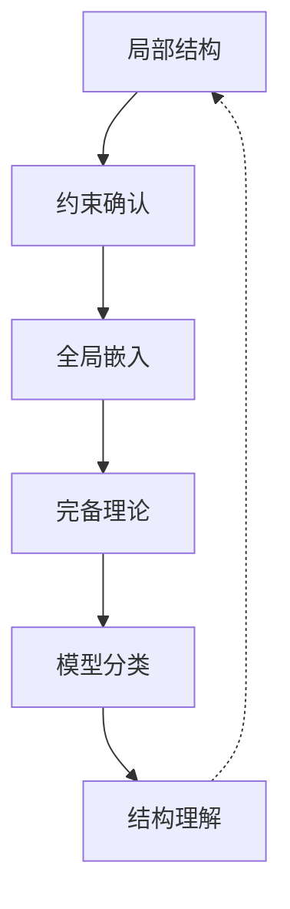

这一循环反映了从局部到全局、从具体到抽象、从片段到整体的认识论路径，与科学方法中的一般模式高度平行。

**批判视角与认知意义：**

模型完备化虽强大，但也面临关键问题：

- **存在性问题**：并非所有理论都有模型完备化
- **构造复杂性**：显式构造模型完备化可能极其困难
- **唯一性张力**：模型完备化虽唯一（若存在），但模型伙伴可能多样

从认知角度看，模型完备化反映了人类思维的基本特征——从片段证据构建连贯整体的能力。
这种"证据整合"过程可能是数学理解的核心认知机制之一。

### 4.4 强制法在模型论中的应用

强制法(forcing)最初由科恩(Paul Cohen)开发用于证明连续统假设的独立性，后来被发展为模型论中构造特定性质模型的强大技术。
这一方法将抽象逻辑与组合结构的深层联系具体化，成为当代模型论的核心方法之一。

**强制法的基本框架：**

强制法的核心思想是通过"部分信息"(partial conditions)系统地扩充模型：

1. **强制概念的基本组成**：
   - 基础模型 $M$（通常是可数传递模型）
   - 部分序集 $\mathbb{P}$（"部分条件"的集合）
   - 稠密子集族 $\mathcal{D}$ （表示"需要满足的条件"）
   - 通用滤子 $G$ （表示"选择的条件组合"）

2. **强制关系的递归定义**：对条件 $p \in \mathbb{P}$ 和公式 $\varphi$，定义关系 $p \Vdash \varphi$（"$p$ 强制 $\varphi$"）

3. **扩充模型构造**：$M[G]$ 是包含 $M$ 和 $G$ 的最小模型

**模型论中的主要应用：**

1. **可数模型理论的应用**：
   - 构造具有特定理论的模型
   - 产生带有受控自同构群的模型
   - 创建具有预设Vaughtian对的模型

2. **无限组合学应用**：
   - 构造特殊图结构和偏序
   - 证明各种组合原理的独立性
   - 产生具有特定基数约束的结构

3. **稳定性理论中的应用**：
   - 分析不稳定理论的可能模型
   - 构造具有特定维数函数的模型

**技术变体与发展：**

| 强制法变体 | 核心特征 | 典型应用 |
|-----------|---------|---------|
| Cohen强制 | 有限部分函数作条件 | 不可测集和CH独立性 |
| Sacks强制 | 完美树条件 | 最小度扩张 |
| Prikry强制 | 有限/无限混合条件 | 协调性原理 |
| 迭代强制 | 多阶段强制组合 | 复杂独立性结果 |
| 专家强制 | 特定结构上的强制 | 图论独立性结果 |

**谢拉与新强制方法：**

谢拉(Saharon Shelah)通过引入"正确强制"(proper forcing)和"迭代强制"(iterated forcing)等概念，大幅扩展了强制法的应用范围：

- **保基数强制**：保证强制过程不坍塌基数
- **谢拉的主要公理(PFA)**：强制公理的特殊版本，有广泛应用
- **δ-系统引理应用**：控制强制过程中链条件的保持

**哲学与认知维度：**

强制法涉及深刻的哲学和认知议题：

1. **可能世界语义**：强制法可视为系统构造"可能数学世界"
2. **信息与真理关系**：部分信息如何决定全局真值
3. **潜在/实际无限**：从有限条件构造无限对象
4. **决定论与开放性**：数学真理的非决定论特性

**批判视角与认知张力：**

强制法虽然强大，但存在重要的认知与实践挑战：

- **技术复杂性**：完整掌握强制技术需要大量专业训练
- **直观距离**：强制构造常远离原始数学直观
- **结果依赖性**：结果可能依赖于特定公理选择

从认知科学视角看，强制法展示了形式系统中的"涌现现象"——从简单局部规则产生复杂整体行为，这与复杂系统科学中的一般模式高度一致。

## 5. 稳定性理论与分类计划

### 5.1 谢拉的稳定性谱系

稳定性理论是由谢拉(Saharon Shelah)在1970年代开创的模型论分支，它试图根据理论的语义复杂度对其进行系统分类。
这一工作不仅解决了长期存在的问题，更从根本上改变了人们对数学结构的理解方式。

**稳定性的基本概念与动机：**

稳定性理论始于一个看似简单的问题：一阶完全理论 $T$ 在给定无限基数 $\kappa$ 上可能有多少个非同构模型？

- **稳定性定义**：理论 $T$ 在基数 $\kappa$ 上稳定，如果对任何模型 $\mathcal{M} \models T$ 且 $|M| = \kappa$，$\mathcal{M}$ 中的完备型数量不超过 $\kappa$
- **型谱函数**：$I(T,\kappa)$ 是 $T$ 在势为 $\kappa$ 上的非同构模型数量

**稳定性谱系的主要分类：**

谢拉证明了著名的"主猜想"(Main Gap)：每个理论要么"结构可判定"(有良好结构)，要么"结构混沌"(最大可能复杂性)。
这种二分法体现在稳定性谱系中：

| 理论类别 | 定义特征 | 型谱函数 | 典型例子 |
|---------|---------|---------|---------|
| 全稳定 | 在所有无限基数上稳定 | $I(T,\kappa)=1$ (对 $\kappa > \|T\|$) | 代数闭域 |
| $\omega$-稳定 | 在 $\aleph_0$ 上稳定 | $I(T,\kappa) \leq \kappa^{<\omega}$ | 可微分闭域 |
| 超稳定 | 在 $\kappa$ 上稳定如果 $\kappa^{<\kappa}=\kappa$ | 有限型谱可能 | 向量空间 |
| 稳定 | 在某些无限基数上稳定 | 可数型谱可能 | 阿贝尔群 |
| 单纯 | 无独立公式 | $I(T,\kappa) \leq 2^{\kappa}$ | 随机图 |
| 不稳定 | 在所有无限基数上不稳定 | $I(T,\kappa) = 2^{\kappa}$ | 线性序 |

**稳定性理论的核心技术：**

1. **类型空间拓扑**：将完备型空间视为紧空间，分析其结构
2. **分叉理论**：研究类型扩展的依赖关系
3. **秩理论**：定义不同复杂度秩（Morley秩、U-秩等）
4. **可定义集几何**：分析可定义集的几何性质

**谢拉分类计划的哲学意义：**

谢拉的工作代表了数学分类的一次深刻变革，其哲学含义包括：

- **结构而非对象**：从研究特定结构转向研究结构类别
- **复杂性层级**：确立了数学理论的内在复杂性层级
- **自然划界**：显示了数学理论的"自然分类"，类似于化学元素周期表
- **统一视角**：为不同数学分支提供了统一的结构视角

**批判性反思与更广视角：**

稳定性理论虽然强大，但也面临一些批判：

- **适用范围问题**：主要聚焦于完全理论，对不完全理论适用有限
- **复杂性与简洁性张力**：技术工具极其复杂，可能掩盖直观理解
- **代数-几何视角平衡**：在强调模型论的过程中可能弱化了直接代数直观

从更广的科学哲学视角看，谢拉的分类计划展示了数学中的"自然种类"(natural kinds)概念，暗示数学理论可能像自然现象一样存在内在分类。
这种观点既接近数学柏拉图主义，又具有强烈的结构主义特征。

### 5.2 类型空间与Morley定理

类型空间是模型论的核心概念，它将语义可能性系统化为拓扑空间。
Morley定理则是类型空间理论的一个重要胜利，解决了半个世纪的公开问题，成为模型理论分类项目的奠基成果。

**类型空间的精确定义：**

给定理论 $T$ 和变量序列 $\bar{x}$：

- **$n$-类型**：与 $T$ 一致的包含变量 $\bar{x}=(x_1,...,x_n)$ 的公式集 $p(\bar{x})$
- **完备类型**：$p$ 是完备的，若对每个公式 $\varphi(\bar{x})$，要么 $\varphi \in p$ 要么 $\neg\varphi \in p$
- **实现类型**：元素 $\bar{a}$ 在模型 $\mathcal{M}$ 中实现 $p$，若 $\mathcal{M} \models \varphi(\bar{a})$ 对所有 $\varphi \in p$ 成立
- **类型空间 $S_n(T)$**：理论 $T$ 的所有完备 $n$-类型构成的集合

**类型空间的拓扑结构：**

$S_n(T)$ 具有自然的拓扑结构：

- **基本开集**：$[\varphi] = \{p \in S_n(T) : \varphi \in p\}$
- **性质**：这构成一个紧致的全不连通Hausdorff空间
- **孤立点**：类型 $p$ 是孤立的，若存在单个公式 $\varphi$ 使得 $p$ 是唯一包含 $\varphi$ 的完备类型
- **Stone表示定理**：类型空间是布尔代数的Stone空间

**Morley定理的陈述与意义：**

**定理**（Morley, 1965）：如果可数完全理论 $T$ 在某个不可数基数上范畴，则 $T$ 在所有不可数基数上范畴。

这一结果解决了Łoś的猜想，其重要性在于：

1. 揭示了基数范畴性的内在结构
2. 引入了模型论分类的新方法
3. 建立了结构复杂性与范畴性之间的联系

**证明架构的关键思想：**

Morley证明引入了几个关键概念：

1. **Morley秩**：$\text{RM}(\varphi)$ 测量公式定义集的复杂度
   - $\text{RM}(\varphi) \geq 0$ 若 $\varphi$ 一致
   - $\text{RM}(\varphi) \geq \alpha + 1$ 若存在无限互斥的 $\varphi_i$ 使得 $\varphi_i \rightarrow \varphi$ 且 $\text{RM}(\varphi_i) \geq \alpha$
   - $\text{RM}(\varphi) \geq \lambda$ (极限序数) 若 $\text{RM}(\varphi) \geq \alpha$ 对所有 $\alpha < \lambda$

2. **Morley度**：测量给定秩最高层次的"分支数量"

3. **极小公式**：无法分解为无限互斥公式的基本构件

这些概念建立了某种"维数理论"，允许通过归纳分析模型结构。

**证明策略概述**：

1. 证明 $\aleph_1$-范畴性隐含 $T$ 是全$\omega$-稳定的
2. 利用Morley秩和度分析基本可定义集
3. 构建同构类型的"骨架"
4. 展示任何两个相同基数的模型必然同构

**历史背景与影响：**

Morley的证明开创了现代模型论，影响深远：

- **方法论革新**：引入拓扑和组合方法到模型论
- **谢拉的工作起点**：启发了更广泛的分类计划
- **新领域开创**：促成了稳定性理论的发展

**哲学与认知视角：**

类型空间概念有丰富的哲学内涵：

- **可能世界语义**：类型表示"可能的元素"，类似于可能世界中的个体
- **知识表征**：类型空间捕捉了关于结构的完整知识可能性
- **观察与实现**：类型的实现类似于观察潜在可能性

Morley定理则揭示了数学结构的一种"自然趋势"——在适当条件下，特定基数上的行为决定了所有基数上的行为，暗示了某种"规模不变性"原理。

**批判思考：**

尽管Morley定理是巨大成就，仍存在一些局限：

- **可数性假设**：仅适用于可数语言理论
- **技术复杂性**：证明高度技术化，难以直观把握
- **不完整分类**：未能完全刻画可数基数的情况

然而，这些局限本身也促进了后续研究，使模型论朝着更全面的分类理论发展。

### 5.3 分类理论的哲学蕴含

模型论分类计划是数学史上最宏大的整合性项目之一。
它不仅产生了丰富的技术成果，更引发了关于数学本质、结构复杂性及知识分类的深刻哲学思考。
分类理论的哲学维度远超其技术细节，触及数学认识论和本体论的核心问题。

**分类理论的核心哲学问题：**

1. **本体论问题**：数学结构的"自然类别"是发现还是发明？
2. **认识论问题**：我们如何识别和确证数学理论的复杂性？
3. **方法论问题**：结构分类与个例研究的辩证关系是什么？
4. **语言问题**：一阶语言的表达局限如何影响分类？

**主要哲学视角的对比：**

| 哲学立场 | 对分类计划的理解 | 代表人物 | 核心主张 |
|---------|-----------------|---------|---------|
| 结构实在论 | 揭示独立存在的结构类别 | 夏皮罗 | 分类反映数学结构的自然层次 |
| 形式主义 | 公式系统性质的系统组织 | 希尔伯特传统 | 分类是形式系统的内部关系 |
| 自然主义 | 数学实践的有效组织方法 | 巴克(Barker) | 分类源于数学活动的内部需求 |
| 概念工程论 | 创造有用的概念框架 | 卡纳普传统 | 分类是优化数学概念系统的方式 |

**谢拉的哲学立场：**

谢拉本人很少明确讨论哲学，但其工作暗示了特定的数学哲学视角：

- **多元方法论**：根据问题性质灵活选择方法
- **结构优先**：关注结构特性而非具体对象
- **有效复杂性**：寻找最有效的复杂性度量
- **自然分界**：相信数学理论存在"自然"分界

这种立场结合了结构主义、自然主义和方法论多元主义的特点。

**分类谱系的认知映射：**

分类计划的各复杂度类别可能反映了人类认知模式：

- **全稳定理论**：对应于"完全确定"系统的认知模式
- **稳定理论**：对应于"局部确定"系统的认知模式
- **NIP理论**：对应于"模式可辨"系统的认知模式
- **混沌理论**：对应于"无法简化"系统的认知模式

这种对应暗示，数学复杂度分类可能不仅反映数学对象的内在特性，也反映我们认知系统的组织方式。

**元数学模型的隐喻框架：**

分类计划可理解为一套关于"理解数学对象"的元级隐喻：

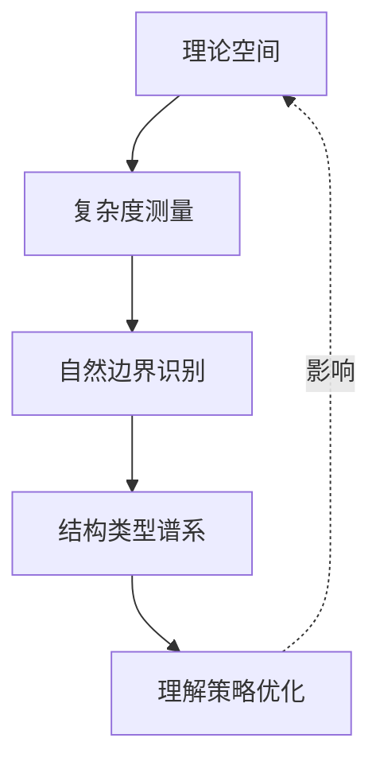

这一循环展示了分类如何不仅仅是描述活动，更是一种认知优化过程。

**批判性反思与局限：**

尽管成就卓著，模型论分类计划也面临深刻挑战：

1. **表达局限**：作为一阶模型论，无法捕捉所有数学直观
2. **实践差异**：分类可能与实际数学研究关注点不同
3. **自然性问题**：所谓"自然边界"可能反映形式化选择
4. **多维复杂性**：单一复杂度层级可能过于简化

从科学哲学更广视角看，模型论分类计划与其他科学分类系统（如生物分类学、元素周期表）有深刻相似性，都试图识别自然界限和基本类型。
然而，数学分类的独特之处在于其对象是抽象的，分类标准更多关注内部逻辑结构而非经验特征。

## 6. 模型论的认知维度

### 6.1 模型思维的认知心理学基础

模型论的核心概念——模型、解释、满足——不仅是数学构造，也对应于人类思维的基本认知模式。
认知科学研究表明，模型构建和操作是人类理解世界的核心机制，这一发现为模型论的数学形式化提供了认知基础。

**认知模型与数学模型的平行性：**

| 认知模型特征 | 模型论对应 | 实证研究支持 |
|-------------|-----------|------------|
| 心理表征构建 | 结构构造 | 约翰逊-莱尔德心理模型理论 |
| 命题真值评估 | 满足关系 | 推理过程研究(Byrne等) |
| 可能世界思考 | 不同模型构造 | 反事实思维研究 |
| 抽象变量操作 | 变量赋值 | 代数思维发展研究 |
| 一致性维护 | 模型一致性 | 认知失调研究 |

**发展心理学视角：**

人类认知能力的发展显示出与模型论概念惊人的平行性：

1. **皮亚杰阶段与形式能力**：
   - 具体操作阶段：操作具体模型
   - 形式操作阶段：操作抽象结构和可能性
   - 后形式思维：理解多元解释系统

2. **认知发展的关键转变**：
   - 从特例到一般规则（类比于从具体结构到公理）
   - 从单一视角到多重视角（类比于模型多样性）
   - 从固定解释到元级推理（类比于元理论性质）

**实验证据与神经基础：**

认知科学提供了大量证据支持模型思维的基础性：

1. **心理表征研究**：人们在解决问题时构建内部模型（约翰逊-莱尔德实验）
2. **推理模式**：人类推理更接近模型检验而非形式推导（瓦森选择任务）
3. **神经成像发现**：前额叶皮层在模型操作中的核心作用
4. **语义处理研究**：语言理解涉及情境模型构建

**双过程认知理论的视角：**

当代认知科学的双过程理论提供了理解模型思维的框架：

- **系统1**（快速、直觉、自动）：对应于直接模型检查
- **系统2**（缓慢、分析、控制）：对应于形式推理和模型构建

从这一视角看，模型论形式化了系统2的操作模式，但其基础直觉可能源于系统1的快速语义判断能力。

**认知局限与形式补偿：**

人类认知的固有局限与模型论的形式力量形成互补：

| 认知局限 | 形式模型论补偿 | 哲学意义 |
|---------|---------------|---------|
| 工作记忆有限 | 无限模型形式化 | 有限思维把握无限结构 |
| 直觉违背逻辑 | 精确满足定义 | 克服认知偏见 |
| 复杂关系处理困难 | 结构的系统表示 | 扩展认知能力边界 |
| 自指理解困难 | 元理论的精确区分 | 避免悖论和混淆 |

**批判思考与整合视角：**

认知视角下的模型论既提供了深刻洞见，也面临挑战：

- **还原主义风险**：数学模型论不能简单还原为心理过程
- **文化形塑作用**：形式化思维受教育和文化深刻影响
- **互动复杂性**：形式与直观的关系是动态互动而非单向映射

一个平衡视角认为，模型论与人类认知既有深层联系，又代表了思维的转化扩展——它不仅反映我们如何自然思考，更创造了超越自然认知局限的新思维方式。

### 6.2 形式化与语义理解的神经映射

数学形式系统与语义理解在大脑中的神经表征展示了令人惊讶的分离与整合模式。
近年来的神经科学研究开始揭示形式符号操作和语义理解的神经基础，为模型论的认知映射提供了实证依据。

**神经科学研究的关键发现：**

1. **双重处理路径**：
   - **语法-形式处理**：以左额下回和基底节为核心
   - **语义-意义处理**：以颞叶和额下回后部为核心

2. **数学符号处理的神经特异性**：
   - 顶内沟在数学符号理解中的特殊作用
   - 前额叶在形式推理和模型检验中的不同激活模式

3. **语义整合的神经表征**：
   - N400脑电波成分对语义违反的敏感性
   - 前额叶在语境整合中的核心作用

**形式与意义的神经整合模型：**

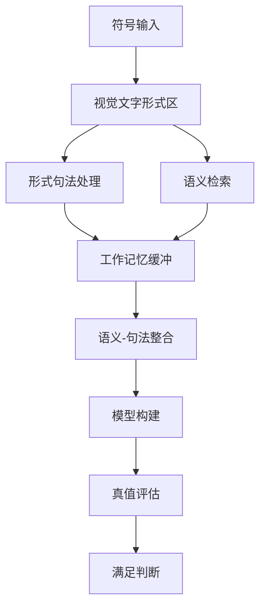

这一神经环路整合了符号处理和语义理解，类似于模型论中语法与模型的关系。

**不同数学活动的神经分离：**

神经成像研究表明不同类型的数学思维激活不同脑区：

| 数学活动 | 主要激活区域 | 对应模型论活动 |
|---------|------------|--------------|
| 公理/规则记忆 | 前额叶背外侧皮层 | 公理系统掌握 |
| 形式推导 | 前额叶腹内侧部分 | 语法推理系统 |
| 模型想象 | 顶叶和视觉联合区 | 模型构造 |
| 语义判断 | 颞叶和前额叶眶部 | 满足关系判断 |

**专家与新手的神经差异：**

数学专家和新手在处理形式系统时显示出不同的神经活动模式：

- **专家特征**：更高效的前额叶激活，更强的顶-额连接
- **新手特征**：更广泛的脑区激活，更依赖视觉-空间处理

这些差异暗示专家已发展出更专门化的神经环路来处理形式系统和模型构建。

**语言与逻辑的神经基础比较：**

自然语言处理与形式逻辑处理共享部分神经基础，但也有关键区别：

- **共享区域**：语法处理网络，工作记忆系统
- **差异区域**：形式逻辑更强调顶叶参与，自然语言更激活颞叶语义区

这一发现支持了模型论作为语言与逻辑桥梁的观点——它需要整合语法和语义处理系统。

**神经可塑性与形式化思维：**

纵向研究表明数学教育导致特定神经环路的重组：

- 长期形式训练增强额-顶网络连接
- 抽象思维能力与特定神经通路发展相关
- 理解形式系统的能力表现为神经效率提升

**批判性思考与方法论限制：**

尽管神经科学研究提供了宝贵见解，但也存在重要限制：

- **复杂思维的简化**：神经成像难以捕捉高级数学思维的全部复杂性
- **相关性与因果性**：神经激活模式与认知功能的因果关系尚不明确
- **个体差异**：数学思维的神经基础存在显著个体差异

从更宽广的科学哲学角度看，神经科学发现提供了针对柏拉图主义的挑战
——如果数学思维植根于物理大脑，那么数学对象的独立存在性如何可能？

同时，神经科学也支持了某种具身认知观点——抽象数学概念可能源于身体经验的神经加工和转化。

### 6.3 隐喻结构与数学创造性

数学思维，包括模型论，深刻依赖于隐喻映射——从具体领域到抽象领域的概念转移。
认知语言学研究表明，即使最抽象的数学概念也扎根于具体身体经验，通过概念隐喻转化而来。
这一视角不仅帮助我们理解数学概念的认知基础，更揭示了数学创造的深层机制。

**模型论中的核心隐喻系统：**

| 隐喻映射 | 源域 | 目标域 | 模型论概念 |
|---------|-----|-------|-----------|
| 容器隐喻 | 物理容器 | 抽象集合 | 模型包含元素 |
| 旅程隐喻 | 物理路径 | 推理过程 | 形式证明路径 |
| 建筑隐喻 | 物理结构 | 理论结构 | 理论一致性 |
| 视觉隐喻 | 物理观察 | 数学洞察 | 模型"看到"真值 |
| 力量隐喻 | 物理力量 | 逻辑必然 | 逻辑蕴含关系 |

**莱考夫-纽恩兹理论的视角：**

认知语言学家莱考夫(George Lakoff)和纽恩兹(Rafael Núñez)在《数学从何而来》(Where Mathematics Comes From)中提出，
数学思维源于四类基本认知机制：

1. **意象图式**：容器、路径、连接等基本身体经验模式
2. **概念隐喻**：将意象图式映射到抽象概念
3. **概念混合**：融合不同概念域创造新概念
4. **符号化**：发展符号系统表征概念结构

从这一视角，模型论的核心概念可分析为隐喻构造：

- **满足关系**：源于容器-内容关系（公式"在"模型中为真）
- **形式推导**：源于旅程隐喻（从公理"行进"到定理）
- **模型构造**：源于建筑隐喻（"构建"满足特定公理的结构）
- **真值判断**：源于视觉隐喻（"看到"语句在模型中为真）

**概念整合网络分析：**

福康尼埃(Fauconnier)和特纳(Turner)的概念整合理论提供了更深入的视角。
模型论概念可视为多输入空间的创造性整合：

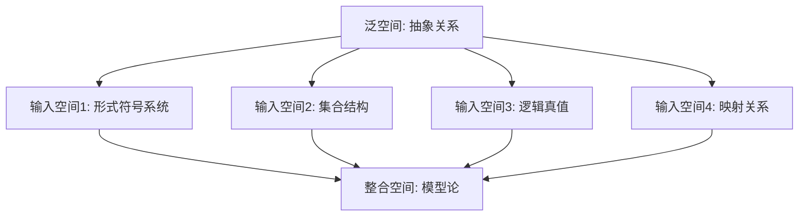

这种多维整合解释了模型论概念的复杂性和创造性，展示其如何融合多个认知域。

**创造性思维与概念延展：**

数学创造往往涉及隐喻的延展和重组：

1. **隐喻延展**：扩展现有隐喻到新领域
   - 例：从有限模型扩展到无限模型

2. **隐喻冲突解决**：调和看似矛盾的隐喻映射
   - 例：斯科伦悖论调和"可数"与"不可数"概念

3. **跨域映射**：在不同数学领域间建立新联系
   - 例：模型论与集合论的互动

-**案例分析：超积概念的隐喻构建**

超积概念的发展展示了复杂数学概念如何通过隐喻构建形成：

1. **基础隐喻**：多个结构的"平均"或"组合"
2. **技术延展**：通过滤子概念精确化"多数"思想
3. **概念整合**：融合多个模型和极限思想
4. **创造性飞跃**：产生具有新奇性质的结构

**批判视角与认知限制：**

尽管隐喻对数学思维至关重要，但也引发批判思考：

- **隐喻局限性**：隐喻可能误导或限制思维
- **文化相对性**：数学隐喻部分源于文化经验
- **丰富与精确的张力**：隐喻丰富性与形式精确性间的张力

**认知科学对数学创造性的启示：**

认知研究揭示了数学创造过程的几个关键特征：

1. **孵化与顿悟**：数学发现常在直接关注之外发生
2. **概念空间重组**：创造性思维重构概念关系
3. **多模态思考**：结合视觉、符号、语言等不同认知模式
4. **类比推理**：通过类比映射产生新见解

这些发现对模型论教学和研究有深远启示，暗示应重视概念隐喻的显性化和多元表征的整合，以促进深度理解和创造性思维。

## 7. 关联性与交叉领域

### 7.1 模型论与集合论

模型论与集合论的关系既是基础性的又是复杂的——集合论为模型论提供宇宙，而模型论反过来研究集合论的本质。
这种互动关系揭示了数学基础的微妙本质和递归性质。

**基础关系的多层次：**

1. **技术依赖关系**：
   - 集合论为模型论提供基本构造工具
   - 模型论研究集合论公理的语义后果

2. **概念互映关系**：
   - 集合论中的"宇宙"对应模型论中的"领域"
   - 模型论中的"满足"对应集合论中的"成员关系"

3. **历史发展互动**：
   - 集合论悖论促进形式语言发展
   - 模型论方法解决集合论独立性问题

**集合论模型对模型论的影响：**

集合论宇宙选择对模型论研究有深远影响：

| 集合论设定 | 对模型论的影响 | 哲学含义 |
|-----------|--------------|---------|
| ZFC标准宇宙 | 经典模型存在性结果 | 标准数学实践基础 |
| V=L (可构造性) | 简化结构但限制多样性 | 最小主义数学哲学 |
| 大基数假设 | 增强模型存在性定理 | 丰富数学本体论 |
| 强制法扩展 | 提供多样化模型构造 | 数学多元宇宙观 |

**关键交互成果：**

1. **独立性结果**：
   - 科恩使用强制法证明连续统假设独立性
   - 模型论方法证明大基数假设的独立性

2. **反思原则**：
   - 集合论中的反思原则源于模型论的可达基数
   - 模型论的小高度大界性质源于集合论反思

3. **内模型程序**：
   - 伍德因(Woodin)的内模型理论融合模型论与集合论
   - 目标确定连续统假设的"正确"值

**互构循环与元理论问题：**

模型论与集合论的关系形成了一种特殊的循环：

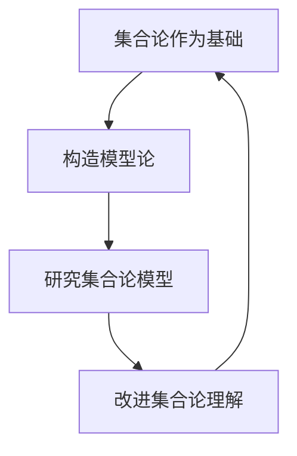

这种循环引发深刻的元理论问题：

- 如何避免循环论证？
- 何种意义上一种理论"更基础"？
- 我们如何为元理论选择合适的宇宙？

**哲学视角的对比：**

| 哲学立场 | 对模型论-集合论关系的理解 | 代表人物 |
|---------|------------------------|---------|
| 集合论优先 | 集合论提供绝对基础 | 戈德尔 |
| 相对基础观 | 两者互为基础，无绝对先后 | 普特南 |
| 多元基础观 | 不同目的选择不同基础 | 马蒂亚 |
| 反基础主义 | 拒绝单一基础必要性 | 维格特根斯坦后期 |

**批判思考与研究边界：**

模型论与集合论关系的复杂性启示我们：

1. **循环避免策略**：区分对象语言与元语言层次
2. **认识论谦逊**：承认任何形式化都需依赖某些前提
3. **实用多元主义**：根据研究目标灵活选择基础框架
4. **层次意识**：保持对讨论层次的清晰认识

这一关系提醒我们，数学基础不是静态的金字塔，而是动态的互动网络，不同理论视角互相丰富和制约，共同构成更完整的数学认识。

### 7.2 模型论与证明论

模型论研究真理的语义结构，证明论关注证明的语法过程，二者代表了逻辑的两个基本面向。
它们的关系既对立又互补，揭示了形式与意义的辩证统一。

**基本概念与方法对比：**

| 方面 | 模型论 | 证明论 | 关联桥梁 |
|-----|--------|--------|---------|
| 核心概念 | 满足、真 | 证明、推导 | 完备性定理 |
| 研究对象 | 结构与解释 | 形式系统与推导 | 语法-语义对应 |
| 基本方法 | 构造模型 | 分析证明 | 模型完备性 |
| 技术重点 | 结构性质 | 规约与变换 | 转换技术 |
| 历史源流 | 塔尔斯基传统 | 希尔伯特传统 | 哥德尔工作 |

**核心桥梁定理及其意义：**

1. **完备性定理**：语法推导与语义蕴含的等价性
   - 哥德尔(1929)首次证明，奠定现代逻辑基础
   - 证明思路结合模型构造与证明分析

2. **紧致性定理**：从两个视角的统一理解
   - 模型论视角：局部可满足性蕴含整体可满足性
   - 证明论视角：矛盾需由有限数量公理导出

3. **切割消去定理**：连接语法简化与语义属性
   - 根特森(Gentzen)的证明理论成果
   - 对应模型论中的插值定理

**方法论交流与共生：**

两个领域的方法不断交流与融合：

1. **模型论借用证明论技术**：
   - 强制法借鉴了证明构造原则
   - 类型空间分析利用证明复杂度概念

2. **证明论采纳模型思维**：
   - 证明的语义分析（Prawitz命题计算解释）
   - 范畴语义学将证明视为模型的态射

3. **混合方法**：
   - Kripke-Beth语义结合了证明与模型元素
   - 直观主义逻辑的语义需要证明与模型的统一视角

**重要的历史转折点：**

| 时期 | 关键发展 | 意义 |
|-----|---------|-----|
| 1930年代 | 哥德尔完备性与不完备性定理 | 确立了两领域的关系与界限 |
| 1950年代 | 根特森切割消去与一致性证明 | 证明论成熟，提供新视角 |
| 1970年代 | 强制法与证明理论的发展 | 技术跨领域应用 |
| 1990年代 | 证明复杂度与模型理论联系 | 计算观点融入两者 |
| 2000年代至今 | 同伦类型论统一视角 | 模型、证明、计算三元统一 |

**哲学视角中的对立与统一：**

模型论与证明论的关系反映了数学哲学中的核心张力：

- **真理与证明**：数学真理是发现还是证明的产物？
- **语义与语法**：数学意义的本质是指称还是使用？
- **直观与形式**：数学思维的核心是结构想象还是符号操作？

不同哲学传统对这一关系有不同理解：

| 哲学传统 | 对模型-证明关系的看法 | 代表观点 |
|---------|---------------------|---------|
| 逻辑经验主义 | 模型为证明提供意义 | 塔尔斯基真理理论 |
| 形式主义 | 证明是根本的，模型是辅助工具 | 希尔伯特纲领 |
| 直觉主义 | 证明构造优先于模型存在 | 布劳威尔数学观 |
| 结构主义 | 结构关系先于证明与模型 | 现代模型论立场 |

**实践整合与教学启示：**

尽管理论上有区别，数学家实践中常整合两种思维：

- 通过考虑特定模型获取证明直觉
- 通过分析证明结构理解模型特性
- 在教学中，两种视角的结合能增强理解深度

从认知科学视角看，这种整合反映了人类思维的双重本质——既通过语义网络理解概念，又通过规则序列进行推理。

### 7.3 模型论与递归论

递归论研究可计算性的本质，模型论探索数学结构的语义特性，二者在20世纪中期开始深入交融，产生了丰富的互动成果。
这一交叉领域揭示了计算过程与数学结构之间的深层联系。

**基础概念交互：**

| 递归论概念 | 模型论对应 | 跨学科意义 |
|-----------|-----------|-----------|
| 可计算性 | 可定义性 | 操作与表述的对偶性 |
| 不可判定性 | 不可表达性 | 形式系统的根本限制 |
| 计算复杂度 | 定义复杂度 | 结构描述的层级 |
| 算法规约 | 可解释性 | 问题之间的翻译关系 |

**关键交叉成果：**

1. **可计算模型理论**：
   - 研究可计算结构的模型论特性
   - 可计算范畴性的特殊性质

2. **有效模型论**：
   - 结合递归论与模型论技术
   - 研究算法复杂度与定义复杂度关系

3. **递归饱和性**：
   - 结构的递归表述能力
   - 模型中类型实现的算法特性

4. **高阶递归理论与模型**：
   - 超限算法与抽象模型论
   - 广义计算模型与结构理论

**技术连接点与方法交流：**

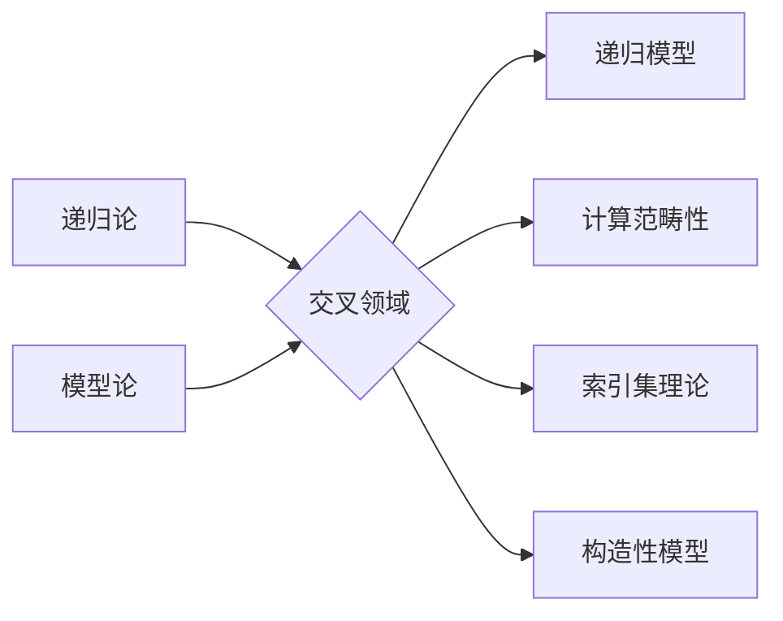

主要连接技术包括：

- **索引集理论**：复杂度与定义集合难度的联系
- **递归枚举度的模型论**：将计算能力视为模型类型
- **可计算结构分类**：根据算法特性对结构分类

**历史发展与跨领域人物：**

这一交叉领域由几位关键人物推动：

| 学者 | 主要贡献 | 影响 |
|-----|---------|-----|
| 弗罗德(Fröhlich)和谢菲尔德(Shepherdson) | 可计算域理论 | 开创有效模型论 |
| 内洛德(Nerode)和哈林顿(Harrington) | 递归代数理论 | 建立算法与结构连接 |
| 马科斯(Macintyre) | 判定理论应用 | 将递归问题转化为代数问题 |
| 奈特(Knight) | 计算机范畴理论 | 建立范畴性与复杂度关系 |

**哲学与基础问题：**

递归论与模型论的交互引发深刻哲学思考：

1. **表示与计算的本质关系**：
   - 表达能力与计算能力的联系与差异
   - 定义与算法的对偶性

2. **构造主义视角**：
   - 有效模型论为构造主义提供形式框架
   - 在什么意义上"计算即构造"？

3. **认知与计算界限**：
   - 不可计算性与不可定义性的平行性
   - 人工智能系统面临的形式边界

**应用领域：**

这一交叉研究产生了多领域应用：

- **计算机科学**：数据库查询语言的表达力与复杂度
- **形式语言学**：语言结构的计算与表示复杂性
- **认知模型**：人类认知能力的形式化与计算限制
- **物理信息理论**：物理系统的计算能力与信息结构

**批判性反思与未来方向：**

递归论与模型论的交融也引发重要反思：

- **方法论局限**：计算的严格形式化可能过于狭窄
- **非经典计算**：量子计算等新模型带来新视角
- **复杂性假设**：P≠NP等核心猜想的模型论意义

未来发展可能包括：

- 连续计算模型的模型论
- 非确定性系统的语义理论
- 计算复杂度层级与定义复杂度的深层联系

从科学哲学视角看，这一交叉领域揭示了操作性(递归)与表述性(模型)作为认识方式的深层统一，暗示理解与计算可能是同一认知过程的两个面向。

### 7.4 模型论与范畴论

范畴论提供了关注对象之间映射的抽象数学视角，与模型论关注结构与解释的方法形成了富有成效的互补。
两者的交融创造了新的概念框架，深化了对数学结构本质的理解。

**基本概念对应：**

| 模型论概念 | 范畴论对应 | 统一视角 |
|-----------|-----------|---------|
| 结构 | 对象 | 数学实体 |
| 同态 | 态射 | 结构保持映射 |
| 基本等价 | 内部语言等价 | 语义不可区分性 |
| 理论 | 理论范畴 | 公理约束系统 |
| 模型类 | 范畴 | 结构族 |

**关键交互成果：**

1. **拓扑斯理论**：
   - 拓扑斯作为"广义宇宙"或"广义模型"
   - 内部语言提供模型论的范畴形式化
   - 几何逻辑连接模型论与拓扑学

2. **范畴语义学**：
   - 理论的模型定义为函子
   - Lawvere函数演算的函范畴模型
   - 模型论概念的范畴推广

3. **确定子理论**：
   - 范畴中的基本等价关系
   - 模型论不变量的范畴表达

**方法论互补与融合：**

范畴论与模型论采用不同但互补的方法论视角：

| 范畴论特点 | 模型论特点 | 互补价值 |
|-----------|-----------|---------|
| 关注态射 | 关注元素 | 内外部视角统一 |
| 抽象结构 | 具体构造 | 形式与内容平衡 |
| 通用性质 | 特殊实例 | 普遍与特殊统一 |
| 自然变换 | 定义家族 | 变化模式的刻画 |

**理论发展里程碑：**

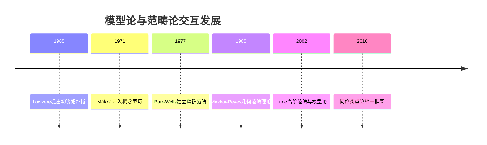

**哲学视角的融合：**

这一交互促进了数学哲学的新视角：

1. **结构主义新形式**：
   - 从"对象+关系"到"对象+态射+自然变换"
   - 多层次结构主义的形式化

2. **关系本体论**：
   - 对象通过关系网络而存在的观点
   - 模型论的语义网络与范畴论的态射网络对应

3. **概念性与操作性统一**：
   - 范畴论的概念性与模型论的操作性结合
   - 理解与构造的辩证统一

**当代融合方向：**

1. **高阶范畴论与抽象模型论**：
   - n-范畴作为高维结构的模型
   - 无穷维结构的模型理论

2. **同伦类型论**：
   - 统一逻辑、计算和空间概念
   - 将等同性视为路径，定型视为空间

3. **导出模型范畴**：
   - 将模型论技术应用于导出范畴
   - 稳定性理论的范畴形式化

**批判思考与评估：**

范畴论与模型论的交互虽然富有成果，但也面临挑战：

- **抽象性挑战**：高度抽象可能脱离直观理解
- **技术门槛**：结合两种复杂形式系统的难度
- **表达力平衡**：在抽象与具体之间寻找平衡点

从认知科学视角看，这种融合反映了人类思维的二元性——既通过具体实例理解(模型论特色)，又通过关系模式组织知识(范畴论特色)。
成功的数学思维似乎需要在这两种认知模式间灵活切换。

## 8. 现代发展与研究前沿

### 8.1 几何模型论

几何模型论是模型论研究的现代前沿，它将代数几何的直观与技术引入模型论，创造了理解抽象结构的强大框架。
这一领域始于上世纪80年代末，已成为当代模型论最活跃的研究方向之一。

**核心概念与基础框架：**

1. **可定义集几何**：
   - 研究一阶定义集的几何性质
   - 将几何概念（维数、一般位置、正则性）应用于逻辑定义集

2. **Zariski几何**：
   - Hrushovski和Zilber开创性工作
   - 抽象代数几何的模型论重构
   - 确定满足代数几何型性质的抽象结构类

3. **几何稳定性理论**：
   - 将稳定理论中的分叉概念几何化
   - 建立独立性关系的几何公理系统

**重要理论突破：**

| 突破 | 主要贡献者 | 核心意义 | 技术创新 |
|-----|-----------|---------|---------|
| Hrushovski构造 | Hrushovski | 反例构造，推翻Zilber猜想 | 控制几何复杂度的融合方法 |
| Zilber三歧性 | Zilber | 可定义集分类原则 | 将复杂结构分解为基本类型 |
| o-极小结构理论 | Pillay, Steinhorn | 实数几何的抽象化 | 通过定义有序结构的简化证明 |
| 模型论微分代数 | Marker, Pillay | 微分方程的模型论 | 结合微分与代数的语义分析 |

**几何观点的方法论价值：**

几何视角为模型论带来了多重突破：

1. **维数理论的统一**：
   - Morley秩、U-秩、几何维数的统一理解
   - 为不同复杂度的结构提供一致的维数概念

2. **局部-整体原则**：
   - 从局部几何性质推断全局结构
   - 类似于代数几何中的局部-整体关系

3. **分析工具的引入**：
   - 紧密性概念的模型论形式
   - 生成集与独立性的几何解释

**代表性应用领域：**

几何模型论已成功应用于多个领域：

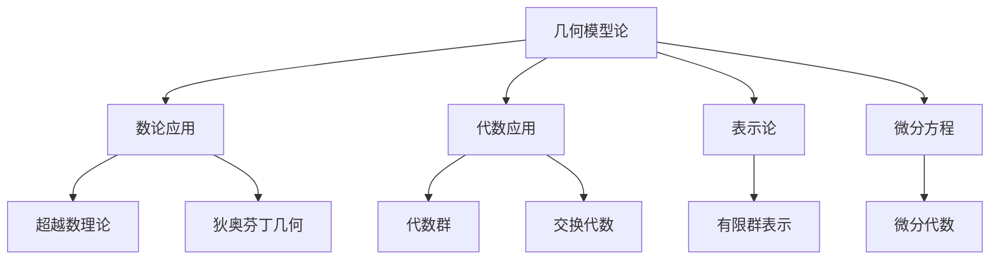

**Hrushovski方法的案例分析：**

Hrushovski的融合方法是几何模型论的里程碑：

1. **基本思想**：从简单结构出发，通过受控"融合"过程构建复杂结构
2. **技术细节**：
   - 预几何算子与封闭操作
   - 维数函数的精确控制
   - 随机性与结构的平衡
3. **应用成果**：
   - 构造反例，解决模型论开放问题
   - 代数几何中的新独立性证明
   - 超越数领域的应用

**认知与哲学维度：**

几何模型论的发展揭示了数学思维的重要特性：

1. **几何直观的力量**：
   - 空间思维对抽象概念的启发作用
   - 视觉化表征在高级数学思维中的作用

2. **隐喻跨域转移**：
   - 几何概念如何在不同数学领域间迁移
   - 隐喻作为数学创新的核心机制

3. **统一性与多样性**：
   - 如何在保留结构特殊性的同时发现普遍原则
   - 数学中的"自然类别"与几何分类

**批判视角与未来方向：**

几何模型论尽管成功，但也面临一些挑战：

- **技术复杂性**：方法越来越专业化，提高了入门门槛
- **几何局限**：并非所有模型论问题都适合几何处理
- **多重几何**：不同几何传统（代数、微分、离散）的整合困难

未来可能的发展方向包括：

- 与高阶范畴理论的更深融合
- 非交换几何的模型论对应
- 量子几何的模型论基础

从更广的科学哲学视角看，
几何模型论的发展反映了人类思维在抽象与具象之间的持续辩证关系
——我们通过空间直观把握高度抽象的概念，又通过抽象理论重新定义空间本身。

### 8.2 o-极小结构

o-极小结构(o-minimal structures)是模型论中研究良序性质的有序结构的重要分支，它为实分析提供了精确的逻辑基础，实现了"可数性假设下的实代数几何"。
这一领域自1980年代中期开始发展，已成为连接模型论与分析学的核心桥梁。

**基本定义与动机：**

**定义**：有序结构 $\mathcal{M}=(M,<,...)$ 称为o-极小的，如果 $M$ 中每个可定义集是有限个点和区间的并。

这一简洁定义捕捉了一个深刻直觉：结构足够简单，使得可定义集具有"良好行为"，避免病理情况。

**历史发展与基本结果：**

1. **早期发展**：
   - Pillay和Steinhorn(1986)首次系统研究
   - van den Dries(1984)展示实闭域是o-极小的

2. **关键突破**：
   - Wilkie(1996)证明 $(\mathbb{R},+,\cdot,e^x)$ 是o-极小的
   - Rolin, Speissegger, Wilkie扩展到更多超越函数
   - 限制Pfaffian闭包定理

3. **结构定理**：
   - 元胞分解定理：每个可定义集有规则分解
   - 单调性定理：可定义函数在区间上有有限分段单调性
   - 三歧定理的o-极小类似物

**核心技术的数学精髓：**

| 技术 | 数学内容 | 应用 |
|-----|---------|-----|
| 元胞分解 | 将可定义集分解为标准"元胞" | 维数理论，拓扑应用 |
| 定义闭包 | 确定最小o-极小扩张 | 构造新o-极小结构 |
| 可定义选择 | 在可定义族中一致选择 | 证明一致性结果 |
| 渐近展开 | 函数的标准形式表示 | 分析超越函数性质 |

**主要o-极小结构谱系：**

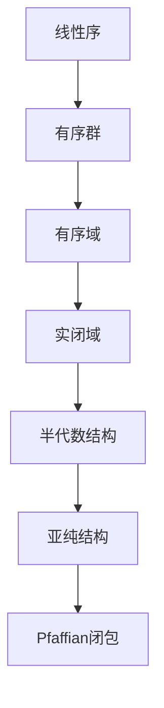

这一谱系展示了从简单到复杂的o-极小结构层次，每层都增加新的表达能力。

**与其他领域的深层联系：**

1. **分析学联系**：
   - 提供对实函数"良好行为"的精确刻画
   - Weierstrass预备定理的模型论对应
   - 奇点理论与o-极小可定义集

2. **几何应用**：
   - 半代数几何的逻辑基础
   - 亚代数集的维数理论
   - 奇点分类的统一处理

3. **拓扑学结果**：
   - 可定义集的有限三角剖分
   - 可定义同伦理论
   - 奇点链的拓扑描述

**Pila-Wilkie定理的突破：**

Pila和Wilkie(2006)证明的计数定理是o-极小研究的里程碑：

- **定理内容**：o-极小结构中具有有限"复杂度"的超越曲线上有理点数量有上界
- **数论应用**：Andre-Oort猜想、Manin-Mumford猜想的新证明
- **方法创新**：结合o-极小几何与狄奥芬丁逼近

这一工作开创了"o-极小数论"，将逻辑方法引入数论核心问题。

**哲学与认知意义：**

o-极小结构研究反映了数学思维中的几个深层主题：

1. **简单性与复杂性的辩证**：
   - 结构限制产生更强大的定理
   - "好行为"结构允许深刻统一理解

2. **离散与连续的桥接**：
   - o-极小性提供离散化连续结构的自然方式
   - 揭示离散点集与连续变化的深层联系

3. **实数直观的形式化**：
   - 捕捉数分析中"合理函数"的直觉概念
   - 提供实数连续性的逻辑基础

**批判反思与开放问题：**

o-极小研究也面临重要挑战：

- **表达力与简单性平衡**：增加表达力可能破坏o-极小性
- **判定问题复杂性**：虽有决定程序，但复杂度可能很高
- **不完备性问题**：完整分类o-极小结构的可能性有限

开放研究方向包括：

- o-极小结构的精细分类
- 更复杂超越函数的o-极小性
- 非阿基米德有序结构的o-极小理论

从科学哲学角度，o-极小结构体现了现代数学的典型特征
——通过限制研究对象以获得更深刻的洞察，这一策略在物理学中也有对应（如寻找对称性和守恒律）。

### 8.3 连续模型论

连续模型论(Continuous Model Theory)是模型论在连续数学结构中的扩展，专注于研究距离空间、巴拿赫空间和C*代数等分析学结构。它将经典逻辑的0-1真值扩展为[0,1]区间上的连续值，创造了处理分析对象的精确逻辑框架。

**基础概念与形式化：**

1. **连续逻辑的语法**：
   - 连续函数符代替函数符
   - 连续谓词符号（值域为[0,1]）代替关系符
   - 量词 sup 和 inf 代替 ∀ 和 ∃
   - 连续连接词：min, max, Łukasiewicz范数等

2. **结构与模型**：
   - 连续结构基于完备度量空间
   - 满足关系取值于[0,1]
   - 公式真值为连续实数值

3. **基本理论**：
   - 紧致性定理的连续版本
   - Łoś定理的连续推广
   - 连续超积构造

**关键发展与核心人物：**

| 阶段 | 主要贡献者 | 核心成就 |
|-----|-----------|---------|
| 早期发展(1960s) | Chang, Keisler | 连续逻辑初步框架 |
| 形式化阶段(1980s) | Henson, Iovino | 巴拿赫空间的模型理论 |
| 现代综合(2000s) | Ben Yaacov, Berenstein | 连续一阶逻辑的系统化 |
| 当代应用(2010s+) | Farah, Hart, Sherman | C*代数与量子信息应用 |

**主要应用领域：**

1. **函数分析结构**：
   - 巴拿赫空间的模型论
   - 算子代数的逻辑基础
   - 概率空间的模型理论

2. **泛函分析拓展**：
   - 巴拿赫空间稳定性理论
   - 无限维空间分类计划
   - 不变子空间猜想的模型论视角

3. **量子信息与C*代数**：
   - 量子逻辑的连续模型论
   - C*代数的超积模型
   - 量子系统的可定义性质

**技术成就与理论突破：**

1. **度量超积**：
   - 连续版本的超积构造
   - 保持度量完备性的技术
   - 应用于泛函分析的新结果

2. **连续稳定性理论**：
   - 巴拿赫空间的稳定性概念
   - 类型空间的距离结构
   - 连续版本的分叉理论

3. **可定义集几何**：
   - 希尔伯特空间可定义子集的几何特性
   - 连续版本的o-极小性
   - 可定义函数的连续性与平滑性质

**与经典模型论的对比：**

| 经典模型论 | 连续模型论 | 概念转换 |
|-----------|-----------|---------|
| 有/无 | 程度/距离 | 从二值到多值 |
| 集合包含 | 距离函数 | 从绝对到相对 |
| 同构 | 等距同构 | 保持结构映射 |
| 初等子结构 | 初等子模型 | 保持逻辑性质 |
| 紧致性 | 近似紧致性 | 有限→紧致转换 |

**哲学与概念挑战：**

连续模型论引发了深刻的哲学问题：

1. **真值连续性的意义**：
   - 经典二值逻辑与连续多值逻辑的关系
   - 连续真值的认识论解释
   - 模糊性与精确度的形式化

2. **距离与相似性的本体论**：
   - 距离作为基本关系的哲学地位
   - 相似度替代同一性的本体论含义
   - 连续思维与分类思维的对比

3. **数学实践的反思**：
   - 分析学家如何隐含使用连续逻辑
   - 精确度与确定性在数学实践中的张力

**前沿研究与开放方向：**

连续模型论的活跃研究方向包括：

- **自由概率理论**：连接随机矩阵与算子代数
- **量子逻辑的模型理论**：非交换结构的逻辑基础
- **连续组合理论**：图论的连续类比
- **模糊集合理论的严格基础**：将模糊逻辑与连续模型论统一

从认知科学视角看，连续模型论反映了人类思维中的基本特性
   ——我们不仅以分类方式思考（传统逻辑），也以度量和比较方式思考（连续逻辑）。
这种双重思维模式可能是数学认知的基本特征。

### 8.4 新兴方向与未解问题

模型论作为数学逻辑的活跃分支，持续拓展其边界并面对深刻挑战。
本节概述当代模型论中最具活力的研究方向和关键未解问题，这些问题构成了该领域未来发展的路线图。

**前沿研究领域：**

1. **集合论模型论的互动**：
   - 大基数公理对模型论的影响
   - 强制法与新模型构造技术
   - 集合论独立性在模型论中的反映

2. **加性模型论**：
   - 加性模型的分类和特征化
   - NIP理论的加性展开
   - Hrushovski几何的加性版本

3. **模型论代数几何**：
   - 代数闭值域上非交换几何
   - 代数群的模型论基础
   - 模型论动力系统

4. **不确定性与模糊逻辑**：
   - 概率模型论的发展
   - 量子逻辑与量子概率
   - 混合确定性-概率结构

**重要未解问题谱系：**

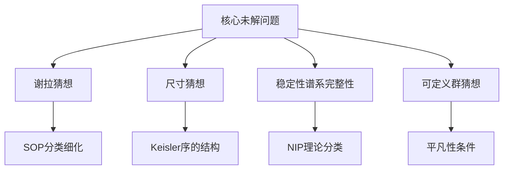

**具体关键问题与进展状态：**

| 问题 | 提出者/年份 | 当前状态 | 重要性 |
|-----|-----------|---------|-------|
| 谢拉猜想(第6问题) | Shelah/1978 | 部分结果(Malliaris-Shelah) | 最高 |
| 尺寸猜想 | Keisler/1967 | 主要突破(Malliaris-Shelah) | 最高 |
| 模型论分类的终结？ | 社区问题 | 持续发展中 | 方向性 |
| 可定义群的代数性 | Cherlin-Zilber | 多项进展但未完全解决 | 高 |
| NTP2理论的特征化 | Chernikov | 活跃研究 | 高 |
| 依值逻辑的独立性 | 多人提出 | 开放，基本框架已建立 | 中高 |

**方法论创新与技术突破：**

1. **NIP理论的指标函数**：
   - 使用组合工具分析NIP结构
   - VC维数理论的模型论应用
   - 无穷组合方法的系统化

2. **超限归纳技术**：
   - 用于建立整体结构结果
   - 归纳证明的重新形式化
   - 超限配置的系统分析

3. **随机方法的模型论**：
   - 随机结构的零一律
   - 概率构造技术
   - 伪随机性与不可区分性

**跨学科新界面：**

当前模型论正与多个领域建立深层连接：

- **机器学习理论**：VC维数、稳定函数与学习复杂度
- **经济学博弈论**：连续逻辑与不确定性建模
- **量子信息理论**：量子态空间的模型论
- **计算复杂性**：有限模型计数与复杂性层级
- **分子生物学**：基因组组合结构的逻辑模型

**关键阻碍与概念挑战：**

当代模型论面临的根本挑战包括：

1. **技术复杂度增长**：
   - 前沿工作需要整合多领域的复杂技术
   - 核心结果的证明长度和复杂性增加
   - 专业细分可能限制整体视野

2. **概念框架发展**：
   - 需要新概念捕捉超越经典框架的现象
   - 不同理论传统的整合挑战
   - 平衡抽象与具体的方法论挣扎

3. **交流与传授障碍**：
   - 跨领域交流的语言障碍
   - 新一代研究者面临陡峭学习曲线
   - 专业化与综合理解之间的张力

**展望与哲学评估：**

模型论的未来发展可能沿着几条平行轨迹：

1. **内在深化**：更细致地分类数学结构，发现更深层的模式
2. **外在扩展**：将模型论方法应用于更多数学和科学领域
3. **概念创新**：发展新逻辑框架，超越经典模型论局限
4. **哲学反思**：深化对数学结构、定义能力和形式系统本质的理解

从科学哲学角度看，模型论的发展体现了数学作为人类活动的典型特征
——既有不断深入的专业化趋势，又有跨领域整合的统一冲动；既追求形式严谨，又保持对直观的敏感。
这种动态平衡或许正是数学持续创新的源泉。

## 9. 应用谱系与扩展视野

### 9.1 代数学中的模型论方法

模型论最初被视为纯理论工具，但逐渐成为解决核心代数问题的强大方法。
这种应用不仅提供了新证明，更带来了全新视角，揭示了代数结构中的深层模式。

**代数闭域与域理论：**

1. **消去量词的强大应用**：
   - 塔尔斯基-赛登伯格定理：实闭域的有效决策程序
   - 域定义集的几何刻画
   - 代数闭域ACF的模型完备性证明

2. **域的模型论分类**：
   - 特征分类：ACF₀, ACFₚ (p > 0)
   - 实闭域理论(RCF)的完备性
   - p-adic域与Henselian域的公理化

3. **技术应用实例**：
   - 希尔伯特第17问题的模型论证明
   - Artin-Schreier理论的模型论重构
   - 超积方法构建非标准域

**代数几何的模型论视角：**

代数几何与模型论的交互产生了双向影响：

| 代数几何概念 | 模型论对应 | 应用成果 |
|------------|-----------|---------|
| 簇(Variety) | 可定义集 | 一致可定义族性质 |
| 维数理论 | Morley秩/U-秩 | 新维数概念的算法应用 |
| 通用点 | 非叉开类型 | 依值性质的几何解释 |
| 泛性(Generic) | 非分叉扩展 | 泛点的逻辑刻画 |
| 双有理映射 | 可解释双射 | 双有理等价的特征化 |

**Hrushovski的成就与方法：**

Ehud Hrushovski利用模型论解决代数问题的成就特别突出：

1. **字义群猜想**：
   - 问题：证明代数闭域上的字义群必是代数群
   - 解决：结合稳定性理论与代数几何
   - 方法创新：分析字义集族的几何性质

2. **Mordell-Lang猜想**：
   - 问题：特征p > 0情况下的Mordell-Lang猜想
   - 解决：应用差分代数与模型论
   - 技术核心：Zilber原理与差分闭理论

3. **Manin-Mumford猜想**：
   - 技术：结合模型论与代数数论
   - 创新：通过差分闭扩张分析周期点

**交换代数的应用：**

模型论视角对环论和交换代数提供了新洞见：

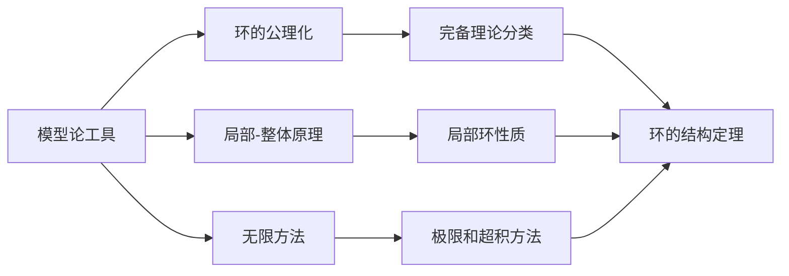

关键成果包括：

- 局部环的模型理论（Cherlin, Ershov）
- Cohen结构定理的模型论证明
- 超积构造在同调环论中的应用

**群论应用：**

模型论在群论中的应用尤为丰富：

1. **稳定群理论**：
   - 可定义子群的结构理论
   - 泛型类型分析与几何
   - 稳定群的连通分支

2. **超越性问题**：
   - 自由群的基本理论
   - Tarski问题的解决（Sela, Kharlampovich-Myasnikov）
   - 超越扩张的模型论刻画

3. **有限群应用**：
   - 拟有限群与伪有限群
   - 渐近群论的逻辑方法
   - 逆伽罗瓦理论的模型论视角

**批判思考与方法优势：**

模型论方法在代数中的应用显示出特殊优势：

- **无限到有限**：通过逻辑方法连接无限结构与有限证明
- **统一视角**：提供跨越不同代数领域的统一框架
- **可构造性与存在性**：平衡纯存在性结果与构造方法
- **局部-整体视角**：通过局部性质系统理解全局结构

然而，模型论方法也面临挑战：

- **复杂性障碍**：技术复杂性可能掩盖直观
- **语言隔阂**：模型论术语可能阻碍代数学家接受
- **结构特异性**：通用方法可能忽视特定结构的独特性质

代数学与模型论的持续交互体现了现代数学的一个核心特征：领域边界的流动性和方法的跨学科融合。
这种融合不仅产生新证明，更创造了新概念和新视角，深化了对代数结构本质的理解。

### 9.2 数论应用与Hrushovski方法

模型论与数论的交汇创造了当代数学中最令人兴奋的前沿领域之一。
这一交互不仅解决了长期存在的难题，更揭示了数论结构与逻辑概念之间的深层联系。

**核心交互领域：**

1. **狄奥芬丁几何**：
   - 有理点集的模型论刻画
   - 超越曲线上的有理点计数
   - 模型论高度函数与复杂度度量

2. **有限域与亚纯几何**：
   - 有限域伪有限性质的逻辑刻画
   - 亚纯函数场景下的模型完备理论
   - 跨特征数的转移原理

3. **超越数理论**：
   - 模型论技术与超越度概念
   - 代数独立性的逻辑刻画
   - Schanuel猜想的模型论视角

**Pila-Wilkie定理及其应用：**

Pila-Wilkie定理(2006)是模型论应用于数论的里程碑：

**定理**：给定o-极小结构中的可定义子集，其"代数上重要"点的数量随高度增长有亚多项式上界。

这一看似技术性的结果产生了惊人应用：

1. **Andre-Oort猜想**：
   - 问题：刻画Shimura簇上的特殊点集
   - 应用：通过分析特殊点高度与分布
   - 成果：Pila-Zannier方法证明多种情况

2. **Manin-Mumford猜想**：
   - 问题：Abel簇的挠点集特征化
   - 应用：将挠点视为特殊代数点
   - 成果：新证明与推广结果

3. **功能超越相关性**：
   - 问题：指数函数与代数函数的特殊关系
   - 应用：Ax-Schanuel原理与o-极小结构
   - 成果：Zilber-Pink猜想的部分结果

**Hrushovski贡献的关键方法：**

Hrushovski引入的方法为数论提供了新工具：

| 方法 | 数学内容 | 数论应用 |
|-----|---------|---------|
| 差分伽罗瓦理论 | 将伽罗瓦理论扩展到差分域 | Mordell-Lang猜想 |
| 有限域模型论 | 刻画有限域的渐近性质 | Weil猜想的新视角 |
| 交叉值域理论 | 混合特征结构的模型论 | p-adic数论问题 |
| 几何模型论 | 可定义集的几何性质 | 数论几何中的高度界 |

**超越方法的技术核心：**

Hrushovski方法的关键创新在于连接看似不相关的概念：

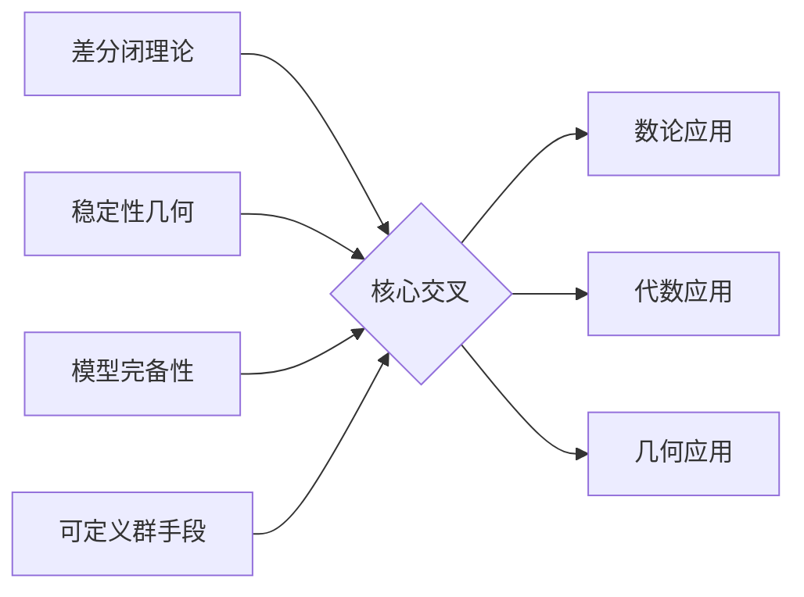

这种交叉视角使他能将模型论、数论和代数几何的工具整合在一起。

**本质创新与认知策略：**

Hrushovski方法的成功揭示了数学创新的重要模式：

1. **跨领域类比**：识别不同领域的相似结构
2. **概念转换**：将一个领域的概念翻译到另一领域
3. **抽象层次提升**：在更抽象层面理解具体问题
4. **结构保存映射**：专注于保持核心结构的映射

从认知科学角度看，这种方法体现了专家级数学思维的典型特征——能够在高度抽象层次上识别模式并建立连接。

**方法论评估与局限：**

尽管取得了显著成功，Hrushovski方法也面临一些批评：

- **技术障碍**：方法复杂性限制了更广泛的采用
- **黑箱倾向**：某些证明提供有限直观理解
- **推广挑战**：特定问题的成功不总能系统化

从科学哲学视角看，这反映了现代数学的常见张力——在方法复杂性与概念透明度之间寻找平衡；在技术精专化与整体理解之间保持适度。

**未来方向与开放问题：**

模型论与数论的交互展现了多个有前景的发展方向：

1. **有效性问题**：将模型论结果有效化，得到计算化结果
2. **群论应用扩展**：应用于更多数论自同构群问题
3. **p-adic领域拓展**：深化p-adic数和函数的模型论
4. **量子理论接口**：探索量子群与量子数论的可能联系

这些方向反映了模型论作为数学工具的持续演化，从抽象结构理论发展为解决具体数学难题的强大方法。

### 9.3 计算机科学与有限模型论

有限模型论研究有限结构上的逻辑，形成了模型论与计算机科学的关键桥梁。这一领域不仅提供了数据库理论、复杂性理论和形式验证的基础，也揭示了有限与无限结构之间的深刻联系。

**基本问题与核心差异：**

有限模型论与经典模型论关注不同问题集：

| 经典模型论 | 有限模型论 | 差异原因 |
|-----------|-----------|---------|
| 特征化无限结构 | 分析有限结构类 | 算法关注点 |
| 完备理论分类 | 表达力层级 | 计算资源限制 |
| 可定义性质 | 查询复杂度 | 实用性焦点 |
| 稳定性与维数 | 描述复杂度 | 有限计数方法 |

**相变现象与零一律：**

有限模型论的重要发现是逻辑属性的相变现象：

1. **零一律**：
   - 定义：当结构大小趋于无穷时，性质概率趋向0或1
   - Glebskii-Fagin定理：一阶逻辑在随机图上满足零一律
   - 哲学意义：随机大型结构有确定性行为

2. **相变研究**：
   - 随机结构中属性出现的概率阈值
   - 复杂性相变与算法行为
   - 结构相变与约束满足问题

**查询与表达力：**

数据库理论中的核心问题转化为逻辑表达力问题：

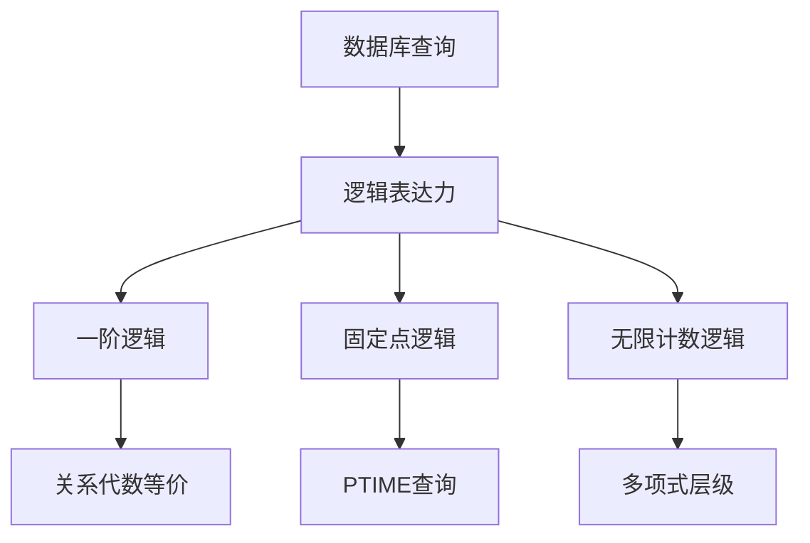

关键结果包括：

- Codd定理：关系代数等价于安全一阶逻辑
- Immerman-Vardi定理：固定点逻辑捕捉PTIME（在有序结构上）
- Fagin定理：存在性第二阶逻辑捕捉NP

**描述复杂度理论：**

描述复杂度建立了逻辑表达能力与计算复杂度的精确联系：

1. **核心对应关系**：
   - FO（一阶逻辑）↔ AC⁰（常数深度电路）
   - FO[+,×]（带算术的一阶逻辑）↔ DLOGTIME（确定性对数时间）
   - LFP（最小固定点逻辑）↔ P（多项式时间）
   - PFP（部分固定点逻辑）↔ PSPACE（多项式空间）

2. **方法论价值**：
   - 提供非计算性证明复杂性下界
   - 建立不同形式系统的精确表达力比较
   - 揭示计算与逻辑之间的内在联系

**有限与无限的桥梁：**

有限模型论创造了连接有限和无限结构的重要概念：

1. **渐近概率**：
   - 当结构大小趋于无限时的极限行为
   - 随机结构中的收敛定律
   - 逻辑律的概率解释

2. **有限可控近似**：
   - 有限近似无限结构的系统方法
   - 有界变量片段与局部性质
   - Gaifman定理与局部性质刻画

3. **游戏与不可区分性**：
   - Ehrenfeucht–Fraïssé游戏刻画逻辑等价
   - 有限轮博弈与有限变量逻辑
   - 不可区分性度量与近似等价

**应用领域谱系：**

有限模型论已成为多个计算机科学领域的基础工具：

| 应用领域 | 关键贡献 | 核心技术 |
|---------|---------|---------|
| 数据库理论 | 查询语言表达力 | 关系演算与逻辑 |
| 约束满足 | 结构化约束与复杂性 | 同态定理 |
| 形式验证 | 有限模型检查 | 时态逻辑与游戏 |
| 算法分析 | 固定参数可定理论 | 模型检查算法 |
| 机器学习 | 归纳逻辑编程 | 概念学习与逻辑 |

**认知科学与计算模型：**

有限模型论对认知科学也提供了重要视角：

1. **有限认知资源**：
   - 有限变量片段模拟有限工作记忆
   - 描述复杂度对应认知复杂度
   - 局部性原理反映注意力焦点限制

2. **概念学习模型**：
   - 逻辑概念学习的复杂度界限
   - PAC学习与有限模型表达力
   - 简单性偏好的形式化

**批判思考与发展挑战：**

有限模型论面临的核心挑战包括：

- **可伸缩性问题**：从小型到大型结构的理论扩展
- **概率与逻辑整合**：发展更强大的随机逻辑框架
- **量子逻辑扩展**：应对量子计算模型的新需求
- **连续类比发展**：建立离散-连续现象的统一视角

这些挑战反映了计算机科学自身的核心张力——在精确形式化与实际实用性之间寻找平衡；在理论纯洁性与应用复杂性之间建立桥梁。从更广的科学哲学角度看，有限模型论的发展提醒我们，即使在有限域中，抽象思维和逻辑分析仍然是强大的工具，能够揭示看似混乱现象背后的深层模式。

## 10. 哲学与元理论反思

### 10.1 多元观点的辩证整合

模型论发展历程中，不同哲学视角的交锋与融合形成了丰富的思想景观。这些看似对立的哲学立场，在实际数学实践中往往互为补充，共同推动了该领域的发展。理解这种多元性及其整合对把握模型论的本质具有关键意义。

**主要哲学观点的对比与张力：**

| 哲学立场 | 模型论视角 | 典型代表 | 核心主张 |
|---------|-----------|---------|---------|
| 数学柏拉图主义 | 模型作为独立数学实在 | 哥德尔 | 模型论发现先验存在的结构关系 |
| 形式主义 | 模型作为语法系统的解释 | 希尔伯特 | 模型论是符号系统操作的形式化 |
| 直觉主义 | 模型作为心智构造 | 布劳威尔 | 模型构造需满足构造有效性 |
| 结构主义 | 模型作为关系网络 | Shapiro | 数学结构而非对象是模型论核心 |
| 自然主义 | 模型作为科学实践工具 | Quine | 模型论是数学探究的自然延展 |

**对立与互补的辩证关系：**

这些哲学立场之间存在明显张力，但在实际数学工作中常常互补：

1. **存在与构造的张力**：
   - 柏拉图主义强调结构存在性
   - 直觉主义强调有效构造过程
   - 实践整合：存在性定理引导构造性方法

2. **语法与语义的张力**：
   - 形式主义优先考虑语法系统
   - 模型论本身强调语义解释
   - 实践整合：完备性定理连接二者

3. **抽象与具体的张力**：
   - 结构主义侧重抽象关系模式
   - 自然主义重视具体实例
   - 实践整合：通过具体例子理解抽象结构

**历史人物的哲学视角演变：**

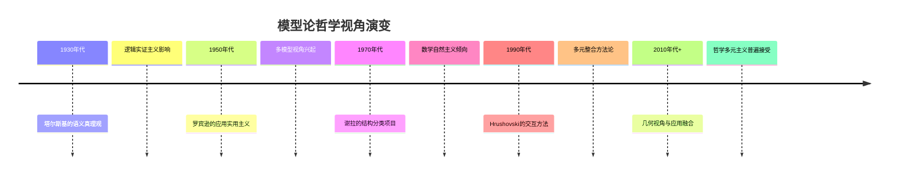

**实践中的哲学立场融合：**

在实际数学工作中，研究者常采取"本地哲学"方法，根据具体问题灵活采用不同哲学立场：

- **证明存在性**时采用柏拉图主义视角
- **构造模型**时采用构造主义工具
- **分类结构**时采用结构主义框架
- **应用结果**时采用自然主义态度

**多元整合的认知基础：**

从认知科学角度，多元哲学立场的并存可能反映了人类思维的基本特征：

1. **多重表征系统**：
   - 视觉空间表征（几何思维）
   - 符号序列表征（形式思维）
   - 关系网络表征（结构思维）

2. **补充性认知策略**：
   - 自上而下推理与自下而上构建
   - 模式识别与规则应用
   - 类比思考与形式演绎

**批判性反思与整合策略：**

多元哲学视角的并存引发的批判思考：

- **相对主义风险**：多元视角是否导致相对主义？
- **一致性挑战**：不同视角如何保持整体一致性？
- **实践考量**：哲学立场如何实际影响数学选择？

可能的整合策略包括：

1. **语境化哲学**：根据问题领域采用适当哲学视角
2. **方法论多元主义**：承认多种方法论途径的合理性
3. **实用主义整合**：基于成效而非先验立场评估方法
4. **元级思考**：发展能思考不同模式间转换的元理论

从更广的科学哲学角度看，模型论哲学视角的多元性可能不是缺陷，而是反映了数学思维的本质丰富性。正如物理学需要波粒二象性来完整描述光，数学理解可能也需要多元哲学视角来把握其全貌。

### 10.2 模型论与数学实践哲学

模型论不仅是数学的一个分支，也是观察和理解数学实践本身的独特窗口。它展示了形式化如何塑造数学思维，以及真实数学活动与其形式化之间的复杂关系。研究模型论与数学实践的关系，有助于深入理解数学作为人类活动的本质。

**形式化与实践的辩证关系：**

模型论处于形式化与实际数学实践的交界处，揭示二者的复杂互动：

1. **形式化的双重作用**：
   - **启发性**：形式化澄清概念，引发新问题
   - **限制性**：形式化可能限制思维，丧失直观

2. **实践-形式循环**：
   - 数学实践产生非形式化直觉
   - 直觉通过形式化获得精确表达
   - 形式系统产生新结果和问题
   - 新问题激发新的实践探索

3. **形式与直观的张力**：
   - 直观常超出形式能表达的范围
   - 形式可能产生违反直观的结果
   - 最佳实践需平衡形式严谨与直觉创造

**模型论视角下的数学知识特征：**

模型论提供了理解数学知识特性的独特视角：

| 知识特征 | 模型论解读 | 实践影响 |
|---------|-----------|---------|
| 确定性 | 相对于特定形式系统 | 多元解释可能性 |
| 普遍性 | 通过满足关系在模型中体现 | 关注不变性而非具体实例 |
| 必然性 | 基于公理选择的条件必然 | 公理选择的开放性 |
| 抽象性 | 通过结构同构性捕捉 | 同构思维作为理解工具 |

**数学创造过程的认知分析：**

从模型论与实践关系视角分析数学创造：

```mermaid
flowchart TD
    A[非形式直观] --> B[问题形式化]
    B --> C[形式系统探索]
    C -->

**区分度与稳定性谱系：**

不同数学理论可根据其模型论复杂性分类，形成一个从"简单"到"混沌"的谱系：

```mermaid
graph LR
    A[强极小] --> B[极小]
    B --> C[稳定]
    C --> D[NIP]
    D --> E[任意理论]
    
    style A fill:#e6f7ff
    style B fill:#e6f7ff
    style C fill:#ebf1de
    style D fill:#ffe6cc
    style E fill:#f5cccc
```

每个类别代表不同的结构复杂度，与数学中的自然边界相对应：

1. **强极小理论**
   - 模型特征：可定义集有良序维数
   - 代表案例：实闭域、p-adics
   - 数学对应：o-极小几何，半代数集

2. **稳定理论**
   - 核心特征：无复杂性増长分叉现象
   - 代表案例：代数闭域，可控模块
   - 数学对应：分类理论，几何稳定性

3. **NIP理论**（不具有独立性属性）
   - 特征：可定义集不包含无限独立集
   - 代表案例：实闭域，p-adics，有序阿贝尔群
   - 数学对应：测度论，不变量

**证明技术的认知隐喻：**

模型论证明技术蕴含了特定的认知隐喻：

| 技术方法 | 底层隐喻 | 认知操作 |
|---------|---------|---------|
| 紧致性论证 | 局部→全局 | 有限情境推广 |
| 超积构造 | 统计平均 | 集体到单一过渡 |
| 递饱和扩张 | 渐进完备化 | 逐步理想化 |
| 分叉理论 | 分枝路径 | 可能性空间探索 |

**模型论与相邻数学领域的界面：**

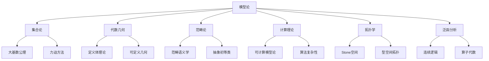

-**多元视角：历史人物对比**

| 思想家 | 模型论观点 | 哲学立场 | 核心贡献 |
|-------|----------|---------|---------|
| 塔尔斯基(Tarski) | 语义真理理论 | 逻辑实在论 | 满足关系，定义真理 |
| 罗宾逊(Robinson) | 模型建构工具 | 形式主义 | 非标准分析，模型完备性 |
| 莫德尔斯基(Morley) | 范畴性探索 | 结构主义 | $\aleph_1$-范畴性定理 |
| 谢尔顿(Shelah) | 分类计划 | 结构主义倾向 | 稳定性理论，分类理论 |
| 赫林(Hrushovski) | 几何整合视角 | 多元主义 | 几何稳定性理论，融合构造 |

-**认知表征与概念地图**

模型论的核心概念可通过以下概念地图可视化：

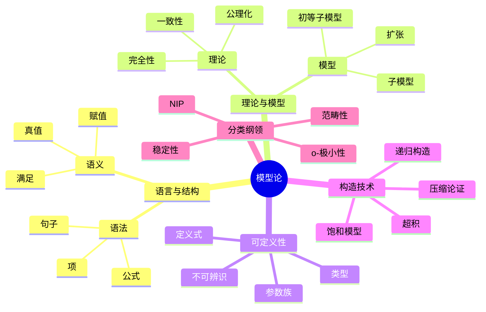

**形式证明与认知结构的映射：**

紧致性定理证明展示了形式证明与认知操作的对应关系：

1. **形式证明步骤**：

   ```text
   定理(紧致性): 如果理论T的每个有限子集都有模型，则T有模型。
   
   证明:
   - 设T的每个有限子集Fi都有模型Ai
   - 构造索引集I = {有限子集Fi}
   - 定义超积M = Π Ai/U (U为I上超滤子)
   - 证明M ⊨ T（通过Łoś定理）
   ```

2. **认知操作对应**：
   - 有限→无限推广（归纳思维）
   - 构造复合对象（整合复杂概念）
   - 应用保真性原理（结构保持映射）
   - 验证目标属性（假设检验）

这种对应展示了形式证明如何映射到基本认知操作，揭示了数学推理的认知基础。

## 11. 现代发展：模型论的多元交叉

### 11.1 几何模型论的突破

**新范式的兴起：**

几何模型论将代数几何与模型论方法融合，创立了新的研究范式：

- **赫林构造(Hrushovski Construction)**：
  - 理论基础：控制几何性质的"预几何"概念
  - 技术核心：有限构造的受控融合
  - 重大应用：反驳齐契宁猜想，构造新型几何

- **代数群与模型论**：
  - Zilber三歧性的几何应用
  - 代数群的模型伴侣与模块
  - 多维度稳定性与几何复杂度的联系

**形式化视角下的几何洞见：**

```math
定理(赫林-皮拉-萨克斯): 任何强极小结构中的有界定义集要么有空内部，要么是有限并个定义"细胞"。

证明构造:
1. 利用o-极小性质降维分析
2. 应用分层归纳法
3. 证明单元分解的存在性
4. 验证分解的一致性
```

这一定理展示了模型论如何揭示几何对象的内在结构，形成"可定义集几何学"。

### 11.2 随机结构与极限理论

**随机性与确定性的辩证关系：**

- **随机图的零一律**：
  - Erdős-Rényi随机图的极限行为
  - 渐近概率为0或1的一阶属性
  - 随机结构的模型伴侣理论

- **弗雷塞极限(Fraïssé Limits)**：
  - 同构类的通用结构构造
  - 有限结构的极限表示
  - 随机图作为弗雷塞极限的案例

**认知挑战与哲学问题：**

随机结构的模型论引发核心哲学问题：

- 确定性理论如何描述随机对象？
- 模型论中的极限概念与物理/哲学中极限的关系
- 随机性的确定性表达是否构成概念悖论？

### 11.3 可判定性理论与计算界面

**决策问题的模型论视角：**

可判定性理论展示了模型论与计算理论的深刻联系：

| 理论 | 可判定性状态 | 模型论特征 | 决定方法 |
|-----|------------|----------|---------|
| 实闭域 | 可判定 | 强极小 | 量词消去 |
| 代数闭域 | 可判定 | 强稳定 | 量词消去 |
| Presburger算术 | 可判定 | 局部o-极小 | 自动机 |
| Peano算术 | 不可判定 | 不稳定 | (不存在) |

**量词消去与计算复杂性：**

量词消去技术提供了一种统一的判定性视角：

1. 将一阶公式简化为无量词形式
2. 为理论提供决策程序
3. 揭示理论的模型论结构

### 11.4 元模型论的多层次视角

**模型论的自我指涉：**

元模型论探讨模型论自身的基础和限制：

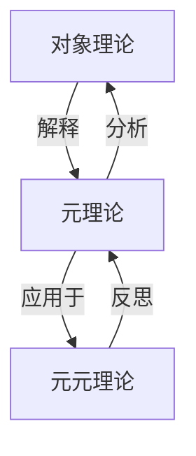

**塔尔斯基-瓦伊尔定理的深度反思：**

塔尔斯基-瓦伊尔定理表明真理无法在系统内完全定义，引发模型论的认识论界限思考：

- 理论与其模型之间的关系反映了形式与意义的张力
- 形式系统无法完全刻画其意图模型的局限
- 模型多样性反映了数学存在论的多元性

## 12. 综合视野：多维整合与未来发展

### 12.1 方法论综合与哲学反思

**多重视角的交织：**

模型论作为元数学的典范，展示了形式、语义、认知和历史维度的交织：

- **形式-语义辩证法**：语法形式与语义内容的相互塑造
- **个体-整体动态**：从单一结构到整体分类的认知运动
- **历史-概念发展**：概念如何在历史实践中精炼和重构

**认知局限与超越策略：**

面对认知复杂性，模型论发展出多种超越策略：

1. 通过隐喻提供直觉锚点
2. 通过形式化提供精确表达
3. 通过可视化提供空间理解
4. 通过历史叙事提供发展脉络

### 12.2 未来研究方向

**前沿领域与开放问题：**

1. **量子结构的模型论**：
   - 量子逻辑的模型论基础
   - 量子信息与连续模型论的融合
   - 纠缠态的可定义性质研究

2. **高阶模型论的复兴**：
   - 高阶逻辑的模型理论重新评估
   - 范畴论视角下的高阶语义学
   - 计算复杂性与高阶表达能力的权衡

3. **认知科学界面**：
   - 模型论操作与人类认知过程的映射
   - 数学直觉的形式化与模型论对应
   - 概念形成与数学实践的模型论分析

## 13. 概念地图与可视化表征

### 13.1 多层次概念整合

**核心概念的层级组织：**

```mermaid
flowchart TD
    A[模型论] --> B[语言层]
    A --> C[结构层]
    A --> D[理论层]
    A --> E[元理论层]
    
    B --> F[符号]
    B --> G[公式]
    B --> H[句子]
    
    C --> I[解释]
    C --> J[同构]
    C --> K[子结构]
    
    D --> L[公理组]
    D --> M[模型类]
    D --> N[定理系统]
    
    E --> O[完备性]
    E --> P[一致性]
    E --> Q[决定性]
```

### 13.2 历史发展时间线

**模型论的演进轨迹：**

```mermaid
timeline
    title 模型论的历史发展
    section 奠基阶段
      1930s : 塔尔斯基 : 真理定义与满足关系
      1940s : 古德尔 : 完备性定理与可构造宇宙
      1950s : 罗宾逊 : 非标准分析与模型完备化
    section 古典成熟期
      1960s : 莫德尔斯基 : 范畴性定理
      1970s : 谢尔顿 : 稳定性理论与分类程序
      1980s : 马基罗/伍德因 : 极小结构理论
    section 现代拓展期
      1990s : 赫林/皮拉 : 几何模型论
      2000s : 伊奥维诺/本-雅科夫 : 连续模型论
      2010s+ : 多领域应用与高级分类理论
```

### 13.3 理论间关系网络

**模型论与数学各分支的关联：**

```mermaid
graph LR
    A[模型论] --- B[数理逻辑]
    A --- C[代数]
    A --- D[几何]
    A --- E[拓扑]
    A --- F[分析]
    A --- G[计算理论]
    
    B --- B1[集合论]
    B --- B2[证明论]
    B --- B3[递归论]
    
    C --- C1[群论]
    C --- C2[域论]
    C --- C3[代数几何]
    
    D --- D1[微分几何]
    D --- D2[o-极小几何]
    
    E --- E1[点集拓扑]
    E --- E2[代数拓扑]
    
    F --- F1[泛函分析]
    F --- F2[测度论]
    
    G --- G1[可计算性]
    G --- G2[复杂性]
```

### 13.4 认知映射表征

**数学概念与认知过程的对应：**

| 模型论操作 | 认知过程 | 隐喻基础 |
|-----------|---------|---------|
| 构建模型 | 具体化抽象 | 容器隐喻 |
| 理论公理化 | 原则提取 | 本质抽取 |
| 证明定理 | 推理链接 | 路径隐喻 |
| 范畴性分析 | 结构识别 | 形式匹配 |
| 同构映射 | 模式转换 | 映射隐喻 |

## 14. 结语：模型论的多维价值

模型论作为形式语义学与数学结构研究的交叉地带，不仅提供了数学实践的基础工具，也揭示了形式与意义、语法与语义、局部与整体之间的深刻关系。其多维价值体现在：

1. **技术工具箱**：为数学提供构造、分类与证明的精确方法
2. **概念澄清器**：揭示数学概念的精确内涵和边界
3. **元理论镜像**：反映数学理论的内在结构和局限性
4. **认知映射**：展示抽象思维如何通过形式语言表达
5. **哲学启示**：引发关于实在、真理与知识的根本思考

在这场多维探索中，模型论不仅是一门专业数学学科，更是连接形式与意义的桥梁，照亮了数学结构、语言表达与人类思维之间的复杂互动。

## 附录A：模型论的实践应用与扩展视角

### A.1 模型论在数论中的应用

-**超越抽象：解决具体问题**

模型论在数论中展现出强大解题能力：

- **Ax-Kochen原理**：
  - 内容：几乎所有p，p-adic域上Artin猜想成立
  - 技术核心：超积方法与一阶等价性
  - 哲学意义：将无限多问题归约为单一结论

- **Pila-Wilkie定理及超越数应用**：
  - 技术：计算o-极小结构中定义集的有理点
  - 应用：André-Oort猜想、Manin-Mumford猜想的进展
  - 方法论创新：将几何模型论与超越数论结合

**形式化证明：**

```math
定理(Pila-Wilkie简化版): 设X是实数域上o-极小结构中的有限维定义集,
若X不包含半代数曲线,则X中高度≤T的有理点数量最多为c·T^ε(对任意ε>0)。

证明要点:
1. 将X分解为代数部分Xalg和超越部分Xtr
2. 对Xalg应用代数几何方法估计点数
3. 对Xtr应用o-极小几何得到关键上界
4. 综合结果得到整体点数估计
```

这类结果展示了模型论如何为数论提供超越传统方法的工具。

### A.2 模型论与计算机科学

**形式化与自动推理：**

模型论为计算机科学提供了严格基础：

- **形式验证系统**：
  - 基于模型论的程序语义学
  - SMT求解器中的量词消去算法
  - 形式证明系统中的模型检验

- **有限模型论**：
  - 数据库理论的逻辑基础
  - 描述复杂性与查询语言表达能力
  - 有限模型的计算复杂度分级

-**实用途径：从抽象到工程**

```mermaid
flowchart LR
    A[抽象模型论] --> B[有限模型论]
    B --> C[描述逻辑]
    C --> D[查询语言]
    D --> E[数据库系统]
    
    A --> F[决策程序]
    F --> G[SMT求解器]
    G --> H[程序验证]
    H --> I[安全软件]
```

这一路径图展示了从纯数学到实际应用的转化过程。

### A.3 科学哲学与模型论

**认识论维度：**

模型论提供了科学认识论的形式化框架：

- **模型与实在**：
  - 科学理论作为形式系统
  - 现实世界作为"意图模型"
  - 多模型现象与科学实在论的张力

- **理论等价与不可判定性**：
  - 经验等价理论的区分问题
  - 理论选择的哲学标准
  - 本体承诺的相对性

-**案例分析：量子力学解释**

量子力学的多种解释可视为同一形式理论的不同模型：

| 解释版本 | 数学对应 | 本体论承诺 | 模型论性质 |
|---------|---------|-----------|-----------|
| 哥本哈根解释 | 希尔伯特空间+测量公设 | 概率波函数 | 标准模型 |
| 多世界解释 | 无坍缩动力学 | 宇宙分支 | 非标准模型 |
| 玻姆力学 | 导引波方程 | 隐变量 | 保守扩展 |

这种分析揭示了物理理论解释与模型论中模型多样性的深刻类比。

### A.4 学习路径与教学视角

**认知发展序列：**

学习模型论的最优路径遵循认知复杂性阶梯：

1. **基础语言层**：
   - 形式语言的语法与语义
   - 一阶逻辑的表达能力
   - 满足关系的直观理解

2. **基本定理层**：
   - 完备性定理的多角度理解
   - 紧致性定理及其应用
   - 下洛文海姆-斯科伦定理

3. **构造方法层**：
   - 初等链构造
   - 超积方法
   - 饱和模型

4. **理论分类层**：
   - 范畴性与稳定性
   - 模型完备化
   - 可定义集几何

5. **前沿应用层**：
   - 特定数学领域应用
   - 交叉学科连接
   - 开放问题探索

**思考练习：**

针对不同理解层次的关键性思考问题：

1. 初始理解：构造一个理论的两个非同构模型，解释它们如何满足相同的句子。
2. 中级理解：解释为何标准自然数模型不能在一阶算术中刻画。
3. 高级理解：分析Morley定理中"可数范畴"与"超越可数范畴"间的差异。

## 附录B：开放问题与研究前沿

### B.1 当代研究热点

**活跃研究方向：**

1. **模型论与数论交叉**：
   - Zilber-Pink猜想的模型论方法
   - 模型论在双有理几何中的应用
   - 超越数理论中的定义性质

2. **无穷组合学联系**：
   - Ramsey理论的模型论解释
   - 极限结构的组合特性
   - NIP理论与正则性引理

3. **高级分类理论**：
   - 精细结构理论的发展
   - 更敏感的稳定性谱系
   - 超越一阶框架的分类

### B.2 核心开放问题

**理论挑战：**

1. **Vaught猜想**：
   - 问题：可数完全理论的可数模型数要么≤ℵ₀，要么=2^ℵ₀
   - 当前状态：仍未完全解决，部分情况证明
   - 意义：模型论完整性的测试案例

2. **谢尔顿猜想**：
   - 问题：简单理论的精细结构特征化
   - 方法：类型空间与分叉理论的细化
   - 挑战：需要新的概念工具

3. **极小结构的分类**：
   - 问题：存在特殊算术结构的o-极小扩张分类
   - 进展：实指数函数结构的部分结果
   - 路径：寻找"自然"极小结构的分类方法

## 附录C：术语表与形式定义

### C.1 基础术语精确定义

**精确术语表：**

- **结构**：$\mathcal{A} = (A, \{R_i^{\mathcal{A}}\}_{i \in I}, \{f_j^{\mathcal{A}}\}_{j \in J}, \{c_k^{\mathcal{A}}\}_{k \in K})$，其中$A$为论域，$R_i^{\mathcal{A}}$为关系解释，$f_j^{\mathcal{A}}$为函数解释，$c_k^{\mathcal{A}}$为常元解释。

- **满足关系**：$\mathcal{A} \models \varphi[a_1,...,a_n]$表示结构$\mathcal{A}$在变元赋值$v(x_i)=a_i$下满足公式$\varphi$。

- **初等等价**：结构$\mathcal{A}$和$\mathcal{B}$初等等价（记作$\mathcal{A} \equiv \mathcal{B}$）当且仅当它们满足完全相同的一阶句子集合。

- **类型**：元组$\bar{a}$在理论$T$中的完全类型$tp(\bar{a})$是所有$T$中$\bar{a}$满足的公式集合。

- **饱和模型**：结构$\mathcal{M}$称为$\kappa$-饱和的，如果对任意小于$\kappa$基数的参数集$A \subset M$，$\mathcal{M}$实现$A$上的每个一致类型。

### C.2 深层联系可视化

**数学领域与模型论方法的映射：**

```mermaid
mindmap
  root((模型论))
    代数应用
      域论
        代数闭域
        实闭域
        差分域
      群论
        稳定群
        可解群模型
      模块理论
        全纯模块
        Ziegler谱
    几何应用
      代数几何
        构造可定义几何
        模型伴侣
      微分几何
        o-极小流形
        定义流
      组合几何
        Zilber三歧性
        几何稳定性
    分析应用
      函数分析
        巴拿赫空间
        C*代数
      微分方程
        模型完备化
        稳定性分析
      测度论
        NIP理论
        定义测度
    逻辑应用
      集合论
        内模型
        力迫解释
      计算理论
        决策问题
        描述复杂性
      证明论
        非标准证明
        逻辑强度分析
```

## 附录D：参考书目与阅读指南

### D.1 分级参考文献

**基础入门资源：**

1. Marker, D. (2002). *Model Theory: An Introduction*. Springer.
2. Hodges, W. (1997). *A Shorter Model Theory*. Cambridge University Press.

**中级专题发展：**

1. Tent, K., & Ziegler, M. (2012). *A Course in Model Theory*. Cambridge University Press.
2. Poizat, B. (2000). *A Course in Model Theory*. Springer.

**高级研究专著：**

1. Shelah, S. (1990). *Classification Theory*. North-Holland.
2. Pillay, A. (1996). *Geometric Stability Theory*. Oxford University Press.
3. van den Dries, L. (1998). *Tame Topology and O-minimal Structures*. Cambridge University Press.

**跨学科连接：**

1. Kanovei, V., & Reeken, M. (2004). *Nonstandard Analysis, Axiomatically*. Springer.
2. Ebbinghaus, H.D., & Flum, J. (2005). *Finite Model Theory*. Springer.

这一多层次参考体系旨在为不同背景和目标的读者提供适当的学习路径，从基础概念到前沿研究的自然过渡。
