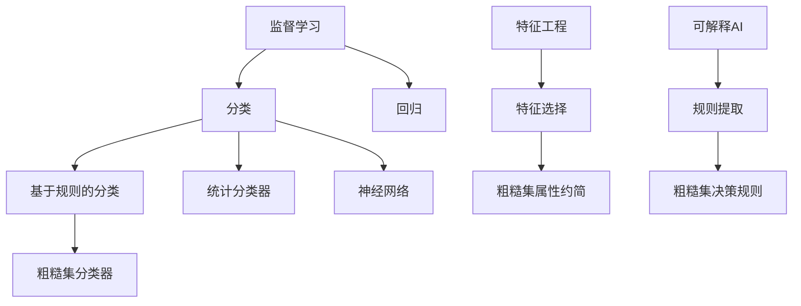
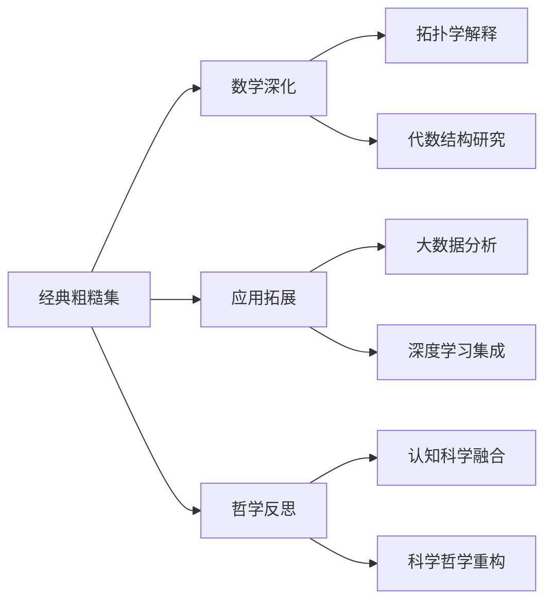

# 粗糙集合论(Rough Set Theory)的批判性分析

## 目录

- [粗糙集合论(Rough Set Theory)的批判性分析](#粗糙集合论rough-set-theory的批判性分析)
  - [目录](#目录)
  - [理论基础与本体论](#理论基础与本体论)
    - [形式化定义](#形式化定义)
  - [核心定理与严格证明](#核心定理与严格证明)
    - [定理1：粗糙集基本性质](#定理1粗糙集基本性质)
    - [定理2：粗糙度测度](#定理2粗糙度测度)
    - [定理3：可辨识性与不确定性关系](#定理3可辨识性与不确定性关系)
  - [认知表征与粗糙集](#认知表征与粗糙集)
    - [认知层次模型](#认知层次模型)
  - [历史发展与理论派别](#历史发展与理论派别)
    - [Pawlak学派（经典粗糙集）](#pawlak学派经典粗糙集)
    - [Yao学派（基于邻域的粗糙集）](#yao学派基于邻域的粗糙集)
    - [决策理论学派](#决策理论学派)
    - [粒度计算学派](#粒度计算学派)
  - [元理论比较与批判](#元理论比较与批判)
    - [与模糊集合论比较](#与模糊集合论比较)
    - [与概率论比较](#与概率论比较)
  - [形式科学与计算机科学视角](#形式科学与计算机科学视角)
    - [计算复杂性分析](#计算复杂性分析)
    - [与机器学习的理论联系](#与机器学习的理论联系)
  - [哲学反思与认识论挑战](#哲学反思与认识论挑战)
    - [批判性思考的层次结构](#批判性思考的层次结构)
  - [理论局限与未来方向](#理论局限与未来方向)
    - [核心局限性](#核心局限性)
    - [理论扩展方向](#理论扩展方向)
    - [深度与广度发展路径](#深度与广度发展路径)
  - [思维导图：粗糙集理论的多维视角](#思维导图粗糙集理论的多维视角)

## 理论基础与本体论

粗糙集合论由波兰数学家Zdzisław Pawlak于1982年提出，建立在以下关键本体论假设上：

1. **不确定性的内在性**：认为不确定性源于知识粒度，而非传统概率论视角下的随机性
2. **近似等价性**：以近似等价替代传统集合论的精确归属
3. **三域划分**：将传统的"属于/不属于"二分法扩展为"必然属于/可能属于/必然不属于"

### 形式化定义

设$U$为论域(全集)，$R$为$U$上的等价关系，则$(U,R)$构成一个近似空间。对任意$X \subseteq U$:

- 下近似：$\underline{R}(X) = \{x \in U \mid [x]_R \subseteq X\}$
- 上近似：$\overline{R}(X) = \{x \in U \mid [x]_R \cap X \neq \emptyset\}$
- 边界区域：$BN_R(X) = \overline{R}(X) - \underline{R}(X)$

本体论意义：下近似代表"确定属于"，上近似代表"可能属于"，边界区域代表"认知模糊区"。

## 核心定理与严格证明

### 定理1：粗糙集基本性质

**命题**：对于任意$X, Y \subseteq U$，以下性质成立：

1. $\underline{R}(X) \subseteq X \subseteq \overline{R}(X)$
2. $\underline{R}(\emptyset) = \overline{R}(\emptyset) = \emptyset$，$\underline{R}(U) = \overline{R}(U) = U$
3. $\overline{R}(X \cup Y) = \overline{R}(X) \cup \overline{R}(Y)$
4. $\underline{R}(X \cap Y) = \underline{R}(X) \cap \underline{R}(Y)$
5. $X \subseteq Y \Rightarrow \underline{R}(X) \subseteq \underline{R}(Y)$且$\overline{R}(X) \subseteq \overline{R}(Y)$
6. $\underline{R}(X^c) = (\overline{R}(X))^c$且$\overline{R}(X^c) = (\underline{R}(X))^c$

**严格证明(性质3)**：
要证明$\overline{R}(X \cup Y) = \overline{R}(X) \cup \overline{R}(Y)$

对任意$x \in \overline{R}(X \cup Y)$，根据定义有$[x]_R \cap (X \cup Y) \neq \emptyset$
即$([x]_R \cap X) \cup ([x]_R \cap Y) \neq \emptyset$
所以$[x]_R \cap X \neq \emptyset$或$[x]_R \cap Y \neq \emptyset$
因此$x \in \overline{R}(X)$或$x \in \overline{R}(Y)$，即$x \in \overline{R}(X) \cup \overline{R}(Y)$

反之，若$x \in \overline{R}(X) \cup \overline{R}(Y)$，则$x \in \overline{R}(X)$或$x \in \overline{R}(Y)$
即$[x]_R \cap X \neq \emptyset$或$[x]_R \cap Y \neq \emptyset$
所以$[x]_R \cap (X \cup Y) \neq \emptyset$
因此$x \in \overline{R}(X \cup Y)$

综上所述，$\overline{R}(X \cup Y) = \overline{R}(X) \cup \overline{R}(Y)$。

### 定理2：粗糙度测度

**命题**：集合$X$相对于关系$R$的粗糙度定义为：
$$\rho_R(X) = 1 - \frac{|\underline{R}(X)|}{|\overline{R}(X)|}$$

当且仅当$BN_R(X) = \emptyset$时，$\rho_R(X) = 0$（$X$为$R$-精确集）；
当$BN_R(X) \neq \emptyset$时，$\rho_R(X) > 0$（$X$为$R$-粗糙集）。

**证明**：
若$BN_R(X) = \emptyset$，则$\overline{R}(X) = \underline{R}(X)$，因此$\rho_R(X) = 1 - \frac{|\underline{R}(X)|}{|\overline{R}(X)|} = 1 - \frac{|\underline{R}(X)|}{|\underline{R}(X)|} = 0$

若$BN_R(X) \neq \emptyset$，则$\overline{R}(X) \supset \underline{R}(X)$，因此$|\overline{R}(X)| > |\underline{R}(X)|$，所以$\rho_R(X) = 1 - \frac{|\underline{R}(X)|}{|\overline{R}(X)|} > 0$

### 定理3：可辨识性与不确定性关系

**命题**：设$P, Q \subseteq A$为属性集，则$IND(P) \subseteq IND(Q)$当且仅当$Q$蕴含$P$（即$Q$的分辨能力不弱于$P$）。

这一定理建立了属性依赖关系与分类能力间的严格数学联系。

## 认知表征与粗糙集

粗糙集理论与认知表征的关系可通过以下对应关系理解：

| 粗糙集概念 | 认知过程 | 表征特性 |
|----------|---------|--------|
| 等价类 | 概念形成 | 将相似事物归为一类 |
| 下近似 | 确定性知识 | 无歧义的认知判断 |
| 上近似 | 可能性推理 | 基于现有知识的合理外推 |
| 边界区域 | 认知模糊区 | 知识不足导致的判断犹豫 |
| 粗糙度 | 认知不确定性 | 对概念模糊程度的量化 |

### 认知层次模型

```text
第三层：元认知层（认识到知识局限） ───────┐
                                       │
                                       ↓
第二层：规则认知层（归纳决策规则） ←────→ 粗糙集理论
                                       ↑
                                       │
第一层：感知分类层（形成等价类）   ───────┘
```

粗糙集理论提供了一种形式化认知不确定性的数学工具，符合人类认知中"确定-可能-不确定"的三分法。
认知科学研究表明，大脑对信息处理的粒度自适应现象，与粗糙集中多层次粒度计算存在显著相似性。

## 历史发展与理论派别

### Pawlak学派（经典粗糙集）

- **核心思想**：基于等价关系的不可分辨性
- **代表人物**：Zdzisław Pawlak, Roman Słowiński
- **理论贡献**：建立基础数学框架，强调属性约简和决策规则
- **批判视角**：过度依赖离散数据，对连续属性处理不足

### Yao学派（基于邻域的粗糙集）

- **核心思想**：以邻域系统替代等价关系
- **代表人物**：Y.Y. Yao, T.Y. Lin
- **理论贡献**：引入拓扑学视角，扩展到容忍关系
- **批判视角**：邻域参数选择缺乏理论指导

### 决策理论学派

- **核心思想**：融合贝叶斯决策与粗糙集
- **代表人物**：W. Ziarko (VPRS), D. Ślęzak
- **理论贡献**：变精度粗糙集(VPRS)，引入成本敏感决策
- **批判视角**：可能导致过拟合，参数选择复杂

### 粒度计算学派

- **核心思想**：粗糙集作为多粒度信息处理框架
- **代表人物**：L.A. Zadeh, T.Y. Lin, J.T. Yao
- **理论贡献**：建立粒度计算形式体系，连接认知计算
- **批判视角**：理论过于抽象，实用性有限

## 元理论比较与批判

### 与模糊集合论比较

| 维度 | 粗糙集合论 | 模糊集合论 |
|-----|----------|----------|
| 不确定性来源 | 知识不完备性 | 概念模糊性 |
| 数学表示 | 上/下近似 | 隶属度函数 |
| 主观性程度 | 较低（基于观察） | 较高（依赖隶属度设定） |
| 决策机制 | 基于规则归纳 | 基于隶属度计算 |
| 哲学基础 | 知识论（认识论） | 语义论（语言学） |

**批判分析**：粗糙集理论强调不确定性源于知识粗糙，而非对象本身的模糊；模糊集则认为对象自身具有模糊隶属度。两种理论反映不同维度的不确定性，粗糙集更符合科学认识的客观性要求，但建立在"等价关系"这一过于理想化假设上。

### 与概率论比较

| 维度 | 粗糙集合论 | 概率论 |
|-----|----------|-------|
| 不确定性表征 | 上/下近似边界 | 概率分布 |
| 数学基础 | 集合论与关系 | 测度论 |
| 解释框架 | 认识论不确定性 | 随机性不确定性 |
| 参数依赖 | 无参数（经典） | 依赖概率估计 |
| 对先验知识要求 | 低 | 高 |

**批判分析**：粗糙集理论不需要概率分布假设，适用于先验知识缺乏的场景；但其表达能力不如概率论丰富，难以有效处理随机现象。两种理论针对不同类型的不确定性，相互补充而非替代。

## 形式科学与计算机科学视角

### 计算复杂性分析

粗糙集理论中的核心计算问题及其复杂性：

1. **属性约简计算**：寻找最小属性子集，保持分辨能力不变
   - 复杂度：NP-难问题
   - 证明：可通过归约至集合覆盖问题
   - 启发式算法：贪婪搜索、遗传算法、粒子群优化

2. **决策规则提取**：从决策表生成最小规则集
   - 复杂度：NP-难问题
   - 近似算法：LEM2算法、规则剪枝

3. **近似质量计算**：对大数据集合的上下近似计算
   - 复杂度：O(|U|²)（朴素算法）
   - 优化方法：哈希技术、分布式计算

### 与机器学习的理论联系

粗糙集理论在机器学习框架中的位置：



粗糙集为机器学习提供了特征选择、分类决策和规则提取的形式化方法，其主要优势在于可解释性和处理不完备数据的能力。然而，其局限在于计算复杂度和对噪声数据的敏感性。

## 哲学反思与认识论挑战

粗糙集理论对传统认识论提出的挑战：

1. **边界模糊性**：挑战了传统集合论中清晰边界假设，引入"边界区域"概念
2. **三值逻辑**：从"真/假"二值逻辑扩展到"真/可能/假"三值逻辑
3. **知识相对性**：知识依赖于信息粒度，不存在绝对精确的认知
4. **暂时性不可知**：区分"原则上不可知"与"当前知识下不可辨"

### 批判性思考的层次结构

```text
第四层：元理论反思
    │   （粗糙集如何改变我们对知识本质的理解？）
    ↓
第三层：理论局限性审视
    │   （粗糙集的基本假设是否合理？）
    ↓
第二层：应用适用性批判
    │   （何时应用/不应用粗糙集？）
    ↓
第一层：内部一致性检验
    │   （粗糙集理论自洽吗？）
```

Pawlak的粗糙集理论展现了一种独特的认识论立场：在不同的知识粒度和视角下，同一对象可能有不同的分类。
这挑战了西方哲学传统中的本质主义，更接近现象学对"视角依赖性"的强调。

## 理论局限与未来方向

### 核心局限性

1. **等价关系限制**：现实世界关系常不满足自反、对称和传递性
2. **静态性**：标准粗糙集难以处理动态变化的信息系统
3. **计算复杂度**：核心算法（特别是属性约简）计算开销大
4. **噪声敏感性**：对数据中的噪声和异常值敏感
5. **连续数据处理**：需要预先离散化，可能丢失信息

### 理论扩展方向

1. **动态粗糙集**：形式化时变信息系统中的近似操作
2. **基于优势关系的粗糙集**：处理序数数据的多准则决策
3. **三支决策粗糙集**：引入延迟决策区域，更符合实际决策过程
4. **粒计算整合框架**：统一不同粒度计算方法
5. **量子粗糙集**：利用量子计算加速粗糙集算法

### 深度与广度发展路径



## 思维导图：粗糙集理论的多维视角

```text
粗糙集合论
├── 数学基础
│   ├── 近似空间 (U,R)
│   ├── 上/下近似算子
│   ├── 边界区域
│   └── 粗糙度测度
│
├── 核心定理体系
│   ├── 近似集合代数性质
│   ├── 属性依赖定理
│   ├── 约简存在性定理
│   └── 决策保持定理
│
├── 认知表征
│   ├── 概念近似形式化
│   ├── 知识粒度与不确定性
│   ├── 多粒度认知框架
│   └── 认知分类的数学模型
│
├── 理论流派
│   ├── 经典Pawlak学派
│   ├── 邻域粗糙集学派
│   ├── 决策理论学派
│   └── 粒度计算学派
│
├── 元理论比较
│   ├── vs. 模糊集合论
│   ├── vs. 证据理论
│   ├── vs. 概率论
│   └── vs. 形式概念分析
│
├── 计算科学视角
│   ├── 算法复杂性分析
│   ├── 启发式优化技术
│   ├── 并行计算策略
│   └── 大规模数据处理
│
├── 哲学思考
│   ├── 认识论重构
│   ├── 三值逻辑基础
│   ├── 知识相对性原则
│   └── 不确定性本体论
│
└── 未来发展
    ├── 动态粗糙集
    ├── 量子粗糙集计算
    ├── 深度学习集成
    └── 认知计算框架
```

通过这一多维视角分析，我们看到粗糙集理论不仅是一种数学工具，更是一种认识论框架，它挑战了传统知识表征的确定性假设，为不确定性和知识边界提供了形式化处理方法。其理论价值不仅在于解决具体问题，更在于提供了一种认识世界的新视角。
