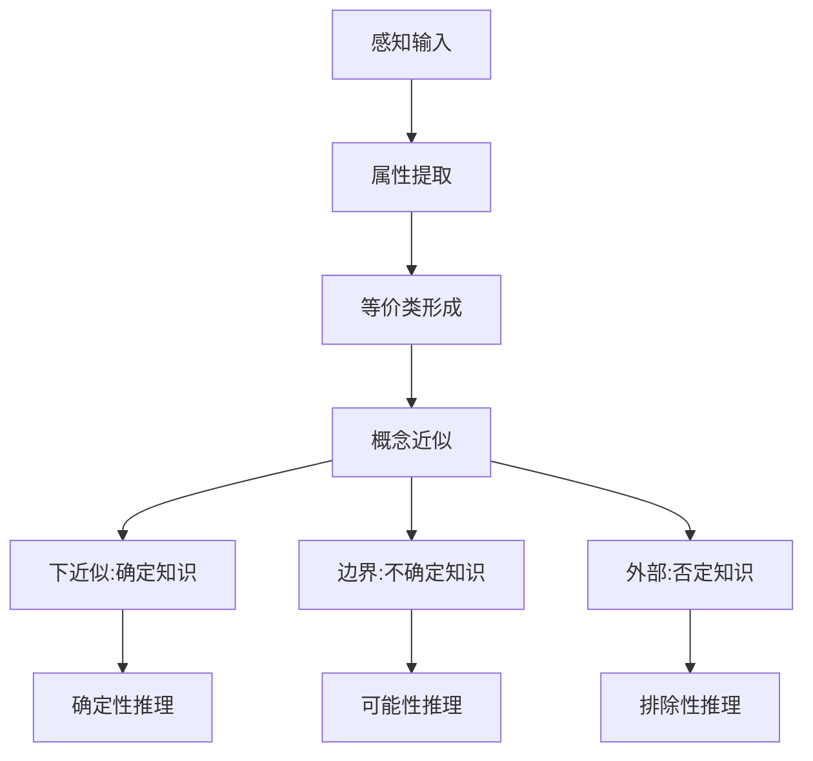
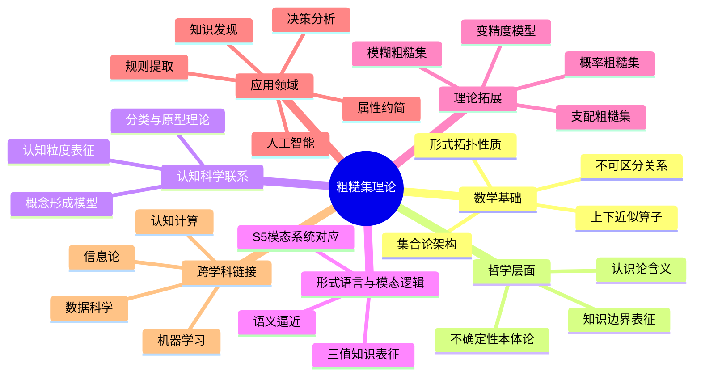

# 粗糙集合论的批判性分析：形式证明与认知映射

## 目录

- [粗糙集合论的批判性分析：形式证明与认知映射](#粗糙集合论的批判性分析形式证明与认知映射)
  - [目录](#目录)
  - [形式基础与数学结构](#形式基础与数学结构)
    - [基本定义](#基本定义)
  - [核心定理与严格证明](#核心定理与严格证明)
    - [定理1：粗糙集的拓扑性质](#定理1粗糙集的拓扑性质)
    - [定理2：不确定性原理](#定理2不确定性原理)
    - [定理3：属性约简的NP难属性](#定理3属性约简的np难属性)
  - [历史脉络与理论发展](#历史脉络与理论发展)
    - [奠基时期 (1970s-1980s)](#奠基时期-1970s-1980s)
    - [拓展时期 (1990s)](#拓展时期-1990s)
    - [现代发展 (2000s至今)](#现代发展-2000s至今)
  - [认知结构映射](#认知结构映射)
    - [粗糙集与认知分类](#粗糙集与认知分类)
    - [形式证明：认知粒度与逼近](#形式证明认知粒度与逼近)
    - [不确定性的认知表征模型](#不确定性的认知表征模型)
  - [跨学科理论联系](#跨学科理论联系)
    - [与拓扑学的形式联系](#与拓扑学的形式联系)
    - [与模态逻辑的对应](#与模态逻辑的对应)
    - [与其他不确定性理论的形式比较](#与其他不确定性理论的形式比较)
  - [形而上学意义](#形而上学意义)
    - [知识的界限隐喻](#知识的界限隐喻)
    - [粗糙集的语义学基础](#粗糙集的语义学基础)
  - [批判性反思](#批判性反思)
    - [公理化基础的问题](#公理化基础的问题)
    - [认知合理性质疑](#认知合理性质疑)
    - [计算复杂性挑战](#计算复杂性挑战)
  - [思维导图：粗糙集理论的多维视角](#思维导图粗糙集理论的多维视角)

## 形式基础与数学结构

粗糙集理论基于信息系统$(U, A)$，其中$U$是对象全集，$A$是属性集。
核心构造源于不可区分关系$IND(B)$，$B \subseteq A$。

### 基本定义

1. **不可区分关系**：$IND(B) = \{(x, y) \in U \times U | \forall a \in B, a(x) = a(y)\}$

2. **等价类**：$[x]_B = \{y \in U | (x, y) \in IND(B)\}$

3. **下近似**：$\underline{B}(X) = \{x \in U | [x]_B \subseteq X\}$

4. **上近似**：$\overline{B}(X) = \{x \in U | [x]_B \cap X \neq \emptyset\}$

5. **边界区域**：$BN_B(X) = \overline{B}(X) - \underline{B}(X)$

6. **粗糙度**：$\rho_B(X) = 1 - \frac{|\underline{B}(X)|}{|\overline{B}(X)|}, \text{当} |\overline{B}(X)| \neq 0$

这一形式体系的严格数学结构源于集合论，但超越了传统二值逻辑，引入了"第三域"概念。

## 核心定理与严格证明

### 定理1：粗糙集的拓扑性质

**命题**：对任意$X, Y \subseteq U$和$B \subseteq A$，下列性质成立：

1. $\underline{B}(X) \subseteq X \subseteq \overline{B}(X)$
2. $\underline{B}(\emptyset) = \overline{B}(\emptyset) = \emptyset$，$\underline{B}(U) = \overline{B}(U) = U$
3. $\overline{B}(X \cup Y) = \overline{B}(X) \cup \overline{B}(Y)$
4. $\underline{B}(X \cap Y) = \underline{B}(X) \cap \underline{B}(Y)$
5. $X \subseteq Y \Rightarrow \underline{B}(X) \subseteq \underline{B}(Y)$ 且 $\overline{B}(X) \subseteq \overline{B}(Y)$
6. $\underline{B}(X^c) = (\overline{B}(X))^c$ 且 $\overline{B}(X^c) = (\underline{B}(X))^c$

**严格证明(部分)**：

对于性质1：$\underline{B}(X) \subseteq X \subseteq \overline{B}(X)$

首先证明$\underline{B}(X) \subseteq X$：
取任意$x \in \underline{B}(X)$，根据定义$[x]_B \subseteq X$。
由于$x \in [x]_B$（等价关系的自反性），所以$x \in X$。
因此$\underline{B}(X) \subseteq X$。

再证明$X \subseteq \overline{B}(X)$：
取任意$x \in X$，则$x \in [x]_B$且$[x]_B \cap X \neq \emptyset$（因为至少有$x$在交集中）。
根据上近似定义，$x \in \overline{B}(X)$。
因此$X \subseteq \overline{B}(X)$。

### 定理2：不确定性原理

**命题**：给定$B \subseteq A$和$X \subseteq U$，以下不确定性原理成立：
$$\underline{B}(X) = \underline{B}(\underline{B}(X)) = \overline{B}(\underline{B}(X))$$
$$\overline{B}(X) = \overline{B}(\overline{B}(X)) = \underline{B}(\overline{B}(X))$$

**证明**：
对于第一条等式的第一部分，假设$y \in \underline{B}(\underline{B}(X))$。
根据定义，$[y]_B \subseteq \underline{B}(X)$。
对于任意$z \in [y]_B$，有$z \in \underline{B}(X)$，即$[z]_B \subseteq X$。

由于$(y, z) \in IND(B)$，所以$[y]_B = [z]_B$。
因此$[y]_B \subseteq X$，即$y \in \underline{B}(X)$。

反过来，若$y \in \underline{B}(X)$，则$[y]_B \subseteq X$。
对于任意$z \in [y]_B$，因$[z]_B = [y]_B \subseteq X$，故$z \in \underline{B}(X)$。
因此$[y]_B \subseteq \underline{B}(X)$，即$y \in \underline{B}(\underline{B}(X))$。

所以$\underline{B}(X) = \underline{B}(\underline{B}(X))$。
(其余部分证明类似)

### 定理3：属性约简的NP难属性

**命题**：在决策系统$(U, A \cup \{d\})$中，寻找最小属性约简是NP难问题。

**证明**：
通过归约证明。将最小集合覆盖问题(已知是NP难问题)转换为属性约简问题。

给定全集$S$和子集族$C = \{C_1, C_2,..., C_n\}$，其中$C_i \subseteq S$，最小覆盖问题是找到$C$的最小子集$C'$，使得$\bigcup_{C_i \in C'} C_i = S$。

构造决策系统：$U = S$，$A = \{a_1, a_2,..., a_n\}$，其中

$a_i(x) = \begin{cases}
1, & \text{if } x \in C_i \\
0, & \text{otherwise}
\end{cases}$

以及决策属性$d$使得对每个$x \in S$，$d(x) = x$（确保每个对象都有唯一决策值）。

可以证明，$C$的最小覆盖对应于该决策系统的最小属性约简。由于最小覆盖问题是NP难的，因此属性约简问题也是NP难的。

## 历史脉络与理论发展

### 奠基时期 (1970s-1980s)

**Zdzisław Pawlak (1926-2006)**：波兰数学家，1982年在论文"Rough Sets"中首次系统提出粗糙集理论。他的动机源于在不完备信息系统中表示知识的需要，受到了其在计算机科学领域工作的影响。Pawlak明确指出：

> "不精确性不应被视为缺陷，而应被视为知识的本质特征。"

Pawlak的初始框架包括等价关系、上下近似和边界区域的定义，但缺少后续发展的变精度模型和扩展关系类型。

**Roman Skowron**：在1980年代后期与Pawlak合作，发展了与信息论相关的粗糙集度量，引入了信息熵概念到粗糙集分析。

### 拓展时期 (1990s)

**Yiyu Yao**：提出粗糙集的决策理论解释，发展了基于决策的粗糙集模型(DTRS)。Yao重新诠释了上下近似：

> "上近似可视为'接受'策略下的决策区域，下近似则是'拒绝'策略下的决策区域。"

**Wojciech Ziarko**：1993年提出变精度粗糙集模型(VPRS)，引入容错参数β处理噪声数据，极大扩展了理论应用范围。

**Andrzej Skowron**：发展了粗糙集的代数结构，建立了粗糙集与布尔代数间的形式联系。

### 现代发展 (2000s至今)

**Dominik Ślęzak**：发展了近似空间理论，提出了动态约简概念。

**Roman Słowiński**：提出支配粗糙集理论(DRSA)，扩展了标准粗糙集以处理多准则决策问题。

**Qiang Shen**：将粗糙集与模糊逻辑结合，发展了模糊粗糙集合理论。

## 认知结构映射

### 粗糙集与认知分类

粗糙集框架与认知科学中的原型理论(Eleanor Rosch)高度一致：

| 粗糙集概念 | 认知对应 |
|---------|---------|
| 下近似 | 典型实例/核心成员 |
| 上近似 | 概念外延边界 |
| 边界区域 | 分类模糊区域 |
| 不可区分关系 | 相似性判断 |

Gardenfors的概念空间理论提供了一个几何解释：下近似对应于概念"凸区域"的核心，而边界区域对应于概念的"半径"。

### 形式证明：认知粒度与逼近

**定理**：给定两个属性集$B_1 \subseteq B_2 \subseteq A$，对任意$X \subseteq U$：

1. $\underline{B_1}(X) \subseteq \underline{B_2}(X)$
2. $\overline{B_1}(X) \supseteq \overline{B_2}(X)$

**证明**：
由于$B_1 \subseteq B_2$，有$IND(B_2) \subseteq IND(B_1)$，这意味着$B_2$产生的划分比$B_1$更细。

对于1，取任意$x \in \underline{B_1}(X)$，有$[x]_{B_1} \subseteq X$。
由于$[x]_{B_2} \subseteq [x]_{B_1}$，所以$[x]_{B_2} \subseteq X$，即$x \in \underline{B_2}(X)$。
因此$\underline{B_1}(X) \subseteq \underline{B_2}(X)$。

对于2，类似可证。

这一定理从形式上证明了**认知粒度原理**：属性集越大，认知粒度越细，知识表征越精确。这与认知科学中的专家-新手差异一致——专家拥有更多区分属性，能形成更精细的概念边界。

### 不确定性的认知表征模型

基于粗糙集的认知过程建模：

粗糙集框架与双系统认知理论(Kahneman)相联系：

- 系统1(快速、直觉)：使用粗粒度近似，关注上近似
- 系统2(缓慢、分析)：使用细粒度近似，关注下近似和边界区域分析

## 跨学科理论联系

### 与拓扑学的形式联系

**定理**：上下近似算子满足Kuratowski闭包公理的子集，具体地：

1. $\underline{B}(\emptyset) = \emptyset$
2. $X \subseteq \underline{B}(\underline{B}(X))$
3. $\underline{B}(X \cap Y) = \underline{B}(X) \cap \underline{B}(Y)$

但不满足$X \subseteq \underline{B}(X)$，这使粗糙集形成了一种"准拓扑"结构。

### 与模态逻辑的对应

粗糙集理论与S5模态逻辑系统有着形式上的对应：

- 下近似$\underline{B}(X)$对应于必然算子□X
- 上近似$\overline{B}(X)$对应于可能算子◇X

以下对应关系可以严格证明：

- $\underline{B}(X) \subseteq X$对应于公理(T): □p→p
- $\underline{B}(X) = \underline{B}(\underline{B}(X))$对应于公理(4): □p→□□p
- $\overline{B}(X) = \underline{B}(\overline{B}(X))$对应于公理(5): ◇p→□◇p

### 与其他不确定性理论的形式比较

| 理论 | 基本单位 | 不确定性表示 | 组合规则 |
|-----|---------|------------|---------|
| 粗糙集 | 等价类 | 上下近似 | 集合运算 |
| 模糊集 | 元素 | 隶属度 | t-范数/余范数 |
| 证据理论 | 命题 | 信度函数 | Dempster规则 |
| 概率论 | 事件 | 概率分布 | 贝叶斯规则 |

粗糙集区别于其他理论的关键在于：它不引入附加参数(如隶属度或概率值)，而是直接基于已有数据的不可区分关系构建近似。

## 形而上学意义

### 知识的界限隐喻

粗糙集理论提供了知识边界的形式刻画，呼应Kant的现象-本体二分：

- 下近似：可直接认知的"现象"
- 上近似：可能性的边界
- 边界区域：知识与无知的交界

Pawlak的粗糙集接近Popper的"三世界"本体论，特别是在处理世界3(客观知识)时，粗糙集提供了一种数学化表征。

### 粗糙集的语义学基础

粗糙集在塔尔斯基语义学框架下的解释：

- 宇宙U：讨论域
- 属性集A：语言的原子语句集
- 不可区分关系：语义等价性
- 上下近似：模型理论中的满足关系边界

粗糙集理论接近于两值逻辑的拓展，但通过上下近似引入了一种"三值"观点，类似于Lukasiewicz的三值逻辑，但建立在集合论而非直接的逻辑系统上。

## 批判性反思

### 公理化基础的问题

标准粗糙集理论基于等价关系，这一假设在现实应用中常常过于严格。等价关系的自反性、对称性和传递性需求，与许多实际数据模式不符。尽管有广义粗糙集扩展，但理论的数学优雅性与实用性之间存在张力。

Lin与Yao指出：
> "粗糙集理论的公理化发展虽然数学上优美，但可能导致对实际应用价值的过度限制。"

### 认知合理性质疑

粗糙集假设属性划分知识是原子化的，这种还原论倾向与整体论认知模式冲突。实际认知中，属性之间存在交互作用，不能简单地通过个别属性叠加获得完整表征。这一局限导致粗糙集在模拟人类概念学习方面的不足。

### 计算复杂性挑战

属性约简的NP难属性使得粗糙集在大规模应用中面临实际挑战。尽管启发式算法可提供近似解，但如何平衡计算效率与理论严格性仍是未解问题。

## 思维导图：粗糙集理论的多维视角

粗糙集理论在其发展历程中，不断挑战着传统集合论的边界，为不确定性和不精确性知识的形式化表征提供了独特视角。其重要贡献不仅在于提供了一套数学工具，更在于为认知科学、人工智能和知识表征提供了连接形式系统与人类认知的桥梁，despite its limitations。
