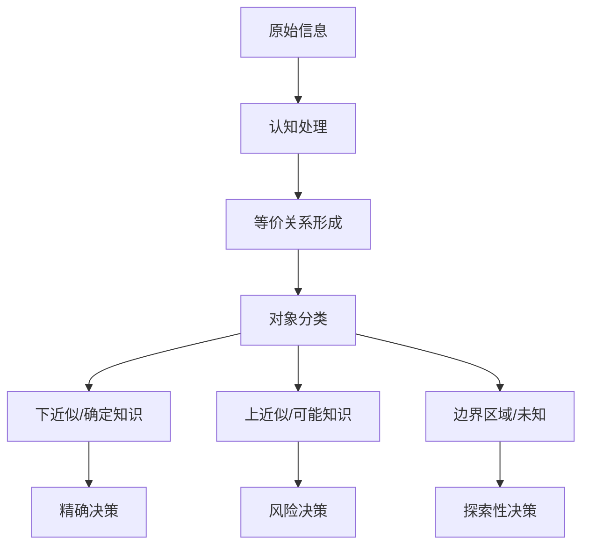

# 粗糙集合论的批判性分析：理论基础、形式证明与认知解读

## 目录

- [粗糙集合论的批判性分析：理论基础、形式证明与认知解读](#粗糙集合论的批判性分析理论基础形式证明与认知解读)
  - [目录](#目录)
  - [数学基础与形式化](#数学基础与形式化)
    - [基本概念与定义](#基本概念与定义)
    - [核心定理与严格证明](#核心定理与严格证明)
    - [数学结构分析](#数学结构分析)
  - [历史发展与思想脉络](#历史发展与思想脉络)
    - [Pawlak的原初视角](#pawlak的原初视角)
    - [扩展理论贡献者](#扩展理论贡献者)
    - [多元思想交汇](#多元思想交汇)
  - [认知结构与表征](#认知结构与表征)
    - [粗糙性与人类认知限制](#粗糙性与人类认知限制)
    - [知识表征的粒度视角](#知识表征的粒度视角)
    - [不确定性的认知模型](#不确定性的认知模型)
  - [形式科学联系](#形式科学联系)
    - [拓扑学解读](#拓扑学解读)
    - [信息论视角](#信息论视角)
    - [集合论扩展](#集合论扩展)
  - [计算机科学与AI应用](#计算机科学与ai应用)
    - [机器学习算法基础](#机器学习算法基础)
    - [知识发现框架](#知识发现框架)
    - [可解释AI联系](#可解释ai联系)
  - [哲学与认识论思考](#哲学与认识论思考)
    - [边界知识的本体论](#边界知识的本体论)
    - [认识论批判](#认识论批判)
    - [形式化与意义的紧张关系](#形式化与意义的紧张关系)
  - [未解问题与前沿方向](#未解问题与前沿方向)

## 数学基础与形式化

### 基本概念与定义

粗糙集理论基于近似空间$(U, R)$，其中$U$为论域，$R$为不可区分关系。

**定义1:** 设$R$是$U$上的等价关系，对于$X \subseteq U$：

- 下近似：$\underline{R}(X) = \{x \in U \mid [x]_R \subseteq X\}$
- 上近似：$\overline{R}(X) = \{x \in U \mid [x]_R \cap X \neq \emptyset\}$
- 边界区域：$BND_R(X) = \overline{R}(X) - \underline{R}(X)$

**定义2:** 粗糙度量化

- 精确度：$\alpha_R(X) = \frac{|\underline{R}(X)|}{|\overline{R}(X)|}$，当$\overline{R}(X) \neq \emptyset$
- 粗糙度：$\rho_R(X) = 1 - \alpha_R(X)$

### 核心定理与严格证明

**定理1:** (近似算子的单调性)
若$X \subseteq Y \subseteq U$，则$\underline{R}(X) \subseteq \underline{R}(Y)$且$\overline{R}(X) \subseteq \overline{R}(Y)$

**证明:**
设$x \in \underline{R}(X)$，则$[x]_R \subseteq X$。
由$X \subseteq Y$得$[x]_R \subseteq Y$。
因此$x \in \underline{R}(Y)$，即$\underline{R}(X) \subseteq \underline{R}(Y)$。

设$x \in \overline{R}(X)$，则$[x]_R \cap X \neq \emptyset$。
存在$y \in [x]_R \cap X$，由$X \subseteq Y$得$y \in Y$。
因此$y \in [x]_R \cap Y \neq \emptyset$，即$x \in \overline{R}(Y)$。
所以$\overline{R}(X) \subseteq \overline{R}(Y)$。

**定理2:** (近似算子的对偶性)
对于任意$X \subseteq U$：
$\underline{R}(X^c) = (\overline{R}(X))^c$与$\overline{R}(X^c) = (\underline{R}(X))^c$

**证明:**
$x \in \underline{R}(X^c) \iff [x]_R \subseteq X^c \iff [x]_R \cap X = \emptyset \iff x \notin \overline{R}(X) \iff x \in (\overline{R}(X))^c$

$x \in \overline{R}(X^c) \iff [x]_R \cap X^c \neq \emptyset \iff [x]_R \nsubseteq X \iff x \notin \underline{R}(X) \iff x \in (\underline{R}(X))^c$

**定理3:** (约简的最小性证明)
对于决策系统$(U, A \cup \{d\})$，$B \subseteq A$是约简当且仅当：

1. $POS_B(d) = POS_A(d)$ (依赖性保持)
2. 对任意$a \in B$，$POS_{B-\{a\}}(d) \neq POS_B(d)$ (最小性)

**证明:**
必要性：设$B$为约简。由约简定义，条件1成立。若存在$a \in B$使得$POS_{B-\{a\}}(d) = POS_B(d)$，则$B-\{a\}$也满足依赖性保持，与$B$的最小性矛盾。

充分性：条件1保证$B$保持依赖性。条件2确保删除任一属性都会导致依赖性降低，故$B$是最小的。

### 数学结构分析

粗糙集算子满足Kuratowski闭包公理的子集：

1. $\underline{R}(U) = U$, $\overline{R}(\emptyset) = \emptyset$ (边界条件)
2. $\underline{R}(X \cap Y) = \underline{R}(X) \cap \underline{R}(Y)$ (下近似交集分配律)
3. $\overline{R}(X \cup Y) = \overline{R}(X) \cup \overline{R}(Y)$ (上近似并集分配律)
4. $\underline{R}(\underline{R}(X)) = \underline{R}(X)$, $\overline{R}(\overline{R}(X)) = \overline{R}(X)$ (幂等律)

这表明粗糙集近似算子构成了一种特殊的拓扑结构，与内部算子和闭包算子形成对偶。

## 历史发展与思想脉络

### Pawlak的原初视角

Zdzisław Pawlak (1926-2006) 在1982年首次提出粗糙集理论，源自对不精确知识的形式化需求。Pawlak的思维轨迹展现出：

- 从信息系统和不可区分关系出发，这受到早期计算机科学离散模型的影响
- 对近似集合的构思反映了他对"约等于"概念的数学刻画
- 将不确定性视为知识不完备的结果，而非概率现象

Pawlak在1991年《粗糙集合：理论方法与应用》中阐述："粗糙集理论是对模糊集合理论的补充，但两者处理不精确性的方式不同。粗糙集关注的是边界区域的存在，而模糊集关注边界的程度。"

### 扩展理论贡献者

**Yao提出三支柱框架:**

- 粒度结构：基于等价关系的粗化
- 近似算子：下近似、上近似对
- 不确定性测度：精度、粗糙度

**Greco, Matarazzo和Słowiński开发支配粗糙集:**
将偏序关系引入粗糙集，扩展到多准则决策支持领域。

**Kryszkiewicz提出容忍关系粗糙集:**
放松等价关系的传递性要求，处理不完备信息。

**Ziarko的变精度模型:**
允许受控误分类，提高对噪声数据的容错能力。

### 多元思想交汇

粗糙集理论汇集了多元数学思想：

- Frege集合论：对边界模糊集合的重新思考
- Tarski的布尔代数：在近似运算的代数结构中体现
- Brouwer的直觉主义：通过可构造性体现在决策规则提取中

从认识论视角，可追溯到：

- Kant的"物自体"与"现象"二分法
- Husserl现象学中对"括号封闭"的呼应
- Popper的"第三世界"理论与科学知识的客观性探讨

## 认知结构与表征

### 粗糙性与人类认知限制

粗糙集模型揭示了认知限制的形式化表征：

1. **概念形成限制**：人类难以精确划分概念边界，这与粗糙集的边界区域对应
2. **知识依赖性**：判断依赖于知识框架，这对应于粗糙集中不可区分关系的选择
3. **认知分类的上下近似机制**：
   - 下近似对应"确定属于"判断
   - 上近似对应"可能属于"判断
   - 边界区域对应"不确定"判断



### 知识表征的粒度视角

粗糙集理论的粒度计算框架揭示了：

- **多层次认知**：人类思维在不同粒度层次上同时运作，粗糙集中的属性集合决定了粒度
- **抽象与具体转换**：对应于粗糙集中属性增删导致的粒度变化
- **概念层级结构**：可通过粗糙集近似的嵌套关系表达

属性约简过程对应认知中的要素提取机制，通过识别决策相关的最小特征集合，模拟了人类对复杂信息的简化过程。

### 不确定性的认知模型

粗糙集提供了三种不确定性的形式化：

1. **模糊性**：概念边界不清晰，对应边界区域
2. **粒度不足**：信息粒度太粗无法区分对象，对应等价类的大小
3. **矛盾性**：相同条件导致不同决策，对应决策系统的不一致度

这三种不确定性模型展示了人类认知处理复杂信息的策略：

| 不确定性类型 | 认知策略 | 粗糙集表征 |
|------------|---------|---------|
| 模糊性 | 建立原型与边界 | 上/下近似与边界 |
| 粒度不足 | 寻求额外信息 | 属性集扩展 |
| 矛盾性 | 规则优先级或概率推理 | 决策规则与可靠度 |

## 形式科学联系

### 拓扑学解读

粗糙集近似算子构成一种拓扑空间：

**定理4:** 对每个等价关系$R$，集族$\{\underline{R}(X) \mid X \subseteq U\}$构成$U$上的拓扑，其中闭集由上近似确定。

**证明:**

1. $\underline{R}(\emptyset) = \emptyset$且$\underline{R}(U) = U$
2. 设$\{X_i\}_{i \in I}$为任意集族，则：
   $\underline{R}(\cap_{i \in I} X_i) = \cap_{i \in I}\underline{R}(X_i)$
3. 设$X, Y \subseteq U$，则：
   $\underline{R}(X \cup Y) \supseteq \underline{R}(X) \cup \underline{R}(Y)$（一般不等于）

这构成了一种Čech闭包空间，其特征是利用内部算子而不是闭包算子定义拓扑。

### 信息论视角

粗糙集与信息熵的深刻联系：

**定理5:** 设$(U, A)$为信息系统，$B, C \subseteq A$，条件熵$H(C|B)$与正域关系为：

$$H(C|B) = 1 - \gamma_B(C) = 1 - \frac{|POS_B(C)|}{|U|}$$

其中，$\gamma_B(C)$为$B$相对于$C$的依赖度。

**证明:**
信息熵测量不确定性，依赖度测量确定性，二者互补且和为1。
$\gamma_B(C) = \frac{|POS_B(C)|}{|U|} = \frac{|\cup_{X \in U/IND(C)}\underline{B}(X)|}{|U|}$
表示基于$B$可确定分类的对象比例。

### 集合论扩展

粗糙集超越了经典集合论，创建了描述"边界区域"的新形式化工具：

- **经典集合论**：每个元素要么属于集合，要么不属于
- **模糊集合论**：元素以一定程度属于集合
- **粗糙集合论**：元素的成员关系取决于可用知识

这种扩展可形式化为：

**定理6:** 粗糙集合可表示为三值模型$(U, \mathcal{F})$，其中$\mathcal{F}: U \times 2^U \to \{0, \frac{1}{2}, 1\}$：

```math
$$\mathcal{F}(x, X) =
\begin{cases}
1, & \text{若} x \in \underline{R}(X) \\
\frac{1}{2}, & \text{若} x \in BND_R(X) \\
0, & \text{若} x \notin \overline{R}(X)
\end{cases}$$
```

这构成了介于经典二值逻辑与模糊逻辑之间的第三种逻辑形式。

## 计算机科学与AI应用

### 机器学习算法基础

粗糙集提供了一系列机器学习核心算法：

1. **特征选择与约简**：
   通过启发式搜索找到最小属性子集，形式化为：

   **算法1:** (QuickReduct)

   ```math
   输入：决策系统(U, A∪{d})
   输出：约简R⊆A
   1. R := ∅
   2. 当 γ_R(d) < γ_A(d) 时：
   3.   选择 a ∈ A-R 使得 γ_{R∪{a}}(d) 最大
   4.   R := R ∪ {a}
   5. 返回 R
   ```

   这一算法是贪婪近似，在NP-难问题中提供实用解。

2. **基于规则的分类器**：
   从约简中提取IF-THEN规则：

   对每个决策类$Y$和属性集$B$，确定一组规则$\phi \to Y$，其中$\phi$是属性-值对的合取式。

   规则可靠度：$\sigma(\phi \to Y) = \frac{|m_\phi \cap Y|}{|m_\phi|}$

   其中$m_\phi$是满足条件$\phi$的对象集。

### 知识发现框架

粗糙集提供了知识发现的统一框架：


**定理7:** (最小覆盖规则集存在性)
对于任意决策系统，存在有限的决策规则集合，可以正确分类所有确定对象。

**证明:**
对每个约简$R$和每个等价类$[x]_R$，至少存在一条规则描述$[x]_R$内的对象。
由于约简产生有限等价类，规则集也是有限的。
不确定对象（边界区域）可以通过概率规则处理。

### 可解释AI联系

粗糙集为可解释AI提供了形式框架：

1. **黑盒模型解释**：通过近似集合将复杂模型输出简化为规则
2. **特征重要性**：通过辨识度量化特征对分类能力的贡献
3. **决策规则透明度**：通过IF-THEN规则提供直观解释

**定理8:** (模型可解释性界限)
任意复杂模型的可解释性受决策系统粗糙度的下界限制：

$$Explainability(M) \leq 1 - \min_{X \in U/d} \rho_A(X)$$

**证明:**
模型解释能力不能超过数据内在的确定性程度。
边界区域的存在设定了可解释性的上限，因为这些区域本质上包含矛盾信息。

## 哲学与认识论思考

### 边界知识的本体论

粗糙集理论对边界知识的形式化挑战了传统本体论：

- **Parmenides的"存在/不存在"二分法**被粗糙集的三区域（内部、边界、外部）模型超越
- **Aristotle的排中律**被边界区域的存在质疑
- **Heraclitus的"流变"思想**与粗糙集中知识随属性变化而动态变化的特性相呼应

这不仅是数学形式的变革，也是对现实本质的深刻洞察：世界本身可能内在地包含"粗糙性"，而非仅是认识的限制。

### 认识论批判

粗糙集理论提供了认识论批判的形式化工具：

1. **反对知识确定性**：边界区域的必然存在说明完全确定的知识是不可能的
2. **认知相对主义**：同一对象在不同属性集（认知框架）下有不同分类
3. **认识工具限制**：不可区分关系模拟了认知能力的内在限制

粗糙集理论与Kant的认识论存在深刻联系：下近似类似于"分析判断"（必然性），上近似类似于"综合判断"（可能性），边界区域则反映了人类认识的限度。

### 形式化与意义的紧张关系

粗糙集理论的哲学批判点在于：

1. **形式化简化**：尽管粗糙集比经典集合更细微，仍存在将复杂认知简化为数学结构的风险
2. **静态表征**：现实认知是动态的，而粗糙集框架常被应用为静态模型
3. **知识表征困境**：如何选择合适的属性集本身就是一个元级问题

这反映了更深的哲学问题：形式系统的表达能力与现实世界复杂性之间的根本差距。

## 未解问题与前沿方向

1. **动态粗糙集理论**：形式化时变知识和演化系统
2. **认知计算融合**：将粗糙集与神经网络等子符号系统结合
3. **不完备信息逻辑**：发展基于粗糙集的新型多值逻辑系统
4. **概率粗糙集**：统一粗糙集与概率理论的形式框架
5. **量子粗糙集**：融合量子计算与粗糙集理论

每个分支都面临一个根本问题：如何平衡形式化的严格性与认知现象的丰富性。
粗糙集合论的未来发展将取决于这种平衡的实现程度，以及其在处理不确定性知识中能否提供比其他形式化方法更有效的工具。
