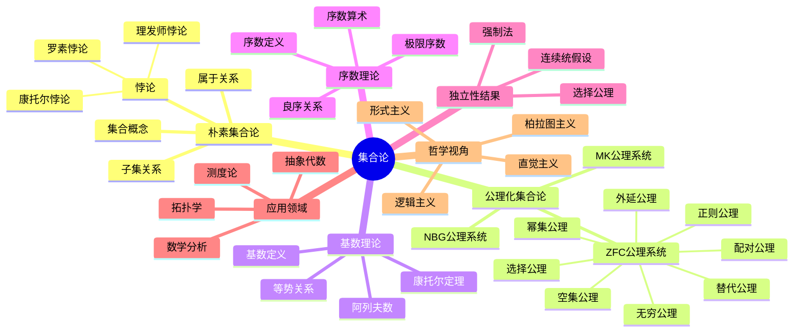

# 集合论：从朴素到公理化的数学基础研究

## 目录

- [集合论：从朴素到公理化的数学基础研究](#集合论从朴素到公理化的数学基础研究)
  - [目录](#目录)
  - [思维导图](#思维导图)
  - [概念图谱](#概念图谱)
  - [表格表征](#表格表征)
  - [1. 引言：集合概念的诞生与演化](#1-引言集合概念的诞生与演化)
  - [2. 朴素集合论与公理化的转向](#2-朴素集合论与公理化的转向)
    - [2.1 朴素集合论的基本理念](#21-朴素集合论的基本理念)
    - [2.2 朴素集合论的局限与悖论](#22-朴素集合论的局限与悖论)
    - [2.3 公理化的必要性](#23-公理化的必要性)
  - [3. 集合论的历史发展脉络](#3-集合论的历史发展脉络)
    - [3.1 康托尔与集合论的诞生](#31-康托尔与集合论的诞生)
    - [3.2 危机时期：悖论的出现](#32-危机时期悖论的出现)
    - [3.3 公理化时期：齐美洛、弗兰克尔与冯·诺依曼](#33-公理化时期齐美洛弗兰克尔与冯诺依曼)
    - [3.4 现代发展：哥德尔、科恩与强制法](#34-现代发展哥德尔科恩与强制法)
  - [4. ZFC公理系统的详细分析](#4-zfc公理系统的详细分析)
    - [4.1 扩展公理与配对公理](#41-扩展公理与配对公理)
    - [4.2 空集公理与幂集公理](#42-空集公理与幂集公理)
    - [4.3 无穷公理与替代公理](#43-无穷公理与替代公理)
    - [4.4 正则公理与选择公理](#44-正则公理与选择公理)
    - [4.5 公理间的关系与层次结构](#45-公理间的关系与层次结构)
  - [5. 基数理论：无限的度量](#5-基数理论无限的度量)
    - [5.1 等势关系与基数概念](#51-等势关系与基数概念)
    - [5.2 可数与不可数集合](#52-可数与不可数集合)
    - [5.3 阿列夫数与基数算术](#53-阿列夫数与基数算术)
    - [5.4 基数的比较与康托尔定理](#54-基数的比较与康托尔定理)
  - [6. 序数理论：有序的无限](#6-序数理论有序的无限)
    - [6.1 良序关系与序数定义](#61-良序关系与序数定义)
    - [6.2 序数的构造与表示](#62-序数的构造与表示)
    - [6.3 序数算术与性质](#63-序数算术与性质)
    - [6.4 序数与基数的关系](#64-序数与基数的关系)
  - [7. 选择公理与连续统假设](#7-选择公理与连续统假设)
    - [7.1 选择公理的等价表述](#71-选择公理的等价表述)
    - [7.2 选择公理的应用与争议](#72-选择公理的应用与争议)
    - [7.3 连续统假设的提出与争论](#73-连续统假设的提出与争论)
    - [7.4 独立性结果：哥德尔与科恩的工作](#74-独立性结果哥德尔与科恩的工作)
  - [8. 集合论的哲学视角](#8-集合论的哲学视角)
    - [8.1 形式主义与集合论](#81-形式主义与集合论)
    - [8.2 逻辑主义的观点](#82-逻辑主义的观点)
    - [8.3 直觉主义的批判](#83-直觉主义的批判)
    - [8.4 本体论问题：集合的存在性质](#84-本体论问题集合的存在性质)
  - [9. 集合论在数学中的应用](#9-集合论在数学中的应用)
    - [9.1 拓扑学中的应用](#91-拓扑学中的应用)
    - [9.2 实分析与测度论](#92-实分析与测度论)
    - [9.3 抽象代数与范畴论](#93-抽象代数与范畴论)
    - [9.4 逻辑学与模型论](#94-逻辑学与模型论)
  - [10. 现代集合论前沿](#10-现代集合论前沿)
    - [10.1 大基数公理](#101-大基数公理)
    - [10.2 强制法与独立性证明](#102-强制法与独立性证明)
    - [10.3 内模型理论](#103-内模型理论)
    - [10.4 与计算机科学的交叉：类型论与集合论](#104-与计算机科学的交叉类型论与集合论)
  - [11. 批判性反思与未来展望](#11-批判性反思与未来展望)
    - [11.1 集合论基础的多元观点](#111-集合论基础的多元观点)
    - [11.2 实践中的集合论：数学家的选择](#112-实践中的集合论数学家的选择)
    - [11.3 未解问题与新方向](#113-未解问题与新方向)
  - [12. 结论](#12-结论)
  - [参考文献](#参考文献)

## 思维导图

## 概念图谱

```mermaid
graph TD
    A[集合论] --> B[朴素集合论]
    A --> C[公理化集合论]
    A --> D[基数理论]
    A --> E[序数理论]
    A --> F[独立性结果]
    A --> G[哲学基础]
    
    B --> B1[集合概念]
    B --> B2[集合关系]
    B --> B3[集合运算]
    B --> B4[悖论]
    
    B4 --> B4a[罗素悖论]
    B4 --> B4b[康托尔悖论]
    B4 --> B4c[布拉利-福尔蒂悖论]
    
    C --> C1[ZF公理系统]
    C --> C2[ZFC公理系统]
    C --> C3[NBG公理系统]
    C --> C4[MK公理系统]
    
    C1 --> C1a[外延公理]
    C1 --> C1b[配对公理]
    C1 --> C1c[分离公理模式]
    C1 --> C1d[并集公理]
    C1 --> C1e[幂集公理]
    C1 --> C1f[无穷公理]
    C1 --> C1g[替代公理模式]
    C1 --> C1h[正则公理]
    
    C2 --> C2a[ZF+选择公理]
    
    D --> D1[等势]
    D --> D2[可数与不可数]
    D --> D3[基数算术]
    D --> D4[阿列夫层级]
    
    E --> E1[良序集]
    E --> E2[序数定义]
    E --> E3[序数算术]
    E --> E4[冯·诺依曼模型]
    
    F --> F1[连续统假设]
    F --> F2[选择公理独立性]
    F --> F3[哥德尔不完备性定理]
    F --> F4[强制法]
    
    G --> G1[形式主义]
    G --> G2[逻辑主义]
    G --> G3[直觉主义]
    G --> G4[本体论问题]
```

## 表格表征

| 主题 | 核心概念 | 关键人物 | 历史阶段 | 哲学视角 |
|----|----|----|----|----|
| 朴素集合论 | 集合、元素、属于关系 | 康托尔 | 1874-1900 | 直观的集合观 |
| 集合论悖论 | 罗素悖论、理发师悖论 | 罗素、布拉利-福尔蒂 | 1897-1908 | 对集合普遍性的反思 |
| 公理化集合论 | ZF、ZFC、NBG公理系统 | 齐美洛、弗兰克尔、冯·诺依曼 | 1908-1930 | 形式主义、集合的限制 |
| 基数理论 | 等势、可数性、连续统 | 康托尔、哈特格斯 | 1874-1897 | "无限"的度量化 |
| 序数理论 | 良序、序数算术 | 冯·诺依曼 | 1923-1930 | 有序无限的结构 |
| 独立性结果 | CH独立性、AC独立性 | 哥德尔、科恩 | 1938-1963 | 数学真理的相对性 |
| 强制法 | 通用集合、筛选 | 科恩 | 1963-1965 | 模型论视角 |
| 大基数理论 | 不可达基数、超紧基数 | 库纳莫托、雷弗林 | 1970至今 | 超越标准公理的探索 |
| 内模型理论 | 可构造集合论L | 哥德尔、詹森 | 1938至今 | 集合论宇宙的内部结构 |

## 1. 引言：集合概念的诞生与演化

集合论是现代数学的基础理论，它为几乎所有数学分支提供了统一的语言和工具。
从直观上讲，集合是"一堆物体的聚集"，这种简单而强大的概念成为了构建整个数学大厦的基石。
本文旨在系统地探讨集合论从其朴素起源到严格的公理化发展的全过程，剖析其内部结构，审视其哲学基础，并展望其未来发展。

集合论的发展可以追溯到19世纪后期，乔治·康托尔(Georg Cantor)通过研究三角级数的收敛性问题，逐渐形成了处理无限集合的基本方法。
这种方法不仅彻底改变了数学家对无限的理解，还建立了一套用于比较不同无限大小的严格理论。
然而，朴素集合论中蕴含的悖论很快被发现，这促使数学家转向公理化方法，最终形成了现代集合论的主流体系——ZFC公理系统。

本文将系统地分析集合论的基本概念、历史发展、公理基础、理论结构和应用扩展，
同时从哲学角度审视集合概念的本质及其争议。
我们既关注理论的严谨性，也注重直观理解的培养；
既探讨历史脉络，也聚焦现代前沿。
通过这种多维度的分析，我们希望读者能够全面把握这一数学基础理论的深刻内涵和广泛影响。

## 2. 朴素集合论与公理化的转向

### 2.1 朴素集合论的基本理念

朴素集合论建立在一个看似简单的直观概念上：
  集合是对象的任意聚集，这些对象（称为元素）可以是具体的事物，也可以是抽象的概念，甚至可以是其他集合。
朴素集合论的核心关系是"属于"关系（用符号∈表示），通过这一关系定义了子集、并集、交集、补集等基本运算。

在朴素集合论中，集合的形成非常自由，只要我们能够清晰地描述某种性质，就可以构造出满足该性质的所有对象组成的集合。
这就是著名的"无限制的理解原则"（Unrestricted Comprehension Principle），可以形式化表述为：

对于任意性质P，存在一个集合S = {x | P(x)}，即所有满足性质P的对象x构成的集合。

这一原则的直观性使朴素集合论易于理解和应用，但也正是这种不受限制的集合形成方式，最终导致了著名的悖论出现。

### 2.2 朴素集合论的局限与悖论

朴素集合论最致命的问题是它允许构造一些"过于庞大"的集合，这些集合因包含了自身或者过于复杂的结构而导致悖论。

最著名的悖论包括：

1. **罗素悖论(Russell's Paradox, 1901)**：
考虑集合R = {x | x ∉ x}，即所有不属于自身的集合构成的集合。
问题：R是否属于自身？
如果R ∈ R，根据R的定义，R应该满足R ∉ R，矛盾；
如果R ∉ R，则R满足不属于自身的条件，根据R的定义，应有R ∈ R，又矛盾。

2. **康托尔悖论(Cantor's Paradox)**：
考虑所有集合构成的集合U，其幂集P(U)的基数应大于U的基数（根据康托尔定理）。
但由于U包含所有集合，P(U)应该是U的子集，这意味着P(U)的基数不可能大于U的基数，矛盾。

3. **理发师悖论(Barber Paradox)**：
这是罗素悖论的一个通俗版本。
一个村庄里的理发师宣称他只给那些不自己理发的人理发。
问题：理发师是否给自己理发？

这些悖论表明，朴素集合论中的无限制理解原则是不自洽的，它允许我们构造一些逻辑上不可能存在的"集合"。
这一发现震动了数学界，引发了数学基础的第三次危机，也促使数学家们寻求更严格的集合论基础。

### 2.3 公理化的必要性

面对朴素集合论的悖论，数学家们认识到，必须通过明确的公理来规范集合的形成，以避免悖论的出现。
这种转向可以看作是数学思维的重大进步：
    从依赖直观到严格的形式化，从不受限制的集合构造到受控的公理系统。

公理化的关键转变在于：

1. **放弃无限制的理解原则**：
  不再允许任意性质定义集合，而是通过明确的公理规定集合的合法构造方式。

2. **区分"类"与"集合"**：
  将一些过于庞大的集合（如"所有集合的集合"）重新定义为"真类"，
  它们可以作为对象被讨论，但不能作为元素被包含在其他集合中。

3. **引入层次结构**：
  通过类型论或累积层次结构，确保集合的形成遵循严格的层次，
  避免自我指涉导致的循环论证。

这种公理化转向的结果是多种集合论公理系统的出现，
其中最著名、最广泛接受的是齐美洛-弗兰克尔集合论（ZF）及其加入选择公理的扩展版本（ZFC）。
这些公理系统保留了集合论的核心直观，同时避免了已知的悖论，为现代数学提供了坚实的基础。

## 3. 集合论的历史发展脉络

### 3.1 康托尔与集合论的诞生

集合论的创始人乔治·康托尔(Georg Cantor, 1845-1918)最初并非直接研究集合概念，
而是通过研究三角级数的收敛性和点集拓扑问题，逐渐发展出处理无限集合的方法。
他的贡献主要包括：

1. **集合概念的明确化(1874-1883)**：
  康托尔首次提出了集合的直观定义：
  "集合是将我们的直观或思想中的确定的、可以区分的对象汇集成一个整体。"

2. **无限集合的基数理论(1874)**：
  康托尔证明了有理数集是可数的，
  而实数集是不可数的，首次区分了不同"层次"的无限。

3. **超限数与阿列夫数(1883-1895)**：
  康托尔发展出超限数（即序数）理论，
  引入了阿列夫符号表示不同基数的无限，建立了无限基数的算术。

4. **连续统假设的提出(1878)**：
  康托尔提出不存在基数严格介于自然数集和实数集之间的无限集，
  这一猜想后来被证明在标准公理系统中既不能被证明也不能被反驳。

康托尔的工作在当时颇具争议，尤其受到了数学分析学派代表克罗内克(Leopold Kronecker)的强烈批评。
克罗内克坚持有限主义立场，认为只有能够通过有限步骤构造的数学对象才是合法的。
然而，随着时间推移，康托尔的思想逐渐被数学界主流接受，
尤其是在希尔伯特(David Hilbert)等数学家的支持下，集合论成为了现代数学的基础。

### 3.2 危机时期：悖论的出现

19世纪末至20世纪初，随着对集合理论的深入研究，一系列悖论被发现，引发了数学基础的危机：

1. **布拉利-福尔蒂悖论(1897)**：
意大利数学家塞萨雷·布拉利-福尔蒂(Cesare Burali-Forti)发现了关于序数的悖论：
  所有序数的集合本身应具有一个序数，但该序数必须大于集合中的任何序数，这导致了矛盾。

2. **罗素悖论(1901)**：
  英国哲学家伯特兰·罗素(Bertrand Russell)发现了上述我们已经讨论过的悖论，
  它以一种更直接的方式暴露了朴素集合论的不一致性。

3. **理查德悖论(1905)**：
  关于自然语言中可定义的实数的悖论，揭示了语言定义与数学对象之间的复杂关系。

4. **斯科勒姆悖论(1922)**：
虽然技术上不是严格意义的矛盾，但这一现象表明，
在第一阶逻辑中，如果一个公理系统有一个无限模型，
那么它就有各种基数的模型，这似乎与康托尔理论中不同基数集合的区分相矛盾。

这些悖论的出现引发了数学基础的深刻反思，并促进了三个重要数学流派的形成：

- **逻辑主义**：以弗雷格(Gottlob Frege)和罗素为代表，试图将数学归约为逻辑。
- **形式主义**：以希尔伯特为代表，强调形式系统的一致性和完备性。
- **直觉主义**：以布劳威尔(L.E.J. Brouwer)为代表，强调数学构造的直观性和可构造性。

这一时期的危机与探索，最终导致了集合论的公理化转向，以及数学哲学的深刻变革。

### 3.3 公理化时期：齐美洛、弗兰克尔与冯·诺依曼

面对集合论悖论，德国数学家恩斯特·齐美洛(Ernst Zermelo)在1908年提出了第一个公理化集合论系统，这标志着集合论进入了公理化时期：

1. **齐美洛公理系统(1908)**：包含外延公理、分离公理（受限的理解原则）、幂集公理、并集公理、无穷公理和选择公理等，成功避免了已知悖论。

2. **弗兰克尔的贡献(1922)**：亚伯拉罕·弗兰克尔(Abraham Fraenkel)和托拉尔夫·斯科勒姆(Thoralf Skolem)独立地发现齐美洛系统无法证明某些需要的集合存在，于是提出了替代公理模式，加强了原系统。

3. **冯·诺依曼-伯恩斯坦-哥德尔系统(NBG, 1925-1940)**：约翰·冯·诺依曼(John von Neumann)首先开发了一种新的公理系统，明确区分了"集合"和"类"的概念。保罗·伯恩斯坦(Paul Bernays)和库尔特·哥德尔(Kurt Gödel)后来对其进行了简化和完善，形成了NBG系统。

4. **莫尔斯-凯利系统(MK, 1930s)**：对NBG的进一步扩展，允许在更一般的环境中讨论类的性质。

这一时期的主要成就是建立了集合论的公理化基础，使得集合论可以在避免悖论的同时，保持足够的表达能力，为其他数学分支提供基础。
ZFC系统（齐美洛-弗兰克尔系统加选择公理）最终成为了现代数学中最广泛接受的集合论基础。

### 3.4 现代发展：哥德尔、科恩与强制法

20世纪30年代以后，集合论的研究重点转向了公理系统的元数学性质和独立性问题，取得了一系列突破性进展：

1. **哥德尔的不完备性定理(1931)**：
  库尔特·哥德尔证明了任何包含基本算术的一致的形式系统都存在不可判定的命题。
  这一结果对集合论的基础研究产生了深远影响。

2. **可构造集合论与连续统假设(1938)**：
  哥德尔发展了可构造集合论(L)，并证明了如果ZF公理系统是一致的，
  那么ZF加上选择公理(AC)和广义连续统假设(GCH)也是一致的。

3. **科恩的强制法与独立性证明(1963-1964)**：
  保罗·科恩(Paul Cohen)发明了强制法(Forcing)，
  证明了选择公理和连续统假设在ZF公理系统中是独立的。
  这一工作使他获得了1966年的菲尔兹奖。

4. **大基数理论的发展(1960s-)**：
  索罗维(Robert Solovay)、雷弗林(Dana Scott)等数学家开始系统研究大基数公理，
  这些公理超越了标准ZFC系统的范围，为解决一些独立于ZFC的命题提供了新工具。

5. **内模型理论的深化(1970s-)**：
  詹森(Ronald Jensen)等人深化了可构造集合论(L)，
  发展出核实现(Core Model)等内模型理论工具，
  为研究ZFC的一致性强度提供了重要方法。

6. **描述集论的发展(1980s-)**：
  马丁(Donald A. Martin)、钢(John R. Steel)等人将描述集论与内模型理论结合，
  在投射确定性和大基数存在性之间建立了深刻联系。

这一时期的集合论研究，从对单一公理系统的研究，发展为对多种可能的"集合论宇宙"的探索。

数学家们已经不再寻求唯一"正确"的集合论，而是研究不同公理选择下数学世界的可能样貌，这一转变深刻地影响了数学哲学的发展。

## 4. ZFC公理系统的详细分析

### 4.1 扩展公理与配对公理

ZFC公理系统的首要公理是扩展公理(Axiom of Extensionality)，它规定了集合相等的唯一准则：

**扩展公理**：如果两个集合A和B包含完全相同的元素，则A=B。形式化表述为：
$$\forall A \forall B [\forall x (x \in A \iff x \in B) \implies A = B]$$

这一公理表达了集合的本质特征：
  集合完全由其元素确定，与元素的排列顺序、出现次数或定义方式无关。
扩展公理使得集合区别于其他数学对象（如多重集、序列等），是集合理论的基石。

**配对公理(Axiom of Pairing)**允许我们从现有元素构造新的集合：

**配对公理**：对任意对象a和b，存在一个集合包含恰好a和b这两个元素。形式化表述为：
$$\forall a \forall b \exists C \forall x [x \in C \iff (x = a \lor x = b)]$$

配对公理的重要性在于，它保证了我们可以构建包含指定对象的有限集合，这是复杂集合构造的起点。
通过配对公理，我们可以定义有序对：$(a,b) = \{\{a\},\{a,b\}\}$，这进一步允许我们定义关系和函数等基本数学结构。

### 4.2 空集公理与幂集公理

**空集公理(Axiom of Empty Set)**保证了空集的存在，作为集合构造的起点：

**空集公理**：存在一个不包含任何元素的集合。形式化表述为：
$$\exists x \forall y (y \notin x)$$

空集通常记为∅，是集合论中最基本的对象。
从技术上讲，空集公理可以从其他公理（如分离公理）推导出来，但通常将其作为独立公理提出，以强调其基础性。

**幂集公理(Power Set Axiom)**允许我们构造一个集合的所有子集组成的集合：

**幂集公理**：对于任意集合A，存在一个集合P(A)，使得B是A的子集当且仅当B是P(A)的元素。形式化表述为：
$$\forall A \exists P \forall B [B \in P \iff \forall x (x \in B \implies x \in A)]$$

幂集公理具有深远意义。
首先，它保证了我们可以讨论一个集合的所有可能子集，这在数学分析、拓扑学等领域至关重要。
其次，根据康托尔定理，对于任何集合A，其幂集P(A)的基数严格大于A的基数，这导致了无限基数的无限层级，构成了集合论中的"无限之塔"。

### 4.3 无穷公理与替代公理

**无穷公理(Axiom of Infinity)**保证了无限集合的存在，这是处理无穷数学所必需的：

**无穷公理**：存在一个包含空集，并且对于其中每个元素x，也包含集合x∪{x}的集合。形式化表述为：
$$\exists S [\emptyset \in S \land \forall x (x \in S \implies x \cup \{x\} \in S)]$$

满足无穷公理的最小集合对应于自然数集，其中0表示为空集，每个自然数n+1表示为n∪{n}。
这种构造方式（称为冯·诺依曼序数）使得每个自然数都等于小于它的所有自然数构成的集合。

**替代公理模式(Axiom Schema of Replacement)**是一组无限多的公理，它们允许我们通过函数映射已有集合来构造新集合：

**替代公理模式**：如果F是一个函数式关系（即对于每个x最多有一个y使得F(x,y)成立），则对于任何集合A，存在一个集合B，使得对于任何x∈A，如果存在y使得F(x,y)成立，则这个y属于B。形式化表述为：
$$\forall A [\forall x \forall y \forall z ((x \in A \land F(x,y) \land F(x,z)) \implies y = z) \implies \exists B \forall y (y \in B \iff \exists x (x \in A \land F(x,y)))]$$

替代公理极大地增强了ZF系统的表达能力，允许我们构造比无穷公理直接给出的集合更大的集合。
这对于处理超限递归定义和大基数概念至关重要。

### 4.4 正则公理与选择公理

**正则公理(Axiom of Regularity/Foundation)**排除了集合的无限降链和自我包含的情况：

**正则公理**：每个非空集合A都包含一个元素b，使得A与b没有共同元素。形式化表述为：
$$\forall A [A \neq \emptyset \implies \exists b (b \in A \land b \cap A = \emptyset)]$$

正则公理的一个重要推论是，不存在满足x∈x的集合，即集合不能是自身的元素。
这排除了如罗素悖论那样的自我指涉情况。
正则公理也保证了所有集合都可以放入一个"累积层次结构"(Cumulative Hierarchy)中，这种结构被称为冯·诺依曼宇宙(V)。

**选择公理(Axiom of Choice, AC)**是ZFC中最具争议的公理：

**选择公理**：对于任何由非空集合构成的集合系A，存在一个选择函数f，使得对于每个S∈A，f(S)∈S。形式化表述为：
$$\forall A [(\forall x \in A, x \neq \emptyset) \implies \exists f : A \to \bigcup A, \forall x \in A (f(x) \in x)]$$

选择公理看似直观，但导致了一些反直觉的结果，如巴拿赫-塔斯基悖论（可以将一个球分解为有限多块，然后重新组合成两个大小相同的球）。
尽管如此，选择公理在现代数学中广泛应用，尤其是在函数分析、抽象代数和拓扑学中。

### 4.5 公理间的关系与层次结构

ZFC公理系统的各个公理之间存在复杂的逻辑关系和层次结构：

1. **基础公理**：扩展公理和空集公理是最基础的，它们定义了集合相等的准则和最简单的集合。

2. **构造公理**：配对公理、并集公理、幂集公理和分离公理允许我们从已有集合构造新集合，是集合论的核心操作。

3. **扩展公理**：无穷公理和替代公理模式扩展了集合论的表达能力，使其能够处理各种无限结构和递归定义。

4. **规范公理**：正则公理提供了集合的规范性质，确保集合结构的良好性。

5. **选择公理**：作为独立的附加公理，选择公理增强了集合论在其他数学分支的应用能力。

从逻辑强度来看，这些公理形成了一个层次结构。
基础的ZF系统（不含选择公理）已经足够发展大部分数学理论，但许多重要结果需要选择公理。
在ZFC之上，还有各种大基数公理，它们形成了一个按照一致性强度递增的层次。

从历史视角看，这些公理并非一次性提出，而是在集合论发展过程中逐步完善的。
每个公理都反映了数学家对集合概念和数学基础的深入理解，
也体现了数学公理化方法的精妙之处：在避免悖论的同时，保留足够的表达能力。

## 5. 基数理论：无限的度量

### 5.1 等势关系与基数概念

基数理论的核心是对"大小"概念的精确化，特别是对无限集合大小的比较。
康托尔的首要贡献就是引入了比较无限集合大小的方法：

**等势关系(Equipotence/Equinumerosity)**：两个集合A和B被称为等势的（记为A~B），如果存在从A到B的双射（一一对应）。形式化表述为：
$$A \sim B \iff \exists f:A \to B \text{, f是双射}$$

等势关系是一个等价关系，它将所有集合分为不同的等价类。
每个等价类对应一个**基数(Cardinal Number)**，表示该类集合的"大小"。
形式上，集合A的基数记为|A|或#A，定义为等势于A的所有集合构成的等价类。

在ZFC系统中，每个集合的基数可以用一个特定的序数（称为**基数序数**或**初序数**）来表示。
这是冯·诺依曼的一个重要贡献，它使得基数可以作为集合论内部的对象进行研究，而不仅仅是一个外部概念。

基数理论的基本关系是比较两个基数的大小：

- |A| = |B| 当且仅当 A~B（存在A到B的双射）
- |A| ≤ |B| 当且仅当 A可以注入到B（存在A到B的单射）
- |A| < |B| 当且仅当 |A| ≤ |B| 且 |A| ≠ |B|

通过**Cantor-Bernstein-Schroeder定理**，如果|A| ≤ |B|且|B| ≤ |A|，则|A| = |B|，这简化了基数相等的证明。

### 5.2 可数与不可数集合

康托尔的第一个革命性发现是区分了两种基本的无限基数：可数无限和不可数无限。

**可数集合(Countable Set)**：一个集合A称为可数的，如果它等势于自然数集N，即|A| = |N|。
形式上，这意味着A的元素可以被"计数"（即可以与自然数建立一一对应）。

康托尔证明了一些看似"更大"的集合实际上是可数的：

1. **整数集Z是可数的**：可以通过映射f(n) = n/2（当n为偶数）或f(n) = -(n+1)/2（当n为奇数）建立N与Z之间的双射。
2. **有理数集Q是可数的**：可以通过对分数p/q按照p+q的和进行排序，建立N与Q之间的双射。
3. **代数数集是可数的**：代数数是代数方程的根，康托尔证明了它们构成可数集。

**不可数集合(Uncountable Set)**：一个集合称为不可数的，如果它不等势于自然数集。

康托尔使用著名的**对角线论证(Diagonal Argument)**证明了实数集R是不可数的：

假设存在一个从N到R的满射f，则可以将所有实数列在一个序列中：f(0), f(1), f(2), ... 。
考虑一个新实数r，其第n位与f(n)的第n位不同。
这个r不可能在序列中，矛盾。因此，不存在从N到R的满射，即|N| < |R|。

这一发现开创了无限的层次理论，表明不是所有的无限集合都"一样大"。
不可数集合的存在，打破了传统的"无限是无限"的朴素观念，为数学提供了更丰富的无限结构。

### 5.3 阿列夫数与基数算术

为了系统描述不同层次的无限基数，康托尔引入了**阿列夫数(Aleph Numbers)**体系：

- **ℵ₀（阿列夫零）**：最小的无限基数，等于|N|，即可数无限。
- **ℵ₁（阿列夫一）**：大于ℵ₀的最小基数。
- **ℵ₂, ℵ₃, ...**：依此类推，形成无限基数的序列。
- **ℵₐ**：对于任何序数a，ℵₐ表示相应位置的阿列夫数。

**连续统假设(Continuum Hypothesis, CH)**主张|R| = ℵ₁，即没有基数严格介于ℵ₀与|R|之间。
**广义连续统假设(Generalized Continuum Hypothesis, GCH)**进一步主张对任意序数a，2^ℵₐ = ℵₐ₊₁。

**基数算术**研究基数上的运算性质：

1. **加法**：|A| + |B| = |A ⊔ B|（不交并）。对无限基数，κ + λ = max(κ, λ)，这意味着"更大的无限吞噬更小的无限"。
2. **乘法**：|A| · |B| = |A × B|（笛卡尔积）。对无限基数，κ · λ = max(κ, λ)。
3. **指数**：|A|^|B| = |Func(B,A)|（从B到A的所有函数集）。
  对无限基数，最重要的是康托尔定理：2^κ > κ，即任何集合的幂集的基数严格大于原集合的基数。

这些运算展示了无限基数的特殊性质，它们不遵循有限数字的直观算术规则，而是形成了自身的代数结构。

### 5.4 基数的比较与康托尔定理

基数理论的核心问题是比较不同集合的大小。
康托尔定理及其扩展提供了基数比较的基础工具：

**康托尔定理**：对于任何集合A，|A| < |P(A)|，即A的幂集的基数严格大于A的基数。

这一结果表明，无限基数构成了一个无止境的层级，没有"最大的基数"。
每次应用幂集操作，我们都会获得一个更大的基数。

**施罗德-伯恩斯坦定理(Schroeder-Bernstein Theorem)**：如果|A| ≤ |B|且|B| ≤ |A|，则|A| = |B|。

这一定理极大简化了证明两个集合等势的工作，只需分别构造从A到B和从B到A的单射，而不需要直接构造双射。

在ZFC中，基数的全序性可以通过选择公理来证明：

**基数的全序性**：对于任意两个基数κ和λ，要么κ ≤ λ，要么λ ≤ κ。

这使得不同集合的大小可以进行比较，构成了一个线性序列。
这一结果依赖于选择公理，表明选择公理在基数理论中的核心地位。

康托尔的基数理论深刻改变了数学对无限的理解，将模糊的"无限"概念转化为精确的、可比较的数学对象。
这不仅解决了具体的数学问题，还为我们提供了理解无限的新视角，影响了从数学到哲学的广泛领域。

## 6. 序数理论：有序的无限

### 6.1 良序关系与序数定义

序数理论研究的核心是良序集及其抽象结构。

良序关系是序数概念的基础：

**良序关系(Well-ordering)**：集合S上的一个关系<称为良序关系，如果：

1. <是S上的全序关系（任意两个不同元素可比）
2. S的每个非空子集都有一个最小元素

良序关系的关键特性是不存在无限降链，这保证了基于良序的归纳证明的有效性。

**序数(Ordinal Number)**是良序集的抽象形式，表示良序集的"序类型"。

在ZFC中，序数有一个标准定义：

**冯·诺依曼序数**：一个集合α是序数，当且仅当：

1. α是良序的（按∈关系）
2. α的每个元素也是α的子集（即每个β∈α满足β⊂α）

这种定义使得每个序数都等于所有小于它的序数的集合。例如：

- 0 = ∅（空集）
- 1 = {0} = {∅}
- 2 = {0,1} = {∅,{∅}}
- 3 = {0,1,2} = {∅,{∅},{∅,{∅}}}
- ...

这种构造方法自然地扩展到无限序数：

- ω = {0,1,2,...}（第一个无限序数，对应自然数集）
- ω+1 = {0,1,2,...,ω}
- ...

序数的集合本身不构成一个集合（这将导致布拉利-福尔蒂悖论），而是一个真类。

### 6.2 序数的构造与表示

序数可以通过多种方式构造和表示：

1. **后继序数(Successor Ordinal)**：对于任何序数α，其后继序数α+1 = α∪{α}是通过添加α本身作为新元素构造的。

2. **极限序数(Limit Ordinal)**：既不是0也不是任何序数的后继的序数。例如ω（第一个无限序数）是一个极限序数，因为它不是任何有限序数的后继。

3. **可数序数(Countable Ordinal)**：可以用可数集合良序得到的序数。所有可数序数的集合记为ω₁，它是第一个不可数序数。

序数的表示系统通常基于康托尔的标准形式：

**康托尔标准形式**：任何序数α可以唯一表示为：
$$\alpha = \omega^{\beta_1}·n_1 + \omega^{\beta_2}·n_2 + ... + \omega^{\beta_k}·n_k$$
其中β₁ > β₂ > ... > βₖ是序数，n₁, n₂, ..., nₖ是正整数。

这种表示系统在序数算术和序数分析中非常有用，允许我们系统地操作和比较不同的序数。

### 6.3 序数算术与性质

序数上定义了与自然数类似的算术运算，但具有不同的性质：

1. **加法(Addition)**：α+0 = α；α+1是α的后继；对于极限序数λ，α+λ = sup{α+β | β<λ}。
   序数加法不是交换的，例如1+ω = ω，但ω+1 > ω。

2. **乘法(Multiplication)**：α·0 = 0；α·(β+1) = (α·β)+α；对于极限序数λ，α·λ = sup{α·β | β<λ}。
   序数乘法也不是交换的，例如2·ω = ω，但ω·2 > ω。

3. **指数(Exponentiation)**：α^0 = 1；α^(β+1) = (α^β)·α；对于极限序数λ，α^λ = sup{α^β | β<λ}。

序数的关键性质包括：

- **良基性(Well-foundedness)**：序数上的∈关系是良基的，不存在无限降链。
这使得序数归纳法成为可能。

- **序数递归(Ordinal Recursion)**：可以通过递归方式在序数上定义函数，这是超限递归的基础。

- **不可达序数(Inaccessible Ordinals)**：一些特殊序数不能通过更小序数的某些操作达到，这构成了大基数理论的起点。

序数理论为数学提供了研究无限结构的强大工具，尤其在证明论、递归论和集合论本身的研究中发挥了核心作用。

### 6.4 序数与基数的关系

序数和基数是研究无限的两个密切相关的概念，它们之间存在深刻的联系：

1. **初序数(Initial Ordinal)**：对于每个基数κ，存在一个最小的序数α使得|α| = κ。这个序数称为κ的初序数。在ZFC中，基数通常直接用它们的初序数表示。

2. **阿列夫数的序数表示**：
   - ℵ₀对应于ω（第一个无限序数）
   - ℵ₁对应于ω₁（第一个不可数序数）
   - 一般地，ℵₐ对应于ωₐ（第α个无限基数的初序数）

3. **序数的基数**：每个序数α都有一个相关联的基数|α|。多个不同的序数可以有相同的基数。例如，ω、ω+1、ω·2等都有基数ℵ₀。

4. **科恩基数(Cofinality)**：序数α的cofinality，记为cf(α)，是α可以表示为递增序列上界的最小序数长度。这一概念连接了序数结构和基数特性。
   - 如果cf(α) = α，则α称为正则序数(regular ordinal)
   - 如果cf(α) < α，则α称为奇异序数(singular ordinal)

选择公理对序数与基数关系的研究至关重要。
在ZFC中，可以证明每个集合可以被良序，这意味着每个基数都对应于某个序数。
此外，选择公理保证了基数的良好算术性质，使序数和基数理论能够协调发展。

序数与基数的双重视角使我们能够从不同角度研究无限结构：序数强调的是序关系和结构，而基数关注的是大小和集合间的映射。
这两种视角的结合，构成了现代集合论的丰富内涵。

## 7. 选择公理与连续统假设

### 7.1 选择公理的等价表述

选择公理是集合论中最具争议性的公理，它有多种等价表述，从不同角度揭示了其数学内涵：

1. **选择函数表述**：对于任何由非空集合构成的集合族F，存在一个选择函数f，使得对于每个S∈F，f(S)∈S。

2. **良序定理(Well-ordering Theorem)**：任何集合都可以被良序。这意味着任何集合都可以被赋予一个序关系，使其成为一个良序集。

3. **佐恩引理(Zorn's Lemma)**：若偏序集P中每个链(chain)都有上界，则P中存在极大元。这一表述在抽象代数和泛函分析中广泛应用。

4. **乘积非空定理**：非空集合的任意笛卡尔积非空。特别地，无限多个非空集合的笛卡尔积非空。

5. **特克霍诺夫定理(Tychonoff Theorem)**：任意多个紧拓扑空间的积空间仍然紧。

这些表述在ZF系统中都是等价的，采纳其中任何一个作为公理，都能推导出其他所有表述。选择公理的这种"多面性"体现了它在数学不同领域的基础地位。

### 7.2 选择公理的应用与争议

选择公理在现代数学中有广泛应用：

1. **代数**：证明每个向量空间有基底；证明每个理想可以扩展为极大理想；证明代数闭域的唯一性。

2. **分析**：哈恩-巴拿赫定理(Hahn-Banach Theorem)；巴拿赫-阿拉奥格鲁定理(Banach-Alaoglu Theorem)；布尔巴基积分理论。

3. **拓扑**：特克霍诺夫定理；一致空间的完备化；紧化定理。

4. **集合论本身**：无法数基数的比较；超限递归的发展；序数和基数理论的系统化。

然而，选择公理也导致了一些反直观的结果，引发争议：

1. **巴拿赫-塔斯基悖论(Banach-Tarski Paradox)**：三维球体可以分解为有限多个部分，然后重新组合成两个与原球体大小相同的球体。这似乎违背了物理直觉中的体积守恒。

2. **不可测集(Non-measurable Set)**：选择公理保证了实数集上存在不可测集，这对测度论和概率论产生了复杂影响。

3. **构造性问题**：选择公理是非构造性的，它仅断言某些对象存在，但不提供构造方法。这与数学构造主义立场冲突。

在实践中，绝大多数数学家接受并使用选择公理，认为其带来的数学便利和统一性超过了其可能的反直观性。然而，在某些情况下，数学家会特别注明某结果是否依赖选择公理，或是否可以在不使用选择公理的情况下证明。

### 7.3 连续统假设的提出与争论

**连续统假设(Continuum Hypothesis, CH)**是康托尔在发展集合论时提出的最著名猜想。它断言：

不存在基数严格介于自然数集基数(ℵ₀)和实数集基数(2^ℵ₀或c)之间的集合。用基数等式表示为：2^ℵ₀ = ℵ₁。

康托尔于1878年首次提出这一猜想，并花费多年试图证明它，但未能成功。连续统假设很快成为希尔伯特在1900年提出的著名23个数学问题中的第一个问题。

**广义连续统假设(Generalized Continuum Hypothesis, GCH)**进一步断言：对于任何基数κ，不存在基数严格介于κ和2^κ之间。形式化表述为：对于任何无限基数κ，2^κ = κ⁺（κ的后继基数）。

连续统假设的争议主要集中在以下几点：

1. **本体论地位**：CH断言特定数学对象（介于ℵ₀和c之间的基数）不存在。这引发了关于数学对象"存在性"的深刻哲学问题。

2. **直观与反直观**：某些数学家认为CH是直观的（如果没有特殊理由，为什么会有基数卡在ℵ₀和c之间？），而另一些则认为它是反直观的（为什么2^ℵ₀恰好等于ℵ₁，而不是更大？）。

3. **对分析学的影响**：CH影响了实分析中的许多深刻问题，包括某些函数空间的结构和测度论中的关键结果。

连续统假设的地位在希尔伯特计划的背景下显得尤为重要，它不仅是一个具体的数学问题，更是对数学基础完备性和确定性的考验。

### 7.4 独立性结果：哥德尔与科恩的工作

连续统假设的命运因哥德尔和科恩的开创性工作而得到解决，虽然这个解决方式出人意料：

1. **哥德尔的相对一致性证明(1938)**：
   - 哥德尔构造了一个模型L（"可构造集合的宇宙"），证明如果ZF公理系统是一致的，那么ZFC+GCH也是一致的。
   - 在L中，选择公理和广义连续统假设都成立，这表明CH不能在ZFC中被反驳。
   - 哥德尔的工作奠定了内模型理论的基础。

2. **科恩的强制法与独立性证明(1963-1964)**：
   - 保罗·科恩发明了强制法(Forcing)，这是一种构造模型的新技术。
   - 科恩证明如果ZF是一致的，那么ZF+¬AC（ZF加上选择公理的否定）也是一致的。
   - 更重要的是，他证明如果ZFC是一致的，那么ZFC+¬CH（ZFC加上连续统假设的否定）也是一致的。
   - 这表明CH在ZFC中是独立的：它既不能被证明，也不能被反驳。

这些独立性结果的哲学含义深远：

1. **数学真理的多元性**：在不同的"集合论宇宙"中，连续统假设可以为真，也可以为假，这挑战了数学真理的"唯一性"观念。

2. **集合论公理的不完备性**：ZFC无法决定如此基本的问题，表明我们对"集合"的直观理解不足以确定所有集合论命题的真假。

3. **新公理的探索**：这促使数学家探索ZFC的扩展，寻找能够自然解决CH等问题的新公理。

科恩的强制法是20世纪数学的重大突破，它不仅解决了连续统假设的独立性问题，
还开创了证明独立性结果的一般方法，对集合论的后续发展产生了深远影响。
强制法与大基数理论、内模型理论一起，构成了现代集合论研究的三大支柱。

## 8. 集合论的哲学视角

### 8.1 形式主义与集合论

形式主义是数学哲学的主要流派之一，特别与集合论的公理化发展有深刻联系：

**形式主义的核心主张**：

1. 数学本质上是对符号和形式系统的研究，无需参照外部"意义"
2. 数学真理就是在特定公理系统中可以被证明的定理
3. 数学的价值在于其内部一致性，而非对外部世界的描述

**希尔伯特与形式主义**：
大卫·希尔伯特(David Hilbert)是形式主义的主要代表。他的"希尔伯特计划"试图：

- 将所有数学形式化为公理系统
- 用有限主义方法证明这些系统的一致性
- 证明这些系统的完备性（任何命题都能被证明或反驳）

**形式主义与ZFC**：
ZFC公理系统可以被视为形式主义思想的典范实现：

- 它提供了一个形式化框架，数学对象（如集合）只由其在系统中的符号行为定义
- 它避免了对"集合是什么"的本体论承诺
- 它以一组精确的公理规定了什么样的符号结构是合法的

**哥德尔对形式主义的挑战**：
哥德尔的不完备性定理对希尔伯特计划造成致命打击：

- 第一不完备性定理表明，任何包含基本算术的一致形式系统都存在不可判定命题
- 第二不完备性定理表明，这样的系统无法在自身内部证明自己的一致性

这意味着形式主义理想中的"完备数学系统"是不可能的。对于集合论，特别是连续统假设等命题的独立性，进一步表明了形式系统的内在限制。

尽管如此，形式主义的遗产在现代集合论中仍然明显：我们不再讨论集合的"本质"，而是研究ZFC及其变体中的定理和模型，形式化方法成为研究集合论的标准范式。

### 8.2 逻辑主义的观点

逻辑主义试图将数学归约为逻辑，认为数学真理本质上是逻辑真理的特例：

**逻辑主义的核心主张**：

1. 数学概念可以通过纯逻辑概念定义
2. 数学定理可以通过纯逻辑规则证明
3. 数学不需要特殊的本体论承诺，只需要逻辑已经承诺的那些

**弗雷格与早期逻辑主义**：
戈特洛布·弗雷格(Gottlob Frege)是逻辑主义的创始人，他试图：

- 用逻辑概念定义自然数（将数字视为概念的性质）
- 建立一个纯逻辑系统（概念文字），从中推导出数学
- 然而，罗素悖论证明了弗雷格的系统是不一致的

**罗素与类型论**：
伯特兰·罗素(Bertrand Russell)试图通过类型论拯救逻辑主义：

- 对象被分为不同类型，防止自我指涉
- 《数学原理》(Principia Mathematica)尝试从逻辑公理推导数学
- 然而，这一系统需要一些非逻辑公理（如无穷公理、约简公理）

**逻辑主义与集合论的关系**：
逻辑主义对集合论的影响是复杂的：

- 一方面，集合论的语言成为现代逻辑的基础
- 另一方面，集合论（特别是ZFC）包含了明显非逻辑的公理（如无穷公理）
- 某种意义上，集合论与逻辑的界限变得模糊，集合论成为数理逻辑的一部分

**新逻辑主义(Neo-logicism)**：
现代逻辑主义尝试重振这一纲领：

- 休谟原则(Hume's Principle)作为算术基础
- 抽象原则作为数学对象定义的基础
- 与集合论构建不同，强调抽象而非成员关系

逻辑主义的贡献在于，它明确了逻辑和数学的密切关系，推动了数理逻辑的发展，并为我们理解数学基础提供了独特视角。虽然纯粹的逻辑主义纲领未能完全实现，但其思想继续影响着数学哲学和集合论研究。

### 8.3 直觉主义的批判

直觉主义代表了对经典数学（包括集合论）的激进批判，它对无限概念和逻辑定律提出了根本性质疑：

**直觉主义的核心主张**：

1. 数学是人类心智的构造活动
2. 数学真理必须通过构造性方法建立，而非纯粹形式推导
3. 数学对象只有在能被人类思维构造时才"存在"

**布劳威尔与直觉主义**：
L.E.J.布劳威尔(L.E.J. Brouwer)是直觉主义的主要创始人，他主张：

- 排中律（P或非P）在无限领域不应无条件适用
- 只接受可构造的数学对象和过程
- 反对将集合视为已完成的整体，特别是不可数无限集

**对集合论的批判**：
直觉主义对集合论提出了尖锐批判：

- 康托尔的基数理论依赖于非构造性方法和排中律的无限应用
- 不接受实数集作为"已完成的无限集合"
- 质疑选择公理等非构造性原则

**对连续统的重新理解**：
直觉主义提出了连续统的替代观念：

- 将连续统视为一种"媒介"(medium)，而非点的集合
- 通过"自由选择序列"来表示无限过程
- 倾向于将连续性视为基本概念，而非离散点的集合

**构造性数学与集合论**：
虽然直觉主义拒绝经典集合论，但产生了多种构造性数学形式：

- 递归数学关注可计算函数和集合
- 构造性类型论提供了一种替代基础
- 构造性集合论探索了保持构造性原则的集合理论版本

尽管经典集合论在主流数学中占据主导地位，直觉主义的批判促使数学家更深入思考无限、构造性和证明方法的本质。在计算机科学发展和类型论复兴的背景下，直觉主义思想以新形式影响着现代数学，提醒我们集合论的基础并非唯一可能的数学基础。

### 8.4 本体论问题：集合的存在性质

集合论的本体论问题关注集合的"存在"本质，这是数学哲学中最深刻的问题之一：

**本体论核心问题**：

1. 集合是被发现还是被发明的？
2. 集合是否具有独立于人类思维的存在？
3. 无限集合（尤其是不可数集合）的存在地位是什么？

**柏拉图主义(Platonism)**：
数学柏拉图主义主张：

- 数学对象（包括集合）客观存在于独立的数学实在中
- 数学家发现（而非发明）数学真理
- 集合具有独立于公理和定义的先验性质

**唯名论(Nominalism)**：
数学唯名论认为：

- 集合只是语言或思想的构造
- 数学对象不具有独立存在
- 集合理论只是一种有用的虚构或表达方式

**结构主义(Structuralism)**：
数学结构主义提出：

- 重要的是集合的结构关系，而非集合本身
- 任何实现相同结构的系统都可以作为集合论的模型
- 强调关系网络而非独立对象

**实践中的"自然性"问题**：
在集合论研究中，经常涉及到的哲学问题包括：

- 什么样的公理是"自然的"或"直观的"？
- 在解决独立命题（如CH）时，应该采纳哪些新公理？
- 是否存在"真正的"集合宇宙，或者只有不同的公理系统？

**现代数学实践中的多元主义**：
大多数现代数学家在实践中采取一种灵活的多元立场：

- 在日常工作中采用柏拉图式的语言
- 在方法上遵循形式主义的严谨标准
- 在需要时考虑构造性方法的适用性
- 将ZFC视为一个实用的工作框架，而非最终真理

集合论的本体论问题仍然开放，不同哲学立场持续影响着集合论的发展和研究方向。这些哲学视角并非仅有理论意义，它们实际上影响着数学家选择研究问题、评估证明方法和提出新公理的方式。

## 9. 集合论在数学中的应用

### 9.1 拓扑学中的应用

拓扑学是研究在连续变换下保持不变的空间性质的数学分支，集合论为其提供了基础框架：

**基本概念的集合论表述**：

1. **拓扑空间**：一个集合X连同其子集族τ（称为拓扑），满足空集和X属于τ，τ中元素的任意并集和有限交集仍属于τ。
2. **连续映射**：两个拓扑空间之间的函数f，使得任何开集的原像仍是开集。
3. **紧致性**：一个拓扑空间的任何开覆盖都有有限子覆盖。

**选择公理在拓扑学中的应用**：

1. **特克霍诺夫定理**：任意紧空间的积空间仍然紧。这一核心结果依赖于选择公理。
2. **完备化定理**：每个一致空间都可以嵌入到一个完备一致空间中。
3. **紧化理论**：每个拓扑空间都有一个紧致扩张。

**基数理论在拓扑学中的应用**：

1. **拓扑不变量**：许多拓扑不变量用基数表示，如权重、密度、Lindelöf度。
2. **可分性与不可分性**：可分空间（有可数密集子集）的研究涉及可数性概念。
3. **连续统假设的影响**：连续统假设影响许多拓扑性质，如正规空间中的可分性问题。

**集合论拓扑学**：
作为专门领域发展起来的集合论拓扑学，研究以下问题：

1. **马丁公理(Martin's Axiom, MA)**：弱于连续统假设的公理，在拓扑学有广泛应用。
2. **钻石原理(Diamond Principle, ◊)**：影响拓扑空间的性质和构造。
3. **布尔值模型**：用于研究独立于ZFC的拓扑问题。

拓扑学与集合论的深度结合，体现了集合论作为数学基础的强大表达能力，同时拓扑问题也促进了集合论本身的发展，如强制法最初用于解决苏斯林问题等拓扑问题。

### 9.2 实分析与测度论

实分析与测度论是集合论应用最为广泛和深入的数学领域之一：

**勒贝格测度与积分**：

1. **可测集**：使用集合论操作（可数并、交、差等）定义的实数子集族。
2. **外测度**：基于开区间覆盖定义的集合"大小"函数。
3. **勒贝格积分**：通过可测函数和可测集定义的积分概念，扩展了黎曼积分。

**集合论在测度论中的基础作用**：

1. **可数性**：可数公理化（可数并、交等）在测度定义中的核心地位。
2. **不可测集**：依赖选择公理构造的不可测集（如维特里（Vitali）集），表明测度概念的局限性。
3. **巴拿赫-塔斯基悖论**：展示了选择公理与欧几里得几何直观的冲突。

**描述集论与分析**：
描述集论研究实数线上具有特定"定义复杂度"的集合：

1. **Borel集**：从开集开始，通过可数交并运算生成的集合族。
2. **解析集**：Borel集的连续像，具有投影性质。
3. **共解析集、Δ¹₂集**等：形成描述集层级（投影层级）。

**确定性与投影确定性**：

1. **确定性公理(AD)**：断言某些无限游戏是确定的（一方有必胜策略）。
2. **投影确定性(PD)**：解析集的游戏是确定的。
3. **这些原理与选择公理不相容，但在分析某些实分析问题时非常有用。

**基数不变量**：
许多分析概念与基数紧密相关：

1. **连续统的特性**：实数集的基数、完备性和连续性的关系。
2. **可分希尔伯特空间**：具有可数稠密子集的无限维完备内积空间。
3. **测度与外测度的基数特性**：如非原子测度的同构问题。

集合论为实分析和测度论提供了处理无限、连续与可测性的精确工具，而这些领域中的问题也推动了集合论（特别是描述集论）的发展。

### 9.3 抽象代数与范畴论

集合论为抽象代数提供了基础语言，同时抽象代数和范畴论也对集合论本身产生了深远影响：

**代数结构的集合论表述**：

1. **群、环、域等**：定义为带有特定运算的集合，满足特定公理。
2. **同态与同构**：定义为保持代数结构的特殊函数。
3. **商结构**：通过等价关系将集合分类的构造方法。

**选择公理在代数中的应用**：

1. **佐恩引理应用**：证明每个环有极大理想；证明每个向量空间有基底。
2. **超滤和超积**：依赖选择公理的代数结构，用于模型论和代数。
3. **代数闭包的存在与唯一性**：依赖选择公理的重要结果。

**范畴论与集合论的关系**：

1. **小范畴与大范畴**：处理"过大"集合的问题，类似集合论中的类和超类。
2. **宇宙(Universe)**：格罗滕迪克(Grothendieck)引入的大集合概念，处理范畴论中的大小问题。
3. **元范畴(Metacategory)**：将范畴理论建立在ZFC之上的方法。

**范畴论对集合论的反思**：

1. **ETCS(Elementary Theory of the Category of Sets)**：基于范畴论的集合论替代公理系统。
2. **结构主义视角**：强调关系网络而非具体元素，这与传统集合论对元素的强调形成对比。
3. **高阶范畴论**：提供了比传统集合论更丰富的结构表达方式。

**无穷基数在代数中的应用**：

1. **无限维向量空间**：其维数和基的基数具有重要性质。
2. **阿贝尔群的基数不变量**：如自由阿贝尔群的秩。
3. **域的超越基**：基数特性影响域的代数性质。

集合论与抽象代数、范畴论的互动，展示了数学基础理论的多样性和互补性。
虽然传统上集合论被视为数学的基础，但范畴论提供了另一种视角，有时更适合表达某些数学结构和关系。

### 9.4 逻辑学与模型论

集合论与数理逻辑和模型论有着复杂的互动关系，它们既相互支持又相互挑战：

**形式逻辑的集合论基础**：

1. **语言与形式系统**：使用集合论定义形式语言、公式、证明等概念。
2. **语义与模型**：真值指派、满足关系和模型概念都依赖集合论框架。
3. **证明论与递归论**：形式证明系统和可计算性理论建立在集合论上。

**模型论与集合论**：

1. **模型存在定理**：如完备性定理，保证一致理论有模型。
2. **模型的基数**：紧致性定理表明，如果理论有无限模型，则有任意大基数的模型。
3. **饱和模型**：与特定基数相关的模型概念，在模型理论中极为重要。

**强制法的模型论解释**：

1. **布尔值模型**：强制法可以被理解为布尔值模型的构造。
2. **通用模型**：表示新集合的名称集合。
3. **密度与通用性**：确保通用滤子与原模型相交。

**不完备性现象**：

1. **哥德尔不完备性定理**：表明足够强的形式系统既不能证明自身一致性，也不能决定所有命题。
2. **独立性结果**：显示某些命题在标准公理系统中既不能被证明也不能被反驳。
3. **不可判定性**：某些理论（如一阶算术）的不可判定性。

**大基数与反射原理**：

1. **反射原理**：表明整个集合宇宙的性质可以反射到较小集合上。
2. **大基数与强迫**：大基数公理与强迫方法的深刻联系。
3. **确定性与大基数**：确定性公理与大基数强度的对应关系。

逻辑学与集合论的关系展示了形式系统的能力与限制。
一方面，集合论为逻辑提供了形式化框架；
另一方面，逻辑工具（如模型论和强制法）使我们能够探索集合论自身的元数学性质和局限性，这种辩证关系构成了现代数学基础研究的核心。

## 10. 现代集合论前沿

### 10.1 大基数公理

大基数公理研究超越标准ZFC系统能力的特殊基数，它们形成了一个按一致性强度递增的层级：

**不可达基数层级**：

1. **弱不可达基数**：无法从更小基数通过取幂和有限操作达到的基数。
2. **强不可达基数(Strongly Inaccessible Cardinals)**：是正则基数且满足κ = ℵκ，在其下满足ZFC公理。
3. **玛勒基数(Mahlo Cardinals)**：比不可达基数更强，其不可达基数的集合是稳定的。

**度量基数层级**：

1. **可测基数(Measurable Cardinals)**：存在κ-完全非主超滤子的基数。
2. **强基数(Strong Cardinals)**：具有特定嵌入性质的基数。
3. **超紧基数(Supercompact Cardinals)**：具有更强嵌入性质的基数。
4. **Woodin基数**：在描述集论中有重要应用的特殊基数类型。

**更高层级**：

1. **巨基数(Huge Cardinals)**：具有极强嵌入性质的基数。
2. **可提升基数(Extendible Cardinals)**：与高阶反射相关的基数。
3. **不可接近基数(Inaccessible Cardinals)**：可以被视为"小型宇宙"的界限。

**大基数的应用**：

1. **一致性强度**：用大基数衡量数学理论的一致性强度。
2. **反射原理**：研究整个宇宙性质在小集合上的反射。
3. **确定性结果**：与描述集确定性的联系。

**大基数与悖论边界**：
研究表明，大基数不会导致矛盾（如果ZFC一致），但接近"可定义最大基数"附近的某些原理会产生矛盾。
雷因哈特(Reinhardt)基数等概念被证明与选择公理不相容，可能标志着一致大基数的"上限"。

大基数理论不仅展示了集合论中蕴含的丰富结构，还为测量数学理论一致性强度提供了精细刻度，是现代集合论最活跃的研究领域之一。

### 10.2 强制法与独立性证明

强制法是证明独立性结果的最强大工具，自科恩发明以来得到了广泛发展和应用：

**强制法的基本原理**：

1. **基本思想**：从一个模型M开始，添加新元素（称为通用集G）构造扩张模型M[G]。
2. **强制条件**：部分有序集P的元素，描述对新添加元素的部分信息。
3. **稠密性与通用性**：通用集G与每个稠密子集相交，确保M[G]保持所需性质。

**经典强制法技术**：

1. **科恩强制(Cohen Forcing)**：添加新实数，否定连续统假设。
2. **随机强制(Random Forcing)**：添加随机实数，研究测度论性质。
3. **塌缩基数(Collapse Forcing)**：改变基数之间的关系。
4. **迭代强制(Iterated Forcing)**：多步强制构造，用于复杂独立性证明。

**应用与独立性结果**：

1. **基数不等式**：如2^ℵ₀可以等于任何正则基数ℵₐ（其中ℵₐ > ℵ₀）。
2. **拓扑学独立性**：如苏斯林假设、卡拉泰奥多里猜想等。
3. **测度论与分析问题**：如勒贝格可测性、巴耶尔性等性质。
4. **组合集论**：钻石原理、平方原理等组合集论原理的独立性。

**强制法的现代发展**：

1. **真实性原理(Proper Forcing Axiom, PFA)**：确保特定强制条件下的某些交集非空。
2. **马丁极大公理(Martin's Maximum, MM)**：PFA的强化版本。
3. **内模型程序**：将强制法与内模型理论结合。

**强制法的哲学意义**：
强制法提供了"可能的集合论宇宙"的多元视角，表明许多基础数学问题没有唯一答案，这深刻改变了数学家对数学真理和基础的理解。
强制法也展示了公理选择的非唯一性和相对性，为数学提供了更加开放和多元的基础观。

### 10.3 内模型理论

内模型理论研究ZFC的特殊模型，这些模型具有良好的结构和性质，为理解集合论宇宙提供了重要视角：

**可构造层级与哥德尔模型L**：

1. **定义与构造**：L = ∪α∈On L(α)，其中L(0) = ∅，L(α+1)是对L(α)应用一阶定义操作的结果，极限阶段取并集。
2. **L的性质**：在L中，选择公理(AC)和广义连续统假设(GCH)都成立。
3. **最小性**：L是满足ZF的最小传递模型，包含所有序数。

**核实现(Core Model)理论**：

1. **核实现K**：在没有大基数的情况下，是内模型的"极大化"。
2. **不同层次的核实现**：根据假设的大基数强度，有不同的核实现定义。
3. **内模型程序**：寻找能容纳越来越强大基数的内模型。

**内模型与大基数**：

1. **可测基数的内模型**：如科勒(Kunen)L[U]模型。
2. **Dodd-Jensen模型**：能容纳更强大基数的内模型。
3. **核实现与确定性**：内模型与描述集确定性的深刻联系。

**精细结构理论(Fine Structure Theory)**：

1. **基本原理**：詹森(Jensen)开发的理论，研究内模型的精细结构。
2. **应用**：证明L中存在Δ¹₃-良序，进一步理解可构造性。
3. **平方原理(□)与钻石原理(◊)**：在L中成立的重要组合原理。

**内模型与强制法的结合**：

1. **一致性强度分析**：使用内模型衡量数学理论的一致性强度。
2. **相对构造性问题**：研究哪些集合可以从其他集合构造得到。
3. **最优定理**：寻找独立性结果的"最优"或"恰好"边界。

内模型理论不仅提供了对集合论宇宙结构的深入理解，还为分析独立性结果提供了重要工具。
它在某种意义上是强制法的"对偶"，强调的是最小一致模型，而非可能模型的多样性。
内模型程序的持续发展，是理解大基数理论和描述集论的关键。

### 10.4 与计算机科学的交叉：类型论与集合论

随着计算机科学的发展，集合论与类型论的关系成为现代数学基础研究的重要前沿：

**类型论与集合论的对比**：

1. **基本哲学**：集合论强调"成员关系"，类型论强调"类型检查"。
2. **逻辑基础**：集合论通常基于一阶逻辑，类型论通常是高阶逻辑。
3. **处理自指与悖论**：集合论通过限制成员关系，类型论通过类型层级避免自指。

**马丁-洛夫类型论(MLTT)与集合论**：

1. **依值类型(Dependent Types)**：允许类型依赖于值，增强表达能力。
2. **命题即类型(Propositions as Types)**：对应于直觉主义逻辑。
3. **与ZFC的翻译**：MLTT与ZFC间的模型转换与相容性问题。

**同伦类型论(HoTT)与集合基础**：

1. **同伦类型论**：将类型理解为空间，函数理解为连续映射。
2. **单值化公理(Univalence Axiom)**：同构类型被视为相同，这与传统集合论的外延公理有深刻联系。
3. **高阶同伦群**：类型论提供了表示高阶代数结构的新方法。

**集合论与程序验证**：

1. **形式化验证**：将数学证明转化为计算机可检查的形式。
2. **证明助手**：Coq、Agda、Lean等依赖于类型论或集合论基础的证明助手系统。
3. **构造性集合论**：适用于程序提取的集合论变体。

**计算复杂性视角**：

1. **计算模型**：集合论和类型论为不同计算模型提供了基础。
2. **复杂性类**：某些复杂性类与大基数和强制法有关联。
3. **有限模型理论**：研究有限结构的逻辑性质，与数据库理论和算法复杂性相关。

这一前沿领域展示了数学基础理论的活力和实用性。
虽然传统集合论和类型论有不同哲学出发点，但它们在现代计算机科学和数学基础研究中相互借鉴、相互补充，共同构成了形式化数学和验证计算的理论基础。

## 11. 批判性反思与未来展望

### 11.1 集合论基础的多元观点

关于集合论作为数学基础的地位，存在多种竞争性和互补性观点：

**ZFC作为标准基础的优势与局限**：

1. **优势**：表达能力强；历史接受度高；数学家熟悉度高。
2. **局限**：无法解决一些基本问题（如CH）；对构造性要求不足；类与集合区分不够自然。

**替代性基础系统**：

1. **NBG与MK系统**：更自然地处理类与集合的区分。
2. **新基础(New Foundations, NF)**：昆恩(Quine)提出的体系，允许某些形式的"大集合"，如所有集合的集合。
3. **范畴论基础(ETCS等)**：强调关系和结构，而非成员关系。
4. **同伦类型论(HoTT)**：融合类型论和拓扑学的新型基础。

**大基数公理的地位争论**：

1. **极大化原则**：麦金提尔(Penelope Maddy)提出，支持强大基数公理的采纳。
2. **极小化观点**：强调最小一致性模型（如L）的重要性。
3. **多元主义**：不同公理系统代表不同"数学宇宙"，没有唯一"正确"体系。

**形式主义、柏拉图主义与多元主义的张力**：

1. **形式主义**：关注形式系统的一致性和使用便利性。
2. **柏拉图主义**：寻求反映"真正数学实在"的公理。
3. **多元主义**：接受多种不同的、甚至不相容的基础体系共存。

**实用主义视角**：
大多数工作数学家采取实用主义立场，将ZFC视为一个有用工具，而不过分关注形而上学问题。
在需要时，根据具体问题选择合适的集合论变体或扩展。

集合论基础的多元观点，反映了数学基础研究的丰富性和开放性。
这种多样性不仅体现了数学的哲学深度，也为解决特定数学问题提供了多种视角和工具。

### 11.2 实践中的集合论：数学家的选择

在日常数学实践中，数学家对集合论基础的态度和使用方式往往与理论争论有所不同：

**实用主义立场**：

1. **工具箱视角**：大多数数学家将ZFC视为便利工具，而非哲学信条。
2. **避免边界情况**：一般数学工作避免接触公理选择的限制边界和独立命题。
3. **隐式使用**：许多数学家使用集合论语言而不明确引用公理系统。

**对公理的态度**：

1. **选择公理(AC)**：尽管有争议，但绝大多数数学家接受并使用AC，尤其在代数和分析领域。
2. **连续统假设(CH)**：态度更加分化，许多数学家倾向于不依赖CH或其否定。
3. **大基数公理**：仅在需要时才被明确引用，主要在集合论和逻辑研究中。

**不同数学分支的差异**：

1. **代数学家**：倾向于使用选择公理，较少关注基础问题。
2. **分析学家**：更关注选择公理的具体后果，如不可测集的存在。
3. **拓扑学家**：对选择公理和连续统假设的依赖或独立性更加敏感。
4. **逻辑学家**：明确追踪公理依赖，研究替代公理的效果。

**集合论语言的普及与误用**：

1. **符号滥用**：集合论符号有时被过度或不严格使用。
2. **概念混淆**：类与集合、基数与序数等概念常被混淆。
3. **形式化差距**：数学实践与严格形式化之间存在显著差距。

**数学教育的影响**：

1. **朴素集合论的持久影响**：初等教育中仍以朴素直观介绍集合。
2. **渐进式引入公理**：高级教育中逐步引入公理化思想。
3. **历史与哲学视角的缺失**：技术训练往往缺乏对基础问题的反思。

集合论在实践中的使用反映了数学家群体的实用主义态度和区分技术工具与哲学基础的能力。
这种实践与理论紧张关系本身就是数学发展的重要驱动力，它使得数学既能保持实用进展，又能深化对基础的理解。

### 11.3 未解问题与新方向

集合论作为活跃的研究领域，面临许多开放问题和令人兴奋的新方向：

**基础问题与独立性**：

1. **新公理探索**：寻找自然的新公理来解决CH等独立问题。
2. **一致性强度阶梯**：完善不同数学理论一致性强度的精确分级。
3. **绝对无法判定性**：探索是否存在"绝对无法判定"的数学命题。

**大基数与描述集论前沿**：

1. **终极L计划**：寻找能容纳所有大基数的"终极"内模型。
2. **投影确定性后果**：深入研究投影确定性对经典数学的影响。
3. **大基数公理的证据**：探索支持大基数存在的内在和外在证据。

**无限组合论与基数算术**：

1. **奇异基数问题**：关于奇异基数上幂函数行为的未解问题。
2. **PCF理论**：由谢拉赫(Shelah)发展的可能基数函数理论的进一步研究。
3. **卡迪纳尔特征**：研究各种拓扑和代数结构的基数不变量。

**计算与集合论的交叉**：

1. **可计算性与集合论**：进一步探索可计算性理论与集合论的关系。
2. **有限组合论的无限方法**：使用集合论技术解决有限组合问题。
3. **量子计算与集合论**：探索量子计算模型对集合论的潜在影响。

**集合论的新应用领域**：

1. **数据科学与大数据**：集合论在处理大规模数据结构中的应用。
2. **网络理论**：在复杂网络研究中应用集合论概念。
3. **理论物理**：在量子场论、弦理论等前沿物理中的应用。

**哲学与基础新视角**：

1. **多元宇宙观**：探索"集合论多元宇宙"的哲学和数学含义。
2. **自然公理的标准**：发展评估新公理"自然性"的准则。
3. **数学认识论**：理解数学知识的性质和集合论的认识论地位。

集合论的未来发展将继续在解决经典问题、发展新技术和拓展应用领域之间保持平衡。
作为数学基础研究的核心，集合论也将持续受到哲学反思的检验，不断更新我们对数学本质和无限概念的理解。

## 12. 结论

集合论从19世纪末康托尔的开创性工作发展至今，已经成为现代数学的基础和一个充满活力的独立研究领域。
本文对集合论的历史发展、基本概念、主要理论、哲学争议和现代应用进行了全面而批判性的考察。

朴素集合论的直观性和悖论的发现，推动了公理化方法的采用，形成了以ZFC为代表的标准集合论基础。
基数理论和序数理论的发展，使我们对无限的理解发生了革命性变化，从模糊的"无穷"概念转向了精确可比较的无限层级。
选择公理和连续统假设的独立性，揭示了数学基础的复杂性和开放性，挑战了数学真理的传统观念。

集合论在数学各分支的广泛应用，证明了它作为基础语言的普适性和强大表达能力。
同时，新兴的大基数理论、强制法和内模型理论，为探索集合论宇宙的更深层结构提供了强大工具。
在计算机科学、数据科学等现代领域的新应用，展示了集合论持续的实用价值。

从哲学角度看，集合论基础的多元视角—从形式主义到柏拉图主义，从逻辑主义到构造主义—反映了对数学本质持续的深刻思考。
这种多元性不是缺陷，而是数学思想丰富性的体现。

展望未来，集合论将继续面临解决独立命题、探索新公理、完善内模型理论等挑战，同时拓展在新兴科学领域的应用。
作为理解无限和建构数学基础的核心工具，集合论的发展将持续影响我们对数学本质和人类认知能力的理解。

集合论的故事，是人类思维挑战自身极限的壮丽史诗，它见证了我们如何将模糊的"无限"概念转化为精确的数学对象，如何在面对悖论时重构基础，如何在严格形式化与直观理解之间寻求平衡。
这一旅程既展示了数学的内在美和力量，也揭示了人类思维的惊人创造力和适应性。

## 参考文献

1. Cantor, G. (1874). "Über eine Eigenschaft des Inbegriffes aller reellen algebraischen Zahlen". Journal für die reine und angewandte Mathematik, 77, 258-262.

2. Cohen, P. J. (1963). "The independence of the continuum hypothesis". Proceedings of the National Academy of Sciences, 50(6), 1143-1148.

3. Gödel, K. (1938). "The consistency of the axiom of choice and of the generalized continuum hypothesis". Proceedings of the National Academy of Sciences, 24(12), 556-557.

4. Jech, T. (2003). Set Theory: The Third Millennium Edition, revised and expanded. Springer.

5. Kanamori, A. (2008). The Higher Infinite: Large Cardinals in Set Theory from Their Beginnings. Springer.

6. Kunen, K. (2011). Set Theory: An Introduction to Independence Proofs. Elsevier.

7. Maddy, P. (1988). "Believing the axioms. I". The Journal of Symbolic Logic, 53(2), 481-511.

8. Martin, D. A. (1975). "Borel determinacy". Annals of Mathematics, 102(2), 363-371.

9. Moore, G. H. (1982). Zermelo's Axiom of Choice: Its Origins, Development, and Influence. Springer.

10. Steel, J. R. (2010). "An outline of inner model theory". Handbook of Set Theory, 1595-1684.

11. Woodin, W. H. (2001). "The continuum hypothesis, part I". Notices of the AMS, 48(6), 567-576.

12. Zermelo, E. (1908). "Untersuchungen über die Grundlagen der Mengenlehre I". Mathematische Annalen, 65(2), 261-281.
