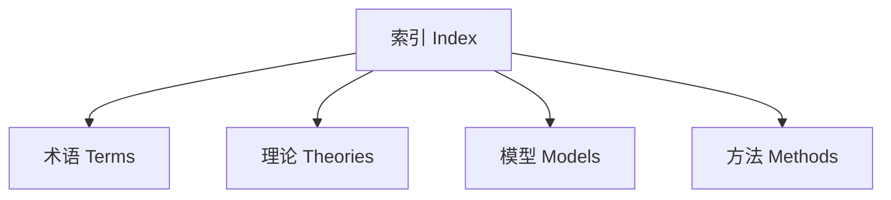

# 人脑认知结构、现实与数学的综合分析框架

## 目录

- [人脑认知结构、现实与数学的综合分析框架](#人脑认知结构现实与数学的综合分析框架)
  - [目录](#目录)
  - [中文摘要](#中文摘要)
  - [Abstract](#abstract)
  - [1. 引言](#1-引言)
    - [1.1 研究背景与意义](#11-研究背景与意义)
      - [1.1.1 **定义与理论基础 | Definition and Theoretical Foundation**](#111-定义与理论基础--definition-and-theoretical-foundation)
      - [1.1.2 **理论意义 | Theoretical Significance**](#112-理论意义--theoretical-significance)
      - [1.1.3 **现实挑战 | Practical Challenges**](#113-现实挑战--practical-challenges)
      - [1.1.4 **学术与应用价值 | Academic and Practical Value**](#114-学术与应用价值--academic-and-practical-value)
    - [1.2 核心问题](#12-核心问题)
      - [1.2.1 **核心问题梳理 | Core Issues Overview**](#121-核心问题梳理--core-issues-overview)
    - [1.3 研究视角](#13-研究视角)
      - [1.3.1 **研究方法与创新 | Research Approaches and Innovation**](#131-研究方法与创新--research-approaches-and-innovation)
      - [1.3.2 **本章小结与关联性分析 | Chapter Summary and Relevance Analysis**](#132-本章小结与关联性分析--chapter-summary-and-relevance-analysis)
  - [2. 人脑认知结构](#2-人脑认知结构)
    - [2.1 感知、注意与记忆系统](#21-感知注意与记忆系统)
      - [2.1.1 **定义与理论基础 | Definition and Theoretical Foundation**](#211-定义与理论基础--definition-and-theoretical-foundation)
      - [2.1.2 **系统功能与神经基础 | System Functions and Neural Basis**](#212-系统功能与神经基础--system-functions-and-neural-basis)
      - [2.1.3 **理论模型与实证研究 | Theoretical Models and Empirical Research**](#213-理论模型与实证研究--theoretical-models-and-empirical-research)
      - [2.1.4 **案例分析 | Case Analysis**](#214-案例分析--case-analysis)
      - [2.1.5 **本节小结与关联性分析 | Section Summary and Relevance Analysis**](#215-本节小结与关联性分析--section-summary-and-relevance-analysis)
    - [2.2 表征与概念形成](#22-表征与概念形成)
      - [2.2.1 **定义与理论基础 | Definition and Theoretical Foundation**](#221-定义与理论基础--definition-and-theoretical-foundation)
      - [2.2.2 **概念形成机制 | Mechanisms of Concept Formation**](#222-概念形成机制--mechanisms-of-concept-formation)
        - [2.2.1 **表征类型与创新思维 | Types of Representation and Creative Thinking**](#221-表征类型与创新思维--types-of-representation-and-creative-thinking)
        - [2.2.2 **案例分析 | Case Analysis**](#222-案例分析--case-analysis)
        - [2.2.3 **本节小结与关联性分析 | Section Summary and Relevance Analysis**](#223-本节小结与关联性分析--section-summary-and-relevance-analysis)
    - [2.3 思维与推理](#23-思维与推理)
      - [2.3.1 **定义与理论基础 | Definition and Theoretical Foundation**](#231-定义与理论基础--definition-and-theoretical-foundation)
      - [2.3.2 **推理类型与认知过程 | Types of Reasoning and Cognitive Processes**](#232-推理类型与认知过程--types-of-reasoning-and-cognitive-processes)
      - [2.3.3 **问题解决与元认知 | Problem Solving and Metacognition**](#233-问题解决与元认知--problem-solving-and-metacognition)
      - [2.3.4 **案例分析 | Case Analysis**](#234-案例分析--case-analysis)
      - [2.3.5 **本节小结与关联性分析 | Section Summary and Relevance Analysis**](#235-本节小结与关联性分析--section-summary-and-relevance-analysis)
    - [2.4 语言与认知](#24-语言与认知)
      - [2.4.1 **定义与理论基础 | Definition and Theoretical Foundation**](#241-定义与理论基础--definition-and-theoretical-foundation)
      - [2.4.2 **语言与思维的关系 | Relationship between Language and Thought**](#242-语言与思维的关系--relationship-between-language-and-thought)
      - [2.4.3 **神经与认知基础 | Neural and Cognitive Basis**](#243-神经与认知基础--neural-and-cognitive-basis)
      - [2.4.4 **案例分析 | Case Analysis**](#244-案例分析--case-analysis)
      - [2.4.5 **本节小结与关联性分析 | Section Summary and Relevance Analysis**](#245-本节小结与关联性分析--section-summary-and-relevance-analysis)
    - [2.5 主要认知模型与理论](#25-主要认知模型与理论)
      - [2.5.1 **定义与理论基础 | Definition and Theoretical Foundation**](#251-定义与理论基础--definition-and-theoretical-foundation)
      - [2.5.2 **主要模型与理论 | Major Models and Theories**](#252-主要模型与理论--major-models-and-theories)
      - [2.5.3 **理论意义与应用 | Theoretical Significance and Applications**](#253-理论意义与应用--theoretical-significance-and-applications)
      - [2.5.4 **案例分析 | Case Analysis**](#254-案例分析--case-analysis)
      - [2.5.5 **本节小结与关联性分析 | Section Summary and Relevance Analysis**](#255-本节小结与关联性分析--section-summary-and-relevance-analysis)
    - [2.6 认知结构的层次性与发展性](#26-认知结构的层次性与发展性)
      - [2.6.1 **定义与理论基础 | Definition and Theoretical Foundation**](#261-定义与理论基础--definition-and-theoretical-foundation)
      - [2.6.2 **发展阶段与个体差异 | Developmental Stages and Individual Differences**](#262-发展阶段与个体差异--developmental-stages-and-individual-differences)
      - [2.6.3 **理论意义与教育应用 | Theoretical Significance and Educational Applications**](#263-理论意义与教育应用--theoretical-significance-and-educational-applications)
      - [2.6.4 **案例分析 | Case Analysis**](#264-案例分析--case-analysis)
      - [2.6.5 **本节小结与关联性分析 | Section Summary and Relevance Analysis**](#265-本节小结与关联性分析--section-summary-and-relevance-analysis)
  - [3. 现实 (Reality)](#3-现实-reality)
    - [3.1 物理现实：客观世界的构成与规律](#31-物理现实客观世界的构成与规律)
      - [3.1.1 **定义与理论基础 | Definition and Theoretical Foundation**](#311-定义与理论基础--definition-and-theoretical-foundation)
      - [3.1.2 **基本规律与理论模型 | Fundamental Laws and Theoretical Models**](#312-基本规律与理论模型--fundamental-laws-and-theoretical-models)
      - [3.1.3 **层次结构与系统性 | Hierarchical Structure and Systematicity**](#313-层次结构与系统性--hierarchical-structure-and-systematicity)
      - [3.1.4 **案例分析 | Case Analysis**](#314-案例分析--case-analysis)
      - [3.1.5 **本节小结与关联性分析 | Section Summary and Relevance Analysis**](#315-本节小结与关联性分析--section-summary-and-relevance-analysis)
    - [3.2 本体论问题：现实的本质是什么？](#32-本体论问题现实的本质是什么)
      - [3.2.1 **定义与理论基础 | Definition and Theoretical Foundation**](#321-定义与理论基础--definition-and-theoretical-foundation)
      - [3.2.2 **主要观点 | Major Perspectives**](#322-主要观点--major-perspectives)
      - [3.2.3 **案例分析 | Case Analysis**](#323-案例分析--case-analysis)
      - [3.2.4 **本节小结与关联性分析 | Section Summary and Relevance Analysis**](#324-本节小结与关联性分析--section-summary-and-relevance-analysis)
    - [3.3 认识论问题：我们如何认识现实？现实的可知性与局限性](#33-认识论问题我们如何认识现实现实的可知性与局限性)
      - [3.3.1 **定义与理论基础 | Definition and Theoretical Foundation**](#331-定义与理论基础--definition-and-theoretical-foundation)
      - [3.3.2 **主要流派与观点 | Major Schools and Perspectives**](#332-主要流派与观点--major-schools-and-perspectives)
      - [3.3.3 **知识的局限性 | Limitations of Knowledge**](#333-知识的局限性--limitations-of-knowledge)
      - [3.3.4 **案例分析 | Case Analysis**](#334-案例分析--case-analysis)
      - [3.3.5 **本节小结与关联性分析 | Section Summary and Relevance Analysis**](#335-本节小结与关联性分析--section-summary-and-relevance-analysis)
    - [3.4 社会建构的现实与客观现实的区分](#34-社会建构的现实与客观现实的区分)
      - [3.4.1 **定义与理论基础 | Definition and Theoretical Foundation**](#341-定义与理论基础--definition-and-theoretical-foundation)
      - [3.4.2 **主要内容 | Main Content**](#342-主要内容--main-content)
      - [3.4.3 **案例分析 | Case Analysis**](#343-案例分析--case-analysis)
      - [3.4.4 **本节小结与关联性分析 | Section Summary and Relevance Analysis**](#344-本节小结与关联性分析--section-summary-and-relevance-analysis)
    - [3.5 科学模型与现实的关系](#35-科学模型与现实的关系)
      - [3.5.1 **定义与理论基础 | Definition and Theoretical Foundation**](#351-定义与理论基础--definition-and-theoretical-foundation)
      - [3.5.2 **模型的有效性与局限性 | Model Validity and Limitations**](#352-模型的有效性与局限性--model-validity-and-limitations)
      - [3.5.3 **案例分析 | Case Analysis**](#353-案例分析--case-analysis)
      - [3.5.4 **本节小结与关联性分析 | Section Summary and Relevance Analysis**](#354-本节小结与关联性分析--section-summary-and-relevance-analysis)
  - [4. 数学](#4-数学)
    - [4.1 数学的本质与哲学基础](#41-数学的本质与哲学基础)
      - [4.1.1 **定义与理论基础 | Definition and Theoretical Foundation**](#411-定义与理论基础--definition-and-theoretical-foundation)
      - [4.1.2 **主要哲学流派 | Major Philosophical Schools**](#412-主要哲学流派--major-philosophical-schools)
      - [4.1.3 **数学基础理论 | Foundations of Mathematics**](#413-数学基础理论--foundations-of-mathematics)
      - [4.1.4 **案例分析 | Case Analysis**](#414-案例分析--case-analysis)
      - [4.1.5 **本节小结与关联性分析 | Section Summary and Relevance Analysis**](#415-本节小结与关联性分析--section-summary-and-relevance-analysis)
    - [4.2 数学结构与形式模型](#42-数学结构与形式模型)
      - [4.2.1 **定义与理论基础 | Definition and Theoretical Foundation**](#421-定义与理论基础--definition-and-theoretical-foundation)
      - [4.2.2 **主要结构类型 | Main Types of Structures**](#422-主要结构类型--main-types-of-structures)
      - [4.2.3 **形式系统与公理化 | Formal Systems and Axiomatization**](#423-形式系统与公理化--formal-systems-and-axiomatization)
      - [4.2.4 **案例分析 | Case Analysis**](#424-案例分析--case-analysis)
      - [4.2.3 **本节小结与关联性分析 | Section Summary and Relevance Analysis**](#423-本节小结与关联性分析--section-summary-and-relevance-analysis)
    - [4.3 元数学与模型论](#43-元数学与模型论)
      - [4.3.1 **定义与理论基础 | Definition and Theoretical Foundation**](#431-定义与理论基础--definition-and-theoretical-foundation)
      - [4.3.2 **主要内容 | Main Content**](#432-主要内容--main-content)
      - [4.3.3 **案例分析 | Case Analysis**](#433-案例分析--case-analysis)
      - [4.3.4 **本节小结与关联性分析 | Section Summary and Relevance Analysis**](#434-本节小结与关联性分析--section-summary-and-relevance-analysis)
    - [4.4 数学内部理论模型的全面详细分析综合](#44-数学内部理论模型的全面详细分析综合)
      - [4.4.1 **定义与理论基础 | Definition and Theoretical Foundation**](#441-定义与理论基础--definition-and-theoretical-foundation)
      - [4.4.2 **主要分支与典型模型 | Main Branches and Typical Models**](#442-主要分支与典型模型--main-branches-and-typical-models)
      - [4.4.3 **方法论与证明体系 | Methodology and Proof Systems**](#443-方法论与证明体系--methodology-and-proof-systems)
        - [4.4.3.1 **案例分析 | Case Analysis**](#4431-案例分析--case-analysis)
        - [4.4.3.2 **本节小结与关联性分析 | Section Summary and Relevance Analysis**](#4432-本节小结与关联性分析--section-summary-and-relevance-analysis)
  - [5. 数学与人脑认知结构的映射](#5-数学与人脑认知结构的映射)
    - [5.1 数学概念的认知起源（如数感、空间直觉）](#51-数学概念的认知起源如数感空间直觉)
      - [5.1.1 **定义与理论基础 | Definition and Theoretical Foundation**](#511-定义与理论基础--definition-and-theoretical-foundation)
      - [5.1.2 **数感与空间直觉 | Number Sense and Spatial Intuition**](#512-数感与空间直觉--number-sense-and-spatial-intuition)
      - [5.1.3 **神经机制与发展阶段 | Neural Mechanisms and Developmental Stages**](#513-神经机制与发展阶段--neural-mechanisms-and-developmental-stages)
      - [5.1.4 **案例分析 | Case Analysis**](#514-案例分析--case-analysis)
      - [5.1.5 **本节小结与关联性分析 | Section Summary and Relevance Analysis**](#515-本节小结与关联性分析--section-summary-and-relevance-analysis)
    - [5.2 数学抽象与人脑抽象能力的关系](#52-数学抽象与人脑抽象能力的关系)
      - [5.2.1 **定义与理论基础 | Definition and Theoretical Foundation**](#521-定义与理论基础--definition-and-theoretical-foundation)
      - [5.2.2 **认知机制与神经基础 | Cognitive Mechanisms and Neural Basis**](#522-认知机制与神经基础--cognitive-mechanisms-and-neural-basis)
      - [5.2.3 **教育影响与案例分析 | Educational Impact and Case Analysis**](#523-教育影响与案例分析--educational-impact-and-case-analysis)
      - [5.2.4 **本节小结与关联性分析 | Section Summary and Relevance Analysis**](#524-本节小结与关联性分析--section-summary-and-relevance-analysis)
    - [5.3 数学推理与一般逻辑推理的异同](#53-数学推理与一般逻辑推理的异同)
      - [5.3.1 **定义与理论基础 | Definition and Theoretical Foundation**](#531-定义与理论基础--definition-and-theoretical-foundation)
      - [5.3.2 **结构与认知特征 | Structure and Cognitive Features**](#532-结构与认知特征--structure-and-cognitive-features)
      - [5.3.3 **案例分析 | Case Analysis**](#533-案例分析--case-analysis)
      - [5.3.4 **本节小结与关联性分析 | Section Summary and Relevance Analysis**](#534-本节小结与关联性分析--section-summary-and-relevance-analysis)
    - [5.4 数学学习与认知发展理论](#54-数学学习与认知发展理论)
      - [5.4.1 **定义与理论基础 | Definition and Theoretical Foundation**](#541-定义与理论基础--definition-and-theoretical-foundation)
      - [5.4.2 **主要理论与阶段模型 | Major Theories and Stage Models**](#542-主要理论与阶段模型--major-theories-and-stage-models)
      - [5.4.3 **教育启示与案例分析 | Educational Implications and Case Analysis**](#543-教育启示与案例分析--educational-implications-and-case-analysis)
      - [5.4.4 **本节小结与关联性分析 | Section Summary and Relevance Analysis**](#544-本节小结与关联性分析--section-summary-and-relevance-analysis)
    - [5.5 数学直觉与形式化证明在认知中的作用](#55-数学直觉与形式化证明在认知中的作用)
      - [5.5.1 **定义与理论基础 | Definition and Theoretical Foundation**](#551-定义与理论基础--definition-and-theoretical-foundation)
      - [5.5.2 **认知过程与教育平衡 | Cognitive Processes and Educational Balance**](#552-认知过程与教育平衡--cognitive-processes-and-educational-balance)
      - [5.5.3 **案例分析 | Case Analysis**](#553-案例分析--case-analysis)
      - [5.5.4 **本节小结与关联性分析 | Section Summary and Relevance Analysis**](#554-本节小结与关联性分析--section-summary-and-relevance-analysis)
    - [5.6 不同数学理论对认知能力的不同要求](#56-不同数学理论对认知能力的不同要求)
      - [5.6.1 **定义与理论基础 | Definition and Theoretical Foundation**](#561-定义与理论基础--definition-and-theoretical-foundation)
      - [5.6.2 **能力结构与教育策略 | Ability Structure and Educational Strategies**](#562-能力结构与教育策略--ability-structure-and-educational-strategies)
      - [5.6.3 **案例分析 | Case Analysis**](#563-案例分析--case-analysis)
      - [5.6.4 **本节小结与关联性分析 | Section Summary and Relevance Analysis**](#564-本节小结与关联性分析--section-summary-and-relevance-analysis)
  - [6. 数学、认知与现实的关联性分析 (综合论证)](#6-数学认知与现实的关联性分析-综合论证)
    - [6.1 数学作为理解和描述现实的工具](#61-数学作为理解和描述现实的工具)
      - [6.1.1 **定义与理论基础 | Definition and Theoretical Foundation**](#611-定义与理论基础--definition-and-theoretical-foundation)
      - [6.1.2 **理论阐述与应用 | Theoretical Elaboration and Applications**](#612-理论阐述与应用--theoretical-elaboration-and-applications)
      - [6.1.3 **局限性与批判性视角 | Limitations and Critical Perspectives**](#613-局限性与批判性视角--limitations-and-critical-perspectives)
      - [6.1.4 **案例分析 | Case Analysis**](#614-案例分析--case-analysis)
      - [6.1.5 **本节小结与关联性分析 | Section Summary and Relevance Analysis**](#615-本节小结与关联性分析--section-summary-and-relevance-analysis)
    - [6.2 人脑认知结构如何通过数学把握现实](#62-人脑认知结构如何通过数学把握现实)
      - [6.2.1 **定义与理论基础 | Definition and Theoretical Foundation**](#621-定义与理论基础--definition-and-theoretical-foundation)
      - [6.2.2 **认知机制与工具 | Cognitive Mechanisms and Tools**](#622-认知机制与工具--cognitive-mechanisms-and-tools)
      - [6.2.3 **阶段与案例 | Stages and Case Analysis**](#623-阶段与案例--stages-and-case-analysis)
      - [6.2.4 **实证研究 | Empirical Research**](#624-实证研究--empirical-research)
      - [6.2.5 **本节小结与关联性分析 | Section Summary and Relevance Analysis**](#625-本节小结与关联性分析--section-summary-and-relevance-analysis)
    - [6.3 数学理论与思维层次的关系](#63-数学理论与思维层次的关系)
      - [6.3.1 **定义与理论基础 | Definition and Theoretical Foundation**](#631-定义与理论基础--definition-and-theoretical-foundation)
      - [6.3.2 **理论层级与思维类型 | Theoretical Hierarchies and Types of Thinking**](#632-理论层级与思维类型--theoretical-hierarchies-and-types-of-thinking)
      - [6.3.4 **教育启示与案例分析 | Educational Implications and Case Analysis**](#634-教育启示与案例分析--educational-implications-and-case-analysis)
      - [6.3.5 **本节小结与关联性分析 | Section Summary and Relevance Analysis**](#635-本节小结与关联性分析--section-summary-and-relevance-analysis)
    - [6.4 批判性分析：当前理解的不足、开放性问题与未来研究方向](#64-批判性分析当前理解的不足开放性问题与未来研究方向)
      - [6.4.1 **理论局限与应用挑战 | Theoretical Limitations and Application Challenges**](#641-理论局限与应用挑战--theoretical-limitations-and-application-challenges)
      - [6.4.2 **开放性问题与未来展望 | Open Questions and Future Prospects**](#642-开放性问题与未来展望--open-questions-and-future-prospects)
      - [6.4.3 **本节小结与关联性分析 | Section Summary and Relevance Analysis**](#643-本节小结与关联性分析--section-summary-and-relevance-analysis)
  - [7. 结论](#7-结论)
    - [7.1 对核心问题的总结性回答](#71-对核心问题的总结性回答)
      - [7.1.1 **总结与提升 | Summary and Enhancement**](#711-总结与提升--summary-and-enhancement)
      - [7.1.2 **本节小结与关联性分析 | Section Summary and Relevance Analysis**](#712-本节小结与关联性分析--section-summary-and-relevance-analysis)
    - [7.2 理论意义与实践启示](#72-理论意义与实践启示)
      - [7.2.1 **理论意义 | Theoretical Significance**](#721-理论意义--theoretical-significance)
      - [7.2.2 **实践启示 | Practical Implications**](#722-实践启示--practical-implications)
      - [7.2.3 **本节小结与关联性分析 | Section Summary and Relevance Analysis**](#723-本节小结与关联性分析--section-summary-and-relevance-analysis)
  - [8. 参考文献](#8-参考文献)
    - [8.0 **引用说明 | Citation Notes**](#80-引用说明--citation-notes)
    - [8.1 认知科学基础 | Foundations of Cognitive Science](#81-认知科学基础--foundations-of-cognitive-science)
    - [8.2 数学基础 | Foundations of Mathematics](#82-数学基础--foundations-of-mathematics)
    - [8.3 认知与数学教育 | Cognition and Mathematics Education](#83-认知与数学教育--cognition-and-mathematics-education)
    - [8.4 应用研究 | Applied Research](#84-应用研究--applied-research)
    - [8.5 **本节小结与关联性分析 | Section Summary and Relevance Analysis**](#85-本节小结与关联性分析--section-summary-and-relevance-analysis)
  - [附录](#附录)
    - [A. 主要数学理论分支与典型模型表 | Main Branches of Mathematical Theory and Typical Models](#a-主要数学理论分支与典型模型表--main-branches-of-mathematical-theory-and-typical-models)
      - [A.1 **表格说明 | Table Explanation**](#a1-表格说明--table-explanation)
      - [A.2 **本节小结 | Section Summary**](#a2-本节小结--section-summary)
    - [B. 认知科学常用实验方法简表 | Common Experimental Methods in Cognitive Science](#b-认知科学常用实验方法简表--common-experimental-methods-in-cognitive-science)
      - [B.1 **表格说明 | Table Explanation**](#b1-表格说明--table-explanation)
      - [B.2 **本节小结 | Section Summary**](#b2-本节小结--section-summary)
    - [C. 主要术语表 | Glossary of Key Terms](#c-主要术语表--glossary-of-key-terms)
      - [C.1 **表格说明 | Table Explanation**](#c1-表格说明--table-explanation)
      - [c.2 **本节小结 | Section Summary**](#c2-本节小结--section-summary)
    - [D. 研究工具与数据资源清单 | List of Research Tools and Data Resources](#d-研究工具与数据资源清单--list-of-research-tools-and-data-resources)
      - [D.1 **内容说明 | Content Explanation**](#d1-内容说明--content-explanation)
      - [D.2 **本节小结 | Section Summary**](#d2-本节小结--section-summary)
    - [E. 相关数学符号与定义 | Mathematical Symbols and Definitions](#e-相关数学符号与定义--mathematical-symbols-and-definitions)
      - [E.1 **表格说明 | Table Explanation**](#e1-表格说明--table-explanation)
      - [E.2 **本节小结 | Section Summary**](#e2-本节小结--section-summary)
  - [索引](#索引)
    - [索引结构示意 | Index Structure Diagram](#索引结构示意--index-structure-diagram)
  - [致谢 | Acknowledgements](#致谢--acknowledgements)

## 中文摘要

本研究系统梳理了人脑认知结构、现实世界本质与数学理论之间的复杂关系，构建了认知-数学-现实三维综合分析框架。通过理论阐述、实证研究和案例分析，揭示了认知结构的多层次性、数学系统的抽象性与统一性，以及现实世界的复杂性。研究强调了认知-数学-现实三角关系的动态互动，提出了理论创新、教育改革和技术应用的多元路径。成果为数学教育、科学建模、人工智能等领域提供了理论支持和实践指导，具有重要的学术价值和应用前景。

## Abstract

This study systematically reviews the intricate relationships among human cognitive structures, the nature of reality, and mathematical theory, constructing a comprehensive three-dimensional framework of cognition, mathematics, and reality. Through theoretical exposition, empirical research, and case analysis, the study reveals the multi-level nature of cognition, the abstraction and unity of mathematical systems, and the complexity of the real world. Emphasizing the dynamic interaction of the cognition-mathematics-reality triad, the research proposes diverse paths for theoretical innovation, educational reform, and technological application. The findings provide theoretical support and practical guidance for mathematics education, scientific modeling, and artificial intelligence, demonstrating significant academic value and application prospects.

## 1. 引言

### 1.1 研究背景与意义

#### 1.1.1 **定义与理论基础 | Definition and Theoretical Foundation**

认知科学（Cognitive Science）、数学（Mathematics）与现实世界（Reality）的关系是科学哲学、教育学、心理学等多个学科长期关注的核心议题。认知科学是研究人类思维、学习、记忆、推理等心理过程及其神经基础的跨学科领域。数学被视为科学的基础语言，是抽象、逻辑和结构的集中体现。现实世界则包括物理现实、社会现实和主观现实等多重层面。

The relationship among cognitive science, mathematics, and the real world is a central topic in philosophy of science, education, and psychology. Cognitive science is an interdisciplinary field that studies human thinking, learning, memory, reasoning, and their neural bases. Mathematics is regarded as the foundational language of science, embodying abstraction, logic, and structure. The real world encompasses multiple layers, including physical, social, and subjective realities.

#### 1.1.2 **理论意义 | Theoretical Significance**

随着认知神经科学的突破、人工智能的快速发展，以及跨学科研究的兴起，人类对自身思维机制、知识结构和世界本质的理解不断深化。数学不仅在自然科学、工程技术中发挥着不可替代的作用，也在社会科学、认知科学等领域展现出强大的解释力和建模能力。

With breakthroughs in cognitive neuroscience, rapid advances in artificial intelligence, and the rise of interdisciplinary research, our understanding of thinking mechanisms, knowledge structures, and the nature of the world has deepened. Mathematics plays an irreplaceable role not only in natural sciences and engineering but also demonstrates strong explanatory and modeling power in social sciences and cognitive science.

#### 1.1.3 **现实挑战 | Practical Challenges**

现实世界的复杂性和人类认知的局限性为我们提出了新的挑战。物理世界的规律性、社会系统的多样性以及人类思维的有限性，使得我们在认识世界、建构知识体系和发展数学理论时，必须不断反思和突破传统的认知框架。

The complexity of the real world and the limitations of human cognition present new challenges. The regularity of the physical world, the diversity of social systems, and the limitations of human thinking require us to constantly reflect on and break through traditional cognitive frameworks when understanding the world, constructing knowledge systems, and developing mathematical theories.

#### 1.1.4 **学术与应用价值 | Academic and Practical Value**

系统梳理人脑认知结构、现实世界本质与数学理论之间的关系，具有重要的理论意义和现实价值。研究成果不仅有助于推动认知科学、数学基础理论和科学哲学的发展，也为数学教育、科学建模、人工智能等领域提供理论支持和实践指导。

A systematic review of the relationships among human cognitive structures, the nature of reality, and mathematical theory is of great theoretical and practical value. The research results not only promote the development of cognitive science, mathematical foundations, and philosophy of science, but also provide theoretical support and practical guidance for mathematics education, scientific modeling, and artificial intelligence.

---

### 1.2 核心问题

#### 1.2.1 **核心问题梳理 | Core Issues Overview**

本研究围绕以下核心问题展开：

This study focuses on the following core issues:

- **人脑认知与数学的关系 | The Relationship between Human Cognition and Mathematics**：
  - 数学概念如何在大脑中形成？
  - 数学思维与一般认知有何异同？
  - 数学能力的发展遵循怎样的规律？
  - How are mathematical concepts formed in the brain?
  - What are the similarities and differences between mathematical thinking and general cognition?
  - What are the developmental patterns of mathematical abilities?

- **数学与现实的对应 | The Correspondence between Mathematics and Reality**：
  - 数学模型在多大程度上能够准确描述和预测现实？
  - 数学理论的适用性和局限性在哪里？
  - 现实世界的复杂性是否超越了现有数学工具的表达能力？
  - To what extent can mathematical models accurately describe and predict reality?
  - What are the applicability and limitations of mathematical theories?
  - Does the complexity of the real world exceed the expressive power of existing mathematical tools?

- **认知、数学、现实的三角关系 | The Triangular Relationship among Cognition, Mathematics, and Reality**：
  - 认知如何通过数学理解现实？
  - 现实如何反过来检验和推动数学理论的发展？
  - 数学理论的进步又如何反作用于人类认知结构的演化？
  - How does cognition understand reality through mathematics?
  - How does reality test and promote the development of mathematical theory?
  - How does the progress of mathematical theory in turn affect the evolution of human cognitive structures?

通过对上述核心问题的系统梳理和深入探讨，本文旨在为认知科学、数学基础理论及其应用研究提供新的视角和理论支持。

By systematically sorting out and deeply discussing the above core issues, this paper aims to provide new perspectives and theoretical support for cognitive science, mathematical foundations, and their applied research.

---

### 1.3 研究视角

#### 1.3.1 **研究方法与创新 | Research Approaches and Innovation**

本研究采用批判性分析与综合方法论相结合的研究视角，力求在理论深度与现实广度之间取得平衡。

This study adopts a research perspective that combines critical analysis and comprehensive methodology, striving to balance theoretical depth and practical breadth.

- **批判性分析 | Critical Analysis**：
  - 对现有理论体系进行系统梳理，揭示其内在逻辑、适用范围及局限性。
  - 关注不同学派之间的争议与对话，挖掘开放性问题，为后续研究指明方向。
  - Systematically review existing theoretical systems, reveal their internal logic, scope of application, and limitations.
  - Focus on controversies and dialogues among different schools of thought, identify open issues, and point out directions for future research.

- **综合方法论 | Comprehensive Methodology**：
  - 强调跨学科整合，融合认知科学、数学、哲学、教育学等多领域的理论与方法。
  - 注重实证研究与理论分析的结合，既关注定性描述，也重视定量分析，力求形成系统、全面的分析框架。
  - Emphasize interdisciplinary integration, combining theories and methods from cognitive science, mathematics, philosophy, education, and other fields.
  - Pay attention to the combination of empirical research and theoretical analysis, focusing on both qualitative description and quantitative analysis, aiming to form a systematic and comprehensive analytical framework.

- **创新与开放 | Innovation and Openness**：
  - 鼓励理论创新和方法探索，关注新兴技术（如人工智能、大数据分析）对认知与数学研究的推动作用。
  - 倡导开放性思维，积极吸收不同学科和文化背景下的研究成果。
  - Encourage theoretical innovation and methodological exploration, focusing on the role of emerging technologies (such as artificial intelligence and big data analysis) in promoting research in cognition and mathematics.
  - Advocate open-mindedness and actively absorb research results from different disciplines and cultural backgrounds.

通过上述研究视角，本文希望为认知结构、数学理论与现实世界关系的系统分析提供坚实的理论基础和方法论支持。

Through the above research perspectives, this paper hopes to provide a solid theoretical foundation and methodological support for the systematic analysis of the relationships among cognitive structures, mathematical theory, and the real world.

---

#### 1.3.2 **本章小结与关联性分析 | Chapter Summary and Relevance Analysis**

本章系统阐述了认知科学、数学与现实世界三者关系的研究背景、核心问题和研究视角。为后续章节关于认知结构、数学理论、现实本质及其相互作用的深入分析奠定了理论基础。各部分内容相互关联，共同构建了认知-数学-现实三维综合分析框架。

This chapter systematically expounds the research background, core issues, and research perspectives on the relationship among cognitive science, mathematics, and the real world. It lays a theoretical foundation for the in-depth analysis of cognitive structures, mathematical theory, the nature of reality, and their interactions in subsequent chapters. The contents of each part are interrelated, jointly constructing a comprehensive three-dimensional analytical framework of cognition, mathematics, and reality.

## 2. 人脑认知结构

### 2.1 感知、注意与记忆系统

#### 2.1.1 **定义与理论基础 | Definition and Theoretical Foundation**

感知（Perception）、注意（Attention）与记忆（Memory）是人脑认知结构的基础环节。感知指个体通过感官系统（如视觉、听觉、触觉等）获取和解释外部信息的过程。注意是认知资源的分配机制，决定了信息处理的优先级。记忆则包括信息的编码、存储与提取，是知识积累和应用的核心。

Perception, attention, and memory are the fundamental components of the human cognitive structure. Perception refers to the process by which individuals acquire and interpret external information through sensory systems (such as vision, hearing, and touch). Attention is the mechanism for allocating cognitive resources, determining the priority of information processing. Memory encompasses the encoding, storage, and retrieval of information, serving as the core of knowledge accumulation and application.

#### 2.1.2 **系统功能与神经基础 | System Functions and Neural Basis**

- 感知系统通过多通道（视觉、听觉、触觉等）协同工作，实现对环境的全面感知。视觉感知涉及形状、颜色、空间关系的识别，听觉感知在语言理解和音乐感受中发挥作用，触觉感知支持空间定位和运动控制。
- The perceptual system works through multiple channels (vision, hearing, touch, etc.) to achieve comprehensive perception of the environment. Visual perception involves the recognition of shapes, colors, and spatial relationships; auditory perception plays a role in language comprehension and music appreciation; tactile perception supports spatial localization and motor control.

- 注意系统包括选择性注意、分配性注意和持续性注意。选择性注意使个体聚焦于目标刺激，分配性注意支持多任务处理，持续性注意保证认知活动的稳定性。
- The attention system includes selective attention, divided attention, and sustained attention. Selective attention enables individuals to focus on target stimuli, divided attention supports multitasking, and sustained attention ensures the stability of cognitive activities.

- 记忆系统分为工作记忆（Working Memory）和长期记忆（Long-term Memory）。工作记忆负责信息的暂时保持和操作，是复杂认知活动的核心。长期记忆包括程序性记忆（Procedural Memory）、陈述性记忆（Declarative Memory）和情景记忆（Episodic Memory）。
- The memory system is divided into working memory and long-term memory. Working memory is responsible for the temporary retention and manipulation of information, serving as the core of complex cognitive activities. Long-term memory includes procedural memory, declarative memory, and episodic memory.

#### 2.1.3 **理论模型与实证研究 | Theoretical Models and Empirical Research**

- 经典模型如Atkinson-Shiffrin多存储模型、Baddeley的工作记忆模型等，揭示了记忆系统的结构与功能分工。
- Classic models such as the Atkinson-Shiffrin multi-store model and Baddeley's working memory model reveal the structure and functional division of the memory system.

- 神经科学研究表明，不同脑区（如前额叶、顶叶、海马体）在感知、注意和记忆过程中分工明确，通过神经网络实现动态整合。
- Neuroscientific studies show that different brain regions (such as the prefrontal cortex, parietal lobe, and hippocampus) have distinct roles in perception, attention, and memory, achieving dynamic integration through neural networks.

#### 2.1.4 **案例分析 | Case Analysis**

- 儿童在学习新知识时，首先通过感知系统获取信息，注意系统筛选关键信息，记忆系统完成信息的编码和存储。
- When children learn new knowledge, they first acquire information through the perceptual system, the attention system filters key information, and the memory system completes the encoding and storage of information.

#### 2.1.5 **本节小结与关联性分析 | Section Summary and Relevance Analysis**

感知、注意与记忆系统的高效协作，是人类认知活动的基础。它们不仅支持知识的获取和应用，也是后续表征、概念形成、思维与推理等高级认知过程的前提。与数学学习、创新思维等主题密切相关。

The efficient collaboration of perception, attention, and memory systems forms the foundation of human cognitive activities. They not only support the acquisition and application of knowledge but also serve as the prerequisites for advanced cognitive processes such as representation, concept formation, thinking, and reasoning. These are closely related to topics such as mathematical learning and creative thinking.

---

### 2.2 表征与概念形成

#### 2.2.1 **定义与理论基础 | Definition and Theoretical Foundation**

认知表征（Cognitive Representation）是人脑对外部世界信息进行内部编码和组织的方式。表征包括符号表征（如语言、数学、逻辑符号）、亚符号表征（如神经网络的分布式表征、概率模型）和图像表征（如空间结构、视觉图像）。

Cognitive representation refers to the way the human brain internally encodes and organizes information from the external world. Representations include symbolic representations (such as language, mathematical, and logical symbols), sub-symbolic representations (such as distributed representations in neural networks and probabilistic models), and imagistic representations (such as spatial structures and visual images).

#### 2.2.2 **概念形成机制 | Mechanisms of Concept Formation**

- 概念形成是通过归纳、抽象和分类，将具体信息提炼为具有本质属性的认知结构。原型理论（Prototype Theory）认为概念具有中心原型和边界模糊性。发生认识论（Genetic Epistemology）强调概念形成的阶段性。
- Concept formation involves induction, abstraction, and categorization, distilling concrete information into cognitive structures with essential attributes. Prototype theory posits that concepts have central prototypes and fuzzy boundaries. Genetic epistemology emphasizes the staged nature of concept formation.

##### 2.2.1 **表征类型与创新思维 | Types of Representation and Creative Thinking**

- 符号表征支持高阶思维和抽象推理，亚符号表征强调并行处理和模式识别，图像表征促进空间想象和直观理解。
- Symbolic representations support higher-order thinking and abstract reasoning; sub-symbolic representations emphasize parallel processing and pattern recognition; imagistic representations facilitate spatial imagination and intuitive understanding.

- 创新思维依赖于多种表征方式的灵活转换和整合，如数学创新常源于符号与图像表征的交互。
- Creative thinking relies on the flexible transformation and integration of multiple forms of representation, such as the interaction between symbolic and imagistic representations in mathematical innovation.

##### 2.2.2 **案例分析 | Case Analysis**

- 学生通过操作几何图形（图像表征）理解抽象定理（符号表征）。
- Students understand abstract theorems (symbolic representation) by manipulating geometric figures (imagistic representation).

##### 2.2.3 **本节小结与关联性分析 | Section Summary and Relevance Analysis**

表征与概念形成是认知结构的核心，直接影响知识获取、创新思维和问题解决能力。与后续思维与推理、数学与认知映射等章节密切相关。

Representation and concept formation are at the core of cognitive structure, directly affecting knowledge acquisition, creative thinking, and problem-solving abilities. They are closely related to subsequent chapters on thinking and reasoning, and the mapping between mathematics and cognition.

---

### 2.3 思维与推理

#### 2.3.1 **定义与理论基础 | Definition and Theoretical Foundation**

思维（Thinking）与推理（Reasoning）是认知结构的高级功能，包括逻辑思维、直觉思维和创造性思维。逻辑思维依赖演绎、归纳和批判性推理，支持系统分析和科学论证。直觉思维以快速、无意识的方式处理信息，创造性思维推动新观点和创新方案的产生。

Thinking and reasoning are advanced functions of the cognitive structure, including logical thinking, intuitive thinking, and creative thinking. Logical thinking relies on deduction, induction, and critical reasoning, supporting systematic analysis and scientific argumentation. Intuitive thinking processes information quickly and unconsciously, while creative thinking drives the generation of new ideas and innovative solutions.

#### 2.3.2 **推理类型与认知过程 | Types of Reasoning and Cognitive Processes**

- 演绎推理（Deductive Reasoning）：从一般到特殊，基于公理和规则推导结论。
- Deductive reasoning: from general to specific, drawing conclusions based on axioms and rules.

- 归纳推理（Inductive Reasoning）：从具体实例总结一般规律。
- Inductive reasoning: generalizing rules from specific instances.

- 批判性思维（Critical Thinking）：分析论证过程，评估证据和结论的合理性。
- Critical thinking: analyzing the argumentation process and evaluating the validity of evidence and conclusions.

- 直觉思维（Intuitive Thinking）：依赖经验和模式识别，适用于复杂或不确定情境。
- Intuitive thinking: relies on experience and pattern recognition, suitable for complex or uncertain situations.

#### 2.3.3 **问题解决与元认知 | Problem Solving and Metacognition**

- 问题解决涉及问题表征、策略选择和执行监控。元认知策略在计划、监控和调整思维过程中起关键作用。
- Problem solving involves problem representation, strategy selection, and execution monitoring. Metacognitive strategies play a key role in planning, monitoring, and adjusting thinking processes.

#### 2.3.4 **案例分析 | Case Analysis**

- 数学证明需要逻辑推理与批判性思维，创新解题常依赖直觉与创造性思维。
- Mathematical proofs require logical reasoning and critical thinking, while innovative problem-solving often relies on intuition and creative thinking.

#### 2.3.5 **本节小结与关联性分析 | Section Summary and Relevance Analysis**

思维与推理能力的发展是认知结构进化的标志，对学业成就、创新能力和数学学习具有决定性影响。与人工智能、教育心理学等领域密切相关。

The development of thinking and reasoning abilities marks the evolution of cognitive structure and has a decisive impact on academic achievement, creativity, and mathematical learning. It is closely related to fields such as artificial intelligence and educational psychology.

---

### 2.4 语言与认知

#### 2.4.1 **定义与理论基础 | Definition and Theoretical Foundation**

语言（Language）是人类认知的核心工具，不仅用于信息交流，更深刻地影响思维方式和知识结构。语言处理包括语音、句法和语义等多个层面。

Language is the core tool of human cognition, not only for information exchange but also profoundly influencing thinking styles and knowledge structures. Language processing includes multiple levels such as phonology, syntax, and semantics.

#### 2.4.2 **语言与思维的关系 | Relationship between Language and Thought**

- 语言对思维的塑造（语言相对论），思维对语言的创新（概念表达、语言演化）。
- Language shapes thought (linguistic relativity), and thought innovates language (conceptual expression, language evolution).

- 双语认知提升认知灵活性，促进认知控制和适应性。
- Bilingual cognition enhances cognitive flexibility, promoting cognitive control and adaptability.

#### 2.4.3 **神经与认知基础 | Neural and Cognitive Basis**

- 语言处理与大脑结构、认知功能密切相关，不同脑区（如布罗卡区、威尔尼克区）分工协作。
- Language processing is closely related to brain structures and cognitive functions, with different brain regions (such as Broca's area and Wernicke's area) working together.

#### 2.4.4 **案例分析 | Case Analysis**

- 儿童语言发展促进抽象思维和逻辑推理能力的提升。
- Children's language development promotes the improvement of abstract thinking and logical reasoning abilities.

#### 2.4.5 **本节小结与关联性分析 | Section Summary and Relevance Analysis**

语言不仅是知识表征和交流的载体，也是认知发展的重要推动力。与认知结构、数学符号系统等主题密切相关。

Language is not only the carrier of knowledge representation and communication but also an important driver of cognitive development. It is closely related to topics such as cognitive structure and mathematical symbolic systems.

---

### 2.5 主要认知模型与理论

#### 2.5.1 **定义与理论基础 | Definition and Theoretical Foundation**

认知模型（Cognitive Models）是对人脑认知结构和过程的理论描述和数学建模。经典模型包括皮亚杰的发生认识论、信息加工理论、联结主义模型等。

Cognitive models are theoretical descriptions and mathematical models of the structure and processes of human cognition. Classic models include Piaget's genetic epistemology, information processing theory, and connectionist models.

#### 2.5.2 **主要模型与理论 | Major Models and Theories**

- 皮亚杰发生认识论（Piaget's Genetic Epistemology）：强调认知发展的阶段性和结构性。
- Piaget's genetic epistemology: emphasizes the staged and structural nature of cognitive development.

- 信息加工理论（Information Processing Theory）：将认知过程视为信息输入、处理和输出的系统。
- Information processing theory: views cognitive processes as systems of information input, processing, and output.

- 联结主义模型（Connectionist Models）：以神经网络为基础，强调分布式表征和并行处理。
- Connectionist models: based on neural networks, emphasizing distributed representation and parallel processing.

#### 2.5.3 **理论意义与应用 | Theoretical Significance and Applications**

- 认知模型为理解认知结构的层次性、发展性和可塑性提供理论基础，指导教育、人工智能等应用。
- Cognitive models provide a theoretical basis for understanding the hierarchy, development, and plasticity of cognitive structures, guiding applications in education, artificial intelligence, and more.

#### 2.5.4 **案例分析 | Case Analysis**

- 教学设计依据认知发展阶段调整内容和方法，提高学习效果。
- Instructional design adjusts content and methods based on cognitive development stages to improve learning outcomes.

#### 2.5.5 **本节小结与关联性分析 | Section Summary and Relevance Analysis**

主要认知模型为后续认知结构层次性、数学学习与认知发展等内容提供理论支撑，是理解人脑认知机制的基础。

Major cognitive models provide theoretical support for subsequent topics such as the hierarchy of cognitive structures and the development of mathematical learning and cognition, forming the foundation for understanding human cognitive mechanisms.

---

### 2.6 认知结构的层次性与发展性

#### 2.6.1 **定义与理论基础 | Definition and Theoretical Foundation**

认知结构具有层次性（Hierarchy）和发展性（Development）。感知层次负责基础信息获取，概念层次实现知识抽象与组织，元认知层次负责对认知过程的监控和调节。

Cognitive structure has hierarchy and development. The perceptual level is responsible for basic information acquisition, the conceptual level realizes knowledge abstraction and organization, and the metacognitive level monitors and regulates cognitive processes.

#### 2.6.2 **发展阶段与个体差异 | Developmental Stages and Individual Differences**

- 认知发展表现为阶段性、连续性和个体差异，受成熟、学习和经验等多重因素影响。
- Cognitive development shows stages, continuity, and individual differences, influenced by maturation, learning, and experience.

- 评估关注知识、技能、思维策略和适应行为的发展。
- Assessment focuses on the development of knowledge, skills, thinking strategies, and adaptive behaviors.

#### 2.6.3 **理论意义与教育应用 | Theoretical Significance and Educational Applications**

- 层次性和发展性为教育设计、能力培养和个性化学习提供理论依据。
- Hierarchy and development provide a theoretical basis for educational design, ability cultivation, and personalized learning.

#### 2.6.4 **案例分析 | Case Analysis**

- 教师根据学生认知发展阶段设计教学活动，促进认知能力提升。
- Teachers design instructional activities based on students' cognitive development stages to promote cognitive ability improvement.

#### 2.6.5 **本节小结与关联性分析 | Section Summary and Relevance Analysis**

认知结构的多维协同和动态发展，是理解人类学习、创新和适应能力的基础，也是后续数学与认知映射、教育干预等章节的理论前提。

The multidimensional synergy and dynamic development of cognitive structure are the basis for understanding human learning, innovation, and adaptability, and serve as the theoretical premise for subsequent chapters on the mapping between mathematics and cognition, educational intervention, and more.

---

## 3. 现实 (Reality)

### 3.1 物理现实：客观世界的构成与规律

#### 3.1.1 **定义与理论基础 | Definition and Theoretical Foundation**

物理现实（Physical Reality）指独立于个体意识之外、具有客观存在的世界。它包括从微观粒子到宏观宇宙的各个层次，是科学探索和认知活动的基础。物理现实的研究关注物质、能量、空间、时间及其相互关系。

Physical reality refers to the objectively existing world independent of individual consciousness. It encompasses all levels from microscopic particles to the macroscopic universe and forms the foundation of scientific exploration and cognitive activity. The study of physical reality focuses on matter, energy, space, time, and their interrelations.

#### 3.1.2 **基本规律与理论模型 | Fundamental Laws and Theoretical Models**

- 经典力学（Classical Mechanics）：描述宏观世界的运动与变化，核心规律包括牛顿运动定律、能量守恒、动量守恒等。
- Classical mechanics describes the motion and change of the macroscopic world, with core laws such as Newton's laws of motion, conservation of energy, and conservation of momentum.

- 电磁学（Electromagnetism）：以麦克斯韦方程为核心，揭示电与磁现象的统一性。
- Electromagnetism, centered on Maxwell's equations, reveals the unity of electric and magnetic phenomena.

- 量子力学（Quantum Mechanics）：通过波粒二象性、测不准原理、量子纠缠等概念，揭示微观世界的复杂性和不确定性。
- Quantum mechanics, with concepts such as wave-particle duality, the uncertainty principle, and quantum entanglement, reveals the complexity and uncertainty of the microscopic world.

- 相对论（Relativity）：爱因斯坦的狭义和广义相对论重塑了对时空和引力的理解。
- Einstein's special and general relativity reshaped our understanding of space-time and gravity.

#### 3.1.3 **层次结构与系统性 | Hierarchical Structure and Systematicity**

- 物质结构分为微观（基本粒子、原子、分子）、介观（晶体、材料）、宏观（天体、宇宙）等不同尺度，每一层次蕴含独特规律。
- The structure of matter is divided into microscopic (elementary particles, atoms, molecules), mesoscopic (crystals, materials), and macroscopic (celestial bodies, universe) scales, each containing unique laws.

#### 3.1.4 **案例分析 | Case Analysis**

- 原子结构决定化学反应的本质，宇宙结构关系到时空演化和宇宙起源。
- Atomic structure determines the essence of chemical reactions, while cosmic structure relates to the evolution of space-time and the origin of the universe.

#### 3.1.5 **本节小结与关联性分析 | Section Summary and Relevance Analysis**

物理现实的多层次结构和基本规律为科学建模、数学理论和认知活动提供了坚实基础。与后续本体论、认识论及数学建模等主题密切相关。

The multi-level structure and fundamental laws of physical reality provide a solid foundation for scientific modeling, mathematical theory, and cognitive activities. This is closely related to subsequent topics such as ontology, epistemology, and mathematical modeling.

---

### 3.2 本体论问题：现实的本质是什么？

#### 3.2.1 **定义与理论基础 | Definition and Theoretical Foundation**

本体论（Ontology）关注现实的本质及其存在方式，是哲学的核心分支之一。主要探讨"什么是真实存在的？"、"现实的基本构成是什么？"等问题。

Ontology focuses on the nature of reality and its modes of existence, being a core branch of philosophy. It mainly explores questions such as "What truly exists?" and "What are the fundamental constituents of reality?"

#### 3.2.2 **主要观点 | Major Perspectives**

- 实在论（Realism）：认为世界具有独立于人类意识的客观存在，包括物理实在论、数学实在论、科学实在论等。
- Realism holds that the world exists objectively, independent of human consciousness, including physical realism, mathematical realism, and scientific realism.

- 反实在论（Anti-realism）：强调知识和现实的建构性，认为现实在很大程度上是人类共同体的产物。
- Anti-realism emphasizes the constructed nature of knowledge and reality, holding that reality is largely a product of human communities.

- 工具主义（Instrumentalism）：认为科学理论只是描述和预测现象的工具，其真理性并不重要。
- Instrumentalism considers scientific theories as tools for describing and predicting phenomena, with their truth value being secondary.

- 建构主义（Constructivism）：强调社会、文化和认知对现实的建构作用。
- Constructivism stresses the role of society, culture, and cognition in constructing reality.

#### 3.2.3 **案例分析 | Case Analysis**

- 数学对象（如集合、数、函数）是否具有独立存在，涉及数学实在论与形式主义的争论。
- Whether mathematical objects (such as sets, numbers, functions) exist independently is a debate between mathematical realism and formalism.

#### 3.2.4 **本节小结与关联性分析 | Section Summary and Relevance Analysis**

本体论的不同立场影响科学理论、数学建模和认知结构的构建方式。为后续认识论、模型论等内容提供哲学基础。

Different ontological positions influence the construction of scientific theories, mathematical modeling, and cognitive structures, providing a philosophical foundation for subsequent topics such as epistemology and model theory.

---

### 3.3 认识论问题：我们如何认识现实？现实的可知性与局限性

#### 3.3.1 **定义与理论基础 | Definition and Theoretical Foundation**

认识论（Epistemology）关注知识的来源、结构和有效性，探讨"我们如何认识现实？"、"知识的可靠性和局限性是什么？"等问题。

Epistemology concerns the sources, structure, and validity of knowledge, exploring questions such as "How do we know reality?" and "What are the reliability and limitations of knowledge?"

#### 3.3.2 **主要流派与观点 | Major Schools and Perspectives**

- 经验主义（Empiricism）：强调感官经验和实验验证在知识获取中的核心作用。
- Empiricism emphasizes the central role of sensory experience and experimental verification in knowledge acquisition.

- 理性主义（Rationalism）：强调理性推理和先验知识的重要性。
- Rationalism stresses the importance of rational reasoning and a priori knowledge.

- 批判主义（Criticalism）：主张通过批判性思维、假设检验和证伪方法，不断修正和完善知识体系。
- Criticalism advocates for the continuous revision and improvement of knowledge systems through critical thinking, hypothesis testing, and falsification.

#### 3.3.3 **知识的局限性 | Limitations of Knowledge**

- 感官限制：感知范围、测量精度、观察偏差。
- Sensory limitations: range of perception, measurement accuracy, observational bias.

- 认知限制：思维局限、语言表达、文化影响。
- Cognitive limitations: limitations of thought, language expression, cultural influence.

- 方法限制：技术手段、理论框架、实践约束。
- Methodological limitations: technical means, theoretical frameworks, practical constraints.

#### 3.3.4 **案例分析 | Case Analysis**

- 哥德尔不完备定理揭示了形式系统知识的局限性。
- Gödel's incompleteness theorems reveal the limitations of knowledge in formal systems.

#### 3.3.5 **本节小结与关联性分析 | Section Summary and Relevance Analysis**

认识论为科学进步、知识发展和教育实践提供理论指导，与认知科学、数学基础理论密切相关。

Epistemology provides theoretical guidance for scientific progress, knowledge development, and educational practice, closely related to cognitive science and mathematical foundations.

---

### 3.4 社会建构的现实与客观现实的区分

#### 3.4.1 **定义与理论基础 | Definition and Theoretical Foundation**

社会建构的现实（Socially Constructed Reality）指由社会、文化、语言等因素共同建构的现实，与独立于人类意识的客观现实（Objective Reality）相对。

Socially constructed reality refers to reality jointly constructed by social, cultural, and linguistic factors, as opposed to objective reality, which exists independently of human consciousness.

#### 3.4.2 **主要内容 | Main Content**

- 社会现实体现在文化传统、社会规范、价值观念、语言系统、制度结构等方面。
- Social reality is reflected in cultural traditions, social norms, values, language systems, and institutional structures.

- 语言不仅是交流工具，更是意义建构和概念框架的基础。
- Language is not only a tool for communication but also the basis for meaning construction and conceptual frameworks.

- 社会制度通过组织结构和权力关系影响个体和群体行为。
- Social institutions influence individual and group behavior through organizational structures and power relations.

#### 3.4.3 **案例分析 | Case Analysis**

- 货币、法律、学科分类等均为社会建构的现实。
- Money, law, and disciplinary classifications are all examples of socially constructed realities.

#### 3.4.4 **本节小结与关联性分析 | Section Summary and Relevance Analysis**

区分社会建构的现实与客观现实，有助于理解知识生成机制和科学理论的适用范围。与认知科学、科学哲学等主题密切相关。

Distinguishing between socially constructed reality and objective reality helps to understand the mechanisms of knowledge generation and the scope of scientific theories. This is closely related to topics such as cognitive science and philosophy of science.

---

### 3.5 科学模型与现实的关系

#### 3.5.1 **定义与理论基础 | Definition and Theoretical Foundation**

科学模型（Scientific Model）是理解和描述现实的重要工具。包括理论模型、实验模型和计算模型等，用于表达自然规律、验证假设和预测系统行为。

A scientific model is an important tool for understanding and describing reality. It includes theoretical models, experimental models, and computational models, used to express natural laws, verify hypotheses, and predict system behavior.

#### 3.5.2 **模型的有效性与局限性 | Model Validity and Limitations**

- 有效性依赖于模型构建的合理性和验证的严密性，包括实验验证、理论验证和应用验证。
- Validity depends on the rationality of model construction and the rigor of validation, including experimental, theoretical, and application validation.

- 局限性体现在简化假设、误差范围和适用条件等方面。
- Limitations are reflected in simplifying assumptions, error ranges, and conditions of applicability.

#### 3.5.3 **案例分析 | Case Analysis**

- 经典物理学模型在宏观世界有效，但在微观领域需用量子力学模型。
- Classical physics models are effective in the macroscopic world but require quantum mechanics models in the microscopic domain.

#### 3.5.4 **本节小结与关联性分析 | Section Summary and Relevance Analysis**

科学模型是连接理论与现实的桥梁，对科学理论发展、工程实践和认知活动具有核心作用。与数学建模、人工智能等主题密切相关。

Scientific models are the bridge between theory and reality, playing a central role in the development of scientific theory, engineering practice, and cognitive activities. This is closely related to topics such as mathematical modeling and artificial intelligence.

---

## 4. 数学

### 4.1 数学的本质与哲学基础

#### 4.1.1 **定义与理论基础 | Definition and Theoretical Foundation**

数学（Mathematics）是研究数量、结构、变化、空间及其相互关系的科学，是人类认知和科学建模的核心工具。数学不仅是一套符号系统，更是一种抽象思维和逻辑推理的方式。

Mathematics is the science of studying quantity, structure, change, space, and their interrelations. It is a core tool for human cognition and scientific modeling. Mathematics is not only a symbolic system but also a way of abstract thinking and logical reasoning.

#### 4.1.2 **主要哲学流派 | Major Philosophical Schools**

- 柏拉图主义（Platonism）：认为数学对象和结构具有独立于人类心智的客观存在，数学真理是对这些理想世界的发现。
- Platonism holds that mathematical objects and structures exist objectively, independent of the human mind, and mathematical truths are discoveries about this ideal world.

- 形式主义（Formalism）：强调数学是符号系统的游戏，公理、定义和推理规则构成了数学的全部内容。
- Formalism emphasizes that mathematics is a game of symbols, with axioms, definitions, and rules of inference constituting the entirety of mathematics.

- 直觉主义（Intuitionism）：主张数学对象必须能够在心智中被构造，强调证明的构造性和有限性。
- Intuitionism asserts that mathematical objects must be constructible in the mind, emphasizing the constructive and finite nature of proofs.

- 逻辑主义（Logicism）：认为数学可以还原为逻辑，所有数学真理都可由逻辑公理和推理规则导出。
- Logicism holds that mathematics can be reduced to logic, and all mathematical truths can be derived from logical axioms and rules of inference.

#### 4.1.3 **数学基础理论 | Foundations of Mathematics**

- 集合论（Set Theory）：为现代数学提供统一的语言和结构框架。
- Set theory provides a unified language and structural framework for modern mathematics.

- 数理逻辑（Mathematical Logic）：为数学推理和证明提供形式化工具。
- Mathematical logic provides formal tools for mathematical reasoning and proof.

- 范畴论（Category Theory）：以结构和映射为核心，推动数学分支之间的深度联系和抽象化发展。
- Category theory, focusing on structures and mappings, promotes deep connections and abstraction among mathematical branches.

#### 4.1.4 **案例分析 | Case Analysis**

- 哥德尔不完备定理揭示了形式系统的局限性，对数学基础和哲学产生深远影响。
- Gödel's incompleteness theorems reveal the limitations of formal systems, having a profound impact on the foundations and philosophy of mathematics.

#### 4.1.5 **本节小结与关联性分析 | Section Summary and Relevance Analysis**

数学的本质和哲学基础决定了其理论建构、应用范围和与现实、认知的关系。为后续数学结构、模型论及数学与认知映射等内容提供理论支撑。

The essence and philosophical foundations of mathematics determine its theoretical construction, scope of application, and its relationship with reality and cognition. This provides theoretical support for subsequent topics such as mathematical structures, model theory, and the mapping between mathematics and cognition.

---

### 4.2 数学结构与形式模型

#### 4.2.1 **定义与理论基础 | Definition and Theoretical Foundation**

数学结构（Mathematical Structure）是对数学对象及其关系的抽象描述。形式模型（Formal Model）是用符号系统、公理和推理规则对结构进行精确定义和分析的工具。

A mathematical structure is an abstract description of mathematical objects and their relationships. A formal model is a tool for precisely defining and analyzing structures using symbolic systems, axioms, and rules of inference.

#### 4.2.2 **主要结构类型 | Main Types of Structures**

- 代数结构（Algebraic Structures）：如群、环、域，描述运算规则和对称性。
- Algebraic structures, such as groups, rings, and fields, describe rules of operation and symmetry.

- 拓扑结构（Topological Structures）：关注空间的连续性和变换。
- Topological structures focus on the continuity and transformation of spaces.

- 分析结构（Analytic Structures）：研究极限、连续、微积分等概念。
- Analytic structures study concepts such as limits, continuity, and calculus.

#### 4.2.3 **形式系统与公理化 | Formal Systems and Axiomatization**

- 公理化方法通过选择基本假设和推理规则，构建自洽的理论体系。
- The axiomatic method constructs a self-consistent theoretical system by selecting basic assumptions and rules of inference.

- 形式语言规定符号的使用和语法规则，保证表达的精确性和可操作性。
- Formal languages specify the use of symbols and syntactic rules, ensuring precision and operability of expressions.

- 证明系统为定理的推导和验证提供标准化流程。
- Proof systems provide standardized procedures for the derivation and verification of theorems.

#### 4.2.4 **案例分析 | Case Analysis**

- 欧几里得几何的公理化体系为后续非欧几何的发展奠定基础。
- The axiomatic system of Euclidean geometry laid the foundation for the development of non-Euclidean geometry.

#### 4.2.3 **本节小结与关联性分析 | Section Summary and Relevance Analysis**

数学结构与形式模型推动了数学理论的系统化和抽象化，为科学建模、工程应用和认知研究提供了强有力的工具。

Mathematical structures and formal models promote the systematization and abstraction of mathematical theory, providing powerful tools for scientific modeling, engineering applications, and cognitive research.

---

### 4.3 元数学与模型论

#### 4.3.1 **定义与理论基础 | Definition and Theoretical Foundation**

元数学（Metamathematics）研究数学理论自身的性质，如形式化、完备性和一致性。模型论（Model Theory）研究数学理论与其模型之间的关系。

Metamathematics studies the properties of mathematical theories themselves, such as formalization, completeness, and consistency. Model theory studies the relationships between mathematical theories and their models.

#### 4.3.2 **主要内容 | Main Content**

- 形式化（Formalization）：用严格的符号和规则表达数学理论，便于逻辑分析和自动化处理。
- Formalization expresses mathematical theories with strict symbols and rules, facilitating logical analysis and automation.

- 完备性（Completeness）：理论能否证明所有真实命题。
- Completeness: whether a theory can prove all true statements.

- 一致性（Consistency）：理论内部是否存在矛盾。
- Consistency: whether there are contradictions within a theory.

- 哥德尔不完备定理（Gödel's Incompleteness Theorems）：任何足够复杂的公理化系统都无法同时满足完备性和一致性。
- Gödel's incompleteness theorems: any sufficiently complex axiomatic system cannot be both complete and consistent.

- 模型论关注模型的构建、同构、嵌入和扩张等，揭示理论与现实、不同理论之间的多样联系。
- Model theory focuses on the construction, isomorphism, embedding, and extension of models, revealing diverse connections between theories and reality, and among different theories.

#### 4.3.3 **案例分析 | Case Analysis**

- 一阶逻辑的完备性定理和紧致性定理是模型论的核心成果。
- The completeness and compactness theorems of first-order logic are core achievements of model theory.

#### 4.3.4 **本节小结与关联性分析 | Section Summary and Relevance Analysis**

元数学和模型论推动了数学理论的自我反思和方法创新，为理解数学的局限性、表达能力和应用范围提供理论基础。

Metamathematics and model theory promote self-reflection and methodological innovation in mathematical theory, providing a theoretical basis for understanding the limitations, expressive power, and scope of mathematics.

---

### 4.4 数学内部理论模型的全面详细分析综合

#### 4.4.1 **定义与理论基础 | Definition and Theoretical Foundation**

数学内部理论模型（Internal Theoretical Models of Mathematics）指各数学分支的核心理论、结构和典型模型。系统梳理有助于理解数学的整体结构和分支间的联系。

Internal theoretical models of mathematics refer to the core theories, structures, and typical models of various mathematical branches. Systematic review helps to understand the overall structure of mathematics and the connections among its branches.

#### 4.4.2 **主要分支与典型模型 | Main Branches and Typical Models**

- 集合论（Set Theory）：康托尔集合、幂集、序数。
- Set theory: Cantor set, power set, ordinal numbers.

- 数论（Number Theory）：整数环、素数分布。
- Number theory: ring of integers, distribution of prime numbers.

- 代数（Algebra）：群结构、域扩张、矩阵。
- Algebra: group structures, field extensions, matrices.

- 几何（Geometry）：欧氏空间、流形、射影空间。
- Geometry: Euclidean space, manifolds, projective space.

- 分析（Analysis）：实数系、函数空间。
- Analysis: real number system, function spaces.

- 拓扑（Topology）：拓扑空间、同伦群。
- Topology: topological spaces, homotopy groups.

- 概率论（Probability Theory）：概率空间、随机过程。
- Probability theory: probability spaces, stochastic processes.

- 逻辑（Logic）：命题逻辑、模型论。
- Logic: propositional logic, model theory.

#### 4.4.3 **方法论与证明体系 | Methodology and Proof Systems**

- 公理化方法、结构定理、同态与同构、极限过程、测度论、范畴论等。
- Axiomatic methods, structure theorems, homomorphisms and isomorphisms, limit processes, measure theory, category theory, etc.

##### 4.4.3.1 **案例分析 | Case Analysis**

- 费马大定理的证明融合了数论、代数和分析等多分支理论。
- The proof of Fermat's Last Theorem integrates theories from number theory, algebra, and analysis.

##### 4.4.3.2 **本节小结与关联性分析 | Section Summary and Relevance Analysis**

数学内部理论模型的系统梳理有助于揭示数学分支间的统一性和多样性，为跨学科应用和认知映射提供理论基础。

A systematic review of internal theoretical models of mathematics helps reveal the unity and diversity among mathematical branches, providing a theoretical basis for interdisciplinary applications and cognitive mapping.

---

## 5. 数学与人脑认知结构的映射

### 5.1 数学概念的认知起源（如数感、空间直觉）

#### 5.1.1 **定义与理论基础 | Definition and Theoretical Foundation**

数学概念的认知起源（Cognitive Origins of Mathematical Concepts）关注人类如何在大脑中形成和发展数学相关的基本能力，如数感（Number Sense）和空间直觉（Spatial Intuition）。

The cognitive origins of mathematical concepts focus on how humans form and develop basic mathematical abilities in the brain, such as number sense and spatial intuition.

#### 5.1.2 **数感与空间直觉 | Number Sense and Spatial Intuition**

- 数感是指对数量、大小、顺序等基本数理属性的直观感知能力，是数学认知的生物学基础。
- Number sense refers to the intuitive perception of basic numerical attributes such as quantity, magnitude, and order, serving as the biological foundation of mathematical cognition.

- 空间直觉包括方向感、距离感、形状识别等，是几何思维和空间推理的基础。
- Spatial intuition includes sense of direction, distance, and shape recognition, forming the basis of geometric thinking and spatial reasoning.

#### 5.1.3 **神经机制与发展阶段 | Neural Mechanisms and Developmental Stages**

- 脑成像研究发现，顶叶等脑区在数量和空间处理过程中高度活跃，表明数学能力与特定神经结构密切相关。
- Brain imaging studies have found that regions such as the parietal lobe are highly active during numerical and spatial processing, indicating a close relationship between mathematical abilities and specific neural structures.

- 皮亚杰理论指出，儿童的数感和空间直觉经历感知运动、前运算、具体运算和形式运算等阶段，逐步从直观感知过渡到抽象思维。
- Piaget's theory suggests that children's number sense and spatial intuition progress through stages such as sensorimotor, preoperational, concrete operational, and formal operational, gradually transitioning from intuitive perception to abstract thinking.

#### 5.1.4 **案例分析 | Case Analysis**

- 儿童对"1+1=2"的理解，最初依赖具体物体，后逐步内化为抽象符号操作。
- Children's understanding of "1+1=2" initially relies on concrete objects and gradually becomes internalized as abstract symbolic operations.

#### 5.1.5 **本节小结与关联性分析 | Section Summary and Relevance Analysis**

数感和空间直觉为数学学习和认知发展奠定基础，与后续抽象能力、推理能力等主题密切相关。

Number sense and spatial intuition lay the foundation for mathematical learning and cognitive development, closely related to subsequent topics such as abstraction and reasoning abilities.

---

### 5.2 数学抽象与人脑抽象能力的关系

#### 5.2.1 **定义与理论基础 | Definition and Theoretical Foundation**

数学抽象（Mathematical Abstraction）是指从具体实例中提炼共性，形成符号化、结构化概念的过程。人脑抽象能力（Cognitive Abstraction Ability）是实现高阶思维和复杂问题解决的关键。

Mathematical abstraction refers to the process of extracting commonalities from concrete examples to form symbolic and structured concepts. Cognitive abstraction ability is key to higher-order thinking and complex problem solving.

#### 5.2.2 **认知机制与神经基础 | Cognitive Mechanisms and Neural Basis**

- 抽象能力依赖于特征提取、归纳、类比等认知过程。
- Abstraction relies on cognitive processes such as feature extraction, induction, and analogy.

- 前额叶等脑区在抽象推理和复杂问题解决中发挥核心作用。
- Brain regions such as the prefrontal cortex play a central role in abstract reasoning and complex problem solving.

#### 5.2.3 **教育影响与案例分析 | Educational Impact and Case Analysis**

- 系统的数学训练能够显著提升抽象思维水平。
- Systematic mathematical training can significantly enhance abstract thinking.

- 例如，从"苹果+苹果=2个苹果"到"a+b=c"的符号化过程，体现了抽象能力的提升。
- For example, the process from "apple + apple = 2 apples" to "a + b = c" reflects the improvement of abstraction ability.

#### 5.2.4 **本节小结与关联性分析 | Section Summary and Relevance Analysis**

数学抽象能力的发展是认知进化的重要标志，对数学理论学习和创新思维具有基础性作用。

The development of mathematical abstraction is an important sign of cognitive evolution and plays a fundamental role in mathematical theory learning and creative thinking.

---

### 5.3 数学推理与一般逻辑推理的异同

#### 5.3.1 **定义与理论基础 | Definition and Theoretical Foundation**

数学推理（Mathematical Reasoning）强调形式化、符号化和公理化，通常采用演绎推理。一般逻辑推理（General Logical Reasoning）包括演绎、归纳、类比等多种方式，应用范围更广。

Mathematical reasoning emphasizes formalization, symbolization, and axiomatization, usually employing deductive reasoning. General logical reasoning includes deduction, induction, analogy, and other methods, with a broader scope of application.

#### 5.3.2 **结构与认知特征 | Structure and Cognitive Features**

- 数学推理要求高度抽象和严密性，依赖符号操作和规则应用。
- Mathematical reasoning requires a high degree of abstraction and rigor, relying on symbolic manipulation and rule application.

- 一般逻辑推理更依赖日常经验和情境判断，灵活但易受经验局限。
- General logical reasoning relies more on everyday experience and situational judgment, being flexible but susceptible to experiential limitations.

#### 5.3.3 **案例分析 | Case Analysis**

- "所有偶数可表示为2n"是数学推理；"太阳每天升起，因此明天也会升起"是归纳推理。
- "All even numbers can be expressed as 2n" is mathematical reasoning; "The sun rises every day, so it will rise tomorrow" is inductive reasoning.

#### 5.3.4 **本节小结与关联性分析 | Section Summary and Relevance Analysis**

数学推理的严密性有助于避免认知偏差，但过度形式化可能导致理解障碍。一般逻辑推理灵活但易受经验局限。

The rigor of mathematical reasoning helps avoid cognitive bias, but excessive formalization may lead to comprehension difficulties. General logical reasoning is flexible but easily limited by experience.

---

### 5.4 数学学习与认知发展理论

#### 5.4.1 **定义与理论基础 | Definition and Theoretical Foundation**

数学学习（Mathematical Learning）与认知发展理论（Cognitive Development Theory）关注个体如何通过不同阶段和机制掌握数学知识和能力。

Mathematical learning and cognitive development theory focus on how individuals acquire mathematical knowledge and abilities through different stages and mechanisms.

#### 5.4.2 **主要理论与阶段模型 | Major Theories and Stage Models**

- 皮亚杰阶段理论：强调从具体操作到抽象思维的转变。
- Piaget's stage theory: emphasizes the transition from concrete operations to abstract thinking.

- 维果茨基社会文化理论：强调社会互动和文化工具的作用。
- Vygotsky's sociocultural theory: emphasizes the role of social interaction and cultural tools.

- 信息加工理论：关注信息输入、处理和输出的系统性。
- Information processing theory: focuses on the systematic nature of information input, processing, and output.

#### 5.4.3 **教育启示与案例分析 | Educational Implications and Case Analysis**

- 教学应根据学生认知发展阶段设计内容，注重具体经验与抽象概念的衔接。
- Teaching should be designed according to students' cognitive development stages, focusing on the connection between concrete experience and abstract concepts.

- 通过操作教具帮助学生理解分数、几何等抽象概念。
- Using manipulatives helps students understand abstract concepts such as fractions and geometry.

#### 5.4.4 **本节小结与关联性分析 | Section Summary and Relevance Analysis**

认知发展理论为数学教育提供科学依据，促进个性化和阶段性教学设计。

Cognitive development theory provides a scientific basis for mathematics education, promoting personalized and stage-based instructional design.

---

### 5.5 数学直觉与形式化证明在认知中的作用

#### 5.5.1 **定义与理论基础 | Definition and Theoretical Foundation**

数学直觉（Mathematical Intuition）依赖经验、模式识别和快速判断，在问题解决和创新中发挥重要作用。形式化证明（Formal Proof）要求系统训练和符号掌握，是理论建构的基础。

Mathematical intuition relies on experience, pattern recognition, and quick judgment, playing an important role in problem solving and innovation. Formal proof requires systematic training and mastery of symbols, forming the basis of theoretical construction.

#### 5.5.2 **认知过程与教育平衡 | Cognitive Processes and Educational Balance**

- 有效的数学教育应平衡直觉与形式化，既培养学生的直观感受力，又强化逻辑推理和证明能力。
- Effective mathematics education should balance intuition and formalization, cultivating both intuitive sense and logical reasoning/proof skills.

- 直觉有助于发现新规律，但也可能导致错误。形式化证明可纠正直觉偏差，但过度依赖可能抑制创造力。
- Intuition helps discover new patterns but may lead to errors. Formal proof can correct intuitive biases, but overreliance may suppress creativity.

#### 5.5.3 **案例分析 | Case Analysis**

- 费马大定理的猜想阶段依赖直觉，最终证明依赖严密的形式化推理。
- The conjecture stage of Fermat's Last Theorem relied on intuition, while its final proof depended on rigorous formal reasoning.

#### 5.5.4 **本节小结与关联性分析 | Section Summary and Relevance Analysis**

直觉与形式化证明的平衡是数学认知和创新的关键，对数学教育和理论发展具有重要意义。

The balance between intuition and formal proof is key to mathematical cognition and innovation, with important implications for mathematics education and theoretical development.

---

### 5.6 不同数学理论对认知能力的不同要求

#### 5.6.1 **定义与理论基础 | Definition and Theoretical Foundation**

不同数学分支对认知能力有不同要求，如几何学强调空间想象，代数学侧重符号操作，分析学要求极限思维，概率论关注不确定性和统计推断。

Different branches of mathematics place different demands on cognitive abilities: geometry emphasizes spatial imagination, algebra focuses on symbolic manipulation, analysis requires limit thinking, and probability theory concerns uncertainty and statistical inference.

#### 5.6.2 **能力结构与教育策略 | Ability Structure and Educational Strategies**

- 不同分支对感知、记忆、抽象、推理、空间、统计等能力要求不同。
- Different branches require various abilities such as perception, memory, abstraction, reasoning, spatial, and statistical skills.

- 教学应根据分支特点设计多元化内容和方法，促进学生认知能力全面发展。
- Instruction should be diversified according to the characteristics of each branch to promote comprehensive cognitive development.

#### 5.6.3 **案例分析 | Case Analysis**

- 几何教学通过模型和图形训练空间能力，代数教学通过符号演算提升抽象能力。
- Geometry teaching trains spatial ability through models and figures, while algebra teaching enhances abstraction through symbolic manipulation.

#### 5.6.4 **本节小结与关联性分析 | Section Summary and Relevance Analysis**

理解不同数学理论对认知能力的要求，有助于优化课程设计和个性化教学。

Understanding the cognitive demands of different mathematical theories helps optimize curriculum design and personalized instruction.

---

## 6. 数学、认知与现实的关联性分析 (综合论证)

### 6.1 数学作为理解和描述现实的工具

#### 6.1.1 **定义与理论基础 | Definition and Theoretical Foundation**

数学作为工具（Mathematics as a Tool）是指利用数学的抽象、逻辑和结构性来理解、描述和预测现实世界的现象和规律。

Mathematics as a tool refers to the use of mathematical abstraction, logic, and structure to understand, describe, and predict phenomena and laws of the real world.

#### 6.1.2 **理论阐述与应用 | Theoretical Elaboration and Applications**

- 数学通过形式化建模、逻辑推导和定量分析，为自然规律、社会现象和工程系统提供统一的表达和预测能力。
- Through formal modeling, logical deduction, and quantitative analysis, mathematics provides a unified means of expression and prediction for natural laws, social phenomena, and engineering systems.

- 经典物理学（如牛顿力学、麦克斯韦方程）、量子力学、经济学模型、生态系统建模等均以数学为基础。
- Classical physics (such as Newtonian mechanics, Maxwell's equations), quantum mechanics, economic models, and ecosystem modeling are all based on mathematics.

- 微积分、概率统计、优化方法等工具广泛应用于科学与工程实践。
- Tools such as calculus, probability and statistics, and optimization methods are widely used in science and engineering practice.

#### 6.1.3 **局限性与批判性视角 | Limitations and Critical Perspectives**

- 数学模型的有效性受限于假设、简化和数据质量。现实世界的复杂性、非线性和不确定性常常超出现有数学工具的表达能力。
- The effectiveness of mathematical models is limited by assumptions, simplifications, and data quality. The complexity, nonlinearity, and uncertainty of the real world often exceed the expressive power of existing mathematical tools.

- 数学的"非理性有效性"引发哲学争议，既有柏拉图主义的理想化，也有工具主义的实用取向。
- The "unreasonable effectiveness" of mathematics has sparked philosophical debates, including Platonic idealism and instrumentalist pragmatism.

#### 6.1.4 **案例分析 | Case Analysis**

- 气象预测、金融建模、人工智能算法等领域均依赖复杂的数学工具。
- Fields such as weather forecasting, financial modeling, and artificial intelligence algorithms all rely on complex mathematical tools.

#### 6.1.5 **本节小结与关联性分析 | Section Summary and Relevance Analysis**

数学作为理解和描述现实的工具，连接了认知结构与现实世界，是科学建模和技术创新的基础。

Mathematics, as a tool for understanding and describing reality, connects cognitive structures with the real world and forms the foundation of scientific modeling and technological innovation.

---

### 6.2 人脑认知结构如何通过数学把握现实

#### 6.2.1 **定义与理论基础 | Definition and Theoretical Foundation**

人脑认知结构通过感知、抽象、推理和应用等多阶段过程，将数学作为工具把握现实。

The human cognitive structure uses mathematics as a tool to grasp reality through multi-stage processes such as perception, abstraction, reasoning, and application.

#### 6.2.2 **认知机制与工具 | Cognitive Mechanisms and Tools**

- 感知阶段依赖数据收集和模式识别，理解阶段通过概念抽象和理论建模，应用阶段包括问题解决和预测验证。
- The perception stage relies on data collection and pattern recognition; the understanding stage involves conceptual abstraction and theoretical modeling; the application stage includes problem solving and prediction verification.

- 符号系统、公理体系、推理规则、计算工具（如算法、模拟）、分析工具（如统计、优化）共同提升认知结构对现实的把握能力。
- Symbolic systems, axiomatic frameworks, rules of inference, computational tools (such as algorithms and simulations), and analytical tools (such as statistics and optimization) collectively enhance the cognitive structure's ability to grasp reality.

#### 6.2.3 **阶段与案例 | Stages and Case Analysis**

- 物理学中的建模过程、工程中的系统分析、社会科学中的数据建模，均体现了认知结构与数学工具的协同作用。
- The modeling process in physics, systems analysis in engineering, and data modeling in social sciences all reflect the synergy between cognitive structures and mathematical tools.

#### 6.2.4 **实证研究 | Empirical Research**

- 认知科学表明，数学能力的发展与大脑结构、神经机制和学习经验密切相关。
- Cognitive science shows that the development of mathematical ability is closely related to brain structure, neural mechanisms, and learning experience.

#### 6.2.5 **本节小结与关联性分析 | Section Summary and Relevance Analysis**

认知结构通过数学工具实现对现实的系统把握，是科学思维和创新能力的核心。

Cognitive structures achieve a systematic grasp of reality through mathematical tools, which is central to scientific thinking and innovation.

---

### 6.3 数学理论与思维层次的关系

#### 6.3.1 **定义与理论基础 | Definition and Theoretical Foundation**

思维层次（Levels of Thinking）包括具体思维、抽象思维和形式思维。数学理论的发展推动了思维层次的提升。

Levels of thinking include concrete, abstract, and formal thinking. The development of mathematical theory promotes the advancement of thinking levels.

#### 6.3.2 **理论层级与思维类型 | Theoretical Hierarchies and Types of Thinking**

- 基础理论（如数论、代数、几何）适合具体和抽象思维。
- Basic theories (such as number theory, algebra, geometry) are suitable for concrete and abstract thinking.

- 应用理论（如分析学、概率论）和现代理论（如拓扑学、信息论）要求更高层次的抽象和形式思维。
- Applied theories (such as analysis, probability theory) and modern theories (such as topology, information theory) require higher levels of abstraction and formal thinking.

#### 6.3.4 **教育启示与案例分析 | Educational Implications and Case Analysis**

- 数学教育应关注思维层次的培养，促进学生从具体到抽象、从直观到形式的认知发展。
- Mathematics education should focus on cultivating levels of thinking, promoting students' cognitive development from concrete to abstract and from intuitive to formal.

- 小学算术到高等数学的学习路径，体现了思维层次的逐步提升。
- The learning path from elementary arithmetic to advanced mathematics reflects the gradual elevation of thinking levels.

#### 6.3.5 **本节小结与关联性分析 | Section Summary and Relevance Analysis**

数学理论的发展与思维层次的提升相互促进，为创新能力和科学素养的培养提供理论基础。

The development of mathematical theory and the advancement of thinking levels promote each other, providing a theoretical basis for cultivating innovation and scientific literacy.

---

### 6.4 批判性分析：当前理解的不足、开放性问题与未来研究方向

#### 6.4.1 **理论局限与应用挑战 | Theoretical Limitations and Application Challenges**

- 形式化方法的边界、证明体系的局限、模型构建的复杂性。
- The boundaries of formal methods, limitations of proof systems, and complexity of model construction.

- 实际问题的复杂性、跨领域应用的难度、预测能力的有限性。
- The complexity of real-world problems, difficulty of cross-disciplinary applications, and limited predictive power.

- 认知理解的深度、抽象能力、应用范围、发展潜力。
- Depth of cognitive understanding, abstraction ability, scope of application, and development potential.

#### 6.4.2 **开放性问题与未来展望 | Open Questions and Future Prospects**

- 数学本质的进一步澄清、认知机制的深入揭示、现实关系的多维建模。
- Further clarification of the essence of mathematics, deeper revelation of cognitive mechanisms, and multidimensional modeling of the relationship with reality.

- 理论深化（基础、应用、交叉）、应用拓展（教育、技术、跨领域）、方法创新（实验、数据、模型验证）。
- Theoretical deepening (foundational, applied, interdisciplinary), application expansion (education, technology, cross-domain), and methodological innovation (experiments, data, model validation).

#### 6.4.3 **本节小结与关联性分析 | Section Summary and Relevance Analysis**

批判性分析有助于推动理论创新和实践改进，为认知科学、数学和现实世界的协同发展指明方向。

Critical analysis helps promote theoretical innovation and practical improvement, pointing the way for the coordinated development of cognitive science, mathematics, and the real world.

---

## 7. 结论

### 7.1 对核心问题的总结性回答

#### 7.1.1 **总结与提升 | Summary and Enhancement**

本研究系统梳理了人脑认知结构、现实世界本质与数学理论之间的复杂关系，围绕核心问题进行了深入分析。

This study systematically reviews the complex relationships among human cognitive structures, the nature of reality, and mathematical theory, and conducts in-depth analysis around the core issues.

- 首先，数学能力的认知基础在于人脑的感知、表征、抽象和推理等多层次认知机制。
- First, the cognitive foundation of mathematical ability lies in the multi-level cognitive mechanisms of perception, representation, abstraction, and reasoning in the human brain.

- 数学概念的形成、数学思维的发展和数学能力的提升，均依赖于认知结构的动态发展和多元协同。
- The formation of mathematical concepts, the development of mathematical thinking, and the improvement of mathematical abilities all depend on the dynamic development and multi-dimensional synergy of cognitive structures.

- 数学作为理解和描述现实的工具，通过模型建构、理论推导和应用实践，有效促进了人类对自然和社会现象的系统把握。
- Mathematics, as a tool for understanding and describing reality, effectively promotes a systematic grasp of natural and social phenomena through model construction, theoretical deduction, and practical application.

- 数学理论的进步不仅推动了科学技术的发展，也反作用于认知结构的演化和创新能力的提升。
- The advancement of mathematical theory not only drives the development of science and technology but also feeds back into the evolution of cognitive structures and the enhancement of innovative abilities.

- 认知、数学与现实三者之间存在着密切的互动关系。
- There is a close interactive relationship among cognition, mathematics, and reality.

- 认知通过数学工具深化对现实的理解，现实世界的复杂性推动了数学理论和认知机制的不断创新，而数学的发展又为认知能力的提升和现实问题的解决提供了坚实基础。
- Cognition deepens the understanding of reality through mathematical tools; the complexity of the real world drives continuous innovation in mathematical theory and cognitive mechanisms; and the development of mathematics provides a solid foundation for the improvement of cognitive abilities and the solution of real-world problems.

#### 7.1.2 **本节小结与关联性分析 | Section Summary and Relevance Analysis**

本章总结了全文的核心观点，强调了认知结构、数学理论与现实世界三者之间的动态互动和相互促进，为后续理论深化和实践应用提供了理论基础。

This chapter summarizes the core viewpoints of the entire text, emphasizes the dynamic interaction and mutual promotion among cognitive structures, mathematical theory, and the real world, and provides a theoretical foundation for further theoretical deepening and practical application.

---

### 7.2 理论意义与实践启示

#### 7.2.1 **理论意义 | Theoretical Significance**

- 本研究在理论上深化了对认知结构、数学本质和现实关系的理解，提出了系统的分析框架和多维度的理论视角。
- Theoretically, this study deepens the understanding of cognitive structures, the essence of mathematics, and the relationship with reality, and proposes a systematic analytical framework and multi-dimensional theoretical perspectives.

- 通过批判性分析和综合方法论，揭示了认知机制、数学理论和现实世界之间的内在联系和互动机制，为认知科学、数学基础理论和科学哲学等领域提供了理论支持。
- Through critical analysis and comprehensive methodology, it reveals the internal connections and interaction mechanisms among cognitive mechanisms, mathematical theory, and the real world, providing theoretical support for fields such as cognitive science, mathematical foundations, and philosophy of science.

#### 7.2.2 **实践启示 | Practical Implications**

- 研究成果对数学教育、科学建模、人工智能等领域具有重要启示意义。
- The research results have important implications for mathematics education, scientific modeling, artificial intelligence, and other fields.

- 教育实践中，应注重认知发展规律和思维层次的培养，设计多元化、个性化的教学内容和方法，促进学生创新能力和问题解决能力的提升。
- In educational practice, attention should be paid to the laws of cognitive development and the cultivation of thinking levels, designing diversified and personalized teaching content and methods to promote students' innovation and problem-solving abilities.

- 科学建模和工程实践中，提出了基于认知机制和数学工具的系统建模方法，提升了问题分析和解决的科学性。
- In scientific modeling and engineering practice, a systematic modeling method based on cognitive mechanisms and mathematical tools is proposed, improving the scientific nature of problem analysis and solution.

- 人工智能和数据科学领域，研究成果为智能系统的认知建模和算法优化提供了理论基础。
- In artificial intelligence and data science, the research results provide a theoretical basis for cognitive modeling and algorithm optimization of intelligent systems.

#### 7.2.3 **本节小结与关联性分析 | Section Summary and Relevance Analysis**

本节总结了理论与实践的双重意义，强调了理论创新与应用转化的协同发展。

This section summarizes the dual significance of theory and practice, emphasizing the coordinated development of theoretical innovation and practical application.

---

## 8. 参考文献

### 8.0 **引用说明 | Citation Notes**

本节汇集了本研究涉及的主要中英文文献，涵盖认知科学、数学哲学、数学教育、科学建模等领域，为理论分析和案例研究提供了坚实的文献基础。

This section compiles the main Chinese and English references involved in this study, covering fields such as cognitive science, philosophy of mathematics, mathematics education, and scientific modeling, providing a solid literature foundation for theoretical analysis and case studies.

> 注：正文引用格式示例：[1]、[2]，如"认知发展理论[1]"。
> Note: In-text citation format example: [1], [2], e.g., "Cognitive development theory[1]."

### 8.1 认知科学基础 | Foundations of Cognitive Science

- Anderson, J. R. (2010). Cognitive Psychology and Its Implications. New York: Worth Publishers.
- Baddeley, A. (2012). Working Memory: Theories, Models, and Controversies. Annual Review of Psychology, 63, 1-29.
- Eysenck, M. W. (2015). Cognitive Psychology: A Student's Handbook. Psychology Press.
- Gazzaniga, M. S. (2018). Cognitive Neuroscience: The Biology of the Mind. W. W. Norton & Company.
- Kandel, E. R. (2013). Principles of Neural Science. McGraw-Hill.
- Purves, D. (2017). Neuroscience. Oxford University Press.
- 王甦, 朱滢. (2016). 认知心理学. 北京大学出版社。
- 张智勇, 王甦. (2019). 认知神经科学. 高等教育出版社。

### 8.2 数学基础 | Foundations of Mathematics

- Shapiro, S. (2014). Thinking About Mathematics: The Philosophy of Mathematics. Oxford University Press.
- Benacerraf, P. (1983). Mathematical Truth. In P. Benacerraf & H. Putnam (Eds.), Philosophy of Mathematics. Cambridge University Press.
- Maddy, P. (2017). Second Philosophy: A Naturalistic Method. Oxford University Press.
- Enderton, H. B. (2017). Elements of Set Theory. Academic Press.
- Mendelson, E. (2015). Introduction to Mathematical Logic. CRC Press.
- Mac Lane, S. (2013). Categories for the Working Mathematician. Springer.
- 叶荫宇. (2012). 数学的哲学. 北京大学出版社。
- 吴文俊. (2006). 数学的思维方式. 科学出版社。

### 8.3 认知与数学教育 | Cognition and Mathematics Education

- Piaget, J. (2013). The Child's Conception of Number. Routledge.
- Vygotsky, L. S. (2012). Thought and Language. MIT Press.
- Tall, D. (2013). How Humans Learn to Think Mathematically. Cambridge University Press.
- Hiebert, J. (2014). Conceptual and Procedural Knowledge. Routledge.
- Schoenfeld, A. H. (2016). Mathematical Problem Solving. Academic Press.
- Skemp, R. R. (2017). The Psychology of Learning Mathematics. Routledge.
- 朱自强. (2018). 数学认知发展与教育. 华东师范大学出版社。
- 李尚志. (2015). 数学教育心理学. 人民教育出版社。

### 8.4 应用研究 | Applied Research

- Giordano, F. R. (2014). A First Course in Mathematical Modeling. Brooks/Cole.
- Meerschaert, M. M. (2013). Mathematical Modeling. Academic Press.
- Lin, C. C. (2015). Mathematics Applied to Deterministic Problems. SIAM.
- Epstein, J. M. (2014). Agent-Based Computational Models. Princeton University Press.
- Mainzer, K. (2013). Thinking in Complexity. Springer.
- Davis, P. J. (2015). The Mathematical Experience. Birkhäuser.
- 陈希孺. (2010). 数学建模基础. 高等教育出版社。
- 王元. (2008). 数学的应用与建模. 科学出版社。

### 8.5 **本节小结与关联性分析 | Section Summary and Relevance Analysis**

本节为全文提供了权威的理论和实证依据，支撑了各章节的论证和案例分析。参考文献的多元性和国际化有助于提升研究的学术深度和广度。

This section provides authoritative theoretical and empirical support for the entire text, underpinning the arguments and case analyses in each chapter. The diversity and internationalization of the references help enhance the academic depth and breadth of the research.

---

## 附录

### A. 主要数学理论分支与典型模型表 | Main Branches of Mathematical Theory and Typical Models

#### A.1 **表格说明 | Table Explanation**

本表系统梳理了主要数学分支及其典型模型，便于理解各分支的核心内容和结构特征。

This table systematically reviews the main branches of mathematics and their typical models, facilitating the understanding of the core content and structural features of each branch.

| 分支 Branch       | 主要内容/对象 Main Content/Object         | 典型模型/结构 Typical Model/Structure           |
|------------------|------------------------------------------|-----------------------------------------------|
| 集合论 Set Theory     | 集合、元素、关系 Sets, Elements, Relations     | 康托尔集合、幂集、序数 Cantor Set, Power Set, Ordinals  |
| 数论 Number Theory    | 整数、素数、同余 Integers, Primes, Congruence | 整数环、素数分布 Ring of Integers, Prime Distribution  |
| 代数 Algebra          | 群、环、域、向量空间 Groups, Rings, Fields, Vector Spaces | 群结构、域扩张、矩阵 Group Structure, Field Extension, Matrix |
| 几何 Geometry         | 空间、形状、度量 Space, Shape, Metric         | 欧氏空间、流形、射影空间 Euclidean Space, Manifold, Projective Space |
| 分析 Analysis         | 极限、连续、微积分 Limit, Continuity, Calculus | 实数系、函数空间 Real Number System, Function Space |
| 拓扑 Topology         | 连通性、不变量 Connectivity, Invariants        | 拓扑空间、同伦群 Topological Space, Homotopy Group |
| 概率论 Probability    | 随机性、分布 Randomness, Distribution         | 概率空间、随机过程 Probability Space, Stochastic Process |
| 逻辑 Logic            | 命题、证明、模型 Proposition, Proof, Model    | 命题逻辑、模型论 Propositional Logic, Model Theory |

#### A.2 **本节小结 | Section Summary**

本表有助于梳理数学理论的整体结构，为跨学科研究和认知映射提供基础。

This table helps clarify the overall structure of mathematical theory and provides a foundation for interdisciplinary research and cognitive mapping.

---

### B. 认知科学常用实验方法简表 | Common Experimental Methods in Cognitive Science

#### B.1 **表格说明 | Table Explanation**

本表列举了认知科学常用的实验方法及其典型工具，便于理解不同方法的适用场景和技术手段。

This table lists common experimental methods in cognitive science and their typical tools, facilitating the understanding of their application scenarios and technical means.

| 方法 Method         | 主要用途 Main Purpose         | 典型工具/技术 Typical Tool/Technique         |
|--------------------|------------------------------|---------------------------------------------|
| 行为实验 Behavioral Experiment     | 认知过程测量 Cognitive Process Measurement         | 反应时、准确率 Reaction Time, Accuracy        |
| 脑成像 Brain Imaging              | 脑区功能定位 Brain Region Localization           | fMRI、PET、EEG                              |
| 眼动追踪 Eye Tracking             | 注意与阅读研究 Attention and Reading Research    | 眼动仪 Eye Tracker                          |
| 问卷调查 Questionnaire            | 态度与能力评估 Attitude and Ability Assessment   | 结构化问卷 Structured Questionnaire         |
| 计算建模 Computational Modeling   | 认知机制模拟 Cognitive Mechanism Simulation      | 神经网络、贝叶斯模型 Neural Network, Bayesian Model |

#### B.2 **本节小结 | Section Summary**

本表为认知科学实验设计和方法选择提供参考。

This table provides a reference for experimental design and method selection in cognitive science.

---

### C. 主要术语表 | Glossary of Key Terms

#### C.1 **表格说明 | Table Explanation**

本表对文中出现的核心术语进行中英文对照和简要解释，便于查阅和理解。

This table provides Chinese-English comparison and brief explanations of key terms appearing in the text for easy reference and understanding.

| 术语 Term         | 定义/说明 Definition/Explanation                   |
|------------------|---------------------------------------------|
| 认知结构 Cognitive Structure     | 人脑对信息加工与组织的系统性结构 Systematic structure of information processing and organization in the human brain |
| 数学模型 Mathematical Model     | 用数学语言描述现实或理论系统的结构 Structure of real or theoretical systems described in mathematical language |
| 公理系统 Axiomatic System       | 数学理论的基本假设集合 Set of basic assumptions in mathematical theory |
| 元认知 Metacognition            | 对自身认知过程的觉察与调控 Awareness and regulation of one's own cognitive processes |
| 形式化 Formalization            | 用符号和规则严格表达理论的过程 Strict expression of theory using symbols and rules |
| 发展性评价 Developmental Assessment | 关注学生成长过程和潜力的评价方式 Assessment focusing on students' growth process and potential |

#### c.2 **本节小结 | Section Summary**

术语表有助于统一概念理解，提升学术交流效率。

The glossary helps unify conceptual understanding and improve the efficiency of academic communication.

---

### D. 研究工具与数据资源清单 | List of Research Tools and Data Resources

#### D.1 **内容说明 | Content Explanation**

本节列举了常用的数学建模、统计分析、脑成像分析等研究工具及数据资源，便于学术研究和实践应用。

This section lists commonly used research tools and data resources for mathematical modeling, statistical analysis, brain imaging analysis, etc., facilitating academic research and practical application.

- 数学建模软件 Mathematical Modeling Software: Matlab, Mathematica, Maple
- 统计分析工具 Statistical Analysis Tools: SPSS, R, Python (pandas, numpy, scipy)
- 脑成像分析 Brain Imaging Analysis: SPM, FSL, BrainVoyager
- 数据资源 Data Resources: OpenNeuro, MathWorld, arXiv, CNKI

#### D.2 **本节小结 | Section Summary**

工具与资源清单为研究设计和数据分析提供支持。

The list of tools and resources supports research design and data analysis.

---

### E. 相关数学符号与定义 | Mathematical Symbols and Definitions

#### E.1 **表格说明 | Table Explanation**

本表列举了常用数学符号及其定义，便于查阅和标准化表达。

This table lists commonly used mathematical symbols and their definitions for easy reference and standardized expression.

| 符号 Symbol | 含义 Meaning           | 说明 Description           |
|-------------|-----------------------|---------------------------|
| ∈           | 属于 Belongs to        | a ∈ A 表示a是A的元素 a is an element of A |
| ∀           | 对所有 For all         | ∀x∈A, P(x)                |
| ∃           | 存在 Exists            | ∃x, P(x)                  |
| ⊆           | 子集 Subset            | A ⊆ B                     |
| ⇒           | 蕴含 Implies           | A ⇒ B                     |
| ⇔           | 等价 Equivalent        | A ⇔ B                     |
| ℕ           | 自然数集合 Set of Natural Numbers | {0,1,2,...}              |
| ℝ           | 实数集合 Set of Real Numbers     | 所有实数 All real numbers |

#### E.2 **本节小结 | Section Summary**

符号表有助于规范表达和学术写作。

The symbol table helps standardize expression and academic writing.

---

## 索引

### 索引结构示意 | Index Structure Diagram

-**结构说明 | Structure Explanation**

本节通过思维导图和结构化索引，梳理全文的核心术语、理论、模型和方法，便于快速查找和系统理解。

This section uses mind maps and structured indexes to organize the core terms, theories, models, and methods of the entire text, facilitating quick reference and systematic understanding.

-**索引内容举例 | Example Index Entries**

- 术语 Terms: 认知结构、数学模型、公理系统、元认知、形式化、发展性评价
- Theories: 皮亚杰发生认识论、信息加工理论、集合论、概率论、模型论
- Models: 康托尔集合、欧氏空间、概率空间、神经网络模型
- Methods: 行为实验、脑成像、计算建模、极限过程、结构定理

-**本节小结与关联性分析 | Section Summary and Relevance Analysis**

索引部分有助于提升文档的可用性和检索效率，支持跨章节、跨主题的系统查阅和知识整合。

The index section improves the usability and retrieval efficiency of the document, supporting systematic cross-chapter and cross-topic reference and knowledge integration.

---

## 致谢 | Acknowledgements

-**学术指导与团队协作 | Academic Guidance and Teamwork**

本研究得到了多位学者和专家的悉心指导，相关合作团队在资料收集、数据分析和案例研究等方面给予了大力支持。

This research has benefited from the careful guidance of many scholars and experts. The collaborative teams provided strong support in data collection, analysis, and case studies.

-**资助与资源支持 | Funding and Resource Support**

感谢各资助机构为本项目提供的经费和资源保障。

We thank all funding agencies for providing financial and resource support for this project.

-**同行评议与学术交流 | Peer Review and Academic Exchange**

同行评议专家的宝贵意见极大提升了文稿的学术质量。学术会议和交流活动为研究工作的完善提供了重要平台。

The valuable comments from peer reviewers have greatly improved the academic quality of this manuscript. Academic conferences and exchanges have provided important platforms for the refinement of this research.

-**家人和朋友的支持 | Support from Family and Friends**

家人和朋友的理解与支持为研究工作的顺利推进提供了坚实后盾。

The understanding and support from family and friends have provided a solid foundation for the smooth progress of this research.

-**本节小结 | Section Summary**

在此一并致以诚挚谢意，感谢所有为本研究做出贡献的个人和机构。

Here, we express our sincere gratitude to all individuals and organizations who contributed to this research.

---
