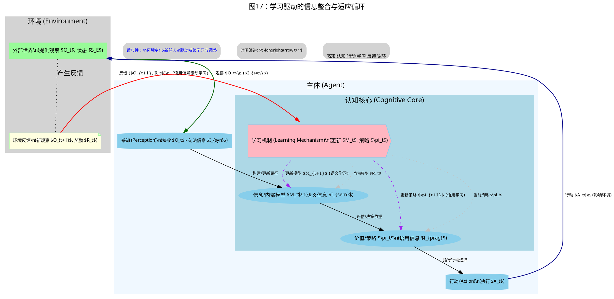

# 信息论的修正与批判性再综合框架

## 目录

- [信息论的修正与批判性再综合框架](#信息论的修正与批判性再综合框架)
  - [目录](#目录)
  - [序言：信息之谜](#序言信息之谜)
  - [第一部分：信息的范式胜利与实用主义抽象](#第一部分信息的范式胜利与实用主义抽象)
    - [1. 起源：通信中不确定性的量化](#1-起源通信中不确定性的量化)
      - [1.1. 工程需求：香农问题](#11-工程需求香农问题)
      - [1.2. "比特"与信息熵 $H(X)$](#12-比特与信息熵-hx)
        - [1.2.1. 香农熵的规范定义与性质](#121-香农熵的规范定义与性质)
        - [1.2.2. 熵的公理化基础（示例性）](#122-熵的公理化基础示例性)
        - [1.2.3. 规范证明：熵的最大化](#123-规范证明熵的最大化)
      - [1.3. 信道容量 $C$：不可逾越的速率极限](#13-信道容量-c不可逾越的速率极限)
        - [1.3.1. 定义与意义](#131-定义与意义)
        - [1.3.2. 有噪信道编码定理证明的简要思路](#132-有噪信道编码定理证明的简要思路)
      - [1.4. 批判视角：语义中立的力量与代价](#14-批判视角语义中立的力量与代价)
    - [2. 算法视角：编码、压缩与内蕴复杂性](#2-算法视角编码压缩与内蕴复杂性)
      - [2.1. 信源编码：压缩的艺术](#21-信源编码压缩的艺术)
        - [2.1.1. 无噪信源编码定理](#211-无噪信源编码定理)
        - [2.1.2. 率失真理论：有损压缩的逻辑](#212-率失真理论有损压缩的逻辑)
      - [2.2. 算法信息论 (AIT)：个体对象中的信息](#22-算法信息论-ait个体对象中的信息)
        - [2.2.1. 柯尔莫哥洛夫复杂度 $K(x)$](#221-柯尔莫哥洛夫复杂度-kx)
        - [2.2.2. $H(X)$ 与 $K(x)$ 的关系](#222-hx-与-kx-的关系)
      - [2.3. 批判视角：理论理想与计算现实](#23-批判视角理论理想与计算现实)
  - [第二部分：信息扩展的宇宙——物理、生命、认知与深层悖论](#第二部分信息扩展的宇宙物理生命认知与深层悖论)
    - [3. 信息作为物理构成：熵、能量与实在](#3-信息作为物理构成熵能量与实在)
      - [3.1. 热力学关联：超越类比？](#31-热力学关联超越类比)
      - [3.2. 批判视角："万物源于比特"——拷问信息本体论](#32-批判视角万物源于比特拷问信息本体论)
    - [4. 生物与认知系统中的信息：处理、学习与理解](#4-生物与认知系统中的信息处理学习与理解)
      - [4.1. 生命与心智的信息论透镜](#41-生命与心智的信息论透镜)
        - [表格：生物与认知科学中的信息概念](#表格生物与认知科学中的信息概念)
      - [4.2. 贝叶斯大脑与预测编码：信息最小化作为认知原则](#42-贝叶斯大脑与预测编码信息最小化作为认知原则)
        - [4.2.1. 自由能原理：规范简述](#421-自由能原理规范简述)
      - [4.3. 批判视角：持续的鸿沟——从信息处理到语义理解与意识](#43-批判视角持续的鸿沟从信息处理到语义理解与意识)
  - [第三部分：语义迷宫与统一信息的求索](#第三部分语义迷宫与统一信息的求索)
    - [5. 戈尔迪之结：信息、意义、知识与语境](#5-戈尔迪之结信息意义知识与语境)
      - [5.1. 定义"信息"：多元视角](#51-定义信息多元视角)
        - [表格：关于信息的对比视角](#表格关于信息的对比视角)
      - [5.2. 认识论鸿沟：信息 vs. 知识](#52-认识论鸿沟信息-vs-知识)
        - [表格：信息 vs. 知识——批判性辨析](#表格信息-vs-知识批判性辨析)
      - [5.3. 本体论之争：信息是发现的还是构造的？](#53-本体论之争信息是发现的还是构造的)
      - [5.4. 批判视角：意义能否被形式化？句法替代物的局限](#54-批判视角意义能否被形式化句法替代物的局限)
    - [6. 直面局限：为何经典信息论力有不逮](#6-直面局限为何经典信息论力有不逮)
      - [6.1. 内在局限性再探（语义盲点、静态偏好等）](#61-内在局限性再探语义盲点静态偏好等)
      - [6.2. 复杂系统中的困境（涌现、因果、多尺度动态）](#62-复杂系统中的困境涌现因果多尺度动态)
      - [6.3. 批判性综合：纯粹量化范式的片面性](#63-批判性综合纯粹量化范式的片面性)
    - [7. 开辟新径：迈向整合性信息理论](#7-开辟新径迈向整合性信息理论)
      - [7.1. 有前景的扩展与替代框架](#71-有前景的扩展与替代框架)
        - [7.1.1. 量子信息论：范式转移](#711-量子信息论范式转移)
        - [7.1.2. 其他关键方向（简述：信息几何、因果信息论、非平衡信息论）](#712-其他关键方向简述信息几何因果信息论非平衡信息论)
      - [7.2. 巨大挑战：整合句法、语义与语用](#72-巨大挑战整合句法语义与语用)
        - [7.2.1. 整合性信息框架的概念蓝图 (详细阐述)](#721-整合性信息框架的概念蓝图-详细阐述)
      - [7.3. 批判视角：我们是在趋同，还是在深化专业化？——信息理论版图的未来走向](#73-批判视角我们是在趋同还是在深化专业化信息理论版图的未来走向)
        - [7.3.1. 趋同的潜力：寻找共同的基石与桥梁](#731-趋同的潜力寻找共同的基石与桥梁)
        - [7.3.2. 深化专业化的现实：领域壁垒与概念分化](#732-深化专业化的现实领域壁垒与概念分化)
        - [7.3.3. 统一的挑战：在普适性与特殊性之间寻求平衡](#733-统一的挑战在普适性与特殊性之间寻求平衡)
        - [7.3.4. 术语稀释的风险：当"信息"无所不包](#734-术语稀释的风险当信息无所不包)
        - [7.3.5. 未来路径的展望：迈向多层次、多视角的整合生态](#735-未来路径的展望迈向多层次多视角的整合生态)
  - [第四部分：信息、人类与不确定的未来](#第四部分信息人类与不确定的未来)
    - [8. 信息论的遗产及其持久的哲学回响](#8-信息论的遗产及其持久的哲学回响)
      - [8.1. 重温里程碑式成就与社会变革](#81-重温里程碑式成就与社会变革)
        - [8.1.1. 理论上的辉煌胜利](#811-理论上的辉煌胜利)
        - [8.1.2. 实际影响与驱动的社会变革：数字革命的引擎](#812-实际影响与驱动的社会变革数字革命的引擎)
      - [8.2. "信息时代"：哲学上的不满与存在性追问（真理、隐私、自主、意义）](#82-信息时代哲学上的不满与存在性追问真理隐私自主意义)
        - [8.2.1. 真理的危机与信任的侵蚀](#821-真理的危机与信任的侵蚀)
        - [8.2.2. 隐私的终结与监控资本主义的崛起](#822-隐私的终结与监控资本主义的崛起)
        - [8.2.3. 自主性的消解与算法"助推"的困境](#823-自主性的消解与算法助推的困境)
        - [8.2.4. 数据饱和世界中的意义危机](#824-数据饱和世界中的意义危机)
        - [8.2.5. 心智、意识与人工智能的本质追问](#825-心智意识与人工智能的本质追问)
      - [8.3. 结论性批判思考：信息论作为现代性的建构者与镜鉴](#83-结论性批判思考信息论作为现代性的建构者与镜鉴)
        - [8.3.1 现代性的回响：效率、量化与控制的迷思](#831-现代性的回响效率量化与控制的迷思)
        - [8.3.2 信息的权力与治理：谁定义，谁受益，谁被边缘化？](#832-信息的权力与治理谁定义谁受益谁被边缘化)
        - [8.3.3 信息论的自我反思与未来进化：走向智慧与责任](#833-信息论的自我反思与未来进化走向智慧与责任)
          - [8.3.3.1 价值对齐的信息科学](#8331-价值对齐的信息科学)
          - [8.3.3.1.1. 信息与价值度量的新维度：从"量"到"质"与"影响"的跨越](#83311-信息与价值度量的新维度从量到质与影响的跨越)
          - [8.3.3.1.2. 价值敏感的设计原则的系统性融入](#83312-价值敏感的设计原则的系统性融入)
          - [8.3.3.1.3. 动态价值的演化、协商与治理机制](#83313-动态价值的演化协商与治理机制)
          - [8.3.3.1.4. "善意信息"与"赋能信息"的理论构建与实践](#83314-善意信息与赋能信息的理论构建与实践)
        - [8.3.4 可解释性与可信赖信息系统](#834-可解释性与可信赖信息系统)
          - [8.3.4.1. 信息流透明化与决策溯源](#8341-信息流透明化与决策溯源)
          - [8.3.4.2. 不确定性的量化、传播与有效沟通](#8342-不确定性的量化传播与有效沟通)
          - [8.3.4.3. 因果可解释性：追求"为什么"而不仅仅是"是什么"](#8343-因果可解释性追求为什么而不仅仅是是什么)
          - [8.3.4.4. 对抗性鲁棒性与安全验证的信息论视角](#8344-对抗性鲁棒性与安全验证的信息论视角)
          - [8.3.4.5. 人机交互中的信任校准与解释传递](#8345-人机交互中的信任校准与解释传递)
        - [8.3.5. 信息生态的健康与韧性](#835-信息生态的健康与韧性)
          - [8.3.5.1. 信息流行病学与有害信息动力学建模](#8351-信息流行病学与有害信息动力学建模)
          - [8.3.5.2. 信息多样性、过滤气泡与回音室效应的度量与缓解](#8352-信息多样性过滤气泡与回音室效应的度量与缓解)
          - [8.3.5.3. 网络结构、信息流韧性与关键基础设施保护](#8353-网络结构信息流韧性与关键基础设施保护)
          - [8.3.5.4. 集体智慧、知识聚合与信息质量提升机制](#8354-集体智慧知识聚合与信息质量提升机制)
    - [9. 终章：在比特的洪流中寻求智慧的灯塔](#9-终章在比特的洪流中寻求智慧的灯塔)
  - [文本思维导图](#文本思维导图)

## 序言：信息之谜

信息，一个关乎秩序与混沌、确定性与惊奇的概念，既是现代科学的基石，也是我们时代的决定性特征。
然而，其确切本质依然难以捉摸，它在不同学科间变换形态，并挑战着我们最深层的哲学假设。
本文旨在对信息论进行一次批判性的再综合，不仅仅将其视为数学工具的集合，更将其视为一场持续演进的智力探索。
我们将探讨其范式上的成功、实用主义的抽象、不断扩展的应用，以及至关重要的，其固有的局限性和对一个能弥合数量与意义、句法与语义、处理与真正理解之间鸿沟的更整合性理解的持续求索。
我们的视角将是批判性参与，力求深化对概念、定义、它们之间相互联系以及信息论持续提出的深刻问题的分析。

## 第一部分：信息的范式胜利与实用主义抽象

### 1. 起源：通信中不确定性的量化

信息论并非源于抽象的哲学思辨，而是产生于一个具体的工程挑战：如何在有噪声存在的情况下可靠且高效地传输消息。
这种实用主义的起源深刻地塑造了其最初的表述及其最卓著的成就。

#### 1.1. 工程需求：香农问题

克劳德·香农在其1948年的开创性论文《通信的数学理论》中，致力于解决贝尔实验室面临的实际问题：
优化信号（语音、电报）在噪声信道中的传输。
他的天才之处在于将消息的具体内容抽象掉，转而关注其统计特性。
核心问题演变为：在给定信道上可靠地传输信息的速率存在何种基本限制？

#### 1.2. "比特"与信息熵 $H(X)$

为回答此问题，香农需要一种度量"信息"的方法。
他将信息等同于不确定性的减少。
一个事件越不确定，当它发生时所获得的信息就越多。
这种信息的基本单位成为"比特"（二进位）。

##### 1.2.1. 香农熵的规范定义与性质

对于一个离散随机变量 $X$，其可能结果为 $x_1, x_2, \ldots, x_n$，概率为 $P(X=x_i) = p_i$ (其中 $\sum p_i = 1$)，香农熵 $H(X)$ 定义为：

$H(X) = -\sum_{i=1}^{n} p_i \log_b p_i$

对数的底 $b$ 决定了熵的单位：$b=2$ 为比特，$b=e$ 为奈特，$b=10$ 为哈特利。约定 $0 \log 0 = 0$。

**香农熵的关键性质：**

1. **非负性**：$H(X) \geq 0$。熵为零当且仅当某个结果是确定的（某个 $p_k=1$，其余 $p_i=0$）。
2. **最大值**：$H(X) \leq \log_b n$。当所有结果等概率出现时（所有 $p_i = 1/n$），熵达到最大值，表示最大的不确定性。
3. **独立变量的可加性**：若 $X$ 和 $Y$ 独立，则 $H(X,Y) = H(X) + H(Y)$。
4. **链式法则**：$H(X_1, \ldots, X_n) = \sum_{i=1}^{n} H(X_i | X_1, \ldots, X_{i-1})$。
5. **条件熵**：$H(Y|X) = H(X,Y) - H(X) = \sum_x p(x) H(Y|X=x)$，表示给定 $X$ 后 $Y$ 的剩余不确定性。$H(Y|X) \leq H(Y)$，当 $X$ 和 $Y$ 独立时等号成立。表示从X中获得的关于Y的信息增益。
6. **互信息**：$I(X;Y) = H(X) - H(X|Y) = H(Y) - H(Y|X) = H(X) + H(Y) - H(X,Y)$。它度量一个随机变量包含的关于另一个随机变量的信息量，或者说，由于知晓一个变量而导致另一个变量不确定性的减少程度。$I(X;Y) \geq 0$。

##### 1.2.2. 熵的公理化基础（示例性）

香农熵的形式并非随意设定。
它可以从一组衡量不确定性应满足的合理公理中唯一地推导出来（相差一个常数因子）。
关键公理（例如香农-钦钦公理或法捷耶夫公理）包括：

1. **连续性**：概率的微小变化应导致熵的微小变化。
2. **对称性**：$H(p_1, \ldots, p_n)$ 在 $p_i$ 的排列下应保持不变。
3. **等概率时取最大值**：$H(1/n, \ldots, 1/n)$ 应是 $n$ 的单调递增函数。
4. **可加性/分组性**：如果一个事件被分解为子事件，总熵应是各个熵的加权和。例如，$H(p_1, p_2, p_3) = H(p_1+p_2, p_3) + (p_1+p_2)H(p_1/(p_1+p_2), p_2/(p_1+p_2))$。

这些公理确保了 $H(X)$ 是一个鲁棒且一致的不确定性度量。

##### 1.2.3. 规范证明：熵的最大化

证明 $H(X) \leq \log_b n$（以 $b=2$ 为例，$H(X) \leq \log_2 n$），且等号当且仅当所有 $p_i = 1/n$ 时成立：
考虑分布 $P=(p_1, \ldots, p_n)$ 与均匀分布 $U=(1/n, \ldots, 1/n)$ 之间的库尔贝克-莱布勒（KL）散度：
$D_{KL}(P\|U) = \sum_{i=1}^{n} p_i \log_2 \frac{p_i}{1/n} = \sum p_i \log_2 p_i - \sum p_i \log_2 (1/n)$
$D_{KL}(P\|U) = -H(X) + \log_2 n \sum p_i = \log_2 n - H(X)$。
由于 $D_{KL}(P\|U) \geq 0$（吉布斯不等式），且当且仅当 $P=U$（即 $p_i = 1/n$）时等号成立，故 $\log_2 n - H(X) \geq 0$，所以 $H(X) \leq \log_2 n$。

或者，使用拉格朗日乘数法：最大化 $L(p_1, \ldots, p_n, \lambda) = -\sum p_i \log_2 p_i - \lambda(\sum p_i - 1)$。
令 $\frac{\partial L}{\partial p_i} = -\log_2 p_i - \frac{1}{\ln 2} - \lambda = 0$。
这意味着 $\log_2 p_i = -(\frac{1}{\ln 2} + \lambda)$，因此所有 $p_i$ 必须相等。由于 $\sum p_i = 1$，所以 $p_i = 1/n$。

#### 1.3. 信道容量 $C$：不可逾越的速率极限

##### 1.3.1. 定义与意义

对于给定的通信信道（由 $p(y|x)$ 表征，即发送 $x$ 时接收到 $y$ 的概率），信道容量 $C$ 是能够可靠传输信息（错误概率任意小）的最大速率。它定义为：

$C = \max_{p(x)} I(X;Y)$

其中最大化操作是在所有可能的输入分布 $p(x)$ 上进行的。
香农的有噪信道编码定理指出，对于任何速率 $R < C$，存在编码使得接收端的错误概率可以任意小。相反，对于 $R > C$，这样的可靠传输是不可能的。

##### 1.3.2. 有噪信道编码定理证明的简要思路

香农的证明是非构造性的，但极富洞察力：

1. **随机编码**：想象随机生成一个包含 $2^{nR}$ 个码字（每个长度为 $n$）的码本。
2. **典型序列（渐近均等分割特性 - AEP）**：对于大的 $n$，信源产生的大多数序列 $x^n$ 都是"典型的"（其经验熵接近 $H(X)$）。类似地，对于信道，联合典型性 $A_\epsilon^{(n)}(X,Y)$ 标识了那些联合概率 $p(x^n, y^n)$ 接近 $2^{-nH(X,Y)}$ 的序列对 $(x^n, y^n)$。
3. **译码策略**：接收到 $y^n$ 后，译码器在码本中寻找一个*唯一*的码字 $x^n(m)$，使得 $(x^n(m), y^n)$ 是联合典型的。如果找到，则译码为 $m$；否则，声明错误。
4. **错误概率分析**：通过对所有可能的随机码本进行平均，香农证明了如果 $R < I(X;Y)$（因此，如果 $p(x)$ 选择最优，则 $R < C$），当 $n \to \infty$ 时，错误概率可以趋于零。这意味着至少存在一个好的码。

该定理为所有通信系统提供了一个基本基准。

#### 1.4. 批判视角：语义中立的力量与代价

香农刻意排除消息的*意义*或*语义内容*是工程学上的一大妙招。它使得理论具有普适性，适用于任何类型的数据。然而，当信息论应用于意义至关重要的领域（如自然语言、认知）时，这种"语义中立性"也是其最深刻的局限。该理论量化了信息的*数量*（符号不确定性的减少），但对其*重要性*、*真实性*或*价值*保持沉默。这一根本性选择创造了一个强大但适用范围有限的工具，其影响贯穿于所有后续拓展信息论范围的尝试中。

### 2. 算法视角：编码、压缩与内蕴复杂性

在信息量化的基础上，编码和压缩理论应运而生，同时也引发了对超越概率系综的、单个对象信息内容的更深层探究。

#### 2.1. 信源编码：压缩的艺术

我们如何有效地表示信息？信源编码理论给出了答案。

##### 2.1.1. 无噪信源编码定理

香农第一定理指出，对于一个离散无记忆信源 $X$，其熵为 $H(X)$，任何唯一可译码（例如前缀码）的平均码长 $\bar{L}$ 必须满足：
$\bar{L} \geq H(X)$
此外，存在编码（如霍夫曼编码或算术编码）可以使平均码长任意接近 $H(X)$（具体而言，对于最优前缀码，$H(X) \leq \bar{L} < H(X) + 1$）。
*证明简述*：该定理依赖于克拉夫特-麦克米兰不等式（对于唯一可译码，$\sum_i b^{-l_i} \leq 1$，其中 $l_i$ 是符号 $i$ 的码字长度，底为 $b$），以及AEP，后者表明长度为 $n$ 的典型序列可以用大约 $nH(X)$ 比特来表示。

这为数据压缩设定了基本限制。

##### 2.1.2. 率失真理论：有损压缩的逻辑

当不需要或无法实现完美保真度时，率失真理论量化了压缩率 $R$ 与允许失真 $D$ 之间的权衡。率失真函数 $R(D)$ 是指在平均失真不超过 $D$ 的条件下，表示信源所需的最小速率。
$R(D) = \min_{p(\hat{x}|x): E[d(X,\hat{X})] \leq D} I(X;\hat{X})$
其中 $d(X,\hat{X})$ 是失真度量。这对于图像、音频和视频压缩至关重要。

#### 2.2. 算法信息论 (AIT)：个体对象中的信息

香农理论处理的是系综和平均特性，而AIT（由柯尔莫哥洛夫、蔡廷、索洛蒙诺夫发展）则关注*单个*字符串或对象的信息内容。

##### 2.2.1. 柯尔莫哥洛夫复杂度 $K(x)$

字符串 $x$ 的柯尔莫哥洛夫复杂度 $K_U(x)$（相对于通用图灵机 $U$）是指在 $U$ 上运行并输出 $x$ 的最短程序 $p$ 的长度。
$K_U(x) = \min_{p: U(p)=x} |p|$
$K(x)$ 被认为是 $x$ 的内蕴、绝对信息内容或随机性的度量。如果一个字符串不能被压缩，即 $K(x) \approx |x|$，则称其为随机的。

##### 2.2.2. $H(X)$ 与 $K(x)$ 的关系

对于由平稳遍历信源 $X$ 生成的序列 $x^n$，香农的信源编码定理意味着期望压缩长度为 $nH(X)$。AIT揭示了一个联系：对于大多数这样的序列，其柯尔莫哥洛夫复杂度 $K(x^n)$ 接近 $nH(X)$。因此，香农熵反映了平均每符号的算法复杂度。

#### 2.3. 批判视角：理论理想与计算现实

AIT对随机性和可压缩性提供了深刻的见解。然而，$K(x)$ 是*不可计算的*——不存在一个通用算法可以找到任何给定字符串的最短程序。这种不可计算性意味着，虽然AIT为压缩和随机性提供了一个理论上的黄金标准，但它并不直接提供实用的算法。类似地，香农的信道编码定理证明了好码的存在性，但并不总是为任意信道提供有效的构造方法，尤其是在有限码长的情况下，达到容量非常困难。这种理论存在性/最优性与实际可构造性/可计算性之间的差距是信息论中一个反复出现的主题，提醒我们数学理想在现实世界中常常会遇到算法和物理的约束。

## 第二部分：信息扩展的宇宙——物理、生命、认知与深层悖论

信息论的规范优雅和量化能力迅速使其应用远超电信领域，渗透到物理学、生物学和认知科学。这些扩展丰富了信息的概念，但也暴露了其模糊性，以及将以通信为中心的理论应用于截然不同领域时所面临的压力。

### 3. 信息作为物理构成：熵、能量与实在

香农熵公式与统计热力学中的熵（玻尔兹曼的 $S = k_B \ln \Omega$）惊人的相似并非偶然。它暗示了信息与物理世界之间存在深刻的联系。

#### 3.1. 热力学关联：超越类比？

1. **麦克斯韦妖**：詹姆斯·克拉克·麦克斯韦在19世纪提出的关于一个"妖精"分拣快慢分子，从而似乎违反热力学第二定律的思想实验，是一个先兆。由西拉德、布里渊、贝内特和兰道尔等人寻求的解决方案，关键在于妖精必须获取信息，而这种信息获取或其最终擦除具有热力学代价。

2. **兰道尔原理：信息擦除的物理代价（规范论证）**：罗尔夫·兰道尔（1961）指出，逻辑上不可逆的操作——即无法从输出唯一确定输入的操作——必然会耗散热量。最著名的例子是擦除一个比特的信息。
    - **简化论证**：考虑一个可以处于状态0或状态1的1比特存储器。擦除它意味着无论其初始状态如何，都将其重置为一个已知状态（例如0）。
        - 擦除前，如果该比特是随机的（0或1的概率相等），系统具有 $k_B \ln 2$ 的熵（与该比特的状态相关）。
        - 擦除后，该比特处于已知状态（0），因此其熵为 $k_B \ln 1 = 0$。
        - 存储系统的熵减少了 $k_B \ln 2$，为了满足热力学第二定律，环境的熵必须至少增加等量。这意味着在温度为 $T$ 的环境中，至少有 $Q = T \Delta S_{env} = k_B T \ln 2$ 的热量耗散到环境中。
    - **意义**：兰道尔原理确立了计算的基本物理极限，并将信息处理与能量消耗直接联系起来。它表明信息是物理的。

#### 3.2. 批判视角："万物源于比特"——拷问信息本体论

约翰·惠勒的名言"万物源于比特"（It from Bit）概括了一种思想，即信息可能比物质和能量更基本——物理世界本身源于信息过程（例如，量子测量中对是/否问题的回答）。
这催生了各种形式的"信息本体论"或"数字物理学"。

- **支持者**：认为量子力学，凭借其观察者依赖的测量结果和纠缠等概念，支持以信息为中心的观点。宇宙可以被视为一台巨大的量子计算机。
- **怀疑者与批判性问题**：
  - **还原论 vs. 涌现**：这种观点是否充分解释了复杂结构、意识或现实的质性方面的涌现？或者它是一种终极的还原论？
  - **"信息"的含义**：如果"万物皆信息"，那么这个术语是否会失去其解释力？岩石中的"信息"与思想中的"信息"有何区别？
  - **因果性**：如果信息是根本的，它的因果力是什么？"比特"如何产生"万物"？
  - **可检验性**：这些宏大的本体论主张是科学上可检验的，还是主要是哲学立场？

虽然在兰道尔原理的层面上，信息与物理的联系是不可否认的，但从信息到"万物源于比特"的飞跃是一个重大的哲学外推。它突显了信息论，即使在其物理诠释中，也将科学探究的边界推向了形而上学。

### 4. 生物与认知系统中的信息：处理、学习与理解

信息论在工程领域的成功，使其被热情地应用于生物学和认知科学，试图理解生命有机体和心智如何处理信息。

#### 4.1. 生命与心智的信息论透镜

关键思想包括：

- **遗传信息**：DNA作为数字编码的消息，信息论用于分析序列复杂性、突变率和基因调控。
- **神经编码**：神经元作为通信信道，神经脉冲序列编码信息。神经熵、刺激与神经反应之间的互信息以及高效编码（巴洛假说）等概念是核心。
- **感知即推理**：大脑通过处理感觉信息来构建世界模型，通常用贝叶斯术语来描述，即信息更新先验信念。
- **学习即信息压缩/提取**：识别数据中的模式和规律可以看作是信息压缩任务（例如，最小描述长度原则）或提取相关特征（信息瓶颈）。

##### 表格：生物与认知科学中的信息概念

| 领域         | 应用的信息论概念                | 应用实例/假说                                        | 代表人物（示例性）        |
|--------------|---------------------------------|------------------------------------------------------|-----------------------|
| 遗传学       | 熵、互信息、$K(x)$              | 基因组复杂性、基因调控网络、进化信息                       | 阿达米、施耐德            |
| 神经科学     | 信道容量、$H(X)$、$I(X;Y)$       | 神经编码效率、突触可塑性、大脑连接性                       | 巴洛、比亚韦克、弗里斯顿     |
| 感知         | 率失真理论、贝叶斯推理            | 感觉输入的高效编码、知觉决策                             | 阿特尼夫、巴洛、克尼尔、普歇   |
| 机器学习     | $D_{KL}$、$I(X;Y)$、交叉熵       | 特征选择、模型正则化（MDL、IB）、决策树                   | 蒂什比、科弗、昆兰        |
| 认知心理学   | 工作记忆容量（比特/组块）         | 短期记忆的局限、注意力作为信息过滤器                       | 米勒、布罗德本特、巴德利    |
| 意识理论     | 整合信息 ($\Phi$)               | 基于系统因果不可还原性量化意识                           | 托诺尼、科赫             |

#### 4.2. 贝叶斯大脑与预测编码：信息最小化作为认知原则

一个强有力的框架表明，大脑主要致力于最小化预测错误或"惊奇"（这与给定内部模型下感觉输入的概率成反比）。卡尔·弗里斯顿的自由能原理（FEP）对此进行了形式化。

##### 4.2.1. 自由能原理：规范简述

（变分）自由能 $\mathcal{F}$ 可以表示为：
$\mathcal{F} = E_q[\log q(\psi|s) - \log p(s, \psi|m)] = D_{KL}[q(\psi|s) \| p(\psi|s,m)] - \log p(s|m)$
其中：

- $s$：感觉输入
- $\psi$：世界上感觉输入的隐藏原因
- $m$：大脑持有的世界生成模型
- $q(\psi|s)$：大脑对隐藏原因的近似后验信念（识别密度）
- $p(s, \psi|m)$：由大脑生成模型定义的联合概率

最小化 $\mathcal{F}$ 涉及：

1. **知觉推理**：更新信念 $q(\psi|s)$ 以更好地匹配真实后验 $p(\psi|s,m)$，从而最小化KL散度（复杂度项）。
2. **主动推理**：改变感觉输入 $s$（通过作用于世界）以使其更符合模型的预测，从而最大化模型证据 $\log p(s|m)$（准确性项，最小化惊奇）。

FEP假定这单一的驱动力驱动着感知、学习和行动。

#### 4.3. 批判视角：持续的鸿沟——从信息处理到语义理解与意识

尽管信息论在模拟认知的特定方面取得了成功，但在解释更高级的认知现象方面仍面临深刻挑战：

- **意义问题**：大脑如何从处理统计模式（句法）过渡到把握意义（语义）？对"祖母"图像做出反应的神经元放电并不意味着该神经元*理解*"祖母"。
- **感受质与主观体验**：任何数量的信息处理，无论多么复杂或整合（例如托诺尼的 $\Phi$），能否解释体验的主观特质——红色的红、疼痛的感觉？这是"意识的难题"。
- **创造性与洞察力**：并非仅仅是过去数据的统计外推的新颖想法是如何产生的？信息论通常处理的是减少关于预先存在的可能性的不确定性，而不是产生全新的可能性。
- **意向性**：信息如何对认知系统而言变得*关于*世界上的某事物？

将信息论应用于认知，常常揭示其作为描述和关联工具的强大之处，但其作为心智生活丰富性的完整解释框架的局限性也变得非常明显。在工程学中基本被回避的句法-语义鸿沟，重新成为核心的哲学障碍。

## 第三部分：语义迷宫与统一信息的求索

信息论从工程师的工具演变为普适科学的候选者，其历程充满了整合意义、语境和知识的挑战——这些元素在其经典表述中被刻意排除。本部分探讨这个"语义迷宫"。

### 5. 戈尔迪之结：信息、意义、知识与语境

"信息"的根本是什么？答案在很大程度上取决于学科视角。

#### 5.1. 定义"信息"：多元视角

"信息"一词的含义众所周知是多样的。

##### 表格：关于信息的对比视角

| 视角  | 核心定义 | 关注点  | 代表人物（示例性）|
|:----|:----|:----|:----|
| **技术/香农** | 不确定性的减少；可区分性 | 数量、传输效率、句法 | 香农、维纳、哈特利 |
| **语义**     | 具有真值的命题；内容                           | 意义、真理、逻辑一致性                       | 巴尔-希勒尔、卡尔纳普、弗洛里迪    |
| **算法**     | 生成/描述数据的最短程序                      | 内蕴复杂性、随机性                           | 柯尔莫哥洛夫、蔡廷、索洛蒙诺夫    |
| **物理**     | 物理系统中的状态差异；负熵                     | 物理体现、热力学代价                         | 兰道尔、布里渊、贝内特          |
| **生物**     | 控制有机体功能/发育的信号                    | 适应、调控、遗传                           | 艾根、阿达米、普利高津          |
| **社会/文化** | 共享意义、规范、文化产物                     | 交流、社交网络、权力                         | 贝特森、卡斯特尔、卢曼          |
| **语用**     | 改变信念或促成行动/决策的数据                | 相关性、效用、对接收者的影响                   | 斯珀伯与威尔逊、皮尔士          |

这种多样性既突显了概念的丰富性，也反映了单一、统一的定义的困难。

#### 5.2. 认识论鸿沟：信息 vs. 知识

尽管在日常话语中经常互换使用，但从认识论的角度来看，"信息"和"知识"是截然不同的。

##### 表格：信息 vs. 知识——批判性辨析

| 特征               | 信息                                         | 知识                                                         |
|--------------------|----------------------------------------------|--------------------------------------------------------------|
| **本质**           | 原始数据、信号、模式、事实                         | 被处理、理解、整合和验证了的信息                                 |
| **客观性/主观性**  | 可被视为更客观、外在的                           | 本质上是主观的、依赖于情境的；与认知主体相关                       |
| **结构**           | 通常是离散的、碎片化的、未组织的                     | 通常是结构化的、连贯的、系统的，是信念网络的一部分                   |
| **意义与理解**     | 可能缺乏内在意义；意义是潜在的                       | 意义是核心；涉及理解和解释                                     |
| **真理与证成**     | 可以是真的、假的或两者皆非（例如噪声）                 | 追求真理；需要证成、证据、推理                                 |
| **获取**           | 被接收、传输、存储                               | 被建构、学习、推断、体验、反思                                 |
| **主体的作用**     | 可以独立于能动主体而存在                           | 其创造和验证需要能动的认知主体                                 |
| **例子**           | 一串0和1；一篇新闻报道                             | 对量子力学的理解；象棋专业知识                                 |

信息是原材料；知识是经过提炼、吸收的产物，它赋予理解和行动的力量。经典信息论主要处理前者。

#### 5.3. 本体论之争：信息是发现的还是构造的？

- **信息实在论**：主张信息是宇宙的一个客观特征，独立于观察者而存在（例如，弗洛里迪的"数据作为相互关联的差异"——一种非均匀性）。物理定律、DNA等被视为客观信息。
- **信息建构论**：认为信息并非独立于认知主体、"在那里"等待被发现，而是认知主体在与环境互动中主动建构出来的。什么算作信息取决于主体的感知和认知器官、目标和先验知识。"造成差异的差异"（贝特森）是依赖于观察者的。
- **批判性综合**：一个合理的中间立场是，世界包含*潜在的*信息（模式、规律、可区分状态），但这种潜力只有通过互动、选择和解释的过程，才能成为对某个主体而言的*实际*信息。物理信号是客观的；其信息学意义通常是共同建构的。

#### 5.4. 批判视角：意义能否被形式化？句法替代物的局限

统一理论的核心挑战是意义的形式化。像巴尔-希勒尔和卡尔纳普的语义信息（基于逻辑概率和状态描述）这样的尝试具有开创性，但适用范围有限，主要局限于形式语言。
许多现代AI方法（例如，词嵌入、大型语言模型）为意义创造了强大的*句法替代物*——这些统计关联通常与人类意义*相关*，但未必等同于真正的理解或现实基础。问题依然存在：意义，凭借其固有的情境性、意向性和主观丰富性，能否被任何形式系统完全捕捉？或者形式化是否永远停留在句法和统计近似的层面？

### 6. 直面局限：为何经典信息论力有不逮

尽管经典信息论（香农-韦弗范式）功能强大，但当其超出原有领域或面对现实世界的复杂性时，也暴露出明显的局限性。

#### 6.1. 内在局限性再探（语义盲点、静态偏好等）

- **语义中立性**：如前所述，无法解释意义、真理或价值是最根本的批判。
- **静态与平衡态偏好**：主要适用于平稳遍历的信源和信道。难以处理动态演化、非平稳系统以及信息本身被生成或转换的非平衡过程。
- **可计算性与可实现性**：理论上的最优（如柯尔莫哥洛夫复杂度、任意信道的香农容量）往往是不可计算或实际上无法达到的。
- **捕捉高阶交互作用的不足**：互信息 $I(X;Y)$擅长处理成对依赖。量化多个变量（$X_1, X_2, \ldots, X_n$ 影响 $Z$）之间存在的协同或冗余信息则要复杂得多，也远未解决（例如，部分信息分解所面临的挑战）。

#### 6.2. 复杂系统中的困境（涌现、因果、多尺度动态）

当应用于复杂系统（生物、生态、社会、认知）时：

- **涌现**：经典信息论难以量化新的、不可还原的特性和信息如何在更高组织层次上从低层交互中涌现出来。
- **因果性**：像转移熵这样的信息度量可以提示有向影响（"格兰杰因果"），但其本身无法建立真正的因果关系，区分直接与间接原因，或解释混杂变量。
- **多尺度动态**：复杂系统通常在多个时间和空间尺度上运作，并存在复杂的多尺度信息流。统一的多尺度信息理论仍处于萌芽阶段。
- **高维性与稀疏性**：从高维稀疏数据（复杂系统中常见）中准确估计信息论量非常困难，且容易产生偏差（"维度灾难"）。

#### 6.3. 批判性综合：纯粹量化范式的片面性

这些局限性突显了一个核心问题：经典信息论本质上是一种关于可区分状态或符号配置*数量*的理论。虽然这对于某些问题非常强大，但对于全面理解那些信息的*质量*、*结构*、*意义*、*功能*或*因果效力*至关重要的现象而言，则显得不足。它提供了一个强大的句法，但缺乏与之相当的强大语义和语用。

### 7. 开辟新径：迈向整合性信息理论

克服这些局限性的努力催生了信息相关研究的众多扩展和全新分支。

#### 7.1. 有前景的扩展与替代框架

##### 7.1.1. 量子信息论：范式转移

- **核心思想**：将经典信息论推广到量子力学系统。
- **关键概念**：量子比特（叠加、纠缠）、冯·诺依曼熵、量子信道容量（霍尔沃界）、量子算法。
- **影响**：为量子计算、量子密码学和量子通信奠定了基础，提供了超越经典极限的能力。它也深化了对信息和测量的物理本质的探究。

##### 7.1.2. 其他关键方向（简述：信息几何、因果信息论、非平衡信息论）

- **信息几何**：将概率分布族视为微分流形上的点，费希尔信息为度量张量。为统计推断和学习提供几何直觉。
- **因果信息论**：旨在发展明确考虑因果结构和干预的信息度量（例如，有向信息、转移熵扩展、与结构因果模型的整合）。
- **非平衡信息热力学**：研究远离热力学平衡态的系统中的信息处理，对理解生物系统和驱动过程至关重要（例如，涨落定理、随机热力学）。
- **算法信息动力学**：探究对象算法复杂度随时间或变换的变化，与计算和自组织相关联。

#### 7.2. 巨大挑战：整合句法、语义与语用

对许多人而言，最终目标是一个能够无缝桥接以下方面的整合理论：

- **句法**：信号/数据的统计和结构特性（香农）。
- **语义**：信息的意义、内容和真值（语言哲学、逻辑学）。
- **语用**：信息在特定情境下对主体的用途、相关性和影响（语言学、决策论、人工智能）。

这需要一种多层次的方法，可能结合概率方法、逻辑形式化、计算语言学、认知架构，甚至博弈论的元素。目前还没有单一框架实现这一宏伟的统一。

##### 7.2.1. 整合性信息框架的概念蓝图 (详细阐述)

- **核心思想**：将信息视为一个在特定主体、特定环境和特定目标驱动下，动态交互的多层面构造。它不仅仅是对"信息是什么"的静态描述，更是对"信息如何为行动者所用并产生价值"的动态过程的理解。
- **关键概念**：多层结构、主体-环境-目标三元组、意义基础、动态过程、混合形式化、组成部分、语用价值。
- **潜在形式化方向**：
  - **1. 作为多层结构的信息 (Information as a Multi-Strata Construct)**
    - **核心关注点**：信息的层次性、表示、存储和可靠传输。
    - **形式化工具**：概率论、香农熵、互信息、算法信息论、形式语言理论、编码理论。
    - **作用与角色**：为信息的表示、存储和可靠传输提供基础。

图14：信息的三个整合层面

```dot
digraph G_Information_Strata {
    rankdir=TB; // Top to Bottom layout
    overlap=false;
    splines=true;
    node [shape=ellipse, style="filled", color="skyblue", fontname="SimHei"];
    edge [fontname="SimHei", fontsize=10];
    graph [fontname="SimHei", label="图14：信息的整合三层面模型 (Concentric/Nested Layers)", labelloc=t, fontsize=15];

    // Subgraph for Syntactic Layer (Core)
    subgraph cluster_syntactic {
        label="句法层 (Syntactic Stratum)";
        bgcolor="lightyellow";
        node [color="orange"];
        Syntactic_Core [label="核心：信号/数据\\n(Signal/Data, Patterns, Coding)"];
        Syntactic_Shannon [label="香农信息论\\n(Entropy, Channel Capacity)"];
        Syntactic_Kolmogorov [label="算法信息论\\n(Kolmogorov Complexity)"];
        Syntactic_Core -> Syntactic_Shannon [style=dotted, label="理论基础"];
        Syntactic_Core -> Syntactic_Kolmogorov [style=dotted, label="个体信息度量"];
    }

    // Subgraph for Semantic Layer (Middle)
    subgraph cluster_semantic {
        label="语义层 (Semantic Stratum)";
        bgcolor="lightgreen";
        node [color="green"];
        Semantic_Core [label="核心：意义/解释\\n(Meaning, Interpretation, Knowledge, Reference)"];
        Semantic_Logic [label="逻辑与真值\\n(Logic, Truth)"];
        Semantic_Representation [label="知识表征\\n(Ontologies, Knowledge Graphs)"];
        Semantic_Core -> Semantic_Logic [style=dotted, label="意义基础"];
        Semantic_Core -> Semantic_Representation [style=dotted, label="结构化"];
    }

    // Subgraph for Pragmatic Layer (Outer)
    subgraph cluster_pragmatic {
        label="语用层 (Pragmatic Stratum)";
        bgcolor="lightpink";
        node [color="red"];
        Pragmatic_Core [label="核心：行动/目标/效用\\n(Action, Goals, Utility, Impact, Context)"];
        Pragmatic_Decision [label="决策论\\n(Decision Theory)"];
        Pragmatic_Value [label="信息价值\\n(Value of Information)"];
        Pragmatic_Communication [label="沟通效果\\n(Communication Effectiveness)"];
        Pragmatic_Core -> Pragmatic_Decision [style=dotted, label="指导行动"];
        Pragmatic_Core -> Pragmatic_Value [style=dotted, label="价值评估"];
        Pragmatic_Core -> Pragmatic_Communication [style=dotted, label="影响效果"];
    }

    // Connections showing the nested/hierarchical nature and flow
    // Syntactic -> Semantic (Meaning賦予)
    Syntactic_Core -> Semantic_Core [label="  赋予意义\\n(Grounding Meaning)  ", dir=forward, color="blue", penwidth=1.5, constraint=true];

    // Semantic -> Pragmatic (Contextualized Use & Value Realization)
    Semantic_Core -> Pragmatic_Core [label="  情境化使用与价值实现\\n(Contextualized Use & Value Realization)  ", dir=forward, color="purple", penwidth=1.5, constraint=true];

    // Feedback loops (Pragmatic needs influencing Semantic focus and Syntactic processing)
    Pragmatic_Core -> Semantic_Core [label="  目标驱动语义关注\\n(Goal-driven Semantic Focus)  ", dir=back, color="darkred", style=dashed, constraint=false, minlen=2];
    Pragmatic_Core -> Semantic_Core [label="  目标驱动语义关注\n(Goal-driven Semantic Focus)  ", dir=back, color="darkred", style=dashed, constraint=false, minlen=2];
    Semantic_Core -> Syntactic_Core [label="  语义需求影响句法处理\n(Semantic Needs affect Syntactic Processing)  ", dir=back, color="darkgreen", style=dashed, constraint=false, minlen=2];

    // Global Context affecting all layers (especially Pragmatic and Semantic)
    Global_Context [label="全局情境\n(Global Context / Situation)", shape=folder, style="filled", color="gray"];
    Global_Context -> Pragmatic_Core [label="影响语用判断", style=dashed, color="black"];
    Global_Context -> Semantic_Core [label="影响意义解释", style=dashed, color="black"];

    // Annotations for clarity
    label_info_flow_up [label="信息构建与增值过程\n(Information Construction & Value Addition)", shape=plaintext, fontcolor="black", fontsize=10];
    label_info_flow_down [label="目标与需求驱动过程\n(Goal & Need-driven Process)", shape=plaintext, fontcolor="black", fontsize=10];

    // Positioning helper (invisible edges or rank constraints if needed for layout finetuning - generally Graphviz handles this well for clustered graphs)
    // Example: Syntactic_Core -> label_info_flow_up [style=invis]; // to position the label
}
```



目标：直观地展示句法、语义、语用三个层面的区分与内在联系，以及它们如何共同构成一个整合的信息概念。

表12：信息三层面比较 (Table 12: Comparison of the Three Strata of Information)

| 层面 (Stratum) | 核心关注点 (Core Focus)                                   | 信息单位/对象 (Unit/Object of Information)                       | 关键问题 (Key Questions)                                                                                                | 主要理论/工具 (Main Theories/Tools)                                                                    | 与现实世界的关联 (Link to Real World)                                                                                                  | 局限性/挑战 (Limitations/Challenges)                                                                                                                               |
| :------------- | :-------------------------------------------------------- | :--------------------------------------------------------------- | :---------------------------------------------------------------------------------------------------------------------- | :--------------------------------------------------------------------------------------------------------------------- | :------------------------------------------------------------------------------------------------------------------------------------- | :----------------------------------------------------------------------------------------------------------------------------------------------------------------- |
| **句法层 (Syntactic Stratum)** | 信息的物理体现、编码、传输和统计特性；可区分性、可复制性。        | 比特 (Bit)、符号 (Symbol)、信号 (Signal)、码字 (Codeword)、消息 (Message)、数据结构 (Data Structure) | - 如何高效、可靠地传输符号？- 如何压缩数据以减少冗余？- 一个符号串的内蕴复杂度是多少？- 什么是信息量的基本度量？                                  | - 香农信息论 (熵, 信道容量)- 算法信息论 (柯尔莫哥洛夫复杂度)- 编码理论 (霍夫曼编码, LZW)- 形式语言与自动机理论 | - 数字通信系统 (互联网, 手机)- 数据存储与压缩 (硬盘, Zip文件)- 计算机硬件与信号处理- DNA/RNA序列的物理结构              | - 忽略信息的意义、真伪和价值。- 主要处理静态和统计平稳的信源/信道。- 理论上的最优（如K复杂度）往往不可计算或难以实用。                                                                    |
| **语义层 (Semantic Stratum)**  | 信息的意义、内容、指称、真值条件和逻辑一致性。                    | 命题 (Proposition)、概念 (Concept)、事实 (Fact)、知识单元 (Knowledge Unit)、语义网络节点 (Semantic Network Node) | - 一个符号或消息指向什么？- 这个陈述是真的吗？- 这段信息与已知知识如何关联？- 如何表示和推理知识？- 如何消解歧义，理解意图？                                  | - 逻辑学 (命题逻辑, 谓词逻辑)- 语义学 (形式语义学, 词汇语义学)- 知识表示 (本体论, 语义网络, 知识图谱)- 自然语言理解 (NLU) | - 数据库中的数据含义- 搜索引擎的查询理解- 专家系统与问答系统- 法律文本或科学文献的解释- 人类语言的理解                 | - 意义的完全形式化极其困难。- 对情境和背景知识的依赖性强。- 真值的确定可能需要复杂的验证过程。- 难以处理模糊性、隐喻和非字面意义。- 符号奠基问题：符号如何获得其内在意义？                         |
| **语用层 (Pragmatic Stratum)** | 信息对接收者的影响、效用、相关性、以及信息在特定情境下的目标导向使用。 | 目标 (Goal)、行动 (Action)、决策 (Decision)、效用 (Utility)、情境 (Context)、意图 (Intention)、信念状态改变 (Belief State Change) | - 这条信息对我的目标有用吗？- 它如何改变我的信念或行动？- 在当前情境下，这条信息是否相关？- 沟通的目的是什么？效果如何？- 信息如何驱动价值创造？                                | - 决策论 (期望效用理论)- 博弈论 (信息不对称, 信号传递)- 语用学 (言语行为理论, 会话含义)- 信息价值理论 (VoI)- 强化学习 (奖励驱动) | - 商业决策中的市场情报- 医疗诊断中的信息使用- 人机交互中的有效沟通- 社交媒体上的影响力操作- 法律判决中的证据采信和影响 | - 语用价值高度主观且依赖情境，难以普适量化。- 意图的识别和建模非常复杂。- 信息的长期影响和非预期后果难以预测。- 价值冲突和伦理考量难以形式化纳入模型。- 如何设计真正赋能个体和社会的"善意信息"系统？ |

- **2. 主体-环境-目标三元组 (The Agent-Environment-Goal Triad)**
  - **核心关注点**：信息处理的驱动核心、信息的价值评估、信息的目标导向性。
  - **形式化工具**：决策论、博弈论、价值对齐理论、信息价值。
  - **作用与角色**：理解信息流和信息价值的核心框架。

图15：主体-环境-目标三元组及其信息流循环图
目标: 清晰地展示主体（Agent）、环境（Environment）和目标（Goal）三个核心要素，以及它们之间通过感知、认知、行动和反馈形成的动态信息流与交互循环。
构思与关键元素:
核心节点 (Core Nodes):
主体 (Agent): 表示为一个具有内部结构（如包含"感知器"、"认知核心/模型"、"行动器"、"记忆/知识库"）的方框或圆形。
内部可以进一步示意性地画出例如"信念 (Beliefs)"、"欲望/目标 (Desires/Goals)"、"意图 (Intentions)" (BDI模型的元素) 或者 "内部模型 (World Model)"。
环境 (Environment): 表示为一个较大的外部区域或云状图形，包围或与主体交互。
内部可以示意性地画出"环境状态 (Environmental States) $S_E$"，"事件 (Events)"，"其他主体 (Other Agents)"。
目标 (Goal / Objectives): 可以表示为一个独立的节点，或者作为主体内部状态的一部分被强调。如果是独立节点，主体会有一个指向目标的"期望"或"驱动"箭头。
核心流程与信息流箭头 (Core Processes & Information Flow Arrows):
感知 (Perception): 从"环境"指向"主体（感知器）"的箭头，标注为"原始数据 (Raw Data) / 观察 (Observations) $O_t$ / 感觉输入 (Sensory Input) $s_t$"。
可以有一个信息论的标注，如 $H(S_E)$ 代表环境的全部不确定性，而 $I(O_t; S_E)$ 代表观察到的信息量。
认知/信息处理 (Cognition / Information Processing): 在"主体"内部，从"感知器"到"认知核心"，再到"行动器"的内部箭头流。
信念更新 (Belief Update): 内部反馈，如 $Beliefs_{t+1} \leftarrow \text{Update}(Beliefs_t, O_t)$。
决策/规划 (Decision Making / Planning): 基于 $Beliefs_t$ 和 $Goals_t$ 产生行动 $A_t$.
行动 (Action): 从"主体（行动器）"指向"环境"的箭头，标注为"行动 (Actions) $A_t$"。
行动会改变环境状态: $S_{E, t+1} \leftarrow \text{Transition}(S_{E,t}, A_t)$.
环境反馈/状态变化 (Environmental Feedback / State Change): 在"环境"内部由于主体的行动或自身动态引起的状态变化，这又会成为下一轮感知的来源。
目标评估/奖励信号 (Goal Evaluation / Reward Signal): 从"环境"（或主体对环境状态的评估）指向"主体（认知核心）"的箭头，标注为"奖励 (Reward) $R_t$ / 效用 (Utility) $U_t$ / 目标达成度 (Goal Achievement Feedback)"。这个反馈用于学习和调整策略。
例如，语用价值 $V_P = f(R_t, Goals_t)$.
目标设定/调整 (Goal Setting/Adjustment): 主体内部可能存在一个调整目标的机制，受环境反馈和内部状态影响。
突出"感知-认知-行动"循环 (Emphasize Perception-Cognition-Action Loop):
用醒目的箭头或高亮路径清晰地标识出这个核心循环。
其他元素:
可以加入"噪声 (Noise) / 不确定性 (Uncertainty)"的符号，影响感知过程和环境动态。
如果空间允许，可以简要标注主体内部的"学习机制 (Learning Mechanism)"。
视觉风格:
清晰、简洁，避免过于拥挤。
使用一致的符号和颜色编码。
信息流向应明确。
图注: 解释该模型是理解信息如何在有目的的系统中产生和利用的基础，并说明各个组件和流程的含义。
您对这个图的构思有何补充或修改建议？例如，是否需要更突出"学习"在循环中的位置？或者是否需要区分不同类型的主体（如生物 vs. AI）？

表13：三元组各组成部分的核心功能与信息学意义

```dot
digraph G_Agent_Environment_Goal_Loop {
    rankdir=TB; // Top to Bottom layout for overall flow, but LR for Agent internals might be good
    overlap=false; // prevent node overlap
    splines=true; // use splines for edges
    nodesep=0.6; // separation between nodes
    ranksep=0.8; // separation between ranks
    fontname="SimHei"; // Universal font for Chinese
    fontsize=12;
    label="图15：主体-环境-目标三元组及其信息流循环图";
    labelloc=t;
    fontsize=15;

    // Define node styles
    node [shape=box, style="filled,rounded", fontname="SimHei", fontsize=10];
    agent_node_style [fillcolor="lightblue"];
    env_node_style [fillcolor="lightgreen"];
    goal_node_style [fillcolor="gold"];
    process_node_style [shape=ellipse, fillcolor="lightgrey", style="filled"];

    // Environment
    subgraph cluster_environment {
        label="环境 (Environment)";
        style="filled";
        color="lightgrey";
        node [style="filled", color="palegreen", fontname="SimHei"];
        Environment [label="外部世界\n(External World)\n包含状态 $S_E$, 事件 $E_v$, 其他主体", shape=cloud, env_node_style, fontsize=11];
        Env_Feedback [label="环境反馈/状态变化\n$S_{E,t+1} \leftarrow \text{Trans}(S_{E,t}, A_t, E_v)$", process_node_style, fontsize=9];
        Environment -> Env_Feedback [style=dotted, arrowhead=none, label="自身动态\n(Dynamics)"];
    }

    // Agent
    subgraph cluster_agent {
        label="主体 (Agent)";
        style="filled";
        color="aliceblue";
        node [style="filled", color="skyblue", fontname="SimHei"];

        Perception [label="感知器\n(Perceptor)", agent_node_style, shape=cylinder];
        Cognition [label="认知核心\n(Cognitive Core)\n(模型 $M_A$, 信念 $Bel_t$, 学习)", agent_node_style, shape=egg, fontsize=11];
        Action [label="行动器\n(Actuator)", agent_node_style, shape=cylinder];

        // Internal Agent Flow (Simplified)
        Perception -> Cognition [label="  观察 $O_t$\n  (句法信息 $I_{syn}$)", fontsize=9, dir=forward];
        Cognition -> Action [label="  决策/行动指令 $A_t$\n  (语用驱动 $I_{prag}$)", fontsize=9, dir=forward];

        // Agent Memory/Knowledge Base (can be part of Cognition)
        KnowledgeBase [label="记忆/知识库\n(Memory/KB)", shape=folder, fillcolor="beige", agent_node_style];
        Cognition -> KnowledgeBase [label="存储/检索", style=dashed, dir=both, fontsize=8];
    }

    // Goal
    Goal [label="目标/意图\n(Goal/Intentions $G_A$)\n(期望效用 $EU$)", goal_node_style, shape=octagon, fontsize=11];

    // Main Loop Arrows
    Environment -> Perception [label="  原始数据 / 感觉输入 $s_t$\n  (环境不确定性 $H(S_E)$)", fontsize=9, penwidth=1.5, color="darkgreen"];
    Action -> Environment [label="  行动 $A_t$\n  (改变环境)", fontsize=9, penwidth=1.5, color="darkblue", minlen=2]; // minlen to suggest length
    
    // Feedback to Agent's Cognition (Reward/Evaluation)
    Env_Feedback -> Cognition [label="  奖励信号 $R_t$ / 效用 $U_t$\n  (语用反馈 $I_{prag-val}$)\n  目标达成度评估", fontsize=9, color="purple", penwidth=1.5];

    // Goal influencing Agent
    Goal -> Cognition [label="  驱动/效用函数\n  (定义信息相关性)", fontsize=9, color="darkorange", style=dashed, penwidth=1.5];
    Cognition -> Goal [label="  目标调整/再评估\n  (学习驱动)", fontsize=9, color="darkorange", style=dashed, dir=back];


    // Highlighting the Perception-Cognition-Action Loop
    // (Could use invisible edges to group them or rely on rankdir and connections)
    // Perception -> Cognition -> Action [style=bold, color=red, penwidth=2, constraint=false]; // This might overcomplicate, direct arrows are clear

    // Annotations
    noise_annot [label="噪声/不确定性\n(影响感知与环境)", shape=plaintext, fontcolor="red", fontsize=8];
    learning_annot [label="学习与适应\n(在认知核心内)", shape=plaintext, fontcolor="blue", fontsize=8];

    // Positioning annotations (example, may need adjustment)
    // Could place 'noise_annot' near Environment -> Perception edge using invisible edges if needed
    // Could place 'learning_annot' near Cognition node

    // Overall cycle visual cue
    cycle_label [label="感知-认知-行动-反馈 循环\n(Perception-Cognition-Action-Feedback Cycle)", shape=plaintext, fontsize=10, fontcolor="black", labelloc=b];
    // Goal -> cycle_label [style=invis]; // trying to position label
    // This overall cycle label might be redundant if the title is clear enough and arrows are strong.
}
```

目标: 详细阐述主体、环境、目标三个组成部分在整合信息框架中的具体功能、它们与信息的产生和流动的关系，以及它们各自带来的信息学上的考量。

| 组成部分 (Component) | 主要功能 (Key Functions)                                                                                                                               | 信息学上的角色与意义 (Informational Role & Significance)                                                                                                                                                              | 与其他组件的交互 (Interaction with Other Components)                                                                                                                               | 信息学挑战/考量 (Informational Challenges/Considerations)                                                                                                                                                              |
| :------------------- | :----------------------------------------------------------------------------------------------------------------------------------------------------- | :------------------------------------------------------------------------------------------------------------------------------------------------------------------------------------------------------------------- | :------------------------------------------------------------------------------------------------------------------------------------------------------------------------------------------------- | :------------------------------------------------------------------------------------------------------------------------------------------------------------------------------------------------------------------- |
| **主体 (Agent)**     | - 感知环境 (Perceive environment)- 内部信息处理 (Internal information processing: 推理 (reasoning), 学习 (learning), 记忆 (memory), 规划 (planning))- 决策制定 (Decision making)- 执行行动 (Execute actions)- (部分主体) 设定或调整目标 (Set or adjust goals) | - 信息的寻求者、解释者、评估者、使用者和（潜在的）创造者。- 通过内部模型 ($M_{agent}$) 压缩和表征环境信息，试图最小化与真实世界之间的KL散度 $D_{KL}(P(E)\|M_{agent})$。- 其认知能力 ($C_{cog}$) 和计算资源决定了信息处理的深度、广度和速度。- 信息的语用价值 ($V_P$) 最终由主体根据其目标和当前信念状态来确定。 | - 从环境获取观察 ($O_t$)，这些观察是关于环境状态 $S_E$ 的部分或带噪信息， $I(O_t; S_E)$ 是获取的信息量。- 对环境施加行动 ($A_t$)，从而改变环境状态或自身在环境中的位置。 - 受目标驱动 ($G_A$)，并根据目标评估信息和行动的期望效用 $EU(A_t\|O_t, G_A)$。- (在多主体系统中) 与其他主体交互，交换信息，进行协调、竞争或合作。 | - 感知局限性 (有限带宽、传感器噪声、视域限制)。- 内部模型的准确性、完备性与更新效率。- 计算资源约束 (时间、能量、存储)。- 信念与现实的偏差（认知偏误、过时信息）。- 如何形式化和度量主观经验、意向性 (intentionality) 和意识 (consciousness)。- 学习过程中的探索-利用困境 (exploration-exploitation dilemma)。 |
| **环境 (Environment)** | - 提供原始感官数据流 (Source of raw sensory data streams)- 容纳主体的行动并反馈结果 (Arena for agent's actions and source of feedback)- (根据自身动态) 独立演化 (Independent evolution based on its own dynamics)- 施加物理或社会约束 (Imposes physical or social constraints)- (可能) 包含其他主体 (May contain other agents) | - 信息的原始来源，包含潜在可区分状态和模式，具有固有熵 $H(S_E)$。- 主体行动的信息后果的载体 (e.g., 行动是否达到预期效果)。- 其复杂性、动态性 (stationarity/non-stationarity)、可预测性和随机性影响主体的信息获取和处理策略。- 情境 (Context) 的主要构成部分，影响信息的相关性和意义。 | - 为主体提供感知输入 ($O_t$)。- 接收并响应主体的行动 ($A_t \rightarrow S'_{E}$)，通常是随机性的状态转移 $P(S'_{E} \| S_E, A_t)$。- 可能隐藏或揭示与主体目标相关的状态、资源或风险。- (在开放环境中) 持续提供新颖性 (novelty) 和不确定性 (uncertainty)，驱动主体的学习和适应。 | - 部分可观察性 (POMDP - Partially Observable Markov Decision Process)，主体无法完全获知环境真实状态。- 非平稳性 (环境规则或动态随时间变化)。- 高维度和复杂性，难以建立精确模型。- 如何有效探索未知环境并从中提取有用信息。- 区分真实信号、噪声和潜在的欺骗性信息 (deception)。- 信用分配问题：将环境的延迟反馈归因于早期行动。 |
| **目标 (Goal / Objectives)** | - 驱动主体的行为选择 (Drive agent's behavior selection)- 提供行动的评价标准 (Provide criteria for evaluating actions)- 引导注意力的分配 (Guide allocation of attention)- (可能) 具有层次结构或动态变化 (May be hierarchical or change dynamically) | - 定义信息的相关性 (Relevance of Information) 和语用价值 ($V_P$) 的核心参照系。- 引导信息搜索、筛选和处理过程，使主体能关注"有意义的差异"。- 将纯粹的"信息量" (比特) 转化为面向任务的"决策价值" (效用)。- 是理解主体意向性 (Intentionality) 和目的驱动行为 (purpose-driven behavior) 的关键。 | - 主体根据当前目标从可能的行动集合中选择一个或一系列行动，以最大化期望效用或目标达成概率。 $A^**t = \text{argmax}*{a \in \mathcal{A}} EU(a \| Bel_t(S_E), G_A)$- 主体根据目标评估从环境中获得的反馈/奖励 ($R_t$ 与 $G_A$ 的符合程度)。- 多个目标可能冲突，需要进行权衡 (trade-offs) 或优先级排序。- 目标可能被主体内部调整或由外部（如更高层级的主体或系统）设定。 | - 如何清晰、可操作地形式化复杂、抽象或长期的目标。- 目标可能随时间变化或在不同情境下变化，需要动态适应。- 目标与伦理价值的对齐 (Value Alignment Problem)，确保目标是"好的"或"可接受的"。- 长期目标与短期激励的平衡 (temporal credit assignment)。- 从观察中推断其他主体的潜在目标 (Goal Recognition / Plan Recognition)。- 目标本身的涌现和设定机制。 |

表注:
$H(S_E)$ 可以理解为环境状态的固有熵或复杂性。
$I(O_t; S_E)$ 是观察 $O_t$ 提供的关于环境状态 $S_E$ 的信息。
$M_{agent}$ 是主体对环境的内部模型。$D_{KL}(P(E)\|M_{agent})$ 是真实环境分布与主体模型的KL散度，衡量模型失配。
$C_{cog}$ 代表主体的认知能力或计算资源。
$POMDP$: Partially Observable Markov Decision Process (部分可观察马尔可夫决策过程)。
$EU(a|O_t, Goal)$ 是在观察 $O_t$ 和目标 $Goal$ 条件下，执行行动 $a$ 的期望效用。

- **3. 意义基础与符号涌现 (Meaning Grounding and Symbol Emergence)**
  - **核心关注点**：符号如何获得意义、信息如何与主体经验产生有意义的联系。
  - **形式化工具**：符号系统、意义理论、情境逻辑、意义基础。
  - **作用与角色**：赋予句法符号以意义，使其能够表征世界、传递关于世界的知识。

图16：多模态意义奠基网络图 (Multimodal Meaning Grounding Network Diagram)


目标: 直观展示一个符号（或概念）如何通过多种不同的感觉、运动、社会和情感通道与主体的经验和外部世界联系起来，从而获得其意义。
构思与关键元素:
中心节点 (Central Node):
表示一个符号 (Symbol) 或 概念 (Concept)，例如 "苹果 (Apple)"。可以用一个方框或圆圈表示，内部写上符号名称。
周边经验节点 (Peripheral Experiential Nodes):
围绕中心符号节点，分布多个代表不同经验模态的节点。每个节点用图标或简洁文字表示：
视觉经验 (Visual Experience):
图标：眼睛 / 一个苹果的简笔画。
内容：颜色（红色/绿色）、形状（圆形）、大小等视觉特征。
连接线标注：$f_{visual}(\text{apple}) \rightarrow \text{Symbol}$
听觉经验 (Auditory Experience):
图标：耳朵 / 声波。
内容："苹果"的发音 / 清脆的咬苹果声。
连接线标注：$f_{sound}(\text{apple}) \rightarrow \text{Symbol}$
触觉/体感经验 (Tactile/Haptic Experience):
图标：手。
内容：光滑的表面、一定的硬度、重量。
连接线标注：$f_{tactile}(\text{apple}) \rightarrow \text{Symbol}$
味觉/嗅觉经验 (Gustatory/Olfactory Experience):
图标：嘴巴 / 鼻子。
内容：甜/酸的味道、果香。
连接线标注：$f_{taste/smell}(\text{apple}) \rightarrow \text{Symbol}$
运动/交互经验 (Motor/Interactive Experience):
图标：运动小人 / 手抓握的动作。
内容：抓取、咬、切苹果的动作模式。
连接线标注：$motor\program(\text{use\_apple}) \rightarrow \text{Symbol}$
语言/社会上下文 (Linguistic/Social Context):
图标：对话气泡 / 书本。
内容：在句子中如何使用"苹果"（例如，"一天一苹果，医生远离我"）、相关的文化故事（如牛顿与苹果）。
连接线标注：$context_{social/linguistic}(\text{apple}) \rightarrow \text{Symbol}$
情感/价值关联 (Affective/Valence Association):
图标：爱心 / 正负号。
内容：喜欢/不喜欢苹果的味道、苹果作为健康食品的积极联想。
连接线标注：$valence(\text{apple}) \rightarrow \text{Symbol}$
功能/目标关联 (Functional/Goal Association):
图标：工具 / 目标旗帜。
内容：苹果可以用来"吃"、"解渴"、"做沙拉"等功能。
连接线标注：$function(\text{apple} \rightarrow \text{Goal:hunger\satiation}) \rightarrow \text{Symbol}$
连接线 (Connections):
从每个周边经验节点指向中心符号节点，表示这些经验为符号的意义提供基础。
连接线的粗细或样式可以（可选地）表示不同模态对该特定符号意义贡献的权重或强度（但这可能难以量化和展示）。
整体结构:
形成一个星型或网络状结构，中心是符号，周围是各种相关的经验输入。
可以有一个外层边界，代表"主体经验场域 (Agent's Experiential Field)"。
图注: 解释该图展示了符号的意义是如何通过与多模态的感觉运动经验、社会文化语境以及情感价值体验的复杂交互网络而"奠基"的。强调意义的分布式和经验性。
您认为这个图的节点和连接方式是否能有效表达多模态奠基的思想？是否有其他重要的经验模态需要加入？
表14：不同意义奠基机制的比较
目标: 对比分析几种主要的意义奠基理论或机制，阐明它们的核心思想、信息学上的关联或挑战，以及在生物认知和人工智能中的体现。
表格结构与内容规划:

| 奠基机制 (Grounding Mechanism) | 核心思想 (Core Idea) | 信息学关联/挑战 (Informational Connection/Challenge) | 生物/认知基础 (Biological/Cognitive Basis) | AI 实现示例 (AI Implementation Examples) |
| :---- | :---- | :---- | :---- | :---- |
| 感觉运动奠基 (Sensorimotor Grounding) | 符号的意义来源于与物理世界的感觉输入和运动输出的直接或间接联系。意义是具身的 (embodied)。 | - 信息转换: 如何将连续的感觉信号 ($s_t$) 映射到离散符号 ($w_i$)，反之亦然？- 表征: 感觉运动经验如何被抽象和泛化为概念表征？- $I(Symbol; Sensorimotor\Pattern)$ 的最大化。 | - 大脑中处理感知和运动的区域与处理语言和概念的区域高度重叠或紧密连接 (镜像神经元系统)。- 儿童通过与环境的物理互动学习语言和概念。 | - 机器人通过感知和与环境交互学习物体名称和动作指令。- 视觉问答 (VQA) 模型结合图像特征和文本。- 概念学习模型基于模拟的感觉运动经验。 |
| 社会/文化/语言奠基 (Social/Cultural/Linguistic Grounding) | 符号的意义通过在社会互动、文化传承和语言社群中的共享使用和约定俗成而建立。意义是分布在社群中的。 | - 信息共享与协商: 意义如何在主体间达成共识？- 语境依赖: 如何形式化和利用社会和语言语境来消解歧义？ ($P(Meaning\|Symbol, Context_{social})$)- 演化: 共享符号系统如何随时间演化？ (如语言演化模型) | - 人类高度依赖社会学习和模仿来获取知识和技能。- 语言作为一种共享的符号系统是社会协作的基础。- 文化规范和符号系统代代相传。 | - 基于大规模语料库的语言模型 (LLMs) 通过学习词语共现模式捕捉语言使用中的意义。- 多主体强化学习 (MARL) 中智能体发展出通信协议。- 社交机器人学习社会规范和交互模式。 |
| 内在价值/目标导向奠基 (Intrinsic Value / Goal-Oriented Grounding) | 符号的意义与其对主体实现内在目标（如生存、获得奖励、避免惩罚）的指示功能或效用相关。 | - 信息价值 (VoI): 符号的价值在于其能否帮助主体做出更好的决策以最大化期望效用 $EU(Action\|Symbol)$。- 信用分配: 如何将最终的目标实现结果（奖励/惩罚）归因于早期的符号或状态？- 关联符号与长期价值。 | - 生物学习的核心驱动力是趋利避害。- 杏仁核等脑区处理与奖惩相关的情感和价值信息，并影响决策。- 需求驱动的感知和学习。 | - 强化学习 (RL) 中，状态或观察（符号的来源）的价值通过其与预期累积奖励的关联来学习 (如 $V(s)$ 或 $Q(s,a)$)。- 具有内在动机 (Intrinsic Motivation) 的AI系统探索新奇或有信息增益的状态。 |
| 情感奠基 (Affective Grounding) | 符号的意义与主体的内部情感状态（如快乐、恐惧、厌恶、悲伤）相关联，赋予符号情感色彩和驱动力。 | - 情感信息的编码与解码: 如何将情感状态映射到符号，或从符号中推断情感？- 情感对认知的影响: 情感如何调节注意、记忆和决策，从而影响符号的加工和意义构建？- 度量符号的情感极性 (Valence) 和唤醒度 (Arousal)。 | - 边缘系统 (Limbic System) 是大脑中处理情感的核心区域。- 情感在记忆巩固、社会交往和快速决策中起关键作用。- 语言中充满情感色彩的词汇。 | - 情感计算 (Affective Computing) 模型从文本、语音或面部表情中识别和生成情感。- 虚拟伴侣或聊天机器人试图理解和回应用户的情感状态。- 在RL中，情感状态可以作为一种内部奖励信号。 |
| 基于结构/组合的奠基 (Structural/Compositional Grounding - 扩展) | 更复杂的符号或概念的意义可以通过已知的基础符号/概念按照一定的句法或逻辑规则组合而成 (类似语言的组合性原理)。 | - 组合性 (Compositionality): 如何从部分（已知符号）的意义和组合规则（句法/逻辑）推导出整体（新符号/表达）的意义？ $Meaning(S_1 \circ S_2) = f(Meaning(S_1), Meaning(S_2), Rule_\circ)$- 递归定义与推理。 | - 人类语言具有无限的生成能力，可以通过有限词汇和规则创造新句子和意义。- 人类认知中存在对结构和关系的抽象能力。 | - 符号AI中的逻辑推理系统和知识表示 (如语义网络、框架系统)。- 深度学习中的神经符号结合 (Neuro-Symbolic AI) 试图融合连接主义的模式识别与符号主义的结构化推理。- 递归神经网络 (RNNs) 处理序列结构。 |

| 奠基机制 (Grounding Mechanism) | 核心思想 (Core Idea) | 信息学关联/挑战 (Informational Connection/Challenge) | 生物/认知基础 (Biological/Cognitive Basis) | AI 实现示例 (AI Implementation Examples) |
| :---- | :---- | :---- | :---- | :---- |
| 感觉运动奠基 (Sensorimotor Grounding) | 符号的意义来源于与物理世界的感觉输入和运动输出的直接或间接联系。意义是具身的 (embodied)。 | - 信息转换: 如何将连续的感觉信号 ($s_t$) 映射到离散符号 ($w_i$)，反之亦然？- 表征: 感觉运动经验如何被抽象和泛化为概念表征？- $I(Symbol; Sensorimotor\Pattern)$ 的最大化。 | - 大脑中处理感知和运动的区域与处理语言和概念的区域高度重叠或紧密连接 (镜像神经元系统)。- 儿童通过与环境的物理互动学习语言和概念。 | - 机器人通过感知和与环境交互学习物体名称和动作指令。- 视觉问答 (VQA) 模型结合图像特征和文本。- 概念学习模型基于模拟的感觉运动经验。 |
| 社会/文化/语言奠基 (Social/Cultural/Linguistic Grounding) | 符号的意义通过在社会互动、文化传承和语言社群中的共享使用和约定俗成而建立。意义是分布在社群中的。 | - 信息共享与协商: 意义如何在主体间达成共识？- 语境依赖: 如何形式化和利用社会和语言语境来消解歧义？ ($P(Meaning\|Symbol, Context_{social})$)- 演化: 共享符号系统如何随时间演化？ (如语言演化模型) | - 人类高度依赖社会学习和模仿来获取知识和技能。- 语言作为一种共享的符号系统是社会协作的基础。- 文化规范和符号系统代代相传。 | - 基于大规模语料库的语言模型 (LLMs) 通过学习词语共现模式捕捉语言使用中的意义。- 多主体强化学习 (MARL) 中智能体发展出通信协议。- 社交机器人学习社会规范和交互模式。 |
| 内在价值/目标导向奠基 (Intrinsic Value / Goal-Oriented Grounding) | 符号的意义与其对主体实现内在目标（如生存、获得奖励、避免惩罚）的指示功能或效用相关。 | - 信息价值 (VoI): 符号的价值在于其能否帮助主体做出更好的决策以最大化期望效用 $EU(Action\|Symbol)$。- 信用分配: 如何将最终的目标实现结果（奖励/惩罚）归因于早期的符号或状态？- 关联符号与长期价值。 | - 生物学习的核心驱动力是趋利避害。- 杏仁核等脑区处理与奖惩相关的情感和价值信息，并影响决策。- 需求驱动的感知和学习。 | - 强化学习 (RL) 中，状态或观察（符号的来源）的价值通过其与预期累积奖励的关联来学习 (如 $V(s)$ 或 $Q(s,a)$)。- 具有内在动机 (Intrinsic Motivation) 的AI系统探索新奇或有信息增益的状态。 |
| 情感奠基 (Affective Grounding) | 符号的意义与主体的内部情感状态（如快乐、恐惧、厌恶、悲伤）相关联，赋予符号情感色彩和驱动力。 | - 情感信息的编码与解码: 如何将情感状态映射到符号，或从符号中推断情感？- 情感对认知的影响: 情感如何调节注意、记忆和决策，从而影响符号的加工和意义构建？- 度量符号的情感极性 (Valence) 和唤醒度 (Arousal)。 | - 边缘系统 (Limbic System) 是大脑中处理情感的核心区域。- 情感在记忆巩固、社会交往和快速决策中起关键作用。- 语言中充满情感色彩的词汇。 | - 情感计算 (Affective Computing) 模型从文本、语音或面部表情中识别和生成情感。- 虚拟伴侣或聊天机器人试图理解和回应用户的情感状态。- 在RL中，情感状态可以作为一种内部奖励信号。 |
| 基于结构/组合的奠基 (Structural/Compositional Grounding - 扩展) | 更复杂的符号或概念的意义可以通过已知的基础符号/概念按照一定的句法或逻辑规则组合而成 (类似语言的组合性原理)。 | - 组合性 (Compositionality): 如何从部分（已知符号）的意义和组合规则（句法/逻辑）推导出整体（新符号/表达）的意义？ $Meaning(S_1 \circ S_2) = f(Meaning(S_1), Meaning(S_2), Rule_\circ)$- 递归定义与推理。 | - 人类语言具有无限的生成能力，可以通过有限词汇和规则创造新句子和意义。- 人类认知中存在对结构和关系的抽象能力。 | - 符号AI中的逻辑推理系统和知识表示 (如语义网络、框架系统)。- 深度学习中的神经符号结合 (Neuro-Symbolic AI) 试图融合连接主义的模式识别与符号主义的结构化推理。- 递归神经网络 (RNNs) 处理序列结构。 |

表注:
这些奠基机制并非互斥，一个符号的丰富意义往往是多种机制共同作用的结果。
"基于结构/组合的奠基"可以看作是一种"二阶"奠基，它依赖于已经通过其他方式奠基的基本符号。
您对这张表格的维度划分和具体内容有什么看法？是否需要调整或增加其他重要的奠基视角？

- **4. 动态、适应与以学习为中心的过程 (Dynamic, Adaptive, and Learning-Centric Processes)**
  - **核心关注点**：信息系统如何在一个不断变化的环境中持续学习、适应和演化。
  - **形式化工具**：学习理论、适应性机制、信息瓶颈、信息流透明化。
  - **作用与角色**：连接信息的三个层面，促进信息处理的灵活性和适应性。

图17：学习驱动的信息整合与适应循环 (Learning-Driven Information Integration and Adaptation Loop)



目标: 展示学习机制如何驱动主体在感知-认知-行动循环中整合句法、语义、语用信息，并根据环境反馈不断调整其内部模型和行为策略，从而实现适应性。
构思与关键元素:
核心循环 (Core Loop - 扩展自图15的感知-认知-行动循环):
环境 (Environment): 提供原始数据/观察 $O_t$。
感知 (Perception): 主体接收 $O_t$ (句法信息)。
$O_t$ 可以标注为 $I_{syntax}$。
认知核心 (Cognitive Core): 这是学习和整合发生的主要场所。
内部状态/模型 (Internal State / World Model $M_t$):
信念状态 (Belief State $Bel_t$): 对环境的当前理解（语义信息 $I_{semantic}$ 的体现）。
价值/策略 (Value/Policy $\pi_t$): 对行动的评估和选择偏好（语用信息 $I_{pragmatic}$ 的体现）。
学习机制 (Learning Mechanism): 一个核心模块，接收环境反馈，并更新内部状态/模型。
决策 (Decision Making): 基于 $Bel_t$ 和 $\pi_t$ 选择行动 $A_t$。
行动 (Action): 主体执行 $A_t$，作用于环境。
环境反馈 (Environmental Feedback): 环境响应行动，产生新的状态 $S'{E}$ 和/或 奖励/观察 (Reward $R_t$ / New Observation $O_{t+1}$)。
学习机制的输入与输出 (Inputs and Outputs of the Learning Mechanism):
输入:
新的观察 $O_{t+1}$ (句法)。
执行的行动 $A_t$。
获得的奖励/反馈 $R_t$ (关键的语用信号)。
当前的内部模型 $M_t$ (包含 $Bel_t$ 和 $\pi_t$)。
输出/更新:
更新后的内部模型 $M_{t+1}$：
$Bel_{t+1} \leftarrow \text{LearnSemantic}(Bel_t, O_{t+1}, A_t)$ (语义学习：更新对世界的理解)。
$\pi_{t+1} \leftarrow \text{LearnPragmatic}(\pi_t, Bel_t, A_t, R_t)$ (语用学习：调整策略以获得更好结果)。
(可选) 更新句法处理模块（例如，特征提取器）的能力。
信息层面在循环中的标注:
句法信息 ($I_{syntax}$): 强调在感知输入 $O_t$ 和原始数据层面。
语义信息 ($I_{semantic}$): 强调在主体的信念状态 $Bel_t$ 和对世界的内部表征/模型 $M_t$ 中。学习过程涉及从 $I_{syntax}$ 中提取和构建 $I_{semantic}$。
语用信息 ($I_{pragmatic}$): 强调在奖励信号 $R_t$、主体的价值函数/策略 $\pi_t$ 以及行动 $A_t$ 的目标导向性。学习过程根据 $I_{pragmatic}$ (反馈) 来调整 $I_{semantic}$ (模型) 和行为策略。
适应性 (Adaptation):
整个循环体现了主体对环境的持续适应。
可以用一个外部箭头指向整个循环，标注为"环境变化 (Environmental Changes) / 新任务 (New Tasks)"，表明系统需要不断学习和调整以应对这些变化。
时间维度:
用 $t, t+1$ 等下标清晰表示时间的演进和学习的迭代过程。
视觉风格:
动态感，强调循环和反馈。
学习机制应处于核心位置，连接各个信息处理阶段。
清晰标注不同层面的信息流。
图注: 解释学习是连接感知、认知和行动，并整合句法、语义、语用信息的关键驱动力，使主体能够适应动态环境并优化其行为以实现目标。
这个图的结构是否能清楚地表达学习在信息整合与适应中的核心作用？是否需要更具体地展示不同类型的学习（例如，模型学习 vs. 策略学习）？
表15：不同学习范式在整合信息框架中的角色

| 学习范式 (Learning Paradigm) | 核心机制与目标 (Core Mechanism & Objective) | 句法层处理 (Syntactic Level Processing) | 语义层构建/利用 (Semantic Level Construction/Utilization) | 语用层关联 (Pragmatic Level Connection) | 在整合框架中的角色与贡献 (Role & Contribution in Integrated Framework) |
| :---- | :---- | :---- | :---- | :---- | :---- |
| 监督学习 (Supervised Learning) | 从带标签的训练数据 $(X, Y)$ 中学习一个映射函数 $f: X \rightarrow Y$，使得 $f(X)$ 能很好地预测 $Y$。目标是最小化预测误差（如 $L(Y, f(X))$）。 | - 输入 $X$ 通常是原始或预处理的句法特征（如像素值、词向量序列）。- 关注特征的统计模式。 | - 学习将句法输入 $X$ 映射到语义标签 $Y$ (如物体类别、情感标签、句子含义分类)。- $Y$ 代表了对输入的一种语义解释或分类。- 可能学习到层次化的语义特征表示（如DNN的隐藏层）。 | - 语用目标通常是实现准确的分类或回归，服务于特定的应用任务（如图像识别用于安防，文本分类用于垃圾邮件过滤）。- 标签 $Y$ 本身可能隐含了设计者预设的语用价值。 | 主要贡献于从句法数据中学习特定、预定义的语义映射。为实现特定语用目标提供基础的模式识别和预测能力。 |
| 无监督学习 (Unsupervised Learning) | 从无标签数据 $X$ 中发现隐藏的结构、模式或表征。目标包括聚类、降维、密度估计、特征学习等。 | - 直接处理原始句法数据 $X$。- 探索数据中的统计规律性、相关性和冗余性。 | - 试图发现数据中潜在的语义结构，如将相似的句法输入聚集成有意义的类别（主题发现、客户分群）。- 学习更简洁、更本质的语义表征（如自编码器学习的压缩表示、PCA的主成分）。 | - 语用目标不直接由外部信号驱动，更多是为了数据理解、知识发现或为后续有监督/强化学习提供更好的特征表示。- 其结果的语用价值取决于如何被其他过程利用。 | 关键在于从海量句法数据中自动发现潜在的语义结构和有用的表征，为意义的涌现和知识的自动构建提供基础。 |
| 强化学习 (Reinforcement Learning) | 主体 (Agent) 通过与环境的交互 (状态 $S$, 行动 $A$, 奖励 $R$) 来学习一个最优策略 $\pi^*(A\|S)$，以最大化累积期望奖励。 | - 状态 $S$ 可以是原始的句法感知输入，或者经过特征提取的表示。- 行动 $A$ 是对环境施加的句法层面的操作。 | - （在基于模型的RL中）主体可能学习一个环境模型 $P(S', R \| S, A)$，这是一种对环境动态的语义理解。- （在深度RL中）可能学习到状态的价值表征 $V(S)$ 或状态-行动对的价值表征 $Q(S,A)$，这可以看作一种情境化的语义评估。 | - 核心驱动是语用信号——奖励 $R$。奖励直接定义了什么是"好"的行为，体现了明确的语用价值。- 策略 $\pi^*$ 本身就是一种在特定情境下如何行动以实现语用目标的知识。 | 将环境的语用反馈（奖励）与主体的感知（句法）和内部表征（语义）联系起来，直接优化面向特定语用目标的行为策略。是实现自主学习和目标驱动行为的核心机制。 |
| 半监督学习 (Semi-Supervised Learning) | 利用少量带标签数据和大量无标签数据进行学习。 | - 同时处理带标签和无标签的句法数据。 | - 利用无标签数据辅助有标签数据学习更鲁棒的语义映射或表征。 | - 语用目标同监督学习，但试图用更少的人工标注实现。 | 在标注成本高昂时，有效地结合无监督学习的结构发现能力和监督学习的语义指导能力。 |
| 自监督学习 (Self-Supervised Learning) | 从数据自身构建监督信号进行学习（如预测文本中被掩盖的词、图像中被旋转的角度）。 | - 从原始句法数据中自动生成"伪标签"或 pretext task。 | - 通过解决自设的预测任务，学习到对数据内容和结构的深层语义理解和通用表征（如BERT、SimCLR）。 | - 语用目标是学习到能够迁移到多种下游任务的通用表征，具有广泛的潜在语用价值。 | 一种强大的无监督/弱监督表征学习方法，能从海量未标注数据中学习到丰富的语义信息，极大地推动了NLP和CV等领域的发展。 |
| 元学习 (Meta-Learning / Learning to Learn) | 学习如何学习，即从多个相关任务的经验中提取共性知识，从而能快速适应新任务。 | - 处理来自不同任务的句法数据和任务描述。 | - 学习任务间的共性语义结构或学习算法的超参数，以便在新任务上快速构建语义模型。 | - 核心语用目标是提升学习效率和泛化能力，尤其是在少样本新任务上的表现。 | 提升信息系统的适应性和泛化能力，使其能够更有效地从少量经验中学习和推断，是迈向更通用智能的关键一步。 |

目标: 分析几种主要的机器学习范式（监督学习、无监督学习、强化学习等）如何在整合信息框架中发挥作用，特别关注它们如何处理和转换不同层面的信息（句法、语义、语用）。
表格结构与内容规划:

| 学习范式 (Learning Paradigm) | 核心机制与目标 (Core Mechanism & Objective) | 句法层处理 (Syntactic Level Processing) | 语义层构建/利用 (Semantic Level Construction/Utilization) | 语用层关联 (Pragmatic Level Connection) | 在整合框架中的角色与贡献 (Role & Contribution in Integrated Framework) |
| :---- | :---- | :---- | :---- | :---- | :---- |
| 监督学习 (Supervised Learning) | 从带标签的训练数据 $(X, Y)$ 中学习一个映射函数 $f: X \rightarrow Y$，使得 $f(X)$ 能很好地预测 $Y$。目标是最小化预测误差（如 $L(Y, f(X))$）。 | - 输入 $X$ 通常是原始或预处理的句法特征（如像素值、词向量序列）。- 关注特征的统计模式。 | - 学习将句法输入 $X$ 映射到语义标签 $Y$ (如物体类别、情感标签、句子含义分类)。- $Y$ 代表了对输入的一种语义解释或分类。- 可能学习到层次化的语义特征表示（如DNN的隐藏层）。 | - 语用目标通常是实现准确的分类或回归，服务于特定的应用任务（如图像识别用于安防，文本分类用于垃圾邮件过滤）。- 标签 $Y$ 本身可能隐含了设计者预设的语用价值。 | 主要贡献于从句法数据中学习特定、预定义的语义映射。为实现特定语用目标提供基础的模式识别和预测能力。 |
| 无监督学习 (Unsupervised Learning) | 从无标签数据 $X$ 中发现隐藏的结构、模式或表征。目标包括聚类、降维、密度估计、特征学习等。 | - 直接处理原始句法数据 $X$。- 探索数据中的统计规律性、相关性和冗余性。 | - 试图发现数据中潜在的语义结构，如将相似的句法输入聚集成有意义的类别（主题发现、客户分群）。- 学习更简洁、更本质的语义表征（如自编码器学习的压缩表示、PCA的主成分）。 | - 语用目标不直接由外部信号驱动，更多是为了数据理解、知识发现或为后续有监督/强化学习提供更好的特征表示。- 其结果的语用价值取决于如何被其他过程利用。 | 关键在于从海量句法数据中自动发现潜在的语义结构和有用的表征，为意义的涌现和知识的自动构建提供基础。 |
| 强化学习 (Reinforcement Learning) | 主体 (Agent) 通过与环境的交互 (状态 $S$, 行动 $A$, 奖励 $R$) 来学习一个最优策略 $\pi^(A\|S)$，以最大化累积期望奖励。 | - 状态 $S$ 可以是原始的句法感知输入，或者经过特征提取的表示。- 行动 $A$ 是对环境施加的句法层面的操作。 | - （在基于模型的RL中）主体可能学习一个环境模型 $P(S', R \| S, A)$，这是一种对环境动态的语义理解。- （在深度RL中）可能学习到状态的价值表征 $V(S)$ 或状态-行动对的价值表征 $Q(S,A)$，这可以看作一种情境化的语义评估。 | - 核心驱动是语用信号——奖励 $R$。奖励直接定义了什么是"好"的行为，体现了明确的语用价值。- 策略 $\pi^$ 本身就是一种在特定情境下如何行动以实现语用目标的知识。 | 将环境的语用反馈（奖励）与主体的感知（句法）和内部表征（语义）联系起来，直接优化面向特定语用目标的行为策略。是实现自主学习和目标驱动行为的核心机制。 |
| 半监督学习 (Semi-Supervised Learning) | 利用少量带标签数据和大量无标签数据进行学习。 | - 同时处理带标签和无标签的句法数据。 | - 利用无标签数据辅助有标签数据学习更鲁棒的语义映射或表征。 | - 语用目标同监督学习，但试图用更少的人工标注实现。 | 在标注成本高昂时，有效地结合无监督学习的结构发现能力和监督学习的语义指导能力。 |
| 自监督学习 (Self-Supervised Learning) | 从数据自身构建监督信号进行学习（如预测文本中被掩盖的词、图像中被旋转的角度）。 | - 从原始句法数据中自动生成"伪标签"或 pretext task。 | - 通过解决自设的预测任务，学习到对数据内容和结构的深层语义理解和通用表征（如BERT、SimCLR）。 | - 语用目标是学习到能够迁移到多种下游任务的通用表征，具有广泛的潜在语用价值。 | 一种强大的无监督/弱监督表征学习方法，能从海量未标注数据中学习到丰富的语义信息，极大地推动了NLP和CV等领域的发展。 |
| 元学习 (Meta-Learning / Learning to Learn) | 学习如何学习，即从多个相关任务的经验中提取共性知识，从而能快速适应新任务。 | - 处理来自不同任务的句法数据和任务描述。 | - 学习任务间的共性语义结构或学习算法的超参数，以便在新任务上快速构建语义模型。 | - 核心语用目标是提升学习效率和泛化能力，尤其是在少样本新任务上的表现。 | 提升信息系统的适应性和泛化能力，使其能够更有效地从少量经验中学习和推断，是迈向更通用智能的关键一步。 |

表注:

不同学习范式之间并非完全割裂，实践中常有融合（如深度强化学习结合了深度学习的表征能力和强化学习的决策优化）。
此表侧重于各范式在信息三层面处理上的典型特征。
这张表格的分类和描述是否准确和清晰？
"在整合框架中的角色与贡献"这一列是否能有效地将学习范式与我们前面讨论的整合目标联系起来？
讨论完这两个图表，我们就可以进入最后一个核心组件的图表规划了。

- **5. 混合形式化与新数学 (Hybrid Formalisms and New Mathematics)**
  - **核心关注点**：如何将多种形式化工具以一种一致和有意义的方式结合起来。
  - **形式化工具**：概率论、逻辑学、信息论、控制理论、网络科学、博弈论、计算语言学。
  - **作用与角色**：为整合信息理论提供"黏合剂"，促进不同层面信息处理的协同工作。

- **组成部分**：
  - **句法层 (形式)**：关注点、形式化工具、作用。
  - **语义层 (意义与指称)**：关注点、形式化工具、作用。
  - **语用层 (使用与效果)**：关注点、形式化工具、作用。

- **主体-环境-目标三元组**：
  - **主体**：内部状态、处理能力、行动 répertoire。
  - **环境**：原始数据来源、情境、约束、行动舞台。
  - **目标**：驱动信息寻求行为，决定相关信息，评估行动成功标准。
  - **感知-认知-行动循环**。

- **意义基础与符号涌现**：
  - **符号奠基问题**。
  - **可能的机制**：感觉运动奠基、社会/文化奠基、内在价值/目标奠基。

- **动态、适应与以学习为中心的过程**：
  - **学习**：提取句法特征，映射到语义表征，关联语用效用。
  - **情境敏感性**：表征和推理情境，调节信息处理。

- **混合形式化与新数学**：
  - **概率方法、逻辑和符号AI方法、控制理论和强化学习、范畴论、网络科学和复杂系统理论**。

- **表格：整合性框架的组成部分** (原始表格内容)
- **规范论证简述：迈向语用价值的量化** (原始公式和解释)

图18：整合信息框架的混合形式化"工具箱"示意图 (Hybrid Formalisms "Toolbox" for Integrated Information Framework)

```dot
digraph G_Hybrid_Formalisms_Toolbox {
    fontname="SimHei";
    fontsize=12;
    label="图18：整合信息框架的混合形式化“工具箱”示意图";
    labelloc=t;
    fontsize=15;
    node [fontname="SimHei", fontsize=10, shape=box, style="filled,rounded"];
    edge [fontname="SimHei", fontsize=9];

    // Central Goal
    Goal [label="整合信息理论\\n(Integrated Information Theory)", shape=ellipse, style="filled", fillcolor="gold", fontsize=13, peripheries=2];

    // Toolbox Metaphor (could be a subgraph or just visual grouping)
    subgraph cluster_toolbox {
        label="形式化工具箱 (Formalism Toolbox)";
        style="filled";
        color="lightgrey";
        bgcolor="lightgrey"; // ensures subgraph background color

        // Core Tools - Tier 1 (Foundational)
        ProbStats [label="概率论与统计\\n(Probability & Statistics)", fillcolor="lightblue", shape=box3d];
        InfoTheoryClassic [label="经典信息论 (香农)\\n(Classical Info. Theory)", fillcolor="lightblue", shape=box3d];
        AlgoInfoTheory [label="算法信息论 (柯氏)\\n(Algorithmic Info. Theory)", fillcolor="lightblue", shape=box3d];
        Logic [label="逻辑学 (多模态)\\n(Logic - Multimodal)", fillcolor="lightblue", shape=box3d];
        ComputationTheory [label="计算理论\\n(Computation Theory)", fillcolor="lightblue", shape=box3d];

        // Applied/Bridging Tools - Tier 2
        DecisionGameTheory [label="决策与博弈论\\n(Decision & Game Theory)", fillcolor="lightgreen", shape=component];
        ControlRL [label="控制论与强化学习\\n(Control Theory & RL)", fillcolor="lightgreen", shape=component];
        NetworkScience [label="网络科学\\n(Network Science)", fillcolor="lightgreen", shape=component];
        NLP [label="计算语言学/NLP\\n(Comp. Linguistics/NLP)", fillcolor="lightgreen", shape=component];
        MachineLearning [label="机器学习 (广义)\\n(Machine Learning - General)", fillcolor="lightgreen", shape=component];


        // Advanced/Emerging Tools - Tier 3
        CategoryTheory [label="范畴论\\n(Category Theory)", fillcolor="lightpink", shape=octagon];
        InfoGeometry [label="信息几何\\n(Information Geometry)", fillcolor="lightpink", shape=octagon];
        NonEquiThermo [label="非平衡态热力学\\n(Non-Equilibrium Thermo.)", fillcolor="lightpink", shape=octagon];
        QuantumInfo [label="量子信息论\\n(Quantum Information Th.)", fillcolor="lightpink", shape=octagon];
        // TDA [label="拓扑数据分析\\n(Topological Data Analysis)", fillcolor="lightpink", shape=octagon];
    }

    // Connections from Goal to Toolbox (conceptual)
    Goal -> ProbStats [style=invis, weight=10]; // To position Goal above Tier 1

    // Tier 1 to Tier 2 dependencies (illustrative, not exhaustive)
    ProbStats -> InfoTheoryClassic;
    ProbStats -> AlgoInfoTheory;
    ProbStats -> MachineLearning;
    ProbStats -> DecisionGameTheory;
    Logic -> NLP;
    ComputationTheory -> AlgoInfoTheory;
    ComputationTheory -> MachineLearning;
    InfoTheoryClassic -> NLP [style=dotted];

    // Tier 2 to Goal (illustrative contributions)
    MachineLearning -> Goal [label="  学习与表征", style=dashed, color="blue"];
    NLP -> Goal [label="  意义与语言理解", style=dashed, color="blue"];
    ControlRL -> Goal [label="  主体与适应", style=dashed, color="blue"];
    DecisionGameTheory -> Goal [label="  价值与决策", style=dashed, color="blue"];
    NetworkScience -> Goal [label="  复杂交互与传播", style=dashed, color="blue"];

    // Tier 1 to Tier 3 (illustrative foundations)
    ProbStats -> InfoGeometry;
    InfoTheoryClassic -> QuantumInfo;
    // Logic -> CategoryTheory [style=dotted];

    // Tier 3 to Goal (illustrative advanced contributions)
    CategoryTheory -> Goal [label="  统一框架与抽象", style=dashed, color="purple", constraint=false];
    InfoGeometry -> Goal [label="  信息空间结构", style=dashed, color="purple", constraint=false];
    NonEquiThermo -> Goal [label="  动态与涌现", style=dashed, color="purple", constraint=false];


    // Grouping layers by color/shape implies tiers, explicit ranking can also be used
    // {rank=same; ProbStats; InfoTheoryClassic; AlgoInfoTheory; Logic; ComputationTheory;}
    // {rank=same; DecisionGameTheory; ControlRL; NetworkScience; NLP; MachineLearning;}
    // {rank=same; CategoryTheory; InfoGeometry; NonEquiThermo; QuantumInfo;}


    // Labels for tool categories/layers (optional, if not clear from subgraph)
    label_foundational [label="基础理论工具", shape=plaintext, fontsize=10];
    label_applied [label="应用与桥接工具", shape=plaintext, fontsize=10];
    label_advanced [label="前沿与整合工具", shape=plaintext, fontsize=10];

    // Positioning labels (example)
    // ProbStats -> label_foundational [style=invis, len=0.1]; // position near the group

    // Overall explanation
    graph_caption [label="\n图注：整合信息理论的构建需要融合来自多个数学和计算领域的工具，\n各种工具在处理信息不同层面或实现整合功能时发挥特定优势。", shape=plaintext, fontsize=9, fontcolor="black", labelloc=b, height=0.1];
}
```



通过上述一系列图表（图14至图18）及相应的表格（表12至表16）的详细阐述，我们系统地展示了整合信息框架的核心构成、运作机理、意义建构过程、学习适应机制以及支持其形式化所需的理论工具箱。
这个由多层面、多视角构成的理论框架及其多样化的形式化工具，共同为我们理解和建模复杂智能系统中的信息整合提供了一个相对完备且具有操作性的基础。
这些工具和概念的协同作用，旨在克服单一理论视角的局限性，为探索信息的本质及其在认知、生命与人工智能系统中的核心作用开辟更广阔的道路。

目标: 以视觉化的方式展示多种不同的形式化工具（数学分支、计算模型等）如何像一个"工具箱"中的工具一样，被用来共同构建一个整合的信息理论，并强调它们各自适用的信息层面或整合功能。
构思与关键元素:
中心主题/目标 (Central Theme/Goal):
在图的中心或顶部，放置一个表示最终目标的方框或图标，例如 "整合信息理论 (Integrated Information Theory)" 或 "理解信息、意义与主体 (Understanding Information, Meaning & Agency)"。
工具箱隐喻 (Toolbox Metaphor):
可以将各种形式化工具表现为从一个打开的"工具箱"中散落出来，或者以模块化的方式相互连接。
形式化工具模块 (Formalism Modules):
每个形式化工具用一个独特的图标或形状表示，并清晰标注其名称。
核心工具:
概率论与统计 (Probability & Statistics): 图标可为骰子、正态分布曲线。
经典信息论 (Classical Information Theory - Shannon): 图标可为 $H(X)$ 公式、信道示意图。
算法信息论 (Algorithmic Information Theory - Kolmogorov): 图标可为 $K(x)$、图灵机。
逻辑学 (Logic - Propositional, Predicate, Modal): 图标可为 $\forall, \exists, \rightarrow$ 等逻辑符号。
计算理论 (Computation Theory - Automata, Complexity): 图标可为有限自动机、P vs NP。
决策论与博弈论 (Decision & Game Theory): 图标可为效用曲线、博弈矩阵。
控制理论与强化学习 (Control Theory & RL): 图标可为反馈回路、Agent-Environment交互图。
网络科学 (Network Science): 图标可为网络图、节点和边。
计算语言学/NLP (Computational Linguistics/NLP): 图标可为文本、词向量空间。
新兴/高阶工具:
范畴论 (Category Theory): 图标可为交换图、箭头。
信息几何 (Information Geometry): 图标可为流形上的距离。
拓扑数据分析 (Topological Data Analysis): 图标可为持久同调图。
非平衡态热力学/随机热力学 (Non-equilibrium Thermodynamics): 图标可为涨落曲线。
量子信息论 (Quantum Information Theory): (如果适用) 图标可为量子比特。
连接与关系 (Connections & Relationships):
用不同类型的线条或箭头连接这些工具模块，表示它们之间的相互作用或依赖关系。
例如，概率论是信息论和许多学习理论的基础。
范畴论可能被描绘成一个更高层次的框架，试图"统一"或"连接"其他几个模块。
可以将这些工具模块大致地组织或颜色编码，以对应它们主要贡献的信息层面：
句法层工具 (例如，经典信息论、编码理论、形式语言)
语义层工具 (例如，逻辑学、语义网络、分布式语义)
语用层工具 (例如，决策论、强化学习、博弈论)
整合/跨层面工具 (例如，概率图模型、范畴论、某些NLP方法)
信息流或构建过程:
（可选）可以尝试用箭头暗示一个从基础工具到更复杂或整合性工具的构建或依赖路径。
图注: 解释该图展示了构建整合信息理论需要借鉴和融合来自多个数学和计算领域的工具。强调单一工具的局限性和多学科协作的重要性。指明不同工具在处理信息不同层面（句法、语义、语用）或实现整合功能（如学习、推理、决策）时的特定优势。
您认为这个"工具箱"的比喻是否恰当？在工具的选择和组织上，有无需要调整的地方？例如，是否应该更突出某些工具的"基础性"地位？
表16：不同形式化工具在整合框架中的潜在贡献

| **形式化工具 (Formalism)** | **核心概念/方法 (Core Concepts/Methods)** | **在整合框架中的潜在贡献 (Potential Contribution in Integrated Framework)** | **处理的信息层面 (Information Level Addressed)** | **优势与局限性 (Strengths & Limitations)** |
|---|---|---|---|---|
| **基础理论工具 (Foundational Tools)** | | | | |
| 1. 概率论与统计  (Probability & Statistics) | 随机变量, 概率分布, 期望, 方差, 条件概率, 贝叶斯定理, 假设检验, 参数估计, 随机过程 | - 量化不确定性与信念度  - 建模信息的动态变化与学习  - 从数据中提取模式和结构  - 信息度量的基础 (如熵) | 句法 (结构), 语义 (部分表征), 语用 (部分决策) | **优势**: 强大的不确定性建模能力, 完善的理论基础。  **局限性**: 可能难以捕捉复杂语义和因果关系, 对数据量和质量有要求。 |
| 2. 经典信息论 (香农)  (Classical Information Theory - Shannon) | 熵, 互信息, 信道容量, 数据压缩, 编码理论 | - 量化信息内容与通信效率  - 分析信息传输的极限与瓶颈  - 为句法信息的度量提供基础 | 句法 (主要), 语义 (间接) | **优势**: 精确的数学化度量, 广泛应用于通信和数据处理。  **局限性**: 主要关注句法层面, 忽略信息的意义和语境。 |
| 3. 算法信息论 (柯氏)  (Algorithmic Information Theory - Kolmogorov) | 柯氏复杂度, 算法概率, 通用图灵机 | - 定义单个对象的绝对信息含量  - 从计算复杂度角度理解信息  - 为无监督学习和模式发现提供理论视角 | 句法 (绝对复杂度), 语义 (部分, 通过最小描述长度) | **优势**: 提供了与计算相关的普适信息度量。  **局限性**: 柯氏复杂度不可计算, 实际应用困难。 |
| 4. 逻辑学 (多模态/动态认知)  (Logic - Multimodal/Dynamic Cognitive) | 命题逻辑, 谓词逻辑, 模态逻辑, 时序逻辑, 模糊逻辑, 非单调逻辑, 描述逻辑 | - 形式化知识表示与推理  - 处理一致性、有效性和完备性  - 建模信念、知识、意图等认知状态  - 整合不同来源和模态的信息 | 语义 (主要), 句法 (结构), 语用 (部分, 如行动逻辑) | **优势**: 严谨的推理框架, 擅长处理结构化知识和复杂关系。  **局限性**: 经典逻辑难以处理不确定性和大规模现实数据, 扩展逻辑复杂。 |
| 5. 计算理论  (Computation Theory) | 图灵机, 可计算性, 计算复杂性 (P/NP), 算法设计与分析 | - 界定可计算问题的边界  - 分析信息处理的效率和资源消耗  - 为智能系统的实现提供理论基础 | 句法 (算法步骤), 语义 (计算结果的意义), 语用 (资源效率) | **优势**: 提供了信息处理的根本性约束和能力分析。  **局限性**: 抽象模型与实际硬件和复杂环境有差距。 |
| **应用与桥接工具 (Applied & Bridging Tools)** | | | | |
| 6. 决策与博弈论  (Decision & Game Theory) | 效用函数, 期望效用, 风险与不确定性决策, 纳什均衡, 囚徒困境, 机制设计 | - 建模理性主体的选择行为  - 分析多主体互动中的策略与均衡  - 为目标驱动的信息评估和行动选择提供框架 | 语用 (主要), 语义 (价值表示) | **优势**: 强大的优化和策略分析工具, 广泛应用于经济学和AI。  **局限性**: 完全理性假设的局限, 复杂环境下效用函数难定义。 |
| 7. 控制论与强化学习  (Control Theory & Reinforcement Learning) | 反馈回路, 状态空间, 可控性, 可观测性, 马尔可夫决策过程 (MDP), Q-learning, 策略梯度 | - 建模动态系统中的信息整合与适应性行为  - 通过与环境交互学习最优策略  - 实现目标导向的感知-认知-行动循环 | 语用 (主要), 语义 (状态-价值), 句法 (策略表示) | **优势**: 强大的学习和自适应能力, 适用于复杂动态环境。  **局限性**: 样本效率问题, 探索与利用的平衡, 奖励设计。 |
| 8. 网络科学  (Network Science) | 图论, 节点与边, 度分布, 中心性, 社群结构, 网络动力学 | - 分析复杂系统中各组成部分间的关系和信息流动  - 揭示信息的传播模式和结构特征  - 建模知识网络、社交网络、语义网络等 | 句法 (网络拓扑), 语义 (节点/边的含义), 语用 (信息流动与影响) | **优势**: 有效刻画复杂系统的结构与动态, 可视化强。  **局限性**: 关注结构性信息, 对节点内部复杂性抽象。 |
| 9. 计算语言学/NLP  (Computational Linguistics/NLP) | 句法分析, 语义表示 (词向量, 知识图谱), 语篇分析, 机器翻译, 问答系统 | - 处理和理解自然语言文本中的信息  - 提取语义、情感和意图  - 实现人机语言交互 | 句法, 语义, 语用 (全覆盖) | **优势**: 直接处理人类主要信息载体, 技术发展迅速。  **局限性**: 深层理解、常识推理、语境依赖仍是挑战。 |
| 10. 机器学习 (广义)  (Machine Learning - General) | 监督/无监督/半监督学习, 特征工程, 模型选择, 泛化能力, 深度学习 | - 从数据中自动学习模式和规律  - 构建预测模型和决策支持系统  - 实现信息的分类、聚类、降维、生成等 | 句法 (数据模式), 语义 (习得表征), 语用 (预测与决策) | **优势**: 数据驱动, 泛化能力强, 应用广泛。  **局限性**: 可解释性差 (黑箱模型), 依赖大量数据, 易受偏见影响。 |
| **前沿与整合工具 (Advanced & Emerging Tools)** | | | | |
| 11. 范畴论  (Category Theory) | 对象, 态射,函子, 自然变换, 极限与余极限, 伴随 | - 提供高度抽象的统一数学语言  - 描述不同数学结构之间的关系与转换  - 用于构建组合式、模块化的信息系统模型 | 元层面 (结构与关系的结构) | **优势**: 极强的抽象和统一能力, 促进不同理论的融合。  **局限性**: 高度抽象, 理解和应用门槛高。 |
| 12. 信息几何  (Information Geometry) | 统计流形, Fisher信息度量, Amari-α散度, 自然梯度 | - 将概率分布族视为微分流形  - 用几何方法分析信息结构和推断过程  - 优化学习算法 (如自然梯度) | 句法 (分布空间结构), 语义 (参数空间几何) | **优势**: 为统计推断和机器学习提供深刻的几何直觉。  **局限性**: 数学复杂性高, 应用范围相对特定。 |
| 13. 非平衡态热力学/复杂系统  (Non-Equilibrium Thermodynamics / Complex Systems) | 耗散结构, 熵产生, 自组织, 临界现象, 自由能原理 | - 从能量和熵的角度理解信息的产生、维持和转化  - 研究开放系统如何通过与环境交换能量和物质来维持低熵状态 (即信息)  - 解释生命和认知过程中的自组织和适应现象 | 语用 (系统动态与适应), 语义 (内在价值/目标) | **优势**: 提供了理解生命和智能体信息处理的物理基础。  **局限性**: 理论仍在发展, 将其精确应用于具体认知模型具有挑战性。 |
| 14. 量子信息与计算  (Quantum Information & Computation) | 量子比特, 叠加, 纠缠, 量子算法, 量子通信 | - 探索基于量子力学原理的信息处理  - 潜在的计算能力和通信安全性突破  - 可能为理解意识和认知中的某些现象提供新视角 (存在争议) | 句法 (量子态表示), 语义 (量子操作含义) | **优势**: 颠覆性的计算潜力, 对经典信息论的扩展。  **局限性**: 技术实现难度大, 对认知现象的解释尚不成熟。 |
| 15. 拓扑数据分析 (TDA)  (Topological Data Analysis) | 单纯复形, 持续同调, Betti数, Mapper算法 | - 分析高维数据集的形状和结构  - 识别数据的拓扑不变量，如连通分支、孔洞等  - 对噪声具有鲁棒性 | 句法 (数据形状与结构) | **优势**: 提供了对数据全局结构的新洞察, 对噪声不敏感。  **局限性**: 计算成本可能较高, 结果的解释可能需要领域知识。 |

目标: 详细列出一些关键的形式化工具，阐明它们的核心优势，以及它们在整合信息框架中针对句法、语义、语用层面或实现整合功能的具体潜在贡献和可能的协同作用。
表格结构与内容规划:

| 形式化工具 (Formalism) | 核心优势与关注点 (Core Strength & Focus) | 在整合信息框架中的主要应用层面/功能 (Primary Application Level/Function in Integrated Framework) | 与其他工具的潜在协同作用 (Potential Synergy with Other Tools) |
| :-------------------------------------- | :------------------------------------------------------------------------------------------------------------ | :-------------------------------------------------------------------------------------------------------------------------------------------------------------------------------------------------------------------------------------------------------------------------------------- | :-------------------------------------------------------------------------------------------------------------------------------------------------------------------------------------------------------------------------------- |
| 概率论与统计 (Probability & Statistics) | 量化不确定性；从数据中学习模式和依赖关系；统计推断。 | - 句法: 信号的统计特性，噪声建模。- 语义: 学习词语/概念的分布式表示，概率语义模型，贝叶斯信念网络。- 语用: 概率决策，风险评估。- 整合: 概率图模型 (PGMs) 结合结构与不确定性。 | - 信息论的基础。- 与机器学习（监督、无监督、RL）紧密结合。- 与逻辑学结合形成概率逻辑或统计关系AI。 |
| 信息论 (经典与算法) (Information Theory - Classical & Algorithmic) | 量化信息、冗余、复杂度、信道容量；数据压缩的理论极限；个体序列的随机性。 | - 句法: 核心领域，度量信息量 ($H, K$)、传输效率 ($C$)。- 语义: (间接) 语义信息的某些量化尝试（如基于逻辑概率）；信息瓶颈原理关联压缩与有意义表征。- 语用: (间接) 决策过程中的信息获取价值 (VoI)。 | - 依赖于概率论。- 为机器学习中的特征选择、模型选择（如MDL）提供原则。- 算法信息论与计算理论紧密相关。 |
| 逻辑学 (各种形式) (Logic - Various Forms) | 精确表示知识；形式化推理规则；保证结论的可靠性（在给定前提下）；处理真值、一致性、蕴含关系。 | - 句法: 形式语言的文法规则。- 语义: 核心领域，定义命题的意义和真值条件，构建本体论和知识库。- 语用: (间接) 规划中的前提条件和行动效果推理；言语行为理论的形式化。 | - 与概率论结合（概率逻辑）。- 与计算理论结合（计算逻辑）。- 为符号AI和知识表示提供基础。- 神经符号AI尝试与深度学习结合。 |
| 计算理论 (Computation Theory) | 定义什么是可计算的；分析算法的效率和复杂度；机器模型 (如图灵机、自动机)。 | - 句法: 形式语言的识别和生成 (自动机理论)。- 语义: (间接) 语义分析算法的复杂度。- 语用: (间接) 决策或规划算法的计算可行性。 | - 算法信息论的基础是通用图灵机。- 与逻辑学在可计算性逻辑和证明复杂性方面交叉。- 为所有算法设计（包括机器学习算法）提供理论边界。 |
| 决策论与博弈论 (Decision & Game Theory) | 在不确定条件下选择最优行动；分析理性主体的策略互动；量化偏好和效用。 | - 句法: (较少直接关联) 信号的策略性选择和解释。- 语义: (间接) 状态和行动的语义与效用评估相关。- 语用: 核心领域，最大化期望效用，纳什均衡，多主体协调与冲突中的信息使用。 | - 依赖于概率论（不确定性下的决策）。- 与强化学习在奖励最大化方面目标一致。- 信息经济学研究信息在博弈中的作用。 |
| 控制理论与强化学习 (Control Theory & RL) | 设计策略使动态系统达到期望状态或行为；从与环境的交互和反馈中学习最优策略。 | - 句法: 感知环境状态，执行控制信号/行动。- 语义: 学习环境模型（基于模型的RL），状态-价值函数作为一种情境化语义评估。- 语用: 核心领域，通过最大化累积奖励来学习目标导向的行为。 | - 决策论的动态版本。- RL常与深度学习结合 (DQN, DDPG) 以处理高维状态/行动空间。- 与信息论在主动探索（信息增益驱动）方面有联系。 |
| 网络科学 (Network Science) | 分析复杂网络的结构、动态和功能；节点间的关系和信息的流动。 | - 句法: 网络拓扑结构，连接模式。- 语义: 节点和边的属性及意义；社区结构可能对应语义集群。- 语用: 信息在网络中的传播、影响和控制；网络对集体行为和目标实现的影响。 | - 常与概率统计结合分析网络特性。- 图论是其数学基础。- 应用于社会学、生物学、流行病学中的信息传播建模。 |
| 计算语言学/NLP (Computational Linguistics/NLP) | 使计算机能够处理、理解和生成人类语言。 | - 句法: 词法分析，句法分析 (解析树)。- 语义: 词义消歧，语义角色标注，文本蕴含，机器翻译，知识提取。- 语用: 对话管理，语用消歧，情感分析，意图识别。 | - 广泛使用机器学习（尤其是深度学习）和概率统计方法。- 依赖语言学理论。- 与知识表示和推理 (KRR) 结合实现更深层次的理解。 |
| 范畴论 (Category Theory - 新兴) | 用对象和态射 (箭头) 的抽象结构来研究数学系统之间的关系和共性；提供一种统一不同数学分支的语言。 | - 句法: (高层抽象) 信息的组合规则和转换过程可以视为态射。- 语义: (高层抽象) 不同语义模型之间的映射（函子）；意义的组合性。- 语用: (高层抽象) 主体-环境系统中的信息流和交互的结构。- 整合: 可能提供统一不同信息层面和形式化工具的元框架 (meta-framework)。 | - 可以形式化类型论、计算模型（如lambda演算）、逻辑系统之间的关系。- 在函数式编程和数据库理论中有应用。- 探索其在认知科学和系统生物学中建模复杂交互的潜力。 |

表注:
此列表并非详尽无遗，许多其他数学和计算工具（如优化理论、信号处理、微分几何等）也在特定方面有所贡献。
"新兴"工具如范畴论在信息理论中的具体应用仍在探索阶段，但其潜力在于提供更高层次的抽象和整合能力。
您认为这张表格对各种形式化工具的贡献描述是否恰当？是否需要调整"核心优势"或"潜在协同作用"的描述？有无其他关键工具需要加入？

#### 7.3. 批判视角：我们是在趋同，还是在深化专业化？——信息理论版图的未来走向

经典信息论的成功及其向众多领域的渗透，引发了一个根本性的元理论问题：这些多样化的探索是在逐步汇聚成一个更宏大、更统一的"信息理论"，还是在不断深化各个子领域的专业化，导致信息概念本身的碎片化？这个问题不仅关乎学术版图的划分，更关乎我们能否对"信息"这一核心概念形成一个既普适又深刻的理解。

##### 7.3.1. 趋同的潜力：寻找共同的基石与桥梁

尽管信息研究领域呈现出多样化的面貌，但其中也蕴含着趋向整合与统一的潜力：

- **共享的数学语言与工具的扩展**：概率论、统计学、随机过程、优化理论等数学工具，不仅是经典信息论的基石，也在量子信息、生物信息、计算神经科学、机器学习等领域扮演核心角色。诸如熵、互信息、KL散度等核心信息度量，虽在不同领域有其特定诠释和扩展（如冯·诺依曼熵、转移熵），但其数学本质和核心思想（如量化不确定性、依赖性、信息传递）具有一定的普适性。新兴的工具如范畴论、信息几何等，更被寄予厚望，期望能为不同信息模型提供统一的描述框架。
- **共同的核心挑战驱动跨学科对话**：对"意义"、"情境"、"价值"、"因果"、"学习"、"涌现"等核心概念的形式化与整合，是横亘在多个信息相关学科面前的共同难题。例如，符号奠基问题不仅是人工智能和认知科学的核心，也与生物符号学、语言哲学息息相关。这些共同挑战促使不同领域的学者进行对话，借鉴彼此的理论和方法。
- **整合性框架的初步尝试**：我们前面讨论的"整合性信息框架的概念蓝图"（7.2.1节）本身就是一种趋同努力的体现，试图将句法、语义、语用层面，以及主体、环境、目标等要素纳入一个统一的思考框架。类似地，如弗里斯顿的自由能原理，试图用单一的信息论原则（预测误差最小化）来统一解释大脑的感知、学习和行动，这也是一种强烈的趋同信号。
- **"大一统"理论的持续吸引力**：从物理学的"万有理论"到生物学的统一进化论，对普适性解释框架的追求是科学发展的内在动力之一。在信息科学领域，也始终存在着对一个能够涵盖从物理比特到生命现象再到意识体验的"大信息论"（Grand Information Theory）的向往和探索。

##### 7.3.2. 深化专业化的现实：领域壁垒与概念分化

与趋同潜力并存的，是信息研究日益深化专业化和概念持续分化的强大趋势：

- **领域特定的问题与模型**：不同学科面对的"信息问题"具有高度的领域特殊性。通信工程师关注的是比特传输的保真度和效率；神经科学家关注的是神经编码的机制和效率；经济学家关注的是市场信号的有效性和信息不对称；社会学家关注的是信息传播的网络结构和舆论动态。这些特定问题催生了高度专业化的模型、术语和研究范式，使得跨领域理解和整合变得困难。
- **"信息"定义的多样性与操作化差异**：正如我们在5.1节讨论的，"信息"一词本身就具有丰富的多义性。在不同领域，研究者往往根据其研究需要，对"信息"进行不同的操作化定义。例如，语义信息论中的"信息"与算法信息论中的"信息"在内涵和外延上都有显著差异。这种操作定义上的分歧，是专业化深化的自然结果，但也可能导致"各说各话"的局面。
- **抽象层次的差异**：不同信息理论所处的抽象层次不同。例如，讨论量子比特的信息特性与讨论社会文化信息的传播，其分析单元、作用尺度、关注焦点截然不同。试图用单一框架涵盖所有抽象层次，可能导致理论过于泛化而失去具体的解释力和预测力。
- **研究社群的壁垒与发表惯例**：学术研究的组织结构（如不同学科的学会、期刊、会议）本身也可能强化专业化壁垒。学者们更倾向于在自己熟悉的领域内进行研究和发表，跨学科的交流和合作虽然受到鼓励，但实际操作中仍面临诸多障碍。

##### 7.3.3. 统一的挑战：在普适性与特殊性之间寻求平衡

真正的挑战在于，如何在追求信息理论的普适性与保持其对特定领域现象的解释力之间找到一个精妙的平衡点。

- **何为"共同原则"？**：我们所寻求的"共同原则"，不应是抹杀领域差异的"最小公分母"，而应是能够揭示不同信息现象背后深层共性的"最大公约数"。例如，信息作为"不确定性的减少"或"可区分状态的表征"可能是一个非常基础的共同点，但在此之上，不同领域如何进一步赋予其结构、意义和功能，则需要具体分析。
- **形式语言的"翻译"与"互操作性"**：与其追求一种单一的、万能的"信息元语言"，一个更现实的目标可能是发展能够在不同专业化信息语言之间进行有效"翻译"和"概念对接"的桥梁性工具或理论。这类似于在计算机科学中，我们不追求单一的编程语言，而是发展各种API、中间件和协议来实现系统的互操作性。范畴论有时被视为这类"翻译工具"的候选者。
- **"家族相似性"而非单一本质**：或许，不同领域所谈论的"信息"并非共享一个单一的本质，而是像维特根斯坦所说的"家族相似性"那样，通过一系列重叠交织的特征联系在一起。如果是这样，那么寻求一个单一的、包罗万象的统一定义可能本身就是一种误导，更重要的是理解这个"信息概念家族"的内部结构和成员间的关系。

##### 7.3.4. 术语稀释的风险：当"信息"无所不包

如果"信息"这一术语被过度泛化，用以指称几乎所有类型的模式、结构、信号或影响，那么它就有可能失去其精确的科学内涵和解释力，沦为一个含义模糊的"万金油"词汇。

- **解释力的丧失**：当一个理论试图解释一切时，它往往最终什么也解释不了。如果"万物皆比特"，那么"比特"这个概念对于解释具体物理现象的独特性何在？如果任何交互都算"信息交换"，那么这个术语对于区分有意义的交流和随机扰动还有何价值？
- **科学严谨性的挑战**：精确的定义和可操作的度量是科学研究的基石。术语的稀释会模糊研究对象，妨碍假设的清晰表述和严格检验，从而损害科学的严谨性。
- **跨学科沟通的障碍**：虽然共同的术语可以促进交流，但如果同一术语在不同语境下含义迥异，反而会造成误解和混淆，阻碍有效的跨学科合作。

##### 7.3.5. 未来路径的展望：迈向多层次、多视角的整合生态

面对趋同与分化的张力，未来信息科学的发展可能不会走向单一的"大一统理论"，而更可能形成一个多层次、多视角、相互关联但又保持各自特色的"信息理论生态系统"。

- **元理论框架的构建**：发展一种能够容纳和组织不同信息理论的元理论框架（meta-theoretical framework）可能是一条有前景的路径。这样的框架可以阐明不同理论的核心假设、适用范围、相互关系以及它们在整个信息知识图谱中的位置。
- **强调"信息生态位" (Informational Niche)**：承认不同类型的信息理论有其特定的"生态位"，即它们最适合解释和处理的特定类型的信息现象和问题。关键在于理解这些生态位之间的边界和接口。
- **问题驱动的跨学科整合**：围绕重大的、复杂的科学或社会问题（如意识的起源、气候变化、全球疫情、人工智能伦理）组织跨学科研究，可以促进不同信息视角的具体整合和应用，并在解决实际问题的过程中催生新的理论洞见。
- **持续的哲学反思与概念澄清**：对"信息"、"意义"、"知识"、"计算"、"智能"等核心概念进行持续的哲学辨析和澄清，对于保持信息科学的理论自觉和避免概念混淆至关重要。这有助于为不同专业化领域之间的对话提供更清晰的概念基础。
- **拥抱复杂性，容忍模糊性**：鉴于信息现象本身的极端复杂性和多样性，我们或许需要接受在相当长的时间内，信息科学将保持一定程度的理论多元化和概念上的"建设性模糊性"。关键在于将这种多元化视为创新的源泉，而非分裂的标志。

总而言之，信息理论的版图更像是一个正在演化中的动态大陆，既有板块间的碰撞与融合，也有新的山脉与峡谷的形成。未来是走向统一的盘古大陆，还是形成更加多样化的群岛结构，尚无定论。但无论如何，对这一核心问题的持续追问和探索，本身就是信息科学保持其思想活力和创新能力的关键所在。

## 第四部分：信息、人类与不确定的未来

信息论不仅仅是一门学术学科；它是一种深刻塑造了我们世界的力量，并持续对我们的本质、社会和未来提出根本性问题。

### 8. 信息论的遗产及其持久的哲学回响

信息论自诞生以来，不仅在数学和工程领域取得了辉煌的成就，更深刻地重塑了我们对世界诸多方面的理解，其影响渗透到科学、技术、社会乃至哲学的各个层面。它的遗产是双重的：一方面是坚实的理论基石和由此产生的革命性技术，另一方面是持续引发我们对信息、知识、智能、现实乃至人类自身存在方式的深刻反思。

#### 8.1. 重温里程碑式成就与社会变革

信息论的诞生标志着人类首次能够以严格的数学方式量化"信息"这一看似无形的概念，并揭示了其处理与传递的基本规律。这一突破性的理论成就，直接或间接地催生了我们今天所熟知的数字时代。

##### 8.1.1. 理论上的辉煌胜利

- **信息的精确量化与基本极限的划定**:
  - **香农的开创性工作**: 克劳德·香农在1948年的《通信的数学理论》中，通过引入**熵 (Entropy)** ($H(X)$) 作为不确定性或信息量的度量，并定义了**比特 (bit)** 作为基本单位，为信息论奠定了数学基础。
  - **无噪信源编码定理 (Shannon's First Theorem)**：确立了数据压缩的理论极限，即任何无损压缩的平均码长不可能小于信源熵。这为后来的压缩算法（如霍夫曼编码、LZ系列算法）指明了方向。
  - **有噪信道编码定理 (Shannon's Second Theorem)**：石破天惊地证明了，只要信息传输速率低于**信道容量 (Channel Capacity, C)**，总能找到一种编码方式使得传输错误率任意小。这为在充满噪声的现实信道中实现可靠通信提供了理论上的保证，是所有现代通信系统的基石。
- **算法信息论的深化**:
  - **柯尔莫哥洛夫复杂度 ($K(x)$)**：由柯尔莫哥洛夫、蔡廷和索洛蒙诺夫独立提出，将信息内容定义为描述该对象（如一个字符串）的最短程序的长度。这提供了一种衡量个体对象内蕴信息量或随机性的方法，补充了香农理论基于概率系综的视角。
- **信息作为普适性科学概念的提出**:
  - 信息论的成功启示我们将信息视为与物质、能量并列的宇宙基本构成要素之一。这种观念极大地激发了跨学科的研究，促使物理学、生物学、计算机科学、经济学、语言学等众多领域开始从信息的视角审视其核心问题。

##### 8.1.2. 实际影响与驱动的社会变革：数字革命的引擎

信息论的理论突破并非停留在纸面，而是迅速转化为推动技术革命的强大动力，其影响遍及我们生活的方方面面：

- **数字通信的基石**:
  - **互联网与移动通信**: 从调制解调技术、纠错码（如Turbo码、LDPC码，它们逼近了香农极限）、到网络协议的设计，无不深刻烙印着信息论的原理。没有信息论对信道容量和编码极限的理解，我们今天赖以生存的互联网、Wi-Fi、4G/5G移动网络、卫星通信等都无法实现其高性能和可靠性。
- **数据压缩与存储的革命**:
  - **多媒体时代**: 图像压缩标准 (JPEG, PNG)、音频压缩 (MP3, AAC)、视频压缩 (MPEG, H.26x系列) 等技术，使得海量的多媒体数据得以高效存储和流畅传输，催生了流媒体、数字摄影、数字音乐等产业。
  - **存储密度提升**: 信息论的原理也指导着硬盘、光盘等存储介质的设计，以在有限的物理空间内存储尽可能多的信息。
- **计算机科学与人工智能的助推器**:
  - **计算理论的早期联系**: 信息论与图灵机等计算模型在早期就存在概念上的关联。
  - **机器学习的核心思想**: 决策树算法中的信息增益（基于熵减）、奥卡姆剃刀原则（倾向于更简洁的模型，与最小描述长度MDL原理相通，后者源于算法信息论）、以及各种概率模型的构建，都借鉴了信息论的概念。
  - **数据表示与处理**: 对数据如何被有效表示、冗余如何被去除、特征如何被提取的理解，是现代数据科学和AI的基础。
- **生命科学的全新视角**:
  - **遗传密码的解读**: DNA序列被视为一种数字编码信息，信息论工具被用于分析基因组的复杂性、基因调控网络、突变率和进化过程中的信息积累。
  - **神经科学的启示**: 大脑被视为一个高效的信息处理系统，神经编码理论运用信息论来研究神经元如何表征外界刺激、传递信号以及学习和记忆的机制。
  - **生物信息学**: 海量基因组和蛋白质组数据的分析、序列比对、模式发现等，都离不开信息论和相关算法的支持。
- **密码学与信息安全的理论支撑**:
  - 虽然香农也对保密通信做出了奠基性贡献（如完善保密性的概念），经典信息论中的熵、随机性、冗余度等概念，为理解和评估密码系统的强度、密钥的质量以及抵御统计分析攻击的能力提供了重要的理论工具。
- **经济学与金融学的洞察**:
  - 信息不对称理论、有效市场假说、信号理论等经济学分支，都探讨了信息在市场行为、价格形成和决策中的关键作用。信息论为量化信息价值和信息传递效率提供了思路。
- **社会科学的分析工具**:
  - 虽然应用方式可能更偏定性或模型化，但信息论的概念（如信息传播、网络结构、舆论熵变）也被用于分析社会网络中的信息流动、谣言传播、群体极化以及媒体影响力等现象。

可以说，信息论不仅为数字时代提供了核心技术组件，更提供了一种强大的思维框架，让我们能够从"信息"的视角去重新审视和理解从原子到宇宙、从个体心智到人类社会的种种复杂现象。它是一场深刻的智力革命，其影响至今仍在不断扩展和深化。

#### 8.2. "信息时代"：哲学上的不满与存在性追问（真理、隐私、自主、意义）

信息技术的指数级发展和无孔不入的渗透，在为人类社会带来巨大便利和福祉的同时，也引发了一系列深刻的哲学困境和存在性追问。我们正处在一个信息爆炸但智慧稀缺、连接泛滥但信任脆弱、计算能力超凡但意义追寻迷茫的时代。经典信息论的语义中立性，在技术层面是其成功的关键，但在社会和哲学层面，却使其难以直接回应这些由信息技术自身催生的价值性难题。

##### 8.2.1. 真理的危机与信任的侵蚀

 (The Crisis of Truth and Erosion of Trust)

- **后真相时代的认识论挑战**: "假新闻"、深度伪造 (Deepfakes)、网络谣言、以及精心策划的虚假信息宣传活动，通过社交媒体和算法放大，以前所未有的规模和速度污染着信息生态系统，模糊了事实与虚构的界限。这导致了公众对传统信息权威（如主流媒体、科学机构）的信任度下降，加剧了社会共识的撕裂，形成了所谓的"认识论危机"或"后真相 (Post-truth)"困境。
- **算法驱动的现实扭曲**: 推荐算法、搜索引擎优化和个性化内容推送，虽然旨在提升用户体验，但也可能将用户封闭在"过滤气泡 (Filter Bubbles)"和"回音室 (Echo Chambers)"中。在这种环境下，用户主要接触到与其既有信念一致的信息，不同观点难以进入视野，导致观点极化、认知固化，甚至对现实产生扭曲的感知。
- **信息论的潜在回应**: 虽然经典信息论不直接处理信息的真伪，但其工具和概念可能有助于理解和应对这些挑战。例如：
  - 分析虚假信息传播的网络动力学特征（如利用网络科学和信息流行病学模型）。
  - 研究不同信息来源的熵、冗余度或复杂度特征，以辅助识别低质量或操纵性内容（尽管这本身极具挑战性）。
  - 发展能够评估信息来源多样性和平衡性的度量，以对抗过滤气泡。

##### 8.2.2. 隐私的终结与监控资本主义的崛起

 (The End of Privacy and the Rise of Surveillance Capitalism)

- **数据即新石油，隐私即代价**: 在数字经济中，个人数据已成为一种核心生产资料。大型科技公司通过提供"免费"服务，大规模收集用户的行为数据、偏好数据、社交关系数据乃至生物特征数据，并将其用于精准广告、用户画像、算法训练和新产品开发。这种"数据最大化"的逻辑，使得个人隐私空间不断被侵蚀。
- **监控资本主义的常态化**: Shoshana Zuboff 提出的"监控资本主义 (Surveillance Capitalism)"概念，深刻揭示了这种以预测和修正人类行为为目标的新型市场形态。在这种范式下，个体不仅是消费者，更是被持续监控、分析和预测的数据源，其行为本身成为被交易的商品。这引发了对个体自主性、自由意志以及权力不对称的深切忧虑。
- **信息论与隐私保护**: 信息论为理解和量化隐私泄露风险提供了工具。例如：
  - 互信息 $I(X_{private}; Y_{released})$ 可以用来度量发布的统计数据 $Y_{released}$ 中包含了多少关于个体敏感信息 $X_{private}$ 的信息。
  - 差分隐私 (Differential Privacy) 等技术，试图在发布有用统计信息的同时，为个体数据提供可数学证明的隐私保护，其核心思想是控制单个个体数据的加入或移除对输出结果概率分布的影响。

##### 8.2.3. 自主性的消解与算法"助推"的困境

 (The Dissolution of Autonomy and the Dilemma of Algorithmic "Nudging")

- **算法的隐形影响力**: 从购物推荐、新闻排序到社交匹配，算法在潜移默化地塑造我们的选择、偏好乃至世界观。行为经济学中的"助推 (Nudge)"理论，即通过巧妙设计选择架构来引导人们做出特定决策，在数字时代被算法大规模应用。这种"算法助推"的有效性，也引发了对其是否操纵用户、侵犯个体自主决策能力的担忧。
- **自由意志的哲学拷问**: 如果我们的决策在很大程度上受到我们并未完全意识到的算法逻辑的影响，那么我们还能在多大程度上声称自己拥有真正的自由意志？这种影响是增强了我们的选择能力（通过提供相关信息），还是限制了我们的视野（通过过滤可能性）？这是一个复杂的哲学辩论。
- **信息食谱与认知自主**: 个体接触到的"信息食谱 (Information Diet)"对其认知框架和决策倾向有深远影响。信息论或可用于分析这种信息食谱的构成、多样性及其对个体认知模型的影响，从而评估其对认知自主性的潜在威胁。

##### 8.2.4. 数据饱和世界中的意义危机

 (The Crisis of Meaning in a Data-Saturated World)

- **信息过载与意义的迷失**: 我们生活在一个信息唾手可得、甚至泛滥成灾的时代。然而，信息的无限供给并不必然带来意义的相应增长。相反，"信息过载 (Information Overload)"可能导致注意力碎片化、深度思考能力下降，以及在海量可能性面前的无所适从和意义感的稀释。
- **从数据到智慧的鸿沟**: 经典信息论主要关注信息的句法层面（数量、编码、传输），但信息的价值最终体现在其能否被主体理解、内化并用于指导有意义的行动，即从数据 (Data) 到信息 (Information)，再到知识 (Knowledge)，最终升华为智慧 (Wisdom) (DIKW金字塔)。当前的技术往往更擅长处理前两者，但在后两者的转化上仍显不足。
- **情境、目的与人为解释的核心作用**: 数据的意义并非内在于数据自身，而是在特定的情境 (Context) 中，由具有特定目的 (Purpose) 的主体 (Agent) 通过解释 (Interpretation) 而赋予的。在一个充斥着去情境化、碎片化数据的世界里，如何重建深度理解和共享意义，成为一个严峻挑战。这呼应了我们之前对信息整合框架中语义层和语用层重要性的讨论。

##### 8.2.5. 心智、意识与人工智能的本质追问

 (Existential Questions on Mind, Consciousness, and AI)

- **AI的"智能"与人类智能的异同**: 随着大型语言模型等AI系统在信息处理、模式识别、文本生成乃至某些推理任务上展现出惊人的能力，关于"机器是否能够思考？"、"AI是否拥有理解力？"等经典哲学问题再次成为焦点。AI系统生成的流畅文本或解决复杂问题的方案，究竟是真正理解的体现，还是仅仅是基于海量数据训练出的复杂统计模式匹配？
- **意识的难题与信息处理的局限**: 即使AI能够完美模拟人类的所有信息处理功能，这是否等同于它拥有了主观体验或意识 (Qualia)？"意识的难题 (The Hard Problem of Consciousness)"——即如何解释物理过程如何产生主观感受——依然是当前科学和哲学面临的最大挑战之一。单纯的信息处理模型，无论多么复杂，似乎都难以直接跨越这一鸿沟。
- **人机共生时代的伦理边界**: 随着AI日益深度地融入社会生活，关于高级AI的伦理地位、权利与责任、以及人机关系的未来走向等问题变得日益迫切。我们需要在哲学层面深入探讨，如何确保AI的发展服务于人类的整体福祉，并防范其潜在的失控风险或非预期社会后果。

这些哲学上的不满与存在性追问，共同指向了一个核心议题：在信息技术飞速发展的今天，我们如何重新定位人类自身，如何在技术塑造的世界中保持和光大那些定义我们之所以为人的核心价值——理性、自主、情感、道德和对意义的永恒追寻。这已远远超出了经典信息论最初的工程范畴，要求我们进行更广泛、更深刻的跨学科对话与人文反思。

#### 8.3. 结论性批判思考：信息论作为现代性的建构者与镜鉴

信息论不仅是塑造我们当前"信息社会"的技术蓝图，它本身也像一面镜子，映照出现代性思维的一些核心特征与张力。香农理论的优雅与力量，源于其对复杂现实的成功抽象和简化——将"意义"剥离，聚焦于可量化的"不确定性减少"。这种方法论上的胜利，与现代科学通过模型简化来理解和操控世界的普遍策略如出一辙。然而，当这种简化后的"信息"概念被泛化并回馈到对人类生活本身的理解时，其局限性便显露无遗。

##### 8.3.1 现代性的回响：效率、量化与控制的迷思

信息论的成功强化了一种信念：凡是可量化的，便是可管理的、可优化的。这与现代社会对效率、增长和技术控制的追求高度契合。从优化通信带宽到优化算法推荐，再到试图用信息整合度量化意识，我们看到一种将复杂现象还原为信息处理问题的倾向。这种"信息还原论"的视角，虽然在特定领域成果斐然，但也可能遮蔽了那些难以量化但至关重要的人类价值，如情感的深度、伦理的考量、审美的体验和存在的意义。

##### 8.3.2 信息的权力与治理：谁定义，谁受益，谁被边缘化？

在信息时代，信息的收集、处理、分发和解读能力构成了新的权力形式。

- **算法治理的兴起**：算法，作为一种自动化信息处理和决策机制，正日益深入地介入社会生活的方方面面，从信用评分到司法辅助，从新闻推送到城市管理。这些算法的设计本身嵌入了特定的价值取向和信息权重，但其运作往往不透明，难以问责。谁来设计这些算法？它们服务于谁的利益？它们如何影响公平与正义？
- **数字鸿沟的深化**：信息获取和利用能力的不平等，不仅体现在基础设施层面（如网络覆盖），更体现在数据素养、算法理解以及在数字经济中参与和受益的能力上。这可能导致新的社会分层和边缘化。
- **知识的商品化与公共领域的萎缩**：当信息被高度商品化，当公共讨论被碎片化的社交媒体和"回音室效应"所主导，高质量、经过审慎确证的知识的生产和传播面临挑战，公共理性对话的空间可能受到侵蚀。

##### 8.3.3 信息论的自我反思与未来进化：走向智慧与责任

面对这些挑战，信息论自身也需要不断进化，超越其早期工程学的边界，发展出更具人文关怀和社会责任感的维度。这意味着不仅要在技术应用的末端进行伦理修补，更要从信息科学的理论根基、设计范式、乃至治理框架层面进行深刻变革。以下三大方向是此进化过程中的关键着力点：

###### 8.3.3.1 价值对齐的信息科学

 (Value-Aligned Information Science, VAIS)

**核心论点**：当前主流信息科学与技术的发展，往往以优化狭义的技术指标（如准确率、效率、吞吐量）为主要驱动力，而对更广泛的人类价值（如公平、自主、隐私、福祉、可持续性）的考量则常被置于次要地位或完全忽视。这种价值中立甚至价值盲视的取向，是导致诸多信息技术伦理困境与负面社会影响（如算法偏见、监控泛化、信息茧房、数字鸿沟加剧）的深层原因之一。因此，构建"价值对齐的信息科学" (VAIS) 成为一项紧迫的理论与实践任务。VAIS的根本目标是将人类核心价值内嵌于信息系统的整个生命周期——从概念形成、理论构建、模型设计、算法实现、到部署应用与迭代治理。这要求在以下几个层面进行范式革新：

###### 8.3.3.1.1. 信息与价值度量的新维度：从"量"到"质"与"影响"的跨越

- **论证思路**：若要实现价值对齐，首先必须能够度量信息及信息系统在价值层面的表现。经典信息论（如香农熵 $H(X)$，互信息 $I(X;Y)$）主要关注信息传递的效率和不确定性的减少，其核心是句法层面的"量"的度量，本质上是价值中立的。VAIS需要发展新的理论框架与数学工具，以度量信息的"质"（如真实性、相关性、偏见性）及其对个体和社会产生的"价值影响"（如对公平、隐私、福祉的增益或损害）。

- **概念深化与形式化探索**：
  - **价值集合的定义**: 设 $\mathcal{V} = \{v_1, v_2, \ldots, v_k\}$ 为在特定情境下需要考量的一组核心人类价值。例如，$v_1$=公平性，$v_2$=隐私保护，$v_3$=自主性，$v_4$=知识赋能。
  - **价值影响度量函数**: 对于一个信息系统 $S$（或一条信息 $m$），我们需要定义一系列价值影响度量函数 $M_{v_i}(S): S \rightarrow \mathbb{R}$，该函数量化系统 $S$ 在价值 $v_i$ 上的表现或影响。
    - 例如，**公平性度量 $M_{fair}(S)$**：可以定义为系统 $S$ 对不同受保护群体（例如，按性别、种族划分的群体 $G_a, G_b$）在输出结果（如贷款批准率 $O_{approve}$）上的差异。一种可能的具体形式是差异性影响比率 (Disparate Impact Ratio): $M_{fair}(S) = \frac{P(O_{approve}|G_a)}{P(O_{approve}|G_b)}$。更复杂的度量可能涉及条件统计均等、机会均等、或基于因果模型的公平性度量。
    - **隐私泄露风险 $M_{privacy}(S)$**：可以基于差分隐私 ($\epsilon$-differential privacy) 的概念，量化系统 $S$ 处理个人数据时，个体信息被泄露的风险上限。或者，利用信息论中的互信息 $I(X_{private}; Y_{output})$ 来度量输出 $Y_{output}$ 中包含的关于敏感输入 $X_{private}$ 的信息量。
    - **信息偏见度 $M_{bias}(S, A_{ref})$**: 对于一条信息或一个模型产生的表征，其偏见度可以相对于一个"无偏"的参照系 $A_{ref}$ 来定义。例如，词嵌入向量空间中的性别偏见，可以测量男性化词语与女性化词语相对于职业词语的投影差异。
  - **综合价值评估函数 $U_V(S, W, C_t)$**: 在特定情境 $C_t$ 下，系统的整体价值表现可能是一个多目标优化问题，需要一个综合评估函数 $U_V$ 来平衡不同价值维度。这可能是一个加权函数 $U_V = \sum_{i=1}^k w_i(C_t) M_{v_i}(S)$，其中权重 $w_i(C_t)$ 反映了在情境 $C_t$ 中各个价值的相对重要性。

- ***图表建议 (供后续制作)***：
  - ***图1：信息度量演进图***。此图可以展示从经典信息论的句法度量（比特、熵）到语义信息度量（逻辑概率、真实性），再到VAIS所追求的语用和价值影响度量（公平性、隐私性、赋能度等）的扩展路径，形成一个多层次的同心圆或树状结构。
  - ***表1：价值维度与潜在信息度量指标对照表***。(内容规划：包含价值维度定义、核心挑战、潜在信息论度量/方法、应用示例、与信息论核心概念的关联等列)。

###### 8.3.3.1.2. 价值敏感的设计原则的系统性融入

 (Value-Sensitive Design, VSD)

- **论证思路**：仅仅度量价值影响是不够的；价值考量必须前置并贯穿于信息系统设计的整个生命周期，形成主动的、系统性的价值整合。这需要从被动的"伦理审查"转向主动的"价值驱动设计"。VSD领域已有的研究（Friedman, Batya, et al.）提供了方法论基础，VAIS可以将其与信息论的严谨性相结合。

- **概念深化与形式化探索**：
  - **设计空间的价值约束表达**: 传统系统设计通常在技术性能空间 $\mathcal{P}_{tech}$ 中寻求最优解 $D^*$，即 $D^* = \arg\max_{D \in \mathcal{D}} U_{tech}(D)$。价值敏感设计则要求在设计空间 $\mathcal{D}$ 中，同时满足一组价值约束 $\mathcal{C}_V = \{C_{v_1}, C_{v_2}, \ldots, C_{v_k}\}$，其中 $C_{v_i}$ 代表对价值 $v_i$ 的最低要求（例如，$M_{fair}(S) \geq \theta_{fair}$）。优化目标变为：$D^* = \arg\max_{D \in \mathcal{D}} U_{tech}(D)$  subject to $M_{v_i}(D) \geq \theta_{v_i} \quad \forall v_i \in \mathcal{V}_{critical}$。
  - **价值嵌入机制 (Value Embedding Mechanisms)**：探索将价值考量直接嵌入算法和模型结构的方法。例如：
    - 在机器学习中，可以在损失函数中加入正则项来惩罚不公平性或隐私泄露。$L_{total}(D, \theta) = L_{performance}(D, \theta) + \sum_{i} \lambda_i L_{value\_v_i}(D, \theta)$。
    - 设计具有可解释性的模型架构（如决策树、线性模型、或具有注意力机制的神经网络），使得模型决策逻辑更容易被理解和审查。
    - 采用联邦学习、安全多方计算等隐私保护技术，在数据处理层面嵌入隐私价值。

- ***图表建议 (供后续制作)***：
  - ***图2：价值敏感设计流程图***。展示一个迭代的设计流程，包括价值识别、价值操作化（映射到设计需求）、技术实现、价值影响评估、反馈修正等环节，强调利益相关者的持续参与。
  - ***表2：传统设计 vs. 价值敏感设计范式对比***。(内容规划：包含方面、传统设计范式、价值敏感设计范式等列)。

###### 8.3.3.1.3. 动态价值的演化、协商与治理机制

- **论证思路**：人类价值并非一成不变，而是随着社会文化、技术发展和个体认知而动态演化。同时，不同群体、不同文化背景下对价值的理解和优先级排序可能存在差异甚至冲突。因此，VAIS不能将价值视为静态的、普适的绝对律令，而必须发展出能够适应价值演化、支持多元价值表达、促进价值冲突协商的理论框架和治理机制。

- **概念深化与形式化探索**：
  - **价值的上下文依赖性与时变性**: $w_i(C_t, t)$，权重不仅依赖于情境 $C_t$，也随时间 $t$ 变化。
  - **多利益相关者价值聚合模型**: 当系统影响多个利益相关者群体 $Stakeholder_j$，每个群体有其自身的价值偏好 $U_{V_j}(S)$ 时，如何设计一个公平有效的聚合函数 $F(U_{V_1}(S), U_{V_2}(S), \ldots)$ 来指导系统设计和决策？这可以借鉴计算社会选择理论（如投票机制、判断聚合）和协商博弈论。
  - **价值漂移 (Value Drift) 的监测与适应**: 如何监测已部署系统因外部环境变化或内部学习机制导致的"价值漂移"现象（即系统行为逐渐偏离最初设定的价值目标）？需要建立持续的价值审计和反馈调整机制。
  - **信息信托 (Information Fiduciary) 与算法监护 (Algorithmic Stewardship)**：探索新的治理模式，例如，设立独立的"信息信托"机构或"算法监护人"角色，代表公众利益对关键信息系统的价值对齐情况进行监督和干预。

- ***图表建议 (供后续制作)***：
  - ***图3：动态价值对齐的反馈循环模型***。此图可以描绘一个包含"系统部署与运行 -> 社会影响与价值反馈收集 -> 多方价值协商与共识形成 -> 价值目标与约束更新 -> 系统适应性调整"的持续改进循环。

###### 8.3.3.1.4. "善意信息"与"赋能信息"的理论构建与实践

- **论证思路**：VAIS不仅要致力于最小化信息技术的负面影响（"不作恶"），更应积极探索如何利用信息技术促进个体福祉、社会进步和集体智慧的涌现（"主动为善"）。这需要我们从信息的消极风险控制转向积极的价值创造，发展关于"善意信息" (Benevolent Information) 和"赋能信息" (Empowering Information) 的理论。

- **概念深化与形式化探索**：
  - **赋能信息的定义**: 借鉴阿马蒂亚·森的"可行能力アプローチ (Capability Approach)"，赋能信息 $I_{emp}$ 可以被定义为那些能够扩展个体实质性自由（即可行能力集合 $Cap(A)$）或提升其实现有价值目标 $G_A$ 的可能性的信息。
  - **赋能效应的量化**: $E_A(I_{emp}) = \text{Increase in } |Cap(A)| \text{ or } P(\text{Achieve } G_A | I_{emp})$。这是一个高度概念化的表达，具体化需要结合特定领域（如教育、健康、公民参与）。
  - **设计赋能型信息系统**: 例如，设计能够提供个性化学习路径、促进批判性思维发展、增强弱势群体发声能力、支持公民科学项目的信息系统。
  - **信息生态中的"价值催化剂"**: 识别和培育那些能够催化正向社会价值涌现的信息节点、模式或干预措施。

- ***图表建议 (供后续制作)***：
  - ***图4：信息价值创造的光谱图***。从左到右依次为：有害信息（造成损害）-> 风险信息（潜在危害）-> 中性信息 -> 有益信息（提供便利）-> 赋能信息（提升能力/促进福祉）。每个类别下可以列举具体例子。

##### 8.3.4 可解释性与可信赖信息系统

(Explainable and Trustworthy Information Systems, XTS)

**核心论点**：现代信息系统，尤其是以深度学习为核心的人工智能（AI）系统，其日益增长的复杂性和内部运作的不透明性（"黑箱效应"）对人类的理解、有效监督和基本信任构成了严峻挑战。这种不透明性不仅阻碍了问责制的落实、错误诊断与修复，还可能导致用户因困惑而放弃使用、不当使用或过度/过低信任。因此，发展可解释、可信赖的信息系统 (XTS) 对于确保这些强大技术能够被负责任地、有效地和合乎伦理地应用至关重要。信息论凭借其分析信息传递、量化不确定性与依赖关系的独特能力，可为此目标的实现提供基础性的理论工具和关键洞见。

###### 8.3.4.1. 信息流透明化与决策溯源

(Information Flow Transparency and Decision Provenance)

- **论证思路**：建立信任的首要步骤是理解系统如何从输入数据得出其结论或采取其行动。这要求系统的内部信息处理路径变得透明，决策的形成过程能够被追溯。信息论方法能够量化输入特征、中间表征以及模型参数对最终输出的贡献度和影响力，从而揭示关键的决策逻辑。

- **概念深化与形式化探索**：
  - **解释性的层次与类型**：全局解释 (Global Interpretability)；局部解释 (Local Interpretability)；模型特定 (Model-Specific) vs. 模型无关 (Model-Agnostic)。
  - **信息瓶颈原理 (Information Bottleneck, IB) 的视角**：由Naftali Tishby等人提出的IB原理， $ \max I(Z;Y) - \beta I(X;Z) $，旨在寻找一个压缩表示 $Z$（例如神经网络的隐藏层），它在尽可能保留关于目标变量 $Y$ 的信息的同时，尽可能压缩关于输入 $X$ 的信息。这提供了一个理解深度学习模型如何逐层抽象和提炼信息的理论框架，有助于识别信息流中的关键"瓶颈"层，这些层可能对模型的决策至关重要。
  - **量化特征影响力与信息传递**：互信息 $I(X_i; Y)$；条件互信息 $I(X_i; Y | X_{S \setminus i})$；转移熵 (Transfer Entropy) $T_{X \rightarrow Y}$ 与有向信息 (Directed Information) $I(X^n \rightarrow Y^n)$；注意力机制 (Attention Mechanisms) 权重 $\alpha_{ij} = \frac{\exp(e_{ij})}{\sum_k \exp(e_{ik})}$。
  - **表征相似性分析 (Representational Similarity Analysis, RSA)**：通过比较不同模型层之间或模型与人类认知数据（如fMRI）之间表征的相似性，可以揭示信息是如何被转换和编码的。

- ***图表建议 (供后续制作)***：
  - ***图5：深度神经网络中的信息流与解释性探针***。(内容规划：包含DNN结构、信息论标注、各层解释性探针图标及图注)。
  - ***表3：解释性技术分类及其信息论关联***。(内容规划：包含技术类别、代表方法、解释层面、模型依赖性、与信息论的潜在关联、适用场景举例等列)。

###### 8.3.4.2. 不确定性的量化、传播与有效沟通

 (Uncertainty Quantification, Propagation, and Effective Communication)

- **论证思路**：一个可信赖的系统必须对其自身的局限性有"自觉"，并能诚实地传达其预测或决策的不确定性。用户需要知道系统在什么时候是自信的，什么时候是犹豫的。信息论天然地与不确定性的量化紧密相关（熵就是不确定性的核心度量）。
- **概念深化与形式化探索**：
  - **不确定性的类型**：偶然不确定性 (Aleatoric Uncertainty)；认知不确定性 (Epistemic Uncertainty)。
  - **量化方法**：贝叶斯方法 (后验预测熵 $H(Y^*|x^*, D_{train})$)；集成方法 (Ensemble Methods)；分位数回归 (Quantile Regression)。
  - **不确定性传播**：分析输入不确定性 $H(X)$ 和模型参数不确定性 $H(\Theta)$ 如何传播到输出不确定性 $H(Y)$。
  - **沟通不确定性**：以用户易于理解的方式呈现（校准概率、预测区间、自然语言解释）。
- ***图表建议 (供后续制作)***：
  - ***图6：不确定性来源与传播示意图***。(内容规划：包含数据源、AI模型、系统输出三部分，以及各自的不确定性标注和信息流箭头)。
  - ***表4：不确定性类型、量化方法与沟通策略***。(内容规划：包含不确定性类型、主要来源、常用量化技术、面向用户的沟通方式示例等列)。

###### 8.3.4.3. 因果可解释性：追求"为什么"而不仅仅是"是什么"

 (Causal Explainability: Seeking "Why" Beyond "What")

- **论证思路**：许多情况下，用户需要的不仅仅是统计相关性的描述，而是对决策背后因果机制的理解。将信息论与因果推断理论相结合是关键。
- **概念深化与形式化探索**：
  - **Judea Pearl的因果层级**：关联 ($P(y|x)$)；干预 ($P(y|do(x))$)；反事实 ($P(y_x|x', y')$)。
  - **结构因果模型 (Structural Causal Models, SCMs)**：$V_i = f_i(PA_i, U_i)$，表示为有向无环图 (DAG)。
  - **信息流与因果路径**：信息沿着有向边流动，可用信息论度量量化路径强度或效应大小。
  - **干预信息**：比较 $H(Y)$ 与 $H(Y|do(X=x))$ 的差异。
  - **反事实推理与信息**：视为对可能世界的信息查询。
- ***图表建议 (供后续制作)***：
  - ***图7：简单的结构因果模型 (SCM) 示例***。(例如，一个包含"吸烟 (S) -> 焦油沉积 (T) -> 癌症 (C)"以及混杂因素"基因 (G) -> S and G -> C"的DAG。展示如何通过 $do(S)$ 操作隔离影响，并计算 $P(C|do(S))$).
  - ***表5：关联性解释 vs. 因果性解释对比***。(内容规划：包含特征、回答的问题、模型基础、鲁棒性、可操作性、信息论启示等列)。

###### 8.3.4.4. 对抗性鲁棒性与安全验证的信息论视角

 (Information-Theoretic Perspectives on Adversarial Robustness and Security Verification)

- **论证思路**：可信赖的系统必须能够抵御恶意的操纵。信息论可以帮助理解这些脆弱性的本质，并指导设计更具鲁棒性的防御机制。
- **概念深化与形式化探索**：
  - **对抗性扰动的信息约束**: 对抗性样本 $x' = x + \delta$，扰动 $\delta$ 在范数下受约束 $||\delta||_p \leq \epsilon$，视为对扰动"信息量"的约束。
  - **模型敏感度的信息度量**: 局部利普希茨常数；输入与输出之间互信息对输入分布微小变化的敏感性。
  - **信息压缩与鲁棒性**: 信息瓶颈原理提示适当压缩输入信息可能提升鲁棒性。
  - **认证鲁棒性 (Certified Robustness)**：数学上可证明的保证。随机平滑 (Randomized Smoothing)。
  - **信息论安全边界**: 推导模型保持可靠预测的扰动极限。
- ***图表建议 (供后续制作)***：
  - ***图8：对抗性攻击与决策边界示意图***。(展示原始样本点、微小对抗性扰动、错误分类及决策边界)。
  - ***表6：对抗性攻击类型与基于信息启示的潜在防御策略***。(内容规划：包含攻击类型、常用方法、潜在信息论防御思路等列)。

###### 8.3.4.5. 人机交互中的信任校准与解释传递

 (Trust Calibration and Explanation Delivery in Human-AI Interaction)

- **论证思路**：解释的最终目的是服务于人，帮助人类用户理解、信任并有效使用AI系统。这需要信息论与认知科学、人机交互 (HCI) 紧密结合。
- **概念深化与形式化探索**：
  - **用户的认知模型 (Mental Models)**。
  - **解释的"信息价值"对用户而言**: $V_{exp}(U) = H(S_{behav}|U) - H(S_{behav}|U, Exp)$。
  - **解释的认知负荷 (Cognitive Load)**。
  - **个性化解释 (Personalized Explanations)**。
  - **信任动态与校准**: 实现"校准的信任"。
  - **衡量解释效果**: 用户任务效率、预测准确性、主观问卷、生理信号。
- ***图表建议 (供后续制作)***：
  - ***图9：解释、理解与信任的动态人机交互循环***。(展示用户-AI交互、输出与解释、理解与信任更新、后续行为的闭环)。
  - ***表7：影响信任校准的关键因素与解释设计原则***。(内容规划：包含影响因素、解释设计原则、对信任校准的可能作用等列)。

##### 8.3.5. 信息生态的健康与韧性

 (Health and Resilience of Information Ecosystems, HRIE)

**核心论点**：人类社会日益依赖于一个复杂、动态且高度互联的全球信息生态系统。这个生态系统由多元的参与者（个体、媒体、平台、机构）、多样的信息内容（新闻、知识、观点、谣言、虚假信息）以及复杂的信息传播网络（社交媒体、搜索引擎、传统媒体）构成。然而，当前信息生态正面临前所未有的挑战，包括虚假信息泛滥、网络极化加剧、信息操纵、认知攻击、以及由算法驱动的过滤气泡与回音室效应等。这些问题严重威胁着个体福祉、社会信任、民主决策乃至全球稳定。因此，维护和提升信息生态系统的健康度（Health，指其产生和传播高质量、多元化信息的能力）与韧性（Resilience，指其在面对扰动和攻击时维持核心功能并快速恢复的能力）成为一项至关重要的系统性工程。信息论，结合网络科学、社会学、计算传播学等学科，可以为理解、监测、诊断和干预信息生态的复杂动态提供关键的理论框架和分析工具。

###### 8.3.5.1. 信息流行病学与有害信息动力学建模

 (Infodemiology and Dynamics of Harmful Information)

- **论证思路**：与生物病毒在人群中传播类似，虚假或有害信息也会在信息网络中快速扩散，形成"信息疫情" (Infodemic)。理解其传播机制、识别关键传播节点和影响因素，是进行有效干预和提升生态免疫力的前提。信息论可以帮助量化信息传播的速率、范围以及不同类型信息的"传染性"和"毒性"。

- **概念深化与形式化探索**：
  - **信息传播模型 (Information Diffusion Models)**：
    - **流行病学模型借鉴**: 如SI（易感-感染）、SIR（易感-感染-移除/免疫）、SIS（易感-感染-易感）模型等，可以被适配用于模拟信息（尤其是谣言或虚假信息）的传播。例如，$S \xrightarrow{\beta SI/N} I \xrightarrow{\gamma I} R$，其中 $\beta$ 是信息传播率，$\gamma$ 是个体停止传播（如因辟谣或失去兴趣）的恢复率。
    - **复杂网络上的传播**: 将信息传播视为在具体网络拓扑（如小世界网络、无标度网络）上的动态过程。网络结构（如节点度分布、聚类系数、平均路径长度）显著影响传播速度和广度。
  - **信息"传染性"与"毒性"的量化**:
    - **基本再生数 $R_0$**: 在信息传播中，可以定义为平均一个"感染者"（信息传播者）在其"感染周期"内能成功"感染"的新的"易感者"的数量。如果 $R_0 > 1$，信息将持续传播。$R_0$ 的大小可以反映信息的内在吸引力、传播渠道的效率等。
    - **信息熵演化**: 监测特定话题或信息在传播过程中，相关讨论的熵变（例如，观点多样性的增加或减少）。虚假信息宣传可能导致观点熵的急剧降低（形成单一叙事）。
    - **信息影响度/危害度**: 定义一个函数 $D(m, C_t)$ 来评估一条信息 $m$ 在特定情境 $C_t$ 下可能造成的危害程度（例如，对个体行为的误导、对社会信任的侵蚀、对公共健康的威胁）。这需要结合语义内容分析。
  - **关键传播节点与社群识别**: 利用网络中心性指标（如度中心性、介数中心性、特征向量中心性）识别在信息传播中扮演关键角色的节点（超级传播者）。社群检测算法可以帮助发现信息茧房或同质化观点社群。
  - **信息免疫策略**: 借鉴生物免疫，探索信息生态中的"免疫"机制，如事实核查的推广、媒体素养教育、算法干预（如降低有害信息可见度、提升权威信源权重）。

- ***图表建议 (供后续制作)***：
  - ***图10：信息在不同网络拓扑上的传播模拟***。(内容规划：展示同样的信息源在规则网络、随机网络、小世界网络和无标度网络上随时间演化的感染节点数量曲线，突出无标度网络中超级传播者的作用)。
  - ***表8：生物流行病模型与信息流行病模型类比***。(内容规划：包含生物流行病学术语、信息流行病学术语、信息论关联/量化指标等列)。

###### 8.3.5.2. 信息多样性、过滤气泡与回音室效应的度量与缓解

 (Measuring and Mitigating Filter Bubbles and Echo Chambers)

- **论证思路**：个性化算法（如推荐系统、搜索引擎）在提升信息获取效率的同时，也可能将用户困于"过滤气泡"（个体层面，接触的信息被算法过滤筛选）或"回音室"（群体层面，在同质社群中观点被不断强化和重复），导致视野狭隘、观点极化、社会共识难以形成。信息论提供了度量信息多样性和诊断这些现象的工具。

- **概念深化与形式化探索**：
  - **信息多样性的度量**:
    - **香农熵/真实多样性 (True Diversity / Hill Numbers)**：给定用户接触到的一组信息来源 $S_1, \ldots, S_N$ 或观点类别 $C_1, \ldots, C_M$ 及其相应的接触频率（或概率） $p_i$，可以用 $H = -\sum p_i \log p_i$ 或其指数形式 $exp(H)$ （即希尔数 $^1D$）来度量多样性。阶数 $q$ 不同的希尔数 $^qD$ 对稀有和常见类别的权重不同。
    - **内容相异性/距离**: 除了类别数量，还需考虑内容本身的差异性。可以使用语义距离（如基于词嵌入的余弦距离）、主题模型（如LDA）得到的主题分布差异等来量化信息项之间的相异性。
    - **惊喜度/新颖性 (Serendipity/Novelty)**：用户接触到的信息中，与其历史偏好或已有知识差异较大的、出乎意料但可能有价值的信息的比例。
  - **过滤气泡的诊断**:
    - **个体信息茧房指数 $FBC_u$**: 可以定义为用户实际接触到的信息多样性 $D_{actual}(u)$ 与其潜在可接触到的（或某个基准）信息多样性 $D_{potential}(u)$ 之间的比率或差异。$FBC_u = 1 - D_{actual}(u) / D_{potential}(u)$。
    - **个性化强度与多样性损失**: 分析推荐算法的个性化强度与用户接触信息多样性之间的关系。
  - **回音室的识别**:
    - **网络同质性 (Homophily)**：衡量网络中连接的节点之间在观点、属性上的相似程度。
    - **观点极化度**: 监测特定社群内观点分布随时间的变化，是否趋向于更极端的立场。
  - **缓解策略**:
    - **多样性增强推荐 (Diversity-Aware Recommendation)**：在推荐算法的目标函数中明确加入多样性指标，例如 $U_{total} = \lambda U_{relevance} + (1-\lambda) U_{diversity}$。
    - **"拓展边界" (Boundary Spanning) 机制**: 主动向用户推荐来自不同观点社群或主题领域的信息。
    - **提升用户对算法的认知与控制**: 让用户了解个性化算法的存在，并提供一定的控制选项（如调整推荐偏好、屏蔽特定来源）。

- ***图表建议 (供后续制作)***：
  - ***图11：过滤气泡与回音室形成机制示意图***。(内容规划：左侧为过滤气泡个体层面循环，右侧为回音室群体层面网络图，并有相应的信息论标注)。
  - ***表9：信息多样性维度及其信息论度量方法***。(内容规划：包含多样性维度、描述、信息论相关度量/方法、示例应用场景等列)。

###### 8.3.5.3. 网络结构、信息流韧性与关键基础设施保护

 (Network Structure, Information Flow Resilience, and Critical Infrastructure Protection)

- **论证思路**：信息生态系统的结构（如社交网络拓扑、媒体间引用关系、关键信息平台的主导地位）深刻影响其信息传播的效率、对错误或恶意信息的抵抗能力、以及在遭受攻击或故障时的恢复能力。保护信息生态的关键基础设施，维持信息流动的韧性，对社会稳定至关重要。

- **概念深化与形式化探索**：
  - **网络鲁棒性与脆弱性分析**:
    - **节点/边移除攻击模拟**: 通过模拟移除网络中的节点（如关键平台、意见领袖）或边（传播渠道），观察网络连通性（如最大连通子图大小）、平均路径长度、信息传播效率等指标的变化，以评估网络的结构鲁棒性。
    - **渗流理论 (Percolation Theory)**：可以用来分析网络在随机故障或蓄意攻击下的解体过程。
  - **信息流韧性的信息论度量**:
    - **网络容量/吞吐量**: 借鉴通信网络，定义信息生态网络在特定约束下（如带宽限制、处理能力）能够可靠传输信息的最大速率或总量。
    - **恢复时间/功能损失**: 在遭受冲击（如大规模DDoS攻击、平台宕机、虚假信息爆发）后，系统恢复到正常功能水平所需的时间，或期间造成的功能损失程度。
  - **关键信息基础设施 (Critical Information Infrastructure, CII)**：识别那些对整个信息生态系统稳定运作至关重要的节点、平台或服务。例如，DNS系统、骨干互联网、主流搜索引擎、大型社交媒体平台。
  - **冗余与多样化策略**:
    - **结构冗余**: 增加传播路径的多样性，避免单点故障。
    - **信源多样化**: 鼓励和保护多元化的信息来源，降低对少数几个主导平台的依赖。
    - **分布式与去中心化架构**: 探索如区块链、联邦宇宙 (Fediverse) 等技术在构建更具韧性的信息传播基础设施方面的潜力。

- ***图表建议 (供后续制作)***：
  - ***图12：不同网络攻击策略对网络连通性的影响***。(内容规划：展示一个网络图，并分别模拟随机移除节点、按度数高低移除节点时，网络最大连通片大小随移除节点比例的变化曲线)。
  - ***表10：提升信息生态韧性的策略与信息论原理关联***。(内容规划：包含韧性提升策略、描述、相关信息论/网络科学原理等列)。

###### 8.3.5.4. 集体智慧、知识聚合与信息质量提升机制

 (Collective Intelligence, Knowledge Aggregation, and Mechanisms for Information Quality Improvement)

- **论证思路**：虽然信息生态面临诸多挑战，但也蕴含着巨大的集体智慧潜力。通过设计合理的机制，可以汇聚分散在个体中的知识、经验和判断力，以提升整个生态系统的信息质量、促进创新和解决复杂问题。信息论可以帮助分析知识聚合过程中的信息损失与增益，并指导机制设计。

- **概念深化与形式化探索**：
  - **孔多塞陪审团定理 (Condorcet's Jury Theorem)**：如果群体中每个成员做出正确判断的概率 $p > 0.5$，并且他们的判断是独立的，那么随着群体规模 $N$ 的增大，群体通过多数投票做出正确判断的概率趋向于1。这为多数决策的智慧提供了理论基础。
  - **智慧众包 (Wisdom of Crowds) 的条件**: James Surowiecki 提出，群体智慧的有效发挥需要满足多样性 (Diversity of opinion)、独立性 (Independence)、去中心化 (Decentralization) 和聚合机制 (Aggregation)。
  - **信息聚合过程中的信息损失与冗余**:
    - 在投票或平均等聚合过程中，个体判断的细微差别或置信度信息可能丢失。
    - 群体成员之间的信息冗余（共同的知识或偏见）可能导致对群体智慧的过高估计。需要度量有效独立判断的数量。
  - **机制设计促进高质量信息**:
    - **信誉系统 (Reputation Systems)**：基于用户历史行为（如提供高质量信息、准确预测）为其赋予信誉分，并据此加权其贡献或影响力。
    - **预测市场 (Prediction Markets)**：参与者通过交易未来事件结果的合约来表达其信念和信息，市场价格可以有效聚合分散信息。
    - **同行评议与协作编辑 (Peer Review & Collaborative Editing)**：如维基百科、开源软件开发、学术出版等，通过多轮审阅、讨论和修改来提升信息质量和准确性。
    - **激励相容机制 (Incentive-Compatible Mechanisms)**：设计规则使得个体追求自身利益的行为能够同时促进集体目标的实现（如提供真实信息）。
  - **信息多样性与集体创造力**: 适度的认知多样性和不同视角的碰撞是激发创新和高质量集体决策的关键。信息论可以帮助量化观点的多样性，并探索其与集体表现之间的关系。

- ***图表建议 (供后续制作)***：
  - ***图13：知识聚合过程中的信息流与潜在瓶颈***。(内容规划：展示从多个独立信源出发，经过聚合机制，形成集体输出的过程，并标注信息损失点和增强点)。
  - ***表11：促进集体智慧的机制及其信息学考量***。(内容规划：包含机制类型、核心思想、信息学上的挑战与机遇等列)。

通过在信息流行病学、多样性保护、网络韧性以及集体智慧四个关键维度进行深入研究和系统干预，HRIE致力于将当前充满挑战的信息生态，转变为一个更能促进知情决策、理性对话、社会共识和持续创新的赋能环境。
这要求信息科学家、技术开发者、政策制定者、教育者和公众的共同努力。

总而言之，信息论不仅是构建现代信息社会的精密蓝图，更是映照出现代性核心诉求（如对理性、秩序、效率的追求）及其内在张力（如量化与意义、控制与自由、个体与系统之间的张力）的一面镜子。
它既赋予了我们塑造世界的强大力量，也迫使我们深刻反思这种力量的界限、责任与终极目的。
信息论的未来演进，不仅仅是技术层面的深化，更是其哲学自觉的提升，关乎它能否从一个主要关注"如何高效传递比特"的理论，升华为一个能够帮助我们"在比特的洪流中明智地生活"的智慧框架。
这一深刻的自我审视与进化，将直接引导我们进入本文的最终章，探讨在信息充斥的未来，人类如何追寻并坚守智慧的灯塔。

### 9. 终章：在比特的洪流中寻求智慧的灯塔

信息论自诞生以来，已经从一个精巧的数学理论演变为一股塑造文明的力量。
它赋予我们前所未有的能力去沟通、计算、理解和创造。
然而，正如任何强大的工具一样，它既带来了巨大的福祉，也伴随着深刻的挑战和潜在的风险。

我们正站在一个关键的十字路口。
一方面，信息技术正以前所未有的速度迭代，推动着人工智能、生物科技、物联网等领域的突破，许诺着一个更智能、更高效、更互联的未来。
另一方面，我们也面临着信息过载、意义消解、隐私危机、算法偏见、以及数字极权主义的幽灵。

在这样的时代背景下，对信息论进行批判性的综合分析与哲学反思，其意义远超学术探讨。
它关乎我们如何明智地运用信息的力量，如何在比特的洪流中导航，如何确保技术的发展服务于人类的长远福祉，而非侵蚀我们之所以为人的核心价值。

未来的信息科学，必须勇于拥抱复杂性，敢于跨越学科的壁垒，将严谨的数学形式与深刻的人文洞察相结合。
它不仅要继续探索信息传输与处理的效率极限，更要致力于理解信息的意义生成、知识的构建、智慧的涌现以及价值的实现。
这或许要求我们发展出一种"第二代信息论"或"广义信息学"，它将更加关注信息的质量而非仅仅是数量，关注信息的语境、目的和影响。

最终，对信息的探索，就是对我们自身以及我们所处宇宙的探索。
正如T.S.艾略特所警示的：

> "我们在生存中丢失了什么生活？" (Where is the Life we have lost in living?)
> "我们在知识中丢失了什么智慧，在信息中丢失了什么知识？" (Where is the Wisdom we have lost in knowledge? Where is the Knowledge we have lost in information?)

在信息的时代，我们最大的挑战或许并非信息的匮乏，而是智慧的稀缺。
让信息论的研究，不仅成为技术创新的引擎，更能成为我们在这个日益复杂的世界中寻求理解、辨别真伪、做出明智抉择、并最终保有和光大人性智慧的灯塔。
这条道路漫长而艰辛，但对于构建一个真正值得期待的未来而言，这或许是我们必须肩负的使命。

## 文本思维导图

```text
信息论的修正与批判性再综合框架 (A Corrective and Critical Re-synthesis Framework for Information Theory)
├── 序言：信息之谜 (Prologue: The Enigma of Information)
│
├── 第一部分：信息的范式胜利与实用主义抽象 (Part 1: The Paradigm Victory of Information and Pragmatic Abstraction)
│   ├── 1. 起源：通信中不确定性的量化 (Origin: Quantifying Uncertainty in Communication)
│   │   ├── 1.1. 工程需求：香农问题 (Engineering Needs: Shannon's Problem)
│   │   ├── 1.2. "比特"与信息熵 H(X) ("Bit" and Information Entropy H(X))
│   │   │   ├── 1.2.1. 香农熵的规范定义与性质 (Normative Definition and Properties of Shannon Entropy)
│   │   │   ├── 1.2.2. 熵的公理化基础 (Axiomatic Foundations of Entropy)
│   │   │   └── 1.2.3. 规范证明：熵的最大化 (Normative Proof: Maximization of Entropy)
│   │   ├── 1.3. 信道容量 C：不可逾越的速率极限 (Channel Capacity C: The Insurmountable Rate Limit)
│   │   │   ├── 1.3.1. 定义与意义 (Definition and Significance)
│   │   │   └── 1.3.2. 有噪信道编码定理证明的简要思路 (Brief Idea of the Proof of the Noisy Channel Coding Theorem)
│   │   └── 1.4. 批判视角：语义中立的力量与代价 (Critical Perspective: The Power and Cost of Semantic Neutrality)
│   └── 2. 算法视角：编码、压缩与内蕴复杂性 (Algorithmic Perspective: Coding, Compression, and Intrinsic Complexity)
│       ├── 2.1. 信源编码：压缩的艺术 (Source Coding: The Art of Compression)
│       │   ├── 2.1.1. 无噪信源编码定理 (Noiseless Source Coding Theorem)
│       │   └── 2.1.2. 率失真理论：有损压缩的逻辑 (Rate-Distortion Theory: The Logic of Lossy Compression)
│       ├── 2.2. 算法信息论 (AIT)：个体对象中的信息 (Algorithmic Information Theory (AIT): Information in Individual Objects)
│       │   ├── 2.2.1. 柯尔莫哥洛夫复杂度 K(x) (Kolmogorov Complexity K(x))
│       │   └── 2.2.2. H(X) 与 K(x) 的关系 (Relationship between H(X) and K(x))
│       └── 2.3. 批判视角：理论理想与计算现实 (Critical Perspective: Theoretical Ideals and Computational Reality)
│
├── 第二部分：信息扩展的宇宙——物理、生命、认知与深层悖论 (Part 2: The Expanding Universe of Information - Physics, Life, Cognition, and Deep Paradoxes)
│   ├── 3. 信息作为物理构成：熵、能量与实在 (Information as Physical Constitution: Entropy, Energy, and Reality)
│   │   ├── 3.1. 热力学关联：超越类比？ (Thermodynamic Connection: Beyond Analogy?)
│   │   └── 3.2. 批判视角："万物源于比特"——拷问信息本体论 (Critical Perspective: "It from Bit" - Interrogating Information Ontology)
│   └── 4. 生物与认知系统中的信息：处理、学习与理解 (Information in Biological and Cognitive Systems: Processing, Learning, and Understanding)
│       ├── 4.1. 生命与心智的信息论透镜 (The Information-Theoretic Lens on Life and Mind)
│       │   └── 表格：生物与认知科学中的信息概念 (Table: Information Concepts in Biological and Cognitive Sciences)
│       ├── 4.2. 贝叶斯大脑与预测编码：信息最小化作为认知原则 (The Bayesian Brain and Predictive Coding: Information Minimization as a Cognitive Principle)
│       │   └── 4.2.1. 自由能原理：规范简述 (Free Energy Principle: Normative Overview)
│       └── 4.3. 批判视角：持续的鸿沟——从信息处理到语义理解与意识 (Critical Perspective: The Persistent Gap - From Information Processing to Semantic Understanding and Consciousness)
│
├── 第三部分：语义迷宫与统一信息的求索 (Part 3: The Semantic Labyrinth and the Quest for Unified Information)
│   ├── 5. 戈尔迪之结：信息、意义、知识与语境 (The Gordian Knot: Information, Meaning, Knowledge, and Context)
│   │   ├── 5.1. 定义"信息"：多元视角 (Defining "Information": Multiple Perspectives)
│   │   │   └── 表格：关于信息的对比视角 (Table: Contrasting Perspectives on Information)
│   │   ├── 5.2. 认识论鸿沟：信息 vs. 知识 (Epistemological Gap: Information vs. Knowledge)
│   │   │   └── 表格：信息 vs. 知识——批判性辨析 (Table: Information vs. Knowledge - A Critical Distinction)
│   │   ├── 5.3. 本体论之争：信息是发现的还是构造的？ (Ontological Debate: Is Information Discovered or Constructed?)
│   │   └── 5.4. 批判视角：意义能否被形式化？句法替代物的局限 (Critical Perspective: Can Meaning Be Formalized? Limits of Syntactic Surrogates)
│   ├── 6. 直面局限：为何经典信息论力有不逮 (Confronting Limitations: Why Classical Information Theory Falls Short)
│   │   ├── 6.1. 内在局限性再探（语义盲点、静态偏好等） (Revisiting Intrinsic Limitations (Semantic Blind Spots, Static Preferences, etc.))
│   │   ├── 6.2. 复杂系统中的困境（涌现、因果、多尺度动态） (Challenges in Complex Systems (Emergence, Causality, Multi-Scale Dynamics))
│   │   └── 6.3. 批判性综合：纯粹量化范式的片面性 (Critical Synthesis: The Partiality of a Purely Quantitative Paradigm)
│   └── 7. 开辟新径：迈向整合性信息理论 (Forging New Paths: Towards an Integrative Information Theory)
│       ├── 7.1. 有前景的扩展与替代框架 (Promising Extensions and Alternative Frameworks)
│       │   ├── 7.1.1. 量子信息论：范式转移 (Quantum Information Theory: A Paradigm Shift)
│       │   └── 7.1.2. 其他关键方向 (Other Key Directions: Info Geometry, Causal Info Theory, Non-Equilibrium Info Theory)
│       ├── 7.2. 巨大挑战：整合句法、语义与语用 (The Grand Challenge: Integrating Syntax, Semantics, and Pragmatics)
│       │   └── 7.2.1. 整合性信息框架的概念蓝图 (Conceptual Blueprint of an Integrative Information Framework)
│       │       ├── 图14：信息的三个整合层面 (Figure 14: Three Integrated Strata of Information)
│       │       ├── 表12：信息三层面比较 (Table 12: Comparison of the Three Strata of Information)
│       │       ├── 图15：主体-环境-目标三元组及其信息流循环图 (Figure 15: Agent-Environment-Goal Triad and Information Flow Loop)
│       │       ├── 表13：三元组各组成部分的核心功能与信息学意义 (Table 13: Core Functions and Informational Significance of Triad Components)
│       │       ├── 图16：多模态意义奠基网络图 (Figure 16: Multimodal Meaning Grounding Network Diagram)
│       │       ├── 表14：不同意义奠基机制的比较 (Table 14: Comparison of Different Meaning Grounding Mechanisms)
│       │       ├── 图17：学习驱动的信息整合与适应循环 (Figure 17: Learning-Driven Information Integration and Adaptation Loop)
│       │       ├── 表15：不同学习范式在整合信息框架中的角色 (Table 15: Role of Different Learning Paradigms)
│       │       ├── 图18：整合信息框架的混合形式化“工具箱”示意图 (Figure 18: Hybrid Formalisms "Toolbox" Diagram)
│       │       └── 表16：不同形式化工具在整合框架中的潜在贡献 (Table 16: Potential Contributions of Different Formalisms)
│       └── 7.3. 批判视角：我们是在趋同，还是在深化专业化？——信息理论版图的未来走向 (Critical Perspective: Convergence or Deepening Specialization? - Future Trajectory of the Information Theory Landscape)
│           ├── 7.3.1. 趋同的潜力 (Potential for Convergence)
│           ├── 7.3.2. 深化专业化的现实 (Reality of Deepening Specialization)
│           ├── 7.3.3. 统一的挑战 (Challenge of Unification)
│           ├── 7.3.4. 术语稀释的风险 (Risk of Term Dilution)
│           └── 7.3.5. 未来路径的展望 (Prospects for Future Paths)
│
├── 第四部分：信息、人类与不确定的未来 (Part 4: Information, Humanity, and the Uncertain Future)
│   ├── 8. 信息论的遗产及其持久的哲学回响 (Information Theory's Legacy and Its Enduring Philosophical Echoes)
│   │   ├── 8.1. 重温里程碑式成就与社会变革 (Revisiting Landmark Achievements and Societal Transformations)
│   │   │   ├── 8.1.1. 理论上的辉煌胜利 (Theoretical Triumphs)
│   │   │   └── 8.1.2. 实际影响与驱动的社会变革：数字革命的引擎 (Practical Impact and Societal Change: Engine of the Digital Revolution)
│   │   ├── 8.2. "信息时代"：哲学上的不满与存在性追问 (The "Information Age": Philosophical Discontents and Existential Questions - Truth, Privacy, Autonomy, Meaning)
│   │   │   ├── 8.2.1. 真理的危机与信任的侵蚀 (Crisis of Truth and Erosion of Trust)
│   │   │   ├── 8.2.2. 隐私的终结与监控资本主义的崛起 (End of Privacy and Rise of Surveillance Capitalism)
│   │   │   ├── 8.2.3. 自主性的消解与算法"助推"的困境 (Dissolution of Autonomy and Dilemma of Algorithmic "Nudging")
│   │   │   ├── 8.2.4. 数据饱和世界中的意义危机 (Crisis of Meaning in a Data-Saturated World)
│   │   │   └── 8.2.5. 心智、意识与人工智能的本质追问 (Existential Questions on Mind, Consciousness, and AI)
│   │   └── 8.3. 结论性批判思考：信息论作为现代性的建构者与镜鉴 (Concluding Critical Reflections: Information Theory as a Constructor and Mirror of Modernity)
│   │       ├── 8.3.1 现代性的回响：效率、量化与控制的迷思 (Echoes of Modernity: The Myth of Efficiency, Quantification, and Control)
│   │       ├── 8.3.2 信息的权力与治理 (The Power and Governance of Information)
│   │       ├── 8.3.3 信息论的自我反思与未来进化：走向智慧与责任 (Self-Reflection and Future Evolution of Information Theory: Towards Wisdom and Responsibility)
│   │       │   ├── 8.3.3.1 价值对齐的信息科学 (Value-Aligned Information Science)
│   │       │   │   ├── 8.3.3.1.1 信息与价值度量的新维度 (New Dimensions in Measuring Information and Value)
│   │       │   │   ├── 8.3.3.1.2 价值敏感的设计原则的系统性融入 (Systematic Integration of Value-Sensitive Design)
│   │       │   │   ├── 8.3.3.1.3 动态价值的演化、协商与治理机制 (Mechanisms for Dynamic Value Evolution, Negotiation, and Governance)
│   │       │   │   └── 8.3.3.1.4 "善意信息"与"赋能信息"的理论构建与实践 (Theoretical Construction and Practice of "Benevolent" and "Empowering" Information)
│   │       │   ├── 8.3.4 可解释性与可信赖信息系统 (Explainable and Trustworthy Information Systems)
│   │       │   │   ├── 8.3.4.1 信息流透明化与决策溯源 (Information Flow Transparency and Decision Provenance)
│   │       │   │   ├── 8.3.4.2 不确定性的量化、传播与有效沟通 (Uncertainty Quantification, Propagation, and Effective Communication)
│   │       │   │   ├── 8.3.4.3 因果可解释性 (Causal Explainability)
│   │       │   │   ├── 8.3.4.4 对抗性鲁棒性与安全验证的信息论视角 (Information-Theoretic Perspectives on Adversarial Robustness and Security Verification)
│   │       │   │   └── 8.3.4.5 人机交互中的信任校准与解释传递 (Trust Calibration and Explanation Delivery in Human-AI Interaction)
│   │       │   └── 8.3.5 信息生态的健康与韧性 (Health and Resilience of Information Ecosystems)
│   │       │       ├── 8.3.5.1 信息流行病学与有害信息动力学建模 (Infodemiology and Dynamics of Harmful Information)
│   │       │       ├── 8.3.5.2 信息多样性、过滤气泡与回音室效应的度量与缓解 (Measuring and Mitigating Filter Bubbles and Echo Chambers)
│   │       │       ├── 8.3.5.3 网络结构、信息流韧性与关键基础设施保护 (Network Structure, Information Flow Resilience, and Critical Infrastructure Protection)
│   │       │       └── 8.3.5.4 集体智慧、知识聚合与信息质量提升机制 (Collective Intelligence, Knowledge Aggregation, and Mechanisms for Information Quality Improvement)
│   └── 9. 终章：在比特的洪流中寻求智慧的灯塔 (Epilogue: Seeking the Lighthouse of Wisdom in the Flood of Bits)
│
└── 文本思维导图 (续) (Text Mind Map (Continued) - This seems to be a placeholder in the document itself)
```
