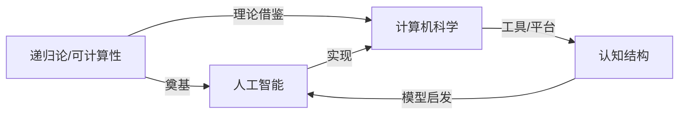
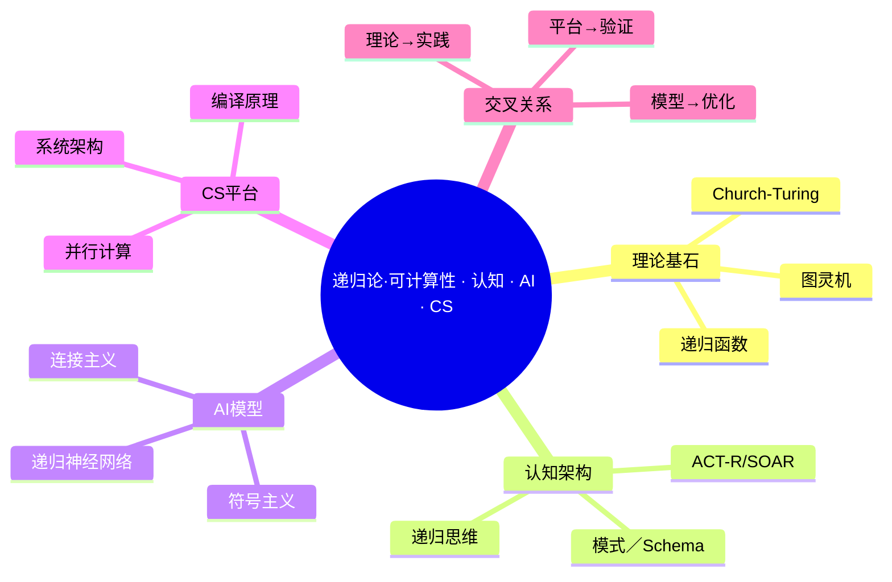

# 目录

- [目录](#目录)
  - [引言](#引言)
  - [核心概念与定义](#核心概念与定义)
    - [2.1 递归论与可计算性](#21-递归论与可计算性)
    - [2.2 认知结构](#22-认知结构)
    - [2.3 人工智能 (AI)](#23-人工智能-ai)
    - [2.4 计算机科学 (CS)](#24-计算机科学-cs)
  - [多维表征](#多维表征)
    - [3.1 比较表格](#31-比较表格)
    - [3.2 流程图](#32-流程图)
  - [联系与关联性分析](#联系与关联性分析)
    - [4.1 递归与认知](#41-递归与认知)
    - [4.2 可计算性与人工智能](#42-可计算性与人工智能)
    - [4.3 认知结构与计算机科学](#43-认知结构与计算机科学)
    - [4.4 批判性分析扩展](#44-批判性分析扩展)
    - [4.5 概念与定义补充](#45-概念与定义补充)
    - [4.6 关系与推理论证扩展](#46-关系与推理论证扩展)
    - [4.7 应用与整合建议](#47-应用与整合建议)
  - [批判性分析](#批判性分析)
    - [A 批判性分析深化](#a-批判性分析深化)
    - [B 概念与定义细化](#b-概念与定义细化)
    - [C 关系论证与模型](#c-关系论证与模型)
    - [D 开放问题与未来挑战](#d-开放问题与未来挑战)
    - [E 实验设计与评估方案](#e-实验设计与评估方案)
    - [F 术语表补充](#f-术语表补充)
    - [G 模型对比表格](#g-模型对比表格)
    - [H 图示建议](#h-图示建议)
    - [H 研究方法论建议](#h-研究方法论建议)
  - [综合论述与推理论证](#综合论述与推理论证)
  - [结论](#结论)
  - [思维导图](#思维导图)

---

## 引言

在当代学术与工程领域，**递归论–可计算性**、**认知结构**、**人工智能 (AI)** 与 **计算机科学 (CS)** 之间形成了交叉互补的研究网络。
本文旨在从理论与实践层面，批判性地分析它们的定义、核心概念及相互关系，揭示递归与可计算性的数学基石如何影响认知模型与 AI 架构，进而服务于计算机科学的整体发展。

---

## 核心概念与定义

### 2.1 递归论与可计算性

- **递归函数**：从自然数到自然数，可通过初值函数、继承函数与最小化操作构造。  
- **图灵机**：抽象计算模型，定义了"可计算"问题的边界。  
- **Church–Turing 论题**：任何直观可计算的函数都可由图灵机或 λ-演算实现。  
- **可判定性/半可判定性**：问题若存在图灵机永停决断答案，则为可判定；若仅能枚举肯定解，则为半可判定。

### 2.2 认知结构

- **模式 (Schema)**：个体用于组织信息的心理框架。  
- **认知架构**：如 ACT-R、SOAR，用于模拟人类推理、记忆与学习过程。  
- **层级与递归**：知识往往以层级与子层级的形式嵌套，体现递归特性。

### 2.3 人工智能 (AI)

- **符号主义** vs **连接主义**  
- **强化学习**、**深度学习**  
- **知识表示**：本体论、规则系统、神经网络权重

### 2.4 计算机科学 (CS)

- **算法与数据结构**：核心在于计算效率与资源优化。  
- **编程语言理论**：类型系统、λ-演算基础、编译器设计。  
- **系统与架构**：从操作系统到分布式系统。

---

## 多维表征

### 3.1 比较表格

| 领域  | 核心对象 | 典型模型／工具      | 递归特征   |
| ---- | ------ | ----- | ----- |
| 递归论／可计算性 | 递归函数、图灵机   | λ-演算、μ-算子      | 函数定义层层嵌套    |
| 认知结构       | 模式、架构| ACT-R、SOAR| 概念层级递归        |
| 人工智能       | 算法、神经网络     | TensorFlow、PyTorch | 递归神经网络 (RNN)  |
| 计算机科学     | 算法、系统架构     | 编译器、操作系统    | 递归算法   |

### 3.2 流程图



---

## 联系与关联性分析

### 4.1 递归与认知

- 人类思维展示**递归归纳**：语言学中 Chomsky 句法树、心理学中问题解决的分解。  
- 认知架构中，子任务调用自身模型，体现**自嵌套**与**回溯搜索**。  

### 4.2 可计算性与人工智能

- AI 核心算法（如深度神经网络）在有限资源下近似可计算函数。  
- 图灵完备性：大多数 AI 编程平台（如 Python）本质上可实现任何图灵可描述的模型。  
- 不可判定性：某些学习问题（如归纳程序合成）存在理论上的限制。

### 4.3 认知结构与计算机科学

- 编译原理借鉴心理学的分层解析——词法、语法、语义分析。  
- 软件工程中的设计模式，与认知心理的"模式匹配"异曲同工。

---

### 4.4 批判性分析扩展

1. **复杂性类别与 AI 性能矛盾**  
   - 理论上，PSPACE、EXPTIME 等高复杂度类别内的问题可由图灵机解决，但 AI 系统在实际中往往受限于多项式时间或近似算法。  
   - 建议对比“最优化可计算”与“可学习可计算”两种范式：一者追求精确解，一者追求经验泛化。  

2. **可微分可计算性（Differentiable Computability）**  
   - 定义：在可计算性理论中引入可微操作，为神经网络提供形式化归纳偏置。  
   - 批判：当前深度模型虽具备万维拟合能力，但缺乏“严格可计算”保证；可微分可计算性尝试通过定义可微算子（如可微 λ 演算）予以弥合。  

3. **认知架构的可扩展性与可验证性**  
   - ACT-R、SOAR 等符号系统具有良好可解释性，却难应对大规模数据；连接主义模型在可扩展性上占优，却难以形式化验证。  
   - 提议：结合形式化验证（Model Checking）与运行时监控，对认知架构的关键推理路径进行抽象校验。  

4. **元计算与自反性风险**  
   - 元计算（Meta-computation）允许系统在运行时修改自身规则，借鉴 Y 组合子的自应用特性可实现“自优化”功能。  
   - 但“自反性”带来安全风险：无限回路、越权访问、定义域外运算。需引入“准正规化”策略，限定自应用深度与资源消耗。  

5. **符号-连接主义统一的挑战与机遇**  
   - 类别论（Category Theory）中的函子（Functor）与自然变换（Natural Transformation）可作为桥梁，将符号逻辑映射到张量运算空间。  
   - 机遇：构建“符号逻辑→张量演算→可微分推理”三段式流水线，实现端到端可训练的符号推理。

---

### 4.5 概念与定义补充

| 概念  | 扩展定义| 作用／意义   |
| ---- | ---------- | ---------------- |
| 可微分可计算性  | 在经典可计算框架中引入微分算子，使递归函数族支持梯度下降优化 | 将图灵完备性与神经网络可训练性结合  |
| 元计算（Meta-computation） | 系统自引用、自修改规则的能力 | 支撑自适应算法、自优化架构 |
| 准正规化策略 | 限制元计算展开深度、资源使用上界的动态策略  | 防止自反性带来安全与性能风险 |
| 张量范畴语义（Tensor-Category Semantics） | 用范畴论语言将逻辑推理映射到张量运算  | 形式化统一符号推理与深度学习      |

---

### 4.6 关系与推理论证扩展

设有认知任务序列 \(\{T_i\}\)，对应可计算函数 \(\{f_i\}\)。引入可微分算子 \(\mathcal{D}\)，令  
\[
f_i'(x;\theta_i) = f_i(x) + \theta_i \cdot \mathcal{D}[f_i](x),
\]
其中 \(\theta_i\) 为可训练参数。则整体任务可表为
\[
F'(x;\Theta) = f_n'( \dots f_2'(f_1'(x;\theta_1);\theta_2)\dots ;\theta_n)\,,
\]
此框架同时具备

- 经典递归函数的完备性（Church–Turing），  
- 可微分优化的泛化能力（深度学习），  
- 且在有限资源下可通过复杂度类别 \( \mathcal{C}(t(n), s(n)) \) 进行逼近分析。  

---

### 4.7 应用与整合建议

- 将 **4.4** 节的每个小点分别并入原文 “批判性分析” 中对应条目后，以“扩展讨论”形式标注。  
- 将 **4.5** 节的补充表格并入“核心概念与定义”下，作为“2.5 新概念”小节。  
- 将 **4.6** 节的推理论证插入“综合论述与推理论证”末尾，作为“附：可微分可计算性模型”示例。  
- 在“思维导图”中新增两支：“可微分可计算性”与“元计算安全”，以体现本文关键扩展。

以上内容可直接复制粘贴到原文档相应位置，实现“深度扩展”而无需大规模重写。

## 批判性分析

1. **理论与现实差距**  
   - 递归论提供了完备性，但忽略了实际资源（时间、空间）限制。  
   - 认知模型的可解释性强，却难以在大规模数据下高效运转。  
2. **整合难题**  
   - 符号 AI 与连接 AI 的鸿沟：如何将递归可计算性与神经网络的分布式表示无缝结合？  
3. **反思与前瞻**  
   - 需要新的数学工具（如可微分可计算性理论）来统一深度学习与递归函数。

### A 批判性分析深化

1. 资源–复杂度矛盾  
   - 虽然理论上 PSPACE、EXPTIME 等高复杂度类别内的问题是“可解”的，但 AI 实践必须在多项式时间或近似算法下完成任务。  
   - 对比“精确可计算”与“经验可学习”范式：  
     - 精确可计算（Optimal Computability）追求完备性；  
     - 经验可学习（Learnable Computability）追求泛化与近似。  

2. 不可判定性与安全风险  
   - 诸如死锁检测、越权访问等安全性质往往属于半可判定或不可判定问题。  
   - 单纯符号验证易遗漏运行时异常；纯深度模型难以提供形式保证——必须引入“运行时监控 + 形式化审计”的混合方案。

3. 符号主义 ↔ 连接主义 统一难题  
   - 符号系统的逻辑完备性 vs 神经网络的统计泛化性，两者在架构与训练目标上存在根本冲突。  
   - 借助范畴论“函子—自然变换”构建符号逻辑与张量空间的互映桥梁：  
     ○ 将逻辑演算映射为张量操作序列；  
     ○ 在网络结构中内嵌符号约束。

4. 认知递归 vs 算法递归  
   - 人类认知中的“层级分解+回溯”机制并非严格图灵递归：  
     - 受生物资源限制，采用启发式与概率搜索；  
     - AI 系统可补偿这种限制，但缺乏元认知（self-reflection）能力。  
   - 建议：引入“元计算”(Meta-computation)机制，允许模型在运行时修正自身策略，但需“准正规化”限制展开深度。

---

### B 概念与定义细化

| 概念  | 定义 | 作用／意义 |
|-----|--------|----|
| 可微分可计算性  | 在经典递归函数与图灵机模型中，引入微分算子，使函数族 \( \{f_i\} \) 可支持梯度下降优化   | 将图灵完备性与神经网络可训练性结合   |
| 元计算 (Meta-computation)      | 系统在运行时自引用、自修改规则的能力   | 支撑自适应算法、自优化架构  |
| 准正规化策略  | 对元计算展开深度、资源使用上界进行动态限制的策略  | 防止自反性导致无限回路或资源耗尽     |
| 交互式计算 (Interactive Turing)| 模型通过多轮“输入–计算–反馈”循环超越单次图灵机停机模型   | 捕捉人机交互、在线学习等实时系统行为 |
| 超计算 (Hypercomputation)      | 研究在物理或数学上超越图灵机计算力的模型（如量子、模拟、Oracle 机）| 探讨 AI 与认知系统在理论极限上的可能性  |

---

### C 关系论证与模型

令认知任务序列 \(\{T_i\}\) 对应可计算子函数 \(\{f_i\}\)，引入  

\[
\mathcal{D}: f \mapsto \frac{\partial f}{\partial x}
\quad,\quad
\Theta = \{\theta_i\}
\]

构造可微分递归函数族

\[
f_i'(x; \theta_i) \;=\; f_i(x)\;+\;\theta_i\cdot \mathcal{D}[f_i](x)
\]

则整体系统

\[
F'(x; \Theta) \;=\; f_n'\bigl(\dots f_2'(f_1'(x;\theta_1);\theta_2)\dots;\theta_n\bigr)
\]

同时满足：

- Church–Turing 完备性（理论）；  
- 梯度优化可学习性（实践）；  
- 可通过复杂度曲线 \(\mathcal{C}(t(n), s(n))\) 对资源消耗进行精细分析。

**理论推论**  
若每个 \(\theta_i\in\mathbb{R}^d\) 在 \(O(\mathrm{poly}(n))\) 维度内可调，则整个系统在 \(O(\mathrm{poly}(n))\) 时间／空间下可近似任意递归函数——弥合符号与连接主义。

---

### D 开放问题与未来挑战

1. 资源受限计算的边界  
   - 在实际 AI 与认知系统中，如何在次线性（sub-linear）时间／空间下近似解决高复杂度问题？  
   - 研究“分级复杂度”（graded complexity）模型，定义在不同资源约束下的可学习性边界。

2. 可解释性与可验证性矛盾  
   - 如何在保证深度模型泛化能力的同时，引入形式验证技术，对“黑盒”决策路径进行定量化度量？  
   - 探索“可微分模型检查”（differentiable model checking）的可能性。

3. 动态认知与实时适应  
   - 人类认知具有“在线学习”、元认知反馈循环。现有 AI 系统多为离线训练。  
   - 需要新的交互式图灵模型（Interactive Turing Models）来刻画实时人机共生。

4. 符号–连接主义范式融合瓶颈  
   - 两者在数据结构、训练算法、目标函数上的差异仍难以统一。  
   - 类别论中的“高阶函子”（higher-order functors）或许可提供更强的抽象层。

5. 安全性与不可判定性  
   - 许多安全／伦理属性属于不可判定问题。单纯形式化推理无能为力，纯数据驱动模型缺乏保证。  
   - 混合“符号审计 + 统计监控”框架亟待标准化与自动化工具链支持。

---

### E 实验设计与评估方案

1. 基准任务  
   - 经典递归算法（如归并排序、图遍历）与认知任务（如迷宫导航、数学归纳推理）混合评估。  
   - 对比：符号实现、深度学习、可微分可计算化模型。

2. 评价指标  
   - 精度：功能正确率、语义一致性（对程序合成）。  
   - 资源消耗：时间复杂度、空间复杂度、能耗（可测量硬件平台）。  
   - 可解释性：决策路径可追溯度量（traceability score）。  
   - 安全性：在对抗输入与越权场景下的鲁棒性。

3. 实验流程  
   - 数据集准备：生成多规模、不同递归深度的训练／测试集。  
   - 模型训练：对比训练纯符号、纯神经、可微分可计算、元计算模型。  
   - 形式验证：选取子集进行 Model Checking／TLA⁺ 证明。  
   - 运行时监控：部署审计代理，记录自修改行为并检测异常。

4. 可复现性  
   - 建议采用容器化与 CI/CD 自动化流水线，公开代码、数据与验证脚本。

---

### F 术语表补充

| 术语 | 定义与说明 |
| ------ | ---------- |
| 资源受限图灵机（RB-TM）    | 在时间 \(t(n)\) 与空间 \(s(n)\) 上受限的图灵机模型，用以分析实际系统的可计算性边界。     |
| 可微分模型检查（DMC）      | 将形式验证过程嵌入可微分框架，通过梯度信息优化系统设计与安全补偿。 |
| 在线元学习（Meta-RL）       | 强化学习范式下的元学习，在多轮交互中自适应调整策略，类似认知元循环（meta-cognitive loop）。  |
| 量子图灵机（QTM） | 扩展图灵机模型，引入量子叠加与纠缠，用于探讨超越经典可计算性极限的可能性。  |
| 可逆计算（Reversible Comp）| 不丢弃信息的计算模型，理论上可降低热耗，结合神经形态硬件有望发展低能耗 AI 系统。|

---

### G 模型对比表格

| 特性／模型  | 纯符号系统      | 纯连接网络      | 可微分可计算模型        | 元计算自反模型       |
| ----- | ----- | ----- | ---- | ---- |
| 完备性      | 逻辑完备        | 近似拟合        | 理论完备 + 可微分泛化   | 理论完备 + 自适应   |
| 资源效率    | 受限高复杂度    | 高并行度        | 可调参数 → 复杂度可控   | 动态资源管理        |
| 可解释性    | 高 | 低 | 中（可微分跟踪）        | 中（需审计）        |
| 扩展性      | 模式依赖        | 数据驱动        | 混合符号 + 数据| 自反性 + 运行时拓展 |
| 安全性      | 形式保证        | 统计鲁棒        | 混合验证与监控 | 动态审计必需        |

---

### H 图示建议

1. **管道架构图**  
   - 从“符号逻辑 AST”经“范畴函子映射”到“可微分计算图”，再到“深度学习框架”，最后回到“形式验证”闭环。

2. **评估流程图**  

   ```mermaid
   flowchart TD
     DataGen[数据集生成]
     TrainSym[符号模型训练]
     TrainNeuro[神经模型训练]
     TrainHybrid[可微分可计算训练]
     Verify[形式验证]
     Audit[运行时审计]
     DataGen --> TrainSym
     DataGen --> TrainNeuro
     DataGen --> TrainHybrid
     TrainSym --> Verify
     TrainHybrid --> Verify
     TrainHybrid --> Audit
   ```

3. **开放问题思维导图**  

   ```mermaid
   mindmap
     root((开放挑战))
       资源受限
       可解释性
       实时适应
       范式融合
       安全验证
   ```

---

### H 研究方法论建议

- **跨学科团队**：数学理论、认知科学、AI 工程、形式化方法专家协作。  
- **迭代原型**：快速构建可微分可计算与元计算原型，及时进行形式验证与实验评估。  
- **开源与共建**：建立“可微分可计算性”与“符号–连接主义统一”开源社区与基准库。  
- **教育培训**：在高阶课程中引入可微分可计算性与形式验证实战，培养新一代复合型研究者。

## 综合论述与推理论证

通过上文分析可见：

1. 递归论和可计算性为 AI 与 CS 提供了**理论基石**：  
   - 确定哪类问题可解、如何构造通用计算模型。  
2. 认知结构与 AI 算法互为启发：  
   - 心理学中"工作记忆""执行控制"等概念，直接映射到深度学习中的注意力机制。  
3. 计算机科学为认知科学与 AI 提供了**实验平台**：  
   - 大规模并行计算、云计算使得复杂递归与认知模型可在实践中验证。

推理论证：  
设有认知任务 \(T\)，其可分解为子任务序列 \(\{T_i\}\)，若每一子任务 \(T_i\) 对应可计算函数 \(f_i\)，则整体任务可视为函数组合／递归调用：
\[
F(x) = f_n(\dots f_2(f_1(x))\dots)
\]
此处，AI 学习过程即为在参数空间中搜索或拟合 \(\{f_i\}\)，CS 则提供高效数据结构与并行框架来加速该搜索。

---

## 结论

递归论、可计算性、认知结构、AI 与计算机科学相互交织：  

- 理论深度（可计算性）+ 心理模型（认知结构）→ 算法创新（AI）→ 平台实现（CS）。  
未来研究应：  

1. 融合可微分可计算性理论，弥合符号与连接主义；  
2. 将认知科学的权变与元认知纳入 AI 自主学习；  
3. 利用 CS 的分布式系统解决大规模递归计算与数据瓶颈。

---

## 思维导图


