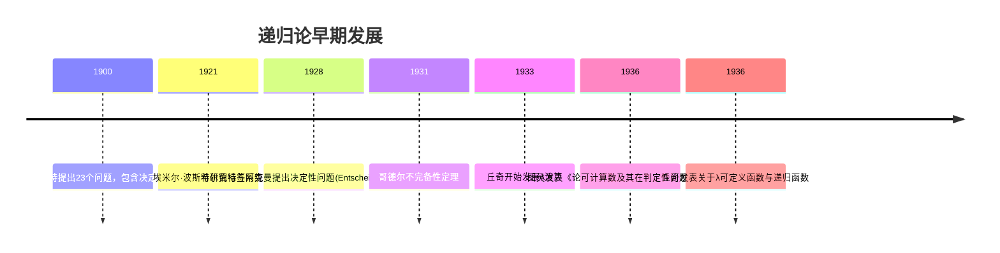
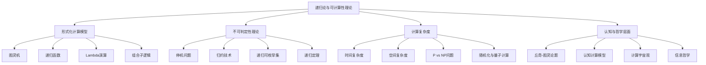
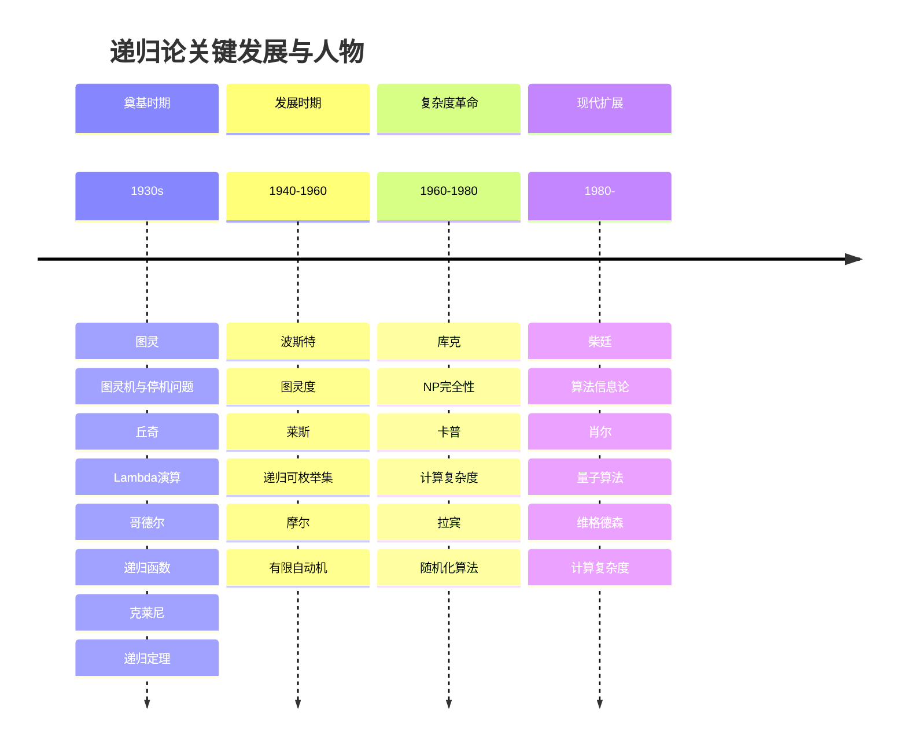
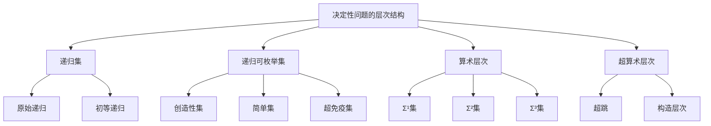

# 递归论与可计算性理论：技术基础、认知结构与哲学诠释

## 目录

- [递归论与可计算性理论：技术基础、认知结构与哲学诠释](#递归论与可计算性理论技术基础认知结构与哲学诠释)
  - [目录](#目录)
  - [引言：可计算性的多维视角](#引言可计算性的多维视角)
  - [历史发展与概念演进](#历史发展与概念演进)
    - [前图灵时代：直觉与萌芽](#前图灵时代直觉与萌芽)
    - [多元发现：不同计算模型的等价性](#多元发现不同计算模型的等价性)
    - [后图灵发展：复杂度、随机性与不可判定性](#后图灵发展复杂度随机性与不可判定性)
  - [技术基础：核心定义与构造](#技术基础核心定义与构造)
    - [可计算函数的形式化](#可计算函数的形式化)
    - [图灵机与递归函数](#图灵机与递归函数)
    - [Lambda演算与组合子逻辑](#lambda演算与组合子逻辑)
  - [决定性问题与不可判定性](#决定性问题与不可判定性)
    - [停机问题及其证明](#停机问题及其证明)
    - [不可判定性的层次结构](#不可判定性的层次结构)
    - [归约技术与完全性](#归约技术与完全性)
  - [递归论的元理论特性](#递归论的元理论特性)
    - [递归定理与自指结构](#递归定理与自指结构)
    - [递归可枚举集的性质](#递归可枚举集的性质)
    - [算术层次结构与超算术层次结构](#算术层次结构与超算术层次结构)
  - [认知维度：可计算性的心智模型](#认知维度可计算性的心智模型)
    - [算法思维与人类认知](#算法思维与人类认知)
    - [递归作为认知隐喻](#递归作为认知隐喻)
    - [计算限制与认知边界](#计算限制与认知边界)
  - [哲学诠释与基础问题](#哲学诠释与基础问题)
    - [丘奇-图灵论题的本质与争议](#丘奇-图灵论题的本质与争议)
    - [有限主义、机械主义与直觉主义](#有限主义机械主义与直觉主义)
    - [信息、计算与物理实在](#信息计算与物理实在)
  - [与其他元数学理论的交互](#与其他元数学理论的交互)
    - [与集合论的边界交叉](#与集合论的边界交叉)
    - [与证明论的互动关系](#与证明论的互动关系)
    - [与模型论的联系](#与模型论的联系)
  - [现代扩展与前沿研究](#现代扩展与前沿研究)
    - [随机性与算法信息论](#随机性与算法信息论)
    - [计算复杂度层次](#计算复杂度层次)
    - [量子计算的理论基础](#量子计算的理论基础)
  - [结论与开放性问题](#结论与开放性问题)
  - [附录](#附录)
    - [关键定理的形式化证明](#关键定理的形式化证明)
    - [多维表征与思维导图](#多维表征与思维导图)
    - [学习路径与资源](#学习路径与资源)
  - [参考文献](#参考文献)

## 引言：可计算性的多维视角

递归论（或可计算性理论）作为现代数学与计算机科学的理论基础，远不仅是一门技术学科，而是一个连接数学、计算机科学、哲学、认知科学和物理学的丰富知识领域。
本文旨在提供对递归论的多维分析，将其技术内核与认知结构、历史演进和哲学诠释相融合，呈现这一领域的全景图像。

可计算性的概念本身即体现了人类思维对自身能力边界的探索。
通过形式化"可有效计算"的直觉概念，递归论不仅提供了计算的理论框架，也深刻影响了我们对思维、问题解决和数学本质的理解。

## 历史发展与概念演进

### 前图灵时代：直觉与萌芽

前图灵时代的数学中，"有效程序"、"算法"等概念主要依靠直觉理解。
然而，希尔伯特的决定性问题催生了对这些概念进行精确数学化的需求。



### 多元发现：不同计算模型的等价性

20世纪30年代中期出现了一个引人注目的科学同时性现象：
几位数学家几乎在同一时间独立提出了形式化"算法"或"有效计算"概念的不同模型：

- **艾伦·图灵**的图灵机（1936）
- **阿隆佐·丘奇**的λ演算（1936）
- **库尔特·哥德尔**的递归函数（1934）
- **埃米尔·波斯特**的产生式系统（1936）
- **马尔科夫**的算法（后期发展）

这些表面上不同的形式化最终被证明是等价的，从而支持了丘奇-图灵论题。
这一多元发现现象本身值得深思：为什么不同的思维路径导向同一形式结构？
这或许反映了可计算性概念的某种内在自然性。

### 后图灵发展：复杂度、随机性与不可判定性

自20世纪50年代起，递归论分化为多个研究支流：

- **经典递归论**：研究不可计算性的层次结构
- **计算复杂度理论**：研究可计算问题的难度分类
- **算法随机性**：研究计算中的随机性与复杂性概念

克莱尼、波斯特、迈希尔、索洛韦等人的工作极大丰富了这一领域，将其从简单二分（可计算/不可计算）扩展为复杂的层次结构。

## 技术基础：核心定义与构造

### 可计算函数的形式化

可计算性理论的核心是形式化"可计算函数"的概念。
一个函数 $f: \mathbb{N} \rightarrow \mathbb{N}$ 的可计算性可通过多种等价方式定义：

1. **存在图灵机** $M$ 使得对任意输入 $n$，$M$ 在输入 $n$ 上最终停机并输出 $f(n)$
2. **存在λ表达式** $E$ 使得对任意输入 $n$，$E(n)$ 可规约至表示 $f(n)$ 的教会数
3. **函数属于原始递归函数类与最小化算子的闭包**

这些定义的等价性构成了递归论的基础。

### 图灵机与递归函数

图灵机提供了一个抽象但直观的计算模型，由以下组件构成：

- 无限长的带子，分为离散单元格
- 读写头可在带子上移动
- 有限状态控制单元
- 一套指令集，规定在给定状态和读取符号下的行为

递归函数则通过基本函数（零函数、后继函数、投影函数）结合组合操作（复合、原始递归、μ-递归）构建，
提供了一个代数化的计算模型。

### Lambda演算与组合子逻辑

Lambda演算是一个基于函数抽象和应用的形式系统：

```math
λ表达式 := 变量 | (λ表达式 λ表达式) | (λ变量.λ表达式)
```

例如：恒等函数可表示为 `λx.x`，组合子 S 可表示为 `λx.λy.λz.xz(yz)`。

Lambda演算与图灵机的计算能力等价，但其抽象性质使得它在程序语言设计、类型论和证明论中具有重要应用。

## 决定性问题与不可判定性

### 停机问题及其证明

停机问题是递归论中最著名的不可判定性例子。
它提出的问题是：是否存在一个算法，能够判断任意给定程序在任意给定输入上是否会最终停止运行？

**定理**：停机问题是不可判定的。

**证明**：采用对角线方法。假设存在图灵机 $H$ 能解决停机问题，即对任意图灵机编码 $\langle M \rangle$ 和输入 $x$：

$H(\langle M \rangle, x) = \begin{cases}
1 & \text{若 } M \text{ 在输入 } x \text{ 上停机} \\
0 & \text{若 } M \text{ 在输入 } x \text{ 上不停机}
\end{cases}$

我们构造一个新的图灵机 $D$：

```math
D(x):
  若 H(x, x) = 0 则停机
  若 H(x, x) = 1 则进入无限循环
```

现在考虑 $D(\langle D \rangle)$ 的行为：

- 如果 $D$ 在输入 $\langle D \rangle$ 上停机，那么 $H(\langle D \rangle, \langle D \rangle) = 0$，意味着 $D$ 在输入 $\langle D \rangle$ 上不停机。
- 如果 $D$ 在输入 $\langle D \rangle$ 上不停机，那么 $H(\langle D \rangle, \langle D \rangle) = 1$，意味着 $D$ 在输入 $\langle D \rangle$ 上停机。

这是一个矛盾，因此假设不成立，停机问题不可判定。

### 不可判定性的层次结构

不可判定性并非一个单一的水平，而是形成了复杂的层次结构：

1. **递归可枚举集**：存在图灵机可枚举但不一定决定的集合
2. **图灵度**：按照计算复杂性排序的等价类
3. **算术层次结构**：基于量词复杂性的语句分类

波斯特定理表明图灵度形成了丰富的半序结构，这展示了不可计算性的复杂内部组织。

### 归约技术与完全性

归约是证明问题不可判定性的核心技术。
如果问题 A 可归约到问题 B，且 A 已知不可判定，则 B 也不可判定。

一些关键的不可判定问题包括：

- 停机问题
- 空白问题（判断图灵机是否接受任何输入）
- 后-对应问题
- 希尔伯特第十问题（判断丢番图方程是否有整数解）

## 递归论的元理论特性

### 递归定理与自指结构

**递归定理**（又称克莱尼第二递归定理）是递归论中最深刻的结果之一，它揭示了计算的自指能力。

**定理**：对任何可计算函数 $f$，存在一个指数 $e$ 使得 $\varphi_e(x) = \varphi_{f(e)}(x)$，其中 $\varphi_i$ 表示第 $i$ 个部分可计算函数。

这一定理使得程序可以访问自身的代码，为自修改程序和计算机病毒等提供了理论基础，也在哥德尔不完备性定理证明中扮演核心角色。

### 递归可枚举集的性质

递归可枚举集（r.e.集）是可计算性理论的核心概念，它们代表计算过程可列举但不一定可判定的集合。

**定理**：以下陈述等价：

1. $A$ 是递归可枚举集
2. $A$ 是某图灵机接受的语言
3. $A$ 是某部分可计算函数的定义域
4. $A$ 是空集或某全计算函数的值域

r.e.集满足许多重要性质：

- r.e.集的并集和交集仍是r.e.集
- 若 $A$ 和 $\overline{A}$ 都是r.e.集，则 $A$ 是递归集
- 存在r.e.集不是递归集

### 算术层次结构与超算术层次结构

不可计算函数并非全都"一样难"，它们按计算复杂性形成了严格的层次结构。

**算术层次结构**根据一阶算术中量词复杂性排序函数和集合：

- $\Sigma^0_1$：存在量词形式的陈述（对应r.e.集）
- $\Pi^0_1$：全称量词形式的陈述（对应co-r.e.集）
- $\Delta^0_1$：既是$\Sigma^0_1$又是$\Pi^0_1$（对应递归集）

如克莱尼所证明，这一层次结构是严格的，即 $\Delta^0_n \subsetneq \Sigma^0_n \subsetneq \Delta^0_{n+1}$。

**超算术层次结构**进一步扩展了这一框架，研究超越算术量词嵌套的更高复杂性。

## 认知维度：可计算性的心智模型

### 算法思维与人类认知

可计算性理论与人类认知之间存在深刻联系。人类的问题解决能力往往表现为某种算法思维，但也超越了简单的机械计算。

认知心理学家如丹尼尔·卡尼曼区分了两种思维系统：

1. **系统1**：快速、直觉、自动化（与简单算法相似）
2. **系统2**：慢速、分析、需要努力（与复杂算法和元认知相似）

计算模型可视为人类认知的外化工具，但也存在关键差异：人类认知具有上下文敏感性、模糊容忍度和创造性，这些特性在传统计算模型中难以完全捕捉。

### 递归作为认知隐喻

递归是一个强大的认知隐喻，它体现在诸多领域：

- **语言学**：乔姆斯基的递归语法研究表明人类语言的核心特征是递归结构
- **发展心理学**：递归思维能力是认知发展的关键里程碑
- **哲学**：自指和反思能力是人类思维的独特特征
- **艺术**：埃舍尔的作品等体现了递归的美学表达

认知科学家道格拉斯·霍夫斯塔特指出，递归与自我参照是意识和智能的基础特征。然而，人类对递归的直觉理解受到工作记忆限制，通常难以自然处理5层以上的递归结构。

### 计算限制与认知边界

可计算性理论揭示的计算限制也引发对人类认知边界的思考：

1. **不可判定性的认知意义**：某些问题原则上不可判定，这对人类认知有何启示？
2. **复杂度障碍**：即使理论上可计算，实际复杂度也可能超出任何实际计算的范围
3. **哥德尔限制**：形式系统的内在限制也可能映射到认知系统上

罗杰·潘罗斯主张，人类理解能力超越算法计算，这构成了对强人工智能的挑战。相反，丹尼尔·丹尼特认为人类思维本质上是可计算的，只是具有特殊的层次架构。

## 哲学诠释与基础问题

### 丘奇-图灵论题的本质与争议

丘奇-图灵论题是递归论的核心哲学主张，它将数学直觉中的"有效可计算"概念与精确定义的"图灵可计算"概念等同起来：

> 任何"有效计算"都可由图灵机计算。

这一论题的本质是将非形式化的直觉概念与形式化的数学定义联系起来，因此它不是一个可证明的数学定理，而是一个关于物理世界与数学抽象关系的主张。

围绕该论题的争议包括：

1. **经验论题 vs 分析论题**：它是经验发现还是概念分析？
2. **强解读 vs 弱解读**：是否主张所有物理可能的计算过程都能被图灵机模拟？
3. **量子计算挑战**：量子计算是否违反了论题？（大多数研究者认为不违反）
4. **超图灵计算**：是否可能存在超越图灵机的物理计算系统？

这些争议反映了计算边界与物理实在本质的深层关联。

### 有限主义、机械主义与直觉主义

可计算性理论与多种哲学立场产生复杂互动：

- **有限主义**（如希尔伯特）：主张数学基础应建立在有限方法上，与可计算性理论的精神一致
- **机械主义**：认为所有推理过程原则上可机械化，可计算性理论为此提供形式化支持
- **直觉主义**（如布劳威尔）：强调数学构造的心智本质，对经典逻辑持保留态度

值得注意的是，递归论中的许多基本结果（如停机问题不可判定性）在直觉主义框架下仍然有效，这反映了这些结果的鲁棒性。

### 信息、计算与物理实在

现代物理学与可计算性理论的交汇产生了深刻的哲学问题：

1. **计算自然**：朗道尔和惠勒等人提出的"物理即信息"观点
2. **数字物理**：宇宙是否在根本上是计算性的？
3. **人择原理的计算解读**：为什么宇宙的物理规律允许复杂计算的存在？

格雷戈里·柴廷基于算法信息论提出，可计算性角度可能提供理解物理学基础的新视角，如通过算法随机性解释量子不确定性。

## 与其他元数学理论的交互

### 与集合论的边界交叉

递归论与集合论在多个层面交织：

- **可计算性视角下的集合**：哪些集合是可计算的、递归可枚举的
- **有效描述复杂性**：算法随机性与描述复杂性的关系
- **构造性数学**：可计算函数可视为构造性数学的形式化

特别是，布拉科夫斯基和苏珊·弗弗曼等人的工作探索了可计算性理论与描述集合论之间的深层连接。

### 与证明论的互动关系

可计算性理论与证明论的互动产生了多项重要成果：

1. **哥德尔不完备性定理**：可通过递归函数理论证明
2. **构造性证明**：证明中使用的计算过程
3. **证明复杂度**：不同形式系统的证明能力对应不同计算复杂度类
4. **逆向数学**：研究证明特定定理所需的集合存在公理

基于这些连接，哈维·弗里德曼开发了逆向数学项目，将数学定理分类为其证明所需的公理系统强度。

### 与模型论的联系

递归论与模型论在可计算结构理论中紧密连接：

1. **可计算模型理论**：研究可计算结构和关系的模型理论性质
2. **递归饱和**：模型的可计算性版本的饱和概念
3. **算术编码**：使用算术编码在弱系统中讨论语义概念

莫斯托夫斯基和尼尔森的工作表明，模型论和递归论的结合可以提供对数学结构更深入的理解。

## 现代扩展与前沿研究

### 随机性与算法信息论

算法信息论将可计算性概念应用于信息和随机性研究：

- **柯尔莫哥洛夫复杂性**：定义为最短生成程序的长度
- **随机性的可计算定义**：一个序列是随机的，当且仅当其柯尔莫哥洛夫复杂性接近其长度
- **奥姆定理**：解决给定问题的概率方法的限制

这一领域由索洛莫诺夫、柴廷和马丁-洛夫等人奠基，提供了随机性的精确数学化。

### 计算复杂度层次

计算复杂度理论研究问题解决的计算资源需求：

```math
L ⊆ NL ⊆ P ⊆ NP ⊆ PSPACE ⊆ EXPTIME ⊆ NEXPTIME ⊆ ...
```

关键研究问题包括：

- P vs NP 问题（千禧年七大难题之一）
- 多项式层次的结构
- 随机化复杂度类

复杂度理论的深层结构反映了计算任务的内在难度层次。

### 量子计算的理论基础

量子计算引入了传统可计算性理论的扩展：

- **量子图灵机**：理论上的量子计算抽象模型
- **BQP复杂度类**：量子计算机在多项式时间内可以解决的问题
- **量子复杂度层次**：量子计算与经典计算的能力比较

德意志、肖尔和格罗弗等人的开创性工作表明，量子计算可能提供对特定问题的计算加速，但目前证据表明它仍在丘奇-图灵论题的范围内。

## 结论与开放性问题

递归论及可计算性理论历经近一个世纪的发展，已从单纯的数学分支演变为连接多学科的核心桥梁。
它不仅提供了计算的基础理论，也深刻影响了我们对自然、心智和数学本质的理解。

重要的开放问题仍然存在：

1. P vs NP 问题的解决
2. 随机量子计算的能力边界
3. 通过生物计算实现超图灵计算的可能性
4. 意识与计算关系的本质

随着量子信息科学、复杂系统理论和人工智能的发展，可计算性理论将继续演化，提供理解物理、认知和数学本质的新视角。

## 附录

### 关键定理的形式化证明

-**递归定理的形式化证明**

我们先证明自应用（self-application）函数的存在：存在递归函数 $s$，使得对所有 $e$，$\phi_{s(e)}(x) = \phi_e(e,x)$。

1. 定义函数 $d(e,x) = \phi_e(e,x)$
2. 由参数定理，存在递归函数 $s$ 使得 $\phi_{s(e)}(x) = d(e,x)$
3. 因此，$\phi_{s(e)}(x) = \phi_e(e,x)$

现在，对于任意可计算函数 $f$，我们找到一个不动点 $e$：

1. 定义函数 $g(e) = f(s(e))$
2. 由参数定理，存在递归函数 $h$ 使得 $\phi_{h(e)}(x) = \phi_{g(e)}(x)$
3. 令 $e_0 = s(h)$
4. 则 $\phi_{e_0}(x) = \phi_{s(h)}(x) = \phi_h(h,x) = \phi_{g(h)}(x) = \phi_{f(s(h))}(x) = \phi_{f(e_0)}(x)$

这就证明了 $e_0$ 是 $f$ 的不动点。

### 多维表征与思维导图

-**递归论的概念地图**



-**递归论的历史演进与关键人物**



-**递归论的层次结构**



### 学习路径与资源

-**递归论学习路径**

1. **基础阶段**
   - 掌握基本的计算模型：图灵机、递归函数、Lambda演算
   - 理解基本的不可判定性结果：停机问题、希尔伯特第十问题
   - 推荐资源：Sipser的《计算理论导论》

2. **中级阶段**
   - 熟悉递归定理及其应用
   - 学习算术层次结构
   - 理解归约技术和度理论
   - 推荐资源：Cooper的《可计算性理论》

3. **高级阶段**
   - 研究随机性理论和算法信息论
   - 探索超算术层次和高阶可计算性
   - 研究可计算分析和可计算代数
   - 推荐资源：Soare的《递归可枚举集合与度》

4. **交叉领域**
   - 与证明论的联系：逆向数学
   - 与复杂度理论的联系：计算复杂度层次
   - 与模型论的联系：可计算模型理论
   - 推荐资源：Odifreddi的《经典递归论》

## 参考文献

1. Turing, A. (1936). "On Computable Numbers, with an Application to the Entscheidungsproblem". Proceedings of the London Mathematical Society.

2. Church, A. (1936). "An Unsolvable Problem of Elementary Number Theory". American Journal of Mathematics.

3. Gödel, K. (1934). "On Undecidable Propositions of Formal Mathematical Systems". Lecture notes.

4. Kleene, S. C. (1952). "Introduction to Metamathematics". North-Holland.

5. Rogers, H. (1967). "Theory of Recursive Functions and Effective Computability". MIT Press.

6. Soare, R. I. (1987). "Recursively Enumerable Sets and Degrees". Springer-Verlag.

7. Chaitin, G. J. (1987). "Algorithmic Information Theory". Cambridge University Press.

8. Sipser, M. (2012). "Introduction to the Theory of Computation". Cengage Learning.

9. Boolos, G.S., Burgess, J.P., & Jeffrey, R.C. (2007). "Computability and Logic". Cambridge University Press.

10. Cooper, S. B. (2004). "Computability Theory". Chapman & Hall/CRC.

11. Odifreddi, P. (1989, 1999). "Classical Recursion Theory, Volumes I and II". North-Holland.

12. Copeland, B. J. (2004). "The Essential Turing". Oxford University Press.

13. Hofstadter, D. (1979). "Gödel, Escher, Bach: An Eternal Golden Braid". Basic Books.

14. Penrose, R. (1989). "The Emperor's New Mind". Oxford University Press.

15. Yanofsky, N. S. (2013). "The Outer Limits of Reason: What Science, Mathematics, and Logic Cannot Tell Us". MIT Press.
