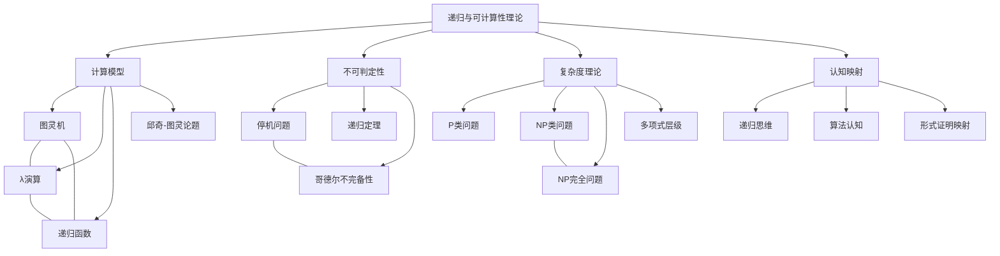

# 递归与可计算性理论：形式科学、认知结构与计算极限的多维探索

## 目录

- [递归与可计算性理论：形式科学、认知结构与计算极限的多维探索](#递归与可计算性理论形式科学认知结构与计算极限的多维探索)
  - [目录](#目录)
  - [1. 引言：计算的边界与思维的极限](#1-引言计算的边界与思维的极限)
    - [1.1. 理论定位与历史背景](#11-理论定位与历史背景)
    - [1.2. 基本问题域与核心关怀](#12-基本问题域与核心关怀)
    - [1.3. 多维透视的方法论预设](#13-多维透视的方法论预设)
  - [2. 历史脉络与思想谱系](#2-历史脉络与思想谱系)
    - [2.1. 前希尔伯特时期：计算思想的萌芽](#21-前希尔伯特时期计算思想的萌芽)
    - [2.2. 希尔伯特纲领与危机意识](#22-希尔伯特纲领与危机意识)
    - [2.3. 1930年代突破：多源并流的理论诞生](#23-1930年代突破多源并流的理论诞生)
    - [2.4. 理论扩展与发展轨迹](#24-理论扩展与发展轨迹)
  - [3. 形式基础：可计算性的等价表征](#3-形式基础可计算性的等价表征)
    - [3.1. 图灵机模型与直观计算](#31-图灵机模型与直观计算)
    - [3.2. λ演算：函数视角的计算本质](#32-λ演算函数视角的计算本质)
    - [3.3. 递归函数理论：构造性定义](#33-递归函数理论构造性定义)
    - [3.4. 邱奇-图灵论题：可计算性的本体论假设](#34-邱奇-图灵论题可计算性的本体论假设)
  - [4. 核心定理群与边界探测](#4-核心定理群与边界探测)
    - [4.1. 可判定性与半可判定性](#41-可判定性与半可判定性)
    - [4.2. 不可判定性定理：可计算性的内在限制](#42-不可判定性定理可计算性的内在限制)
    - [4.3. 递归定理与自指结构](#43-递归定理与自指结构)
    - [4.4. 归约理论与问题层级](#44-归约理论与问题层级)
  - [5. 复杂度维度：效率的理论化](#5-复杂度维度效率的理论化)
    - [5.1. 时间与空间复杂度层级](#51-时间与空间复杂度层级)
    - [5.2. P与NP问题：效率边界的本质](#52-p与np问题效率边界的本质)
    - [5.3. 不可约性与多项式层级](#53-不可约性与多项式层级)
  - [6. 认知结构映射与形式化思维](#6-认知结构映射与形式化思维)
    - [6.1. 递归思维与人类认知架构](#61-递归思维与人类认知架构)
    - [6.2. 算法作为认知扩展与表征](#62-算法作为认知扩展与表征)
    - [6.3. 形式证明与思维模式的映射](#63-形式证明与思维模式的映射)
    - [6.4. 计算限制与认知局限的同构性](#64-计算限制与认知局限的同构性)
  - [7. 交叉关联：理论的外部桥接](#7-交叉关联理论的外部桥接)
    - [7.1. 与逻辑学和证明论的双向映射](#71-与逻辑学和证明论的双向映射)
    - [7.2. 信息论视角：计算作为信息处理](#72-信息论视角计算作为信息处理)
    - [7.3. 语言理论与形式系统](#73-语言理论与形式系统)
    - [7.4. 现代AI与计算的本质重探](#74-现代ai与计算的本质重探)
  - [8. 批判性反思与开放问题](#8-批判性反思与开放问题)
    - [8.1. 理论局限与模型前提质疑](#81-理论局限与模型前提质疑)
    - [8.2. 跨域翻译的意义断裂](#82-跨域翻译的意义断裂)
    - [8.3. 未解问题与研究前沿](#83-未解问题与研究前沿)
  - [9. 多维表征：思维导图与概念网络](#9-多维表征思维导图与概念网络)
    - [9.1. 递归与可计算性理论思维导图](#91-递归与可计算性理论思维导图)
    - [9.2. 核心概念关系网络](#92-核心概念关系网络)
    - [9.3. 历史发展时间线](#93-历史发展时间线)
  - [参考文献](#参考文献)

## 1. 引言：计算的边界与思维的极限

### 1.1. 理论定位与历史背景

递归理论与可计算性理论共同构成了计算机科学与数理逻辑的基础支柱，它不仅解决了"什么是算法"这一根本问题，更精确地刻画了计算的内在边界。
这一理论发端于20世纪30年代数学基础危机下的思想突破，代表了人类对自身思维能力边界的探索，同时也奠定了现代计算技术的理论根基。

与一般的数学分支不同，可计算性理论并非仅关注特定对象的性质，而是对"计算"这一过程本身进行数学化描述与分析。
它最初诞生于对希尔伯特"判定性问题"(Entscheidungsproblem)的回应，是20世纪数学从经验科学向元科学转向的关键标志。

### 1.2. 基本问题域与核心关怀

递归与可计算性理论围绕一系列核心问题展开：

- 什么是算法/有效计算过程？如何形式化定义？
- 存在哪些问题本质上无法被算法求解？
- 为什么会存在不可计算问题，其根本原因是什么？
- 可计算问题之间是否存在内在的复杂度层级？
- 计算能力的边界与人类思维能力的边界有何关联？

这些问题不仅具有技术维度，更蕴含深刻的哲学意义，反映了对智能本质、数学基础和形式系统极限的探究。

### 1.3. 多维透视的方法论预设

本文采用多维透视的方法，从四个互补视角审视递归与可计算性理论：

1. **历史-发展视角**：追溯理论的历史脉络、关键转折与思想演变
2. **形式-技术视角**：分析核心定理、证明方法及其内在逻辑结构
3. **认知-映射视角**：探讨形式化与人类认知结构的对应关系
4. **跨域-关联视角**：考察理论与相关学科的交互影响

这种多维视角能帮助我们避免单一维度的理解局限，呈现递归与可计算性理论的完整图景，同时保持批判性思考，而非简单地采用正反合的辩证模式。

## 2. 历史脉络与思想谱系

### 2.1. 前希尔伯特时期：计算思想的萌芽

虽然形式化的可计算性理论诞生于20世纪30年代，但其思想源头可追溯至更早：

- **莱布尼茨(1646-1716)**提出了"通用语言"(characteristica universalis)和"推理演算"(calculus ratiocinator)的设想，构想一种能将所有推理归约为计算的形式系统
- **布尔(1815-1864)**创立的布尔代数将逻辑推理转化为代数运算，为形式化思考奠定基础
- **弗雷格(1848-1925)**的概念文字(Begriffsschrift)首次建立了完备的形式逻辑系统
- **康托尔(1845-1918)**的集合论引入了无穷集合的严格处理，但也引发了悖论危机

这一时期的发展呈现出将思维过程机械化、形式化的持续努力，但尚未触及计算过程本身的形式化定义。

### 2.2. 希尔伯特纲领与危机意识

大卫·希尔伯特(1862-1943)在1900年提出的23个问题和后来的形式主义纲领，直接催生了可计算性理论：

- 第10个问题询问是否存在通用算法解决丢番图方程，隐含了对"算法"本质的质询
- 希尔伯特的形式主义纲领尝试将全部数学基于有限公理系统，并证明这些系统的一致性和完备性
- 核心的"判定性问题"(Entscheidungsproblem)：是否存在一个通用算法，能够判定任何一阶逻辑公式的有效性

这种将数学本身作为研究对象的元数学方法，以及对数学基础的彻底检验需求，构成了可计算性理论产生的背景土壤。
正如逻辑学家摩斯托夫斯基(Andrzej Mostowski)所言："希尔伯特的问题转换了整个数学的视角，从研究特定对象转向研究我们的解决方法本身。"

### 2.3. 1930年代突破：多源并流的理论诞生

1930年代见证了可计算性理论的核心突破，尤其引人注目的是，三种完全不同的形式化方法几乎同时被提出，却被证明是等价的：

1. **图灵(Alan Turing, 1912-1954)**：1936年提出图灵机模型，通过理想化的机器概念刻画计算过程
   - 图灵的方法源于对人类计算行为的直观分析
   - 给出了"可判定性"的精确定义和首个不可判定问题(停机问题)的证明
  
2. **邱奇(Alonzo Church, 1903-1995)**：1936年提出λ演算，从函数观点定义可计算性
   - 基于函数应用和抽象的纯数学形式系统
   - 证明了标准的函数逻辑无解定理，导出了判定性问题的否定答案

3. **克莱尼(Stephen Kleene, 1909-1994)**与**哥德尔(Kurt Gödel, 1906-1978)**：发展递归函数理论
   - 从原始递归函数出发，通过μ算子扩展为通用的计算模型
   - 建立了构造性数学与可计算性的联系

此外，哥德尔在1931年的不完备性定理已间接触及了计算边界问题，展示了任何包含基本算术的形式系统必然存在无法在系统内证明的真命题。

帕克·戴维斯(Martin Davis)评论道："这是科学史上的奇迹之一，三位工作于不同数学传统、采用截然不同方法的学者，几乎同时抵达了对同一基本概念的等价表述。"

### 2.4. 理论扩展与发展轨迹

自20世纪40年代起，可计算性理论经历了多维度的拓展：

1. **递归论的系统化(1940-1960s)**：
   - 波斯特(Emil Post)的标记系统和生成系统
   - 克莱尼的递归定理和算术层级理论
   - 罗杰斯(Hartley Rogers)系统化整理递归论

2. **可计算度理论的发展(1960s-)**：
   - 弗里德堡(Richard Friedberg)与穆钦尼克(Albert Muchnik)独立解决后穿越度问题
   - 索尔维(Robert Soare)将递归论与代数结构连接
   - 马丁(Donald Martin)确立了确定性游戏的可判定性

3. **复杂度理论的兴起(1960s-)**：
   - 哈特马尼斯(Juris Hartmanis)与斯蒂恩斯(Richard Stearns)创立复杂度理论
   - 库克(Stephen Cook)和卡普(Richard Karp)提出NP完全性理论
   - P与NP问题成为计算机科学的核心问题之一

这一发展轨迹展示了理论不断从"能否计算"向"计算效率结构"深化，同时向更多数学分支和应用领域扩展的过程。
约瑟夫·尚恩(Joseph Shoenfield)曾指出："递归理论的真正成就在于，它从单纯的工具转变为具有丰富结构的独立数学分支。"

## 3. 形式基础：可计算性的等价表征

### 3.1. 图灵机模型与直观计算

图灵机模型是最直观的计算形式化，它基于对人类计算行为的分析，抽象出一个理想化的机器概念：

**定义：** 一个图灵机 $M$ 可被形式化为七元组 $M = (Q, \Gamma, b, \Sigma, \delta, q_0, F)$，其中：

- $Q$ 是有限的状态集合
- $\Gamma$ 是有限的磁带符号集合
- $b \in \Gamma$ 是空白符号
- $\Sigma \subseteq \Gamma \setminus \{b\}$ 是输入符号集合
- $\delta: Q \times \Gamma \rightarrow Q \times \Gamma \times \{L,R,N\}$ 是转移函数
- $q_0 \in Q$ 是初始状态
- $F \subseteq Q$ 是接受状态集合

图灵机的计算过程可视为：机器在无限长的磁带上读写符号，根据当前状态和读到的符号决定下一步操作（写入新符号、移动读写头、转换状态）。

**图灵机的哲学意义：** 图灵的贡献不仅在于提出这个模型，还在于他通过"思想实验"的方式分析了人类计算者执行算法的本质特征。图灵认为，任何"机械过程"都可以被简化为这些基本操作的组合。

如图灵所言："我们可以将计算过程的每一步骤分解为足够简单的操作，使得人们可以想象它们由机器执行。
"这种将复杂认知过程分解为简单机械步骤的方法，展现了还原论思维在形式化中的典型应用。

**通用图灵机与元计算：** 图灵的另一重要贡献是证明了存在"通用图灵机"(Universal Turing Machine, UTM)，它能模拟任何其他图灵机的行为。这一发现奠定了存储程序计算机的理论基础，也创立了"元计算"概念——计算过程本身可以被编码和操作。

### 3.2. λ演算：函数视角的计算本质

与图灵机的机械化视角不同，邱奇的λ演算从纯数学的函数观点定义了计算：

**定义：** λ演算的基本语法由三部分组成：

1. **变量**：$x, y, z, ...$
2. **函数抽象**：若 $t$ 是项，$x$ 是变量，则 $\lambda x.t$ 是项（表示一个函数）
3. **函数应用**：若 $t$ 和 $s$ 是项，则 $ts$ 是项（表示函数 $t$ 应用于参数 $s$）

计算在λ演算中通过β-归约实现：$(\lambda x.t)s \rightarrow t[s/x]$（将 $t$ 中的所有变量 $x$ 替换为 $s$）

**λ演算的思想特征：** λ演算体现了极简主义和高度抽象的数学风格。它完全抛弃了计算机械的直观性，将计算的本质归结为函数定义与应用。邱奇的理念是通过这种纯粹的函数观点，构建数学的基础。

正如哈斯克尔(Haskell)语言的创始人之一Simon Peyton Jones所说："λ演算将计算简化到了令人惊讶的程度，只剩下变量、抽象和应用，却具有图灵完备的表达能力。"

**函数式编程的源头：** λ演算不仅是理论构造，也是现代函数式编程语言（如Haskell、ML、Scheme等）的理论基础。它展示了一种与命令式编程根本不同的计算思维方式，重视"描述什么"而非"如何做"。

### 3.3. 递归函数理论：构造性定义

递归函数理论从基本函数出发，通过组合操作逐步构建复杂函数，形成了第三种定义可计算性的方法：

**定义：** 递归函数是从以下基本函数通过组合、原始递归和最小化操作构建的：

1. **零函数**：$Z(x) = 0$
2. **后继函数**：$S(x) = x + 1$
3. **投影函数**：$P^n_i(x_1,...,x_n) = x_i$

**构造操作包括：**

- **组合**：若 $g$ 是 $m$ 元函数，$h_1,...,h_m$ 是 $n$ 元函数，则 $f(x_1,...,x_n) = g(h_1(x_1,...,x_n),...,h_m(x_1,...,x_n))$
- **原始递归**：定义 $f(0,y_1,...,y_n) = g(y_1,...,y_n)$ 和 $f(x+1,y_1,...,y_n) = h(x,f(x,y_1,...,y_n),y_1,...,y_n)$
- **μ算子**：$f(x_1,...,x_n) = μy[g(x_1,...,x_n,y) = 0]$（求使 $g$ 为零的最小 $y$ 值）

**构造性思维：** 递归函数理论体现了数学中的构造性思维，它明确展示了如何从简单元素出发构建复杂系统。这种思维方式与数学构造主义传统一脉相承，强调通过有限步骤构造数学对象。

如克莱尼所述："递归论的美妙之处在于它显示了从最简单的函数出发，通过组合与递归，如何达到全部可计算功能的极限。"

**与数理逻辑的联系：** 递归函数理论与数理逻辑有着密切联系，特别是与哥德尔的不完备性定理相关。哥德尔使用原始递归函数对公式和证明进行编码，这种技术（哥德尔编码）成为可计算性理论的基础工具。

### 3.4. 邱奇-图灵论题：可计算性的本体论假设

这三种形式化方法（图灵机、λ演算、递归函数）被证明是等价的，并导致了计算机科学的基本假设——邱奇-图灵论题：

**邱奇-图灵论题：** 任何"有效计算过程"都可以通过图灵机计算（或等价地，通过递归函数或λ演算表达）。

这不是一个可以数学证明的定理，而是关于物理世界中"计算"概念的假设。它连接了直观的"算法"概念与其严格的数学定义。

**形而上学内涵：** 邱奇-图灵论题实际上是一个形而上学主张，断言了关于"计算"本质的观点。它暗示计算能力存在一个自然的上限，而这个上限被多种等价的形式化方法精确刻画。

正如计算理论学家莫什科夫(Yuri Moschovakis)评论："邱奇-图灵论题的重要性不仅在于它为'算法'提供了数学定义，更在于它暗示了某种计算的自然极限。如果这一假设正确，我们已经完整地刻画了何为'计算'。"

**哲学争议：** 对论题的争议主要来自两方面：

1. 超计算模型的提出者质疑传统计算模型是否能涵盖所有物理上可能的计算
2. 认知科学中关于人脑是否超越图灵机的辩论

这些争议展示了数学形式化与实际认知过程之间的复杂关系，以及关于计算本质的探讨如何超越了纯数学范畴。

## 4. 核心定理群与边界探测

### 4.1. 可判定性与半可判定性

可计算性理论的核心目标是确定问题的可解性界限，这导致了对可判定性概念的精确定义：

**定义：**

- **可判定集合(递归集)**：存在一个总是停机的图灵机，能对任意输入正确判断其是否属于该集合
- **半可判定集合(递归可枚举集)**：存在一个图灵机，对属于该集合的输入会停机并接受，对不属于的可能永不停机

**半可判定集合的等价特征：**

1. 存在图灵机半判定它
2. 它是某个图灵机的接受语言
3. 它是一个递归函数的值域
4. 它是空集或可被有效枚举

这些等价特征展示了计算、枚举和识别之间的深层联系，揭示了半可判定性作为可计算性理论中基础概念的多面性。

**示例：**

- 可判定集合：{素数的编码}，{停机的图灵机与输入对}
- 半可判定但不可判定：{停机的图灵机编码}
- 非半可判定：{不停机的图灵机编码}

### 4.2. 不可判定性定理：可计算性的内在限制

可计算性理论最引人注目的成就是证明了某些问题本质上无解，这直接回应了希尔伯特的判定性问题：

**停机问题不可判定定理：**
不存在算法能够判定任意图灵机 $M$ 对任意输入 $w$ 是否会停机。

**证明思路（反证法）：**

1. 假设存在判定停机的图灵机 $H$，对输入 $(M,w)$ 能判断图灵机 $M$ 对输入 $w$ 是否停机
2. 构造图灵机 $D$，它对输入 $M$ 进行如下操作：
   - 使用 $H$ 判断 $(M,M)$ 是否停机
   - 如果 $H$ 判断 $(M,M)$ 停机，则 $D$ 进入无限循环
   - 如果 $H$ 判断 $(M,M)$ 不停机，则 $D$ 立即停机
3. 考虑 $D$ 对自身 $D$ 的行为，导出矛盾：
   - 若 $D(D)$ 停机，则根据 $D$ 的定义，$H$ 判断 $D(D)$ 不停机，矛盾
   - 若 $D(D)$ 不停机，则根据 $D$ 的定义，$H$ 判断 $D(D)$ 停机，矛盾

这种对角线方法的使用揭示了自指问题的核心地位，展示了形式系统无法完整处理自我引用的固有局限。

**不可判定性的哲学意义：** 不可判定性定理表明，仅通过算法手段无法解决所有数学问题，这直接挑战了希尔伯特的理想。正如哥德尔的不完备性定理对数学的完备性构成挑战一样，图灵的不可判定性定理对算法的全能性构成了限制。

计算理论学家斯科特·阿伦森(Scott Aaronson)形象地总结道："不可判定问题的存在告诉我们，在数学王国中，有些寻宝图永远无法被算法解读，有些宝藏永远无法被机械地发现。"

**其他重要的不可判定问题：**

- 图灵机是否接受某个字符串（接受问题）
- 两个图灵机是否接受相同的语言（等价问题）
- 上下文无关文法的等价性问题
- 希尔伯特第十问题（丢番图方程是否有整数解）

### 4.3. 递归定理与自指结构

递归定理是可计算性理论中揭示自指结构本质的深刻结果，有时被称为"计算机科学的Y组合子定理"：

**递归定理（第一形式）：** 对任意计算函数 $f$，存在一个程序索引 $e$ 使得程序 $e$ 的行为与 $f(e)$ 所代表的程序一致。
形式化表示为：对任意计算函数 $f$，存在 $e$ 使得 $\varphi_e = \varphi_{f(e)}$

**证明思路：**

1. 构造一个函数 $g$，对输入 $x$，$g$ 计算 $\varphi_x(x)$ 的结果，然后将该结果输入 $f$ 得到新索引，再模拟该索引对应程序的行为
2. 根据参数定理，存在总递归函数 $h$ 使得 $\varphi_{h(y)}(x) = \varphi_y(x,x)$
3. 令 $e = h(g)$，可证明 $\varphi_e = \varphi_{f(e)}$

**递归定理的深层含义：** 该定理表明程序可以获取自身的"源代码"，这使自我修改、自我复制等概念成为可能。它是计算中自我指涉现象的数学刻画，类似于哥德尔不完备性定理中的自指构造。

如约翰·卡斯(John Case)所说："递归定理赋予计算系统反思自身的能力，这是自然语言和人类思维的关键特性，也是许多复杂软件系统的基础。"

**应用与扩展：**

- 病毒程序的理论基础：证明了计算机病毒的可能性
- 罗杰斯定理：刻画了递归函数论中"递归算子"的特性
- 创造性集合：产生了计算强度层级的深入研究

### 4.4. 归约理论与问题层级

归约理论研究问题之间的相对可计算性，建立了问题难度的比较框架：

**定义：**

- **多对一归约(many-one reducibility)**：集合 $A$ 多对一归约到集合 $B$（记作 $A \leq_m B$），若存在总递归函数 $f$ 使得 $x \in A$ 当且仅当 $f(x) \in B$
- **图灵归约(Turing reducibility)**：集合 $A$ 图灵归约到集合 $B$（记作 $A \leq_T B$），若存在一个带有 $B$ 作为判定子程序的图灵机可以判定 $A$

**归约的哲学意义：** 归约体现了一种还原论思维，试图通过问题间的转换关系，理解问题的内在结构。这种方法不仅对问题进行分类，还揭示了它们之间的"可还原性"关系。

**图灵度与算术层级：**

- **图灵度**：所有图灵等价问题构成的等价类
- **图灵跳跃**：对任意集合 $A$，其跳跃 $A'$ 是关于 $A$ 的停机问题编码
- **算术层级**：根据问题定义中量词的交替出现，将集合分类为 $\Sigma^0_n$ 和 $\Pi^0_n$ 层级

后穿越度(Post's problem)的解决及其扩展，进一步揭示了图灵度的复杂结构，表明计算问题之间存在丰富的难度谱系，而非简单的二分。

## 5. 复杂度维度：效率的理论化

### 5.1. 时间与空间复杂度层级

可计算性理论回答了"能否计算"的问题，而复杂度理论则关注"计算效率"问题：

**基本复杂度类：**

- **P**：多项式时间内可解的判定问题类
- **NP**：多项式时间内可验证解的判定问题类
- **PSPACE**：多项式空间内可解的问题类
- **EXPTIME**：指数时间内可解的问题类

**空间与时间关系定理：**

- **Savitch定理**：$\text{NSPACE}(f(n)) \subseteq \text{SPACE}(f(n)^2)$
- **时间层级定理**：若 $f(n)$ 和 $g(n)$ 是构造性函数，且 $f(n)\log f(n) = o(g(n))$，则 $\text{TIME}(f(n)) \subsetneq \text{TIME}(g(n))$
- **空间层级定理**：若 $f(n)$ 和 $g(n)$ 是构造性函数，且 $f(n) = o(g(n))$，则 $\text{SPACE}(f(n)) \subsetneq \text{SPACE}(g(n))$

这些定理揭示了随着资源增加，可解问题范围确实扩大，证明了不同复杂度类确实表征了不同的计算能力水平。

**复杂度层级的哲学解读：** 复杂度理论表明，即使在可计算范围内，"易解性"和"难解性"也存在深刻的层级结构。这种层级不仅是数量上的差异，也反映了问题内在结构的质的不同。

Juris Hartmanis表示："复杂度理论揭示了在可计算与不可计算的二分之外，存在着一个关于计算难度的细致光谱。这表明'易'与'难'之间有着深刻的结构性差异，而非简单的量变。"

### 5.2. P与NP问题：效率边界的本质

计算机科学中最著名的未解问题是P与NP的关系，它涉及验证解与找到解的计算复杂度差异：

**

**P与NP问题的形式化：** 问题在于：验证一个解的正确性（NP的定义特征）是否本质上比找到解（P类问题的特征）更容易？

**NP-完全性：**

- **Cook-Levin定理：** 布尔可满足性问题(SAT)是NP-完全的，即任何NP问题都可在多项式时间内归约到SAT
- **Karp的21个NP-完全问题：** 证明了众多自然问题（如团问题、顶点覆盖、哈密顿路径等）的NP-完全性

正如理查德·卡普(Richard Karp)指出："NP完全问题的普遍存在表明，计算上的困难性并非人为构造的病态例子，而是许多自然问题的内在特性。"

**复杂度理论视角下的P≠NP猜想：** 大多数研究者倾向于相信P≠NP，其哲学意义在于：创造性思维本质上比验证更困难，某些问题的解决必然需要"洞察"而非纯粹的"计算"。

兰斯·福特纳(Lance Fortnow)将其表述为："P≠NP将证明某些任务本质上需要创造性——计算机可以验证你的灵感成果，但无法替代产生灵感的过程。"

### 5.3. 不可约性与多项式层级

围绕P和NP问题，发展出更广泛的复杂度谱系：

**多项式层级：** 通过量词交替定义的复杂度类：

- $\Sigma_1^P = \text{NP}$
- $\Pi_1^P = \text{coNP}$
- $\Sigma_{i+1}^P = \text{NP}^{\Sigma_i^P}$
- $\Pi_{i+1}^P = \text{coNP}^{\Sigma_i^P}$
- $\text{PH} = \cup_{i≥0} \Sigma_i^P$（多项式层级）

**不可约性结果：**

- **Ladner定理：** 若P≠NP，则存在既不在P中，也非NP-完全的问题（NP-中间问题）
- **随机化复杂度：** BPP、RP、ZPP等类将概率引入复杂度理论
- **交互证明：** IP、MIP等类研究交互验证的能力

安德鲁·杨(Andrew Yao)评论道："复杂度层级结构的丰富性表明，计算效率不仅是一个简单的二分问题，而是具有精细结构的数学景观。不同层级反映了问题解决中信息访问、交互能力和随机性的不同方面。"

## 6. 认知结构映射与形式化思维

### 6.1. 递归思维与人类认知架构

递归理论与人类认知展现出多层次的映射关系：

**认知递归性：** 人类思维表现出明显的递归特性——思考自己的思考、语言的嵌套结构、自我意识等。这与递归函数和自指结构存在深层对应。

道格拉斯·霍夫施塔特(Douglas Hofstadter)在《哥德尔、埃舍尔、巴赫》中指出："自指是意识的核心。递归理论提供了一种形式语言，让我们得以描述思维如何回溯并指向自身——这是人类认知最独特的特性之一。"

**认知限制的形式化：** 图灵不可判定性结果可被视为对人类认知局限的形式化。停机问题证明了存在原则上无法通过系统化方法解决的问题，这与人类认知的某些边界相呼应。

实验认知科学数据表明，人类在处理高度递归结构（如多层嵌套语句）时的能力有限，这与形式系统中的计算复杂性有着惊人相似。

**认知科学实验证据：** 心理语言学研究表明，超过3-4层嵌套的语法结构会导致理解能力急剧下降，这可能反映了工作记忆的递归处理限制。类似地，人类处理问题的认知复杂度似乎与计算复杂度理论预测的资源需求相关。

### 6.2. 算法作为认知扩展与表征

算法不仅是计算过程的形式化，也是人类认知的扩展和外部表征：

**算法作为认知工具：** 算法可视为人类认知能力的外部化和强化。正如文字发明扩展了人类记忆能力，算法扩展了人类的问题解决能力。

人类思维与算法之间的相互作用体现了维果斯基(Lev Vygotsky)的"脚手架理论"——外部工具不仅辅助认知，也重塑认知结构本身。

**算法思维的认知影响：** 长期接触算法思维改变了问题解决策略和认知模式。研究表明，计算机科学教育影响了个体的问题分解模式、抽象能力和系统化推理方式。

认知科学家高登(Barbara Goode)认为："算法不仅是我们创造的工具，也是塑造我们思维方式的框架。熟练的程序员逐渐养成将问题递归分解、识别基本情况和构建归纳步骤的认知习惯——这正是递归函数理论的核心思想。"

### 6.3. 形式证明与思维模式的映射

可计算性理论中的证明技巧与人类思维模式之间存在结构映射：

**对角论证与元认知：** 对角论证法（用于证明停机问题不可判定）依赖于一种自我引用和元思考形式，这与人类元认知能力相呼应。两者都涉及"在系统之上思考系统本身"的能力。

**归约思维与认知类比：** 计算理论中的归约概念对应于人类思维中的类比推理——通过将新问题转化为已知问题来解决。归约是一种正式的认知经济原则，避免重复解决本质相同的问题。

**构造性证明与程序性知识：** 可计算性理论中的构造性证明（如递归定理的证明）与认知心理学中的程序性知识形成对应。两者都关注"如何做"的过程性描述，而非仅仅是结果的声明。

认知科学家扎卡里·厄斯(Zachary Estes)观察到："形式证明中的思维模式——递归、归约、构造和反证——与人类日常问题解决中的认知模式具有深层对应关系。差异在于形式度和严谨度，而非基本结构。"

### 6.4. 计算限制与认知局限的同构性

可计算性理论中的根本限制与人类认知局限之间存在深刻对应：

**不可判定性与认知有界理性：** 正如停机问题原则上不可解，人类认知在某些问题上表现出不可避免的"有界理性"(bounded rationality)。赫伯特·西蒙(Herbert Simon)的研究表明，与其无限追求最优解，人类认知倾向于采用满足性策略(satisficing)，这可视为对内在计算限制的适应。

**复杂度障碍与认知负荷：** 复杂度理论中的NP-难问题与认知心理学中的高认知负荷任务有着结构性对应。两者都表明，某些问题的困难度不是缺乏解法，而是解法所需的资源呈指数级增长，远超实际可用资源。

**递归悖论与认知矛盾：** 自指结构产生的悖论（如理发师悖论、罗素悖论）与人类认知面对矛盾情境时的困境相对应。神经成像研究表明，面对逻辑悖论时，大脑中负责冲突检测的区域（如前扣带皮层）会显著激活。

认知神经科学家埃莉诺·马奎尔(Eleanor Maguire)评论道："大脑似乎为处理自指和递归设置了内在限制。这些限制不仅是资源约束，也可能是功能性的，防止思维陷入无限回溯的循环。形式计算理论可能恰好捕捉到了这些本质限制。"

## 7. 交叉关联：理论的外部桥接

### 7.1. 与逻辑学和证明论的双向映射

递归与可计算性理论与逻辑学形成了深刻的互动关系：

**哥德尔不完备性与图灵不可判定性：** 这两个结果在概念上紧密关联，可被视为同一现象的不同表现。哥德尔的结果表明任何包含基本算术的形式系统中存在无法证明的真命题，而图灵的结果表明存在算法无法解决的问题。

所罗门·费弗曼(Solomon Feferman)评论道："哥德尔和图灵的成就可被视为对形式主义极限的两种不同但深刻相关的洞察。哥德尔从证明的角度展示了限制，而图灵从计算的角度展示了限制。"

**可计算性与证明复杂度：** 可计算函数的复杂度与形式证明的长度之间存在对应关系，构成了计算复杂度理论与证明复杂度理论的桥梁。

**构造主义数学与计算：** 递归函数理论与数学构造主义哲学有着天然联系。构造主义要求数学对象必须通过有效程序构造，这本质上就是要求它们是可计算的。

美国数学家斯蒂芬·辛普森(Stephen Simpson)指出："递归数学可被视为最纯粹形式的构造主义数学，其中'存在'完全等同于'可被计算构造'。"

### 7.2. 信息论视角：计算作为信息处理

可计算性理论与信息论之间存在概念上的深层联系：

**算法信息论：** 科尔莫戈罗夫复杂度提供了对象复杂性的信息论度量——描述对象所需的最短程序长度。这建立了计算理论与信息理论的直接联系。

**不可压缩性与随机性：** 可计算性视角为随机性提供了精确定义——一个序列是算法随机的，当且仅当其科尔莫戈罗夫复杂度接近其长度。这超越了传统概率论对随机性的处理。

格里高利·柴廷(Gregory Chaitin)评论："算法信息论的深刻之处在于它将随机性定义为不可压缩性，将模式视为算法压缩的可能性。这表明，我们所谓的'理解'本质上是找到更简洁的表达—一种认知压缩。"

**量子计算与信息：** 量子计算提供了超越经典图灵机模型的可能性，暗示计算和信息在量子层面可能具有更丰富的结构。

### 7.3. 语言理论与形式系统

从乔姆斯基语法层级到复杂度理论，语言处理与计算能力有着深刻联系：

**乔姆斯基层级与自动机对应：**

- 正则语言 ↔ 有限自动机
- 上下文无关语言 ↔ 下推自动机
- 上下文相关语言 ↔ 线性有界自动机
- 递归可枚举语言 ↔ 图灵机

这一层级展示了描述能力与计算能力的紧密关联。

**形式语言的表达限制：** 泵引理等结果揭示了不同级别形式语言的内在表达限制，反映了不同计算模型的能力边界。

**语言认知与计算模型：** 人类语言处理能力似乎超出了上下文无关文法的限制，但可能不需要完整的图灵机能力，这暗示了人类语言认知可能对应于计算层级中的某个中间位置。

语言学家布鲁斯·吉利兰(Bruce Gillian)指出："形式语言理论的计算层级为理解人类语言能力提供了一个数学框架。探索这种对应关系有助于我们定位人类语言处理的计算本质。"

### 7.4. 现代AI与计算的本质重探

当代AI发展与可计算性理论形成了新的交互关系，引发对计算本质的重新思考：

**深度学习与计算复杂度：** 神经网络训练过程涉及NP难问题，但启发式方法往往能找到实用解，这挑战了传统复杂度理论与实践有效性之间的关系。

伊恩·古德费罗(Ian Goodfellow)指出："深度学习的实用成功表明，许多自然问题尽管在最坏情况分析中是难解的，但其解空间可能具有良好的统计结构，使得启发式方法能有效工作。"

**符号AI与子递归计算：** 传统符号AI与可计算性理论有着直接联系，特别是在形式化知识表示和自动推理方面。弱化的计算模型（如有限状态机）在特定AI应用中显示出实用价值。

**算法与社会决策系统：** 当算法在社会决策中扮演越来越重要的角色时，可计算性理论的限制结果提醒我们算法决策的内在局限，强调了人类判断在处理不可计算或计算复杂问题时的持续价值。

凯茜·奥尼尔(Cathy O'Neil)在《大数据时代的武器》中警告："将社会决策完全算法化的危险在于，它忽视了可计算性理论早已证明的基本限制——某些问题本质上无法通过算法完全解决。"

## 8. 批判性反思与开放问题

### 8.1. 理论局限与模型前提质疑

对可计算性理论本身的批判反思揭示了其内在局限：

**计算模型的理想化假设：** 传统计算模型假设无限资源（如图灵机的无限磁带）、精确操作和确定性行为，这些与物理现实存在显著差距。

物理学家罗杰·彭罗斯(Roger Penrose)质疑："图灵机模型假设了完美的确定性和无限精确度，而量子物理学表明这些可能在物理上是不可能的。我们不能完全排除非算法性认知过程的可能性。"

**超图灵计算的可能性：** 各种超越标准图灵机的理论模型已被提出，如模拟计算、量子计算、交互计算等。它们挑战了传统可计算性理论的边界和邱奇-图灵论题的普适性。

**认知与计算之间的差距：** 尽管可计算性理论为理解思维提供了形式框架，但人类认知的某些方面（如意识、创造性、直觉）可能无法完全归约为计算过程。

哲学家约翰·塞尔(John Searle)通过"中文房"思想实验主张："纯粹的计算过程无法产生语义理解，表明认知与计算之间存在本质差异。"

### 8.2. 跨域翻译的意义断裂

将可计算性概念应用于认知和社会领域时，存在跨域翻译的挑战：

**形式化与意义脱节：** 当数学形式化遇到具有内在意义的人类活动时，纯形式处理可能导致意义损失。计算模型可能捕捉到人类思维的结构，但忽视了内容和语境。

哲学家休伯特·德雷福斯(Hubert Dreyfus)主张："形式规则系统无法完全捕捉专家知识的情境性和非形式化特征。真正的专长不仅是规则遵循，还涉及情境感知和模式识别。"

**还原主义的局限：** 将认知过程完全归约为计算过程可能导致还原主义偏见，忽视了涌现现象和整体性特征。

**数学推理的社会建构性：** 科学社会学提醒我们，即使形式数学本身也不完全是客观中立的，而是嵌入在特定历史和社会语境中的人类活动。

### 8.3. 未解问题与研究前沿

递归与可计算性理论仍面临许多开放问题：

**P vs NP问题：** 这一千禧年问题不仅有重要的实践意义，也涉及计算和验证过程的本质区别。解决这一问题可能需要全新的数学技术。

**量子复杂度边界：** 理解量子算法的真正能力边界，以及它们与经典复杂度类的关系，是前沿研究领域。

**近似算法的理论：** 发展更完善的近似计算理论，解释为何某些NP难问题在实践中可以有效解决。

**可计算分析的扩展：** 将可计算性概念拓展到连续数学领域，发展可计算分析与可计算度量理论。

**认知的计算模型：** 发展能更准确捕捉人类认知特点（如情境理解、类比推理）的拓展计算模型。

斯科特·阿伦森预测："21世纪可能看到比现有模型更加灵活的计算模型出现，这些模型不仅是技术工具，更可能成为理解自然智能和智能本质的哲学窗口。"

## 9. 多维表征：思维导图与概念网络

### 9.1. 递归与可计算性理论思维导图

```text
递归与可计算性理论
|
|-- 历史脉络
|   |-- 前希尔伯特时期：莱布尼茨、布尔、弗雷格
|   |-- 希尔伯特纲领与判定性问题
|   |-- 1930年代突破
|   |   |-- 图灵：图灵机
|   |   |-- 邱奇：λ演算
|   |   |-- 哥德尔/克莱尼：递归函数
|   |-- 后续发展
|       |-- 递归论系统化
|       |-- 复杂度理论兴起
|
|-- 形式基础
|   |-- 图灵机模型
|   |-- λ演算系统
|   |-- 递归函数理论
|   |-- 邱奇-图灵论题
|
|-- 核心定理群
|   |-- 可判定性/半可判定性
|   |-- 不可判定性定理
|   |   |-- 停机问题
|   |   |-- 等价性问题
|   |   |-- 希尔伯特第十问题
|   |-- 递归定理
|   |-- 归约理论
|       |-- 多对一归约
|       |-- 图灵归约
|       |-- 图灵度和跳跃
|
|-- 复杂度维度
|   |-- 基本复杂度类
|   |   |-- P类
|   |   |-- NP类
|   |   |-- PSPACE
|   |   |-- EXPTIME
|   |-- P与NP问题
|   |   |-- NP完全性
|   |   |-- Cook-Levin定理
|   |-- 多项式层级
|   |-- 随机化复杂度
|
|-- 认知结构映射
|   |-- 递归思维与自指
|   |-- 算法作为认知扩展
|   |-- 形式证明与思维模式
|   |-- 计算限制与认知局限
|
|-- 交叉关联
|   |-- 逻辑学与证明论
|   |-- 信息论视角
|   |-- 语言理论
|   |-- 现代AI交汇点
|
|-- 批判性反思
    |-- 理论局限
    |-- 跨域翻译问题
    |-- 开放问题与前沿
```

### 9.2. 核心概念关系网络



### 9.3. 历史发展时间线

```text
1900 -------- 希尔伯特提出23个问题
   |
1931 -------- 哥德尔不完备性定理
   |
1936 -------- 图灵提出图灵机和停机问题
   |          邱奇提出λ演算
   |          克莱尼系统化递归函数理论
   |
1943 -------- 波斯特提出标记系统
   |
1956 -------- 克莱尼递归定理
   |
1965 -------- 复杂度理论创立（Hartmanis & Stearns）
   |
1971 -------- Cook-Levin定理，NP完全理论开始
   |
1970s ------- P与NP问题正式提出
   |
1976 -------- 希尔伯特第十问题的完全解答
   |
1980s ------- 随机化和交互证明系统
   |
1994 -------- 量子计算模型挑战传统可计算性
   |
2000s ------- 计算模型与认知科学交叉研究
   |
present ----- 可计算性与AI、量子计算交汇
```

## 参考文献

1. Turing, A. (1936). On Computable Numbers, with an Application to the Entscheidungsproblem. Proceedings of the London Mathematical Society.
2. Church, A. (1936). An Unsolvable Problem of Elementary Number Theory. American Journal of Mathematics.
3. Gödel, K. (1931). Über formal unentscheidbare Sätze der Principia Mathematica und verwandter Systeme I. Monatshefte für Mathematik und Physik.
4. Kleene, S. C. (1952). Introduction to Metamathematics. North-Holland.
5. Davis, M. (1958). Computability and Unsolvability. McGraw-Hill.
6. Rogers, H. (1967). Theory of Recursive Functions and Effective Computability. MIT Press.
7. Cook, S. A. (1971). The Complexity of Theorem-Proving Procedures. Proceedings of the third annual ACM symposium on Theory of computing.
8. Karp, R. M. (1972). Reducibility Among Combinatorial Problems. Complexity of Computer Computations.
9. Hofstadter, D. (1979). Gödel, Escher, Bach: An Eternal Golden Braid. Basic Books.
10. Penrose, R. (1989). The Emperor's New Mind. Oxford University Press.
11. Sipser, M. (2012). Introduction to the Theory of Computation. Cengage Learning.
12. Arora, S., & Barak, B. (2009). Computational Complexity: A Modern Approach. Cambridge University Press.
13. Soare, R. I. (2016). Turing Computability: Theory and Applications. Springer.
14. Aaronson, S. (2013). Quantum Computing Since Democritus. Cambridge University Press.
15. Copeland, B. J. (2004). The Essential Turing. Oxford University Press.
