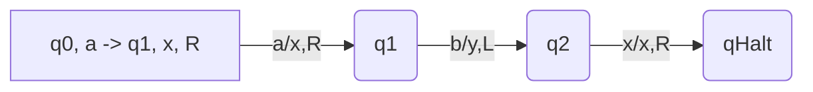
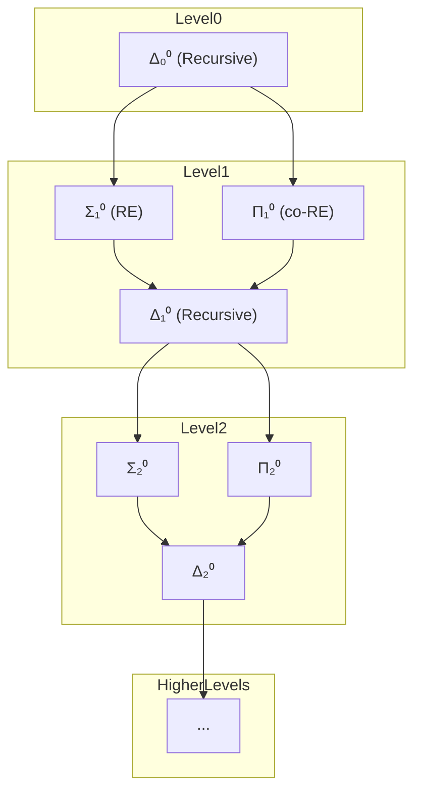
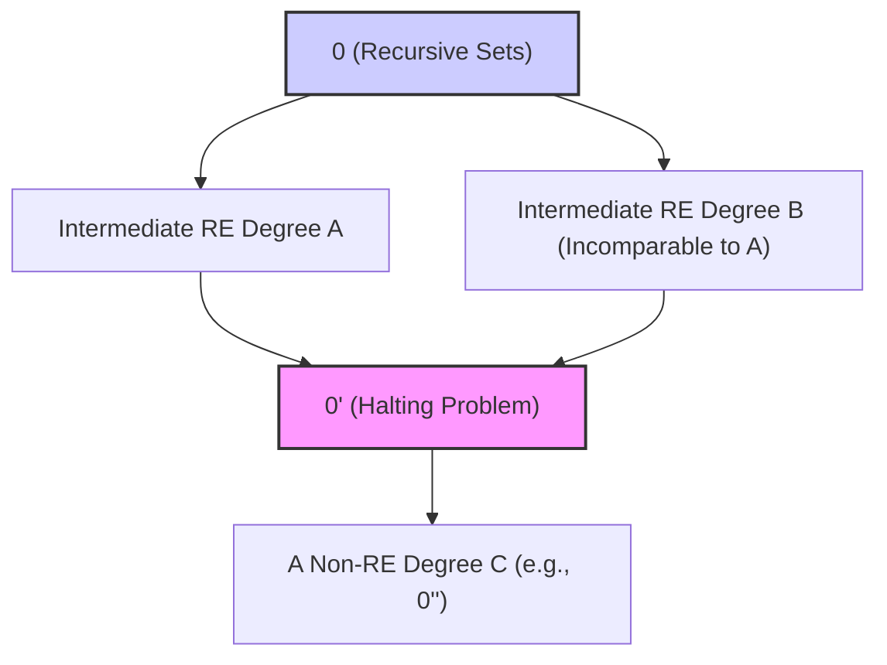

# 递归论-可计算性理论：基础、结构与批判

## 目录

- [递归论-可计算性理论：基础、结构与批判](#递归论-可计算性理论基础结构与批判)
  - [目录](#目录)
  - [1. 引论与基础假设](#1-引论与基础假设)
    - [1.1 递归论的范畴](#11-递归论的范畴)
    - [1.2 核心基础假设](#12-核心基础假设)
  - [2. 核心概念与定义](#2-核心概念与定义)
    - [2.1 计算模型：图灵机 (Turing Machine)](#21-计算模型图灵机-turing-machine)
      - [2.1.1 图灵机的组成](#211-图灵机的组成)
      - [2.1.2 图灵机的运作](#212-图灵机的运作)
    - [2.2 可计算函数：递归函数](#22-可计算函数递归函数)
      - [2.2.1 初始函数](#221-初始函数)
      - [2.2.2 构造规则：组合、原始递归、μ-递归](#222-构造规则组合原始递归μ-递归)
        - [1. 组合 (Composition)](#1-组合-composition)
        - [2. 原始递归 (Primitive Recursion)](#2-原始递归-primitive-recursion)
        - [3. μ-递归 (Minimization or μ-operator)](#3-μ-递归-minimization-or-μ-operator)
    - [2.3 可判定性与可枚举性](#23-可判定性与可枚举性)
      - [2.3.1 判定问题 (Decision Problem)](#231-判定问题-decision-problem)
      - [2.3.2 可判定/递归集 (Decidable/Recursive Set)](#232-可判定递归集-decidablerecursive-set)
      - [2.3.3 可识别/递归可枚举集 (Recognizable/Recursively Enumerable Set)](#233-可识别递归可枚举集-recognizablerecursively-enumerable-set)
    - [2.4 Church-Turing 论题](#24-church-turing-论题)
    - [2.5 Gödel 编码与通用图灵机](#25-gödel-编码与通用图灵机)
      - [2.5.1 **Gödel 编码 (Gödel Numbering)**](#251-gödel-编码-gödel-numbering)
      - [2.5.2 **通用图灵机 (Universal Turing Machine, UTM)**](#252-通用图灵机-universal-turing-machine-utm)
    - [2.6 问题归约 (Reducibility)](#26-问题归约-reducibility)
      - [2.6.1 **多一归约 (Many-one Reducibility, (\\le\_m))**](#261-多一归约-many-one-reducibility-le_m)
      - [2.6.2  **图灵归约 (Turing Reducibility, (\\le\_T))**](#262--图灵归约-turing-reducibility-le_t)
  - [3. 重要定理与核心证明思想](#3-重要定理与核心证明思想)
    - [3.1 计算模型的等价性](#31-计算模型的等价性)
    - [3.2 停机问题 (Halting Problem) 的不可判定性](#32-停机问题-halting-problem-的不可判定性)
    - [核心证明思想 (对角论证法)（补充细节和类比）](#核心证明思想-对角论证法补充细节和类比)
    - [3.3 Rice 定理](#33-rice-定理)
    - [3.4 Post 定理](#34-post-定理)
    - [3.5 Kleene 递归定理 (不动点定理)](#35-kleene-递归定理-不动点定理)
  - [4. 层次结构](#4-层次结构)
    - [4.1 算术层级 (Arithmetical Hierarchy)](#41-算术层级-arithmetical-hierarchy)
    - [4.2 图灵度 (Turing Degrees)](#42-图灵度-turing-degrees)
  - [5. 知识的层次与关联](#5-知识的层次与关联)
  - [6. 综合论述：意义与影响](#6-综合论述意义与影响)
    - [6.1 计算的绝对边界](#61-计算的绝对边界)
    - [6.2 对计算机科学的影响](#62-对计算机科学的影响)
    - [6.3 与数理逻辑的关联 (Gödel 不完备性定理)](#63-与数理逻辑的关联-gödel-不完备性定理)
  - [7. 批判性分析与展望](#7-批判性分析与展望)
    - [7.1 图灵模型的局限性](#71-图灵模型的局限性)
    - [7.2 Church-Turing 论题的地位](#72-church-turing-论题的地位)
    - [7.3 可计算性与计算复杂性](#73-可计算性与计算复杂性)
    - [7.4 超越经典计算？](#74-超越经典计算)
  - [8. 总结](#8-总结)
  - [9. 思维导图](#9-思维导图)

---

## 1. 引论与基础假设

### 1.1 递归论的范畴

递归论 (Recursion Theory)，或称可计算性理论 (Computability Theory)，
是数理逻辑的一个分支，主要研究函数的可计算性以及不可解问题的层级。
它试图精确定义“算法”或“有效计算”的概念，并探索哪些问题是原则上可以被算法解决的，哪些是不能的。

### 1.2 核心基础假设

1. **计算的离散性与确定性**：计算过程被视为在一系列离散步骤中对符号进行操作，每一步的结果都是由当前状态和输入唯一确定的。
2. **算法的有限描述**：任何算法本身都可以用有限的符号串来精确描述。
3. **机械性**：计算过程不需要智慧或顿悟，可以由一台遵循固定规则的机器来执行。
4. **(隐式) Church-Turing 论题**：虽然本身是一个论题而非公理，但它构成了可计算性理论的基石，即任何直觉上可有效计算的函数都是图灵可计算的（或等价地，μ-递归的）。

---

## 2. 核心概念与定义

### 2.1 计算模型：图灵机 (Turing Machine)

阿兰·图灵于1936年提出的一种抽象计算模型，旨在形式化“算法”的概念。

#### 2.1.1 图灵机的组成

一个图灵机 \(M\) 通常由一个七元组定义：\(M = (Q, \Sigma, \Gamma, \delta, q_0, B, F)\)

- \(Q\)：一个有限的状态集合。
- \(\Sigma\)：输入符号的有限集合（不包含空白符）。
- \(\Gamma\)：带符号的有限集合，\(\Sigma \subseteq \Gamma\)。
- \(\delta\)：转移函数，\(\delta: Q \times \Gamma \rightarrow Q \times \Gamma \times \{L, R, S\}\)。它根据当前状态和读头下的符号，决定下一状态、要写入的符号以及读头的移动方向（左L、右R、或停S）。
- \(q_0 \in Q\)：初始状态。
- \(B \in \Gamma \setminus \Sigma\)：空白符号。
- \(F \subseteq Q\)：接受状态（或停机状态）的集合。

#### 2.1.2 图灵机的运作

图灵机拥有一条无限长的纸带，划分为单元格，每个单元格可存储一个带符号。
一个读写头可以在纸带上左右移动，读取和写入符号。
机器根据当前状态和读头所指符号，通过转移函数改变状态、写入符号并移动读头。
当机器进入接受状态时，计算停止并接受输入；
若进入拒绝状态或某些定义下永不进入停机状态，则拒绝输入或永不停机。

-**图示：简化的图灵机状态转移示例**



-*(注：这只是一个示意图，并非完整TM定义)*

### 2.2 可计算函数：递归函数

递归函数理论提供了另一种刻画可计算性的方式，它基于从一些基本函数通过特定规则构造更复杂函数。

#### 2.2.1 初始函数

这些初始函数被选为递归函数论的基石，因为它们代表了最基本、最直观的计算操作：

- **零函数** \(Z(x) = 0\)：代表了常数生成的能力，是最简单的输出。
- **后继函数** \(S(x) = x+1\)：代表了基本的算术递增，是构建自然数的基础。
- **投影函数** \(P_i^n(x_1, \dots, x_n) = x_i\)：代表了从一组输入中选择特定一个的能力，是处理多参数函数的基础。

#### 2.2.2 构造规则：组合、原始递归、μ-递归

##### 1. 组合 (Composition)

组合允许我们将已有的计算能力（函数 \(g_i\) 和 \(h\)）像搭积木一样组合起来，形成更复杂的计算流程。
这对应了编程中函数调用的概念：一个函数的输出可以作为另一个函数的输入。

- **例子**：
    假设有原始递归函数 `add(x,y) = x+y` 和 `multiply(x,y) = x*y`。
    我们可以定义一个新函数 `f(a,b,c) = multiply(add(a,b), c)`。
    这里，`g1(a,b,c) = add(a,b)`，`g2(a,b,c) = c` (这是一个投影函数 \(P_3^3\) 经过简单变换)。
    然后 `h(u,v) = multiply(u,v)`。
    所以 `f(a,b,c) = h(g1(a,b,c), g2(a,b,c))`。

##### 2. 原始递归 (Primitive Recursion)

原始递归是定义在自然数上的递归，它包含一个**基本步骤 (base case)** 和一个**递归步骤 (recursive step)**。
这反映了许多算法中通过处理基本情况并将问题规模减小来解决问题的思想。

- **基本步骤** \(f(\vec{x}, 0) = g(\vec{x})\) 定义了当递归参数为0时的函数值。
- **递归步骤** \(f(\vec{x}, y+1) = h(\vec{x}, y, f(\vec{x}, y))\) 定义了如何从 \(f(\vec{x}, y)\) 的值计算出 \(f(\vec{x}, y+1)\) 的值。注意，\(h\) 不仅依赖于 \(\vec{x}\) 和 \(y\)，还依赖于 \(f\) 在前一步的值 \(f(\vec{x}, y)\)。

- **例子：加法的原始递归定义**
    设 `add(x,y)` 为 `x+y`。
  - 基本步骤：`add(x, 0) = x`。这里 \(g(x) = P_1^1(x) = x\)。
  - 递归步骤：`add(x, y+1) = S(add(x,y)) = add(x,y) + 1`。
        这里 \(h(x, y, \text{prev\_val}) = S(\text{prev\_val})\)，其中 \(\text{prev\_val}\) 就是 \(add(x,y)\)。
        更形式化地，\(h(x_1, x_2, x_3) = S(P_3^3(x_1, x_2, x_3))\)。
        所以 `add` 是原始递归函数。

- **阿克曼函数 (Ackermann Function) 作为非原始递归的全可计算函数**：
    阿克曼函数 \(A(m,n)\) 定义如下：
    \[
    A(m,n) =
    \begin{cases}
    n+1 & \text{if } m=0 \\
    A(m-1, 1) & \text{if } m>0 \text{ and } n=0 \\
    A(m-1, A(m, n-1)) & \text{if } m>0 \text{ and } n>0
    \end{cases}
    \]
    这个函数对于所有非负整数 \(m, n\) 都有定义（即是全函数）并且是直觉上可计算的（可以用算法算出其值）。然而，可以证明它不是原始递归函数，因为它增长得比任何原始递归函数都快。这表明原始递归函数的集合虽然强大，但并不包含所有直觉上可计算的全函数。

##### 3. μ-递归 (Minimization or μ-operator)

μ-算子引入了**无界搜索 (unbounded search)** 的能力。
它允许我们寻找满足特定条件 \(g(\vec{x}, y) = 0\) 的最小的 \(y\)。
这种搜索可能是无限的，如果找不到这样的 \(y\)，或者在找到之前 \(g\) 无定义，那么由μ-算子定义的函数 \(f\) 也就无定义。
正是这个无界搜索的特性，使得μ-递归函数能够表达那些可能不会停机的计算，从而超越了原始递归函数（它们总是停机的）。

- **与原始递归的区别**：原始递归中的循环次数是由输入参数预先确定的（递归深度等于某个输入值）。而μ-递归的搜索次数 (即找到的 \(y\) 的值) 没有先验的上界。
- **部分函数 (Partial Functions)**：μ-算子的引入使得递归函数理论可以自然地处理部分函数（即并非对所有输入都有定义的函数），这与图灵机可能永不停机的情况相对应。
- **例子：不安全的除法**
    考虑函数 `unsafe_divide_by_zero_check(a, b, y)`，如果 `y*b == a` 则返回0，否则返回1。
    我们可以定义 `quotient(a,b) = \mu y [ (a < y*b) \lor ((a \ge y*b) \land \neg(a = y*b)) \text{ simplified check for } a = y*b ]`。
    更简单地，设 \(g(a,b,y) = \text{is_equal}(a, \text{multiply}(y,b))\) 返回0如果相等，1如果不等。
    则 `quotient(a,b) = \mu y [ \text{is_equal}(a, \text{multiply}(y,b)) = 0 ]`。
    如果 \(b=0\) 且 \(a \ne 0\)，则永远找不到这样的 \(y\)，`quotient(a,0)` 无定义（除非我们对 \(g\) 做特殊处理）。

**μ-递归函数与图灵可计算函数的等价性**：

这是递归论中的一个核心结果：一个函数是μ-递归的当且仅当它是图灵可计算的。
这为 Church-Turing 论题提供了强有力的支持，因为它表明两种截然不同的计算形式化方法（基于机器的图灵机和基于函数构造的递归函数）定义了完全相同的可计算函数类。

### 2.3 可判定性与可枚举性

#### 2.3.1 判定问题 (Decision Problem)

一个判定问题通常是指一个可以对每个输入回答“是”或“否”的问题。
例如，“给定的自然数是否为素数？”

#### 2.3.2 可判定/递归集 (Decidable/Recursive Set)

一个集合 \(S\)（通常是自然数集 \(\mathbb{N}\) 的子集，或某个字母表 \(\Sigma^*\) 上的语言）被称为**可判定的**或**递归的**，如果存在一个图灵机 \(M\)，对于任何输入 \(x\)：

- 如果 \(x \in S\)，则 \(M\) 停机并接受。
- 如果 \(x \notin S\)，则 \(M\) 停机并拒绝。
换句话说，存在一个总停机的算法来决定 \(x\) 是否属于 \(S\)。其特征函数是可计算的。

#### 2.3.3 可识别/递归可枚举集 (Recognizable/Recursively Enumerable Set)

一个集合 \(S\) 被称为**可识别的**或**递归可枚举的 (RE)**，如果存在一个图灵机 \(M\)，对于任何输入 \(x\)：

- 如果 \(x \in S\)，则 \(M\) 停机并接受。
- 如果 \(x \notin S\)，则 \(M\) 或者停机并拒绝，或者永不停机。
等价地，一个集合是 RE 的，当且仅当它是某个图灵机接受的语言，或者它是某个递归函数的定义域，或者它是某个递归函数的陪域（如果集合非空）。
也等价于，存在一个算法可以枚举出 \(S\) 中的所有元素（如果 \(S\) 是无限的，枚举过程永不停止）。

### 2.4 Church-Turing 论题

这是一个关于可计算函数本质的论题（或称假说），它声称：
**任何在直觉意义上可有效计算的函数（或可被算法解决的问题）都是图灵可计算的（等价地，μ-递归的，或λ-可定义的等）。**
这个论题不能被数学证明，因为它联系了数学形式定义与直觉概念。
但它得到了广泛的经验支持：
所有已知的、被认为是“算法”的计算过程都已被证明可以用图灵机模拟，
且所有被提出的、看似合理的计算模型都被证明与图灵机等价或弱于图灵机。

### 2.5 Gödel 编码与通用图灵机

#### 2.5.1 **Gödel 编码 (Gödel Numbering)**

可以将任何图灵机 \(M\)（及其程序 \(\delta\)）编码为一个唯一的自然数 \(e = \langle M \rangle\)。
类似地，输入串也可以编码为自然数。这使得我们可以讨论“以图灵机为输入的图灵机”。

**意义与重要性**：

1. **计算对象化**：Gödel 编码使得图灵机（作为一种计算过程的描述）本身可以被视为数据，从而可以被其他图灵机处理。这是可计算性理论中进行自指和构造通用计算模型的关键一步。
2. **枚举图灵机**：通过将每个图灵机映射到一个自然数，我们可以“列举”所有的图灵机（尽管是无限的列表），例如 \(M_0, M_1, M_2, \dots\)，其中 \(M_e\) 是 Gödel 数为 \(e\) 的图灵机。
3. **元数学的基础**：这种编码思想源于 Gödel 在其不完备性定理中的工作，他将逻辑公式和证明编码为自然数，从而可以用算术来讨论元数学性质。

**编码方式的概要**（不追求具体实现，强调思想）：
一种可能的编码方式是将图灵机的七元组 \((Q, \Sigma, \Gamma, \delta, q_0, B, F)\) 中的每个组成部分都编码为数字或特定格式的字符串，然后将这些编码组合起来形成一个大的数字。

- 状态 \(Q = \{q_0, q_1, \dots, q_k\}\) 可以用数字 \(0, 1, \dots, k\) 表示。
- 符号 \(\Sigma, \Gamma\) 中的每个符号也可以映射到数字。
- 转移函数 \(\delta(q_i, X_j) = (q_k, X_l, D_m)\) 的每条规则可以编码为一个元组（如 `(i, j, k, l, m)`，其中 \(D_m\) 代表移动方向）。整个转移函数就是这些元组的列表。
- 最后，将这些数字序列通过某种方式（例如，用素数幂次或者配对函数）组合成一个唯一的自然数。

重要的是存在这样一种系统性的编码和解码方法，而不是编码的具体细节。

#### 2.5.2 **通用图灵机 (Universal Turing Machine, UTM)**

存在一个特殊的图灵机 \(U\)，它能够模拟任何其他图灵机 \(M\) 在任何输入 \(w\) 上的行为。

\(U\) 以 \(\langle M \rangle\) 和 \(w\) 作为输入，其输出与 \(M\) 在 \(w\) 上的输出相同（包括停机或不停机）。
UTM 的存在是现代计算机“存储程序”概念的理论基础。

**构造思想概要**：
一个通用图灵机 \(U\) 通常需要至少三条带（或者用技巧在单带上模拟多带）：

1. **程序带 (Program Tape)**：存储被模拟图灵机 \(M\) 的描述 \(\langle M \rangle\)。
2. **数据带 (Data Tape)**：模拟 \(M\) 的工作带，存储 \(M\) 的输入 \(w\) 以及 \(M\) 在计算过程中的纸带内容。
3. **状态带 (State Tape)**：记录 \(M\) 的当前模拟状态。

\(U\) 的运作流程大致如下：

1. **初始化**：将 \(\langle M \rangle\) 复制到程序带，将 \(w\) 复制到数据带，将 \(M\) 的初始状态 \(q_0\) 记录在状态带。
2. **模拟循环**：
    a.  \(U\) 查看状态带以获取 \(M\) 的当前状态 \(q_{current}\)。
    b.  \(U\) 查看数据带上 \(M\) 的读写头位置的符号 \(s_{current}\)。
    c.  \(U\) 在程序带上查找 \(\langle M \rangle\) 中对应于 \((q_{current}, s_{current})\) 的转移规则 \(\delta_M(q_{current}, s_{current}) = (q_{next}, s_{new}, \text{Direction})\)。
    d.  \(U\) 更新状态带为 \(q_{next}\)。
    e.  \(U\) 在数据带上将 \(s_{current}\) 修改为 \(s_{new}\)。
    f.  \(U\) 根据 \(\text{Direction}\) 移动数据带上的模拟读写头。
3. **停机条件**：如果 \(M\) 进入一个停机状态（接受或拒绝），\(U\) 也停机并给出相应的结果。如果 \(M\) 永不停机，\(U\) 也永不停机。

**UTM 的深刻意义**：

- **软件的诞生**：
UTM 的概念是现代计算机中“存储程序计算机”的理论基础。
计算机硬件（相当于 \(U\)）是固定的，但可以通过加载不同的程序（相当于 \(\langle M \rangle\)）来执行不同的任务。
这意味着我们不需要为每个新任务都制造一台新的物理机器。
- **可计算性的统一视图**：
UTM 证明了存在一种“万能”的计算设备，其计算能力与其他所有图灵机一样强大。

### 2.6 问题归约 (Reducibility)

归约是一种形式化“问题A不比问题B更难”的技术。
归约是将一个问题的求解转化为另一个问题的求解的过程。
如果问题 \(A\) 可以归约到问题 \(B\)，并且我们知道如何解决 \(B\)，那么我们也就知道了如何解决 \(A\)。

在可计算性理论中，它主要用来传递不可判定性：
    如果 \(A\) 不可判定且 \(A \le_X B\) (其中 \(X\) 是某种归约类型)，
    那么 \(B\) 通常也不可判定（对于某些归约类型需要 \(B\) 的解能反过来帮助 \(A\)）。

#### 2.6.1 **多一归约 (Many-one Reducibility, \(\le_m\))**

如果存在一个全可计算函数 \(f\)，使得对于所有 \(x\)，\(x \in A \iff f(x) \in B\)，则称问题 \(A\) 可多一归约为问题 \(B\)，记作 \(A \le_m B\)。
这意味着如果 \(B\) 是可判定的，则 \(A\) 也是可判定的。

**例子：从 \(A_{TM}\) 到 \(HALT_{TM}\)**

- \(A_{TM} = \{ \langle M, w \rangle \mid M \text{ is a TM and } M \text{ accepts } w \}\) (接受问题)
- \(HALT_{TM} = \{ \langle M, w \rangle \mid M \text{ is a TM and } M \text{ halts on input } w \}\) (停机问题)
我们知道 \(A_{TM}\) 是不可判定的。我们要证明 \(A_{TM} \le_m HALT_{TM}\)。
构造一个函数 \(f(\langle M, w \rangle) = \langle M', w' \rangle\) 如下：
给定 \(\langle M, w \rangle\)，构造一个新的图灵机 \(M'\)。
\(M'\) 在任何输入 \(x\) 上执行以下操作：

1. 模拟 \(M\) 在输入 \(w\) 上运行。
2. 如果 \(M\) 接受 \(w\)，则 \(M'\) 接受 \(x\) (例如，进入接受状态并停机)。
3. 如果 \(M\) 拒绝 \(w\) (停机但拒绝)，则 \(M'\) 进入一个无限循环。
4. 如果 \(M\) 在 \(w\) 上永不停机，则 \(M'\) 也永不停机（因为模拟 \(M\) 的过程不会结束）。
现在，我们让 \(w'\) 是任何一个固定的串，例如空串 \(\epsilon\)。所以 \(f(\langle M, w \rangle) = \langle M', \epsilon \rangle\)。

分析这个归约：

- 如果 \(\langle M, w \rangle \in A_{TM}\) (即 \(M\) 接受 \(w\))：
    那么 \(M'\) 在任何输入（包括 \(\epsilon\)）上，会先模拟 \(M\) 在 \(w\) 上（这会停机并接受），然后 \(M'\) 也会停机并接受。
    所以 \(\langle M', \epsilon \rangle \in HALT_{TM}\) (因为 \(M'\) 在 \(\epsilon\) 上停机)。
- 如果 \(\langle M, w \rangle \notin A_{TM}\) (即 \(M\) 不接受 \(w\)，可能是拒绝或永不停机)：
- 如果 \(M\) 拒绝 \(w\) (停机但拒绝)：\(M'\) 将进入无限循环，所以在 \(\epsilon\) 上不停机。
- 如果 \(M\) 在 \(w\) 上永不停机：\(M'\) 也将永不停机，所以在 \(\epsilon\) 上不停机。
    在任何一种情况下，如果 \(M\) 不接受 \(w\)，则 \(\langle M', \epsilon \rangle \notin HALT_{TM}\)。
    (这里我们需要稍微调整 \(M'\) 的构造，使其在 \(M\) 不接受 \(w\) 时确保 \(M'\) 停机但拒绝，或者 \(M\) 在 \(w\) 上停机（无论接受与否）时 \(M'\) 能停机，而 \(M\) 在 \(w\) 上永不停机时 \(M'\) 才永不停机。一个更标准的归约是从 \(A_{TM}\) 到 \(HALT_{TM}\) 的函数 \(f(\langle M,w \rangle) = \langle M_w, w \rangle\)，其中 \(M_w\) 的行为如下：当输入为 \(x\) 时，\(M_w\) 先模拟 \(M(w)\)，如果 \(M(w)\) 接受，则 \(M_w\) 接受 \(x\)；如果 \(M(w)\) 拒绝或循环，则 \(M_w\) 循环。这样，\(\langle M,w \rangle \in A_{TM} \iff \langle M_w, w \rangle \in HALT_{TM}\) 因为 \(M_w\) 只有在 \(M(w)\) 接受时才会对所有输入停机。这仍然有些复杂。

一个更直接的归约可能是从 \(A_{TM}\) 到 \(HALT_{TM}\)：
构造 \(f(\langle M, w \rangle) = \langle M'_H, w \rangle\)，其中 \(M'_H\) 的定义如下：
\(M'_H\) 对输入 \(x\)：

1. 运行 \(M\) 在 \(w\) 上。
2. 如果 \(M\) 接受 \(w\)，则 \(M'_H\) 停机。
3. 如果 \(M\) 拒绝 \(w\)，则 \(M'_H\) 进入无限循环。
4. 如果 \(M\) 在 \(w\) 上循环，则 \(M'*H\) 也循环。
这样，\(M\) 接受 \(w \iff M'*H\) 在任何输入（例如 \(w\)）上停机。
所以，\(\langle M, w \rangle \in A*{TM} \iff f(\langle M, w \rangle) = \langle M'*H, w \rangle \in HALT*{TM}\)。
这个 \(f\) 是全可计算的。既然 \(A*{TM}\) 不可判定，则 \(HALT_{TM}\) 也不可判定。
*(注意：标准证明通常是从 \(HALT_{TM}\) 到 \(A_{TM}\) 或者直接证明 \(A_{TM}\) 不可判定。上面这个例子是为了说明归约思想，但实际构造可能需要更严谨。一个经典的归约是 \(A_{TM} \le_m L_u = \{ \langle M \rangle \# w \mid M \text{ accepts } w \}\)，而 \(L_u\) 与 \(A_{TM}\) 本质是同一个问题。)*

#### 2.6.2  **图灵归约 (Turing Reducibility, \(\le_T\))**

如果存在一个带有“神谕” (oracle) \(B\) 的图灵机 \(M^B\) 能够判定 \(A\)，则称 \(A\) 可图灵归约为 \(B\)，记作 \(A \le_T B\)。
神谕 \(B\) 可以在一步内回答关于 \(B\) 的成员性问题。这是更一般的归约概念。

图灵归约更强大，它允许判定 \(A\) 的图灵机在计算过程中多次“查询”关于 \(B\) 的成员性问题，并将这些查询的答案用于其后续计算。
这就像拥有一个子程序或一个外部专家（神谕）可以立即回答关于 \(B\) 的问题。

**与多一归约的区别**：

- **查询次数**：多一归约只进行一次转换 \(f(x)\) 并查询 \(f(x) \in B\)。图灵归约可以进行多次查询。
- **信息使用**：多一归约的最终答案完全依赖于 \(f(x) \in B\)。图灵归约可以使用神谕的答案来指导其自身的复杂计算流程。
- **对称性**：多一归约是非对称的。图灵归约如果 \(A \le_T B\) 且 \(B \le_T A\)，则 \(A\) 和 \(B\) 属于同一个图灵度。

**例子**：判定一个集合是否是 RE 且 co-RE (即是否递归)。
令 \(L\) 是一个语言。
问题 \(A\): "L 是否是递归的?"
问题 \(B_1\): "\(L\) 是否是 RE?"
问题 \(B_2\): "\(L^c\) 是否是 RE?"
根据 Post 定理，\(L\) 是递归的 \(\iff\) \(L\) 是 RE 且 \(L^c\) 是 RE。
我们可以构造一个图灵机，它有一个神谕可以判定 \(X \in RECOMP\)，其中 \(RECOMP\) 是所有 RE 语言的 Gödel 数集合。
要判定 \(A\)，机器可以查询神谕 \(\langle L \rangle \in RECOMP?\) 和 \(\langle L^c \rangle \in RECOMP?\)
如果两者都为真，则 \(L\) 是递归的。
这里的神谕调用比简单的多一归约更复杂。

---

## 3. 重要定理与核心证明思想

### 3.1 计算模型的等价性

**定理**：以下计算模型在计算能力上是等价的：

- 确定性图灵机
- 多带图灵机
- 非确定性图灵机（对于判定/识别任务）
- μ-递归函数
- λ-演算
- 寄存器机 (RAM Machine) 等

**核心思想**：通过构造性证明，展示一个模型如何模拟另一个模型。
例如，可以用单带图灵机模拟多带图灵机（代价是时间和空间效率的降低）；
μ-递归函数可以由图灵机计算，反之图灵机的计算过程也可以用μ-递归函数来描述。

### 3.2 停机问题 (Halting Problem) 的不可判定性

**定理 (Turing, 1936)**：不存在一个图灵机 \(H\) 能够对于任意给定的图灵机 \(M\) 的描述 \(\langle M \rangle\) 和任意输入 \(w\)，判定 \(M\) 在输入 \(w\) 上是否停机。
停机问题 \(HALT_{TM} = \{ \langle M, w \rangle \mid M \text{ is a TM and } M \text{ halts on input } w \}\) 是递归可枚举的，但不是递归的（即不可判定的）。

**核心证明思想 (对角论证法)**：

1. **假设存在这样的判定器 \(H\)**：\(H(\langle M \rangle, w)\) 如果 \(M\) 在 \(w\) 上停机则输出“是”，否则输出“否”。
2. **构造一个新的图灵机 \(D\)**：\(D\) 以一个图灵机的描述 \(\langle M \rangle\) 作为输入。
    - \(D\) 调用 \(H\) 来判定 \(M\) 在其自身的描述 \(\langle M \rangle\) 上是否停机，即 \(H(\langle M \rangle, \langle M \rangle)\)。
    - 如果 \(H\) 输出“是”（即 \(M\) 在 \(\langle M \rangle\) 上停机），则 \(D\) 进入一个无限循环。
    - 如果 \(H\) 输出“否”（即 \(M\) 在 \(\langle M \rangle\) 上不停机），则 \(D\) 停机。
3. **考虑 \(D\) 在其自身的描述 \(\langle D \rangle\) 上的行为**：
    - 如果 \(D\) 在 \(\langle D \rangle\) 上停机：根据 \(D\) 的定义，这意味着 \(H(\langle D \rangle, \langle D \rangle)\) 输出“否”，即 \(D\) 在 \(\langle D \rangle\) 上不停机。矛盾。
    - 如果 \(D\) 在 \(\langle D \rangle\) 上不停机：根据 \(D\) 的定义，这意味着 \(H(\langle D \rangle, \langle D \rangle)\) 输出“是”，即 \(D\) 在 \(\langle D \rangle\) 上停机。矛盾。
4. 由于无论哪种情况都会导致矛盾，所以最初的假设——存在判定器 \(H\)——必定是错误的。因此，停机问题是不可判定的。

### 核心证明思想 (对角论证法)（补充细节和类比）

对角论证法最初由康托尔用来证明实数比自然数多。
在停机问题的证明中，其精髓在于构造一个“反例”性质的图灵机 \(D\)，这个 \(D\) 的行为与其在假设的判定器 \(H\) 下的“预测”行为相反。

**更详细的步骤和解释：**

1. **列表化所有图灵机和输入**：
    由于每个图灵机 \(\langle M \rangle\) 和每个输入 \(w\) 都可以编码为自然数（或字符串），我们可以想象一个无限的二维表格。行代表所有可能的图灵机 \(M_1, M_2, M_3, \dots\)，列代表所有可能的输入 \(w_1, w_2, w_3, \dots\)。表格的第 \(i\) 行第 \(j\) 列的单元格可以记录 \(M_i\) 在输入 \(w_j\) 上是否停机。

    | | \(w_1 (\approx \langle M_1 \rangle)\) | \(w_2 (\approx \langle M_2 \rangle)\) | \(w_3 (\approx \langle M_3 \rangle)\) | ... |
    | :---- | :----: | :----: | :----: | :----: |
    | \(M_1\) |  \(H(M_1, w_1)\) | \(H(M_1, w_2)\) | \(H(M_1, w_3)\) | ... |
    | \(M_2\)   | \(H(M_2, w_1)\) | \(H(M_2, w_2)\)  | \(H(M_2, w_3)\) | ... |
    | \(M_3\)   | \(H(M_3, w_1)\) | \(H(M_3, w_2)\)  | \(H(M_3, w_3)\) | ... |
    | ... | ... | ... | ... | ... |

    ```*(这里的 \(w_i\) 被简化为约等于 \(\langle M_i \rangle\)，以对应证明中 \(M\) 在其自身描述上运行的情况)*```

2. **判定器 \(H\) 的角色**：
    如果停机问题可判定，那么存在一个图灵机 \(H(\langle M \rangle, w)\) 可以正确地填满上面表格中的每一项（填“停机”或“不停机”）。

3. **构造图灵机 \(D\)**：
    我们现在构造一个特殊的图灵机 \(D\)。当 \(D\) 以某个图灵机的描述 \(\langle M_i \rangle\) 作为输入时，它的行为如下：
    - 首先，\(D\) 使用假设的判定器 \(H\) 来查询 \(M_i\) 在其自身的描述 \(\langle M_i \rangle\) 上是否停机。即，\(D\) 计算 \(H(\langle M_i \rangle, \langle M_i \rangle)\)。这对应于查看上述表格的对角线元素 \(H(M_i, w_i)\) (其中 \(w_i \approx \langle M_i \rangle\))。
    - 然后，\(D\) 故意做与 \(H\) 的“预测”相反的事情：
        - 如果 \(H(\langle M_i \rangle, \langle M_i \rangle)\) 输出“停机”，则 \(D\) 使自己进入一个无限循环（即 \(D\) 在输入 \(\langle M_i \rangle\) 上**不停机**）。
        - 如果 \(H(\langle M_i \rangle, \langle M_i \rangle)\) 输出“不停机”，则 \(D\) 立刻停机（即 \(D\) 在输入 \(\langle M_i \rangle\) 上**停机**）。

4. **\(D\) 作为一个图灵机，它本身也应该在列表中**：
    既然 \(D\) 是一个图灵机，那么它必然对应于列表中的某一行，比如说 \(D \equiv M_k\) 对于某个 \(k\)。它的描述就是 \(\langle D \rangle\) 或 \(\langle M_k \rangle\)。

5. **考察 \(D\) 在其自身描述 \(\langle D \rangle\) 上的行为 (矛盾点)**：
    现在我们问：图灵机 \(D\) 在输入其自身的描述 \(\langle D \rangle\) 时，是停机还是不停机？
    - **情况1：假设 \(D\) 在输入 \(\langle D \rangle\) 时停机。**
        根据 \(D\) 的构造（第二条规则）：\(D\) 停机 \(\implies H(\langle D \rangle, \langle D \rangle)\) 必须输出“不停机”。
        但 \(H\) 是一个（假设存在的）正确的停机判定器，如果它对 \(\langle D \rangle, \langle D \rangle\) 输出“不停机”，那就意味着 \(D\) 在输入 \(\langle D \rangle\) 时确实应该不停机。
        这与我们的初始假设“\(D\) 在输入 \(\langle D \rangle\) 时停机”相矛盾。

    - **情况2：假设 \(D\) 在输入 \(\langle D \rangle\) 时不停机。**
        根据 \(D\) 的构造（第一条规则）：\(D\) 不停机 \(\implies H(\langle D \rangle, \langle D \rangle)\) 必须输出“停机”。
        但 \(H\) 是一个（假设存在的）正确的停机判定器，如果它对 \(\langle D \rangle, \langle D \rangle\) 输出“停机”，那就意味着 \(D\) 在输入 \(\langle D \rangle\) 时确实应该停机。
        这与我们的初始假设“\(D\) 在输入 \(\langle D \rangle\) 时不停机”相矛盾。

6. **结论**：
    无论我们假设 \(D\) 在其自身描述 \(\langle D \rangle\) 上是停机还是不停机，都会导出逻辑矛盾。这种矛盾源于我们最初的假设——存在一个能够判定所有停机情况的图灵机 \(H\)。因此，这个假设必须是错误的。
    所以，停机问题是不可判定的。

**对角论证的直观理解**：
想象 \(D\) 是一个“唱反调者”。它看着 \(H\) 对其他机器在“照镜子”（即输入自身描述）时的行为预测，然后故意做出相反的行为。当轮到 \(D\) 自己“照镜子”时，如果 \(H\) 预测 \(D\) 会停机，\(D\) 就选择不停机；如果 \(H\) 预测 \(D\) 会不停机，\(D\) 就选择停机。这使得 \(H\) 无法对 \(D\) 的这种特定行为做出正确的、无矛盾的预测。由于 \(H\) 被假设为对所有情况都正确，这就暴露了 \(H\) 不可能存在。

### 3.3 Rice 定理

**定理 (Rice, 1951)**：任何关于图灵机所识别的语言的**非平凡**属性都是不可判定的。
“非平凡”属性是指：存在某个 RE 语言具有该属性，且存在某个 RE 语言不具有该属性。
“语言的属性”是指该属性仅依赖于语言本身，而不依赖于识别该语言的图灵机的具体实现。

**核心证明思想 (归约自停机问题)**：

1. 令 \(P\) 是一个关于 RE 语言的非平凡属性。
2. 不失一般性，假设空语言 \(\emptyset\) 不具有属性 \(P\)。(如果 \(\emptyset\) 具有 \(P\)，则考虑其补属性 \(\neg P\)，它也是非平凡的且 \(\emptyset\) 不具有 \(\neg P\)。)
3. 因为 \(P\) 非平凡，所以存在一个 RE 语言 \(L_P \ne \emptyset\) 具有属性 \(P\)。设 \(M_P\) 是识别 \(L_P\) 的图灵机。
4. 我们要从停机问题 \(HALT_{TM}\) 归约到判定属性 \(P\) 的问题。即，给定 \(\langle M, w \rangle\)，我们要构造一个图灵机 \(M'\) 使得：
    - \(M\) 在 \(w\) 上停机 \(\iff\) \(L(M')\) 具有属性 \(P\)。
5. 构造 \(M'\) 如下：对于输入 \(x\)，
    - 首先，\(M'\) 模拟 \(M\) 在 \(w\) 上的执行。
    - 如果 \(M\) 在 \(w\) 上停机，则 \(M'\) 接着模拟 \(M_P\) 在 \(x\) 上的执行。若 \(M_P\) 接受 \(x\)，则 \(M'\) 接受 \(x\)。
    - 如果 \(M\) 在 \(w\) 上不停机，则 \(M'\) 也永不停机（因此 \(L(M') = \emptyset\)）。
6. 分析 \(L(M')\)：
    - 如果 \(M\) 在 \(w\) 上停机，则 \(L(M') = L(M_P) = L_P\)，它具有属性 \(P\)。
    - 如果 \(M\) 在 \(w\) 上不停机，则 \(L(M') = \emptyset\)，它不具有属性 \(P\)。
7. 因此，如果能判定 \(L(M')\) 是否具有属性 \(P\)，就能判定 \(M\) 在 \(w\) 上是否停机。由于停机问题不可判定，所以判定属性 \(P\) 也是不可判定的。

-**更具体的例子理解“非平凡属性”和“语言的属性”**

1. **“语言的属性”**：
    - **是语言的属性**：
        - "该语言是否为空？" (\(L(M) = \emptyset\))
        - "该语言是否包含串 '001'？" (\('001' \in L(M)\))
        - "该语言是否是正则的？"
        - "该语言是否是有限的？"
    - **不是语言的属性 (而是图灵机的属性)**：
        - "该图灵机是否有超过50个状态？"
        - "该图灵机在输入 'abc' 时是否会向左移动纸带头超过10次？"
        - "该图灵机是否在100步内停机？" (这依赖于具体实现，而非语言本身)

2. **“非平凡属性”**：
    - **属性 P1: "语言为空"**
        - 存在一个 RE 语言是空的 (例如，一个立即拒绝所有输入的图灵机 \(M_{rej}\)，\(L(M_{rej}) = \emptyset\))。所以至少有一个语言具有此属性。
        - 存在一个 RE 语言不是空的 (例如，一个接受所有输入的图灵机 \(M_{acc}\)，\(L(M_{acc}) = \Sigma^*\))。所以至少有一个语言不具有此属性。
        因此，"语言为空" 是一个非平凡属性。根据 Rice 定理，它是不可判定的。

    - **属性 P2: "语言包含所有可能的二进制串" (\(L(M) = \{0,1\}^*\))**
        - 存在 RE 语言 \(L(M_{all}) = \{0,1\}^*\)。
        - 存在 RE 语言 \(L(M_{empty}) = \emptyset \ne \{0,1\}^*\)。
        因此，"语言是所有二进制串的集合" 是一个非平凡属性，不可判定。

    - **属性 P3: "语言是图灵机识别的语言"** (即“语言是RE的”)
        - 所有图灵机识别的语言都具有此属性 (根据定义)。
        - 不存在一个图灵机识别的语言不具有此属性。
        因此，这个属性是**平凡的** (所有 RE 语言都具有它)。Rice 定理不适用于此（而且我们知道这个问题是平凡可判定的，答案总是“是”）。

    - **属性 P4: "语言既是有限的又是无限的"**
        - 不存在任何语言（RE 或其他）能同时具有这两个性质。
        因此，这个属性是**平凡的** (没有 RE 语言具有它)。Rice 定理不适用。

**Rice 定理的强大之处**：
它提供了一个非常通用的工具，可以立即判定一大类关于程序行为的问题是不可判定的，而无需为每个问题都单独构造对角论证或归约。
只要我们能确定一个问题是在问关于程序输出集合（语言）的某种非平凡性质，就可以断言它是不可判定的。

### 3.4 Post 定理

**定理 (Post, 1944)**：一个语言 \(L\) 是递归的 (可判定的) 当且仅当 \(L\) 和其补语言 \(L^c = \Sigma^* \setminus L\) 都是递归可枚举的 (RE)。
\(L \in REC \iff (L \in RE \land L^c \in RE)\)

**核心证明思想**：

- **(\(\Rightarrow\))**：如果 \(L\) 是递归的，设 \(M_L\) 是判定 \(L\) 的总停机图灵机。则 \(M_L\) 本身就是一个识别 \(L\) 的图灵机，所以 \(L \in RE\)。构造一个图灵机 \(M_{L^c}\) 如下：对于输入 \(x\)，\(M_{L^c}\) 模拟 \(M_L\) 在 \(x\) 上。如果 \(M_L\) 接受 \(x\)，则 \(M_{L^c}\) 拒绝；如果 \(M_L\) 拒绝 \(x\)，则 \(M_{L^c}\) 接受。由于 \(M_L\) 总停机，\(M_{L^c}\) 也总停机并判定 \(L^c\)，所以 \(L^c \in RE\)。
- **(\(\Leftarrow\))**：如果 \(L \in RE\) 且 \(L^c \in RE\)，设 \(M_1\) 识别 \(L\)，\(M_2\) 识别 \(L^c\)。构造一个新的图灵机 \(M_{REC}\) 如下：对于输入 \(x\)，\(M_{REC}\) 同时（例如，交替地模拟一步）运行 \(M_1\) 在 \(x\) 上和 \(M_2\) 在 \(x\) 上。
  - 由于 \(x\) 要么属于 \(L\) 要么属于 \(L^c\)，所以 \(M_1\) 或 \(M_2\) 中至少有一个会在有限步内停机并接受。
  - 如果 \(M_1\) 停机并接受 \(x\)，则 \(M_{REC}\) 停机并接受 \(x\) (因为 \(x \in L\))。
  - 如果 \(M_2\) 停机并接受 \(x\)，则 \(M_{REC}\) 停机并拒绝 \(x\) (因为 \(x \in L^c\)，即 \(x \notin L\))。
    因此，\(M_{REC}\) 总停机并判定 \(L\)，所以 \(L\) 是递归的。

### 3.5 Kleene 递归定理 (不动点定理)

**定理 (Kleene, 1938)**：
对于任何全可计算函数 \(f: \mathbb{N} \rightarrow \mathbb{N}\)（这里 \(f\) 作用于图灵机的 Gödel 数），存在一个图灵机的 Gödel 数 \(e_0\)（一个“不动点”），使得图灵机 \(M_{e_0}\) 和图灵机 \(M_{f(e_0)}\) 计算相同的函数（即 \(L(M_{e_0}) = L(M_{f(e_0)})\) 或 \(\phi_{e_0} \equiv \phi_{f(e_0)}\)）。

简单来说，存在一个程序 \(e_0\) 使得其行为等同于对其自身描述 \(e_0\) 应用转换 \(f\) 后的程序的行为。
这常被解释为程序可以“引用”其自身的代码。

**核心证明思想 (构造性)**：
该证明通常比较复杂，但其核心思想是构造一个程序 \(P\)，该程序能获取自身的描述，然后将其作为参数传递给函数 \(f\)，并执行 \(f\) 返回的结果程序。
一个简化的版本（s-m-n 定理的应用）：

1. 考虑一个可计算函数 \(g(x, y)\) 其对应的图灵机 \(\phi_{g(x,y)}\) 作用是：先计算 \(\phi_x(x)\)，如果它有定义，则将其结果作为 \(M_{code}\) 运行 \(M_{code}(y)\)。
2. 定义一个函数 \(t(x)\) 为 \(\phi_{\phi_x(x)}\)。
3. 假设存在一个可计算函数 \(s(x,y)\) (来自s-m-n定理) 使得 \(\phi_{s(x,y)}(z) = \phi_x(y,z)\).
4. 构造一个特殊的图灵机 \(M_b\)，它执行以下操作：输入 \(x\)，计算 \(s(x,x)\)，然后将其交给转换函数 \(f\)，即计算 \(f(s(x,x))\)。
5. 设 \(b = \langle M_b \rangle\)。那么 \(\phi_b(x)\) 计算 \(f(s(x,x))\)。
6. 令不动点为 \(e_0 = s(b,b)\)。
7. 那么 \(\phi_{e_0}\) 的行为是 \(\phi_{s(b,b)}\)，这等同于 \(\phi_b(b)\)。
8. 而 \(\phi_b(b)\) 计算 \(f(s(b,b))\)，即 \(f(e_0)\)。
9. 所以，\(\phi_{e_0} \equiv \phi_{f(e_0)}\)。
递归定理是构造自指程序和许多不可判定性证明的基础。

**应用与意义的强调**：

1. **自指程序 (Quines)**：
    一个 Quine 是一个不接受任何输入，但能打印出其自身源代码的程序。Kleene 递归定理可以用来证明 Quine 的存在性。
    令 \(f(\langle P \rangle)\) 是一个函数，它构造一个新程序 \(\langle P' \rangle\)，这个 \(P'\) 的行为是先打印出 \(\langle P \rangle\) 的内容，然后执行 \(P\)。
    根据递归定理，存在一个程序 \(\langle E \rangle\) 使得 \(\phi_E \equiv \phi_{f(\langle E \rangle)}\)。
    这意味着 \(\phi_E\) 的行为是：先打印出 \(\langle E \rangle\)（即打印自身源代码），然后执行 \(E\)。如果我们让 \(E\) 在打印完自身后就停机，那么它就是一个 Quine。
    更准确地说，令 \(Q(x)\) 是一个程序，它打印出 Gödel 数为 \(x\) 的程序的代码。我们希望找到一个程序 \(P\) 使得 \(L(P) = \{\langle P \rangle\}\)。
    考虑一个可计算函数 \(f(x)\) 返回一个程序 \(P_x\) 的 Gödel 数，该程序 \(P_x\) 打印由 \(x\) 所表示的程序代码。即，\(\phi_{f(x)}\) 的行为是打印 \(\phi_x\) 的代码。
    根据递归定理，存在 \(e\) 使得 \(\phi_e \equiv \phi_{f(e)}\)。这个 \(\phi_e\) 就会打印出 \(\phi_e\) 自身的代码。

2. **在不可判定性证明中的应用**：
    递归定理常用于更简洁地构造某些不可判定性证明，尤其是那些涉及到程序能“知道”自身代码的情况。例如，它可以用来给出 Rice 定理的一个不同证明。

3. **理论计算机科学中的构造**：
    在研究程序转换、程序合成和计算学习理论等领域，递归定理提供了一个强大的理论工具，用于分析和构造那些能够引用或修改自身行为的计算过程。

4. **病毒的理论模型**：
    一个计算机病毒的核心特征之一是自复制。递归定理可以被看作是这种自复制行为的一个高度抽象的数学对应。一个程序 \(\phi_e\) 可以通过 \(f\) 产生一个行为上等同于 \(\phi_e\) 的新程序 \(\phi_{f(e)}\)，如果 \(f\) 还包含将 \(\phi_{f(e)}\) 传播到其他地方的指令，这就类似于病毒的复制和传播。

**直观理解**：
递归定理可以被认为是“任何程序都可以被赋予访问其自身源代码（或其 Gödel 数）的能力，而无需改变其原有的功能”。
程序 \(e_0\) 和 \(f(e_0)\) 所代表的图灵机计算相同的函数，意味着你可以把“获取自身代码并将其传递给 \(f\)，然后执行 \(f\) 的结果”这个复杂操作“内置”到一个程序 \(e_0\) 中，而 \(e_0\) 最终的行为就好像它直接是 \(f(e_0)\) 一样。

---

## 4. 层次结构

当证明了某些问题（如停机问题）是不可判定的之后，自然会问：
这些不可判定问题之间是否存在难度的差异？
是否存在一个“更不可判定”的问题？
层次结构就是用来回答这类问题的。

### 4.1 算术层级 (Arithmetical Hierarchy)

算术层级根据定义集合所需的逻辑量词（在自然数上）的复杂性对不可判定问题（特别是数论中的集合）进行分类。
它基于递归谓词。

- **\(\Delta_0^0 = \Sigma_0^0 = \Pi_0^0\)**：递归集（可判定的）。
- **\(\Sigma_1^0\)**：递归可枚举集 (RE)。一个集合 \(S\) 属于 \(\Sigma_1^0\) 当且仅当存在一个递归谓词 \(R(x, y)\) 使得 \(x \in S \iff \exists y R(x, y)\)。
  - 例子：停机问题 \(HALT_{TM}\)。
- **\(\Pi_1^0\)**：补递归可枚举集 (co-RE)。一个集合 \(S\) 属于 \(\Pi_1^0\) 当且仅当存在一个递归谓词 \(R(x, y)\) 使得 \(x \in S \iff \forall y R(x, y)\)。等价地，\(S \in \Pi_1^0 \iff S^c \in \Sigma_1^0\)。
  - 例子：\(NONHALT_{TM}\)（图灵机永不停机问题）。
- **\(\Delta_1^0\)**：\(\Sigma_1^0 \cap \Pi_1^0\)。根据 Post 定理，\(\Delta_1^0\) 就是递归集。
- **\(\Sigma_{n+1}^0\)**：一个集合 \(S\) 属于 \(\Sigma_{n+1}^0\) 当且仅当存在一个 \(\Pi_n^0\) 谓词 \(P(x, y)\) 使得 \(x \in S \iff \exists y P(x, y)\)。
- **\(\Pi_{n+1}^0\)**：一个集合 \(S\) 属于 \(\Pi_{n+1}^0\) 当且仅当存在一个 \(\Sigma_n^0\) 谓词 \(P(x, y)\) 使得 \(x \in S \iff \forall y P(x, y)\)。
- **\(\Delta_{n+1}^0\)**：\(\Sigma_{n+1}^0 \cap \Pi_{n+1}^0\)。

**性质**：

- \(\Delta_n^0 \subseteq \Sigma_n^0\) and \(\Delta_n^0 \subseteq \Pi_n^0\).
- \(\Sigma_n^0 \cup \Pi_n^0 \subseteq \Delta_{n+1}^0\).
- 这个层级是严格的，即 \(\Delta_n^0 \subset \Sigma_n^0\)，\(\Delta_n^0 \subset \Pi_n^0\)，\(\Sigma_n^0 \not\equiv \Pi_n^0\) (for \(n \ge 1\))，且 \(\Sigma_n^0 \cup \Pi_n^0 \subset \Delta_{n+1}^0\)。

-**图示：算术层级**



算术层级是基于**谓词逻辑公式**对自然数集（或等价地，关于自然数的谓词）的复杂性进行分类的。
它关注的是定义一个集合所需的**量词交替 (quantifier alternation)** 的数量。
这里的量词（\(\exists\) - 存在，\(\forall\) -任意）是作用在自然数上的。

**基本构建块**：

- **递归谓词 \(R(x_1, \dots, x_k)\)**：一个谓词，其真假对于给定的输入 \(x_1, \dots, x_k\) 是可以由一个总停机的图灵机判定的。这对应于 \(\Delta_0^0\) 或 \(\Sigma_0^0\) 或 \(\Pi_0^0\)。

**层级的定义回顾与深化**：

- **\(\Sigma_1^0\)**：集合 \(S\) 属于 \(\Sigma_1^0\) \(\iff\) \(x \in S \iff \exists y R(x, y)\)，其中 \(R\) 是递归谓词。
  - **直观意义**：\(x\) 属于 \(S\) 当且仅当存在一个“证据” \(y\)，我们可以通过一个可判定的过程 \(R\) 来验证这个证据 \(y\) 确实证明了 \(x \in S\)。如果这样的 \(y\) 存在，我们最终能找到它并验证；如果不存在，我们可能永远找不到（搜索过程可能永不停止）。这就是递归可枚举 (RE) 的本质——我们可以枚举出所有使得 \(R(x,y)\) 为真的 \(y\)，从而枚举出 \(S\) 中的 \(x\)。
  - **示例深化：停机问题 \(HALT_{TM}\)**
        \(HALT_{TM} = \{ \langle M, w \rangle \mid M \text{ 在 } w \text{ 上停机} \}\)。
        我们可以定义一个递归谓词 \(R(\langle M, w \rangle, t)\) 为真当且仅当“图灵机 \(M\) 在输入 \(w\) 上运行至多 \(t\) 步后停机”。
        那么，\(\langle M, w \rangle \in HALT_{TM} \iff \exists t R(\langle M, w \rangle, t)\)。
        这里的 \(t\) 就是那个“证据”（即停机的步数）。如果 \(M\) 在 \(w\) 上停机，那么必然存在这样一个有限的 \(t\)。我们可以通过模拟 \(M\) 在 \(w\) 上运行 \(t\) 步来判定 \(R\)。

- **\(\Pi_1^0\)**：集合 \(S\) 属于 \(\Pi_1^0\) \(\iff\) \(x \in S \iff \forall y R(x, y)\)，其中 \(R\) 是递归谓词。
  - **直观意义**：\(x\) 属于 \(S\) 当且仅当对于所有的可能的“候选证据” \(y\)，通过可判定过程 \(R\) 都能验证 \(R(x,y)\) 为真。要确定 \(x \in S\)，理论上需要检查无穷多个 \(y\)。如果对于某个 \(y_0\)，\(R(x, y_0)\) 为假，那么 \(x \notin S\)。
  - **示例深化：图灵机永不停机问题 (\(NONHALT_{TM}\))**
        \(NONHALT_{TM} = \{ \langle M, w \rangle \mid M \text{ 在 } w \text{ 上永不停机} \}\)。
        我们可以定义一个递归谓词 \(P(\langle M, w \rangle, t)\) 为真当且仅当“图灵机 \(M\) 在输入 \(w\) 上运行至少 \(t\) 步仍未停机”。
        那么，\(\langle M, w \rangle \in NONHALT_{TM} \iff \forall t P(\langle M, w \rangle, t)\)。
        如果对于所有步数 \(t\)，\(M\) 都没有停机，那么它就永不停机。

- **\(\Sigma_2^0\)**：集合 \(S\) 属于 \(\Sigma_2^0\) \(\iff\) \(x \in S \iff \exists y_1 \forall y_2 R(x, y_1, y_2)\)，其中 \(R\) 是递归谓词。
  - **直观意义**：存在一个“关键证据” \(y_1\)，使得对于这个 \(y_1\)，所有后续的“检查” \(y_2\) 都能通过 \(R\)。
  - **示例：\(FIN = \{ \langle M \rangle \mid L(M) \text{ 是有限集} \}\)** (图灵机接受的语言是有限的)
        \(\langle M \rangle \in FIN \iff \exists n \forall w (|w| > n \implies M \text{ 不接受 } w)\)。
        这里，\(n\) 是那个“关键证据” \(y_1\)。它声称所有长度大于 \(n\) 的串都不被 \(M\) 接受。要验证这个声称，我们需要对所有 \(y_2 = \langle w, \text{computation_path} \rangle\) 检查 \(|w| > n \implies M \text{ 不接受 } w\)。
        更准确的表达是：\(\langle M \rangle \in FIN \iff \exists n \forall \langle w, t \rangle ( (|w| > n) \implies M \text{ 在 } t \text{ 步内不接受 } w ) \)。(这里的递归谓词 \(R\) 更复杂些，需要检查图灵机在 \(t\) 步内的行为。)
        这表明 \(FIN \in \Sigma_2^0\)。可以证明 \(FIN\) 不是 \(\Pi_1^0\) 或 \(\Sigma_1^0\)。

- **\(\Pi_2^0\)**：集合 \(S\) 属于 \(\Pi_2^0\) \(\iff\) \(x \in S \iff \forall y_1 \exists y_2 R(x, y_1, y_2)\)，其中 \(R\) 是递归谓词。
  - **示例：\(TOTAL = \{ \langle M \rangle \mid M \text{ 是一个总停机图灵机，即对所有输入都停机} \}\)**
        \(\langle M \rangle \in TOTAL \iff \forall w \exists t (M \text{ 在输入 } w \text{ 上运行至多 } t \text{ 步后停机})\)。
        这里 \(y_1\) 是输入 \(w\)，\(y_2\) 是停机步数 \(t\)。
        这表明 \(TOTAL \in \Pi_2^0\)。可以证明 \(TOTAL\) 不是 \(\Sigma_1^0\)、\(\Pi_1^0\) 或 \(\Sigma_2^0\)。

**层级严格性的意义**：
算术层级的严格性 (\(\Sigma_n^0 \subset \Sigma_{n+1}^0\), \(\Pi_n^0 \subset \Pi_{n+1}^0\), etc.) 意味着确实存在越来越“复杂”的不可判定问题，它们的定义需要更多的量词交替。
例如，判定一个图灵机是否接受有限语言 (\(FIN \in \Sigma_2^0\)) 比判定图灵机是否停机 (\(HALT_{TM} \in \Sigma_1^0\)) 在这个层级意义上更复杂。

### 4.2 图灵度 (Turing Degrees)

图灵度根据图灵归约对不可解问题的“难度”进行分类。

- 如果 \(A \le_T B\)，则称 \(B\) 的图灵度不小于 \(A\) 的图灵度。
- 如果 \(A \le_T B\) 且 \(B \le_T A\)，则称 \(A\) 和 \(B\) 具有相同的图灵度，记为 \(A \equiv_T B\)。一个图灵度是这种等价关系下的一个等价类。
- 图灵度构成一个偏序集，其上有最小元 \(\mathbf{0}\)（递归集的度），以及由停机问题确定的度 \(\mathbf{0}'\)（RE 集的完备度）。
- **Post 问题 (已解决)**：是否存在 RE 图灵度严格介于 \(\mathbf{0}\) 和 \(\mathbf{0}'\) 之间？Friedberg 和 Muchnik (独立地，1956-57) 证明了这样的度是存在的。
- 图灵度的结构非常复杂，是一个稠密的、无原子的上半格。

-**图示：简化的图灵度结构**



图灵度提供了一种更细致的方式来比较任何两个集合（通常是自然数的子集，代表问题）的不可解性程度，而不仅仅是那些可以用算术公式漂亮定义的集合。

**核心思想回顾**：

- \(A \le_T B\) (A 图灵可归约于 B)：存在一个带神谕 B 的图灵机可以判定 A。意味着解决 B 至少和解决 A 一样难。
- \(A \equiv_T B\) (A 和 B 图灵等价)：\(A \le_T B\) 且 \(B \le_T A\)。它们具有相同的不可解性程度。
- 一个图灵度是 \(\equiv_T\) 下的一个等价类。

**关键图灵度**：

- \(\mathbf{0}\)：递归集 (可判定问题) 的图灵度。这是最小的图灵度。
- \(\mathbf{0}'\) (读作 "zero jump" 或 "zero prime")：停机问题 \(HALT_{TM}\) (或任何其他 \(\Sigma_1^0\)-完备问题，如 \(A_{TM}\)) 的图灵度。它是所有 RE 集的图灵度的最小上界。可以证明 \(\mathbf{0} <_T \mathbf{0}'\)。
- \(\mathbf{0}'' = (\mathbf{0}')'\)：对 \(\mathbf{0}'\) (停机问题) 进行“跳跃”操作得到的度。这对应于 \(\Sigma_2^0\)-完备问题的度，例如 \(FIN\)。可以证明 \(\mathbf{0}' <_T \mathbf{0}''\)。这个跳跃操作可以无限进行下去，产生 \(\mathbf{0}^{(n)}\)。

**Post 问题的历史与解决**：

- **背景**：在20世纪40年代，Emil Post 研究 RE 集。他知道所有递归集构成最小图灵度 \(\mathbf{0}\)，而停机问题 \(HALT_{TM}\) 定义了图灵度 \(\mathbf{0}'\)。
- **问题陈述**：是否存在一个 RE 集，其图灵度严格介于 \(\mathbf{0}\) 和 \(\mathbf{0}'\) 之间？换句话说，是否存在一个 RE 问题 \(A\) 使得：
    1. \(A\) 不是递归的 (\(A \not\le_T \emptyset\))。
    2. \(HALT_{TM}\) 不能图灵归约到 \(A\) (\(HALT_{TM} \not\le_T A\))。
    3. \(A\) 是 RE 的 (即 \(A \le_T HALT_{TM}\) 是自动满足的，因为 \(HALT_{TM}\) 是 RE-完备的，但这里要找的是不等于 \(\mathbf{0}\) 或 \(\mathbf{0}'\) 的)。
- **重要性**：如果不存在这样的中间度，那么所有 RE 问题要么是可判定的，要么就和停机问题一样难。如果存在，则说明 RE 问题的不可解性结构更加丰富。
- **解决方案 (Friedberg-Muchnik 定理, 1956-1957)**：理查德·弗里德伯格 (Richard Friedberg) 和 阿尔伯特·穆奇尼克 (Albert Muchnik) 独立地使用一种复杂的构造技术——**优先权方法 (priority method)**——证明了这样的中间 RE 图灵度确实存在。他们构造了两个 RE 集 \(A\) 和 \(B\) 使得：
  - \(A \not\le_T \emptyset\) (A 非递归)
  - \(B \not\le_T \emptyset\) (B 非递归)
  - \(A \not\le_T B\)
  - \(B \not\le_T A\)
    这意味着 \(A\) 和 \(B\) 的图灵度都严格高于 \(\mathbf{0}\)，并且它们之间不可比，因此它们也都严格低于 \(\mathbf{0}'\) (因为如果 \(A \equiv_T \mathbf{0}'\)，那么任何 RE 集 \(X\) 都有 \(X \le_T A\))。
- **影响**：Post 问题的解决揭示了图灵度结构（特别是 RE 图灵度）的极端复杂性。
优先权方法也成为递归论中一个非常重要的证明工具。

**图灵度结构的复杂性**：

- 图灵度的集合是一个**上半格 (upper semi-lattice)**：任意两个度 \(a, b\) 都有一个唯一的最小上界 \(a \cup b\) (对应于同时解决两个问题的难度)。
- 它不是一个格，因为通常不存在唯一的最大下界。
- 它是**稠密的 (dense)**：任意两个可比的度 \(a <_T b\) 之间都存在一个严格的中间度 \(c\) 使得 \(a <_T c <_T b\)。
- 存在不可数的图灵度。

---

## 5. 知识的层次与关联

可计算性理论的知识体系是层层递进、相互关联的：

1. **直觉概念**：首先是对“算法”、“有效计算”、“可解决问题”的直觉理解。
2. **形式化模型**：引入图灵机、λ-演算、递归函数等精确的数学模型来捕捉直觉概念。
3. **Church-Turing 论题**：作为连接直觉与形式的桥梁，断言这些形式模型充分刻画了所有可能的“有效计算”。
4. **基本性质**：基于形式模型，定义可判定性 (递归集)、可识别性 (RE集)、Gödel编码、通用图灵机。
5. **核心不可判定结果**：利用对角论证法和自指 (通过Gödel编码)，证明停机问题的不可判定性。这是理论的第一个重大突破。
6. **扩展不可判定性**：通过归约，将停机问题的不可判定性传递到其他问题，如 Rice 定理揭示了关于程序行为的广泛不可判定性。
7. **RE 集的特性**：Post 定理联系了递归集、RE 集及其补集，提供了判定一个集合是否递归的充要条件。
8. **自引用的力量**：Kleene 递归定理形式化了程序“引用自身”的能力，为构造复杂证明和理解自复制等现象提供了工具。
9. **难度分级**：
    - **算术层级**：根据逻辑量词的复杂性对更难的不可解问题进行分类，超越了简单的 RE/co-RE。
    - **图灵度**：通过图灵归约，对所有不可解问题（不仅仅是算术层级中的）的相对难度进行精细的比较，形成复杂的偏序结构。
10. **与其他领域的关系**：可计算性理论的结果深刻影响计算机科学（如编译器、AI的极限），并与数理逻辑（如 Gödel 不完备性定理）紧密相连。

**知识关联流**：
直觉算法 \(\rightarrow\) 图灵机 \(\rightarrow\) Church-Turing 论题 \(\rightarrow\) (Gödel 编码 \(\rightarrow\) UTM, 对角论证) \(\rightarrow\) 停机问题不可判定 \(\rightarrow\) (归约 \(\rightarrow\) Rice 定理, 其他不可判定问题) \(\rightarrow\) (Post 定理, Kleene 递归定理) \(\rightarrow\) 算术层级 \(\rightarrow\) 图灵度。

---

我们可以用一个更结构化的方式来呈现知识的递进关系，并强调它们之间的依赖。

```graph
**I. 基础层：定义计算**

1. **直觉的计算概念** (起点)
2. **形式化模型**
    - 图灵机 (机械化、状态转换)
    - 递归函数 (函数构造、数论基础)
    - λ-演算 (函数抽象与应用)
    - 其他模型 (寄存器机、Post 系统等)
3. **模型的等价性** (核心定理 3.1): 不同形式化殊途同归，增强了“可计算性”概念的鲁棒性。
4. **Church-Turing 论题** (核心假设 1.2, 概念 2.4): 连接直觉与形式，断言当前形式模型已抓住可计算的本质。

**II. 核心可计算性理论：能力的界限**
5.  **程序与数据的对偶性**
    *Gödel 编码 (概念 2.5): 程序即数据。
    *   通用图灵机 (UTM) (概念 2.5): 数据即程序。这是“软件”的理论基础。
6.  **可判定性与可枚举性** (概念 2.3)
    *递归集 (REC): 算法总能给出是/否答案。
    *   递归可枚举集 (RE): 算法能在成员属于集合时确认，否则可能不确认或永不停止。
7.  **第一个不可判定结果：停机问题 \(HALT_{TM}\)** (核心定理 3.2)
    *证明工具：对角论证法。
    *   意义：存在清晰定义但无法用算法普适解决的问题。
8.  **扩展不可判定性**
    *问题归约 (概念 2.6): 传递 (不)可判定性的主要工具。
    *   Rice 定理 (核心定理 3.3): 广泛证明关于程序语义属性的不可判定性。
9.  **RE 集的结构与特性**
    *Post 定理 (核心定理 3.4): \(REC = RE \cap \text{co-RE}\)。提供了判定递归性的一个重要条件。
10. **自引用与递归的力量**
    *   Kleene 递归定理 (不动点定理) (核心定理 3.5): 程序可以“引用”自身，是构造自指程序和复杂证明的基石。

**III. 高阶结构：不可解性的度量衡**
11. **算术层级** (层次结构 4.1)
    *目的：对 \(REC\) 和 \(RE\) 之外的、更复杂的不可判定问题（特别是数论中的集合）进行分类。
    *   方法：基于定义集合所需的逻辑量词（在自然数上）的交替次数。
    *结果：形成 \(\Sigma_n^0, \Pi_n^0, \Delta_n^0\) 的严格层级，表明不可解性有不同“深度”。
12. **图灵度** (层次结构 4.2)
    *   目的：对所有（包括非算术的）不可判定问题的相对难度进行精细比较。
    *方法：基于图灵归约 (\(\le_T\)) 和图灵等价 (\(\equiv_T\))。
    *   结果：形成一个复杂的偏序结构，揭示了不可解宇宙的丰富性 (例如 Post 问题的解决)。

**IV. 应用与影响** (综合论述 6)
13. **理论计算机科学**：算法、复杂性、程序语言、AI 的理论基石。
14. **数理逻辑**：与 Gödel 不完备性定理等逻辑结果紧密相连。
15. **哲学意义**：关于人类认知能力、机械智能界限的深刻启示。
```

这种分层方式有助于理解从基本定义到复杂结构，理论是如何一步步建立起来的。

## 6. 综合论述：意义与影响

可计算性理论不仅仅是数学家和逻辑学家的智力游戏，它的结论和思想对整个科学技术领域，特别是计算机科学，产生了深远且持续的影响。

### 6.1 计算的绝对边界

可计算性理论最核心的贡献在于划定了计算的绝对边界。
它告诉我们，并非所有清晰表述的问题都能通过算法解决。
停机问题、Rice 定理等结果揭示了这种固有的局限性，这种局限性不依赖于技术进步或计算速度，而是数学和逻辑的根本性质。

- **不可判定性的普遍性**：停机问题和 Rice 定理揭示的不是个别特殊问题的不可解性，而是一大类问题的固有属性。这意味着，只要我们试图用算法来自动分析程序的任意非平凡语义行为（例如，程序是否会访问某个特定内存地址、程序是否满足某个安全规范、程序是否会产生某个特定输出），我们几乎必然会遇到不可判定的壁垒。
- **与“难解”问题的区别**：不可判定性（Uncomputability/Undecidability）不同于计算复杂性理论中的“难解”问题（Intractability，如 NP-hard 问题）。难解问题原则上是可解的，只是目前没有已知的有效（多项式时间）算法。而不可判定问题是**原则上**无法用任何算法（无论其效率如何）来普适解决的。
- **对“万能算法”的否定**：在计算机早期，人们可能幻想过是否存在一种“万能算法”或“超级编译器”能够解决所有编程问题或自动验证所有程序的正确性。可计算性理论明确地否定了这种可能性，为我们设定了现实的期望。

### 6.2 对计算机科学的影响

- **理论基础**：为计算机科学提供了坚实的理论基础，定义了什么是可计算的。
- **程序语言理论**：λ-演算等模型是函数式编程语言的基础。递归函数的概念也深深植根于编程。
- **编译器设计**：某些编译器优化问题（如判断两段代码是否等价）是不可判定的。
- **人工智能**：AI 的某些宏大目标（如通用问题求解器）可能面临可计算性限制。
- **软件工程**：理解不可判定性有助于认识到某些自动化测试或验证任务的固有难度。
- **算法设计**：虽然主要关注“能算什么”，但也启发了对“如何高效算”（计算复杂性）的研究。

- **程序语言理论与设计**：
  - **λ-演算**：不仅是可计算性的一个等价模型，也是函数式编程语言（如 Lisp, Haskell, ML）的直接理论基础，影响了它们对函数、高阶函数、递归和求值策略的定义。
  - **类型系统**：虽然 Rice 定理表明许多关于程序行为的问题不可判定，但类型系统（如静态类型检查）提供了一种**可判定的近似方法**来保证程序的某些行为（如类型安全），从而在编译时排除一类错误。类型论本身也与逻辑和可计算性紧密相关。
  - **语义学**：操作语义、指称语义和公理语义等用于精确定义程序语言含义的方法，其发展也受到了可计算性理论中对计算过程形式化描述的启发。

- **编译器设计与优化**：
  - **代码等价性**：判断两段任意复杂的代码是否在语义上等价（即对于所有输入产生相同输出或行为）是不可判定的。这限制了编译器进行某些全局优化的能力，编译器通常只能依赖于保守的、可判定的分析。
  - **死代码消除**：完全精确地判断一段代码是否“死代码”（永远不会被执行）是不可判定的。编译器采用的通常是基于数据流分析等可判定技术的近似方法。
  - **寄存器分配**：虽然某些版本的寄存器分配问题是 NP-hard 的，但其可计算性本身没有问题。然而，理解计算的极限有助于设定优化的边界。

- **人工智能 (AI)**：
  - **通用问题求解 (General Problem Solving)**：早期的 AI 研究曾追求能解决任何问题的通用求解器。可计算性理论（特别是不可判定性和哥德尔不完备性定理的引申）暗示了这种“强 AI”目标的理论上限。任何基于形式逻辑和算法的 AI 系统都会受到这些限制。
  - **学习理论的界限**：某些理想化的学习问题（如从正例中精确归纳出最小的图灵机）可能是不可计算的。这影响了对机器学习算法能力和局限性的理解。
  - **知识表示与推理**：如果知识表示系统过于强大（例如，允许任意高阶逻辑推理），其推理过程的（完全）可判定性可能无法保证。

- **软件工程与形式化方法**：
  - **程序验证**：完全自动地验证任意程序是否满足任意给定的规范（例如，用形式逻辑描述的规范）是不可判定的（这是 Rice 定理的一个推论）。因此，程序验证工具（如模型检测器、定理证明器）要么处理程序的有限模型，要么需要用户交互，要么只能验证特定类型的属性或特定类型的程序。
  - **自动化测试**：生成能够完全覆盖所有程序行为或找到所有错误的测试用例集是不可判定的。测试实践依赖于启发式、覆盖率度量和特定错误模型的策略。

- **数据库理论**：
  - 某些数据库查询语言的表达能力如果过强（例如，允许递归查询达到图灵完备的程度），则查询的终止性或某些性质（如查询包含）可能会变得不可判定。

### 6.3 与数理逻辑的关联 (Gödel 不完备性定理)

可计算性理论与 Gödel 不完备性定理密切相关。
Gödel 的第一不完备性定理指出，任何包含基本算术的相容形式系统，都存在在该系统中既不能被证明也不能被否证的真命题。

- 停机问题的不可判定性可以用来证明 Gödel 第一不完备性定理的一个版本。如果一个形式系统 \(F\) 是完备的（能证明所有真命题），那么我们可以构造一个算法来判定一个图灵机 \(M\) 是否在输入 \(w\) 上停机：只需枚举 \(F\) 中的所有证明，直到找到 \(M\) 停机或 \(M\) 不停机的证明。由于停机问题不可判定，这样的 \(F\) 不能存在（如果 \(F\) 是有效的，即其公理和推理规则是可判定的）。

- **证明的机械化与极限**：Gödel 的工作部分源于希尔伯特计划，该计划试图将所有数学都形式化并在一个统一的公理系统中证明其相容性和完备性。Gödel 不完备性定理表明这个计划不可行。可计算性理论通过提供“可计算证明”、“可判定理论”等概念，为理解形式系统的能力和局限性提供了关键工具。
- **不完备性与不可判定性的联系**：
  - 一个常见的解释是：如果一个足够强的形式系统 \(F\) 是相容且完备的，那么我们可以用它来解决停机问题。具体来说，对于任何图灵机 \(M\) 和输入 \(w\)，命题“\(M\) 在 \(w\) 上停机”或其否定“\(M\) 在 \(w\) 上不停机”都应该是 \(F\) 中的真命题，因此（由于完备性）都应该可以在 \(F\) 中被证明。我们可以设计一个算法，系统地枚举 \(F\) 中的所有证明，直到找到关于 \(M\) 在 \(w\) 上是否停机的证明为止。这个算法将构成停机问题的判定器。但我们已知停机问题不可判定，因此这样的 \(F\) 不可能同时相容且完备（假设 \(F\) 的证明关系是可判定的，即它是“有效的”形式系统）。
- **算术的复杂性**：可计算性理论揭示了即使是看起来简单的自然数算术（皮亚诺算术）也蕴含着极高的不可判定性（例如，希尔伯特第十问题，关于丢番图方程是否有整数解，被证明是不可判定的）。

---

## 7. 批判性分析与展望

### 7.1 图灵模型的局限性

- **资源无限制**：经典图灵机模型假设无限存储和无限时间，这与现实计算机不同。计算复杂性理论（P vs NP 等）正是研究资源受限下的计算。
- **顺序性**：标准图灵机是顺序执行的，难以直接模型化并行计算和分布式计算，尽管这些模型通常也被证明与图灵机等价（在可计算性而非效率层面）。
- **交互性**：图灵机通常被视为处理一个固定输入并产生一个输出，不适合描述与环境持续交互的系统（如操作系统、网络服务器）。交互式计算模型（如交互式图灵机、并发模型）对此有所补充。
- **确定性**：虽然非确定性图灵机在可计算性上等价于确定性图灵机（对于识别任务），但随机算法和量子算法引入了新的计算范式，其效率和某些能力可能超越经典确定性模型。

- **资源无限制的理想化**：
  - **影响**：这使得可计算性理论本身无法直接回答关于算法**效率**的问题。例如，一个指数时间算法在可计算性理论看来是“可计算的”，但在实践中对于大规模输入是不可行的。
  - **应对**：计算复杂性理论 (Computational Complexity Theory) 应运而生，它在图灵机模型（或其他等价模型）的基础上增加了对时间、空间等资源的度量，从而发展出 P、NP、PSPACE 等复杂性类。

- **顺序性与并行/分布式计算**：
  - **挑战**：标准图灵机是单处理器、顺序执行的。现代计算广泛依赖并行处理器、分布式系统和网络通信。
  - **模型扩展**：虽然有 PRAM (Parallel Random Access Machine)、Actor 模型、Petri 网、π-演算等模型用于描述并行和分布式计算，但它们在“能计算什么函数”这个根本问题上（即可计算性层面），通常被证明与图灵机等价。它们的主要价值在于更精确地分析并行算法的效率、通信开销和同步问题。

- **交互性与反应式系统**：
  - **不足**：传统图灵机模型是一个封闭系统，接受输入 -> 计算 -> 输出 -> 停机。它不适合描述那些需要与环境持续交互、对外部事件做出响应并且可能永不“完成”最终输出的系统，如操作系统、网络服务器、嵌入式控制器、交互式用户界面。
  - **替代/补充模型**：
    - **交互式图灵机 (Interactive Turing Machines, ITMs)**：允许在计算过程中进行多次输入和输出。
    - **协程 (Coroutines) 与生成器 (Generators)**：编程语言中的概念，允许计算暂停并稍后恢复，更好地模拟交互。
    - **状态机与自动机理论**：有限自动机、下推自动机虽然计算能力弱于图灵机，但常用于描述系统的状态和对输入的响应，是编译器词法分析、协议设计的基础。
    - **并发进程演算 (Process Calculi)**：如 CSP (Communicating Sequential Processes)、CCS (Calculus of Communicating Systems)，专注于进程间的通信和同步行为。

- **确定性与新兴计算范式**：
  - **随机算法**：引入随机性（例如，随机选择一个枢轴元素）。虽然对于判定问题，拥有随机源的图灵机在可计算性上不等价于更强的模型，但随机性可以在许多问题上带来显著的效率提升（如蒙特卡洛和拉斯维加斯算法）。
  - **量子计算**：如前所述，它可能改变问题的复杂性，但通常认为不改变可计算性的基本边界（基于当前对物理 Church-Turing 论题的理解）。对某些问题（如因子分解），它提供了经典图灵机模型下似乎不可能实现的有效算法。
  - **近似计算与启发式**：对于许多 NP-hard 或不可判定问题，实践中采用近似算法或启发式方法来寻找“足够好”的解，而不是最优解或精确解。这超出了经典可计算性理论主要关注的“是/否”判定或精确函数计算。

### 7.2 Church-Turing 论题的地位

- **非数学定理**：它是一个经验性的、哲学性的论题，连接了直觉概念与形式定义。它不能被证明，但可以通过寻找反例来证伪（迄今未成功）。
- **物理实现的计算**：一些人探讨是否存在物理过程能够执行“超图灵计算”（hypercomputation），即解决图灵不可判定的问题。目前主流观点认为，已知的物理定律不支持稳定的超图灵计算。

- **哲学与科学的交界**：它不仅仅是一个数学猜想，更是一个关于物理世界中何种过程可被视为“有效计算”的深刻断言。
- **物理 Church-Turing 论题 (Physical Church-Turing Thesis)**：一个更强的版本声称，“任何能被物理设备有效执行的计算过程都能被图灵机有效模拟”。这个版本的真伪直接依赖于我们对物理定律的理解。
  - 如果发现某种物理现象（例如，某些假设的奇异时空结构、或未知的量子效应）允许进行超图灵计算，那么物理 C-T 论题将被证伪。
  - 目前，量子计算虽然高效，但其解决的问题类型（如BQP类）被认为仍在图灵可计算的范畴内（尽管可能需要指数级经典资源模拟）。
- **对 AI 的启示**：如果人类认知过程本质上是某种形式的计算，并且物理 C-T 论题成立，那么理论上人类智能的所有可计算方面都可以被图灵机（即计算机程序）模拟。但这并不意味着这种模拟是容易的或高效的，也不意味着能轻易实现“意识”或“理解”。

### 7.3 可计算性与计算复杂性

- 可计算性理论研究的是问题**是否**可解，而计算复杂性理论研究的是可解问题**需要多少资源**（时间、空间）来解决。
- 一个问题可能是可判定的（递归的），但在实践中由于需要指数级甚至更高的资源而是不可行的。P vs NP 问题是复杂性理论的核心。
- 两者紧密相关，复杂性类通常定义在图灵机模型上。

- **层次关系**：
    1. **不可计算/不可判定**：最高层次的“不可能”。
    2. **可计算/可判定，但可能难解 (intractable)**：例如，EXPTIME-complete 问题，虽然有算法，但算法需要指数时间。
    3. **可计算/可判定，且可能易解 (tractable)**：例如，P 类问题，存在多项式时间算法。
- **工具与方法**：可计算性理论的工具（如图灵机、归约）是复杂性理论分析的基础。复杂性类通常是根据图灵机在特定资源限制下的行为来定义的。
- **共同的哲学基础**：两者都试图理解计算的本质，只是关注点不同。可计算性关注“能不能”，复杂性关注“快不快/省不省”。

### 7.4 超越经典计算？

- **量子计算**：利用量子力学原理（叠加、纠缠）进行计算。对于某些特定问题（如大数分解的Shor算法、无序搜索的Grover算法），量子计算机能提供指数级或平方级加速。但对于判定停机问题这类经典不可判定的问题，目前认为量子计算机也无法解决。即，量子计算可能改变某些问题的复杂性类别，但可能不改变可计算性的边界。
- **生物计算、分子计算**：探索利用生物分子进行计算，面临大规模并行和新计算范式的潜力，但其计算能力上限通常认为仍在图灵模型内。
- **模拟计算与实数计算**：如果允许操作理想化的、无限精度的实数，某些模型可能展现超图灵能力，但这依赖于物理上是否可能实现无限精度。

- **量子计算的挑战**：
  - **物理实现**：维持量子比特的相干性、减少错误、扩展量子比特数量仍是巨大挑战。
  - **算法发现**：除了少数几个著名算法（Shor, Grover），为特定问题设计高效的量子算法仍然困难。
  - **经典控制**：量子计算机仍需要经典计算机进行控制、编程和结果读取。

- **模拟计算的挑战**：
  - **噪声与精度**：物理模拟系统对噪声非常敏感，实现和维持理想化的无限精度在物理上是不可能的。
  - **可编程性与通用性**：许多模拟计算设备是为特定问题设计的，缺乏通用图灵机的可编程性。

- **生物/分子计算的挑战**：
  - **可靠性与错误率**：生物过程固有随机性和错误率。
  - **接口与控制**：如何有效地输入问题、读取结果、控制分子间的复杂交互。
  - **可扩展性**：如何从小型实验系统扩展到能够解决大规模问题的系统。

- **超图灵计算 (Hypercomputation) 的理论探讨**：
  - **数学模型**：存在一些理论上的数学模型可以解决停机问题，例如带有“停机神谕”的图灵机，或者某些允许无限精度实数运算或无限并行操作的模型。
  - **物理可实现性**：关键问题是这些数学模型是否对应任何现实中可能存在的物理过程。目前，没有公认的物理理论支持稳定的、可控的超图灵计算。一些基于相对论（如利用封闭类时曲线）或某些奇异物理现象的设想，通常面临能量条件、稳定性或信息悖论等问题。

---

## 8. 总结

递归论-可计算性理论是计算机科学和数理逻辑的基石。
它通过图灵机等形式化模型，精确定义了算法和可计算性的概念，揭示了计算的固有局限性，例如停机问题的不可判定性和Rice定理。
算术层级和图灵度等结构进一步细化了不可解问题的难度。
尽管面临一些模型的局限性和对Church-Turing论题的持续讨论，其核心成果对于理解计算的本质、指导计算机科学实践以及连接逻辑与计算都具有不可替代的深远意义。

---

## 9. 思维导图

```mermaid
mindmap
  root((递归论-可计算性理论))
    (1. 基础)
      (1.1 范畴与目标)
      (1.2 核心假设)
        (离散性、确定性)
        (有限描述)
        (机械性)
        (Church-Turing 论题 (隐式))
    (2. 核心概念)
      (2.1 计算模型)
        (图灵机: 定义, 运作)
        (递归函数: 初始, 构造规则 (组合, 原始递归, μ-递归))
        (λ-演算等其他模型)
      (2.2 Church-Turing 论题)
      (2.3 可判定性与可枚举性)
        (判定问题)
        (递归集/可判定集)
        (RE集/可识别集)
      (2.4 Gödel 编码与 UTM)
      (2.5 归约: 多一, 图灵)
    (3. 重要定理)
      (3.1 模型等价性)
      (3.2 停机问题不可判定)
        (证明: 对角论证)
      (3.3 Rice 定理)
        (证明: 归约)
      (3.4 Post 定理)
      (3.5 Kleene 递归定理)
    (4. 层次结构)
      (4.1 算术层级)
        (Σ₀⁰, Π₀⁰, Δ₀⁰)
        (Σ₁⁰, Π₁⁰, Δ₁⁰)
        (Σₙ⁰, Πₙ⁰, Δₙ⁰ for n > 1)
      (4.2 图灵度)
        (定义, 偏序)
        (0, 0')
        (Post 问题)
    (5. 知识层次与关联)
      (直觉 -> 形式化 -> 不可判定性 -> 分级)
    (6. 意义与影响)
      (计算的绝对边界)
      (对CS的影响: 理论, 语言, AI)
      (与逻辑关联: Gödel不完备性)
    (7. 批判性分析与展望)
      (图灵模型局限性: 资源, 交互, 并行)
      (C-T论题地位)
      (可计算性 vs 复杂性)
      (超越经典计算?: 量子, 生物, 模拟)
```
