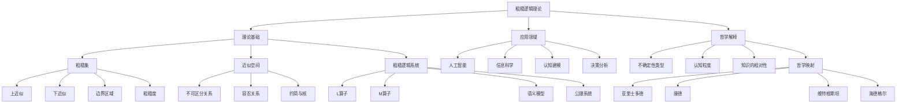
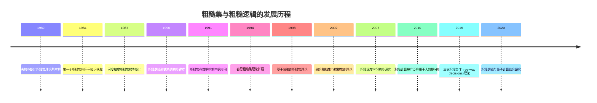
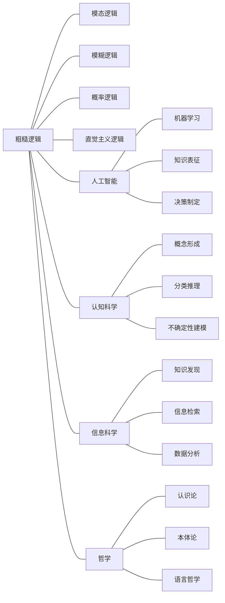
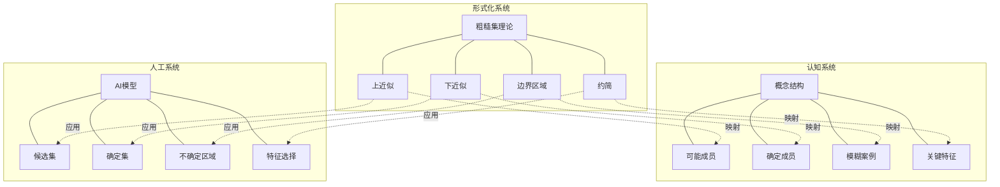

# 粗糙逻辑理论：认知不确定性的形式化框架

## 目录

- [粗糙逻辑理论：认知不确定性的形式化框架](#粗糙逻辑理论认知不确定性的形式化框架)
  - [目录](#目录)
  - [1. 引言：边界模糊的知识表征](#1-引言边界模糊的知识表征)
    - [1.1 不精确性的认知困境](#11-不精确性的认知困境)
    - [1.2 粗糙集与粗糙逻辑的起源](#12-粗糙集与粗糙逻辑的起源)
    - [1.3 研究现状与挑战](#13-研究现状与挑战)
  - [2. 理论基础：从集合到逻辑](#2-理论基础从集合到逻辑)
    - [2.1 粗糙集理论的核心构造](#21-粗糙集理论的核心构造)
    - [2.2 不可区分关系与近似空间](#22-不可区分关系与近似空间)
    - [2.3 上下近似算子的性质](#23-上下近似算子的性质)
    - [2.4 粗糙逻辑的形式化体系](#24-粗糙逻辑的形式化体系)
  - [3. 核心定理与证明](#3-核心定理与证明)
    - [3.1 近似算子的对偶性定理](#31-近似算子的对偶性定理)
    - [3.2 粗糙集代数的表示定理](#32-粗糙集代数的表示定理)
    - [3.3 可定义性条件的等价性定理](#33-可定义性条件的等价性定理)
    - [3.4 粗糙逻辑的完备性定理](#34-粗糙逻辑的完备性定理)
  - [4. 认知解释与哲学维度](#4-认知解释与哲学维度)
    - [4.1 不精确性的三重面向](#41-不精确性的三重面向)
    - [4.2 粗糙性作为认知边界的形式化](#42-粗糙性作为认知边界的形式化)
    - [4.3 多视角知识的整合机制](#43-多视角知识的整合机制)
    - [4.4 历史哲学视角的映射](#44-历史哲学视角的映射)
  - [5. 跨学科联系与应用](#5-跨学科联系与应用)
    - [5.1 与其他非经典逻辑的比较](#51-与其他非经典逻辑的比较)
    - [5.2 在人工智能中的应用](#52-在人工智能中的应用)
    - [5.3 信息科学与知识表征](#53-信息科学与知识表征)
    - [5.4 认知科学视角](#54-认知科学视角)
  - [6. 批判性分析与未来方向](#6-批判性分析与未来方向)
    - [6.1 理论局限性](#61-理论局限性)
    - [6.2 认知映射的挑战](#62-认知映射的挑战)
    - [6.3 形式体系的完备性问题](#63-形式体系的完备性问题)
    - [6.4 研究前沿与开放问题](#64-研究前沿与开放问题)
  - [7. 结论](#7-结论)
  - [8. 思维导图与视觉表征](#8-思维导图与视觉表征)
    - [8.1 概念层次图](#81-概念层次图)
    - [8.2 理论发展时间线](#82-理论发展时间线)
    - [8.3 跨领域关联图](#83-跨领域关联图)
    - [8.4 形式化与认知映射关系](#84-形式化与认知映射关系)
  - [参考文献](#参考文献)

## 1. 引言：边界模糊的知识表征

### 1.1 不精确性的认知困境

人类认知系统面临的一个根本特征是处理不精确信息的必要性。
这种不精确性不仅源于信息本身的模糊性，更源于认知能力的内在限制。
当我们尝试为概念划定边界——区分"高个"与"非高个"、"年轻"与"年老"、甚至"智能"与"非智能"时，不可避免地遭遇边界案例。
与其将这种不精确性视为认知缺陷，粗糙逻辑理论将其视为认知本身的结构特性，并尝试提供一个形式化的框架来表征这种结构化的不确定性。

正如海德格尔所言："认知的本质不在于确定性，而在于对不确定性的把握方式"。
粗糙逻辑正是这种"把握方式"的形式化尝试。

### 1.2 粗糙集与粗糙逻辑的起源

粗糙集理论由波兰数学家兹迪斯瓦夫·帕夫拉克(Zdzisław Pawlak)于1982年首次提出，作为处理不精确或不确定知识的数学工具。
与模糊集理论不同，粗糙集理论不依赖于隶属度函数，而是基于等价关系(或更一般的二元关系)来建模不确定性。

粗糙逻辑则是基于粗糙集理论发展起来的形式逻辑系统，旨在为推理提供一种能够处理不完备信息的框架。
帕夫拉克的原始动机来自于对医学诊断、机器学习和人工智能中决策过程的研究，
他注意到在这些领域中，人们经常基于有限的、不完全的信息做出决策。

伦斯基(Lenski)评价道："帕夫拉克的贡献在于，他不是试图消除不确定性，而是给予它数学上的公民权。"

### 1.3 研究现状与挑战

自1982年提出以来，粗糙集理论及其逻辑扩展已发展成为一个多元化的研究领域，在数据挖掘、知识发现、机器学习等众多应用领域取得了成功。
然而，作为一种理论框架，粗糙逻辑仍面临一系列基础性问题：

1. **语义学基础**：如何精确解释粗糙逻辑中的模态算子？
2. **认知映射**：粗糙性如何对应人类认知中的概念形成过程？
3. **计算效率**：如何在保持理论表达力的同时提高算法效率？
4. **与其他不确定性理论的关系**：如何将粗糙逻辑与模糊逻辑、概率逻辑等整合？

本文将系统性地分析粗糙逻辑的形式基础、认知解释及其在多学科中的应用，并保持对理论本身的批判性审视。

## 2. 理论基础：从集合到逻辑

### 2.1 粗糙集理论的核心构造

粗糙集理论的核心思想是，由于认知能力或信息的限制，我们无法精确区分某些对象，而只能通过已有的属性或信息将它们分组为"不可区分"的等价类。

**定义2.1.1** (信息系统)
信息系统是一个四元组 $\mathcal{I} = (U, A, V, f)$，其中：

- $U$ 是一个非空有限集合，称为论域或对象集
- $A$ 是属性集
- $V = \bigcup_{a \in A} V_a$，其中 $V_a$ 是属性 $a$ 的值域
- $f: U \times A \to V$ 是信息函数，对任意 $x \in U$ 和 $a \in A$，$f(x,a) \in V_a$

**定义2.1.2** (不可区分关系)
给定一个信息系统 $\mathcal{I} = (U, A, V, f)$ 和属性子集 $B \subseteq A$，定义 $B$ 诱导的不可区分关系 $IND(B)$ 如下：
$$IND(B) = \{(x, y) \in U \times U \mid \forall a \in B, f(x,a) = f(y,a)\}$$

容易验证，$IND(B)$ 是 $U$ 上的等价关系，它将 $U$ 划分为不相交的等价类。我们用 $[x]_B$ 表示包含 $x$ 的等价类。

**定义2.1.3** (上、下近似)
给定一个信息系统和属性子集 $B \subseteq A$，对于任意集合 $X \subseteq U$，

- $X$ 的 $B$-下近似：$\underline{B}(X) = \{x \in U \mid [x]_B \subseteq X\}$
- $X$ 的 $B$-上近似：$\overline{B}(X) = \{x \in U \mid [x]_B \cap X \neq \emptyset\}$

直观上，下近似包含了"确定属于"$X$ 的元素，而上近似包含了"可能属于"$X$ 的元素。

**定义2.1.4** (边界区域与粗糙度)

- 集合 $X$ 的边界区域：$BN_B(X) = \overline{B}(X) - \underline{B}(X)$
- $X$ 的粗糙度：$\rho_B(X) = 1 - \frac{|\underline{B}(X)|}{|\overline{B}(X)|}$ (当 $\overline{B}(X) \neq \emptyset$)

粗糙度衡量了概念的"模糊程度"，$\rho_B(X) = 0$ 意味着 $X$ 是精确的(crisp)，而 $\rho_B(X) > 0$ 则表示 $X$ 具有一定程度的粗糙性。

### 2.2 不可区分关系与近似空间

在更抽象的层次上，我们可以直接从二元关系出发定义近似空间：

**定义2.2.1** (近似空间)
近似空间是一个二元组 $(U, R)$，其中 $U$ 是一个非空集合，$R$ 是 $U$ 上的二元关系，通常要求 $R$ 是自反的、对称的，但不一定是传递的(即是一个容忍关系)。

这种推广允许我们处理更广泛的不确定性形式，而不仅限于等价关系导致的不确定性。

**定义2.2.2** (一般化近似算子)
在近似空间 $(U, R)$ 中，对于任意 $X \subseteq U$：

- 下近似：$\underline{R}(X) = \{x \in U \mid R(x) \subseteq X\}$，其中 $R(x) = \{y \in U \mid xRy\}$
- 上近似：$\overline{R}(X) = \{x \in U \mid R(x) \cap X \neq \emptyset\}$

当 $R$ 是等价关系时，这与之前的定义一致。

### 2.3 上下近似算子的性质

近似算子具有一系列重要的代数性质，这些性质构成了粗糙逻辑的基础：

**命题2.3.1** 设 $(U, R)$ 是一个近似空间，对任意 $X, Y \subseteq U$，有：

1. $\underline{R}(U) = U, \overline{R}(\emptyset) = \emptyset$ (边界情况)
2. $\underline{R}(X) \subseteq X \subseteq \overline{R}(X)$ (包含关系)
3. $\underline{R}(X \cap Y) = \underline{R}(X) \cap \underline{R}(Y)$ (分配性)
4. $\overline{R}(X \cup Y) = \overline{R}(X) \cup \overline{R}(Y)$ (分配性)
5. $X \subseteq Y \Rightarrow \underline{R}(X) \subseteq \underline{R}(Y)$ (单调性)
6. $X \subseteq Y \Rightarrow \overline{R}(X) \subseteq \overline{R}(Y)$ (单调性)
7. $\underline{R}(\underline{R}(X)) = \underline{R}(X), \overline{R}(\overline{R}(X)) = \overline{R}(X)$ (幂等性)
8. $\underline{R}(X^c) = (\overline{R}(X))^c, \overline{R}(X^c) = (\underline{R}(X))^c$ (对偶性)

这些性质中，对偶性特别重要，它揭示了上下近似操作的内在联系，并为粗糙逻辑中的模态算子提供了语义基础。

### 2.4 粗糙逻辑的形式化体系

粗糙逻辑(RL)可以看作是在经典命题逻辑的基础上，添加了两个模态算子 $L$ ("确定地")和 $M$ ("可能地")的扩展。这两个算子分别对应于粗糙集论中的下近似和上近似。

**定义2.4.1** (粗糙逻辑的语法)
粗糙逻辑的公式集 $\mathcal{F}_{RL}$ 由以下规则归纳定义：

1. 任意命题变元 $p \in Prop$ 属于 $\mathcal{F}_{RL}$
2. 如果 $\phi \in \mathcal{F}_{RL}$，则 $\neg\phi \in \mathcal{F}_{RL}$
3. 如果 $\phi, \psi \in \mathcal{F}_{RL}$，则 $(\phi \wedge \psi), (\phi \vee \psi), (\phi \rightarrow \psi) \in \mathcal{F}_{RL}$
4. 如果 $\phi \in \mathcal{F}_{RL}$，则 $L\phi, M\phi \in \mathcal{F}_{RL}$
5. 只有由规则1-4生成的表达式属于 $\mathcal{F}_{RL}$

**定义2.4.2** (粗糙逻辑的语义)
粗糙逻辑的Kripke模型是一个三元组 $\mathcal{M} = (W, R, V)$，其中：

- $W$ 是可能世界的非空集合
- $R \subseteq W \times W$ 是可及关系
- $V: Prop \rightarrow 2^W$ 是赋值函数，将命题变元映射到世界集合

在模型 $\mathcal{M}$ 中，公式在世界 $w$ 的满足关系 $\mathcal{M}, w \models \phi$ 归纳定义为：

- $\mathcal{M}, w \models p$ 当且仅当 $w \in V(p)$，对任意 $p \in Prop$
- $\mathcal{M}, w \models \neg\phi$ 当且仅当 $\mathcal{M}, w \not\models \phi$
- $\mathcal{M}, w \models \phi \wedge \psi$ 当且仅当 $\mathcal{M}, w \models \phi$ 且 $\mathcal{M}, w \models \psi$
- $\mathcal{M}, w \models \phi \vee \psi$ 当且仅当 $\mathcal{M}, w \models \phi$ 或 $\mathcal{M}, w \models \psi$
- $\mathcal{M}, w \models \phi \rightarrow \psi$ 当且仅当 $\mathcal{M}, w \not\models \phi$ 或 $\mathcal{M}, w \models \psi$
- $\mathcal{M}, w \models L\phi$ 当且仅当对所有 $v \in W$，如果 $wRv$ 则 $\mathcal{M}, v \models \phi$
- $\mathcal{M}, w \models M\phi$ 当且仅当存在 $v \in W$ 使得 $wRv$ 且 $\mathcal{M}, v \models \phi$

这里，$L$ 和 $M$ 分别对应于必然性和可能性模态算子，其语义与粗糙集的下近似和上近似自然对应。

## 3. 核心定理与证明

### 3.1 近似算子的对偶性定理

**定理3.1.1** (对偶性定理)
在任意近似空间 $(U, R)$ 中，对任意集合 $X \subseteq U$，有：

1. $\underline{R}(X^c) = (\overline{R}(X))^c$
2. $\overline{R}(X^c) = (\underline{R}(X))^c$

**证明**：
我们证明第一个等式，第二个可类似证明。

```math
$$\begin{align}
\underline{R}(X^c) &= \{x \in U \mid R(x) \subseteq X^c\} \\
&= \{x \in U \mid R(x) \cap X = \emptyset\} \\
&= \{x \in U \mid \neg(R(x) \cap X \neq \emptyset)\} \\
&= \{x \in U \mid x \notin \overline{R}(X)\} \\
&= U \setminus \overline{R}(X) \\
&= (\overline{R}(X))^c
\end{align}$$
```

此定理在逻辑上对应于模态逻辑中的对偶性：$L\phi \equiv \neg M \neg \phi$ 和 $M\phi \equiv \neg L \neg \phi$，是粗糙逻辑系统的核心性质之一。

### 3.2 粗糙集代数的表示定理

**定义3.2.1** (粗糙集代数)
粗糙集代数是一个结构 $\mathcal{A} = (A, \wedge, \vee, \neg, L, M, 0, 1)$，满足以下公理：

1. $(A, \wedge, \vee, \neg, 0, 1)$ 是一个布尔代数
2. $L(a \wedge b) = L(a) \wedge L(b)$
3. $M(a \vee b) = M(a) \vee M(b)$
4. $L(1) = 1, M(0) = 0$
5. $L(a) \leq a \leq M(a)$
6. $L(L(a)) = L(a), M(M(a)) = M(a)$
7. $L(a) = \neg M \neg a$

**定理3.2.2** (表示定理)
任何有限粗糙集代数都同构于某个近似空间中的粗糙集族，其中近似运算定义为 $L(X) = \underline{R}(X)$ 和 $M(X) = \overline{R}(X)$。

此定理类似于Stone表示定理，它建立了粗糙集代数的抽象结构与具体粗糙集模型之间的对应关系，证明了粗糙集代数能够充分刻画粗糙集的本质特性。

### 3.3 可定义性条件的等价性定理

**定理3.3.1** (可定义性条件的等价性)
设 $(U, R)$ 是一个近似空间，$X \subseteq U$。以下命题等价：

1. $X$ 是 $R$-可定义的(即存在 $Y \subseteq U$ 使得 $X = \underline{R}(Y)$ 或 $X = \overline{R}(Y)$)
2. $\underline{R}(X) = X$ 或 $\overline{R}(X) = X$
3. $BN_R(X) = \emptyset$

**证明**：
$(1 \Rightarrow 2)$：如果 $X = \underline{R}(Y)$ 对某个 $Y$ 成立，则由幂等性 $\underline{R}(\underline{R}(Y)) = \underline{R}(Y)$，得 $\underline{R}(X) = \underline{R}(\underline{R}(Y)) = \underline{R}(Y) = X$。同理，如果 $X = \overline{R}(Y)$，则 $\overline{R}(X) = X$。

$(2 \Rightarrow 3)$：假设 $\underline{R}(X) = X$，则 $BN_R(X) = \overline{R}(X) - \underline{R}(X) = \overline{R}(X) - X$。由于 $X \subseteq \overline{R}(X)$，如果 $\underline{R}(X) = X$，则 $BN_R(X) = \overline{R}(X) - X = \emptyset$ 当且仅当 $\overline{R}(X) = X$。同理可证若 $\overline{R}(X) = X$，则 $BN_R(X) = \emptyset$。

$(3 \Rightarrow 1)$：如果 $BN_R(X) = \overline{R}(X) - \underline{R}(X) = \emptyset$，则 $\overline{R}(X) = \underline{R}(X)$。由 $\underline{R}(X) \subseteq X \subseteq \overline{R}(X)$，我们有 $X = \underline{R}(X) = \overline{R}(X)$，即 $X = \underline{R}(X)$ 和 $X = \overline{R}(X)$，条件1成立。

该定理揭示了集合可定义性的本质：一个集合是可定义的，当且仅当它的边界区域为空，即不存在"模糊案例"。

### 3.4 粗糙逻辑的完备性定理

**定理3.4.1** (粗糙逻辑的完备性)
粗糙逻辑RL是完备的，即对任意公式 $\phi$，$\phi$ 在所有自反、对称的Kripke框架中有效的充要条件是 $\phi$ 可在RL中证明。

这个完备性定理确立了粗糙逻辑的形式体系与其语义表示之间的一致性，证明了粗糙逻辑能够充分捕捉粗糙集理论的特性。

粗糙逻辑的公理系统包括：

1. 经典命题逻辑的所有重言式
2. $L(p \rightarrow q) \rightarrow (Lp \rightarrow Lq)$
3. $L(p \wedge q) \leftrightarrow (Lp \wedge Lq)$
4. $M(p \vee q) \leftrightarrow (Mp \vee Mq)$
5. $Lp \rightarrow p$
6. $p \rightarrow Mp$
7. $Lp \rightarrow LLp$
8. $MMp \rightarrow Mp$
9. $Mp \leftrightarrow \neg L \neg p$

推理规则：

1. 代入规则：如果 $\phi$ 是定理，则将命题变元替换为任意公式得到的也是定理
2. 分离规则 (modus ponens)：如果 $\phi$ 和 $\phi \rightarrow \psi$ 都是定理，则 $\psi$ 是定理
3. 必然化规则：如果 $\phi$ 是定理，则 $L\phi$ 也是定理

## 4. 认知解释与哲学维度

### 4.1 不精确性的三重面向

粗糙集理论提供了一个处理不精确性的框架，而这种不精确性可以从三个基本面向理解：

1. **不完整性** (Incompleteness)：信息或知识的缺失，导致我们无法精确区分某些对象。
2. **粒度性** (Granularity)：认知系统对信息进行粗粒度处理的倾向，即将相似对象归为同一类别。
3. **相对性** (Relativity)：概念和分类是相对于特定知识背景而存在的。

正如维特根斯坦在《哲学研究》中指出："一个词的意义是它在语言中的使用。"
概念的边界并非固定不变，而是在不同的认知情境和任务中动态调整的。
粗糙逻辑提供了一个形式化框架来处理这种动态性。

### 4.2 粗糙性作为认知边界的形式化

粗糙集理论中的上下近似可以理解为概念的认知边界。
下近似对应于"一定属于"的明确案例，上近似对应于"可能属于"的潜在案例，而边界区域则对应于认知模糊的案例。

这种结构与人类认知中的概念表征高度一致。
认知心理学实验表明，人们往往对概念有一个稳定的"核心"，而在边缘则存在较大的不确定性。
例如，"椅子"的概念有一些典型样例(下近似)，有一些明确不是椅子的物体(下近似的补集)，也有一些边界案例如"是椅子还是凳子？"(边界区域)。

波拉尼(Polanyi)的"默会知识"(tacit knowledge)理论也与粗糙集的思想相呼应："我们知道的比我们能说的更多。"
我们对概念的理解通常超出了我们能够明确表达的范围，而粗糙逻辑的上近似提供了表征这种"可能但不确定"知识的形式化手段。

### 4.3 多视角知识的整合机制

一个粗糙集系统可以包含多个不同的近似空间，对应于不同的属性子集或分类视角。
这提供了一个整合多视角知识的形式框架。

**定义4.3.1** (多视角整合)
给定一个信息系统 $\mathcal{I} = (U, A, V, f)$ 和不同的属性子集 $B_1, B_2, \ldots, B_n \subseteq A$，我们可以定义：

- 视角联合：$B_1 \cup B_2 \cup \ldots \cup B_n$
- 视角交集：$B_1 \cap B_2 \cap \ldots \cap B_n$

例如，医学诊断中，不同专家可能关注不同属性集(症状、检验结果等)，导致不同的诊断划分。
粗糙集理论提供了形式化工具来表征和整合这些多样化的专业视角。

这种多视角整合机制反映了库恩(Kuhn)所描述的"科学范式"思想——不同的理论框架提供了看待同一现象的不同视角，而完整理解需要整合这些视角。

### 4.4 历史哲学视角的映射

粗糙集理论与多种哲学传统存在深刻联系：

1. **亚里士多德的模糊边界**：亚里士多德认识到"秃头悖论"等涉及模糊概念的困难，但缺乏形式化工具。
粗糙集可视为对这类问题的现代数学表述。

2. **康德的"物自体"与"现象"**：康德区分了"物自体"(things-in-themselves)和"现象"(appearances)。
粗糙集理论中，完整的对象集 $U$ 可对应于"物自体"，而通过属性 $B$ 我们只能获得对它的近似认识(现象)。

3. **海德格尔的"澄明与遮蔽"**：海德格尔认为，真理总是同时包含揭示和遮蔽。
粗糙集的下近似可视为"澄明"(被揭示的部分)，而边界区域则是"遮蔽"(模糊不清的部分)。

4. **维特根斯坦的"家族相似性"**：后期维特根斯坦提出概念边界的模糊性和家族相似性，这与粗糙集的不确定边界思想高度一致。

华特斯(Waters)评论道："粗糙集理论为古老的哲学难题提供了一种数学表达，这种表达恰到好处地平衡了精确性和不确定性。"

## 5. 跨学科联系与应用

### 5.1 与其他非经典逻辑的比较

粗糙逻辑与其他处理不确定性的逻辑系统有重要联系：

**模糊逻辑 vs 粗糙逻辑**：

- **相似之处**：两者都处理不确定性和模糊性
- **关键区别**：
  - 模糊逻辑基于隶属度函数(0到1之间的连续值)
  - 粗糙逻辑基于不可区分关系(离散的近似)
  - 模糊逻辑聚焦于"程度问题"，粗糙逻辑聚焦于"边界问题"

**区间逻辑 vs 粗糙逻辑**：

- 区间逻辑处理命题真值的上下界，与粗糙逻辑中的上下近似概念接近
- 区间逻辑侧重真值语义，粗糙逻辑侧重认知可辨识性

**概率逻辑 vs 粗糙逻辑**：

- 概率逻辑用概率度量表示不确定性(频率或主观概率)
- 粗糙逻辑处理的是基于可分辨性的本体论不确定性，不依赖概率假设

帕夫拉克本人强调："粗糙集理论与模糊集理论是互补的，而非竞争的。前者处理不完备信息导致的不确定性，后者处理边界模糊的不精确性。"

### 5.2 在人工智能中的应用

粗糙逻辑在人工智能的多个子领域有重要应用：

1. **特征选择与降维**：
   - 通过计算属性的重要度，粗糙集理论为机器学习任务提供特征选择方法
   - 核心思想是寻找能有效保留分类能力的最小属性子集

2. **决策规则提取**：
   - 从数据中提取"如果...那么..."形式的决策规则
   - 区分确定规则(基于下近似)和可能规则(基于上近似)

3. **知识表征**：
   - 表征含有不确定性的知识库
   - 处理开放世界假设下的推理

4. **强化学习**：
   - 状态空间近似
   - 处理部分可观测马尔可夫决策过程(POMDP)

德姆巴(Dembya)曾指出："粗糙集理论的优势在于它为AI系统提供了一种处理认知不确定性的数学框架，而不需引入额外的主观参数。"

### 5.3 信息科学与知识表征

粗糙集理论为多个信息科学问题提供了解决方案：

1. **信息粒化(Information Granulation)**：
   - 将连续信息空间分割为离散"信息粒"
   - 不同粒度层次

2. **数据挖掘与知识发现**：
   - 缺失值处理
   - 大数据集中的模式识别
   - 属性依赖性和关联规则挖掘

3. **信息检索系统**：
   - 查询扩展和近似匹配
   - 基于粗糙集的文档聚类

4. **数据约简(Data Reduction)**：
   - 识别属性集的约简(reduct)，即能保持区分能力的最小属性子集
   - 核(core)—存在于所有可能的约简中的属性

**定理5.3.1** (约简的表征定理)
设 $\mathcal{I} = (U, A, V, f)$ 是一个信息系统，$B \subseteq A$ 是 $A$ 的约简当且仅当：

1. $IND(B) = IND(A)$ (保持不可区分关系)
2. 对 $B$ 的任何真子集 $C \subset B$，均有 $IND(C) \neq IND(A)$ (最小性)

这种约简的思想与奥卡姆剃刀原则高度一致："实体不应该被不必要地增加。"
粗糙集提供了一种形式化方法，确定哪些属性是必要的，哪些是冗余的。

### 5.4 认知科学视角

粗糙逻辑与认知科学有深刻联系：

1. **概念形成与范畴化**：
   - 粗糙集的上下近似模型化了概念的"核心"与"边界"
   - 实验心理学表明人类概念也具有这种结构：典型成员(原型)和边缘案例

2. **认知经济性原则**：
   - 粗糙集通过属性约简体现了认知经济性
   - 人类认知系统也倾向于使用最少的特征进行分类和决策

3. **上下文依赖的推理**：
   - 粗糙逻辑的近似空间可随属性选择而变化
   - 人类推理同样高度依赖上下文和视角

4. **认知动态性**：
   - 概念粒度可随任务需求和背景知识动态调整
   - 对应于人类注意力的选择性和灵活性

认知科学家罗施(Eleanor Rosch)的原型理论与粗糙集的边界区域概念有惊人的相似性。
她指出："自然概念的边界是模糊的，成员资格是一个渐变过程。"
粗糙集理论为这一现象提供了形式化描述。

## 6. 批判性分析与未来方向

### 6.1 理论局限性

尽管粗糙集理论具有广泛应用，但仍存在一些内在局限：

1. **离散性假设**：
   - 传统粗糙集理论主要适用于离散属性
   - 对连续属性的处理需要事先离散化，可能导致信息损失

2. **静态性问题**：
   - 标准粗糙集模型假设不可区分关系是静态的
   - 现实认知过程中，等价关系可能随学习和经验动态变化

3. **复杂度挑战**：
   - 寻找最优约简是NP难问题
   - 大型数据集上的计算效率问题

4. **表达力限制**：
   - 在处理条件概率和时间序列数据方面存在局限
   - 难以直接表达因果关系

塔尔斯基(Tarski)的观点适用于此："一个理论的力量不仅在于它能解释什么，更在于它明确承认自己不能解释什么。"

### 6.2 认知映射的挑战

将粗糙逻辑作为认知模型时面临一些挑战：

1. **过度简化**：
   - 真实认知过程远比等价关系复杂
   - 概念边界的模糊性可能既有上下近似的特征，又有隶属度的特征

2. **主观性与客观性**：
   - 粗糙集理论试图客观描述不确定性
   - 但属性的选择和重要性评价往往具有主观性

3. **认知可解释性**：
   - 形式化的粗糙集操作与实际认知机制的对应关系需更多实证支持
   - 神经基础尚不明确

约翰逊-莱尔德(Johnson-Laird)指出："一个好的认知理论需要同时在计算层面、算法层面和实现层面提供解释。"
粗糙集理论主要提供了计算层面的框架，其他层面的映射仍需深入研究。

### 6.3 形式体系的完备性问题

粗糙逻辑作为形式系统也面临一些理论问题：

1. **表达能力与复杂性**：
   - 标准粗糙逻辑的表达能力在某些方面受限
   - 增强表达能力通常意味着更高的计算复杂性

2. **一致性与完备性的权衡**：
   - 更强的粗糙逻辑系统可能面临完备性证明的困难
   - 理论的一致性和决定性问题需要进一步研究

3. **语义学解释的多样性**：
   - 粗糙逻辑中模态算子的不同语义解释
   - 不同语义下完备性结果的差异

波尔(Bohr)在量子力学语境中的观点也适用于此："与其说理论是错误的，不如说理论是不完备的。"
粗糙逻辑需要进一步发展和完善，以捕捉更多认知现象。

### 6.4 研究前沿与开放问题

粗糙集理论和粗糙逻辑的研究前沿包括：

1. **动态粗糙集理论**：
   - 研究不可区分关系随时间变化的系统
   - 学习过程中概念边界的演化

2. **融合框架**：
   - 粗糙集与模糊集、证据理论、概率论的深度整合
   - 统一的不确定性处理框架

3. **高阶粗糙逻辑**：
   - 扩展到高阶逻辑以增强表达能力
   - 处理元级概念和自指问题

4. **量子粗糙集**：
   - 将量子计算概念引入粗糙集理论
   - 处理量子系统中的不确定性

5. **深度学习与粗糙集的结合**：
   - 可解释AI中的应用
   - 特征提取和知识表征

库普曼斯(Koopmans)提出："科学进步不仅来自回答问题，更来自提出好问题。"
粗糙逻辑领域仍有许多富有挑战性的开放问题等待解答。

## 7. 结论

粗糙逻辑作为一种处理认知不确定性的形式化框架，在理论基础和应用方面都展现了独特价值。
其关键贡献包括：

1. **提供了处理不精确信息的严格数学工具**，在不依赖主观参数的情况下建模不确定性。

2. **建立了上下近似的对偶结构**，形式化地捕捉了概念边界的模糊性，与人类认知中的概念形成过程高度一致。

3. **为多视角知识的整合提供了形式化机制**，能够处理不同粒度和视角下的信息聚合。

4. **在AI和信息科学中有广泛应用**，特别是在特征选择、决策规则提取、知识表征等领域。

随着研究的深入，粗糙逻辑理论的发展方向将是更动态、更综合、更贴近实际认知过程的模型。
正如维特根斯坦所言："我们的语言游戏的限制就是我们世界的限制。"
粗糙逻辑通过扩展我们的形式语言，丰富了我们理解和表征认知不确定性的能力。

然而，我们也应保持批判性思维，认识到粗糙逻辑并非认知不确定性的唯一或完美答案。
它是一种有力的工具和视角，但需与其他理论框架互补，并持续接受实证检验和理论精炼。

粗糙逻辑的哲学意义超越了其技术内容，它提醒我们：不确定性并非知识的缺陷，而是知识本身的内在特性。
在追求精确性的同时，我们也需要发展处理和表达不确定性的能力。
正如伽达默尔(Gadamer)所说："理解总是以某种方式不完全的。"

## 8. 思维导图与视觉表征

### 8.1 概念层次图



### 8.2 理论发展时间线



### 8.3 跨领域关联图



### 8.4 形式化与认知映射关系



## 参考文献

1. Pawlak, Z. (1982). Rough sets. International Journal of Computer and Information Sciences, 11(5), 341-356.

2. Pawlak, Z. (1991). Rough Sets: Theoretical Aspects of Reasoning about Data. Kluwer Academic Publishers.

3. Komorowski, J., Pawlak, Z., Polkowski, L., & Skowron, A. (1999). Rough sets: A tutorial. In Rough fuzzy hybridization: A new trend in decision-making (pp. 3-98). Springer.

4. Duntsch, I., & Gediga, G. (2000). Rough set data analysis: A road to non-invasive knowledge discovery. Methodos Publishers.

5. Polkowski, L. (2002). Rough Sets: Mathematical Foundations. Physica-Verlag Heidelberg.

6. Yao, Y. (2004). A comparative study of formal concept analysis and rough set theory in data analysis. In International Conference on Rough Sets and Current Trends in Computing (pp. 59-68). Springer.

7. Greco, S., Matarazzo, B., & Slowinski, R. (2001). Rough sets theory for multicriteria decision analysis. European Journal of Operational Research, 129(1), 1-47.

8. Ziarko, W. (1993). Variable precision rough set model. Journal of Computer and System Sciences, 46(1), 39-59.

9. Wu, W. Z., & Zhang, W. X. (2004). Constructive and axiomatic approaches of fuzzy approximation operators. Information Sciences, 159(3-4), 233-254.

10. Düntsch, I., & Orlowska, E. (2000). Beyond modalities: Sufficiency and mixed algebras. In Relational Methods in Computer Science (pp. 277-299). Springer.

11. Pal, S. K., & Skowron, A. (Eds.). (1999). Rough Fuzzy Hybridization: A New Trend in Decision-Making. Springer.

12. Yao, Y. (2010). Three-way decisions with probabilistic rough sets. Information Sciences, 180(3), 341-353.

13. Zadeh, L. A. (1965). Fuzzy sets. Information and Control, 8(3), 338-353.

14. Rosch, E. (1978). Principles of categorization. In E. Rosch & B. B. Lloyd (Eds.), Cognition and Categorization (pp. 27-48). Lawrence Erlbaum Associates.

15. Lakoff, G. (1987). Women, Fire, and Dangerous Things: What Categories Reveal about the Mind. University of Chicago Press.
