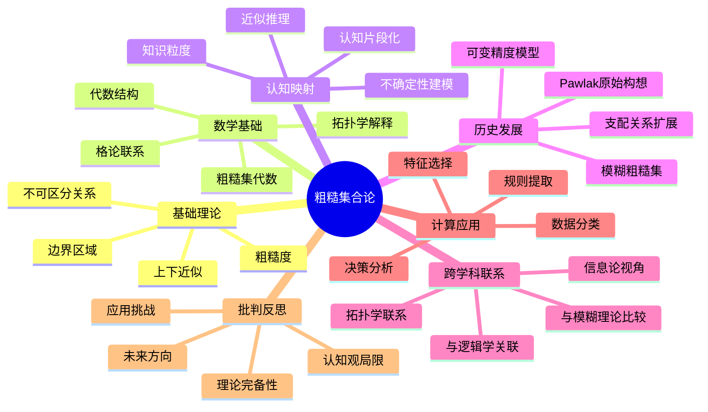

# 粗糙集合论的批判性分析

## 目录

- [粗糙集合论的批判性分析](#粗糙集合论的批判性分析)
  - [目录](#目录)
  - [粗糙集合论的基础](#粗糙集合论的基础)
    - [历史背景与核心概念](#历史背景与核心概念)
    - [形式化定义](#形式化定义)
    - [基本运算与性质](#基本运算与性质)
  - [理论证明与数学基础](#理论证明与数学基础)
    - [核心定理的严格证明](#核心定理的严格证明)
    - [拓扑学解释](#拓扑学解释)
    - [代数结构视角](#代数结构视角)
  - [认知结构映射](#认知结构映射)
    - [不确定性认知模型](#不确定性认知模型)
    - [近似推理框架](#近似推理框架)
    - [知识粒度的形式化](#知识粒度的形式化)
  - [历史人物视角解读](#历史人物视角解读)
    - [Pawlak的原始构想](#pawlak的原始构想)
    - [多视角理论发展](#多视角理论发展)
    - [哲学基础的争论](#哲学基础的争论)
  - [跨学科关联](#跨学科关联)
    - [与模糊理论的比较](#与模糊理论的比较)
    - [信息论视角](#信息论视角)
    - [与逻辑学的联系](#与逻辑学的联系)
  - [计算机科学与AI应用](#计算机科学与ai应用)
    - [数据挖掘中的应用](#数据挖掘中的应用)
    - [机器学习算法框架](#机器学习算法框架)
    - [知识表示的局限性](#知识表示的局限性)
  - [批判性反思](#批判性反思)
    - [理论完备性的质疑](#理论完备性的质疑)
    - [认知观的局限](#认知观的局限)
    - [未来发展方向](#未来发展方向)
  - [思维导图](#思维导图)

## 粗糙集合论的基础

### 历史背景与核心概念

粗糙集合论(Rough Set Theory)由波兰数学家Zdzisław Pawlak在1982年提出，作为处理不确定性和不精确性的数学工具。这一理论的出现是对经典集合论处理模糊、不完备信息能力不足的直接回应。

Pawlak最初的动机是构建一个不依赖于外部参数、概率分布或成员度函数的框架，直接从数据本身揭示知识结构。这一思路区别于模糊集合论、证据理论和概率方法，体现了一种数据驱动的认知范式。

核心概念包括：

- **不可区分性关系**：知识的基本单元，表征对象间的相似性
- **上下近似**：对概念的边界描述，刻画确定性与不确定性的边界
- **边界区域**：认知的模糊地带，知识不足造成的判断悬置区域
- **粗糙度**：不确定性程度的量化表征

### 形式化定义

粗糙集合论的形式化框架建立在信息系统之上：

**定义1.1**（信息系统）：信息系统是一个四元组 $\mathcal{S} = (U, A, V, f)$，其中：

- $U$ 是对象的非空有限集合（论域）
- $A$ 是属性的非空有限集合
- $V = \bigcup_{a \in A} V_a$，其中 $V_a$ 是属性 $a$ 的值域
- $f: U \times A \rightarrow V$ 是信息函数，使得对于任意 $x \in U$ 和 $a \in A$，$f(x, a) \in V_a$

**定义1.2**（不可区分关系）：给定信息系统 $\mathcal{S} = (U, A, V, f)$ 和属性子集 $B \subseteq A$，对应的不可区分关系 $IND(B)$ 定义为：
$$IND(B) = \{(x, y) \in U \times U | \forall a \in B, f(x, a) = f(y, a)\}$$

$IND(B)$ 是 $U$ 上的等价关系，产生论域 $U$ 的一个划分，记为 $U/IND(B)$。

**定义1.3**（上下近似）：对于任意集合 $X \subseteq U$ 和属性集 $B \subseteq A$：

- 下近似：$\underline{B}(X) = \{x \in U | [x]_B \subseteq X\}$
- 上近似：$\overline{B}(X) = \{x \in U | [x]_B \cap X \neq \emptyset\}$

其中 $[x]_B$ 表示包含 $x$ 的 $B$ 不可区分关系的等价类。

**定义1.4**（边界区域与粗糙度）：

- 边界区域：$BND_B(X) = \overline{B}(X) - \underline{B}(X)$
- 粗糙度：$\alpha_B(X) = \frac{|\underline{B}(X)|}{|\overline{B}(X)|}$，当 $\overline{B}(X) \neq \emptyset$

### 基本运算与性质

**定理1.1**：对于任意集合 $X, Y \subseteq U$ 和属性集 $B \subseteq A$，以下性质成立：

1. $\underline{B}(X) \subseteq X \subseteq \overline{B}(X)$
2. $\underline{B}(\emptyset) = \overline{B}(\emptyset) = \emptyset$；$\underline{B}(U) = \overline{B}(U) = U$
3. $\overline{B}(X \cup Y) = \overline{B}(X) \cup \overline{B}(Y)$
4. $\underline{B}(X \cap Y) = \underline{B}(X) \cap \underline{B}(Y)$
5. $X \subseteq Y \Rightarrow \underline{B}(X) \subseteq \underline{B}(Y)$，$\overline{B}(X) \subseteq \overline{B}(Y)$
6. $\underline{B}(X^c) = (\overline{B}(X))^c$，$\overline{B}(X^c) = (\underline{B}(X))^c$
7. $\underline{B}(\underline{B}(X)) = \overline{B}(\underline{B}(X)) = \underline{B}(X)$
8. $\underline{B}(\overline{B}(X)) = \overline{B}(\overline{B}(X)) = \overline{B}(X)$

这些性质构成了粗糙集合论的代数框架，展示了上下近似算子在集合运算下的行为。

## 理论证明与数学基础

### 核心定理的严格证明

**定理2.1**（近似性质）：对于任意集合 $X \subseteq U$ 和属性集 $B \subseteq A$，下近似 $\underline{B}(X)$ 是 $X$ 的最大 $B$-确定子集，上近似 $\overline{B}(X)$ 是 $X$ 的最小 $B$-确定超集。

**证明**：
首先证明 $\underline{B}(X)$ 是 $B$-确定的：若 $y \in [x]_B$ 且 $x \in \underline{B}(X)$，则 $[x]_B = [y]_B \subseteq X$，因此 $y \in \underline{B}(X)$。

对于任意 $B$-确定子集 $Y \subseteq X$，若 $y \in Y$，则 $[y]_B \subseteq Y \subseteq X$，因此 $y \in \underline{B}(X)$，即 $Y \subseteq \underline{B}(X)$。

类似地，可以证明 $\overline{B}(X)$ 是 $X$ 的最小 $B$-确定超集。$\square$

**定理2.2**（约简的存在性）：对于任意信息系统 $\mathcal{S} = (U, A, V, f)$，存在至少一个属性约简。

**证明**：
定义属性集 $B \subseteq A$ 的依赖度 $\gamma_B(D) = \frac{|POS_B(D)|}{|U|}$，其中 $D$ 是决策属性，$POS_B(D)$ 是 $B$ 关于 $D$ 的正域。

显然，$\gamma_A(D)$ 是属性依赖度的上界。考虑集合 $\mathcal{R} = \{B \subseteq A | \gamma_B(D) = \gamma_A(D)\}$，$\mathcal{R}$ 非空，因为 $A \in \mathcal{R}$。

在 $\mathcal{R}$ 中选择一个基数最小的集合 $R$，若 $R$ 中移除任意元素 $a$，则 $\gamma_{R-\{a\}}(D) < \gamma_A(D)$。这样的 $R$ 就是一个约简。$\square$

**定理2.3**（可区分性）：给定决策系统 $(U, A \cup \{d\})$，对象 $x$ 和 $y$ 在属性集 $B \subseteq A$ 下可区分当且仅当存在 $a \in B$，使得 $f(x, a) \neq f(y, a)$。

**证明**：
直接从不可区分关系的定义推导。对象 $x$ 和 $y$ 在 $B$ 下可区分，当且仅当 $(x, y) \notin IND(B)$，等价于存在 $a \in B$ 使得 $f(x, a) \neq f(y, a)$。$\square$

### 拓扑学解释

粗糙集合论与拓扑学有深刻联系：

**定理2.4**：给定属性集 $B \subseteq A$，集合族 $\{X \subseteq U | \underline{B}(X) = X\}$ 形成 $U$ 上的拓扑，其中闭集为 $\{X \subseteq U | \overline{B}(X) = X\}$。

**证明**：
验证拓扑公理：

1. $\emptyset$ 和 $U$ 都是 $B$-确定的，因为 $\underline{B}(\emptyset) = \emptyset$ 且 $\underline{B}(U) = U$。
2. 若 $X_1, X_2$ 是 $B$-确定的，则 $\underline{B}(X_1 \cap X_2) = \underline{B}(X_1) \cap \underline{B}(X_2) = X_1 \cap X_2$。
3. 对于任意 $B$-确定集族 $\{X_i | i \in I\}$，有 $\underline{B}(\bigcup_{i \in I} X_i) \supseteq \bigcup_{i \in I} \underline{B}(X_i) = \bigcup_{i \in I} X_i$，而由定理1.1(1)，$\underline{B}(\bigcup_{i \in I} X_i) \subseteq \bigcup_{i \in I} X_i$，故 $\underline{B}(\bigcup_{i \in I} X_i) = \bigcup_{i \in I} X_i$。$\square$

这一拓扑解释将粗糙集框架与拓扑学的开集、闭集概念联系起来，为后续的数学发展提供了基础。

### 代数结构视角

粗糙集合论体现了丰富的代数结构：

**定理2.5**：上下近似算子对构成了一个Galois联络。

**证明**：
对于任意集合 $X, Y \subseteq U$：

1. 若 $X \subseteq Y$，则 $\underline{B}(X) \subseteq \underline{B}(Y)$ 且 $\overline{B}(X) \subseteq \overline{B}(Y)$（单调性）
2. $X \subseteq \overline{B}(\underline{B}(X))$ 且 $\underline{B}(\overline{B}(X)) \subseteq X$（外延性）
3. $\underline{B}(\underline{B}(X)) = \underline{B}(X)$ 且 $\overline{B}(\overline{B}(X)) = \overline{B}(X)$（幂等性）

这些性质使得 $(\underline{B}, \overline{B})$ 构成Galois联络，从而与格论建立联系。$\square$

**定理2.6**：在粗糙集代数中，存在一个粗糙集格，其中每个元素可表示为 $(X, Y)$，满足 $X = \underline{B}(Z)$ 且 $Y = \overline{B}(Z)$，对某个 $Z \subseteq U$。

## 认知结构映射

### 不确定性认知模型

粗糙集合论提供了人类认知不确定性的数学模型：

**模型3.1**（分层认知结构）：

```text
认知层次：                  不确定性处理机制：               粗糙集形式化：
┌──────────┐              ┌──────────────┐             ┌──────────────┐
│ 元认知层  │─────────────→│ 不确定性评估 │─────────────→│  粗糙度测量   │
└──────────┘              └──────────────┘             └──────────────┘
      ↑                          ↑                            ↑
      │                          │                            │
┌──────────┐              ┌──────────────┐             ┌──────────────┐
│  认知层   │─────────────→│  概念形成    │─────────────→│ 上下近似构造 │
└──────────┘              └──────────────┘             └──────────────┘
      ↑                          ↑                            ↑
      │                          │                            │
┌──────────┐              ┌──────────────┐             ┌──────────────┐
│  感知层   │─────────────→│  信息获取    │─────────────→│ 信息系统构建 │
└──────────┘              └──────────────┘             └──────────────┘
```

粗糙集理论中的不可区分关系对应人类认知中的分类能力极限，上下近似对应认知中的确定性与可能性判断，边界区域对应认知悬置区。

### 近似推理框架

**定理3.1**（决策规则推导）：给定决策系统 $(U, A \cup \{d\})$ 和对象 $x \in U$，可构造决策规则：

$$\bigwedge_{a \in B} (a = f(x, a)) \rightarrow (d = f(x, d))$$

其中 $B \subseteq A$ 是某个相对约简。

**证明**：
若 $B$ 是相对约简，则对于任意 $y \in U$，当 $\forall a \in B, f(y, a) = f(x, a)$ 时，必有 $f(y, d) = f(x, d)$，否则 $B$ 不能维持原决策系统的区分能力。$\square$

这种形式化的规则推导与人类的"如果...那么..."推理模式高度一致，体现了从实例到规则的归纳过程。

### 知识粒度的形式化

**定义3.1**（知识粒度）：给定属性集 $B \subseteq A$，其知识粒度 $G(B)$ 定义为：

$$G(B) = \frac{1}{|U|^2} \sum_{X \in U/IND(B)} |X|^2$$

**定理3.2**（粒度单调性）：若 $B_1 \subseteq B_2 \subseteq A$，则 $G(B_1) \geq G(B_2)$。

**证明**：
因为 $IND(B_2) \subseteq IND(B_1)$，所以 $B_2$ 产生的划分至少与 $B_1$ 一样细，即 $U/IND(B_2)$ 是 $U/IND(B_1)$ 的细化。

对于任意划分 $P_1$ 和细化 $P_2$，有 $\sum_{X \in P_1} |X|^2 \geq \sum_{X \in P_2} |X|^2$（柯西-施瓦兹不等式的应用）。

因此，$G(B_1) \geq G(B_2)$。$\square$

这一结果与认知科学中的信息粒化原理一致：更多的属性提供更细粒度的知识表示。

## 历史人物视角解读

### Pawlak的原始构想

Zdzisław Pawlak（1926-2006）最初提出粗糙集理论的动机是解决医学诊断中的不确定信息处理问题。他在1982年的开创性论文中写道：

> "集合论的基本问题在于，我们如何定义'集合'这个概念。传统上，集合被定义为满足某些明确属性的物体的集合。然而，在很多实际情况中，由于信息的不完备，我们无法精确地描述集合。本文提出一种新的数学工具——粗糙集，用于处理这类不精确性。"

Pawlak的天才之处在于他看到了不确定性的两种本质不同的来源：一种是数据本身的模糊性（被模糊集理论处理），另一种是知识不足导致的不精确性（由粗糙集理论处理）。

### 多视角理论发展

-**林宗坚与Yao的可变精度模型**

林宗坚和Yiyu Yao在20世纪90年代提出可变精度粗糙集模型，引入参数β控制近似精度：

> "实际应用中，我们常常接受一定程度的错误分类以获得更有意义的知识结构。可变精度模型允许在近似过程中容忍可控的误差。"

他们的工作使粗糙集理论更具灵活性，能适应噪声数据环境。

-**Słowiński的支配关系粗糙集**

Roman Słowiński对粗糙集理论的贡献在于引入支配关系替代等价关系，处理优先序关系：

> "在多准则决策问题中，属性值间存在优先关系。传统粗糙集无法反映这种序关系，而支配关系粗糙集则保留了属性值间的序关系信息。"

这一扩展大大增强了粗糙集在决策分析中的应用能力。

-**Dubois和Prade的模糊粗糙集结合**

Didier Dubois和Henri Prade在1990年提出将粗糙集与模糊集结合的框架：

> "模糊集处理隶属度的渐变，粗糙集处理近似的边界，两者结合提供了不确定性表示的完整框架，捕获了不确定性的不同方面。"

### 哲学基础的争论

粗糙集理论引发了关于知识本质的哲学辩论：

-**关于认识论的争论**

一些研究者，如Zadeh，认为粗糙集是认识论的，而非本体论的：

> "粗糙集理论处理的是我们对世界的知识不足，而非世界本身的不确定性。这与量子力学中的不确定性原理有本质区别。"

而另一些学者，如Lipski，则认为粗糙集反映了一种本体论的不确定性：

> "世界本身可能存在无法完全确定的边界，粗糙集不仅是认识论工具，也可能反映现实世界的内在结构。"

-**与逻辑经验主义的联系**

Karl Popper的证伪主义哲学与粗糙集的下近似概念有深刻联系：

> "科学知识的核心在于可证伪的陈述。粗糙集的下近似代表了在当前知识框架下确定的知识，类似于经受住证伪考验的科学假说。"

## 跨学科关联

### 与模糊理论的比较

粗糙集理论与模糊集理论处理不确定性的方式存在本质差异：

| 方面 | 粗糙集理论 | 模糊集理论 |
|------|-----------|-----------|
| 哲学基础 | 认识论不确定性 | 语义不精确性 |
| 数学表征 | 上下近似区间 | 隶属度函数 |
| 参数依赖 | 无需外部参数 | 需确定隶属度 |
| 核心关系 | 不可区分关系 | 相似度关系 |
| 基本操作 | 集合近似 | 隶属度计算 |

**定理5.1**（粗糙-模糊桥接）：每个粗糙集可表示为一个L-模糊集，其中L是包含三个元素{0, 1/2, 1}的格。

**证明**：
对于集合 $X \subseteq U$，定义隶属度函数 $\mu_X: U \rightarrow \{0, 1/2, 1\}$ 为：

- $\mu_X(x) = 1$，若 $x \in \underline{B}(X)$
- $\mu_X(x) = 1/2$，若 $x \in BND_B(X)$
- $\mu_X(x) = 0$，若 $x \in U - \overline{B}(X)$

这构成了一个三值模糊集，从而建立了粗糙集与某类特殊模糊集的关联。$\square$

### 信息论视角

粗糙集理论与信息论有深刻联系：

**定义5.1**（粗糙熵）：给定属性集 $B \subseteq A$ 和集合 $X \subseteq U$，粗糙熵定义为：

$$E_B(X) = -\frac{|\underline{B}(X)|}{|U|} \log \frac{|\underline{B}(X)|}{|U|} - \frac{|U - \overline{B}(X)|}{|U|} \log \frac{|U - \overline{B}(X)|}{|U|} - \frac{|BND_B(X)|}{|U|} \log \frac{|BND_B(X)|}{|U|}$$

**定理5.2**（信息增益）：添加属性不会减少系统的区分能力，即若 $B_1 \subseteq B_2 \subseteq A$，则对任意 $X \subseteq U$，$E_{B_1}(X) \geq E_{B_2}(X)$。

**证明**：
因为 $B_2$ 包含 $B_1$ 的所有信息，所以 $\underline{B_2}(X) \supseteq \underline{B_1}(X)$ 且 $\overline{B_2}(X) \subseteq \overline{B_1}(X)$，即 $B_2$ 的边界区域不大于 $B_1$ 的边界区域。

根据信息熵的性质，当减少不确定性时，熵值减小，因此 $E_{B_1}(X) \geq E_{B_2}(X)$。$\square$

### 与逻辑学的联系

粗糙集理论与多值逻辑和模态逻辑密切相关：

**定理5.3**（三值逻辑映射）：粗糙集理论中的成员关系可映射为Łukasiewicz三值逻辑，其中：

- $x \in \underline{B}(X)$ 对应真值1（完全确定为真）
- $x \in BND_B(X)$ 对应真值1/2（不确定）
- $x \in U - \overline{B}(X)$ 对应真值0（完全确定为假）

**证明**：
验证Łukasiewicz逻辑中的公理在此映射下成立。特别是，$\neg \neg p = p$ 对应于 $(\overline{B}(X^c))^c = \underline{B}(X)$，这在定理1.1(6)中已证实。$\square$

**命题5.1**（模态逻辑解释）：粗糙集上下近似算子可解释为模态逻辑中的必然算子(□)和可能算子(◇)：

- $\underline{B}(X)$ 对应 □X（必然X）
- $\overline{B}(X)$ 对应 ◇X（可能X）

这一解释建立了粗糙集理论与模态认识论的联系。

## 计算机科学与AI应用

### 数据挖掘中的应用

粗糙集理论为数据挖掘提供了独特框架：

**算法6.1**（粗糙集属性约简）：

```math
输入：决策系统 (U, A ∪ {d})
输出：属性约简 R

1. 初始化：R = ∅, γ_R(d) = 0, γ_A(d) 为全属性集的依赖度
2. 计算各属性的重要度：∀a ∈ A, sig(a) = γ_{R∪{a}}(d) - γ_R(d)
3. 找出最重要属性：a_max = argmax_{a ∈ A - R} sig(a)
4. 若 sig(a_max) > 0，则 R = R ∪ {a_max}，更新 γ_R(d)，返回步骤2
5. 若 γ_R(d) = γ_A(d)，返回R
```

**定理6.1**（约简NP难）：寻找最小基数属性约简是NP-难问题。

**证明**：通过从最小覆盖问题的多项式时间归约。$\square$

尽管问题计算复杂度高，启发式算法在实践中取得了良好效果。

### 机器学习算法框架

**框架6.1**（粗糙集分类器）：

1. **预处理阶段**：使用粗糙集进行特征选择，保留相对约简
2. **规则生成阶段**：从下近似区域提取确定规则，从边界区域提取可能规则
3. **规则评估阶段**：计算规则的支持度、确定性和覆盖度
4. **分类阶段**：使用投票机制结合多规则的预测结果

**定理6.2**（规则一致性）：从下近似生成的规则具有100%的确定性，从边界区域生成的规则具有小于100%的确定性。

### 知识表示的局限性

粗糙集在知识表示中存在一些本质局限：

**局限6.1**（离散值假设）：传统粗糙集假设属性值是离散的，处理连续值需要额外的离散化过程。

**局限6.2**（静态知识框架）：标准粗糙集理论难以直接处理动态变化的知识，需要引入时序粗糙集等扩展。

**局限6.3**（可扩展性挑战）：在大数据环境下，精确计算上下近似的计算复杂度较高。

## 批判性反思

### 理论完备性的质疑

**问题7.1**（多粒度问题）：粗糙集理论在处理多粒度知识表示时存在局限，难以模拟人类在不同抽象层次间自由切换的认知能力。

**问题7.2**（语义解释的模糊性）：上下近似的语义解释在不同应用场景下不一致，有时被解释为确定/可能知识，有时被解释为充分/必要条件。

**问题7.3**（认知背景缺失）：粗糙集理论未能充分考虑知识形成的背景和上下文，而人类认知高度依赖于上下文。

### 认知观的局限

粗糙集理论隐含的认知观存在一些争议：

1. **静态知识假设**：粗糙集假设认知框架在分析过程中保持不变，而人类认知是动态演化的。

2. **完全理性假设**：理论假设认知主体根据所有可用信息做出判断，忽略了人类认知的有限理性特性。

3. **表征单一性**：粗糙集主要基于属性-值对表示知识，而人类认知使用多种表征形式，包括形象、类比、隐喻等。

### 未来发展方向

1. **认知计算融合**：将粗糙集与神经网络、深度学习结合，发展认知启发的计算模型。

2. **动态粗糙集**：构建能处理时变知识的动态粗糙集框架，更好地模拟认知演化过程。

3. **多粒度推理**：发展跨粒度推理机制，实现不同抽象层次知识的无缝整合。

4. **量子粗糙集**：探索量子计算与粗糙集的结合，利用量子叠加原理处理复杂的不确定性问题。

5. **认知神经科学验证**：通过脑科学研究验证粗糙集所隐含的认知模型，建立更符合人脑工作机制的形式化框架。

## 思维导图


