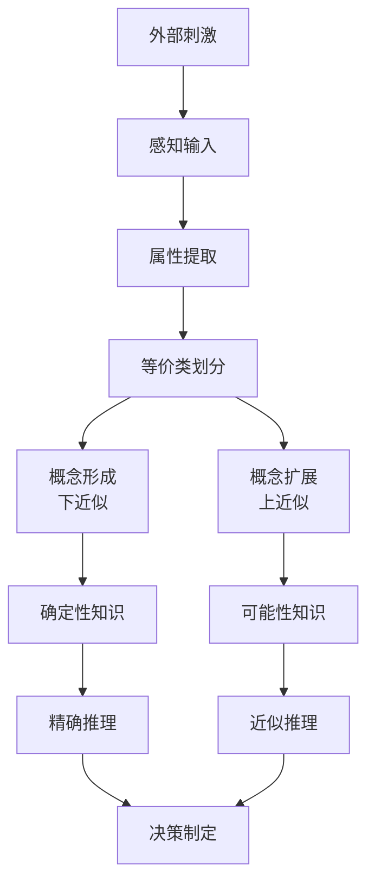
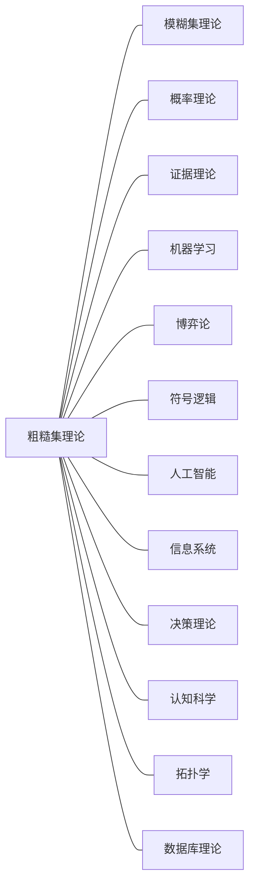

# 粗糙集合论的批判性分析：多视角解读与形式化探究

## 目录

- [粗糙集合论的批判性分析：多视角解读与形式化探究](#粗糙集合论的批判性分析多视角解读与形式化探究)
  - [目录](#目录)
  - [形式理论基础](#形式理论基础)
    - [基础定义系统](#基础定义系统)
    - [近似操作形式化](#近似操作形式化)
    - [边界区域与精确度](#边界区域与精确度)
  - [核心定理与形式化证明](#核心定理与形式化证明)
    - [定理1：近似算子的代数性质](#定理1近似算子的代数性质)
    - [定理2：不相容测度理论](#定理2不相容测度理论)
    - [定理3：属性约简的基本性质](#定理3属性约简的基本性质)
  - [思维脉络演进](#思维脉络演进)
    - [理论发展的认知阶段](#理论发展的认知阶段)
    - [思维层次结构](#思维层次结构)
    - [隐喻与类比思维](#隐喻与类比思维)
  - [认知结构映射](#认知结构映射)
    - [认知过程的形式化表征](#认知过程的形式化表征)
    - [认知结构的层次表征](#认知结构的层次表征)
    - [认知负荷与粒度控制](#认知负荷与粒度控制)
  - [历史人物视角解读](#历史人物视角解读)
    - [Zdzisław Pawlak（1926-2006）](#zdzisław-pawlak1926-2006)
    - [Lotfi Zadeh（1921-2017）](#lotfi-zadeh1921-2017)
    - [Didier Dubois \& Henri Prade](#didier-dubois--henri-prade)
    - [Yiyu Yao](#yiyu-yao)
    - [Roman Słowiński](#roman-słowiński)
    - [Tsau Young Lin](#tsau-young-lin)
  - [跨学科理论联系](#跨学科理论联系)
    - [与形式理论的关联](#与形式理论的关联)
      - [拓扑学连接](#拓扑学连接)
      - [模态逻辑映射](#模态逻辑映射)
      - [形式概念分析对比](#形式概念分析对比)
    - [与计算理论的联系](#与计算理论的联系)
      - [计算复杂性结果](#计算复杂性结果)
      - [算法复杂度分析](#算法复杂度分析)
    - [与信息科学的关联](#与信息科学的关联)
      - [信息熵视角](#信息熵视角)
      - [信息粒度理论](#信息粒度理论)
    - [与AI的深层联系](#与ai的深层联系)
      - [机器学习透视](#机器学习透视)
      - [知识表征角度](#知识表征角度)
      - [神经-符号整合](#神经-符号整合)
  - [哲学与元理论视角](#哲学与元理论视角)
    - [认识论层面](#认识论层面)
    - [本体论思考](#本体论思考)
    - [方法论思考](#方法论思考)
  - [批判性分析](#批判性分析)
    - [理论局限性剖析](#理论局限性剖析)
      - [形式化体系局限](#形式化体系局限)
      - [计算复杂性挑战](#计算复杂性挑战)
      - [认知模型的简化](#认知模型的简化)
    - [与其他理论的优劣比较](#与其他理论的优劣比较)
      - [与模糊集理论比较](#与模糊集理论比较)
      - [与概率理论比较](#与概率理论比较)
      - [与证据理论比较](#与证据理论比较)
    - [发展潜力与未解难题](#发展潜力与未解难题)
      - [理论扩展方向](#理论扩展方向)
      - [开放问题清单](#开放问题清单)
  - [方法论反思](#方法论反思)
    - [形式科学中的启示](#形式科学中的启示)
    - [认知科学交叉启示](#认知科学交叉启示)
    - [哲学方法论思考](#哲学方法论思考)
  - [思维导图](#思维导图)
  - [理论类比与关联](#理论类比与关联)

## 形式理论基础

### 基础定义系统

粗糙集理论以信息系统为起点，定义为四元组：

$$\mathcal{I} = (U, A, V, f)$$

其中：

- $U$：非空有限对象集合（全域）
- $A$：非空有限属性集合
- $V = \bigcup_{a \in A} V_a$，$V_a$为属性$a$的值域
- $f: U \times A \rightarrow V$为信息函数

任意属性子集$P \subseteq A$定义的不可分辨关系：

$$IND(P) = \{(x,y) \in U \times U | \forall a \in P, f(x,a) = f(y,a)\}$$

该关系是等价关系，生成$U$上的等价类划分，记为$U/IND(P)$。

### 近似操作形式化

对任意$X \subseteq U$，$P$-下近似和$P$-上近似分别定义为：

$$\underline{P}(X) = \{x \in U | [x]_P \subseteq X\}$$
$$\overline{P}(X) = \{x \in U | [x]_P \cap X \neq \emptyset\}$$

其中$[x]_P$表示包含$x$的$P$-等价类。这对近似操作构成了一个对偶近似算子对。

### 边界区域与精确度

集合$X$相对于知识$P$的边界区域：
$$BN_P(X) = \overline{P}(X) - \underline{P}(X)$$

精确度测度：
$$\alpha_P(X) = \frac{|\underline{P}(X)|}{|\overline{P}(X)|}$$

粗糙度测度：
$$\rho_P(X) = 1 - \alpha_P(X) = 1 - \frac{|\underline{P}(X)|}{|\overline{P}(X)|}$$

## 核心定理与形式化证明

### 定理1：近似算子的代数性质

**定理陈述**：对于任意$X, Y \subseteq U$和$P \subseteq A$，下述性质成立：

1. $\underline{P}(X) \subseteq X \subseteq \overline{P}(X)$
2. $\underline{P}(\emptyset) = \overline{P}(\emptyset) = \emptyset$；$\underline{P}(U) = \overline{P}(U) = U$
3. $\overline{P}(X \cup Y) = \overline{P}(X) \cup \overline{P}(Y)$
4. $\underline{P}(X \cap Y) = \underline{P}(X) \cap \underline{P}(Y)$
5. $X \subseteq Y \Rightarrow \underline{P}(X) \subseteq \underline{P}(Y)$和$\overline{P}(X) \subseteq \overline{P}(Y)$
6. $\underline{P}(X^c) = (\overline{P}(X))^c$和$\overline{P}(X^c) = (\underline{P}(X))^c$
7. $\underline{P}(\underline{P}(X)) = \overline{P}(\underline{P}(X)) = \underline{P}(X)$
8. $\underline{P}(\overline{P}(X)) = \overline{P}(\overline{P}(X)) = \overline{P}(X)$

**证明**：
对于性质1：设$x \in \underline{P}(X)$，则有$[x]_P \subseteq X$。由于$x \in [x]_P$，因此$x \in X$，所以$\underline{P}(X) \subseteq X$。

设$x \in X$，则$x \in [x]_P$且$[x]_P \cap X \neq \emptyset$，所以$x \in \overline{P}(X)$，即$X \subseteq \overline{P}(X)$。

对于性质3（上近似的并集分配性）：
$$
\begin{align}
\overline{P}(X \cup Y) &= \{x \in U | [x]_P \cap (X \cup Y) \neq \emptyset\} \\
&= \{x \in U | ([x]_P \cap X) \cup ([x]_P \cap Y) \neq \emptyset\} \\
&= \{x \in U | [x]_P \cap X \neq \emptyset \lor [x]_P \cap Y \neq \emptyset\} \\
&= \{x \in U | [x]_P \cap X \neq \emptyset\} \cup \{x \in U | [x]_P \cap Y \neq \emptyset\} \\
&= \overline{P}(X) \cup \overline{P}(Y)
\end{align}
$$

对于性质6（对偶性）：
$$
\begin{align}
x \in \underline{P}(X^c) &\iff [x]_P \subseteq X^c \\
&\iff [x]_P \cap X = \emptyset \\
&\iff x \notin \overline{P}(X) \\
&\iff x \in (\overline{P}(X))^c
\end{align}
$$
因此$\underline{P}(X^c) = (\overline{P}(X))^c$。类似地可证$\overline{P}(X^c) = (\underline{P}(X))^c$。

### 定理2：不相容测度理论

**定理**：设$P, Q \subseteq A$为两个属性子集，$P$相对于$Q$的不相容度定义为：

$$k(P, Q) = \frac{|\{(x,y) \in U \times U | xIND(P)y \land \lnot(xIND(Q)y)\}|}{|U|^2}$$

则$k(P, Q) = 0$当且仅当$IND(P) \subseteq IND(Q)$。

**证明**：
$k(P, Q) = 0$意味着不存在$x, y \in U$使得$xIND(P)y$但$\lnot(xIND(Q)y)$，这等价于对任意$x, y \in U$，若$xIND(P)y$则$xIND(Q)y$，即$IND(P) \subseteq IND(Q)$。

### 定理3：属性约简的基本性质

**定理**：$P \subseteq A$为一属性约简，当且仅当：

1. $POS_P(D) = POS_A(D)$（保持分类能力）
2. $\forall a \in P$，$POS_{P-\{a\}}(D) \neq POS_P(D)$（最小性）

其中$D$为决策属性，$POS_P(D) = \bigcup_{X \in U/IND(D)} \underline{P}(X)$为$P$相对于$D$的正域。

**证明**：
必要性：若$P$为约简，则根据定义，$P$保持分类能力且是最小的，即满足条件1和2。

充分性：若满足条件1和2，则$P$保持与$A$相同的分类能力，且是最小的，故为约简。

## 思维脉络演进

### 理论发展的认知阶段

粗糙集理论思维脉络可分为四个主要阶段：

1. **初始形成期**（1982-1990）：
   - 从处理不完备信息需求出发
   - 数学形式化基础建立
   - 基本性质与定理证明

2. **拓展深化期**（1990-2000）：
   - 广义粗糙集理论发展
   - 变精度模型提出
   - 与其他不确定性理论比较研究

3. **应用探索期**（2000-2010）：
   - 数据挖掘与机器学习应用
   - 多粒度与多层次计算框架
   - 决策理论融合

4. **跨域融合期**（2010至今）：
   - 与深度学习结合
   - 大数据背景下的计算优化
   - 认知科学交叉研究

### 思维层次结构

粗糙集理论的思维层次可从以下维度剖析：

```text
级别1：基础形式系统（集合论基础、等价类划分、近似运算）
  ↑
级别2：扩展理论框架（广义关系、变精度模型、多粒度方法）
  ↑
级别3：应用算法体系（属性约简、规则提取、分类器设计）
  ↑
级别4：问题解决范式（数据分析、决策支持、知识发现）
  ↑
级别5：哲学认识论层（不确定性本质、知识表征、认知模型）
```

### 隐喻与类比思维

粗糙集理论中的核心隐喻：

1. **边界隐喻**：知识如同地图，有明确区域（下近似）、模糊边界（边界区域）和外部领域（上近似补）
2. **粒度隐喻**：知识获取如同通过不同分辨率镜头观察世界
3. **约简隐喻**：找出决策中的关键因素，如同提炼故事主线
4. **等价类隐喻**：观察者能力有限，只能按特定属性区分对象

## 认知结构映射

### 认知过程的形式化表征

粗糙集理论与认知过程的同构映射：

| 认知过程 | 粗糙集对应 |
|--------|----------|
| 感知对象区分 | 等价关系识别 |
| 概念形成 | 下近似操作 |
| 概念扩展 | 上近似操作 |
| 概念边界模糊 | 边界区域 |
| 认知简化 | 属性约简 |
| 决策规则形成 | 决策规则提取 |
| 认知不确定容忍 | 变精度粗糙集 |

### 认知结构的层次表征

认知结构中的三层次处理与粗糙集的对应：

1. **知觉层**：原始信息获取
   - 对应：信息系统中的对象-属性表

2. **概念形成层**：通过属性组合形成概念
   - 对应：属性子集导出的等价类划分

3. **推理决策层**：基于概念关系进行推理
   - 对应：决策规则与规则推理系统



### 认知负荷与粒度控制

粗糙集理论解释了人类认知中的粒度适应机制：

- **粗粒度认知**（较少属性）：
  - 降低认知负荷
  - 提高决策效率
  - 牺牲精确性
  - 对应于属性约简操作

- **细粒度认知**（更多属性）：
  - 提高区分能力
  - 增加认知负荷
  - 提高精确性
  - 对应于属性扩展操作

## 历史人物视角解读

### Zdzisław Pawlak（1926-2006）

作为粗糙集理论创始人，Pawlak最初意图是解决信息不完备条件下的分类问题。
他的视角强调：

> "世界的知识总是有界限的...粗糙集理论提供了一种数学工具来处理这种知识边界。"

他认为粗糙集在本质上与布尔代数、模态逻辑有深刻联系，并将其视为处理不确定性的第三种数学工具（区别于概率论和模糊集）。

Pawlak的核心贡献在于提出了"三界"思想：肯定域、否定域和边界域，这极大挑战了传统二值逻辑。

### Lotfi Zadeh（1921-2017）

模糊集理论创始人Zadeh对粗糙集的评价：

> "粗糙集理论与模糊集理论处理不确定性的方式根本不同。模糊集通过隶属度函数，而粗糙集通过近似边界。二者可以互补。"

Zadeh认为粗糙集优势在于：不需要额外参数，直接从数据中导出近似；
而局限在于：不能处理语义模糊性。

### Didier Dubois & Henri Prade

他们建立了粗糙集与可能性理论的桥梁：

> "粗糙集的上近似可解释为可能性分布，下近似解释为必然性分布。二者在处理认知不确定性时提供了互补视角。"

他们提出将粗糙集、模糊集和证据理论统一到"颗粒计算"框架中的思想。

### Yiyu Yao

Yao从拓扑学和模态逻辑角度重新诠释粗糙集：

> "粗糙集本质上是一种特殊的拓扑空间，其中闭集对应下近似，开集对应上近似补。"

他提出"三支决策"模型，将粗糙集应用于复杂决策问题，区分确定接受、确定拒绝和延迟决策三种状态。

### Roman Słowiński

Słowiński开创了"支配型粗糙集"（DRSA）：

> "传统粗糙集难以处理序数数据。支配型粗糙集通过引入支配关系，使理论适用于多准则决策分析。"

他的工作极大拓展了粗糙集在决策科学中的应用范围，特别是能处理偏好顺序关系。

### Tsau Young Lin

Lin探索了粗糙集在认知科学和人工智能中的深层意义：

> "粗糙集理论不仅是数学工具，更是理解人类认知中概念形成的关键。概念本质上就是对象的近似集合。"

他将粗糙集与神经网络结合，提出了"神经-粗糙"计算模型，用于知识发现和模式识别。

## 跨学科理论联系

### 与形式理论的关联

#### 拓扑学连接

粗糙集理论可重构为拓扑空间$(U, \tau)$：

- 下近似算子对应闭集运算
- 上近似算子对应开集补运算
- Kuratowski闭包算子与上近似算子同构

形式证明：算子$cl: 2^U \rightarrow 2^U$定义为$cl(X) = \overline{P}(X)$满足Kuratowski公理：

1. $cl(\emptyset) = \emptyset$
2. $X \subseteq cl(X)$
3. $cl(X \cup Y) = cl(X) \cup cl(Y)$
4. $cl(cl(X)) = cl(X)$

#### 模态逻辑映射

粗糙集可映射到S5模态逻辑系统：

- 下近似对应必然性算子$\square$
- 上近似对应可能性算子$\diamond$

满足以下公理：

1. $\square(p \rightarrow q) \rightarrow (\square p \rightarrow \square q)$
2. $\square p \rightarrow p$
3. $\square p \rightarrow \square\square p$
4. $\diamond p \rightarrow \square\diamond p$

#### 形式概念分析对比

| 粗糙集理论 | 形式概念分析 |
|----------|------------|
| 信息系统 | 形式背景 |
| 等价类 | 概念外延 |
| 属性集 | 概念内涵 |
| 属性约简 | 概念格约简 |

区别：形式概念分析强调概念间层次关系，粗糙集强调近似运算。

### 与计算理论的联系

#### 计算复杂性结果

1. **属性约简问题**：已证明为NP-难问题，通过规约自点覆盖问题
2. **最小属性约简**：不存在多项式时间近似算法（除非P=NP）
3. **决策规则生成**：最小规则集生成为#P-难问题

#### 算法复杂度分析

常见粗糙集算法复杂度：

- 粗糙集基本运算：$O(|U|^2)$
- 属性约简（穷举）：$O(2^{|A|} \cdot |U|^2)$
- 启发式属性约简：$O(|A|^2 \cdot |U|^2)$
- 基于差别矩阵的约简：$O(|A| \cdot |U|^2)$

### 与信息科学的关联

#### 信息熵视角

Shannon熵与粗糙集关联：定义条件熵$H(X|B)$为知识$B$下对集合$X$分类的不确定性：

$$H(X|B) = -\sum_{i=1}^n \frac{|X \cap [x_i]_B|}{|X|} \log \frac{|X \cap [x_i]_B|}{|[x_i]_B|}$$

粗糙集熵与约简：

- 属性重要度可用熵差$\sigma(a, B, X) = H(X|B) - H(X|B \cup \{a\})$表示
- 最优约简对应熵最小化问题

#### 信息粒度理论

信息粒化与粗糙集：

- 粗粒度：对应属性子集较小
- 细粒度：对应属性子集较大
- 多粒度粗糙集：使用多个粒度层次进行近似

### 与AI的深层联系

#### 机器学习透视

粗糙集在机器学习中的核心贡献：

1. **特征选择**：基于属性重要度的特征筛选
2. **规则归纳**：从数据中提取可解释规则
3. **不确定处理**：通过三域分类处理噪声数据
4. **可解释性**：提供白盒决策解释机制

#### 知识表征角度

粗糙集为AI知识表征提供三种基础机制：

1. **粒度表征**：通过等价类捕获知识粒度
2. **近似表征**：通过上下近似处理模糊概念
3. **归纳表征**：通过决策规则形成一般化知识

#### 神经-符号整合

粗糙集在神经-符号AI中的桥梁作用：

- 从连接主义模型中提取符号规则
- 将背景知识编码为网络结构约束
- 提供神经网络决策的可解释层

## 哲学与元理论视角

### 认识论层面

粗糙集理论挑战了传统认识论中三个核心假设：

1. **精确性假设**：传统认识论假设知识具有精确边界，而粗糙集承认知识的内在模糊性

2. **完备性假设**：传统假设可获得完备信息，而粗糙集理论建立在不完备信息基础上

3. **二值逻辑假设**：传统认为命题为真或假，粗糙集引入"边界区域"的第三域

粗糙集认识论立场可概括为"边界认识论"：知识总是相对于观察者的可辨别能力而定义，有其内在边界。

### 本体论思考

粗糙集理论暗示的本体论立场：

1. **关系本体论**：对象本身并非独立存在，而是通过与其他对象的关系（不可区分关系）定义

2. **相对主义**：知识的边界不是绝对的，而是相对于特定属性集（观察视角）

3. **粒度本体论**：现实世界在不同粒度层次上具有不同表征，没有"最终粒度"

### 方法论思考

粗糙集方法论带来三个重要转向：

1. **从定性到定量**：通过精确度、粗糙度等指标量化不确定性

2. **从静态到动态**：知识随可用信息变化而动态调整

3. **从单一到多视角**：同一对象集可有多种划分方式，对应多种知识表征

## 批判性分析

### 理论局限性剖析

#### 形式化体系局限

1. **离散性限制**：标准粗糙集仅适用于离散属性，连续属性需通过离散化处理，不可避免地损失信息

2. **等价关系约束**：真实世界关系常非自反、对称或传递，等价关系假设过强

3. **静态表征问题**：缺乏内在机制处理动态变化的信息系统

4. **标度依赖性**：粗糙集测度（如精确度）对样本量敏感，不具尺度不变性

#### 计算复杂性挑战

1. **可扩展性问题**：对大规模数据集，基本粗糙集运算复杂度高达$O(|U|^2)$

2. **组合爆炸**：属性约简是NP-难问题，属性数量增加导致组合爆炸

3. **增量计算缺失**：缺乏有效增量算法应对动态数据

#### 认知模型的简化

1. **线性属性假设**：假设属性间独立，忽略复杂交互

2. **知识表征单一性**：仅通过等价类表征知识，缺乏层次和上下文结构

3. **决策单调性假设**：隐含假设更多信息总是更好，忽略"更少有时更好"的认知现象

### 与其他理论的优劣比较

#### 与模糊集理论比较

| 方面 | 粗糙集 | 模糊集 |
|-----|-------|-------|
| 不确定性来源 | 信息粒度不足 | 边界模糊性 |
| 形式化基础 | 等价关系 | 隶属度函数 |
| 主观性程度 | 低（从数据导出） | 高（需人工定义隶属度） |
| 计算复杂性 | 高（集合运算） | 低（函数计算） |
| 解释性 | 高（基于原始数据） | 中（基于隶属函数） |

#### 与概率理论比较

| 方面 | 粗糙集 | 概率理论 |
|-----|-------|---------|
| 不确定性表征 | 边界区域 | 概率分布 |
| 背景假设 | 最少（仅需等价关系） | 较多（如独立性假设） |
| 数据需求 | 少（仅需一次观察） | 多（需统计样本） |
| 推理机制 | 集合论推理 | 概率推理 |
| 适用场景 | 分类与规则提取 | 预测与风险评估 |

#### 与证据理论比较

| 方面 | 粗糙集 | 证据理论 |
|-----|-------|---------|
| 基本框架 | 近似空间 | 框架识别 |
| 不确定性测度 | 精确度/粗糙度 | 信任度/似然度 |
| 组合机制 | 集合运算 | 证据组合规则 |
| 计算复杂性 | $O(\|U\|^2)$ | $O(2^{\|Θ\|})$ |
| 语义解释 | 直观（基于样例） | 抽象（基于信任分配） |

### 发展潜力与未解难题

#### 理论扩展方向

1. **非经典逻辑基础**：探索直觉主义逻辑、量子逻辑下的粗糙集
2. **动态粗糙集模型**：发展处理时变数据的粗糙集框架
3. **无监督粗糙集**：无需决策属性的聚类粗糙集方法
4. **深度粗糙模型**：结合深度学习与粗糙集的混合架构

#### 开放问题清单

1. **最小约简唯一性**：在何种条件下信息系统存在唯一最小约简？
2. **变精度参数选择**：如何自适应确定变精度粗糙集中的精度参数？
3. **动态粗糙度测度**：如何定义具有时间维度的粗糙度测度？
4. **粗糙集公理化**：是否存在不依赖等价关系的粗糙集公理系统？
5. **认知复杂度**：如何形式化定义基于粗糙集的认知复杂度测度？

## 方法论反思

### 形式科学中的启示

粗糙集理论为形式科学提供了处理不确定性的新范式，其启示在于：

1. 形式化与不确定性可以共存，精确的数学可以描述不精确现象
2. 多值逻辑（三值或更多）在形式化科学中的价值
3. 知识相对性原则：知识总是相对于特定观察框架

### 认知科学交叉启示

粗糙集理论对认知科学的启示：

1. 提供了概念形成的数学模型，解释了人类如何从实例归纳出概念
2. 解释了认知经济原则：通过属性约简实现认知资源最优利用
3. 为分类决策中的延迟决策提供了形式化解释
4. 阐明了多粒度认知的机制：人类在不同抽象层次灵活切换

### 哲学方法论思考

粗糙集理论体现的哲学方法论：

1. **构造主义视角**：知识不是被发现的，而是基于可获得属性构造的
2. **整体论思维**：对象只能在整体关系网络中被理解
3. **辩证思维**（非正反合模式）：边界区域作为确定与不确定的统一
4. **实用主义立场**：知识价值由其解决问题的能力决定

## 思维导图

```text
粗糙集合论
├── 形式理论基础
│   ├── 信息系统 (U,A,V,f)
│   ├── 不可分辨关系
│   ├── 近似操作
│   └── 精确度测度
│
├── 核心定理体系
│   ├── 近似算子代数性质
│   ├── 不相容测度理论
│   ├── 属性约简性质
│   └── 决策规则提取
│
├── 理论扩展
│   ├── 广义粗糙集
│   ├── 变精度模型
│   ├── 支配型粗糙集
│   └── 多粒度计算
│
├── 认知科学映射
│   ├── 概念形成机制
│   ├── 认知粒度调控
│   ├── 决策过程模型
│   └── 不确定性容忍
│
├── 哲学基础
│   ├── 边界认识论
│   ├── 关系本体论
│   ├── 知识相对性
│   └── 三域逻辑
│
├── 跨学科联系
│   ├── 拓扑学连接
│   ├── 模态逻辑映射
│   ├── 信息理论关联
│   └── AI系统整合
│
├── 应用领域
│   ├── 数据挖掘
│   ├── 机器学习
│   ├── 决策支持
│   ├── 模式识别
│   └── 知识工程
│
└── 批判与反思
    ├── 理论局限
    ├── 方法论价值
    ├── 未解问题
    └── 发展前景
```

## 理论类比与关联


