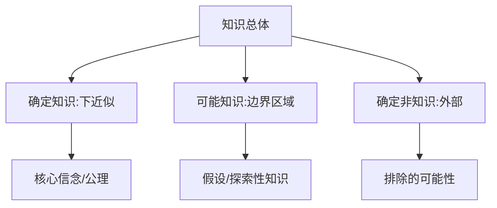
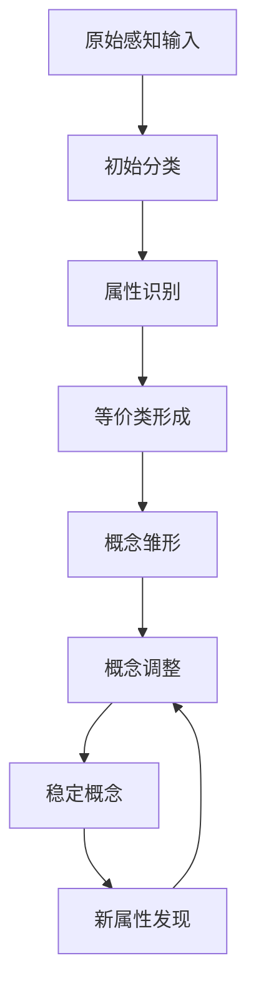
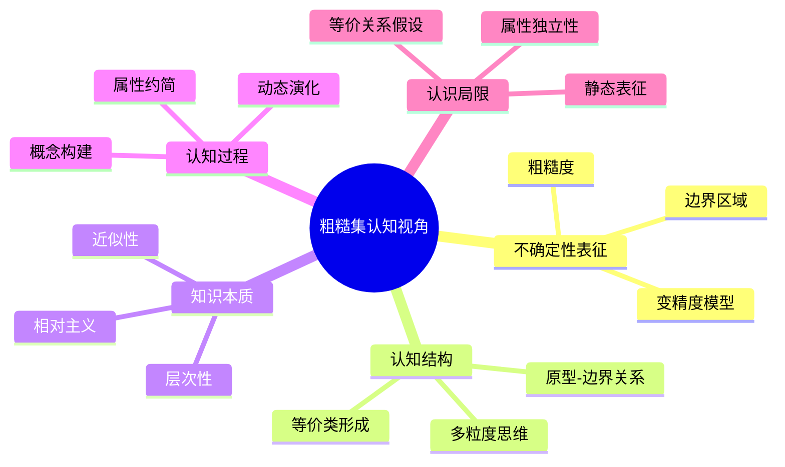

# 粗糙集合论的认知与认识论视角分析

## 目录

- [粗糙集合论的认知与认识论视角分析](#粗糙集合论的认知与认识论视角分析)
  - [目录](#目录)
  - [认知表征与粗糙集本体](#认知表征与粗糙集本体)
    - [从认知结构到数学形式化](#从认知结构到数学形式化)
    - [认知负荷与粗糙近似](#认知负荷与粗糙近似)
  - [认识论基础](#认识论基础)
    - [知识的相对性与上下文依赖](#知识的相对性与上下文依赖)
    - [认识的边界与不可知性](#认识的边界与不可知性)
  - [知识表征的多层次结构](#知识表征的多层次结构)
    - [三层次知识架构](#三层次知识架构)
    - [知识获取的认知过程](#知识获取的认知过程)
  - [不确定性的认知机制](#不确定性的认知机制)
    - [不确定性的三重来源](#不确定性的三重来源)
    - [认知偏差与近似策略](#认知偏差与近似策略)
  - [概念形成与边界模糊性](#概念形成与边界模糊性)
    - [概念的动态构建过程](#概念的动态构建过程)
    - [原型理论与粗糙集表征](#原型理论与粗糙集表征)
  - [粒度思维与多尺度认知](#粒度思维与多尺度认知)
    - [认知粒度与多层次理解](#认知粒度与多层次理解)
    - [层次化知识与认知跃迁](#层次化知识与认知跃迁)
  - [理论局限与认知反思](#理论局限与认知反思)
    - [粗糙集理论的认知局限](#粗糙集理论的认知局限)
    - [认识论反思](#认识论反思)

## 认知表征与粗糙集本体

### 从认知结构到数学形式化

人类认知系统面对复杂世界时，采用分类、抽象和近似的策略。粗糙集合论提供了这一过程的形式化描述：

**认知映射关系表**：

| 认知过程 | 粗糙集对应物 | 形式化表示 |
|---------|------------|-----------|
| 感知区分 | 不可分辨关系 | $IND(B)$ |
| 概念形成 | 上/下近似 | $\underline{B}(X), \overline{B}(X)$ |
| 类别边界 | 边界区域 | $BND_B(X) = \overline{B}(X) - \underline{B}(X)$ |
| 知识精确度 | 粗糙度测度 | $\rho_B(X) = 1 - \frac{\|\underline{B}(X)\|}{\|\overline{B}(X)\|}$ |

### 认知负荷与粗糙近似

**定理：认知经济原则**  
认知系统倾向于使用最小属性集合进行分类决策，这与粗糙集中的属性约简原理对应。

形式化表述：对于认知系统处理的信息系统$(U, A \cup \{d\})$，存在最优属性子集$R \subseteq A$，使得：

$$POS_R(D) = POS_A(D)$$

且$|R|$最小，其中$POS_B(D)$表示能够确定决策的对象集合。

**认知依据**：Miller的"7±2法则"表明人类工作记忆容量有限，属性约简提供了认知经济的形式化机制。

## 认识论基础

### 知识的相对性与上下文依赖

粗糙集合论挑战了传统西方认识论中知识的绝对确定性，引入了相对主义视角：

1. **知识的语境性**：对象$x$是否属于概念$X$依赖于可用属性集$B$
2. **认识的层次性**：下近似$\underline{B}(X)$对应"确知"，上近似$\overline{B}(X)$对应"可知"，边界区域$BND_B(X)$对应"未知"

**形式化命题**：知识相对性原理

对任意概念$X \subseteq U$和属性集$B, C \subseteq A$，如果$B \subset C$，则：

1. $\underline{B}(X) \subseteq \underline{C}(X)$
2. $\overline{B}(X) \supseteq \overline{C}(X)$
3. $\rho_B(X) \geq \rho_C(X)$

**哲学解读**：这表明知识精确度随可用信息增加而提高，反映了认识的渐进本质。

### 认识的边界与不可知性

粗糙集理论揭示的边界区域呼应了康德哲学中"物自体"与"现象"的区分：

- **下近似**：对应现象世界中的确定知识
- **边界区域**：对应接近物自体的模糊地带
- **属性约束**：反映认知主体受限于先验范畴

粗糙集理论与Popper的"证伪主义"也存在联系：下近似区域提供了"可证伪"的硬核知识，而边界区域则体现了科学探索的前沿地带。

## 知识表征的多层次结构

### 三层次知识架构

粗糙集理论隐含了知识的三层结构，与认知科学中的知识表征理论相呼应：

### 知识获取的认知过程

粗糙集近似操作模拟了认知主体的学习过程：

1. **初始认知状态**：属性集$B_0$，对应粗糙度$\rho_{B_0}(X)$
2. **学习过程**：获取新属性，$B_0 \rightarrow B_1 \rightarrow ... \rightarrow B_n$
3. **认知精确化**：$\rho_{B_0}(X) \geq \rho_{B_1}(X) \geq ... \geq \rho_{B_n}(X)$

**命题**：认知收敛定理  
任何概念学习过程存在理论上限，即使获取所有可能属性$A$，某些概念$X$仍然可能存在$\rho_A(X) > 0$。

**证明**：设$X$是目标概念。如果存在$x, y \in U$满足$(x, y) \in IND(A)$但$x \in X, y \not\in X$，则$x \in BND_A(X)$，因此$\rho_A(X) > 0$。

**认知意义**：这表明某些概念划分在给定认知框架内本质上无法精确获取，体现了认识的根本限制。

## 不确定性的认知机制

### 不确定性的三重来源

粗糙集理论区分了认知不确定性的来源：

1. **粒度不确定性**：由不可分辨关系导致（认知分辨率）
2. **边界不确定性**：由概念边界模糊性导致（概念清晰度）
3. **组合不确定性**：由多属性交互导致（属性相关性）

各种不确定性的形式化表示：

- 粒度不确定性度量：$GU(B) = \frac{1}{|U|^2}|IND(B)|$
- 边界不确定性度量：$BU_B(X) = \frac{|BND_B(X)|}{|U|}$
- 组合不确定性度量：$SU(B) = H(B) - \sum_{a \in B}H(\{a\})$，其中$H$为信息熵

### 认知偏差与近似策略

人类决策中的认知偏差可通过粗糙集的不同近似策略建模：

- **保守策略**（下近似优先）：避免错误，对应风险规避型认知
- **冒险策略**（上近似优先）：追求全面，对应机会寻求型认知
- **平衡策略**（β-精度模型）：在风险与机会间平衡

**定理**：个体决策行为可通过变精度参数β刻画：

- 风险规避者：β → 0
- 风险中立者：β ≈ 0.3
- 风险偏好者：β → 0.5

## 概念形成与边界模糊性

### 概念的动态构建过程

从认知角度，概念不是预设的，而是在交互中动态形成：

**形式化表征**：概念形成可建模为时变粗糙集序列：

$$X_t = \{\underline{B_t}(X), \overline{B_t}(X)\}$$

其中$t$表示认知发展时间点，$B_t$为时刻$t$可用的属性集。

### 原型理论与粗糙集表征

心理学中的原型理论（Rosch）与粗糙集理论有深刻联系：

- 原型对应下近似中的典型成员
- 边界案例对应边界区域中的元素

**定理**：原型-边界关系  
设$p_X$为概念$X$的原型度量函数，则对于$x \in U$：

- 如果$x \in \underline{B}(X)$，则$p_X(x)$较高
- 如果$x \in BND_B(X)$，则$p_X(x)$中等
- 如果$x \not\in \overline{B}(X)$，则$p_X(x)$较低

## 粒度思维与多尺度认知

### 认知粒度与多层次理解

人类思维在不同抽象层次间切换的能力可通过粗糙集的多粒度框架形式化：

**定义**：粒度结构是一个三元组$GS = (U, \{π_i | i \in I\}, \preceq)$，其中$\{π_i\}$是$U$上的划分族，$\preceq$是划分上的偏序关系。

**认知解释**：

- 精细粒度：关注细节，局部思维（分析性）
- 粗糙粒度：关注整体，全局思维（综合性）

多粒度认知能力的形式化：对任意概念$X$，认知系统能够在多个粒度层次$\{π_i\}$下同时维持近似表示：

$$MG(X) = \{(\underline{π_i}(X), \overline{π_i}(X)) | i \in I\}$$

### 层次化知识与认知跃迁

知识体系的层次化结构可通过粗糙集商空间（quotient space）理论刻画：

如果$π_j \preceq π_i$（$π_j$比$π_i$更精细），则存在一个自然映射：

$$f_{ji}: U/π_j \rightarrow U/π_i$$

这种映射对应知识在不同抽象层次间的转换，形成了认知的垂直结构。

**定理**：层次间信息保持  
对任意概念$X$和粒度$π_j \preceq π_i$：

$$f_{ji}(\underline{π_j}(X)) \subseteq \underline{π_i}(X)$$
$$f_{ji}(\overline{π_j}(X)) \supseteq \overline{π_i}(X)$$

**认知意义**：高层抽象可能丢失细节信息，但保证基本框架不变。这解释了为什么不同抽象层次的思考会产生不同见解。

## 理论局限与认知反思

### 粗糙集理论的认知局限

1. **静态表征问题**：标准粗糙集难以捕捉概念演化的动态过程
2. **等价关系假设**：人类认知中的相似性通常是非对称、不传递的
3. **属性独立性**：忽视了属性间复杂交互对认知的影响
4. **上下文隔离**：未考虑更广泛的社会文化语境对认知的影响

### 认识论反思

粗糙集理论提醒我们：

1. **认识的有限性**：知识总是相对于可用信息系统
2. **边界思维的价值**：不确定性是知识的内在特征，而非缺陷
3. **多视角整合**：不同粒度的认知共同构成完整的理解
4. **认知谦逊**：承认某些概念的本质模糊性，反对绝对确定性

粗糙集合论既是处理不确定性的数学工具，也是理解人类认知过程的哲学镜像，它揭示了知识的根本限制与可能性，提供了一种在确定性与不确定性之间寻求平衡的认识论框架。
