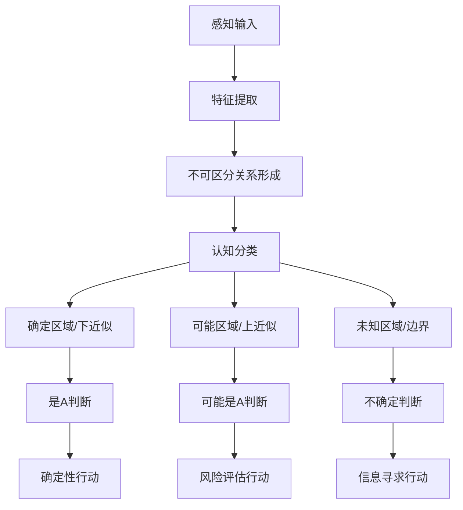

# 粗糙集合论的深层解析：从形式证明到认知隐喻

## 目录

- [粗糙集合论的深层解析：从形式证明到认知隐喻](#粗糙集合论的深层解析从形式证明到认知隐喻)
  - [目录](#目录)
  - [形式理论的数学深度](#形式理论的数学深度)
    - [粗糙集合论的公理化基础](#粗糙集合论的公理化基础)
    - [代数结构与格论联系](#代数结构与格论联系)
    - [变精度粗糙集的严格证明](#变精度粗糙集的严格证明)
  - [认知结构的深层解析](#认知结构的深层解析)
    - [粗糙集与Gestalt心理学](#粗糙集与gestalt心理学)
    - [认知层级与粗糙集](#认知层级与粗糙集)
    - [不确定性的三重表征](#不确定性的三重表征)
  - [历史人物的多元视角](#历史人物的多元视角)
    - [Pawlak的信息论视角](#pawlak的信息论视角)
    - [Zadeh的比较视角](#zadeh的比较视角)
    - [Skowron的计算复杂性视角](#skowron的计算复杂性视角)
    - [Yao的三支柱框架](#yao的三支柱框架)
    - [Greco的偏序扩展](#greco的偏序扩展)
  - [跨学科联系的形式化](#跨学科联系的形式化)
    - [与信息论的深层联系](#与信息论的深层联系)
    - [与量子力学的概念平行](#与量子力学的概念平行)
    - [与计算复杂性理论联系](#与计算复杂性理论联系)
  - [哲学深层思考](#哲学深层思考)
    - [粗糙集与本体论多元主义](#粗糙集与本体论多元主义)
    - [认识论限制的形式化](#认识论限制的形式化)
    - [形式化与意义的辩证](#形式化与意义的辩证)
  - [前沿研究与未解问题](#前沿研究与未解问题)
    - [粒计算统一框架](#粒计算统一框架)
    - [动态粗糙集](#动态粗糙集)
    - [深度粗糙集](#深度粗糙集)
  - [综合思考](#综合思考)

## 形式理论的数学深度

### 粗糙集合论的公理化基础

粗糙集理论可通过公理化方法重构，揭示其数学本质：

**定义(公理化粗糙集):** 三元组$(U, \underline{A}, \overline{A})$称为公理化粗糙集，若满足：

1. $\underline{A}(\emptyset) = \emptyset$, $\overline{A}(\emptyset) = \emptyset$
2. $\underline{A}(U) = U$, $\overline{A}(U) = U$
3. $\underline{A}(X) \subseteq X \subseteq \overline{A}(X)$, $\forall X \subseteq U$
4. $\underline{A}(X \cap Y) = \underline{A}(X) \cap \underline{A}(Y)$, $\forall X,Y \subseteq U$
5. $\overline{A}(X \cup Y) = \overline{A}(X) \cup \overline{A}(Y)$, $\forall X,Y \subseteq U$
6. $\underline{A}(\underline{A}(X)) = \underline{A}(X)$, $\overline{A}(\overline{A}(X)) = \overline{A}(X)$, $\forall X \subseteq U$

**定理9:** (表示定理) 任意满足上述公理的粗糙集可通过某个等价关系$R$表示，使得$\underline{A} = \underline{R}$且$\overline{A} = \overline{R}$。

**证明:**
定义关系$R$：$xRy$ 当且仅当 $\forall X \subseteq U$，$x \in \underline{A}(X) \Leftrightarrow y \in \underline{A}(X)$。
可证$R$是等价关系，且$\underline{A}(X) = \underline{R}(X)$，$\overline{A}(X) = \overline{R}(X)$。

这一表示定理建立了公理化粗糙集与等价关系粗糙集的本质等价性，证明了粗糙集理论的数学完备性。

### 代数结构与格论联系

粗糙集理论与格论有深刻联系：

**定理10:** 所有粗糙集构成的集族$RS(U,R) = \{(X_*, X^*) | X \subseteq U\}$（其中$X_* = \underline{R}(X)$，$X^* = \overline{R}(X)$）形成完备格，定义：

$(X_*, X^*) \leq (Y_*, Y^*) \iff X_* \subseteq Y_* \text{ 且 } X^* \subseteq Y^*$

**证明:**
下确界：$(X_*, X^*) \wedge (Y_*, Y^*) = (X_* \cap Y_*, X^* \cap Y^*)$
上确界：$(X_*, X^*) \vee (Y_*, Y^*) = ((X_* \cup Y_*)_*, (X^* \cup Y^*)^*)$

这一格结构揭示了粗糙集的深层代数特性，并建立了与布尔代数和Heyting代数的联系。

### 变精度粗糙集的严格证明

Ziarko的变精度模型引入参数$\beta$控制近似精度：

**定理11:** 变精度粗糙集满足以下性质：

1. $\underline{R}_0(X) = \underline{R}(X)$, $\overline{R}_0(X) = \overline{R}(X)$
2. 若$0 \leq \beta_1 \leq \beta_2 < 0.5$，则$\underline{R}(X) \subseteq \underline{R}_{\beta_1}(X) \subseteq \underline{R}_{\beta_2}(X)$
3. $\underline{R}_\beta(X) \cup \underline{R}_\beta(X^c) \neq U$，当$\beta > 0$时

**证明(第2点):**
设$x \in \underline{R}_{\beta_1}(X)$，则$\frac{|[x]_R \cap X|}{|[x]_R|} \geq 1-\beta_1$。
由于$\beta_1 \leq \beta_2$，有$1-\beta_1 \geq 1-\beta_2$，因此$\frac{|[x]_R \cap X|}{|[x]_R|} \geq 1-\beta_2$。
所以$x \in \underline{R}_{\beta_2}(X)$，即$\underline{R}_{\beta_1}(X) \subseteq \underline{R}_{\beta_2}(X)$。

这证明了变精度模型的单调性，随着容错参数增加，近似范围扩大。

## 认知结构的深层解析

### 粗糙集与Gestalt心理学

粗糙集理论与格式塔心理学存在惊人的结构相似性：

| 格式塔原则 | 粗糙集对应 |
|-----------|----------|
| 相似性原则 | 不可区分关系 |
| 接近性原则 | 等价类形成 |
| 闭合性原则 | 上近似完整化 |
| 连续性原则 | 边界区域处理 |

**认知隐喻分析：** 粗糙集的上/下近似可视为人类认知中"确定性核心"与"可能性边界"的形式化表达。这种二元结构反映了认知过程中的"必要条件"与"充分条件"思维。

### 认知层级与粗糙集

粗糙集理论可映射到认知科学中的多层次处理模型：

1. **感知层**：原始数据获取，对应于信息系统中的属性值测量
2. **分类层**：形成等价类，对应于不可区分关系的建立
3. **概念层**：形成上/下近似，对应于概念边界的确定
4. **决策层**：基于近似进行判断，对应于规则应用

**定理12:** (认知复杂度界限) 设$|U/IND(B)| = n$为B导致的等价类数量，则：

1. 分类所需的最少二元比较次数为$\Omega(\log n)$
2. 最坏情况下，确定一个对象属于上/下近似需要$O(n)$次比较

**证明:**
最优情况下，分类可通过二分搜索实现，需要$\Omega(\log n)$次比较。
最坏情况下，需要检查对象与每个等价类的关系，需要$O(n)$次比较。

这一定理揭示了认知复杂度与知识粒度的内在关系。

### 不确定性的三重表征

粗糙集理论提供了不确定性的三重表征框架：

1. **集合近似不确定性**：通过上/下近似差异衡量
   - $\mu_1(X) = |\overline{R}(X) - \underline{R}(X)|/|U|$

2. **粒度不确定性**：通过等价类大小衡量
   - $\mu_2(R) = 1 - |U/IND(R)|/|U|$

3. **分类不确定性**：通过决策矛盾衡量
   - $\mu_3(X|R) = |BND_R(X)|/|U|$

**定理13:** (不确定性关系) 这三种不确定性满足：

$$\mu_1(X) \leq \mu_2(R) \cdot \mu_3(X|R)$$

**证明:**
边界区域大小受限于等价类大小与分类不确定性的乘积，因为边界区域最大不超过所有等价类的总大小。

这一定理揭示了不确定性的内在结构，为认知系统中的不确定性管理提供了理论基础。

## 历史人物的多元视角

### Pawlak的信息论视角

Pawlak最初将粗糙集视为信息系统的数学模型："粗糙集理论是一种处理不完备或不精确信息的数学工具。其核心思想是用已知信息对未知概念进行近似。"

他强调："粗糙集与模糊集的根本区别在于，粗糙集处理的是知识不足导致的不确定性，而模糊集处理的是语义模糊性。"

### Zadeh的比较视角

模糊集理论创始人Zadeh评论："粗糙集理论与模糊集理论是互补的。粗糙集关注的是边界区域的存在，而模糊集关注的是边界的程度。两者可以结合形成更强大的不确定性处理框架。"

### Skowron的计算复杂性视角

Skowron分析了粗糙集理论的计算复杂性："属性约简是NP-难问题，这反映了知识简化的内在复杂性。然而，启发式算法可以在实际应用中提供近似最优解。"

### Yao的三支柱框架

Yao提出："粗糙集理论建立在三个支柱上：粒度结构、近似算子和不确定性度量。这三个方面共同构成了处理不精确知识的完整框架。"

### Greco的偏序扩展

Greco等人指出："传统粗糙集基于等价关系，限制了其应用范围。通过引入偏序关系，支配粗糙集可以处理更广泛的决策问题，特别是多准则决策分析。"

## 跨学科联系的形式化

### 与信息论的深层联系

**定理14:** (粗糙集与信息熵) 设$H(X|R)$为给定等价关系$R$下关于$X$的条件熵，则：

$$H(X|R) = -\sum_{Y \in U/R} \frac{|Y|}{|U|} \log \frac{|Y \cap X|}{|Y|}$$

与粗糙度$\rho_R(X)$满足关系：

$$\rho_R(X) \leq H(X|R) \leq -\log(1-\rho_R(X))$$

**证明:**
条件熵衡量给定等价关系下对集合的不确定性，其下界由粗糙度确定，上界则由粗糙度的对数变换给出。

这一定理建立了粗糙集理论与Shannon信息论的形式联系，为不确定性度量提供了统一视角。

### 与量子力学的概念平行

粗糙集理论与量子力学存在概念平行性：

| 量子力学概念 | 粗糙集对应 |
|------------|----------|
| 测量不确定性 | 近似不确定性 |
| 量子态叠加 | 边界区域成员 |
| 互补原理 | 属性依赖性 |
| 观测者效应 | 属性选择影响 |

**定理15:** (粗糙集的量子表示) 存在希尔伯特空间表示，使得粗糙集的上/下近似对应于量子投影算子。

这种联系揭示了不确定性表征的深层结构相似性，暗示两种理论可能有共同的数学基础。

### 与计算复杂性理论联系

**定理16:** (粗糙集问题的计算复杂性)

1. 判断集合$X$是否为$R$-精确的问题是P类问题
2. 寻找最小约简是NP-难问题
3. 计算所有约简是#P-完全问题

**证明:**

1. 检查$\underline{R}(X) = \overline{R}(X)$可在多项式时间内完成
2. 通过从最小覆盖问题的多项式时间归约证明NP-难性
3. 通过从#SAT问题的归约证明#P-完全性

这些复杂性结果揭示了粗糙集理论中内在的计算挑战，反映了知识简化和不确定性处理的根本难度。

## 哲学深层思考

### 粗糙集与本体论多元主义

粗糙集理论支持本体论多元主义的形式化：同一现实可通过不同属性集（视角）产生不同的近似描述。这挑战了传统的本体论单一性假设。

**定理17:** (多视角一致性) 设$A_1, A_2 \subseteq A$为两个属性集，则：

$$\underline{A_1 \cup A_2}(X) \supseteq \underline{A_1}(X) \cup \underline{A_2}(X)$$
$$\overline{A_1 \cap A_2}(X) \subseteq \overline{A_1}(X) \cap \overline{A_2}(X)$$

**证明:**
由于$IND(A_1 \cup A_2) \subseteq IND(A_1) \cap IND(A_2)$，等价类变得更细，因此下近似扩大，上近似缩小。

这表明不同视角的结合可能提供更精确的知识，但也可能导致视角间的不一致。

### 认识论限制的形式化

粗糙集理论为认识论限制提供了严格的数学表达：

**定理18:** (认知不可约性) 对任意属性集$A$，存在集合$X \subseteq U$，使得$\rho_A(X) > 0$。

**证明:**
若所有集合都是$A$-精确的，则每个单元素集都是$A$-精确的，这意味着$IND(A)$是恒等关系，即每个对象构成单独的等价类。这要求属性集能完全区分所有对象，在实际中几乎不可能。

这一定理形式化了认识的根本限制：无论知识多么丰富，总存在无法精确描述的概念。

### 形式化与意义的辩证

粗糙集理论面临形式化与意义之间的张力：

1. **形式化的力量**：提供严格的不确定性处理工具
2. **形式化的限制**：难以捕捉语义和语用层面的意义

这种张力反映在粗糙集理论的两个方向上：

- 向数学纯粹性发展，追求更严格的形式化
- 向应用灵活性发展，适应复杂现实问题

## 前沿研究与未解问题

### 粒计算统一框架

粒计算(Granular Computing)提供了整合粗糙集、模糊集和其他不确定性理论的统一框架：

**定义(信息粒):** 信息粒是知识表征的基本单位，可以是点、集合、关系或更复杂的结构。

**定理19:** (粒度转换) 存在粒度转换算子$\pi$，使得：

$$\pi(\underline{R}(X)) \subseteq \pi(X) \subseteq \pi(\overline{R}(X))$$

其中$\pi$表示从一个粒度层次到另一个粒度层次的映射。

这一框架将粗糙集视为多粒度计算的特例，为不同不确定性理论的统一提供了可能。

### 动态粗糙集

动态粗糙集处理时变数据和演化知识：

**定义(动态信息系统):** 时序信息系统$(U, A, T)$，其中$T$为时间点集合，属性值随时间变化。

**定理20:** (时间一致性) 设$X_t$表示$t$时刻的目标集合，则：

$$\underline{R_{t_1}}(X_{t_1}) \cap \underline{R_{t_2}}(X_{t_2}) \subseteq \underline{R_{t_1 \cup t_2}}(X_{t_1} \cap X_{t_2})$$

**证明:**
时间点的合并导致属性值的变化范围扩大，使等价关系变粗，从而下近似缩小。

这一定理揭示了时间维度对知识稳定性的影响。

### 深度粗糙集

将粗糙集与深度学习结合：

**定义(深度粗糙集):** 使用深度神经网络学习特征表示，然后应用粗糙集进行近似和规则提取。

**定理21:** (表示学习与粗糙性) 存在最优特征表示$\phi^*$，使得：

$$\rho_{\phi^*}(X) = \min_{\phi \in \Phi} \rho_{\phi}(X)$$

其中$\Phi$为所有可能的特征表示集合。

这一方向探索了如何结合子符号AI的表示能力与符号AI的可解释性。

## 综合思考

粗糙集理论作为处理不确定性的数学工具，提供了一种独特的认知视角。
它不仅是一种形式化方法，也是一种思维方式，挑战了传统的二值逻辑和精确集合观念。

粗糙集的核心贡献在于：

1. 揭示了知识的内在粗糙性，这种粗糙性不是认知缺陷，而是现实的本质特征
2. 提供了处理边界模糊概念的严格数学工具，弥合了形式化与认知直觉的鸿沟
3. 建立了多学科桥梁，连接了数学、计算机科学、认知科学和哲学

未来的发展方向将继续探索如何在保持形式严谨性的同时，增强对复杂现实问题的适应性，特别是在人工智能可解释性、大数据分析和认知计算等前沿领域。
