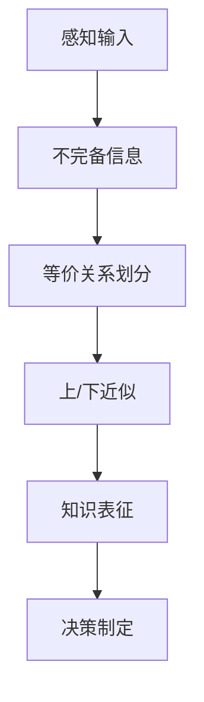
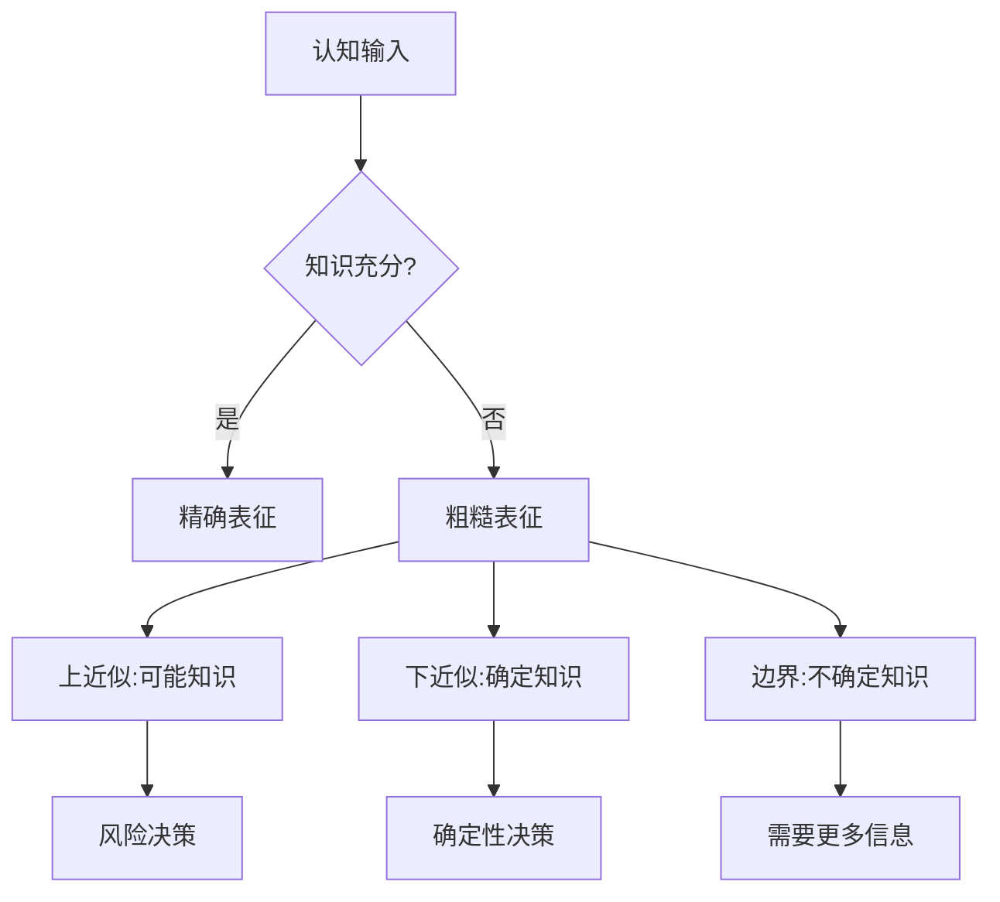

# 粗糙集合论的批判性分析

## 目录

- [粗糙集合论的批判性分析](#粗糙集合论的批判性分析)
  - [目录](#目录)
  - [理论基础](#理论基础)
    - [基本概念](#基本概念)
  - [核心定理与证明](#核心定理与证明)
    - [定理1：近似集合的性质](#定理1近似集合的性质)
    - [定理2：粗糙度测度](#定理2粗糙度测度)
    - [定理3：属性依赖](#定理3属性依赖)
    - [定理4：属性约简](#定理4属性约简)
  - [认知结构与表征](#认知结构与表征)
    - [粗糙集与认知粒度](#粗糙集与认知粒度)
    - [决策表与决策规则](#决策表与决策规则)
  - [历史发展与人物贡献](#历史发展与人物贡献)
    - [早期阶段 (1982-1990)](#早期阶段-1982-1990)
    - [扩展阶段 (1990-2000)](#扩展阶段-1990-2000)
    - [整合阶段 (2000-2010)](#整合阶段-2000-2010)
    - [现代阶段 (2010至今)](#现代阶段-2010至今)
  - [与其他理论的关联](#与其他理论的关联)
    - [粗糙集与模糊集的比较](#粗糙集与模糊集的比较)
  - [应用领域](#应用领域)
  - [批判性思考](#批判性思考)
    - [理论局限性](#理论局限性)
    - [认知与形式化间的张力](#认知与形式化间的张力)
    - [哲学思考](#哲学思考)
  - [扩展理论框架](#扩展理论框架)
    - [广义粗糙集](#广义粗糙集)
    - [变精度粗糙集模型](#变精度粗糙集模型)
    - [决策粗糙集](#决策粗糙集)
    - [支配粗糙集方法(DRSA)](#支配粗糙集方法drsa)
    - [粗糙集与概率](#粗糙集与概率)
  - [形式化证明技术](#形式化证明技术)
    - [属性约简的数学表征](#属性约简的数学表征)
    - [信息度量与熵](#信息度量与熵)
    - [布尔推理与判别矩阵](#布尔推理与判别矩阵)
  - [认知科学视角](#认知科学视角)
    - [粒度计算与认知粒化](#粒度计算与认知粒化)
    - [不确定性的认知表征](#不确定性的认知表征)
    - [适应性判断与交互式粒计算](#适应性判断与交互式粒计算)
  - [形而上学思考](#形而上学思考)
    - [知识的边界问题](#知识的边界问题)
    - [对确定性概念的重新思考](#对确定性概念的重新思考)
    - [认识论与本体论的统一](#认识论与本体论的统一)
  - [跨学科联系与应用前沿](#跨学科联系与应用前沿)
    - [与复杂系统理论的联系](#与复杂系统理论的联系)
    - [量子计算与粗糙集](#量子计算与粗糙集)
    - [可解释AI中的应用](#可解释ai中的应用)
    - [大数据与分布式计算](#大数据与分布式计算)
  - [未解问题与研究方向](#未解问题与研究方向)

## 理论基础

粗糙集合论(Rough Set Theory)由波兰数学家Zdzisław Pawlak于1982年提出，是处理不确定性和不精确信息的数学工具。
粗糙集理论的核心思想是通过"不可区分关系"来描述知识的粒度和近似。

在经典集合论中，一个集合由其元素完全确定，每个元素要么属于集合，要么不属于。
而粗糙集理论认识到，由于知识的有限性，我们可能无法精确地确定某些对象是否属于特定集合，因此引入了上近似和下近似的概念。

### 基本概念

- **信息系统(Information System)**: $(U, A)$，其中$U$为对象全集，$A$为属性集
- **不可区分关系(Indiscernibility Relation)**: $IND(B)$，$B \subseteq A$，若$x, y \in U$满足对所有$a \in B$，$a(x) = a(y)$，则$(x, y) \in IND(B)$
- **等价类(Equivalence Class)**: $[x]_B$表示包含$x$的$B$-不可区分关系的等价类
- **下近似(Lower Approximation)**: $\underline{B}(X) = \{x \in U | [x]_B \subseteq X\}$
- **上近似(Upper Approximation)**: $\overline{B}(X) = \{x \in U | [x]_B \cap X \neq \emptyset\}$
- **边界区域(Boundary Region)**: $BN_B(X) = \overline{B}(X) - \underline{B}(X)$

下近似包含肯定属于集合的对象，上近似包含可能属于集合的对象，边界区域则包含那些无法确定是否属于集合的对象。如果边界区域为空，则该集合在给定知识背景下是精确的(crisp)；否则，它是粗糙的(rough)。

粗糙集理论与经典集合论和模糊集理论的主要区别在于：

- 经典集合论使用二元成员关系（属于或不属于）
- 模糊集理论使用隶属度函数（部分成员关系）
- 粗糙集理论使用上下近似和边界区域（基于不可区分性）

## 核心定理与证明

### 定理1：近似集合的性质

对于任意集合$X, Y \subseteq U$和属性子集$B \subseteq A$：

1. $\underline{B}(X) \subseteq X \subseteq \overline{B}(X)$
2. $\underline{B}(\emptyset) = \overline{B}(\emptyset) = \emptyset$，$\underline{B}(U) = \overline{B}(U) = U$
3. $\overline{B}(X \cup Y) = \overline{B}(X) \cup \overline{B}(Y)$
4. $\underline{B}(X \cap Y) = \underline{B}(X) \cap \underline{B}(Y)$
5. $X \subseteq Y \Rightarrow \underline{B}(X) \subseteq \underline{B}(Y)$和$\overline{B}(X) \subseteq \overline{B}(Y)$
6. $\underline{B}(X^c) = (\overline{B}(X))^c$和$\overline{B}(X^c) = (\underline{B}(X))^c$

**证明(部分)**：
对于性质1，$\underline{B}(X) \subseteq X$是因为每个等价类$[x]_B \subseteq X$中的元素必然属于$X$；而$X \subseteq \overline{B}(X)$是因为对任意$x \in X$，其等价类$[x]_B$必与$X$有非空交集。

### 定理2：粗糙度测度

集合$X$相对于属性集$B$的粗糙度定义为：

$$\rho_B(X) = 1 - \frac{|\underline{B}(X)|}{|\overline{B}(X)|}$$

当$\rho_B(X) = 0$时，$X$是$B$可定义的；当$\rho_B(X) > 0$时，$X$是$B$粗糙的。

### 定理3：属性依赖

属性集$D$对属性集$C$的依赖程度$\gamma(C,D)$定义为：

$$\gamma(C,D) = \frac{|POS_C(D)|}{|U|}$$

其中$POS_C(D) = \bigcup_{X \in U/D} \underline{C}(X)$是$D$相对于$C$的正域。

如果$\gamma(C,D) = 1$，则$D$完全依赖于$C$；如果$0 < \gamma(C,D) < 1$，则$D$部分依赖于$C$。

### 定理4：属性约简

如果$B \subseteq A$且$IND(B) = IND(A)$，则$B$是$A$的一个约简，如果没有$B$的真子集具有这一性质。

**证明**：
约简是保持不可区分关系的最小属性子集。如果$B$是$A$的约简，则对于任何$x,y \in U$，$(x,y) \in IND(A)$当且仅当$(x,y) \in IND(B)$，且不存在$B$的真子集$C$使得$IND(C) = IND(A)$。

## 认知结构与表征

粗糙集理论与人类认知结构的关联：

粗糙集通过边界区域捕获认知中的模糊性。不可区分关系反映了人类对信息的粗粒度认知，这种粒度取决于可用知识和属性选择。

### 粗糙集与认知粒度

粗糙集理论提供了一种形式化方法来表示知识的粒度结构。知识粒度是指我们对世界的认知精细程度。在粗糙集框架中：

1. **基本粒度**：等价类是最基本的知识粒度单位
2. **粒度层次**：可以通过属性子集形成不同粒度的知识表示
3. **粒度推理**：基于不同粒度的知识可以进行近似推理

这种粒度结构与人类认知中的分类和概括能力高度一致，人们往往先形成粗略认识，再逐步细化。

### 决策表与决策规则

决策表是粗糙集理论中表示知识的重要工具：

- 决策表$(U, C, D)$中，$C$为条件属性，$D$为决策属性
- 每行表示一个决策规则：如果(条件)，那么(决策)
- 规则可以是确定的（一致的）或不确定的（不一致的）
- 规则可以通过确定性因子和覆盖因子来评估

决策规则的确定性因子：
$$cer(C \rightarrow D) = \frac{|[x]_C \cap [x]_D|}{|[x]_C|}$$

决策规则的覆盖因子：
$$cov(C \rightarrow D) = \frac{|[x]_C \cap [x]_D|}{|[x]_D|}$$

## 历史发展与人物贡献

粗糙集理论的发展经历了几个重要阶段：

### 早期阶段 (1982-1990)

- **Pawlak (1982)**：提出粗糙集理论基础框架，引入上下近似概念
- **Pawlak (1984-1991)**：发展了粗糙集的数学基础，包括近似空间、不可区分关系等核心概念
- **Wong & Ziarko (1985-1987)**：探索了粗糙集在机器学习中的应用

### 扩展阶段 (1990-2000)

- **Słowiński & Vanderpooten (1994)**：提出了基于支配关系的粗糙集模型(DRSA)
- **Polkowski & Skowron (1996)**：发展了粗糙集的粗糙模糊理论
- **Ziarko (1993)**：提出变精度粗糙集模型(VPRS)
- **Yao & Lin (1996)**：发展了粗糙集的拓扑解释

### 整合阶段 (2000-2010)

- **Greco, Matarazzo & Słowiński**：进一步发展了支配粗糙集理论
- **Dubois & Prade**：将粗糙集与可能性理论结合
- **Skowron & Stepaniuk**：发展了信息粒度和粗糙集的联系

### 现代阶段 (2010至今)

- **Yao**：发展了三支决策理论框架
- **Qian, Liang等**：发展了属性约简的加速算法
- **Jankowski, Skowron等**：提出了交互式粒计算框架

## 与其他理论的关联

| 理论 | 共同点 | 差异点 |
|-----|-------|-------|
| 模糊集理论 | 处理不确定性 | 粗糙集基于等价类划分，模糊集基于隶属度 |
| 证据理论 | 上下近似类似置信函数 | 粗糙集更强调集合近似 |
| 概率论 | 处理不确定性 | 粗糙集不依赖概率分布假设 |
| 形式概念分析 | 基于二元关系 | 粗糙集更关注等价关系 |
| 区间数学 | 使用区间表示不确定性 | 粗糙集强调知识的粒度结构 |

### 粗糙集与模糊集的比较

粗糙集理论和模糊集理论是处理不确定性的两种重要方法，但它们的基本思想不同：

- **模糊集**：通过隶属度函数$\mu_A(x) \in [0,1]$表示元素部分属于集合的程度
- **粗糙集**：通过上下近似定义边界区域，表示元素可能属于集合的不确定性

模糊集处理的是"渐变的模糊性"，而粗糙集处理的是"边界的不确定性"。两者可以结合形成粗糙-模糊混合模型。

## 应用领域

粗糙集理论在多个领域有广泛应用：

1. **特征选择与规约**：识别决策系统中的冗余和核心属性
   - 通过计算属性约简和核心，减少特征维度
   - 保持分类能力的同时简化模型

2. **知识发现**：从不完备信息中提取决策规则
   - 生成IF-THEN规则表示知识
   - 评估规则的确定性和覆盖度

3. **数据分类与聚类**：基于不可区分关系的分类方法
   - 使用粗糙集近似处理边界案例
   - 结合其他分类器提高准确性

4. **多准则决策分析**：支配粗糙集方法(DRSA)
   - 处理偏好信息和多准则决策问题
   - 生成决策规则支持决策过程

5. **人工智能中的不确定性表示**：知识表征与推理
   - 提供处理不完备信息的框架
   - 支持近似推理和决策支持

6. **医学诊断与生物信息学**：处理医疗数据中的不确定性
   - 从症状到疾病的诊断规则提取
   - 生物标记物识别和基因表达分析

7. **图像处理与模式识别**：处理视觉信息中的不确定性
   - 图像分割和特征提取
   - 模式识别中的不确定性处理

## 批判性思考

### 理论局限性

1. **离散数据限制**：标准粗糙集理论主要处理离散数据，连续值需要离散化
   - 离散化过程可能导致信息损失
   - 不同离散化方法可能产生不同结果

2. **静态知识表示**：传统粗糙集假设知识是静态的，难以处理动态变化的环境
   - 缺乏时间维度的形式化表示
   - 需要扩展以适应知识演化

3. **计算复杂度**：某些粗糙集操作（如属性约简）是NP难问题
   - 对大规模数据集的应用受限
   - 需要高效的启发式算法

4. **噪声敏感性**：对数据中的噪声较为敏感，可能导致过拟合
   - 变精度粗糙集模型试图解决此问题
   - 需要结合统计方法处理噪声

### 认知与形式化间的张力

粗糙集理论试图形式化人类认知中的模糊边界，但其严格的数学结构可能过度简化了认知的复杂性。不可区分关系作为等价关系的假设，在现实认知中可能过于理想化。

人类认知具有上下文依赖性、动态性和适应性，而传统粗糙集理论的静态形式化可能无法完全捕捉这些特性。这种张力促使了粗糙集理论向更灵活的方向发展，如变精度模型、支配关系模型等。

### 哲学思考

粗糙集理论体现了知识边界的哲学问题，挑战了传统集合论中元素"属于"或"不属于"集合的二元逻辑，引入了第三域的概念——"边界区域"，这与东方哲学中的"中间道路"存在共鸣。

粗糙集理论也反映了认识论中的重要问题：我们的知识总是有限的，因此对世界的认识必然存在不确定性。粗糙集通过形式化这种不确定性，为认识论提供了数学基础。

## 扩展理论框架

### 广义粗糙集

标准粗糙集理论基于等价关系，但现实应用中关系常常是不对称或不传递的。广义粗糙集通过放松等价关系的限制，发展出多种扩展：

1. **容忍关系粗糙集**：允许关系具有一定程度的不传递性
2. **相似关系粗糙集**：使用模糊相似度替代等价关系
3. **决策理论粗糙集**：集成贝叶斯决策风险最小化原则
4. **覆盖粗糙集**：用覆盖代替划分，处理更复杂的数据结构

### 变精度粗糙集模型

由Ziarko提出，通过引入参数β控制容许错误分类的程度：

$$\underline{B}_\beta(X) = \{x \in U | \frac{|[x]_B \cap X|}{|[x]_B|} \geq 1-\beta\}$$
$$\overline{B}_\beta(X) = \{x \in U | \frac{|[x]_B \cap X|}{|[x]_B|} > \beta\}$$

其中$0 \leq \beta < 0.5$。此模型允许处理含噪声数据，提高了模型鲁棒性。

### 决策粗糙集

决策粗糙集专注于决策问题，将信息系统扩展为决策系统$(U, A \cup \{d\})$，其中$d$为决策属性。关键概念包括：

- **决策规则**：形如"IF $a_1 = v_1$ AND $a_2 = v_2$ ... THEN $d = v_d$"
- **属性约简**：识别最小特征子集，保持决策能力不变
- **不协调度**：衡量决策系统中条件属性无法区分具有不同决策值对象的程度

### 支配粗糙集方法(DRSA)

支配粗糙集方法扩展了传统粗糙集，引入了偏好顺序关系：

- 使用"至少与x一样好"和"至多与x一样好"的支配关系替代等价关系
- 定义上下近似为支配集合而非等价类
- 特别适用于多准则决策分析和偏好学习

### 粗糙集与概率

粗糙集理论与概率理论有深刻联系：

- 粗糙成员函数可以解释为条件概率
- 变精度粗糙集模型通过概率阈值控制近似精度
- 贝叶斯风险粗糙集结合了统计决策理论

## 形式化证明技术

### 属性约简的数学表征

给定决策系统$(U, A \cup \{d\})$，约简是满足以下条件的最小属性子集$R \subseteq A$：

$$IND(R) \subseteq IND(A)$$
$$POS_R(D) = POS_A(D)$$

其中$POS_B(D) = \bigcup_{X \in U/IND(d)} \underline{B}(X)$为$B$相对于决策$d$的正域。

**定理：**约简计算是NP-难问题。

**证明思路：**通过将最小覆盖问题归约到属性约简问题，证明其计算复杂度至少为NP-难。

### 信息度量与熵

粗糙集理论与信息论的联系通过条件熵展现：

对属性子集$B, C \subseteq A$，条件熵定义为：

$$H(C|B) = 1 - \frac{|POS_B(C)|}{|U|}$$

**性质：**

1. $0 \leq H(C|B) \leq 1$
2. $H(C|B) = 0$ 当且仅当 $IND(B) \subseteq IND(C)$
3. $H(C|B) = 1$ 当且仅当 $POS_B(C) = \emptyset$

### 布尔推理与判别矩阵

属性约简和核的计算可以通过布尔推理实现：

- **判别矩阵** $M(B)$ 定义为：$c_{ij} = \{a \in B : a(x_i) \neq a(x_j)\}$
- **核** 是所有单元素判别矩阵条目的集合
- **约简** 是判别矩阵非空条目的最小击中集

对应的布尔函数可以表示为：

$$f(B) = \prod_{(x,y) \in U^2} \{\Sigma \delta(x,y) : (x,y) \in U^2 \text{ and } \delta(x,y) \neq \emptyset\}$$

其中$\delta(x,y)$是区分对象$x$和$y$的属性集合。

## 认知科学视角

### 粒度计算与认知粒化

粗糙集理论体现了人类认知的多粒度特性。人脑在处理信息时，常常自适应地调整认知粒度：

- 粗粒度：提供全局视角，忽略细节（类似上近似）
- 细粒度：关注细节，提高精确度（类似下近似）

粒度计算框架与认知负荷理论相一致，提示了人类在有限认知资源下如何组织和处理复杂信息。

### 不确定性的认知表征

粗糙集的边界区域反映了认知中的模糊地带，与心理学中的"认知不确定性容忍度"概念相呼应。个体在处理边界知识时表现出的差异，可通过不同粗糙度参数的粗糙集模型刻画。

### 适应性判断与交互式粒计算

最新研究将粗糙集理论扩展到交互式粒计算(IGrC)框架，强调：

- 认知是基于与环境交互的动态过程
- 知识表征需要适应不断变化的环境
- 决策需要整合多层次、多粒度的信息

这一框架将粗糙集理论与认知科学、系统理论和人工智能紧密结合，为复杂系统中的智能决策提供了理论基础。

## 形而上学思考

### 知识的边界问题

粗糙集揭示了知识的内在边界，挑战了传统认识论中"知识即确定性"的假设。Pawlak的工作暗示了一种认识论立场：知识总是相对于可用信息系统的，边界区域反映了认知的根本局限。

### 对确定性概念的重新思考

粗糙集引入的"粗糙度"概念提供了一种量化不确定性的新方法，这与传统逻辑和集合论形成对比：

| 传统集合论 | 粗糙集合论 |
|---------|---------|
| 二元成员关系 | 三元成员关系(内部、边界、外部) |
| 精确边界 | 模糊边界 |
| 完全确定性 | 相对确定性 |

### 认识论与本体论的统一

粗糙集理论试图统一认识论（我们如何认识世界）和本体论（世界的本质）：

- 集合的粗糙性既反映了认知主体的知识限制（认识论层面）
- 也可能反映了世界本身的内在不确定性（本体论层面）

这种统一视角对于理解复杂系统中的涌现性和自组织特性具有重要意义。

## 跨学科联系与应用前沿

### 与复杂系统理论的联系

粗糙集合论为复杂系统建模提供了数学框架：

- **涌现性**：可通过上近似-下近似之间的关系描述
- **自组织**：属性约简过程类似系统自组织寻找本质特征
- **非线性动态**：可通过动态粗糙集捕获系统状态转换

### 量子计算与粗糙集

量子粗糙集理论将量子计算原理与粗糙集融合：

- 利用量子叠加处理多条件属性
- 通过量子并行性加速属性约简计算
- 量子态的概率解释与近似边界的自然联系

### 可解释AI中的应用

粗糙集为AI可解释性提供形式化工具：

- 决策规则提取提供白盒解释
- 归约过程识别关键因素
- 不确定性量化增强决策透明度

### 大数据与分布式计算

粗糙集理论在大数据时代面临新挑战与机遇：

- 分布式粗糙集算法处理海量数据
- 增量学习方法适应流数据
- 并行计算加速属性约简和规则提取

## 未解问题与研究方向

1. **动态粗糙集**：如何有效处理时变数据
   - 开发时序粗糙集模型
   - 研究知识演化的形式化表示

2. **大数据场景**：改进粗糙集算法以适应高维数据
   - 分布式和并行粗糙集算法
   - 流数据的增量粗糙集方法

3. **与深度学习结合**：将粗糙集的可解释性注入神经网络
   - 粗糙-神经混合模型
   - 基于规则的神经网络解释

4. **粗糙集的量子实现**：探索量子计算加速粗糙集计算
   - 量子属性约简算法
   - 量子粗糙集表示

5. **认知粒度自适应机制**：形式化描述认知过程中的粒度转换
   - 多粒度推理框架
   - 自适应粒度选择机制

粗糙集理论作为处理不确定性和不完备信息的强大工具，在理论和应用方面仍有广阔的发展空间。
通过与其他学科的交叉融合，粗糙集理论将继续为人工智能、数据科学和认知科学等领域提供重要的理论基础和实用工具。
