# 微积分 (Calculus)

## 目录

- [微积分 (Calculus)](#微积分-calculus)
  - [目录](#目录)
  - [A. 引言与核心概念](#a-引言与核心概念)
    - [A.1. 微积分的本质与基本问题](#a1-微积分的本质与基本问题)
    - [A.2. 极限 (Limits)](#a2-极限-limits)
    - [A.3. 连续性 (Continuity)](#a3-连续性-continuity)
    - [A.4. 微分 (Differentiation)](#a4-微分-differentiation)
      - [A.4.1. 导数的定义与几何意义](#a41-导数的定义与几何意义)
      - [A.4.2. 导数法则](#a42-导数法则)
      - [A.4.3. 高阶导数](#a43-高阶导数)
    - [A.5. 积分 (Integration)](#a5-积分-integration)
      - [A.5.1. 不定积分与原函数](#a51-不定积分与原函数)
      - [A.5.2. 定积分与黎曼和](#a52-定积分与黎曼和)
      - [A.5.3. 微积分基本定理](#a53-微积分基本定理)
    - [A.6. 无穷级数 (Infinite Series)](#a6-无穷级数-infinite-series)
      - [A.6.1. 序列与级数的收敛性](#a61-序列与级数的收敛性)
      - [A.6.2. 幂级数与泰勒级数](#a62-幂级数与泰勒级数)
  - [B. 历史渊源与主要贡献者](#b-历史渊源与主要贡献者)
    - [B.1. 古代思想萌芽](#b1-古代思想萌芽)
    - [B.2. 17世纪的先驱工作](#b2-17世纪的先驱工作)
    - [B.3. 牛顿与莱布尼茨的创立](#b3-牛顿与莱布尼茨的创立)
    - [B.4. 18-19世纪的严密化与发展](#b4-18-19世纪的严密化与发展)
    - [B.5. 近现代发展与推广](#b5-近现代发展与推广)
  - [C. 微分学核心内容与主要理论](#c-微分学核心内容与主要理论)
    - [C.1. 导数的应用](#c1-导数的应用)
      - [C.1.1. 变化率与瞬时速度](#c11-变化率与瞬时速度)
      - [C.1.2. 函数的单调性与极值](#c12-函数的单调性与极值)
      - [C.1.3. 凹凸性与拐点](#c13-凹凸性与拐点)
      - [C.1.4. 洛必达法则](#c14-洛必达法则)
      - [C.1.5. 优化问题](#c15-优化问题)
    - [C.2. 中值定理](#c2-中值定理)
    - [C.3. 泰勒公式与逼近](#c3-泰勒公式与逼近)
    - [C.4. 参数方程与极坐标下的微分](#c4-参数方程与极坐标下的微分)
  - [D. 积分学核心内容与主要理论](#d-积分学核心内容与主要理论)
    - [D.1. 积分技巧](#d1-积分技巧)
      - [D.1.1. 换元积分法](#d11-换元积分法)
      - [D.1.2. 分部积分法](#d12-分部积分法)
      - [D.1.3. 三角换元](#d13-三角换元)
      - [D.1.4. 部分分式积分](#d14-部分分式积分)
    - [D.2. 定积分的应用](#d2-定积分的应用)
      - [D.2.1. 面积计算](#d21-面积计算)
      - [D.2.2. 体积计算](#d22-体积计算)
      - [D.2.3. 弧长计算](#d23-弧长计算)
      - [D.2.4. 物理应用](#d24-物理应用)
    - [D.3. 反常积分](#d3-反常积分)
    - [D.4. 数值积分](#d4-数值积分)
  - [E. 多变量微积分初步](#e-多变量微积分初步)
    - [E.1. 向量值函数](#e1-向量值函数)
    - [E.2. 偏导数](#e2-偏导数)
    - [E.3. 方向导数与梯度](#e3-方向导数与梯度)
    - [E.4. 多重积分](#e4-多重积分)
    - [E.5. 向量微积分概要](#e5-向量微积分概要)
  - [F. 微分方程初步](#f-微分方程初步)
    - [F.1. 微分方程的基本概念与分类](#f1-微分方程的基本概念与分类)
    - [F.2. 一阶微分方程的解法](#f2-一阶微分方程的解法)
    - [F.3. 简单的二阶线性微分方程](#f3-简单的二阶线性微分方程)
    - [F.4. 应用实例](#f4-应用实例)
  - [G. 与其他数学分支的联系](#g-与其他数学分支的联系)
    - [G.1. 实分析(Real Analysis) - 严格基础](#g1-实分析real-analysis---严格基础)
    - [G.2. 复分析(Complex Analysis) - 变量的推广](#g2-复分析complex-analysis---变量的推广)
    - [G.3. 线性代数(Linear Algebra) - 多维的框架](#g3-线性代数linear-algebra---多维的框架)
    - [G.4. 拓扑学(Topology) - 连续性的本质](#g4-拓扑学topology---连续性的本质)
    - [G.5. 概率论与统计学(Probability and Statistics) - 随机现象的分析](#g5-概率论与统计学probability-and-statistics---随机现象的分析)
    - [G.6. 数值分析 (Numerical Analysis) - 计算的实现](#g6-数值分析-numerical-analysis---计算的实现)
    - [G.7. 几何学(Geometry) - 形态的描述](#g7-几何学geometry---形态的描述)
    - [G.8. 最优化理论(Optimization Theory) - 最佳决策](#g8-最优化理论optimization-theory---最佳决策)
  - [H. 在物理、工程与其它领域的应用](#h-在物理工程与其它领域的应用)
    - [H.1. 物理学](#h1-物理学)
    - [H.2. 工程学](#h2-工程学)
    - [H.3. 经济学与金融学](#h3-经济学与金融学)
    - [H.4. 计算机科学](#h4-计算机科学)
    - [H.5. 生物学与医学](#h5-生物学与医学)
  - [I. 学习微积分的挑战与价值](#i-学习微积分的挑战与价值)
    - [I.1. 常见的学习难点](#i1-常见的学习难点)
    - [I.2. 培养的数学思维](#i2-培养的数学思维)
    - [I.3. 对科学素养的重要性](#i3-对科学素养的重要性)
  - [J. 当前发展与未来展望](#j-当前发展与未来展望)
    - [J.1. 计算工具的影响](#j1-计算工具的影响)
    - [J.2. 非标准分析与无穷小](#j2-非标准分析与无穷小)
    - [J.3. 随机微积分](#j3-随机微积分)
    - [J.4. 分数阶微积分](#j4-分数阶微积分)
    - [J.5. 离散微积分](#j5-离散微积分)
    - [J.6. 与数据科学和机器学习的深度融合](#j6-与数据科学和机器学习的深度融合)
    - [J.7. 教育学的持续探索](#j7-教育学的持续探索)
  - [K. 补充讨论：无穷小量与认知结构](#k-补充讨论无穷小量与认知结构)
    - [K.1. 无穷小量的“幽灵”为何如此麻烦？](#k1-无穷小量的幽灵为何如此麻烦)
    - [K.2. 微积分与认知结构](#k2-微积分与认知结构)
  - [思维导图](#思维导图)

---

微积分是现代数学的基石之一，它研究变化率和积累，主要包括微分学和积分学两个核心部分。
它为描述和分析连续变化的现象提供了强大的数学工具，在自然科学、工程学、经济学、计算机科学等众多领域都有着广泛而深刻的应用。

为了系统地探讨微积分，我们按照以下结构进行。

## A. 引言与核心概念

微积分，顾名思义，由“微分”(differentiation) 和“积分”(integration) 两大部分组成，它们是互逆的运算，共同构成了这门学科的核心。
微积分主要处理的是**变化**与**积累**的问题，它为我们理解和描述动态世界提供了前所未有的数学工具。

### A.1. 微积分的本质与基本问题

从本质上讲，微积分试图回答两类基本问题：

1. **瞬时变化率问题 (The Instantaneous Rate of Change Problem)**：
    - 给定一个量如何随另一个量变化（例如，物体的位置随时间变化），我们如何确定它在任何特定时刻的变化快慢？
    - 几何上，这对应于找到曲线在某一点的切线斜率。
    - 这个问题引出了**微分学 (Differential Calculus)**。

2. **总量积累问题 (The Total Accumulation Problem)**：
    - 如果我们知道一个量如何随另一个量变化（例如，一个物体的速度随时间变化），我们如何确定在某个区间内这个量的总积累是多少（例如，物体在一段时间内走过的总路程）？
    - 几何上，这对应于找到曲线下方区域的面积。
    - 这个问题引出了**积分学 (Integral Calculus)**。

令人惊讶的是，这两个看似不同的问题通过**微积分基本定理 (Fundamental Theorem of Calculus)** 紧密地联系在一起，表明微分和积分在某种意义上是互逆的运算。

### A.2. 极限 (Limits)

极限是微积分的基石，它描述了当自变量趋近于某个特定值（或无穷大）时，函数值的行为趋势。

- **直观定义**：如果当 `x` 无限接近某个值 `c` 时（但不等于 `c`），函数 `f(x)` 的值无限接近某个值 `L`，那么我们称 `L` 是当 `x` 趋近于 `c` 时 `f(x)` 的极限，记作：
    \[ \lim_{x \to c} f(x) = L \]
- **单侧极限 (One-Sided Limits)**：
  - 左极限 (Left-hand limit): \( \lim_{x \to c^-} f(x) \) (当 `x` 从小于 `c` 的方向趋近于 `c` 时)
  - 右极限 (Right-hand limit): \( \lim_{x \to c^+} f(x) \) (当 `x` 从大于 `c` 的方向趋近于 `c` 时)
  - 双侧极限存在的充要条件是左极限和右极限都存在且相等。
- **无穷极限 (Infinite Limits)**：当 `x` 趋近于 `c` 时，`f(x)` 的值无限增大 ( \( \lim_{x \to c} f(x) = \infty \) ) 或无限减小 ( \( \lim_{x \to c} f(x) = -\infty \) )。这通常与函数的**垂直渐近线 (Vertical Asymptotes)** 相关。
- **在无穷远处的极限 (Limits at Infinity)**：当 `x` 无限增大 ( \( \lim_{x \to \infty} f(x) = L \) ) 或无限减小 ( \( \lim_{x \to -\infty} f(x) = L \) ) 时，函数值的行为。这通常与函数的**水平渐近线 (Horizontal Asymptotes)** 相关。
- **极限的性质 (Properties of Limits)**：极限运算满足一些代数性质，例如和、差、积、商的极限等于极限的和、差、积、商（在分母不为零的情况下）。
- **夹逼定理 (Squeeze Theorem / Sandwich Theorem)**：如果在一个点的邻域内（除了该点本身），有 `g(x) ≤ f(x) ≤ h(x)`，并且 \( \lim_{x \to c} g(x) = \lim_{x \to c} h(x) = L \)，那么 \( \lim_{x \to c} f(x) = L \)。

极限的概念虽然直观，但其严格的 \( \epsilon-\delta \) 定义是由柯西 (Cauchy) 和魏尔斯特拉斯 (Weierstrass) 在19世纪提出的，为微积分提供了坚实的逻辑基础。

### A.3. 连续性 (Continuity)

连续性描述了函数图像没有中断或跳跃的光滑特性。

- **定义**：一个函数 `f(x)` 在点 `x = c` 处连续，如果满足以下三个条件：
    1. `f(c)` 有定义 ( `c` 在函数 `f` 的定义域内)。
    2. \( \lim_{x \to c} f(x) \) 存在。
    3. \( \lim_{x \to c} f(x) = f(c) \)。
- **直观理解**：如果一个函数在某点连续，那么当自变量在该点附近发生微小变化时，函数值的变化也是微小的。可以用“一笔画”来粗略判断函数图像的连续性。
- **间断点 (Discontinuities)**：如果函数在某点不连续，则称该点为间断点。常见的间断点类型有：
  - **可去间断点 (Removable Discontinuity)**：极限存在但不等于函数值，或函数值未定义。可以通过重新定义该点的函数值使其连续。
  - **跳跃间断点 (Jump Discontinuity)**：左右极限均存在但不相等。
  - **无穷间断点 (Infinite Discontinuity)**：至少有一个单侧极限为 \( \infty \) 或 \( -\infty \)。
- **区间上的连续性**：如果函数在区间内每一点都连续，则称函数在该区间上连续。
- **连续函数的性质**：
  - **介值定理 (Intermediate Value Theorem)**：如果 `f(x)` 在闭区间 `[a, b]` 上连续，且 `N` 是介于 `f(a)` 和 `f(b)` 之间的任意数，则在 `(a, b)` 内至少存在一点 `c`，使得 `f(c) = N`。
  - **最值定理 (Extreme Value Theorem / Weierstrass Theorem)**：如果 `f(x)` 在闭区间 `[a, b]` 上连续，则 `f(x)` 在 `[a, b]` 上一定能取得最大值和最小值。
  - 连续函数的和、差、积、商（分母不为零）仍然是连续函数。连续函数的复合也是连续函数。

极限和连续性是理解微分和积分的前提。

### A.4. 微分 (Differentiation)

微分学是研究函数变化率的分支。核心概念是**导数 (derivative)**，它量化了函数在某一点上的瞬时变化速率。

#### A.4.1. 导数的定义与几何意义

- **平均变化率 (Average Rate of Change)**：
    对于函数 `y = f(x)`，当自变量从 `x₀` 变化到 `x₀ + Δx` 时，函数值从 `f(x₀)` 变化到 `f(x₀ + Δx)`。
    在区间 `[x₀, x₀ + Δx]` 上，`f(x)` 的平均变化率为：
    \[ \frac{\Delta y}{\Delta x} = \frac{f(x_0 + \Delta x) - f(x_0)}{\Delta x} \]
    几何上，这表示连接曲线上两点 `(x₀, f(x₀))` 和 `(x₀ + Δx, f(x₀ + Δx))` 的**割线 (secant line)** 的斜率。

- **瞬时变化率与导数 (Instantaneous Rate of Change and Derivative)**：
    当 `Δx` 趋近于 0 时，如果上述平均变化率的极限存在，则称此极限为函数 `f(x)` 在点 `x₀` 处的**瞬时变化率**，或称为 `f(x)` 在 `x₀` 处的**导数 (derivative)**。
    记作 `f'(x₀)` (牛顿的流数符号为 \( \dot{y} \)) 或 \( \frac{dy}{dx} \Big|_{x=x_0} \) (莱布尼茨的符号)。
    \[ f'(x_0) = \lim_{\Delta x \to 0} \frac{f(x_0 + \Delta x) - f(x_0)}{\Delta x} \]
    也可以写成：
    \[ f'(x_0) = \lim_{x \to x_0} \frac{f(x) - f(x_0)}{x - x_0} \]
    如果对于定义域中的每个 `x`，导数 `f'(x)` 都存在，那么 `f'` 自身也构成一个新的函数，称为 `f` 的**导函数 (derivative function)**。

- **几何意义 (Geometric Meaning)**：
    函数 `f(x)` 在点 `x₀` 处的导数 `f'(x₀)` 是曲线 `y = f(x)` 在点 `(x₀, f(x₀))` 处的**切线 (tangent line)** 的斜率。
    切线方程为： `y - f(x₀) = f'(x₀)(x - x₀)`。

- **可微性与连续性的关系 (Differentiability and Continuity)**：
    如果一个函数在某点可微（即导数存在），那么它在该点必定连续。
    **但是，一个函数在某点连续，并不一定在该点可微。** 例如，`f(x) = |x|` 在 `x = 0` 处连续但不可微（在该点存在尖点）。

#### A.4.2. 导数法则

为了方便计算导数，人们总结出了一系列求导法则：

1. **常数法则 (Constant Rule)**：如果 `f(x) = c` (c 为常数)，则 `f'(x) = 0`。
    \[ \frac{d}{dx}(c) = 0 \]
2. **幂函数法则 (Power Rule)**：如果 `f(x) = x^n` (n 为任意实数)，则 `f'(x) = nx^{n-1}`。
    \[ \frac{d}{dx}(x^n) = nx^{n-1} \]
3. **常数倍法则 (Constant Multiple Rule)**：如果 `c` 为常数，`g(x)` 可微，则 `(c \cdot g(x))' = c \cdot g'(x)`。
    \[ \frac{d}{dx}[c \cdot g(x)] = c \cdot \frac{d}{dx}[g(x)] \]
4. **和差法则 (Sum/Difference Rule)**：如果 `f(x)` 和 `g(x)` 都可微，则 `(f(x) \pm g(x))' = f'(x) \pm g'(x)`。
    \[ \frac{d}{dx}[f(x) \pm g(x)] = \frac{d}{dx}[f(x)] \pm \frac{d}{dx}[g(x)] \]
5. **乘法法则 (Product Rule)**：如果 `f(x)` 和 `g(x)` 都可微，则 `(f(x)g(x))' = f'(x)g(x) + f(x)g'(x)`。
    \[ \frac{d}{dx}[f(x)g(x)] = f'(x)g(x) + f(x)g'(x) \]
6. **除法法则 (Quotient Rule)**：如果 `f(x)` 和 `g(x)` 都可微且 `g(x) ≠ 0`，则 \( \left(\frac{f(x)}{g(x)}\right)' = \frac{f'(x)g(x) - f(x)g'(x)}{[g(x)]^2} \)。
    \[ \frac{d}{dx}\left[\frac{f(x)}{g(x)}\right] = \frac{g(x)f'(x) - f(x)g'(x)}{[g(x)]^2} \]
7. **链式法则 (Chain Rule)**：用于复合函数的求导。如果 `y = f(u)` 且 `u = g(x)`，即 `y = f(g(x))`，则 \( \frac{dy}{dx} = \frac{dy}{du} \cdot \frac{du}{dx} \)，或者写成 `(f(g(x)))' = f'(g(x)) \cdot g'(x)`。
    这是求导法则中非常重要且应用广泛的一个。

- **常见函数的导数**：
  - 三角函数：
    - \( \frac{d}{dx}(\sin x) = \cos x \)
    - \( \frac{d}{dx}(\cos x) = -\sin x \)
    - \( \frac{d}{dx}(\tan x) = \sec^2 x \)
    - \( \frac{d}{dx}(\cot x) = -\csc^2 x \)
    - \( \frac{d}{dx}(\sec x) = \sec x \tan x \)
    - \( \frac{d}{dx}(\csc x) = -\csc x \cot x \)
  - 指数函数与对数函数：
    - \( \frac{d}{dx}(e^x) = e^x \)
    - \( \frac{d}{dx}(a^x) = a^x \ln a \) (a > 0, a ≠ 1)
    - \( \frac{d}{dx}(\ln x) = \frac{1}{x} \) (x > 0)
    - \( \frac{d}{dx}(\log_a x) = \frac{1}{x \ln a} \) (a > 0, a ≠ 1, x > 0)
  - 反三角函数：
    - \( \frac{d}{dx}(\arcsin x) = \frac{1}{\sqrt{1-x^2}} \)
    - \( \frac{d}{dx}(\arccos x) = -\frac{1}{\sqrt{1-x^2}} \)
    - \( \frac{d}{dx}(\arctan x) = \frac{1}{1+x^2} \)

- **隐函数求导 (Implicit Differentiation)**：
    当函数关系由方程 `F(x, y) = 0` 隐式给出时，可以将 `y` 看作 `x` 的函数，方程两边对 `x` 求导，然后解出 `y'`。

#### A.4.3. 高阶导数

如果函数 `f(x)` 的导函数 `f'(x)` 仍然可导，那么 `f'(x)` 的导数称为 `f(x)` 的**二阶导数 (second derivative)**，记作 `f''(x)` 或 \( \frac{d^2y}{dx^2} \)。
类似地，可以定义三阶导数 `f'''(x)`、四阶导数 `f^{(4)}(x)`，以及 `n` 阶导数 `f^{(n)}(x)` 或 \( \frac{d^ny}{dx^n} \)。

- **物理意义**：
  - 如果 `s(t)` 表示物体的位置函数，则 `s'(t)` 是瞬时速度 `v(t)`，`s''(t)` (或 `v'(t)`) 是瞬时加速度 `a(t)`。

高阶导数在研究函数的凹凸性、拐点、以及泰勒展开等方面有重要应用。

### A.5. 积分 (Integration)

积分学与微分学互为逆运算，主要解决的是“积累”或“求和”的问题，例如计算曲线下的面积、物体的体积、走过的路程等。

#### A.5.1. 不定积分与原函数

- **原函数 (Antiderivative)**：
    如果在一个区间上，函数 `F(x)` 的导数是 `f(x)`，即 `F'(x) = f(x)`，那么称 `F(x)` 是 `f(x)` 在该区间上的一个**原函数**或**反导数 (antiderivative)**。
    例如，因为 \( \frac{d}{dx}(x^2) = 2x \)，所以 `x²` 是 `2x` 的一个原函数。
    注意到，如果 `F(x)` 是 `f(x)` 的一个原函数，那么 `F(x) + C` (其中 `C` 是任意常数) 也是 `f(x)` 的原函数，因为常数的导数为零。

- **不定积分 (Indefinite Integral)**：
    函数 `f(x)` 的所有原函数的集合称为 `f(x)` 的**不定积分**，记作：
    \[ \int f(x) \,dx = F(x) + C \]
    其中：
  - `∫` 是积分号。
  - `f(x)` 是**被积函数 (integrand)**。
  - `dx` 表示积分变量是 `x` (可以理解为无穷小的 `Δx`)。
  - `F(x)` 是 `f(x)` 的一个特定原函数。
  - `C` 是**积分常数 (constant of integration)**。

- **不定积分的性质**：
    1. \( \int k \cdot f(x) \,dx = k \int f(x) \,dx \) (k 为常数)
    2. \( \int [f(x) \pm g(x)] \,dx = \int f(x) \,dx \pm \int g(x) \,dx \)

- **基本积分表 (Basic Integration Formulas)**：
    这些公式可以从基本导数公式反推得到：
  - \( \int 0 \,dx = C \)
  - \( \int 1 \,dx = x + C \) (或 \( \int k \,dx = kx + C \))
  - \( \int x^n \,dx = \frac{x^{n+1}}{n+1} + C \) (n ≠ -1)
  - \( \int \frac{1}{x} \,dx = \ln|x| + C \)
  - \( \int e^x \,dx = e^x + C \)
  - \( \int a^x \,dx = \frac{a^x}{\ln a} + C \) (a > 0, a ≠ 1)
  - \( \int \cos x \,dx = \sin x + C \)
  - \( \int \sin x \,dx = -\cos x + C \)
  - \( \int \sec^2 x \,dx = \tan x + C \)
  - \( \int \csc^2 x \,dx = -\cot x + C \)
  - \( \int \sec x \tan x \,dx = \sec x + C \)
  - \( \int \csc x \cot x \,dx = -\csc x + C \)
  - \( \int \frac{1}{\sqrt{1-x^2}} \,dx = \arcsin x + C \) (或 \( -\arccos x + C' \))
  - \( \int \frac{1}{1+x^2} \,dx = \arctan x + C \) (或 \( -\text{arccot } x + C' \))

不定积分寻找的是一个函数，其导数是给定的函数。

#### A.5.2. 定积分与黎曼和

定积分解决的是计算曲线下方或函数在某一区间上的“净积累量”的问题。

- **问题背景**：计算函数 `y = f(x)` 在区间 `[a, b]` 上与 `x` 轴所围成区域的（有向）面积。

- **黎曼和 (Riemann Sum)**：
    1. **分割 (Partition)**：将区间 `[a, b]` 分割成 `n` 个子区间 `[x₀, x₁]`, `[x₁, x₂]`, ..., `[x_{n-1}, x_n]`，其中 `a = x₀ < x₁ < x₂ < ... < x_n = b`。每个子区间的长度为 `Δxᵢ = xᵢ - x_{i-1}`。令 `||P||` 为最长子区间的长度，称为分割的**范数 (norm)**。
    2. **取点 (Sample Points)**：在每个子区间 `[x_{i-1}, xᵢ]` 内任取一点 `cᵢ` ( \( x_{i-1} \le c_i \le x_i \) )。
    3. **求和 (Summation)**：构造和式：
        \[ S_n = \sum_{i=1}^{n} f(c_i) \Delta x_i \]
        这个和式称为函数 `f(x)` 在区间 `[a, b]` 上的一个**黎曼和**。几何上，它表示用 `n` 个矩形的面积之和来近似曲线下方的面积，每个矩形的底为 `Δxᵢ`，高为 `f(cᵢ)`。

- **定积分的定义 (Definition of Definite Integral)**：
    如果当分割的范数 `||P||` 趋近于 0 时（即子区间的数目 `n` 趋近于无穷大，且所有子区间的长度都趋近于 0），无论如何选取样本点 `cᵢ`，黎曼和 `S_n` 都趋近于一个确定的极限值 `I`，则称函数 `f(x)` 在区间 `[a, b]` 上**可积 (integrable)**，并将这个极限值 `I` 称为 `f(x)` 在 `[a, b]` 上的**定积分 (definite integral)**，记作：
    \[ \int_a^b f(x) \,dx = \lim_{||P|| \to 0} \sum_{i=1}^{n} f(c_i) \Delta x_i \]
    其中：
  - `a` 是**积分下限 (lower limit of integration)**。
  - `b` 是**积分上限 (upper limit of integration)**。
  - 如果 `f(x) ≥ 0`，则定积分表示曲线 `y = f(x)`、`x` 轴以及直线 `x = a` 和 `x = b` 所围成区域的面积。
  - 如果 `f(x)` 在某些部分为负，则定积分表示 `x` 轴上方区域面积减去 `x` 轴下方区域面积的“净面积”或“有向面积”。

- **可积性 (Integrability)**：
  - 如果函数 `f(x)` 在 `[a, b]` 上连续，则它在该区间上一定可积。
  - 如果函数 `f(x)` 在 `[a, b]` 上有界且只有有限个间断点，则它在该区间上也一定可积。

- **定积分的性质 (Properties of Definite Integrals)**：
    1. \( \int_a^a f(x) \,dx = 0 \)
    2. \( \int_a^b f(x) \,dx = - \int_b^a f(x) \,dx \)
    3. \( \int_a^b k \cdot f(x) \,dx = k \int_a^b f(x) \,dx \) (k 为常数)
    4. \( \int_a^b [f(x) \pm g(x)] \,dx = \int_a^b f(x) \,dx \pm \int_a^b g(x) \,dx \)
    5. \( \int_a^c f(x) \,dx + \int_c^b f(x) \,dx = \int_a^b f(x) \,dx \) (积分区间的可加性)
    6. 如果 `f(x) ≥ 0` 对所有 `x ∈ [a, b]` 成立，则 \( \int_a^b f(x) \,dx \ge 0 \)。
    7. 如果 `f(x) ≥ g(x)` 对所有 `x ∈ [a, b]` 成立，则 \( \int_a^b f(x) \,dx \ge \int_a^b g(x) \,dx \)。
    8. **估值定理 (Estimation Property)**：如果 `m ≤ f(x) ≤ M` 对所有 `x ∈ [a, b]` 成立，则 \( m(b-a) \le \int_a^b f(x) \,dx \le M(b-a) \)。
    9. **积分中值定理 (Mean Value Theorem for Integrals)**：如果 `f(x)` 在 `[a, b]` 上连续，则在 `[a, b]` 上至少存在一点 `c`，使得：
        \[ \int_a^b f(x) \,dx = f(c)(b-a) \]
        `f(c)` 称为函数 `f(x)` 在区间 `[a, b]` 上的**平均值 (average value)**。

#### A.5.3. 微积分基本定理

这是微积分中最重要的定理，它深刻地揭示了微分与积分之间的逆运算关系。它包含两个部分：

- **第一基本定理 (First Fundamental Theorem, FToC1)**：
    如果函数 `f(x)` 在区间 `[a, b]` 上连续，定义变上限积分函数：
    \[ G(x) = \int_a^x f(t) \,dt \]
    那么 `G(x)` 在 `[a, b]` 上可导，并且其导数为：
    \[ G'(x) = \frac{d}{dx} \left( \int_a^x f(t) \,dt \right) = f(x) \]
    也就是说，变上限积分函数的导数就是被积函数本身。这表明积分（作为一种求面积的过程）可以产生原函数。

- **第二基本定理 (Second Fundamental Theorem, FToC2) / 牛顿-莱布尼茨公式 (Newton-Leibniz Formula)**：
    如果函数 `f(x)` 在区间 `[a, b]` 上连续，且 `F(x)` 是 `f(x)` 的任意一个原函数 (即 `F'(x) = f(x)` )，则：
    \[ \int_a^b f(x) \,dx = F(b) - F(a) \]
    这个公式通常记作 \( \left. F(x) \right|_a^b \)。
    它提供了一个计算定积分的强大方法：只需要找到被积函数的一个原函数，然后在积分的上下限处求值并相减即可，而无需通过复杂的黎曼和求极限。

微积分基本定理是连接微分学和积分学的桥梁，使得这两个看似独立的分支统一为一个整体。

### A.6. 无穷级数 (Infinite Series)

无穷级数是将无穷多项相加的概念，它是微积分的重要组成部分，尤其在函数逼近（如泰勒级数）和微分方程求解等方面有重要应用。

#### A.6.1. 序列与级数的收敛性

- **序列 (Sequence)**：
    序列是一列按特定顺序排列的数：`a₁, a₂, a₃, ..., aₙ, ...`，可以表示为 `{aₙ}`。
  - **序列的极限 (Limit of a Sequence)**：如果当 `n` 无限增大时，项 `aₙ` 无限接近某个值 `L`，则称序列 `{aₙ}` **收敛 (converges)** 到 `L`，记作 \( \lim_{n \to \infty} a_n = L \)。
  - 如果序列没有有限极限，则称其**发散 (diverges)**。

- **无穷级数 (Infinite Series)**：
    给定一个序列 `{aₙ}`，无穷级数是这些项的和：
    \[ \sum_{n=1}^{\infty} a_n = a_1 + a_2 + a_3 + \dots + a_n + \dots \]
  - **部分和序列 (Sequence of Partial Sums)**：为了定义无穷级数的和，我们构造其部分和序列 `{Sₙ}`：
    - `S₁ = a₁`
    - `S₂ = a₁ + a₂`
    - `S₃ = a₁ + a₂ + a₃`
    - ...
    - `Sₙ = a₁ + a₂ + \dots + aₙ = \sum_{k=1}^{n} a_k`
  - **级数的收敛与发散 (Convergence and Divergence of a Series)**：
        如果部分和序列 `{Sₙ}` 收敛于一个有限值 `S`，即 \( \lim_{n \to \infty} S_n = S \)，则称无穷级数 \( \sum_{n=1}^{\infty} a_n \) **收敛**，且其和为 `S`。
        如果部分和序列 `{Sₙ}` 发散，则称无穷级数发散。

- **级数收敛的必要条件 (Necessary Condition for Convergence)**：
    如果级数 \( \sum_{n=1}^{\infty} a_n \) 收敛，则其通项 \( a_n \) 必须趋于 0，即 \( \lim_{n \to \infty} a_n = 0 \)。
    **注意**：这个条件是必要的，但不是充分的。也就是说，如果 \( \lim_{n \to \infty} a_n = 0 \)，级数仍然可能发散（例如，调和级数 \( \sum_{n=1}^{\infty} \frac{1}{n} \) 发散，尽管 \( \lim_{n \to \infty} \frac{1}{n} = 0 \)）。
    如果 \( \lim_{n \to \infty} a_n \neq 0 \) 或极限不存在，则级数一定发散（这称为**通项检验法 (Test for Divergence)**）。

- **常见的收敛性判别法 (Convergence Tests for Series)**：
    判断级数收敛性是核心问题，有多种判别方法：
    1. **几何级数 (Geometric Series)**：形如 \( \sum_{n=0}^{\infty} ar^n = a + ar + ar^2 + \dots \)。
        - 如果 `|r| < 1`，则级数收敛，其和为 \( S = \frac{a}{1-r} \)。
        - 如果 `|r| ≥ 1` 且 `a ≠ 0`，则级数发散。
    2. **p-级数 (p-Series)**：形如 \( \sum_{n=1}^{\infty} \frac{1}{n^p} \)。
        - 如果 `p > 1`，则级数收敛。
        - 如果 `p ≤ 1`，则级数发散。（`p=1` 时即为调和级数）
    3. **积分判别法 (Integral Test)**：如果 `f(x)` 是一个在 `[1, ∞)` 上连续、正值、递减的函数，且 `aₙ = f(n)`，则级数 \( \sum_{n=1}^{\infty} a_n \) 与反常积分 \( \int_1^{\infty} f(x) \,dx \) 同敛散。
    4. **比较判别法 (Comparison Test)**：设 \( \sum a_n \) 和 \( \sum b_n \) 是正项级数。
        - 如果 \( \sum b_n \) 收敛且对足够大的 `n` 有 `0 ≤ aₙ ≤ bₙ`，则 \( \sum a_n \) 收敛。
        - 如果 \( \sum b_n \) 发散且对足够大的 `n` 有 `0 ≤ bₙ ≤ aₙ`，则 \( \sum a_n \) 发散。
    5. **极限比较判别法 (Limit Comparison Test)**：设 \( \sum a_n \) 和 \( \sum b_n \) 是正项级数。如果 \( \lim_{n \to \infty} \frac{a_n}{b_n} = L \)，其中 `L` 是一个有限正常数 (`0 < L < ∞`)，则两级数同敛散。
    6. **比值判别法 (Ratio Test)**：设 \( \sum a_n \) 为各项不为零的级数。令 \( L = \lim_{n \to \infty} \left| \frac{a_{n+1}}{a_n} \right| \)。
        - 如果 `L < 1`，级数绝对收敛（因此收敛）。
        - 如果 `L > 1` 或 `L = ∞`，级数发散。
        - 如果 `L = 1`，判别法失效。
    7. **根值判别法 (Root Test)**：设 \( \sum a_n \) 为级数。令 \( L = \lim_{n \to \infty} \sqrt[n]{|a_n|} \)。
        - 如果 `L < 1`，级数绝对收敛（因此收敛）。
        - 如果 `L > 1` 或 `L = ∞`，级数发散。
        - 如果 `L = 1`，判别法失效。
    8. **交错级数判别法 (Alternating Series Test / Leibniz Test)**：对于交错级数 \( \sum_{n=1}^{\infty} (-1)^{n-1} b_n \) (或 \( \sum_{n=1}^{\infty} (-1)^n b_n \) )，其中 `bₙ > 0`。如果满足：
        - `b_{n+1} ≤ b_n` 对所有 `n` 成立（即序列 `{bₙ}` 单调递减）。
        - \( \lim_{n \to \infty} b_n = 0 \)。
        则该交错级数收敛。
    9. **绝对收敛与条件收敛 (Absolute and Conditional Convergence)**：
        - 如果级数 \( \sum |a_n| \) 收敛，则称级数 \( \sum a_n \) **绝对收敛 (absolutely convergent)**。绝对收敛的级数一定收敛。
        - 如果级数 \( \sum a_n \) 收敛，但级数 \( \sum |a_n| \) 发散，则称级数 \( \sum a_n \) **条件收敛 (conditionally convergent)**。

#### A.6.2. 幂级数与泰勒级数

- **幂级数 (Power Series)**：
    形如 \( \sum_{n=0}^{\infty} c_n (x-a)^n = c_0 + c_1(x-a) + c_2(x-a)^2 + \dots \) 的级数称为在点 `a` 处展开的幂级数。`cₙ` 是系数，`a` 是中心。
  - **收敛半径 (Radius of Convergence)**：对于一个给定的幂级数，存在一个非负数 `R` (可以是 `0`、有限正数或 `∞`)，称为收敛半径，使得：
    - 当 `|x-a| < R` 时，级数绝对收敛。
    - 当 `|x-a| > R` 时，级数发散。
    - 当 `|x-a| = R` 时（即在收敛区间的端点处），级数的收敛性需要单独判断。
  - **收敛区间 (Interval of Convergence)**：幂级数收敛的所有 `x` 值的集合。
  - 幂级数在其收敛区间内部可以逐项微分和逐项积分，得到的仍然是幂级数，且收敛半径不变。

- **泰勒级数与麦克劳林级数 (Taylor Series and Maclaurin Series)**：
    如果函数 `f(x)` 在点 `x = a` 处具有任意阶导数，则其在该点的**泰勒级数 (Taylor series)** 定义为：
    \[ f(x) = \sum_{n=0}^{\infty} \frac{f^{(n)}(a)}{n!} (x-a)^n = f(a) + f'(a)(x-a) + \frac{f''(a)}{2!}(x-a)^2 + \frac{f'''(a)}{3!}(x-a)^3 + \dots \]
    其中 `f^(n)(a)` 是 `f(x)` 在 `x = a` 处的 `n` 阶导数，`n!` 是 `n` 的阶乘。
  - 当 `a = 0` 时，泰勒级数称为**麦克劳林级数 (Maclaurin series)**：
        \[ f(x) = \sum_{n=0}^{\infty} \frac{f^{(n)}(0)}{n!} x^n = f(0) + f'(0)x + \frac{f''(0)}{2!}x^2 + \frac{f'''(0)}{3!}x^3 + \dots \]
  - **泰勒多项式 (Taylor Polynomial)**：泰勒级数的部分和 \( T_N(x) = \sum_{n=0}^{N} \frac{f^{(n)}(a)}{n!} (x-a)^n \) 称为 `f(x)` 在 `x = a` 处的 `N` 阶泰勒多项式，它提供了对 `f(x)` 在 `a` 点附近的局部逼近。
  - **余项 (Remainder Term)**：`R_N(x) = f(x) - T_N(x)` 是用泰勒多项式逼近函数时的误差。如果 \( \lim_{N \to \infty} R_N(x) = 0 \)，则泰勒级数在其收敛区间内收敛于 `f(x)`。
  - **常见的麦克劳林级数**：
    - \( e^x = \sum_{n=0}^{\infty} \frac{x^n}{n!} = 1 + x + \frac{x^2}{2!} + \frac{x^3}{3!} + \dots \) (对所有 `x` 收敛)
    - \( \sin x = \sum_{n=0}^{\infty} (-1)^n \frac{x^{2n+1}}{(2n+1)!} = x - \frac{x^3}{3!} + \frac{x^5}{5!} - \dots \) (对所有 `x` 收敛)
    - \( \cos x = \sum_{n=0}^{\infty} (-1)^n \frac{x^{2n}}{(2n)!} = 1 - \frac{x^2}{2!} + \frac{x^4}{4!} - \dots \) (对所有 `x` 收敛)
    - \( \frac{1}{1-x} = \sum_{n=0}^{\infty} x^n = 1 + x + x^2 + x^3 + \dots \) (`|x| < 1`)
    - \( \ln(1+x) = \sum_{n=1}^{\infty} (-1)^{n-1} \frac{x^n}{n} = x - \frac{x^2}{2} + \frac{x^3}{3} - \dots \) (`-1 < x ≤ 1`)
    - \( (1+x)^k = 1 + kx + \frac{k(k-1)}{2!}x^2 + \frac{k(k-1)(k-2)}{3!}x^3 + \dots \) (二项式级数，收敛性依赖于 `k` 和 `x`)

泰勒级数提供了一种将复杂函数表示为（可能无穷的）多项式的方法，这在近似计算、求解微分方程和理解函数性质方面非常有用。

## B. 历史渊源与主要贡献者

微积分的诞生不是一蹴而就的，它经历了漫长的孕育和发展过程，凝聚了众多数学家的智慧。
微积分的观念和方法可以追溯到古代，但其系统化和严密化主要发生在17世纪至19世纪。

### B.1. 古代思想萌芽

- **古希腊数学家**：
  - **安提丰 (Antiphon, 约公元前430年)** 和**布赖森 (Bryson of Heraclea, 约公元前450年)** 提出了用多边形逼近圆面积的思想，这是穷竭法的早期雏形。
  - **欧多克索斯 (Eudoxus of Cnidus, 约公元前408-355年)** 发展了**穷竭法 (Method of Exhaustion)**，这是一种计算面积和体积的严格方法。
  它通过构造一系列内接或外切图形来逼近目标图形，使得二者面积之差可以任意小。
  这种思想包含了极限的初步概念。
  - **阿基米德 (Archimedes, 约公元前287-212年)** 是古代最伟大的数学家之一，他将穷竭法运用得炉火纯青，
  精确计算了许多复杂图形的面积和体积（如抛物线弓形的面积、球的体积和表面积）。
  他的工作被认为是微积分的先声。
  例如，他计算抛物线弓形面积的方法，本质上就是对一个无穷级数求和。
  - 阿基米德在《论螺线》中也讨论了与切线相关的问题。

- **中国古代数学**：
  - **刘徽 (约公元225-295年)** 在其《九章算术注》中提出了**割圆术**，通过不断增加圆内接正多边形的边数来逼近圆的面积和周长，得到了相当精确的圆周率。这与穷竭法的思想异曲同工。
  - **祖冲之 (公元429-500年)** 和其子**祖暅 (约公元5世纪末-6世纪初)** 进一步发展了割圆术，并提出了计算旋转体体积的“祖暅原理”（西方称为卡瓦列里原理 Cavalieri's principle），即“幂势既同，则积不容异”（等高处的横截面积相等的两个立体，其体积也相等）。

这些早期的方法虽然巧妙，但缺乏统一的理论和通用的计算工具，每次解决新问题都需要特殊构造。

### B.2. 17世纪的先驱工作

17世纪是科学革命的时代，天文学、物理学的发展对数学提出了新的要求，特别是对变化率和曲线面积的计算。

- **开普勒 (Johannes Kepler, 1571-1630)**：在研究行星运动时，为了计算行星轨道的面积（开普勒第二定律），他使用了一些近似求和的方法，可以看作是积分思想的早期应用。
他还研究了酒桶的容积问题。

- **卡瓦列里 (Bonaventura Cavalieri, 1598-1647)**：提出了“不可分量原理”，将平面图形看作由无穷多条平行线段组成，立体看作由无穷多个平行平面组成。
尽管其理论基础不够严格，但这种方法在计算面积和体积方面非常有效，并启发了后来的数学家。他推广了阿基米德的一些成果。

- **费马 (Pierre de Fermat, 1601-1665)**：
  - 在微积分发展中有重要贡献。他提出了一种寻找函数极大值和极小值的方法（通过令导数等于零的前身）。
  - 研究了曲线的切线问题，其方法非常接近于微分法。
  - 计算了 \(y=x^n\) 形式曲线下的面积，实质上得到了 \( \int x^n dx \) 的结果。

- **笛卡尔 (René Descartes, 1596-1650)**：虽然他对微积分的直接贡献不如费马，但他创立的解析几何为微积分的发展提供了代数工具，
使得用方程表示曲线和用代数方法研究几何成为可能。

- **罗伯瓦 (Gilles de Roberval, 1602-1675)**：独立于费马，也研究了切线问题，并发展了“运动学方法”作图形的切线。他还计算了一些曲线下的面积。

- **帕斯卡 (Blaise Pascal, 1623-1662)**：在概率论、射影几何等领域有重要贡献，同时也研究了摆线问题，并利用“不可分量”思想计算了摆线下的面积、重心等。

- **沃利斯 (John Wallis, 1616-1703)**：
  - 在他的著作《无穷算术》(Arithmetica Infinitorum, 1656) 中，系统地使用了无穷级数，并将代数方法应用于面积和体积的计算，推广了卡瓦列里的不可分量方法。
  - 他引入了无穷大符号 \( \infty \)。
  - 计算了 \( \int_0^1 x^m dx \) 的值，并试图推广到分数和负数指数。
  - 导出了著名的沃利斯公式，用于表示 \( \pi/2 \)。

- **巴罗 (Isaac Barrow, 1630-1677)**：
  - 艾萨克·牛顿的老师。
  他在《几何讲义》(Lectiones Geometricae, 1670) 中明确指出了**微分（求切线）和积分（求面积）之间的互逆关系**，这实际上是微积分基本定理的雏形。
  - 他的方法是几何式的，但为牛顿的工作铺平了道路。

这些先驱者的工作各具特色，从不同侧面触及了微积分的核心思想，积累了大量具体问题的解法，
并逐渐将问题从几何形式转向代数形式，为微积分的最终诞生准备了条件。

### B.3. 牛顿与莱布尼茨的创立

艾萨克·牛顿和戈特弗里德·威廉·莱布尼茨被公认为独立地、几乎同时地发明了微积分。
他们各自建立了系统的理论框架，引入了通用的符号和算法，使得微积分成为一门强大而普适的数学工具。

- **艾萨克·牛顿 (Isaac Newton, 1643-1727, 英国)**：
  - **流数法 (Method of Fluxions)**：牛顿从物理学的角度出发，将变量看作是连续运动的“流量”(fluent)，其变化率称为“流数”(fluxion)。
  时间是自变量，流数就是对时间的导数。
  - 约在1665-1666年（“奇迹年”）期间，牛顿在躲避瘟疫时奠定了微积分的基础，包括流数法、反流数法（积分）、二项式定理的推广以及万有引力定律的初步思想。
  - 他的主要著作有《运用无穷多项方程的分析学》(De Analysi per Aequationes Numero Terminorum Infinitas, 1669年撰写，1711年发表)，
  - 《流数法与无穷级数》(Methodus Fluxionum et Serierum Infinitarum, 1671年撰写，1736年发表)，
  - 以及最著名的《自然哲学的数学原理》(Philosophiæ Naturalis Principia Mathematica, 1687年发表)，
  - 其中系统地运用了微积分（尽管多以几何形式表达）来阐述其物理学定律。
  - 牛顿的符号系统：用 \( \dot{y} \) 表示 `y` 对时间的流数（导数），用 \( \ddot{y} \) 表示二阶流数。
  - 对于积分，他没有特别简洁的符号。
  - 牛顿强调微积分在解决物理问题（如行星运动、物体运动）中的应用。

- **戈特弗里德·威廉·莱布尼茨 (Gottfried Wilhelm Leibniz, 1646-1716, 德国)**：
  - **微分与积分 (Differential and Integral Calculus)**：
      莱布尼茨从几何学和哲学的角度出发，关注曲线的切线和面积问题。
      他引入了“无穷小量”的概念，如 `dx` 和 `dy`，并将它们作为微积分运算的基础。
  - 约在1673-1676年期间，莱布尼茨独立发展了他的微积分体系。
  - 他的第一篇公开发表的关于微分的论文是《一种求极大极小值以及切线的新方法》(Nova Methodus pro Maximis et Minimis, itemque Tangentibus, ..., 1684)，
  第一篇关于积分的论文是《深奥的几何与不可分量及无穷的分析》(De Geometria Recondita et Analysi Indivisibilium atque Infinitorum, 1686)。
  - **莱布尼茨的符号系统**：
    引入了至今仍在广泛使用的符号，如用 \( \frac{dy}{dx} \) 表示 `y` 对 `x` 的导数，用 `∫` (拉长的S，代表Summa，求和) 表示积分，如 \( \int y \,dx \)。
    这些符号具有强大的启发性和运算便利性，极大地促进了微积分的传播和发展。
  - 莱布尼茨更侧重于微积分的算法和形式规则。

- **牛顿-莱布尼茨的争论**：
    关于谁先发明微积分的优先权问题，引发了牛顿和莱布尼茨及其支持者之间长达数十年的激烈争论，对英国数学界和欧洲大陆数学界造成了一定的隔阂。
    现代史学研究普遍认为，两人是独立发明了微积分，牛顿的成果略早，但莱布尼茨首先公开发表，并且其符号系统更为优越。

### B.4. 18-19世纪的严密化与发展

牛顿和莱布尼茨的微积分虽然强大，但其逻辑基础（如无穷小量的概念）在当时受到了一些哲学家的质疑（如贝克莱主教称无穷小量为“已死量的幽灵”）。
18世纪和19世纪的数学家致力于为微积分建立坚实的逻辑基础，并将其推广到更广泛的领域。

- **伯努利家族 (Bernoulli family, 瑞士)**：雅各布·伯努利 (Jacob Bernoulli, 1654-1705) 和约翰·伯努利 (Johann Bernoulli, 1667-1748) 兄弟俩是莱布尼茨微积分的早期传播者和重要发展者。他们将微积分应用于解决各种问题，如悬链线问题、最速降线问题（引发变分法的诞生）、概率论等。约翰·伯努利的学生包括欧拉。

- **欧拉 (Leonhard Euler, 1707-1783, 瑞士)**：
  - 是一位极高产且影响深远的数学家。他在微积分的各个方面都做出了巨大贡献，将其发展成为分析学的主要工具。
  - 他的著作《无穷小分析引论》(Introductio in Analysin Infinitorum, 1748)、《微分学原理》(Institutiones Calculi Differentialis, 1755) 和《积分学原理》(Institutiones Calculi Integralis, 1768-1770) 成为之后几十年微积分的标准教科书。
  - 系统地使用了函数概念，引入了许多现代数学符号（如 `f(x)` 表示函数, `e` 表示自然对数的底, `i` 表示虚数单位, `∑` 表示求和, `π` 虽然不是他首创，但因他的使用而普及）。
  - 发展了常微分方程和偏微分方程理论，变分法，以及许多特殊函数的理论。

- **达朗贝尔 (Jean le Rond d'Alembert, 1717-1783, 法国)**：最早尝试用极限概念来解释导数，试图避免无穷小量带来的逻辑困难。

- **拉格朗日 (Joseph-Louis Lagrange, 1736-1813, 意大利/法国)**：
  - 致力于微积分的代数化，试图将微积分建立在泰勒级数展开的基础上，避免使用极限或无穷小。虽然其方法最终未能完全成功，但对函数论的发展有重要影响。
  - 在分析力学、数论、微分方程、变分法等方面有杰出贡献。引入了拉格朗日中值定理。

- **柯西 (Augustin-Louis Cauchy, 1789-1857, 法国)**：
  - **微积分严密化的关键人物**。他明确地将微积分建立在**极限**概念之上，给出了极限、连续性、导数和积分的严格定义（接近现代定义）。
  - 在他的著作《分析教程》(Cours d'Analyse, 1821) 和《无穷小计算教程概论》(Résumé des leçons sur le calcul infinitésimal, 1823) 中系统阐述了他的思想。
  - 奠定了复变函数论的基础。

- **波尔查诺 (Bernard Bolzano, 1781-1848, 波西米亚)**：独立于柯西，也对极限、连续性等概念进行了深入研究，并给出了连续函数介值定理的严格证明。他的工作长期未被重视。

- **魏尔斯特拉斯 (Karl Weierstrass, 1815-1897, 德国)**：
  - 被称为“现代分析之父”。他将分析的严密性推向了新的高度，完成了微积分基础的“算术化”（即用实数系的性质来定义极限等核心概念）。
  - 给出了极限、连续性、可微性的严格 **ε-δ (epsilon-delta) 定义**，清除了分析学中所有依赖于直观和几何的模糊之处。
  - 构造了处处连续但处处不可微的函数例子，揭示了直观的局限性。
  - 在幂级数、一致收敛、解析函数等方面有重要贡献。

- **黎曼 (Bernhard Riemann, 1826-1866, 德国)**：
  - 柯西的学生。给出了**黎曼积分**的严格定义，明确了函数可积的条件。
  - 对几何学（黎曼几何）、复变函数论（黎曼猜想）、数论等领域做出了奠基性贡献。

### B.5. 近现代发展与推广

19世纪末至今，微积分的概念和方法被进一步推广和深化。

- **勒贝格 (Henri Lebesgue, 1875-1941, 法国)**：在20世纪初创立了**勒贝格积分**理论。勒贝格积分推广了黎曼积分，能够处理更广泛的函数（包括许多黎曼不可积的函数），并具有更好的极限性质，成为现代实分析和概率论的基础。

- **非标准分析 (Non-standard Analysis)**：由亚伯拉罕·鲁滨逊 (Abraham Robinson, 1918-1974) 在20世纪60年代创立。它通过引入严格定义的无穷小量和无穷大量，为微积分提供了一种不同于极限方法的逻辑基础，使得牛顿和莱布尼茨早期的一些直观想法获得了严格的数学表达。

- **广义函数/分布论 (Theory of Generalized Functions/Distributions)**：由索伯列夫 (Sergey Sobolev) 和施瓦茨 (Laurent Schwartz) 等人在20世纪三四十年代发展起来，允许对非光滑函数甚至某些没有传统意义上函数值的对象（如狄拉克δ函数）进行微分运算，在偏微分方程和物理学中有重要应用。

- **流形上的微积分 (Calculus on Manifolds)**：将微积分的概念（如微分、积分、微分形式、外微分）推广到高维弯曲空间（流形）上，是现代微分几何和理论物理（如广义相对论）的基础。

微积分的历史是一部不断追求精确、推广概念、拓展应用的历史，它深刻地改变了人类对世界的数学认知方式。

## C. 微分学核心内容与主要理论

在了解了导数的定义和基本计算法则之后，微分学进一步探讨如何运用导数来分析函数的性质以及解决实际问题。
微分学的核心在于利用导数来理解和描述函数的行为，以及解决与变化率相关的问题。

### C.1. 导数的应用

导数作为瞬时变化率，有着极其广泛的应用。

#### C.1.1. 变化率与瞬时速度

- **物理学**：
  - 如果 `s(t)` 是物体随时间 `t` 变化的位置函数，则其导数 `s'(t)` 是物体在时刻 `t` 的**瞬时速度 (instantaneous velocity)** `v(t)`。
  - 速度 `v(t)` 的导数 `v'(t)`（即位置函数的二阶导数 `s''(t)`) 是物体在时刻 `t` 的**瞬时加速度 (instantaneous acceleration)** `a(t)`。
- **其他领域**：
  - **经济学**：边际成本、边际收益、边际利润等都是相应总函数的导数，表示每增加一个单位产品（或投入）所引起的总量的变化。
  - **生物学**：种群增长率、化学反应速率等。
  - **几何学**：曲线的切线斜率。

#### C.1.2. 函数的单调性与极值

导数的符号可以判断函数的增减性（单调性）：

- **单调性 (Monotonicity)**：
    设函数 `f(x)` 在区间 `I` 上可导。
  - 如果对所有 `x ∈ I`，有 `f'(x) > 0`，则 `f(x)` 在 `I` 上**严格单调增加 (strictly increasing)**。
  - 如果对所有 `x ∈ I`，有 `f'(x) < 0`，则 `f(x)` 在 `I` 上**严格单调减少 (strictly decreasing)**。
  - 如果对所有 `x ∈ I`，有 `f'(x) = 0`，则 `f(x)` 在 `I` 上为**常数函数**。

- **临界点 (Critical Points)**：
    函数 `f(x)` 的定义域内使得 `f'(x) = 0` 或 `f'(x)` 不存在的点 `x = c`，称为 `f(x)` 的**临界点**。临界点是可能出现极值的地方。

- **局部极值 (Local Extrema / Relative Extrema)**：
  - 如果存在点 `c` 的一个开邻域，使得对于该邻域内所有 `x ≠ c`，都有 `f(x) ≤ f(c)`，则称 `f(c)` 是函数 `f(x)` 的一个**局部极大值 (local maximum)**。
  - 如果存在点 `c` 的一个开邻域，使得对于该邻域内所有 `x ≠ c`，都有 `f(x) ≥ f(c)`，则称 `f(c)` 是函数 `f(x)` 的一个**局部极小值 (local minimum)**。
  - 局部极大值和局部极小值统称为**局部极值**。
  - **费马定理 (Fermat's Theorem for Local Extrema)**：如果 `f(x)` 在点 `c` 处取得局部极值，并且 `f'(c)` 存在，则 `f'(c) = 0`。这意味着局部极值点（如果可导）一定是临界点，但临界点不一定是极值点（例如 `f(x) = x³` 在 `x=0` 处导数为0，但不是极值点）。

- **第一导数判别法 (First Derivative Test)**：
    设 `c` 是函数 `f(x)` 的一个临界点，且 `f(x)` 在包含 `c` 的某个开区间上连续（除了 `c` 点本身可能不可导）。
  - 如果 `f'(x)` 在 `c` 点左侧为正，右侧为负（即 `↗↘`），则 `f(c)` 是局部极大值。
  - 如果 `f'(x)` 在 `c` 点左侧为负，右侧为正（即 `↘↗`），则 `f(c)` 是局部极小值。
  - 如果 `f'(x)` 在 `c` 点两侧符号相同，则 `f(c)` 不是局部极值。

- **全局极值/绝对极值 (Global Extrema / Absolute Extrema)**：
    函数在整个定义域（或特定闭区间）上的最大值和最小值。
  - **闭区间上的最值**：如果函数 `f(x)` 在闭区间 `[a, b]` 上连续，则其绝对最大值和最小值一定在该区间的端点 `a`、`b` 或区间内部的临界点处取得。

#### C.1.3. 凹凸性与拐点

二阶导数描述了函数图像的弯曲方向（凹凸性）：

- **凹凸性 (Concavity)**：
    设函数 `f(x)` 在区间 `I` 上二阶可导。
  - 如果对所有 `x ∈ I`，有 `f''(x) > 0`，则 `f(x)` 的图像在 `I` 上是**凹的 (concave upward / convex downward)**（开口向上，像杯子一样）。此时，切线位于图像下方。
  - 如果对所有 `x ∈ I`，有 `f''(x) < 0`，则 `f(x)` 的图像在 `I` 上是**凸的 (concave downward / convex upward)**（开口向下，像帽子一样）。此时，切线位于图像上方。
    _(注意：凹凸性的定义在不同教材中可能相反，这里采用“凹向上/凹向下”的说法以避免混淆，或者明确 f''(x) > 0 对应图像“笑脸”，f''(x) < 0 对应图像“哭脸”)_

- **拐点 (Inflection Point)**：
    函数图像上凹凸性发生改变的点称为**拐点**。
    如果 `(c, f(c))` 是一个拐点，且 `f''(c)` 存在，则 `f''(c) = 0`。
    但 `f''(c) = 0` 并不一定意味着 `c` 是拐点（例如 `f(x) = x⁴` 在 `x=0` 处 `f''(0)=0`，但不是拐点）。
    判断拐点的充分条件是 `f''(x)` 在 `c` 点两侧异号。

- **第二导数判别法 (Second Derivative Test for Local Extrema)**：
    设 `c` 是函数 `f(x)` 的一个临界点，且 `f'(c) = 0`。
  - 如果 `f''(c) > 0`，则 `f(c)` 是局部极小值。
  - 如果 `f''(c) < 0`，则 `f(c)` 是局部极大值。
  - 如果 `f''(c) = 0`，则此判别法失效，需要用第一导数判别法或其他方法。

#### C.1.4. 洛必达法则

洛必达法则是一种利用导数来计算不定式极限（如 `0/0` 型或 `∞/∞` 型）的强大工具。

- **`0/0` 型**：如果 \( \lim_{x \to c} f(x) = 0 \) 且 \( \lim_{x \to c} g(x) = 0 \)，并且 \( \lim_{x \to c} \frac{f'(x)}{g'(x)} \) 存在（或为 \( \pm\infty \)），则：
    \[ \lim_{x \to c} \frac{f(x)}{g(x)} = \lim_{x \to c} \frac{f'(x)}{g'(x)} \]
- **`∞/∞` 型**：如果 \( \lim_{x \to c} |f(x)| = \infty \) 且 \( \lim_{x \to c} |g(x)| = \infty \)，并且 \( \lim_{x \to c} \frac{f'(x)}{g'(x)} \) 存在（或为 \( \pm\infty \)），则：
    \[ \lim_{x \to c} \frac{f(x)}{g(x)} = \lim_{x \to c} \frac{f'(x)}{g'(x)} \]
- 该法则也适用于 `x → ∞` 或 `x → -∞` 的情况，以及单侧极限。
- 其他类型的不定式（如 `0 · ∞`, `∞ - ∞`, `1^∞`, `0⁰`, `∞⁰`）通常可以通过代数变形转化为 `0/0` 型或 `∞/∞` 型，然后再使用洛必达法则。

#### C.1.5. 优化问题

许多实际问题可以抽象为寻找某个函数的最大值或最小值的问题，即优化问题。解决这类问题的步骤通常包括：

1. **建立数学模型**：将实际问题转化为求函数极值的问题，确定目标函数和约束条件。
2. **确定定义域**：根据实际意义确定函数的定义域。
3. **求导数**：计算目标函数的导数。
4. **找临界点**：令导数等于零或导数不存在，解出临界点。
5. **判断极值**：使用第一导数判别法或第二导数判别法判断临界点是否为极值点，并考虑端点值（如果定义域是闭区间）。
6. **解释结果**：将数学结果解释回实际问题。

### C.2. 中值定理

中值定理是连接函数值和导数值的桥梁，在理论推导和近似计算中有重要作用。

- **罗尔定理 (Rolle's Theorem)**：
    如果函数 `f(x)` 满足：
    1. 在闭区间 `[a, b]` 上连续；
    2. 在开区间 `(a, b)` 内可导；
    3. `f(a) = f(b)`。
    则在 `(a, b)` 内至少存在一点 `c`，使得 `f'(c) = 0`。
    几何意义：如果一条光滑连续曲线两端点高度相同，则曲线内部至少有一点处的切线是水平的。

- **拉格朗日中值定理 (Lagrange Mean Value Theorem)**：
    如果函数 `f(x)` 满足：
    1. 在闭区间 `[a, b]` 上连续；
    2. 在开区间 `(a, b)` 内可导。
    则在 `(a, b)` 内至少存在一点 `c`，使得：
    \[ f'(c) = \frac{f(b) - f(a)}{b - a} \]
    或者写成 `f(b) - f(a) = f'(c)(b - a)`。
    几何意义：在曲线 `y = f(x)` 上至少存在一点 `(c, f(c))`，使得该点处的切线平行于连接端点 `(a, f(a))` 和 `(b, f(b))` 的割线。
    罗尔定理是拉格朗日中值定理在 `f(a) = f(b)` 时的特殊情况。

- **柯西中值定理 (Cauchy Mean Value Theorem / Generalized Mean Value Theorem)**：
    如果函数 `f(x)` 和 `g(x)` 满足：
    1. 在闭区间 `[a, b]` 上连续；
    2. 在开区间 `(a, b)` 内可导；
    3. 对所有 `x ∈ (a, b)`，`g'(x) ≠ 0`。
    则在 `(a, b)` 内至少存在一点 `c`，使得：
    \[ \frac{f'(c)}{g'(c)} = \frac{f(b) - f(a)}{g(b) - g(a)} \]
    （前提是 `g(b) ≠ g(a)`，如果 `g(b) = g(a)`，则由罗尔定理知存在 `c` 使 `g'(c)=0`，与条件3矛盾，除非 `g` 是常数，此时分母为0，需要特殊处理或原条件已排除）。
    拉格朗日中值定理是柯西中值定理在 `g(x) = x` 时的特殊情况。柯西中值定理是证明洛必达法则的基础。

### C.3. 泰勒公式与逼近

泰勒公式用一个多项式来逼近一个可导函数，多项式的系数由函数在某一点的各阶导数确定。

- **带皮亚诺余项的泰勒公式 (Taylor's Formula with Peano Remainder)**：
    如果函数 `f(x)` 在 `x₀` 处 `n` 阶可导，则在 `x₀` 的一个邻域内，有：
    \[ f(x) = f(x_0) + f'(x_0)(x-x_0) + \frac{f''(x_0)}{2!}(x-x_0)^2 + \dots + \frac{f^{(n)}(x_0)}{n!}(x-x_0)^n + o((x-x_0)^n) \]
    其中 \( o((x-x_0)^n) \) 是**皮亚诺余项 (Peano form of the remainder)**，表示当 `x → x₀` 时，它是比 \( (x-x_0)^n \) 更高阶的无穷小量。这个公式主要用于局部性质分析和极限计算。

- **带拉格朗日余项的泰勒公式 (Taylor's Formula with Lagrange Remainder)**：
    如果函数 `f(x)` 在包含 `x₀` 的区间 `I` 上 `n+1` 阶可导，则对任意 `x ∈ I`，存在一点 `ξ` 介于 `x` 和 `x₀` 之间，使得：
    \[ f(x) = \sum_{k=0}^{n} \frac{f^{(k)}(x_0)}{k!}(x-x_0)^k + R_n(x) \]
    其中**拉格朗日余项 (Lagrange form of the remainder)**为：
    \[ R_n(x) = \frac{f^{(n+1)}(\xi)}{(n+1)!}(x-x_0)^{n+1} \]
    这个公式给出了余项的具体表达式，常用于误差估计和证明。

- **麦克劳林公式 (Maclaurin's Formula)**：
    当泰勒公式中的 `x₀ = 0` 时，得到麦克劳林公式。

- **应用**：
  - **函数近似**：用泰勒多项式近似函数值。
  - **误差估计**：用拉格朗日余项估计近似的误差范围。
  - **极限计算**：例如， \( e^x \approx 1 + x + \frac{x^2}{2!} \) 当 `x` 接近 0 时。
  - **证明不等式**。
  - **判断极值**：泰勒展开也可以用于分析临界点的性质。

### C.4. 参数方程与极坐标下的微分

- **参数方程求导 (Derivatives for Parametric Equations)**：
    如果曲线由参数方程 `x = x(t)`, `y = y(t)` 给出，且 `x(t)`, `y(t)` 关于 `t` 可导，`x'(t) ≠ 0`，则：
    \[ \frac{dy}{dx} = \frac{dy/dt}{dx/dt} = \frac{y'(t)}{x'(t)} \]
    二阶导数为：
    \[ \frac{d^2y}{dx^2} = \frac{d}{dx}\left(\frac{dy}{dx}\right) = \frac{\frac{d}{dt}\left(\frac{dy}{dx}\right)}{dx/dt} \]

- **极坐标求导 (Derivatives in Polar Coordinates)**：
    如果曲线由极坐标方程 `r = r(θ)` 给出，可以通过将其转换为参数方程 `x = r(θ)\cosθ`, `y = r(θ)\sinθ` (视 `θ` 为参数) 来求导：
    \[ \frac{dy}{dx} = \frac{y'(θ)}{x'(θ)} = \frac{r'(\theta)\sin\theta + r(\theta)\cos\theta}{r'(\theta)\cos\theta - r(\theta)\sin\theta} \]
    极坐标下曲线在某点 `(r, θ)` 的切线斜率也可以通过此公式计算。

## D. 积分学核心内容与主要理论

积分学主要关注如何计算函数下的面积、体积等累积量，以及如何找到一个函数的原函数。
微积分基本定理将积分与微分紧密联系起来，使得许多积分问题可以通过寻找原函数来解决。
积分学是微积分的另一个重要组成部分，它涉及面积、体积、弧长等几何量的计算，以及求解与积累相关的物理问题。
其核心是定积分和不定积分的概念，以及将它们联系起来的微积分基本定理。

### D.1. 积分技巧

虽然微积分基本定理告诉我们，如果能找到被积函数的原函数，就能计算定积分，但找到原函数本身往往不那么直接。因此，发展了各种积分技巧。

#### D.1.1. 换元积分法

换元积分法 (Substitution Rule / Change of Variables) 是链式求导法则在积分中的逆运算，分为不定积分的换元法和定积分的换元法。

- **不定积分的换元法 (First Substitution Rule for Indefinite Integrals)**：
    如果 \( \int f(u) \,du = F(u) + C \)，且 `u = g(x)` 是一个可微函数，则：
    \[ \int f(g(x)) g'(x) \,dx = F(g(x)) + C \]
    通常在使用时，令 `u = g(x)`，则 `du = g'(x)dx`，然后将被积表达式转换成关于 `u` 的积分。

- **定积分的换元法 (Substitution Rule for Definite Integrals)**：
    如果 `g'(x)` 在 `[a, b]` 上连续，`f(u)` 在 `g(x)` 的值域上连续，则：
    \[ \int_a^b f(g(x)) g'(x) \,dx = \int_{g(a)}^{g(b)} f(u) \,du \]
    注意：当进行换元时，积分的上下限也需要相应地改变。

- **第二类换元法 (Trigonometric Substitution and other substitutions for indefinite integrals)**：
    有时也称作逆代换，例如令 `x = φ(t)`，则 `dx = φ'(t)dt`。
    \[ \int f(x) \,dx = \int f(\phi(t)) \phi'(t) \,dt \]
    积分完成后，需要将结果从 `t` 替换回 `x`。常见的第二类换元包括三角换元。

#### D.1.2. 分部积分法

分部积分法 (Integration by Parts) 是乘积求导法则在积分中的逆运算。

- **不定积分的分部积分公式**：
    如果 `u = u(x)` 和 `v = v(x)` 都是可微函数，则：
    \[ \int u \,dv = uv - \int v \,du \]
    或者写作：
    \[ \int u(x)v'(x) \,dx = u(x)v(x) - \int v(x)u'(x) \,dx \]
    选择合适的 `u` 和 `dv` (或 `v'(x)dx`) 是使用分部积分法的关键。通常选择 `u` 为容易求导的函数，`dv` 为容易积分的函数，并且希望 \( \int v \,du \) 比原积分更容易计算。

- **定积分的分部积分公式**：
    \[ \int_a^b u \,dv = \left. uv \right|_a^b - \int_a^b v \,du = [u(b)v(b) - u(a)v(a)] - \int_a^b v(x)u'(x) \,dx \]

#### D.1.3. 三角换元

当被积函数中含有 \( \sqrt{a^2-x^2} \)、\( \sqrt{a^2+x^2} \) 或 \( \sqrt{x^2-a^2} \) (a > 0) 形式的根式时，常常使用三角换元来消去根号：

- 对于 \( \sqrt{a^2-x^2} \)，令 `x = a sinθ` (或 `x = a cosθ`)，则 \( dx = a \cos\theta \,d\theta \)，\( \sqrt{a^2-x^2} = a \cos\theta \) (或 \( a \sin\theta \) )。
- 对于 \( \sqrt{a^2+x^2} \)，令 `x = a tanθ`，则 \( dx = a \sec^2\theta \,d\theta \)，\( \sqrt{a^2+x^2} = a \sec\theta \)。
- 对于 \( \sqrt{x^2-a^2} \)，令 `x = a secθ`，则 \( dx = a \sec\theta \tan\theta \,d\theta \)，\( \sqrt{x^2-a^2} = a \tan\theta \)。
积分完成后需要将结果从 `θ` 转换回 `x`。

#### D.1.4. 部分分式积分

这种方法用于积分有理函数 \( R(x) = \frac{P(x)}{Q(x)} \)，其中 `P(x)` 和 `Q(x)` 是多项式。

1. **化为真分式**：如果 `P(x)` 的次数大于或等于 `Q(x)` 的次数（即假分式），首先通过多项式长除法将其化为一个多项式与一个真分式（分子次数小于分母次数）之和。
2. **分解分母**：将分母 `Q(x)` 在实数范围内分解为一次因式 `(ax+b)` 和二次不可约因式 `(cx^2+dx+e)` 的乘积。
3. **部分分式展开**：根据 `Q(x)` 的因式分解，将真分式写成若干个更简单的部分分式之和。
    - 对应于每个一次因式 `(ax+b)^k`，展开项为： \( \frac{A_1}{ax+b} + \frac{A_2}{(ax+b)^2} + \dots + \frac{A_k}{(ax+b)^k} \)。
    - 对应于每个二次不可约因式 `(cx^2+dx+e)^m`，展开项为： \( \frac{B_1x+C_1}{cx^2+dx+e} + \frac{B_2x+C_2}{(cx^2+dx+e)^2} + \dots + \frac{B_mx+C_m}{(cx^2+dx+e)^m} \)。
4. **确定系数**：通过待定系数法（比较系数或代入特定值）确定展开式中的常数 `Aᵢ, Bᵢ, Cᵢ`。
5. **逐项积分**：对每个部分分式分别进行积分。一次因式对应的项通常得到对数函数或幂函数；二次不可约因式对应的项可能得到对数函数、反正切函数或需要配方后进一步处理。

- **其他技巧**：
  - **三角函数有理式的积分**：通常通过万能代换 `t = tan(x/2)` 将其转化为关于 `t` 的有理函数积分。
  - **某些无理根式的积分**：通过适当的代换将其有理化。
  - **利用积分表和计算机代数系统 (CAS)**。

### D.2. 定积分的应用

定积分作为“无限求和”的极限，在几何、物理、工程、经济等领域有广泛应用。

#### D.2.1. 面积计算

- **直角坐标系下**：
  - 曲线 `y = f(x)` (`f(x) ≥ 0`) 与 `x` 轴、直线 `x=a`, `x=b` 所围成的面积：
        \[ A = \int_a^b f(x) \,dx \]
  - 两条曲线 `y = f(x)` 和 `y = g(x)` (`f(x) ≥ g(x)`) 在 `[a, b]` 之间所围成的面积：
        \[ A = \int_a^b [f(x) - g(x)] \,dx \]
  - 如果曲线由 `x = h(y)` (`h(y) ≥ 0`) 给出，与 `y` 轴、直线 `y=c`, `y=d` 所围成的面积：
        \[ A = \int_c^d h(y) \,dy \]

- **极坐标系下**：
    曲线 `r = r(θ)` 与射线 `θ = α`, `θ = β` 所围成的扇形区域的面积：
    \[ A = \frac{1}{2} \int_\alpha^\beta [r(\theta)]^2 \,d\theta \]
    两条极坐标曲线 `r = r₁(θ)` 和 `r = r₂(θ)` (`r₁(θ) ≥ r₂(θ)`) 所围成的面积：
    \[ A = \frac{1}{2} \int_\alpha^\beta ([r_1(\theta)]^2 - [r_2(\theta)]^2) \,d\theta \]

#### D.2.2. 体积计算

- **已知平行截面面积的立体的体积 (Volume by Slicing)**：
    如果一个立体位于 `x=a` 和 `x=b` 之间，且垂直于 `x` 轴的截面面积为 `A(x)`，则该立体的体积为：
    \[ V = \int_a^b A(x) \,dx \]
    类似地，如果截面垂直于 `y` 轴，面积为 `A(y)`，则 \( V = \int_c^d A(y) \,dy \)。

- **旋转体的体积 (Volume of Solids of Revolution)**：
    1. **圆盘法 (Disk Method)**：
        曲线 `y = f(x)` (`f(x) ≥ 0`) 在 `[a, b]` 上绕 `x` 轴旋转一周形成的旋转体体积：
        \[ V = \pi \int_a^b [f(x)]^2 \,dx \]
        曲线 `x = h(y)` (`h(y) ≥ 0`) 在 `[c, d]` 上绕 `y` 轴旋转一周形成的旋转体体积：
        \[ V = \pi \int_c^d [h(y)]^2 \,dy \]
    2. **垫圈法/指环法 (Washer Method)**：
        区域由 `y = f(x)` 和 `y = g(x)` (`f(x) ≥ g(x) ≥ 0`) 在 `[a, b]` 之间围成，绕 `x` 轴旋转一周形成的旋转体体积：
        \[ V = \pi \int_a^b ([f(x)]^2 - [g(x)]^2) \,dx \]
    3. **柱壳法 (Method of Cylindrical Shells)**：
        区域由 `y = f(x)` (`f(x) ≥ 0`) 与 `x` 轴、`x=a`, `x=b` (`0 ≤ a < b`) 围成，绕 `y` 轴旋转一周形成的旋转体体积：
        \[ V = 2\pi \int_a^b x f(x) \,dx \]
        如果区域由 `x = h(y)` (`h(y) ≥ 0`) 与 `y` 轴、`y=c`, `y=d` (`0 ≤ c < d`) 围成，绕 `x` 轴旋转一周：
        \[ V = 2\pi \int_c^d y h(y) \,dy \]
        柱壳法在某些情况下比圆盘法或垫圈法更方便。

#### D.2.3. 弧长计算

- **直角坐标系下**：
    曲线 `y = f(x)` 从 `x = a` 到 `x = b` 的弧长（假设 `f'(x)` 连续）：
    \[ L = \int_a^b \sqrt{1 + [f'(x)]^2} \,dx \]
    如果曲线由 `x = h(y)` 从 `y = c` 到 `y = d` 给出（假设 `h'(y)` 连续）：
    \[ L = \int_c^d \sqrt{1 + [h'(y)]^2} \,dy \]

- **参数方程下**：
    曲线 `x = x(t)`, `y = y(t)` 从 `t = α` 到 `t = β` 的弧长（假设 `x'(t)` 和 `y'(t)` 连续）：
    \[ L = \int_\alpha^\beta \sqrt{[x'(t)]^2 + [y'(t)]^2} \,dt \]

- **极坐标系下**：
    曲线 `r = r(θ)` 从 `θ = α` 到 `θ = β` 的弧长（假设 `r'(θ)` 连续）：
    \[ L = \int_\alpha^\beta \sqrt{[r(\theta)]^2 + [r'(\theta)]^2} \,d\theta \]

#### D.2.4. 物理应用

- **功 (Work)**：
    如果一个变力 `F(x)` 作用于一个物体，使其沿 `x` 轴从 `x = a` 移动到 `x = b`，则所做的功为：
    \[ W = \int_a^b F(x) \,dx \]
    例如，拉伸弹簧做的功（胡克定律），抽水做的功。

- **流体静压力与压力 (Hydrostatic Pressure and Force)**：
    计算作用在浸没于液体中的平板上的总压力。压力是压强乘以面积。压强随深度变化，因此需要积分。
    作用在深度为 `h` 处的压强为 `P = ρgh` (ρ 为液体密度，g 为重力加速度)。
    作用在水平窄条带上的压力元 `dF = P dA`，然后积分得到总压力。

- **质心/形心 (Center of Mass / Centroid)**：
    对于平面薄片（密度均匀或不均匀）或立体，可以通过积分计算其质心（物理概念）或形心（几何概念，对应密度均匀时的质心）。
    例如，平面区域 `R` 的形心 `(x̄, ȳ)`：
    \[ \bar{x} = \frac{M_y}{A} = \frac{1}{A} \int_a^b x [f(x) - g(x)] \,dx \]
    \[ \bar{y} = \frac{M_x}{A} = \frac{1}{A} \int_a^b \frac{1}{2} ([f(x)]^2 - [g(x)]^2) \,dx \]
    其中 `A` 是区域面积，`M_y` 和 `M_x` 分别是区域对 `y` 轴和 `x` 轴的矩。

- **转动惯量 (Moment of Inertia)**。
- **概率 (Probability)**：对于连续型随机变量，其概率密度函数 `f(x)`，变量落在区间 `[a, b]` 内的概率为 \( P(a \le X \le b) = \int_a^b f(x) \,dx \)。

### D.3. 反常积分

反常积分 (Improper Integrals) 是指定积分区间为无穷（如 `[a, ∞)`, `(-∞, b]`, `(-∞, ∞)`）或被积函数在积分区间内存在瑕点（即函数值趋于无穷的点）的定积分。

- **第一类反常积分 (Improper Integrals of Type 1: Infinite Intervals)**：
    1. \( \int_a^\infty f(x) \,dx = \lim_{t \to \infty} \int_a^t f(x) \,dx \)
    2. \( \int_{-\infty}^b f(x) \,dx = \lim_{t \to -\infty} \int_t^b f(x) \,dx \)
    3. \( \int_{-\infty}^\infty f(x) \,dx = \int_{-\infty}^c f(x) \,dx + \int_c^\infty f(x) \,dx \) (c 为任意实数)
    如果极限存在且有限，则称反常积分**收敛 (converges)**，否则称其**发散 (diverges)**。对于第三种情况，当且仅当右边两个积分都收敛时，它才收敛。

- **第二类反常积分 (Improper Integrals of Type 2: Discontinuous Integrands)**：
    1. 如果 `f(x)` 在 `(a, b]` 上连续，在 `x=a` 处有瑕点（如 \( \lim_{x \to a^+} |f(x)| = \infty \) ）：
        \[ \int_a^b f(x) \,dx = \lim_{t \to a^+} \int_t^b f(x) \,dx \]
    2. 如果 `f(x)` 在 `[a, b)` 上连续，在 `x=b` 处有瑕点：
        \[ \int_a^b f(x) \,dx = \lim_{t \to b^-} \int_a^t f(x) \,dx \]
    3. 如果 `f(x)` 在 `[a, b]` 上除 `c ∈ (a, b)` 外处处连续，在 `x=c` 处有瑕点：
        \[ \int_a^b f(x) \,dx = \int_a^c f(x) \,dx + \int_c^b f(x) \,dx \]
    收敛和发散的定义与第一类反常积分类似。

- **收敛判别法 (Comparison Test for Improper Integrals)**：
    类似于级数的比较判别法，可以用来判断反常积分的收敛性，特别是当原函数不易求出时。
    例如，对于非负函数，如果 \( 0 \le f(x) \le g(x) \)，则 \( \int g(x)dx \) 收敛可推出 \( \int f(x)dx \) 收敛；\( \int f(x)dx \) 发散可推出 \( \int g(x)dx \) 发散。常用的比较对象是 \( \int_a^\infty \frac{1}{x^p} dx \) (当 p > 1 时收敛，p ≤ 1 时发散) 和 \( \int_0^a \frac{1}{x^p} dx \) (当 p < 1 时收敛，p ≥ 1 时发散)。

### D.4. 数值积分

当被积函数的原函数很难或不可能用初等函数表示时，或者函数仅以离散数据点形式给出时，
就需要使用数值方法来近似计算定积分的值。

常用的数值积分方法包括：

- **矩形法 (Rectangle Rule)**：用矩形面积和近似积分值（如左端点、右端点或中点规则）。
  - 中点规则 (Midpoint Rule): \( \int_a^b f(x)dx \approx \sum_{i=1}^n f(\bar{x_i}) \Delta x \)，其中 \( \bar{x_i} \) 是第 `i` 个子区间的中点。
- **梯形法则 (Trapezoidal Rule)**：用梯形面积和近似积分值。
    \[ \int_a^b f(x)dx \approx \frac{\Delta x}{2} [f(x_0) + 2f(x_1) + 2f(x_2) + \dots + 2f(x_{n-1}) + f(x_n)] \]
    其中 \( \Delta x = \frac{b-a}{n} \)，`xᵢ = a + iΔx`。
- **辛普森法则 (Simpson's Rule)**：用抛物线段来逼近被积函数曲线，通常比梯形法则更精确（要求 `n` 为偶数）。
    \[ \int_a^b f(x)dx \approx \frac{\Delta x}{3} [f(x_0) + 4f(x_1) + 2f(x_2) + 4f(x_3) + \dots + 2f(x_{n-2}) + 4f(x_{n-1}) + f(x_n)] \]
- **高斯求积 (Gaussian Quadrature)**：通过巧妙地选择节点和权重，使得在相同节点数下达到更高的精度。

这些数值方法都有相应的误差估计公式。

## E. 多变量微积分初步

单变量微积分主要研究的是一个自变量的函数。然而，现实世界中的许多现象涉及到多个变量之间的关系，例如，一个点的温度可能同时依赖于其空间坐标 `(x, y, z)` 和时间 `t`。多变量微积分（也常称为多元微积分或向量微积分）将单变量微积分的概念（如极限、连续性、导数、积分）推广到多个自变量的函数以及向量值函数。

### E.1. 向量值函数

向量值函数（或称向量函数）的输入通常是一个实数（如时间 `t`），输出是一个向量。它可以用来描述空间中的曲线。

- **定义**：一个向量值函数 `𝐫(t)` 可以表示为：
    \[ \mathbf{r}(t) = \langle f(t), g(t), h(t) \rangle = f(t)\mathbf{i} + g(t)\mathbf{j} + h(t)\mathbf{k} \]
    其中 `f(t)`, `g(t)`, `h(t)` 是关于参数 `t` 的实值函数（称为分量函数）。

- **极限与连续性**：向量值函数的极限和连续性由其分量函数的极限和连续性定义。
    \( \lim_{t \to a} \mathbf{r}(t) = \langle \lim_{t \to a} f(t), \lim_{t \to a} g(t), \lim_{t \to a} h(t) \rangle \)。

- **导数**：向量值函数的导数 `𝐫'(t)` 也是一个向量，其方向表示曲线在 `t` 点的切线方向，其大小表示参数 `t` 变化时向量 `𝐫(t)` 的变化速率。
    \[ \mathbf{r}'(t) = \langle f'(t), g'(t), h'(t) \rangle = f'(t)\mathbf{i} + g'(t)\mathbf{j} + h'(t)\mathbf{k} \]
    如果 `𝐫(t)` 表示质点的位置向量，则 `𝐫'(t)` 是速度向量 `𝐯(t)`，`𝐫''(t)` 是加速度向量 `𝐚(t)`。

- **积分**：向量值函数的积分也是逐分量进行的。
    \[ \int_a^b \mathbf{r}(t) \,dt = \left\langle \int_a^b f(t) \,dt, \int_a^b g(t) \,dt, \int_a^b h(t) \,dt \right\rangle \]

- **空间曲线的弧长**：由 `𝐫(t)` (`a ≤ t ≤ b`) 定义的曲线弧长为：
    \[ L = \int_a^b ||\mathbf{r}'(t)|| \,dt = \int_a^b \sqrt{[f'(t)]^2 + [g'(t)]^2 + [h'(t)]^2} \,dt \]

### E.2. 偏导数

对于具有多个自变量的实值函数（例如 `z = f(x, y)`），我们可以研究当一个自变量变化而其他自变量保持不变时函数的瞬时变化率，这就是偏导数的概念。

- **定义**：
    函数 `f(x, y)` 对 `x` 的**偏导数 (partial derivative)** 记作 \( f_x(x, y) \)，\( \frac{\partial f}{\partial x} \)，或 \( \frac{\partial z}{\partial x} \)，定义为：
    \[ f_x(x, y) = \lim_{h \to 0} \frac{f(x+h, y) - f(x, y)}{h} \]
    (将 `y` 视为常数，对 `x` 求导)。
    类似地，函数 `f(x, y)` 对 `y` 的偏导数记作 \( f_y(x, y) \)，\( \frac{\partial f}{\partial y} \)，或 \( \frac{\partial z}{\partial y} \)，定义为：
    \[ f_y(x, y) = \lim_{k \to 0} \frac{f(x, y+k) - f(x, y)}{k} \]
    (将 `x` 视为常数，对 `y` 求导)。
    对于更多变量的函数，如 `w = f(x, y, z)`，可以类似地定义 \( \frac{\partial f}{\partial x}, \frac{\partial f}{\partial y}, \frac{\partial f}{\partial z} \)。

- **几何意义**：
    对于曲面 `z = f(x, y)`，偏导数 `f_x(a, b)` 表示曲面在点 `(a, b, f(a,b))` 处，沿着平行于 `x` 轴方向的切线斜率。类似地，`f_y(a, b)` 表示沿着平行于 `y` 轴方向的切线斜率。

- **高阶偏导数 (Higher-Order Partial Derivatives)**：
    偏导数本身也是函数，可以继续求偏导数，得到二阶、三阶等高阶偏导数。
    例如，二阶偏导数有：
  - \( f_{xx} = \frac{\partial}{\partial x}\left(\frac{\partial f}{\partial x}\right) = \frac{\partial^2 f}{\partial x^2} \)
  - \( f_{yy} = \frac{\partial}{\partial y}\left(\frac{\partial f}{\partial y}\right) = \frac{\partial^2 f}{\partial y^2} \)
  - \( f_{xy} = \frac{\partial}{\partial y}\left(\frac{\partial f}{\partial x}\right) = \frac{\partial^2 f}{\partial y \partial x} \) (先对x求偏导，再对y求偏导)
  - \( f_{yx} = \frac{\partial}{\partial x}\left(\frac{\partial f}{\partial y}\right) = \frac{\partial^2 f}{\partial x \partial y} \) (先对y求偏导，再对x求偏导)

- **克莱罗定理 (Clairaut's Theorem / Equality of Mixed Partials)**：
    如果函数 `f(x, y)` 的二阶混合偏导数 `f_xy` 和 `f_yx` 在点 `(a, b)` 的某个邻域内存在且连续，则在该点处它们相等：
    \[ f_{xy}(a, b) = f_{yx}(a, b) \]
    这意味着求导顺序可以交换。

- **全微分与可微性 (Total Differential and Differentiability)**：
    对于单变量函数，可微性等价于导数存在。对于多变量函数，所有偏导数存在并不足以保证函数在该点“表现良好”（例如，不保证在该点连续，也不保证存在切平面）。
    如果函数 `z = f(x, y)` 在点 `(x₀, y₀)` 的改变量 `Δz = f(x₀+Δx, y₀+Δy) - f(x₀, y₀)` 可以表示为：
    \[ \Delta z = f_x(x_0, y_0)\Delta x + f_y(x_0, y_0)\Delta y + \epsilon_1 \Delta x + \epsilon_2 \Delta y \]
    其中当 `(Δx, Δy) → (0,0)` 时，`ε₁ → 0` 且 `ε₂ → 0`，则称 `f` 在 `(x₀, y₀)` **可微 (differentiable)**。
    可微的一个充分条件是：如果 `f_x` 和 `f_y` 在 `(x₀, y₀)` 的某个邻域内存在且在 `(x₀, y₀)` 处连续，则 `f` 在 `(x₀, y₀)` 处可微。
    如果 `f` 可微，则其**全微分 (total differential)** `dz` (或 `df`) 定义为：
    \[ dz = \frac{\partial f}{\partial x} dx + \frac{\partial f}{\partial y} dy \]
    全微分给出了当自变量有微小改变量 `dx` 和 `dy` 时，函数值 `z` 的线性近似改变量。几何上，可微意味着函数在该点处可以用一个**切平面 (tangent plane)** 来很好地近似。
    切平面方程为： \( z - z_0 = f_x(x_0, y_0)(x-x_0) + f_y(x_0, y_0)(y-y_0) \)。

- **链式法则 (Chain Rule for Multivariable Functions)**：
    多变量函数的链式法则比单变量复杂，有多种形式：
    1. 如果 `z = f(x, y)`，而 `x = x(t)`, `y = y(t)`，则 `z` 是 `t` 的函数，其导数为：
        \[ \frac{dz}{dt} = \frac{\partial f}{\partial x} \frac{dx}{dt} + \frac{\partial f}{\partial y} \frac{dy}{dt} \]
    2. 如果 `z = f(x, y)`，而 `x = x(s, t)`, `y = y(s, t)`，则 `z` 是 `s` 和 `t` 的函数，其偏导数为：
        \[ \frac{\partial z}{\partial s} = \frac{\partial f}{\partial x} \frac{\partial x}{\partial s} + \frac{\partial f}{\partial y} \frac{\partial y}{\partial s} \]
        \[ \frac{\partial z}{\partial t} = \frac{\partial f}{\partial x} \frac{\partial x}{\partial t} + \frac{\partial f}{\partial y} \frac{\partial y}{\partial t} \]
    这些法则可以推广到更多变量的情况。

### E.3. 方向导数与梯度

偏导数描述了函数沿着坐标轴方向的变化率。方向导数将其推广到任意方向。

- **方向导数 (Directional Derivative)**：
    函数 `f(x, y)` 在点 `P(x₀, y₀)` 沿单位向量 `𝐮 = 〈a, b〉` 方向的**方向导数**记为 `D_𝐮f(x₀, y₀)`，定义为：
    \[ D_{\mathbf{u}}f(x_0, y_0) = \lim_{h \to 0} \frac{f(x_0+ha, y_0+hb) - f(x_0, y_0)}{h} \]
    如果 `f` 可微，则方向导数可以通过梯度计算：
    \[ D_{\mathbf{u}}f(x_0, y_0) = \nabla f(x_0, y_0) \cdot \mathbf{u} \]

- **梯度 (Gradient)**：
    函数 `f(x, y)` 的**梯度向量 (gradient vector)**，记作 `∇f` (读作 "del f")，定义为：
    \[ \nabla f(x, y) = \left\langle \frac{\partial f}{\partial x}, \frac{\partial f}{\partial y} \right\rangle = \frac{\partial f}{\partial x}\mathbf{i} + \frac{\partial f}{\partial y}\mathbf{j} \]
    对于三变量函数 `f(x, y, z)`，梯度为：
    \[ \nabla f(x, y, z) = \left\langle \frac{\partial f}{\partial x}, \frac{\partial f}{\partial y}, \frac{\partial f}{\partial z} \right\rangle \]
    **梯度的性质**：
    1. 梯度向量 `∇f` 指向函数 `f` 在该点**增长最快**的方向。
    2. 梯度向量的大小 `||∇f||` 是这个最大增长率。
    3. 梯度向量 `∇f(x₀, y₀)` 与函数 `f(x, y) = k` (其中 `k = f(x₀, y₀)`) 在点 `(x₀, y₀)` 的**等值线 (level curve)** 正交（垂直）。对于三变量函数，梯度向量与等值面正交。

- **应用**：
  - **最大变化率**：梯度直接给出了函数变化最快的方向和速率。
  - **法向量**：梯度向量是曲面 `f(x, y, z) = k` 在某点的法向量，因此可以用来求切平面和法线。
  - **优化**：在多元函数极值问题中，极值点处的梯度为零向量（如果可微）。梯度下降法是机器学习中常用的优化算法。

### E.4. 多重积分

多重积分将定积分的概念推广到多变量函数，用于计算高维区域的“体积”（或更高维的“超体积”）、质量、质心等。

- **二重积分 (Double Integrals)**：
    函数 `f(x, y)` 在平面区域 `R` 上的二重积分记作 \( \iint_R f(x, y) \,dA \)，其中 `dA` 代表面积元。
    如果 `f(x, y) ≥ 0`，则二重积分表示曲面 `z = f(x, y)` 下方、区域 `R` 上方的立体体积。
  - **定义 (黎曼和)**：将区域 `R` 分割成小块，在每小块内取点 `(xᵢ*, yᵢ*)`，乘以该小块面积 `ΔAᵢ`，然后求和并取极限：
        \[ \iint_R f(x, y) \,dA = \lim_{n \to \infty} \sum_{i=1}^n f(x_i^_, y_i^_) \Delta A_i \]
  - **化为累次积分 (Iterated Integrals) / 富比尼定理 (Fubini's Theorem)**：
        如果 `f(x, y)` 在矩形区域 `R = [a, b] × [c, d]` 上连续，则：
        \[ \iint_R f(x, y) \,dA = \int_a^b \left( \int_c^d f(x, y) \,dy \right) dx = \int_c^d \left( \int_a^b f(x, y) \,dx \right) dy \]
        积分的顺序可以交换。
        对于更一般的区域（非矩形），需要根据区域的边界确定积分限。
    - **类型 I 区域 (Vertically Simple)**：`R = {(x, y) | a ≤ x ≤ b, g₁(x) ≤ y ≤ g₂(x)}`
            \[ \iint_R f(x, y) \,dA = \int_a^b \int_{g_1(x)}^{g_2(x)} f(x, y) \,dy \,dx \]
    - **类型 II 区域 (Horizontally Simple)**：`R = {(x, y) | c ≤ y ≤ d, h₁(y) ≤ x ≤ h₂(y)}`
            \[ \iint_R f(x, y) \,dA = \int_c^d \int_{h_1(y)}^{h_2(y)} f(x, y) \,dx \,dy \]
  - **二重积分的极坐标变换 (Double Integrals in Polar Coordinates)**：
        如果区域 `R` 用极坐标描述更方便，如 `R = {(r, θ) | α ≤ θ ≤ β, h₁(θ) ≤ r ≤ h₂(θ)}`，则：
        \[ \iint_R f(x, y) \,dA = \int_\alpha^\beta \int_{h_1(\theta)}^{h_2(\theta)} f(r\cos\theta, r\sin\theta) \, r \,dr \,d\theta \]
        注意面积元 `dA = r dr dθ`，多了一个因子 `r` (称为雅可比行列式的绝对值)。

- **三重积分 (Triple Integrals)**：
    函数 `f(x, y, z)` 在三维空间区域 `E` 上的三重积分记作 \( \iiint_E f(x, y, z) \,dV \)，其中 `dV` 代表体积元。
    如果 `f(x, y, z)` 代表密度，则三重积分给出区域 `E` 的质量。
  - **化为累次积分**：可以按不同顺序积分，例如：
        \[ \iiint_E f(x, y, z) \,dV = \int_a^b \int_{g_1(x)}^{g_2(x)} \int_{h_1(x,y)}^{h_2(x,y)} f(x, y, z) \,dz \,dy \,dx \]
        积分限由区域 `E` 的边界确定。
  - **柱坐标变换 (Triple Integrals in Cylindrical Coordinates)**：
        `x = r cosθ`, `y = r sinθ`, `z = z`。体积元 `dV = r dz dr dθ`。
        \[ \iiint_E f(x, y, z) \,dV = \iiint_{E^*} f(r\cos\theta, r\sin\theta, z) \, r \,dz \,dr \,d\theta \]
  - **球坐标变换 (Triple Integrals in Spherical Coordinates)**：
        `x = ρ sinφ cosθ`, `y = ρ sinφ sinθ`, `z = ρ cosφ`。
        体积元 `dV = ρ² sinφ dρ dφ dθ`。
        \[ \iiint_E f(x, y, z) \,dV = \iiint_{E^*} F(\rho, \phi, \theta) \, \rho^2 \sin\phi \,d\rho \,d\phi \,d\theta \]
        其中 `F(ρ, φ, θ)` 是用球坐标表示的 `f`。

- **换元公式 (Change of Variables in Multiple Integrals)**：
    一般地，从 `(u, v)` 坐标系到 `(x, y)` 坐标系的变换为 `x = x(u, v)`, `y = y(u, v)`，则面积元的关系为：
    \[ dA_{xy} = |J(u,v)| dA_{uv} \]
    其中 `J(u,v)` 是**雅可比行列式 (Jacobian determinant)**：
    \[ J(u,v) = \frac{\partial(x,y)}{\partial(u,v)} = \begin{vmatrix} \frac{\partial x}{\partial u} & \frac{\partial x}{\partial v} \\ \frac{\partial y}{\partial u} & \frac{\partial y}{\partial v} \end{vmatrix} \]
    对于三重积分也有类似的换元公式。

### E.5. 向量微积分概要

向量微积分进一步研究向量场（即空间中每一点都对应一个向量的函数，如电场、磁场、流速场）的微分和积分。这部分内容通常是多变量微积分的后续核心。

- **向量场 (Vector Fields)**：
    二维向量场： \( \mathbf{F}(x, y) = P(x, y)\mathbf{i} + Q(x, y)\mathbf{j} \)
    三维向量场： \( \mathbf{F}(x, y, z) = P(x, y, z)\mathbf{i} + Q(x, y, z)\mathbf{j} + R(x, y, z)\mathbf{k} \)

- **线积分 (Line Integrals)**：
  - **标量函数的线积分 (Line Integrals of Scalar Functions)**：\( \int_C f(x,y,z) \,ds \)，计算曲线 `C` 上某个标量函数 `f` (如密度) 的总和（如质量）。`ds` 是弧长微元。
  - **向量场的线积分 (Line Integrals of Vector Fields / Work Integrals)**：\( \int_C \mathbf{F} \cdot d\mathbf{r} = \int_C Pdx + Qdy + Rdz \)，计算向量场 `𝐅` 沿路径 `C` 所做的功。

- **格林定理 (Green's Theorem)**：
    将平面区域 `D` 上的二重积分与其边界曲线 `C` 上的线积分联系起来（仅限二维）：
    \[ \oint_C Pdx + Qdy = \iint_D \left( \frac{\partial Q}{\partial x} - \frac{\partial P}{\partial y} \right) dA \]
    其中 `C` 是 `D` 的正向边界。

- **曲面积分 (Surface Integrals)**：
  - **标量函数的曲面积分 (Surface Integrals of Scalar Functions)**：\( \iint_S f(x,y,z) \,dS \)，计算曲面 `S` 上某个标量函数 `f` 的总和。`dS` 是面积元。
  - **向量场的曲面积分 (Surface Integrals of Vector Fields / Flux Integrals)**：\( \iint_S \mathbf{F} \cdot d\mathbf{S} = \iint_S \mathbf{F} \cdot \mathbf{n} \,dS \)，计算向量场 `𝐅` 穿过曲面 `S` 的通量。`𝐧` 是单位法向量。

- **斯托克斯定理 (Stokes' Theorem)**：
    将空间曲面 `S` 上的向量场的旋度 (curl) 的曲面积分，与其边界曲线 `C` 上的线积分联系起来（格林定理的三维推广之一）：
    \[ \oint_C \mathbf{F} \cdot d\mathbf{r} = \iint_S (\nabla \times \mathbf{F}) \cdot d\mathbf{S} \]
    其中 \( \nabla \times \mathbf{F} \) 是向量场 `𝐅` 的**旋度 (curl)**，衡量场在一点附近的旋转程度。

- **高斯散度定理 (Gauss's Divergence Theorem)**：
    将空间区域 `E` 上的向量场的散度 (divergence) 的三重积分，与其封闭边界曲面 `S` 上的通量联系起来：
    \[ \oiint_S \mathbf{F} \cdot d\mathbf{S} = \iiint_E (\nabla \cdot \mathbf{F}) \,dV \]
    其中 \( \nabla \cdot \mathbf{F} \) 是向量场 `𝐅` 的**散度 (divergence)**，衡量场在一点附近的源或汇的强度。

这些定理（格林、斯托克斯、散度定理）是向量微积分的基石，它们深刻揭示了不同类型的积分之间的关系，并在物理学（特别是电磁学和流体力学）中有极其重要的应用。它们可以看作是微积分基本定理在更高维度上的推广。

## F. 微分方程初步

微分方程是包含未知函数及其导数的方程。它们在数学、物理、工程、生物、经济等众多领域中用于描述各种动态系统和自然现象，因为这些现象往往涉及到变化率。解微分方程的目标是找到满足该方程的函数。

### F.1. 微分方程的基本概念与分类

- **定义 (Definition)**：
    一个包含未知函数（或多个未知函数）及其一个或多个导数（或偏导数）的方程称为**微分方程 (Differential Equation, DE)**。
  - 示例： \( \frac{dy}{dx} = 2x \), \( y'' + 4y = 0 \), \( \frac{\partial u}{\partial t} = c^2 \frac{\partial^2 u}{\partial x^2} \) (热传导方程)。

- **阶 (Order)**：
    微分方程的**阶**是指方程中出现的未知函数的最高阶导数的阶数。
  - \( y' + xy = \sin x \) 是一阶微分方程。
  - \( y''' - 2y'' + y' - 5y = e^x \) 是三阶微分方程。

- **类型 (Type)**：
    1. **常微分方程 (Ordinary Differential Equation, ODE)**：
        如果未知函数仅涉及一个自变量，则称为常微分方程。方程中出现的导数是常导数。
        - 例如：\( \frac{d^2y}{dt^2} + k^2 y = 0 \) (简谐振动方程)。
    2. **偏微分方程 (Partial Differential Equation, PDE)**：
        如果未知函数涉及两个或多个自变量，则称为偏微分方程。方程中出现的导数是偏导数。
        - 例如：\( \frac{\partial^2 u}{\partial x^2} + \frac{\partial^2 u}{\partial y^2} = 0 \) (拉普拉斯方程)。

- **线性与非线性 (Linear vs. Non-linear)**：
    一个微分方程称为**线性的 (linear)**，如果未知函数及其各阶导数都是一次幂，并且它们的系数仅依赖于自变量（或者为常数）。否则称为**非线性的 (non-linear)**。
  - **线性ODE的一般形式**：
        \( a_n(x)y^{(n)} + a_{n-1}(x)y^{(n-1)} + \dots + a_1(x)y' + a_0(x)y = g(x) \)
        如果 `g(x) = 0`，则称为**齐次线性方程 (homogeneous linear equation)**。
        如果 `g(x) ≠ 0`，则称为**非齐次线性方程 (non-homogeneous linear equation)**。
  - **非线性ODE示例**：\( y'' + \sin(y) = 0 \) (单摆的非线性方程)，\( (y')^2 + y = x \)。
    线性微分方程的理论相对完善，解法也比较系统；非线性微分方程通常更难求解，往往没有通用的解析解法。

- **解 (Solution)**：
    微分方程的**解**是指一个函数，当它及其相应的导数代入方程后，使得方程成为一个恒等式。
  - **通解 (General Solution)**：包含任意常数（常数的个数通常等于方程的阶数）并且能表示出方程所有可能解的解。
  - **特解 (Particular Solution)**：通过给定初始条件或边界条件从通解中确定了任意常数后得到的解。
  - **奇异解 (Singular Solution)**：不能从通解中通过指定常数值得到的解（某些非线性方程可能存在）。
  - **隐式解 (Implicit Solution)**：解以 `F(x, y) = 0` 的形式给出，而不是 `y = f(x)`。

- **初值问题 (Initial Value Problem, IVP)**：
    一个 `n` 阶常微分方程连同 `n` 个初始条件（通常是在同一点给出的函数值及其前 `n-1` 阶导数值），构成一个初值问题。
  - 例如：\( y'' + y = 0, \quad y(0)=1, \quad y'(0)=0 \)。
    对于许多类型的初值问题，解的存在性和唯一性是有保证的（如皮卡-林德洛夫定理）。

- **边值问题 (Boundary Value Problem, BVP)**：
    一个微分方程连同在区域边界上给出的条件（称为边界条件），构成一个边值问题。
  - 例如：\( y'' + \lambda y = 0, \quad y(0)=0, \quad y(L)=0 \)。

### F.2. 一阶微分方程的解法

对于一些特定类型的一阶ODE \( \frac{dy}{dx} = f(x, y) \)，存在标准的解法。

1. **可分离变量方程 (Separable Equations)**：
    如果方程可以写成 \( M(x)dx + N(y)dy = 0 \) 或 \( \frac{dy}{dx} = g(x)h(y) \) 的形式，则可以通过分离变量并两边积分来求解：
    \[ \int \frac{1}{h(y)} dy = \int g(x) dx + C \]

2. **一阶线性方程 (First-Order Linear Equations)**：
    标准形式为 \( \frac{dy}{dx} + P(x)y = Q(x) \)。
    可以使用**积分因子 (integrating factor)** \( I(x) = e^{\int P(x)dx} \) 来求解。
    将方程两边乘以 `I(x)`，得到 \( \frac{d}{dx}[I(x)y] = I(x)Q(x) \)。
    两边积分得到 \( I(x)y = \int I(x)Q(x)dx + C \)，从而解出 `y`。

3. **恰当方程 (Exact Equations)**：
    如果方程可以写成 \( M(x, y)dx + N(x, y)dy = 0 \) 的形式，并且满足 \( \frac{\partial M}{\partial y} = \frac{\partial N}{\partial x} \)，则称其为恰当方程。
    这意味着存在一个函数 `u(x, y)` 使得 \( du = \frac{\partial u}{\partial x}dx + \frac{\partial u}{\partial y}dy = Mdx + Ndy \)。
    解为 `u(x, y) = C`，其中 `u` 可以通过积分 \( \frac{\partial u}{\partial x} = M \) 和 \( \frac{\partial u}{\partial y} = N \) 来找到。

4. **齐次方程 (Homogeneous Equations of Degree Zero)**：
    如果 \( \frac{dy}{dx} = F\left(\frac{y}{x}\right) \)，可以通过代换 `v = y/x` (即 `y = vx`) 将其转化为可分离变量方程。

5. **伯努利方程 (Bernoulli Equations)**：
    形式为 \( \frac{dy}{dx} + P(x)y = Q(x)y^n \) (n 为实数，n ≠ 0, 1)。
    可以通过代换 `v = y^(1-n)` 将其转化为一阶线性方程。

- **数值解法 (Numerical Methods)**：
    当解析解难以找到时，可以使用数值方法来近似求解初值问题，例如：
  - **欧拉法 (Euler's Method)**：\( y_{i+1} = y_i + h f(x_i, y_i) \)，其中 `h` 是步长。这是一个简单但精度不高的方法。
  - **改进欧拉法 (Improved Euler's Method / Heun's Method)**。
  - **龙格-库塔法 (Runge-Kutta Methods)**：提供更高精度的近似，如经典的四阶龙格-库塔法 (RK4)。

### F.3. 简单的二阶线性微分方程

二阶线性常微分方程在物理和工程中有广泛应用。这里主要指**常系数齐次线性方程**：
\[ ay'' + by' + cy = 0 \]
其中 `a, b, c` 是常数。

1. **特征方程 (Characteristic Equation)**：
    假设解的形式为 `y = e^(rx)`，代入方程得到特征方程：
    \[ ar^2 + br + c = 0 \]
2. **根据特征方程的根求解**：
    - **情况 1：两个不相等的实根 `r₁`, `r₂`**
        通解为 \( y = C_1 e^{r_1 x} + C_2 e^{r_2 x} \)
    - **情况 2：一个二重实根 `r`**
        通解为 \( y = (C_1 + C_2 x) e^{rx} \)
    - **情况 3：一对共轭复根 `r = α ± iβ`**
        通解为 \( y = e^{\alpha x} (C_1 \cos(\beta x) + C_2 \sin(\beta x)) \)

- **常系数非齐次线性方程**：
    \[ ay'' + by' + cy = g(x) \]
    其通解等于对应的齐次方程的通解 `y_h` 与该非齐次方程的任意一个特解 `y_p` 之和：`y = y_h + y_p`。
    寻找特解 `y_p` 的常用方法有：
  - **待定系数法 (Method of Undetermined Coefficients)**：当 `g(x)` 是某些特殊函数类型（如多项式、指数函数、正弦余弦函数及其乘积和）时使用。
  - **参数变易法 (Method of Variation of Parameters)**：更通用的方法，但计算可能更复杂。

### F.4. 应用实例

微分方程是描述许多物理、生物、经济现象的核心工具。

- **物理学**：
  - **牛顿第二定律**：\( F = ma = m \frac{d^2x}{dt^2} \)。
  - **放射性衰变**：\( \frac{dN}{dt} = -\lambda N \)，其中 `N(t)` 是放射性物质的量，`λ` 是衰变常数。解为 \( N(t) = N_0 e^{-\lambda t} \)。
  - **简谐振动** (弹簧振子、单摆小角度摆动)：\( my'' + ky = 0 \)。
  - **RLC 电路**：\( L\frac{d^2I}{dt^2} + R\frac{DI}{dt} + \frac{1}{C}I = E'(t) \)。
  - **热传导方程** (PDE)：\( \frac{\partial u}{\partial t} = \alpha \nabla^2 u \)。
  - **波动方程** (PDE)：\( \frac{\partial^2 u}{\partial t^2} = c^2 \nabla^2 u \)。

- **生物学**：
  - **种群增长模型**：
    - 马尔萨斯模型 (指数增长)：\( \frac{dP}{dt} = kP \)。
    - 逻辑斯谛模型 (Logistic Growth)：\( \frac{dP}{dt} = kP\left(1 - \frac{P}{K}\right) \)，`K` 是环境容纳量。
  - **药物动力学**：描述药物在体内的吸收、分布、代谢和排泄过程。
  - **传染病模型** (如SIR模型)。

- **化学**：
  - **化学反应速率方程**。

- **经济学与金融学**：
  - **经济增长模型**。
  - **期权定价模型** (如Black-Scholes方程，是一个PDE)。

## G. 与其他数学分支的联系

微积分不是一个孤立的学科，它与数学的许多其他分支紧密相连，相互促进，共同发展。微积分作为数学分析的核心，与代数、几何、拓扑等多个数学领域都有深刻的联系，它既从这些领域汲取思想和工具，也为它们提供了强大的分析方法和新的研究视角。

### G.1. 实分析(Real Analysis) - 严格基础

- **逻辑基础**：实分析为微积分提供了严格的逻辑基础。19世纪柯西、魏尔斯特拉斯等人用极限的 \( \epsilon-\delta \) 定义以及实数系的完备性（如戴德金分割或柯西序列定义的完备性）来严格定义连续性、导数、积分等核心概念，解决了早期微积分依赖直观和无穷小量带来的逻辑困境。
- **推广与深化**：实分析将微积分中的概念推广到更一般的函数和空间。例如：
  - **勒贝格积分**推广了黎曼积分，使其能够处理更广泛的函数，并具有更好的收敛性质。
  - **测度论**为勒贝格积分提供了理论基础，并广泛应用于概率论。
  - **函数空间**（如巴拿赫空间、希尔伯特空间）的研究，将微积分的思想应用于无穷维空间中的函数。
  - 一致收敛、函数序列与函数项级数的理论。

### G.2. 复分析(Complex Analysis) - 变量的推广

- **复变函数**：复分析研究复数变量的函数（形如 `w = f(z)`，其中 `z` 和 `w` 是复数）。它将微积分中的微分和积分概念推广到复数域。
- **解析函数 (Analytic/Holomorphic Functions)**：在复数域中，可微函数（称为解析函数或全纯函数）具有比实变函数更强的性质。例如，一次可微的复函数必定无穷次可微，并且可以用幂级数（泰勒级数）展开。
- **柯西积分定理与柯西积分公式**：这是复分析的核心定理，揭示了解析函数在闭路上的积分性质以及函数值与其在边界上的值的关系。
- **留数定理 (Residue Theorem)**：提供了一种计算某些复积分和实积分（特别是反常积分）的强大工具。
- **保形映射 (Conformal Mapping)**：解析函数在局部保持角度不变，这在流体力学、电磁学和几何中有重要应用。
- 复分析的方法常被用来解决实分析中的问题，例如计算一些复杂的实积分。

### G.3. 线性代数(Linear Algebra) - 多维的框架

- **多变量微积分的基础**：线性代数是多变量微积分的基石。
  - **向量**：用于表示多维空间中的点、位移、速度、力等。
  - **矩阵**：用于表示线性变换。多变量函数的导数（雅可比矩阵）是一个线性变换，它描述了函数在一点附近的局部线性逼近。
  - **行列式**：雅可比行列式在多重积分的变量替换中起着关键作用，它描述了微小区域面积或体积在变换下的缩放因子。
  - **特征值与特征向量**：在分析多变量函数的二次型（如判断极值时用到的海森矩阵）以及微分方程组的稳定性时非常重要。
- **微分方程组**：线性代数提供了求解线性常微分方程组的系统方法（例如通过矩阵的指数函数 \(e^{At}\) 或特征值分解）。

### G.4. 拓扑学(Topology) - 连续性的本质

- **极限与连续性的推广**：拓扑学研究空间在连续变形下的不变性质。它为极限和连续性这些微积分的核心概念提供了更一般和抽象的框架，不依赖于度量（距离）的概念。
  - **开集、闭集、邻域**：这些拓扑概念是定义极限和连续性的基础。
  - **紧致性 (Compactness)**：对应于闭区间上的连续函数能取到最大最小值（最值定理）和一致连续等重要性质。
- **流形 (Manifolds)**：流形是局部看起来像欧几里得空间的空间。微分拓扑学和微分几何将微积分的概念推广到流形上，使得可以在弯曲空间中进行微分和积分，这在广义相对论等现代物理学中有核心应用。
- **同调论与同伦论**：这些代数拓扑的工具可以用来研究空间的全局性质，并与微积分中的一些深刻结果（如向量微积分中的格林公式、斯托克斯公式、高斯公式的推广，即广义斯托克斯定理）相关联。

### G.5. 概率论与统计学(Probability and Statistics) - 随机现象的分析

- **连续型随机变量**：微积分是描述和分析连续型随机变量的基础。
  - **概率密度函数 (Probability Density Function, PDF)**：`f(x)`，满足 `f(x) ≥ 0` 且 \( \int_{-\infty}^{\infty} f(x) dx = 1 \)。
  - **累积分布函数 (Cumulative Distribution Function, CDF)**：\( F(x) = P(X \le x) = \int_{-\infty}^{x} f(t) dt \)。因此，`f(x) = F'(x)`。
  - **期望值 (Expected Value)**：\( E[X] = \int_{-\infty}^{\infty} x f(x) dx \)。
  - **方差 (Variance)**：\( Var(X) = E[(X - E[X])^2] = \int_{-\infty}^{\infty} (x - E[X])^2 f(x) dx \)。
- **统计推断**：许多统计方法，如最大似然估计、假设检验等，都涉及到利用微积分进行优化（求函数的最大值或最小值）。
- **随机过程与随机微积分 (Stochastic Calculus)**：研究随时间演化的随机现象（如布朗运动），需要推广微积分的概念来处理具有随机性的函数，例如伊藤积分 (Itô integral)，在金融数学（如期权定价）中有重要应用。

### G.6. 数值分析 (Numerical Analysis) - 计算的实现

- **近似计算**：当解析解难以获得或不存在时，数值分析提供了利用计算机进行近似计算的方法。
  - **数值微分**：近似计算函数的导数值。
  - **数值积分**（如梯形法则、辛普森法则、高斯求积）：近似计算定积分的值。
  - **方程求根**（如牛顿法）：许多求根方法（如牛顿法 \( x_{n+1} = x_n - \frac{f(x_n)}{f'(x_n)} \) ）直接使用导数。
  - **数值解微分方程**（如欧拉法、龙格-库塔法）：近似求解微分方程。
- **误差分析**：微积分中的泰勒公式等是分析数值方法误差的重要工具。

### G.7. 几何学(Geometry) - 形态的描述

- **微分几何 (Differential Geometry)**：运用微积分的方法研究曲线、曲面以及更高维流形的几何性质。
  - **曲线论**：曲率、挠率等概念都用导数定义。
  - **曲面论**：第一基本形式、第二基本形式、高斯曲率、平均曲率等都涉及到偏导数和积分。
  - 微分几何与拓扑学紧密结合，也与物理学中的广义相对论、弦理论等有深刻联系。
- **代数几何**：虽然主要使用代数工具，但微积分的思想（如切空间、奇点分析）在某些方面也有渗透。

### G.8. 最优化理论(Optimization Theory) - 最佳决策

- **极值问题**：微积分是解决无约束和有约束优化问题的基础工具。
  - 单变量函数的极值通过令导数为零找到临界点。
  - 多变量函数的极值通过令所有偏导数为零（即梯度为零）找到临界点，并利用海森矩阵判断。
  - **拉格朗日乘数法 (Lagrange Multipliers)**：用于解决带等式约束的优化问题。
- **变分法 (Calculus of Variations)**：研究泛函（函数的函数）的极值问题，例如寻找使得某个积分取最大或最小值的函数（如最速降线问题、测地线问题）。其核心工具是欧拉-拉格朗日方程，这是一个微分方程。

## H. 在物理、工程与其它领域的应用

微积分因其描述变化和积累的能力，成为自然科学、工程技术、经济金融以及许多其他领域不可或缺的数学工具。微积分是现代科学与工程的基石，它提供了一种精确描述和分析动态系统的语言和工具。

### H.1. 物理学

物理学的许多基本定律都是用微积分的语言来表达的。

- **经典力学 (Classical Mechanics)**：
  - **运动学**：位移 `s(t)`、速度 `v(t) = ds/dt`、加速度 `a(t) = dv/dt = d²s/dt²` 之间的关系通过微分定义。反过来，通过积分可以从加速度得到速度，从速度得到位移。
  - **牛顿第二定律**：`F = ma`。如果力 `F` 是位置或速度的函数，这就构成一个微分方程。例如，谐振子 \( m\frac{d^2x}{dt^2} + kx = 0 \)，阻尼振动 \( m\frac{d^2x}{dt^2} + b\frac{dx}{dt} + kx = 0 \)。
  - **功与能量**：变力做功 \( W = \int F(x) dx \)。动能 \( K = \frac{1}{2}mv^2 \)。势能与力的关系 \( F = -\nabla U \) 或 \( F(x) = -dU/dx \)。
  - **转动动力学**：角位移、角速度、角加速度、转动惯量、力矩等也涉及微积分。
  - **流体力学**：连续性方程、纳维-斯托克斯方程 (Navier-Stokes equations) 等核心方程都是偏微分方程，描述流体的速度场、压力场等。

- **电磁学 (Electromagnetism)**：
  - **麦克斯韦方程组 (Maxwell's Equations)**：是描述电场、磁场与电荷、电流关系的一组偏微分方程（通常以积分形式或微分形式给出）。它们是经典电磁学的核心。例如，高斯电场定律 \( \nabla \cdot \mathbf{E} = \rho/\epsilon_0 \)，法拉第电磁感应定律 \( \nabla \times \mathbf{E} = -\partial \mathbf{B}/\partial t \)。
  - **电势与电场**：电场是电势的负梯度 \( \mathbf{E} = -\nabla V \)。
  - **电路分析**：RLC电路的行为由微分方程描述。

- **热力学与统计物理 (Thermodynamics and Statistical Physics)**：
  - **热力学定律**：例如，功的计算 \( dW = -P dV \)。
  - **热传导方程**：\( \frac{\partial u}{\partial t} = \alpha \nabla^2 u \)，描述温度 `u` 随时间和空间的变化。
  - **扩散方程**：形式与热传导方程类似，描述粒子浓度的扩散。

- **光学 (Optics)**：
  - **波动光学**：惠更斯原理、光的衍射和干涉现象的分析。波动方程 \( \frac{\partial^2 u}{\partial t^2} = c^2 \nabla^2 u \)。
  - **费马原理 (Fermat's Principle of Least Time)**：光走路径所需时间取极小值，这是一个变分问题。

- **量子力学 (Quantum Mechanics)**：
  - **薛定谔方程 (Schrödinger Equation)**：是量子力学的基本方程，是一个偏微分方程，描述量子态（波函数 `Ψ`）随时间和空间的演化。例如，含时薛定谔方程 \( i\hbar \frac{\partial \Psi}{\partial t} = \hat{H}\Psi \)。
  - **期望值**：可观测量（如位置、动量）的期望值通过积分波函数得到。
  - **概率密度**：`|Ψ|²` 代表粒子在某处出现的概率密度。

- **相对论 (Relativity)**：
  - **狭义相对论**：洛伦兹变换涉及时间和空间的导数。
  - **广义相对论**：爱因斯坦场方程是一组复杂的非线性偏微分方程，描述时空曲率与物质能量分布的关系，需要微分几何（流形上的微积分）作为数学工具。

### H.2. 工程学

微积分在几乎所有工程领域都有广泛应用，用于建模、分析、设计和优化。

- **机械工程 (Mechanical Engineering)**：
  - **动力学与振动**：分析机器和结构的运动、受力、振动特性。
  - **材料力学**：应力、应变分析，梁的弯曲和扭转 \( \frac{d^2w}{dx^2} = \frac{M(x)}{EI} \)。
  - **热传递**：设计和分析热交换器、发动机散热等。
  - **流体机械**：泵、涡轮的设计。

- **电气工程 (Electrical Engineering)**：
  - **电路分析**：RLC电路的瞬态和稳态分析（微分方程）。
  - **信号处理**：傅里叶级数和傅里叶变换（基于积分）用于分析和处理信号的频谱。滤波器设计。
  - **电磁场与波**：天线设计、电磁兼容性分析。
  - **控制系统**：系统建模、稳定性分析、控制器设计（常涉及拉普拉斯变换，与微积分紧密相关）。

- **土木工程 (Civil Engineering)**：
  - **结构分析**：计算桥梁、建筑物等结构的应力、应变、变形，确保其稳定性和安全性。
  - **流体力学**：水坝设计、水流分析、管道流动。
  - **土壤力学**：地基承载力分析。

- **化学工程 (Chemical Engineering)**：
  - **反应动力学与反应器设计**：建立反应速率模型（微分方程），优化反应条件和反应器尺寸。
  - **传递现象**（质量传递、热量传递、动量传递）：这些过程通常由偏微分方程描述。
  - **过程控制**。

- **航空航天工程 (Aerospace Engineering)**：
  - **飞行力学**：飞机和航天器的轨道计算、姿态控制（微分方程组）。
  - **空气动力学**：分析气流绕物体的行为，计算升力和阻力。
  - **推进系统设计**。

### H.3. 经济学与金融学

微积分在经济理论和金融建模中扮演着核心角色。

- **边际分析 (Marginal Analysis)**：
  - **边际成本 (Marginal Cost, MC)**：总成本函数 `TC(Q)` 对产量 `Q` 的导数，`MC = d(TC)/dQ`。
  - **边际收益 (Marginal Revenue, MR)**：总收益函数 `TR(Q)` 对产量 `Q` 的导数，`MR = d(TR)/dQ`。
  - **边际效用 (Marginal Utility)**：总效用函数对消费量的导数。
  - 利润最大化条件：`MR = MC`。

- **最优化问题 (Optimization Problems)**：
  - **生产者理论**：在给定成本约束下最大化产量，或在给定产量目标下最小化成本。
  - **消费者理论**：在预算约束下最大化效用。
  - 常使用拉格朗日乘数法解决约束优化问题。

- **弹性 (Elasticity)**：
  - 需求价格弹性、供给价格弹性等，衡量一个变量对另一个变量变化的敏感程度，通常用百分比变化率的比值定义，与导数相关。

- **动态模型 (Dynamic Models)**：
  - **经济增长模型** (如索洛模型 Solow growth model)：用微分方程描述资本积累、技术进步等因素如何影响长期经济增长。
  - **商业周期模型**。

- **金融数学 (Financial Mathematics)**：
  - **期权定价**：著名的布莱克-斯科尔斯模型 (Black-Scholes model) 是一个偏微分方程，用于计算欧式期权的价格。
  - **风险管理**：资产组合优化，风险价值 (VaR) 计算。
  - **利率模型**：用随机微分方程描述利率的动态行为。
  - **折现与年金**：计算未来现金流的现值涉及到积分。

### H.4. 计算机科学

- **算法分析 (Algorithm Analysis)**：
  - 分析算法的时间复杂度和空间复杂度，有时会用到级数求和或积分来估计。
  - 递推关系的求解。

- **机器学习与人工智能 (Machine Learning and AI)**：
  - **梯度下降法 (Gradient Descent)** 及其变种是训练神经网络等模型的核心优化算法，需要计算损失函数对模型参数的梯度（偏导数）。
  - **反向传播算法 (Backpropagation)**：高效计算深层网络中梯度的链式法则应用。
  - **概率模型**：许多机器学习模型基于概率分布，其参数估计和推断常涉及积分（如贝叶斯推断中的边缘化）。
  - **支持向量机 (SVM)**：其优化问题涉及到二次规划，与导数和拉格朗日乘数法相关。

- **计算机图形学 (Computer Graphics)**：
  - **曲线与曲面表示**：贝塞尔曲线 (Bézier curves)、B样条 (B-splines) 等参数曲线和曲面的定义和绘制涉及到导数（用于计算切线、法线）。
  - **光照模型**：计算物体表面的光照强度和颜色，可能涉及到积分（如渲染方程）。
  - **物理仿真**：模拟布料、流体、刚体等的动态行为，背后是微分方程。

- **图像处理 (Image Processing)**：
  - **边缘检测**：利用图像强度的梯度来检测边缘。
  - **图像去噪与修复**：基于偏微分方程的方法（如热方程扩散）。

### H.5. 生物学与医学

- **种群动态学 (Population Dynamics)**：
  - 如前述的马尔萨斯模型、逻辑斯谛模型，以及更复杂的捕食者-被食者模型（如Lotka-Volterra方程，一组微分方程）。

- **流行病学 (Epidemiology)**：
  - **传染病模型** (如SIR, SEIR模型)：用微分方程组描述易感人群、潜伏人群、感染人群、康复人群之间的转化。

- **生理学建模 (Physiological Modeling)**：
  - **神经元模型** (如Hodgkin-Huxley模型)：用微分方程描述神经元电位的变化。
  - **血液流动模型**。
  - **药物动力学与药效学 (Pharmacokinetics and Pharmacodynamics)**：描述药物在体内的吸收、分布、代谢、排泄过程以及药物浓度与效应之间的关系，常建立微分方程模型。

- **医学成像 (Medical Imaging)**：
  - 计算机断层扫描 (CT)、磁共振成像 (MRI) 等技术的图像重建算法可能涉及傅里叶变换和积分。

- **生态学 (Ecology)**：
  - 生态系统能量流动和物质循环的建模。

## I. 学习微积分的挑战与价值

微积分是高等数学的入门课程，也是许多科学、技术、工程和数学 (STEM) 领域的基础。它的学习过程既有挑战性，也带来了深刻的认知价值。

### I.1. 常见的学习难点

学生在学习微积分时可能会遇到以下一些常见的挑战：

- **抽象概念的理解**：
  - **极限 (Limits)**：极限是微积分的基石，但其 \( \epsilon-\delta \) 定义相当抽象，初学者可能难以直观把握其精确含义。理解从“接近”到严格定义的过渡需要时间。
  - **无穷小与无穷大**：虽然现代微积分主要基于极限，但无穷小/无穷大的概念仍然在直观理解和历史背景中扮演角色，有时会引起混淆。
  - **连续性 (Continuity)**：虽然直观上“不断开”容易理解，但其基于极限的严格定义需要掌握。

- **代数基础薄弱 (Weak Algebra Skills)**：
  - 微积分运算（如求导、积分）大量依赖于熟练的代数运算技巧，包括多项式运算、分式运算、指数与对数运算、三角恒等变换、解方程和不等式等。代数基础不牢固会严重阻碍微积分的学习。

- **符号系统的复杂性 (Complexity of Notation)**：
  - 微积分引入了大量新的数学符号（如 \( \lim, \frac{dy}{dx}, \int, \sum, \nabla \) 等），理解这些符号的精确含义及其运算规则是必要的。牛顿和莱布尼茨的不同符号体系有时也会出现。

- **概念之间的联系 (Connecting Concepts)**：
  - 理解微分与积分之间的互逆关系（微积分基本定理）是核心，但学生可能分别学习了求导和积分的技巧后，未能深刻体会它们之间的深层联系。
  - 将导数的几何意义（切线斜率）、物理意义（瞬时变化率）和代数计算统一起来。

- **从具体到抽象的思维转变**：
  - 微积分要求从处理具体数字和简单函数的思维模式，转变为处理一般函数、变化率、积累量等更抽象概念的思维模式。

- **应用题的建模能力 (Word Problems and Modeling)**：
  - 将实际问题（如物理、几何、经济问题）转化为微积分模型（建立函数关系、列出方程）对许多学生来说是一个难点，这需要良好的问题理解能力和抽象能力。

- **多步骤问题的处理 (Multi-step Problems)**：
  - 许多微积分问题（如优化问题、相关变化率问题、复杂积分计算）需要多个步骤才能解决，要求学生有清晰的逻辑思路和步骤组织能力。

- **可视化与几何直观的缺乏**：
  - 虽然微积分有很强的几何背景（如切线、面积、体积），但一些学生可能难以将代数符号与几何图形联系起来，缺乏空间想象能力，尤其是在学习多变量微积分时。

- **学习节奏快，内容多 (Pace and Volume of Material)**：
  - 微积分课程通常内容密集，概念和技巧层出不穷，学生需要花费大量时间和精力去消化和练习。

### I.2. 培养的数学思维

尽管有挑战，学习微积分能够显著提升学生的数学思维能力和科学素养：

- **极限思维与逼近思想 (Thinking in Terms of Limits and Approximation)**：
  - 微积分的核心在于极限思想，即通过一系列的有限近似来逼近无限过程的结果。这种思想在科学研究和工程计算中无处不在。

- **动态与变化观念 (Understanding Dynamics and Change)**：
  - 微积分是研究变化的数学。学习微积分有助于培养用动态的眼光看待问题，理解事物如何随时间或其他变量变化。

- **抽象与概括能力 (Abstraction and Generalization)**：
  - 从具体的斜率和面积问题中抽象出导数和积分的概念，并将这些概念应用于各种不同的情境。

- **逻辑推理与严谨性 (Logical Reasoning and Rigor)**：
  - 虽然初级微积分课程可能不完全强调证明，但其定义和定理的构建体现了数学的严谨性。学习过程有助于培养逻辑分析和推理能力。

- **模型化与解决问题能力 (Modeling and Problem-Solving Skills)**：
  - 微积分为描述和解决现实世界中的问题提供了强大的工具。学习如何将实际问题数学化，并运用微积分方法求解，是其核心价值之一。

- **符号运算与形式化能力 (Symbolic Manipulation and Formalization)**：
  - 熟练掌握微积分的符号语言和运算规则，能够进行精确的形式推导。

- **数形结合思想 (Connecting Algebra and Geometry)**：
  - 微积分完美地体现了代数方法与几何直观的结合。导数的切线意义、积分的面积意义等，都加强了对这种联系的理解。

- **分解与整合思想 (Decomposition and Integration Thinking)**：
  - 微分是将复杂事物分解为微小部分进行研究（分析），积分则是将微小部分重新整合起来得到整体特性（综合）。这种思想方法具有普适性。

- **系统性思维 (Systematic Thinking)**：
  - 微积分本身是一个结构化的知识体系，其概念层层递进，方法相互关联。学习过程有助于培养系统性思考问题的能力。

### I.3. 对科学素养的重要性

- **科学语言的基础**：微积分是现代物理学、工程学、经济学等许多定量学科的通用语言。没有微积分的基础，很难深入理解这些领域的理论和模型。
- **理解科学研究方法**：许多科学研究涉及到建立数学模型来描述和预测自然现象，微积分是这些模型的核心组成部分。
- **数据分析与解读**：在数据驱动的时代，理解变化率、趋势、优化等概念对于解读和分析数据至关重要。
- **批判性思维**：微积分训练的逻辑和分析能力有助于培养对信息的批判性评估能力。

总而言之，学习微积分不仅是掌握一套数学工具，更重要的是培养一种强大的思维方式，这种思维方式对于理解现代科学技术、进行创新性研究以及解决复杂问题都具有不可估量的价值。克服学习中的困难所获得的回报是深远而持久的。

## J. 当前发展与未来展望

虽然微积分的基本理论在19世纪就已经相当成熟，但它仍然是一个充满活力的领域，新的发展和应用方向不断涌现，尤其是在计算工具的推动下以及与其他学科的交叉融合中。微积分作为一门经典学科，其核心内容已经稳定，但其理论的深化、应用范围的拓展以及教学方法的革新仍在持续。

### J.1. 计算工具的影响

计算机代数系统 (Computer Algebra Systems, CAS) 如 Mathematica, Maple, MATLAB, SageMath，以及数值计算库 (如 Python 中的 NumPy, SciPy) 对微积分的教学、学习和应用产生了深远影响：

- **符号计算 (Symbolic Computation)**：
  - CAS 能够执行复杂的符号微分、积分（包括不定积分和定积分）、极限计算、级数展开、微分方程求解等。这使得研究者和工程师可以从繁琐的手工计算中解放出来，专注于问题的建模和概念理解。
  - 学生可以利用这些工具验证自己的计算结果，探索更复杂的问题。

- **数值计算 (Numerical Computation)**：
  - 对于无法获得解析解的积分或微分方程，数值方法（如数值积分、数值解微分方程的算法）变得至关重要。计算工具使得这些方法的实现和应用更加便捷高效。
  - 可以处理大规模数据和复杂模型的计算。

- **可视化 (Visualization)**：
  - 计算工具能够轻松绘制函数图像、参数曲线、曲面、向量场、动态演化过程等，极大地增强了对微积分概念（如极限、导数、积分、梯度、曲率）的直观理解。
  - 三维和动态可视化对于学习多变量微积分尤其有帮助。

- **教学与学习方式的变革**：
  - 交互式笔记本（如 Jupyter Notebook）结合了代码、文本、公式和可视化，为微积分教学提供了新的平台。
  - 在线课程和教育软件利用计算工具提供个性化的学习体验和即时反馈。
  - 挑战：如何在利用计算工具的同时，确保学生仍然能够深刻理解基本概念和培养必要的计算技能，避免过度依赖工具。

### J.2. 非标准分析与无穷小

- **无穷小的严格化**：非标准分析由亚伯拉罕·鲁滨逊在20世纪60年代创立，它通过模型论的方法引入超实数系统，严格定义了无穷小量和无穷大量。
- **另一种微积分基础**：在此框架下，导数可以被定义为 \( \frac{f(x+\Delta x) - f(x)}{\Delta x} \) 当 \( \Delta x \) 是一个非零无穷小时的“标准部分”，积分可以被视为无穷多个无穷小面积之和。这使得莱布尼茨和牛顿早期关于无穷小的直观想法获得了严格的数学基础。
- **应用与影响**：虽然非标准分析没有取代基于极限的传统微积分教学，但它为某些领域（如随机过程、数学物理）提供了有力的研究工具，并对理解微积分的本质提供了不同的视角。

### J.3. 随机微积分

- **处理随机过程**：经典微积分主要处理确定性函数。然而，许多现实系统（如股票价格、布朗运动、信号噪声）具有内在的随机性。随机微积分是处理这类随机过程（特别是连续时间随机过程）的数学工具。
- **伊藤积分与斯特拉托诺维奇积分 (Itô Integral and Stratonovich Integral)**：由于随机过程的路径通常不具有通常意义下的有界变差，经典黎曼-斯蒂尔杰斯积分不适用。伊藤积分和斯特拉托诺维奇积分是两种主要的随机积分定义，它们在处理随机微分方程时有不同的性质和应用。
- **随机微分方程 (Stochastic Differential Equations, SDEs)**：包含随机项（如维纳过程或布朗运动的微分）的微分方程，用于模拟随机动态系统。
- **应用领域**：金融数学（期权定价、风险管理）、物理学（布朗运动、朗之万方程）、生物学（种群模型中的随机波动）、工程学（信号处理、控制理论）等。

### J.4. 分数阶微积分

- **导数与积分阶数的推广**：分数阶微积分将传统微积分中导数和积分的阶数从整数推广到任意实数甚至复数。例如，可以定义函数的1/2阶导数或 \(\pi\) 阶积分。
- **历史悠久但近代复兴**：其思想最早由莱布尼茨和欧拉等人提及，但直到近几十年才获得广泛关注和应用。
- **多种定义**：存在多种不同的分数阶导数和积分的定义，如黎曼-刘维尔 (Riemann-Liouville) 定义、格林沃尔德-莱特尼科夫 (Grünwald-Letnikov) 定义、卡普托 (Caputo) 定义等，它们各有优缺点和适用范围。
- **应用潜力**：
  - **物理学**：描述具有记忆效应和非局部特性的系统，如粘弹性材料、反常扩散、分形介质中的传播。
  - **工程学**：控制理论（分数阶控制器）、信号处理、生物医学工程（生物组织建模）。
  - **经济学**：金融时间序列分析。
  - 挑战：理论基础和物理解释仍在发展中，不同定义的统一和标准化也是一个问题。

### J.5. 离散微积分

(Discrete Calculus / Calculus of Finite Differences)

- **研究离散函数的变化**：与连续微积分研究连续函数不同，离散微积分研究定义在离散点集（如整数）上的函数（序列）的差分和求和。
- **差分与求和 (Differences and Sums)**：
  - **前向差分 (Forward Difference)**：\( \Delta f(x) = f(x+1) - f(x) \)，对应于导数。
  - **不定求和 (Indefinite Summation)**：\( \sum f(x) \Delta x \)，对应于不定积分。
  - **定求和 (Definite Summation)**：\( \sum_{x=a}^b f(x) \Delta x \)，对应于定积分。
- **离散微积分基本定理**：求和与差分互为逆运算。
- **应用**：组合数学、数值分析（如有限差分法解微分方程）、计算机科学（算法分析、数字信号处理）、经济学（差分方程模型）。
- 与连续微积分的类比有助于理解离散问题，反之亦然。

### J.6. 与数据科学和机器学习的深度融合

- **优化的核心**：如前所述，梯度是机器学习模型训练（尤其是深度学习）的核心，微积分提供了计算梯度的理论基础（如反向传播算法）。
- **概率与统计基础**：许多机器学习模型基于概率统计，而微积分是理解连续概率分布、期望、边缘化等概念的基础。
- **几何深度学习 (Geometric Deep Learning)**：将深度学习方法推广到非欧几里得数据（如图、流形），这需要微分几何和流形上微积分的知识。
- **可解释性AI (Explainable AI, XAI)**：一些解释模型行为的方法（如敏感性分析、特征重要性度量）也可能用到梯度等微积分概念。
- 未来展望：随着数据规模和模型复杂性的增加，更高效、更鲁棒的基于微积分的优化算法和理论分析将持续是研究热点。

### J.7. 教育学的持续探索

- 如何更有效地教授微积分，使其对更广泛的学生群体更易于理解和更有吸引力，一直是教育研究者关注的问题。
- 强调概念理解与实际应用的平衡，利用技术工具辅助教学，发展项目式学习等。

总的来说，微积分虽然是一门古老的学科，但它远未“完成”。它仍然是现代科学技术发展的核心驱动力之一，并且通过与其他新兴领域的交叉融合，不断焕发出新的生机和活力。其基本思想的普适性和强大威力，确保了它在未来仍将扮演关键角色。

---

如果您对其他数学或科学主题感兴趣，或者有任何其他问题，欢迎随时提出！

## K. 补充讨论：无穷小量与认知结构

### K.1. 无穷小量的“幽灵”为何如此麻烦？

无穷小量 (Infinitesimals) 的“幽灵”为何如此麻烦，以至于必须引入 ε-δ 定义？它们具体导致了哪些悖论或不一致性？

乔治·贝克莱主教（Bishop Berkeley）称无穷小量为“已逝量的幽灵”，这不仅仅是一个泛泛的哲学批判，而是指出了早期微积分在逻辑上的不严谨之处。这些问题主要源于对无穷小量 `dx` 或 `δ` 的处理方式存在矛盾：

- **双重标准问题 (The problem of double standards / Inconsistent treatment):**
  - 在计算导数的过程中，例如计算 `y = x²` 的导数时，我们会先设 `dy = (x+dx)² - x² = 2x dx + (dx)²`。
  - 然后计算比率 `dy/dx = 2x + dx`。
  - 最后一步，为了得到瞬时变化率 `2x`，我们会**忽略掉 `dx`**，认为它“足够小”以至于可以视为0。
  - **矛盾点在于**：在除法步骤 `dy/dx` 中，`dx` 被当作一个非零的量（否则除法无意义）；但在最后一步，`dx` 又被当作零来处理（否则结果就是 `2x + dx` 而不是 `2x`）。这种“时而是非零，时而是零”的特性，缺乏严格的逻辑基础。贝克莱嘲讽道，无穷小量在运算过程中一会儿存在，一会儿消失，如同幽灵一般。

- **潜在的错误推导:**
    如果不能严格定义和操作无穷小量，就可能导致错误的结论。例如，如果我们不够小心，可能会进行如下（不正确的）推理：
    假设 `a` 和 `b` 是两个实数，`dx` 是一个无穷小量。
    如果 `a dx = b dx`，我们直观上会两边消去 `dx` 得到 `a = b`。
    但如果 `dx` 被允许在某些情况下等于0，那么即使 `a ≠ b`，`a * 0 = b * 0` 也是成立的。
    更微妙的是，如果允许 `(dx)²` 这样的高阶无穷小比 `dx` 更快地“趋向于零”，那么在何种情况下可以忽略它们，何种情况下不能，规则并不清晰。例如，`2dx + (dx)²` 和 `2dx + 100(dx)²`，我们都倾向于说它们“几乎”等于 `2dx`，但这个“几乎”缺乏精确的数学定义。

- **缺乏坚实的算术基础:**
    当时的数学家并没有一个清晰、无矛盾的无穷小算术系统。我们知道实数如何运算，但无穷小量（既不是零也不是普通实数）如何与实数进行加减乘除，以及无穷小量之间如何运算，这些规则是不明确的。例如，`dx + dx = 2dx` 似乎合理，但 `dx` 乘以一个非常大的数会怎样？`1/dx` 是什么？这些问题在ε-δ语言出现之前，没有令人满意的答案。

**ε-δ 定义的引入正是为了解决这些问题：**

它完全避开了使用“无穷小量”这个模糊不清的概念。取而代之的是，它用有限的、可以明确操作的量（`ε` 和 `δ`，它们都是普通的正实数）来精确地描述“任意接近”的过程。

- 对于导数 `f'(c) = L`，它意味着：对于任意给定的误差范围 `ε > 0`（无论多小），我们总能找到一个输入范围 `δ > 0`，使得只要 `0 < |x-c| < δ`，那么 `|(f(x)-f(c))/(x-c) - L| < ε`。
    这里没有“幽灵般的量”，所有的变量都是明确定义的实数。`x` 趋近于 `c` 但不等于 `c`，差商趋近于 `L`。

这种方法为微积分提供了坚实的逻辑基础，消除了悖论，并使其能够处理更复杂的问题，最终发展成为现代数学分析。虽然非标准分析（Non-standard Analysis）后来也为无穷小提供了一种严格的现代处理方式，但在历史上，是ε-δ语言首先成功地将微积分置于稳固的基础之上。

### K.2. 微积分与认知结构

微积分与认知结构：ε-δ 定义或微积分结构本身与人类认知能力的联系（如“连续性游戏”），是否有更深入的哲学探讨或相关读物？这是否暗示微积分更多是“发现”而非“发明”，因为它与我们的思维结构相契合？

这是一个非常深刻且引人入胜的哲学问题，涉及到数学的本质（实在论 vs. 形式主义/建构主义等）以及数学与人类认知的关系。

- **“连续性游戏”与认知：**
    Joel David Hamkins 在其文章中提到的“连续性游戏”确实是一个很好的例子，说明了如何将抽象的数学定义（如ε-δ）与我们更直观的、可能是演化而来的策略性思维联系起来。这种∀∃（“对于所有...存在...”）的量词交替结构在数学中非常普遍，也确实能通过博弈论的视角来理解。我们的大脑习惯于在有对手、有目标的环境中制定策略，这种类比有助于我们把握复杂定义的核心。

- **数学与认知科学/神经科学的交叉研究：**
    近年来，认知科学家和神经科学家对数学思维的生物学基础越来越感兴趣。
  - **Stanislas Dehaene** 的著作，如《数感》(The Number Sense) 和《大脑的阅读》(Reading in the Brain)，虽然不直接详谈微积分，但他探讨了人类（甚至动物）大脑中预存的、用于处理数量、空间和时间的基本认知模块。他认为更高级的数学概念是在这些进化而来的“核心知识”基础上，通过文化和教育构建起来的。从这个角度看，微积分中处理连续性、变化和极限的概念，可能利用并扩展了我们对空间、时间和运动的直观理解。
  - **George Lakoff** 和 **Rafael Núñez** 在他们的书《数学从何而来：具身思维如何创造数学》(Where Mathematics Comes From: How the Embodied Mind Brings Mathematics into Being) 中提出了“认知隐喻”在数学构建中的核心作用。他们认为，抽象的数学概念是通过将我们日常的身体经验（如移动、集合物体、旋转等）映射到数学领域而形成的。例如，“极限”概念可能就与我们直观理解的“越来越近但永不完全到达某个边界”的经验相关。他们会认为，ε-δ定义是对此直观概念的一种高度精确化和形式化的表达。

- **哲学探讨：数学是“发明”还是“发现”？**
    您的问题触及了数学哲学的核心争论：
  - **实在论 (Platonism/Realism):** 认为数学对象和结构（如数、集合、函数，乃至微积分的法则）是独立于人类思维而客观存在的。我们通过直觉和推理去“发现”它们，就像天文学家发现新的行星一样。如果微积分的结构与我们的认知结构有某种“契合”，实在论者可能会认为，这是因为我们的认知结构进化到能够感知和理解这个客观存在的数学现实的一部分。
  - **形式主义/建构主义/直觉主义 (Formalism/Constructivism/Intuitionism):** 这些流派更倾向于认为数学是人类思维的“发明”或“构造”。数学是我们定义规则、符号和公理系统，然后按照这些规则进行逻辑推演的产物。如果微积分与认知结构契合，可能是因为我们倾向于“发明”那些我们能够理解和操作的系统。ε-δ定义本身就是一个精巧的人类构造，用以解决之前构造（无穷小）的缺陷。
  - **具身认知 (Embodied Cognition) 的视角（如Lakoff & Núñez）：** 提供了一种中间道路或不同的视角。它不完全否认数学的客观有效性，但强调其根植于人类的身体经验和认知能力。数学之所以“有效”，部分原因在于它是由适应这个世界的生物体发展出来的。

- **进一步的阅读方向：**
    1. **数学哲学导论类书籍：** 通常会讨论“发明 vs. 发现”的问题，并介绍不同的哲学流派。例如，Stewart Shapiro 的《思考数学：数学哲学》(Thinking About Mathematics: The Philosophy of Mathematics) 或 Mark Colyvan 的《数学哲学导论》(An Introduction to the Philosophy of Mathematics)。
    2. **认知科学与数学思维的著作：**
        - 前面提到的 Stanislas Dehaene 的《数感》。
        - Lakoff 和 Núñez 的《数学从何而来》。
        - David Tall 的研究，他探讨了数学概念如何从直观（他称之为 "embodied"），发展到符号运算（"proceptual"），再到形式公理化（"axiomatic"）的不同认知阶段，微积分的学习是他的一个重要研究案例。
    3. **关于数学直觉和证明的哲学探讨：** 例如，Imre Lakatos 的《证明与反驳》(Proofs and Refutations) 展示了数学概念（包括分析中的概念）是如何通过一个类似于科学发现的、充满猜测、证明和反驳的动态过程演化而来的。

**结论性思考：**

“微积分更多是‘发现’而非‘发明’”这个问题没有简单的答案，它取决于您所持的数学哲学立场。

- 如果说微积分的核心概念（如变化率、累积）是用来描述宇宙基本特征的，那么这些特征是“被发现”的。
- 而用来精确表达和严格推导这些概念的数学语言和工具（如ε-δ定义、符号系统），则带有更多“发明”的色彩，它们是人类为了理解和操控这些概念而创造出来的。

ε-δ定义本身是一个高度精炼的人类智慧的产物，它解决了先前方法中的逻辑缺陷。它是否“契合”我们的认知结构，可能意味着我们的大脑有能力理解和运用这种复杂的逻辑结构，或者说，这种逻辑结构以某种方式反映了我们感知和推理连续性与变化的基本方式，只是将其提升到了一个前所未有的精确水平。

可以说，微积分的产生是人类认知能力与外部世界结构相互作用、不断探索和精炼的结果。它既有对现实模式的“发现”，也有为描述这些模式而进行的创造性“发明”。

---

## 思维导图

```mermaid
graph TD
    Calculus[微积分 Calculus] --> A[A. 引言与核心概念]
        A --> A1[A.1 本质与基本问题]
        A --> A2[A.2 极限 Limits]
        A --> A3[A.3 连续性 Continuity]
        A --> A4[A.4 微分 Differentiation]
            A4 --> A4_1[定义与几何意义]
            A4 --> A4_2[导数法则]
            A4 --> A4_3[高阶导数]
        A --> A5[A.5 积分 Integration]
            A5 --> A5_1[不定积分与原函数]
            A5 --> A5_2[定积分与黎曼和]
            A5 --> A5_3[微积分基本定理]
        A --> A6[A.6 无穷级数 Infinite Series]
            A6 --> A6_1[收敛性]
            A6 --> A6_2[幂级数与泰勒级数]

    Calculus --> B[B. 历史渊源与主要贡献者]
        B --> B1[B.1 古代萌芽]
        B --> B2[B.2 17世纪先驱]
        B --> B3[B.3 牛顿与莱布尼茨]
        B --> B4[B.4 严密化发展]
        B --> B5[B.5 近现代推广]

    Calculus --> C[C. 微分学核心内容与理论]
        C --> C1[C.1 导数应用]
            C1 --> C1_1[变化率/速度]
            C1 --> C1_2[单调性/极值]
            C1 --> C1_3[凹凸性/拐点]
            C1 --> C1_4[洛必达法则]
            C1 --> C1_5[优化问题]
        C --> C2[C.2 中值定理]
        C --> C3[C.3 泰勒公式]
        C --> C4[C.4 参数/极坐标微分]

    Calculus --> D[D. 积分学核心内容与理论]
        D --> D1[D.1 积分技巧]
            D1 --> D1_1[换元法]
            D1 --> D1_2[分部积分]
            D1 --> D1_3[三角换元]
            D1 --> D1_4[部分分式]
        D --> D2[D.2 定积分应用]
            D2 --> D2_1[面积]
            D2 --> D2_2[体积]
            D2 --> D2_3[弧长]
            D2 --> D2_4[物理应用]
        D --> D3[D.3 反常积分]
        D --> D4[D.4 数值积分]

    Calculus --> E[E. 多变量微积分初步]
        E --> E1[E.1 向量值函数]
        E --> E2[E.2 偏导数]
        E --> E3[E.3 方向导数与梯度]
        E --> E4[E.4 多重积分]
        E --> E5[E.5 向量微积分概要]

    Calculus --> F[F. 微分方程初步]
        F --> F1[F.1 基本概念与分类]
        F --> F2[F.2 一阶ODE解法]
        F --> F3[F.3 简单二阶线性ODE]
        F --> F4[F.4 应用实例]

    Calculus --> G[G. 与其他数学分支的联系]
        G --> G1[G.1 实分析]
        G --> G2[G.2 复分析]
        G --> G3[G.3 线性代数]
        G --> G4[G.4 拓扑学]
        G --> G5[G.5 概率论与统计学]
        G --> G6[G.6 数值分析]
        G --> G7[G.7 几何学]
        G --> G8[G.8 最优化理论]

    Calculus --> H[H. 在物理、工程等领域应用]
        H --> H1[H.1 物理学]
        H --> H2[H.2 工程学]
        H --> H3[H.3 经济学与金融学]
        H --> H4[H.4 计算机科学]
        H --> H5[H.5 生物学与医学]

    Calculus --> I[I. 学习挑战与价值]
        I --> I1[I.1 学习难点]
        I --> I2[I.2 培养的数学思维]
        I --> I3[I.3 对科学素养重要性]

    Calculus --> J[J. 当前发展与未来展望]
        J --> J1[J.1 计算工具影响]
        J --> J2[J.2 非标准分析]
        J --> J3[J.3 随机微积分]
        J --> J4[J.4 分数阶微积分]
        J --> J5[J.5 离散微积分]
        J --> J6[J.6 与数据科学/ML融合]
        J --> J7[J.7 教育学探索]
        
    Calculus --> K[K. 补充讨论]
        K --> K1[K.1 无穷小量问题]
        K --> K2[K.2 微积分与认知结构]
```

