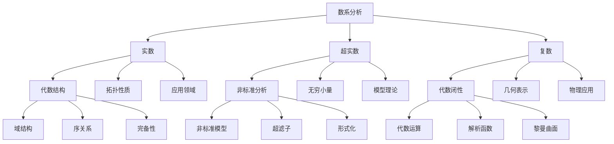

# 实数、超实数与复数的对比分析

## 目录

- [实数、超实数与复数的对比分析](#实数超实数与复数的对比分析)
  - [目录](#目录)
  - [基本概念与定义](#基本概念与定义)
    - [实数 (Real Numbers)](#实数-real-numbers)
    - [超实数 (Hyperreal Numbers)](#超实数-hyperreal-numbers)
    - [复数 (Complex Numbers)](#复数-complex-numbers)
  - [数学结构分析](#数学结构分析)
    - [代数结构](#代数结构)
    - [拓扑结构](#拓扑结构)
  - [哲学视角分析](#哲学视角分析)
    - [本体论分析](#本体论分析)
    - [认识论分析](#认识论分析)
  - [认知结构分析](#认知结构分析)
    - [感性层面](#感性层面)
    - [知性层面](#知性层面)
    - [理性层面](#理性层面)
  - [历史发展脉络](#历史发展脉络)
    - [实数](#实数)
    - [超实数](#超实数)
    - [复数](#复数)
  - [关系与关联性分析](#关系与关联性分析)
    - [包含关系](#包含关系)
    - [运算关系](#运算关系)
    - [应用领域](#应用领域)
  - [批判性思考](#批判性思考)
    - [概念有效性](#概念有效性)
    - [理论局限性](#理论局限性)
  - [思维导图](#思维导图)
  - [总结](#总结)

## 基本概念与定义

### 实数 (Real Numbers)

- 定义：包含有理数和无理数的数集
- 表示：R
- 特性：
  - 完备性
  - 有序性
  - 连续性
  - 可数性（有理数部分）

### 超实数 (Hyperreal Numbers)

- 定义：包含无穷小和无穷大的非标准实数系统
- 表示：*R
- 特性：
  - 包含标准实数
  - 包含无穷小量
  - 包含无穷大量
  - 非标准分析的基础

### 复数 (Complex Numbers)

- 定义：形如 a + bi 的数，其中 a,b 为实数，i 为虚数单位
- 表示：C
- 特性：
  - 代数闭性
  - 二维表示
  - 共轭对称性

## 数学结构分析

### 代数结构

1. 实数 (R)
   - 域结构
   - 有序域
   - 完备性

2. 超实数 (*R)
   - 非标准域
   - 包含无穷小量
   - 保持实数的大部分性质

3. 复数 (C)
   - 代数闭域
   - 二维向量空间
   - 不可序化

### 拓扑结构

1. 实数
   - 完备度量空间
   - 连通性
   - 局部紧致性

2. 超实数
   - 非标准拓扑
   - 包含无穷远点
   - 保持局部性质

3. 复数
   - 二维欧氏空间
   - 紧致化（黎曼球面）
   - 解析性

## 哲学视角分析

### 本体论分析

1. 实数
   - 物理世界的直接对应
   - 测量与计量的基础
   - 连续性的体现

2. 超实数
   - 无穷小量的存在性
   - 非标准分析的基础
   - 极限概念的扩展

3. 复数
   - 抽象数学结构
   - 物理现象的描述工具
   - 对称性的数学表达

### 认识论分析

1. 实数
   - 直观可理解性
   - 经验基础
   - 测量实践

2. 超实数
   - 非标准思维
   - 无穷小量的处理
   - 形式化方法

3. 复数
   - 抽象思维
   - 几何直观
   - 代数方法

## 认知结构分析

### 感性层面

1. 实数
   - 直观感知
   - 测量经验
   - 物理对应

2. 超实数
   - 极限概念
   - 无穷小感知
   - 非标准思维

3. 复数
   - 几何表示
   - 旋转对称
   - 波动现象

### 知性层面

1. 实数
   - 运算规则
   - 序关系
   - 连续性

2. 超实数
   - 非标准分析
   - 无穷小运算
   - 极限处理

3. 复数
   - 代数运算
   - 几何变换
   - 解析函数

### 理性层面

1. 实数
   - 完备性证明
   - 构造方法
   - 公理化系统

2. 超实数
   - 非标准模型
   - 超滤子构造
   - 形式化系统

3. 复数
   - 代数闭性
   - 解析延拓
   - 黎曼曲面

## 历史发展脉络

### 实数

- 古希腊：毕达哥拉斯学派
- 17世纪：微积分发展
- 19世纪：严格化与公理化

### 超实数

- 20世纪：非标准分析
- 1960年代：Robinson的工作
- 现代：非标准模型理论

### 复数

- 16世纪：Cardano公式
- 18世纪：Euler公式
- 19世纪：复分析发展

## 关系与关联性分析

### 包含关系

- 实数 ⊂ 超实数
- 实数 ⊂ 复数
- 超实数与复数：独立发展

### 运算关系

1. 实数运算
   - 基础运算
   - 极限运算
   - 连续性

2. 超实数运算
   - 非标准运算
   - 无穷小处理
   - 标准部分

3. 复数运算
   - 代数运算
   - 几何变换
   - 解析运算

### 应用领域

1. 实数
   - 物理测量
   - 工程计算
   - 统计分析

2. 超实数
   - 非标准分析
   - 无穷小计算
   - 模型理论

3. 复数
   - 信号处理
   - 量子力学
   - 流体力学

## 批判性思考

### 概念有效性

1. 实数
   - 物理对应性
   - 直观性
   - 完备性

2. 超实数
   - 非标准性
   - 无穷小处理
   - 形式化程度

3. 复数
   - 抽象性
   - 应用广泛性
   - 几何直观

### 理论局限性

1. 实数
   - 代数不闭
   - 无穷小处理
   - 物理对应

2. 超实数
   - 非标准性
   - 直观性
   - 应用范围

3. 复数
   - 不可序化
   - 物理解释
   - 直观理解

## 思维导图

## 总结

1. 数学结构
   - 实数：基础数系，完备有序域
   - 超实数：非标准分析，无穷小处理
   - 复数：代数闭域，二维表示

2. 哲学意义
   - 实数：物理世界对应
   - 超实数：极限概念扩展
   - 复数：抽象数学结构

3. 认知特点
   - 实数：直观可理解
   - 超实数：非标准思维
   - 复数：抽象几何

4. 应用价值
   - 实数：基础测量
   - 超实数：非标准分析
   - 复数：广泛物理应用

这个分析框架涵盖了数学、哲学、认知等多个维度，通过思维导图展示了各个概念之间的关系，并提供了批判性的思考。
每个数系都有其独特的数学结构和哲学意义，在理论和应用层面都有重要价值。
