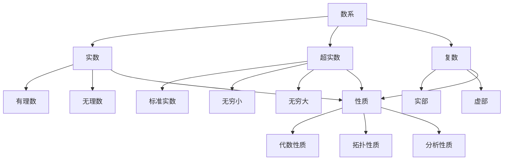

# 实数、超实数与复数的多维对比分析

## 目录

- [实数、超实数与复数的多维对比分析](#实数超实数与复数的多维对比分析)
  - [目录](#目录)
  - [基本概念与定义](#基本概念与定义)
    - [实数 (Real Numbers)](#实数-real-numbers)
    - [超实数 (Hyperreal Numbers)](#超实数-hyperreal-numbers)
    - [复数 (Complex Numbers)](#复数-complex-numbers)
  - [认知结构分析](#认知结构分析)
    - [感性层面](#感性层面)
    - [知性层面](#知性层面)
    - [理性层面](#理性层面)
  - [哲学视角分析](#哲学视角分析)
    - [本体论](#本体论)
    - [认识论](#认识论)
  - [数学结构分析](#数学结构分析)
    - [代数结构](#代数结构)
    - [拓扑结构](#拓扑结构)
  - [历史发展脉络](#历史发展脉络)
    - [实数](#实数)
    - [超实数](#超实数)
    - [复数](#复数)
  - [批判性分析](#批判性分析)
    - [优势与局限](#优势与局限)
    - [关系分析](#关系分析)
  - [思维导图](#思维导图)
  - [总结](#总结)

## 基本概念与定义

### 实数 (Real Numbers)

- **定义**：包含有理数和无理数的完整数系
- **表示**：ℝ
- **特性**：
  - 完备性
  - 有序性
  - 连续性
  - 可数性（有理数部分）

### 超实数 (Hyperreal Numbers)

- **定义**：包含无穷小和无穷大的非标准实数系统
- **表示**：*ℝ
- **特性**：
  - 包含标准实数
  - 包含无穷小量
  - 包含无穷大量
  - 保持实数的代数性质

### 复数 (Complex Numbers)

- **定义**：形如 a + bi 的数，其中 a,b 为实数，i 为虚数单位
- **表示**：ℂ
- **特性**：
  - 代数闭性
  - 二维表示
  - 可进行四则运算
  - 具有共轭性质

## 认知结构分析

### 感性层面

1. **实数**
   - 直观可感知
   - 对应物理世界的连续量
   - 易于可视化

2. **超实数**
   - 非直观
   - 需要抽象思维
   - 难以直接感知

3. **复数**
   - 部分直观（实部）
   - 部分抽象（虚部）
   - 可通过平面表示

### 知性层面

1. **实数**
   - 逻辑推理
   - 代数运算
   - 分析性质

2. **超实数**
   - 非标准分析
   - 无穷小推理
   - 极限概念

3. **复数**
   - 代数运算
   - 几何解释
   - 函数理论

### 理性层面

1. **实数**
   - 完备性证明
   - 公理化体系
   - 分析基础

2. **超实数**
   - 模型论
   - 非标准分析
   - 形式化系统

3. **复数**
   - 代数闭性
   - 函数论
   - 几何应用

## 哲学视角分析

### 本体论

1. **实数**
   - 客观存在
   - 物理世界对应
   - 确定性

2. **超实数**
   - 构造性存在
   - 形式系统
   - 相对性

3. **复数**
   - 抽象存在
   - 形式系统
   - 工具性

### 认识论

1. **实数**
   - 经验基础
   - 直观认识
   - 实践验证

2. **超实数**
   - 形式推理
   - 抽象认识
   - 理论构建

3. **复数**
   - 形式与直观结合
   - 工具性认识
   - 应用验证

## 数学结构分析

### 代数结构

1. **实数**
   - 域
   - 有序域
   - 完备域

2. **超实数**
   - 非标准域
   - 包含无穷小
   - 保持代数性质

3. **复数**
   - 代数闭域
   - 二维向量空间
   - 可除代数

### 拓扑结构

1. **实数**
   - 完备度量空间
   - 连通性
   - 紧致性

2. **超实数**
   - 非标准拓扑
   - 内部结构
   - 外部结构

3. **复数**
   - 二维拓扑
   - 黎曼球面
   - 复平面

## 历史发展脉络

### 实数

- 古希腊：无理数发现
- 17世纪：实数系统形成
- 19世纪：严格定义
- 20世纪：公理化

### 超实数

- 1960年代：非标准分析
- 模型论发展
- 应用扩展

### 复数

- 16世纪：初步概念
- 18世纪：几何解释
- 19世纪：严格理论
- 20世纪：广泛应用

## 批判性分析

### 优势与局限

1. **实数**
   - 优势：
     - 直观性强
     - 应用广泛
     - 理论完备
   - 局限：
     - 不包含无穷小
     - 代数不闭

2. **超实数**
   - 优势：
     - 处理无穷小
     - 简化分析
     - 形式优美
   - 局限：
     - 非直观
     - 应用受限
     - 构造复杂

3. **复数**
   - 优势：
     - 代数闭性
     - 应用广泛
     - 理论丰富
   - 局限：
     - 部分抽象
     - 有序性缺失
     - 高维推广复杂

### 关系分析

1. **包含关系**
   - 实数 ⊂ 超实数
   - 实数 ⊂ 复数
   - 超实数与复数：部分重叠

2. **应用领域**
   - 实数：基础数学、物理
   - 超实数：非标准分析、模型论
   - 复数：工程、物理、数学

## 思维导图

## 总结

1. **认知层次**
   - 实数：基础认知
   - 超实数：高级抽象
   - 复数：中间层次

2. **应用价值**
   - 实数：基础应用
   - 超实数：理论工具
   - 复数：广泛应用

3. **发展前景**
   - 实数：继续作为基础
   - 超实数：理论深化
   - 复数：应用扩展

4. **教育意义**
   - 实数：入门基础
   - 超实数：高级理论
   - 复数：应用桥梁

这个分析框架试图从多个维度全面理解三种数系的特点、关系和发展。
每种数系都有其独特的价值和局限，它们共同构成了现代数学的基础架构。
通过这种多维度的分析，我们可以更好地理解数学的本质和发展规律。
