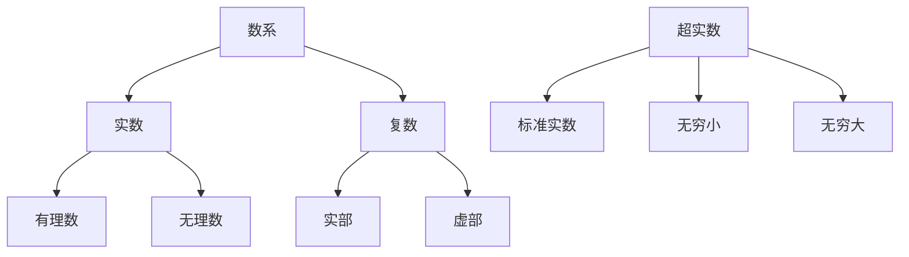
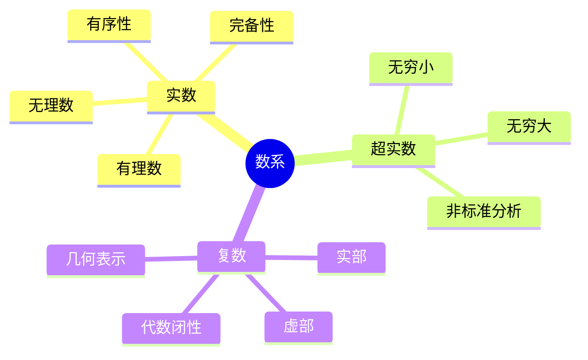

# 实数、超实数与复数的多维对比分析

## 目录

- [实数、超实数与复数的多维对比分析](#实数超实数与复数的多维对比分析)
  - [目录](#目录)
  - [基本概念与定义](#基本概念与定义)
    - [实数 (Real Numbers)](#实数-real-numbers)
    - [超实数 (Hyperreal Numbers)](#超实数-hyperreal-numbers)
    - [复数 (Complex Numbers)](#复数-complex-numbers)
  - [认知结构分析](#认知结构分析)
    - [感性层面](#感性层面)
    - [知性层面](#知性层面)
    - [理性层面](#理性层面)
  - [哲学视角分析](#哲学视角分析)
    - [本体论](#本体论)
    - [认识论](#认识论)
  - [数学结构分析](#数学结构分析)
    - [代数结构](#代数结构)
    - [拓扑结构](#拓扑结构)
  - [历史发展脉络](#历史发展脉络)
    - [实数](#实数)
    - [超实数](#超实数)
    - [复数](#复数)
  - [关系与关联性分析](#关系与关联性分析)
    - [包含关系](#包含关系)
    - [运算关系](#运算关系)
  - [批判性思考](#批判性思考)
    - [优势分析](#优势分析)
    - [局限性](#局限性)
  - [思维导图](#思维导图)
  - [总结](#总结)

## 基本概念与定义

### 实数 (Real Numbers)

- **定义**: 包含有理数和无理数的完整数系
- **表示**: ℝ
- **特性**:
  - 完备性
  - 有序性
  - 连续性
  - 可数性（有理数部分）

### 超实数 (Hyperreal Numbers)

- **定义**: 包含无穷小和无穷大的非标准实数系
- **表示**: *ℝ
- **特性**:
  - 非标准分析基础
  - 包含无穷小量
  - 保持实数运算性质
  - 非阿基米德性质

### 复数 (Complex Numbers)

- **定义**: 形如 a + bi 的数，其中 a,b 为实数，i 为虚数单位
- **表示**: ℂ
- **特性**:
  - 代数闭性
  - 二维表示
  - 可进行几何解释
  - 保持实数运算性质

## 认知结构分析

### 感性层面

1. **实数**
   - 直观可感知
   - 对应物理世界测量
   - 易于可视化

2. **超实数**
   - 抽象程度高
   - 难以直观感知
   - 需要特殊思维模型

3. **复数**
   - 部分直观（实部）
   - 部分抽象（虚部）
   - 可通过平面几何理解

### 知性层面

1. **实数**
   - 运算规则清晰
   - 序关系明确
   - 度量性质完备

2. **超实数**
   - 非标准分析工具
   - 无穷小运算
   - 极限概念推广

3. **复数**
   - 代数运算完整
   - 几何解释丰富
   - 函数论基础

### 理性层面

1. **实数**
   - 公理化体系完备
   - 逻辑自洽
   - 应用广泛

2. **超实数**
   - 非标准分析理论
   - 模型论基础
   - 特殊应用领域

3. **复数**
   - 代数闭性
   - 分析学基础
   - 物理应用广泛

## 哲学视角分析

### 本体论

1. **实数**
   - 对应物理世界
   - 测量基础
   - 客观存在

2. **超实数**
   - 理论构造
   - 数学工具
   - 抽象存在

3. **复数**
   - 数学构造
   - 物理对应
   - 形式存在

### 认识论

1. **实数**
   - 经验基础
   - 直观认识
   - 实践验证

2. **超实数**
   - 理论推导
   - 逻辑构造
   - 模型验证

3. **复数**
   - 形式系统
   - 几何直观
   - 应用验证

## 数学结构分析

### 代数结构

1. **实数**
   - 域
   - 有序域
   - 完备域

2. **超实数**
   - 非阿基米德域
   - 包含无穷小
   - 保持实数运算

3. **复数**
   - 代数闭域
   - 二维向量空间
   - 保持实数运算

### 拓扑结构

1. **实数**
   - 完备度量空间
   - 连通性
   - 紧致性

2. **超实数**
   - 非标准拓扑
   - 内部结构复杂
   - 特殊收敛性

3. **复数**
   - 二维拓扑空间
   - 连通性
   - 紧致性

## 历史发展脉络

### 实数

- 古希腊时期：无理数发现
- 17世纪：实数系统形成
- 19世纪：严格公理化

### 超实数

- 20世纪60年代：非标准分析
- Robinson开创性工作
- 模型论发展

### 复数

- 16世纪：Cardano引入
- 18世纪：Euler贡献
- 19世纪：严格理论

## 关系与关联性分析

### 包含关系

### 运算关系

1. **实数**
   - 基础运算完备
   - 序关系完整
   - 极限运算

2. **超实数**
   - 包含实数运算
   - 无穷小运算
   - 非标准极限

3. **复数**
   - 包含实数运算
   - 复数特有运算
   - 几何解释

## 批判性思考

### 优势分析

1. **实数**
   - 直观性强
   - 应用广泛
   - 理论完备

2. **超实数**
   - 简化分析
   - 直观无穷小
   - 理论统一

3. **复数**
   - 代数闭性
   - 应用广泛
   - 理论优美

### 局限性

1. **实数**
   - 代数不闭
   - 某些问题处理复杂
   - 无穷小处理困难

2. **超实数**
   - 抽象程度高
   - 应用范围有限
   - 理解难度大

3. **复数**
   - 序关系缺失
   - 某些运算限制
   - 物理解释复杂

## 思维导图

## 总结

1. **认知层次**
   - 实数：感性基础，知性工具，理性系统
   - 超实数：抽象构造，理论工具，特殊应用
   - 复数：形式系统，几何直观，广泛应用

2. **哲学意义**
   - 实数：客观存在，测量基础
   - 超实数：理论构造，分析工具
   - 复数：形式系统，物理对应

3. **数学价值**
   - 实数：基础数系，广泛应用
   - 超实数：理论创新，特殊工具
   - 复数：代数完备，应用广泛

4. **发展前景**
   - 实数：继续作为基础数系
   - 超实数：特殊领域应用
   - 复数：理论发展与应用扩展

这个分析框架试图从多个维度对三种数系进行对比分析，包括认知结构、哲学视角、数学结构等方面。
每种数系都有其独特的价值和局限性，它们共同构成了现代数学的基础框架。
通过这种多维度的分析，我们可以更好地理解这些数系的本质特征和相互关系。
