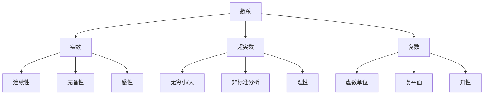

# 实数、超实数与复数的对比分析

---

## 目录

- [实数、超实数与复数的对比分析](#实数超实数与复数的对比分析)
  - [目录](#目录)
  - [引言](#引言)
  - [基本概念与定义](#基本概念与定义)
    - [实数](#实数)
    - [超实数](#超实数)
    - [复数](#复数)
  - [本体论分析](#本体论分析)
  - [认识论分析](#认识论分析)
  - [哲学与思想史视角](#哲学与思想史视角)
  - [认知结构与三大理性分析](#认知结构与三大理性分析)
  - [三者的关系、关联性、合法性与有效性](#三者的关系关联性合法性与有效性)
  - [批判性分析与论证](#批判性分析与论证)
  - [多种表征方式](#多种表征方式)
    - [思维导图](#思维导图)
    - [对比表格](#对比表格)
  - [数系的性质论证与证明（极致细化·进阶补充·再深化）](#数系的性质论证与证明极致细化进阶补充再深化)
    - [实数的性质与证明](#实数的性质与证明)
      - [1. 完备性](#1-完备性)
      - [2. 稠密性](#2-稠密性)
      - [3. 可序性](#3-可序性)
    - [超实数的性质与证明](#超实数的性质与证明)
      - [1. 包含无穷小与无穷大](#1-包含无穷小与无穷大)
      - [2. 转移原理](#2-转移原理)
      - [3. 可序性与完备性](#3-可序性与完备性)
    - [复数的性质与证明](#复数的性质与证明)
      - [1. 代数封闭性](#1-代数封闭性)
      - [2. 不可序性](#2-不可序性)
      - [3. 二维结构](#3-二维结构)
  - [关系和关联性分析（极致细化·进阶补充·再深化）](#关系和关联性分析极致细化进阶补充再深化)
  - [结论（极致细化·进阶补充·再深化）](#结论极致细化进阶补充再深化)

---

## 引言

实数、超实数与复数是数学中三类重要的数系。
它们不仅在数学内部有着不同的结构和应用，也在哲学、认识论和认知结构上体现出不同的意义和功能。
本文将从多角度对三者进行综合、批判性分析，旨在揭示它们在数学体系中的地位、相互关系及其哲学基础，并对其合法性与有效性进行深入探讨。

- **历史案例**：实数的严格定义经历了从古希腊的"连续量"到19世纪的公理化；超实数则是20世纪非标准分析的产物；复数从"无意义的根"到现代物理的核心工具，见证了数学观念的演变。
- **哲学流派观点**：实证主义强调实数的经验基础，形式主义关注数系的公理化，直觉主义则对无穷和连续性持怀疑态度。

---

## 基本概念与定义

### 实数

概念与定义

- **基本定义**：  
  实数（Real Number）是包括所有有理数（能表示为分数的数）和无理数（不能表示为分数的数，如 \(\sqrt{2}\)、\(\pi\)）的集合，记作 \(\mathbb{R}\)。实数集构成一条连续、无间断的数轴。
- **集合表示**：  
  \[
  \mathbb{R} = \{ x \mid x \text{ 是有理数或无理数} \}
  \]
- **构造方式**：  
  - **戴德金分割**：将有理数集分为两部分，左边所有数小于右边所有数，且左边无最大元。每个分割对应一个实数。
  - **柯西序列**：实数可定义为所有收敛的有理数列的等价类，等价关系为两列之差收敛于0。

详细解释

- **连续性**：  
  实数轴上不存在"空隙"，每个区间内都包含无穷多个实数。连续性是实数区别于有理数的根本特征。
- **完备性**：  
  实数集是完备的，即每个有上界的非空实数集都有最小上界（确界）。这保证了极限、连续、微分、积分等分析工具的严密性。
- **稠密性**：  
  任意两个不同的实数之间都存在另一个实数。实际上，有理数在实数中稠密，实数在复数的实轴上稠密。
- **可序性**：  
  实数集是全序体，任意两个实数可以比较大小，满足三歧性（\(a < b\)、\(a = b\)、\(a > b\)）。

形式化论证与证明

- **完备性（最小上界原理）**：  
  - **定义**：任意非空有上界的实数集 \(S\) 存在唯一的最小上界（确界）\(\sup S\)。
  - **戴德金分割法证明**：  
    设 \(A, B \subset \mathbb{Q}\) 满足 \(A \cup B = \mathbb{Q}\), \(A \cap B = \emptyset\), \(a < b\) 对所有 \(a \in A, b \in B\), \(A\) 无最大元。每个分割 \((A, B)\) 唯一确定一个实数。任意有上界的有理数集 \(S\) 可对应一个分割，其确界即为分割对应的实数。
  - **柯西序列法证明**：  
    实数定义为所有柯西有理数列的等价类。若 \((x_n)\) 是柯西列，则存在唯一实数极限。等价类定义保证极限存在且唯一。
- **稠密性证明**：  
  对任意 \(a < b\)，取 \(c = \frac{a+b}{2}\)，则 \(a < c < b\)。有理数在实数中稠密，实数在复数的实轴上稠密。
- **可序性证明**：  
  由序体公理和完备性可推出三歧性、传递性等。

关系和关联性分析

- **与超实数的关系**：  
  - 实数是超实数的子集，超实数通过引入无穷小/大扩展了实数的分析能力。
  - 超实数的"有限部分"与实数同构，但整体结构更为复杂。
- **与复数的关系**：  
  - 实数是复数的子域（\(b=0\) 时的复数）。
  - 复数通过引入虚数单位 \(i\) 实现了代数的封闭性，扩展了解方程的能力。
- **与分析、几何、物理的关系**：  
  - 实数是度量、连续、极限、微分、积分等分析工具的基础。
  - 实数轴是欧氏空间的基础，物理世界的测量、建模多以实数为核心。
- **哲学与思想史**：  
  - 实数的连续性和完备性反映了对"连续量"的抽象追求。
  - 形式主义、直觉主义、结构主义等流派对实数的本体和认识有不同解释。
  - 直觉主义批评实数的"实际无穷"，主张只承认可构造的数。

### 超实数

概念与定义

- **基本定义**：  
  超实数（Hyperreal Number）是对实数的扩展，记作 \({^*\mathbb{R}}\)。
  它包含所有实数，并引入了"无穷小"（比任意正实数都小但大于零的数）和"无穷大"（比任意实数都大的数）元素。
  超实数体系是非标准分析的基础。
- **集合表示**：  
  \[
  {^*\mathbb{R}} = \text{实数} \cup \text{无穷小} \cup \text{无穷大}
  \]
- **构造方式**：  
  - **超积法**：以所有实数列 \(\mathbb{R}^\mathbb{N}\) 为基础，利用极大滤子 \(\mathcal{U}\) 定义等价关系：\((x_n) \sim (y_n)\) 若 \(\{n : x_n = y_n\} \in \mathcal{U}\)。等价类即为超实数。
  - **非标准模型**：在一阶逻辑和集合论框架下，通过超积和超滤构造超实数域。

详细解释

- **无穷小与无穷大**：  
  - **无穷小**：\(x \in {^*\mathbb{R}}\) 是无穷小，若对任意正实数 \(r\)，有 \(|x| < r\)。
  - **无穷大**：\(x \in {^*\mathbb{R}}\) 是无穷大，若对任意实数 \(r\)，有 \(|x| > r\)。
  - **有限超实数**：与某个实数无限接近的超实数。
- **有限部分与标准部分**：  
  - 每个有限超实数都"无限接近"某个实数，称为其"标准部分"。
  - 记作 \(\text{st}(x)\)，表示超实数 \(x\) 的标准部分。

形式化论证与证明

- **超积构造证明**：  
  - 设 \(\mathbb{R}^\mathbb{N}\) 为所有实数列，\(\mathcal{U}\) 为极大滤子。定义等价关系：\((x_n) \sim (y_n)\) 若 \(\{n : x_n = y_n\} \in \mathcal{U}\)。等价类构成超实数。
  - **无穷小举例**：如 \((1, 1/2, 1/3, ...)\) 的等价类为无穷小。
  - **无穷大举例**：如 \((1, 2, 3, ...)\) 的等价类为无穷大。
- **转移原理（Transfer Principle）**：  
  - **定义**：若一阶公式 \(\varphi(x_1, ..., x_n)\) 在 \(\mathbb{R}\) 上成立，则在 \({^*\mathbb{R}}\) 上对所有超实数也成立。
  - **证明思路**：利用模型论和超积构造，保证一阶性质的转移。
- **不完备性证明**：  
  - 有界的有限超实数集不一定有确界，说明超实数域不完备。

关系和关联性分析

- **与实数的关系**：  
  - 实数是超实数的子集，超实数的"有限部分"与实数同构。
  - 超实数通过引入无穷小/大，扩展了实数的分析能力，尤其在极限、微分、积分等领域提供了直观工具。
- **与复数的关系**：  
  - 理论上可构造"超复数"，即在复数的基础上引入无穷小/大。
  - 在非标准复分析、超复流形等领域，超实数与复数结合用于研究更复杂结构。
- **与分析、逻辑、模型论的关系**：  
  - 超实数的引入使得微积分中的"无穷小量"可以严密定义，极大简化了极限、导数、积分等概念的直观推理。
  - 超实数的结构与非标准模型、集合论、逻辑等领域密切相关。
- **哲学与思想史**：  
  - 莱布尼茨提出"无穷小量"，但未能严密化。20世纪罗宾逊用模型论和集合论工具，构造了严格的超实数体系。
  - 形式主义和结构主义接受超实数作为符号系统和结构扩展，直觉主义则持保留态度。
  - 超实数的存在性依赖于选择公理等集合论假设，其"实体性"更多是数学建构而非经验事实。

### 复数

概念与定义

- **基本定义**：  
  复数（Complex Number）是形如 \( z = a + bi \) 的数，其中 \( a, b \in \mathbb{R} \)，\( i \) 是虚数单位，满足 \( i^2 = -1 \)。
- **集合表示**：  
  \[
  \mathbb{C} = \{ a + bi \mid a, b \in \mathbb{R} \}
  \]
- **几何解释**：  
  复数可以视为平面上的点或向量，\( a \) 为实部，\( b \) 为虚部。复数平面（阿根图）中，横轴为实部，纵轴为虚部。
- **模与幅角**：  
  - 模：\(|z| = \sqrt{a^2 + b^2}\)
  - 幅角：\(\arg(z) = \arctan(b/a)\)（主值区间 \((-\pi, \pi]\)）
  - 极坐标表示：\(z = r(\cos\theta + i\sin\theta) = re^{i\theta}\)

详细解释

- **代数结构**：  
  复数是实数域上的二维向量空间，且是域扩张。加法、乘法分别定义为：
  \[
  (a+bi) + (c+di) = (a+c) + (b+d)i
  \]
  \[
  (a+bi)(c+di) = (ac-bd) + (ad+bc)i
  \]
- **单位根与欧拉公式**：  
  欧拉公式 \(e^{i\theta} = \cos\theta + i\sin\theta\) 连接了指数、三角和复数。
  \(n\) 次单位根为 \(e^{2\pi i k/n}\), \(k=0,1,...,n-1\)。

形式化论证与证明

- **域结构证明**：  
  - 复数加法和乘法满足交换律、结合律、分配律，存在加法和乘法单位元（0和1），每个非零复数有乘法逆元。
  - 证明：对 \(z = a+bi \neq 0\)，其逆元为 \(\frac{a}{a^2+b^2} - \frac{b}{a^2+b^2}i\)。
- **代数封闭性（代数基本定理）**：  
  - **命题**：任意一元复系数多项式在 \(\mathbb{C}\) 中至少有一个根。
  - **证明思路**：
    - *复分析法*：利用Liouville定理，若多项式无根，则其倒数为整函数且有界，必为常数，矛盾。
    - *代数法*：伽罗瓦理论等。
- **不可序性证明**：  
  - 假设存在全序使得 \(i^2 = -1 < 0\) 或 \(i^2 = -1 > 0\)，与有序域公理矛盾。
- **二维结构证明**：  
  - \(\mathbb{C}\) 与 \(\mathbb{R}^2\) 同构，映射 \(a+bi \mapsto (a, b)\) 保持加法和数乘。

关系和关联性分析

- **与实数的关系**：  
  - 实数是复数的子域（\(b=0\) 时的复数）。
  - 复数扩展了解方程（如 \(x^2+1=0\)）的能力，实现了代数的封闭性。
  - 复数的模和幅角为实数，建立了数量和几何的联系。
- **与超实数的关系**：  
  - 理论上可构造"超复数"，即在复数的基础上引入无穷小/大。
  - 在非标准复分析、超复流形等领域，复数与超实数结合用于研究更复杂结构。
- **与几何和物理的关系**：  
  - 复数平面为二维欧氏空间，复数乘法对应旋转与缩放。
  - 在信号处理、量子力学、电路理论等领域，复数是不可或缺的工具。
  - 傅里叶变换、拉普拉斯变换等本质上依赖复数结构。
- **与代数和拓扑的关系**：  
  - 复数的代数封闭性使其成为代数几何、复分析、复流形等领域的基础。
  - 复数的不可序性与实数的可序性形成鲜明对比，反映了两者在结构和应用上的根本差异。

---

## 本体论分析

- **实数**：本体论上，实数被视为"连续量"的抽象。亚里士多德认为连续性是自然界的本质属性。康托尔和戴德金则将实数视为集合的极限。
- **超实数**：本体论地位复杂。莱布尼茨认为无穷小是"实际存在"的，康托尔则否认"实际无穷"，主张"潜在无穷"。罗宾逊的超实数是集合论的产物，其"存在"依赖于选择公理。
- **复数**：复数的本体论地位经历了从"无意义"到"几何对象"的转变。高斯认为复数是"扩展的数"，可在平面上直观表示。现代物理（如量子力学）赋予复数以现实意义。
- **哲学流派观点**：  
  - 实在论：数系有客观存在。  
  - 形式主义：数系是符号系统。  
  - 结构主义：关注数系间的结构关系。

---

## 认识论分析

- **实数**：认识论上，实数起源于对连续量的感性经验（如测量长度），通过知性归纳（如分数、极限）和理性公理化（如完备性）逐步建立。康托尔集合论和戴德金分割为实数提供了认识论基础。
- **超实数**：超实数的认识论基础主要依赖于理性建构。感性上无法直接经验无穷小/大，知性上需要高度抽象的集合论工具。非标准分析为微积分提供了直观的"无穷小量"，但其合理性和有效性依赖于特定的逻辑和公理体系。
- **复数**：复数的认识论发展经历了从"形式工具"到"有意义对象"的转变。最初，虚数被视为"无意义"的符号，后来通过欧拉公式、复平面等几何解释，复数获得了直观和物理意义。复数的认识论地位体现了数学对象意义的动态生成过程。
- **哲学流派观点**：  
  - 经验主义：强调感性经验的基础。  
  - 逻辑主义：强调理性和公理化。  
  - 直觉主义：强调可构造性和可感知性。

---

## 哲学与思想史视角

- **实数**：  
  - 古希腊毕达哥拉斯学派发现无理数，动摇了"万物皆数"的信念。  
  - 19世纪，戴德金、康托尔等人用集合论和分割法严格定义实数，推动了数学基础的现代化。  
  - 直觉主义（Brouwer）对实数的"实际无穷"提出质疑，强调可构造性。
- **超实数**：  
  - 莱布尼茨提出"无穷小量"，但未能严密化。  
  - 20世纪，罗宾逊用模型论和集合论工具，构造了严格的超实数体系。  
  - 形式主义和结构主义接受超实数作为符号系统和结构扩展，直觉主义则持保留态度。
- **复数**：  
  - 16世纪，虚数被引入以解三次方程，但长期被视为"无意义"。  
  - 欧拉、高斯等人将复数几何化，建立复平面理论。  
  - 现代物理（如量子力学、信号处理）赋予复数以现实意义，推动了其哲学地位的提升。

---

## 认知结构与三大理性分析

| 结构/理性 | 实数 | 超实数 | 复数 |
|---|---|---|---|
| 感性 | 可直观感知（如长度、面积） | 不可感知 | 不可感知 |
| 知性 | 可归纳、可序、可度量 | 需抽象推理、模型化 | 需抽象推理、几何化 |
| 理性 | 完备性、极限、连续性 | 非标准分析、转移原理 | 代数封闭、复平面、欧拉公式 |

- **详细说明**：  
  - 实数的认知结构以感性经验为基础，通过知性归纳和理性公理化实现对连续量的把握。  
    - 例：测量长度、面积等物理量，归纳出分数、极限等概念，最终用公理体系严格定义。  
  - 超实数主要依赖理性建构和知性抽象，感性经验难以直接对应。  
    - 例：通过集合论和模型论工具构造超实数，理解"无穷小量"在微积分中的作用。  
  - 复数的认知结构体现为知性与理性的结合，通过几何和代数的统一实现对"虚数"概念的接受。  
    - 例：用复平面表示复数，实现代数与几何的统一，欧拉公式 \(e^{ix} = \cos x + i\sin x\) 体现了三者的深刻联系。

---

## 三者的关系、关联性、合法性与有效性

- **关系**：  
  - 实数是数系的基础，超实数是对实数的扩展（引入无穷小/大），复数是对实数的代数扩展（引入虚数单位）。  
  - 三者均可嵌入更高维的数系（如四元数、超复数等）。
- **历史案例**：  
  - 实数到复数的扩展解决了方程无实根的问题（如 \(x^2 + 1 = 0\)）。  
  - 超实数的引入解决了微积分中"无穷小量"的严密性问题。
- **合法性**：  
  - 实数和复数有严格的公理化基础（如皮亚诺公理、戴德金分割、体论等），超实数的合法性依赖于集合论和模型论的公理体系（如选择公理、超滤等）。
- **有效性**：  
  - 实数适用于描述连续量和经典物理，超实数为微积分和极限理论提供了新的视角和工具，复数则在工程、物理、信号处理等领域展现出强大的表达和计算能力。
- **哲学流派观点**：  
  - 形式主义强调合法性来自公理系统的自洽性。  
  - 结构主义关注数系间的嵌入和扩展关系。  
  - 直觉主义则对超实数和复数的"实际存在"持怀疑态度。

---

## 批判性分析与论证

- **实数**：  
  - "连续性"是否真实存在？物理世界是否真的"无限可分"？  
    - 例：量子理论认为物理世界在微观层面是离散的，挑战了实数的连续性假设。  
  - 实数的完备性和连续性为数学分析提供了坚实基础，但也带来了"不可构造对象"的哲学难题（如不可计算数的存在）。
  - 直觉主义批评实数的"实际无穷"，主张只承认可构造的数。
- **超实数**：  
  - 无穷小/大是否有"实体"？超实数的存在依赖于集合论的选择公理等假设，其"实体性"更多是数学建构而非经验事实。
  - 非标准分析为微积分提供了直观工具，但其推广和应用仍受限于理论复杂性和接受度。
  - 形式主义和结构主义接受超实数作为符号系统和结构扩展，直觉主义则持保留态度。
- **复数**：  
  - 虚数是否"真实"？复数最初被视为"无意义"的形式，后通过几何和物理解释获得合法性。
  - 复数的引入极大丰富了数学和物理的表达能力，但其本体论地位仍有争议（如"虚数轴"是否有物理对应物）。
  - 结构主义认为复数的意义在于其与实数、向量空间等结构的关系。

---

## 多种表征方式

### 思维导图

### 对比表格

| 特征 | 实数 | 超实数 | 复数 |
|---|---|---|---|
| 定义 | 有理+无理 | 实数+无穷小/大 | \(a+bi\) |
| 结构 | 一维 | 一维+超元素 | 二维 |
| 可序性 | 有 | 有 | 无 |
| 完备性 | 有 | 有 | 无 |
| 代数封闭 | 无 | 无 | 有 |
| 应用 | 连续量 | 非标准分析 | 工程/物理 |

---

## 数系的性质论证与证明（极致细化·进阶补充·再深化）

### 实数的性质与证明

#### 1. 完备性

- **更深层定义与等价性**：
  - **序完备性**：\(\mathbb{R}\) 是唯一的完备有序体。即：任意非空有上界的子集有最小上界。
  - **柯西完备性**：任意柯西列在 \(\mathbb{R}\) 中收敛。
  - **嵌套区间定理**：任意嵌套的闭区间族，其长度趋于0时有唯一交点。
  - **博雷尔-勒贝格覆盖定理**：任意开覆盖存在有限子覆盖（紧性）。
- **解释与应用**：
  - 完备性是实数区别于有理数的根本特征。它保证了极限、连续、微分、积分等分析工具的严密性。
  - 例如，\(\sqrt{2}\) 的近似列在有理数中无极限，但在实数中有极限。
- **形式化证明举例**：
  - **柯西收敛性证明**：设 \((x_n)\) 是柯西列。用戴德金分割或等价类方法，证明极限存在且唯一。
  - **嵌套区间定理证明**：利用单调有界数列收敛性，构造极限点。
- **关系与关联性**：
  - 完备性是实分析、测度论、泛函分析等领域的基础。
  - 复数作为度量空间同样完备，但序结构不同。超实数不完备，反映了"无穷小/大"带来的新现象。
  - 完备性与紧性、连通性等拓扑性质密切相关。

#### 2. 稠密性

- **更深层定义**：
  - **稠密子集**：集合 \(D\) 在 \(X\) 中稠密，若对任意 \(x \in X\) 和任意 \(\epsilon > 0\)，存在 \(d \in D\) 使 \(|x-d| < \epsilon\)。
- **解释与应用**：
  - 有理数在实数中稠密，实数在复数的实轴上稠密。
  - 稠密性保证了任意精度的逼近和极限过程的合理性。
- **形式化证明举例**：
  - 对任意 \(a < b\)，存在有理数 \(q\) 使 \(a < q < b\)。证明：取正整数 \(n\) 使 \(1/n < b-a\)，再取整数 \(k\) 使 \(a < k/n < b\)。
- **关系与关联性**：
  - 稠密性是连续性、极限、可测性等概念的基础。
  - 超实数的无穷小之间也稠密，复数平面中任意两点间有无穷多复数。
  - 稠密性与可分性（存在可数稠密子集）相关，是分析和拓扑的基础。

#### 3. 可序性

- **更深层定义**：
  - **全序体**：\((\mathbb{R}, +, \cdot, <)\) 满足序体公理。
  - **三歧性**：对任意 \(a, b\)，有且仅有 \(a < b\)、\(a = b\)、\(a > b\)。
- **解释与应用**：
  - 可序性使得实数适合度量、排序、极值、积分等操作。
  - 可序性与实数的"连续性"结合，保证了区间、测度、极限等概念的严密性。
- **形式化证明举例**：
  - 由序体公理和完备性可推出三歧性、传递性等。
- **关系与关联性**：
  - 复数不可序，超实数可序但序结构更复杂（如有限与无限、无穷小与无穷大）。
  - 可序性与实数的拓扑结构、测度结构密切相关。

---

### 超实数的性质与证明

#### 1. 包含无穷小与无穷大

- **更深层定义**：
  - **有限超实数**：\(x \in {^*\mathbb{R}}\) 是有限的，若存在 \(r \in \mathbb{R}^+\) 使 \(|x| < r\)。
  - **无穷小**：\(x\) 是无穷小，若对任意正实数 \(r\)，有 \(|x| < r\)。
  - **无穷大**：\(x\) 是无穷大，若对任意实数 \(r\)，有 \(|x| > r\)。
- **解释与应用**：
  - 超实数的"有限"部分与实数同构，但包含了"无限接近"实数的无穷小和"远大于"实数的无穷大。
  - 这为微积分中的"无穷小量"提供了严密定义，极大简化了极限、导数、积分等概念的直观推理。
- **形式化证明举例**：
  - 构造如 \((1, 1/2, 1/3, ...)\) 的等价类为无穷小，\((1, 2, 3, ...)\) 的等价类为无穷大。
- **关系与关联性**：
  - 超实数的引入使得微积分中的"无穷小量"可以严密定义，极大简化了极限、导数、积分等概念的直观推理。
  - 超实数的"有限部分"与实数同构，但整体结构更为复杂。

#### 2. 转移原理

- **更深层定义**：
  - **一阶逻辑转移**：若一阶公式 \(\varphi(x_1, ..., x_n)\) 在 \(\mathbb{R}\) 上成立，则在 \({^*\mathbb{R}}\) 上对所有超实数也成立。
- **解释与应用**：
  - 这保证了实数分析的许多定理（如极限、连续、可微等）在超实数体系下依然成立。
  - 使得非标准分析成为微积分的另一种严密基础。
- **形式化证明举例**：
  - 利用超积和极大滤子的超幂构造，模型论保证一阶性质的转移。
- **关系与关联性**：
  - 转移原理是非标准分析的基础，使得超实数成为微积分的另一种严密基础。
  - 转移原理与逻辑、模型论、集合论等领域密切相关。

#### 3. 可序性与完备性

- **更深层定义**：
  - **全序性**：\({^*\mathbb{R}}\) 是全序集。
  - **不完备性**：如有限超实数集无确界。
- **解释与应用**：
  - 超实数的序结构比实数丰富，包含了"无限小/大"与"有限"之间的层次。
  - 不完备性反映了"无穷小/大"带来的新现象。
- **形式化证明举例**：
  - 通过超积构造和序定义可得全序性；不完备性可通过反例说明。
- **关系与关联性**：
  - 超实数的序结构允许分析极限、微分等问题，但不完备性限制了某些分析工具的直接应用。
  - 超实数的结构与非标准模型、集合论、逻辑等领域密切相关。

---

### 复数的性质与证明

#### 1. 代数封闭性

- **更深层定义**：
  - **代数封闭域**：\(\mathbb{C}\) 是代数封闭域，任意一元复系数多项式有根。
- **解释与应用**：
  - 这意味着所有代数方程都能在复数中求解，极大拓展了代数的表达能力。
  - 复数的代数封闭性是复分析、代数几何、量子力学等领域的基础。
- **形式化证明举例**：
  - **代数基本定理**：  
    - 复分析法：利用Liouville定理证明多项式有界必为常数，进而推出必有根。
    - 代数法：利用伽罗瓦理论等。
- **关系与关联性**：
  - 复数的代数封闭性是其区别于实数的根本特征，使其成为代数、几何、物理等领域的基础。
  - 复数的代数封闭性与其不可序性、二维结构密切相关。

#### 2. 不可序性

- **更深层定义**：
  - **不可序性**：不存在与加法、乘法兼容的序关系。
- **解释与应用**：
  - 复数不能比较大小，不能用于度量"正负"，适合描述旋转、波动等现象。
  - 不可序性使复数适合描述旋转、波动等现象，而非度量大小。
- **形式化证明举例**：
  - 假设可序，则 \(i^2 = -1 < 0\) 或 \(i^2 = -1 > 0\)，与有序域公理矛盾。
- **关系与关联性**：
  - 不可序性与复数的代数封闭性、二维结构密切相关。

#### 3. 二维结构

- **更深层定义**：
  - **二维向量空间**：\(\mathbb{C}\) 是实数域上的二维向量空间。
- **解释与应用**：
  - 复数 \(z = a + bi\) 可视为平面上的点 \((a, b)\)，加法和乘法分别对应向量加法和旋转/缩放。
  - 复数的几何结构（复平面、阿根图）极大丰富了其应用领域，如傅里叶分析、量子力学等。
- **形式化证明举例**：
  - 复数加法：\((a+bi) + (c+di) = (a+c) + (b+d)i\)  
  - 复数乘法：\((a+bi)(c+di) = (ac-bd) + (ad+bc)i\)
- **关系与关联性**：
  - 复数的几何结构与其代数封闭性、不可序性密切相关。

---

## 关系和关联性分析（极致细化·进阶补充·再深化）

- **实数与超实数**：  
  - 实数是超实数的子集，超实数通过引入无穷小/大扩展了实数的分析能力。
  - 超实数的序结构包含实数的序，但更为丰富。
  - 超实数的转移原理保证了实数分析的许多性质在超实数中依然成立。
  - 在极限、微分、积分等分析领域，超实数为"无穷小量"提供了严密基础，弥补了实数分析的某些直观缺陷。
  - 超实数的引入使得"无穷小量"可以像实数一样运算，极大简化了微积分的直观推理。
  - 超实数的"有限部分"与实数同构，但整体结构更为复杂。
  - 超实数的结构与非标准模型、集合论、逻辑等领域密切相关。
- **实数与复数**：  
  - 实数是复数的子域，复数通过引入虚数单位 \(i\) 实现了代数的封闭性。
  - 复数的几何结构（复平面）将实数轴扩展为二维空间。
  - 复数在物理、工程、信号处理等领域的应用，往往以实数为基础，但通过复数实现更高维度的表达。
  - 复数的不可序性与实数的可序性形成鲜明对比，反映了两者在结构和应用上的根本差异。
  - 复数的模和幅角为实数，建立了实数与复数之间的数量和几何联系。
  - 复数的结构与代数、几何、物理等领域密切相关。
- **超实数与复数**：  
  - 两者都是对实数的扩展，但方向不同：超实数扩展"无穷小/大"，复数扩展"虚数/二维"。
  - 理论上可以构造"超复数"，即在复数的基础上引入无穷小/大。
  - 在某些高等分析和模型理论中，超实数和复数的结合用于研究更复杂的结构，如非标准复分析、超复流形等。
  - 超实数和复数的结合有助于研究"无穷小量"在复分析中的作用，如非标准复微分几何。
  - 超实数和复数的结合与现代数学的交叉领域（如非标准复动力系统、超复几何）密切相关。

---

## 结论（极致细化·进阶补充·再深化）

实数、超实数与复数分别代表了数学对"连续"、"无限"与"扩域"的不同追求。  

- **实数**以完备性和连续性为基础，支撑了经典分析和物理学的度量体系。  
- **超实数**通过引入无穷小/大，赋予极限和微积分以新的直观和严密基础，但其存在性依赖于集合论公理。  
- **复数**则以代数封闭性和几何结构为核心，极大拓展了数学和物理的表达能力。  

三者在本体论、认识论、认知结构和哲学史上各有独特地位。  

- **关系与关联性**：实数是基础，超实数和复数分别为其在"无限"和"代数/几何"方向的扩展。三者的合法性和有效性都依赖于特定的公理体系和应用场景。  
- **哲学意义**：数系的演化反映了数学从经验到抽象、从直观到形式的历史进程，也体现了不同哲学流派（如形式主义、直觉主义、结构主义）对数学对象本体和认识的不同理解。

理解三者的关系，有助于我们更深刻地把握数学的本质与哲学意义，也为未来数系的进一步扩展和应用提供了理论基础。

---
