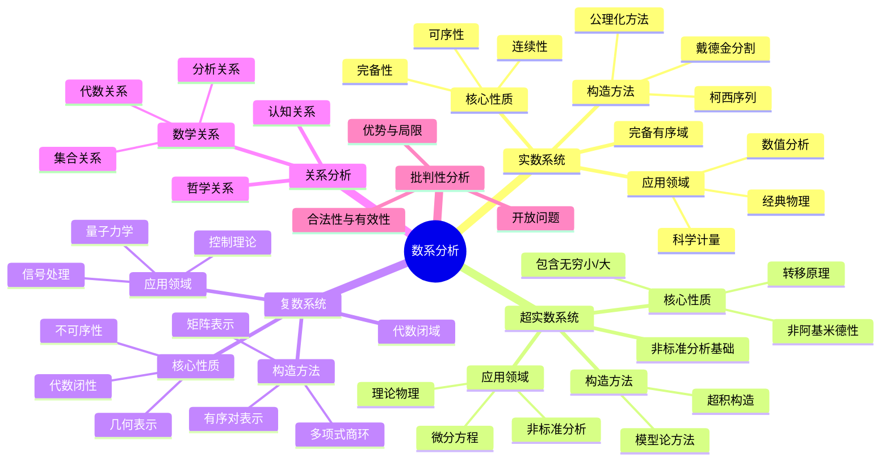

# 实数、超实数与复数的综合对比分析

## 目录

- [实数、超实数与复数的综合对比分析](#实数超实数与复数的综合对比分析)
  - [目录](#目录)
  - [引言](#引言)
  - [基本概念与定义](#基本概念与定义)
    - [实数 (Real Numbers)](#实数-real-numbers)
    - [超实数 (Hyperreal Numbers)](#超实数-hyperreal-numbers)
    - [复数 (Complex Numbers)](#复数-complex-numbers)
  - [数学结构分析](#数学结构分析)
    - [代数结构](#代数结构)
    - [拓扑结构](#拓扑结构)
    - [序结构](#序结构)
  - [本体论与认识论分析](#本体论与认识论分析)
    - [本体论视角](#本体论视角)
    - [认识论视角](#认识论视角)
    - [数学哲学流派观点](#数学哲学流派观点)
  - [认知结构分析](#认知结构分析)
    - [感性认知](#感性认知)
    - [知性认知](#知性认知)
    - [理性认知](#理性认知)
    - [认知障碍与突破](#认知障碍与突破)
  - [历史发展脉络](#历史发展脉络)
    - [实数系统的发展](#实数系统的发展)
    - [超实数系统的发展](#超实数系统的发展)
    - [复数系统的发展](#复数系统的发展)
    - [跨文化视角](#跨文化视角)
  - [形式化论证与证明](#形式化论证与证明)
    - [实数的关键性质](#实数的关键性质)
    - [超实数的构造与性质](#超实数的构造与性质)
    - [复数的关键性质](#复数的关键性质)
  - [应用领域分析](#应用领域分析)
    - [实数的应用](#实数的应用)
    - [超实数的应用](#超实数的应用)
    - [复数的应用](#复数的应用)
    - [跨领域应用比较](#跨领域应用比较)
  - [关系与关联性分析](#关系与关联性分析)
    - [数学关系](#数学关系)
    - [认知关系](#认知关系)
    - [哲学关系](#哲学关系)
  - [批判性思考](#批判性思考)
    - [优势与局限性](#优势与局限性)
    - [合法性与有效性](#合法性与有效性)
    - [开放问题](#开放问题)
  - [多种表征方式](#多种表征方式)
    - [思维导图](#思维导图)
    - [对比表格](#对比表格)
    - [视觉化表征](#视觉化表征)
  - [结论](#结论)
  - [参考文献](#参考文献)

## 引言

实数、超实数与复数是数学中三类核心数系，它们不仅具有独特的数学结构，也体现了数学思想的不同发展方向和人类认知的多维度特性。
本文旨在从数学结构、哲学基础、认知过程、历史演变和应用领域等多个维度对这三类数系进行综合、批判性分析，揭示它们之间的内在联系与区别。

这种多维度的分析不仅有助于加深对各数系本质的理解，也能为数学教育、跨学科研究以及数学哲学探讨提供新的视角。
通过将形式化的数学描述与哲学反思、认知分析结合起来，本文试图提供一个更为全面和深入的理解框架。

## 基本概念与定义

### 实数 (Real Numbers)

- **形式定义**：实数集 $\mathbb{R}$ 是唯一（同构意义下）的完备有序域。
- **构造方法**：
  - **戴德金分割**：将有理数集分割为两个非空子集 $A$ 和 $B$，使得 $A$ 中的每个元素小于 $B$ 中的每个元素，且 $A$ 中没有最大元素。每个这样的分割定义一个实数。
  - **柯西序列**：实数可定义为有理柯西序列的等价类，其中两个序列 $(a_n)$ 和 $(b_n)$ 等价，当且仅当 $\lim_{n\rightarrow\infty}(a_n-b_n)=0$。
  - **公理化方法**：通过域公理、序公理和完备性公理直接定义。
- **核心性质**：
  - **完备性**：任何非空有上界的子集具有最小上界（确界）。
  - **连续性**：实数轴上没有"空隙"。
  - **可序性**：任意两个实数可比较大小。
  - **稠密性**：任意两个不同的实数之间存在另一个实数。

### 超实数 (Hyperreal Numbers)

- **形式定义**：超实数集 $^*\mathbb{R}$ 是实数集的非标准扩张，包含无穷小和无穷大元素，同时保持实数的一阶逻辑性质。
- **构造方法**：
  - **超积构造**：考虑所有实数序列 $\mathbb{R}^{\mathbb{N}}$ 和极大滤子 $\mathcal{U}$，定义等价关系：$(a_n) \sim (b_n)$ 当且仅当 $\{n \in \mathbb{N} : a_n = b_n\} \in \mathcal{U}$。超实数是这些等价类构成的集合。
  - **模型论方法**：通过紧致性定理和洛斯定理构造实数的非标准模型。
- **核心性质**：
  - **无穷小元素**：非零 $\varepsilon \in {^*\mathbb{R}}$ 是无穷小的，当且仅当对任意正实数 $r$，有 $|\varepsilon| < r$。
  - **无穷大元素**：$\omega \in {^*\mathbb{R}}$ 是无穷大的，当且仅当对任意实数 $r$，有 $|\omega| > r$。
  - **有限元素**：$x \in {^*\mathbb{R}}$ 是有限的，当且仅当存在实数 $r$ 使得 $|x| < r$。
  - **标准部分**：每个有限超实数 $x$ 无限接近于唯一的实数 $\text{st}(x)$，称为 $x$ 的标准部分。
  - **转移原理**：任何用一阶逻辑表达的关于实数的命题，在超实数中依然成立。

### 复数 (Complex Numbers)

- **形式定义**：复数集 $\mathbb{C} = \{a + bi : a, b \in \mathbb{R}\}$，其中 $i^2 = -1$，是代数闭域。
- **构造方法**：
  - **有序对表示**：将复数 $a + bi$ 视为有序对 $(a, b)$，并定义适当的加法和乘法。
  - **矩阵表示**：将复数 $a + bi$ 表示为实矩阵 $\begin{pmatrix} a & -b \\ b & a \end{pmatrix}$。
  - **多项式商环**：$\mathbb{C} \cong \mathbb{R}[x]/(x^2+1)$，即实系数多项式环模去理想 $(x^2+1)$。
- **核心性质**：
  - **代数闭性**：任何非常数复系数多项式在复数域中有根（代数基本定理）。
  - **二维结构**：复数可视为平面上的点或二维向量。
  - **极坐标表示**：$z = a + bi = r(\cos\theta + i\sin\theta) = re^{i\theta}$，其中 $r = |z| = \sqrt{a^2 + b^2}$，$\theta = \arg(z) = \arctan(b/a)$（适当调整）。
  - **不可序性**：复数集不存在与其代数结构兼容的全序关系。

## 数学结构分析

### 代数结构

1. **实数 $\mathbb{R}$**
   - **域结构**：满足加法和乘法的封闭性、结合律、交换律、分配律，存在单位元和逆元。
   - **有序域**：具有与代数运算相容的全序关系。
   - **阿基米德性**：对任意正实数 $a$ 和 $b$，存在自然数 $n$ 使得 $na > b$。
   - **非代数闭域**：存在实系数多项式在实数域中没有根，如 $x^2 + 1 = 0$。

2. **超实数 $^*\mathbb{R}$**
   - **域结构**：保持实数的域结构。
   - **有序域**：保持实数的序结构，但扩展了比较范围。
   - **非阿基米德性**：存在无穷小元素 $\varepsilon$ 和无穷大元素 $\omega$，使得对任意自然数 $n$，有 $n\varepsilon < 1$ 和 $n > \omega$。
   - **非标准域**：包含标准实数作为真子集。

3. **复数 $\mathbb{C}$**
   - **域结构**：满足域的所有公理。
   - **代数闭域**：任何非常数复系数多项式都有根。
   - **二维向量空间**：作为实数上的向量空间，复数是二维的。
   - **不可序域**：不存在与代数结构相容的全序关系。

### 拓扑结构

1. **实数 $\mathbb{R}$**
   - **完备度量空间**：欧氏度量下每个柯西序列都收敛。
   - **连通空间**：不能被分为两个非空开集。
   - **局部紧致空间**：每点有紧致邻域。
   - **第二可数空间**：有可数稠密子集（如有理数集）。

2. **超实数 $^*\mathbb{R}$**
   - **非标准拓扑**：标准拓扑的非标准扩展。
   - **单子**：每个点周围有"无穷小单子"，包含与该点无限接近的所有点。
   - **不完备性**：在标准拓扑意义下不完备，有界集不一定有上确界。
   - **内部结构复杂**：包含复杂的无穷小和无穷大结构。

3. **复数 $\mathbb{C}$**
   - **完备度量空间**：欧氏度量下每个柯西序列都收敛。
   - **二维拓扑**：等价于 $\mathbb{R}^2$ 的欧氏拓扑。
   - **紧致化**：通过添加无穷远点可扩展为黎曼球面（$S^2$）。
   - **连通且道路连通**：任意两点可由连续路径连接。

### 序结构

1. **实数 $\mathbb{R}$**
   - **全序集**：任意两元素可比较。
   - **密集序**：任意两元素之间存在第三个元素。
   - **完全序**：每个有上界的非空子集有最小上界。
   - **三歧性**：对任意 $a,b \in \mathbb{R}$，恰有一个关系成立：$a < b$、$a = b$ 或 $a > b$。

2. **超实数 $^*\mathbb{R}$**
   - **全序集**：保持实数的序结构。
   - **非阿基米德序**：包含无穷小和无穷大元素。
   - **不完全序**：某些有界集合无最小上界。
   - **复杂的序结构**：包含实数无法表达的"无限接近"关系。

3. **复数 $\mathbb{C}$**
   - **不存在全序**：不可能定义与代数结构相容的全序。
   - **部分序可能**：可以定义某些部分序关系，如基于模或字典序。
   - **模序**：可以比较复数的模，但这不构成代数意义上的序。
   - **无序关系**：复数的基本特性之一是缺乏自然序关系。

## 本体论与认识论分析

### 本体论视角

1. **实数的本体论地位**
   - **物理对应论**：实数对应物理世界中的连续量，如长度、时间、质量等。
   - **构造论**：实数是人类思维的构造，通过有理数扩展或戴德金分割等方式形成。
   - **柏拉图主义**：实数作为数学对象客观存在，独立于人类认知。
   - **实在论与虚名论之争**：实数是否具有独立于人类思维的实在性？

2. **超实数的本体论地位**
   - **形式主义视角**：超实数是数学形式系统的产物，依赖于选择公理等集合论假设。
   - **历史演变**：从莱布尼茨的"实际无穷小"到现代形式化的超实数构造。
   - **模型论基础**：超实数作为实数理论的非标准模型存在。
   - **本体论依赖性**：超实数的存在依赖于选择公理和更高阶集合论。

3. **复数的本体论地位**
   - **工具主义视角**：复数最初作为求解方程的形式工具，后发展为具有几何和物理意义的数学对象。
   - **几何实在论**：通过复平面表示，复数获得了几何实在性。
   - **物理对应**：量子力学等现代物理理论赋予复数实质性意义。
   - **结构主义观点**：复数的本质在于其结构关系，而非"实体"。

### 认识论视角

1. **实数的认识路径**
   - **经验归纳**：从测量和计数的实践经验出发。
   - **形式抽象**：通过极限过程和形式定义构建。
   - **公理演绎**：基于公理系统的严格推导。
   - **认知发展**：个体认知从有限、离散到无限、连续的发展过程。

2. **超实数的认识路径**
   - **历史演变**：从无穷小的直观概念到严格形式化。
   - **形式构造**：通过超积和模型论工具构建。
   - **直觉障碍**：无穷小概念的非直观性和认知挑战。
   - **理论有效性**：作为分析工具的合理性和有用性。

3. **复数的认识路径**
   - **历史演变**：从"无意义符号"到几何解释再到物理应用。
   - **概念整合**：将代数和几何视角统一。
   - **认知扩展**：从一维思维到二维思维的拓展。
   - **应用验证**：通过物理和工程应用证明其有效性。

### 数学哲学流派观点

1. **形式主义**
   - 强调数学是符号系统和形式规则的研究
   - 关注三类数系的公理化表述和证明的一致性
   - 数学对象的"存在"等同于在形式系统中的可定义性

2. **直觉主义**
   - 强调数学对象必须能被构造
   - 对无穷集合和非构造性证明持怀疑态度
   - 对实数的完备性、超实数的无穷大和复数的闭域性提出质疑

3. **逻辑主义**
   - 试图将数学归约为逻辑
   - 关注三类数系如何通过逻辑和集合论定义
   - 强调概念的逻辑基础

4. **结构主义**
   - 数学研究的是结构而非对象
   - 关注三类数系之间的结构关系和同构性质
   - 数系的意义来自于其在整体数学结构中的位置

5. **自然主义**
   - 将数学视为科学活动的一部分
   - 强调数学概念的经验基础和物理对应
   - 评价数系的有效性基于其应用价值

## 认知结构分析

### 感性认知

1. **实数的感性认知**
   - **直接经验**：通过测量长度、重量等物理量
   - **视觉表征**：数轴表示
   - **估计与近似**：在日常生活中的量化估计
   - **认知基础**：连续性直觉和排序能力

2. **超实数的感性认知**
   - **认知挑战**：无穷小/大概念超出直接感知
   - **间接表征**：通过标准部分和相对比较理解
   - **比喻与类比**：如"显微镜"和"望远镜"的类比
   - **认知障碍**：突破有限思维的限制

3. **复数的感性认知**
   - **几何表征**：通过平面点或向量可视化
   - **物理对应**：通过旋转、振动等物理现象理解
   - **视觉模型**：复平面、阿根图和黎曼球面
   - **认知整合**：将代数运算与几何变换结合

### 知性认知

1. **实数的知性认知**
   - **运算规则**：加减乘除、幂、根、对数等运算
   - **序关系**：比较、排序、区间
   - **极限过程**：收敛、连续性、微分
   - **函数关系**：映射、变换、对应

2. **超实数的知性认知**
   - **扩展运算**：无穷小量运算规则
   - **转移原理**：从实数到超实数的性质迁移
   - **标准部分**：连接超实数与实数的桥梁
   - **非标准分析**：重新理解极限、导数、积分

3. **复数的知性认知**
   - **代数运算**：复数四则运算、幂、根
   - **几何解释**：旋转、缩放、反演
   - **函数理论**：解析函数、共形映射
   - **变换思维**：从实数到复数的思维拓展

### 理性认知

1. **实数的理性认知**
   - **公理体系**：域公理、序公理、完备性公理
   - **定理网络**：中值定理、介值定理、确界定理等
   - **形式推理**：从公理到定理的严格推导
   - **元数学**：关于实数系统的完备性和一致性

2. **超实数的理性认知**
   - **形式构造**：超积、滤子和等价类
   - **模型论**：非标准模型和转移原理
   - **形式语言**：一阶逻辑和高阶逻辑的表达
   - **哲学反思**：无穷小的本体论和认识论地位

3. **复数的理性认知**
   - **代数封闭性**：代数基本定理及其证明
   - **拓扑性质**：复流形、紧化和解析延拓
   - **理论整合**：复分析与实分析的联系与差异
   - **高维推广**：四元数、八元数等超复数结构

### 认知障碍与突破

1. **实数认知的障碍与突破**
   - **障碍**：无理数的非直观性、无限小数表示的困难
   - **突破**：通过极限概念、完备性公理和分析工具
   - **认知转变**：从离散到连续的思维方式转变
   - **教学策略**：渐进引入、多重表征、直观类比

2. **超实数认知的障碍与突破**
   - **障碍**：无穷小/大概念的抽象性、非标准分析的技术复杂性
   - **突破**：形式化工具、转移原理和具体问题应用
   - **认知转变**：接受"实际无穷小"的存在
   - **教学策略**：历史发展路径、直观类比、简化模型

3. **复数认知的障碍与突破**
   - **障碍**："虚数"概念的抽象性、二维思维的挑战
   - **突破**：几何解释、物理应用和代数完备性
   - **认知转变**：从一维到二维思维的拓展
   - **教学策略**：几何可视化、应用驱动、历史发展

## 历史发展脉络

### 实数系统的发展

1. **古代阶段 (公元前7世纪-公元4世纪)**
   - 毕达哥拉斯学派发现无理数
   - 欧几里得《几何原本》中的量的理论
   - 亚里士多德对连续性的哲学讨论

2. **中世纪与文艺复兴 (5-16世纪)**
   - 阿拉伯数学家对无理数的研究
   - 十进制小数表示法的发展
   - 代数方程的求解与数域扩张

3. **近代早期 (17-18世纪)**
   - 笛卡尔的解析几何
   - 牛顿与莱布尼茨的微积分
   - 欧拉对无穷级数的研究

4. **现代基础 (19-20世纪)**
   - 柯西的极限理论
   - 戴德金分割与康托尔理论
   - 希尔伯特的公理化方法

### 超实数系统的发展

1. **前驱思想 (17-18世纪)**
   - 莱布尼茨的无穷小量思想
   - 欧拉和柯西对无穷小的处理
   - 非标准量的早期概念

2. **形式化尝试 (19世纪末-20世纪初)**
   - 非阿基米德数系的探索
   - 杜·布瓦-雷蒙的无穷小量理论
   - 哈恩的超实数尝试

3. **现代发展 (20世纪中后期)**
   - 罗宾逊(Abraham Robinson)的非标准分析(1960s)
   - 模型论与超积构造的发展
   - 超实数应用于微积分、拓扑学等领域

4. **当代研究 (20世纪末至今)**
   - IST (Internal Set Theory) 理论
   - 超实数在分析、拓扑学中的应用
   - 计算机实现与教学应用

### 复数系统的发展

1. **早期探索 (16-17世纪)**
   - 卡尔丹(Cardano)和邦贝利(Bombelli)解三次方程
   - 笛卡尔对"虚数"的怀疑态度
   - 莱布尼茨对复数的初步研究

2. **形式与计算 (18世纪)**
   - 欧拉的 $e^{i\pi} + 1 = 0$ 公式
   - 复数的三角形式
   - 德·莫夫尔(De Moivre)公式

3. **几何解释 (19世纪)**
   - 韦塞尔(Wessel)和阿根(Argand)的复平面
   - 高斯对复数的几何解释
   - 柯西的复分析基础

4. **现代理论与应用 (20世纪至今)**
   - 黎曼曲面理论
   - 复数在量子力学中的基础地位
   - 复数在信号处理、控制理论等领域的应用

### 跨文化视角

1. **东西方数学传统比较**
   - 希腊-欧洲传统：公理化、几何视角
   - 中国传统：算法导向、应用驱动
   - 印度传统：代数视角、计算方法

2. **文化影响**
   - 哲学观念对数学概念的影响
   - 社会需求对数学发展的推动
   - 教育传统对数学思维的塑造

3. **全球化与融合**
   - 现代数学的全球统一视角
   - 不同传统对数学理解的贡献
   - 数学交流在跨文化背景下的发展

## 形式化论证与证明

### 实数的关键性质

1. **完备性**
   - **定义**：任意非空有上界的实数集 $S$ 都有最小上界 $\sup S$。
   - **等价表述**：
     - 柯西序列收敛性：任何柯西序列都收敛到实数。
     - 区间套定理：长度趋于零的闭区间套的交集非空且恰含一点。
     - 单调有界定理：单调有界数列必收敛。
   - **证明思路**：
     - 从戴德金分割构造：令 $A = \{q \in \mathbb{Q} : q \text{ 是 } S \text{ 的下界}\}$，$B = \mathbb{Q} \setminus A$。$(A,B)$ 定义一个分割，对应的实数即为 $\sup S$。
     - 从柯西序列构造：通过示范集合中柯西序列的极限是 $S$ 的上确界。

2. **稠密性**
   - **定义**：对任意实数 $a < b$，存在有理数 $q$ 使得 $a < q < b$。
   - **证明**：选取足够大的正整数 $n$ 使得 $\frac{1}{n} < b-a$，再取整数 $m$ 使得 $m-1 \leq na < m \leq nb$，则 $\frac{m}{n}$ 满足 $a < \frac{m}{n} < b$。
   - **推广**：有理数在实数中稠密，实数在复数的实轴上稠密。

3. **可序性**
   - **定义**：实数集上存在全序关系 $<$，满足：
     - 三歧性：对任意 $a,b \in \mathbb{R}$，恰有一个关系成立：$a < b$、$a = b$ 或 $a > b$。
     - 传递性：若 $a < b$ 且 $b < c$，则 $a < c$。
     - 与运算相容：若 $a < b$，则 $a + c < b + c$；若 $a < b$ 且 $c > 0$，则 $ac < bc$。
   - **证明思路**：利用戴德金分割中的自然序定义，或通过柯西序列的构造证明序关系的良定义性。

### 超实数的构造与性质

1. **超积构造**
   - **定义**：考虑所有实数序列 $\mathbb{R}^{\mathbb{N}}$ 和极大滤子 $\mathcal{U}$，定义等价关系：$(a_n) \sim (b_n)$ 当且仅当 $\{n \in \mathbb{N} : a_n = b_n\} \in \mathcal{U}$。
   - **具体实现**：
     - 选择自由超滤子 $\mathcal{U}$ 包含所有余有限集。
     - 定义等价类 $[(a_n)]_{\mathcal{U}}$ 为所有与 $(a_n)$ 等价的序列构成的集合。
     - 定义运算：$[(a_n)]_{\mathcal{U}} + [(b_n)]_{\mathcal{U}} = [(a_n + b_n)]_{\mathcal{U}}$，$[(a_n)]_{\mathcal{U}} \cdot [(b_n)]_{\mathcal{U}} = [(a_n \cdot b_n)]_{\mathcal{U}}$。
   - **嵌入映射**：将实数 $r$ 嵌入为常值序列 $(r,r,r,...)$ 的等价类。

2. **无穷小与无穷大元素**
   - **无穷小元素**：$\varepsilon \in {^*\mathbb{R}}$ 是无穷小的，当且仅当对任意正实数 $r$，有 $|\varepsilon| < r$。
     - 例：$[(1/n)]_{\mathcal{U}}$、$[(1/n^2)]_{\mathcal{U}}$ 等。
   - **无穷大元素**：$\omega \in {^*\mathbb{R}}$ 是无穷大的，当且仅当对任意实数 $r$，有 $|\omega| > r$。
     - 例：$[(n)]_{\mathcal{U}}$、$[(n^2)]_{\mathcal{U}}$ 等。
   - **关系**：若 $\omega$ 是无穷大元素，则 $1/\omega$ 是无穷小元素，反之亦然。

3. **转移原理**
   - **定义**：对任何用一阶逻辑公式表达的关于实数的命题 $\varphi$，$\varphi$ 在实数域成立当且仅当 $^*\varphi$（$\varphi$ 的自然扩展）在超实数域成立。
   - **证明思路**：通过洛斯定理(Łoś's Theorem)证明超积保持一阶公式的真值。
   - **应用**：转移原理保证了实数的许多性质（如代数结构、序结构）在超实数中依然成立。

### 复数的关键性质

1. **代数封闭性**
   - **定理(代数基本定理)**：任何次数大于等于1的复系数多项式至少有一个复数根。
   - **证明思路**：
     - **分析法**：假设 $p(z)$ 无根，则 $1/p(z)$ 是有界整函数，由Liouville定理，$1/p(z)$ 为常数，与 $p$ 是非常数多项式矛盾。
     - **代数法**：利用多项式根的对称函数、伽罗瓦理论等工具。
     - **拓扑法**：利用代数的基本性质和紧致性证明。

2. **不可序性**
   - **定理**：复数域上不存在与其代数结构相容的全序关系。
   - **证明**：假设存在这样的序关系 $<$，则 $i^2 = -1 < 0$（因为实数中 $-1 < 0$）。若 $i > 0$，则 $i \cdot i > 0 \cdot i = 0$，即 $-1 > 0$，矛盾。若 $i < 0$，则 $i \cdot i < 0 \cdot i = 0$，即 $-1 < 0$，与实数结构相容，但与 $i^2 = -1 < 0$ 矛盾。

3. **几何结构**
   - **复平面表示**：将复数 $z = a + bi$ 表示为平面上的点 $(a,b)$。
   - **模与辐角**：$|z| = \sqrt{a^2 + b^2}$，$\arg(z) = \arctan(b/a)$（适当调整）。
   - **欧拉公

   - **欧拉公式**：$e^{i\theta} = \cos\theta + i\sin\theta$，连接了指数、三角函数和复数。
   - **旋转与缩放**：复数乘法 $z \cdot w$ 对应复平面上的旋转（辐角相加）和缩放（模相乘）。
   - **共形映射**：解析函数在局部保持角度，是共形映射。

## 应用领域分析

### 实数的应用

1. **科学计量**
   - 物理量的测量与表示
   - 统计数据的分析
   - 实验误差的量化

2. **经典力学与分析**
   - 连续变化的数学描述
   - 微分方程的建立与求解
   - 能量、动量等物理量的表示

3. **计算机科学**
   - 浮点数表示与精度问题
   - 数值算法的设计与分析
   - 误差控制与稳定性

4. **经济学与社会科学**
   - 效用函数与决策理论
   - 经济模型与预测
   - 定量分析与实证研究

### 超实数的应用

1. **非标准分析**
   - 微积分的直观重构
   - 无穷小量处理导数和积分
   - 简化极限过程的复杂性

2. **微分方程理论**
   - 奇异摄动问题
   - 非线性方程的分析
   - 渐近解与数值解的比较

3. **数学物理**
   - 量子场论中的无穷小正则化
   - 连续模型的离散近似
   - 非平衡态物理的描述

4. **计算复杂性**
   - 非标准模型在计算理论中的应用
   - 超算法与非标准时间复杂度
   - 无穷小计算步骤的理论探索

### 复数的应用

1. **电气工程与信号处理**
   - 交流电路分析
   - 傅里叶变换与频域分析
   - 滤波器设计与信号处理

2. **量子力学**
   - 波函数的复数表示
   - 量子态的叠加与演化
   - 测量与观测的数学描述

3. **控制理论**
   - 系统稳定性分析
   - 传递函数与频率响应
   - 复数域中的反馈控制

4. **计算机图形学与图像处理**
   - 复变函数在共形映射中的应用
   - 分形图形的生成与分析
   - 小波变换与图像压缩

### 跨领域应用比较

1. **数值计算**
   - 实数：直接数值方法，精度控制
   - 超实数：非标准数值分析，处理奇异点
   - 复数：复变函数数值方法，共形映射计算

2. **物理建模**
   - 实数：经典力学，热力学
   - 超实数：非平衡态系统，奇异摄动
   - 复数：量子力学，电磁学，相对论

3. **数据科学**
   - 实数：统计分析，回归建模
   - 超实数：极端值处理，非标准统计
   - 复数：信号处理，频谱分析，变换方法

4. **交叉应用**
   - 复分析与超实数结合：非标准复分析
   - 实分析与复分析结合：调和分析
   - 三类数系的统一视角：函数空间理论

## 关系与关联性分析

### 数学关系

1. **集合关系**
   - 实数是超实数的真子集：$\mathbb{R} \subset {^*\mathbb{R}}$
   - 实数是复数的真子集：$\mathbb{R} \subset \mathbb{C}$
   - 复数可表示为有序实数对：$\mathbb{C} \cong \mathbb{R}^2$
   - 超实数与复数的关系：可构造"超复数"${^*\mathbb{C}}$，即超实数上的复数

2. **代数关系**
   - 实数是有序完备域，但非代数闭域
   - 超实数是非阿基米德有序域，非完备
   - 复数是代数闭域，不可序
   - 从域扩张角度：$\mathbb{C} = \mathbb{R}[i]/(i^2+1)$

3. **分析关系**
   - 实数函数理论：连续性、微分、积分基于极限
   - 超实数函数理论：基于无穷小的直接计算
   - 复变函数理论：解析性、共形性、留数定理
   - 关联：复分析可通过超实数方法重构，如Cauchy-Riemann方程的非标准表述

### 认知关系

1. **概念发展路径**
   - 从实数到复数：抽象度增加，几何直观从一维到二维
   - 从实数到超实数：抽象度增加，引入无穷小/大概念
   - 从复数到超复数：结合二维结构与无穷小/大概念

2. **认知难度比较**
   - 实数：基础直观，但完备性需要抽象思维
   - 超实数：需要高度抽象思维和形式化工具
   - 复数：需要几何直观和代数抽象的结合
   - 认知路径建议：实数→复数→超实数或实数→超实数→超复数

3. **教学与学习策略**
   - 实数教学：从直观到严格，从计算到理论
   - 超实数教学：历史发展，问题驱动，类比方法
   - 复数教学：几何可视化，物理应用，代数推广
   - 整合策略：多重表征，历史脉络，应用驱动

### 哲学关系

1. **存在论关联**
   - 实数的"实在性"为基础，复数和超实数各自延伸
   - 从具象到抽象的哲学转变：经验→形式→结构
   - 不同哲学立场对三类数系态度不同

2. **方法论关联**
   - 形式化程度：实数<复数<超实数
   - 直观性：实数>复数>超实数
   - 工具价值：应根据问题域具体评估

3. **统一视角**
   - 范畴论视角：通过函子和自然变换理解三者关系
   - 模型论视角：通过理论扩展和非标准模型理解
   - 结构主义视角：关注结构关系而非具体元素

## 批判性思考

### 优势与局限性

1. **实数系统**
   - **优势**：
     - 直观对应物理测量
     - 完备性保证极限存在
     - 有序性便于比较和优化
     - 应用广泛，基础牢固
   - **局限性**：
     - 代数不闭，某些方程无解
     - 无法直接表示无穷小/大
     - 连续性处理需要复杂的极限过程
     - 某些物理现象（如量子态）无法直接描述

2. **超实数系统**
   - **优势**：
     - 直接处理无穷小/大
     - 简化微积分的概念基础
     - 提供非标准分析工具
     - 保持实数的一阶性质
   - **局限性**：
     - 构造复杂，依赖高级集合论
     - 应用范围有限，不易普及
     - 缺乏完备性，某些极限过程失效
     - 计算实现困难

3. **复数系统**
   - **优势**：
     - 代数闭性，任何多项式都有根
     - 几何解释直观，适合表示平面变换
     - 在物理、工程中应用广泛
     - 复分析提供强大的理论工具
   - **局限性**：
     - 缺乏自然序关系
     - 物理解释时需要选择特定量
     - 推广到高维（如四元数）时失去交换性
     - 学习门槛相对较高

### 合法性与有效性

1. **形式合法性**
   - 实数：基于集合论和一阶逻辑，合法性广泛接受
   - 超实数：依赖选择公理等集合论假设，合法性相对较弱
   - 复数：基于代数扩张，合法性广泛接受

2. **直观有效性**
   - 实数：直接对应物理测量，有效性强
   - 超实数：对无穷小/大过程提供直观，但抽象
   - 复数：通过几何和物理应用获得有效性

3. **应用有效性**
   - 实数：科学和工程的基础，应用极广
   - 超实数：在特定理论领域有效，但实践应用有限
   - 复数：在电气、量子物理等领域极为有效

### 开放问题

1. **理论问题**
   - 超实数构造的最优化：是否存在更简洁的构造方法？
   - 复数与物理实在性：复数在量子理论中的本体论地位？
   - 超复数的结构：超实数与复数结合的最佳方式？

2. **应用问题**
   - 超实数计算的实现：如何在计算机中有效实现超实数运算？
   - 复数在机器学习中的应用：复值神经网络的优势？
   - 三类数系的统一应用框架：如何选择最适合特定问题的数系？

3. **教育问题**
   - 如何简化超实数的教学，使其更易接受？
   - 如何建立从实数到复数再到超实数的有效学习路径？
   - 如何将三类数系的哲学思考融入数学教育？

## 多种表征方式

### 思维导图



### 对比表格

| 特性 | 实数 $\mathbb{R}$ | 超实数 $^*\mathbb{R}$ | 复数 $\mathbb{C}$ |
|------|-------------------|----------------------|-------------------|
| **定义** | 完备有序域 | 实数的非标准扩张 | 形如 $a+bi$ 的数 |
| **构造** | 戴德金分割/柯西序列 | 超积/非标准模型 | 有序对/多项式商环 |
| **代数结构** | 域 | 域 | 域 |
| **序结构** | 全序 | 全序(非阿基米德) | 不可序 |
| **拓扑特性** | 完备、连通、可分 | 非完备、复杂内部结构 | 完备、连通、可分 |
| **维度** | 1 | 1(非标准) | 2 |
| **无穷小** | 不存在 | 存在 | 不存在 |
| **代数闭性** | 否 | 否 | 是 |
| **直观表示** | 数轴 | 扩展数轴 | 复平面 |
| **核心应用** | 测量、连续变化 | 非标准分析、极限 | 旋转、波动、周期 |
| **本体论地位** | 较强实在性 | 形式构造 | 几何实在性 |
| **认知难度** | 中等 | 高 | 中等 |
| **历史起源** | 古希腊 | 20世纪 | 16世纪 |

### 视觉化表征

1. **实数表征**

   ```text
   -----|-----|-----|-----|-----|---->
      -2    -1     0     1     2     R
   ```

2. **超实数表征**

   ```text
   ω⁻¹   -2    -1     0     1     2    ω
   ---|-----|-----|-----|-----|-----|----->
                    ↑
                无穷小区域
   ```

3. **复数表征**

   ```text
      ^
      |
    2i|       *       *       *
      |
    1i|       *       *       *
      |
    0 |---*---*---*---*---*---*--->
      |       *       *       *
   -1i|       *       *       *
      |
   -2i|       *       *       *
      |
      +-----------------------
        -2  -1   0   1   2   R
   ```

4. **关系表征**

   ```text
         超复数 *C
          /    \
    超实数 *R    复数 C
          \    /
           实数 R
            |
          有理数 Q
   ```

## 结论

实数、超实数与复数是数学中三类关键数系，各自体现了数学发展的不同方向和认知探索的多样性。

实数系统以其完备性和有序性为基础，直接对应物理世界的连续量，成为经典数学和物理的核心工具。
实数的构造过程体现了从直观到严格的数学发展路径，其完备性为分析工具提供了坚实基础。

超实数系统通过引入无穷小和无穷大元素，扩展了实数的表达能力，为非标准分析提供了数学基础。
超实数虽然构造复杂，但其对微积分的直观重构和对极限过程的简化，展示了形式化数学的强大力量。

复数系统则通过引入虚数单位，实现了代数的闭合性，并建立了数与几何的深刻联系。
复数的发展历程从"无意义符号"到物理和工程的核心工具，体现了数学概念从抽象到应用的典型路径。

三类数系之间存在丰富的数学关系、认知联系和哲学关联。
它们共同构成了现代数学的重要基础，各自在特定领域发挥着不可替代的作用。
通过多维度的对比分析，我们不仅能更深入理解每类数系的特性，也能把握数学思想的演化规律和认知拓展的一般模式。

在教育和研究中，应根据具体问题选择合适的数系，同时认识到数系的选择往往反映了特定的认知视角和哲学立场。
未来研究可进一步探索三类数系的统一理论框架、计算实现和教学策略，以及它们在新兴领域的应用潜力。

## 参考文献

1. Rudin, W. (1976). Principles of Mathematical Analysis. McGraw-Hill.
2. Robinson, A. (1996). Non-standard Analysis. Princeton University Press.
3. Needham, T. (1997). Visual Complex Analysis. Oxford University Press.
4. Keisler, H. J. (2012). Elementary Calculus: An Infinitesimal Approach. Dover Publications.
5. Lakoff, G., & Núñez, R. E. (2000). Where Mathematics Comes From. Basic Books.
6. Shapiro, S. (1997). Philosophy of Mathematics: Structure and Ontology. Oxford University Press.
7. Goldblatt, R. (1998). Lectures on the Hyperreals: An Introduction to Nonstandard Analysis. Springer.
8. Conway, J. B. (1978). Functions of One Complex Variable. Springer-Verlag.
9. Bell, J. L. (2008). A Primer of Infinitesimal Analysis. Cambridge University Press.
10. Gray, J. (2015). Real and Complex Analysis. Springer.
