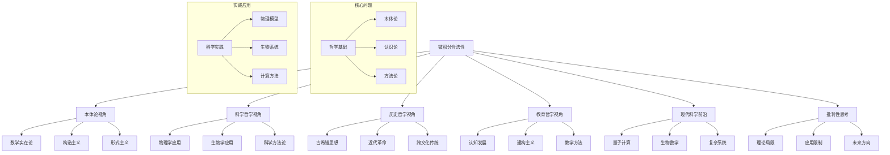

# 微积分的合法性：哲学与科学视角的深化

## 目录

- [微积分的合法性：哲学与科学视角的深化](#微积分的合法性哲学与科学视角的深化)
  - [目录](#目录)
  - [一、数学本体论视角](#一数学本体论视角)
    - [1. 微积分的本体论基础](#1-微积分的本体论基础)
    - [2. 认识论分析](#2-认识论分析)
  - [二、科学哲学视角](#二科学哲学视角)
    - [1. 微积分在科学中的角色](#1-微积分在科学中的角色)
    - [2. 科学方法论](#2-科学方法论)
  - [三、历史哲学视角](#三历史哲学视角)
    - [1. 微积分发展史](#1-微积分发展史)
    - [2. 跨文化数学传统](#2-跨文化数学传统)
  - [四、教育哲学视角](#四教育哲学视角)
    - [1. 数学教育理论](#1-数学教育理论)
    - [2. 教学方法论](#2-教学方法论)
  - [五、现代科学前沿](#五现代科学前沿)
    - [1. 量子计算视角](#1-量子计算视角)
    - [2. 生物数学前沿](#2-生物数学前沿)
  - [六、批判性思考](#六批判性思考)
    - [1. 理论局限性](#1-理论局限性)
    - [2. 未来发展方向](#2-未来发展方向)
  - [思维导图](#思维导图)
  - [持续更新建议](#持续更新建议)

## 一、数学本体论视角

### 1. 微积分的本体论基础

- **数学实在论视角**
  - 微积分作为客观数学结构的体现
  - 无穷小概念的实在性论证
  - 连续性与离散性的辩证统一

- **构造主义视角**
  - 微积分作为人类认知构造
  - 算法化证明的哲学意义
  - 计算与证明的统一性

- **形式主义视角**
  - 公理化体系的完备性
  - 符号系统的自洽性
  - 形式化与直觉的平衡

### 2. 认识论分析

- **数学直觉的本质**
  - 几何直观与形式证明的关系
  - 无穷小概念的认知基础
  - 极限思想的形成过程

- **数学知识的确定性**
  - 微积分证明的可靠性
  - 公理化方法的局限性
  - 数学真理的客观性

## 二、科学哲学视角

### 1. 微积分在科学中的角色

- **物理学中的应用**
  - 牛顿力学中的微积分基础
  - 量子力学中的微分方程
  - 相对论中的几何分析

- **生物学中的意义**
  - 种群动力学模型
  - 神经系统的微分方程
  - 生物信息学中的算法

### 2. 科学方法论

- **模型化方法**
  - 连续模型的合理性
  - 离散近似的有效性
  - 模型简化的哲学基础

- **实验验证**
  - 数值计算的可靠性
  - 实验数据的解释
  - 理论预测的检验

## 三、历史哲学视角

### 1. 微积分发展史

- **古希腊数学思想**
  - 芝诺悖论的哲学意义
  - 欧多克索斯的穷竭法
  - 阿基米德的积分思想

- **近代数学革命**
  - 牛顿与莱布尼茨的贡献
  - 无穷小概念的演变
  - 严格化运动的意义

### 2. 跨文化数学传统

- **东方数学思想**
  - 中国古代的极限思想
  - 印度数学中的无穷概念
  - 阿拉伯数学的贡献

- **现代数学的融合**
  - 不同传统的互补性
  - 数学语言的统一性
  - 文化视角的多样性

## 四、教育哲学视角

### 1. 数学教育理论

- **认知发展理论**
  - 微积分概念的认知过程
  - 形式运算阶段的特征
  - 抽象思维的发展

- **建构主义教学**
  - 概念形成的心理机制
  - 问题解决的过程
  - 数学直觉的培养

### 2. 教学方法论

- **直观与严格的平衡**
  - 几何直观的重要性
  - 形式证明的必要性
  - 教学策略的选择

- **跨学科整合**
  - 物理应用的启示
  - 工程问题的解决
  - 计算机辅助教学

## 五、现代科学前沿

### 1. 量子计算视角

- **量子力学基础**
  - 波函数的微分方程
  - 量子态演化的连续性
  - 测量过程的离散性

- **量子算法理论**
  - 量子傅里叶变换
  - 量子模拟方法
  - 量子优化算法

### 2. 生物数学前沿

- **复杂系统理论**
  - 非线性动力学
  - 混沌理论
  - 分形几何

- **神经科学应用**
  - 神经元动力学
  - 神经网络理论
  - 认知过程建模

## 六、批判性思考

### 1. 理论局限性

- **无穷小概念的困境**
  - 非标准分析的挑战
  - 直觉与严格的冲突
  - 计算与证明的张力

- **应用范围的限制**
  - 离散系统的处理
  - 量子效应的描述
  - 复杂系统的建模

### 2. 未来发展方向

- **理论创新**
  - 非标准分析的发展
  - 几何分析的新进展
  - 代数几何的融合

- **应用拓展**
  - 人工智能中的微积分
  - 量子计算的应用
  - 生物数学的发展

## 思维导图

## 持续更新建议

1. **理论深化**
   - 补充数学哲学新进展
   - 深化科学方法论研究
   - 扩展跨文化比较

2. **应用拓展**
   - 更新量子计算应用
   - 补充生物数学进展
   - 探讨AI时代影响

3. **教育创新**
   - 发展新的教学方法
   - 研究认知过程
   - 优化课程设计

4. **批判性研究**
   - 深入理论局限
   - 探讨应用边界
   - 预测未来方向

这个重构版本从哲学和科学的角度深化了微积分合法性的讨论，强调了批判性思考，并保持了与原文的连贯性。建议根据实际教学和研究需求继续深化和扩展。
