# 微积分的合法性：哲学与科学视角的深化

## 微积分合法性的四维框架

微积分的法则是**源于存在的关系，成于人为的建构，证于实践的效用，立于逻辑的严密**。
本文基于这一四维框架，从哲学与科学视角深化对微积分合法性的论证。

### 四维框架概述

1. **源于存在的关系**：微积分作为数学体系，其合法性首先源于对客观存在关系的刻画与表达。自然界中的连续变化、极限过程、累积效应等现象，为微积分提供了本体论基础。

2. **成于人为的建构**：微积分的合法性不仅源于对存在关系的刻画，更在于人类通过数学语言与符号系统对其进行的建构。数学直觉、形式化证明、公理化方法等，构成了微积分的认识论基础。

3. **证于实践的效用**：微积分的合法性需要通过其在科学、工程与技术中的实际应用来验证。物理学、生物学、工程学等领域的成功应用，证明了微积分的实践价值。

4. **立于逻辑的严密**：微积分的合法性最终建立在严格的逻辑基础之上。公理化体系、形式化证明、逻辑一致性等，确保了微积分的理论可靠性。

这四个维度相互支撑、相互验证，共同构成了微积分合法性的完整论证。
本文将从这四个维度出发，全面探讨微积分的哲学基础、科学应用、历史发展及未来展望。

## 目录

- [微积分的合法性：哲学与科学视角的深化](#微积分的合法性哲学与科学视角的深化)
  - [微积分合法性的四维框架](#微积分合法性的四维框架)
    - [四维框架概述](#四维框架概述)
  - [目录](#目录)
    - [一、源于存在的关系：微积分的本体论基础](#一源于存在的关系微积分的本体论基础)
      - [1. 连续性与变化：微积分的存在基础](#1-连续性与变化微积分的存在基础)
        - [1.1 连续性的数学表征](#11-连续性的数学表征)
        - [1.2 变化率的数学表达](#12-变化率的数学表达)
      - [2. 无穷小与极限：微积分的概念基础](#2-无穷小与极限微积分的概念基础)
        - [2.1 无穷小的严格化](#21-无穷小的严格化)
        - [2.2 极限思想的哲学基础](#22-极限思想的哲学基础)
    - [二、成于人为的建构：微积分的认识论基础](#二成于人为的建构微积分的认识论基础)
      - [1. 数学语言与符号系统](#1-数学语言与符号系统)
        - [1.1 微积分的符号体系](#11-微积分的符号体系)
        - [1.2 数学证明的形式化](#12-数学证明的形式化)
      - [2. 数学直觉与形式化](#2-数学直觉与形式化)
        - [2.1 几何直观与形式证明](#21-几何直观与形式证明)
        - [2.2 数学直觉的形式化过程](#22-数学直觉的形式化过程)
    - [三、证于实践的效用：微积分的应用基础](#三证于实践的效用微积分的应用基础)
      - [1. 物理学中的应用](#1-物理学中的应用)
        - [1.1 经典力学中的微积分](#11-经典力学中的微积分)
        - [1.2 电磁学中的微积分](#12-电磁学中的微积分)
      - [2. 生物学中的应用](#2-生物学中的应用)
        - [2.1 生物动力学模型](#21-生物动力学模型)
        - [2.2 生物形态发生](#22-生物形态发生)
      - [3. 工程与技术中的应用](#3-工程与技术中的应用)
        - [3.1 控制系统理论](#31-控制系统理论)
        - [3.2 信号处理](#32-信号处理)
    - [四、立于逻辑的严密：微积分的逻辑基础](#四立于逻辑的严密微积分的逻辑基础)
      - [1. 微积分的公理化体系](#1-微积分的公理化体系)
        - [1.1 实数系的公理化](#11-实数系的公理化)
        - [1.2 微积分基本定理的证明](#12-微积分基本定理的证明)
      - [2. 微积分的逻辑结构](#2-微积分的逻辑结构)
        - [2.1 极限理论的逻辑基础](#21-极限理论的逻辑基础)
        - [2.2 微分学的逻辑体系](#22-微分学的逻辑体系)
      - [3. 微积分的逻辑一致性](#3-微积分的逻辑一致性)
        - [3.1 非标准分析中的微积分](#31-非标准分析中的微积分)
        - [3.2 构造主义微积分](#32-构造主义微积分)
  - [微积分合法性的综合论证](#微积分合法性的综合论证)
    - [1. 四维框架的内在联系](#1-四维框架的内在联系)
      - [1.1 存在关系与人为建构的辩证统一](#11-存在关系与人为建构的辩证统一)
      - [1.2 实践效用与逻辑严密的相互验证](#12-实践效用与逻辑严密的相互验证)
    - [2. 微积分合法性的哲学意义](#2-微积分合法性的哲学意义)
      - [2.1 数学哲学视角](#21-数学哲学视角)
      - [2.2 跨学科视角](#22-跨学科视角)
    - [3. 微积分合法性的历史发展](#3-微积分合法性的历史发展)
      - [3.1 从直觉到严格化](#31-从直觉到严格化)
      - [3.2 从应用到理论](#32-从应用到理论)
    - [4. 微积分合法性的未来展望](#4-微积分合法性的未来展望)
      - [4.1 理论创新](#41-理论创新)
      - [4.2 应用拓展](#42-应用拓展)
      - [4.3 教育创新](#43-教育创新)
  - [思维导图](#思维导图)
  - [持续更新建议](#持续更新建议)
    - [1. 理论深化](#1-理论深化)
      - [1.1 数学哲学新进展](#11-数学哲学新进展)
      - [1.2 科学方法论研究](#12-科学方法论研究)
      - [1.3 跨文化比较](#13-跨文化比较)
      - [1.4 数学社会学视角](#14-数学社会学视角)
      - [1.5 认知科学最新发现](#15-认知科学最新发现)
    - [2. 应用拓展](#2-应用拓展)
      - [2.1 量子计算应用](#21-量子计算应用)
      - [2.2 生物数学进展](#22-生物数学进展)
      - [2.3 AI时代影响](#23-ai时代影响)
      - [2.4 金融数学的哲学基础](#24-金融数学的哲学基础)
      - [2.5 气候模型中的微积分应用](#25-气候模型中的微积分应用)
    - [3. 教育创新](#3-教育创新)
      - [3.1 教学方法创新](#31-教学方法创新)
      - [3.2 认知过程研究](#32-认知过程研究)
      - [3.3 课程设计优化](#33-课程设计优化)
      - [3.4 数字技术应用](#34-数字技术应用)
      - [3.5 跨学科教学模式](#35-跨学科教学模式)
    - [4. 批判性研究](#4-批判性研究)
      - [4.1 理论局限](#41-理论局限)
      - [4.2 应用边界](#42-应用边界)
      - [4.3 未来方向](#43-未来方向)
      - [4.4 社会建构分析](#44-社会建构分析)
      - [4.5 后现代主义视角](#45-后现代主义视角)

### 一、源于存在的关系：微积分的本体论基础

微积分作为数学体系，其合法性首先源于对客观存在关系的刻画与表达。
本节探讨微积分如何反映自然界的连续变化与极限过程。

#### 1. 连续性与变化：微积分的存在基础

##### 1.1 连续性的数学表征

- **实数系的完备性与连续性公理**
  - **戴德金分割与实数构造**
    - 有理数集的戴德金分割定义实数
    - 分割的序关系与代数运算
    - 完备性定理：有上界的非空集合有最小上界
  - **确界原理与区间套定理**
    - 上确界与下确界的存在性
    - 区间套定理：嵌套闭区间的交集非空
    - 完备性等价定理：戴德金分割、确界原理、区间套定理的等价性
  - **连续统的不可数性证明**
    - 康托尔对角线法
    - 基数比较：|ℝ| > |ℕ|
    - 连续统假设的哲学意义

- **函数连续性的ε-δ定义**
  - **极限概念的严格化**
    - 函数极限的ε-δ定义：∀ε>0, ∃δ>0, 当0<|x-a|<δ时，|f(x)-L|<ε
    - 单侧极限与双侧极限
    - 无穷远处的极限
  - **一致连续性与利普希茨条件**
    - 一致连续：∀ε>0, ∃δ>0, 当|x-y|<δ时，|f(x)-f(y)|<ε
    - 利普希茨条件：|f(x)-f(y)| ≤ L|x-y|
    - 紧集上连续函数的一致连续性
  - **连续函数的中值定理与介值定理**
    - 中值定理：f(b)-f(a) = f'(c)(b-a)
    - 介值定理：f在[a,b]上连续，则f取遍f(a)与f(b)之间的所有值
    - 应用：方程解的存在性证明

- **拓扑空间中的连续性**
  - **开集与闭集的定义**
    - 开集：每个点都有邻域完全包含在集合内
    - 闭集：包含所有极限点
    - 开集与闭集的对偶性
  - **紧致性与连通性**
    - 紧致性：每个开覆盖有有限子覆盖
    - 连通性：不能表示为两个非空不相交开集的并
    - 紧致性与连续性的关系
  - **同胚映射与拓扑不变量**
    - 同胚：双射且双向连续
    - 拓扑不变量：在同胚下保持的性质
    - 应用：几何分类问题

##### 1.2 变化率的数学表达

- **导数的几何与物理意义**
  - **切线斜率与瞬时速度**
    - 导数作为切线斜率：f'(a) = lim_{h→0} [f(a+h)-f(a)]/h
    - 导数作为瞬时变化率
    - 高阶导数的几何意义
  - **方向导数与梯度**
    - 方向导数：函数沿特定方向的变化率
    - 梯度：方向导数最大的方向
    - 梯度的几何解释：等值面的法向量
  - **高阶导数与泰勒展开**
    - 泰勒级数：f(x) = Σ_{n=0}^∞ [f^(n)(a)/n!](x-a)^n
    - 余项估计：拉格朗日余项、柯西余项
    - 应用：函数近似与数值计算

- **微分作为线性近似**
  - **微分形式与微分流形**
    - 微分形式：外代数上的线性函数
    - 微分流形：局部同胚于欧氏空间
    - 切丛与余切丛
  - **切空间与余切空间**
    - 切空间：流形上某点的所有切向量
    - 余切空间：切空间的对偶空间
    - 坐标变换下的变换规则
  - **外微分与微分形式**
    - 外微分：d(ω∧η) = dω∧η + (-1)^deg(ω)ω∧dη
    - 闭形式与恰当形式
    - 斯托克斯定理：∫_M dω = ∫_∂M ω

- **积分作为累积效应**
  - **黎曼积分的构造**
    - 达布和与达布积分
    - 黎曼和与黎曼积分
    - 可积性条件：有界函数在有限区间上连续或只有有限个间断点
  - **勒贝格积分的测度论基础**
    - 测度：满足可数可加性的非负集函数
    - 可测函数：原像为可测集
    - 勒贝格积分：通过简单函数逼近
  - **广义积分的收敛性**
    - 瑕积分：处理无界函数或无穷区间
    - 收敛性判别法：比较判别法、积分判别法
    - 绝对收敛与条件收敛

#### 2. 无穷小与极限：微积分的概念基础

##### 2.1 无穷小的严格化

- **非标准分析中的超实数**
  - **超实数域的构造**
    - 超滤子与超幂
    - 超实数的代数结构
    - 标准部分映射
  - **无穷小量的代数结构**
    - 无穷小：绝对值小于任何正实数
    - 无穷大：绝对值大于任何正实数
    - 有限超实数：与标准实数无限接近
  - **非标准模型的存在性证明**
    - 紧致性定理
    - 超幂构造
    - 模型论方法

- **标准分析中的极限过程**
  - **数列极限的ε-N定义**
    - 收敛性：∀ε>0, ∃N, 当n>N时，|a_n-L|<ε
    - 柯西序列：∀ε>0, ∃N, 当m,n>N时，|a_m-a_n|<ε
    - 单调有界定理：单调有界数列收敛
  - **函数极限的ε-δ定义**
    - 函数极限：∀ε>0, ∃δ>0, 当0<|x-a|<δ时，|f(x)-L|<ε
    - 海涅定理：函数极限存在当且仅当所有收敛于a的数列的像数列收敛于同一值
    - 夹逼定理：若g(x)≤f(x)≤h(x)且lim_{x→a}g(x)=lim_{x→a}h(x)=L，则lim_{x→a}f(x)=L
  - **一致收敛与逐点收敛**
    - 逐点收敛：对每个x，f_n(x)→f(x)
    - 一致收敛：sup_x|f_n(x)-f(x)|→0
    - 一致收敛的性质：保持连续性、可积性、可导性

- **无穷级数的收敛性**
  - **级数收敛的判别法**
    - 比较判别法：若0≤a_n≤b_n且Σb_n收敛，则Σa_n收敛
    - 比值判别法：若lim|a_{n+1}/a_n|<1，则Σa_n绝对收敛
    - 根值判别法：若limsup|a_n|^{1/n}<1，则Σa_n绝对收敛
  - **幂级数的收敛半径**
    - 收敛半径：R = 1/limsup|a_n|^{1/n}
    - 收敛圆：|z-a|<R
    - 幂级数的性质：在收敛圆内一致收敛，可逐项求导、积分
  - **傅里叶级数的收敛性**
    - 狄利克雷条件：分段连续、分段单调
    - 傅里叶系数：a_n = (1/π)∫_{-π}^π f(x)cos(nx)dx
    - 收敛定理：满足狄利克雷条件的函数，其傅里叶级数在连续点收敛于函数值

##### 2.2 极限思想的哲学基础

- **芝诺悖论与极限概念**
  - **阿基里斯与乌龟悖论**
    - 芝诺悖论：阿基里斯永远追不上乌龟
    - 数学解析：无穷级数求和
    - 哲学意义：连续性与离散性的矛盾
  - **二分法悖论**
    - 芝诺悖论：运动不可能，因为需要经过无限多个点
    - 数学解析：无穷级数的收敛性
    - 哲学意义：无限可分性与实际运动的矛盾
  - **飞矢不动悖论**
    - 芝诺悖论：飞矢在每一时刻都占据确定位置，因此静止
    - 数学解析：瞬时速度与导数的概念
    - 哲学意义：时间与运动的连续性

- **潜无穷与实无穷**
  - **康托尔的超限数理论**
    - 基数：集合的"大小"
    - 序数：良序集的"序型"
    - 连续统假设：2^ℵ₀ = ℵ₁
  - **直觉主义对无穷的处理**
    - 潜无穷：作为过程的无穷
    - 构造性数学：拒绝非构造性证明
    - 选择序列与创造主体
  - **形式主义对无穷的公理化**
    - 策梅洛-弗兰克尔公理系统
    - 选择公理与连续统假设的独立性
    - 大基数公理与集合论宇宙

- **连续统假设**
  - **连续统假设的独立性**
    - 哥德尔：连续统假设与ZFC相容
    - 科恩：连续统假设的否定与ZFC相容
    - 哲学意义：数学真理的相对性
  - **大基数公理与连续统**
    - 大基数：不可达基数、马洛基数等
    - 大基数公理对连续统的影响
    - 集合论多宇宙观
  - **可构造宇宙与连续统**
    - 可构造宇宙V=L
    - 广义连续统假设在L中成立
    - 哲学意义：数学实在论与形式主义

### 二、成于人为的建构：微积分的认识论基础

微积分的合法性不仅源于对存在关系的刻画，更在于人类通过数学语言与符号系统对其进行的建构。
本节探讨微积分如何作为人类认知的产物而获得合法性。

#### 1. 数学语言与符号系统

##### 1.1 微积分的符号体系

- **莱布尼茨符号系统**
  - **微分符号d/dx的引入**
    - 历史背景：莱布尼茨对无穷小的思考
    - 符号优势：直观表示微分运算
    - 链式法则的简洁表达：(f∘g)'(x) = f'(g(x))·g'(x)
  - **积分符号∫的起源**
    - 历史背景：求和概念的符号化
    - 符号优势：直观表示积分运算
    - 微积分基本定理的简洁表达：∫_a^b f'(x)dx = f(b)-f(a)
  - **高阶导数与偏导数的表示**
    - 高阶导数：d^n/dx^n 或 f^(n)(x)
    - 偏导数：∂f/∂x, ∂²f/∂x∂y
    - 多元函数的微分：df = (∂f/∂x)dx + (∂f/∂y)dy

- **牛顿的流数法**
  - **点记号与流数概念**
    - 历史背景：牛顿对运动的研究
    - 点记号：ẋ, ẍ 表示速度、加速度
    - 流数法：将变量视为随时间变化的量
  - **流数法的代数化**
    - 流数的代数运算规则
    - 流数法与莱布尼茨符号的对应关系
    - 应用：运动方程的建立
  - **流数法与莱布尼茨符号的等价性**
    - 形式等价性证明
    - 历史争议：优先权之争
    - 现代视角：两种表示法的互补性

- **现代微积分符号的发展**
  - **向量微积分的符号系统**
    - 梯度：∇f = (∂f/∂x, ∂f/∂y, ∂f/∂z)
    - 散度：∇·F = ∂F_x/∂x + ∂F_y/∂y + ∂F_z/∂z
    - 旋度：∇×F = (∂F_z/∂y - ∂F_y/∂z, ∂F_x/∂z - ∂F_z/∂x, ∂F_y/∂x - ∂F_x/∂y)
  - **张量微积分的指标表示**
    - 爱因斯坦求和约定
    - 协变与逆变指标
    - 张量场的微分运算
  - **微分几何中的现代符号**
    - 外微分形式：dω
    - 李导数：L_X Y
    - 协变导数：∇_X Y

##### 1.2 数学证明的形式化

- **公理化方法**
  - **实数系的公理化**
    - 域公理：加法与乘法的交换律、结合律、分配律
    - 序公理：自反性、反对称性、传递性
    - 完备性公理：有上界的非空集合有最小上界
  - **微积分基本定理的证明**
    - 第一基本定理：若f在[a,b]上连续，则F(x) = ∫_a^x f(t)dt在[a,b]上可导，且F'(x) = f(x)
    - 第二基本定理：若F' = f在[a,b]上连续，则∫_a^b f(x)dx = F(b)-F(a)
    - 证明方法：ε-δ论证、黎曼和估计
  - **隐函数定理的严格证明**
    - 条件：F(x,y) = 0, ∂F/∂y ≠ 0
    - 结论：存在函数y = f(x)满足F(x,f(x)) = 0
    - 证明方法：压缩映射原理

- **构造性证明**
  - **魏尔斯特拉斯逼近定理**
    - 定理：连续函数可用多项式一致逼近
    - 构造方法：伯恩斯坦多项式
    - 应用：数值分析、信号处理
  - **皮亚诺存在定理**
    - 定理：初值问题y' = f(x,y), y(x₀) = y₀在适当条件下有解
    - 构造方法：欧拉折线法
    - 应用：微分方程的数值解
  - **布劳威尔不动点定理**
    - 定理：连续映射f: D^n → D^n有不动点
    - 构造方法：单纯剖分与标签
    - 应用：博弈论、经济学

- **非构造性证明**
  - **选择公理的应用**
    - 选择公理：对任意非空集合族，存在选择函数
    - 应用：证明某些存在性定理
    - 哲学争议：非构造性存在
  - **佐恩引理与极值存在性**
    - 佐恩引理：每个偏序集都有极大链
    - 应用：证明某些极值存在
    - 等价性：与选择公理等价
  - **非标准分析中的存在性证明**
    - 非标准模型：包含无穷小与无穷大的数系
    - 应用：简化某些存在性证明
    - 哲学意义：无穷小的严格处理

#### 2. 数学直觉与形式化

##### 2.1 几何直观与形式证明

- **微积分基本定理的几何直观**
  - **面积与导数的关系**
    - 直观：函数图像下的面积变化率等于函数值
    - 形式化：F'(x) = f(x)，其中F(x) = ∫_a^x f(t)dt
    - 应用：面积计算、概率密度
  - **曲线下的面积计算**
    - 直观：将区域分割为无穷多个无穷窄的矩形
    - 形式化：黎曼和与黎曼积分
    - 应用：物理量计算、概率计算
  - **体积与表面积的计算**
    - 直观：旋转体、平行截面
    - 形式化：定积分、重积分
    - 应用：工程计算、物理建模

- **多元微积分的几何解释**
  - **方向导数与梯度**
    - 直观：函数沿特定方向的变化率
    - 形式化：∂_v f = ∇f·v/|v|
    - 应用：最速下降法、等值面
  - **散度与旋度**
    - 直观：向量场的"源"与"旋"
    - 形式化：∇·F, ∇×F
    - 应用：流体力学、电磁学
  - **斯托克斯定理与高斯定理**
    - 直观：曲线积分与曲面积分的关系
    - 形式化：∫_∂S F·dr = ∫_S (∇×F)·dS
    - 应用：电磁学、流体力学

- **微分方程的几何方法**
  - **相空间与相图**
    - 直观：状态空间中的轨迹
    - 形式化：自治系统ẋ = f(x)
    - 应用：动力系统、控制理论
  - **向量场与积分曲线**
    - 直观：每点的"方向指示"
    - 形式化：ẋ = f(x,t)
    - 应用：流场、电磁场
  - **李雅普诺夫稳定性**
    - 直观：解的长期行为
    - 形式化：李雅普诺夫函数
    - 应用：控制系统、生态模型

##### 2.2 数学直觉的形式化过程

- **无穷小概念的严格化**
  - **柯西的极限定义**
    - 历史背景：解决无穷小的矛盾
    - 形式化：ε-δ语言
    - 哲学意义：从动态到静态的转变
  - **魏尔斯特拉斯的ε-δ语言**
    - 历史背景：微积分的严格化运动
    - 形式化：∀ε>0, ∃δ>0, 当0<|x-a|<δ时，|f(x)-L|<ε
    - 教育意义：从直观到严格的过渡
  - **非标准分析中的无穷小**
    - 历史背景：罗宾逊的工作
    - 形式化：超实数域中的无穷小
    - 哲学意义：无穷小的严格处理

- **连续性的形式定义**
  - **函数连续性的ε-δ定义**
    - 直观：函数图像无"跳跃"
    - 形式化：∀ε>0, ∃δ>0, 当|x-a|<δ时，|f(x)-f(a)|<ε
    - 应用：中值定理、介值定理
  - **一致连续性与利普希茨条件**
    - 直观：变化率的全局控制
    - 形式化：∀ε>0, ∃δ>0, 当|x-y|<δ时，|f(x)-f(y)|<ε
    - 应用：积分存在性、数值分析
  - **绝对连续性与有界变差**
    - 直观：函数变化的"平滑性"
    - 形式化：∀ε>0, ∃δ>0, 对任意有限个互不相交的区间(a_i,b_i)，若Σ(b_i-a_i)<δ，则Σ|f(b_i)-f(a_i)|<ε
    - 应用：测度论、概率论

- **积分的严格构造**
  - **黎曼积分的达布和**
    - 直观：上下和逼近
    - 形式化：达布上积分与下积分
    - 应用：可积性判别
  - **勒贝格积分的测度论**
    - 直观：基于函数值域的划分
    - 形式化：测度空间上的积分
    - 应用：傅里叶分析、概率论
  - **广义积分的收敛性**
    - 直观：处理无界函数或无穷区间
    - 形式化：主值积分、瑕积分
    - 应用：物理问题、概率论

### 三、证于实践的效用：微积分的应用基础

微积分的合法性最终需要通过其在科学、工程与技术中的实际应用来验证。
本节探讨微积分如何通过解决实际问题而获得合法性。

#### 1. 物理学中的应用

##### 1.1 经典力学中的微积分

- **牛顿运动定律的微分方程**
  - **质点运动方程**
    - 牛顿第二定律：F = ma = m(d²x/dt²)
    - 运动方程的求解：常微分方程理论
    - 应用：行星运动、弹道计算、振动系统
  - **刚体动力学**
    - 欧拉方程：I·(dω/dt) + ω×(I·ω) = M
    - 角动量守恒：dL/dt = M
    - 应用：陀螺运动、卫星姿态控制
  - **哈密顿系统**
    - 哈密顿方程：dq/dt = ∂H/∂p, dp/dt = -∂H/∂q
    - 相空间中的运动：刘维尔定理
    - 应用：天体力学、量子力学

- **变分原理与拉格朗日力学**
  - **最小作用量原理**
    - 作用量：S = ∫L(q,ẋ,t)dt
    - 欧拉-拉格朗日方程：d/dt(∂L/∂ẋ) - ∂L/∂x = 0
    - 应用：光学中的费马原理、量子力学中的路径积分
  - **诺特定理与守恒量**
    - 对称性与守恒律：时间平移→能量守恒
    - 空间平移→动量守恒
    - 应用：粒子物理、场论

- **连续介质力学**
  - **流体动力学方程**
    - 纳维-斯托克斯方程：ρ(∂v/∂t + v·∇v) = -∇p + μ∇²v + f
    - 连续性方程：∂ρ/∂t + ∇·(ρv) = 0
    - 应用：气象预报、空气动力学
  - **弹性理论**
    - 胡克定律：σ = Eε
    - 应力-应变关系：σ_ij = C_ijkl ε_kl
    - 应用：结构工程、材料科学
  - **热传导方程**
    - 傅里叶热传导：∂T/∂t = α∇²T
    - 边界条件与初始条件
    - 应用：热工程、地球物理

##### 1.2 电磁学中的微积分

- **麦克斯韦方程组**
  - **微分形式**
    - 高斯定律：∇·E = ρ/ε₀
    - 法拉第定律：∇×E = -∂B/∂t
    - 安培定律：∇×B = μ₀(J + ε₀∂E/∂t)
    - 磁高斯定律：∇·B = 0
  - **积分形式**
    - 高斯定律：∮E·dA = Q/ε₀
    - 法拉第定律：∮E·dl = -dΦ_B/dt
    - 安培定律：∮B·dl = μ₀(I + ε₀dΦ_E/dt)
    - 磁高斯定律：∮B·dA = 0
  - **波动方程**
    - 电磁波方程：∇²E - (1/c²)∂²E/∂t² = 0
    - 平面波解：E = E₀exp(i(k·r - ωt))
    - 应用：天线设计、光学器件

- **电磁场的几何描述**
  - **向量场与标量场**
    - 电场：保守场，E = -∇φ
    - 磁场：无散场，B = ∇×A
    - 应用：电磁场计算、电磁兼容性
  - **散度与旋度**
    - 散度：∇·F = ∂F_x/∂x + ∂F_y/∂y + ∂F_z/∂z
    - 旋度：∇×F = (∂F_z/∂y - ∂F_y/∂z, ∂F_x/∂z - ∂F_z/∂x, ∂F_y/∂x - ∂F_x/∂y)
    - 应用：场论、电磁学
  - **势函数与规范变换**
    - 标量势：φ(r) = (1/4πε₀)∫ρ(r')/|r-r'|dV'
    - 向量势：A(r) = (μ₀/4π)∫J(r')/|r-r'|dV'
    - 应用：电磁场计算、量子电动力学

- **电磁学中的变分方法**
  - **最小能量原理**
    - 静电场：W = (1/2)∫ε₀E²dV
    - 静磁场：W = (1/2)∫B²/μ₀dV
    - 应用：电磁场优化设计
  - **电磁场的拉格朗日量**
    - 拉格朗日密度：L = (1/2)(ε₀E² - B²/μ₀) - ρφ + J·A
    - 欧拉-拉格朗日方程
    - 应用：场论、量子电动力学
  - **规范不变性**
    - 规范变换：A → A + ∇χ, φ → φ - ∂χ/∂t
    - 规范不变性原理
    - 应用：量子场论、规范理论

#### 2. 生物学中的应用

##### 2.1 生物动力学模型

- **种群动力学**
  - **洛特卡-沃尔泰拉方程**
    - 捕食者-猎物模型：
      - dx/dt = αx - βxy
      - dy/dt = -γy + δxy
    - 平衡点分析
    - 应用：生态平衡、种群控制
  - **竞争与共生模型**
    - 竞争模型：dx_i/dt = r_i x_i(1 - Σ_j a_ij x_j/K_i)
    - 共生模型：dx_i/dt = r_i x_i(1 + Σ_j b_ij x_j)
    - 应用：生态系统稳定性
  - **空间分布模型**
    - 反应-扩散方程：∂u/∂t = D∇²u + f(u)
    - 图灵不稳定性
    - 应用：生物模式形成

- **神经动力学**
  - **Hodgkin-Huxley模型**
    - 膜电位方程：C(dV/dt) = I - I_Na - I_K - I_L
    - 离子通道动力学
    - 应用：神经信号传导
  - **神经元网络的微分方程**
    - 耦合振子模型：dθ_i/dt = ω_i + Σ_j K_ij sin(θ_j - θ_i)
    - 同步与混沌
    - 应用：脑功能、认知过程
  - **神经振荡与同步**
    - 相位响应曲线
    - 同步稳定性分析
    - 应用：神经编码、信息处理

- **生物化学动力学**
  - **酶动力学**
    - 米氏方程：v = V_max[S]/(K_M + [S])
    - 竞争性抑制
    - 应用：药物设计、代谢工程
  - **代谢网络**
    - 代谢通量分析
    - 稳态分析
    - 应用：系统生物学
  - **基因调控网络**
    - 转录因子动力学
    - 反馈环分析
    - 应用：合成生物学

##### 2.2 生物形态发生

- **反应-扩散系统**
  - **图灵不稳定性**
    - 线性稳定性分析
    - 模式选择
    - 应用：发育生物学
  - **斑图形成**
    - 空间-时间模式
    - 参数敏感性
    - 应用：形态发生
  - **形态发生场**
    - 梯度场理论
    - 位置信息
    - 应用：发育调控

- **生物力学模型**
  - **骨骼生长**
    - 应力-应变关系
    - 骨重塑理论
    - 应用：骨科医学
  - **血管网络**
    - 血流动力学
    - 血管生成
    - 应用：心血管疾病
  - **组织工程**
    - 细胞-材料相互作用
    - 组织再生
    - 应用：再生医学

- **生物信息学**
  - **序列比对算法**
    - 动态规划
    - 序列相似性
    - 应用：基因组学
  - **系统发育树**
    - 最大似然法
    - 贝叶斯推断
    - 应用：进化生物学
  - **蛋白质结构预测**
    - 能量最小化
    - 分子动力学
    - 应用：药物设计

#### 3. 工程与技术中的应用

##### 3.1 控制系统理论

- **线性系统理论**
  - **状态空间表示**
    - 状态方程：ẋ = Ax + Bu
    - 输出方程：y = Cx + Du
    - 应用：系统建模、控制器设计
  - **传递函数**
    - 拉普拉斯变换
    - 频率响应
    - 应用：系统分析、控制器设计
  - **稳定性分析**
    - 李雅普诺夫稳定性
    - 劳斯-赫尔维茨判据
    - 应用：控制系统设计

- **最优控制**
  - **庞特里亚金极大值原理**
    - 哈密顿函数
    - 协态方程
    - 应用：轨迹优化
  - **动态规划**
    - 贝尔曼方程
    - 值函数迭代
    - 应用：资源分配
  - **线性二次型调节器**
    - 代价函数
    - 黎卡提方程
    - 应用：自动控制

- **鲁棒控制**
  - **H∞控制**
    - 不确定性建模
    - 性能指标
    - 应用：鲁棒控制器设计
  - **μ分析**
    - 结构奇异值
    - 鲁棒稳定性
    - 应用：系统鲁棒性分析
  - **滑模控制**
    - 滑模面设计
    - 到达条件
    - 应用：非线性控制

##### 3.2 信号处理

- **傅里叶分析**
  - **连续傅里叶变换**
    - 时域-频域转换
    - 卷积定理
    - 应用：信号分析
  - **离散傅里叶变换**
    - 快速傅里叶变换
    - 频谱分析
    - 应用：数字信号处理
  - **小波变换**
    - 多分辨率分析
    - 时频分析
    - 应用：图像处理

- **滤波理论**
  - **卡尔曼滤波**
    - 状态估计
    - 预测-更新
    - 应用：导航系统
  - **维纳滤波**
    - 最小均方误差
    - 频域设计
    - 应用：信号恢复
  - **自适应滤波**
    - LMS算法
    - RLS算法
    - 应用：通信系统

- **图像处理**
  - **偏微分方程方法**
    - 扩散方程
    - 水平集方法
    - 应用：图像分割
  - **变分方法**
    - 能量最小化
    - 正则化
    - 应用：图像恢复
  - **水平集方法**
    - 曲线演化
    - 拓扑变化
    - 应用：图像分割

### 四、立于逻辑的严密：微积分的逻辑基础

微积分的合法性最终建立在严格的逻辑基础之上。
本节探讨微积分如何通过严密的逻辑体系而获得合法性。

#### 1. 微积分的公理化体系

##### 1.1 实数系的公理化

- **域公理**
  - **加法公理**
    - 交换律：a + b = b + a
    - 结合律：(a + b) + c = a + (b + c)
    - 单位元：存在0，使得a + 0 = a
    - 逆元：对每个a，存在-a，使得a + (-a) = 0
  - **乘法公理**
    - 交换律：a·b = b·a
    - 结合律：(a·b)·c = a·(b·c)
    - 单位元：存在1，使得a·1 = a
    - 逆元：对每个a≠0，存在a⁻¹，使得a·a⁻¹ = 1
  - **分配律**
    - a·(b + c) = a·b + a·c

- **序公理**
  - **自反性、反对称性、传递性**
    - 自反性：a ≤ a
    - 反对称性：若a ≤ b且b ≤ a，则a = b
    - 传递性：若a ≤ b且b ≤ c，则a ≤ c
  - **加法与乘法的保序性**
    - 若a ≤ b，则a + c ≤ b + c
    - 若a ≤ b且c > 0，则a·c ≤ b·c
  - **阿基米德性质**
    - 对任意正数a,b，存在自然数n，使得n·a > b

- **完备性公理**
  - **上确界存在性**
    - 有上界的非空集合有最小上界
    - 等价形式：有下界的非空集合有最大下界
  - **戴德金分割**
    - 实数集的每个分割(A,B)确定一个实数
    - 分割的序关系与代数运算
  - **区间套定理**
    - 嵌套闭区间的交集非空
    - 等价于完备性公理

##### 1.2 微积分基本定理的证明

- **黎曼积分的构造**
  - **达布和与达布积分**
    - 上达布和：S(f,P) = Σ_i M_i Δx_i
    - 下达布和：s(f,P) = Σ_i m_i Δx_i
    - 达布积分：上积分=下积分
  - **黎曼和与黎曼积分**
    - 黎曼和：R(f,P,ξ) = Σ_i f(ξ_i)Δx_i
    - 黎曼积分：lim_{||P||→0} R(f,P,ξ)存在
    - 可积性条件：有界函数在有限区间上连续或只有有限个间断点
  - **积分的性质**
    - 线性性：∫(αf + βg) = α∫f + β∫g
    - 单调性：若f ≤ g，则∫f ≤ ∫g
    - 可加性：∫_a^b f + ∫_b^c f = ∫_a^c f

- **微积分基本定理的严格证明**
  - **第一基本定理**
    - 条件：f在[a,b]上连续
    - 结论：F(x) = ∫_a^x f(t)dt在[a,b]上可导，且F'(x) = f(x)
    - 证明：使用ε-δ语言和积分中值定理
  - **第二基本定理**
    - 条件：F' = f在[a,b]上连续
    - 结论：∫_a^b f(x)dx = F(b) - F(a)
    - 证明：使用黎曼和与微分中值定理
  - **广义微积分基本定理**
    - 条件：f在[a,b]上可积，F在[a,b]上连续，在(a,b)上可导，且F' = f a.e.
    - 结论：∫_a^b f(x)dx = F(b) - F(a)
    - 证明：使用勒贝格积分理论

- **积分的推广**
  - **勒贝格积分**
    - 测度论基础
    - 可测函数
    - 积分收敛定理
  - **广义积分**
    - 瑕积分
    - 无穷积分
    - 主值积分
  - **多重积分**
    - 重积分的定义
    - 变量替换
    - 积分区域变换

#### 2. 微积分的逻辑结构

##### 2.1 极限理论的逻辑基础

- **数列极限**
  - **收敛性的ε-N定义**
    - 定义：∀ε>0, ∃N, 当n>N时，|a_n-L|<ε
    - 唯一性：极限若存在则唯一
    - 保序性：若a_n ≤ b_n且lim a_n = A, lim b_n = B，则A ≤ B
  - **柯西序列**
    - 定义：∀ε>0, ∃N, 当m,n>N时，|a_m-a_n|<ε
    - 完备性：实数系中柯西序列收敛
    - 应用：无理数的构造
  - **单调有界定理**
    - 单调递增有上界数列收敛
    - 单调递减有下界数列收敛
    - 应用：数列极限的计算

- **函数极限**
  - **收敛性的ε-δ定义**
    - 定义：∀ε>0, ∃δ>0, 当0<|x-a|<δ时，|f(x)-L|<ε
    - 单侧极限
    - 无穷远处的极限
  - **海涅定理**
    - 函数极限存在当且仅当所有收敛于a的数列的像数列收敛于同一值
    - 应用：证明极限不存在
    - 推广：函数连续性的序列定义
  - **夹逼定理**
    - 若g(x)≤f(x)≤h(x)且lim_{x→a}g(x)=lim_{x→a}h(x)=L
    - 则lim_{x→a}f(x)=L
    - 应用：重要极限的计算

- **无穷级数**
  - **收敛性判别法**
    - 比较判别法：若0≤a_n≤b_n且Σb_n收敛，则Σa_n收敛
    - 比值判别法：若lim|a_{n+1}/a_n|<1，则Σa_n绝对收敛
    - 根值判别法：若limsup|a_n|^{1/n}<1，则Σa_n绝对收敛
  - **绝对收敛与条件收敛**
    - 绝对收敛：Σ|a_n|收敛
    - 条件收敛：Σa_n收敛但Σ|a_n|发散
    - 重排定理：绝对收敛级数重排后收敛值不变
  - **幂级数的收敛半径**
    - 收敛半径：R = 1/limsup|a_n|^{1/n}
    - 收敛圆：|z-a|<R
    - 幂级数的性质：在收敛圆内一致收敛，可逐项求导、积分

##### 2.2 微分学的逻辑体系

- **导数的定义与性质**
  - **导数的ε-δ定义**
    - 定义：f'(a) = lim_{h→0} [f(a+h)-f(a)]/h
    - 几何意义：切线斜率
    - 物理意义：瞬时变化率
  - **可导性与连续性**
    - 可导必连续
    - 连续不一定可导
    - 反例：魏尔斯特拉斯函数
  - **导数的代数运算**
    - 和差法则：(f±g)' = f'±g'
    - 积法则：(fg)' = f'g + fg'
    - 商法则：(f/g)' = (f'g-fg')/g²
    - 链式法则：(f∘g)'(x) = f'(g(x))·g'(x)

- **中值定理及其应用**
  - **罗尔定理**
    - 条件：f在[a,b]上连续，在(a,b)上可导，且f(a)=f(b)
    - 结论：存在c∈(a,b)，使得f'(c)=0
    - 应用：方程解的存在性
  - **拉格朗日中值定理**
    - 条件：f在[a,b]上连续，在(a,b)上可导
    - 结论：存在c∈(a,b)，使得f(b)-f(a)=f'(c)(b-a)
    - 应用：函数单调性、不等式证明
  - **柯西中值定理**
    - 条件：f,g在[a,b]上连续，在(a,b)上可导，且g'≠0
    - 结论：存在c∈(a,b)，使得[f(b)-f(a)]/[g(b)-g(a)]=f'(c)/g'(c)
    - 应用：洛必达法则的证明

- **泰勒展开**
  - **泰勒公式的余项估计**
    - 拉格朗日余项：R_n(x) = f^(n+1)(ξ)(x-a)^(n+1)/(n+1)!
    - 柯西余项：R_n(x) = f^(n+1)(ξ)(x-ξ)^n(x-a)/n!
    - 积分余项：R_n(x) = ∫_a^x f^(n+1)(t)(x-t)^n/n! dt
  - **幂级数展开**
    - 收敛半径
    - 唯一性
    - 运算性质
  - **傅里叶级数**
    - 狄利克雷条件
    - 傅里叶系数
    - 收敛定理

#### 3. 微积分的逻辑一致性

##### 3.1 非标准分析中的微积分

- **超实数域的构造**
  - **超滤子与超幂**
    - 超滤子：满足特定条件的集族
    - 超幂：通过超滤子构造的扩域
    - 标准部分映射
  - **超实数的代数结构**
    - 域结构
    - 序结构
    - 完备性
  - **非标准模型的存在性证明**
    - 紧致性定理
    - 超幂构造
    - 模型论方法

- **非标准微积分**
  - **无穷小与无穷大**
    - 无穷小：绝对值小于任何正实数
    - 无穷大：绝对值大于任何正实数
    - 有限超实数：与标准实数无限接近
  - **非标准导数**
    - 定义：f'(a) = st[(f(a+ε)-f(a))/ε]，其中ε为无穷小
    - 等价性：与标准导数定义等价
    - 应用：简化证明
  - **非标准积分**
    - 定义：通过无穷小分割
    - 等价性：与标准积分定义等价
    - 应用：积分计算

- **非标准分析的应用**
  - **简化证明**
    - 中值定理
    - 连续性
    - 可积性
  - **直观理解**
    - 无穷小量
    - 极限过程
    - 微分形式
  - **新定理的发现**
    - 非标准拓扑
    - 非标准概率论
    - 非标准动力系统

##### 3.2 构造主义微积分

- **直觉主义逻辑**
  - **排中律的拒绝**
    - 直觉主义数学基础
    - 构造性证明
    - 反例：布劳威尔不动点定理
  - **存在性证明的构造性要求**
    - 构造性存在
    - 算法实现
    - 计算复杂性
  - **选择序列**
    - 创造主体
    - 自由选择序列
    - 直觉主义连续统

- **构造性实数**
  - **柯西序列的等价类**
    - 构造性收敛
    - 等价关系
    - 实数运算
  - **构造性连续函数**
    - 一致连续性
    - 中间值定理
    - 魏尔斯特拉斯逼近
  - **构造性积分**
    - 黎曼和
    - 达布积分
    - 勒贝格积分

- **构造主义分析**
  - **中间值定理的构造性证明**
    - 二分法
    - 收敛速度
    - 误差估计
  - **魏尔斯特拉斯逼近定理**
    - 伯恩斯坦多项式
    - 构造性逼近
    - 误差界
  - **一致连续性的构造性处理**
    - 模函数
    - 连续性模
    - 应用：数值分析

## 微积分合法性的综合论证

微积分的合法性建立在"源于存在的关系，成于人为的建构，证于实践的效用，立于逻辑的严密"这一四维框架之上。
这四个维度相互支撑、相互验证，共同构成了微积分合法性的完整论证。
本节将深入探讨这四个维度的内在联系、哲学意义、历史发展及未来展望。

### 1. 四维框架的内在联系

#### 1.1 存在关系与人为建构的辩证统一

- **本体论与认识论的统一**
  - **客观存在与主观认知的互动**
    - 微积分既反映客观世界的连续变化，又通过人类思维进行形式化表达
    - 数学直觉与形式化证明的互补性：直觉引导形式化，形式化验证直觉
    - 几何直观与代数运算的统一：不同数学语言表达同一数学对象
  - **数学实在论与建构主义的调和**
    - 微积分既具有客观性（反映自然规律），又具有建构性（人为创造）
    - 数学真理的发现与发明：部分规律是发现的，部分结构是发明的
    - 形式系统与直觉理解的平衡：严格性与可理解性的统一
  - **跨文化数学传统的融合**
    - 不同文化背景下的微积分发展：希腊、印度、阿拉伯、欧洲传统
    - 数学思想的传播与演变：符号系统、证明方法、应用领域
    - 现代微积分的多元文化基础：吸收各文化传统的精华

- **数学语言与自然语言的对应**
  - **符号系统的自然基础**
    - 微积分符号反映自然现象：导数表示变化率，积分表示累积
    - 数学语言的自然性：符号选择基于直观理解
    - 形式化表达的自然对应：严格定义与直观理解的统一
  - **数学直觉的形式化过程**
    - 从几何直观到严格定义：如极限的ε-δ定义
    - 从物理直觉到数学理论：如变分原理
    - 从算法思想到形式证明：如构造性数学
  - **数学美学的统一性**
    - 简洁性与深刻性的统一：如微积分基本定理
    - 对称性与普遍性的结合：如诺特定理
    - 抽象性与具体性的平衡：如微分流形理论

#### 1.2 实践效用与逻辑严密的相互验证

- **理论指导实践，实践验证理论**
  - **物理学中的应用验证**
    - 牛顿力学：微积分成功描述运动规律
    - 电磁理论：麦克斯韦方程组的微分形式
    - 量子力学：薛定谔方程的数学基础
  - **工程技术的实际应用**
    - 控制系统：状态空间方法的理论基础
    - 信号处理：傅里叶分析的广泛应用
    - 优化设计：变分法的工程应用
  - **生物学与医学的交叉应用**
    - 神经动力学：Hodgkin-Huxley模型的微分方程
    - 种群生态学：微分方程描述生态系统
    - 医学成像：积分几何在CT扫描中的应用

- **逻辑严密保证应用可靠**
  - **公理化体系的基础作用**
    - 实数系的完备性保证极限运算的合法性
    - 微积分基本定理的严格证明确保积分计算的可靠性
    - 一致收敛性理论保证级数运算的合法性
  - **形式化证明的实践意义**
    - 数值方法的误差估计：基于泰勒展开的严格证明
    - 微分方程解的存在唯一性：保证物理模型的可靠性
    - 变分问题的解的存在性：确保优化问题的可解性
  - **逻辑一致性的应用价值**
    - 非标准分析在简化证明中的应用
    - 构造性数学在算法设计中的应用
    - 形式化方法在计算机辅助证明中的应用

### 2. 微积分合法性的哲学意义

#### 2.1 数学哲学视角

- **数学实在论与建构主义的调和**
  - **微积分的双重性质**
    - 客观性：反映自然界的连续变化规律
    - 建构性：人类思维的形式化创造
    - 统一性：客观规律与主观建构的辩证统一
  - **数学真理的本质**
    - 发现与发明的统一：部分规律是发现的，部分结构是发明的
    - 必然性与偶然性的结合：数学结构的必然性与历史发展的偶然性
    - 绝对性与相对性的辩证：数学真理的绝对性与表达方式的相对性
  - **数学知识的认识论**
    - 直觉与逻辑的统一：数学直觉与形式化证明的互补
    - 经验与理性的结合：数学经验与理性推理的互动
    - 个体与社会的互动：个人创造与社会共识的辩证

- **科学方法论中的微积分**
  - **模型化方法的数学基础**
    - 连续模型的数学表达：微分方程描述动态系统
    - 离散模型的极限过渡：差分方程到微分方程的转化
    - 随机模型的确定性基础：概率论中的微积分方法
  - **实验验证的理论框架**
    - 测量误差的数学处理：泰勒展开与误差估计
    - 实验数据的理论拟合：最小二乘法的微积分基础
    - 模型验证的数学方法：参数估计与假设检验
  - **科学预测的数学工具**
    - 确定性预测：微分方程的初值问题
    - 概率性预测：随机微分方程
    - 混沌系统预测：动力系统理论

#### 2.2 跨学科视角

- **数学与其他学科的互动**
  - **物理学中的微积分**
    - 经典力学：牛顿运动定律的微分方程
    - 电磁理论：麦克斯韦方程组的微分形式
    - 量子力学：波函数的微分方程
  - **生物学中的微积分**
    - 神经科学：神经元动力学的微分方程
    - 生态学：种群动力学的微分方程
    - 生物化学：酶动力学的微分方程
  - **工程学中的微积分**
    - 控制系统：状态空间方法
    - 信号处理：傅里叶分析
    - 优化设计：变分法

- **微积分的文化意义**
  - **跨文化数学传统**
    - 不同文化背景下的微积分发展
    - 数学思想的传播与演变
    - 现代微积分的多元文化基础
  - **数学教育的社会影响**
    - 微积分在科学教育中的核心地位
    - 数学思维对科学素养的影响
    - 微积分对创新能力的培养
  - **数学与人类文明**
    - 微积分在科学革命中的作用
    - 数学语言对科学交流的促进
    - 数学思维对现代文明的影响

### 3. 微积分合法性的历史发展

#### 3.1 从直觉到严格化

- **早期微积分的直观方法**
  - **古希腊的萌芽**
    - 阿基米德的穷竭法
    - 欧多克索斯的比例理论
    - 芝诺悖论的哲学思考
  - **印度与阿拉伯的贡献**
    - 印度数学家的无穷小思想
    - 阿拉伯数学家的代数方法
    - 跨文化数学交流
  - **欧洲的早期发展**
    - 费马的切线方法
    - 卡瓦列里的不可分量法
    - 巴罗的几何方法

- **19世纪的严格化运动**
  - **柯西的贡献**
    - 极限的严格定义
    - 连续性的ε-δ语言
    - 积分的严格构造
  - **魏尔斯特拉斯的工作**
    - 一致收敛性理论
    - 解析函数的严格理论
    - 反例的构造
  - **戴德金与康托尔的贡献**
    - 实数的严格构造
    - 集合论的基础
    - 无穷的严格处理

- **现代公理化体系**
  - **实数系的公理化**
    - 域公理、序公理、完备性公理
    - 戴德金分割与康托尔序列
    - 实数的唯一性
  - **微积分的公理化**
    - 极限理论的公理化
    - 微分学的公理化
    - 积分学的公理化
  - **现代数学基础**
    - 集合论基础
    - 范畴论视角
    - 非标准分析

#### 3.2 从应用到理论

- **物理学驱动的微积分发展**
  - **牛顿的贡献**
    - 流数法的创立
    - 运动定律的微分方程
    - 万有引力理论
  - **欧拉的工作**
    - 变分法的系统化
    - 微分方程理论
    - 复变函数论
  - **拉格朗日与哈密顿**
    - 分析力学
    - 变分原理
    - 正则方程

- **纯数学对微积分的抽象**
  - **函数论的发展**
    - 复变函数论
    - 实变函数论
    - 泛函分析
  - **微分几何的兴起**
    - 曲线与曲面论
    - 黎曼几何
    - 现代微分几何
  - **拓扑学的应用**
    - 同伦论
    - 微分拓扑
    - 代数拓扑

- **应用数学的新方向**
  - **数值分析**
    - 数值积分
    - 微分方程数值解
    - 有限元方法
  - **概率论与随机过程**
    - 随机微分方程
    - 随机分析
    - 金融数学
  - **动力系统理论**
    - 混沌理论
    - 分形几何
    - 复杂系统

### 4. 微积分合法性的未来展望

#### 4.1 理论创新

- **非标准分析的发展**
  - **超实数理论的深化**
    - 非标准模型的新构造
    - 超实数域的代数结构
    - 非标准拓扑
  - **非标准微积分的应用**
    - 简化证明的新方法
    - 直观理解的新途径
    - 新定理的发现
  - **非标准分析的教育价值**
    - 教学方法的创新
    - 直观理解的促进
    - 严格思维的培养

- **几何分析的新进展**
  - **微分几何的现代发展**
    - 黎曼几何的新结果
    - 复几何的进展
    - 辛几何的应用
  - **偏微分方程理论**
    - 非线性方程的新方法
    - 几何流理论
    - 变分问题的新进展
  - **几何与分析的融合**
    - 几何测度论
    - 几何群论
    - 几何拓扑

- **代数几何的融合**
  - **代数几何的新方法**
    - 概形理论
    - 模空间理论
    - 代数簇的几何
  - **代数与分析的结合**
    - 代数分析
    - 代数动力系统
    - 代数拓扑
  - **现代数学的统一性**
    - 范畴论视角
    - 同调代数
    - 代数几何

#### 4.2 应用拓展

- **人工智能中的微积分**
  - **深度学习理论**
    - 神经网络的微分方程
    - 优化算法的理论基础
    - 梯度下降的收敛性
  - **机器学习中的微积分**
    - 概率模型的微分方法
    - 信息几何
    - 流形学习
  - **人工智能的数学基础**
    - 算法复杂性理论
    - 学习理论
    - 优化理论

- **量子计算的应用**
  - **量子算法的微积分基础**
    - 量子傅里叶变换
    - 量子模拟
    - 量子优化
  - **量子信息理论**
    - 量子概率
    - 量子测量理论
    - 量子纠错
  - **量子计算的教育**
    - 量子计算的教学方法
    - 量子算法的直观理解
    - 量子编程的教育

- **生物数学的发展**
  - **系统生物学**
    - 基因调控网络
    - 代谢网络
    - 信号转导
  - **神经科学**
    - 神经元动力学
    - 神经网络理论
    - 认知模型
  - **生态学与进化**
    - 种群动力学
    - 进化动力学
    - 生态系统模型

#### 4.3 教育创新

- **教学方法的发展**
  - **直观理解与严格证明的结合**
    - 几何直观的教学
    - 形式化证明的训练
    - 应用实例的引入
  - **技术辅助教学**
    - 计算机代数系统
    - 动态几何软件
    - 数值计算工具
  - **跨学科教学**
    - 物理应用
    - 工程应用
    - 生物应用

- **课程设计的优化**
  - **基础与应用的平衡**
    - 理论基础的强化
    - 应用实例的丰富
    - 计算技能的培养
  - **不同层次的课程**
    - 入门课程
    - 提高课程
    - 专业课程
  - **评估方法的创新**
    - 概念理解
    - 问题解决
    - 应用能力

- **数学思维培养**
  - **抽象思维**
    - 概念形成
    - 模式识别
    - 一般化能力
  - **逻辑思维**
    - 证明方法
    - 推理能力
    - 批判性思维
  - **应用思维**
    - 建模能力
    - 问题转化
    - 解决方案

## 思维导图

```mermaid
graph TD
    A[微积分合法性] --> B[源于存在的关系]
    A --> C[成于人为的建构]
    A --> D[证于实践的效用]
    A --> E[立于逻辑的严密]

    %% 源于存在的关系
    B --> B1[连续性与变化]
    B --> B2[无穷小与极限]
    B --> B3[存在关系的数学表征]

    B1 --> B11[实数系的完备性]
    B1 --> B12[函数连续性]
    B1 --> B13[变化率的表达]

    B2 --> B21[非标准分析]
    B2 --> B22[极限理论]
    B2 --> B23[无穷级数]

    B3 --> B31[拓扑空间]
    B3 --> B32[微分流形]
    B3 --> B33[测度论]

    %% 成于人为的建构
    C --> C1[数学语言与符号]
    C --> C2[数学直觉与形式化]
    C --> C3[人为建构的认识论]

    C1 --> C11[莱布尼茨符号]
    C1 --> C12[牛顿流数法]
    C1 --> C13[现代符号系统]

    C2 --> C21[几何直观]
    C2 --> C22[形式化证明]
    C2 --> C23[公理化方法]

    C3 --> C31[数学实在论]
    C3 --> C32[建构主义]
    C3 --> C33[跨文化传统]

    %% 证于实践的效用
    D --> D1[物理学应用]
    D --> D2[生物学应用]
    D --> D3[工程应用]

    D1 --> D11[经典力学]
    D1 --> D12[电磁理论]
    D1 --> D13[量子力学]

    D2 --> D21[神经动力学]
    D2 --> D22[种群生态学]
    D2 --> D23[生物化学]

    D3 --> D31[控制系统]
    D3 --> D32[信号处理]
    D3 --> D33[优化设计]

    %% 立于逻辑的严密
    E --> E1[公理化体系]
    E --> E2[逻辑结构]
    E --> E3[逻辑一致性]

    E1 --> E11[实数公理]
    E1 --> E12[微积分公理]
    E1 --> E13[集合论基础]

    E2 --> E21[极限理论]
    E2 --> E22[微分学]
    E2 --> E23[积分学]

    E3 --> E31[非标准分析]
    E3 --> E32[构造主义]
    E3 --> E33[形式化方法]

    %% 内在联系
    F[四维框架的辩证统一] --> F1[存在与建构]
    F --> F2[效用与严密]
    F --> F3[历史发展]
    F --> F4[未来展望]

    F1 --> F11[本体论与认识论]
    F1 --> F12[数学语言与自然]
    F1 --> F13[直觉与形式化]

    F2 --> F21[理论指导实践]
    F2 --> F22[实践验证理论]
    F2 --> F23[逻辑保证应用]

    F3 --> F31[从直觉到严格]
    F3 --> F32[从应用到理论]
    F3 --> F33[现代发展]

    F4 --> F41[理论创新]
    F4 --> F42[应用拓展]
    F4 --> F43[教育创新]

    %% 哲学意义
    G[数学哲学视角] --> G1[实在论与建构主义]
    G --> G2[科学方法论]
    G --> G3[数学真理观]

    G1 --> G11[客观性与建构性]
    G1 --> G12[发现与发明]
    G1 --> G13[形式与直觉]

    G2 --> G21[模型化方法]
    G2 --> G22[实验验证]
    G2 --> G23[科学预测]

    G3 --> G31[数学真理本质]
    G3 --> G32[必然与偶然]
    G3 --> G33[绝对与相对]

    %% 跨学科视角
    H[跨学科视角] --> H1[物理应用]
    H --> H2[生物应用]
    H --> H3[工程应用]

    H1 --> H11[经典力学]
    H1 --> H12[电磁理论]
    H1 --> H13[量子力学]

    H2 --> H21[神经科学]
    H2 --> H22[生态学]
    H2 --> H23[生物化学]

    H3 --> H31[控制系统]
    H3 --> H32[信号处理]
    H3 --> H33[优化设计]

    %% 文化意义
    I[文化意义] --> I1[跨文化传统]
    I --> I2[教育影响]
    I --> I3[文明贡献]

    I1 --> I11[希腊传统]
    I1 --> I12[印度传统]
    I1 --> I13[阿拉伯传统]

    I2 --> I21[科学教育]
    I2 --> I22[数学思维]
    I2 --> I23[创新能力]

    I3 --> I31[科学革命]
    I3 --> I32[科学交流]
    I3 --> I33[现代文明]

    %% 未来展望
    J[未来展望] --> J1[理论创新]
    J --> J2[应用拓展]
    J --> J3[教育创新]

    J1 --> J11[非标准分析]
    J1 --> J12[几何分析]
    J1 --> J13[代数几何]

    J2 --> J21[人工智能]
    J2 --> J22[量子计算]
    J2 --> J23[生物数学]

    J3 --> J31[教学方法]
    J3 --> J32[课程设计]
    J3 --> J33[思维培养]

    %% 样式定义
    classDef default fill:#f9f,stroke:#333,stroke-width:2px;
    classDef dimension fill:#bbf,stroke:#333,stroke-width:2px;
    classDef subdimension fill:#ddf,stroke:#333,stroke-width:2px;
    classDef detail fill:#fff,stroke:#333,stroke-width:1px;

    class A dimension;
    class B,C,D,E dimension;
    class B1,B2,B3,C1,C2,C3,D1,D2,D3,E1,E2,E3 subdimension;
    class B11,B12,B13,B21,B22,B23,B31,B32,B33,C11,C12,C13,C21,C22,C23,C31,C32,C33,D11,D12,D13,D21,D22,D23,D31,D32,D33,E11,E12,E13,E21,E22,E23,E31,E32,E33 detail;
    class F,G,H,I,J dimension;
    class F1,F2,F3,F4,G1,G2,G3,H1,H2,H3,I1,I2,I3,J1,J2,J3 subdimension;
    class F11,F12,F13,F21,F22,F23,F31,F32,F33,F41,F42,F43,G11,G12,G13,G21,G22,G23,G31,G32,G33,H11,H12,H13,H21,H22,H23,H31,H32,H33,I11,I12,I13,I21,I22,I23,I31,I32,I33,J11,J12,J13,J21,J22,J23,J31,J32,J33 detail;
```

## 持续更新建议

### 1. 理论深化

#### 1.1 数学哲学新进展

- **数学基础理论**
  - 范畴论视角下的微积分
  - 同伦类型论的发展
  - 构造性数学的新进展
- **数学实在论与建构主义**
  - 数学对象的本质
  - 数学真理的认识论
  - 数学实践的社会维度
- **跨文化数学哲学**
  - 不同文化传统中的数学思想
  - 数学思想的传播与演变
  - 现代数学的多元文化基础

#### 1.2 科学方法论研究

- **模型化方法**
  - 数学模型的哲学基础
  - 模型与实在的关系
  - 模型验证的方法论
- **实验与理论的关系**
  - 数学在实验设计中的作用
  - 实验数据的数学处理
  - 理论预测的验证方法
- **科学发现的逻辑**
  - 数学直觉的作用
  - 形式化证明的意义
  - 科学创新的机制

#### 1.3 跨文化比较

- **数学传统比较**
  - 希腊数学传统
  - 印度数学传统
  - 阿拉伯数学传统
  - 中国数学传统
- **数学教育比较**
  - 不同文化背景下的教学方法
  - 数学思维培养的差异
  - 教育效果的比较研究
- **现代数学的多元发展**
  - 不同文化传统的影响
  - 数学思想的融合
  - 未来发展的多元性

#### 1.4 数学社会学视角

- **数学实践的社会维度**
  - 数学共同体的形成
  - 数学知识的社会建构
  - 数学权威的建立
- **数学教育的社会影响**
  - 数学能力的社会分布
  - 数学教育的社会功能
  - 数学素养的社会意义
- **数学与现代社会**
  - 数学在决策中的作用
  - 数学与技术进步
  - 数学与社会发展

#### 1.5 认知科学最新发现

- **数学思维的认知机制**
  - 数学直觉的神经基础
  - 抽象思维的认知过程
  - 数学学习的认知规律
- **数学教育心理学**
  - 数学概念的形成
  - 数学问题解决的心理过程
  - 数学焦虑的研究
- **数学能力的发展**
  - 数学天赋的认知基础
  - 数学能力的发展阶段
  - 数学创造力的培养

### 2. 应用拓展

#### 2.1 量子计算应用

- **量子算法理论**
  - 量子傅里叶变换
  - 量子模拟算法
  - 量子优化算法
- **量子信息处理**
  - 量子纠错码
  - 量子密码学
  - 量子通信
- **量子计算教育**
  - 量子计算的教学方法
  - 量子算法的直观理解
  - 量子编程的教育

#### 2.2 生物数学进展

- **系统生物学**
  - 基因调控网络
  - 代谢网络分析
  - 信号转导系统
- **神经科学**
  - 神经元动力学
  - 神经网络理论
  - 认知模型
- **生态学与进化**
  - 种群动力学
  - 进化动力学
  - 生态系统模型

#### 2.3 AI时代影响

- **深度学习理论**
  - 神经网络的微分方程
  - 优化算法的理论基础
  - 梯度下降的收敛性
- **机器学习中的微积分**
  - 概率模型的微分方法
  - 信息几何
  - 流形学习
- **AI的数学基础**
  - 算法复杂性理论
  - 学习理论
  - 优化理论

#### 2.4 金融数学的哲学基础

- **随机分析**
  - 随机微分方程
  - 随机过程理论
  - 金融数学基础
- **风险管理**
  - 风险度量理论
  - 投资组合优化
  - 金融衍生品定价
- **金融市场的数学模型**
  - 市场微观结构
  - 行为金融学
  - 金融时间序列

#### 2.5 气候模型中的微积分应用

- **大气动力学**
  - 流体力学方程
  - 热力学方程
  - 辐射传输
- **海洋动力学**
  - 海洋环流模型
  - 海气相互作用
  - 海洋生态系统
- **气候系统模拟**
  - 气候模式
  - 参数化方案
  - 不确定性分析

### 3. 教育创新

#### 3.1 教学方法创新

- **直观理解与严格证明**
  - 几何直观的教学
  - 形式化证明的训练
  - 应用实例的引入
- **技术辅助教学**
  - 计算机代数系统
  - 动态几何软件
  - 数值计算工具
- **跨学科教学**
  - 物理应用
  - 工程应用
  - 生物应用

#### 3.2 认知过程研究

- **概念形成**
  - 数学概念的发展
  - 概念理解的层次
  - 概念迁移
- **问题解决**
  - 解题策略
  - 元认知能力
  - 创造性思维
- **数学思维**
  - 抽象思维
  - 逻辑思维
  - 空间思维

#### 3.3 课程设计优化

- **基础与应用的平衡**
  - 理论基础的强化
  - 应用实例的丰富
  - 计算技能的培养
- **不同层次的课程**
  - 入门课程
  - 提高课程
  - 专业课程
- **评估方法创新**
  - 概念理解
  - 问题解决
  - 应用能力

#### 3.4 数字技术应用

- **在线教育平台**
  - 交互式学习
  - 自适应学习
  - 协作学习
- **虚拟实验室**
  - 数学实验
  - 物理模拟
  - 工程应用
- **智能辅导系统**
  - 个性化学习
  - 实时反馈
  - 学习分析

#### 3.5 跨学科教学模式

- **STEM教育**
  - 科学整合
  - 技术应用
  - 工程实践
- **问题导向学习**
  - 真实问题
  - 项目学习
  - 团队合作
- **研究型学习**
  - 数学建模
  - 实验研究
  - 创新实践

### 4. 批判性研究

#### 4.1 理论局限

- **数学基础问题**
  - 集合论悖论
  - 连续统假设
  - 选择公理
- **形式化局限**
  - 哥德尔不完备定理
  - 计算复杂性
  - 算法不可解性
- **应用边界**
  - 模型简化
  - 参数不确定性
  - 预测局限

#### 4.2 应用边界

- **物理模型局限**
  - 量子效应
  - 混沌现象
  - 非线性系统
- **生物模型局限**
  - 系统复杂性
  - 个体差异
  - 环境因素
- **工程应用局限**
  - 实际约束
  - 成本效益
  - 技术限制

#### 4.3 未来方向

- **理论发展**
  - 非标准分析
  - 几何分析
  - 代数几何
- **应用拓展**
  - 人工智能
  - 量子计算
  - 生物数学
- **教育创新**
  - 教学方法
  - 课程设计
  - 评估方法

#### 4.4 社会建构分析

- **数学知识的社会性**
  - 知识生产
  - 权威建立
  - 共识形成
- **数学实践的文化性**
  - 文化背景
  - 价值观念
  - 社会需求
- **数学教育的社会功能**
  - 社会分层
  - 职业发展
  - 社会流动

#### 4.5 后现代主义视角

- **确定性的质疑**
  - 数学真理观
  - 客观性
  - 普遍性
- **多元性视角**
  - 文化多元
  - 方法多元
  - 价值多元
- **批判性思维**
  - 反思性
  - 开放性
  - 创造性

这个持续更新建议框架提供了微积分合法性研究的全面视角，包括理论深化、应用拓展、教育创新和批判性研究四个主要方向。
每个方向都包含多个具体的研究领域，为未来的研究和发展提供了清晰的路线图。
建议根据实际教学和研究需求，选择相关方向进行深入探讨。
