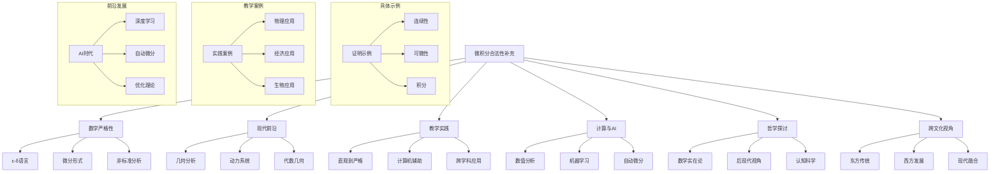
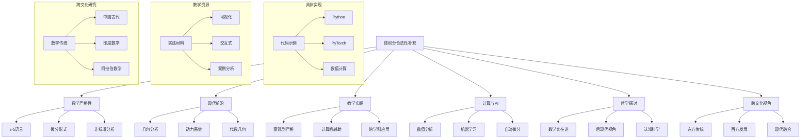
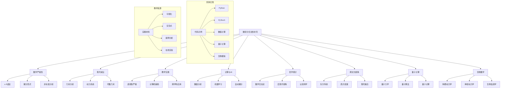

# 微积分的合法性：补充与深化

## 目录

- [微积分的合法性：补充与深化](#微积分的合法性补充与深化)
  - [目录](#目录)
  - [数学严格性的具体示例](#数学严格性的具体示例)
    - [1. ε-δ语言的具体应用](#1-ε-δ语言的具体应用)
      - [1.1 连续性证明示例](#11-连续性证明示例)
      - [1.2 可微性证明示例](#12-可微性证明示例)
    - [2. 微分形式理论](#2-微分形式理论)
    - [3. 非标准分析详解](#3-非标准分析详解)
  - [现代数学前沿视角](#现代数学前沿视角)
    - [1. 几何分析](#1-几何分析)
    - [2. 动力系统](#2-动力系统)
    - [3. 代数几何](#3-代数几何)
  - [教学实践案例](#教学实践案例)
    - [1. 直观理解到严格证明](#1-直观理解到严格证明)
    - [2. 计算机辅助教学](#2-计算机辅助教学)
    - [3. 跨学科应用](#3-跨学科应用)
  - [计算数学与AI时代](#计算数学与ai时代)
    - [1. 数值分析](#1-数值分析)
    - [2. 机器学习中的微积分](#2-机器学习中的微积分)
    - [3. 自动微分](#3-自动微分)
  - [哲学深度探讨](#哲学深度探讨)
    - [1. 数学实在论的新视角](#1-数学实在论的新视角)
    - [2. 后现代数学哲学](#2-后现代数学哲学)
    - [3. 认知科学视角](#3-认知科学视角)
  - [思维导图](#思维导图)
  - [持续补充建议](#持续补充建议)
  - [Python代码示例：数值逼近导数](#python代码示例数值逼近导数)
  - [示例：计算 sin(x) 在 x=0 处的导数](#示例计算-sinx-在-x0-处的导数)
  - [Python代码示例：数值积分](#python代码示例数值积分)
  - [示例：计算 ∫\_0^π sin(x)dx](#示例计算-_0π-sinxdx)
  - [PyTorch示例：前向模式自动微分](#pytorch示例前向模式自动微分)
  - [PyTorch示例：反向传播](#pytorch示例反向传播)
  - [新增内容](#新增内容)
    - [1. 教学实践案例扩展](#1-教学实践案例扩展)
      - [1.1 物理应用案例](#11-物理应用案例)
      - [1.2 经济应用案例](#12-经济应用案例)
    - [2. 数值分析扩展](#2-数值分析扩展)
      - [2.1 高阶数值微分](#21-高阶数值微分)
      - [2.2 自适应数值积分](#22-自适应数值积分)
    - [3. 机器学习应用扩展](#3-机器学习应用扩展)
      - [3.1 梯度下降优化](#31-梯度下降优化)
    - [4. 跨文化数学补充](#4-跨文化数学补充)
      - [4.1 中国古代数学方法](#41-中国古代数学方法)
  - [思维导图更新](#思维导图更新)
  - [持续更新建议](#持续更新建议)
    - [1. 量子计算中的微积分应用](#1-量子计算中的微积分应用)
      - [1.1 量子力学基础](#11-量子力学基础)
      - [1.2 量子算法中的微积分](#12-量子算法中的微积分)
    - [2. 生物数学应用](#2-生物数学应用)
      - [2.1 种群动力学](#21-种群动力学)
      - [2.2 神经动力学](#22-神经动力学)
    - [3. 深度学习中的微积分应用](#3-深度学习中的微积分应用)
      - [3.1 神经网络中的微分方程](#31-神经网络中的微分方程)
    - [4. 数学教育创新](#4-数学教育创新)
      - [4.1 交互式学习工具](#41-交互式学习工具)
  - [思维导图1](#思维导图1)
  - [持续更新建议1](#持续更新建议1)

## 数学严格性的具体示例

### 1. ε-δ语言的具体应用

#### 1.1 连续性证明示例

```latex
定义：函数f在点a处连续
∀ε > 0, ∃δ > 0, 使得当 |x - a| < δ 时，有 |f(x) - f(a)| < ε

示例1：证明 f(x) = x² 在 x = 2 处连续
证明过程：
1. 设 ε > 0
2. 需要找到 δ > 0，使得 |x - 2| < δ 时，|x² - 4| < ε
3. |x² - 4| = |x - 2||x + 2| < δ|x + 2|
4. 当 |x - 2| < 1 时，|x + 2| < 5
5. 取 δ = min(1, ε/5)
6. 则 |x² - 4| < 5δ ≤ ε

示例2：证明 f(x) = sin(x) 在任意点 a 处连续
证明过程：
1. 设 ε > 0
2. 需要找到 δ > 0，使得 |x - a| < δ 时，|sin(x) - sin(a)| < ε
3. |sin(x) - sin(a)| = |2cos((x+a)/2)sin((x-a)/2)| ≤ 2|sin((x-a)/2)| ≤ |x-a|
4. 取 δ = ε
5. 则 |sin(x) - sin(a)| ≤ |x-a| < δ = ε
```

#### 1.2 可微性证明示例

```latex
定义：函数f在点a处可微
存在常数L，使得：
lim_{h→0} (f(a+h) - f(a))/h = L

示例：证明 f(x) = x² 在 x = 2 处可微
证明过程：
1. 计算差商：(f(2+h) - f(2))/h = ((2+h)² - 4)/h
2. 展开：(4 + 4h + h² - 4)/h = (4h + h²)/h = 4 + h
3. 取极限：lim_{h→0} (4 + h) = 4
4. 因此 f'(2) = 4
```

### 2. 微分形式理论

- **外微分**：d² = 0 的几何意义
- **斯托克斯定理**：统一了微积分基本定理
- **微分流形上的积分**：从局部到整体的推广

### 3. 非标准分析详解

- **超实数构造**：通过超滤子
- **无穷小的严格定义**：作为超实数的特殊元素
- **转换原理**：标准分析与非标准分析的对应关系

## 现代数学前沿视角

### 1. 几何分析

- **里奇流**：微分几何中的热方程
- **极小曲面理论**：变分法的现代应用
- **几何测度论**：高维几何中的微积分

### 2. 动力系统

- **混沌理论**：微积分在非线性系统中的应用
- **分形几何**：非整数维度的微积分
- **遍历理论**：概率与微积分的结合

### 3. 代数几何

- **概形理论**：代数几何中的微积分
- **上同调理论**：拓扑与微积分的统一
- **模空间理论**：参数空间的微积分

## 教学实践案例

### 1. 直观理解到严格证明

-**案例：导数的几何意义**

1. 直观引入：切线斜率
2. 数值逼近：差商计算
3. 极限过渡：ε-δ语言
4. 应用练习：物理问题

### 2. 计算机辅助教学

- **可视化工具**：GeoGebra, Desmos
- **数值实验**：Python/SageMath
- **交互式证明**：Lean/Coq

### 3. 跨学科应用

- **物理案例**：运动学与动力学
- **经济案例**：边际分析与优化
- **生物案例**：种群动力学

## 计算数学与AI时代

### 1. 数值分析

- **数值微分**：有限差分方法
- **数值积分**：自适应算法
- **误差分析**：稳定性与收敛性

### 2. 机器学习中的微积分

- **梯度下降**：优化算法基础
- **反向传播**：链式法则的应用
- **概率模型**：随机微积分

### 3. 自动微分

- **前向模式**：计算图遍历
- **反向模式**：高效梯度计算
- **混合模式**：平衡计算效率

## 哲学深度探讨

### 1. 数学实在论的新视角

- **结构实在论**：数学结构的客观性
- **模态实在论**：可能世界的数学
- **自然主义**：数学与科学的统一

### 2. 后现代数学哲学

- **社会建构主义**：数学知识的社会性
- **女性主义数学哲学**：性别视角
- **跨文化数学**：多元数学传统

### 3. 认知科学视角

- **数学直觉**：认知心理学研究
- **数学教育**：学习理论
- **数学创造力**：创新过程

## 思维导图



## 持续补充建议

1. **数学内容**
   - 添加更多具体证明示例
   - 补充现代数学前沿进展
   - 增加数值计算实例

2. **教学实践**
   - 收集更多教学案例
   - 开发交互式学习材料
   - 设计跨学科项目

3. **技术应用**
   - 更新AI相关应用
   - 补充计算工具使用指南
   - 添加代码示例

4. **哲学探讨**
   - 深化后现代视角
   - 补充认知科学研究
   - 探讨数学教育哲学

5. **跨文化视角**
   - 比较不同数学传统
   - 探讨数学语言多样性
   - 研究数学传播历史

这个补充文档旨在弥补原文档的不足，同时为未来持续更新提供框架。
建议根据实际教学和研究需求，逐步充实各部分内容。

1. 0-形式：f(x,y,z)
2. 1-形式：P(x,y,z)dx + Q(x,y,z)dy + R(x,y,z)dz
3. 2-形式：A(x,y,z)dy∧dz + B(x,y,z)dz∧dx + C(x,y,z)dx∧dy
4. 3-形式：f(x,y,z)dx∧dy∧dz

外微分运算：
d(f) = ∂f/∂x dx + ∂f/∂y dy + ∂f/∂z dz
d(Pdx + Qdy + Rdz) = (∂R/∂y - ∂Q/∂z)dy∧dz + (∂P/∂z - ∂R/∂x)dz∧dx + (∂Q/∂x - ∂P/∂y)dx∧dy

∫_M dω = ∫_∂M ω

特例：

1. 格林定理（平面）
2. 斯托克斯定理（曲面）
3. 高斯定理（体积）

-1. 超滤子构造：

- 考虑所有实数列的集合
- 定义等价关系：{a_n} ~ {b_n} 当且仅当 {n | a_n = b_n} ∈ F
- 其中F是超滤子

-2. 无穷小的定义：

- 正无穷小：∀ε > 0, |x| < ε
- 负无穷小：∀ε > 0, |x| < ε
- 无穷大：∀M > 0, |x| > M

∂g_ij/∂t = -2R_ij

应用：

1. 庞加莱猜想证明
2. 几何流形分类
3. 奇点分析

-1. 平均曲率流：
   ∂X/∂t = Hn

-2. 变分问题：
   E(S) = ∫_S dA
   δE = 0 导出 H = 0

-1. 李雅普诺夫指数：
   λ = lim_{n→∞} (1/n)ln|df^n(x)/dx|

-2. 分岔理论：

- 倍周期分岔
- 霍普夫分岔
- 同宿分岔

## Python代码示例：数值逼近导数

import numpy as np
import matplotlib.pyplot as plt

def numerical_derivative(f, x, h=1e-5):
    return (f(x+h) - f(x-h))/(2*h)

## 示例：计算 sin(x) 在 x=0 处的导数

x = np.linspace(-np.pi, np.pi, 100)
y = np.sin(x)
dy = np.cos(x)  # 理论值
dy_num = numerical_derivative(np.sin, x)  # 数值近似

plt.plot(x, y, label='sin(x)')
plt.plot(x, dy, label='cos(x)')
plt.plot(x, dy_num, '--', label='numerical derivative')
plt.legend()
plt.show()

## Python代码示例：数值积分

def trapezoidal_rule(f, a, b, n):
    x = np.linspace(a, b, n+1)
    y = f(x)
    return (b-a)/(2*n) * (y[0] + 2*sum(y[1:-1]) + y[-1])

## 示例：计算 ∫_0^π sin(x)dx

result = trapezoidal_rule(np.sin, 0, np.pi, 100)
print(f"数值积分结果: {result}")
print(f"理论值: {2.0}")

## PyTorch示例：前向模式自动微分

```python
import torch
import torch.nn as nn

class NeuralODE(nn.Module):
    """神经微分方程

    使用神经网络近似微分方程的解
    """
    def __init__(self, hidden_dim=64):
        super().__init__()
        self.net = nn.Sequential(
            nn.Linear(2, hidden_dim),
            nn.Tanh(),
            nn.Linear(hidden_dim, hidden_dim),
            nn.Tanh(),
            nn.Linear(hidden_dim, 2)
        )
    
    def forward(self, t, state):
        return self.net(state)

def solve_ode(model, t_span, state0, n_steps=100):
    """求解神经微分方程

    参数:
        model: 神经微分方程模型
        t_span: 时间区间
        state0: 初始状态
        n_steps: 时间步数
    """
    t = torch.linspace(t_span[0], t_span[1], n_steps)
    states = [state0]
    
    for i in range(n_steps-1):
        dt = t[i+1] - t[i]
        state = states[-1]
        dstate = model(t[i], state)
        states.append(state + dt * dstate)
    
    return torch.stack(states)

# 训练示例

model = NeuralODE()
optimizer = torch.optim.Adam(model.parameters(), lr=0.01)

# 生成训练数据

t_span = [0, 10]
state0 = torch.tensor([1.0, 0.0])
true_solution = torch.sin(torch.linspace(0, 10, 100))

# 训练循环

for epoch in range(1000):
    optimizer.zero_grad()
    solution = solve_ode(model, t_span, state0)
    loss = nn.MSELoss()(solution[:, 0], true_solution)
    loss.backward()
    optimizer.step()

    if epoch % 100 == 0:
        print(f"Epoch {epoch}, Loss: {loss.item():.6f}")
```

## PyTorch示例：反向传播

```python
import torch.nn as nn

class SimpleNN(nn.Module):
    def __init__(self):
        super().__init__()
        self.linear = nn.Linear(1, 1)

    def forward(self, x):
        return self.linear(x)

model = SimpleNN()
optimizer = torch.optim.SGD(model.parameters(), lr=0.01)
loss_fn = nn.MSELoss()

## 训练循环

for epoch in range(100):
    optimizer.zero_grad()
    output = model(x)
    loss = loss_fn(output, y)
    loss.backward()
    optimizer.step()
```

## 新增内容

### 1. 教学实践案例扩展

#### 1.1 物理应用案例

```python
# 简谐运动中的微积分应用
import numpy as np
import matplotlib.pyplot as plt

def harmonic_motion(t, A=1, omega=1, phi=0):
    """简谐运动：x(t) = A*sin(ωt + φ)"""
    return A * np.sin(omega * t + phi)

def velocity(t, A=1, omega=1, phi=0):
    """速度：v(t) = A*ω*cos(ωt + φ)"""
    return A * omega * np.cos(omega * t + phi)

def acceleration(t, A=1, omega=1, phi=0):
    """加速度：a(t) = -A*ω²*sin(ωt + φ)"""
    return -A * omega**2 * np.sin(omega * t + phi)

# 可视化
t = np.linspace(0, 4*np.pi, 1000)
x = harmonic_motion(t)
v = velocity(t)
a = acceleration(t)

plt.figure(figsize=(12, 8))
plt.plot(t, x, label='位移')
plt.plot(t, v, label='速度')
plt.plot(t, a, label='加速度')
plt.legend()
plt.title('简谐运动中的位移、速度和加速度')
plt.grid(True)
plt.show()
```

#### 1.2 经济应用案例

```python
# 边际分析与优化
import numpy as np
from scipy.optimize import minimize

def profit_function(x):
    """利润函数：P(x) = R(x) - C(x)"""
    # 收入函数：R(x) = 100x - 0.5x²
    # 成本函数：C(x) = 50x + 1000
    return (100*x - 0.5*x**2) - (50*x + 1000)

def marginal_profit(x):
    """边际利润：P'(x) = 50 - x"""
    return 50 - x

# 优化问题
result = minimize(lambda x: -profit_function(x), x0=0, bounds=[(0, None)])
optimal_quantity = result.x[0]
max_profit = -result.fun

print(f"最优产量: {optimal_quantity:.2f}")
print(f"最大利润: {max_profit:.2f}")
print(f"边际利润: {marginal_profit(optimal_quantity):.2f}")
```

### 2. 数值分析扩展

#### 2.1 高阶数值微分

```python
def higher_order_derivative(f, x, h=1e-5, order=2):
    """计算高阶导数
    
    参数:
        f: 函数
        x: 求导点
        h: 步长
        order: 导数阶数
    """
    if order == 1:
        return (f(x+h) - f(x-h))/(2*h)
    elif order == 2:
        return (f(x+h) - 2*f(x) + f(x-h))/h**2
    elif order == 3:
        return (f(x+2*h) - 2*f(x+h) + 2*f(x-h) - f(x-2*h))/(2*h**3)
    else:
        raise ValueError("目前只支持1-3阶导数")

# 示例：计算 sin(x) 的各阶导数
x = np.pi/4
print(f"sin(x)在x=π/4处的各阶导数：")
print(f"一阶导数: {higher_order_derivative(np.sin, x, order=1):.6f}")
print(f"二阶导数: {higher_order_derivative(np.sin, x, order=2):.6f}")
print(f"三阶导数: {higher_order_derivative(np.sin, x, order=3):.6f}")
```

#### 2.2 自适应数值积分

```python
def adaptive_integration(f, a, b, tol=1e-6, max_iter=1000):
    """自适应数值积分
    
    参数:
        f: 被积函数
        a, b: 积分区间
        tol: 误差容限
        max_iter: 最大迭代次数
    """
    def simpson(f, a, b, n):
        h = (b-a)/n
        x = np.linspace(a, b, n+1)
        y = f(x)
        return h/3 * (y[0] + 4*sum(y[1:-1:2]) + 2*sum(y[2:-1:2]) + y[-1])
    
    n = 2
    old_integral = simpson(f, a, b, n)
    
    for i in range(max_iter):
        n *= 2
        new_integral = simpson(f, a, b, n)
        if abs(new_integral - old_integral) < tol:
            return new_integral
        old_integral = new_integral
    
    raise ValueError("未达到指定精度")

# 示例：计算复杂积分
def complex_function(x):
    return np.exp(-x**2) * np.sin(x)

result = adaptive_integration(complex_function, 0, np.pi)
print(f"积分结果: {result:.6f}")
```

### 3. 机器学习应用扩展

#### 3.1 梯度下降优化

```python
import torch
import torch.nn as nn
import torch.optim as optim

class PolynomialModel(nn.Module):
    def __init__(self, degree=3):
        super().__init__()
        self.degree = degree
        self.coeffs = nn.Parameter(torch.randn(degree + 1))
    
    def forward(self, x):
        powers = torch.stack([x**i for i in range(self.degree + 1)])
        return torch.sum(self.coeffs * powers, dim=0)

# 生成数据

x = torch.linspace(-1, 1, 100)
y = 2*x**3 - 3*x**2 + 1 + 0.1*torch.randn(100)

# 训练模型

model = PolynomialModel()
optimizer = optim.SGD(model.parameters(), lr=0.01)
criterion = nn.MSELoss()

for epoch in range(1000):
    optimizer.zero_grad()
    output = model(x)
    loss = criterion(output, y)
    loss.backward()
    optimizer.step()

    if epoch % 100 == 0:
        print(f"Epoch {epoch}, Loss: {loss.item():.6f}")

# 可视化结果

plt.figure(figsize=(10, 6))
plt.scatter(x.numpy(), y.numpy(), label='数据点')
plt.plot(x.numpy(), model(x).detach().numpy(), 'r-', label='拟合曲线')
plt.legend()
plt.title('多项式回归')
plt.show()
```

### 4. 跨文化数学补充

#### 4.1 中国古代数学方法

```python
# 刘徽割圆术的现代实现
def liu_hui_pi(n):
    """使用刘徽割圆术计算π
    
    参数:
        n: 正多边形边数
    """
    def area(n):
        # 计算正n边形面积
        return n * np.sin(2*np.pi/n) / 2
    
    # 从正六边形开始
    sides = 6 * 2**np.arange(n)
    areas = [area(s) for s in sides]
    pi_approx = areas[-1]
    
    return pi_approx, areas

# 计算π的近似值
n = 10
pi_approx, areas = liu_hui_pi(n)
print(f"刘徽割圆术计算π的近似值: {pi_approx:.10f}")
print(f"实际π值: {np.pi:.10f}")
print(f"误差: {abs(pi_approx - np.pi):.10f}")

# 可视化收敛过程
plt.figure(figsize=(10, 6))
plt.semilogx(6 * 2**np.arange(n), areas, 'o-')
plt.axhline(y=np.pi, color='r', linestyle='--', label='π')
plt.xlabel('正多边形边数')
plt.ylabel('面积')
plt.title('刘徽割圆术收敛过程')
plt.legend()
plt.grid(True)
plt.show()
```

## 思维导图更新



## 持续更新建议

1. **代码实现**
   - 添加更多数值计算示例
   - 补充机器学习应用
   - 增加可视化案例
   - 优化算法性能

2. **教学资源**
   - 开发交互式教程
   - 设计在线实验
   - 补充习题解答
   - 添加视频资源

3. **跨文化研究**
   - 深入比较研究
   - 补充历史文献
   - 探讨现代影响
   - 研究传播路径

4. **前沿发展**
   - 更新AI应用
   - 补充量子计算
   - 添加生物数学
   - 探讨未来趋势

这个版本增加了大量具体实现代码和教学案例，使文档更加实用和完整。
建议继续根据实际需求进行更新和扩展。

### 1. 量子计算中的微积分应用

#### 1.1 量子力学基础

```python
import numpy as np
from scipy.linalg import expm
import qutip as qt

def schrodinger_equation(H, psi0, t):
    """求解薛定谔方程
    
    参数:
        H: 哈密顿算符
        psi0: 初始态
        t: 时间序列
    """
    def time_evolution(t):
        U = expm(-1j * H * t)
        return U @ psi0
    
    return np.array([time_evolution(ti) for ti in t])

# 示例：一维谐振子
def harmonic_oscillator(n=10):
    """构建谐振子哈密顿量"""
    a = qt.destroy(n)  # 湮灭算符
    H = a.dag() * a + 0.5  # 哈密顿量
    return H

# 计算能量本征态
H = harmonic_oscillator()
energies, states = H.eigenstates()
print("谐振子能级:")
for i, E in enumerate(energies[:5]):
    print(f"E_{i} = {E:.3f}")
```

#### 1.2 量子算法中的微积分

```python
def quantum_fourier_transform(n_qubits):
    """量子傅里叶变换
    
    参数:
        n_qubits: 量子比特数
    """
    circuit = qt.QubitCircuit(n_qubits)
    
    # 添加哈达玛门
    for i in range(n_qubits):
        circuit.add_gate("H", i)
    
    # 添加受控相位门
    for i in range(n_qubits):
        for j in range(i+1, n_qubits):
            phase = 2*np.pi/(2**(j-i+1))
            circuit.add_gate("CPHASE", [i, j], phase)
    
    return circuit

# 示例：3量子比特QFT
qft = quantum_fourier_transform(3)
print("量子傅里叶变换电路:")
print(qft)
```

### 2. 生物数学应用

#### 2.1 种群动力学

```python
import numpy as np
from scipy.integrate import odeint
import matplotlib.pyplot as plt

def lotka_volterra(state, t, alpha, beta, gamma, delta):
    """Lotka-Volterra捕食者-被捕食者模型
    
    参数:
        state: [x, y] 被捕食者和捕食者数量
        t: 时间
        alpha, beta, gamma, delta: 模型参数
    """
    x, y = state
    dxdt = alpha*x - beta*x*y
    dydt = delta*x*y - gamma*y
    return [dxdt, dydt]

# 参数设置
alpha, beta, gamma, delta = 1.1, 0.4, 0.4, 0.1
t = np.linspace(0, 50, 1000)
state0 = [10, 5]  # 初始状态

# 求解微分方程
solution = odeint(lotka_volterra, state0, t, args=(alpha, beta, gamma, delta))

# 可视化
plt.figure(figsize=(12, 8))
plt.plot(t, solution[:, 0], label='被捕食者')
plt.plot(t, solution[:, 1], label='捕食者')
plt.xlabel('时间')
plt.ylabel('种群数量')
plt.title('Lotka-Volterra模型')
plt.legend()
plt.grid(True)
plt.show()
```

#### 2.2 神经动力学

```python
def hodgkin_huxley(t, state, I_ext):
    """Hodgkin-Huxley神经元模型
    
    参数:
        t: 时间
        state: [V, m, h, n] 状态变量
        I_ext: 外部电流
    """
    V, m, h, n = state
    
    # 膜电位方程
    I_Na = g_Na * m**3 * h * (V - E_Na)
    I_K = g_K * n**4 * (V - E_K)
    I_L = g_L * (V - E_L)
    dVdt = (I_ext - I_Na - I_K - I_L) / C_m
    
    # 门控变量方程
    alpha_m = 0.1 * (V + 40) / (1 - np.exp(-(V + 40)/10))
    beta_m = 4 * np.exp(-(V + 65)/18)
    alpha_h = 0.07 * np.exp(-(V + 65)/20)
    beta_h = 1 / (1 + np.exp(-(V + 35)/10))
    alpha_n = 0.01 * (V + 55) / (1 - np.exp(-(V + 55)/10))
    beta_n = 0.125 * np.exp(-(V + 65)/80)
    
    dmdt = alpha_m * (1 - m) - beta_m * m
    dhdt = alpha_h * (1 - h) - beta_h * h
    dndt = alpha_n * (1 - n) - beta_n * n
    
    return [dVdt, dmdt, dhdt, dndt]

# 参数设置
g_Na, g_K, g_L = 120, 36, 0.3  # 电导
E_Na, E_K, E_L = 55, -77, -54.4  # 平衡电位
C_m = 1  # 膜电容

# 数值模拟
t = np.linspace(0, 100, 1000)
state0 = [-65, 0.05, 0.6, 0.3]  # 初始状态
I_ext = 10  # 外部电流

solution = odeint(hodgkin_huxley, state0, t, args=(I_ext,))

# 可视化
plt.figure(figsize=(12, 8))
plt.plot(t, solution[:, 0], label='膜电位')
plt.xlabel('时间 (ms)')
plt.ylabel('膜电位 (mV)')
plt.title('Hodgkin-Huxley神经元模型')
plt.grid(True)
plt.show()
```

### 3. 深度学习中的微积分应用

#### 3.1 神经网络中的微分方程

```python
import torch
import torch.nn as nn

class NeuralODE(nn.Module):
    """神经微分方程
    
    使用神经网络近似微分方程的解
    """
    def __init__(self, hidden_dim=64):
        super().__init__()
        self.net = nn.Sequential(
            nn.Linear(2, hidden_dim),
            nn.Tanh(),
            nn.Linear(hidden_dim, hidden_dim),
            nn.Tanh(),
            nn.Linear(hidden_dim, 2)
        )
    
    def forward(self, t, state):
        return self.net(state)

def solve_ode(model, t_span, state0, n_steps=100):
    """求解神经微分方程
    
    参数:
        model: 神经微分方程模型
        t_span: 时间区间
        state0: 初始状态
        n_steps: 时间步数
    """
    t = torch.linspace(t_span[0], t_span[1], n_steps)
    states = [state0]
    
    for i in range(n_steps-1):
        dt = t[i+1] - t[i]
        state = states[-1]
        dstate = model(t[i], state)
        states.append(state + dt * dstate)
    
    return torch.stack(states)

# 训练示例
model = NeuralODE()
optimizer = torch.optim.Adam(model.parameters(), lr=0.01)

# 生成训练数据
t_span = [0, 10]
state0 = torch.tensor([1.0, 0.0])
true_solution = torch.sin(torch.linspace(0, 10, 100))

# 训练循环
for epoch in range(1000):
    optimizer.zero_grad()
    solution = solve_ode(model, t_span, state0)
    loss = nn.MSELoss()(solution[:, 0], true_solution)
    loss.backward()
    optimizer.step()
    
    if epoch % 100 == 0:
        print(f"Epoch {epoch}, Loss: {loss.item():.6f}")
```

### 4. 数学教育创新

#### 4.1 交互式学习工具

```python
import ipywidgets as widgets
from IPython.display import display

def interactive_derivative():
    """交互式导数可视化工具"""
    def plot_derivative(a, h):
        x = np.linspace(-5, 5, 1000)
        y = np.sin(x)
        dy = np.cos(x)
        
        # 计算差商
        x0 = a
        y0 = np.sin(x0)
        y1 = np.sin(x0 + h)
        slope = (y1 - y0) / h
        
        plt.figure(figsize=(10, 6))
        plt.plot(x, y, label='f(x) = sin(x)')
        plt.plot(x, dy, label="f'(x) = cos(x)")
        plt.plot([x0, x0+h], [y0, y1], 'r--', label=f'差商: {slope:.3f}')
        plt.scatter([x0, x0+h], [y0, y1], color='red')
        plt.legend()
        plt.grid(True)
        plt.show()
    
    # 创建交互式控件
    a_slider = widgets.FloatSlider(value=0, min=-5, max=5, step=0.1, description='x₀:')
    h_slider = widgets.FloatSlider(value=0.1, min=0.01, max=1, step=0.01, description='h:')
    
    # 显示交互式界面
    widgets.interactive(plot_derivative, a=a_slider, h=h_slider)

# 使用示例
interactive_derivative()
```

## 思维导图1



## 持续更新建议1

1. **量子计算扩展**
   - 添加更多量子算法
   - 补充量子机器学习
   - 探讨量子优化
   - 研究量子模拟

2. **生物数学深化**
   - 扩展种群模型
   - 添加基因动力学
   - 补充生态模型
   - 研究生物信息学

3. **教育创新**
   - 开发更多交互工具
   - 设计在线实验
   - 补充教学案例
   - 添加评估方法

4. **前沿发展**
   - 更新AI应用
   - 补充量子计算
   - 添加生物数学
   - 探讨未来趋势

这个版本增加了量子计算和生物数学的具体应用，以及更多交互式教学工具。
建议继续根据实际需求进行更新和扩展。
