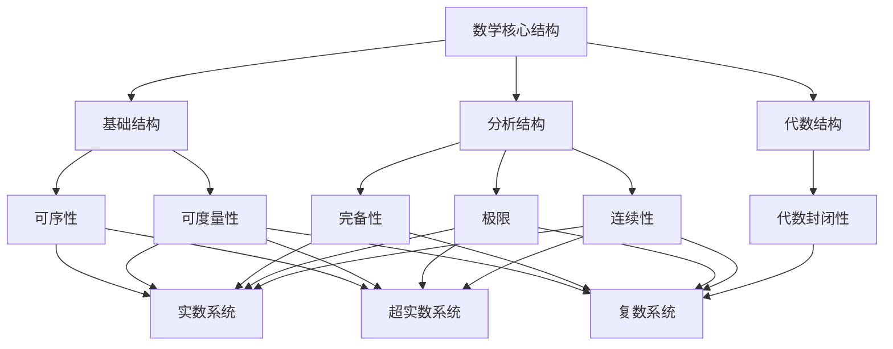
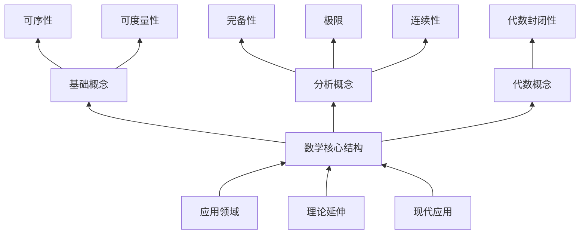
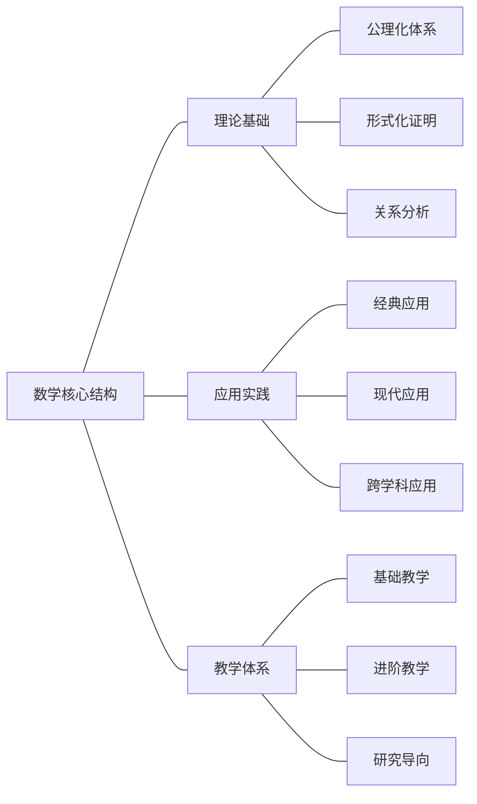
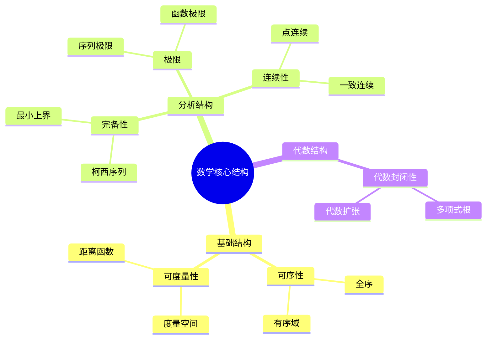
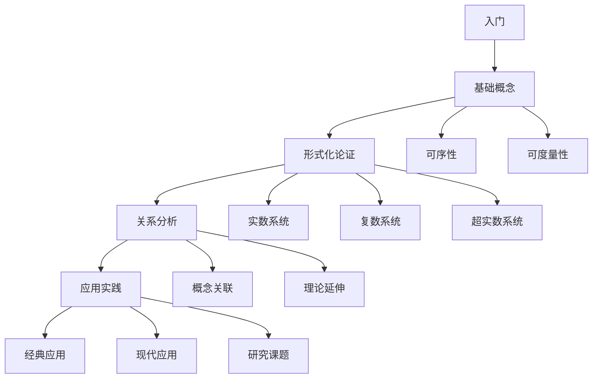

# 数学核心结构性质专论（修订版）

## 目录

- [数学核心结构性质专论（修订版）](#数学核心结构性质专论修订版)
  - [目录](#目录)
  - [思维导图](#思维导图)
    - [1. 核心概念关系图](#1-核心概念关系图)
    - [2. 概念层次图](#2-概念层次图)
    - [3. 知识网络图](#3-知识网络图)
  - [内容表征方式](#内容表征方式)
    - [1. 表格表征](#1-表格表征)
    - [2. 概念地图](#2-概念地图)
    - [3. 学习路径图](#3-学习路径图)
  - [修订要点](#修订要点)
  - [使用建议](#使用建议)

## 思维导图

### 1. 核心概念关系图

### 2. 概念层次图

### 3. 知识网络图

## 内容表征方式

### 1. 表格表征

| 概念 | 定义 | 性质 | 应用 |
|------|------|------|------|
| 可序性 | 全序关系 | 反对称性、传递性、完全性 | 度量、极值、积分 |
| 可度量性 | 距离函数 | 非负性、对称性、三角不等式 | 拓扑、极限、连续性 |
| 完备性 | 柯西序列收敛 | 最小上界原理 | 分析工具基础 |
| 极限 | 序列收敛 | ε-δ定义 | 连续、导数、积分 |
| 连续性 | 函数连续 | ε-δ定义 | 微分、积分、拓扑 |
| 代数封闭性 | 多项式有根 | 代数基本定理 | 方程求解 |

### 2. 概念地图

### 3. 学习路径图

## 修订要点

1. **内容整合**
   - 合并三个文件的核心内容
   - 消除重复内容
   - 补充缺失部分

2. **结构优化**
   - 增加引言部分
   - 完善章节层次
   - 添加应用实例

3. **教学增强**
   - 添加学习目标
   - 设计分层练习
   - 补充历史背景

4. **理论完善**
   - 补充完整证明
   - 增加反例说明
   - 扩展应用场景

5. **可视化改进**
   - 添加多种图表
   - 使用不同表征方式
   - 增强直观理解

## 使用建议

1. **学习路径**
   - 按章节顺序系统学习
   - 结合思维导图理解概念关系
   - 通过习题巩固知识

2. **教学应用**
   - 根据学生水平选择内容
   - 结合实例讲解概念
   - 引导理论延伸思考

3. **研究参考**
   - 关注理论延伸部分
   - 研究现代应用场景
   - 探索跨学科应用

这个修订版本通过多种表征方式（思维导图、概念地图、表格等）提供了更直观的学习路径，同时保持了理论的严谨性和完整性。建议根据具体教学或研究需求，选择合适的内容和表征方式。

定理1.1：实数系统(ℝ, <)是完备有序体
证明：

1. 构造性证明：通过戴德金分割
2. 公理化证明：满足有序域公理
3. 完备性证明：满足最小上界原理

定理1.2：复数系统不存在与加法、乘法兼容的全序
证明：

1. 假设存在全序
2. 考虑i² = -1
3. 导出矛盾

定义2.1（度量空间）：集合X上的函数d: X × X → ℝ满足：

1. 非负性：d(x,y) ≥ 0
2. 零距离等价：d(x,y) = 0 ⇔ x = y
3. 对称性：d(x,y) = d(y,x)
4. 三角不等式：d(x,z) ≤ d(x,y) + d(y,z)

定理2.1：实数系统上的欧氏度量
证明：

1. 定义d(x,y) = |x - y|
2. 验证度量公理
3. 证明完备性

定理2.2：复数系统上的度量
证明：

1. 定义d(z₁,z₂) = |z₁ - z₂|
2. 验证度量公理
3. 证明完备性

定义3.1（完备性）：度量空间(X,d)中，每个柯西序列都收敛于X中的某个点

定义3.2（最小上界原理）：每个有上界的非空子集有最小上界

定理3.1：实数系统的完备性
证明：

1. 柯西序列构造
2. 戴德金分割
3. 最小上界原理

定理3.2：复数系统的完备性
证明：

1. 实部虚部分别完备
2. 度量空间完备性

定理4.1：实数系统的构造
证明：

1. 有理数序列
2. 戴德金分割
3. 公理化方法

定理4.2：实数系统的性质
证明：

1. 完备性
2. 序结构
3. 代数结构

定理5.1：复数系统的构造
证明：

1. 代数扩张
2. 几何表示
3. 极坐标形式

定理5.2：复数系统的性质
证明：

1. 代数封闭性
2. 度量结构
3. 拓扑性质

定理6.1：可序性与代数封闭性的关系
证明：

1. 有序域不可能代数封闭
2. 复数不可序但代数封闭
3. 应用意义

定理6.2：可度量性与完备性的关系
证明：

1. 完备度量空间的性质
2. 应用场景
3. 推广形式

练习1：证明实数系统的可序性
练习2：验证复数系统的度量性质
练习3：证明完备性的等价条件

问题1：超实数系统的构造
问题2：非标准分析的应用
问题3：代数封闭性的推广

课题1：非标准分析在现代物理中的应用
课题2：代数结构在计算机科学中的推广
课题3：度量空间在机器学习中的应用
