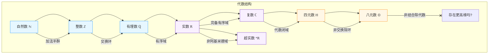
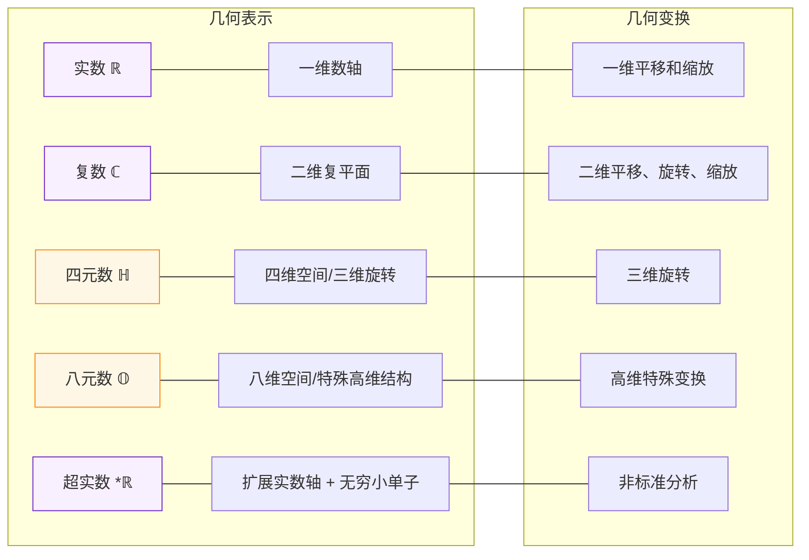
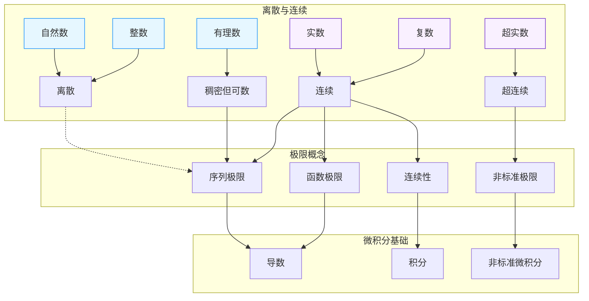
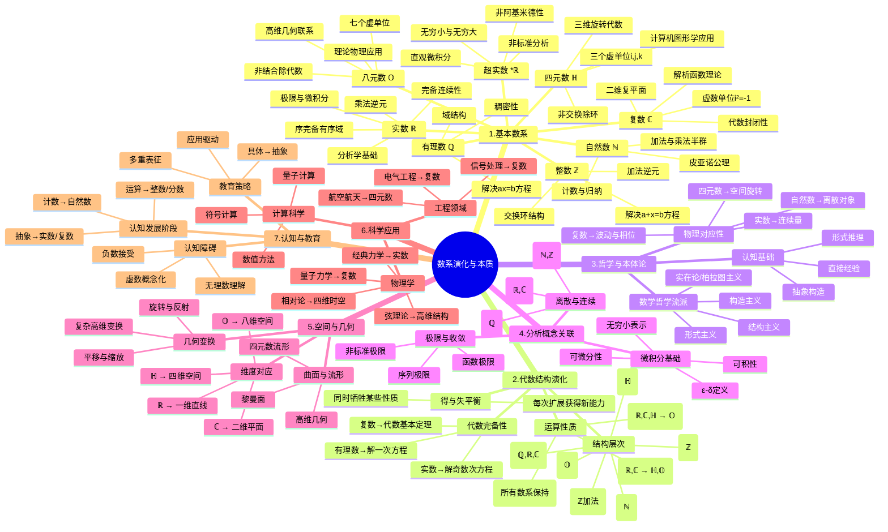

# 数系演化与本质：从自然数到高维代数结构的综合分析

## 目录

- [数系演化与本质：从自然数到高维代数结构的综合分析](#数系演化与本质从自然数到高维代数结构的综合分析)
  - [目录](#目录)
  - [引言](#引言)
  - [1. 数系的演化与拓展：数学思想的进阶之路](#1-数系的演化与拓展数学思想的进阶之路)
    - [1.1. 自然数 (Natural Numbers, $\\mathbb{N}$)：计数的起点](#11-自然数-natural-numbers-mathbbn计数的起点)
    - [1.2. 整数 (Integers, $\\mathbb{Z}$)：负数的引入](#12-整数-integers-mathbbz负数的引入)
    - [1.3. 有理数 (Rational Numbers, $\\mathbb{Q}$)：分割的概念](#13-有理数-rational-numbers-mathbbq分割的概念)
    - [1.4. 实数 (Real Numbers, $\\mathbb{R}$)：连续性的完成](#14-实数-real-numbers-mathbbr连续性的完成)
    - [1.5. 虚数与复数 (Complex Numbers, $\\mathbb{C}$)：平面的扩展](#15-虚数与复数-complex-numbers-mathbbc平面的扩展)
    - [1.6. 四元数 (Quaternions, $\\mathbb{H}$)：三维旋转的代数](#16-四元数-quaternions-mathbbh三维旋转的代数)
    - [1.7. 八元数 (Octonions, $\\mathbb{O}$)：超越交换与结合律](#17-八元数-octonions-mathbbo超越交换与结合律)
    - [1.8. 超实数 ($^\*\\mathbb{R}$)：无穷小的严格化](#18-超实数-mathbbr无穷小的严格化)
  - [2. 代数结构的系统性演进：从单纯到复杂](#2-代数结构的系统性演进从单纯到复杂)
    - [2.1. 代数结构层次分析](#21-代数结构层次分析)
    - [2.2. 数系演化与代数结构的得失](#22-数系演化与代数结构的得失)
    - [2.3. 结构保持扩张与结构牺牲扩张](#23-结构保持扩张与结构牺牲扩张)
  - [3. 本体论视角：数系的"存在"方式与哲学反思](#3-本体论视角数系的存在方式与哲学反思)
    - [3.1. 从直觉到抽象：数系的认知基础](#31-从直觉到抽象数系的认知基础)
    - [3.2. 物理对应性：从现实映射到形式构造](#32-物理对应性从现实映射到形式构造)
    - [3.3. 数学哲学视角：实在论、形式主义与构造主义的对话](#33-数学哲学视角实在论形式主义与构造主义的对话)
  - [4. 分析概念与数系的内在联系：连续、离散与无穷](#4-分析概念与数系的内在联系连续离散与无穷)
    - [4.1. 离散与连续：数学思维的两极](#41-离散与连续数学思维的两极)
    - [4.2. 极限概念在不同数系中的体现](#42-极限概念在不同数系中的体现)
    - [4.3. 导数、可微分性与可积分性的数系基础](#43-导数可微分性与可积分性的数系基础)
    - [4.4. 收敛性与完备性：分析之魂](#44-收敛性与完备性分析之魂)
  - [5. 空间几何解释：从数到形的映射](#5-空间几何解释从数到形的映射)
    - [5.1. 数系与维度的对应关系](#51-数系与维度的对应关系)
    - [5.2. 几何变换与数系代数的同构](#52-几何变换与数系代数的同构)
    - [5.3. 曲面、流形与高维代数结构](#53-曲面流形与高维代数结构)
  - [6. 科学应用中的数系选择：理论与实践的桥梁](#6-科学应用中的数系选择理论与实践的桥梁)
    - [6.1. 物理学中的数系应用谱系](#61-物理学中的数系应用谱系)
    - [6.2. 工程领域的数系应用策略](#62-工程领域的数系应用策略)
    - [6.3. 计算科学与数值方法的数系基础](#63-计算科学与数值方法的数系基础)
    - [6.4. 量子计算与高维代数结构](#64-量子计算与高维代数结构)
  - [7. 认知与教育视角：思维跃迁的阶梯](#7-认知与教育视角思维跃迁的阶梯)
    - [7.1. 数系认知发展的阶段性](#71-数系认知发展的阶段性)
    - [7.2. 数系教育中的认知障碍与突破](#72-数系教育中的认知障碍与突破)
    - [7.3. 从具体到抽象：数学思维的提升路径](#73-从具体到抽象数学思维的提升路径)
  - [8. 多种表征方式](#8-多种表征方式)
    - [8.1. 数系演化关系图](#81-数系演化关系图)
    - [8.2. 代数结构比较表](#82-代数结构比较表)
    - [8.3. 数系与空间几何对应图](#83-数系与空间几何对应图)
    - [8.4. 数系与数学概念关联图](#84-数系与数学概念关联图)
    - [8.5. 综合思维导图](#85-综合思维导图)
  - [9. 结论与展望：数系理论的未来方向](#9-结论与展望数系理论的未来方向)
    - [9.1. 当代研究前沿：数系理论的新疆域](#91-当代研究前沿数系理论的新疆域)
    - [9.2. 跨学科融合：数系理论的扩展应用](#92-跨学科融合数系理论的扩展应用)
    - [9.3. 哲学与认知科学的深层思考](#93-哲学与认知科学的深层思考)
  - [结语：数系演化的本质反思](#结语数系演化的本质反思)

## 引言

数系的演化是人类抽象思维发展的杰出典范，体现了数学从解决具体问题到追求内在结构美和逻辑一致性的进阶历程。
从最初的计数需求催生自然数，到解方程需要而引入负数、分数、无理数，再到满足代数封闭性而创造复数，以及为处理三维空间旋转而发明四元数，乃至更高维度的八元数——每一次数系的扩展都代表着人类思维向更抽象、更普遍境界的跃迁。

本文旨在从多维度系统分析数系演化的内在逻辑、代数结构特性、本体论意义以及与各种数学核心概念的关联性。
我们将探讨不同数系如何为离散与连续、极限与微积分等基础概念提供了理论基础，它们与空间几何的对应关系，以及在科学法则描述中的应用价值。
通过这一综合分析，我们不仅能更深入理解数系本身的数学特性，更能洞察数学思维发展的普遍规律和哲学内涵。

## 1. 数系的演化与拓展：数学思想的进阶之路

### 1.1. 自然数 (Natural Numbers, $\mathbb{N}$)：计数的起点

**定义与起源**：自然数是最基本的数系，源于人类的计数需求。它可以定义为集合 $\mathbb{N} = \{1, 2, 3, ...\}$（有时包含0），是所有数系的基础。

**构造方法**：

- **皮亚诺公理化**：通过五条公理严格定义，包括"每个自然数有唯一的后继"、"1不是任何自然数的后继"、"不同的自然数有不同的后继"等。
- **集合论构造**：在现代集合论（ZFC公理系统）中，可以将0定义为空集$\emptyset$，1定义为$\{\emptyset\}$，2定义为$\{\emptyset, \{\emptyset\}\}$，依此类推。

**代数结构**：

- 对加法构成**半群**（有结合律但不一定有逆元）
- 对乘法也构成**半群**
- 不构成群（因为没有加法逆元）

**本质特征**：

- **离散性**：相邻自然数之间有"间隔"，不连续
- **良序性**：任何非空子集都有最小元素
- **递归定义的基础**：归纳法的根基

**历史意义**：自然数的形式化（如皮亚诺公理）标志着数学从直观计数转向抽象公理化的重要一步。

### 1.2. 整数 (Integers, $\mathbb{Z}$)：负数的引入

**定义与起源**：整数是自然数的扩展，包含正数、负数和零。源于解决$x + a = b$（当$a > b$时）这类方程的需要，以及表示负债、损失等现实概念。

**构造方法**：

- **等价类构造**：将整数定义为有序对$(a,b)$（表示$a-b$）的等价类，其中$(a,b) \sim (c,d)$当且仅当$a+d = b+c$。

**代数结构**：

- 对加法构成**阿贝尔群**（交换群）
- 对乘法构成**含单位元的交换半群**
- 整体构成**交换环**（但不是域，因为除非单位元外，其他元素没有乘法逆元）

**本质特征**：

- **对称性**：关于零点对称，引入了"相反数"概念
- **保持了离散性**
- **完全解决了加法方程**

**历史意义**：负数的接受过程漫长而曲折，曾被称为"荒谬数"，其合法化反映了数学从实用工具向抽象系统的转变。

### 1.3. 有理数 (Rational Numbers, $\mathbb{Q}$)：分割的概念

**定义与起源**：有理数是整数的商，表示为$\frac{p}{q}$（其中$p,q$是整数，$q \neq 0$）。源于测量需求和解决$ax = b$（$a,b$为整数，$a \neq 0$）类方程的需要。

**构造方法**：

- **等价类构造**：将有理数定义为有序整数对$(p,q)$（表示$\frac{p}{q}$）的等价类，其中$(p,q) \sim (r,s)$当且仅当$ps = qr$。

**代数结构**：

- 对加法和乘法都构成**阿贝尔群**（乘法群不包括0）
- 整体构成**域**（最小的无限域）

**本质特征**：

- **稠密性**：在任意两个不同的有理数之间都存在无穷多个有理数
- **可数性**：尽管稠密，但仍是可数集
- **完全解决了线性方程**：任何一次方程$ax + b = 0$（$a \neq 0$）在有理数中都有解

**历史意义**：有理数的形式化发展了"分数"概念，是从离散到连续思维的重要过渡。毕达哥拉斯学派发现无理数（如$\sqrt{2}$）的存在，引发了第一次数学危机，促使了更深层次的数学思考。

### 1.4. 实数 (Real Numbers, $\mathbb{R}$)：连续性的完成

**定义与起源**：实数包含所有有理数和无理数，填补了数轴上的"空隙"。源于几何测量（如对角线长度）和极限过程的需要。

**构造方法**：

- **戴德金分割**：将有理数集$\mathbb{Q}$划分为两个非空子集$A$和$B$，使得$A$中的每个元素都小于$B$中的每个元素，且$A$没有最大元素（或$B$没有最小元素）。
- **柯西序列**：将实数定义为有理数柯西序列（其项之间的差随着序列进行而任意小）的等价类。

**代数结构**：

- 构成**完备有序域**（具有最小上界性质的有序域）

**本质特征**：

- **连续性**：实数轴是真正连续的，没有"空隙"
- **完备性**：任何有上界的非空子集都有最小上界
- **不可数性**：基数严格大于有理数集
- **解决了代数方程**：许多（但不是全部）多项式方程在实数中有解

**历史意义**：实数的严格定义（19世纪由戴德金、康托尔等人完成）为微积分提供了严谨基础，解决了"无穷小"等概念的逻辑问题，标志着现代分析学的诞生。

### 1.5. 虚数与复数 (Complex Numbers, $\mathbb{C}$)：平面的扩展

**定义与起源**：复数形如$a + bi$，其中$a,b$为实数，$i$是虚数单位，满足$i^2 = -1$。源于解决$x^2 + 1 = 0$等在实数中无解的方程。

**构造方法**：

- **有序实数对**：将复数$a+bi$视为有序对$(a,b)$，并定义相应的加法和乘法运算。
- **多项式商环**：将复数域视为实系数多项式环$\mathbb{R}[x]$对理想$(x^2+1)$的商环。

**代数结构**：

- 构成**代数闭域**（任何非常数复系数多项式都有根）
- 是最小的代数闭域，同时也是$\mathbb{R}$的代数闭包

**本质特征**：

- **二维性**：可表示为复平面上的点，增加了一个维度
- **代数完备性**：所有多项式方程都有解（代数基本定理）
- **不可序化**：无法定义与四则运算兼容的全序关系
- **保持了完备性**：作为度量空间是完备的（柯西完备）

**历史意义**：从最初被视为"不可能的数"到成为现代数学和物理不可或缺的工具，复数的发展历程反映了数学从求解具体问题到抽象结构探索的转变。

### 1.6. 四元数 (Quaternions, $\mathbb{H}$)：三维旋转的代数

**定义与起源**：四元数形如$a + bi + cj + dk$，其中$a,b,c,d$为实数，$i,j,k$是三个虚单位，满足$i^2 = j^2 = k^2 = ijk = -1$。由威廉·罗文·汉密尔顿(William Rowan Hamilton)于1843年创造，旨在将复数的二维旋转概念扩展到三维空间。

**构造方法**：

- **直接定义**：通过基底$\{1, i, j, k\}$及其乘法表规定四元数的结构。
- **矩阵表示**：可以用$2 \times 2$复矩阵表示四元数。

**代数结构**：

- 构成**除环**（Division Ring）：乘法不再交换，但除了0外每个元素都有乘法逆元
- 对加法构成**四维实向量空间**

**本质特征**：

- **非交换性**：乘法不满足交换律（$ij = k$但$ji = -k$）
- **保持结合律**：乘法仍满足结合律
- **范数存在**：每个四元数有一个非负实数范数
- **三维旋转表示**：单位四元数对应三维空间中的旋转

**历史意义**：四元数是第一个被发现的非交换除环，标志着代数学超越了交换律的限制。尽管它们最初由于复杂性而受到抵制，但在计算机图形学、控制理论和物理学中找到了重要应用。

### 1.7. 八元数 (Octonions, $\mathbb{O}$)：超越交换与结合律

**定义与起源**：八元数是形如$a_0 + \sum_{i=1}^7 a_i e_i$的数，其中$a_i$为实数，$e_1, e_2, ..., e_7$是七个虚单位。由约翰·格雷夫斯(John T. Graves)和阿瑟·凯利(Arthur Cayley)于1843年独立发现，是对四元数的进一步推广。

**构造方法**：

- **凯莱-狄克森过程(Cayley-Dickson Process)**：从一个代数$A$出发，构造一个维数加倍的新代数。通过这一过程，可以从实数构造复数，从复数构造四元数，从四元数构造八元数。
- **通过乘法表**：定义7个虚单位$e_i$及其相互乘积。

**代数结构**：

- 构成**非结合除代数**：乘法既不交换也不结合，但除了0外每个元素都有乘法逆元
- 对加法构成**八维实向量空间**

**本质特征**：

- **非交换性**：乘法不满足交换律
- **非结合性**：乘法不满足结合律（例如$(e_i e_j) e_k \neq e_i (e_j e_k)$）
- **仅满足替代律**：一种弱化的结合性（如$(xx)y = x(xy)$，其中$x,y$是八元数）
- **范数存在**：每个八元数有一个非负实数范数

**历史意义**：八元数打破了结合律的限制，是代数结构进一步抽象化的标志。尽管在日常计算中很少使用，但它们在理论物理（尤其是弦理论）和量子力学中具有重要意义。

### 1.8. 超实数 ($^*\mathbb{R}$)：无穷小的严格化

**定义与起源**：超实数是实数的非标准扩展，包含无穷小（比任何正实数都小但大于零的数）和无穷大（比任何实数都大的数）元素。源于对莱布尼茨和牛顿微积分中"无穷小量"概念的严格化追求。

**构造方法**：

- **超积构造**：利用实数序列和非主超滤子定义等价类，构成超实数。

**代数结构**：

- 构成**非阿基米德有序域**：存在非零元素小于任何正实数的倒数

**本质特征**：

- **包含无穷小和无穷大**：这些元素使"无穷小分析"成为可能
- **转移原理**：实数的一阶逻辑性质在超实数中依然成立
- **非标准分析的基础**：提供了微积分的另一种严格基础

**历史意义**：超实数由亚伯拉罕·罗宾逊(Abraham Robinson)于20世纪60年代基于模型论创立，使莱布尼茨的无穷小概念获得了严格的数学基础，提供了另一种理解微积分的视角。

## 2. 代数结构的系统性演进：从单纯到复杂

### 2.1. 代数结构层次分析

数系的演化过程展现了代数结构的渐进复杂化和系统性演进，从最基本的集合结构，到半群、群、环、域、除环等越来越精细的代数结构。

**代数结构层次**：

1. **集合 (Set)**：最基本的数学对象集合，没有额外的代数结构。所有数系都是集合。

2. **半群 (Semigroup)**：有一个满足结合律的二元运算。
   - 自然数在加法和乘法下分别构成半群

3. **幺半群 (Monoid)**：有单位元的半群。
   - 自然数在乘法下构成幺半群（单位元为1）

4. **群 (Group)**：有单位元和逆元的半群。
   - 整数在加法下构成群（加法逆元是相反数）
   - 有理数和实数在加法下也构成群

5. **阿贝尔群 (Abelian Group)**：满足交换律的群。
   - 整数、有理数、实数在加法下构成阿贝尔群
   - 非零有理数和非零实数在乘法下构成阿贝尔群

6. **环 (Ring)**：加法构成阿贝尔群，乘法构成半群，且乘法对加法满足分配律。
   - 整数构成交换环（有单位元的环）

7. **整环 (Integral Domain)**：无零因子的交换环。
   - 整数构成整环（若$ab=0$，则$a=0$或$b=0$）

8. **域 (Field)**：加法和乘法（除零外）都构成阿贝尔群的环。
   - 有理数、实数和复数都构成域
   - 复数是代数闭域（任何多项式方程都有根）

9. **除环 (Division Ring/Skew Field)**：非交换的域。
   - 四元数构成除环（乘法不交换但有逆元）

10. **非结合代数 (Non-associative Algebra)**：乘法不满足结合律的代数结构。
    - 八元数是非结合除代数（乘法既不交换也不结合）

**代数结构演化的特点**：

- **保持与牺牲**：每一次数系的扩展都在保持某些代数性质的同时，可能牺牲其他性质。
- **结构的丰富化**：从简单的加法半群，到完备有序域，再到代数闭域，数系结构越来越丰富。
- **抽象程度的提升**：从直观的计数，到抽象的代数运算规则，数系的抽象程度不断提高。

### 2.2. 数系演化与代数结构的得失

数系的每次扩展都是对代数结构的重新调整，在获得新能力的同时可能失去某些原有特性。
这种"得失平衡"反映了数学发展的辩证性。

**自然数到整数**：

- **得**：获得了加法逆元（对每个数有相反数），解决了$a + x = b$型方程
- **失**：失去了自然数的良序性（不再是每个子集都有最小元）

**整数到有理数**：

- **得**：获得了乘法逆元（除0外每个数有倒数），解决了$ax = b$型方程
- **失**：失去了整数的离散性，引入了稠密性

**有理数到实数**：

- **得**：获得了完备性（填补了数轴"空隙"），解决了极限存在问题
- **失**：失去了可数性，变成了不可数集

**实数到复数**：

- **得**：获得了代数封闭性，解决了所有多项式方程
- **失**：失去了可序性（不能定义与四则运算兼容的序关系）

**复数到四元数**：

- **得**：获得了表示三维旋转的能力
- **失**：失去了交换性（乘法不再满足交换律）

**四元数到八元数**：

- **得**：增加了代数维度，获得了某些特殊物理模型的表达能力
- **失**：失去了结合性（乘法不再满足结合律）

**实数到超实数**：

- **得**：获得了表示无穷小/大的能力，简化了极限和导数定义
- **失**：失去了阿基米德性（存在非零元小于任何正实数的倒数）

### 2.3. 结构保持扩张与结构牺牲扩张

数系扩张可分为两种基本类型：保持原有代数结构的扩张，以及为获得新特性而牺牲某些结构的扩张。

**结构保持扩张**：

- **整数到有理数**：保持了整数环的所有代数性质，扩展为域
- **实数到复数**：保持了实数域的代数性质，扩展为代数闭域
- **实数到超实数**：通过转移原理保持了实数的一阶逻辑性质

**结构牺牲扩张**：

- **实数到复数**：牺牲了可序性
- **复数到四元数**：牺牲了交换性
- **四元数到八元数**：牺牲了结合性

**凯莱-狄克森过程的代价**：

- 从实数到复数：失去可序性，获得代数闭性
- 从复数到四元数：失去交换性，获得三维旋转表示
- 从四元数到八元数：失去结合性，获得更高维度表示

这种结构的得失表明，数学发展并非简单的累积过程，而是一种辩证的、有取舍的进化过程。每一次向更抽象层次的跃迁都可能需要放弃某些直观特性，以获得更强大的表达能力。

## 3. 本体论视角：数系的"存在"方式与哲学反思

### 3.1. 从直觉到抽象：数系的认知基础

数系的本体论地位随着抽象程度的提高而变化，从直观可感的计数对象到纯粹抽象的形式系统，反映了数学思维从经验到纯理性的进阶。

**自然数**：具有最强的直观基础，源于实际计数经验。几乎所有文化都发展出了自然数概念，表明其深植于人类认知基础。

- **认知基础**：一对一对应（计数）、集合直观
- **存在证据**：可直接与现实对象数量对应
- **认知发展**：儿童早期即能理解基本计数原则

**整数与有理数**：建立在自然数基础上的抽象扩展，但仍有较强的直观意义（债务、分割）。

- **认知基础**：相对位置、部分与整体关系
- **存在证据**：可对应现实中的负债、分割等情境
- **教育意义**：需要从熟悉的情境中引导理解

**实数**：虽然对应物理连续量，但其严格定义（戴德金分割、柯西序列）已远离直观，需要抽象思维。

- **认知基础**：连续变化、极限直观
- **存在证据**：可对应物理测量，但精确实数已超出经验范围
- **教育挑战**：从直观"连续"到严格"完备性"的跨越

**复数**：最初作为求解方程的形式工具被引入，其"存在性"曾备受质疑，后通过几何解释和物理应用获得合法性。

- **认知基础**：平面几何、旋转变换
- **存在证据**：在电气工程、量子力学等领域的应用
- **认知转变**：从"不可能的数"到有几何和物理意义的实体

**四元数与八元数**：高度抽象，主要存在于形式系统中，但在特定物理和工程应用中有不可替代的作用。

- **认知基础**：三维空间变换、多维代数规则
- **存在证据**：主要是形式性和应用价值
- **认知困难**：超出日常经验，需要特殊训练才能掌握

**超实数**：纯粹形式构造，其"存在"依赖于选择公理等集合论假设，但为微积分直观提供了严格基础。

- **认知基础**：无穷小/大的抽象概念
- **存在证据**：形式系统的自洽性
- **认知挑战**：无法直接感知，仅能通过逻辑构造理解

### 3.2. 物理对应性：从现实映射到形式构造

数系与物理世界的对应关系是理解其本体论地位的重要视角，不同数系与物理实在的映射程度各不相同。

**自然数**：与离散物体数量直接对应，具有最强的物理对应性。

- **对应例证**：物体计数、离散系统状态数
- **限制**：无法直接表示连续量

**整数**：除了计数，还可以表示相对位置、正负变化等物理量。

- **对应例证**：温度变化、海拔高度、电荷正负
- **应用**：坐标系原点确定、相对测量

**有理数**：对应物理世界中的比例和分数关系，足以表达许多物理测量。

- **对应例证**：比例关系、频率比、分数比例
- **限制**：无法精确表示$\pi$或$\sqrt{2}$等无理数

**实数**：是经典物理描述的基础语言，对应连续的物理量。

- **对应例证**：长度、时间、质量等连续量
- **物理学依赖**：微分方程、连续介质力学、相对论
- **量子疑问**：量子尺度上的离散性挑战了连续实数的普适性

**复数**：在多个物理领域有实质性对应，不仅是计算工具。

- **对应例证**：
  - 电气工程中的相量（表示振幅和相位）
  - 量子力学中的波函数（复数幅值）
  - 信号处理中的频域表示
- **存在性辩论**：复数在量子力学中的根本地位提升了其本体论地位

**四元数**：在三维空间旋转和刚体动力学中有直接物理对应。

- **对应例证**：三维旋转、姿态控制、计算机图形学中的空间变换
- **优势**：避免了欧拉角的奇异性问题，提供了旋转的紧凑表示

**八元数**：物理对应性

**八元数**：物理对应性较间接，主要在高能物理学和弦理论等前沿领域有特殊应用。

- **对应例证**：10维超弦理论的数学基础、某些基本粒子模型
- **理论价值**：提供了处理高维空间和某些量子场论问题的数学工具
- **争议**：其物理意义尚在探索中，尚未成为主流物理描述的标准语言

**超实数**：物理对应性主要在理论层面，为处理某些物理极限过程提供了替代工具。

- **对应例证**：非标准量子力学、涉及多尺度的物理系统
- **应用价值**：简化对奇异点和无穷小/大现象的处理
- **实用限制**：在实际物理计算中较少直接使用

### 3.3. 数学哲学视角：实在论、形式主义与构造主义的对话

不同的数学哲学流派对数系的本体论地位有不同理解，这些观点共同丰富了我们对数学本质的理解。

**实在论/柏拉图主义 (Platonism)**：

- **核心观点**：数学对象（包括数系）独立于人类思维而客观存在于某种抽象的"数学宇宙"中
- **关于数系**：各数系作为抽象实体是被"发现"而非"发明"的
- **评价**：强调数学的客观性和必然性，但难以解释人类如何接触到这些抽象实体
- **代表人物**：柏拉图、哥德尔、罗杰·彭罗斯

**形式主义 (Formalism)**：

- **核心观点**：数学本质上是关于符号及其操作规则的形式系统，没有内在的"意义"
- **关于数系**：数系是符号系统，其"存在"等同于公理系统的自洽性
- **评价**：强调数学的逻辑严谨性，但可能忽视数学的直观和实用价值
- **代表人物**：希尔伯特、冯·诺依曼

**构造主义 (Constructivism)**：

- **核心观点**：只有能够通过有限步骤构造出来的数学对象才真正"存在"
- **关于数系**：对复杂数系持保留态度，尤其是涉及"实际无穷"的概念
- **评价**：强调可构造性和可计算性，但可能限制数学的表达能力
- **代表人物**：布劳威尔、毕晓普

**结构主义 (Structuralism)**：

- **核心观点**：数学研究的是抽象结构及其关系，而非孤立的对象
- **关于数系**：数系的意义在于它们在整个数学结构网络中的位置和关系
- **评价**：强调数学的关系性本质，但可能淡化直观和发生学意义
- **代表人物**：布尔巴基学派、夸因、巴迪欧

**不同数系在哲学视角下的评估**：

- **自然数**：各流派普遍接受，但对其基础有不同理解（集合论、直觉、语言等）
- **实数**：实在论视为客观存在；构造主义对不可构造的实数（如某些超越数）持怀疑态度
- **复数、四元数**：形式主义和结构主义更容易接受，视为有用的形式工具
- **超实数**：严格构造主义者可能拒绝，因其依赖选择公理等非构造性原理

**跨流派共识与分歧**：

- **共识**：数学理论需要逻辑自洽；数学与现实世界有某种关联
- **分歧**：数学对象的存在性质；无穷概念的合法性；数学确定性的来源

## 4. 分析概念与数系的内在联系：连续、离散与无穷

### 4.1. 离散与连续：数学思维的两极

离散与连续是两种基本的数学思维模式，它们在不同数系中有不同的体现，并深刻影响了数学分析的发展。

**离散性的本质**：

- **特征**：元素之间存在"间隔"，可以明确区分"下一个"元素
- **典型数系**：自然数、整数是典型的离散数系
- **思维模式**：计数、组合、算法、递归
- **数学分支**：离散数学、数论、组合数学、计算机科学

**连续性的本质**：

- **特征**：元素之间无间隔，任意两个不同元素之间总有其他元素
- **典型数系**：实数是连续性的典范
- **思维模式**：变化、极限、平滑、微分
- **数学分支**：分析学、微积分、微分方程、连续动力系统

**稠密性与完备性的区别**：

- **稠密性**：有理数在实数中稠密，但仍然"不够连续"
- **完备性**：实数的关键特性，确保了"没有空隙"
- **区别举例**：虽然有理数在数轴上稠密，但仍无法"覆盖"所有点（如$\sqrt{2}$）

**离散与连续的桥梁**：

- **极限过程**：通过极限，离散可以逼近连续
- **离散化**：通过采样或数值方法，连续可以被离散化处理
- **典型例子**：黎曼和或积分将连续函数离散化处理

**在不同数系中的体现**：

- **有理数**：虽然稠密，但本质上仍是可数的离散集
- **实数**：真正的连续统，支撑了微积分的发展
- **复数**：将连续性扩展到二维平面
- **超实数**：引入了"微观连续性"，填补了无穷小尺度

### 4.2. 极限概念在不同数系中的体现

极限是分析学的核心概念，它在不同数系中有不同的表达和应用，反映了各数系的特性。

**自然数与整数中的极限**：

- **局限性**：离散性质使得传统极限概念难以直接应用
- **替代概念**：渐近行为、增长率（如大O记号）
- **应用**：数列的增长性质、算法复杂度分析

**有理数中的极限**：

- **特点**：可以定义极限过程，但许多极限不在有理数内（如$\sqrt{2}$的有理数列逼近）
- **缺陷**：极限的不完备性，导致有理数分析的根本局限
- **历史意义**：这一缺陷推动了实数系统的发展

**实数中的极限**：

- **完整性**：任何柯西数列都有极限，这是实数完备性的核心
- **定义方式**：$\varepsilon$-$\delta$定义，强调任意精度的逼近
- **应用**：支撑了整个微积分和分析学的发展
- **优势**：实数极限理论的完备性保证了连续函数、微分、积分等概念的严谨性

**复数中的极限**：

- **拓展**：将极限概念扩展到二维平面
- **特殊性质**：涉及方向性考虑，引入了解析函数的概念
- **应用**：复分析中的强大工具，如留数定理、共形映射
- **优势**：提供了处理二维问题的强大工具，如电场、流体等

**超实数中的极限**：

- **革新**：用代数方式处理极限，无需传统的$\varepsilon$-$\delta$过程
- **无穷小表示**：可以直接用无穷小量表示极限过程
- **应用**：非标准分析中简化极限和连续性的定义
- **优势**：直观性与严谨性的结合，回归莱布尼茨的原始直觉

**极限概念的演化**：

- **从直观到严格**：从牛顿-莱布尼茨的直观无穷小，到柯西-魏尔斯特拉斯的$\varepsilon$-$\delta$定义
- **从静态到动态**：从静态的"值"到动态的"过程"
- **从单一到多元**：从数列极限到函数极限、多重极限、泛函极限等

### 4.3. 导数、可微分性与可积分性的数系基础

微积分的核心概念——导数与积分——依赖于不同数系的特性，而不同数系也为这些概念提供了不同的表达方式。

**实数基础上的微积分**：

- **导数**：基于$\varepsilon$-$\delta$定义的极限：$f'(x) = \lim_{h \to 0} \frac{f(x+h) - f(x)}{h}$
- **积分**：黎曼积分基于分割和求和极限
- **特点**：概念严谨但抽象，依赖于实数的完备性
- **局限**：处理某些特殊函数（如狄拉克δ函数）时需要扩展概念

**复数基础上的微积分**：

- **导数**：柯西-黎曼方程定义的解析性，提供了更强的可微条件
- **积分**：复积分涉及路径，引入了闭曲线积分和留数概念
- **特点**：比实变函数微积分有更强的代数性质
- **应用**：解决实变数难题（如某些定积分）的强大工具

**超实数基础上的微积分**：

- **导数**：直接用无穷小定义：$f'(x) = \text{st}\left(\frac{f(x+\Delta x) - f(x)}{\Delta x}\right)$，其中$\Delta x$是无穷小
- **积分**：类似地用无穷小分割直接定义
- **特点**：更接近莱布尼茨的原始直觉，简化了形式
- **优势**：避免了极限过程的复杂性，直观表达微分和积分

**可微分性在不同数系中的含义**：

- **实数环境**：函数在点处有导数，曲线在该点有切线
- **复数环境**：函数满足柯西-黎曼方程，具有更强的性质（如无穷次可微）
- **超实数环境**：函数的无穷小增量比具有良好性质

**可积分性的数系基础**：

- **实数域上**：黎曼积分、勒贝格积分等不同定义
- **复数域上**：复积分、闭曲线积分、留数定理
- **超实数域上**：基于无穷小分割的直接定义

**微积分基础的历史演变**：

- **直观阶段**：牛顿和莱布尼茨基于无穷小的直观
- **严格化阶段**：柯西、魏尔斯特拉斯等人基于实数完备性的严格化
- **扩展阶段**：复分析、泛函分析等扩展微积分概念
- **重新诠释阶段**：非标准分析重新以严格方式实现莱布尼茨的直觉

### 4.4. 收敛性与完备性：分析之魂

收敛性概念与数系的完备性密切相关，这种关系揭示了不同数系在分析学中的根本地位。

**完备性的核心意义**：

- **数列完备性**：任何柯西序列都收敛到该数系内的一个元素
- **序完备性**：任何有上界的非空子集都有最小上界
- **数系比较**：自然数、整数、有理数不完备；实数、复数完备；超实数在传统意义上不完备

**收敛性与数系特性**：

- **有理数中**：
  - 有理数列$\{1, 1.4, 1.41, 1.414, ...\}$（逼近$\sqrt{2}$）在有理数中无极限
  - 这一局限促使了实数系的发展
- **实数中**：
  - 实数的完备性保证了柯西序列的收敛性
  - 支撑了连续函数的许多关键性质（如最大值定理、中值定理）
- **复数中**：
  - 作为度量空间也是完备的
  - 但收敛概念变为二维的，涉及方向性考虑
- **超实数中**：
  - 存在传统意义上的不完备性
  - 但通过标准部分函数可以建立非标准收敛概念

**完备性与拓扑结构**：

- **实数**：是完备度量空间，任何柯西列都收敛
- **复数**：作为$\mathbb{R}^2$也是完备度量空间
- **超实数**：含有"无穷小单子"的非标准拓扑结构

**完备化过程**：

- **从有理数到实数**：实数可视为有理数的完备化
- **从实多项式到复数**：复数可视为实多项式环的代数完备化
- **从实分析到复分析**：扩展了函数论的完备性

**完备性与数学理论发展**：

- **微分方程理论**：解的存在性和唯一性依赖于完备性
- **泛函分析**：完备性是巴拿赫空间和希尔伯特空间的基础
- **测度论与概率论**：完备性支撑了这些理论的严谨发展

## 5. 空间几何解释：从数到形的映射

### 5.1. 数系与维度的对应关系

不同数系在几何上对应着不同维度的空间，这种对应关系揭示了数与形之间的深刻联系。

**实数与一维空间**：

- **几何表示**：实数对应数轴上的点，直观且自然
- **拓扑特性**：连通但非紧致的一维流形
- **度量**：两点之间的距离为它们差的绝对值
- **应用**：一维运动、时间轴、线性系统

**复数与二维空间**：

- **几何表示**：复平面（阿根坦平面），实部为横坐标，虚部为纵坐标
- **复数运算的几何意义**：
  - 加法：向量加法
  - 乘法：旋转和缩放（$re^{i\theta}$对应模长为$r$、辐角为$\theta$的变换）
- **几何应用**：二维向量、平面变换、共形映射

**四元数与三/四维空间**：

- **几何表示**：一个实部和三个虚部，对应四维空间
- **特殊应用**：单位四元数对应三维空间中的旋转
- **优势**：避免了欧拉角的万向锁问题，提供了三维旋转的无奇异表示
- **物理对应**：刚体运动、计算机图形学中的空间变换

**八元数与高维空间**：

- **几何表示**：一个实部和七个虚部，对应八维空间
- **特殊性质**：与特殊高维空间（如$\mathbb{R}^8$）的代数结构相关
- **理论意义**：与例外李群和高维几何有深刻联系
- **应用局限**：直观理解困难，主要在理论物理中应用

**超实数与"加强"一维空间**：

- **几何表现**：可视为在标准实数周围添加了"无穷小云雾"的扩展实数轴
- **特殊结构**：每个标准实数周围有一个由无穷小组成的"单子"
- **几何应用**：为微分几何提供非标准基础，简化某些曲线和曲面分析

**维度、数系与代数结构的关系**：

- 维度增加往往伴随着代数结构复杂化
- 高维表示能力增强，但可能牺牲某些代数性质（如交换性、结合性）
- 弗罗贝尼乌斯定理表明：结合除代数只可能是实数、复数、四元数

### 5.2. 几何变换与数系代数的同构

数系的代数运算与几何变换之间存在深刻的同构关系，这种关系揭示了代数与几何的统一。

**实数与一维变换**：

- **加法**：对应一维平移
- **乘法**：对应一维缩放（和镜像，当乘以负数时）
- **变换群**：实数加法群对应一维平移群；正实数乘法群对应一维缩放群

**复数与二维变换**：

- **加法**：对应二维平移
- **乘法**：对应旋转和缩放的组合
  - $z \mapsto az$（$a$为实数）：缩放
  - $z \mapsto e^{i\theta}z$：绕原点旋转$\theta$角
  - $z \mapsto \bar{z}$：关于实轴的反射
- **共形性质**：复数乘法保持角度，是共形映射
- **应用**：电场理论、流体力学中的复势

**四元数与三维旋转**：

- **单位四元数**：$q = \cos(\theta/2) + \mathbf{u}\sin(\theta/2)$表示绕单位向量$\mathbf{u}$旋转$\theta$角
- **旋转表示**：向量$\mathbf{v}$的旋转通过$q\mathbf{v}q^{-1}$实现（将$\mathbf{v}$视为虚四元数）
- **优势**：避免了欧拉角的奇异性，计算高效且稳定
- **应用**：航空航天中的姿态控制、计算机图形学、机器人学

**八元数与高维变换**：

- **特殊性质**：与例外李群$G_2$、$F_4$、$E_8$等有关
- **理论意义**：在特定高维几何中有独特应用
- **研究前沿**：量子力学和超弦理论中的特殊变换

**李群与数系的关系**：

- 实数加法群：一维李群$\mathbb{R}$
- 复数乘法群：二维李群$U(1) \times \mathbb{R}^+$
- 单位四元数群：三维李群$SU(2) \cong Spin(3)$
- 这些关系揭示了数系、变换群与微分几何的深刻联系

**变换的组合与数系的代数**：

- 复数乘法对应二维旋转和缩放的组合
- 四元数乘法对应三维旋转的组合（满足非交换性）
- 数系代数规则直接反映了相应几何变换的组合规则

### 5.3. 曲面、流形与高维代数结构

数系不仅对应简单的欧氏空间，还与更复杂的曲面、流形和高维几何结构有深刻联系。

**复数与黎曼面**：

- **黎曼球面**：通过球极投影，将复平面与球面关联，优雅地处理了无穷远点
- **多值函数**：复分析中的多值函数（如$\sqrt{z}$、$\log z$）可通过黎曼面统一处理
- **代数曲线**：复多项式方程$P(z,w)=0$定义的代数曲线与黎曼面紧密相关
- **拓扑意义**：复流形是二维定向流形的典范

**四元数与四维流形**：

- **四元数射影空间**：$\mathbb{HP}^1$是一个四维流形，有丰富的几何和拓扑性质
- **自相交流形**：某些四维流形的自相交现象可通过四元数代数描述
- **瞬时中心**：四元数提供了描述三维空间瞬时旋转中心的有效工具
- **应用实例**：四维拓扑研究、广义相对论中的时空几何

**八元数与特殊高维几何**：

- **例外李群**：八元数与$G_2$、$F_4$、$E_8$等例外李群密切相关
- **Cayley平面**：由八元数构造的16维流形，具有特殊几何性质
- **理论意义**：为理解某些高维几何和弦理论提供了代数工具
- **研究前沿**：量子引力和统一场论中的高维几何模型

**非欧几何与数系扩展**：

- **双曲几何**：可通过复数的特定子集（如庞加莱半平面模型）表示
- **椭圆几何**：与复射影几何和四元数投影空间相关
- **非交换几何**：与四元数、八元数等非交换代数结构密切相关

**代数与几何的统一视角**：

- **卡丹三大定理**：将复数、四元数、八元数与投影平面、三维射影空间和Cayley平面关联
- **克莱因几何纲领**：通过群论统一不同几何结构的思想
- **现代发展**：代数几何、微分几何与数论的深刻联系

**数系几何化的意义**：

- 提供了直观理解抽象代数结构的途径
- 揭示了不同数学分支之间的内在联系
- 为理论物理提供了描述高维现象的数学语言

## 6. 科学应用中的数系选择：理论与实践的桥梁

### 6.1. 物理学中的数系应用谱系

物理学的发展与数系的应用密切相关，不同的物理理论选择不同的数系作为其数学语言，反映了物理现象的本质特征。

**经典力学与实数**：

- **牛顿力学**：时间、位置、速度、加速度等物理量均用实数表示
- **连续介质力学**：流体、弹性体等连续系统的变量也是实值的
- **变分原理**：哈密顿原理等基于实值函数的极值
- **特点**：强调连续性、确定性和可测量性

**电磁学与复数**：

- **交流电路分析**：使用复数（相量）表示电压、电流，极大简化了计算
- **电磁波**：复指数形式$e^{i(\omega t - kx)}$简洁表达波的传播
- **复势**：在二维电场和流体问题中使用复势函数
- **优势**：同时处理幅值和相位信息，简化周期现象的表达

**量子力学与复数**：

- **波函数**：量子态用复数波函数$\psi$描述，其模平方$|\psi|^2$表示概率密度
- **量子算符**：能量、动量等物理量对应厄米算符
- **相位信息**：复数相位包含了量子干涉的关键信息
- **意义**：复数在量子理论中不仅是计算工具，而是物理描述的内在需要

**相对论与四维时空**：

- **闵可夫斯基空间**：四维时空连续体，用四元实向量表示
- **洛伦兹变换**：时空坐标的变换，可用矩阵或四元数表示
- **应用**：相对论性力学和电动力学的基础

**量子场论与复数/四元数**：

- **场算符**：通常用复数场表示
- **狄拉克方程**：可用四元数形式紧凑表示
- **规范理论**：内部对称性与复数、四元数结构相关
- **应用拓展**：粒子物理标准模型的数学基础

**弦理论与高维代数结构**：

- **超弦理论**：10维空间需要复杂的代数结构描述
- **M理论**：11维理论可能需要更高级的代数结构
- **八元数应用**：某些超对称模型和例外李群与八元数相关
- **研究前沿**：寻找统一引力与量子理论的数学语言

**数系选择的物理原则**：

- **对称性需求**：物理规律的对称性常决定了数学结构的选择
- **描述效率**：能够简洁表达物理规律的数系往往被优先采用
- **可观测性**：物理测量的本质影响了数学表示的选择
- **理论一致性**：不同层次理论之间的兼容性对数系选择有制约

### 6.2. 工程领域的数系应用策略

工程实践中，数系的选择往往基于实用性和计算效率，不同工程分支有其特定的数系应用模式。

**电气工程与复数**：

- **交流电路分析**：使用复数表示阻抗、导纳，简化计算
- **信号处理**：傅里叶变换、拉普拉斯变换大量使用复数
- **控制系统**：传递函数、频率响应分析基于复平面
- **优势**：同时处理幅值和相位信息，简化周期信号的数学处理

**航空航天与四元数**：

- **姿态控制**：使用四元数表示航天器的三维旋转
- **导航系统**：惯性导航中的姿态计算采用四元数算法
- **轨道力学**：某些高精度轨道计算利用四元数表示
- **优势**：避免了欧拉角的奇异性问题，计算效率高

**计算机图形学与多种数系**：

- **2D变换**：使用复数或2×2矩阵表示平面变换
- **3D旋转**：广泛使用四元数表示空间旋转
- **计算几何**：有时使用特殊代数结构处理高维几何问题
- **优势**：四元数插值提供平滑旋转，计算效率高

**信号处理与复数**：

- **频域分析**：傅里叶变换将时域信号转换为复数频域表示
- **滤波器设计**：复平面上的极点和零点确定滤波器特性
- **通信系统**：调制解调、数字信号处理大量使用复数
- **优势**：分离幅度和相位信息，简化周期信号分析

**结构工程与实数矩阵**：

- **有限元分析**：主要使用实数矩阵和向量计算
- **振动分析**：有时使用复数表示阻尼振动
- **优势**：直观对应物理量，便于工程师理解

**工程计算的数系选择策略**：

- **计算效率**：选择能简化计算的数系（如电路分析中的复数）
- **数值稳定性**：选择在数值计算中表现良好的表示（如旋转中的四元数）
- **直观理解**：在可能的情况下优先选择工程师容易理解的表示
- **软件兼容性**：考虑现有工程软件对不同数系的支持程度

**工程教育中的数系进阶**：

- 从实数（基础工程课程）
- 到复数（电气工程、信号处理）
- 再到四元数（高级计算机图形学、航空航天控制）
- 教学挑战：如何在保持实用性的同时传授更抽象的数学概念

### 6.3. 计算科学与数值方法的数系基础

计算科学和数值方法是连接理论数学与实际应用的桥梁，不同数系在计算中有其特定的实现方式和应用优势。

**计算机中的数系表示**：

- **整数**：固定位宽的二进制表示（8位、16位、32位、64位等）
- **浮点数**：IEEE 754标准，用于近似表示实数
- **复数**：通常用两个浮点数分别表示实部和虚部
- **四元数**：用四个浮点数表示，有专门的数据结构和库支持
- **局限性**：有限精度表示导致舍入误差，影响计算准确性

**数值计算中的数系应用**：

- **实数计算**：科学计算的基础，但受浮点数精度限制
- **复数计算**：在信号处理、电磁场分析等领域广泛应用
- **区间算术**：处理不确定性，使用实数区间代替精确值
- **多精度算术**：超越标准浮点精度的计算
- **挑战**：在有限精度下保持计算的精确性和稳定性

**数值算法与数系特性**：

- **线性代数**：矩阵运算可扩展到复数和四元数域
- **微分方程**：复数和四元数在特定方程中可提供更高效的求解方式
- **优化算法**：目标函数的复数扩展可揭示新特性
- **谱方法**：基于傅里叶变换的方法本质上使用复数
- **创新方向**：利用四元数进行三维问题的高效计算

**并行计算与数系**：

- **复数并行**：复数运算的并行实现
- **四元数算法**：三维旋转的并行计算中四元数的优势
- **向量化**：现代CPU的SIMD指令集对不同数系计算的支持
- **GPU计算**：图形处理器对复数和四元数运算的硬件加速

**符号计算与数系**：

- **代数系统**：支持多种数系的符号计算软件（如Mathematica、Maple）
- **自动微分**：基于不同数系的导数计算
- **计算机代数**：多项式操作扩展到不同数系
- **形式验证**：证明复杂数学性质的计算机辅助方法

**数值方法的发展趋势**：

- **混合精度计算**：结合不同精度的数值表示
- **量子计算**：量子比特与传统数系表示的关系
- **非标准计算模型**：探索超越传统浮点数的计算范式
- **数据驱动方法**：机器学习与传统数值方法的融合

### 6.4. 量子计算与高维代数结构

量子计算作为一种新兴的计算范式，与传统数系有着本质不同的表示方式，同时也与某些高维代数结构有深刻联系。

**量子比特与传统数系的对比**：

- **经典比特**：离散的0或1状态，对应二进制数
- **量子比特**：可处于0和1的叠加状态$\alpha|0\rangle + \beta|1\rangle$，其中$\alpha,\beta$是复数
- **本质区别**：量子态的复数幅值和相位信息是量子计算能力的关键
- **多比特系统**：$n$个量子比特的状态空间是$2^n$维复向量空间的单位球

**量子逻辑门与数系**：

- **单比特门**：如Hadamard门、相位门等，对应复平面上的幺正变换
- **两比特门**：如CNOT门，在四维复空间中的特殊变换
- **多比特操作**：高维复向量空间中的幺正变换
- **代数结构**：幺正群$U(2^n)$是量子计算的基础数学结构

**量子算法中的数系应用**：

- **量子傅里叶变换**：复数的叠加和干涉是算法的核心
- **量子相位估计**：相位信息的提取利用了复数的极坐标表示
- **Grover搜索**：在复向量空间中的特殊旋转操作
- **量子机器学习**：在高维复空间中的数据表示和处理

**高维代数结构在量子理论中的应用**：

- **张量积**：量子系统的组合通过张量积实现，生成高维代数结构
- **克利福德代数**：在量子力学和量子场论中的应用
- **纠缠态**：多粒子量子系统的特殊状态，需要高维代数结构完整描述
- **量子群**：量子力学的某些对称性与量子群（非交换霍普夫代数）有关
- **高维表示理论**：量子场论中的粒子分类利用了高维代数结构
- **拓扑量子计算**：编织群和其他拓扑结构在容错量子计算中的应用

**超越复数的量子理论探索**：

- **四元数量子力学**：探索用四元数替代复数作为量子理论基础的可能性
- **八元数物理学**：某些统一场论模型中八元数代数的应用
- **非交换几何**：与量子引力研究中的时空量子化相关
- **理论局限**：经典量子理论为何选择复数而非其他数系的深层原因探讨

**量子信息与数系**：

- **量子态密度矩阵**：在量子通信和量子信息处理中的核心地位
- **量子通道**：描述量子信息传输的数学结构
- **量子纠错码**：利用高维代数结构设计的错误校正方案
- **量子密码学**：基于复数态叠加和测量不确定性的安全通信

**未来发展方向**：

- **量子模拟器**：专用量子系统模拟复杂物理系统
- **量子-经典混合算法**：结合传统数值方法与量子计算
- **新型量子计算模型**：探索基于其他数学结构的计算范式
- **量子优势领域**：量子计算可能优于经典计算的特定问题类型

## 7. 认知与教育视角：思维跃迁的阶梯

### 7.1. 数系认知发展的阶段性

人类个体对数系的认知发展与数学史上数系概念的演化有相似之处，都展现出从具体到抽象的渐进过程。

**认知发展的普遍阶段**：

- **计数阶段**（3-5岁）：掌握自然数的基本概念
  - 一一对应原则
  - 稳定顺序原则
  - 基数原则
  - 抽象原则
  - 与皮亚杰具体运算阶段对应

- **运算阶段**（6-9岁）：整数和分数概念的初步形成
  - 负数理解（温度、债务等具体情境）
  - 分数理解（公平分配、部分-整体关系）
  - 基本运算规则掌握
  - 仍需具体情境支持

- **关系阶段**（10-13岁）：有理数系统的系统化
  - 数轴表示的掌握
  - 分数与小数关系的理解
  - 密度性的初步认识
  - 与皮亚杰形式运算早期阶段对应

- **抽象阶段**（14岁以上）：实数和超越数的理解
  - 无理数概念（如$\pi$、$\sqrt{2}$）
  - 极限的初步概念
  - 连续性的初步理解
  - 与皮亚杰形式运算阶段对应

- **高阶抽象**（大学及以上）：复数及更高级数系
  - 虚数单位$i$的接受
  - 复平面的几何解释
  - 四元数等更抽象数系（少数人能达到）

**认知发展与数学史的平行性**：

- 自然数的直观计数（原始社会）→ 儿童的计数学习
- 分数的实用计算（古埃及、巴比伦）→ 小学生的分数学习
- 无理数的危机与接受（古希腊）→ 中学生对无理数的理解困难
- 复数从"荒谬"到接受（16-19世纪）→ 学生接受"虚数"概念的过程

**大脑神经科学视角**：

- 数量表征的神经基础（顶内沟的作用）
- 抽象数学概念的神经网络发展
- 视觉-空间处理与几何直观的关系
- 工作记忆与数学抽象能力的关联

### 7.2. 数系教育中的认知障碍与突破

在数学教育过程中，学习者在理解新数系概念时常面临认知障碍，了解这些障碍及其突破策略对数学教育具有重要意义。

**自然数到整数的认知障碍**：

- **概念冲突**："数"总是表示"多少个"的固有观念与负数概念冲突
- **表示困难**：负数无法直接用具体物品表示
- **突破策略**：
  - 利用温度计、海拔高度等具体模型
  - 数轴表示法的引入
  - 债务-资产等对立情境的应用

**整数到分数的认知障碍**：

- **单位分割**：理解"一"可以被分割为更小部分
- **等价性理解**：$\frac{1}{2} = \frac{2}{4} = \frac{3}{6}$等关系的内化
- **突破策略**：
  - 视觉分割模型（如馅饼分割）
  - 测量活动（实际分割长度）
  - 等价分数的具体操作

**有理数到实数的认知障碍**：

- **无限小数表示**：理解无限不循环小数的存在
- **密度与连续性**：区分"稠密"与"连续"的概念差异
- **不可数性**：理解有理数和实数集合大小的本质区别
- **突破策略**：
  - 几何构造（如勾股定理构造$\sqrt{2}$）
  - 区间嵌套的具体示例
  - 对角线论证的可视化

**实数到复数的认知障碍**：

- **存在性质疑**："负数没有平方根"的观念
- **维度跃迁**：从一维思维到二维思维的转变
- **几何解释**：理解复数的几何表示
- **突破策略**：
  - 复平面的视觉化
  - 复数运算的几何解释
  - 与实际应用（如交流电）的连接

**复数到四元数的认知障碍**：

- **非交换性**：接受乘法不满足交换律的挑战
- **高维想象**：四维空间的概念困难
- **突破策略**：
  - 旋转组合的具体例子
  - 计算机可视化辅助
  - 应用驱动（如3D图形旋转）的学习

**教育研究见解**：

- **概念意象**：学生对数学概念形成的心理图像与正式定义间的差距
- **认知冲突**：新概念与已有知识结构的冲突是学习障碍的主要来源
- **元认知**：反思自身理解过程的能力对数系学习的重要性
- **情感因素**：数学焦虑与抽象概念学习的关系

### 7.3. 从具体到抽象：数学思维的提升路径

数学思维发展遵循从具体到抽象的路径，不同阶段需要不同的教育策略，以促进概念理解的逐步深化。

**具体表征阶段**：

- **操作性理解**：通过实物操作建立初始概念
- **情境化学习**：在现实情境中引入数学概念
- **教学策略**：
  - 利用具体材料（如计数棒、分数圆片）
  - 日常生活情境的数学建模
  - 具体-图示-抽象的渐进表示

**图示表征阶段**：

- **视觉化思维**：使用图表、数轴等视觉工具
- **模式识别**：通过视觉模式发现数学规律
- **教学策略**：
  - 数轴表示不同数系
  - 面积模型表示分数
  - 复平面表示复数
  - 向量图示表示四元数旋转

**符号表征阶段**：

- **形式化思维**：使用符号进行抽象思考
- **规则操作**：掌握符号运算规则
- **教学策略**：
  - 符号与具体含义的连接
  - 形式规则的意义解释
  - 渐进形式化过程

**结构理解阶段**：

- **关系网络**：理解数系之间的结构关系
- **公理化思维**：从基本公理推导性质
- **教学策略**：
  - 比较不同数系的性质
  - 探究数系扩展的必要性
  - 从具体例子提炼抽象结构

**创造性应用阶段**：

- **跨域迁移**：将数系概念应用于新领域
- **问题构建**：提出并解决开放性问题
- **教学策略**：
  - 跨学科应用探究
  - 数学建模活动
  - 开放性研究项目

**数系教育的关键原则**：

- **认知发展匹配**：教学内容与学生认知发展阶段相适应
- **螺旋式课程**：核心概念在不同层次重复出现，逐步深化
- **概念联系**：强调新旧知识的联系，建立完整认知结构
- **多重表征**：使用不同表征方式（具体物、图像、符号）强化理解
- **应用驱动**：通过有意义的应用激发学习动机
- **元认知培养**：促进学生反思自己的学习过程

## 8. 多种表征方式

### 8.1. 数系演化关系图

### 8.2. 代数结构比较表

| 数系 | 加法结构 | 乘法结构 | 序结构 | 完备性 | 代数封闭性 | 维度 | 主要贡献 | 牺牲的性质 |
|------|----------|----------|--------|--------|------------|------|----------|------------|
| 自然数 (ℕ) | 半群 | 半群 | 良序 | 否 | 否 | 1 | 计数基础 | - |
| 整数 (ℤ) | 群 | 含单位元半群 | 全序 | 否 | 否 | 1 | 加法逆元 | 良序性 |
| 有理数 (ℚ) | 群 | 群(除0) | 全序 | 否 | 否 | 1 | 乘法逆元 | 离散性 |
| 实数 (ℝ) | 群 | 群(除0) | 全序 | 是 | 否 | 1 | 完备性 | 可数性 |
| 复数 (ℂ) | 群 | 群(除0) | 不可序 | 是 | 是 | 2 | 代数封闭 | 可序性 |
| 四元数 (ℍ) | 群 | 群(除0) | 不可序 | 是 | 否 | 4 | 三维旋转 | 交换性 |
| 八元数 (𝕆) | 群 | 群(除0) | 不可序 | 是 | 否 | 8 | 高维结构 | 结合性 |
| 超实数 (*ℝ) | 群 | 群(除0) | 全序 | 否 | 否 | 1+ | 无穷小/大 | 阿基米德性 |

### 8.3. 数系与空间几何对应图

### 8.4. 数系与数学概念关联图

### 8.5. 综合思维导图

## 9. 结论与展望：数系理论的未来方向

### 9.1. 当代研究前沿：数系理论的新疆域

数系理论并非一个封闭完成的领域，而是持续发展的研究方向，当前研究前沿展现了数系理论的活力与未来潜力。

**P-进数与超实数的关系研究**：

- **P-进数**：与传统实数不同的完备化方向，基于p-进范数
- **非阿基米德分析**：P-进分析与非标准分析的比较与统一
- **前沿问题**：寻找统一的数系框架，囊括不同的完备化路径
- **应用前景**：在数论、代数几何和理论物理中的应用

**非交换几何与高维数系**：

- **非交换几何学**：由阿兰·康纳斯(Alain Connes)开创的研究方向
- **量子群**：非交换、非余交换霍普夫代数，是量子场论的数学基础
- **研究方向**：探索四元数、八元数等非交换代数在非交换几何中的应用
- **物理联系**：量子引力和量子场论中的时空量子化模型

**计算数系理论**：

- **可计算数**：仅考虑实际可计算的数，而非完整的实数集
- **区间数学**：处理计算中不确定性的严格方法
- **非标准计算模型**：超越图灵机模型，探索非传统计算架构
- **量子计算基础**：量子比特与传统数系的关系研究

**超实分析的新发展**：

- **非标准测度论**：将非标准分析扩展到测度和积分理论
- **超实微分几何**：使用超实数研究微分几何问题
- **无穷小物理学**：探索在物理理论中使用无穷小量的可能性
- **教育应用**：将非标准分析融入数学教育的新方法

**数系统一理论的探索**：

- **范畴论方法**：使用范畴论统一不同数系的结构特征
- **超结构(Superstructure)方法**：基于集合论扩展的数系统一框架
- **代数与几何的统一视角**：寻找连接不同数系几何表示的深层原理
- **哲学反思**：关于"数"本质的持续探索

### 9.2. 跨学科融合：数系理论的扩展应用

数系理论与其他学科的融合正在创造新的研究与应用领域，体现了数学作为"科学语言"的普适性。

**计算机科学与数系**：

- **数据类型设计**：基于数系理论的编程语言类型系统
- **形式验证**：使用数系理论的严格性验证算法正确性
- **量子编程**：基于量子比特的计算模型与传统数系的桥接
- **数值算法**：针对不同数系优化的高精度计算方法

**认知科学与数系学习**：

- **数学认知模型**：抽象数学概念的心理表征研究
- **概念演化**：数系概念在个体认知中的发展路径
- **神经科学联系**：数学抽象思维的神经基础研究
- **人工智能中的数学学习**：机器如何理解数系概念

**系统科学与数系模型**：

- **复杂系统动力学**：使用不同数系描述系统演化
- **网络科学**：图论与数系理论的交叉应用
- **涌现现象**：使用数系理论解释复杂系统中的涌现性质
- **跨尺度模型**：连接微观和宏观的数学框架

**艺术与数系美学**：

- **数学音乐理论**：基于数系比例关系的音乐结构研究
- **视觉艺术中的数系**：几何抽象艺术与数系表达
- **建筑设计**：高维数系在空间设计中的应用
- **美学反思**：数学结构美与艺术创造的关系探讨

**哲学与数系基础**：

- **实在性讨论**：数学对象的存在本质与物理实在的关系
- **认识论反思**：抽象数学知识的获取与证实方式
- **语言与符号学**：数学符号系统的意义构建过程
- **科学哲学**：数学在科学理论构建中的基础作用

### 9.3. 哲学与认知科学的深层思考

数系理论引发的哲学和认知科学思考超越了纯数学领域，触及人类思维本质和知识构建的根本问题。

**数学本体论的深层问题**：

- **柏拉图主义的当代辩护**：数学对象独立存在的现代论证
- **形式主义的局限**：哥德尔不完备定理对纯形式主义的挑战
- **社会建构论**：数学知识作为社会文化产物的视角
- **自然主义**：数学与物理世界关系的重新思考

**认知科学的贡献**：

- **具身认知**：数学抽象概念如何基于身体经验的研究
- **概念整合**：抽象数学概念如何通过概念混合形成
- **隐喻理论**：数学理解中的概念隐喻作用
- **进化认识论**：数学能力的生物进化基础

**数学创造性的本质**：

- **直觉与严谨的辩证**：数学发现过程中的两种思维模式
- **美学驱动**：数学构造中的美学原则作用
- **概念空间探索**：新数学概念形成的认知过程
- **创造性跃迁**：突破性数学思想的产生机制

**教育哲学启示**：

- **知识转化**：如何将抽象数学知识转化为可教育内容
- **思维培养**：数学抽象思维的培养路径
- **批判思考**：对数学基础的质疑与批判能力培养
- **多元智能**：不同认知风格下的数学学习策略

**跨文化数学研究**：

- **民族数学**：不同文化传统中的数概念发展
- **历史演变**：数系概念在不同文明中的平行发展
- **语言结构**：语言特征对数学思维的影响研究
- **文化普适性**：数学概念的文化通用性与特殊性

## 结语：数系演化的本质反思

数系的演化历程展现了人类抽象思维能力的最高成就之一，从最初的计数需求到高度抽象的代数结构，数系理论的发展既满足了实际问题解决的需要，又体现了人类对数学内在美和逻辑一致性的追求。

这一演化过程的核心特征是**辩证的扩展**：每次数系扩展都是在保持某些关键性质的同时，牺牲或改变其他性质，从而获得新的表达能力和解决问题的工具。
从自然数到整数的扩展获得了加法闭合性，从整数到有理数的扩展获得了乘法闭合性，从有理数到实数的扩展获得了极限完备性，从实数到复数的扩展获得了代数完备性，而后续向四元数和八元数的拓展则进一步牺牲了交换性和结合性，以获得更高维度的几何表达能力。

数系理论也深刻反映了**数学与物理世界的互动关系**。
自然数和整数源于计数和测量需求，实数对应物理连续量，复数成为量子力学的语言，四元数简化了三维旋转的表述，而超实数则为无穷小分析提供了严格基础。
这种数学抽象与物理实在之间的对应关系，既支持了数学实在论的观点，又展示了形式系统的强大表达能力。

从认知角度看，数系的掌握反映了人类思维从**具体到抽象的跃迁**。
这一过程既体现在个体认知发展中，也反映在人类数学史的长期演进中。
了解这一认知路径不仅有助于数学教育的优化，也为理解人类抽象思维的本质提供了宝贵窗口。

数系理论的未来发展将继续在**严格形式化**与**直观理解**之间寻求平衡，在**理论统一**与**应用多样性**之间架设桥梁。
随着计算科学、量子理论和认知科学的进步，数系理论有望获得新的扩展和诠释，继续丰富我们对数学本质和思维边界的认识。

在这个意义上，数系不仅是数学的基础工具，更是人类智慧的结晶和思维能力的见证，它们既描绘了物理世界的深层结构，又展现了人类思维创造的无限可能。
数系的演化故事告诉我们，数学不仅是被发现的，也是被创造的；
不仅是工具性的，也是审美的；
不仅关乎形式逻辑，也关乎人类认知的本质。
这种多元统一的视角，或许是理解数系本质的最佳途径。
