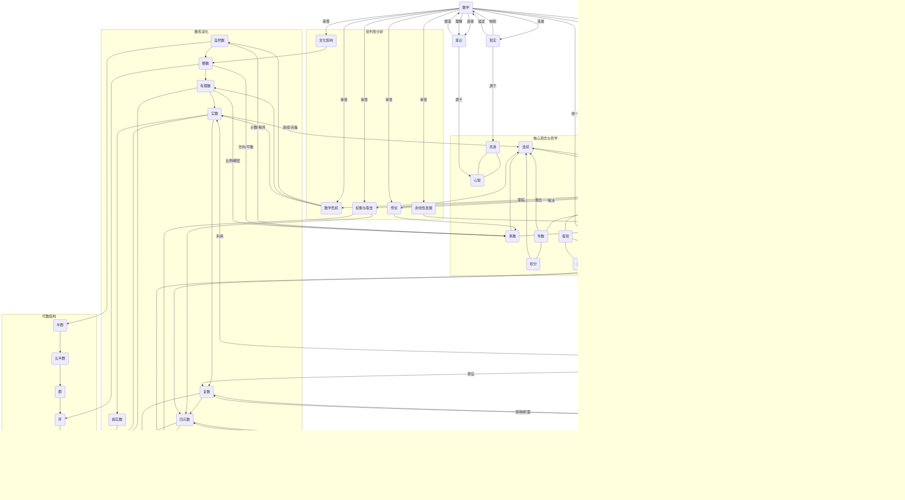

# 数系演化的多维批判性分析：从结构到认知、从本体到计算

这是一项非常激动人心的任务，我将根据您提供的卓越提纲，
以及我们之前所有的讨论和批判性分析，来**完整地撰写这份文档**。
我的目标是确保每一部分都深度融入“批判性的哲科视角”，
揭示数系演化背后的复杂思想、认知挣扎和本体论追问，
并最终将其与信息数字时代和人工智能的深刻议题无缝衔接。

## 目录

- [数系演化的多维批判性分析：从结构到认知、从本体到计算](#数系演化的多维批判性分析从结构到认知从本体到计算)
  - [目录](#目录)
  - [引言：数系·认知·存在](#引言数系认知存在)
  - [1. 数系演化的结构轨迹：从计数到超越](#1-数系演化的结构轨迹从计数到超越)
    - [1.1 自然数 (ℕ)：计数与秩序的初始构造](#11-自然数-ℕ计数与秩序的初始构造)
    - [1.2 整数 (ℤ)：对称性与逆运算的扩展](#12-整数-ℤ对称性与逆运算的扩展)
    - [1.3 有理数 (ℚ)：比例思维与可除性的突破](#13-有理数-ℚ比例思维与可除性的突破)
    - [1.4 实数 (ℝ)：连续性思维的极限构造](#14-实数-ℝ连续性思维的极限构造)
    - [1.5 复数 (ℂ)：代数封闭域与二维平面的统一](#15-复数-ℂ代数封闭域与二维平面的统一)
    - [1.6 四元数 (ℍ)：三维旋转与非交换性的出现](#16-四元数-ℍ三维旋转与非交换性的出现)
    - [1.7 八元数 (𝕆)：代数结构松弛与高维几何](#17-八元数-𝕆代数结构松弛与高维几何)
    - [1.8 超实数 (\*ℝ)：无穷小思维的形式化](#18-超实数-ℝ无穷小思维的形式化)
  - [2. 代数结构与本体论关系：数系存在的多重身份](#2-代数结构与本体论关系数系存在的多重身份)
    - [2.1 代数结构的进阶与松弛](#21-代数结构的进阶与松弛)
    - [2.2 本体论视角的层次分析](#22-本体论视角的层次分析)
    - [2.3 结构·实在·工具：数系的多重存在性](#23-结构实在工具数系的多重存在性)
  - [3. 映射关系的多层网络：观念·结构·空间](#3-映射关系的多层网络观念结构空间)
    - [3.1 离散与连续：两种思维模式的映射与张力](#31-离散与连续两种思维模式的映射与张力)
    - [3.2 极限·导数·积分：无限过程的形式化](#32-极限导数积分无限过程的形式化)
    - [3.3 代数结构到几何空间的映射网络](#33-代数结构到几何空间的映射网络)
    - [3.4 度量空间与序关系：认知结构的数学映射](#34-度量空间与序关系认知结构的数学映射)
  - [4. 认知视角的数系演化：思维如何塑造数学](#4-认知视角的数系演化思维如何塑造数学)
    - [4.1 感知结构与数学抽象的同形性](#41-感知结构与数学抽象的同形性)
    - [4.2 历史人物的认知突破与局限](#42-历史人物的认知突破与局限)
    - [4.3 数系建构中的认知难点与跃迁](#43-数系建构中的认知难点与跃迁)
  - [5. 数系作为认知表征系统：从人类思维到人工智能](#5-数系作为认知表征系统从人类思维到人工智能)
    - [5.1 数学表征与符号推理：认知计算的基础](#51-数学表征与符号推理认知计算的基础)
    - [5.2 大语言模型中的数学表征能力](#52-大语言模型中的数学表征能力)
    - [5.3 人工智能的认知约束与数学思维](#53-人工智能的认知约束与数学思维)
  - [6. 可计算性的哲学边界：图灵模型到认知迁移](#6-可计算性的哲学边界图灵模型到认知迁移)
    - [6.1 图灵计算与数学直觉的差异](#61-图灵计算与数学直觉的差异)
    - [6.2 形式系统的完备性与局限性](#62-形式系统的完备性与局限性)
    - [6.3 认知迁移的数学基础与哲学问题](#63-认知迁移的数学基础与哲学问题)
  - [7. 数学、现实与意识的三重关系](#7-数学现实与意识的三重关系)
    - [7.1 数学是发现还是发明：本体论的再思考](#71-数学是发现还是发明本体论的再思考)
    - [7.2 意识作为元观察者：超越数学形式系统](#72-意识作为元观察者超越数学形式系统)
    - [7.3 认知的数学重构：从自然到人工](#73-认知的数学重构从自然到人工)
  - [8. 多种表征方式](#8-多种表征方式)
    - [8.1 数系演化的多维比较表](#81-数系演化的多维比较表)
    - [8.2 数系·结构·空间·认知关系图](#82-数系结构空间认知关系图)
    - [8.3 思维导图：数系演化的多维网络](#83-思维导图数系演化的多维网络)

---

## 引言：数系·认知·存在

数系的演化历程不仅是数学内部结构的逐步扩展与完善，更是人类认知能力、思维方式与存在理解的外在映射。
本文将从多重维度重新审视数系从自然数到八元数、超实数的发展轨迹，
探索其中蕴含的代数结构、几何意义、认知模式和本体论问题，进而延伸至人工智能和认知迁移的哲学思考。

与传统分析不同，本文不采用辩证法的正反合框架，而是建立多层次的映射网络，
揭示数系演化背后深刻的**认知张力**、**概念冲突**与**本体论难题**。

我们将看到，数系不仅是描述世界的工具，也是人类思维方式的结晶；
不仅是形式系统中的抽象结构，也是认知转化为计算的桥梁；
不仅是数学内部的发展，也是人类意识理解自身与世界关系的反思途径。
每一次数系的扩展，都伴随着对既有直观观念的**剧烈挑战**和**深刻重构**，迫使人类重新审视“真实”的边界。

在这个多维批判分析中，我们将特别关注从结构到认知、从本体到计算的转化关系，
探讨数学如何既作为客观规律的发现，又作为主观思维的创造，
并在当代计算技术与人工智能背景下获得新的存在维度。
我们将避免简单化的进步叙事，而是强调数学发展中非线性、权衡与取舍的复杂面向。

## 1. 数系演化的结构轨迹：从计数到超越

### 1.1 自然数 (ℕ)：计数与秩序的初始构造

自然数，通常定义为 $\{1, 2, 3, \ldots\}$（或包括0），是人类最古老、最直观的数学概念。
它们的起源直接根植于对**离散对象集合**的计数和排序行为，体现了人类与世界互动的基本认知能力。

**本质特征：**

- **离散性**：自然数以单位1的累加构成，体现了分立、可数的基本直觉。这种一跳一跳的性质，是人类最原始的量化感知。
- **秩序性**：自然数集合具有明确的前后序关系，是人类最早对序列和排序进行形式化的尝试。这种秩序感是逻辑思维的基础。
- **归纳性**：皮亚诺公理（Peano Axioms）中的归纳公理（Principle of Mathematical Induction）捕捉了自然数的本质递进结构，即任何从1开始并能递推的性质，对所有自然数都成立。这反映了人类思维对重复模式的抽象和推演能力。

**代数结构：**

- 构成**半群 (Semigroup)**：在加法运算下封闭，并满足结合律。这是最弱的代数结构，仅反映了操作的可重复性和顺序无关性（加法）。
- 构成**幺半群 (Monoid)**：如果自然数包含0，则在加法下构成幺半群（单位元为0）。乘法下，自然数始终构成幺半群（单位元为1）。单位元的引入是对“不变”或“恒等”概念的数学化。
- 构成**良序集 (Well-ordered Set)**：任何非空子集都有最小元素。这是自然数序列的固有属性，是数学归纳法的基础。

**本体论地位：**

- **柏拉图主义 (Platonism)**：认为自然数客观存在于一个独立于人类心智的“理念世界”中，人类只是“发现”它们。这种观点赋予了自然数超验的实在性。
- **直觉主义 (Intuitionism)**：如布劳威尔（L. E. J. Brouwer）所倡导，认为自然数是人类思维最基本的直觉构造，它们的存在依赖于心智活动。
- **形式主义 (Formalism)**：如希尔伯特（David Hilbert）所主张，将自然数视为无解释的符号系统的基本元素，其存在和性质完全由形式公理和推理规则定义。

**历史视角与批判性反思：**

古往今来，各文明对自然数的认识呈现出惊人的普遍性，暗示了其可能源于人类共有的认知结构。
婴儿研究表明，基本的数量感是与生俱来的，但精确的计数则需文化与语言的支持，
这暗示了自然数是**生物学预设与文化建构的交互产物**。

自然数看似简单，却包含了潜在的**无穷概念**（可无限延展），这一特性成为后续数学危机的伏笔。
在直觉上看似最“自然”的数系，实则已包含了高度抽象——我们计数“5个苹果”和“5个想法”，抽象出纯粹的“5”，
这一过程本身就是一次**认知跃迁**：
    从具象事物中剥离出数量这个纯粹的共性。
这种抽象能力的普遍性，为后续数系的复杂化奠定了基础。

### 1.2 整数 (ℤ)：对称性与逆运算的扩展

整数，即 $\{\ldots, -2, -1, 0, 1, 2, \ldots\}$，的引入标志着人类数学思维从具体计数转向抽象运算结构的关键一步。
它扩充了自然数的边界，加入了零和负数，解决了自然数系统中减法运算不封闭的难题（例如 $3-5$）。

**本质特征：**

- **对称性**：整数围绕0点展开，形成正负对称结构，直观上对应着物理世界中的对立方向或相对状态（如前进与后退，收入与支出）。
- **完备加法**：加法运算在整数集合中是封闭且可逆的，这意味着任何整数都能通过加法和减法运算获得，且每个数都有其唯一的加法逆元。
- **方向性**：从纯粹的“量”扩展为带有“方向”的量。负数不仅仅是“不足”，更是“反方向”的指示。

**代数结构：**

- 构成**交换环 (Commutative Ring)**：加法构成阿贝尔群（有单位元0，每个元素有逆元），乘法满足分配律，且乘法是交换的。整数环是代数学习中的基本范例，它引入了两种运算之间协同作用的概念。
- 构成**整环 (Integral Domain)**：无零因子，即如果 $ab=0$，则 $a=0$ 或 $b=0$。这确保了乘法的“良好”行为。
- 构成**序环 (Ordered Ring)**：保持全序关系，且序关系与加法和乘法兼容。

**认知突破与历史分岔点：**

整数的出现需要人类思维突破“物理存在”的直观限制。
负数最初在中国古代算筹计算中用不同颜色表示（如《九章算术》），
在印度数学家（如婆罗摩笈多，Brahmagupta）的著作中得到系统处理，
但传入欧洲后，直到17世纪仍被一些数学家视为“荒谬”或“虚构”，
因为它们无法直接对应于可感的物理量（你不能拥有负三只羊）。
这种接受的差异揭示了数学发展中**文化因素**对认知模式的影响，以及**直觉与形式**之间的持续张力。

**笛卡尔 (René Descartes)** 将数与几何线段关联，为负数提供了方向性解释（如数轴上的原点左侧），是**认知映射**的重要案例，将抽象的代数概念具象化为空间直观。

**本体论转变：**

整数表征了数学对象从“物理事物的计数”到“抽象运算结构”的本体论转变。
数学家开始关注数系的**内部结构与运算性质**，而非其对物理世界的直接对应。
这种转变标志着数学开始超越单纯的经验描述，向更纯粹的形式逻辑和抽象结构迈进。

### 1.3 有理数 (ℚ)：比例思维与可除性的突破

有理数，即所有可以表示为分数 $p/q$ (其中 $p, q$ 为整数且 $q \neq 0$) 的数，
是为了解决除法不封闭的问题，同时反映了人类对**比例关系**的深刻理解。

**本质特征：**

- **比例性**：表达两个整数的比值关系，是量化部分与整体、以及相对大小的关键。
- **稠密性**：在任意两个不同的有理数之间都存在无穷多个有理数。这意味着有理数在数轴上“密密麻麻”，似乎可以无限逼近任何点。
- **可度量性**：可用于精确测量可公度量，即那些能够被同一个公共度量单位精确测量的量（例如，可以用一个共同的尺子量尽的长度）。

**代数结构：**

- 构成**域 (Field)**：加法与乘法都构成交换群（除了0外，每个元素都有乘法逆元），且满足分配律。域是代数运算最完备的结构，确保了加、减、乘、除（非零）四则运算的封闭性。
- 构成**有序域 (Ordered Field)**：保持序关系，且序与四则运算兼容。
- 构成**度量空间 (Metric Space)**：可定义距离函数，使得有理数之间可以衡量“远近”。

**认知拓展与第一次数学危机：**

有理数反映了人类从离散计数到**连续测量**的思维拓展。
古希腊数学中的“比例论”（在欧几里得《原本》第五卷）是早期对比例关系的系统处理，展现了抽象关系思维的成熟。

然而，对**不可公度量 (incommensurable magnitudes)** 的发现——例如**正方形对角线与边长的比值 $\sqrt{2}$**，无法用任何两个整数之比来表示——引发了**古希腊数学的第一次基础危机**。
毕达哥拉斯学派曾将有理数视为宇宙和谐的终极体现，这一发现彻底动摇了他们“万物皆数（有理数）”的本体论信仰，
对他们而言，这简直是宇宙秩序的崩溃，是哲学和数学的巨大冲击。

**哲学冲突与实践-理论张力：**

第一次数学危机导致古希腊数学从代数转向几何，因为几何图形（如长度）可以直观地表示不可公度量。
这在哲学上反映了人类认知对“完美比例”和“无限精细划分”之间冲突的早期体验。
有理数虽然在数轴上**稠密 (Dense)**，但并非“连续”的，数轴上仍有无限多的“缝隙”或“洞”。

有理数的发展体现了实践需求（测量、商业计算）与理论探索（比例论、不可公度量）的互动。
巴比伦人早已使用近似的分数计算，但希腊人将其上升为严格的比例理论，展示了不同认知层次的数学处理。
这种危机迫使数学家们意识到，即使是“稠密”的数系，也可能无法完全表征连续的物理世界，为实数的引入埋下了伏笔。

### 1.4 实数 (ℝ)：连续性思维的极限构造

实数，代表了数学发展史上最为关键的概念突破之一，它们通过“完备化”有理数而诞生，
填补了有理数在数轴上的所有“空隙”，为微积分的建立奠定了坚实的逻辑基础。

**本质特征：**

- **连续性**：填补有理数线上的所有“空洞”，形成无间隙的连续统。
这是对物理世界（如时间、空间）“没有跳跃”和“无限可分”特性的数学形式化。
- **完备性 (Completeness)**：这是实数最重要的性质，它意味着数轴上没有“漏洞”。
  最常见的表述是**确界原理 (Least-upper-bound Property)**：任何有上界的非空实数子集都有一个最小上界（ supremum）。
  另一个等价表述是**柯西序列 (Cauchy Sequence) 收敛性**：任何实数柯西序列都收敛于实数系内的某点。
- **极限存在性**：实数的完备性保证了微积分中极限的普遍存在，使得我们能够严格定义变化率和累积。

**代数与拓扑结构：**

- 构成**完备有序域 (Complete Ordered Field)**：在同构意义下，实数是唯一的完备有序域。
  这使其在代数运算、序关系和连续性方面都达到了最高级别的完备性。
- **拓扑完备性**：作为度量空间，实数是完备的，任何柯西序列都收敛。
- **连续统势 (Cardinality of Continuum)**：康托尔的集合论揭示了实数的基数是 $\aleph_1$，严格大于自然数和有理数的基数 $\aleph_0$，表明实数的“数量”远大于可数集合。

**构造方法与认知路径：**

实数的严格构造方法，是人类思维从直观到严谨的典范：

- **戴德金分割 (Dedekind Cut, 1872)**：理查德·戴德金（Richard Dedekind）提出，将有理数集分割为两个非空集合A和B，使得A中所有元素小于B中所有元素，且A无最大元素，B无最小元素。
  这种分割定义了有理数轴上的“点”，无论是原来有理数对应的点，还是无理数对应的“空隙”，都通过这种分割被“填补”了。
  这是一种从“边界”来定义“点”的巧妙方法。
- **柯西序列 (Cauchy Sequence, 1872)**：格奥尔格·康托尔（Georg Cantor）独立地通过收敛的有理数序列的极限来定义实数，即所有有理数的柯西序列的等价类。
  这体现了“极限过程”的思维，将“无限逼近”的概念实体化为新的数。
- **公理化方法**：直接通过完备有序域公理定义实数，反映了形式化思维的成熟，即通过公理系统来定义数学对象，而不是依赖于构造过程。

**历史与哲学意义：**

实数概念经历了从古希腊欧多克索斯的比例论，到牛顿-莱布尼茨时期对“无穷小量”的模糊使用（引发**第二次数学危机**，即微积分缺乏严格性），再到19世纪柯西（Augustin-Louis Cauchy）、魏尔斯特拉斯（Karl Weierstrass）、戴德金和康托尔的严格化过程。

这场“第二次数学危机”因**贝克莱主教（George Berkeley）**在《分析者》(The Analyst) 中对“无穷小量”的尖锐批判而达到顶峰，他讽刺无穷小量是“逝去量的鬼魂”。
这直接暴露了微积分逻辑基础的脆弱性，促使了19世纪对实数严格定义的迫切需求。

康托尔的集合论工作更进一步，他革命性地揭示了**无穷的层次**，
证明了实数是**不可数 (Uncountable)** 的，
这彻底颠覆了人类对“无限”的直观认知，引发了深远的哲学影响
——“无限”不再是单一概念，而是具有不同“大小”的层次。

**认知挑战与突破：**

实数概念统一了离散与连续、有限与无限的思维。
人类必须超越直观经验，运用纯粹的理性推理来把握实数的本质。
实数的完备性使得微积分成为可能，但其严格理解直到19世纪才实现，
这种滞后揭示了**直觉先行、严格化后至**的认知模式：
    数学创新往往始于模糊的直觉，其严谨的基础建立则是一个漫长而艰难的过程。
实数作为描述连续物理世界的语言，其概念上的严谨化是人类对“真实”理解的一次深刻重构。

### 1.5 复数 (ℂ)：代数封闭域与二维平面的统一

复数，形如 $a + bi$，其中 $i$ 定义为 $\sqrt{-1}$，的引入开启了数学从一维思维到多维思维的转变，
其发展过程是数学概念从“荒谬”到“不可或缺”的典型范例。

**本质特征：**

- **代数封闭性 (Algebraic Closure)**：任何复系数多项式方程都有解（代数基本定理，Fundamental Theorem of Algebra）。这意味着在复数域中，代数运算是“完备的”，无需再引入新的数来解决方程。
- **二维性**：形如 $a+bi$ 的复数可以被视为二维平面上的点 $(a, b)$，实部和虚部分别对应两个维度。
- **几何解释**：复数可以表示为平面向量，其模长（长度）和辐角（角度）有明确的几何意义。复数的加法是向量加法，而复数乘法对应着平面上的**旋转和缩放**。
- **欧拉公式 (Euler's Formula)**： $e^{i\theta} = \cos\theta + i\sin\theta$，这一被誉为“数学最美公式”的等式，连接了指数函数、三角函数与复数，深刻揭示了复数在描述周期性现象（如振动、波）中的核心地位。

**代数与几何结构：**

- 构成**代数闭域 (Algebraically Closed Field)**：在代数上完备，无需进一步扩展即可解决所有多项式方程。
- **二维向量空间**：复数可视为二维实向量空间，复数乘法对应旋转和缩放，这赋予了复数深刻的几何意义。
- **不可序化**：不存在与复数代数运算兼容的良序或全序关系。这意味着复数无法像实数那样简单地比较“大小”。这种性质的“丢失”是向更高维度数系迈进的代价。
- **共形映射 (Conformal Mapping)**：复变函数保持角度，是共形几何（在流体力学、电磁学中应用广泛）的基础。

**历史演变与认知转变：**

复数的概念经历了漫长的哲学和认知挣扎：

- **早期困惑：** 16世纪，**卡尔达诺 (Gerolamo Cardano)** 和 **邦贝利 (Rafael Bombelli)** 在求解三次方程时首次“被迫”引入了 $\sqrt{-1}$，尽管他们称之为“不可思议的”或“虚构的”数。
- **“虚幻”的哲学挣扎：** 在很长一段时间内，数学家们对复数感到困惑和不安，因为它无法像实数那样直接对应于长度或数量。**笛卡尔 (René Descartes)** 创造了“虚数”一词，带有贬义。即使在18世纪，如**莱布尼茨**和**欧拉 (Leonhard Euler)** 这样的大师，虽然熟练使用复数，但对其本体论地位仍感到困惑。这种挣扎反映了人类认知对“实在”边界的坚持——习惯于将数与可感知、可量度的物理量直接挂钩。
- **几何革命与本体论的迁越：** 这种僵局直到19世纪才被打破。**卡斯帕尔·阿甘 (Caspar Wessel)** 和 **让-罗贝尔·阿冈 (Jean-Robert Argand)** 独立地提出了复数的**几何解释**，将复数 $a + bi$ 映射到二维平面上的点 $(a, b)$，即**复平面 (Complex Plane)** 或**高斯平面 (Gaussian Plane)**。
- **卡尔·弗里德里希·高斯 (Carl Friedrich Gauss)**：推广并普及了复数的几何解释，指出复数的加法对应向量加法，复数的乘法法则对应着复平面上的**旋转和伸缩**。这种几何解释赋予了复数**新的“实在性”**，使其从“虚幻”的代数符号跃迁为能够直观描述二维几何变换的实体。

**应用拓展与本体地位：**

随着复数在电气工程（交流电路）、量子力学（波函数）、流体力学和信号处理中的广泛应用，其本体论地位逐渐从“非实在”转变为**“几何实在”和“工具性实在”**。这体现了数学工具的**有效性**和**结构性**可以超越其直观实在性，推动了人类对“数”和“实在”概念的扩展。复数不仅是解决方程的工具，更是在本体论上揭示了现实世界中隐藏的旋转、振荡和波动的**对称性**。这种转变标志着数系从单纯的“量”的表征转向了对“结构”和“变换”的表征，为更高维数系的探索奠定了基础。

### 1.6 四元数 (ℍ)：三维旋转与非交换性的出现

四元数，标志着代数结构开始松弛，**交换律的放弃**换来了对三维空间旋转的优雅描述，是数学从“完美”结构向“实用”功能妥协的里程碑。

**本质特征：**

- **四维代数结构**：形如 $a+bi+cj+dk$，其中 $a,b,c,d$ 是实数，$i, j, k$ 是虚单位，满足 $i^2 = j^2 = k^2 = ijk = -1$。
- **非交换性 (Non-commutativity)**：乘法不满足交换律，如 $ij = k$ 但 $ji = -k$。这是对传统数系直觉的根本性挑战，也是其最显著的特性。
- **三维旋转表示**：单位四元数可以有效地表示三维空间中的旋转，避免了欧拉角带来的万向节死锁问题（Gimbal Lock），具有极高的计算效率和鲁棒性。

**代数结构特性：**

- 构成**斜域 (Division Ring / Skew Field)**：除了交换律外，满足域的所有性质，即加法和乘法都封闭，满足结合律，存在单位元和逆元，乘法对加法有分配律。
- 构成**结合代数 (Associative Algebra)**：乘法满足结合律，即 $(ab)c = a(bc)$。
- 构成**赋范代数 (Normed Algebra)**：具有范数，满足 $||xy|| = ||x|| \cdot ||y||$。

**认知与历史意义：**

四元数的发现是**威廉·罗恩·汉密尔顿（William Rowan Hamilton, 1805–1865）**长达13年艰难探索的结果。他曾试图寻找一种能够像复数描述二维平面一样，以代数形式描述三维空间的“三元数”，但屡屡受挫。

**顿悟瞬间：** 1843年10月16日，当他散步经过都柏林布鲁厄姆桥（Broom Bridge）时，突然顿悟：为了在三维空间中实现乘法的某种几何意义，他必须**放弃乘法的交换律**，并引入**第四个分量**。他在桥上刻下了著名的四元数乘法关系。这一刻是数学史上著名的**“灵光一现”**案例，揭示了如何通过放松结构限制来实现概念突破。

**哲学意涵与代价：** 四元数 $\mathbb{H}$ 的引入，是数学史上一个里程碑式的突破，因为它首次系统地引入了**非交换乘法**。这极大地扩展了代数结构的边界，但同时也挑战了人类对“数”运算的直观认知——我们习惯了交换律。这种放弃是功能性（实现三维旋转的简洁性）对直观性的一种**权衡与牺牲**。它表明，为了更高的表达能力，数学有时必须突破人类的直觉约束。

**本体论与应用扩展：**

四元数最初被视为纯数学构造，一度因其“怪异”的性质而被边缘化。然而，在计算机图形学（3D模型旋转）、控制理论（姿态控制）、信号处理、航空航天和物理学（如描述自旋）中描述三维旋转时的卓越优势，使其在现代重获重要地位。这种**实用价值的“迟到认可”**揭示了数学概念有时需要等待适当的应用场景才能显现其真正的价值和本体论地位。

**批判性思考：**

四元数要求思维放弃交换律这一在之前数系中视为理所当然的性质，同时需要在四维结构中进行思考。
这种认知挑战使四元数成为数学教育中的难点，也反映了人类思维对高维空间和非交换结构的**适应能力**，
以及数学如何通过牺牲部分直观性来获得更强大的功能性。
它的引入是数学抽象能力和对结构理解深化的一个典范。

### 1.7 八元数 (𝕆)：代数结构松弛与高维几何

八元数，通过进一步放松代数结构（**放弃结合律**），构建了八维代数系统，
展示了高维代数与几何的特殊性质，并将人类对数的理解推向了直觉的边缘。

**本质特征：**

- **八维代数结构**：由1个实数分量和7个虚基底 $e_1$ 到 $e_7$ 组成。
- **非结合性 (Non-associativity)**：乘法不满足结合律，即 $(ab)c \neq a(bc)$。这是对传统算术运算更为根本的挑战，也意味着操作顺序变得至关重要。
- **可选代数 (Alternative Algebra)**：虽然不满足结合律，但满足较弱的可选性质，即在任何两个元素 $x, y$ 下，$(xx)y = x(xy)$ 和 $(yx)x = y(xx)$。这表明它并非完全无序。

**代数结构特性：**

- 构成**非结合代数 (Non-associative Algebra)**：放弃了结合律。
- 构成**交错代数 (Alternative Algebra)**：一种特殊的非结合代数，与某些李代数（Lie Algebra）相关。
- 具有**泛性质 (Universal Property)**：在某些范畴中具有普遍性质，暗示了其在更高级数学结构中的特殊地位。

**历史与数学意义：**

1843年，**约翰·格雷夫斯（John T. Graves）**首先构造了八元数，后由**阿瑟·凯莱（Arthur Cayley）**进一步发展。八元数的出现标志着从“寻常”数系到特殊代数结构的转变，代表了对传统代数法则的更大程度突破。

**维度跨越与代数结构：**

八元数的结构与维度8的特殊性相关，这与弦理论中需要10维（9空间+1时间）和物理学中某些对称性（如例外李群 $G_2, F_4, E_6, E_7, E_8$）有潜在联系。
**霍普夫纤维化（Hopf Fibration）**将八元数与四维球面联系起来，显示了高维拓扑结构的特殊性。

**存在意义与认知挑战：**

八元数被视为更多数学构造的意义在于揭示数学结构间的联系，而非直接应用。
它要求数学家完全放弃日常直觉和低维空间思维，纯粹在抽象代数结构中操作，代表了数学抽象能力的极致展现。
这种**“为抽象而抽象”**的探索，有时是为了追求内在的逻辑一致性和形式美感，有时是为了探索数学结构的边界，
而其潜在的应用价值可能要到很久以后才能显现。

**批判性思考：**

八元数的引入深刻地挑战了人类对“数”的基本认知：一个不满足结合律的“数”还是我们传统意义上的“数”吗？
它表明，数学的“真理”并不总需要依附于我们日常的直觉，而可能存在于更抽象、更反直觉的领域。
**弗罗贝尼乌斯定理（Frobenius's Theorem, 1877）**和**赫维茨定理（Hurwitz's Theorem, 1898）**从根本上限定了具有“良好”性质（如结合律、范数可乘性）的数系类型（实数、复数、四元数、八元数）。
这并非偶然，而是暗示了数学结构内在的**逻辑限制**和**设计边界**。
数系的演化，并非无止境的简单扩展，而是遵循着越来越严格的代数“纪律”和理论框架。

### 1.8 超实数 (\*ℝ)：无穷小思维的形式化

超实数的引入实现了莱布尼茨（Gottfried Leibniz）无穷小原始直觉的现代严格化，
为非标准分析（Non-standard Analysis）提供了坚实的基础，是20世纪数学界的一次重要概念重构。

**本质特征：**

- **包含无穷小与无穷大**：超实数集合中存在非零但绝对值小于任何正实数的数（无穷小量 $\epsilon \neq 0, |\epsilon| < r \forall r \in \mathbb{R}^+$），以及绝对值大于任何实数的数（无穷大量 $\omega > R \forall R \in \mathbb{R}^+$）。
- **非阿基米德性 (Non-Archimedean Property)**：
  不满足阿基米德公理（即任何数都可以通过自身重复相加超越任何其他数），因为无穷小量无论加多少次也无法超越1。
- **转移原理 (Transfer Principle)**：
  这是非标准分析的核心，它指出任何在实数系中以一阶逻辑表述的真命题，在超实数系中也成立。
这使得可以将实分析中的许多定理直接“转移”到超实数系中进行操作，极大地简化了微积分的推理。

**代数与序结构：**

- 构成**有序域 (Ordered Field)**：保持序关系，且序与运算兼容。
- 构成**非阿基米德域 (Non-Archimedean Field)**：包含无穷小和无穷大元素。
- 构成**非标准模型 (Non-standard Model)**：超实数系是实数理论的一个非标准模型，它满足与实数相同的公理，但包含了实数所不具备的无穷小和无穷大元素。

**历史演变与认知意义：**

- **莱布尼茨的直觉：** 17世纪，**莱布尼茨**在创立微积分时，直观地使用了无穷小量，将导数视为无穷小增量之比。然而，这些概念缺乏严格的数学定义，受到了**贝克莱主教**的尖锐批判，称其为“已消失量的鬼魂”。
- **严格化与抛弃：** 19世纪，在实数理论严格化（柯西、魏尔斯特拉斯）的背景下，无穷小量作为数学实体被抛弃，微积分完全建立在极限理论之上。
- **罗宾逊的复兴：** 直到20世纪60年代，**亚伯拉拉姆·罗宾逊（Abraham Robinson, 1918–1974）**通过**模型论 (Model Theory)** 的工具，严格构造了超实数，从而为莱布尼茨的无穷小直觉提供了坚实的现代数学基础，复兴了非标准分析。

**构造方法与哲学意涵：**

超实数通常通过**超积（Ultraproduct）**方法构造，这依赖于选择公理和非主超滤子（non-principal ultrafilter）的存在。这种依赖于强公理的构造方式引发了关于其本体论地位的争论——它们是发现的数学实体还是依赖特定形式系统的人工构造？

**认知跨越与思维扩展：**

超实数要求接受“实际无穷小”的存在，这与传统极限思维（无穷小作为过程而非实体）形成对比。
它们使“无穷小”从一个操作概念转变为实体概念，代表了对“无限”概念的**不同思维方式**和**形式化路径**。
它展示了数学如何能够通过构建新的形式系统，来重新验证和捕捉那些在早期被认为不严谨但富有启发性的直觉。

**批判性思考：**

超实数的存在挑战了我们对数系“唯一性”和“自然性”的直观认识。
如果一个理论可以有多个模型，那么我们日常使用的实数系，只是其众多模型中的一个“标准”模型。
这种认识深化了对数学真理**本体论来源**的思考：
    它们是纯粹形式化的推导结果，还是超越形式系统的某种直觉或实在？
超实数的存在，为探讨“无穷”的哲学性质、极限理论的替代基础以及数学的多元性提供了新的工具。

## 2. 代数结构与本体论关系：数系存在的多重身份

数系的演化，实质上是背后代数结构的逐步丰富、抽象化和复杂化。
这个过程伴随着某些代数性质的“获得”和另一些性质的“丢失”，体现了数学在追求普适性、表达能力和解决问题能力上的**权衡与取舍**，也引发了对数系本体论地位的深刻追问。

### 2.1 代数结构的进阶与松弛

数系的代数结构从自然数到八元数呈现出一种**非线性的、辩证的关系**：
   为了获得特定的表达能力，有时需要通过增加性质来**进阶**，有时则需要通过放弃某些“理想”性质来**松弛**。

-**结构进阶路径：从具象到抽象的完备化**

- **自然数 (ℕ) → 整数 (ℤ)：** 通过引入0和负数，加法运算从半群扩展为**阿贝尔群**，使得减法运算封闭。乘法和加法共同构成**交换环**。这是代数结构从单算符到双算符的第一次重大进阶。
- **整数 (ℤ) → 有理数 (ℚ)：** 通过引入分数，除法运算变得封闭（除了零），使环结构进阶为**域**。这是代数运算在四则运算层面的完备化。
- **有理数 (ℚ) → 实数 (ℝ)：** 通过完备化过程，在代数和序关系上都达到完备性，形成**完备有序域**。这并非添加新的代数运算，而是加强了其拓扑和分析性质。

在这一路径上，每一步都通过添加新元素和加强性质来克服前一数系的局限，使代数结构更加完善。
这反映了数学在寻求**封闭性、完备性**和**对称性**的内在驱动，以构建一个能够满足各种运算和极限需求的理想体系。

-**结构松弛路径：从完备到功能导向的妥协**

- **实数 (ℝ) → 复数 (ℂ)：** 为了实现**代数封闭性**（所有多项式有根），复数放弃了**可序性**。这意味着我们不能像实数那样比较复数的大小。这是一种“以功能换性质”的妥协。
- **复数 (ℂ) → 四元数 (ℍ)：** 为了描述**三维旋转**，四元数放弃了乘法的**交换律**。这是一个更剧烈的松弛，因为它挑战了根深蒂固的算术直觉。
- **四元数 (ℍ) → 八元数 (𝕆)：** 为了探索更高维度的代数，八元数甚至放弃了乘法的**结合律**。这标志着对传统代数法则的更大程度突破，但代价是其运算的复杂性和直观性的进一步丧失。

在这一路径上，为了获得特定性质（如代数封闭性或表示高维旋转），数学家不得不放弃某些“理想”性质。
这种**“以退为进”**的思维模式展示了数学的灵活性与创造性——当现有结构无法满足新需求时，宁愿放松某些限制以探索新的可能。

**关键批判视角：**

- 代数结构的进阶和松弛不应被视为线性“进步”，而是**不同数学目标导向的多维度拓展**。
  每种数系都在其特定语境下具有其“最优”的代数结构。
- 不同代数结构间存在基本的**不可通约性 (Incommensurability)**，它们解决的是不同类型的问题。
  我们不能简单地说八元数比自然数“更高级”，它们只是在不同的数学抽象层次上满足不同的需求。
- 数学史显示，特定代数结构的重要性随着应用领域的变化而波动（如四元数在计算机图形学兴起后重获关注），
  这暗示了数学结构的**实用价值**对其本体论地位的塑造作用。

**本体论映射：**

代数结构的选择反映了人类认知对不同问题域的适应。
实数适合测量连续量，复数适合处理波动和旋转，四元数适合三维旋转。
这种“适合性”暗示了数学结构与物理世界的某种深层对应，
但这种对应的本质仍是哲学争议的焦点，
它可能源于**人类认知与现实世界之间的共同约束**。

### 2.2 本体论视角的层次分析

从本体论角度看，数系的存在模式可分为多个层次，每个层次对应不同的哲学立场，揭示了数系作为一种“实在”的复杂性和多元性。

-**1. 物理对应层（经验实在）**

- **自然数**：直接对应物理世界中的离散对象集合（计数）。
- **整数**：对应物理量的正负方向（如温度、海拔、债务）。
- **有理数**：对应可公度物理量的比值（如长度、质量的精确分割）。
- **实数**：对应连续物理量（如时间、距离、能量的连续变化）。
- **复数**：在量子力学（波函数）、经典电磁学（交流电）中获得物理解释，表现为某种内在的结构性实在。

这一层次上，数系被视为对物理世界的抽象和描述，其存在基于与**物理实在**的对应关系。
柏拉图主义者可能会认为这些数是“发现”的，因为它们似乎是外部世界固有秩序的反映。

-**2. 形式结构层（结构实在）**

- 在这一层次，数系被视为纯粹的**形式结构**，其存在不依赖于物理对应，而是基于**内部一致性**和**形式规则**。
- 例如，群、环、域等代数公理系统定义了这些数的行为，而非其具体“内容”。
- 各数系在这一层面上平等存在，区别仅在于它们的形式特性（如交换律、结合律的存在与否）。
  形式主义者（如希尔伯特）认为数学本质上就是这些符号系统及其操作。

-**3. 认知构造层（心智实在）**

- 数系被视为**人类认知活动的产物**，其存在基于人类思维方式和认知限制。
- 例如，自然数对应人类基本的计数能力；
  实数对应人类对连续感知（如时间、空间）的数学化；
  复数和高维数系则对应人类构建抽象思维工具以超越直观经验的能力。
- 直觉主义者（如布劳威尔）强调数学知识的构造性，认为数学真理的来源在于人类心智的直觉构造。

-**4. 问题域层（功能实在/工具实在）**

- 数系作为解决特定问题域的**工具**而存在。
- 实数解决了测量连续量和微积分基础的问题；
  复数解决了无实根方程、二维变换和物理波动的问题；
  四元数解决了三维旋转的表示问题；
  超实数解决了无穷小量的严格化问题。
- 在这一视角下，数系的存在是**功能性和工具性的**，其“实在性”体现为在特定领域的有效性。
  实用主义者尤其强调数学的这一面向。

**批判性观察：**

- 这些本体论层次并非互斥，而是**相互渗透和影响**。例如，复数从最初的“形式构造”逐渐因其“功能有效性”而获得了“物理实在”的地位。
- 同一数系在不同层次上可能有**不同的本体论地位**。
- 对特定数系的偏好常常受**历史和文化因素**影响，并不完全客观。例如，负数在东方被接受得较早，在西方则经历了漫长的挣扎。
- 这种多层次的本体论分析挑战了将数学本体论简单化为“发现”或“发明”的二元对立，揭示了数学作为一种知识形式的**复杂存在模式**。

### 2.3 结构·实在·工具：数系的多重存在性

传统哲学常将数学本体论简化为柏拉图主义（数学发现论）与构造主义（数学发明论）的二元对立，但数系的多重存在性表明，这种简化无法捕捉数学本体论的复杂性。数系既是抽象的**结构**，又具有与现实世界相关的**实在**性，同时还是解决问题的**工具**。

**结构主义视角：**

- 从结构主义看，数系的本质是它们所体现的**关系结构**，而非其组成元素的具体性质。例如，一个群的本质在于其满足的群公理，而不是它由哪些具体元素构成。
- 戴德金曾说：“人造了整数，其余的是上帝的工作”，强调了定义基本结构后，其衍生特性具有客观必然性。数系的演化就是不同代数结构的不断发现和构建。
- **批判性：** 结构主义可能难以解释数学的“不合理的有效性”——为什么这些抽象结构能如此精确地描述物理世界？

**实用主义视角：**

- 从实用主义看，数系的存在基于其**解决问题的能力**和**实践价值**。
- 复数最初被视为“不可能的数”，但其在电气工程、量子力学和信号处理中的广泛应用价值，最终改变了其本体论地位，从“虚构”成为某种意义上的“实在”。这体现了**实用效果对本体认可的影响**。
- **批判性：** 实用主义可能无法解释那些看似没有直接应用、纯粹为抽象而抽象的数学结构（如八元数在很长时间内），以及数学中追求内在一致性而非外部效用的驱动力。

**社会建构视角：**

- 数系的发展也深受**社会和历史因素**影响。不同文化对负数、零的接受度差异，以及20世纪形式主义运动对数学基础的重构，都显示了数学概念的**社会建构**面向。
- 数学知识是通过人类社会中的交流、教育和共识逐步建立起来的。
- **批判性：** 过度强调社会建构可能陷入相对主义，难以解释数学的跨文化普遍性和客观一致性。

**认知映射视角：**

- 数系可被视为**人类认知模式与外部世界之间的映射关系**。
- 例如，自然数映射计数能力，有理数映射比例感知，实数映射连续感知，复数映射平面几何直觉。这种映射是双向的：认知塑造了数系，数系反过来也塑形了认知。
- **批判性：** 认知映射视角可能难以解释那些超越人类直观经验的数学结构（如非结合代数），以及数学中纯粹形式化的、不直接依赖感知的推导。

**批判性综合：**

上述视角的交织表明，数系不是单一存在模式的产物，而是**多重存在性**的体现。它们既有客观结构属性，又有主观构造成分；既对应物理实在，又超越直接经验；既是发现的客体，又是发明的工具。这种**多重本体性**使得数系成为连接不同认知领域（如哲学、科学、工程）的桥梁。对数系本体论的复杂理解，是避免将数学简单化、还原化的关键。它暗示了数学的“真理”并非单一的，而是由其内在逻辑一致性、与经验世界的关联性、以及其在人类认知中的构造性共同决定的。

## 3. 映射关系的多层网络：观念·结构·空间

数系的演化历程中，各种核心数学观念、代数结构与几何空间之间形成了复杂而深刻的**映射网络**。这种映射不仅是数学内部的桥梁，也是人类认知理解和表征世界的核心路径。

### 3.1 离散与连续：两种思维模式的映射与张力

离散性和连续性是人类认识世界最基本的两种认知模式，它们在数系中的体现形成了持续的概念张力与哲学辩论。

**离散思维的数学映射：**

- **自然数 (ℕ)**：最纯粹的离散结构，以单位1的累加构成。它是对可数、可分离对象的直接抽象。
- **整数 (ℤ)**：保持离散性，但增加了对称性（正负方向）。
- **有理数 (ℚ)**：虽可表达为比值，但仍是离散的（可数集）。在数轴上，有理数虽然稠密，但其间的“缝隙”揭示了它的非连续性。
- **计算机实现**：现代计算机中的数值计算本质上是离散的。无论是整数、定点数还是浮点数，它们都是对连续量的离散近似。数字信号处理、信息论、图论等都建立在离散数学的基础上。

**连续思维的数学映射：**

- **实数 (ℝ)**：数学上严格的连续统，填补有理数的“空洞”，形成无间隙的连续线。它是对物理世界中连续变化的量（如时间、距离、温度）的理想化模型。
- **复数平面 (ℂ)**：二维连续平面，复数运算在其中体现为连续的旋转和伸缩。
- **微积分 (Calculus)**：以连续变化为基础的数学分析工具，其核心概念（极限、导数、积分）都深刻依赖于实数的连续性。
- **物理建模**：经典物理中的时空、能量、物质分布常被视为连续的，并通过实数和连续函数来描述。

**离散-连续的认知张力与批判反思：**

这两种思维模式在数学史上持续相互作用和转化，形成了深刻的哲学困境：

- **古希腊的困境**：古希腊人通过几何（被视为连续的）解决了无理数（离散思维失效）的问题，避开了算术上的困境。芝诺悖论（Zeno's Paradoxes）则深刻揭示了人类在处理“无限可分”的连续性时遇到的哲学困境，如“阿喀琉斯追龟”悖论，质疑了运动和连续性的合理性。这些悖论至今仍在哲学上引发思辨。
- **微积分的模糊：** 牛顿和莱布尼茨的微积分直觉性地利用了“无穷小量”，模糊了离散与连续的边界，导致了“第二次数学危机”。
- **现代计算的近似：** 现代计算通过离散近似模拟连续过程（如数字采样、数值积分），这是一种实用主义的策略，但其本质是信息的离散化和潜在的信息损失。
- **量子理论的暗示：** 量子力学引入了量子的概念，暗示深层物理可能是离散的、量子化的，而非经典物理中的连续统一体。这重新引发了对物理世界本质是离散还是连续的哲学争论。

**批判反思：** 离散与连续的二元对立可能是人类**认知结构的产物**，而非物理实在的本质区分。不同数系以不同方式调和这一张力：

- **有理数**：作为离散的数（分数）试图逼近连续量，但其不完备性揭示了这种逼近的局限。
- **实数**：用完备化（连续性公理）形式化地“填补”离散结构的缝隙，创造了一个在数学上理想的连续统。
- **超实数**：引入无穷小，在形式上创建“比任何实数都小”但非零的量，提供了一种在形式上“实体化”无穷小的新方式，从而以另一种方式连接了离散与连续。

**认知学视角：** 认知科学研究表明，人类同时具有近似连续的模拟表征能力和精确离散的符号表征能力。数系的发展可视为这两种认知系统互动的产物：感知系统提供连续的空间和量的直觉，语言系统提供离散的计数和符号操作能力。数学则在这两种系统的边界处创造出各种中介结构，不断地**调和与转化**这种认知张力。

**现代综合视角：** 现代数学通过各种结构建立离散与连续的桥梁：测度论将离散计数推广到连续空间；傅里叶分析将连续函数分解为离散谐波；计算复杂性理论研究连续问题的离散近似。这种持续的映射与转化表明，离散-连续的对立可能是认知的不同层次，而非不可调和的本体论鸿沟。

### 3.2 极限·导数·积分：无限过程的形式化

微积分的核心概念——极限、导数和积分——是人类尝试用有限手段把握**无限过程**的卓越案例，它们在不同数系中获得了不同的表达形式，并引发了深刻的哲学思考。

**极限概念的认知映射与形式化：**

- **直觉层面**：对“无限接近”的原始感知，如古希腊穷竭法中对圆面积的逼近。
- **$\epsilon-\delta$ 形式化**：19世纪，魏尔斯特拉斯（Karl Weierstrass）等人将模糊直觉转化为精确定义，使得“无限逼近”从一个操作过程转变为可以严格验证的数学性质。
- **拓扑表述**：开集和邻域的概念将极限概念系统化，使其在更一般的拓扑空间中也能被定义。
- **超实数表述**：通过无穷小量的代数操作，极限过程被“实体化”，如将函数的极限定义为 $st(f(x_0 + \epsilon))$，其中 $st$ 是取“标准部分”的函数。

**各数系对无限过程的处理：**

- **有理数**：通过柯西列逼近无理数，但无法“达到”极限（因为无理数不在有理数系中）。这揭示了有理数在处理无限逼近时的不完备性。
- **实数**：极限过程的“完成态”，通过完备性保证极限的存在，使得所有柯西序列都收敛于实数系内的某点。这是微积分得以严格化的基石。
- **复数**：在复平面上的极限过程引入了新的路径概念（沿曲线的极限），使得复变函数的分析更为丰富和复杂。
- **超实数**：将无限过程“代数化”，如将导数定义为标准部分函数 $st((f(x+\epsilon)-f(x))/\epsilon)$，其中 $\epsilon$ 是一个无穷小量。这种方法恢复了莱布尼茨的直觉，但建立在更严格的形式系统之上。

**认知挑战与突破：**

无限过程的理解是数学认知的关键障碍和哲学争议的焦点：

- **古代困境**：古希腊人通过悖论（如芝诺悖论）表达了无限的困境，表明他们无法在数学上完全驯服无限。
- **牛顿-莱布尼茨的直觉先行**：微积分的创立是基于对无限过程的强大直觉，但缺乏严格基础。
- **19世纪的严格化**：柯西、魏尔斯特拉斯等人的工作使直觉服从形式，将微积分建立在坚实的实数理论之上。这种严格化过程是对“无穷小”概念的一次**概念重构**，将其从模糊的实体转变为极限过程。
- **非标准分析的再协调**：罗宾逊的超实数理论让直觉与形式重新协调，为“无穷小”作为实体提供了合法的数学地位。

**批判视角：**

关于无限的不同数学处理反映了不同的认知策略和哲学立场：

- **实数进路**：通过完备性公理“消除”了无限过程（使其收敛于一个有限值）。
- **超实数进路**：通过新的数对象“实体化”了无限过程。
- **构造主义进路**：拒绝完成态的无限，坚持数学对象必须是可构造的。

这些不同策略各有优劣，无一能完全消除无限概念的认知张力，表明数学中的无限概念本质上是**认知构造**和**哲学选择**的产物，而非简单的客观发现。它们揭示了人类心智如何持续地与无限的挑战搏斗，并创造出多种形式系统来驯服它。

### 3.3 代数结构到几何空间的映射网络

数系的发展历程中，代数结构与几何空间之间形成了复杂而深刻的**映射网络**。这种映射不仅是数学内部的桥梁，也是人类认知理解和表征物理世界的关键路径。

**基本映射关系与历史案例：**

- **实数 ↔ 一维线**：**笛卡尔（René Descartes）**创立解析几何（或称分析几何），将数与几何线段、代数方程与几何曲线建立系统性对应，开创了用代数方法研究几何、用几何直观理解代数的范式。
- **复数 ↔ 二维平面**：**高斯（Carl Friedrich Gauss）**、**韦塞尔（Caspar Wessel）**、**阿冈（Jean-Robert Argand）**等人的复平面表示，将复数 $a+bi$ 映射到平面上的点 $(a,b)$，使得复数乘法对应平面旋转和伸缩。这赋予了复数直观的几何意义。
- **四元数 ↔ 四维空间及三维旋转**：四元数的几何解释使其能有效表示三维空间中的旋转，并与更高维的欧几里得空间（如4维空间）有内在联系。
- **八元数 ↔ 八维空间及特殊几何对象**：八元数与某些例外李群（Exceptional Lie Groups）和高维拓扑结构（如霍普夫纤维化）有联系，揭示了高维几何的特殊性质。

**映射的认知功能：**

这些映射不仅是数学结构间的联系，更是认知理解的工具：

- **几何视觉化使抽象代数结构可感知**：例如，复平面让抽象的复数运算变得直观。
- **代数形式化使几何直观可运算**：通过坐标系和代数方程，几何问题可以转化为代数计算。
- **相互转化创造了新的理解维度**：代数和几何的互补使得我们能够从不同的角度审视同一个数学对象，从而获得更全面的理解。

**深层关联性与科学法则的统一：**

代数-几何映射揭示了数学结构间的惊人统一性：

- **欧拉公式**： $e^{i\pi} + 1 = 0$ 联结了代数（指数函数）、分析（π 和 e）、几何（虚数 i 和复平面）的基本常数，被誉为数学最美公式，体现了数学结构之间深刻的内在联系。
- **丘-高斯-博内定理（Chern–Gauss–Bonnet Theorem）**：联系了曲面的几何不变量（曲率）与其拓扑不变量（欧拉示性数），是微分几何的里程碑。
- **霍奇理论（Hodge Theory）**：连接了拓扑性质与代数几何结构，是当代数学的前沿。
- **朗兰兹纲领（Langlands Program）**：试图在数论、代数几何和表示论之间建立深层对应关系，是数学中宏大而统一的猜想体系。

**科学法则的分析和关联：** 物理学，作为对自然法则的描述，几乎完全依赖于数学，特别是实数和复数，以及它们所构建的代数和几何结构。

- **经典力学**：牛顿力学基于实数和三维欧几里得空间，描述了物体的运动轨迹和相互作用。其核心是矢量（代数）和微积分（分析），用代数方法描述几何运动。
- **电磁学**：麦克斯韦方程组用向量微积分和复数描述电磁波的传播。相量（phasors）的使用简化了交流电路分析，因为它们将正弦波形转化为复数运算。复数在此处不仅是计算工具，更是电磁场内在周期性和相位关系的**表征**。
- **量子力学**：量子态通常用希尔伯特空间中的复向量（波函数）来表示。复数在描述量子叠加、量子纠缠和相位信息中是不可或缺的。这强烈暗示了微观世界的基础结构，其本体论可能是一种“复数”结构，远超经典物理的实数直观。
- **相对论**：爱因斯坦的狭义和广义相对论将时间和空间整合为四维时空流形，用张量（基于实数）来描述引力场的几何扭曲。这是一种深刻的几何-代数-物理的统一，揭示了时空的非欧几何特性。

**批判反思：**

代数与几何的互映并非单纯的数学技巧，而是揭示了人类**认知系统中不同表征方式（符号与空间）的互补性**。这种互补性暗示，数学知识的本质可能不在于特定表征，而在于表征间的**映射关系本身**。我们通过不断地创建和利用这些映射，来深化对世界的理解，并将直观经验转化为可操作的形式。

### 3.4 度量空间与序关系：认知结构的数学映射

度量（Metric）与序（Order）是人类最基本的认知范畴，它们在数系中的形式化反映了认知结构与数学结构的深层对应，也揭示了人类如何将对世界的基本感知转化为抽象的数学概念。

**度量概念的演化：**

- **自然数 (ℕ)**：离散计数作为最初的“度量”。例如，通过数数来度量物品的数量。
- **有理数 (ℚ)**：比值关系的精确度量。例如，通过分数来度量一个整体中的部分。
- **实数 (ℝ)**：连续量的完备度量。实数使得我们可以精确地度量长度、时间、质量等连续变化的物理量，并为微积分中的距离概念提供了基础。
- **复数 (ℂ)**：复数可以定义其模长作为度量，但在复数空间中，其本质是**失去序关系**的。我们不能简单地说一个复数比另一个大或小，只能比较它们的模长。
- **超实数 (\*ℝ)**：包含无穷小的非标准度量。超实数提供了一种度量方式，可以在其中直接比较无穷小量和无穷大量的大小，这与传统实数中的度量方式有所不同。

**序关系的数学表达：**

- **自然数 (ℕ)**：最自然的全序结构（即任意两个自然数都可以比较大小）。
- **整数 (ℤ) 与 有理数 (ℚ)**：扩展了全序关系，使得负数和分数也能进行大小比较。
- **实数 (ℝ)**：完备序关系，使得实数轴上的每一个点都有明确的顺序。
- **复数 (ℂ)**：本质上**不可序**（无法定义一个与代数运算兼容的全序）。这挑战了人类对“数”必然具有大小关系的直观认知。
- **超实数 (\*ℝ)**：非阿基米德序，包含无穷小和无穷大元素的比较。

**认知基础的映射与批判性观察：**

数学中的度量与序关系映射了人类基本认知能力：

- 判断**“大小”**（序）是认知的基本功能，从儿童早期便开始发展。
- 估计**“距离”**（度量）是空间感知和导航的核心。
- 发展心理学研究表明，无需训练的婴儿已具备基本的数量和序关系感知。

数学将认知直觉形式化为严格结构：

- **序公理**：将“大小”直觉转化为形式关系。
- **度量公理**：将“距离”感知转化为抽象函数（如欧几里得距离、曼哈顿距离）。
- **拓扑公理**：将“接近”的概念抽象化，超越了简单的距离度量。

**批判性观察：**

- 度量与序关系在数学中的形式化过程表明：数学结构部分源于**人类认知架构的投射**。我们以我们感知和理解世界的方式来构建数学。
- 形式化过程往往**超越并修正原始直觉**。例如，复数的不可序性迫使我们放弃了数必须可比较大小的直观。
- 某些数学结构（如复数的不可序性）挑战了认知直觉，暗示了数学可以探索超越人类直接经验的领域。
- 度量与序的**形式分离**（如拓扑学中只关注“接近”而不关注“距离”）是认知抽象的高级成就。

这种认知结构与数学形式的对应关系，为理解数学知识的**主观性与客观性**提供了新视角：数学既反映认知结构（主观性），又通过形式化超越直觉限制（客观性），从而在人类心智与外部世界之间建立起一种高度抽象且严谨的序关系。

## 4. 认知视角的数系演化：思维如何塑造数学

数系的演化并非仅仅是逻辑推演的必然结果，它更深刻地反映了人类思维模式的转变、认知能力的拓展，以及在面对概念障碍时的挣扎与突破。从认知视角审视数系发展，可以揭示思维如何塑造数学。

### 4.1 感知结构与数学抽象的同形性

人类的基本感知结构与数系的抽象性质之间存在着惊人的**同形关系 (Isomorphism)**，这种对应暗示了数学抽象可能源于感知系统的投射与扩展，而非纯粹的理性构造或独立客观的存在。

**基本感知模式与数学映射：**

- **物体辨识与计数 → 自然数 (ℕ)**：人类对离散对象的识别和数量的感知能力，直接映射到自然数的计数功能。
- **方向感知与相对位置 → 整数 (ℤ)**：对“前进-后退”、“上-下”等方向性感知，以及相对参照点的建立，映射到整数的正负和零。
- **比例感知与部分-整体关系 → 有理数 (ℚ)**：对事物分割和比例关系的感知，映射到分数的概念。
- **连续感知与无间断性 → 实数 (ℝ)**：对时间流逝、空间连续性、光滑运动的感知，映射到实数的完备连续统。
- **空间想象与变换 → 复数 (ℂ) / 四元数 (ℍ)**：对平面旋转、三维空间变换的想象和理解，映射到复数（二维旋转）和四元数（三维旋转）的代数结构。

**发展心理学的支持证据：**

- **婴儿研究**显示，数量感是与生俱来的（如区分2个和3个物体），但精确的计数则需要后天学习和文化支持。
- **空间认知发展**先于形式逻辑（皮亚杰理论），暗示了具象的感知经验是抽象思维的基础。
- **文化普遍性**表明某些数学直觉是人类共有的，例如所有人类文化都有计数系统，尽管形式各异。

**神经科学视角：**

- **顶叶皮层**的数量敏感神经元反应支持“数感”的生物基础。
- **空间处理与数量处理共享神经网络**，例如“数轴效应”（左小右大）表明数量与空间位置存在内在联系。
- **抽象思维**利用感知运动系统的神经结构（概念隐喻理论），即我们通过对具象经验的隐喻来理解抽象概念。

**批判性分析：**

感知结构与数学同形性提示：

- 数学抽象部分是**感知能力的外推和形式化**，它将人类经验中的模式提炼并加以结构化。
- “纯粹”数学可能仍**受限于人类认知架构**。例如，我们难以直观想象超过三维的空间，这可能与我们感知世界的维度限制有关。
- 不同数系对应不同认知能力的形式化，这解释了为何某些数系（如自然数）比其他数系（如八元数）更容易被直观理解。
- 数学困难（如复数和高维数系理解）可能源于缺乏直接感知对应，需要通过更抽象的代数或间接的几何映射来构建认知。

这种视角挑战了数学柏拉图主义的极端观点，暗示数学结构可能不是独立于人类心智的客观实在，而是**人类认知能力的投射与系统化**。然而，这也解释了为何数学能如此有效地描述自然界——两者都受限于相似的认知结构或共同的演化压力。数学因此成为人类心智与外部世界互动形成的一种**“共适应”**的知识形式。

### 4.2 历史人物的认知突破与局限

考察数系发展历史中的关键人物，他们的认知突破与局限生动展示了数学创新的**认知维度**，以及人类在接受新概念时所经历的挣扎。

**自然数到整数：**

- **印度数学家婆罗摩笈多（Brahmagupta, 598-668）**首次系统处理负数，将其视为财富与债务，突破了“数量必为正”的直觉限制。这反映了实用需求如何推动认知边界。
- **欧洲数学家直到文艺复兴时期仍拒绝负数**，如**卡尔达诺（Gerolamo Cardano）**在解三次方程时遇到负根仍称之为“虚构”或“荒谬”。这反映了**文化和思想传统**对新概念接受的阻碍，以及直观经验对抽象思维的制约。
- **认知障碍**：如何理解“少于无”的数量？
- **认知突破**：将数理解为带有方向的量（如数轴上的位置），而非纯粹的计数。

**无理数的认知危机：**

- **毕达哥拉斯学派**发现√2不可表示为比值，引发**第一次数学危机**，动摇了他们“万物皆有理数”的本体论信仰。这显示了**直觉与逻辑冲突**如何导致深刻的概念危机。
- **欧多克索斯（Eudoxus, 约前408-355）**开发比例理论，巧妙地绕过了无理数概念，通过几何方法处理不可公度量。这反映了当一个领域出现危机时，人类思维如何转向另一个领域来寻求解决方案，是**认知模式的转换**。
- 希腊人选择几何而非算术处理无理量，反映了当时数学家对**几何直观**的偏好和对无限小数的抗拒。

**复数的认知演变：**

- **卡尔达诺（Cardano）**在解三次方程时遇到“无意义”的复数，将其视为计算的副产品。
- **欧拉（Leonhard Euler）**将虚数融入分析，系统地发展了复变函数理论，但仍称其为“虚构”，反映了其在实用性与本体论接受之间的张力。
- **高斯（Carl Friedrich Gauss）**提供几何解释，将复数映射到复平面上的点，使复数获得“市民权”，从“无意义符号”转变为“几何实体”，再到“物理必需”。
- **认知转变**：从纯粹的代数符号到二维几何实体，再到物理世界的必要工具。这种转变展示了**多重表征**对概念接受的关键作用。

**四元数的创造突破：**

- **汉密尔顿（William Rowan Hamilton）**寻找三维数系失败，最终通过放弃交换律这一根深蒂固的数学直觉，才灵光一现发现四维四元数。
- **认知突破**：人类思维在面对僵局时，如何通过**放松约束条件**来寻求突破。
- **理解障碍**：四维结构超出直观空间想象，使得四元数的普及和理解比复数更为困难。

**超实数的形式化：**

- **莱布尼茨（Gottfried Leibniz）**直观地使用无穷小量，但未能严格定义。
- **罗宾逊（Abraham Robinson）**运用现代逻辑（模型论）创建非标准分析，严格构造超实数，为莱布尼茨的直觉提供了形式基础。
- **认知挑战**：将“过程”概念（极限中的无穷小）转变为“对象”概念（超实数中的无穷小量实体）。

**批判性反思：**

- 数学创新往往发生在**突破认知限制**的瞬间，这些突破往往需要放弃一些看似“理所当然”的直觉。
- 数学家的**直觉先行，严格化后至**的模式（如莱布尼茨→魏尔斯特拉斯→罗宾逊）是数学发展中的普遍现象，反映了人类认知的探索性与寻求严谨的内在驱动。
- 新概念的接受需要**多种认知路径**（代数、几何、应用）的共同支持，以构建稳固的心理表征。
- 数学发展中存在**文化差异**（如东方对负数的早期接受），这提示了数学认知并非完全独立于文化语境。

历史人物的认知挣扎表明，数学创新不仅是逻辑推演，更是**认知模式的转换与拓展**。数学家突破已有思维框架的能力，可能比纯粹的逻辑能力更为关键，这体现了人类思维的**创造性与适应性**。

### 4.3 数系建构中的认知难点与跃迁

数系扩展过程中出现的认知难点和随后的认知跃迁，揭示了数学思维的深层运作机制，以及人类如何克服直觉障碍来构建更复杂的抽象系统。

**基本认知障碍类型：**

- **本体障碍 (Ontological Obstacles)**：接受新数系的“存在性”，如负数、虚数在直觉上“不存在”或“无意义”。这挑战了人类对“实在”的基本认知。
- **操作障碍 (Operational Obstacles)**：掌握新数系的运算规则，特别是当这些规则与原有直觉相悖时（如四元数的非交换乘法，八元数的非结合乘法）。
- **表征障碍 (Representational Obstacles)**：建立有效的心理表征，以便于理解和操作新概念（如想象四维空间或不可见的无穷小量）。
- **整合障碍 (Integration Obstacles)**：将新概念与已有知识整合，并理解它们之间的关系（如超实数与标准分析的关系，如何将一个“非标准”的数系融入到传统的数学框架中）。

**认知跃迁的关键机制：**

克服这些障碍，实现认知跃迁，往往依赖于以下机制：

- **类比映射 (Analogical Mapping)**：通过已知领域理解未知概念，将新概念映射到熟悉的结构上（如复数→平面点）。这种映射提供了理解的“桥梁”。
- **形式与直观互补 (Formal-Intuitive Complementarity)**：形式严格化为概念提供了坚实的基础，而直观理解则使其更易于被接受和操作。两者相互支持，而非对立。
- **多重表征 (Multiple Representations)**：建立同一概念的不同表征方式（代数、几何、应用、符号），提供多角度的理解，从而降低认知负荷。
- **概念隐喻 (Conceptual Metaphor)**：利用基本经验隐喻理解抽象概念（如数线将数与空间位置关联，将无穷小隐喻为“微粒”）。这使得抽象概念在人类心智中变得“可感”。
- **问题驱动 (Problem-Driven)**：当现有数系无法解决实际问题时，对新数系的迫切需求会推动认知接受（如解方程催生复数，三维旋转催生四元数）。

**具体案例分析：**

- **负数接受过程**：从被视为“荒谬”到“有用工具”再到“自然概念”。
  - **认知障碍**：如何理解“少于无”？
  - **突破点**：将数理解为方向性量，而非纯计数。
  - **教学启示**：引入具体情境（温度、借贷）促进理解。
- **复数理解进程**：从“虚构数”到“二维数”再到“物理必需”。
  - **认知障碍**：平方为负的数“不可能存在”。
  - **突破点**：几何解释提供直观把握（复平面）。
  - **教学启示**：几何表征应先于形式操作。
- **超实数学习挑战**：
  - **认知障碍**：无穷小既非零又小于任何正实数的矛盾性。
  - **突破点**：形式定义与直观类比（如“显微镜”隐喻，将无穷小视为无限放大的局部）。
  - **教学启示**：先建立直观，再介绍严格构造。

**批判性视角：**

数学教育研究表明，学生在学习数系扩展时经历的认知困难往往**重演了历史上的认知障碍**。这种“个体发生重演种系发生”（Ontogeny Recapitulates Phylogeny）的现象暗示：

- 数学概念发展可能受制于普遍的**认知机制**和**发展阶段**。
- 抽象数学依赖于基本认知能力的**延伸和重组**。
- 数学理解的关键在于**认知表征的转换与整合**。
- 数学教育应重视概念的**多重表征**和**历史发展路径**，以促进学生对抽象概念的理解。

这种认知视角使我们重新审视数学本质：数学概念不仅是客观真理的发现，也是**认知结构不断拓展和重组的产物**。人类通过持续的认知努力，不断地突破自身的直觉限制，从而构建出日益复杂和强大的数学系统。

## 5. 数系作为认知表征系统：从人类思维到人工智能

数学，特别是数系及其运算规则，构成了人类认知计算能力的核心，也是现代人工智能的理论基础。数系不仅是思维的工具，更是思维模式本身的**表征**，这种表征能力在人工智能时代获得了新的意义。

### 5.1 数学表征与符号推理：认知计算的基础

数学表征系统，特别是数系及其运算规则，构成了人类认知计算能力的核心，也是现代人工智能的理论基础。它提供了一种将现实问题转化为可操作的形式，并通过符号变换进行推理的机制。

**表征系统的基本功能：**

- **编码 (Encoding)**：将现实世界中的信息、问题或概念转化为形式化的数学符号和结构（例如，将苹果的数量编码为自然数5，将空间位置编码为实数坐标）。
- **操作 (Manipulation)**：通过严格定义的符号变换规则（例如，四则运算、逻辑推理）对编码后的信息进行处理，从而得出新的结论（例如，通过加法计算总数）。
- **解释 (Interpretation)**：将形式操作的结果映射回原始问题域，赋予其现实意义（例如，将计算结果映射回物品的总数量）。

**数系作为认知表征的优势：**

- **精确性 (Precision)**：无歧义的形式定义和运算规则，确保推理结果的准确性。
- **一致性 (Consistency)**：内部逻辑自洽，避免矛盾。
- **效率性 (Efficiency)**：通过抽象和符号化，简化复杂关系的表达，使复杂推理变得高效。
- **泛化性 (Generality)**：适用于多种问题领域，具有普遍的适用性。例如，相同的代数方程可以描述物理、经济或生物现象。

**历史发展视角：**

- **早期计算系统**（如算筹、算盘）即是认知表征的物理化，将抽象的计数操作通过具象工具实现。
- **代数符号系统**（如**笛卡尔**创立的解析几何，**维耶特**等人的符号代数）使抽象推理更高效，摆脱了几何直观的束缚。
- **微积分**创立了处理连续变化的表征系统，使其能够被严格分析。
- **现代数理逻辑**（如**弗雷格**、**罗素**、**希尔伯特**）将推理本身形式化，为计算机科学和人工智能奠定了理论基础。

**认知科学视角：**

- 人类擅长创建和操作**表征系统**（即**表征和重表征能力**）。这种能力是人类智能的核心，使得我们能够将复杂信息转化为可处理的形式。
- 数学表征使思维外化，克服了工作记忆的限制，将推理过程记录下来并可供他人验证。
- 符号系统充当“认知脚手架”，扩展了人类思维能力。
- 不同表征系统激活不同认知资源（如实数与空间表征激活空间认知，逻辑符号激活逻辑推理能力）。

**批判性反思：**

数学表征既增强又限制了认知：

- **增强**：扩展抽象思维，实现复杂推理，提高问题解决效率。
- **限制**：表征系统本身携带隐含假设和偏见，例如，我们习惯了将现实离散化和线性化。
- 数系从一开始就是**人机混合认知系统**的产物（符号系统+人类大脑）。
- 不同数系反映了不同认知需求与能力。

数系作为表征系统，不仅是思考的工具，更**塑造了思维方式本身**。不同数系的认知“亲和力”各异：自然数符合直觉计数，实数反映连续感知，复数需要空间想象。这种认知亲和性差异，对人工智能系统处理不同数学领域的能力有深远影响。

### 5.2 大语言模型中的数学表征能力

现代大语言模型（LLMs，如GPT系列）处理数学的能力，为我们提供了观察人工系统如何表征数系的独特窗口，并揭示了数学认知在**统计与模式**维度上的新可能。

**语言模型的数学表征特点：**

- **分布式表征 (Distributed Representation)**：数学概念（如“3”、“加法”、“素数”）不再是孤立的符号，而是编码为高维向量空间中的区域。这种表征捕获了概念之间的语义和句法关系。
- **统计关联 (Statistical Association)**：模型基于海量文本语料中的共现统计学习数学关系。它通过识别语言模式来“预测”数学结果，而非通过显式的公理推理。
- **连续表征 (Continuous Representation)**：使用连续值向量来表示离散符号（如词语或数字），使得离散概念之间的关系可以在连续空间中进行度量（如向量距离、方向）。
- **上下文敏感 (Context-Sensitive)**：数学表达的含义和模型生成的响应高度依赖于上下文。同一个数字或符号在不同语境下可能扮演不同角色。

**数系理解的差异：**

大语言模型在处理不同数系时表现出显著差异，这反映了其基于统计和模式学习的本质：

- **自然数**：在小范围内计算准确性高，因为它们在语料中频繁出现且模式清晰。
- **整数**：能够理解正负概念和基本运算。
- **分数/有理数**：概念理解较好（如“一半”、“三分之一”），但涉及精确计算（如分数加减乘除）时，可能会出现偏差，因为它更侧重于语言模式匹配而非精确数值运算。
- **实数**：能理解连续性概念（如“连续”、“近似”），但在精确表示无理数（如 $\pi, \sqrt{2}$ 的无限小数位）方面有局限，因为其本质是离散的符号系统。
- **复数**：能理解形式规则（如 $i^2=-1$），但其“空间直觉”或“几何想象”能力较弱，难以进行复杂的复变函数可视化推理。
- **高级数系**：对四元数、八元数等理解有限，主要限于文本中出现的定义和基本属性，反映训练数据中相关信息的稀疏性。

**与人类认知的对比：**

- **表征方式**：人类依赖多感官经验、空间直觉和符号规则；语言模型主要依赖纯文本投射（尽管可以通过多模态学习扩展）。
- **操作机制**：人类结合显式规则和直觉模式识别；语言模型主要通过隐式统计学习和模式匹配。
- **学习路径**：人类通常从具体到抽象，循序渐进；语言模型同时接触多层抽象，但可能缺乏深层概念的连贯性。
- **错误模式**：人类的数学错误通常有模式且可解释（如概念误解、计算失误）；模型错误可能看似随机或“幻觉”，难以追溯其推理链条。

**批判性思考：**

大语言模型的数学能力反映了一个根本问题：数学是否需要**“理解”**才能操作？模型通过纯统计学习获得的数学能力，在某些方面挑战了数学需要“真正理解”的假设。然而，模型在处理需要多步推理、概念创新或对数学对象进行“深层理解”的数学问题时的局限性，又暗示了**符号操作与真正理解之间的差距**。

这种人工系统与人类数学认知的对比，为我们提供了重新思考数学本质的角度：数学可能既是**符号游戏**（形式主义视角），又是**概念理解**（意义主义视角），两者在不同任务中的重要性各异。LLMs的出现，迫使我们重新界定“理解”和“智能”在数学领域的内涵。

### 5.3 人工智能的认知约束与数学思维

人工智能系统处理数学的方式，揭示了认知架构如何影响数学思维的形成，同时也展示了数学本身的认知适应性，以及人类如何将自身的认知能力“算法化”并转移给机器。

**认知架构的约束作用：**

- **表征限制**：系统如何内部表示数学对象（如，符号主义AI使用离散符号表示，连接主义AI使用连续向量表示），这直接影响其能够处理的数学类型。
- **计算约束**：系统能执行哪些操作和推理（如，能否进行多步逻辑推理，能否处理高维矩阵运算），这决定了其数学能力的上限。
- **学习机制**：系统如何获取和组织数学知识（如，通过规则编程、通过数据训练），这影响其对数学概念的构建方式。
- **交互界面**：系统如何接收输入和表达输出，这影响其与人类数学家沟通和协作的能力。

**不同AI范式的数学思维：**

- **符号主义AI (Symbolic AI)**：侧重于精确的规则处理和逻辑演绎，类似公理系统。擅长解决定义明确、规则清晰的数学问题（如定理证明、形式验证）。其数学思维模式接近于数学中的形式主义。
- **连接主义AI (Connectionist AI / Neural Networks)**：侧重于模式识别与统计关联，类似人类的直觉思维。擅长从大数据中学习复杂的非线性映射，但在解释其“推理”过程时较为困难。其数学思维模式接近于统计归纳和模式识别。
- **混合架构 (Hybrid AI)**：结合符号主义的精确性和连接主义的模式识别能力，试图弥补单一范式的不足，更接近人类的复杂数学思维。

**数学领域的认知适配度：**

不同数系和数学分支与不同AI架构的适配度各异：

- **计算数论**：规则明确，符号系统擅长。
- **几何直观**：需要空间表征，神经网络（通过嵌入学习）较适合捕捉几何关系。
- **分析证明**：需要策略性思考和创造性，混合系统或人类协作更优。
- **抽象代数**：需要符号操作与结构识别能力，符号系统和图神经网络可能有用。

**未来趋势与挑战：**

- **多模态表征**：整合语言、视觉、符号的数学表征，使AI能够像人类一样从多种模态理解数学。
- **神经-符号整合**：结合神经网络的模式识别能力和形式推理的精确性，构建更强大的数学智能。
- **交互式证明**：AI与人类协作证明数学定理，提升数学发现的效率和可靠性。
- **元数学理解**：系统能够反思自身的数学推理过程，理解其局限性，并进行自我修正。

**批判性思考：**

AI系统处理数学的方式提示我们：

- 数学思维可能不是单一能力，而是多种认知能力的复杂组合（规则应用、模式识别、直觉、归纳、演绎等）。
- 不同数学领域可能依赖不同的认知能力组合，这意味着没有一种“通用”的数学AI。
- 形式规则与直觉模式识别在数学中相互补充，两者结合才是强大的数学智能。
- 数学创造力可能需要在不同表征系统间灵活转换，这是当前AI的巨大挑战。

AI系统的数学能力发展过程，可视为一面镜子，反映了数学知识的认知结构。通过观察AI如何学习数学，我们不仅了解机器学习的局限，也更深入理解了人类数学思维的本质——它是规则与直觉、符号与意义、形式与内容的复杂交织。AI的挑战在于能否重构这种交织，而不仅仅是模拟其表象。

## 6. 可计算性的哲学边界：图灵模型到认知迁移

将人类数学认知迁移到人工系统的过程，本质上是一场深刻的哲学探险，它迫使我们重新审视**可计算性的哲学边界**，以及图灵模型对人类思维和人工智能的根本性限制与启示。

### 6.1 图灵计算与数学直觉的差异

**图灵机模型（Turing Machine）**作为计算的理论基础，是**对“算法”概念的抽象和形式化**。然而，这一机械模型与人类的**数学直觉**之间存在着根本性差异，这一差异揭示了数学认知的复杂本质，以及我们对“计算”和“理解”的二元认知。

**图灵计算的基本特性：**

- **离散性 (Discreteness)**：基于离散的状态转换、离散的符号操作（通常为0和1）、离散的时间步长。这是数字计算机的基石。
- **确定性 (Determinism)**：给定输入和当前状态，图灵机在任何时刻的下一步操作都是唯一确定的。
- **机械性 (Mechanicity)**：按照预设的、有限的规则执行操作，无需“理解”其所操作符号的含义。它只关注语法，不关注语义。
- **有限表示 (Finite Representation)**：任何可计算的算法都必须能够用有限的符号序列来表达。

**人类数学直觉的特点：**

- **整体性 (Holism)**：能够把握数学对象的整体结构和抽象概念，而非仅局限于局部符号操作。
- **类比性 (Analogy)**：通过领域间的映射（如复数与平面旋转的类比）来理解新概念，进行跨领域推理。
- **模糊性 (Vagueness Tolerance)**：在探索新概念或进行启发式推理时，容忍一定程度的不精确和模糊直觉。
- **多模态 (Multi-modality)**：综合视觉、空间、语言、听觉等多种感知表征来理解数学，例如几何图形、数轴、物理模型。
- **创造性 (Creativity)**：能够提出新的数学概念、猜想和证明方法，甚至发展出全新的数学领域。

**关键差异的案例与哲学层面的对立：**

- **几何直觉**：人类易于通过视觉和空间想象把握拓扑关系、图形变换，而图灵计算需要将其转化为繁琐的坐标、矩阵和离散编码。
- **模式识别**：人类擅长识别数学模式（如数列规律、代数结构中的对称性），计算机需要明确的算法或海量数据训练才能模拟。
- **隐喻理解**：人类利用经验隐喻理解抽象概念（如将无穷小隐喻为“微粒”或“无限逼近的过程”），而图灵机无法直接处理隐喻。
- **概念创新**：人类能创造新数学概念，而图灵计算局限于预设规则或从数据中学习已有模式。

这些差异引发了深刻的哲学争论：

- **形式主义 (Formalism)**：认为数学本质是符号操作，真理是形式系统内部的一致性。这与图灵模型高度契合，认为数学最终可还原为机械计算。
- **直觉主义 (Intuitionism)**：认为数学本质是心智构造，真理必须是可构造的。这强调了人类直觉在数学中的核心地位，并对无限和非构造性证明持保留态度。
- **柏拉图主义 (Platonism)**：认为数学对象独立客观存在，人类只是发现它们。这超越了计算和直觉的范畴，认为数学真理的来源不限于人类心智或形式系统。

**批判性思考：**

图灵计算与人类直觉的差异暗示：

- **数学可能不完全可还原为机械计算**。数学的某些方面（如直觉、创造力、意义理解）可能超越了算法的范畴。
- 数学“理解”可能超越纯形式处理，它需要与语义、直观和意向性相结合。
- 数学创造性可能源于非算法性思维，或者至少是当前我们尚未完全理解的复杂认知算法。
- 认知的某些方面可能本质上不可计算，这构成**认知迁移的哲学边界**。

这一差异引发深刻问题：如果数学直觉包含原则上不可计算的成分，那么它如何能被完全模拟或转移到计算系统中？这触及了**认知迁移的哲学边界**，并对强人工智能的可能性提出了根本性挑战。

### 6.2 形式系统的完备性与局限性

**哥德尔不完备定理（Gödel's Incompleteness Theorems）**为形式系统（包括数系的公理化表述）设置了内在限制，这一限制对认知迁移和数学智能有深远影响，它表明了即使是最严谨的数学系统也无法完全捕获所有的真理。

**形式系统的基本特征：**

- **语法明确**：严格定义的符号与规则，形成清晰的语言。
- **语义中立**：规则的操作不依赖于符号的外部意义，只关注其形式结构。
- **机械可检验**：证明可机械地验证，这意味着存在一个算法可以检查证明的正确性。

**哥德尔定理的核心洞见：**

- **第一不完备定理 (First Incompleteness Theorem)**：任何包含基本算术（如皮亚诺算术）的一致的形式系统，都存在一个在本系统内既不可证明也不可否证的真命题。这意味着**任何足够强大的形式系统都是不完备的**。
- **第二不完备定理 (Second Incompleteness Theorem)**：这类系统无法在系统内部证明自身的一致性（即自身不包含矛盾）。这意味着**一个系统无法自证清白**。

**对数系形式化的影响：**

- **自然数的皮亚诺公理系统是不完备的**。这意味着存在关于自然数的真理，是我们无法仅仅通过皮亚诺公理推导出来的。
- **实数的形式化也不能完全捕捉其直观性质**。例如，虽然实数理论本身可能是完备的（如果用二阶逻辑表达），但其底层算术的缺陷依然存在。
- **超实数的非标准模型多样性**反映了形式化局限：同一个公理系统可以有多个满足它的模型，这些模型在某些方面可能与我们的直观有所不同。

**认知与形式的张力：**

- 人类数学认知超越特定形式系统。我们能“看到”戈德尔命题是真的，即使它在系统内不可证明。
- 数学直觉常指向形式系统无法完全捕捉的性质。
- 形式化总有“剩余”——那些非形式化的、直观的、甚至模糊的认知内容，它们是数学创造力的源泉。

**批判性视角：**

戈德尔定理暗示：

- **数学思维可能本质上不可完全形式化**。数学的某些方面可能超出了任何算法或形式系统的能力范围。
- **任何形式系统都可能需要外部视角的补充**，例如人类的直觉或对更高层次理论的理解。
- 数学“理解”可能包含超越形式系统的成分，如对意义、目的和相互关联的把握。
- **认知迁移面临根本性限制**：如果人类的数学直觉包含不可形式化的成分，那么这种直觉就无法完全通过算法传递给机器。

这些局限性不仅是技术障碍，更是哲学挑战，它们质问了我们对数学本质和认知可计算性的基本假设。如果数学思维包含原则上不可形式化的成分，那么人工智能能否真正“理解”数学就成为一个开放问题，也限定了**强人工智能（Strong AI）**的理论可能性。

### 6.3 认知迁移的数学基础与哲学问题

将人类数学认知迁移到人工系统的过程，既是技术挑战，也是深刻的哲学问题，它涉及数学的本质、意识的角色和认知的可形式化程度。这并非简单的“复制粘贴”，而是一种复杂的**“重构与转化”**。

**认知迁移的数学基础：**

- **形式化能力**：人类能够将直观的数学概念（如计数、形状、变化）转化为形式化的符号系统、公理和规则（如皮亚诺公理、群论公理），这是将认知转化为机器可处理形式的第一步。
- **算法化能力**：人类能够将解决问题的步骤分解为有限的、明确的指令序列（算法），这是图灵机得以运行的基础。编程语言就是这种算法化能力的体现。
- **数据结构与算法的构建**：人类通过数学（特别是离散数学、抽象代数）设计出各种数据结构和算法，它们是机器内部表征和处理信息的核心。
- **数学模型**：人类将现实世界或自身认知过程建模为数学模型（如神经网络的数学模型、概率模型），使得这些过程可以在机器上模拟。

**认知迁移的基本模式：**

- **符号迁移**：转移形式规则和符号操作（例如，将代数方程的解法规则编程到机器中）。
- **结构迁移**：转移概念间的关系网络和模式（例如，神经网络学习数据中的潜在结构）。
- **过程迁移**：转移推理和问题解决策略（例如，启发式算法、搜索策略）。
- **隐喻迁移**：转移基础经验模型和隐喻（这最具挑战性，因为隐喻根植于人类的具身经验）。

**数学作为中介的独特性：**

数学在认知迁移中扮演特殊角色：

- **最适合形式化的人类知识领域**：由于其固有的严谨性和逻辑性，数学比其他知识领域（如情感、艺术）更容易被形式化为机器可处理的符号。
- **具有内在一致性和逻辑结构**：这使得数学知识在形式化后，其正确性可以被严格验证。
- **相对独立于感知经验**：虽然数学源于感知，但其高级抽象可以脱离直接经验而独立发展，这使其在没有人类具身经验的机器上也能运行。
- **具有跨领域应用能力**：数学的通用性使其成为连接物理、工程、经济等不同领域的桥梁，使得数学认知可以在不同应用场景中迁移。

**迁移限制与哲学分歧：**

关于认知迁移限制的不同立场：

- **强人工智能论 (Strong AI)**：认为认知完全可形式化，通过足够复杂的计算系统，机器可以拥有真正的心智和意识，认知迁移无原则障碍。
- **弱人工智能论 (Weak AI)**：认为系统可模拟认知行为，但缺乏真正的心智、意识和理解。AI只是一个强大的工具。
- **意识必要论 (Consciousness Requirement)**：认为真正的数学理解需要主观体验和意识，而这些是机器目前无法具备的。
- **具身认知论 (Embodied Cognition)**：认为抽象数学根植于身体经验和感官运动系统，不可完全分离，因此缺乏身体的AI无法完全复制人类的数学认知。

**迁移合法性的批判问题：**

认知迁移引发了深刻的哲学合法性问题：

- **本体论问题**：人工系统中的数学对象是什么？它们是真实存在的，还是纯粹的模拟？机器推导出的新数学定理，其本体论地位如何界定？
- **认识论问题**：机器是否真正“理解”或仅是操作符号？如果AI能高效解决数学难题，我们如何判断其是否具有“洞察力”？
- **伦理问题**：将人类认知能力转移给机器的正当性基础是什么？我们应该赋予机器哪些认知能力，其边界在哪里？
- **责任问题**：当AI在数学推理中出现错误或做出重要发现时，责任和荣誉归谁——程序员、系统设计者、使用者，还是AI本身？

**批判性反思：**

认知迁移的核心悖论在于：我们试图将**不完全理解的人类认知过程**，转移到我们创造但同样**不完全理解的系统**中。这种“双重不确定性”使得认知迁移既是科学探索，也是哲学反思。

数学作为最形式化的人类知识，似乎是认知迁移的理想候选，但数学思维的某些方面（如直觉、创造力、意义理解）可能恰恰是最难迁移的。这一悖论提示我们：认知迁移可能不是简单的“复制粘贴”过程，而是创造一种**新的认知形式**，既与人类认知相关，又有本质区别。这种新的认知形式的出现，将挑战我们对“智能”和“理解”的传统定义。

## 7. 数学、现实与意识的三重关系

数系演化至人工智能时代的背景下，人类对数学、现实与意识之间关系的理解正经历一场深刻的**范式重构**。这不再是简单的二元对立，而是三者相互作用、彼此塑造的复杂动态系统。

### 7.1 数学是发现还是发明：本体论的再思考

数学本体论的古老问题——数学是发现（独立于人类心智而存在）还是发明（人类心智的创造物）——在认知迁移和AI的背景下获得了新的维度和复杂性。

**传统本体论立场的重新审视：**

- **柏拉图主义 (Platonism)**：认为数学对象独立于人类心智而存在于一个抽象的、永恒的“理念世界”中，人类只是通过理性“发现”它们。
  - **优势**：解释数学的客观性和必然性（如 $2+2=4$ 的普遍真理），以及数学对物理世界的惊人有效性。
  - **挑战**：如何解释人造的形式系统（如非结合代数）能“发现”预先存在的实体？如何解释数学概念的发展和演化？
- **形式主义 (Formalism)**：认为数学是纯粹的符号游戏，其真理是基于一套公理和推理规则的形式操作结果，无需外部对应物。
  - **优势**：符合计算模型的机械形式操作观，为数学的严谨性提供了基础。
  - **挑战**：难以解释数学的“不合理的有效性”——为什么这些抽象的符号游戏能如此精确地描述物理现实？也难以解释数学中直觉和意义的重要性。
- **构造主义 (Constructivism)**：认为数学对象是由心智通过有限的、可构造的步骤构建而非发现。
  - **优势**：符合认知科学的心智模型，强调人类在数学中的能动性。
  - **挑战**：如何解释不同文化的数学收敛性？以及那些无法通过有限步骤构造的数学对象（如实数中的某些无限序列）？

**认知迁移引发的新问题：**

- 如果数学是发现，机器是否能独立“发现”同样的数学结构和定理？
- 如果数学是发明，机器产生的新数学结构（如深度学习模型中的高维向量空间几何）是谁的发明？是程序员、设计师，还是机器本身？
- 当机器推导出人类未知的数学结果时，这是对客观真理的发现，还是对特定形式系统的创造性构造？

**多重本体论的综合视角：**

数系演化历程表明，不同数系可能有不同的本体论地位，且其地位可能随着时间推移而转变：

- **自然数**：可能最接近“发现”，因为它们反映了人类最基本的计数和分类认知结构，且在各文化中普遍存在。
- **实数**：混合了发现与发明。其连续性直觉可能源于对物理世界的感知（发现），但其严格的形式化构造（如戴德金分割）则是人类理性的创造（发明）。
- **复数**：最初被视为纯粹的“发明”（解方程的工具），但随着其在物理学（如量子力学）中展现出不可或缺的描述能力，其本体论地位逐渐转变为某种意义上的“发现”（揭示了现实的内在结构）。
- **超实数**：高度依赖特定形式系统（模型论），其存在偏向于“发明”或“构造”，因为它们是通过特定逻辑工具构建出来的，与我们的直观经验相距较远。

**批判性综合：**

数学本体论可能需要超越二元对立，认识到：

- 数学既有**客观性**（其内在逻辑一致性不受人类意志控制，且在描述自然界时表现出惊人的有效性），又有**主观构造性**（其概念和形式系统依赖于人类的认知结构和创造活动）。
- 数学既反映**物理实在**（有效描述自然），又**超越经验**（创造抽象结构，如高维空间和非结合代数）。
- 数学概念在历史中经历从“发明”到“发现”的**本体论地位转变**。

**认知迁移的本体论启示：**

人工智能的数学能力提示：

- 数学可能是**认知结构与外部实在相互作用的产物**。
- 不同认知架构（人类、AI）可能产生相容但**不尽相同**的数学，挑战了数学真理的唯一性。
- 数学的“客观性”可能部分源于**认知约束**而非独立实在，即我们只能理解那些符合我们认知结构或可被形式化的数学。
- 认知迁移本身可能创造了数学的**新存在维度**，即在机器中实现了一种新的数学本体。

这种复杂的本体论视角解释了为何数学既像是“发现”（因其惊人的一致性和应用有效性），又像是“发明”（因其依赖特定认知架构和历史建构）。认知迁移创造了测试这些哲学立场的新场域，挑战我们重新思考数学存在的本质。

### 7.2 意识作为元观察者：超越数学形式系统

意识在数学认知中扮演的角色，特别是作为**“元观察者”（Meta-observer）**超越形式系统的能力，对理解数学本质和认知迁移边界至关重要。这是一种人类独有的、能够跳脱出既定框架进行反思和创造的能力。

**意识在数学认知中的核心功能：**

- **自反性 (Reflexivity)**：能够反思自己的数学推理过程，审视证明的有效性、概念的合理性，甚至质疑公理系统的基础。
- **整体把握 (Holistic Grasp)**：能够同时关注局部细节和全局结构，从宏观层面理解数学理论的内在联系和美感，而非仅仅遵循一步步的逻辑推演。
- **意义赋予 (Meaning-making)**：为形式符号赋予语义内容，将抽象的数学概念与直观经验、物理现象或哲学理念联系起来。这是将纯粹的语法转化为有意义的知识的关键。
- **跨域联结 (Cross-domain Connection)**：在不同数学领域间建立联系，或将数学知识应用于看似不相关的非数学领域，进行类比推理和概念融合。
- **创造性与直觉 (Creativity and Intuition)**：能够提出新的数学概念、猜想，甚至发展出全新的数学领域。这种创造性往往超越了现有的形式规则，依赖于非逻辑的直觉或灵感。

**形式系统的根本限制：**

- **哥德尔定理**：任何包含基本算术的一致形式系统都存在不可判定命题，且不能证明自身一致性。这表明形式系统无法自给自足，总有其无法触及的真理。
- **塔尔斯基定理（Tarski's Undefinability Theorem）**：真理不能在系统内部完全定义。这意味着一个形式系统无法用其自身的语言来表达其所有真理。
- **图灵停机问题（Halting Problem）**：不存在一个算法可以判断任意程序是否会停机。这限制了计算的自我指涉能力。

这些限制共同暗示，形式系统是强大的工具，但它们无法完全捕获数学的全部本质，特别是那些需要“跳出系统”的元级思考。

**意识超越形式系统的机制与批判性：**

人类意识能够：

- **能够“跳出”特定形式系统，采取元视角**：审视公理的合理性，选择不同的公理体系，甚至创造全新的形式系统。这种“元认知”能力是人类数学创造力的核心。
- **能够直觉把握无法形式化的数学性质**：在证明完成之前，数学家往往通过直觉“看到”定理的真理。
- **能够理解形式无法捕捉的语义内容**：一个证明的意义，远不止其形式步骤，还包括其对已有知识体系的贡献，对概念的深化，以及其潜在的应用。
- **能够处理模糊性和不确定性**：在探索未知领域时，人类意识能够容忍信息的不完备，并基于有限信息进行推测。

**认知迁移的悖论与边界：**

- **核心悖论**：我们如何将本质上能超越形式系统的能力，转移到基于形式系统的机器中？这似乎是一个根本性的限制。
- **自我意识是否为真正数学理解的必要条件？** 如果真正的理解需要主观体验和自反性，那么缺乏意识的AI能否达到这种理解？
- **机器能否发展出类似的“元观察”能力？** 当前的AI模型，即使能够生成证明或发现模式，其“理解”似乎仍停留在模式匹配和统计推断层面，缺乏对自身工作意义的深层反思。

**批判性思考：**

意识的元观察能力暗示：

- **完整的数学认知可能不可还原为任何单一形式系统**。它是一个多层次、多模态的复杂现象。
- 认知迁移面临的不仅是技术挑战，更是**原则性限制**。某些人类数学思维的本质，可能无法被完全算法化。
- 数学“理解”可能包含无法算法化的成分，这部分构成人类智能的独特之处。
- 不同形式系统间的转换和整合可能需要**系统外的视角**，这正是人类意识所提供的。

这一视角挑战了将完整数学认知迁移到人工系统的可能性，同时也启发我们探索：是否可能创造具有某种“元认知”能力的人工系统，使其能够部分实现跨越形式系统限制的功能？这仍然是人工智能和数学哲学的前沿问题。

### 7.3 认知的数学重构：从自然到人工

认知迁移过程实质上是一种**“认知的数学重构”**，这一过程揭示了数学、自然认知与人工认知之间的复杂关系，以及人类如何主动地将自身思维转化为机器可执行的形式。

**认知重构的基本路径：**

- **数学化 (Mathematization)**：将人类直觉、经验、知识和问题转化为形式化的数学模型、概念和公理系统。这是将模糊的认知转化为精确语言的第一步。
- **算法化 (Algorithmization)**：将数学化的认知进一步转化为有限、明确、可执行的步骤序列（算法）。这是将静态的数学知识转化为动态的计算过程。
- **实现化 (Implementation)**：将算法嵌入具体的计算架构（如CPU、GPU、神经网络硬件），将其转化为物理可执行的指令。
- **应用化 (Application)**：使人工系统在实际问题上运行，并产生可验证的结果，从而体现其功能性和有效性。

**数学作为中介的双重角色：**

在认知重构中，数学扮演了独特的双重角色：

- **作为被重构的对象**：人类对数系本身的认知，以及数系的内在结构，是认知重构的直接目标。我们试图理解和复制这些数学认知能力。
- **作为重构的工具**：数学也是用于形式化其他认知领域（如语言理解、图像识别、决策制定）的工具。我们用数学语言和模型来构建人工认知系统。

**认知重构的多层次映射：**

认知重构过程涉及多个层次的映射和转化：

- **结构映射**：保留认知的组织结构，如神经网络的层次结构模拟大脑的信息处理。
- **功能映射**：复制认知的功能输出，如AI能够识别图像，尽管其内部过程可能与人类不同。
- **过程映射**：模拟认知的内部过程，如符号主义AI试图模拟逻辑推理步骤。
- **经验映射**：捕捉认知的主观体验（最具挑战性），如情感、意识。这仍是AI的巨大瓶颈。

**从自然到人工的认知转化悖论：**

认知的数学重构充满了深刻的悖论：

- **“黑箱”的转移**：人类用自身不完全理解的数学（如深度学习的复杂性）来形式化自身不完全理解的认知（如大脑的运作机制）。这是一种“双重不确定性”下的转移。
- **差异与同一性**：人工系统可能发展出与人类不同但功能等效的数学认知。例如，AI可能以非人类的方式发现数学定理。
- **能力的不均衡**：人工认知的数学能力可能既少于又多于人类（在不同维度上）。AI在计算速度和数据处理量上远超人类，但在直觉、创造性和通用性上可能仍有欠缺。

**批判性问题：**

认知的数学重构引发深刻问题：

- **“法”的本质是什么？** 什么使这种认知转化“合法”？是其功能有效性，还是其形式一致性，亦或是某种伦理准则？
- 重构过程中不可避免的**信息损失和扭曲**如何影响认知质量和真实性？
- 重构后的认知是模拟、复制还是**全新创造**？它是否具有独立的存在论地位？
- 人类意识在审视自己创造的数学智能时，处于什么位置？我们是创造者、观察者，还是某种意义上的被重构者？

这种重构过程实质上创造了一种**新的认知存在方式**，它既源于人类认知，又遵循自身的数学逻辑。这既是技术实践，也是本体论创新——我们不仅在应用数学，更在**创造认知的新存在形式**。它迫使我们反思“智能”的本质，以及人类在数字宇宙中的角色。

## 8. 多种表征方式

### 8.1 数系演化的多维比较表

| 数系 | 基本定义 | 代数结构 | 几何表征 | 序性质 | 完备性 | 认知挑战 | 历史里程碑 | 本体论地位 | 典型应用 |
| :---- | :---- | :---- | :---- | :---- | :---- | :---- | :---- | :----- | :---- |
| **自然数 (ℕ)** | 计数的基本单位 | 加法半群/幺半群 | 离散点集 | 良序集 | 不完备 | 无穷概念 | 各文明独立发现 | 最接近“发现” | 计数、排序 |
| **整数 (ℤ)** | 包含零和负数 | 交换环 | 数轴上点 | 全序 | 不完备 | 负数概念 | 印度数学发展 | 方向性抽象 | 相对量、方向 |
| **有理数 (ℚ)** | 两整数的比值 | 有序域 | 数轴稠密子集 | 全序 | 不完备 | 无理数危机 | 毕达哥拉斯危机 | 比例关系 | 度量、比例 |
| **实数 (ℝ)** | 连续数轴上的点 | 完备有序域 | 连续数轴 | 全序 | 完备 | 连续性、无穷层次 | 19世纪严格化 | 混合发现/发明 | 物理量、极限、微积分 |
| **复数 (ℂ)** | 形如a+bi的数 | 代数闭域 | 二维平面 | 不可序 | 柯西完备 | 虚数单位、不可序性 | 欧拉、高斯工作 | 从工具到必需 | 交流电、量子力学 |
| **四元数 (ℍ)** | 形如a+bi+cj+dk | 斜域(非交换结合代数) | 四维空间/三维旋转 | 不可序 | 柯西完备 | 非交换性、四维直观 | 汉密尔顿发现 | 高度抽象构造 | 3D旋转、计算机图形 |
| **八元数 (𝕆)** | 八维代数系统 | 非结合代数(可选) | 八维空间 | 不可序 | 特殊完备性 | 非结合性、八维直观 | 格雷夫斯、凯利发展 | 纯数学构造 | 特殊几何、物理理论 |
| **超实数 (\*ℝ)** | 包含无穷小/大的扩展 | 非阿基米德域 | 扩展实数轴 | 非阿基米德序 | 不完备 | 无穷小概念 | 罗宾逊非标准分析 | 形式系统依赖 | 非标准分析、极限理论 |

### 8.2 数系·结构·空间·认知关系图



### 8.3 思维导图：数系演化的多维网络

```mermaid
mindmap
  root((数系演化的多维批判分析))
    1. 数系演化结构轨迹
      自然数(ℕ)
        离散对象计数抽象
        秩序性与归纳性
        基本认知投射
        批判：看似自然实则高度抽象
      整数(ℤ)
        对称性与方向
        零与负数概念革命
        运算封闭性突破
        批判：突破“物理存在”限制，文化接受差异
      有理数(ℚ)
        比例思维
        稠密性但不连续
        第一次数学危机(√2)
        批判：直觉与逻辑冲突，导致概念危机
      实数(ℝ)
        连续性与完备性
        极限思维的形式化
        分析学基础
        批判：第二次数学危机，严谨化滞后直觉
      复数(ℂ)
        代数封闭与二维性
        从“荒谬”到必需，几何解释是关键
        物理深层对应
        批判：功能性实在压倒直观实在
      四元数(ℍ)
        非交换性突破
        三维旋转表示
        汉密尔顿的创造
        批判：放弃交换律是功能性与直观性权衡
      八元数(𝕆)
        非结合代数
        高维几何对应
        代数结构松弛极限
        批判：挑战“数”的直观定义，追求抽象的代价
      超实数(*ℝ)
        无穷小形式化
        非阿基米德序
        直觉的现代重现
        批判：数系“唯一性”的挑战，数学多元性

    2. 代数结构与本体论
      结构进阶与松弛
        进阶路径(ℕ→ℤ→ℚ→ℝ)：封闭性、完备性、对称性
        松弛路径(ℝ→ℂ→ℍ→𝕆)：为特定功能放弃性质
        批判：非线性拓展，权衡与取舍，不同问题域的适应性
      本体论层次
        物理对应层(经验实在)
        形式结构层(结构实在)
        认知构造层(心智实在)
        问题域层(功能/工具实在)
        批判：本体论复杂多元，非二元对立
      多重存在性
        结构主义视角：本质是关系结构
        实用主义视角：存在基于解决问题能力
        社会建构视角：文化与历史影响
        认知映射视角：人类认知模式的投射
        批判：复杂交织，揭示数学“真理”多重性

    3. 映射关系多层网络
      离散与连续
        两种基本认知模式
        数系中体现与调和
        批判：芝诺悖论，量子理论暗示，认知结构的产物
      极限·导数·积分
        无限过程的形式化
        数系处理差异
        批判：无穷的哲学，认知挑战与突破，不同策略的选择
      代数到几何映射
        从符号到空间的转化
        几何直观的认知功能
        科学法则的统一性(物理学应用)
        批判：认知表征互补性，映射本身是关键
      度量与序关系
        基本认知范畴
        形式化与抽象化
        认知投射的形式证据
        批判：超越直觉，认知与数学形式的对应

    4. 认知视角的数系演化
      感知结构与数学同形性
        基本感知模式与数学映射
        发展心理学/神经科学支持
        批判：数学抽象源于感知投射，受限于认知架构
      历史人物的认知突破
        负数/无理数/复数/四元数/超实数
        关键突破与认知障碍
        批判：直觉先行，严格化后至，文化差异
      数系建构中的认知难点与跃迁
        本体/操作/表征/整合障碍
        认知跃迁关键机制
        批判：个体发生重演种系发生，认知表征的转换与整合

    5. 数系作为认知表征系统
      数学表征与符号推理
        表征系统功能(编码/操作/解释)
        数系作为表征优势
        批判：数学表征塑造思维，亲和力各异
      大语言模型数学能力
        分布式表征/统计关联/连续表征/上下文敏感
        数系理解差异
        与人类认知对比
        批判：数学是否需要“理解”才能操作？符号操作与理解差距
      人工智能的认知约束与数学思维
        认知架构约束作用
        不同AI范式数学思维
        数学领域认知适配度
        批判：数学思维是多能力组合，形式与直觉互补

    6. 可计算性与认知迁移
      图灵计算与数学直觉差异
        离散/确定/机械vs整体/类比/模糊
        哲学层面对立(形式主义/直觉主义/柏拉图主义)
        批判：数学不完全可还原为机械计算，认知边界
      形式系统完备性与局限性
        哥德尔不完备定理核心洞见
        对数系形式化影响
        批判：数学不可完全形式化，认知迁移限制
      认知迁移数学基础与哲学问题
        认知迁移模式与数学基础
        数学作为特殊中介
        迁移限制与哲学分歧(强/弱AI，意识必要，具身认知)
        合法性批判问题(本体/认识/伦理/责任)
        批判：双重不确定性，新认知形式的创造

    7. 数学·现实·意识关系
      数学是发现vs发明再思考
        传统立场重审视
        认知迁移新问题
        批判：超越二元对立，多重本体论综合
      意识作为元观察者
        超越数学形式系统能力
        意识核心功能(自反/整体/意义/创造)
        批判：迁移悖论与边界，人类独特之处
      认知的数学重构
        从自然到人工的路径
        数学作为双重角色中介
        转化悖论与批判
        批判：创造新认知存在方式

    8. 多种表征方式
      数系演化的多维比较表
      数系·结构·空间·认知关系图
      思维导图(文本表示)

    9. 批判性反思与开放结论
      数学客观性幻象与现实
        来源与批判
        更微妙客观性观念
        批判：认知投射，有效表征，间主观知识
      认知迁移的合法性问题
        多重维度(逻辑/实践/认识/伦理)
        “法”的多重意义
        批判：深层悖论，本质不确定性
      开放性结论
        数系演化开放性
        认知理解演进性
        多维思考必要性
        批判性立场：拒绝简化，接受多层次动态演化
```
