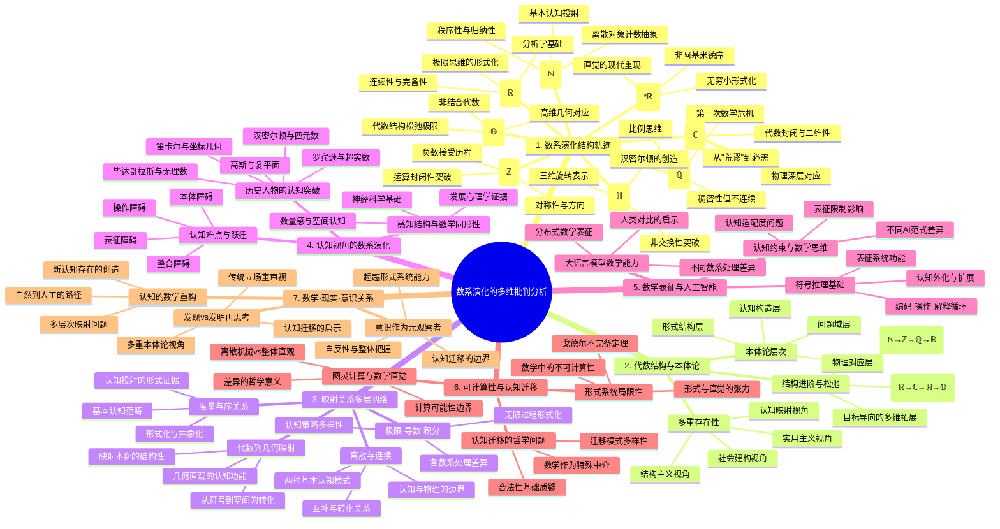

# 数系演化的多维批判性分析：从结构到认知、从本体到计算

## 目录

- [数系演化的多维批判性分析：从结构到认知、从本体到计算](#数系演化的多维批判性分析从结构到认知从本体到计算)
  - [目录](#目录)
  - [引言：数系·认知·存在](#引言数系认知存在)
  - [1. 数系演化的结构轨迹：从计数到超越](#1-数系演化的结构轨迹从计数到超越)
    - [1.1 自然数 (ℕ)：计数与秩序的初始构造](#11-自然数-ℕ计数与秩序的初始构造)
    - [1.2 整数 (ℤ)：对称性与逆运算的扩展](#12-整数-ℤ对称性与逆运算的扩展)
    - [1.3 有理数 (ℚ)：比例思维与可除性的突破](#13-有理数-ℚ比例思维与可除性的突破)
    - [1.4 实数 (ℝ)：连续性思维的极限构造](#14-实数-ℝ连续性思维的极限构造)
    - [1.5 复数 (ℂ)：代数封闭域与二维平面的统一](#15-复数-ℂ代数封闭域与二维平面的统一)
    - [1.6 四元数 (ℍ)：三维旋转与非交换性的出现](#16-四元数-ℍ三维旋转与非交换性的出现)
    - [1.7 八元数 (𝕆)：代数结构松弛与高维几何](#17-八元数-𝕆代数结构松弛与高维几何)
    - [1.8 超实数 (\*ℝ)：无穷小思维的形式化](#18-超实数-ℝ无穷小思维的形式化)
  - [2. 代数结构与本体论关系：数系存在的多重身份](#2-代数结构与本体论关系数系存在的多重身份)
    - [2.1 代数结构的进阶与松弛](#21-代数结构的进阶与松弛)
    - [2.2 本体论视角的层次分析](#22-本体论视角的层次分析)
    - [2.3 结构·实在·工具：数系的多重存在性](#23-结构实在工具数系的多重存在性)
    - [2.4 映射关系的多层网络：观念·结构·空间](#24-映射关系的多层网络观念结构空间)
    - [2.4.1 离散与连续：两种思维模式的映射与张力](#241-离散与连续两种思维模式的映射与张力)
  - [3. 映射关系的多层网络：观念·结构·空间](#3-映射关系的多层网络观念结构空间)
    - [3.1 离散与连续：两种思维模式的映射与张力](#31-离散与连续两种思维模式的映射与张力)
    - [3.2 极限·导数·积分：无限过程的形式化](#32-极限导数积分无限过程的形式化)
    - [3.3 代数结构到几何空间的映射网络](#33-代数结构到几何空间的映射网络)
    - [3.4 度量空间与序关系：认知结构的数学映射](#34-度量空间与序关系认知结构的数学映射)
  - [4. 认知视角的数系演化：思维如何塑造数学](#4-认知视角的数系演化思维如何塑造数学)
    - [4.1 感知结构与数学抽象的同形性](#41-感知结构与数学抽象的同形性)
    - [4.2 历史人物的认知突破与局限](#42-历史人物的认知突破与局限)
    - [4.3 数系建构中的认知难点与跃迁](#43-数系建构中的认知难点与跃迁)
  - [5. 数系作为认知表征系统：从人类思维到人工智能](#5-数系作为认知表征系统从人类思维到人工智能)
    - [5.1 数学表征与符号推理：认知计算的基础](#51-数学表征与符号推理认知计算的基础)
    - [5.2 大语言模型中的数学表征能力](#52-大语言模型中的数学表征能力)
    - [5.3 人工智能的认知约束与数学思维](#53-人工智能的认知约束与数学思维)
  - [6. 可计算性的哲学边界：图灵模型到认知迁移](#6-可计算性的哲学边界图灵模型到认知迁移)
    - [6.1 图灵计算与数学直觉的差异](#61-图灵计算与数学直觉的差异)
    - [6.2 形式系统的完备性与局限性](#62-形式系统的完备性与局限性)
    - [6.3 认知迁移的数学基础与哲学问题](#63-认知迁移的数学基础与哲学问题)
  - [7. 数学、现实与意识的三重关系](#7-数学现实与意识的三重关系)
    - [7.1 数学是发现还是发明：本体论的再思考](#71-数学是发现还是发明本体论的再思考)
    - [7.2 意识作为元观察者：超越数学形式系统](#72-意识作为元观察者超越数学形式系统)
    - [7.3 认知的数学重构：从自然到人工](#73-认知的数学重构从自然到人工)
  - [8. 多种表征方式](#8-多种表征方式)
    - [8.1 数系演化的多维比较表](#81-数系演化的多维比较表)
    - [8.2 数系·结构·空间·认知关系图](#82-数系结构空间认知关系图)
    - [8.3 思维导图：数系演化的多维网络](#83-思维导图数系演化的多维网络)
  - [9. 批判性反思与开放结论](#9-批判性反思与开放结论)
    - [9.1 数学客观性的幻象与现实](#91-数学客观性的幻象与现实)
    - [9.2 认知迁移的合法性问题](#92-认知迁移的合法性问题)
    - [9.3 开放性结论：持续演化的数学思维](#93-开放性结论持续演化的数学思维)

## 引言：数系·认知·存在

数系的演化历程不仅是数学内部结构的逐步扩展与完善，更是人类认知能力、思维方式与存在理解的外在映射。本文将从多重维度重新审视数系从自然数到八元数、超实数的发展轨迹，探索其中蕴含的代数结构、几何意义、认知模式和本体论问题，进而延伸至人工智能和认知迁移的哲学思考。

与传统分析不同，本文不采用辩证法的正反合框架，而是建立多层次的映射网络，揭示数系演化背后的认知结构、本体地位与形式关系。我们将看到，数系不仅是描述世界的工具，也是人类思维方式的结晶；不仅是形式系统中的抽象结构，也是认知转化为计算的桥梁；不仅是数学内部的发展，也是人类意识理解自身与世界关系的反思途径。

在这个多维批判分析中，我们将特别关注从结构到认知、从本体到计算的转化关系，探讨数学如何既作为客观规律的发现，又作为主观思维的创造，并在当代计算技术与人工智能背景下获得新的存在维度。

## 1. 数系演化的结构轨迹：从计数到超越

### 1.1 自然数 (ℕ)：计数与秩序的初始构造

自然数是所有数系的起点，其本质是对**离散对象集合**的计数与排序抽象。

**本质特征：**

- **离散性**：自然数以单位1的累加构成，体现了分立、可数的基本直觉
- **秩序性**：自然数集合具有明确的前后序关系，是人类最早的序关系形式化
- **归纳性**：皮亚诺公理中的归纳公理捕捉了自然数的本质递进结构

**代数结构：**

- 构成**半群**：在加法运算下封闭，满足结合律
- 构成**幺半群**：加法的单位元为0（如果包含0在自然数中）
- 构成**良序集**：任何非空子集都有最小元素

**本体论地位：**

- 柏拉图主义认为自然数客观存在于理念世界
- 直觉主义（如布劳威尔）视其为思维最基本的直觉构造
- 形式主义（如希尔伯特）则将其视为无解释符号系统的基本元素

**历史视角：**
古代各文明对自然数的认识呈现出惊人的普遍性，暗示了其可能源于人类共有的认知结构。婴儿研究表明，基本的数量感是与生俱来的，但精确的计数则需文化与语言的支持。

**关键反思：**
自然数看似简单，却包含了潜在的无穷概念（可无限延展），这一特性成为后续数学危机的伏笔。在直觉上看似最"自然"的数系，实则已包含了高度抽象——我们计数"5个苹果"和"5个想法"，抽象出纯粹的"5"，这一过程本身就是一次认知跃迁。

### 1.2 整数 (ℤ)：对称性与逆运算的扩展

整数的引入标志着人类数学思维从具体计数转向抽象运算结构的关键一步。

**本质特征：**

- **对称性**：围绕0点展开的正负对称结构
- **完备加法**：加法运算下的封闭与可逆性
- **方向性**：从纯量扩展为带方向的量

**代数结构：**

- 构成**交换环**：加法成群，乘法满足分配律
- 构成**整环**：无零因子（若ab=0，则a=0或b=0）
- 构成**序环**：保持全序关系

**认知突破：**
整数的出现需要人类思维突破"物理存在"的限制。负数最初在中国古代算筹计算中用不同颜色表示，在欧洲直到17世纪仍被一些数学家视为"荒谬"或"虚构"。笛卡尔将数与几何线段关联，为负数提供了方向性解释，是认知映射的重要案例。

**本体论转变：**
整数表征了数学对象从"物理事物的计数"到"抽象运算结构"的本体论转变。数学家开始关注数系的内部结构与运算性质，而非其对物理世界的直接对应。

**历史分岔点：**
不同文明对负数的接受程度各异。中国、印度较早接受负数（如九章算术、婆罗摩笈多的著作），而欧洲直到近代才完全接受。这揭示了数学发展中文化因素的影响，以及直觉与形式之间的张力。

### 1.3 有理数 (ℚ)：比例思维与可除性的突破

有理数的引入是为了解决除法不封闭的问题，同时反映了人类对比例关系的深刻理解。

**本质特征：**

- **比例性**：表达两个整数的比值关系
- **稠密性**：在任意两个不同的有理数之间还存在无穷多个有理数
- **可度量性**：可用于精确测量可公度量

**代数结构：**

- 构成**域**：加法与乘法都构成交换群（除了0外）
- 构成**有序域**：保持序关系，且与四则运算兼容
- 构成**度量空间**：可定义距离函数

**认知拓展：**
有理数反映了人类从离散计数到连续测量的思维拓展。古希腊数学中的"比例论"（在欧几里得《原本》第五卷）是早期对比例关系的系统处理，展现了抽象关系思维的成熟。

**第一次数学危机：**
毕达哥拉斯学派发现不可公度量（如正方形对角线与边长的比值√2不能表示为有理数），引发了古希腊数学的第一次基础危机，动摇了"万物皆数（有理数）"的信念。这是数学历史上概念扩展的关键节点，也是认知限制与数学突破的典型案例。

**实践与理论的辩证：**
有理数的发展体现了实践需求（测量、商业计算）与理论探索（比例论、不可公度量）的互动。巴比伦人早已使用近似的分数计算，但希腊人将其上升为严格的比例理论，展示了不同认知层次的数学处理。

### 1.4 实数 (ℝ)：连续性思维的极限构造

实数的引入弥合了有理数系统中的"空洞"，是数学史上最重要的概念突破之一。

**本质特征：**

- **连续性**：填补有理数线上的所有"空洞"，形成无间隙的连续统
- **完备性**：任何有上界的非空子集都有最小上界（确界原理）
- **极限存在性**：任何柯西序列都收敛于实数系内的某点

**代数与拓扑结构：**

- 构成**完备有序域**：数学上唯一的（同构意义下）完备有序域
- **拓扑完备性**：作为度量空间是完备的，任何柯西序列都收敛
- **连续统势**：基数为ℵ₁，严格大于可数集合

**构造方法与认知路径：**

- **戴德金分割**：将有理数集分为两个集合A和B，使得A中所有元素小于B中所有元素，且A无最大元素
- **柯西序列**：通过收敛的有理数序列来定义实数，体现了"极限过程"的思维
- **公理化方法**：直接通过完备有序域公理定义，反映了形式化思维

**历史与哲学意义：**
实数概念经历了从欧多克索斯的比例论，到牛顿-莱布尼茨时期的模糊使用，再到19世纪柯西、魏尔斯特拉斯、戴德金、康托尔的严格化过程。这一演变反映了数学从直观思维到严格形式化的历史转向，也展现了不同哲学观点的碰撞——柏拉图式的"发现"实数还是形式主义的"构造"实数？

**认知挑战与突破：**
实数的概念统一了离散与连续、有限与无限的思维。人类必须超越直观经验，运用纯粹的理性推理来把握实数的本质。实数的完备性使得微积分成为可能，但其严格理解直到19世纪才实现，这种滞后揭示了直觉先行、严格化后至的认知模式。

### 1.5 复数 (ℂ)：代数封闭域与二维平面的统一

复数的引入开启了数学从一维思维到多维思维的转变，其发展过程是数学概念从"荒谬"到"不可或缺"的典型范例。

**本质特征：**

- **代数封闭性**：任何复系数多项式方程都有解（代数基本定理）
- **二维性**：形如a+bi的数构成二维平面，实部和虚部分别对应两个维度
- **几何解释**：可表示为平面向量，其模长和辐角有明确的几何意义
- **欧拉公式**：e^(iθ) = cosθ + isinθ，连接了指数、三角函数与复数

**代数与几何结构：**

- 构成**代数闭域**：在代数上完备，无需进一步扩展即可解决所有多项式方程
- **二维向量空间**：复数可视为二维实向量空间，复数乘法对应旋转和缩放
- **不可序化**：不存在与代数运算兼容的全序关系
- **共形映射**：复变函数保持角度，是共形几何的基础

**历史演变与认知转变：**
从16世纪卡尔达诺与邦贝利解三次方程时引入"虚数"，到18世纪欧拉的系统运用，再到19世纪高斯、阿贡、韦塞尔的几何解释，复数经历了从"不可能的数"到具有几何意义的数学对象的转变。这一过程展现了数学概念如何通过不同表征方式（代数、几何）获得意义和合法性。

**应用拓展与本体地位：**
复数在电气工程、量子力学、信号处理等领域的广泛应用，使其从纯粹的数学构造转变为描述物理现实的必要工具。这种应用有效性改变了复数的本体论地位，从"虚构"成为某种意义上的"实在"，体现了实用主义对数学本体论的影响。

**认知挑战：**
复数要求思维超越一维数轴的限制，理解"虚部"这一在日常经验中没有直接对应物的概念。复数乘法的几何解释（旋转与缩放）是克服这一认知障碍的关键，展示了几何表征对抽象概念理解的重要性。

### 1.6 四元数 (ℍ)：三维旋转与非交换性的出现

四元数标志着代数结构开始松弛，交换律的放弃换来了对三维空间旋转的优雅描述。

**本质特征：**

- **四维代数结构**：形如a+bi+cj+dk，其中i²=j²=k²=ijk=-1
- **非交换性**：乘法不满足交换律，如ij=k但ji=-k
- **三维旋转表示**：可表示三维空间中的旋转，避免万向节死锁问题

**代数结构特性：**

- 构成**斜域**：除了交换律外，满足域的所有性质
- **结合代数**：乘法满足结合律
- **赋范代数**：具有范数，满足|ab|=|a||b|

**认知与历史意义：**
1843年，汉密尔顿在都柏林的皇家运河桥上突然领悟了四元数的构造，将其刻在桥上的故事成为数学史上著名的顿悟案例。汉密尔顿寻找了13年的"三元数"无果，最终放弃交换律后才发现四元数，这一过程揭示了如何通过放松结构限制来实现概念突破。

**本体论与应用扩展：**
四元数最初被视为纯数学构造，一度被边缘化，但在计算机图形学、控制理论、信号处理中描述三维旋转时的优势（避免万向节死锁，计算效率高）使其在现代重获重要地位。这种实用价值的"迟到认可"揭示了数学概念有时需要等待适当的应用场景才能显现其价值。

**认知挑战与突破：**
四元数要求放弃交换律这一在之前数系中视为理所当然的性质，同时需要在四维空间中进行思考。这种认知挑战使四元数成为数学教育中的难点，也反映了人类思维对高维空间和非交换结构的适应能力。

### 1.7 八元数 (𝕆)：代数结构松弛与高维几何

八元数通过进一步放松代数结构（放弃结合律），构建了八维代数系统，展示了高维代数与几何的特殊性质。

**本质特征：**

- **八维代数结构**：由1和7个虚基底e₁到e₇组成
- **非结合性**：乘法不满足结合律，如(e₁e₂)e₃≠e₁(e₂e₃)
- **可选代数**：虽然不满足结合律，但满足较弱的可选性质

**代数结构特性：**

- 构成**非结合代数**：放弃了结合律
- 构成**交错代数**：与李代数相关
- 具有**泛性质**：在某些类别中具有普遍性质

**历史与数学意义：**
1843年，约翰·格雷夫斯首先构造了八元数，后由阿瑟·凯利进一步发展。八元数的出现标志着从"寻常"数系到特殊代数结构的转变，代表了对传统代数法则的更大程度突破，并揭示了8维空间的特殊性质。

**维度跨越与代数结构：**
八元数的结构与维度8的特殊性相关，这与弦论中需要10维（9空间+1时间）和物理学中某些对称性有潜在联系。霍普夫纤维化将八元数与四维球面联系起来，显示了高维拓扑结构的特殊性。

**存在意义与认知挑战：**
八元数被视为更多数学构造的意义在于揭示数学结构间的联系，而非直接应用。它要求数学家完全放弃日常直觉和低维空间思维，纯粹在抽象代数结构中操作，代表了数学抽象能力的极致展现。

### 1.8 超实数 (*ℝ)：无穷小思维的形式化

超实数的引入实现了莱布尼茨无穷小原始直觉的现代严格化，为非标准分析提供了基础。

**本质特征：**

- **包含无穷小与无穷大**：存在非零但小于任何正实数的数（无穷小），以及大于任何实数的数（无穷大）
- **非阿基米德性**：不满足阿基米德公理，存在无限大和无限小的元素
- **转移原理**：任何一阶逻辑表述的实数性质也适用于超实数

**代数与序结构：**

- 构成**有序域**：保持序关系，且序与运算兼容
- **非阿基米德域**：包含无穷小和无穷大元素
- **非标准模型**：实数理论的非标准模型

**历史演变与认知意义：**
从莱布尼茨对无穷小量的直观使用，到被批评为"已消失量的鬼魂"（贝克莱），再到20世纪60年代罗宾逊通过模型论严格构造超实数，体现了数学思想如何在严格化过程中保留并重新验证直观。

**构造方法与哲学意涵：**
超实数通过超积方法构造，依赖于选择公理和非主超滤子的存在，这种依赖于强公理的构造方式引发了关于其本体论地位的争论——它们是发现的数学实体还是依赖特定形式系统的人工构造？

**认知跨越与思维扩展：**
超实数要求接受"实际无穷小"的存在，这与传统极限思维（无穷小作为过程而非实体）形成对比。它们使"无穷小"从操作概念转变为实体概念，代表了对"无限"概念的不同思维方式。

## 2. 代数结构与本体论关系：数系存在的多重身份

### 2.1 代数结构的进阶与松弛

数系的代数结构从自然数到八元数呈现出一种辩证关系：结构的进阶（增加性质）与结构的松弛（放弃性质）。

**结构进阶路径：**

- **自然数**（加法半群）→ **整数**（交换环）→ **有理数**（有序域）→ **实数**（完备有序域）

在这一路径上，每一步都通过添加新元素和性质来克服前一数系的局限，使代数结构更加完善。这反映了数学寻求封闭性、完备性和对称性的内在驱动。

**结构松弛路径：**

- **实数**（完备有序域）→ **复数**（代数闭域，但失去可序性）→ **四元数**（斜域，失去交换律）→ **八元数**（非结合代数，失去结合律）

在这一路径上，为了获得特定性质（如代数封闭性或表示高维旋转），数学家不得不放弃某些"理想"性质。这种"以退为进"的思维模式展示了数学灵活性与创造性。

**关键批判视角：**

- 代数结构的进阶和松弛不应被视为线性"进步"，而是不同数学目标导向的多维度拓展
- 不同代数结构间存在基本的不可通约性，它们解决的是不同类型的问题
- 数学史显示，特定代数结构的重要性随着应用领域变化而波动（如四元数在计算机图形学兴起后重获关注）

**本体论映射：**
代数结构的选择反映了人类认知对不同问题域的适应。实数适合测量连续量，复数适合处理波动和旋转，四元数适合三维旋转。这种"适合性"暗示了数学结构与物理世界的某种深层对应，但这种对应的本质仍是哲学争议的焦点。

### 2.2 本体论视角的层次分析

从本体论角度看，数系的存在模式可分为多个层次，每个层次对应不同的哲学立场。

**物理对应层：**

- **自然数**：对应物理世界中的离散对象集合
- **整数**：对应物理量的正负方向
- **有理数**：对应可公度物理量的比值
- **实数**：对应连续物理量（如长度、时间）
- **复数**：在量子力学中获得物理解释（波函数）

这一层次上，数系被视为对物理世界的抽象和描述，其存在基于与物理实在的对应关系。

**形式结构层：**
在这一层次，数系被视为纯粹的形式结构，其存在不依赖于物理对应，而是基于内部一致性和形式规则。各数系在这一层面上平等存在，区别仅在于它们的形式特性。

**认知构造层：**
数系被视为人类认知活动的产物，其存在基于人类思维方式和认知限制。例如，自然数对应计数能力，实数对应连续感知，复数对应平面思维。

**问题域层：**
数系作为解决特定问题域的工具而存在。实数解决测量问题，复数解决无实根方程问题，四元数解决三维旋转表示问题。在这一视角下，数系的存在是功能性和工具性的。

**批判性观察：**

- 这些层次并非互斥，而是相互渗透和影响
- 同一数系在不同层次上可能有不同的本体论地位
- 对特定数系的偏好常受历史和文化因素影响，并不完全客观

### 2.3 结构·实在·工具：数系的多重存在性

传统哲学常将数学本体论简化为柏拉图主义（数学发现论）与构造主义（数学发明论）的二元对立，但数系的多重存在性表明，这种简化无法捕捉数学本体论的复杂性。

**结构主义视角：**
从结构主义看，数系的本质是它们所体现的关系结构。德杜金德曾说："人造了整数，其余的是上帝的工作"，强调了定义基本结构后，其衍生特性具有客观必然性。

**实用主义视角：**
从实用主义看，数系的存在基于其解决问题的能力。复数最初被视为"不可能的数"，但其在电气工程和量子力学中的应用价值改变了其本体论地位，体现了实用效果对本体认可的影响。

**社会建构视角：**
数系的发展也受社会和历史因素影响。不同文化对负数的接受度差异，以及20世纪形式主义运动对数学基础的重构，都显示了数学概念的社会建构面向。

**认知映射视角：**
数系可被视为人类认知模式与外部世界之间的映射关系。例如，自然数映射计数能力，有理数映射比例感知，实数映射连续感知，复数映射平面几何直觉。

**批判性综合：**
上述视角的交织表明，数系不是单一存在模式的产物，而是多重存在性的体现。它们既有客观结构属性，又有主观构造成分；既对应物理实在，又超越直接经验；既是发现的客体，又是发明的工具。这种多重本体性使得数系成为连接不同认知领域的桥梁。

### 2.4 映射关系的多层网络：观念·结构·空间

### 2.4.1 离散与连续：两种思维模式的映射与张力

离散性和连续性是两种基本的认知模式，它们在数系中的体现形成了持续的概念张力。

**离散思维的数学映射：**

- **自然数**：最纯粹的离散结构，以单位1的累加构成
- **整数**：保持离散性，但增加对称性
- **有理数**：虽可表达为比值，但仍是离散的（可数集）
- **计算机实现**：计算机中的数值计算本质上是离散的（浮点数近似）

**连续思维的数学映射：**

- **实数**：数学上严格的连续统，填补有理数的"空洞"
- **复数平面**：二维连续平面
- **微积分**：以连续变化为基础的数学分析
- **物理建模**：经典物理中的时空连续性

**离散-连续的认知张力：**
这两种思维模式在数学史上持续相互作用和转化：

- 古希腊人通过几何（连续）解决了无理数（离散失效）的问题
- 微积分利用极限过程（连续）处理无穷小变化
- 现代计算通过离散近似模拟连续过程
- 量子理论暗示深层物理可能是离散的，而非连续的

**批判反思：**
离散与连续的二元对立可能是人类认知结构的产物，而非物理实在的本质区分。不同

## 3. 映射关系的多层网络：观念·结构·空间

### 3.1 离散与连续：两种思维模式的映射与张力

**批判反思：**
离散与连续的二元对立可能是人类认知结构的产物，而非物理实在的本质区分。不同数系以不同方式调和这一张力：

- 有理数：作为离散的数（分数）试图逼近连续量
- 实数：用完备化（连续性公理）形式化地"填补"离散结构的缝隙
- 超实数：引入无穷小，在形式上创建"比任何实数都小"但非零的量

**认知学视角：**
认知科学研究表明，人类同时具有近似连续的模拟表征能力和精确离散的符号表征能力。数系的发展可视为这两种认知系统互动的产物：

- 感知系统提供连续的空间和量的直觉
- 语言系统提供离散的计数和符号操作能力
- 数学则在这两种系统的边界处创造出各种中介结构

**现代综合视角：**
现代数学通过各种结构建立离散与连续的桥梁：

- 测度论将离散计数推广到连续空间
- 傅里叶分析将连续函数分解为离散谐波
- 计算复杂性理论研究连续问题的离散近似
- 量子计算跨越经典计算的离散限制

这种持续的映射与转化表明，离散-连续的对立可能是认知的不同层次，而非不可调和的本体论鸿沟。

### 3.2 极限·导数·积分：无限过程的形式化

微积分的核心概念——极限、导数和积分——是人类尝试用有限手段把握无限过程的卓越案例，它们在不同数系中获得了不同的表达形式。

**极限概念的认知映射：**

- **直觉层面**：对"无限接近"的原始感知
- **ε-δ形式化**：魏尔斯特拉斯将模糊直觉转化为精确定义
- **拓扑表述**：开集和邻域系统化极限概念
- **超实数表述**：通过无穷小代数化极限过程

**各数系对无限过程的处理：**

- **有理数**：通过柯西列逼近无理数，但无法"达到"极限
- **实数**：极限过程的"完成态"，通过完备性保证极限存在
- **复数**：在复平面上的极限过程引入新的路径概念
- **超实数**：将无限过程"代数化"，如将导数定义为 st((f(x+ε)-f(x))/ε)

**认知挑战与突破：**
无限过程的理解是数学认知的关键障碍：

- 古代人通过悖论表达无限的困境（芝诺悖论）
- 莱布尼茨与牛顿的直觉先行，形式后至
- 柯西、魏尔斯特拉斯等人的严格化，使直觉服从形式
- 非标准分析让直觉与形式重新协调

**批判视角：**
关于无限的不同数学处理反映了不同的认知策略：

- **实数进路**：通过完备性公理"消除"无限过程
- **超实数进路**：通过新数对象"实体化"无限过程
- **构造主义进路**：拒绝完成态的无限，坚持可构造性

这些不同策略各有优劣，无一能完全消除无限概念的认知张力，表明数学中的无限概念本质上是认知构造，而非简单的发现。

### 3.3 代数结构到几何空间的映射网络

数系的发展历程中，代数结构与几何空间之间形成了复杂而深刻的映射网络，这种映射既是数学内部的桥梁，也是认知理解的关键路径。

**基本映射关系：**

- **实数 ↔ 一维线**：笛卡尔建立数与线段的对应
- **复数 ↔ 二维平面**：高斯、韦塞尔等人的复平面表示
- **四元数 ↔ 四维空间及三维旋转**：四元数的几何解释
- **八元数 ↔ 八维空间及特殊几何对象**：与例外李群的联系

**映射的认知功能：**
这些映射不仅是数学结构间的联系，更是认知理解的工具：

- 几何视觉化使抽象代数结构可感知
- 代数形式化使几何直观可运算
- 相互转化创造了新的理解维度

**重要历史案例：**

- **笛卡尔几何**：建立数与几何的系统性对应，开创分析几何
- **黎曼几何**：将微积分拓展到曲面，为广义相对论奠基
- **克莱因"埃尔朗根纲领"**：通过变换群研究几何，统一欧氏与非欧几何
- **庞加莱猜想证明**：利用几何流方法解决拓扑问题

**深层关联性：**
代数-几何映射揭示了数学结构间的惊人统一性：

- **欧拉公式**：e^(iπ) + 1 = 0 联结了代数、分析、几何的基本常数
- **丘-高斯-博内定理**：联系复变函数的积分与几何
- **霍奇理论**：连接拓扑性质与代数结构
- **朗兰兹纲领**：建立数论与几何的深层对应

**批判反思：**
代数与几何的互映并非单纯的数学技巧，而是揭示了认知系统中不同表征方式（符号与空间）的互补性。这种互补性暗示，数学知识的本质可能不在于特定表征，而在于表征间的映射关系本身。

### 3.4 度量空间与序关系：认知结构的数学映射

度量与序是人类最基本的认知范畴，它们在数系中的形式化反映了认知结构与数学结构的深层对应。

**度量概念的演化：**

- **自然数**：离散计数作为最初的"度量"
- **有理数**：比值关系的精确度量
- **实数**：连续量的完备度量
- **复数**：保持度量但失去序
- **超实数**：包含无穷小的非标准度量

**序关系的数学表达：**

- **自然数**：最自然的全序结构
- **整数与有理数**：扩展全序关系
- **实数**：完备序关系
- **复数**：本质上不可序
- **超实数**：非阿基米德序（含无穷大小比较）

**认知基础的映射：**
数学中的度量与序关系映射了人类基本认知能力：

- 判断"大小"（序）是认知的基本功能
- 估计"距离"（度量）是空间感知的核心
- 无需训练的婴儿已具备基本数量和序关系感知

**认知结构的形式化：**
数学将认知直觉形式化为严格结构：

- **序公理**：将"大小"直觉转化为形式关系
- **度量公理**：将"距离"感知转化为抽象函数
- **拓扑公理**：将"接近"概念抽象化

**批判性观察：**
度量与序关系在数学中的形式化过程表明：

- 数学结构部分源于人类认知架构的投射
- 形式化过程往往超越并修正原始直觉
- 某些数学结构（如复数的不可序性）挑战了认知直觉
- 度量与序的形式分离（拓扑学）是认知抽象的高级成就

这种认知结构与数学形式的对应关系，为理解数学知识的主观性与客观性提供了新视角：数学既反映认知结构（主观性），又通过形式化超越直觉限制（客观性）。

## 4. 认知视角的数系演化：思维如何塑造数学

### 4.1 感知结构与数学抽象的同形性

人类基本感知结构与数系的抽象性质之间存在着惊人的同形关系，这种对应暗示了数学抽象可能源于感知系统的投射与扩展。

**基本感知模式与数学映射：**

- **物体辨识 → 自然数**：离散对象计数
- **方向感知 → 整数**：正负方向区分
- **比例感知 → 有理数**：比值关系
- **连续感知 → 实数**：无间隙连续统
- **空间想象 → 复数/四元数**：平面与空间变换

**发展心理学的支持证据：**

- 婴儿研究显示，数量感是与生俱来的（如区分2个和3个物体）
- 空间认知发展先于形式逻辑（皮亚杰理论）
- 文化普遍性表明某些数学直觉是人类共有的

**神经科学视角：**

- 顶叶皮层的数量敏感神经元反应支持"数感"的生物基础
- 空间处理与数量处理共享神经网络
- 抽象思维利用感知运动系统的神经结构（概念隐喻理论）

**批判性分析：**
感知结构与数学同形性提示：

- 数学抽象部分是感知能力的外推和形式化
- "纯粹"数学可能仍受限于人类认知架构
- 不同数系对应不同认知能力的形式化
- 数学困难（如复数理解）可能源于缺乏直接感知对应

这种视角挑战了数学柏拉图主义，暗示数学结构可能不是独立于人类心智的客观实在，而是人类认知能力的投射与系统化。然而，这也解释了为何数学能如此有效地描述自然界——两者都受限于相同的认知结构。

### 4.2 历史人物的认知突破与局限

考察数系发展历史中的关键人物，他们的认知突破与局限生动展示了数学创新的认知维度。

**自然数到整数：**

- **印度数学家婆罗摩笈多(Brahmagupta, 598-668)**首次系统处理负数，突破了"数量必为正"的直觉限制
- **欧洲数学家直到文艺复兴时期仍拒绝负数**，卡尔达诺称之为"虚构的数"
- 认知障碍：如何理解"少于无"的数量？

**无理数的认知危机：**

- **毕达哥拉斯学派**发现√2不可表示为比值，引发第一次数学危机
- **欧多克索斯(Eudoxus, 约前408-355)**开发比例理论，绕过了无理数概念
- 希腊人选择几何而非算术处理无理量，反映了认知模式的转换

**复数的认知演变：**

- **卡尔达诺(Cardano, 1501-1576)**在解三次方程时遇到"无意义"的复数
- **欧拉(Euler, 1707-1783)**将虚数融入分析，但仍称之为"虚构"
- **高斯(Gauss, 1777-1855)**提供几何解释，使复数获得"市民权"
- 认知转变：从"无意义符号"到"几何实体"再到"物理必需"

**四元数的创造突破：**

- **汉密尔顿(Hamilton, 1805-1865)**寻找三维数系失败，灵光一现发现四维四元数
- 认知突破：放弃交换律这一根深蒂固的数学直觉
- 理解障碍：四维结构超出直观空间想象

**超实数的形式化：**

- **莱布尼茨(Leibniz, 1646-1716)**使用无穷小但未能严格定义
- **罗宾逊(Robinson, 1918-1974)**运用现代逻辑创建非标准分析
- 认知挑战：将"过程"概念转变为"对象"概念

**批判性反思：**

- 数学创新往往发生在突破认知限制的瞬间
- 数学家的直觉先行，严格化后至（如莱布尼茨→魏尔斯特拉斯→罗宾逊）
- 新概念的接受需要多种认知路径（代数、几何、应用）
- 数学发展中存在文化差异（如东方对负数的早期接受）

历史人物的认知挣扎表明，数学创新不仅是逻辑推演，更是认知模式的转换与拓展。数学家突破已有思维框架的能力，可能比纯粹的逻辑能力更为关键。

### 4.3 数系建构中的认知难点与跃迁

数系扩展过程中出现的认知难点和随后的认知跃迁，揭示了数学思维的深层运作机制。

**基本认知障碍类型：**

- **本体障碍**：接受新数系的"存在性"（如负数、虚数"不存在"）
- **操作障碍**：掌握新数系的运算规则（如四元数的非交换乘法）
- **表征障碍**：建立有效的心理表征（如想象四维空间）
- **整合障碍**：将新概念与已有知识整合（如超实数与标准分析的关系）

**认知跃迁的关键机制：**

- **类比映射**：通过已知领域理解未知概念（如复数→平面点）
- **形式与直观互补**：形式严格化与直观理解相互支持
- **多重表征**：建立同一概念的不同表征方式（代数、几何、应用）
- **概念隐喻**：利用基本经验隐喻理解抽象概念（如数线、复平面）

**具体案例分析：**

- **负数接受过程**：从"荒谬"到"有用工具"到"自然概念"
  - 认知障碍：如何理解"少于无"？
  - 突破点：将数理解为方向性量，而非纯计数
  - 教学启示：引入具体情境（温度、借贷）促进理解

- **复数理解进程**：从"虚构数"到"二维数"
  - 认知障碍：平方为负的数"不可能存在"
  - 突破点：几何解释提供直观把握
  - 教学启示：几何表征先于形式操作

- **超实数学习挑战**：
  - 认知障碍：无穷小既非零又小于任何正实数的矛盾性
  - 突破点：形式定义与直观类比（显微镜隐喻）结合
  - 教学启示：先建立直观，再介绍严格构造

**批判性视角：**
数学教育研究表明，学生在学习数系扩展时经历的认知困难往往重演了历史上的认知障碍。这种"个体发生重演种系发生"现象暗示：

- 数学概念发展可能受制于普遍的认知机制
- 抽象数学依赖于基本认知能力的延伸
- 数学理解的关键是认知表征的转换与整合
- 数学教育应重视概念的多重表征和历史发展路径

这种认知视角使我们重新审视数学本质：数学概念不仅是客观真理的发现，也是认知结构不断拓展和重组的产物。

## 5. 数系作为认知表征系统：从人类思维到人工智能

### 5.1 数学表征与符号推理：认知计算的基础

数学表征系统，特别是数系及其运算规则，构成了人类认知计算能力的核心，也是现代人工智能的理论基础。

**表征系统的基本功能：**

- **编码**：将现实问题转化为形式符号
- **操作**：通过符号变换进行推理
- **解释**：将形式结果映射回问题域

**数系作为认知表征的优势：**

- **精确性**：无歧义的形式定义
- **一致性**：内部逻辑自洽
- **效率性**：简化复杂关系的表达
- **泛化性**：适用于多种问题领域

**历史发展视角：**

- 早期计算系统（如算筹）即是认知表征的物理化
- 代数符号系统（如笛卡尔创立）使抽象推理更高效
- 微积分创立了处理连续变化的表征系统
- 现代数理逻辑将推理本身形式化

**认知科学视角：**

- 人类擅长创建和操作表征系统（表征和重表征能力）
- 数学表征使思维外化，克服工作记忆限制
- 符号系统充当"认知脚手架"，扩展思维能力
- 不同表征系统激活不同认知资源（空间、语言、逻辑）

**批判性反思：**
数学表征既增强又限制了认知：

- 增强：扩展抽象思维，实现复杂推理
- 限制：表征系统本身携带隐含假设和偏见
- 数系从一开始就是人机混合认知系统（符号+大脑）
- 不同数系反映不同认知需求与能力

数系作为表征系统，不仅是思考的工具，更塑造了思维方式本身。不同数系的认知"亲和力"各异：自然数符合直觉计数，实数反映连续感知，复数需要空间想象。这种认知亲和性差异，对人工智能系统处理不同数学领域的能力有深远影响。

### 5.2 大语言模型中的数学表征能力

现代大语言模型（如GPT系列）处理数学的能力，为我们提供了观察人工系统如何表征数系的独特窗口，并揭示了数学认知的新维度。

**语言模型的数学表征特点：**

- **分布式表征**：数学概念编码为高维向量空间中的区域
- **统计关联**：基于语料共现统计学习数学关系
- **连续表征**：使用连续值向量表示离散符号
- **上下文敏感**：数学表达的含义依赖于上下文

**数系理解的差异：**
大语言模型在处理不同数系时表现出显著差异：

- **自然数**：计算准确性高，符合统计学习预期
- **分数**：概念理解好，但精确计算能力有限
- **实数**：理解连续性，但在精确表示无理数方面有局限
- **复数**：理解形式规则，但空间直觉较弱
- **高级数系**：对四元数等理解有限，反映训练数据稀疏性

**与人类认知的对比：**

- 人类依赖多感官经验和空间直觉
- 语言模型依赖符号统计关联
- 人类善于精确操作小数量，但大数估计差
- 语言模型善于处理概念关系，但精确计算需专门训练

**认知架构差异：**

- **表征方式**：人类使用多模态表征；语言模型使用纯文本投射
- **操作机制**：人类结合规则和直觉；语言模型通过隐式统计学习
- **学习路径**：人类从具体到抽象；语言模型同时接触多层抽象
- **错误模式**：人类错误通常有模式；模型错误可能看似随机

**批判性思考：**
大语言模型的数学能力反映了一个根本问题：数学是否需要"理解"才能操作？模型通过纯统计学习获得的数学能力，挑战了数学需要"真正理解"的假设。然而，模型在处理需要多步推理或概念创新的数学问题时的局限性，又暗示了符号操作与真正理解之间的差距。

这种人工系统与人类数学认知的对比，为我们提供了重新思考数学本质的角度：数学可能既是符号游戏（形式主义视角），又是概念理解（意义主义视角），两者在不同任务中的重要性各异。

### 5.3 人工智能的认知约束与数学思维

人工智能系统处理数学的方式，揭示了认知架构如何影响数学思维的形成，同时也展示了数学本身的认知适应性。

**认知架构的约束作用：**

- **表征限制**：系统如何内部表示数学对象（符号、向量等）
- **计算约束**：系统能执行哪些操作和推理
- **学习机制**：系统如何获取和组织数学知识
- **交互界面**：系统如何接收输入和表达输出

**不同AI范式的数学思维：**

- **符号主义AI**：精确规则处理，类似公理演绎
- **连接主义AI**：模式识别与统计关联，类似直觉思维
- **混合架构**：结合规则与模式，接近人类数学思维

**数学领域的认知适配度：**
不同数系和数学分支与不同AI架构的适配度各异：

- **计算数论**：规则明确，符号系统擅长
- **几何直观**：需要空间表征，神经网络较适合
- **分析证明**：需要策略性思考，混合系统更优
- **抽象代数**：需要符号操作与结构识别能力

**未来趋势与挑战：**

- **多模态表征**：整合语言、视觉、符号的数学表征
- **神经-符号整合**：结合神经网络与形式推理
- **交互式证明**：AI与人类协作证明数学定理
- **元数学理解**：系统能够反思自身的数学推理

**批判性思考：**
AI系统处理数学的方式提示我们：

- 数学思维可能不是单一能力，而是多种认知能力的组合
- 不同数学领域可能依赖不同的认知能力组合
- 形式规则与直觉模式识别在数学中相互补充
- 数学创造力可能需要在不同表征系统间灵活转换

AI系统的数学能力发展过程，可视为一面镜子，反映了数学知识的认知结构。通过观察AI如何学习数学，我们不仅了解机器学习的局限，也更深入理解了人类数学思维的本质——它是规则与直觉、符号与意义、形式与内容的复杂交织。

## 6. 可计算性的哲学边界：图灵模型到认知迁移

### 6.1 图灵计算与数学直觉的差异

图灵机模型作为计算的理论基础，与人类数学直觉之间存在着根本性差异，这一差异揭示了数学认知的复杂本质。

**图灵计算的基本特性：**

- **离散性**：基于离散状态转换
- **确定性**：给定输入和状态唯一决定下一步
- **机械性**：按预设规则执行，无需"理解"
- **有限表示**：用有限符号表达算法

**人类数学直觉的特点：**

- **整体性**：能够把握整体结构而非仅局部
- **类比性**：通过领域间映射理解新概念
- **模糊性**：容忍不精确，利用模糊直觉
- **多模态**：综合视觉、空间、语言等多种表征

**关键差异的案例：**

- **几何直觉**：人类易于把握拓扑关系，而图灵计算需要繁琐编码
- **模式识别**：人类擅长识别数学模式，计算机需要明确算法
- **隐喻理解**：人类利用经验隐喻理解抽象概念（如无穷小如"微粒"）
- **概念创新**：人类能创造新数学概念，而图灵计算局限于预设规则

**哲学层面的对立：**

- **形式主义**：数学本质是符号操作（接近图灵模型）
- **直觉主义**：数学本质是心智构造（接近人类直觉）
- **柏拉图主义**：数学对象客观存在（超越两者）

**批判性思考：**
图灵计算与人类直觉的差异暗示：

- 数学可能不完全可还原为机械计算
- 数学"理解"可能超越纯形式处理
- 数学创造性可能源于非算法性思维
- 认知的某些方面可能本质上不可计算

这一差异引发深刻问题：如果数学直觉包含不可计算成分，那么它如何能被完全模拟或转移到计算系统中？这触及了认知迁移的哲学边界。

### 6.2 形式系统的完备性与局限性

戈德尔不完备定理为形式系统（包括数系的公理化表述）设置了内在限制，这一限制对认知迁移和数学智能有深远影响。

**形式系统的基本特征：**

- **语法明确**：严格定义的符号与规则
- **语义中立**：规则操作不依赖符号意义
- **机械可检验**：证明可机械地验证

**戈德尔定理的核心洞见：**

- **第一不完备定理**：任何包含基本算术的一致的形式系统都存在不可证明也不可否证的命题
- **第二不完备定理**：这类系统无法在系统内证明自身的一致性

**对数系形式化的影响：**

- 自然数的皮亚诺公理系统不完备
- 实数的形式化不能完全捕捉其直观性质
- 超实数的非标准模型多样性反映了形式化局限

**认知与形式的张力：**

- 人类数学认知超越特定形式系统
- 数学直觉常指向形式系统无法完全捕捉的性质
- 形式化总有"剩余"—非形式化的直观内容

**批判性视角：**
戈德尔定理暗示：

- 数学思维可能本质上不可完全形式化
- 任何形式系统都可能需要外部视角的补充
- 数学"理解"可能包含超越形式系统的成分
- 认知迁移面临根本性限制—形式化无法完全传递数学直觉

这些局限性不仅是技术障碍，更是哲学挑战，它们质问了我们对数学本质和认知可计算性的基本假设。如果数学思维包含原则上不可形式化的成分，那么人工智能能否真正"理解"数学就成为一个开放问题。

### 6.3 认知迁移的数学基础与哲学问题

将人类数学认知迁移到人工系统的过程，既是技术挑战，也是深刻的哲学问题，它涉及数学的本质、意识的角色和认知的可形式化程度。

**认知迁移的基本模式：**

- **符号迁移**：转移形式规则和符号操作
- **结构迁移**：转移概念间的关系网络
- **过程迁移**：转移推理和问题解决策略
- **隐喻迁移**：转移基础经验模型和隐喻

**数学作为中介的独特性：**
数学在认知迁移中扮演特殊角色：

- 最适合形式化的人类知识领域
- 具有内在一致性和逻辑结构
- 相对独立于感知经验
- 具有跨领域应用能力

**迁移限制与哲学分歧：**
关于认知迁移限制的不同立场：

- **强人工智能论**：认知完全可形式化，迁移无原则障碍
- **弱人工智能论**：系统可模拟认知行为，但缺乏真理解
- **意识必要论**：数学理解需要主观体验和意识
- **身体认知论**：抽象数学根植于身体经验，不可完全分离

**迁移合法性的批判问题：**

- **本体论问题**：人工系统中的数学对象是什么？
- **认识论问题**：机器是否真正"理解"或仅是操作符号？
- **伦理问题**：将人类认知能力转移给机器的正当性基础是什么？
- **责任问题**：数学错误由谁承担—程序员、系统还是使用者？

**批判性反思：**
认知迁移的核心悖论在于：我们试图将不完全理解的人类认知过程，转移到我们创造但同样不完全理解的系统中。这种"双重不确定性"使得认知迁移既是科学探索，也是哲学反思。

数学作为最形式化的人类知识，似乎是认知迁移的理想候选，但数学思维的某些方面（如直觉、创造力、意义理解）可能恰恰是最难迁移的。这一悖论提示我们：认知迁移可能不是简单的"复制粘贴"过程，而是创造一种新的认知形式，既与人类认知相关，又有本质区别。

## 7. 数学、现实与意识的三重关系

### 7.1 数学是发现还是发明：本体论的再思考

数学本体论的古老问题——数学是发现还是发明——在认知迁移背景下获得了新的维度和复杂性。

**传统本体论立场的重新审视：**

- **柏拉图主义**：数学对象独立存在，被人类发现
  - 优势：解释数学的客观性和必然性
  - 挑战：如何解释人造系统能"发现"预先存在的实体？
  
- **形式主义**：数学是符号游戏，无需外部对应物
  - 优势：符合计算模型的形式操作观
  - 挑战：难以解释数学的"不合理的有效性"
  
- **构造主义**：数学对象由心智构造而非发现
  - 优势：符合认知科学的心智模型
  - 挑战：如何解释不同文化的数学收敛性？

**认知迁移引发的新问题：**

- 如果数学是发现，机器是否能独立"发现"同样的数学？
- 如果数学是发明，机器产生的新数学结构是谁的发明？
- 当机器推导出人类未知的数学结果时，这是发现还是创造？

**多重本体论的综合视角：**
不同数系可能有不同的本体论地位：

- **自然数**：可能最接近"发现"，反映基本认知结构
- **实数**：混合了发现与发明，基于连续性直觉但形式化多样
- **复数**：开始时是"发明"（解方程工具），后成为"发现"（物理必需）
- **超实数**：高度依赖特定形式系统，偏向"发明"

**批判性综合：**
数学本体论可能需要超越二元对立，认识到：

- 数学既有客观性（不受人类意志控制），又有主观构造性（依赖认知结构）
- 数学既反映物理实在（有效描述自然），又超越经验（创造抽象结构）
- 数学概念在历史中经历从"发明"到"发现"的本体论地位转变

**认知迁移的本体论启示：**
人工智能的数学能力提示：

- 数学可能是认知结构与外部实在相互作用的产物
- 不同认知架构（人类、AI）可能产生相容但不同的数学
- 数学的"客观性"可能源于认知约束而非独立实在
- 认知迁移本身可能创造了数学的新存在维度

这种复杂的本体论视角解释了为何数学既像是"发现"（因其惊人的一致性），又像是"发明"（因其依赖特定认知架构）。认知迁移创造了测试这些哲学立场的新场域，挑战我们重新思考数学存在的本质。

### 7.2 意识作为元观察者：超越数学形式系统

意识在数学认知中扮演的角色，特别是作为"元观察者"超越形式系统的能力，对理解数学本质和认知迁移边界至关重要。

**意识在数学认知中的核心功能：**

- **自反性**：能够反思自己的数学推理过程
- **整体把握**：能够同时关注局部细节和全局结构
- **意义赋予**：为形式符号赋予语义内容
- **跨域联结**：在不同数学领域间建立联系

**形式系统的根本限制：**

- 戈德尔定理：形式系统不能证明自身一致性
- 塔尔斯基定理：真理不能在系统内部完全定义
- 图灵停机问题：计算的自我指涉限制

**意识超越形式系统的机制：**

- 能够"跳出"特定形式系统，采取元视角
- 能够直觉把握无法形式化的数学性质
- 能够创造新形式系统或修改现有系统
- 能够理解形式无法捕捉的语义内容

**认知迁移的悖论与边界：**

- 如何将本质上能超越形式系统的能力，转移到基于形式系统的机器中？
- 自我意识是否为真正数学理解的必要条件？
- 机器能否发展出类似的"元观察"能力？

**批判性思考：**
意识的元观察能力暗示：

- 完整的数学认知可能不可约为任何单一形式系统
- 认知迁移面临的不仅是技术挑战，更是原则性限制
- 数学"理解"可能包含无法算法化的成分
- 不同形式系统间的转换可能需要系统外的视角

这一视角挑战了将完整数学认知迁移到人工系统的可能性，同时也启发我们探索：是否可能创造具有某种"元认知"能力的人工系统，使其能够部分实现跨越形式系统限制的功能？

### 7.3 认知的数学重构：从自然到人工

认知迁移过程实质上是一种"认知的数学重构"，这一过程揭示了数学、自然认知与人工认知之间的复杂关系。

**认知重构的基本路径：**

- **数学化**：将人类直觉转化为形式系统
- **算法化**：将数学化的认知转化为计算过程
- **实现化**：将算法嵌入具体计算架构
- **应用化**：使人工系统在实际问题上运行

**数学作为中介的双重角色：**

- 作为被重构的对象（数学认知本身）
- 作为重构的工具（用于形式化其他认知）

**认知重构的多层次映射：**

- **结构映射**：保留认知的组织结构
- **功能映射**：复制认知的功能输出
- **过程映射**：模拟认知的内部过程
- **经验映射**：捕捉认知的主观体验（最具挑战性）

**从自然到人工的认知转化悖论：**

- 人类用自身不完全理解的数学来形式化自身不完全理解的认知
- 人工系统可能发展出与人类不同但功能等效的数学认知
- 人工认知的数学能力可能既少于又多于人类（不同维度上）

**批判性问题：**
认知的数学重构引发深刻问题：

- "法"的本质是什么？什么使这种认知转化"合法"？
- 重构过程中不可避免的信息损失如何影响认知质量？
- 重构后的认知是模拟、复制还是全新创造？
- 人类意识在审视自己创造的数学智能时，处于什么位置？

这种重构过程实质上创造了一种新的认知存在方式，它既源于人类认知，又遵循自身的数学逻辑。这既是技术实践，也是本体论创新——我们不仅在应用数学，更在创造认知的新存在形式。

## 8. 多种表征方式

### 8.1 数系演化的多维比较表

| 数系 | 基本定义 | 代数结构 | 几何表征 | 序性质 | 完备性 | 认知挑战 | 历史里程碑 | 本体论地位 | 典型应用 |
|------|----------|----------|----------|----------|----------|----------|----------|----------|----------|
| **自然数 (ℕ)** | 计数的基本单位 | 加法半群 | 离散点集 | 良序集 | 不完备 | 无穷概念 | 各文明独立发现 | 最接近"发现" | 计数、排序 |
| **整数 (ℤ)** | 包含负数的扩展 | 交换环 | 数轴上点 | 全序 | 不完备 | 负数概念 | 印度数学发展 | 方向性抽象 | 相对量、方向 |
| **有理数 (ℚ)** | 两整数的比值 | 有序域 | 数轴稠密子集 | 全序 | 不完备 | 无限小数 | 毕达哥拉斯危机 | 比例关系 | 度量、比例 |
| **实数 (ℝ)** | 连续数轴上的点 | 完备有序域 | 连续数轴 | 全序 | 完备 | 连续性 | 19世纪严格化 | 混合发现/发明 | 物理量、极限 |
| **复数 (ℂ)** | 形如a+bi的数 | 代数闭域 | 二维平面 | 不可序 | 柯西完备 | 虚数单位 | 欧拉、高斯工作 | 从工具到必需 | 交流电、量子力学 |
| **四元数 (ℍ)** | 形如a+bi+cj+dk | 斜域(非交换) | 四维空间/三维旋转 | 不可序 | 柯西完备 | 非交换性 | 汉密尔顿发现 | 高度抽象构造 | 3D旋转、计算机图形 |
| **八元数 (𝕆)** | 八维代数系统 | 非结合代数 | 八维空间 | 不可序 | 特殊完备性 | 非结合性 | 格雷夫斯、凯利发展 | 纯数学构造 | 特殊几何、物理理论 |
| **超实数 (*ℝ)** | 包含无穷小/大的扩展 | 非阿基米德域 | 扩展实数轴 | 非阿基米德序 | 不完备 | 无穷小概念 | 罗宾逊非标准分析 | 形式系统依赖 | 非标准分析、极限理论 |

### 8.2 数系·结构·空间·认知关系图

```text
                       ┌──────────┐
                       │  数  系  │
                       └────┬─────┘
                            │
       ┌────────────────────┼────────────────────┐
       │                    │                    │
┌──────▼─────┐      ┌──────▼─────┐      ┌──────▼─────┐
│  代数结构  │       │  空间表征  │       │  认知结构  │
└──────┬─────┘      └──────┬─────┘      └──────┬─────┘
       │                   │                    │
       │                   │                    │
┌──────▼─────┐      ┌──────▼─────┐      ┌──────▼─────┐
│            │      │            │      │            │
│  进阶路径   │      │  维度映射   │      │  表征模式  │
│  ℕ→ℤ→ℚ→ℝ  │      │  1D→2D→4D  │      │感性→知性→理性│
│            │      │            │      │            │
└──────┬─────┘      └──────┬─────┘      └──────┬─────┘
       │                   │                    │
       │                   │                    │
┌──────▼─────┐      ┌──────▼─────┐      ┌──────▼─────┐
│            │      │            │      │            │
│  松弛路径   │      │  结构映射   │      │  认知障碍  │
│  ℝ→ℂ→ℍ→𝕆  │      │代数↔几何↔物理│      │概念跃迁点  │
│            │      │            │      │            │
└──────┬─────┘      └──────┬─────┘      └──────┬─────┘
       │                   │                    │
       │                   │                    │
       └────────────┬──────┘                    │
                    │                           │
              ┌─────▼────┐             ┌────────▼───────┐
              │          │             │                │
              │  应用域   │             │  认知迁移边界  │
              │          │             │                │
              └─────┬────┘             └────────────────┘
                    │
                    │
              ┌─────▼────┐
              │          │
              │ AI系统中 │
              │的数学表征│
              │          │
              └──────────┘
```

### 8.3 思维导图：数系演化的多维网络



## 9. 批判性反思与开放结论

### 9.1 数学客观性的幻象与现实

数学被广泛视为最"客观"的知识领域，但这种客观性的性质和来源在数系演化的视角下需要批判性重审。

**客观性幻象的来源：**

- **形式一致性**：不同人运用相同规则得到相同结果
- **文化普遍性**：基本数学在不同文化中有惊人相似性
- **应用有效性**：数学在描述物理世界时表现出"不合理的有效性"
- **独立发现**：相似的数学结构被独立发现（如牛顿、莱布尼茨的微积分）

**客观性幻象的批判：**

- **认知约束**：数学"普遍性"可能反映人类认知结构的共性，而非独立客观实在
- **选择性报告**：历史上失败的数学探索往往不被记录，造成成功的错觉
- **社会建构**：数学概念和实践深受社会历史环境影响
- **语言影响**：数学符号系统影响思维方式和发现可能性

**更微妙的客观性观念：**
数系演化历程表明，数学客观性可能既非绝对，又非纯粹主观：

- **条件性客观**：在特定公理和规则下的必然结果
- **结构性客观**：反映结构关系而非独立存在的对象
- **交互性客观**：源于认知结构与外部世界的互动
- **实践性客观**：在数学实践社区中形成的共识

**批判性思考：**

- 数学客观性可能来自认知投射而非独立实在
- 不同数系反映不同程度和类型的"客观性"
- 数学"真理"或许更接近"有效表征"而非"实在对应"
- AI系统可能发展出不同但功能等效的数学，挑战唯一客观性假设

这种客观性的重新概念化并不削弱数学的价值，反而揭示了其更丰富的本质
——数学可能是人类智慧与现实世界的独特交汇点，
既反映认知结构，又超越个体主观性，创造了一种特殊的"间主观"知识形式。

### 9.2 认知迁移的合法性问题

将数学认知能力从人类迁移到人工系统，不仅是技术问题，更涉及深刻的哲学合法性问题
——这种迁移基于什么"法"？

**合法性的多重维度：**

- **逻辑合法性**：认知迁移在逻辑上是否可能？
- **实践合法性**：人工系统是否能有效执行数学任务？
- **认识合法性**：系统是否能真正"理解"数学？
- **伦理合法性**：我们是否应该创造具有数学认知的人工系统？

**"法"的多重意义：**
"法"可从多角度理解，每种理解提供不同的合法性基础：

- **自然法则**：物理和认知规律是否允许认知转移？
- **形式规则**：数学形式系统本身的规范性
- **实用规范**：基于实际效果的功能性标准
- **社会认可**：科学和社会对认知迁移的接受度

**认知迁移的深层悖论：**

- 我们试图转移未完全理解的能力（人类数学思维）
- 使用有内在限制的工具（形式系统）
- 创造本质可能不同的系统（人工智能）
- 由具有特定认知局限的主体（人类）评判结果

**批判性问题：**

- 如果数学认知包含不可形式化成分，认知迁移是否有原则性限制？
- "理解"的标准是什么？功能等效性还是体验相似性？
- 我们是在创造真正的数学认知，还是其功能模拟？
- 人类意识在评判数学认知迁移时处于什么位置？

这些问题没有简单答案，但批判性思考它们有助于我们更深入理解数学认知的本质和人工智能的边界。
认知迁移的合法性问题揭示了一个根本悖论：我们无法确定地判断自己未完全理解的能力是否已被成功迁移。

### 9.3 开放性结论：持续演化的数学思维

本分析不提供封闭的结论，而是强调数学思维的开放性和持续演化特征，这既适用于数系本身，也适用于我们对数学的理解。

**数系演化的开放性：**

- 数系发展并非终止于已知系统
- 新的数学需求可能催生新数系
- 现有数系的新解释和应用不断涌现
- 跨数系的结构关系持续被发掘

**认知理解的演进性：**

- 对数系的理解随认知科学进展而深化
- 数学哲学观点在历史中不断重构
- 计算技术的发展改变数学实践和理解
- AI系统可能提供全新的数学认知视角

**多维思考的必要性：**

- 单一视角不足以把握数系的复杂本质
- 结构、认知、历史和哲学维度相互补充
- 对立观点（发现/发明、形式/直觉）可能都捕捉了部分真相
- 跨学科视角（数学、认知科学、计算机科学、哲学）提供更全面理解

**面向未来的开放问题：**

- 数学认知的神经基础如何影响数学结构？
- 不同认知架构（人类、AI）会发展出不同但兼容的数学吗？
- 量子计算等新计算范式将如何重塑数学思维？
- 意识在数学理解中的角色能否被形式化？

**批判性立场：**

- 拒绝简化的二元对立（客观/主观、发现/发明）
- 承认数学知识的多层次性和动态演化
- 保持对确定性主张的怀疑态度
- 鼓励不同理论视角的对话与融合

这种开放性结论并非回避明确立场，而是认识到数学思维本身的复杂性要求我们保持思想的开放性。
数系的多维批判性分析不是为了达到最终答案，而是提供更丰富的思考框架，帮助我们在持续演化的数学宇宙中导航。

数学既是人类认知的产物，又超越个体认知；
既根植于物理实在，又飞越经验限制；既是发现又是发明。
这种张力不是有待解决的矛盾，而是数学本质的组成部分。
对数系的理解，最终或许不在于找到唯一正确的视角，而在于欣赏和运用这种多重性本身。
