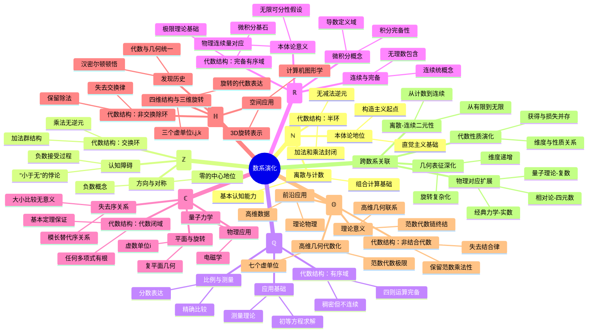

# 数系的演化与本质：从自然数到八元数的哲学与数学分析

## 目录

- [数系的演化与本质：从自然数到八元数的哲学与数学分析](#数系的演化与本质从自然数到八元数的哲学与数学分析)
  - [目录](#目录)
  - [引言：数的本质探索](#引言数的本质探索)
  - [1. 数系演化的历史视角与驱动力](#1-数系演化的历史视角与驱动力)
    - [1.1 历史进程概述](#11-历史进程概述)
    - [1.2 演化的驱动力](#12-演化的驱动力)
  - [2. 自然数与整数：从计数到方向](#2-自然数与整数从计数到方向)
    - [2.1 自然数 (ℕ)：离散实体的抽象](#21-自然数-ℕ离散实体的抽象)
    - [2.2 整数 (ℤ)：引入方向与对称性](#22-整数-ℤ引入方向与对称性)
  - [3. 有理数与实数：从比例到连续](#3-有理数与实数从比例到连续)
    - [3.1 有理数 (ℚ)：比例的形式化](#31-有理数-ℚ比例的形式化)
    - [3.2 实数 (ℝ)：连续性的严格化](#32-实数-ℝ连续性的严格化)
  - [4. 复数与高维数系：从平面到高维空间](#4-复数与高维数系从平面到高维空间)
    - [4.1 复数 (ℂ)：二维平面的代数表达](#41-复数-ℂ二维平面的代数表达)
    - [4.2 四元数 (ℍ)：旋转与三维空间](#42-四元数-ℍ旋转与三维空间)
    - [4.3 八元数 (𝕆)：高维几何的代数化](#43-八元数-𝕆高维几何的代数化)
  - [5. 代数结构递进与性质损失](#5-代数结构递进与性质损失)
    - [5.1 代数结构演化图谱](#51-代数结构演化图谱)
    - [5.2 性质保持与损失的分析](#52-性质保持与损失的分析)
  - [6. 本体论的对应关系与认识论挑战](#6-本体论的对应关系与认识论挑战)
    - [6.1 本体论地位的演变](#61-本体论地位的演变)
    - [6.2 认识论障碍与突破](#62-认识论障碍与突破)
  - [7. 映射关联性分析：数学概念的联系网络](#7-映射关联性分析数学概念的联系网络)
    - [7.1 离散与连续](#71-离散与连续)
    - [7.2 极限、导数与积分](#72-极限导数与积分)
    - [7.3 维度与代数性质](#73-维度与代数性质)
  - [8. 空间几何的意义与物理对应](#8-空间几何的意义与物理对应)
    - [8.1 几何直观与数系维度](#81-几何直观与数系维度)
    - [8.2 物理世界的数学建模](#82-物理世界的数学建模)
  - [9. 科学法则的数学表达与数系选择](#9-科学法则的数学表达与数系选择)
    - [9.1 物理规律与适用数系](#91-物理规律与适用数系)
    - [9.2 计算科学中的数系应用](#92-计算科学中的数系应用)
  - [10. 多种表征方式](#10-多种表征方式)
    - [10.1 数系比较表](#101-数系比较表)
    - [10.2 数系结构与维度关系图](#102-数系结构与维度关系图)
    - [10.3 性质损失与维度增加图](#103-性质损失与维度增加图)
    - [10.4 思维导图：数系演化全景](#104-思维导图数系演化全景)
  - [结论：数系演化的整体图景](#结论数系演化的整体图景)

## 引言：数的本质探索

数，作为人类最早的抽象概念之一，其演化过程蕴含着深刻的数学思想和哲学内涵。
从最初用于计数的自然数，到描述复杂物理现象的高维数系，每一次数系的扩展都是人类思维向抽象深处的一次探索。
本文将从哲学与数学的双重视角，重新审视从自然数到八元数的演化历程，关注每一次扩展背后的内在驱动力、代数结构变化和认知挑战，揭示数学抽象与物理世界之间的映射关系。

这一分析不会诉诸简单的"正反合"叙事，而是致力于展现数系演化的多维复杂性：
一方面，每次扩展都有明确的数学问题驱动；
另一方面，扩展过程中既有性质的保持，也有性质的损失，反映了人类思维在构建抽象系统时所做的深思熟虑的权衡。
通过这种批判性的哲学分析，我们可以更深入地理解数系不仅是抽象的符号系统，更是人类理解世界、描述现象的认知工具。

## 1. 数系演化的历史视角与驱动力

### 1.1 历史进程概述

数系的发展历程反映了人类数学思维的渐进深化，每一步都有其历史必然性：

- **自然数**：大约公元前4000年前便已出现，最初源于计数需求，是最基本的抽象。
- **整数**：从债务、亏损等实际问题中产生，古巴比伦和中国古代数学都有使用，但作为形式系统的确立则到了16-17世纪。
- **有理数**：起源于测量和比例概念，早在古埃及和巴比伦就已使用分数。毕达哥拉斯学派曾认为"万物皆数"，这里的"数"指有理数。
- **实数**：无理数的发现（如√2）引发了古希腊的"第一次数学危机"。实数的严格定义则是19世纪才由戴德金、康托尔等人完成的工作。
- **复数**：虚数单位i最初在16世纪出现于三次方程求解，但当时被视为"不可能"或"虚构"。直到19世纪高斯等人提供了几何解释，复数才获得普遍接受。
- **四元数**：1843年由威廉·罗文·汉密尔顿(William Rowan Hamilton)发现，是他寻找三维空间旋转代数表示的结果。
- **八元数**：1845年由约翰·格雷夫斯(John Graves)和亚瑟·凯利(Arthur Cayley)独立发现，是对四元数的进一步推广。

### 1.2 演化的驱动力

数系演化受到多种因素的驱动，而非简单的单线发展：

- **内部数学问题**：解决特定方程（如x+1=0、2x=1、x²+1=0）的需求是基本驱动力。
- **外部实际应用**：测量、物理描述和工程需求不断推动数系扩展。
- **抽象思维扩展**：数学家对结构和模式的纯粹探索也是重要动力。
- **认知障碍突破**：每次数系扩展都伴随着认知障碍的突破，如接受"负数"、"无理数"、"虚数"的合法性。

值得注意的是，数系演化并非单纯的线性扩展过程，也不是简单的"从矛盾到新的统一"。
实际上，它体现了**问题驱动、性质权衡、结构保持与突破**的复杂互动。
例如，从实数到复数的扩展获得了代数闭性，却牺牲了可序性；
而从复数到四元数的扩展保留了范数性质，却失去了交换律。

## 2. 自然数与整数：从计数到方向

### 2.1 自然数 (ℕ)：离散实体的抽象

**概念本质**：自然数是对离散、可计量实体的首次抽象，从具体的"三头牛"、"五个人"中提取出纯粹的"三"和"五"的概念。

**数学结构**：

- **代数性质**：构成半环(semiring)，具有加法和乘法运算，但不具备减法的封闭性
- **序结构**：良序集(well-ordered set)，任何非空子集都有最小元素
- **递归定义**：通过皮亚诺公理严格定义（从0/1开始，通过后继操作生成所有自然数）

**本体论地位**：

- **直觉主义视角**：自然数具有基础的构造性，是数学直觉的起点
- **形式主义视角**：是形式系统中的基本符号和规则
- **物理对应**：与物理世界中的离散实体有最直接的对应关系

**认知基础**：

- 实验表明，计数能力部分地是人类和某些动物的先天能力
- 小数量的"抽象数"感知能力可能是进化形成的
- 大数量的处理则依赖于文化和符号系统的发展

### 2.2 整数 (ℤ)：引入方向与对称性

**概念本质**：整数通过引入负数，将数的概念从"量"扩展到具有"方向"的量，增加了对称性的基本概念。

**数学结构**：

- **代数性质**：构成交换环(commutative ring)，具备加法、减法和乘法的封闭性，但不具备除法的封闭性
- **序结构**：全序集(totally ordered set)，具有完全的比较性
- **构造方法**：通过等价类(a,b)～(c,d)当且仅当a+d=b+c，整数n表示为等价类[(n,0)]或[(0,-n)]

**关键突破**：

- **零的概念化**：将"无"抽象为数学对象，是概念史上的重大突破
- **对称性引入**：加法运算获得了逆元，形成了对称结构
- **债务表示**：负数最初用于表示债务、亏损等实际问题

**认知障碍**：

- 负数曾被认为是"荒谬的"，"小于无"的概念在直觉上难以接受
- 欧洲数学直到16世纪才开始普遍接受负数
- 中国和印度的数学传统更早接受了负数概念

## 3. 有理数与实数：从比例到连续

### 3.1 有理数 (ℚ)：比例的形式化

**概念本质**：有理数代表了比例关系的形式化，使得"一半"、"三分之二"等概念可以精确表达和运算。

**数学结构**：

- **代数性质**：构成域(field)，具备四则运算的完全封闭性
- **序结构**：全序域(ordered field)，保持了整数的序关系
- **稠密性**：在任意两个不同的有理数之间总存在另一个有理数
- **构造方法**：通过整数对的等价类m/n，其中n≠0，等价关系为a/b～c/d当且仅当ad=bc

**应用拓展**：

- **测量理论**：使精确的测量和比例计算成为可能
- **概率表达**：为概率理论提供了数学语言
- **方程求解**：解决了许多线性方程和部分多项式方程

**本体论质疑**：

- 毕达哥拉斯学派的"万物皆数"信念暗示有理数足以描述世界
- √2的发现证明此信念有误，引发了古希腊的"数学危机"

### 3.2 实数 (ℝ)：连续性的严格化

**概念本质**：实数通过填补有理数的"空隙"，将连续性概念从直观提升为严格的数学对象。

**数学结构**：

- **代数性质**：保持域结构，但增加了完备性
- **拓扑性质**：连通、完备、可分，构成连续统(continuum)
- **构造方法**：
  - **戴德金分割**：将有理数集Q划分为两个集合A和B，使得A中所有元素小于B中所有元素
  - **柯西序列**：将实数定义为有理数柯西序列的等价类
  - **小数表示**：通过无限小数来表示，虽直观但数学上不够严格

**关键突破**：

- **无理数的合法化**：赋予√2、π、e等数学地位
- **连续性的严格化**：将直观的"连续"转化为可证明的数学性质
- **极限概念的奠基**：为微积分提供了严谨基础

**认知与哲学挑战**：

- **实际无穷**：接受无限过程的"完成态"
- **不可数性**：康托尔证明实数集是不可数的，远超有理数的"大小"
- **直觉与形式**：实数的直观连续性与其严格构造之间存在认知鸿沟

## 4. 复数与高维数系：从平面到高维空间

### 4.1 复数 (ℂ)：二维平面的代数表达

**概念本质**：复数通过引入虚数单位i(i²=-1)，将数的概念从一维线扩展到二维平面，实现了代数的完备性。

**数学结构**：

- **代数性质**：代数闭域(algebraically closed field)，任何多项式方程都有根
- **几何表示**：复平面(complex plane)，横轴表示实部，纵轴表示虚部
- **失去的性质**：不再是有序域，无法定义大小的全序关系
- **构造方法**：
  - **有序对**：将复数a+bi视为有序对(a,b)，定义相应的运算规则
  - **多项式商环**：ℂ≅ℝ[x]/(x²+1)，即在实系数多项式中将x²+1视为0

**历史突破**：

- **代数方程求解**：为三次方程和四次方程的求解提供了关键工具
- **几何解释**：高斯、阿根将复数与平面几何联系，大大提高了接受度
- **欧拉公式**：e^(iπ)+1=0，被称为"数学中最美的公式"

**应用革命**：

- **交流电分析**：使用复数（相量）极大简化了交流电路计算
- **傅里叶分析**：在信号处理中发挥核心作用
- **量子力学**：波函数本质上是复值函数，复数成为量子现象的语言

### 4.2 四元数 (ℍ)：旋转与三维空间

**概念本质**：四元数扩展了复数，引入三个虚单位i、j、k，创造了一个能够自然表达三维空间旋转的代数系统。

**数学结构**：

- **代数性质**：构成非交换除环(division ring)，保持了乘法逆元但失去了交换律
- **维度结构**：四维数系，表示为a+bi+cj+dk，其中i²=j²=k²=ijk=-1
- **失去的性质**：乘法交换律被替换为更复杂的关系：ij=k，jk=i，ki=j，ji=-k，kj=-i，ik=-j
- **构造方法**：可以将四元数视为有序四元组(a,b,c,d)或2×2复矩阵

**历史突破**：

- **汉密尔顿顿悟**：在都柏林的布鲁姆桥上突然领悟非交换性质
- **物理空间**：首次成功构建与三维物理空间自然对应的代数系统
- **代数与几何**：揭示了代数运算与空间变换之间的深刻联系

**应用价值**：

- **三维旋转**：比欧拉角更有效地表达旋转，避免了万向节锁问题
- **计算机图形学**：在3D动画、游戏和虚拟现实中广泛应用
- **物理描述**：在相对论和量子力学中有特殊应用

### 4.3 八元数 (𝕆)：高维几何的代数化

**概念本质**：八元数将四元数的概念推广到八维空间，创造了一个能够描述更高维几何的代数系统，但代价是牺牲了更多代数性质。

**数学结构**：

- **代数性质**：构成非结合代数(non-associative algebra)，既失去了交换律又失去了结合律，但仍保持范数的乘法性
- **维度结构**：八维数系，表示为a₀+a₁e₁+...+a₇e₇，其中e_i²=-1（i>0）
- **失去的性质**：乘法结合律(a(bc)≠(ab)c)，这是代数运算中的基本性质
- **构造方法**：可通过Cayley-Dickson构造从四元数获得

**理论意义**：

- **代数闭定理**：证明只有四类规范实除代数：实数、复数、四元数和八元数
- **特例性**：是最后一个保持范数乘法性(|xy|=|x||y|)的超复数系统
- **高维几何**：与特殊几何对象(如李群)有深刻联系

**应用探索**：

- **弦理论**：在某些统一理论中探索应用
- **信号处理**：高维数据处理的潜在工具
- **理论物理**：与基本粒子理论有特殊联系

## 5. 代数结构递进与性质损失

### 5.1 代数结构演化图谱

数系的演化反映了代数结构的层次加强与性质损失的辩证关系，呈现出以下递进模式：

**代数结构递进**：

- 自然数(ℕ)：**半环** (加法和乘法封闭，但无减法)
- 整数(ℤ)：**交换环** (加减乘封闭，无除法)
- 有理数(ℚ)：**有序域** (四则运算封闭，有全序关系)
- 实数(ℝ)：**完备有序域** (增加了完备性)
- 复数(ℂ)：**代数闭域** (任何多项式方程都有根)
- 四元数(ℍ)：**非交换除环** (失去交换律但保留除法)
- 八元数(𝕆)：**非结合代数** (失去结合律但保留范数乘法性)

这一递进表明，数系演化在获得新能力的同时，不断牺牲原有性质，形成了鲜明的**获得-损失模式**。

### 5.2 性质保持与损失的分析

**核心性质损失序列**：

1. **从ℕ到ℤ**：保持了加法交换律和结合律，但引入了负数，失去了自然序的"最小元"性质
2. **从ℤ到ℚ**：保持了环结构，但密度性质改变了序结构的离散特性
3. **从ℚ到ℝ**：保持了域结构和序关系，但变为不可数集，理论上无法穷举其元素
4. **从ℝ到ℂ**：获得代数闭性，但牺牲了可序性，无法比较大小
5. **从ℂ到ℍ**：保持了乘法逆元，但失去了交换律(ab≠ba)
6. **从ℍ到𝕆**：保持了范数乘法性，但失去了结合律(a(bc)≠(ab)c)

这种分析揭示了数学抽象化过程中的深刻哲学问题：扩展数系的同时必然伴随某些性质的损失，反映了数学思维在不同问题情境下的**权衡与选择**。这些损失并非缺陷，而是数学结构丰富化的必然过程，每种数系都在特定问题域中发挥其独特价值。

## 6. 本体论的对应关系与认识论挑战

### 6.1 本体论地位的演变

不同数系的本体论地位——即它们"存在"的方式和意义——随着数学和科学的发展经历了深刻变化：

**自然数与整数**：

- **实用主义起源**：源于计数和度量的实际需求
- **心理实在性**：在认知心理学中被视为人类思维的基本结构
- **形式主义视角**：在现代数学中被视为由公理系统定义的形式结构

**有理数与实数**：

- **测量实在性**：有理数对应实际测量的比例关系
- **连续统困境**：实数的连续性在直觉上对应物理连续性，但量子理论质疑了物理世界的连续本质
- **柏拉图主义与形式主义之争**：实数是独立存在的抽象实体，还是仅仅是形式系统的产物？

**复数与高维数系**：

- **工具到实体**：复数从"虚构工具"到"实体概念"的转变
- **物理对应性**：量子力学中波函数的复值性暗示复数可能具有物理基础
- **几何实在性**：四元数与三维空间旋转的自然对应赋予其几何实在性
- **理论构造**：八元数更多被视为纯粹的数学构造，物理对应性较弱

这种本体论地位的演变反映了数学对象从"直接对应物理实体"到"抽象关系的形式化"的哲学转向，揭示了数学本质的深刻问题：**数学是发现还是发明？**

### 6.2 认识论障碍与突破

每种新数系的引入都伴随着严重的认识论障碍，需要概念框架的根本突破：

**负数的认识障碍**：

- **"小于无"的悖论**：如何理解"比没有还少"的概念？
- **突破方式**：通过债务、方向等具体模型建立认知基础
- **历史过程**：从最初的拒绝到勉强接受，再到完全合法化

**无理数的认识障碍**：

- **毕达哥拉斯危机**：发现√2不能表示为有理数，动摇了"万物皆数"的信念
- **突破方式**：几何直观(线段长度)支持了无理数的接受
- **严格化进程**：从几何直观到19世纪的严格构造(戴德金分割)

**虚数的认识障碍**：

- **"不可能数"的排斥**：平方为负的数在实数框架中"不可能存在"
- **突破方式**：几何表示(复平面)提供了直观基础
- **物理应用**：在电学和量子力学中的成功应用极大增强了其合法性

**非交换性的认识障碍**：

- **基本直觉冲突**：代数运算"应该"遵循交换律的固有直觉
- **突破方式**：几何旋转提供了非交换性的直观模型
- **应用验证**：在描述物理旋转中的优越性

**非结合性的认识障碍**：

- **运算基本性质挑战**：结合律被视为代数运算的基本性质
- **突破方式**：通过特定代数系统的构造接受非结合性
- **理论必然性**：证明其作为范数代数的唯一性

这些认识论挑战的突破揭示了**数学认知发展的关键模式**：从拒绝到勉强接受，再到功能性接受，最终达到完全合法化。这一过程通常依赖于**几何模型的直观支持**和**应用领域的功能验证**。

## 7. 映射关联性分析：数学概念的联系网络

### 7.1 离散与连续

**离散-连续二元性**在数系演化中起着核心作用：

**自然数与整数**：

- 体现纯粹的**离散结构**，每个数与其邻居有明确间隔
- 可通过数轴表示，但数轴上的点是离散的
- 适合于计数、编号和组合问题

**有理数**：

- 形成**稠密但不连续**的结构
- 在任意两个有理数之间总有无穷多个有理数
- 虽然"看起来"连续，但存在"无理空隙"
- 适合于有限精度的测量和比例计算

**实数**：

- 实现了真正的**数学连续性**
- 通过填补所有"无理空隙"，形成完整连续统
- 为微积分和分析提供了基础
- 对应物理世界的连续量和连续变化

**复数及更高维数系**：

- 创造了**多维连续结构**
- 复数形成二维连续平面
- 四元数和八元数分别对应四维和八维连续空间
- 能够描述更复杂的几何和物理现象

这种离散-连续二元性的演化揭示了一个深刻观察：数学思维既能处理离散的、可计数的对象，也能把握连续的、流动的量，而数系的发展正是这两种认知能力不断融合与拓展的结果。

### 7.2 极限、导数与积分

不同数系与微积分核心概念之间存在深刻联系：

**极限概念**：

- **有理数域**：某些序列在有理数域内无极限（如定义π的序列）
- **实数域**：极限概念获得完备基础，任何柯西序列都收敛
- **复数域**：引入了复变函数的极限，包含方向性
- **高维数系**：允许在更高维空间中考虑极限行为

**导数概念**：

- **实数**：标量函数的导数描述了一维变化率
- **复数**：引入解析函数与柯西-黎曼方程，导数与共形映射关联
- **四元数**：允许对向量场和旋转进行直接微分
- **高维数系**：为高维分析提供了代数工具

**积分概念**：

- **实数**：定义了线积分，面积和体积计算
- **复数**：引入复积分，与解析函数理论关联
- **四元数**：为三维向量场的积分提供工具
- **八元数**：在高维分析中有特殊应用

**特殊联系**：复数使微积分的某些方面变得更简单。例如，实函数的某些积分可以通过引入复平面和留数定理更容易计算。这揭示了**数系扩展如何简化某些数学操作**的深刻现象。

### 7.3 维度与代数性质

数系的维度扩展与代数性质之间存在系统性关联：

**维度序列**：

- 实数：1维 → 复数：2维 → 四元数：4维 → 八元数：8维

**代数性质序列**：

- 实数：交换+结合+分配+可序
- 复数：交换+结合+分配+代数闭（失去可序）
- 四元数：结合+分配（失去交换）
- 八元数：分配（失去结合）

这一关联揭示了**维度翻倍与代数性质损失**之间的深刻联系。从代数学角度看，这反映了Frobenius定理（只有实数、复数和四元数是结合除代数）和Hurwitz定理（只有实数、复数、四元数和八元数保持范数乘法性）等重要结果。这种模式表明，数学空间的维度扩展必然伴随代数性质的变化，反映了代数与几何之间的深层联系。

## 8. 空间几何的意义与物理对应

### 8.1 几何直观与数系维度

不同数系为不同维度的几何空间提供了自然的代数表达：

**实数 (ℝ)**：

- 对应一维线性空间（数轴）
- 提供距离、顺序和度量概念
- 自然表达一维变化和线性运动

**复数 (ℂ)**：

- 对应二维欧氏平面
- 极坐标形式(re^(iθ))直接表达旋转和缩放
- 复乘法几何意义：旋转+缩放
- 应用：共形映射、保角变换

**四元数 (ℍ)**：

- 提供三维空间旋转的最优代数表示
- 单位四元数形成S³（三维球面），双覆盖SO(3)旋转群
- 避免了欧拉角的奇异性（万向节锁）
- 四元数插值实现平滑旋转

**八元数 (𝕆)**：

- 与高维几何和特殊李群关联
- 与奇异7维球面S⁷的代数结构相关
- 在高维旋转和特殊几何中有应用

这种对应关系揭示了**数系与空间几何**之间的深刻统一性，数系不仅是计算工具，更是空间结构的代数表达。

### 8.2 物理世界的数学建模

不同数系在物理理论中扮演着不同角色，反映了物理现象的本质特征：

**实数与经典物理**：

- 牛顿力学：位置、速度、加速度等物理量用实数表示
- 热力学：温度、熵、能量等宏观量的实数表达
- 连续介质：流体力学、弹性力学中的场用实值函数表示

**复数与波动现象**：

- 交流电：电压、电流用复数相量表示，简化分析
- 波动方程：复指数形式简化波的表达
- 量子力学：波函数本质上是复值函数，复数成为量子现象的自然语言

**四元数与空间旋转**：

- 刚体动力学：四元数表示旋转，避免奇异性
- 计算机视觉：三维空间中的相机姿态和运动表示
- 航空航天：飞行器姿态控制和导航系统

**高维数系与前沿理论**：

- 弦理论：高维数系用于描述额外维度和超对称性
- 粒子物理：与某些基本粒子分类系统相关
- 量子引力：在某些统一理论尝试中被探索

这种对应关系不仅体现了数学的"不可思议的有效性"，也揭示了物理现象本身可能具有的数学结构。例如，量子力学中复数的核心地位可能暗示了复数结构在微观世界的基础性，而不仅仅是计算工具。

更深层次地，数系与物理理论的对应反映了**人类认知模式与自然规律**之间的复杂互动：

- **简单性原则**：物理理论往往选择能够最简洁表达规律的数学结构
- **有效性悖论**：为什么抽象的数学结构能够如此有效地描述物理世界？
- **数学与物理的共演化**：物理问题推动数学发展，数学发现启发物理理解

这些问题触及数学哲学的核心，暗示数学结构可能不仅仅是人类的发明，也可能反映了物理世界的深层结构。

## 9. 科学法则的数学表达与数系选择

### 9.1 物理规律与适用数系

物理规律的数学表达往往依赖于特定数系的性质，表现出深刻的内在联系：

**经典力学与实数**：

- 牛顿第二定律(F=ma)：使用实数描述力、质量和加速度
- 能量守恒：利用实数的加法性质表达能量转化
- 变分原理：依赖实数连续性的极值原理

**电磁理论与复数**：

- 麦克斯韦方程组：可用复数形式简化表达
- 电磁波：复数表达使相位和振幅处理更优雅
- 阻抗分析：复平面上的阻抗表示简化了电路分析

**量子理论与复数**：

- 薛定谔方程：本质上是复值波函数的演化方程
- 量子叠加：复数使得相位叠加成为可能
- 不确定性原理：与复数的非可换性有深层联系

**相对论与四元数**：

- 闵可夫斯基时空：可用四元数表示时空事件
- 洛伦兹变换：某些表达形式中四元数提供简洁表达
- 广义相对论：虽然主要使用张量，但与高维数系有理论联系

**理论物理前沿与高维数系**：

- 超弦理论：高维数系用于某些超对称性表达
- 量子场论：与某些规范理论的代数结构相关
- 量子引力：在寻找统一理论中探索高维数系的作用

这种对应表明，物理规律的本质可能决定了其最自然的数学表达方式。例如，量子理论中的复数不仅是计算便利，更可能反映了量子现象的内在复数结构。

### 9.2 计算科学中的数系应用

不同数系在计算科学中的应用既有理论意义，也有实用价值：

**数值计算与实数近似**：

- 浮点数系统：计算机中实数的离散近似
- 数值误差分析：依赖于实数完备性理解舍入误差
- 科学计算：大多数工程和科学问题的基础

**信号处理与复数**：

- 傅里叶变换：复数表达使频域分析优雅简洁
- 数字滤波器：复数形式统一了滤波器设计
- 时频分析：复平面上的信号表达提供了直观理解

**计算机图形学与四元数**：

- 3D旋转：四元数插值实现平滑动画
- 虚拟现实：姿态和运动的自然表达
- 碰撞检测：在某些算法中提供计算优势

**机器学习与高维数系**：

- 复值神经网络：用于处理相位信息
- 四元数神经网络：处理3D数据和旋转不变特征
- 高维代数在深度学习中的新兴应用

**量子计算与复数**：

- 量子位：本质上是复数空间中的状态
- 量子门：复数矩阵表示的变换
- 量子算法：依赖复数相位干涉实现计算加速

这些应用反映了数系如何影响计算模型和算法设计，揭示了**数系选择与计算效率**之间的深层联系。在许多情况下，选择正确的数系可以显著简化计算问题，提供更自然、更高效的解决方案。

## 10. 多种表征方式

### 10.1 数系比较表

| 数系 | 维度 | 代数结构 | 核心性质 | 失去的性质 | 几何对应 | 典型应用 |
|------|------|----------|----------|------------|----------|----------|
| **自然数 (ℕ)** | 离散 | 半环 | 有单位元，可数 | 减法封闭性 | 离散点集 | 计数，组合学 |
| **整数 (ℤ)** | 1 | 交换环 | 加法可逆 | 除法封闭性 | 离散数轴 | 计数，代数方程 |
| **有理数 (ℚ)** | 1 | 有序域 | 四则运算，稠密 | 连续性 | 稠密数轴 | 比例，测量 |
| **实数 (ℝ)** | 1 | 完备有序域 | 完备性，连续性 | 代数闭性 | 连续数轴 | 微积分，物理量 |
| **复数 (ℂ)** | 2 | 代数闭域 | 代数闭性 | 可序性 | 平面 | 工程，量子力学 |
| **四元数 (ℍ)** | 4 | 非交换除环 | 除法封闭性 | 交换律 | 4维空间/3D旋转 | 计算机图形，航天 |
| **八元数 (𝕆)** | 8 | 非结合代数 | 范数乘法性 | 结合律 | 8维空间 | 理论物理，高维几何 |

### 10.2 数系结构与维度关系图

```text
维度：   1D       2D       4D       8D
        ┌─┐      ┌─┐      ┌─┐      ┌─┐
        │ℝ│────▶│ℂ│────▶│ℍ│────▶│𝕆│
        └─┘      └─┘      └─┘      └─┘
         ▲        ▲
         │        │
        ┌─┐      /
        │ℚ│─────/
        └─┘     /
         ▲     /
         │    /
        ┌─┐  /
        │ℤ│─/
        └─┘ /
         ▲ /
         │/
        ┌─┐
        │ℕ│
        └─┘

结构： 半环  →  环  →  域  →  完备域  →  代数闭域  →  除环  →  非结合代数
```

### 10.3 性质损失与维度增加图

```text
                          代数性质
                              │
                  ┌───────────┴───────────┐
                  │                       │
                交换律                  结合律
                  │                       │
     ┌────────────┴────────────┐          │
     │                         │          │
   可序性                   分配律         │
     │                         │          │
     │                         │          │
ℝ────┼─────────────────────────┼──────────┼────▶维度增加
     │                         │          │
     ▼                         │          │
     ×                         │          │
     ℂ                         │          │
                               │          │
                               │          ▼
                               │          ×
                               │          𝕆
                               ▼
                               ×
                               ℍ
```

### 10.4 思维导图：数系演化全景



## 结论：数系演化的整体图景

数系的演化从自然数到八元数，呈现出一幅壮丽而复杂的思想图景。
这一演化过程并非简单的线性扩展，而是反映了多维度的张力与平衡：

**问题驱动与结构探索**：
    每一次数系扩展都由具体数学问题驱动，同时也体现了对抽象代数结构的探索。
    从求解x+1=0引入负数，到解决x²+1=0创造复数，再到寻找三维旋转代数表达发现四元数，数系的扩展始终在"解决问题"与"探索结构"之间保持平衡。

**获得与损失的辩证**：
    数系扩展既是能力的获得，也是性质的损失。
    从自然数到八元数，我们获得了越来越强大的代数和几何工具，但也逐渐失去了交换律、结合律和可序性等基本性质。
    这种"获得-损失模式"反映了数学抽象化过程中的必然权衡，每种数系都因其特定的性质组合而在不同问题域中发挥独特价值。

**物理世界与抽象结构**：
    数系与物理世界的对应关系提出了深刻的哲学问题。
    实数对应连续量、复数对应波动现象、四元数对应空间旋转，这种对应是偶然的数学巧合，
    还是反映了物理世界的内在结构？
    这触及了数学本体论的核心问题：数学是发明还是发现？

**认知发展与直观突破**：
    数系的历史发展也是人类认知突破的历史。
    每种新数系的引入都伴随着认知障碍的克服，从接受"负数"到理解"虚数"，
    再到接纳"非交换性"和"非结合性"，这些突破反映了人类抽象思维能力的渐进提升，
    也揭示了数学认知如何超越直接经验的限制。

总的来说，数系的演化是人类抽象思维的辉煌成就，它不仅创造了强大的数学工具，也深化了我们对数学本质的理解。
从自然数的基本直觉到八元数的高度抽象，这一演化历程既体现了数学的内在逻辑，也反映了人类探索抽象世界的不懈努力。
在这个过程中，我们不断扩展思维边界，创造出能够描述越来越复杂现象的数学语言，展现了抽象思维的无限可能性。
