# 非标准微积分相对于标准微积分的优势：深度论证

## 目录

- [非标准微积分相对于标准微积分的优势：深度论证](#非标准微积分相对于标准微积分的优势深度论证)
  - [目录](#目录)
  - [第一部分：概念定义、定理与模型的层次结构对比](#第一部分概念定义定理与模型的层次结构对比)
    - [1.1 核心概念的直观性](#11-核心概念的直观性)
      - [1.1.1 无穷小与无穷大](#111-无穷小与无穷大)
      - [1.1.2 连续性](#112-连续性)
      - [1.1.3 导数](#113-导数)
      - [1.1.4 积分](#114-积分)
    - [1.2 定理证明的简洁性](#12-定理证明的简洁性)
      - [1.2.1 中值定理](#121-中值定理)
      - [1.2.2 泰勒展开](#122-泰勒展开)
      - [1.2.3 积分中值定理](#123-积分中值定理)
    - [1.3 模型构建的灵活性](#13-模型构建的灵活性)
      - [1.3.1 物理模型](#131-物理模型)
      - [1.3.2 经济模型](#132-经济模型)
  - [第二部分：历史渊源与思想继承](#第二部分历史渊源与思想继承)
    - [2.1 无穷小思想的萌芽与发展](#21-无穷小思想的萌芽与发展)
      - [2.1.1 古希腊的肇始](#211-古希腊的肇始)
      - [2.1.2 莱布尼茨与牛顿的微积分](#212-莱布尼茨与牛顿的微积分)
      - [2.1.3 柯西与魏尔斯特拉斯的严谨化](#213-柯西与魏尔斯特拉斯的严谨化)
    - [2.2 罗宾逊的非标准分析](#22-罗宾逊的非标准分析)
      - [2.2.1 模型理论的引入](#221-模型理论的引入)
      - [2.2.2 超实数系统的构建](#222-超实数系统的构建)
      - [2.2.3 转移原理的核心作用](#223-转移原理的核心作用)
  - [第三部分：微积分概念、理念的层次、结构与模型](#第三部分微积分概念理念的层次结构与模型)
    - [3.1 标准微积分的层次结构](#31-标准微积分的层次结构)
    - [3.2 非标准微积分的层次结构](#32-非标准微积分的层次结构)
    - [3.3 两种微积分的哲学理念对比](#33-两种微积分的哲学理念对比)
  - [第四部分：形式化论证与证明](#第四部分形式化论证与证明)
    - [4.1 基于超实数系统的形式化](#41-基于超实数系统的形式化)
    - [4.2 极限与标准部分的等价性证明](#42-极限与标准部分的等价性证明)
    - [4.3 非标准证明的严谨性与优势](#43-非标准证明的严谨性与优势)
    - [4.4 从范畴论和表示论的视角](#44-从范畴论和表示论的视角)
      - [4.4.1 范畴论与超实数构造](#441-范畴论与超实数构造)
      - [4.4.2 表示论对转移原理的诠释](#442-表示论对转移原理的诠释)
    - [4.5 抽象代数中的合法性推导](#45-抽象代数中的合法性推导)
      - [4.5.1 超实数域的代数完备性](#451-超实数域的代数完备性)
      - [4.5.2 场扩张理论与非标准分析](#452-场扩张理论与非标准分析)
  - [思维导图](#思维导图)

## 第一部分：概念定义、定理与模型的层次结构对比

非标准微积分的核心优势之一在于其在概念定义、定理证明和模型构建上的直观性和简洁性。这使得它在理解和应用层面具有显著的优势。

### 1.1 核心概念的直观性

#### 1.1.1 无穷小与无穷大

- **标准微积分**：通过极限过程间接定义，例如 \(\lim_{x \to 0} f(x) = L\) 表示 \(f(x)\) 在 \(x\) 趋近于 \(0\) 时趋近于 \(L\)。无穷小量本身不是一个具体的数，而是一个趋近于 \(0\) 的变量。
- **非标准微积分**：直接引入"无穷小量"（infinitesimal）和"无穷大量"（infinite number）作为超实数 \(*\mathbb{R}\) 中的具体元素。无穷小量 \(\epsilon\) 满足 \(|\epsilon| < r\) 对于任意标准正实数 \(r\) 成立，但 \(\epsilon \neq 0\)。无穷大量 \(N\) 满足 \(|N| > r\) 对于任意标准正实数 \(r\) 成立。
- **优势**：
  - **概念清晰**：无穷小量不再是"趋近于0的变量"，而是非零但绝对值小于任何正实数的数，这与莱布尼茨最初的直观思想吻合。
  - **操作简便**：可以直接对无穷小量进行代数运算，就像对待普通实数一样，避免了复杂的极限符号和ε-δ语言。
- **深入论证：无穷小量的本质与构造**
  - 非标准微积分中的无穷小量，其存在性并非基于模糊的直觉，而是通过严格的数学构造（即在第四部分详细提及的"超乘积构造"）得到的。简单来说，一个无穷小量 \(\epsilon\) 可以被看作是一个实数序列 \((x_n)\) 的等价类，其中几乎所有的 \(x_n\) 都非常接近 \(0\)（在超滤子的意义下）。
  - 例如，序列 \((1, 1/2, 1/3, ..., 1/n, ...)\) 在超实数系统中可以代表一个无穷小量 \(\epsilon_0\)。而序列 \((1, 2, 3, ..., n, ...)\) 则代表一个无穷大量 \(N_0\)。
  - 这种构造使得无穷小量具有了实数的所有一阶属性，例如 \(\epsilon + \epsilon = 2\epsilon\)，\(\epsilon \cdot \epsilon = \epsilon^2\) 等等。这允许我们在不违背逻辑严谨性的前提下，像操作普通实数一样操作无穷小量，从而大大简化了许多推导。

#### 1.1.2 连续性

- **标准微积分**：函数 \(f\) 在点 \(a\) 连续的定义为：对于任意 \(\epsilon > 0\)，存在 \(\delta > 0\)，使得当 \(|x - a| < \delta\) 时，有 \(|f(x) - f(a)| < \epsilon\)。
- **非标准微积分**：函数 \(f\) 在点 \(a\) 连续的定义为：如果超实数 \(*x\) 无限接近于标准实数 \(a\)（记作 \(*x \approx a\)），那么 \(*f(*x)\) 无限接近于 \(f(a)\)（记作 \(*f(*x) \approx f(a)\)）。
- **优势**：
  - **直观易懂**：用"无限接近"来描述连续性，比ε-δ定义更符合学生的直观感受，降低了学习难度。
  - **简化理解**：避免了双重量词 \(\forall\) 和 \(\exists\) 的复杂结构，使得连续性的判断更为直接。
- **深入论证："无限接近"的精确性**
  - 在非标准分析中，"无限接近" \(x \approx y\) 意味着 \(x - y\) 是一个无穷小量。这个概念是精确的，因为它基于超实数系统中无穷小量的严格定义。
  - 例如，要证明函数 \(f(x) = x^2\) 在任何一点 \(a\) 处连续，在非标准框架下：
    - 设 \(*x \approx a\)，即 \(*x = a + \epsilon\)，其中 \(\epsilon\) 是一个无穷小量。
    - 那么 \(*f(*x) = *f(a + \epsilon) = (a + \epsilon)^2 = a^2 + 2a\epsilon + \epsilon^2\)。
    - 由于 \(2a\epsilon\) 和 \(\epsilon^2\) 都是无穷小量，所以 \(*f(*x) = a^2 + \text{infinitesimal}\)。
    - 因此，\(*f(*x) \approx a^2 = f(a)\)，从而证明了 \(f(x) = x^2\) 的连续性。
  - 这种证明方式避免了对 \(\epsilon\) 和 \(\delta\) 之间关系的复杂推导，直接利用无穷小量的性质进行代数操作，更符合初学者的思维习惯。

#### 1.1.3 导数

- **标准微积分**：函数 \(f\) 在点 \(x\) 的导数定义为极限：\(f'(x) = \lim_{h \to 0} \frac{f(x+h) - f(x)}{h}\)。
- **非标准微积分**：函数 \(f\) 在点 \(x\) 的导数定义为超实函数 \(*f\) 在 \(*x\) 处无穷小增量比的标准部分：\(f'(x) = \text{st}\left(\frac{*f(*x + \epsilon) - *f(*x)}{\epsilon}\right)\)，其中 \(\epsilon\) 是一个非零无穷小。
- **优势**：
  - **避免极限过程**：导数的计算直接通过代数运算和取标准部分完成，无需复杂的极限推导。
  - **几何意义更清晰**：可以直观地将导数理解为无穷小三角形的斜率，然后取其标准部分。
- **深入论证：导数计算的简化示例**
  - 以函数 \(f(x) = x^2\) 为例，求其导数：
    - 在非标准框架下，取一个非零无穷小 \(\epsilon\)。
    - 考虑增量比：\(\frac{*f(*x + \epsilon) - *f(*x)}{\epsilon} = \frac{(*x + \epsilon)^2 - (*x)^2}{\epsilon}
      = \frac{(*x)^2 + 2*x\epsilon + \epsilon^2 - (*x)^2}{\epsilon}
      = \frac{2*x\epsilon + \epsilon^2}{\epsilon}
      = 2*x + \epsilon\)
    - 取标准部分：\(f'(x) = \text{st}(2*x + \epsilon) = \text{st}(2*x) + \text{st}(\epsilon) = 2x + 0 = 2x\)。
  - 这种方法直接通过代数运算和对无穷小量的处理得到结果，避免了传统极限定义中需要通过因式分解或洛必达法则来消除分母为零的情况，大大简化了计算步骤。

#### 1.1.4 积分

- **标准微积分**：黎曼积分定义为黎曼和的极限：\(\int_a^b f(x) dx = \lim_{n \to \infty} \sum_{i=1}^n f(\xi_i) \Delta x_i\)，其中 \(\Delta x_i = (b-a)/n\)。
- **非标准微积分**：积分被定义为无穷黎曼和的标准部分：\(\int_a^b f(x) dx = \text{st}\left(\sum_{i=1}^\omega *f(*x_i) \Delta *x_i\right)\)，其中 \(\omega\) 是一个无穷大的整数，\(\Delta*x_i\) 是一个无穷小量。
- **优势**：
  - **直观理解**：积分被理解为无数个无穷小矩形面积之和的标准部分，这比极限的定义更为直观。
  - **形式简洁**：将求和和取极限的两个步骤合二为一，简化了积分的定义和计算过程。
- **深入论证：积分概念的几何直观与形式化**
  - 在非标准分析中，黎曼积分可以被看作是无限个无穷小矩形面积的精确求和。想象一个函数 \(f(x)\) 在区间 \([a, b]\) 上的图像，我们可以将这个区间划分为 \(\omega\) 个无穷小的子区间，每个子区间的宽度为 \(\Delta x = (b-a)/\omega\)（这是一个无穷小量）。
  - 在每个子区间 \([x_i, x_i + \Delta x]\) 上，我们可以构造一个高度为 \(*f(*x_i)\) 的无穷小矩形，其面积为 \(*f(*x_i) \Delta x\)。
  - 将这些无穷小矩形的面积加起来，得到一个无穷黎曼和 \(S = \sum_{i=1}^\omega *f(*x_i) \Delta x\)。
  - 最终，通过取这个无穷黎曼和的标准部分 \(\text{st}(S)\)，我们就得到了精确的定积分值。这完美地契合了积分作为"面积之和"的直观几何概念，并且在形式上保持了严谨性。例如，\(\int_0^1 x dx = \text{st}(\sum_{i=1}^\omega (*i/\omega) \cdot (1/\omega)) = \text{st}(\frac{1}{\omega^2} \sum_{i=1}^\omega i) = \text{st}(\frac{1}{\omega^2} \frac{\omega(\omega+1)}{2}) = \text{st}(\frac{\omega+1}{2\omega}) = \text{st}(\frac{1}{2} + \frac{1}{2\omega}) = 1/2\)。

### 1.2 定理证明的简洁性

非标准微积分的框架使得许多标准微积分中复杂的定理证明变得更为简洁和直观。

#### 1.2.1 中值定理

- **标准证明**：通常需要构造辅助函数，然后应用罗尔定理。

  ```text
  1. 构造辅助函数：
     F(x) = f(x) - f(a) - (f(b) - f(a))(x - a)/(b - a)
  2. 应用罗尔定理：
     F(a) = F(b) = 0 => F'(ξ) = 0, ξ ∈ (a,b)
  3. 得到结论：
     f'(ξ) = (f(b) - f(a))/(b - a)
  ```

- **非标准证明**：

  ```text
  1. 设 *f 在 [a,b] 上连续，在 (a,b) 上可导。
  2. 对于任意非零无穷小 ε，存在无穷大 ω，使得区间 [a, b] 可以被无穷小间隔划分为 ω 个子区间。
  3. 对于任意子区间 [x, x+Δx]，存在无穷小增量 Δf = *f(x+Δx) - *f(x)。
  4. 应用非标准罗尔定理，如果 *f(*a) = *f(*b)，则存在 *c ∈ (*a, *b)，使得 *f'(*c) = 0。
  5. 将有限区间 [a, b] 扩展到超实数域上的一个无穷小邻域，应用超实数域上的中值定理，可得到：
     *f(*b) - *f(*a) = (*f'(*c))(*b - *a) 对于某个 *c ∈ (*a, *b)
  6. 取标准部分：st(*f(*b) - *f(*a)) = st((*f'(*c))(*b - *a))
     f(b) - f(a) = st(*f'(*c)) (b - a)
  7. 根据转移原理，存在 ξ ∈ (a,b)，使得 f'(ξ) = (f(b) - f(a))/(b - a)。
  ```

- **优势**：非标准证明避免了辅助函数的构造，直接利用无穷小增量和超实数域上的性质，使得证明过程更为自然和直观。
- **深入论证：中值定理的非标准证明细节**
  - 非标准证明的关键在于，标准实数域上的连续函数 \(f\) 可以自然地延伸到超实数域上的超函数 \(*f\)，并且 \(*f\) 在超实数域上保留了许多标准函数性质（通过转移原理）。
  - 当 \(f\) 在 \([a,b]\) 上连续且在 \((a,b))\) 上可导时，转移原理保证了 \(*f\) 在 \([*a, *b]\) 上超连续且在 \((*a, *b))\) 上超可导。
  - 因此，我们可以在超实数域上直接应用经典的中值定理的"超版本"：存在一个超实数 \(*c \in (*a, *b)\)，使得 \(*f(*b) -*f(*a) =*f'(*c)(*b - *a)\)。
  - 由于 \(a, b\) 是标准实数，\(*a = a\) 且 \(*b = b\)。所以，\(*f(*b) - *f(*a) = f(b) - f(a)\)。
  - 于是得到 \(f(b) - f(a) = *f'(*c)(b - a)\)。
  - 最后，对等式两边取标准部分：\(\text{st}(f(b) - f(a)) = \text{st}(*f'(*c)(b - a))\)。由于 \(f(b) - f(a)\) 和 \((b-a)\) 都是标准实数，它们的标准部分就是自身。同时，根据转移原理，存在标准实数 \(\xi\) 使得 \(f'(\xi) = \text{st}(*f'(*c))\)。因此得到 \(f(b) - f(a) = f'(\xi)(b-a)\)，这正是中值定理的结论。整个过程避免了辅助函数的巧妙构造，更直接地利用了超实数域的代数性质。

#### 1.2.2 泰勒展开

- **标准证明**：需要构造余项，并多次应用柯西中值定理或积分形式的余项。

  ```text
  1. 构造余项：R_n(x) = f(x) - ∑_{k=0}^n (f^(k)(a)/k!)(x-a)^k
  2. 应用柯西中值定理推导余项形式。
  3. 得到结论：f(x) = ∑_{k=0}^n (f^(k)(a)/k!)(x-a)^k + R_n(x)
  ```

- **非标准证明**：可以直接在超实数域上进行无穷小展开，然后取标准部分。

  ```text
  1. 设 *f 在 *a 的无穷小邻域内是 ω 阶可导的。
  2. 根据转移原理，在超实数域上可以进行无穷泰勒展开：
     *f(*x) = ∑_{k=0}^ω (*f^(k)(*a)/*k!)(*x-*a)^k + *R_ω(*x)
     其中 *x 无限接近于 *a，*R_ω(*x) 是无穷小量。
  3. 取标准部分：
     f(x) = st(*f(*x)) = st(∑_{k=0}^ω (*f^(k)(*a)/*k!)(*x-*a)^k)
  4. 由于无穷小项的标准部分为0，我们可以得到标准泰勒展开。
  ```

- **优势**：非标准证明避免了余项的复杂处理，通过在超实数域上的直接展开，使得泰勒展开的推导更为简洁。
- **深入论证：泰勒展开的非标准视角**
  - 泰勒展开的本质是将一个函数在某点附近用多项式进行逼近。在标准微积分中，余项的精确形式往往是证明的难点。非标准分析通过将函数扩展到超实数域，并利用无穷大整数 \(\omega\) 来表示无限阶数，使得"无限多项式"的概念变得具象。
  - 我们可以在超实数域上直接定义一个"无限阶"的泰勒展开式 \(*T(*x)\)，其中包含了所有无穷大阶的导数。当 \(*x\) 无限接近于 \(*a\) 时，\(*f(*x)\) 与 \(*T(*x)\) 的差值将是一个无穷小量。这个无穷小量就是非标准泰勒展开的余项 \(*R_\omega(*x)\)。
  - 通过对这个无穷展开式取标准部分，所有包含无穷小量的项（除了标准部分为0的无穷小项）都将消失，只留下有限项的泰勒展开式。例如，对于 \(e^x\) 的泰勒展开：\(e^x = \text{st}(*e^*x) = \text{st}(\sum_{n=0}^\omega \frac{(*x)^n}{*n!}) = \sum_{n=0}^\infty \frac{x^n}{n!}\)。这种方法避免了对余项形式的复杂推导，直接从"无限逼近"的超实数视角出发，将泰勒展开的直观性提升到了形式严谨的层面。

#### 1.2.3 积分中值定理

- **标准证明**：通常需要构造辅助函数并应用罗尔定理或微分中值定理。

  ```text
  1. 构造辅助函数：F(x) = ∫_a^x f(t)dt - f(ξ)(x-a)
  2. 应用罗尔定理：F(a) = F(b) = 0 => F'(ξ) = 0
  3. 得到结论：∫_a^b f(x)dx = f(ξ)(b-a)
  ```

- **非标准证明**：直接利用无穷黎曼和的性质。

  ```text
  1. 设 f 在 [a,b] 上连续。
  2. 在超实数域上，将区间 [a, b] 划分为无穷多个无穷小区间，形成无穷黎曼和：
     *S = ∑_{i=1}^ω *f(*x_i) *Δx_i
  3. 根据转移原理，在每个无穷小区间上，*f 的值可以被认为是常数。
  4. 存在 *c ∈ (*a, *b)，使得 *f(*c) 是 *f 在 [a, b] 上的平均值。
  5. 因此，*S = *f(*c) (*b - *a)。
  6. 取标准部分：st(*S) = st(*f(*c) (*b - *a))
     ∫_a^b f(x)dx = st(*f(*c)) (b - a)
  7. 由于 *f(*c) 无限接近于一个标准实数，且根据转移原理，存在 ξ ∈ (a,b)，使得 f(ξ) = st(*f(*c))。
  8. 得到结论：∫_a^b f(x)dx = f(ξ)(b-a)。
  ```

- **优势**：非标准证明通过无穷小分割和对无穷黎曼和的标准部分取值，使得积分中值定理的证明更为直接和易于理解。
- **深入论证：积分中值定理的直观推导**
  - 积分中值定理的直观意义是，在一个连续函数的积分区间内，存在某一点使得函数值等于该函数在该区间上的平均值。在非标准分析中，这一概念变得异常清晰。
  - 想象我们将积分区间 \([a, b]\) 分割成一个无穷大的整数 \(\omega\) 个无穷小部分，每个部分的长度为 \(\Delta x\)。黎曼和 \(*S = \sum_{i=1}^\omega*f(*x_i) \Delta x_i\) 就是这些无穷小矩形面积的总和。
  - 根据转移原理，在超实数域上，\(*f\) 在 \([*a, *b]\) 上也是"有界的"，因此其无穷黎曼和 \(*S\) 是一个有限的超实数。
  - 更重要的是，我们可以找到一个超实数 \(*c \in (*a, *b))\)，使得 \(*f(*c)\) 代表了 \(*f\) 在整个无穷划分上的"平均高度"。那么总面积就可以表示为 \(*f(*c) \cdot (*b -*a)\)。
  - 对这个乘积取标准部分，即 \(\text{st}(*f(*c) \cdot (*b -*a)) = \text{st}(*f(*c)) \cdot \text{st}(*b -*a)\)。由于 \(b-a\) 是标准实数，\(\text{st}(*b -*a) = b-a\)。
  - 根据转移原理，\(\text{st}(*f(*c))\) 对应着标准实数域中某个 \(f(\xi)\) 的值，其中 \(\xi \in (a, b)\)。
  - 最终我们得到 \(\int_a^b f(x)dx = f(\xi)(b-a)\)，这直观地表明了函数在该区间内的平均值与积分的关系。

### 1.3 模型构建的灵活性

非标准微积分为各种科学和工程模型提供了更灵活和直观的构建方式，尤其在处理离散与连续的转换时。

#### 1.3.1 物理模型

- **标准微积分**：在构建物理模型时，通常需要将离散过程通过极限转换为连续过程，或者通过近似来处理。例如，在定义瞬时速度时，需要取极限。
- **非标准微积分**：可以直接在模型中使用无穷小量，将物理量（如时间、距离）的无穷小变化直接纳入计算，无需显式的极限过程。

  ```text
  例如，瞬时速度：
  标准：v = lim_{Δt→0} Δs/Δt
  非标准：v = st(Δs/ε)，其中 ε 是一个非零无穷小时间增量。
  ```

- **优势**：
  - **更符合物理直觉**：许多物理现象本质上涉及无穷小的变化，非标准微积分能够直接建模这些变化。
  - **简化建模过程**：避免了复杂的极限转换和数值近似，使得模型的建立和求解更为直接。
- **深入论证：物理模型中的"微元法"**
  - 在物理学中，我们经常使用"微元法"来解决问题，例如计算变力做功、物体转动惯量等。这种方法通常涉及将物理量划分为无穷小的部分，然后对这些部分进行求和。在标准微积分中，这些"微元"的概念往往被视为一种不严格的辅助手段，最终需要通过积分的极限定义来严格化。
  - 非标准微积分则为"微元法"提供了严格的数学基础。无穷小量 \(\epsilon\) 可以直接代表物理上的"微小增量"，例如无穷小的时间 \(d t\)、无穷小的位移 \(d s\) 等。
  - 例如，牛顿第二定律 \(F = ma\) 在非标准微积分中可以写作 \(*F =*m \cdot \text{st}\left(\frac{d(*v)}{d(*t)}\right)\)，其中 \(d(*v)\) 是无穷小速度变化，\(d(*t)\) 是无穷小时间变化。这与物理学家通常使用的直观推导方式更为接近，使得物理概念与数学形式之间的鸿沟得以弥合。
  - 在量子力学中，路径积分的非标准表述可以避免复杂的测度论，直接将路径积分理解为所有无穷小路径贡献的叠加，这大大简化了概念的理解和形式的推导。

#### 1.3.2 经济模型

- **标准微积分**：在经济学中，边际分析通常涉及导数和极限。例如，边际成本是总成本函数对产量求导。
- **非标准微积分**：可以直接使用无穷小增量来定义边际量，更符合经济学中"微小变化"的概念。

  ```text
  例如，边际成本：
  标准：MC = dC/dQ = lim_{ΔQ→0} ΔC/ΔQ
  非标准：MC = st(ΔC/ε)，其中 ε 是一个非零无穷小产量增量。
  ```

- **优势**：
  - **概念更精确**：经济学中的"边际"概念与无穷小量天然契合，非标准微积分能更精确地表达这些概念。
  - **简化分析**：在分析经济系统的动态行为时，可以直接处理无穷小变化，简化了模型的数学处理。
- **深入论证：经济学中的连续与离散**
  - 经济学模型经常需要在离散的决策（例如生产单位数量）和连续的函数（例如总成本曲线）之间进行转换。标准微积分通过极限来处理这种转换，但有时会丢失直观性。
  - 非标准微积分允许经济学家直接在超实数域上思考和建模。例如，在分析边际效应时，可以直接考虑生产量增加一个"无穷小单位"所带来的成本变化，而无需严格地定义极限过程。这使得"边际"的概念更加具体化，不再是抽象的极限。
  - 在金融数学中，期权定价模型（如Black-Scholes模型）涉及连续时间过程。非标准微积分可以提供一种更直观的方式来理解这些模型中的连续时间动态，通过无穷小时间步长来分析资产价格的随机游走，从而简化了随机微积分的某些概念。

## 第二部分：历史渊源与思想继承

非标准微积分并非凭空出现，它深植于数学史中对"无穷小"概念的长期探索和争论，并在现代逻辑和模型理论的沃土中获得了严谨的重生。

### 2.1 无穷小思想的萌芽与发展

#### 2.1.1 古希腊的肇始

- **求积问题**：古希腊数学家如阿基米德在计算曲线图形面积时，采用了"穷竭法"，通过内接和外切多边形逼近圆，其思想中蕴含了对"无限分割"和"趋近"的直观认识。
- **芝诺悖论**：芝诺的飞矢不动、阿喀琉斯追龟等悖论，揭示了对无限、无穷小和连续性理解的困境，预示了微积分概念的复杂性。
- **深入论证：穷竭法与无穷小的早期影子**
  - 阿基米德的穷竭法虽然没有明确的无穷小概念，但其通过不断缩小"剩余量"来逼近精确值的方法，已经蕴含了现代极限思想的雏形。他通过证明内接多边形和外切多边形的面积最终可以无限接近目标面积，从而确定了曲线图形的面积。这种"无限逼近"的思想，与非标准分析中通过"标准部分"来获取精确值有异曲同工之妙。
  - 芝诺悖论则更直接地暴露了当时数学对"无限"和"无穷小"处理的困境。例如，"阿喀琉斯追龟"悖论，如果把追逐过程无限分割成无穷小的段落，那么阿喀琉斯似乎永远无法追上乌龟。这种困境直到极限概念的严格建立才得以解决，而非标准分析则提供了一种不同的视角，让这些"无穷小段落"能够被视为具体的数学实体进行求和。
- **深入论证：古希腊"穷竭法"的哲学局限与萌芽**
  - 古希腊的穷竭法（Method of Exhaustion）虽然在求面积和体积方面取得了显著成就（如阿基米德对抛物线弓形面积的计算），但其核心是一种"无限逼近"的思想，而非真正意义上的"无穷小量"。它通过内接和外切图形的面积来"穷竭"目标图形的面积，但这始终是一个有限逼近的过程。
  - 穷竭法的局限在于它规避了直接处理无穷小量和无穷大，因为它受到了芝诺悖论等对"无限"概念的哲学质疑的影响。古希腊数学家们倾向于采用"归谬法"，即假设"不等于"而推出矛盾，从而间接证明"等于"，这反映了他们对无限过程的谨慎态度，也为后来微积分概念的模糊性埋下了伏笔。

#### 2.1.2 莱布尼茨与牛顿的微积分

- **标准观点**：莱布尼茨和牛顿独立发明微积分，都使用了"无穷小量"或"流数"的概念，但其严谨性在当时受到质疑。
- **非标准视角**：他们的工作是基于"无穷小量"的直观操作，而非标准微积分则为这种直观提供了现代数学的严格基础。
- **优势**：非标准分析使得我们可以重新审视莱布尼茨"dx"和"dy"的直观操作，并赋予其精确的数学含义。
- **深入论证：莱布尼茨的"完美"直觉与牛顿"流数"的动态**
  - 莱布尼茨的微积分体系以其符号系统的优雅和对无穷小量的直接运用而闻名。他将 \(dx\) 和 \(dy\) 视为"无限小"的增量，并直接进行代数运算，例如 \(\frac{dy}{dx}\) 被视为无穷小之比。这种操作在当时缺乏严格基础，但在非标准分析中，\(dx\) 和 \(dy\) 可以被精确地解释为超实数域中的非零无穷小量，其比值的标准部分就是导数。
  - 牛顿的"流数法"（Method of Fluxions）则更侧重于"运动"和"变化率"的动态概念。他引入了"流数"（fluxion）来表示变量的瞬时变化率，而"流逝量"（fluent）则是随时间变化的量。尽管牛顿的语言和符号系统与莱布尼茨不同，但其核心思想也是处理"无限小"的时间间隔内的变化。非标准分析为牛顿的"瞬时变化率"提供了一个严格的框架，即通过无穷小时间 \(\epsilon\) 内的变化量与 \(\epsilon\) 的比值的标准部分来定义。
  - 这两位巨匠的直觉都指向了对无穷小量的直接处理，而非标准分析正是将这些直觉提升到现代数学严谨性的工具，填补了历史上的概念鸿沟。

#### 2.1.3 柯西与魏尔斯特拉斯的严谨化

- **标准观点**：为了解决无穷小量的严谨性问题，柯西和魏尔斯特拉斯引入了"极限"和"ε-δ"定义，从而奠定了标准微积分的严格基础。
- **非标准视角**：他们的工作是对无穷小量的"规避"而非"使用"，但其成果在非标准分析中可以被看作是"标准部分"操作的特例。
- **优势**：非标准分析提供了一种替代方案，既保留了直观性，又达到了相同的严谨性水平。
- **深入论证：ε-δ定义是"规避"而非"拥抱"无穷小**
  - 柯西和魏尔斯特拉斯对微积分的严谨化是数学史上的一个里程碑。他们通过引入"ε-δ"定义，彻底"驱逐"了当时被认为不严谨的无穷小量，将所有微积分概念（如连续性、导数、积分）都归结为"极限"的概念。这种方法使得微积分摆脱了哲学上的模糊性，获得了坚实的逻辑基础。
  - 然而，从非标准分析的视角来看，ε-δ定义也可以被解读为一种对无穷小量的"规避"。例如，\(\lim_{x \to a} f(x) = L\) 意味着"对于任意给定的正数 \(\epsilon\)，存在一个正数 \(\delta\)，使得当 \(x\) 足够接近 \(a\) 时，\(f(x)\) 足够接近 \(L\)"。这里，我们不直接谈论"无穷小"，而是通过"任意小"的 \(\epsilon\) 和"足够小"的 \(\delta\) 来间接描述接近的过程。
  - 非标准分析的出现，使得我们不必再"规避"无穷小量，而是可以直接在超实数域中操作它们。同时，非标准分析也证明了，虽然路径不同，但最终它能导出与ε-δ定义等价的结果，这表明了数学工具的多样性和等价性。

### 2.2 罗宾逊的非标准分析

#### 2.2.1 模型理论的引入

- **核心**：罗宾逊通过模型理论（Model Theory）和超乘积（Ultraproduct）构造，将实数系统嵌入到一个更大的超实数系统 \(*\mathbb{R}\) 中，从而为无穷小量和无穷大量提供了严谨的数学基础。
- **优势**：
  - **严格性**：将模糊的无穷小概念提升到严格的数学对象。
  - **普适性**：模型理论的方法可以应用于更广泛的数学结构。
- **深入论证：模型理论如何"创造"无穷小**
  - 模型理论是数理逻辑的一个分支，它研究数学结构（如群、环、域等）与形式语言（如一阶逻辑）之间的关系。罗宾逊的天才之处在于，他意识到可以通过模型理论来构造一个包含无穷小和无穷大量的新数系——超实数系统 \(*\mathbb{R}\)。
  - 具体的构造方法是"超乘积"。简单来说，我们从实数序列 \((x_n)_{n \in \mathbb{N}}\) 构造新的"数"，并利用一个"超滤子" \(\mathcal{U}\)（一个包含无穷大集合的特殊集合族，满足某些性质）来定义这些序列的等价关系。例如，两个序列 \((x_n)\) 和 \((y_n)\) 被认为是等价的，如果 \(\{n \in \mathbb{N} \mid x_n = y_n\} \in \mathcal{U}\)。
  - 通过这种构造，我们可以得到一个包含实数、无穷小量、无穷大量和普通超实数的域 \(*\mathbb{R}\)。关键在于，这种构造保证了 \(*\mathbb{R}\) 保留了 \(\mathbb{R}\) 的所有"一阶性质"（即可以用一阶逻辑公式表达的性质），这就是"转移原理"的基础。这种构造并非凭空想象，而是基于严格的集合论和逻辑学，使得无穷小量不再是"神秘"的存在，而是具有明确定义的数学实体。

#### 2.2.2 超实数系统的构建

- **核心**：超实数系统 \(*\mathbb{R}\) 是实数系统 \(\mathbb{R}\) 的一个非阿基米德扩张，包含了标准实数、无穷小量和无穷大量。
- **优势**：
  - **完备性**：在保持实数所有一阶性质的同时，扩展了数域，使得微积分概念的表述更加简洁。
  - **操作性**：可以在超实数域中直接进行代数运算，简化了计算。
- **深入论证：超实数 \(*\mathbb{R}\) 的性质与结构**
  - 超实数系统 \(*\mathbb{R}\) 是非标准分析的基石。它不仅包含了所有标准实数，还包含了两类特殊的数：
    - **无穷小量（infinitesimals）**：任何一个非零的超实数 \(\epsilon\) 如果满足 \(|\epsilon| < r\) 对于所有正标准实数 \(r\) 成立，则称其为无穷小量。例如，\(1/N\) 是无穷小量，如果 \(N\) 是无穷大量。
    - **无穷大量（infinite numbers）**：任何一个超实数 \(N\) 如果满足 \(|N| > r\) 对于所有正标准实数 \(r\) 成立，则称其为无穷大量。无穷大量的倒数是无穷小量。
  - 超实数系统是一个"有序域"，这意味着它保留了实数的加法、乘法、减法、除法以及大小比较的所有性质。因此，我们可以像操作普通实数一样操作超实数，进行加减乘除、比较大小等运算。这正是非标准分析在概念和证明上能够提供"直观"优势的关键所在。
  - 每个有限的超实数（即非无穷大量的超实数）都可以被写成 \(r + \epsilon\) 的形式，其中 \(r\) 是一个唯一的标准实数，\(\epsilon\) 是一个无穷小量。这个唯一的标准实数 \(r\) 就是超实数 \(r + \epsilon\) 的"标准部分"（standard part），记作 \(\text{st}(r + \epsilon) = r\)。标准部分函数是连接超实数域和标准实数域的桥梁，也是非标准微积分中导出标准结果的关键。

#### 2.2.3 转移原理的核心作用

- **核心**：转移原理（Transfer Principle）是非标准分析的基石，它指出所有可以在实数系统中用一阶逻辑公式表达的"真"命题，在超实数系统中也"真"。
- **优势**：
  - **简化证明**：可以将标准微积分中复杂的ε-δ论证，转化为超实数系统中的简单代数操作。
  - **保证等价性**：确保非标准分析与标准微积分在数学结论上是等价的。
- **深入论证：转移原理的强大力量与局限性**
  - 转移原理是连接标准实数系统 \(\mathbb{R}\) 和超实数系统 \(*\mathbb{R}\) 的"金桥"。它精确地表述了 \(*\mathbb{R}\) 在逻辑上与 \(\mathbb{R}\) 之间的对应关系：任何在 \(\mathbb{R}\) 中成立的"一阶性质"，在 \(*\mathbb{R}\) 中也成立。这里"一阶性质"是指可以用一阶逻辑语言（包含量词 \(\forall, \exists\)，逻辑连接词 \(\neg, \wedge, \vee, \to\)，等号，以及关于数的操作和关系的符号）表达的数学命题。
  - **如何应用转移原理**：
    - 例如，"对于任意两个实数 \(x, y\)，如果 \(x < y\)，则存在一个实数 \(z\) 使得 \(x < z < y\)"（实数的稠密性）是一个一阶性质。根据转移原理，这个性质在超实数系统中也成立，即"对于任意两个超实数 \(*x,*y\)，如果 \(*x <*y\)，则存在一个超实数 \(*z\) 使得 \(*x < *z <*y\)"。
    - 再例如，实数的"完备性"（每一个柯西序列都收敛）在一定形式下也是一阶性质，从而被转移到超实数域。这意味着许多标准微积分中的定理，其证明依赖于实数的这些基本性质，可以直接在超实数域上进行"超版本"的证明，然后通过标准部分函数将其映射回标准实数域，得到标准定理。
  - **转移原理的局限性**：
    - 并非所有的数学命题都是一阶性质。例如，"任何非空有上界的实数集合都有一个上确界"（实数的完备性公理的另一种表述）就不是一个一阶性质，因为它涉及对"所有子集"的量化，这超出了"一阶逻辑"的表达范围。因此，转移原理不能直接应用于这样的高阶性质。
    - 这也解释了为什么超实数系统是非阿基米德域——阿基米德性质"对于任意正实数 \(x\)，存在一个正整数 \(n\) 使得 \(nx > 1\)"是一个一阶性质，它被转移到了超实数系统。但是，由于超实数系统包含了无穷小量，它不能满足"任意大的数都可以被有限个单位量"累加超越"的阿基米德性质的变体。这是非标准分析与标准分析在基础结构上的根本差异之一，也是其能够容纳无穷小量的原因。

## 第三部分：微积分概念、理念的层次、结构与模型

理解非标准微积分的优势，需要将其与标准微积分在概念层次、结构和底层哲学理念上进行对比。

### 3.1 标准微积分的层次结构

标准微积分的建立遵循一种"自下而上"的严谨体系：

1. **集合论基础**：所有数学概念都建立在集合论之上。
2. **实数理论**：严格定义实数，包括其完备性（戴德金分割或柯西序列）。这是极限理论的基础。
3. **极限理论**：ε-δ定义是标准微积分的核心，所有动态变化的概念（如连续性、导数、积分）都通过极限来严格定义。
4. **微分学**：基于极限定义导数，然后发展出求导法则、中值定理、泰勒公式等。
5. **积分学**：基于极限定义黎曼积分，然后发展出积分计算方法、微积分基本定理等。
6. **多元微积分与矢量分析**：将单变量的概念推广到多变量。
7. **级数理论**：处理无穷和，包括收敛性、幂级数等。

**特点**：

- **严谨性优先**：强调逻辑的无懈可击，但在概念引入时牺牲了一定的直观性。
- **抽象性高**：ε-δ语言对于初学者而言抽象且难以理解。
- **层次分明**：概念层层递进，每一步都需要前一步的严格支撑。
- **深入论证：标准微积分的"稳固"基石**
  - 标准微积分的"自下而上"结构赋予了其无与伦比的严谨性和逻辑一致性。从集合论到实数理论，再到ε-δ极限定义，每一步都经过了严格的论证和验证，确保了整个体系的"无漏洞"。这种严谨性使得标准微积分成为现代数学的基石，几乎所有的数学分支都离不开其概念和工具。
  - 然而，这种严谨性也伴随着一定的"代价"：概念的抽象化。对于初学者而言，ε-δ定义往往是学习微积分的第一道"坎"。它要求学习者从直观的"无限接近"跳跃到形式化的"对于任意ε，存在δ"的逻辑链条，这往往需要较长时间的适应和理解。非标准分析的出现，正是为了在保持严谨性的同时，尝试弥补这种直观性上的"鸿沟"。

### 3.2 非标准微积分的层次结构

非标准微积分的层次结构则提供了一种"横向扩展"的视角：

1. **集合论基础**：与标准微积分相同。
2. **实数理论**：作为超实数系统的子集。
3. **模型理论与超乘积构造**：这是非标准微积分的独特之处。通过模型理论将实数系统 \(\mathbb{R}\) 扩展为超实数系统 \(*\mathbb{R}\)。
4. **超实数系统 \(*\mathbb{R}\)**：在这个系统中，包含了无穷小量、无穷大量和所有实数的"超"版本。所有的标准实数的一阶性质都通过转移原理继承到超实数域。
5. **基于超实数的操作**：
    - **标准部分函数 \(st\)**：将有限的超实数映射到唯一的标准实数。这是从非标准域回到标准域的关键。
    - **无限接近关系 \(\approx\)**：定义两个超实数之间的无限接近，即它们的差是无穷小。
6. **非标准定义**：利用无穷小和标准部分直接定义微积分的核心概念。
    - **连续性**：\(*f(*x) \approx f(a)\) 当 \(*x \approx a\)。
    - **导数**：\(f'(x) = st\left(\frac{*f(*x + \epsilon) - *f(*x)}{\epsilon}\right)\)。
    - **积分**：\(\int_a^b f(x) dx = st\left(\sum *f(*x_i) \Delta *x_i\right)\)。
7. **定理证明**：利用超实数系统和转移原理进行简洁直观的证明。

**特点**：

- **逻辑起点不同**：标准微积分以极限理论为核心，而非标准微积分以模型理论和超实数系统为核心。
- **概念具象化**：无穷小量和无穷大量是具体的数学实体，而非极限过程的抽象。
- **证明简洁性**：许多定理的证明可以简化为超实数域上的代数操作。

- **深入论证：非标准微积分的"横向扩展"与直观"再造"**
  - 非标准微积分的"横向扩展"模式，并非要取代标准微积分，而是提供了一个"替代"的、在逻辑上等价但概念上更直观的理论框架。它不是"自下而上"地构建新的数学对象，而是"平行"地构造一个更大的数系，使得原有的数学对象（实数）仍然是这个新数系的子集，并且所有一阶逻辑性质得以保留。
  - 这种结构的核心在于：
- **直观性与严谨性并存**：在直观地使用无穷小的同时，通过模型理论保证了其严谨性。
- **概念扁平化**：无需像标准微积分那样层层递进地建立极限概念，直接在超实数域中操作。
- **"语言"的扩展**：可以看作是标准微积分语言的一种"扩展"，使得某些表达和推理更为自然。
- **深入论证：非标准微积分的"平行世界"**
  - 非标准微积分的层次结构可以被看作是标准微积分的一个"平行宇宙"或"超结构"。它在不改变实数系统基本性质的前提下，通过引入新的数（无穷小和无穷大）来扩展了数的范围。
  - 这种"横向扩展"的特点使得许多在标准微积分中需要通过极限来表达的"动态"过程，在非标准微积分中可以直接在超实数域上进行"静态"操作。例如，极限概念不再是定义在实数上的过程，而是超实数之间"无限接近"的关系，并通过标准部分函数将结果映射回实数域。
  - 这种结构在保留严谨性的同时，为数学家和学习者提供了更广阔的思维空间和更直观的工具。它允许人们在不同的抽象层次之间自由切换，既可以享受无穷小带来的直观便利，又能随时回到严格的逻辑基础。

### 3.3 两种微积分的哲学理念对比

| 特征           | 标准微积分                                   | 非标准微积分                                   |
| :------------- | :------------------------------------------- | :--------------------------------------------- |
| **对"变"的理解** | 通过"趋近于"的极限过程来捕捉动态变化         | 通过"无穷小量"的静态存在来描述微小的动态变化 |
| **对"无穷"的理解** | 极限中的"无限逼近"，实无穷（potential infinity） | 存在于超实数系统中的实体，实无穷（actual infinity） |
| **哲学基础**   | 形式主义、逻辑主义，强调严谨的集合论和实数论 | 逻辑学、模型论，通过拓展数域实现严谨性         |
| **数学美感**   | 抽象、简洁、普遍性                           | 直观、具象、实用性                             |
| **教学理念**   | 强调严格的推理和证明，培养逻辑思维             | 强调直观理解和计算，培养问题解决能力             |

- **深入论证：哲学理念的碰撞与融合**
  - **对"变"的理解**：标准微积分的核心是"运动"和"变化"，通过极限来捕捉这种动态过程的"瞬间状态"。它强调"趋近"，但永不真正到达。非标准微积分则赋予了"变化"一个"静止"的形象——通过无穷小量，将瞬间的变化具体化为一个非零但无限小的量，从而使得"变"可以被"测量"和"操作"。
  - **对"无穷"的理解**：标准微积分主要处理"潜在无穷"，即我们可以无限地进行某个过程，但永远无法完成它（例如无限逼近极限）。非标准微积分则引入了"实际无穷"，即无穷小量和无穷大量是真实存在的、可以进行代数运算的数学实体。这种观念的转变，在历史上曾引起剧烈的哲学争论，而非标准分析的出现，为"实际无穷"提供了一个严谨的数学基础。
  - **哲学基础**：标准微积分的哲学基础偏向于形式主义和逻辑主义，它追求数学体系的自洽和无矛盾。非标准微积分则融合了逻辑学和模型论的成果，它通过构造一个"模型"来满足我们对无穷小量的直观需求，同时保持了严谨性。
  - **数学美感**：标准微积分的美在于其抽象的简洁性和普遍性，它能够用少数几个公理和定义来推导出整个庞大的理论体系。非标准微积分的美则在于其直观性和具象性，它使得复杂的数学概念变得易于理解，并为实际应用提供了更直接的工具。

## 第四部分：形式化论证与证明

非标准微积分的严谨性并非建立在直观性之上，而是通过坚实的数理逻辑和模型理论支撑。

### 4.1 基于超实数系统的形式化

非标准分析的建立基于模型理论，具体来说，是利用一阶逻辑的紧致性定理和超乘积构造。

1. **构造超实数 \(*\mathbb{R}\)**：
    - 设 \(I\) 是一个无穷集合（例如自然数集合 \(\mathbb{N}\)）。
    - 设 \(\mathcal{U}\) 是 \(I\) 上的一个非主超滤子（non-principal ultrafilter）。
    - 考虑所有实数序列 \((x_n)_{n \in I}\) 的集合 \(\mathbb{R}^I\)。
    - 在 \(\mathbb{R}^I\) 上定义等价关系 \(\sim\): \((x_n) \sim (y_n)\) 当且仅当 \(\{n \in I \mid x_n = y_n\} \in \mathcal{U}\)。
    - 超实数系统 \(*\mathbb{R}\) 定义为 \(\mathbb{R}^I / \sim\)，即这些等价类的集合。
    - **无穷小量**：一个超实数 \([(x_n)]\) 是无穷小当且仅当 \(\{n \in I \mid |x_n| < 1/m \text{ for all } m \in \mathbb{N}^+\} \in \mathcal{U}\)。直观上，就是序列 \((x_n)\) 在 \(\mathcal{U}\) 意义下趋近于 \(0\)。
    - **标准部分函数 \(st\)**：对于任意有限的超实数 \(*x\)，存在唯一的标准实数 \(r\) 使得 \(*x \approx r\)，这个 \(r\) 就是 \(*x\) 的标准部分 \(st(*x)\)。

2. **转移原理（Transfer Principle）**：
    - 这是非标准分析的基石。它形式化地表达了"任何关于实数的、可以用一阶逻辑公式表达的性质，在超实数域中也同样成立"这一事实。
    - 例如，如果 \(\forall x,y \in \mathbb{R}, (x+y)^2 = x^2 + 2xy + y^2\) 成立，那么根据转移原理，\(\forall *x,*y \in *\mathbb{R}, (*x+*y)^2 = *x^2 + 2*x*y + *y^2\) 也成立。
    - 这一原理确保了在超实数域上的代数和分析操作与实数域上的操作具有一致的逻辑结构。

### 4.2 极限与标准部分的等价性证明

非标准微积分与标准微积分是等价的，这意味着它们在逻辑上给出相同的结果。这种等价性可以通过证明极限与标准部分的定义是等价的来体现。

**定理**：函数 \(f: \mathbb{R} \to \mathbb{R}\)，\(\lim_{x \to a} f(x) = L\) 当且仅当对于所有 \(*x \in*\mathbb{R}\) 且 \(*x \approx a\) 且 \(*x \neq a\)，有 \(*f(*x) \approx L\)。

**证明概述**：

- **\((\Rightarrow)\) 证明**：假设 \(\lim_{x \to a} f(x) = L\) 成立（即标准ε-δ定义成立）。我们希望证明对于任意非标准 \(*x \approx a\) 且 \(*x \neq a\)，有 \(*f(*x) \approx L\)。
  - 根据ε-δ定义，对于任意 \(\epsilon > 0\)，存在 \(\delta > 0\)，使得当 \(0 < |x - a| < \delta\) 时，有 \(|f(x) - L| < \epsilon\)。
  - 将此ε-δ定义写成一阶逻辑公式 \(\Phi(\epsilon, \delta, a, L)\)。
  - 根据转移原理，这个公式在超实数域 \(*\mathbb{R}\) 中也成立。
  - 考虑一个非标准 \(*x \approx a\) 且 \(*x \neq a\)。这意味着 \(|*x - a|\) 是一个非零无穷小。
  - 对于任意标准 \(\delta > 0\)，\(|*x - a| < \delta\) 成立。
  - 因此，根据转移原理，\(|*f(*x) - L|\) 必须小于任意标准 \(\epsilon > 0\)，即 \(|*f(*x) - L|\) 是一个无穷小。
  - 这正是 \(*f(*x) \approx L\) 的定义。

- **\((\Leftarrow)\) 证明**：假设对于所有 \(*x \in*\mathbb{R}\) 且 \(*x \approx a\) 且 \(*x \neq a\)，有 \(*f(*x) \approx L\)。我们希望证明 \(\lim_{x \to a} f(x) = L\) 成立（即标准ε-δ定义成立）。
  - 使用反证法。假设 \(\lim_{x \to a} f(x) = L\) 不成立。这意味着存在一个标准 \(\epsilon_0 > 0\)，使得对于所有的标准 \(\delta > 0\)，都存在一个 \(x\) 使得 \(0 < |x - a| < \delta\) 但 \(|f(x) - L| \geq \epsilon_0\)。
  - 将"存在一个 \(x\) 使得 \(0 < |x - a| < \delta\) 但 \(|f(x) - L| \geq \epsilon_0\""这个性质写成一阶逻辑公式。
  - 根据转移原理，这个性质在超实数域 \(*\mathbb{R}\) 中也成立。
  - 于是，存在一个无穷小 \(\delta_0 > 0\)（例如 \(1/\omega\)），对于这个 \(\delta_0\)，存在一个 \(*x\) 使得 \(0 < |*x - a| < \delta_0\) 但 \(|*f(*x) - L| \geq \epsilon_0\)。
  - 这意味着 \(*x \approx a\) 且 \(*x \neq a\)，但 \(*f(*x)\) 不无限接近于 \(L\)，与我们的假设矛盾。
  - 因此，原始假设 \(\lim_{x \to a} f(x) = L\) 必须成立。

这一等价性证明从形式逻辑上确立了非标准微积分与标准微积分的等价性，使得非标准微积分不仅是直观的工具，也是逻辑严谨的数学分支。

- **深入论证：等价性证明的意义与严谨性**
  - 这个等价性定理是非标准分析能够作为标准微积分替代品的核心依据。它表明，无论我们使用传统的ε-δ定义还是非标准分析中的"无限接近"和"标准部分"定义，最终得到的极限结果是完全一致的。
  - **严谨性保证**：证明的关键在于"转移原理"的应用。它允许我们将标准实数域中的一阶逻辑性质"平移"到超实数域。这意味着，如果一个性质在实数域中严格成立，那么在超实数域中也严格成立，反之亦然（对于一阶逻辑公式）。
  - **逻辑连接**：通过这种等价性，非标准分析不仅仅是提供了一种"方便的语言"，它是一个具有独立且严谨逻辑基础的数学分支。这使得数学家可以在直观的无穷小框架下进行推理，而无需担心其结果与标准微积分的严谨结果不符。它消除了早期微积分中对无穷小量严格性的疑虑，同时保留了其强大的直观性和计算便利性。

### 4.3 非标准证明的严谨性与优势

尽管非标准证明看起来更直观，似乎"跳过"了ε-δ的复杂性，但其严谨性完全由底层的模型理论和转移原理保证。

**优势在于**：

1. **数学形式的简洁性**：
    - 避免了冗长的ε-δ链式推导，直接利用无穷小和标准部分进行推理。
    - 例子：连续函数的性质，在标准微积分中需要一系列ε-δ的巧妙构造，而非标准分析中，只需要利用"无限接近"的传递性。

2. **更强的直观性支持**：
    - 许多直观的几何和物理论证（如无穷小三角形、无穷小时间步长）在非标准分析中可以直接形式化，不再是"不严格的辅助手段"。
    - 这种直观性有助于学生和研究人员更好地理解概念本质，而不是仅仅记住形式化的定义和证明。

3. **统一处理离散和连续问题**：
    - 在超实数域中，离散和连续的界限变得模糊，可以用统一的方式处理。例如，差分方程和微分方程可以在同一框架下讨论。
    - 这对于计算机科学、物理学中的数值模拟和量子场论等领域尤为重要。

4. **提供新的研究工具**：
    - 非标准分析为解决某些传统方法难以解决的问题提供了新的视角和工具。例如，在泛函分析、概率论和数学物理中，非标准分析已经被用于简化复杂概念或证明新定理。
    - 它使得数学家可以更自由地探索包含无穷小量的结构，从而发现新的数学结果。

5. **辅助教育**：
    - 对于初学者而言，非标准微积分的直观性可以大大降低学习门槛，帮助他们建立对微积分核心概念的正确直觉。
    - 在理解直观概念的基础上，再引入标准微积分的严谨性，可能是一种更有效的教学方法。

- **深入论证：非标准证明的实用价值**
  - **提高效率**：对于已经熟悉标准微积分的专业人士来说，非标准方法可以显著简化许多复杂定理的证明过程，尤其是在涉及到重复使用ε-δ定义或多重极限的情况下。这种简洁性使得数学家可以更快地推导结果，并将精力集中在更深层次的问题上。
  - **概念的清晰化**：非标准分析使得许多在标准微积分中显得抽象的概念（如"几乎处处连续"、"可数个集合的并集"等）变得更为具体和直观。例如，可以通过考察函数在一个无穷小邻域内的行为来理解其局部性质，这比ε-δ定义提供了更丰富的图像。
  - **跨领域应用**：非标准分析的工具已经被应用于数学的各个分支，包括拓扑学、泛函分析、概率论、数论，甚至扩展到物理学和经济学。它为解决某些复杂问题提供了独特的视角和新的证明策略，例如在随机分析中，非标准方法可以简化对布朗运动等随机过程的理解和处理。
  - **未来潜力**：随着计算工具和符号处理能力的提升，非标准分析有望在数值计算、自动证明等方面发挥更大的作用。它为数学研究提供了一个新的范式，有望在未来的科学探索中带来更多突破。

综上所述，非标准微积分通过其独特的超实数系统和转移原理，不仅解决了早期微积分的严谨性问题，而且在概念直观性、定理证明简洁性、模型构建灵活性以及计算便利性上展现出显著优势。它提供了一种强大且优雅的替代视角，使得微积分的学习、研究和应用都变得更加高效和富有启发性。

### 4.4 从范畴论和表示论的视角

非标准分析的建立，虽然根植于模型论，但其思想也可以从范畴论和表示论的更高抽象层次进行理解，从而揭示其在数学结构映射和普适性上的深层联系。

#### 4.4.1 范畴论与超实数构造

- **核心思想**：范畴论（Category Theory）提供了一种研究数学结构及其之间关系的语言。它关注对象（如集合、群、环、域）和态射（maps，即这些结构之间的同态或映射）。超实数系统的构造，可以被视为在"域"的范畴内，从实数域到超实数域的一种"嵌入"或"扩张"。
- **范畴论的视角**：
  - **对象的扩展**：标准实数域 \(\mathbb{R}\) 是一个有序域，而超实数域 \(*\mathbb{R}\) 也是一个有序域，且 \(\mathbb{R}\) 是 \(*\mathbb{R}\) 的一个子域。在域的范畴中，这种关系可以被看作是一个单态射（monomorphism），即一个保留结构的一对一映射。
  - **普适构造**：超乘积构造本身可以被视为一种"普适构造"（universal construction），在某种意义上它是能够满足某些性质的"最小"或"最大"的结构。从范畴论的角度，这为超实数的"存在性"提供了更抽象的解释，即它是由"实数序列"的"极限"（在超滤子的意义下）所"构造"出来的。
- **深入论证：超乘积构造的范畴论抽象、极限概念与伴随函子**
  - 超乘积构造 \(*\mathbb{R}\) 可以被看作是实数系 \(\mathbb{R}\) 在一个特定范畴中的"极限"。具体来说，我们可以构造一个索引范畴，其对象是实数系统的每个"拷贝"（通过超滤子索引），态射是这些拷贝之间的自然嵌入。超乘积正是这个"图"的逆极限（inverse limit）或"乘积范畴中的极限"。这种构造方式在范畴论中具有普遍性，它提供了一个统一的框架来理解从一组简单对象构造一个复杂对象的机制。**更精确地讲，对于一个给定的超滤子 \(\mathcal{U}\) 在索引集 \(I\) 上，超乘积 \(\prod_{i \in I} \mathbb{R}_i / \mathcal{U}\) 是在模型论的语境下，一个特定范畴 \(\mathbf{Mod}(\text{Th}(\mathbb{R}))\) 中的极限，其中 \(\text{Th}(\mathbb{R})\) 是实数的一阶理论。它使得所有涉及到"无限"和"序列"的结构能够在一个统一的代数框架下被理解。从范畴论的视角看，非标准分析的这种构造提供了一种"普遍性"，即超实数系统是满足某些普适性质的"最泛"或"最特"的结构，它通过一个普适构造将无限序列的信息有效地"压缩"到一个单一的代数对象中。这种"极限"概念在数学上具有深远的意义，它不仅仅是构造超实数的一种手段，更是一种将"无限过程"或"趋近"的概念"范畴化"的体现。它表明非标准微积分在概念层面上，是通过一个更普适的、抽象的数学构造来捕捉标准微积分中"极限"所描述的动态过程，这在理念上统一了不同数学领域对"无限"的理解。在结构和模型层面，超乘积提供了一个统一的框架来构建和比较不同模型中的数学对象，特别是那些涉及无限结构的数学对象。这种普适性，例如，可以类比于乘积、余乘积、核、余核等范畴论构造，它们都满足特定的普适性质，使得它们在各自范畴内是唯一的（在同构的意义下）。这进一步加强了超实数作为数学基础结构之一的地位。**
  - 函子 \(*: \mathbf{Set} \to \mathbf{Set}\) 将标准集合 \(X\) 提升为超集合 \(*X\)，并将函数 \(f: X \to Y\) 提升为超函数 \(*f:*X \to *Y\)。这个函子在很多情况下是"忠实"的，即它保留了原始范畴中对象的结构和态射的组合。这意味着标准数学中的许多定理和性质（只要它们能用一阶逻辑表达）在超实数域中也"忠实"地成立，这就是转移原理的范畴论根源。**这种"忠实性"不仅适用于集合和函数，也适用于更复杂的数学结构，例如，如果 \((G, \cdot)\) 是一个群，那么 \((^*G, ^*\cdot)\) 也是一个群。这表明非标准分析提供了一个将标准数学结构"提升"到"超"范畴的普适方法，且这种提升保留了核心的代数和逻辑性质。从范畴论的视角，这个函子可以被看作是从标准数学对象的范畴 \(\mathbf{C}\) 到超数学对象的范畴 \(\mathbf{C}^*\) 的一个嵌入。这个嵌入不仅是忠实的，而且在一定程度上是"全的"，它意味着标准范畴中的所有"可定义"的结构都被完美地复制到了超范畴中，从而为转移原理提供了深刻的范畴论解释。这种"提升"过程实质上是对标准数学模型的一种"范畴扩展"，它在保留原有逻辑结构的基础上，增加了处理无穷小和无穷大元素的能力，从而在更高的抽象层次上统一了微积分的"概念层次"和"模型结构"。在理念上，这强调了数学结构的普适性和可移植性，无论是在有限还是无限的背景下，核心逻辑关系都能得以保持。例如，"函数"这个概念，在标准范畴 \(\mathbf{Set}\) 中是一个从实数到实数的映射，而在超范畴 \(\mathbf{Set}^*\) 中被提升为从超实数到超实数的映射，但其"函数"的本质属性（如单射、满射、同构等）在转移原理的作用下得以保持。**
  - 标准部分函数 \(st: \text{Fin}(*\mathbb{R}) \to \mathbb{R}\) 和嵌入函子 \(i: \mathbb{R} \to *\mathbb{R}\) 构成一对"伴随函子"（adjoint functor pair）。具体来说，对于任意标准实数域 \(\mathbb{R}\) 上的集合 \(X\) 和超实数域 \(*\mathbb{R}\) 上的有限超实数集合 \(\text{Fin}(*\mathbb{R})\)，存在自然的同构：\(\text{Hom}*{\mathbf{Set}}(\mathbb{R}, X) \cong \text{Hom}*{\mathbf{Set}}(\text{Fin}(*\mathbb{R}),*X)\)，其中 \(\text{Hom}\) 表示集合之间的函数集。这种伴随关系意味着 \(st\) 是 \(i\) 的右伴随函子，\(i\) 是 \(st\) 的左伴随函子。这种关系在范畴论中非常深刻，它揭示了两个范畴之间存在一个自然的"对偶"结构，进一步证实了非标准分析和标准分析在更高抽象层次上的紧密联系和互补性。**这种伴随关系强调了超实数域在"逼近"标准实数域方面的普适性。它意味着，从超实数视角理解的"逼近"概念（通过标准部分函数），与从标准实数视角理解的"嵌入"概念，是范畴论意义下的"对偶"。这为非标准分析的"合理性"提供了更强大的理论支持，因为它将非标准构造置于一个更广泛的数学框架中。这种伴随对揭示了非标准分析如何通过"放大"标准结构来提供新的视角，同时又通过标准部分函数将这些"放大"的结构映射回标准世界，形成一个概念上的闭环，从而将微积分的直观性与严谨性在更抽象的层次上统一起来。从概念层面，这种对偶性使得微积分的"逼近"思想被提升到更抽象的范畴论层面；从理念层面，它强调了非标准分析与标准分析并非竞争关系，而是互补的两种视角；从结构层面，它提供了将标准数学结构"提升"到更丰富的超结构，再"投影"回标准结构的清晰路径；从模型层面，它展示了如何通过范畴论的工具来构建和理解不同复杂度的数学模型。这种对偶性尤其揭示了微积分核心概念（如极限、连续性、导数）在不同数学模型中的普遍性和转换机制，提供了一种理解微积分"多重表示"的强大工具。例如，"极限"在标准分析中是外部定义的，而在非标准分析中通过"无限接近"在超实数内部实现，这种转化正是通过伴随对的范畴论结构来实现的。伴随关系提供了一个形式化的机制，使得我们可以在超实数域中进行"局部"的、代数化的计算，然后通过标准部分函数"投射"回标准实数域，得到标准分析中的结果，这种"计算-投射"的模式是微积分理论和应用中一个深刻的范畴论体现。**

**例如，从范畴论的视角重新审视微积分中的核心概念，我们可以看到更深层次的结构对应。一个标准序列 \((a_n)\) 可以被视为从自然数范畴 \(\mathbf{N}\) 到实数范畴 \(\mathbf{R}\) 的一个函子，而其在超实数域中的"超序列" \((*a_n)\) 则是相应超范畴间的函子。"极限"的概念在标准分析中是外部定义，涉及到"趋近"的过程，而在范畴论中，可以将其理解为在特定范畴中的"极限"（limit）或"上极限"（colimit）构造，它捕捉了序列或网的"最终行为"。非标准分析通过将极限转化为超实数域内部的"无限接近"关系，从而将这个外部的、动态的范畴论极限概念"内部化"和"代数化"了。类似地，一个标准函数 \(f: X \to Y\) 可以看作是集合范畴 \(\mathbf{Set}\) 中的一个态射，而其对应的超函数 \(*f: *X \to *Y\) 则是超集合范畴 \(\mathbf{Set}^*\) 中的态射。函数"连续性"在范畴论中可以被抽象为"拓扑范畴"（Top）中的某种态射属性，而非标准分析通过"无穷小邻域"的概念，将这种拓扑性质"代数化"了，即如果输入无限接近，输出也无限接近，这在范畴论的语言中，可以理解为函子 \(*\) 保留了"无限接近"这种关系（作为一种态射）的结构。这种对微积分核心概念的范畴论重塑，不仅提供了更统一的视角，也使得概念间的关系更加清晰和抽象，从而提升了理论的普适性和扩展性。**

#### 4.4.2 表示论对转移原理的诠释

- **核心思想**：转移原理可以被视为一种"表示定理"，它将标准模型 \((\mathbb{R}, +, \cdot, <, 0, 1)\) 的一阶逻辑结构"忠实地表示"到超模型 \(( *\mathbb{R},*+, *\cdot,*<, *0,*1)\) 中。这种表示是同态的，即它保持了逻辑连接词和量词的真值。从表示论的角度来看，我们不是将抽象代数结构表示为线性变换，而是将一个数学理论的"模型"表示为另一个更丰富的"模型"。**这种"表示"不同于传统的群表示论，它不是将抽象代数结构嵌入到线性空间中，而是将"逻辑模型"进行扩展，使得模型的"内部逻辑"保持一致。它揭示了非标准分析如何在不改变原有逻辑真值的前提下，通过引入新的元素（无穷小和无穷大），来"丰富"数学模型，从而使得原本在标准分析中需要复杂极限过程才能表达的概念变得"内部化"和"代数化"。这可以被看作是标准模型在逻辑层面上的一种"扩张表示"。这种"逻辑表示"深刻地影响了微积分的"概念"理解：例如，极限的概念不再是外部的、动态的趋近过程，而是超实数域内部的一种"无限接近"关系；连续性也变成了超实数域中点与点之间的"无限近邻"关系。从理念层面，这强调了数学真理的相对性与模型依赖性，即同一数学真理可以在不同但逻辑等价的模型中以不同形式体现。**
  - **深入论证：转移原理作为"同态嵌入"的逻辑与结构保持**
    - 转移原理的严格表述是：对于任何一个关于 \(\mathbb{R}\) 的一阶逻辑公式 \(\Phi(x_1, \dots, x_n)\)，如果 \(\Phi\) 在 \(\mathbb{R}\) 中对于某些实数 \(a_1, \dots, a_n\) 为真，那么在 \(*\mathbb{R}\) 中，\(*\Phi(*a_1, \dots, *a_n)\) 也为真，反之亦然。这可以被看作是"模型嵌入"的性质：存在一个"同态嵌入" \(\iota: \mathbb{R} \to *\mathbb{R}\)，使得对于任何一阶公式 \(\Phi\) 和 \(a_1, \dots, a_n \in \mathbb{R}\)，有 \(\mathbb{R} \models \Phi(a_1, \dots, a_n)\) 当且仅当 \(*\mathbb{R} \models \Phi(\iota(a_1), \dots, \iota(a_n))\)。这里的 \(\iota\) 就是标准实数到超实数的自然嵌入。**这正是模型论中著名的洛希定理（Loś Theorem），它保证了超乘积构造的"基本等价性"（elementary equivalence）。也就是说，\(\mathbb{R}\) 和 \(*\mathbb{R}\) 在一阶逻辑意义上是"不可区分的"，这意味着所有在 \(\mathbb{R}\) 中成立的一阶逻辑性质，在 \(*\mathbb{R}\) 中也成立。从表示论的视角，这种基本等价性可以理解为 \(*\mathbb{R}\) 是 \(\mathbb{R}\) 的一个"逻辑表示"，它以一种扩展的形式包含了 \(\mathbb{R}\) 的所有一阶逻辑信息。这种表示的"忠实性"保证了从标准分析到非标准分析的转换是无损的，即任何在标准分析中成立的定理，只要能用一阶逻辑表达，在非标准分析中也必然成立，反之亦然。这为微积分的严谨性提供了一个全新的逻辑基础。这种"结构保持性"使得非标准分析中的模型能够直接"表示"标准分析中的模型，从而使得微积分的"结构"变得更加统一和清晰。它提供了将标准微积分中的"外部"极限过程转化为非标准微积分中"内部"代数运算的桥梁，使得不同"模型"之间的转换和理解变得更为直观和严谨。在模型层面，这表示 \(*\mathbb{R}\) 提供了 \(\mathbb{R}\) 的一个"全景图"，其中不仅包含了 \(\mathbb{R}\) 中的所有信息，还以一种"放大"的方式揭示了其局部的精细结构，从而在概念上提升了我们对微积分模型的理解深度。**

### 4.5 抽象代数中的合法性推导

非标准分析的严谨性不仅体现在模型理论的逻辑基础上，也体现在其与抽象代数的深层联系中，特别是超实数系统作为"域"的代数性质。

#### 4.5.1 超实数域的代数完备性

- **核心概念**：超实数系统 \(*\mathbb{R}\) 是一个"有序域"（Ordered Field），这意味着它满足域的所有公理，并且其序关系与代数运算兼容。此外，超实数域也是一个"实闭域"（Real Closed Field），这意味着任何奇次多项式在其中都有根，并且它没有非平凡的实代数扩张。**作为一个实闭域，超实数域具有与实数域类似的许多性质，例如，任何正的超实数都有平方根，并且任何奇数次多项式在 \(*\mathbb{R}\) 中都有根。**
- **深入论证：超实数域的实闭性与微分运算的合法性**
  - 超实数域 \(*\mathbb{R}\) 作为实闭域的性质，为其内部的代数运算提供了更深层次的合法性。实闭域的一个重要性质是，它允许我们像在实数域中一样处理不等式和求根问题。例如，中间值定理（Intermediate Value Theorem）在实闭域中是成立的，这对于证明函数的连续性以及导数的性质至关重要。**这种实闭性保证了超实数域的"足够丰富性"，足以承载微积分所需的各种代数操作，例如在证明连续性时，我们可以直接利用超实数域上的序和代数运算来判断"无限接近"，而无需诉诸复杂的拓扑概念。**
  - 在超实数域中进行微分运算时，其代数结构至关重要。例如，导数的定义 \(f'(x) = st\left(\frac{*f(*x + \epsilon) - *f(*x)}{\epsilon}\right)\) 依赖于 \(*\mathbb{R}\) 是一个域，从而允许除法运算。"无穷小代数"（infinitesimal algebra）的每一步操作都严格遵循域的公理。例如，证明乘法法则 \((uv)' = u'v + uv'\)：
    - 设 \(y = u(x)v(x)\)。考虑在 \(x\) 处有一个无穷小增量 \(\epsilon\)。
    - \(*u = u(x)\)， \(*v = v(x)\)， \(*u_{\epsilon} = u(x+\epsilon)\)， \(*v_{\epsilon} = v(x+\epsilon)\)。
    - 则 \(*u_{\epsilon} =*u + \Delta u\) 和 \(*v_{\epsilon} =*v + \Delta v\)，其中 \(\Delta u = *u_{\epsilon} -*u\) 和 \(\Delta v = *v_{\epsilon} -*v\) 是无穷小量。
    - \(\Delta y = *u_{\epsilon}*v_{\epsilon} - *u*v = (*u + \Delta u)(*v + \Delta v) - *u*v = *u \Delta v +*v \Delta u + \Delta u \Delta v\)。
    - \(\frac{\Delta y}{\epsilon} = *u \frac{\Delta v}{\epsilon} +*v \frac{\Delta u}{\epsilon} + \frac{\Delta u \Delta v}{\epsilon}\)。
    - 取标准部分：\(st\left(\frac{\Delta y}{\epsilon}\right) = st\left(*u \frac{\Delta v}{\epsilon}\right) + st\left(*v \frac{\Delta u}{\epsilon}\right) + st\left(\frac{\Delta u \Delta v}{\epsilon}\right)\)。
    - 由于 \(u(x)\) 是有限实数，其超版本 \(*u\) 是有限超实数。类似地，\(*v\) 也是有限超实数。\(\frac{\Delta u}{\epsilon}\) 和 \(\frac{\Delta v}{\epsilon}\) 的标准部分分别是 \(u'(x)\) 和 \(v'(x)\)。
    - 关键在于 \(\frac{\Delta u \Delta v}{\epsilon}\)。因为 \(\Delta u\) 和 \(\Delta v\) 都是无穷小，\(\Delta u \Delta v\) 是高阶无穷小。所以，如果 \(\epsilon\) 是非零无穷小，那么 \(\frac{\Delta u \Delta v}{\epsilon}\) 仍然是无穷小量（例如，如果 \(\Delta u = k_1 \epsilon\) 和 \(\Delta v = k_2 \epsilon\) ，则 \(\frac{k_1 k_2 \epsilon^2}{\epsilon} = k_1 k_2 \epsilon\)，仍然是无穷小），其标准部分为 \(0\)。
    - 因此，\(y' = u v' + v u'\)。这种基于无穷小代数的证明，完全依赖于超实数域作为有序域和实闭域的代数性质，以及无穷小量的定义和性质，展现了其内在的合法性。**除了乘法法则，链式法则、商法则等微分规则的证明，在非标准分析中也同样可以通过这种直观的无穷小代数进行推导，避免了传统ε-δ方法中的复杂极限运算。这极大地简化了微积分的计算和理论推导。**

#### 4.5.2 场扩张理论与非标准分析

- **核心概念**：超实数系统 \(*\mathbb{R}\) 是实数域 \(\mathbb{R}\) 的一个"纯超越扩张"（Purely Transcendental Extension）。这意味着 \(*\mathbb{R}\) 中的所有非实数元素（无穷小量和无穷大量）都不是任何以实数为系数的非零多项式的根。换句话说，它们是"代数独立"于实数域的。**这意味着超实数域不是通过像 \(\mathbb{Q}(\sqrt{2})\) 或 \(\mathbb{C}\) 那样的代数方法从 \(\mathbb{R}\) 扩充而来的，而是通过一种更抽象的构造引入了新的"超越"元素。**
- **深入论证：纯超越扩张的数学意义与非标准分析的"拓扑代数化"**
  - 在经典的场扩张理论中，"代数扩张"通常涉及添加某个多项式的根（如从 \(\mathbb{Q}\) 到 \(\mathbb{Q}(\sqrt{2})\)）。而"超越扩张"则涉及添加不满足任何多项式方程的元素（如 \(\pi\) 和 \(e\)）。超实数系统 \(*\mathbb{R}\) 的构造方式（超乘积）决定了它是一个"纯超越扩张"，而不是通过代数方法扩充的域。
  - 这种"纯超越性"的意义在于，它突显了非标准分析在处理"无限"概念时，并非通过引入新的"代数数"来解决问题，而是通过一种"逻辑"和"集合论"的构造，创建了一个包含"非阿基米德"性质（存在无穷小和无穷大）的有序域。这个域在代数上是"超越"实数的，但在逻辑上又"忠实"地反映了实数的一阶性质。**例如，一个无穷小量 \(\epsilon\) 不能是任何以实数为系数的多项式 \(P(x) = a_n x^n + \dots + a_1 x + a_0\) 的根，除非 \(P(x)\) 是零多项式。这种代数独立性强调了无穷小量作为"新"数的地位，而非传统代数概念的延伸。**
  - 这种非代数扩张与微积分中"连续性"概念的结合，展现了数学工具的强大适应性和深层统一性。尽管超实数域的构造是"非代数"的，但其作为有序域的代数性质（特别是实闭性）却为微积分的"拓扑"概念（如连续性、极限）提供了坚实的"代数"基础。通过"无限接近"的定义 \(*x \approx a \implies*f(*x) \approx f(a)\)，我们将连续性的"拓扑"概念（在标准分析中需要ε-δ定义和拓扑空间的理解）在超实数域中"代数化"了。我们直接利用超实数域中的代数运算和序关系来判断"无限接近"，从而避免了对复杂拓扑概念的直接依赖。**例如，在标准拓扑中，连续性可以通过开集或闭集的逆像来定义，这需要抽象的拓扑空间概念。而在非标准分析中，如果 \(*x\) 在 \(a\) 的无穷小邻域内，那么 \(*f(*x)\) 也在 \(f(a)\) 的无穷小邻域内，这个定义直接使用了超实数域的序结构和无穷小量的代数性质。这种"拓扑代数化"不仅简化了连续性的理解，也为研究更复杂的拓扑性质（如紧致性、连通性）提供了新的代数工具。例如，一个标准实数集合 \(K\) 是紧致的当且仅当 \(K\) 的超版本 \(*K\) 中的所有有限超实数都无限接近于 \(K\) 中的某个元素。这提供了一个将拓扑概念转化为代数语句的强大桥梁。**
  - 这种"拓扑代数化"的视角，使得非标准分析在概念上更为直观，并且在证明上更为简洁，同时依然保持了严格的数学严谨性。它表明，不同的数学分支（如模型论、抽象代数、拓扑学）在非标准分析中得到了完美的融合，共同为微积分提供了一个统一且深刻的理论框架。

## 思维导图

```mermaid
graph TD
    A[非标准微积分相对于标准微积分的优势] --> B[1. 概念定义、定理与模型层次结构对比]
        B --> B1[1.1 核心概念的直观性]
            B1 --> B1.1[1.1.1 无穷小与无穷大]
            B1 --> B1.2[1.1.2 连续性]
            B1 --> B1.3[1.1.3 导数]
            B1 --> B1.4[1.1.4 积分]
        B --> B2[1.2 定理证明的简洁性]
            B2 --> B2.1[1.2.1 中值定理]
            B2 --> B2.2[1.2.2 泰勒展开]
            B2 --> B2.3[1.2.3 积分中值定理]
        B --> B3[1.3 模型构建的灵活性]
            B3 --> B3.1[1.3.1 物理模型]
            B3 --> B3.2[1.3.2 经济模型]

    A --> C[2. 历史渊源与思想继承]
        C --> C1[2.1 无穷小思想的萌芽与发展]
            C1 --> C1.1[2.1.1 古希腊的肇始]
            C1 --> C1.2[2.1.2 莱布尼茨与牛顿的微积分]
            C1 --> C1.3[2.1.3 柯西与魏尔斯特拉斯的严谨化]
        C --> C2[2.2 罗宾逊的非标准分析]
            C2 --> C2.1[2.2.1 模型理论的引入]
            C2 --> C2.2[2.2.2 超实数系统的构建]
            C2 --> C2.3[2.2.3 转移原理的核心作用]

    A --> D[3. 微积分概念、理念的层次、结构与模型]
        D --> D1[3.1 标准微积分的层次结构]
        D --> D2[3.2 非标准微积分的层次结构]
        D --> D3[3.3 两种微积分的哲学理念对比]

    A --> E[4. 形式化论证与证明]
        E --> E1[4.1 基于超实数系统的形式化]
        E1 --> E1.1[超乘积构造]
        E1 --> E1.2[标准部分函数]
        E1 --> E1.3[转移原理]
        E --> E2[4.2 极限与标准部分的等价性证明]
        E --> E3[4.3 非标准证明的严谨性与优势]
            E3 --> E3.1[数学形式的简洁性]
            E3 --> E3.2[更强的直观性支持]
            E3 --> E3.3[统一处理离散和连续问题]
            E3 --> E3.4[提供新的研究工具]
            E3 --> E3.5[辅助教育]
        E --> E4[4.4 从范畴论和表示论的视角]
            E4 --> E4.1[4.4.1 范畴论与超实数构造]
            E4 --> E4.2[4.4.2 表示论对转移原理的诠释]
        E --> E5[4.5 抽象代数中的合法性推导]
            E5 --> E5.1[4.5.1 超实数域的代数完备性]
            E5 --> E5.2[4.5.2 场扩张理论与非标准分析]
```

```mermaid
graph TD
    A[非标准微积分相对于标准微积分的优势] --> B[1. 概念定义、定理与模型层次结构对比]
        B --> B1[1.1 核心概念的直观性]
            B1 --> B1.1[1.1.1 无穷小与无穷大]
            B1 --> B1.2[1.1.2 连续性]
            B1 --> B1.3[1.1.3 导数]
            B1 --> B1.4[1.1.4 积分]
        B --> B2[1.2 定理证明的简洁性]
            B2 --> B2.1[1.2.1 中值定理]
            B2 --> B2.2[1.2.2 泰勒展开]
            B2 --> B2.3[1.2.3 积分中值定理]
        B --> B3[1.3 模型构建的灵活性]
            B3 --> B3.1[1.3.1 物理模型]
            B3 --> B3.2[1.3.2 经济模型]

    A --> C[2. 历史渊源与思想继承]
        C --> C1[2.1 无穷小思想的萌芽与发展]
            C1 --> C1.1[2.1.1 古希腊的肇始]
            C1 --> C1.2[2.1.2 莱布尼茨与牛顿的微积分]
            C1 --> C1.3[2.1.3 柯西与魏尔斯特拉斯的严谨化]
        C --> C2[2.2 罗宾逊的非标准分析]
            C2 --> C2.1[2.2.1 模型理论的引入]
            C2 --> C2.2[2.2.2 超实数系统的构建]
            C2 --> C2.3[2.2.3 转移原理的核心作用]

    A --> D[3. 微积分概念、理念的层次、结构与模型]
        D --> D1[3.1 标准微积分的层次结构]
        D --> D2[3.2 非标准微积分的层次结构]
        D --> D3[3.3 两种微积分的哲学理念对比]

    A --> E[4. 形式化论证与证明]
        E --> E1[4.1 基于超实数系统的形式化]
        E1 --> E1.1[超乘积构造]
        E1 --> E1.2[标准部分函数]
        E1 --> E1.3[转移原理]
        E --> E2[4.2 极限与标准部分的等价性证明]
        E --> E3[4.3 非标准证明的严谨性与优势]
            E3 --> E3.1[数学形式的简洁性]
            E3 --> E3.2[更强的直观性支持]
            E3 --> E3.3[统一处理离散和连续问题]
            E3 --> E3.4[提供新的研究工具]
            E3 --> E3.5[辅助教育]
```




