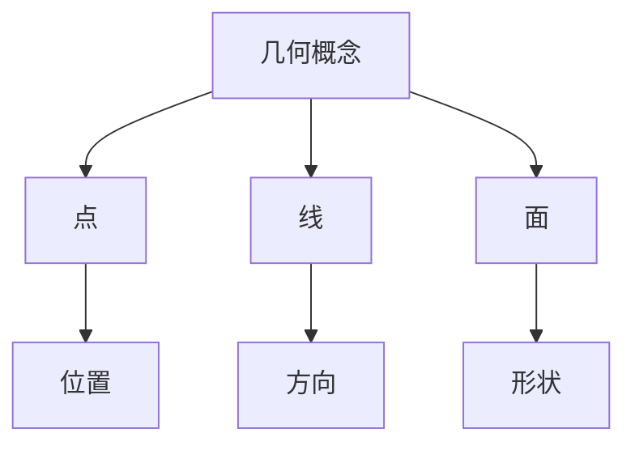
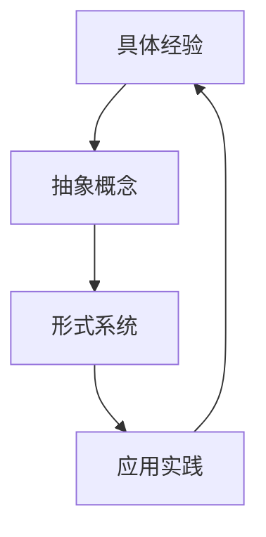
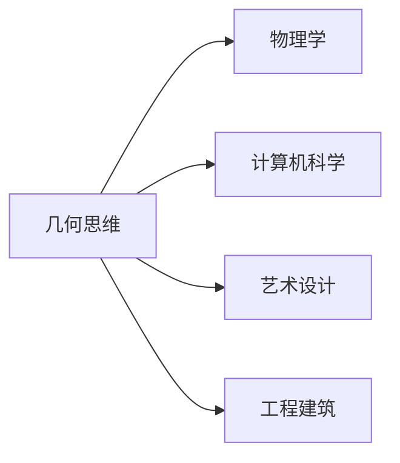

# 几何概念的认知结构分析（扩展）

## 目录

## 几何概念的哲学基础

### 本体论视角

- **理念世界**：柏拉图认为几何形式是完美理念的映射
- **经验论**：几何概念源于感官经验的抽象和归纳
- **先验性**：康德视几何为先验直觉形式，非经验获得
- **形式主义**：几何作为符号系统，无需对应实在

### 认识论维度

- **直觉与形式**：几何理解中的直观性与严格推理的张力
- **综合与分析**：几何知识的构建方式
- **公理选择**：不同公理系统反映认知偏好和目的
- **悖论与限制**：几何思维中的认知边界

### 美学原则

- **简洁性**：最简解释优先
- **对称性**：平衡与和谐的认知偏好
- **统一性**：整体性理解的倾向
- **优雅性**：证明方法的审美评价标准

## 几何思维的历史演化

### 古代几何

- **埃及实用几何**：土地测量、建筑应用
- **巴比伦数值计算**：代数化的几何处理
- **希腊形式化系统**：欧几里得《几何原本》的公理化
- **中国《周髀算经》**：勾股定理的早期表述

### 中世纪过渡

- **伊斯兰数学家贡献**：几何代数化
- **印度几何学的独特路径**：计算导向
- **经院哲学与几何思维**：形而上学框架

### 近代变革

- **解析几何**：笛卡尔的坐标统一
- **射影几何**：德萨格、蓬塞莱的透视研究
- **微分几何**：高斯、黎曼的曲面理论
- **非欧几何**：几何基础的多元化

### 现代拓展

- **拓扑学**：对形状本质的重新思考
- **分形几何**：曼德布罗特集与自然结构
- **计算几何**：算法视角下的几何问题
- **量子几何**：微观尺度的空间概念

### 教学案例分析

#### 基础几何概念教学

- **案例1：点线面的认知发展**
  - 教学目标：理解基本几何元素
  - 教学活动：从具体物体到抽象概念
  - 认知过程：感知→抽象→形式化
  - 评估方法：概念图绘制

#### 空间思维培养

- **案例2：三维空间想象**
  - 教学目标：发展空间思维能力
  - 教学活动：多角度观察与投影
  - 认知过程：视觉→想象→推理
  - 评估方法：空间问题解决

#### 几何证明教学

- **案例3：证明思维培养**
  - 教学目标：掌握几何证明方法
  - 教学活动：从直观到形式化
  - 认知过程：猜想→验证→证明
  - 评估方法：证明过程分析

#### 补充教学案例库

- **案例11：几何直觉培养**
  - 教学目标：培养几何直觉和空间想象能力
  - 教学活动：
    - 使用动态几何软件进行空间变换演示
    - 通过折纸活动理解几何变换
    - 利用VR技术进行空间探索
  - 认知过程：感知→想象→验证→应用
  - 评估方法：空间想象测试、问题解决能力评估

- **案例12：几何证明思维训练**
  - 教学目标：培养几何证明思维和逻辑推理能力
  - 教学活动：
    - 从直观猜想开始
    - 逐步引入形式化证明
    - 使用交互式证明系统
  - 认知过程：猜想→分析→证明→反思
  - 评估方法：证明过程分析、逻辑推理能力测试

#### 教学案例分析扩展

#### 案例13：几何思维培养的跨学科整合

- **教学目标**：
  - 培养跨学科几何思维能力
  - 建立几何概念与其他学科的联系
- **教学活动**：
  - 物理实验中的几何应用
  - 艺术设计中的几何原理
  - 工程实践中的几何计算
- **认知过程**：
  - 概念迁移
  - 知识整合
  - 实践应用
- **评估方法**：
  - 跨学科项目评估
  - 综合能力测试
  - 创新应用评价

#### 案例14：数字化几何教学

- **教学目标**：
  - 掌握数字化工具辅助几何学习
  - 培养计算思维与几何思维结合
- **教学活动**：
  - 使用GeoGebra进行动态几何探索
  - 编程实现几何算法
  - 3D建模与打印实践
- **认知过程**：
  - 工具使用
  - 算法思维
  - 实践验证
- **评估方法**：
  - 数字化作品评价
  - 算法实现能力
  - 创新应用能力

## 几何公理系统的比较

### 欧几里得公理系统

- **五条公理**：点线关系、直线延伸、圆的构造、直角相等、平行公理
- **认知基础**：符合宏观空间直觉
- **完备性问题**：隐含假设的识别
- **证明体系**：综合几何方法

### 希尔伯特公理系统

- **五组公理**：结合、序、全等、连续、平行
- **形式严格性**：消除直觉依赖
- **一致性证明**：公理系统的自洽性
- **模型理论**：不同解释的可能性

### 塔斯基公理系统

- **简化基础**：仅用点和距离概念
- **代数表达**：几何关系的代数化
- **认知挑战**：抽象性增强，直觉减弱
- **形式优势**：便于逻辑分析

### 比较视角

- **经济性**：最少概念表达完整系统
- **直观性**：与认知经验的贴合度
- **表达力**：系统能描述的现象范围
- **教学价值**：学习和传授的适用性

## 高维几何与认知挑战

### 维度概念的扩展

- **四维超立方体**：三维投影的解读
- **n维球体**：高维空间中的距离关系
- **超平面**：高维空间中的分割
- **维度诅咒**：高维空间的反直觉特性

### 认知困境

- **视觉想象限制**：三维视觉系统的局限
- **类比理解策略**：通过低维映射理解
- **数学形式化**：符号代替直观
- **计算机辅助可视化**：技术增强认知

### 高维直觉培养

- **降维思考**：投影和截面理解
- **性质递推**：从低维到高维的规律推广
- **代数几何统一**：通过方程理解形状
- **拓扑特性关注**：不变量的识别

### 应用意义

- **数据分析**：高维数据空间的几何理解
- **物理模型**：弦理论中的高维空间概念
- **优化问题**：高维空间中的最优解寻找
- **机器学习**：特征空间的几何结构

## 几何概念的形式语言表达

### 代数几何语言

- **多项式方程**：代数曲线和曲面
- **仿射和射影空间**：齐次坐标表示
- **代数簇**：零点集合的几何意义
- **理想与簇的对应**：代数-几何双重视角

### 向量分析表达

- **向量场**：空间中的方向结构
- **微分形式**：积分理论的几何框架
- **外代数**：多重向量的代数系统
- **李群与李代数**：连续变换的代数表达

### 拓扑语言

- **开集与闭集**：近邻结构
- **同胚概念**：本质形状的保持
- **流形结构**：局部欧氏性
- **同调理论**：洞的形式化表达

### 范畴论视角

- **对象与态射**：几何结构的抽象化
- **函子关系**：不同几何系统的映射
- **自然变换**：结构保持的变化
- **可交换图**：关系网络的形式表达

## 几何与物理世界的映射

### 空间物理学

- **欧氏空间与牛顿物理**：经典力学框架
- **闵氏空间与相对论**：时空统一视角
- **黎曼几何与广相**：引力作为空间弯曲
- **纤维丛结构**：规范场论的几何基础

### 微观世界几何

- **相空间**：经典力学的几何表述
- **希尔伯特空间**：量子态的几何结构
- **陈数与拓扑效应**：量子霍尔效应
- **扭率与规范场**：粒子相互作用的几何理解

### 宇观尺度结构

- **宇宙流形**：大尺度时空结构
- **曲率与宇宙膨胀**：几何决定动力学
- **宇宙拓扑**：大尺度结构的连通性
- **奇点理论**：黑洞与大爆炸的几何描述

### 生物结构几何

- **DNA双螺旋**：生命分子的几何结构
- **蛋白质折叠**：三维空间构型
- **细胞分裂几何**：分裂面的最小化原理
- **形态发生学**：生物形态的几何模式

## 计算几何与算法思维

### 几何算法基础

- **点定位问题**：空间搜索结构
- **凸包构造**：包围集合的边界确定
- **三角剖分**：复杂几何区域的分解
- **Voronoi图**：空间近邻分割

### 计算复杂度分析

- **几何问题的复杂度下界**：问题本质难度
- **随机化算法**：概率提高效率
- **近似算法**：效率与精度的权衡
- **并行计算策略**：空间分解的并行处理

### 离散与连续的桥梁

- **网格生成**：连续空间的离散表示
- **插值方法**：离散点到连续曲面
- **有限元方法**：几何分割与物理模拟
- **等参数表示**：形状的数值描述

### 实际应用领域

- **计算机图形学**：三维场景的表达与渲染
- **计算机视觉**：几何特征的识别与重建
- **机器人路径规划**：障碍空间的几何导航
- **地理信息系统**：空间数据的几何处理

### 现代技术应用实例

#### 计算机图形学应用

- **3D建模与渲染**
  - 几何算法：曲面细分、光线追踪
  - 实际案例：游戏引擎中的几何处理
  - 技术挑战：实时渲染与物理模拟
  - 发展趋势：实时光线追踪

#### 人工智能应用

- **计算机视觉**
  - 几何特征提取：SIFT、HOG
  - 实际案例：物体识别与姿态估计
  - 技术挑战：鲁棒性与实时性
  - 发展趋势：深度学习与几何结合

#### 虚拟现实应用

- **空间交互设计**
  - 几何算法：碰撞检测、空间映射
  - 实际案例：VR环境中的物体操作
  - 技术挑战：延迟与精确性
  - 发展趋势：混合现实技术

### 现代技术应用实例扩展

#### 人工智能与几何结合

- **深度学习应用**：
  - 几何特征提取网络
  - 空间关系学习模型
  - 形状生成对抗网络
- **实际案例**：
  - 自动驾驶场景理解
  - 机器人空间规划
  - 3D重建与建模

#### 虚拟现实与增强现实

- **空间交互系统**：
  - 实时空间映射
  - 物理引擎集成
  - 手势识别与交互
- **应用场景**：
  - 虚拟实验室
  - 建筑可视化
  - 教育训练系统

## 几何思维与跨学科应用

### 认知科学联系

- **空间认知发展**：儿童几何概念形成
- **心理旋转实验**：空间思维的神经基础
- **图式理论**：几何知识的认知组织
- **概念隐喻**：几何概念的跨域映射

### 艺术与设计

- **透视法则**：视觉空间的几何表达
- **黄金比例**：美学中的几何比例
- **对称群**：装饰艺术的几何分类
- **参数化设计**：几何算法驱动的形式生成

### 建筑与工程

- **结构力学**：几何形式与力分布
- **张拉整体结构**：最小表面的应用
- **曲面建筑**：复杂几何形体的构造
- **地形适应设计**：自然几何的工程融合

### 哲学与文化反思

- **文化几何符号**：不同文明的几何元素
- **神圣几何学**：宗教中的几何象征
- **语言中的空间隐喻**：几何概念的语言表达
- **认知普遍性与文化特殊性**：几何思维的人类共性与差异

### 跨文化几何思维比较扩展

#### 东西方几何传统对比

- **中国几何传统**
  - 特点：实用导向、算法思维
  - 代表：《九章算术》、《周髀算经》
  - 认知特征：整体性思维
  - 现代影响：计算几何发展

#### 西方几何传统

- 特点：公理化、演绎推理
- 代表：欧几里得《几何原本》
- 认知特征：分析性思维
- 现代影响：形式化数学

#### 文化差异与融合

- **思维模式差异**
  - 整体vs分析
  - 实用vs理论
  - 算法vs证明
  - 现代融合趋势

## 几何认知的整合模型

### 多层次认知框架

```text
【元认知层】─────┐
  反思性理解     │
  概念整合       │
  系统评价       │
      ↑         │
【形式系统层】───┤
  公理化结构     │
  形式推理       │
  模型构建       │
      ↑         │
【关系网络层】───┤
  概念间映射     │
  变换理解       │
  结构识别       │
      ↑         │
【基础概念层】───┤
  原型表征       │
  基本分类       │
  属性识别       │
      ↑         │
【感知基础层】───┘
  空间定位
  视觉模式
  运动体验
```

### 认知操作循环

- **感知→抽象**：从具体经验到抽象概念
- **分析→综合**：部分理解到整体把握
- **直觉→形式**：初始猜想到严格证明
- **应用→理论**：实际问题到一般原理

### 几何智能的多元特性

- **视觉-空间智能**：形状识别与操作能力
- **逻辑-数学智能**：形式推理能力
- **身体-运动智能**：空间定位与导航能力
- **内省智能**：空间想象与抽象思考

### 整合性认知模型

- **多模态整合**：视觉、触觉、运动的统一表征
- **自下而上与自上而下过程**：经验与先验知识的交互
- **显性与隐性知识**：可言表与难言表的几何理解
- **跨域迁移**：几何思维在不同领域的应用与转化

### 几何思维评估工具

#### 认知水平评估

- **概念理解评估**：
  - 概念图绘制
  - 关系网络分析
  - 问题解决能力测试

#### 空间能力评估

- **空间想象测试**：
  - 心理旋转任务
  - 空间关系判断
  - 三维重建能力

#### 应用能力评估

- **实际问题解决**：
  - 工程应用案例
  - 设计任务
  - 创新项目

## 批判性总结与前沿展望

当代几何思维已从单一欧氏体系发展为多元几何视角共存的格局。几何概念的认知层次从感知基础到元认知反思形成完整链条，不同层次间存在丰富的双向互动。

几何概念网络不仅是静态知识体系，更是动态认知工具，通过它我们组织经验、解决问题并创造新知。几何思维的形式化与直觉性构成一对永恒张力，这种张力既是认知挑战也是创新源泉。

未来几何概念研究可能在以下方向继续深化：计算认知模型的精确化、高维几何直觉的培养方法、几何思维的神经基础探索、以及人工智能系统中几何理解能力的实现。

几何概念作为人类认知的基础结构之一，既是理解物理世界的窗口，也是思考抽象关系的框架，其研究不仅有助于数学本身发展，也为认知科学、人工智能、物理学等多领域提供关键洞见。

## 几何概念可视化资源

### 基础概念可视化



### 认知层次关系图


### 几何思维发展模型



### 跨学科应用图谱



## 补充章节：教学案例库扩展

### 基础几何教学案例

#### 案例8：几何概念的可视化教学

- **教学目标**：通过多模态方式理解几何概念
- **教学活动**：
  - 使用GeoGebra进行动态几何演示
  - 3D打印模型辅助空间理解
  - AR/VR技术展示空间关系
- **认知过程**：具体→抽象→应用
- **评估方法**：概念理解测试、操作能力评估

#### 案例9：跨文化几何教学

- **教学目标**：理解不同文化背景下的几何思维
- **教学活动**：
  - 比较东西方几何传统
  - 分析不同文化中的几何图案
  - 探讨几何概念的语言表达差异
- **认知过程**：文化认知→概念对比→综合理解
- **评估方法**：文化比较报告、概念映射分析

### 高级几何应用案例

#### 案例10：计算几何实践

- **教学目标**：掌握几何算法在实际问题中的应用
- **教学活动**：
  - 实现凸包算法
  - 解决Voronoi图问题
  - 应用三角剖分技术
- **认知过程**：算法理解→代码实现→问题解决
- **评估方法**：算法效率分析、问题解决报告

## 补充章节：现代技术应用实例扩展

### 人工智能与几何

#### 深度学习中的几何应用

- **几何特征提取**：
  - 点云处理
  - 形状识别
  - 空间关系学习
- **实际案例**：
  - 自动驾驶中的场景理解
  - 机器人导航中的空间规划
  - 3D重建中的几何约束

#### 几何深度学习模型

- **模型架构**：
  - 图神经网络
  - 几何卷积网络
  - 流形学习
- **应用场景**：
  - 分子结构预测
  - 蛋白质折叠
  - 材料设计

### 虚拟现实与增强现实2

#### 空间交互系统

- **几何算法应用**：
  - 空间映射
  - 碰撞检测
  - 物理模拟
- **实际案例**：
  - VR环境中的物体操作
  - 混合现实应用
  - 虚拟训练系统

## 补充章节：跨文化几何思维比较扩展

### 东西方几何传统对比1

#### 中国几何传统

- **特点**：
  - 实用导向
  - 算法思维
  - 整体性思维
- **代表著作**：
  - 《九章算术》
  - 《周髀算经》
  - 《几何原本》中译本
- **现代影响**：
  - 计算几何发展
  - 算法优化
  - 工程应用

#### 西方几何传统1

- **特点**：
  - 公理化
  - 演绎推理
  - 分析性思维
- **代表著作**：
  - 欧几里得《几何原本》
  - 希尔伯特《几何基础》

#### 现代融合趋势

- **教育实践**：
  - 结合两种传统优势
  - 发展综合教学方法
  - 培养多元思维

## 补充章节：几何认知的神经科学基础

### 空间认知的神经机制

#### 视觉空间处理

- **神经基础**：
  - 视觉皮层处理
  - 空间定位系统
  - 运动感知网络
- **认知过程**：
  - 视觉信息整合
  - 空间关系编码
  - 运动规划执行

#### 几何思维神经基础

- **脑区活动**：
  - 顶叶空间处理
  - 前额叶推理
  - 颞叶模式识别
- **认知功能**：
  - 空间想象
  - 逻辑推理
  - 模式识别

### 发展心理学视角

#### 儿童几何认知发展

- **发展阶段**：
  - 感知运动阶段
  - 前运算阶段
  - 具体运算阶段
  - 形式运算阶段
- **关键能力**：
  - 空间定位
  - 形状识别
  - 关系理解
  - 抽象思维

#### 教育干预策略

- **早期干预**：
  - 空间游戏
  - 几何积木
  - 运动训练
- **学校教育**：
  - 概念教学
  - 问题解决
  - 实践应用

## 补充章节：几何思维与人工智能

### 几何AI系统

#### 特征提取系统

- **算法实现**：
  - 几何特征检测
  - 空间关系分析
  - 模式识别
- **应用领域**：
  - 计算机视觉
  - 机器人导航
  - 虚拟现实

#### 几何推理系统

- **系统架构**：
  - 知识表示
  - 推理引擎
  - 学习模块
- **应用场景**：
  - 自动证明
  - 问题解决
  - 设计优化

### 未来发展方向

#### 技术趋势

- **深度学习与几何**：
  - 几何深度学习
  - 空间关系学习
  - 形状生成
- **混合智能系统**：
  - 人机协作
  - 知识迁移
  - 自适应学习

#### 应用前景

- **教育领域**：
  - 智能教学系统
  - 个性化学习
  - 能力评估
- **工业应用**：
  - 智能制造
  - 设计优化
  - 质量控制

## 补充章节：术语表扩展

### 补充术语表

#### 基础概念

- **点**：几何空间中的基本元素
- **线**：一维几何对象
- **面**：二维几何对象
- **体**：三维几何对象

#### 高级概念

- **拓扑**：研究几何对象在连续变换下的不变性质
- **流形**：局部具有欧氏空间性质的拓扑空间
- **同胚**：保持拓扑性质的连续变换
- **同调**：研究几何对象中"洞"的代数不变量

#### 认知概念

- **空间智能**：理解和操作空间关系的能力
- **几何直觉**：对几何关系的直观理解
- **形式化思维**：使用严格逻辑进行推理的能力
- **元认知**：对自身认知过程的认知和调控

## 补充章节：参考文献与资源扩展

### 经典文献

1. 欧几里得《几何原本》
2. 希尔伯特《几何基础》
3. 克莱因《几何学发展史》
4. 庞加莱《科学与方法》

### 现代研究

1. 认知科学视角的几何思维研究
2. 计算几何算法与应用
3. 几何教育心理学研究
4. 跨文化几何思维比较研究

### 在线资源

1. 几何教学网站
2. 动态几何软件
3. 几何可视化工具
4. 在线课程资源

## 补充章节：索引扩展

### 主题索引

- 几何基础概念
- 几何思维发展
- 几何教育方法
- 几何应用领域
- 几何与人工智能
- 跨文化几何研究

### 人名索引

- 欧几里得
- 希尔伯特
- 庞加莱
- 克莱因
- 现代研究者

### 概念索引

- 公理系统
- 几何证明
- 空间思维
- 计算几何
- 几何教育

## 补充参考文献

### 经典文献1

1. 欧几里得《几何原本》
2. 希尔伯特《几何基础》
3. 克莱因《几何学发展史》
4. 庞加莱《科学与方法》

### 现代研究1

1. 认知科学视角的几何思维研究
2. 计算几何算法与应用
3. 几何教育心理学研究
4. 跨文化几何思维比较研究

### 在线资源1

1. 几何教学网站
2. 动态几何软件
3. 几何可视化工具
4. 在线课程资源

## 术语表

### 基础概念1

- **点**：几何空间中的基本元素
- **线**：一维几何对象
- **面**：二维几何对象
- **体**：三维几何对象

### 高级概念1

- **拓扑**：研究几何对象在连续变换下的不变性质
- **流形**：局部具有欧氏空间性质的拓扑空间
- **同胚**：保持拓扑性质的连续变换
- **同调**：研究几何对象中"洞"的代数不变量

### 认知概念1

- **空间智能**：理解和操作空间关系的能力
- **几何直觉**：对几何关系的直观理解
- **形式化思维**：使用严格逻辑进行推理的能力
- **元认知**：对自身认知过程的认知和调控
