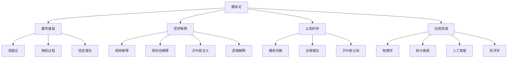

# 概率论的多重面相：一场批判性哲科思辨

## 目录

- [概率论的多重面相：一场批判性哲科思辨](#概率论的多重面相一场批判性哲科思辨)
  - [目录](#目录)
  - [引言：不确定性的数学与哲学](#引言不确定性的数学与哲学)
  - [1. 概率思想的历史嬗变与哲学根基](#1-概率思想的历史嬗变与哲学根基)
    - [1.1 偶然性的早期概念化](#11-偶然性的早期概念化)
    - [1.2 古典概率的诞生与博弈理论起源](#12-古典概率的诞生与博弈理论起源)
    - [1.3 频率学派的兴起与实证转向](#13-频率学派的兴起与实证转向)
    - [1.4 公理化革命与现代基础](#14-公理化革命与现代基础)
  - [2. 概率的多元解释框架与本体论争论](#2-概率的多元解释框架与本体论争论)
    - [2.1 古典解释：等可能性原则的哲学困境](#21-古典解释等可能性原则的哲学困境)
    - [2.2 频率解释：概率作为极限频率的优势与局限](#22-频率解释概率作为极限频率的优势与局限)
    - [2.3 倾向性解释：物理系统的内在属性](#23-倾向性解释物理系统的内在属性)
    - [2.4 主观概率与贝叶斯革命](#24-主观概率与贝叶斯革命)
    - [2.5 逻辑解释：概率作为部分蕴含关系](#25-逻辑解释概率作为部分蕴含关系)
  - [3. 概率论的公理基础与数学架构](#3-概率论的公理基础与数学架构)
    - [3.1 柯尔莫哥洛夫公理系统的哲学解读](#31-柯尔莫哥洛夫公理系统的哲学解读)
    - [3.2 测度论基础的本体论意义](#32-测度论基础的本体论意义)
    - [3.3 条件概率的深层结构与悖论](#33-条件概率的深层结构与悖论)
    - [3.4 概率空间构造的认知映射](#34-概率空间构造的认知映射)
  - [4. 随机性的本质与确定性的边界](#4-随机性的本质与确定性的边界)
    - [4.1 随机性概念的多维解析](#41-随机性概念的多维解析)
    - [4.2 确定性混沌与概率描述](#42-确定性混沌与概率描述)
    - [4.3 量子概率与经典概率的本体差异](#43-量子概率与经典概率的本体差异)
    - [4.4 复杂系统中的涌现概率](#44-复杂系统中的涌现概率)
  - [5. 概率推理的认知基础与理性困境](#5-概率推理的认知基础与理性困境)
    - [5.1 人类直觉与概率误判](#51-人类直觉与概率误判)
    - [5.2 贝叶斯认知模型与信念更新](#52-贝叶斯认知模型与信念更新)
    - [5.3 概率谬误的哲学根源](#53-概率谬误的哲学根源)
    - [5.4 不确定性下的理性决策](#54-不确定性下的理性决策)
  - [6. 概率在科学方法论中的核心地位](#6-概率在科学方法论中的核心地位)
    - [6.1 统计推断与科学确证](#61-统计推断与科学确证)
    - [6.2 概率因果性与干预模型](#62-概率因果性与干预模型)
    - [6.3 模型选择与复杂性权衡](#63-模型选择与复杂性权衡)
    - [6.4 归纳推理的概率基础](#64-归纳推理的概率基础)
  - [7. 信息、熵与概率的深层联系](#7-信息熵与概率的深层联系)
    - [7.1 信息熵的概率解释](#71-信息熵的概率解释)
    - [7.2 最大熵原理的认识论基础](#72-最大熵原理的认识论基础)
    - [7.3 相对熵与信息几何](#73-相对熵与信息几何)
    - [7.4 随机过程与信息传递](#74-随机过程与信息传递)
  - [8. 概率论在多学科视野中的应用与变革](#8-概率论在多学科视野中的应用与变革)
    - [8.1 物理学中的统计与概率](#81-物理学中的统计与概率)
    - [8.2 生物学中的随机性与进化](#82-生物学中的随机性与进化)
    - [8.3 经济学的概率基础与批判](#83-经济学的概率基础与批判)
    - [8.4 人工智能中的概率革命](#84-人工智能中的概率革命)
  - [9. 概率、时间与因果的交织关系](#9-概率时间与因果的交织关系)
    - [9.1 时间不对称性与概率方向性](#91-时间不对称性与概率方向性)
    - [9.2 因果网络与概率图模型](#92-因果网络与概率图模型)
    - [9.3 反事实条件句的概率语义](#93-反事实条件句的概率语义)
    - [9.4 干预与被动观察的概率区分](#94-干预与被动观察的概率区分)
  - [10. 概率论的哲学前沿与未来展望](#10-概率论的哲学前沿与未来展望)
    - [10.1 不精确概率与模糊性](#101-不精确概率与模糊性)
    - [10.2 量子概率论的哲学挑战](#102-量子概率论的哲学挑战)
    - [10.3 概率的计算复杂性视角](#103-概率的计算复杂性视角)
    - [10.4 概率与实在的多元本体论](#104-概率与实在的多元本体论)
  - [结论：概率思维的认知价值与哲学意义](#结论概率思维的认知价值与哲学意义)
  - [附录：经典案例分析](#附录经典案例分析)
    - [案例1：圣彼得堡悖论的多层次解读](#案例1圣彼得堡悖论的多层次解读)
    - [案例2：贝叶斯VS频率主义的科学实践之争](#案例2贝叶斯vs频率主义的科学实践之争)
    - [案例3：辛普森悖论与因果推断的概率陷阱](#案例3辛普森悖论与因果推断的概率陷阱)
  - [概念映射与可视化表征](#概念映射与可视化表征)
  - [参考文献](#参考文献)

## 引言：不确定性的数学与哲学

概率论，作为不确定性的数学理论，占据了现代科学思维的核心位置。
它既是一套严格的数学形式系统，又是一种理解世界的哲学视角；
既是对物理现实的描述语言，又是人类认知结构的映射。
本文旨在通过多维哲科视角，
批判性地探究概率论的基础、解释框架、应用扩展及其与人类认知、本体论和实在性的深层关联。

不确定性并非现代的发现，但将其系统化为严格数学的努力却是近代理性主义的产物。
概率论的历程反映了人类思维从决定论到接纳不确定性的深刻转变，揭示了科学认识论的重要演化。
在当代信息爆炸和复杂系统研究的时代，概率思维已超越了数学工具的角色，成为理解世界的基本范式。

本文将不仅关注概率论的技术内容，更将挖掘其深层哲学基础，
分析不同解释框架的本体论预设，探讨概率与认知、因果、时间、信息等概念的内在关联，
并反思概率思维对我们理解实在性本质的启示。
通过这一多维考察，我们将看到概率论不仅是关于随机现象的数学，
更是连接确定与不确定、客观与主观、存在与认知的一座独特桥梁。

## 1. 概率思想的历史嬗变与哲学根基

### 1.1 偶然性的早期概念化

人类对偶然性的思考可追溯至最早的文明，但其概念化经历了复杂演变：

**古代文明中的偶然观念**：

- 巴比伦占卜实践中的系统性记录与模式识别
- 古埃及和中国的数字化占卜系统
- 古希腊掷骰子游戏中的机会概念

**哲学思想的早期分化**：

- 德谟克利特的原子偶然论：偶然作为未知因果链
- 亚里士多德的三分法：必然、常然、偶然
- 伊壁鸠鲁学派：偶然作为宇宙的本体特性

**神学传统与偶然性**：

- 基督教神学：偶然性作为不完美世界的标志
- 伊斯兰思想：Al-Ghazali的神学偶然论
- 中世纪的神意与偶然的调和尝试

这些早期思想反映了对偶然性本质的根本分歧：
  它是无知的表现，还是世界的内在特性？
  是需要消除的不完美，还是实在的基本维度？
这些哲学问题至今仍影响着概率解释的不同立场。

### 1.2 古典概率的诞生与博弈理论起源

现代概率论的起源通常追溯到17世纪的博弈分析：

**历史催化剂**：

- 帕西奥利(Pacioli)的分赌注问题(1494)
- 卡尔丹(Cardano)的《论机会游戏》(约1564)
- 帕斯卡与费马的通信(1654)：概率系统化的起点

**核心概念的形成**：

- 等可能性原则：古典概率的哲学基石
- 数学期望的引入：价值与概率的结合
- 排列组合方法在概率计算中的应用

**哲学语境的影响**：

- 笛卡尔理性主义：对确定性的追求与偶然的处理
- 莱布尼茨的确定论与"足够理由律"
- 启蒙运动对不确定性的系统化尝试

古典概率的诞生既是数学发展的产物，也反映了特定历史时期的理性理想：
  将不确定性纳入理性框架，使偶然服从于理性分析。
这一时期的概率观念带有强烈的先验主义色彩，将概率视为理性反思的产物而非经验观察的结果。

### 1.3 频率学派的兴起与实证转向

19世纪，概率理论经历了从先验理性向实证经验的重要转向：

**频率学派的理论基础**：

- 伯努利大数定律(1713)：理论到实践的桥梁
- 孔多塞与拉普拉斯：社会现象的概率分析
- 凯特莱(Quetelet)的"平均人"与社会统计学

**实证主义的影响**：

- 从等可能性到观察频率的转变
- 概率作为长期频率极限的解释框架
- 经验科学中统计规律性的发现

**应用领域的扩展**：

- 误差理论与天文观测
- 热力学中的统计方法
- 人口统计与社会科学量化

这一转向的深层意义在于，概率不再仅是理性分析的产物，而成为描述客观现象规律性的工具。
频率学派将概率从纯粹的逻辑可能性转向了可测量的物理特性，
为概率的科学应用奠定了基础，
同时也引发了关于概率本质的新一轮哲学争论。

### 1.4 公理化革命与现代基础

20世纪初，概率论通过公理化完成了数学严格性的飞跃：

**柯尔莫哥洛夫的公理化(1933)**：

- 概率作为规范化测度的定义
- 测度论为概率提供统一数学基础
- 从特殊问题到一般理论的转变

**公理化的哲学意义**：

- 避开解释争议，专注形式结构
- 多元解释框架在同一数学形式下的并存
- 形式与内容、语法与语义的分离

**现代概率论的拓展领域**：

- 随机过程理论的系统发展
- 马尔可夫链与随机行走模型
- 鞅论与金融数学的基础

公理化使概率论成为成熟的数学分支，但也造成了形式与解释的分离。
这种分离既是优势——允许数学发展不受哲学争议阻碍，
也是局限——留下了概率本质的未解之谜。
现代概率论的悖论在于，它的数学成功并未解决，反而可能加深了其哲学基础的模糊性。

## 2. 概率的多元解释框架与本体论争论

### 2.1 古典解释：等可能性原则的哲学困境

古典概率解释建立在等可能性原则上，其核心是"无差别理由原则"：

**核心思想**：

- 概率定义为"有利情况数/可能情况总数"
- 基于对称性和无差别性的先验判断
- 概率作为理性主体的逻辑期望

**循环论证的批判**：

- 等可能性本身隐含概率均等的前提
- "可能情况"的划分依赖于背景知识
- 拉普拉斯悖论：不同参考类导致不同概率

**哲学根源探析**：

- 莱布尼茨的"充分理由律"影响
- 理性主义传统中的先验性强调
- 对称性作为认知与本体的桥梁

古典解释揭示了概率与人类认知结构的深层联系：我们倾向于在缺乏区分理由时假设对称性。
这种倾向是认知的基本特征还是理性的基本原则？
是发现世界结构还是投射认知结构？
这些问题指向概率的本体与认识论根基。

### 2.2 频率解释：概率作为极限频率的优势与局限

频率学派将概率定义为长期重复试验中事件出现的相对频率极限：

**核心主张**：

- 概率是无限重复中的极限频率
- 单一事件没有客观概率
- 概率是可测量的客观物理量

**冯·米塞斯的严格频率主义**：

- "集体"概念与随机性定义
- 极限频率的不可预测性要求
- 抽样规则的独立性条件

**关键困境与批判**：

- 现实中不存在真正的无限序列
- 单一事件概率的处理困难
- 参考类问题：事件归入哪个集体？

频率解释试图将概率完全客观化，使其成为物理世界的可测量特性。
这一尝试虽然符合科学实证精神，
但面临单一事件与无限序列之间的张力：我们谈论明天下雨的概率，但明天只有一个。
这一困境反映了概率既是对重复模式的描述，又需要应用于不可重复情境的双重性质。

### 2.3 倾向性解释：物理系统的内在属性

倾向性解释试图保留概率的客观性，同时解决单一事件的概率问题：

**波普尔的倾向性理论**：

- 概率作为物理系统的倾向性属性
- 单一事件具有实在的概率倾向
- 概率作为可能性的物理度量

**与量子力学的关联**：

- 海森堡不确定性原理的哲学解读
- 量子态作为倾向性的具体化
- 随机性的本体地位问题

**哲学困难与批判**：

- 倾向性的可测量性与可证伪性问题
- 与经典物理决定论的紧张关系
- 倾向性与实际频率的关系阐明

倾向性解释尝试将概率融入物理本体论，使其成为与质量、电荷等并列的基本物理属性。
这一视角与量子力学的某些解释相呼应，
但面临着难以验证的困境：除了通过频率表现，我们如何识别和测量倾向性？
这种解释引发了物理决定论与概率本体论之间的深层冲突。

### 2.4 主观概率与贝叶斯革命

主观概率解释将概率视为理性主体的信念度量：

**拉姆齐-德菲内蒂-萨瓦奇方法**：

- 概率作为理性信念的量化表达
- 通过行为选择揭示主观概率
- 荷兰书理论与概率一致性

**贝叶斯主义的认识论框架**：

- 先验概率与后验概率的动态更新
- 概率作为条件于证据的信念度
- 贝叶斯定理作为理性学习模型

**批判与辩护**：

- 先验概率的选择问题
- 主观性与科学客观性的张力
- 信念与物理世界的对应关系

贝叶斯主义代表了概率解释的主观转向，将概率从世界的属性转变为认知的属性。
这一转向引发了关于科学客观性的深刻问题：如果概率是主观的，那么基于概率的科学推断如何保持客观性？
贝叶斯主义的答案是通过证据更新实现主观信念的客观收敛，但这一过程的基础仍然存在争议。

### 2.5 逻辑解释：概率作为部分蕴含关系

逻辑概率解释将概率视为命题之间的部分逻辑关系：

**凯恩斯与卡尔纳普的逻辑概率**：

- 概率作为命题间的部分蕴含程度
- 归纳逻辑的数值化表达
- 概率作为逻辑关系而非心理状态

**逻辑解释的特征**：

- 强调客观性与非心理性
- 概率判断的先验基础
- 最大熵原理的逻辑地位

**局限与批判**：

- 实际应用中的计算困难
- 与自然语言命题的匹配问题
- 逻辑关系与经验证据的连接

逻辑解释试图在主观与客观之间寻找中间路径：概率既不是物理属性，也不是心理状态，而是命题之间的逻辑关系。
这一视角将概率推理理解为归纳逻辑的延伸，但面临着如何将抽象逻辑关系与具体经验联系起来的挑战。

## 3. 概率论的公理基础与数学架构

### 3.1 柯尔莫哥洛夫公理系统的哲学解读

柯尔莫哥洛夫公理系统为概率论提供了统一的数学基础：

**基本公理与结构**：

- 样本空间与事件代数的设置
- 非负性、规范化与可加性三条基本公理
- 条件概率的定义与性质

**公理选择的哲学考量**：

- 简洁性与表达力的平衡
- 与直观概念的对应关系
- 技术可行性与数学连贯性

**批判性思考**：
公理系统的形式中立性是优势还是局限？
柯氏系统通过回避概率本质问题实现了数学统一，但可能掩盖了概率概念的多层次本质。
系统的简洁优雅反映了数学美学价值，但其与复杂现实的对应关系仍需哲学阐释。

### 3.2 测度论基础的本体论意义

概率论建立在测度论基础上，这一数学选择具有深刻本体论含义：

**测度论框架的关键特性**：

- 将概率空间作为特殊的测度空间
- σ-代数结构与可测性要求
- 测度的连续性与极限操作

**本体论含义分析**：

- 概率事件作为集合的形式化
- 事件之间的逻辑关系映射为集合运算
- 连续性假设的隐含本体承诺

**批判性反思**：
测度论基础暗示了一种特定的概率本体论：将随机性结构化为事件集合与测度函数。
这种数学形式化是否完全捕捉了概率的本质？
是否存在不适合测度论框架的概率概念？
这些问题指向形式化选择与概率本质的关系。

### 3.3 条件概率的深层结构与悖论

条件概率概念揭示了概率理论的深层复杂性：

**条件概率的多重定义**：

- 比率定义：P(A|B) = P(A∩B)/P(B)
- 公理化定义：作为B上的新概率测度
- 更新规则：从先验到后验的转变

**条件概率悖论的哲学分析**：

- 博雷尔-科尔莫哥洛夫悖论与零概率事件
- 三囚徒悖论与条件信息的解释
- 辛普森悖论与因果推断的复杂性

**认知与本体的双重维度**：
条件概率同时具有认知意义（信息更新）和本体意义（部分世界中的测度）。
这种双重性反映了概率理论的根本特征：它既描述了世界的结构，又模拟了认知的过程。
条件概率悖论揭示了这两个维度之间可能的张力。

### 3.4 概率空间构造的认知映射

概率空间的构造过程反映了人类认知对不确定性的结构化：

**概率空间构造的关键步骤**：

- 样本空间的划分与粒度选择
- 事件域的确定与信息结构
- 概率测度的赋值与主观/客观考量

**认知结构的映射关系**：

- 样本点作为可能世界的形式化
- 事件集合作为命题的数学表示
- 概率测度作为不确定性的量化

**哲学启示**：
概率空间构造不是中立的数学过程，而是包含深刻认知假设的建模活动。
样本空间的选择反映了我们对可能性的理解界限，事件域反映了我们的关注焦点，测度赋值反映了我们的信息状态。
这种构造活动揭示了概率思维的主动建构性本质。

## 4. 随机性的本质与确定性的边界

### 4.1 随机性概念的多维解析

随机性概念本身具有多层次、多维度的复杂结构：

**随机性的多重定义**：

- 不可预测性：结果无法被确定预知
- 无规律性：模式不可辨识或压缩
- 统计独立性：事件之间无关联
- 计算复杂性：无算法可生成简短描述

**哲学分类学**：

- 认识论随机性：源于知识限制
- 本体论随机性：世界的内在特性
- 计算论随机性：算法复杂性的表现

**批判性思考**：
这些不同随机性概念之间存在微妙关系：它们在某些情境下等价，在其他情境下分离。
混淆这些不同维度是概率讨论中的常见错误源。
随机性可能不是单一属性，而是多维特性的集合，不同学科强调其不同方面。

### 4.2 确定性混沌与概率描述

混沌理论挑战了确定性与随机性的简单二分：

**混沌系统的核心特征**：

- 确定性动力学方程
- 对初始条件的敏感依赖
- 长期行为的不可预测性

**概率描述的必要性与局限**：

- 混沌系统的概率统计表征
- 不变测度与统计稳定性
- 确定性系统中涌现的随机行为

**哲学反思**：
混沌理论揭示了确定性与随机性之间的连续谱系，而非截然二分。
它暗示随机性可能是确定性系统在特定复杂度下的涌现属性，挑战了我们对因果决定论与概率不确定性的传统理解。
这种视角模糊了认识论随机性与本体论随机性的边界。

### 4.3 量子概率与经典概率的本体差异

量子力学中的概率具有与经典概率根本不同的特性：

**量子概率的独特特征**：

- 叠加态与概率幅
- 非交换概率测度
- 测量过程的特殊地位
- 贝尔不等式与非局域性

**与经典概率的本体对比**：

- 经典：反映已存在状态的不确定性
- 量子：反映实在的根本不确定性
- 经典：独立于观察的客观概率
- 量子：与测量过程纠缠的概率

**解释争论的哲学根源**：
量子概率挑战了我们最基本的实在观：它暗示世界可能在本质上是非决定性的，概率不仅是认知工具，而是基本物理规律的表达。
这一挑战引发了从哥本哈根解释到多世界理论的广泛争论，触及了实在性、确定性与观察者角色的根本问题。

### 4.4 复杂系统中的涌现概率

复杂系统科学提供了理解随机性与确定性关系的新视角：

**复杂系统的概率特性**：

- 大量组分的集体行为
- 涌现的统计规律性
- 多尺度概率描述

**还原论与涌现的张力**：

- 微观确定性与宏观概率的关系
- 统计力学中的涌现概率
- 生物系统中的随机性与确定性

**哲学意义**：
复杂系统研究暗示，概率可能是某些系统组织层级的自然描述语言，而非仅仅是知识不完备的表现。
不同层级可能需要不同的描述语言，概率描述在某些尺度上可能是不可还原的。
这一视角超越了简单的主观/客观二分，指向概率的层级性本体论。

## 5. 概率推理的认知基础与理性困境

### 5.1 人类直觉与概率误判

人类概率直觉与规范概率理论之间存在系统性差异：

**经典认知偏误**：

- 代表性启发式与基础率忽略
- 可得性偏差与风险错估
- 确定性效应与小概率高估
- 结合谬误与概率逻辑违反

**神经认知机制探究**：

- 双系统理论：直觉与分析思维的角色
- 概率判断的神经基础
- 进化心理学解释：适应环境vs现代决策

**哲学反思**：
人类概率直觉的"错误"是认知缺陷还是适应性特征？
规范概率理论是否应该是人类判断的唯一标准？
这些问题指向理性标准本身的哲学基础，暗示数学概率与认知概率可能服务于不同目的，具有不同优化标准。

### 5.2 贝叶斯认知模型与信念更新

贝叶斯框架为理解人类认知提供了规范与描述模型：

**贝叶斯认知科学的核心主张**：

- 大脑作为贝叶斯推断机器
- 感知作为概率推断过程
- 学习作为先验-后验更新

**理想与现实的差距**：

- 有限认知资源下的近似贝叶斯
- 主观概率的系统偏离
- 信念僵化与证据阈值问题

**哲学与认知的交叉探究**：
贝叶斯模型引发了关于认知规范性的深层问题：人类思维应该遵循贝叶斯理想吗？
贝叶斯更新是否是唯一合理的学习模式？
这些问题连接了认知科学的经验研究与认识论的规范问题，指向理性标准的多元可能性。

### 5.3 概率谬误的哲学根源

常见概率谬误反映了概率概念的深层哲学困难：

**经典概率谬误剖析**：

- 赌徒谬误与独立性误解
- 检察官谬误与条件概率混淆
- 蒙提霍尔问题与信息更新困难

**哲学根源探究**：

- 频率直觉与单一事件概率的冲突
- 条件关系与因果关系的混淆
- 直觉物理学与概率理论的不兼容

**批判性思考**：
概率谬误不仅是计算错误，更反映了概率概念内在的哲学张力。
例如，赌徒谬误反映了独立性概念与模式识别倾向的根本冲突；
检察官谬误揭示了频率解释与贝叶斯推理之间的紧张关系。
这些谬误是概率哲学问题在日常思维中的表现。

### 5.4 不确定性下的理性决策

决策理论探究不确定条件下的理性选择标准：

**规范决策理论的主要框架**：

- 期望效用最大化原则
- 主观期望效用理论
- 风险态度与效用曲线

**理性公理的哲学基础**：

- 偏好一致性与传递性假设
- 独立性公理及其违反
- 风险中立性与风险厌恶的规范性

**现实决策中的理性困境**：

- 阿莱悖论与期望效用理论的挑战
- 艾尔斯伯格悖论与不确定性厌恶
- 前景理论：描述现实vs规范理想

不确定性决策理论揭示了"理性"概念本身的复杂性。
是否存在单一的理性标准？
不同情境下的理性可能有不同定义？
这些问题指向理性概念的多元性，以及在不同不确定性类型面前可能需要不同决策原则的可能性。

## 6. 概率在科学方法论中的核心地位

### 6.1 统计推断与科学确证

统计方法构成了现代科学确证的核心方法论基础：

**统计推断的哲学结构**：

- 从样本到总体的归纳推理
- 不确定性的量化与表达
- 证据强度的概率度量

**频率主义与贝叶斯主义的方法论之争**：

- 假设检验vs贝叶斯因子
- P值与置信区间的解释困境
- 先验信息的科学地位争议

**证据与确证的概率理论**：

- 概率提升与相关性确证
- 似然比原则及其哲学基础
- 贝叶斯网络作为因果确证模型

统计推断的哲学争议反映了更深层的科学哲学分歧：科学知识的确定性程度如何理解？
证据如何累积产生知识？
这些问题指向科学确证的本质，以及概率在连接证据与理论中的不可替代作用。

### 6.2 概率因果性与干预模型

概率因果理论为因果关系提供了数学形式化框架：

**概率因果模型的演化**：

- 从休谟相关到概率提升理论
- 莱欣巴赫的共同原因原则
- 珀尔的因果图模型与do-演算

**因果识别的概率条件**：

- 条件独立性作为因果结构指示
- 工具变量与自然实验的概率基础
- 反事实条件句的概率语义学

**哲学争议与挑战**：

- 概率关系能否完全捕捉因果本质？
- 潜在结果框架vs图模型的形而上学
- 因果概念的多重层次与概率表达

概率因果理论尝试解决古老的"相关不蕴含因果"难题，为因果推断提供严格方法。
这一领域的发展揭示了因果概念与概率语言之间的深层联系，以及形式化因果思维的可能性与局限性。

### 6.3 模型选择与复杂性权衡

模型选择理论探讨如何在不确定条件下选择最佳科学模型：

**模型选择的概率框架**：

- 奥卡姆剃刀原则的概率表达
- AIC、BIC与模型复杂性惩罚
- 贝叶斯模型平均与模型不确定性

**复杂性与拟合的哲学权衡**：

- 偏差-方差权衡的认识论解读
- 过拟合问题的哲学本质
- 简约性原则的概率基础

**科学实践的深层反思**：

- 模型作为工具vs模型作为真理表征
- 预测准确性vs解释深度的张力
- 概率视角下的科学实在论争论

模型选择问题揭示了科学的核心张力：在有限证据条件下如何在简单性与准确性之间取得平衡？
这一问题连接了统计学技术与科学哲学的深层问题，体现了概率思维在科学方法论中的核心地位。

### 6.4 归纳推理的概率基础

概率理论为归纳推理的有效性提供了理论基础：

**归纳问题的概率重构**：

- 休谟归纳问题的概率表述
- 古德曼新归纳之谜的概率解析
- 卡尔纳普的归纳逻辑项目

**现代归纳辩护**：

- 雷彻尔的实用主义辩护
- PAC学习理论与归纳保证
- 概率近似的归纳可靠性

**哲学意义**：

- 归纳有效性的概率解释
- 无先验归纳原则可能性的探讨
- 归纳推理与概率推理的本质联系

归纳问题是认识论的核心难题之一，概率方法提供了处理这一难题的强大工具。
概率框架不仅形式化了归纳推理，还提供了评估归纳强度的量化标准，将古老的哲学问题转化为可分析的数学问题。

## 7. 信息、熵与概率的深层联系

### 7.1 信息熵的概率解释

信息熵概念揭示了信息与概率的内在统一：

**香农熵的概率基础**：

- 信息量作为概率的对数函数
- 熵作为平均信息量的度量
- 最大熵分布的概率解释

**熵的多重解读**：

- 认识论视角：不确定性的量化
- 物理学视角：系统无序度的度量
- 计算视角：编码复杂度的下界

**哲学反思**：
信息熵统一了概率、信息与复杂性，暗示这些概念可能源自同一深层结构。
熵的普遍性提示我们，概率分布的信息特性可能比其数值更为基础。
这种视角使概率不再仅是频率或信念的度量，而成为信息结构的表达。

### 7.2 最大熵原理的认识论基础

最大熵原理为概率分配提供了一个深具哲学意义的准则：

**最大熵原理的形式**：

- 在已知约束条件下选择熵最大的分布
- 无信息先验的数学表达
- 约束作为客观知识的形式化

**认识论地位分析**：

- 贾因斯的客观贝叶斯主义
- 无差别原则的信息论重构
- 作为归纳推理的基本原则

**批判与防御**：
最大熵原理既是技术工具又是哲学原则。
它形式化了"不添加未知信息"的认识论谨慎，但也引发争议：
为何熵最大化是合理的？
这一原则的正当性基础是概率理论本身，还是更深层的认识论或信息论原则？

### 7.3 相对熵与信息几何

相对熵概念开创了理解概率分布的几何视角：

**KL散度与信息投影**：

- 概率分布间的"信息距离"
- 投影作为信息约束下的优化
- 概率空间的非欧几里得结构

**信息几何的概念框架**：

- 概率分布流形与自然坐标系
- Fisher信息度量与统计流形
- 指数族分布的几何特性

**哲学与认知意义**：
信息几何提供了概率思维的空间隐喻，将概率推理可视化为几何运动。
这一框架暗示，概率推理可能在认知上与空间思维共享基础结构，
概率直觉的某些特性可能源于我们的空间认知能力。

### 7.4 随机过程与信息传递

随机过程提供了理解信息动态传递的概率框架：

**马尔可夫过程与信息流**：

- 条件熵与信息传递率
- 熵产生与预测性丧失
- 随机行走作为信息扩散模型

**随机过程的多层次解读**：

- 数学层：条件概率结构的动态演化
- 物理层：微观随机性与宏观规律性
- 信息层：不确定性在时空中的传播

**复杂系统中的随机动力学**：

- 随机共振与噪声增强信号
- 临界现象与长程相关性
- 自组织临界性的信息熵特征

随机过程理论将概率与时间、空间、信息统一起来，揭示了不确定性如何在结构化系统中传播与转化。
这一视角为理解复杂系统中的信息动力学提供了基础，暗示随机性可能是信息处理与传递的本质机制。

## 8. 概率论在多学科视野中的应用与变革

### 8.1 物理学中的统计与概率

物理学深刻改变了概率概念，同时也被概率思维所变革：

**统计力学的概率革命**：

- 从确定性力学到统计系综
- 玻尔兹曼熵与宏观状态概率
- 不可逆性与概率时间箭头

**量子理论的概率解释谱系**：

- 哥本哈根解释：波函数作为概率波
- 多世界解释的概率困境
- 量子贝叶斯主义与参与者观点

**现代发展与哲学反思**：

- 非平衡统计力学与熵产生
- 量子概率的非经典逻辑
- 从概率描述到本体随机性的转变

物理学与概率理论的互动改变了两者的面貌：
  物理学接受了基础层面的不确定性，概率理论则拓展了其解释范围。
这种互动挑战了传统的决定论世界观，促使我们重新思考物理实在的本质与概率在其中的根本地位。

### 8.2 生物学中的随机性与进化

生物学系统展现了随机性与定向性的独特融合：

**进化论中的随机变异**：

- 突变的随机性与选择的定向性
- 遗传漂变与中性进化理论
- 随机搜索作为创新机制

**分子与细胞水平的随机动力学**：

- 基因表达的随机波动
- 细胞命运决定中的随机转换
- 神经系统中的随机计算

**生物随机性的哲学意义**：

- 目的性与偶然性的辩证关系
- 多层次因果中的随机涌现
- 生物确定性的概率基础

生物学中的随机性不仅是不确定性的表现，更是创新与适应的核心机制。
这一视角挑战了随机与设计的简单对立，暗示随机过程可能是实现复杂功能的最佳策略，而非功能的对立面。

### 8.3 经济学的概率基础与批判

经济理论的发展深受概率思维的影响，同时也反映了概率应用的局限：

**金融市场的概率模型**：

- 随机游走与有效市场假说
- 期权定价理论的概率基础
- 风险测度与尾部事件建模

**经济决策的概率框架**：

- 期望效用理论与理性选择
- 不确定性经济学与信息不对称
- 行为经济学与概率判断偏差

**方法论批判与反思**：

- "黑天鹅"事件与模型风险
- 基本不确定性vs可量化风险
- 经济系统的涌现与不可预测性

经济学与金融学依赖概率模型，但其危机也揭示了这些模型的局限。
关键问题在于：
  经济现象中的不确定性是否完全可用概率捕捉？
这一问题指向概率应用的边界，以及在复杂人类系统中对概率解释的适当性。

### 8.4 人工智能中的概率革命

概率方法引发了人工智能研究的范式转变：

**从逻辑到概率的转向**：

- 符号AI的确定性局限
- 贝叶斯网络与概率图模型
- 深度学习中的随机优化

**概率程序设计与因果推理**：

- 生成式模型与概率语义
- 贝叶斯程序归纳
- 因果发现的概率算法

**不确定性与智能的哲学联系**：

- 不确定环境中的合理决策
- 概率推理作为智能核心
- 创造性与随机探索的关系

人工智能的概率转向暗示，不确定性处理可能是智能的核心特征，而非缺陷。
这一观点挑战了确定性逻辑作为理性基础的传统观念，提示概率思维可能更接近人类智能的本质结构。

## 9. 概率、时间与因果的交织关系

### 9.1 时间不对称性与概率方向性

时间与概率之间存在深刻的结构对应：

**概率的时间方向性**：

- 预测与回溯的概率不对称
- 条件概率中的时间顺序效应
- 熵增与概率演化方向

**物理时间箭头的概率基础**：

- 热力学第二定律的统计解释
- 宏观不可逆性与微观可逆性的悖论
- 初始条件与边界约束的角色

**哲学反思与争论**：

- 概率时间箭头是本体的还是认识论的？
- 过去确定性与未来开放性的根源
- 概率不对称与因果不对称的关系

时间与概率的深层联系暗示，我们对时间的体验与对不确定性的认知可能共享基础结构。
这一联系挑战了时间客观流逝的直觉，提示时间方向可能根植于系统的统计性质与信息结构。

### 9.2 因果网络与概率图模型

概率图模型为因果关系提供了精确的数学表示：

**因果贝叶斯网络的结构**：

- 有向无环图与条件独立性
- d-分离与因果马尔可夫条件
- 局部马尔可夫性与因果信息流

**因果推断的概率算法**：

- 从观察数据恢复因果结构
- 识别因果效应的图算法
- 隐变量存在下的因果发现

**哲学基础与批判**：

- 图模型是否完全捕捉因果本质？
- 不同因果层级的概率表示问题
- 计算因果模型与形而上学因果观的关系

概率图模型使因果关系的形式化与计算成为可能，但也引发关于因果本质的深层问题：
  因果是否可简化为条件概率结构？
  因果的方向性是否可从概率关系中导出？
  这些问题连接了数学工具与形而上学思考。

### 9.3 反事实条件句的概率语义

反事实思考是因果理解的核心，概率为其提供了形式语义：

**反事实条件句的概率表达**：

- 路易斯可能世界语义的概率重构
- 珀尔的结构方程模型方法
- 反事实干预的do-演算

**反事实概率与单一事件因果**：

- "如果A未发生，B是否会发生？"的概率解析
- 必要性与充分性的概率度量
- 反事实概率判断的认知基础

**哲学困境与启示**：

- 反事实真值的客观性问题
- 不可观测反事实与科学实在论
- 决定论世界中的反事实概率

反事实条件句长期是哲学难题，概率方法为其提供了新的处理框架。
这一框架不仅有实用价值，还揭示了反事实思考、因果理解与概率推理之间的内在联系，
暗示这些看似不同的认知能力可能共享基础结构。

### 9.4 干预与被动观察的概率区分

因果推断的核心在于区分干预与观察的概率效应：

**干预演算的数学结构**：

- 珀尔的do-算子与图外科手术
- 截断与操纵的概率效应
- 从观察条件概率到干预概率的转换

**实验设计的因果基础**：

- 随机化试验的因果解释
- 工具变量作为准自然实验
- 因果效应识别的概率条件

**哲学与实践意义**：

- "看"与"做"的认识论区别
- 干预思维作为科学方法核心
- 因果概率与相关概率的本质差异

区分干预与观察是现代因果推断的突破，它形式化了休谟以来的哲学洞见：相关不等于因果。
这一区分不仅具有实践意义，还揭示了概率概念的双重本质：
  描述性概率与干预性概率可能是两种本质不同的数学关系。

## 10. 概率论的哲学前沿与未来展望

### 10.1 不精确概率与模糊性

传统概率理论的精确性假设面临来自不同方向的挑战：

**不精确概率的数学框架**：

- 概率区间与下上概率
- 德斯特尔-沙弗理论与信念函数
- 可能性理论与模糊集合

**认识论与本体动机**：

- 第二阶不确定性的表示需求
- 不完全信息与认知有限性
- 本体模糊性与量子叠加类比

**哲学批判与辩护**：

- 不精确概率的规范合理性
- 决策理论中的模糊厌恶现象
- 科学语言中的精确性理想与模糊现实

不精确概率研究揭示了传统概率理论的隐含假设：不确定性可以精确量化。
这一假设在深度不确定性面前受到挑战，提示我们可能需要更丰富的数学语言来捕捉不确定性的多重层次。

### 10.2 量子概率论的哲学挑战

量子力学的概率结构挑战了经典概率的基本假设：

**量子概率的非经典特征**：

- 非交换概率测度
- 干涉效应与负概率问题
- 量子纠缠与联合概率悖论

**量子信息与量子计算**：

- 量子比特与概率叠加
- 量子熵与经典熵的区别
- 量子贝叶斯更新的特殊性

**本体论与认识论争议**：

- 量子概率是认识论的还是本体论的？
- 量子测量问题的概率解释
- 量子贝叶斯主义与参与者相关性

量子概率暗示，经典概率理论可能只是更基本概率结构的特例。
这一观点挑战了概率公理的普遍性假设，
提出了扩展概率概念以包含非经典特征的可能性，
指向概率理论可能的基础性重构。

### 10.3 概率的计算复杂性视角

计算复杂性理论为概率提供了新的思考维度：

**概率问题的计算类别**：

- #P完全性与精确概率计算
- 随机近似与概率误差保证
- 量子加速与概率计算的界限

**复杂性与随机性的关系**：

- 随机算法作为确定性计算的有效替代
- 伪随机生成与计算随机性
- 随机化与去随机化的复杂性鸿沟

**哲学启示**：

- 计算视角下的概率认识论
- "易于估计"作为概率有用性的条件
- 计算复杂性对概率建模的实际约束

复杂性视角揭示了概率不仅是数学对象，也是计算对象。
一个概率分布的有用性不仅取决于其数学性质，还取决于我们计算与估计它的能力。
这一视角将概率理论与计算理论连接起来，提示两者可能共享深层结构。

### 10.4 概率与实在的多元本体论

概率的多重解释指向实在本身的多元可能性：

**多元本体论的概率视角**：

- 概率作为实在多层次结构的映射
- 不同解释框架作为不同实在层面的反映
- 互补性原则：不同概率解释的互补价值

**语境依赖的概率本体论**：

- 量子情境：本体概率
- 统计情境：频率概率
- 认知情境：主观概率

**后形而上学的概率立场**：

- 超越单一解释的整合视角
- 概率多元主义的实用主义辩护
- 概率作为连接不同实在层级的桥梁

概率的多元解释困境可能不是需要解决的问题，而是实在本质的反映。
这一视角提示，实在本身可能具有多层次结构，不同概率解释捕捉了这一结构的不同方面。
概率多元主义可能是理解复杂实在的必要视角。

## 结论：概率思维的认知价值与哲学意义

概率论的多维探索揭示了其作为连接数学、哲学、认知科学与物理学的独特桥梁地位：

**概率的多重本质**：

- 数学形式：测度论的严格结构
- 认知工具：不确定性的量化表达
- 哲学视角：实在与认知关系的镜像
- 科学语言：复杂性与涌现的描述框架

**核心哲学贡献**：
概率理论挑战了传统形而上学的诸多假设：确定性优先于不确定性、存在先于认知、客观独立于主观。
它提供了一种新的思维框架，其中不确定性不是知识的缺陷，而可能是实在的基本特征；
概率不仅描述认知状态，也可能反映世界结构。

**展望与开放问题**：
概率思维的未来发展可能继续探索量子概率、复杂系统与计算复杂性的交叉地带，进一步模糊传统的客观/主观、本体/认识论二分法。
关键问题仍然开放：概率是发现的还是发明的？
不同解释框架能否统一？
概率思维的普遍性源自世界的本质还是我们的认知结构？

概率论作为不确定性的数学，已经从简单的博弈工具发展为理解复杂现实的基本语言。
在这一发展过程中，它不仅提供了技术方法，更重塑了我们理解实在、认知与科学的基本框架，
成为连接确定与不确定、客观与主观、简单与复杂的独特哲学视角。

## 附录：经典案例分析

### 案例1：圣彼得堡悖论的多层次解读

圣彼得堡悖论作为概率理论的经典难题，展现了概率哲学的多层深度：

**悖论的基本描述**：

- 无限期望值的赌博游戏
- 理性决策的困境：无限价值vs有限支付意愿
- 数学形式与直觉判断的冲突

**多维解释框架**：

- 心理学视角：风险厌恶与边际效用递减
- 计算复杂性视角：无限系列的实际不可计算性
- 哲学视角：期望值作为决策原则的局限性

**深层哲学意义**：
圣彼得堡悖论不仅是数学难题，更揭示了理性决策理论的基础假设：
  无限期望值是否应是决策的唯一标准？
这一问题连接了概率理论、决策心理学与价值哲学，暗示单一数学期望可能无法完全捕捉人类决策的多维合理性。

### 案例2：贝叶斯VS频率主义的科学实践之争

科学统计中的方法论之争反映了深层的哲学分歧：

**核心争议点**：

- P值与贝叶斯因子的比较
- 假设检验vs后验概率
- 客观程序vs主观信念

**案例分析**：

- 药物试验中的方法选择
- 粒子物理中的发现标准
- 气候科学中的不确定性量化

**哲学深层分析**：
这一争论超越了技术选择，反映了对科学本质的不同理解：
  科学是否需要客观程序还是理性更新？
  证据如何转化为知识？
这些问题连接了统计技术与科学哲学，显示概率解释不仅是理论问题，也直接影响科学实践与知识生产。

### 案例3：辛普森悖论与因果推断的概率陷阱

辛普森悖论揭示了概率关系与因果推断之间的复杂关系：

**悖论形式化**：

- 边际关联与条件关联的方向反转
- 群体水平与子群体趋势的不一致
- 混杂变量产生的统计假象

**实际案例分析**：

- 大学录取性别偏差的悖论解析
- 医疗治疗效果评估中的陷阱
- 社会政策评估中的统计误导

**哲学启示**：
辛普森悖论提醒我们，概率关系本身无法确定因果方向，统计相关需要因果知识补充才能正确解读。
这一悖论不仅是统计技术问题，更触及因果知识的本质来源问题：
  因果不能完全还原为统计关系，因果判断可能需要超越纯粹概率的额外认知能力。

## 概念映射与可视化表征

**概率概念的网络结构**：



**概率解释框架的比较谱系**：

| 解释框架 | 本体论地位 | 单一事件适用性 | 与科学的关系 | 哲学倾向 |
|---|---|---|---|---|
| 频率解释 | 客观 | 否 | 经验主义 | 唯物论 |
| 倾向性解释 | 客观 | 是 | 物理实在论 | 自然主义 |
| 逻辑解释 | 客观 | 是 | 理性主义 | 逻辑实证 |
| 主观贝叶斯 | 主观 | 是 | 工具主义 | 实用主义 |
| 客观贝叶斯 | 混合 | 是 | 信息理论 | 信息实在论 |

**概率思维的历史演化图**：

```text
概率思想发展
├── 前数学时期 (古代-16世纪)
│   ├── 古代占卜与机会游戏
│   ├── 亚里士多德的偶然性概念
│   └── 中世纪神学中的偶然与必然
├── 古典概率时期 (17-18世纪)
│   ├── 帕斯卡与费马的通信 (1654)
│   ├── 雅各布·伯努利的《猜测术》(1713)
│   ├── 拉普拉斯的《概率分析理论》(1812)
│   └── 等可能性原则的主导地位
├── 频率学派兴起 (19世纪)
│   ├── 统计物理学的发展
│   ├── 凯特莱的社会统计学
│   ├── 经验科学中的统计方法
│   └── 频率解释的形成
├── 公理化与多元解释 (20世纪前半)
│   ├── 柯尔莫哥洛夫公理系统 (1933)
│   ├── 冯·米塞斯的频率主义
│   ├── 凯恩斯的逻辑概率
│   └── 拉姆齐-德菲内蒂的主观概率
└── 现代综合与应用扩展 (20世纪后半至今)
    ├── 随机过程理论的成熟
    ├── 贝叶斯统计学的复兴
    ├── 信息论与概率的融合
    ├── 因果推断的概率方法
    └── 计算复杂性视角的引入
```

## 参考文献

1. Kolmogorov, A. N. (1933/1956). Foundations of the Theory of Probability. Chelsea Publishing Company.

2. de Finetti, B. (1937/1964). "Foresight: Its Logical Laws, Its Subjective Sources." In H. E. Kyburg & H. E. Smokler (Eds.), Studies in Subjective Probability. Wiley.

3. Jaynes, E. T. (2003). Probability Theory: The Logic of Science. Cambridge University Press.

4. Pearl, J. (2000). Causality: Models, Reasoning, and Inference. Cambridge University Press.

5. Hacking, I. (1975). The Emergence of Probability. Cambridge University Press.

6. Gillies, D. (2000). Philosophical Theories of Probability. Routledge.

7. Jeffrey, R. C. (1992). Probability and the Art of Judgment. Cambridge University Press.

8. Skyrms, B. (1984). Pragmatics and Empiricism. Yale University Press.

9. Kahneman, D., Slovic, P., & Tversky, A. (Eds.). (1982). Judgment Under Uncertainty: Heuristics and Biases. Cambridge University Press.

10. Cover, T. M., & Thomas, J. A. (2006). Elements of Information Theory (2nd ed.). Wiley-Interscience.

11. von Plato, J. (1994). Creating Modern Probability. Cambridge University Press.

12. Gigerenzer, G. (2002). Calculated Risks: How to Know When Numbers Deceive You. Simon & Schuster.

13. Savage, L. J. (1954). The Foundations of Statistics. Wiley.

14. Suppes, P. (2002). Representation and Invariance of Scientific Structures. CSLI Publications.

15. Taleb, N. N. (2007). The Black Swan: The Impact of the Highly Improbable. Random House.
