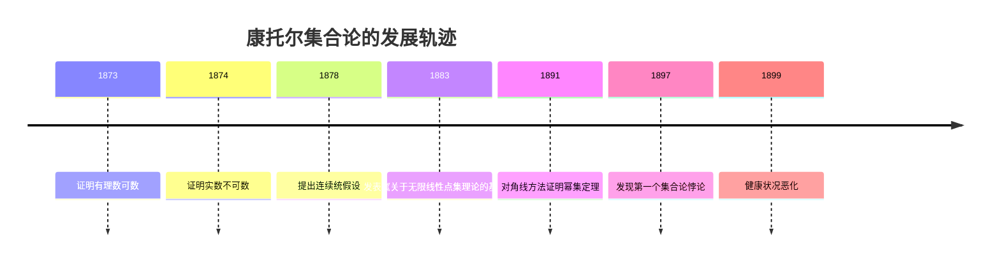
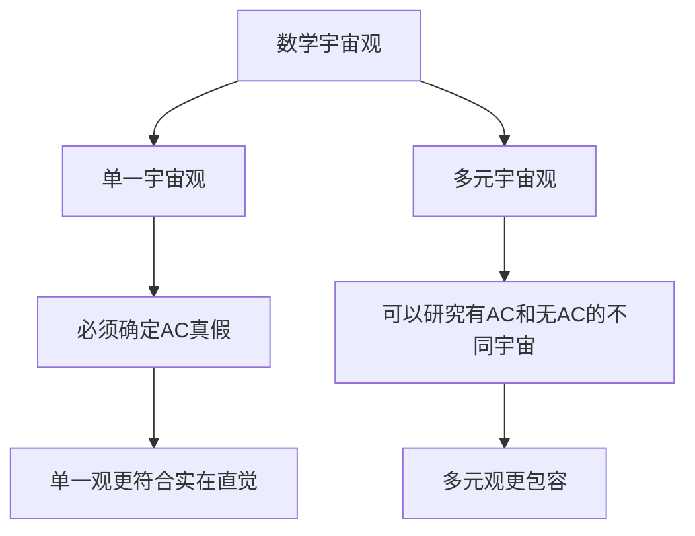
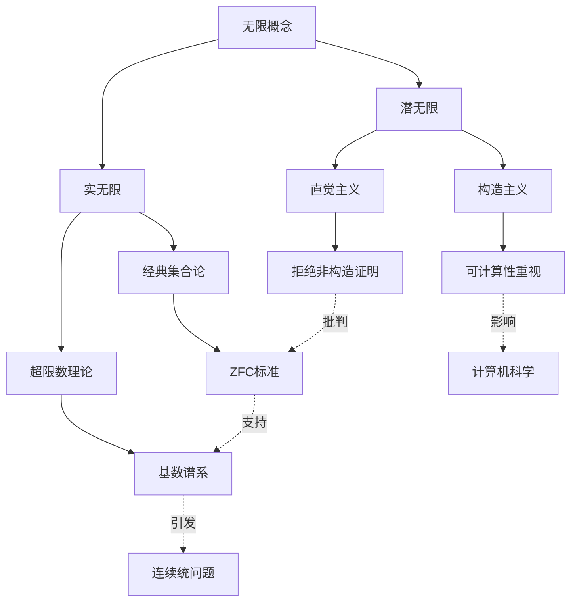
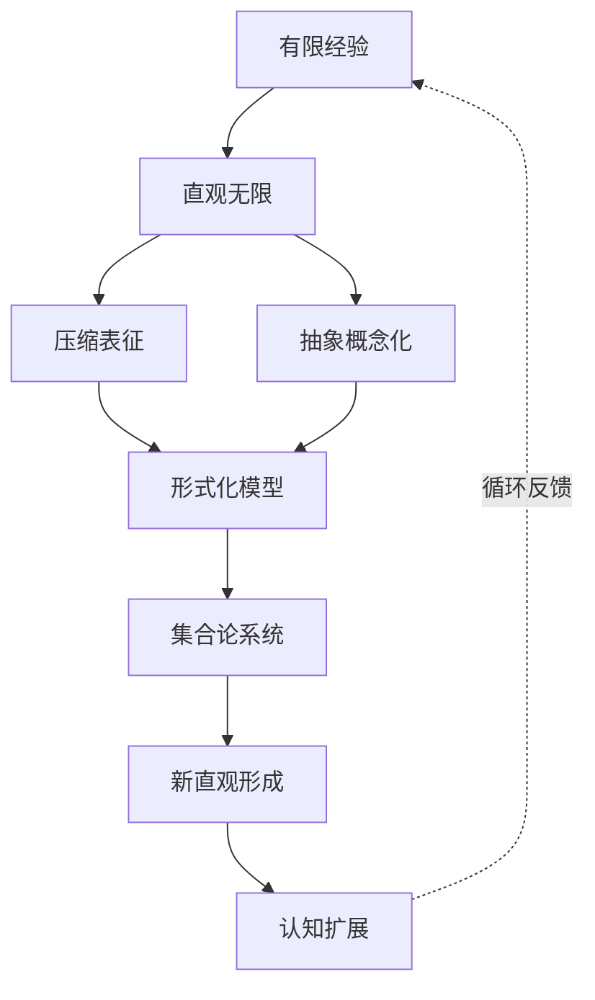
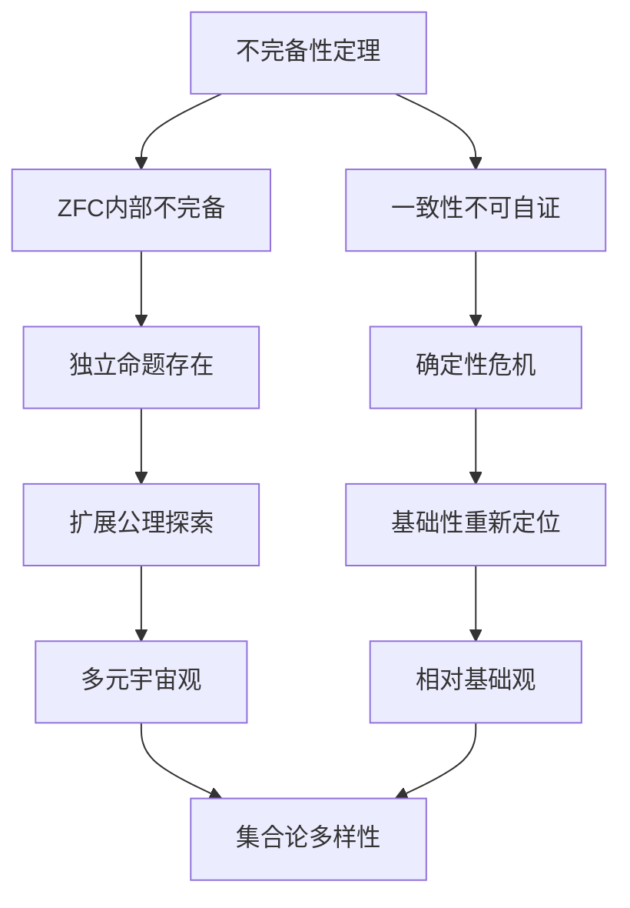
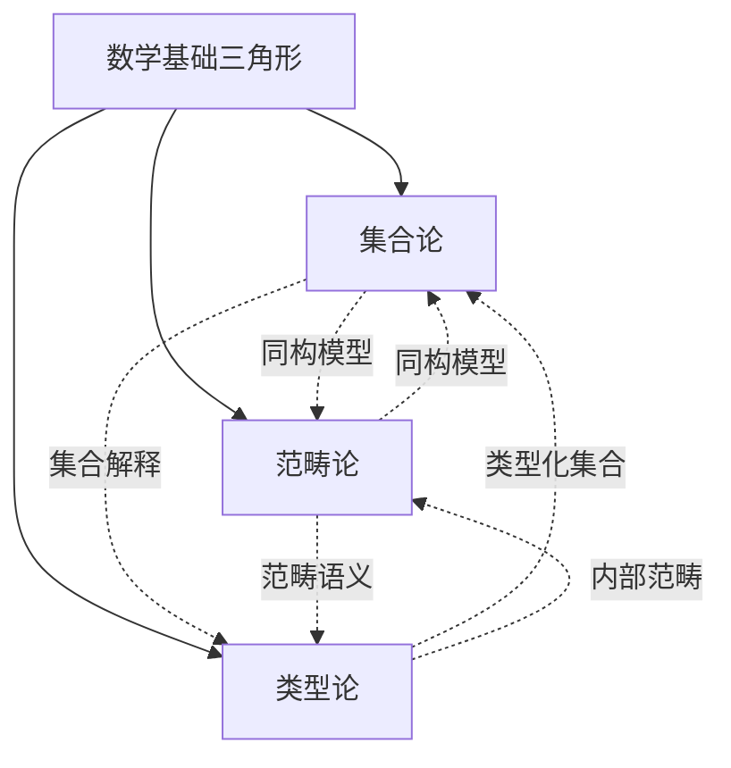
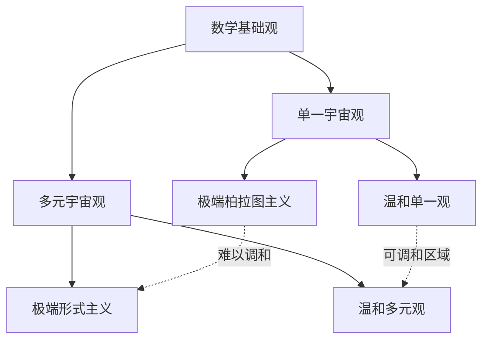
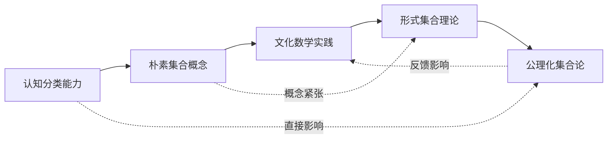
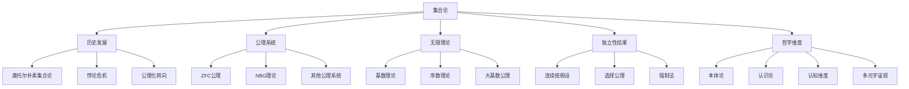

# 集合论的多维视角：一场批判性哲科探索

## 目录

- [集合论的多维视角：一场批判性哲科探索](#集合论的多维视角一场批判性哲科探索)
  - [目录](#目录)
  - [引言：认知与集合的双重起源](#引言认知与集合的双重起源)
  - [1. 集合论的历史演化与哲学张力](#1-集合论的历史演化与哲学张力)
    - [1.1 集合观念的前数学时期](#11-集合观念的前数学时期)
    - [1.2 康托尔与朴素集合论的诞生](#12-康托尔与朴素集合论的诞生)
    - [1.3 悖论危机与公理化转向](#13-悖论危机与公理化转向)
    - [1.4 多元流派的思想交锋](#14-多元流派的思想交锋)
  - [2. 公理化集合论的层次展开](#2-公理化集合论的层次展开)
    - [2.1 ZFC公理系统的批判性解析](#21-zfc公理系统的批判性解析)
    - [2.2 公理的存在性意义](#22-公理的存在性意义)
    - [2.3 选择公理的争议与本体学考量](#23-选择公理的争议与本体学考量)
    - [2.4 替代模式的认知学解读](#24-替代模式的认知学解读)
  - [3. 无限性的哲科维度](#3-无限性的哲科维度)
    - [3.1 潜无限与实无限的双重视角](#31-潜无限与实无限的双重视角)
    - [3.2 阿列夫数谱系与可达基数](#32-阿列夫数谱系与可达基数)
    - [3.3 序数的本体论探究](#33-序数的本体论探究)
    - [3.4 无限结构的认知模型化](#34-无限结构的认知模型化)
  - [4. 集合论与数学基础的辩证关系](#4-集合论与数学基础的辩证关系)
    - [4.1 还原主义的成就与边界](#41-还原主义的成就与边界)
    - [4.2 不完备性对集合论基础地位的挑战](#42-不完备性对集合论基础地位的挑战)
    - [4.3 集合论与范畴论的互补性](#43-集合论与范畴论的互补性)
    - [4.4 类型论视角与直观集合论](#44-类型论视角与直观集合论)
  - [5. 独立性结果的认识论意义](#5-独立性结果的认识论意义)
    - [5.1 连续统假设的悬而未决](#51-连续统假设的悬而未决)
    - [5.2 强制法的思想革命](#52-强制法的思想革命)
    - [5.3 多元宇宙观与单一宇宙观的争辩](#53-多元宇宙观与单一宇宙观的争辩)
    - [5.4 真理概念的多重变奏](#54-真理概念的多重变奏)
  - [6. 集合论与人类认知结构的映射关系](#6-集合论与人类认知结构的映射关系)
    - [6.1 分类思维与集合形成的心理学基础](#61-分类思维与集合形成的心理学基础)
    - [6.2 语言、模糊集与典型性效应](#62-语言模糊集与典型性效应)
    - [6.3 隐喻、原型与理想化集合](#63-隐喻原型与理想化集合)
    - [6.4 集合认知的发展阶段与文化差异](#64-集合认知的发展阶段与文化差异)
  - [7. 集合与逻辑系统的互构性](#7-集合与逻辑系统的互构性)
    - [7.1 一阶逻辑与ZFC的表达力边界](#71-一阶逻辑与zfc的表达力边界)
    - [7.2 大基数公理与超越性](#72-大基数公理与超越性)
  - [8. 集合论与逻辑系统的互动](#8-集合论与逻辑系统的互动)
    - [8.1 一阶逻辑的优势与局限](#81-一阶逻辑的优势与局限)
    - [8.2 集合论的语义悖论与解决方案](#82-集合论的语义悖论与解决方案)
  - [9. 集合论与人类认知结构的映射](#9-集合论与人类认知结构的映射)
    - [9.1 集合直观的认知根源](#91-集合直观的认知根源)
    - [9.2 集合论悖论的认知解读](#92-集合论悖论的认知解读)
    - [9.3 抽象层次与认知台阶](#93-抽象层次与认知台阶)
  - [10. 集合论与数学其他分支的交互网络](#10-集合论与数学其他分支的交互网络)
    - [10.1 作为统一基础的集合论](#101-作为统一基础的集合论)
    - [10.2 范畴论挑战与集合论回应](#102-范畴论挑战与集合论回应)
  - [11. 集合论与现实的本体论关联](#11-集合论与现实的本体论关联)
    - [11.1 数学柏拉图主义与集合实在性](#111-数学柏拉图主义与集合实在性)
    - [11.2 结构主义转向与关系本体论](#112-结构主义转向与关系本体论)
    - [11.3 物理世界与集合论模型](#113-物理世界与集合论模型)
  - [12. 批判性反思与未来展望](#12-批判性反思与未来展望)
    - [12.1 集合论的认识论限制](#121-集合论的认识论限制)
    - [12.2 多元宇宙观与数学相对主义](#122-多元宇宙观与数学相对主义)
    - [12.3 集合论与认知未来](#123-集合论与认知未来)
  - [结论：集合论的哲科地图](#结论集合论的哲科地图)
  - [附录：经典案例分析](#附录经典案例分析)
    - [案例1：康托尔对角线论证的多层次解读](#案例1康托尔对角线论证的多层次解读)
    - [案例2：连续统假设的独立性证明](#案例2连续统假设的独立性证明)
    - [案例3：罗素悖论与类型论的诞生](#案例3罗素悖论与类型论的诞生)
  - [学习与实践指南](#学习与实践指南)
    - [集合论的多层次学习路径](#集合论的多层次学习路径)
    - [思考练习与哲学问题](#思考练习与哲学问题)
    - [批判性研究方法](#批判性研究方法)
  - [概念地图与可视化表征](#概念地图与可视化表征)
  - [参考文献](#参考文献)
  - [思维导图：集合论的知识网络](#思维导图集合论的知识网络)

## 引言：认知与集合的双重起源

集合论作为现代数学的基石，其影响早已超越纯粹数学领域，深入渗透至逻辑学、哲学、认知科学乃至物理学等多个学科。然而，这一看似简单的"多归一"思想，却同时是人类最原始的认知能力之一，也是最精致的数学抽象之一。我们从婴儿时期就能区分"这些"与"那些"，从原始社会就有对事物的分类与归纳，但要精确理解什么是集合，什么是隶属关系，又引发了数学史上最深刻的危机之一。

本文旨在通过批判性哲科视角，探索集合论作为人类思维工具与数学结构的双重身份，揭示其与人类认知结构、逻辑体系、数学基础、物理现实及本体论问题的深层关联。我们将不满足于技术性描述，而是深入集合论的本质争议，思考诸如："集合是发现还是发明？"、"无限集合是否真实存在？"、"为何集合论能成为数学的基础？"等根本问题。

在这场批判性哲科探索中，我们将见证集合概念如何从直观的"多与一"关系，演化为一个内部充满张力的精密体系；也将看到不同思想流派如何围绕集合本质展开激烈论争；更将理解集合论如何同时容纳着构造与非构造、确定与不确定、有限与无限的辩证统一。

让我们带着批判的眼光与开放的心态，开始这场横跨认知与形式、哲学与数学、历史与逻辑的集合论多维探索。

## 1. 集合论的历史演化与哲学张力

### 1.1 集合观念的前数学时期

集合观念作为一种思维方式，远早于其数学形式化。在人类思维发展的早期阶段，集合思想以分类与归纳的形式存在于各文明之中。

**哲学源流：**

- **古希腊的类别思想**：亚里士多德的"范畴"与"类"的概念已包含集合的雏形，但其强调的是本质论视角下的自然分类，而非现代集合论中的任意汇聚
- **中世纪的普遍性问题**：关于普遍性(universals)的争论——实在论(集合具有独立于个体的实在性)、唯名论(集合仅为心智创造的名称)与概念论(集合作为心智抽象但有基础)——预示了现代集合论中的本体论争议

**认知基础：**

- 人类从婴儿时期就表现出对"集体性"的感知能力，能够区分"三个苹果"与"四个苹果"的差异，这种数量敏感性为集合概念提供了认知基础
- 分类学思维在不同文化中普遍存在，从早期的动植物分类到社会阶层划分，都体现了原始集合观念

**批判性反思：** 集合观念的普遍性暗示其可能具有先验的认知基础，但各文化中集合思想的差异又表明其深受具体实践与语言结构的影响。此种张力提醒我们：现代集合论虽有其数学客观性，但不应忽视其人类认知与文化根源。

### 1.2 康托尔与朴素集合论的诞生

**历史背景与突破：**

- 19世纪数学界面临着无限级数、微积分基础、连续统本质等核心问题
- 格奥尔格·康托尔(Georg Cantor, 1845-1918)从三角级数研究出发，逐步构建了集合论的基础

**核心概念的形成：**

- **集合定义**：康托尔定义集合为"我们的直觉或思想中明确确定的，可区分的对象构成的总体"——这一定义本身就含有哲学上的主观性与模糊性
- **基数理论**：通过一一对应原则定义基数，实现了对无限的精确度量
- **超限数**：阿列夫数系统的建立，开创了"实无限"的数学化

**哲学革命与阻力：**

- 康托尔的集合论挑战了传统的"潜无限"观念，确立了"实无限"的合法地位，从认识论上开辟了数学新疆域
- 遭遇了包括克罗内克(Leopold Kronecker)在内的强烈反对，这种对立反映了关于数学本质的深层哲学分歧



**批判性评价：** 康托尔的工作既是数学创新，也是哲学突破。他将无限从潜在的、过程性的概念转变为实际的、完成的对象，从而使得无限可以被数学化处理。然而，这种转变同时引入了认识论和本体论上的紧张关系——我们如何能认识"完成的无限"？这种概念是否仅仅是形式上的构造而非真实存在？这些问题至今仍是数学哲学的核心议题。

### 1.3 悖论危机与公理化转向

**悖论的出现与本质：**

- **罗素悖论(1901)**："不包含自身的所有集合的集合"是否包含自身？
- **布拉利-福尔蒂悖论(1897)**：关于"所有序数的集合"的矛盾
- **理查德悖论(1905)**：关于可定义实数的悖论

这些悖论的共同本质是自指性与无限的交织，揭示了朴素集合论在处理"全体"、"自身关系"等概念时的内在张力。

**公理化方案的出现：**

- **策梅洛-弗兰克尔集合论(ZF, 1908-1922)**：引入了公理化方法，限制集合形成的方式
- **冯·诺依曼-伯恩斯坦-哥德尔集合论(NBG)**：引入类与集合的区分
- **策梅洛-弗兰克尔加选择公理(ZFC)**：成为现代数学的主流基础

**哲学转向的意义：**

- 从直观的"集合是对象的集合"转向规范的"满足特定公理的结构是集合"
- 从本体论导向转向方法论导向，反映了数学基础研究的整体哲学转变

| 公理化集合论与朴素集合论的哲学对比 |
|---|
| **朴素集合论**：集合由其元素确定，强调内涵与直观 |
| **公理化集合论**：集合由公理系统规范，强调外延与规则 |
| **朴素集合论**：存在预设，任何性质确定一个集合 |
| **公理化集合论**：存在受限，仅特定方式构造的对象是集合 |
| **朴素集合论**：认识论乐观主义，相信直观把握集合 |
| **公理化集合论**：认识论谨慎主义，通过公理间接确保一致性 |

**批判性反思：** 公理化转向不仅是技术层面的修补，更是数学哲学的范式转变。它体现了人类在面对思维困境时的自我反思能力——当我们无法直接理解某一概念时，可以转而研究满足特定规则的系统。然而，公理化也意味着某种程度上的"意义丧失"——集合不再是我们能直观把握的对象集合，而成为满足某些形式化规则的抽象实体。这种转变为数学提供了坚实基础，却也使数学与日常直观进一步分离。

### 1.4 多元流派的思想交锋

**形式主义视角：**

- **希尔伯特纲领**：将集合论视为无意义符号的形式游戏，关注一致性而非真实性
- **形式化贡献**：推动了严格公理化，发展了模型论和证明论
- **局限性**：哥德尔不完备定理对形式主义构成了根本挑战

**逻辑主义立场：**

- **弗雷格与罗素**：试图将集合论化约为逻辑，《数学原理》中的类型论
- **贡献**：开创了数理逻辑，形成了类型论传统
- **困境**：还原性项目未能完全成功，需要非逻辑公理

**直觉主义批判：**

- **布劳威尔的反驳**：拒斥实无限，强调数学是心智构造活动
- **构造性要求**：数学对象必须能够被构造，而非仅仅被证明存在
- **影响**：尽管主流采用经典集合论，构造主义思想影响了计算机科学

**柏拉图主义信念：**

- **哥德尔立场**：数学对象（包括集合）具有独立于人类心智的客观存在
- **直觉能力**：认为人类具有把握数学实在的特殊直觉
- **现代影响**：许多工作数学家在实践中持柏拉图主义态度

**结构主义转向：**

- **布尔巴基学派**：强调数学结构而非个体对象，集合论作为统一语言
- **范畴论挑战**：提供了另一种数学基础视角，强调关系而非对象
- **哲学意义**：从"集合是什么"转向"集合做什么"

**批判性评价：** 这些多元流派的交锋表明，集合论不仅是一个数学体系，更是一个哲学战场。各流派的分歧不仅涉及技术细节，更反映了对数学本质、认知能力和存在性等根本问题的不同立场。值得注意的是，这些看似对立的视角在某种程度上是互补的——形式主义关注语法结构，逻辑主义注重推理规则，直觉主义强调构造过程，柏拉图主义突出实在性，结构主义重视关系网络。完整理解集合论，需要在这些视角间灵活切换，而非固守单一立场。

## 2. 公理化集合论的层次展开

### 2.1 ZFC公理系统的批判性解析

ZFC(Zermelo-Fraenkel with Choice)公理系统作为现代数学的主流基础，其每一条公理都蕴含深刻的哲学思考和认知假设。以下是对核心公理的批判性解析：

**外延公理(Axiom of Extensionality)：**

```math
∀x∀y[∀z(z∈x ↔ z∈y) → x=y]
```

- **意义**：集合由其元素唯一确定，强调外延性而非内涵
- **哲学蕴含**：集合的本质在于其成员而非定义方式，反映了数学对象的客观性追求
- **认知限制**：与人类倾向于通过属性（内涵）识别集合的认知习惯存在张力

**配对公理(Axiom of Pairing)：**

```math
∀x∀y∃z∀w(w∈z ↔ w=x ∨ w=y)
```

- **构造意义**：允许从已有对象构造新集合，体现了自下而上的构造思想
- **哲学前提**：集合可以包含不同类型的对象，暗示了集合概念的包容性

**并集公理(Axiom of Union)：**

```math
∀x∃y∀z(z∈y ↔ ∃w(w∈x ∧ z∈w))
```

- **整合功能**：允许将多个集合中的元素合并，体现集合的聚合功能
- **层次观念**：揭示了集合理论中的层次结构，是处理无限层次的重要工具

**幂集公理(Power Set Axiom)：**

```math
∀x∃y∀z(z∈y ↔ z⊆x)
```

- **爆炸性增长**：导致基数的指数级增长，是连续统假设的核心背景
- **本体论负担**：承诺了巨大的数学实体存在，引发了本体论节约的批判

**分离公理模式(Schema of Separation)：**

```math
∀x∃y∀z(z∈y ↔ z∈x ∧ φ(z))
```

- **受限性特征**：仅允许从现有集合中"分离"出子集，而非任意构造新集合
- **悖论防御**：通过限制集合形成方式避免罗素悖论
- **语言依赖**：依赖于形式语言φ表达的性质，反映形式与内容的交织

**替代公理模式(Schema of Replacement)：**

```math
∀x[∀u∈x∃!vφ(u,v) → ∃y∀v(v∈y ↔ ∃u∈xφ(u,v))]
```

- **映射本质**：允许通过函数关系创建新集合，体现数学中关系的基础地位
- **技术复杂性**：是ZFC中最技术性的公理，其必要性常被质疑
- **构造超越**：使得超越序数的构造成为可能，拓展了集合论的表达力

**正则公理(Axiom of Regularity/Foundation)：**

```math
∀x[x≠∅ → ∃y(y∈x ∧ y∩x=∅)]
```

- **循环禁止**：排除了自身成员关系，确保集合论的"良基性"
- **直觉冲突**：与某些自然自指现象（如"所有真命题的集合"）的直觉表达存在冲突
- **替代可能**：非良基集合论为某些领域提供了替代基础

**无穷公理(Axiom of Infinity)：**

```math
∃x[∅∈x ∧ ∀y(y∈x → y∪{y}∈x)]
```

- **存在承诺**：直接断言无限集合的存在，是对有限主义的超越
- **构造起点**：为构造自然数以及更大的无限提供了基础
- **非必然性**：其本体论地位存疑，是数学假设而非逻辑必然

**选择公理(Axiom of Choice)：**

```math
∀x[∀y∈x(y≠∅) → ∃f:x→∪x∀y∈x(f(y)∈y)]
```

- **决定性假设**：断言可以同时从任意多个非空集合中各选一个元素
- **非构造性**：仅断言选择函数存在而不提供构造方法
- **反直觉结果**：导致如巴拿赫-塔斯基分解等反直觉结果
- **实用地位**：尽管争议，但在现代数学中不可或缺

**批判性综合评价：**
ZFC公理系统体现了数学思维的多重张力——在构造性与非构造性、有限与无限、确定性与选择性之间寻求平衡。
它既不是完全自明的真理，也非纯粹的形式规则，而是人类长期数学实践中逐步提炼的概念框架。
每条公理都可视为一种认知假设或本体论承诺，表达了我们期望集合世界应具有的特性。

公理系统的多样性（ZF、ZFC、NBG、MK等）提醒我们：没有唯一"正确"的集合论，而是存在多种可能的数学"宇宙"，每种都有其特定的表达力和限制。
选择何种公理系统，在某种程度上反映了数学家的哲学偏好和研究需求，而非客观真理的单一途径。

### 2.2 公理的存在性意义

公理化集合论的核心特征之一，是其通过公理直接断言特定数学对象的存在。
这种存在性断言引发了深刻的哲学问题：
  这些"存在"断言的本质是什么？
  它们与物理存在有何不同？
  我们凭什么相信这些断言？

**存在性公理的本体论谱系：**

| 公理 | 存在性断言 | 本体论负担 |
|---|---|---|
| 空集公理 | 存在空集 | 最小 |
| 配对公理 | 存在包含任意两个集合的新集合 | 低 |
| 并集公理 | 存在包含给定集合所有元素的集合 | 中 |
| 幂集公理 | 存在包含所有子集的集合 | 高 |
| 无穷公理 | 存在无限集合 | 非常高 |
| 选择公理 | 存在选择函数 | 极高 |

**多重哲学视角：**

- **柏拉图主义**：这些公理揭示了独立存在的数学实在，集合在某个抽象领域中"真实存在"
- **形式主义**：存在性断言仅是形式系统中的符号游戏，无需对应实在
- **直觉主义**：只有能被构造的对象才真正"存在"，非构造性存在证明不可接受
- **结构主义**：重要的不是单个对象的存在，而是整体结构及其关系
- **虚构主义**：数学对象如同小说人物，是有用的虚构，而非真实存在

**批判性思考：** 集合论公理的存在性断言不同于物理理论的经验断言，不能通过观察或实验直接验证。
它们的合理性来源有三：
(1)形式一致性——未导致已知矛盾；
(2)数学丰产性——生成了丰富有用的数学结果；
(3)直觉吸引力——符合某种数学直觉。

然而，当我们考察如无穷公理和选择公理等高阶存在性断言时，本体论负担变得沉重。
为何接受这些负担？
这反映了数学发展的实用主义一面：数学家愿意接受那些能产生丰富理论的公理，即使它们在本体论上有争议。
这种态度表明，数学实践往往优先于纯粹哲学考量，数学的"真实性"在某种程度上是由其解释世界和产生结果的能力决定的，而非预设的形而上学立场。

### 2.3 选择公理的争议与本体学考量

选择公理(AC)是ZFC中最具争议的公理，其地位特殊性源于其非构造性特征与反直觉结果的组合。
对选择公理的态度，成为区分不同数学哲学立场的试金石。

**选择公理的形式表述：**
对于任意非空集合族X，存在一个函数f (称为选择函数)，对每个非空集合A∈X，都有f(A)∈A。

**直观理解：** 从无限多个集合中同时各选一个元素是可能的。

**支持选择公理的理由：**

- **数学实用性**：许多重要定理依赖于它（Tychonoff定理、Hahn-Banach定理等）
- **数学自然性**：与我们对选择操作的直觉相符
- **统一性**：对有限情况，选择公理是显然的；将其扩展到无限情形保持了概念统一
- **没有导致矛盾**：尽管带来奇特结果，但未导致形式系统崩溃

**反对选择公理的理由：**

- **非构造性**：仅断言选择函数存在，却不提供构造方法
- **反直觉结果**：导致巴拿赫-塔斯基悖论（将球分解重组为两个相同大小的球）等违反直觉的结果
- **决定论问题**：与某些决定论数学观念相悖
- **形式主义不满**：增加了本体论承诺，而形式主义倾向于最小化此类承诺

**选择公理的哲学核心：** 选择公理争议的核心是关于"存在"概念的理解差异——对象仅通过被证明存在就可被接受（经典数学立场），还是必须通过明确构造才真正存在（构造主义立场）？

**选择公理的相对一致性：** 哥德尔(1938)和科恩(1963)的工作证明，选择公理与ZF的其余部分是相对独立的——既不能从其他公理证明，也不会导致矛盾。这一结果表明，关于选择公理的争论不可能通过纯粹的逻辑推理解决，而是取决于数学哲学立场。

**选择公理与数学宇宙观：**



**批判性反思：** 选择公理之争表明，数学并非价值中立的形式系统，而是融合了哲学假设、美学判断和实用考量的复杂人类活动。
我们对选择公理的态度常受到研究领域的影响——分析学家倾向接受它，构造主义计算机科学家可能拒绝它，而集合论家可能采取中立立场研究其独立性。

这种多元态度提醒我们：数学基础并非绝对真理的金字塔，而更像是建立在特定前提上的多重可能性探索。
一个成熟的数学哲学立场应承认这种多元性，同时理解不同公理选择的动机和后果。

### 2.4 替代模式的认知学解读

替代公理模式(Schema of Replacement)是ZFC中技术性最强的公理，它允许通过函数映射已有集合来构造新集合。从认知科学角度看，这一公理反映了人类思维中的基本能力——通过转换和映射来理解新概念。

**替代模式的形式表述：**
若φ(x,y)是一个函数关系（对每个x至多对应一个y），则对任意集合A，存在一个集合B，使得对任意y，y∈B当且仅当存在x∈A使得φ(x,y)成立。

**认知对应分析：**

- **映射思维**：替代模式对应于人类的"如果这个是那样，那么那个也应该这样"的推理模式
- **类比能力**：反映了通过类比和对应关系理解新领域的认知能力
- **函数思维**：形式化了输入-输出关系的概念，这是人类解决问题的基本模式

**替代模式的关键功能：**

- 使得无限序数阶层的构建成为可能
- 允许递归定义和传递闭包的形成
- 是建立大基数理论的必要工具

**与其他公理的对比：**
分离公理模式(Schema of Separation)只允许从现有集合中"筛选"元素，而替代模式允许"变换"元素，因此具有更强的构造能力。

**替代模式的认知负担：**

- 需要理解函数关系的抽象概念
- 涉及量词嵌套，增加了认知复杂性
- 要求对"模式"概念有高层次理解

**批判性视角：** 替代模式揭示了数学思维与日常认知之间的微妙关系。一方面，它形式化了人类的映射思维能力；另一方面，其严格数学表述远比直观理解复杂。这种张力提醒我们，数学形式化既是对认知能力的提炼，也是对其的超越——数学允许我们系统化地延伸思维能力，达到直觉难以企及的复杂性和精确性。

替代模式也反映了集合论的语言依赖性——它是一个公理模式（无限多个公理的模板），而非单一公理，这表明ZFC在某种程度上依赖于元语言，而非完全自包含。这种依赖提醒我们，即使是最形式化的数学体系，也无法完全摆脱其语言和认知根源。

## 3. 无限性的哲科维度

### 3.1 潜无限与实无限的双重视角

无限概念的理解是集合论哲学的核心挑战。
传统上，无限被区分为两种截然不同的概念：潜无限(potential infinity)与实无限(actual infinity)。
这一区分不仅涉及数学技术，更反映了深刻的认知与本体论分歧。

**潜无限与实无限的对比：**

| 潜无限 | 实无限 |
|---|---|
| 无限作为过程 | 无限作为完成的对象 |
| 始终"正在进行" | 被视为"已完成的整体" |
| 无限作为可能性 | 无限作为现实性 |
| 亚里士多德传统 | 康托尔革命 |
| "任意大"的观念 | "无限大"的观念 |
| 强调构造过程 | 强调存在事实 |

**历史哲学争论：**

- **古希腊的"无限厌恶"**：希腊数学家普遍避免无限概念，偏好有限构造
- **亚里士多德的区分**：认为潜无限可接受，实无限不可接受，影响了此后两千年
- **中世纪争论**：托马斯·阿奎那等承认上帝能理解实无限，人类只能理解潜无限
- **康托尔的突破**：将实无限作为数学对象，并通过基数理论给予精确处理

**认知困境与突破：**

- 人类认知的有限性使得直接"把握"无限整体困难，我们倾向于将无限理解为过程
- 然而，数学抽象允许我们通过符号和规则间接处理实无限，超越认知直接限制
- 这种突破是否意味着认知的真正拓展，还是仅仅是符号操作的形式游戏？



**批判性反思：** 潜无限与实无限的区分不仅是数学上的，更是认识论与本体论上的。
接受实无限意味着将"完成的无限整体"视为合法的认知对象，这远超出感知经验，是纯粹思维的产物。
然而，我们日常使用"所有自然数"这样的表达时，似乎已在某种程度上接受了实无限的概念。
这种张力反映了人类思维同时具有"过程性思考"与"整体把握"的双重能力，而数学形式化使得后者能以受控方式展开。

值得深思的是：当我们在集合论中操作无限集合时，我们是否真正"理解"了无限，还是仅仅掌握了一套处理无限的形式规则？这种区分折射出数学知识的双重性质——既是操作性的又是概念性的，既是形式的又是直观的。

### 3.2 阿列夫数谱系与可达基数

康托尔的最伟大成就之一是开创了无限基数的严格理论，建立了阿列夫数谱系。
这一谱系不仅是技术上的进步，更是对无限概念本质的深刻洞察。

**基数理论的基础：**

- **基数定义**：通过一一对应(bijection)关系定义，两个集合有相同基数当且仅当它们之间存在一一对应
- **基数序关系**：|A| ≤ |B| 当且仅当存在从A到B的单射(injection)
- **康托尔定理**：对任意集合A，|A| < |P(A)|（幂集的基数严格大于原集合）

**阿列夫数谱系：**

- **ℵ₀** (Aleph-null)：可数无限，自然数集的基数
- **ℵ₁**：第一个不可数基数，所有可数序数的集合的基数
- **ℵ₂, ℵ₃,...**：更高阶的不可数基数
- **ℵ₍ₐ₎**：任意序数α对应的阿列夫数

**康托尔猜想与连续统问题：**

- 连续统假设(CH)：|ℝ| = ℵ₁，即不存在基数严格介于ℵ₀与|ℝ|之间的集合
- 广义连续统假设(GCH)：对任意序数α，2^ℵ^α^ = ℵ₍ₐ₊₁₎

**大基数公理与可达基数：**

- **不可达基数**：超越常规ZFC构造能力的基数，需要额外公理假设
- **可测基数、紧基数、超紧基数**：具有特殊性质的大基数
- **本体论递进**：每种大基数公理引入新层次的"存在"承诺

**物理学与认知的边界问题：**

- 物理宇宙是否包含真正的不可数无限？量子力学与相对论的启示
- 人类心智能否真正理解ℵ₁及更高阿列夫数，还是仅在符号层面操作？

**批判性视角：** 阿列夫数谱系展示了形式化数学如何超越直观认知限制，构建日常思维难以企及的概念体系。在康托尔的无限梯阶中，每一级阿列夫数都比前一级"大得不可思议"——ℵ₁包含ℵ₀个不同的可数集合，ℵ₂包含ℵ₁个不同的ℵ₁级集合，依此类推。这种爆炸性增长远超日常直观，甚至引发了如康托尔自己的宗教式思考：他将这些较高阿列夫数视为接近"绝对无限"（上帝）的阶梯。

从认知角度看，阿列夫数理论体现了人类通过形式系统超越认知直接限制的能力。
我们无法直观想象ℵ₁的"大小"，但能够精确地在形式系统中推导其性质。
这种"形式化超越"是数学认知的独特特征，同时也提出挑战：没有直观基础的形式化知识，其认识论地位是什么？我们是真正"理解"了这些概念，还是仅掌握了操作规则？

### 3.3 序数的本体论探究

序数(ordinals)代表了集合论对"有序"与"无限"的深度融合，提供了对无限过程的严格形式化。
序数的本体论地位特别引人深思：它们似乎介于"发明"与"发现"之间，同时具有操作性与表征性。

**序数的形式化：**

- **冯·诺依曼定义**：将序数定义为所有小于它的序数的集合，如0=∅, 1={0}, 2={0,1}, 3={0,1,2}...
- **良序集**：序数对应于同构的良序集类型
- **超限归纳法**：基于序数的强大证明技术，超越常规归纳法

**有限序数与超限序数：**

- **有限序数**：对应自然数，表示有限排序
- **ω**：第一个超限序数，代表自然数序列的序类型
- **ω+1, ω+2, ..., ω·2, ..., ω², ..., ω^ω, ...**：超限序数的无尽阶梯

**序数的本体论定位：**

- **柏拉图视角**：序数作为独立于心智的数学实在
- **构造主义视角**：序数作为有序集合的组织原则
- **虚构主义视角**：序数作为有用的虚构，类似数学中的"理想对象"

**序数的认知映射：**

- 序数提供了"无限继承"的精确模型，形式化了"依此类推"的直观
- 超限序数捕捉了"超越有限"后依然保持顺序性的思维延展
- 序数算术展现了"有序结构组合"的抽象规则

**序数与时间概念的关联：**

- 有限序数映射于离散时间点
- ω对应于无尽但可数的时间序列
- 更高序数是否可能对应某种"超时间"结构？

**批判性思考：** 序数理论呈现了数学抽象的双重特性——既源于直观（顺序、继承），又超越直观（不可数序数、序数算术）。序数的建构既遵循精确规则，又产生惊人丰富的结构，这种"受控的创造性"是数学思维的标志。

值得深思的是，序数的清晰形式化与其直观基础之间的关系：良序的直观概念（任何非空子集都有最小元素）似乎简单，但其在无限集合上的应用引发了复杂的序数层次。
这种从简单原则到复杂结构的涌现，暗示了数学创造的特殊机制——通过将基本直观推广到极限情况，产生全新的概念领域。

序数理论也挑战了传统的"发现vs发明"二分法。
序数的基本定义可视为人类发明，但一旦定义确立，序数结构的丰富性似乎是被"发现"的。
这种现象支持了一种"受约束的实在论"——数学对象在特定公理约束下展现独立于创造者的性质，形成一种"依赖性实在"。

### 3.4 无限结构的认知模型化

无限是人类认知的边界概念——我们的直接经验全部基于有限，却能够构想并形式化无限。
集合论为无限提供了精确模型，但这些模型与我们的认知过程有何关联？
如何解释人类能够有效操作超出直观范围的无限概念？

**无限认知的神经基础：**

- **无限直觉的来源**：研究表明，大脑内侧顶叶与抽象数量表征相关
- **递归能力**：语言区域的递归处理能力可能是理解无限的认知基础
- **模式识别**：大脑强大的模式提取和延伸能力支持"无限继续"的概念形成

**认知模型的类型：**

- **压缩模型**：通过有限表征（如"等等"或递归规则）压缩潜在无限过程
- **抽象模型**：将无限集合视为单一抽象对象，忽略内部细节
- **操作模型**：通过明确的操作规则间接处理无限对象

**无限概念的认知发展：**

- **儿童发展阶段**：从"很多很多"到理解无限不可达的质变
- **文化与语言因素**：不同文化对无限的概念化方式及其对数学理解的影响
- **教育挑战**：从直观无限到形式无限的教学策略与困难

**形式模型与认知模型的映射：**

| 集合论形式模型 | 对应认知模型 | 认知特征 |
|---|---|---|
| 自然数集合 | 递归模型 | "永远继续"思维 |
| 实数连续统 | 空间模型 | 连续空间直观 |
| 幂集运算 | 组合爆炸模型 | 所有可能性思考 |
| 超限序数 | 超越模型 | "更上一层"思维 |

**认知边界与集合论悖论：**

- 悖论作为认知不一致的标志：自指集合的悖论可能反映认知模型的局限
- 认知冲突：日常经验中"所有X的集合"概念与形式集合论的冲突
- 语言陷阱：自然语言的灵活性与模糊性导致形式系统中的矛盾



**批判性反思：** 无限概念展示了认知与形式系统的复杂互动。
一方面，我们的无限概念源于有限经验的延展；
另一方面，一旦形式化，这些概念又反过来塑造我们的思维。
这种循环关系质疑了传统的"先有直观，后有形式"的简单模型，暗示认知与形式化可能是共同演化的。

无限模型的多样性也挑战了单一数学实在论。
在不同文化和历史背景下，人们发展了不同的无限概念化方式。
即使在现代数学中，对无限的处理也存在多种方法（如标准分析与非标准分析）。
这种多样性表明，数学结构可能不是被动发现的，而是在特定认知约束下积极构建的。

集合论的无限模型并非完美映射认知，而是对认知直觉的精炼、扩展与变形。
理解这种关系有助于解释为何某些集合论概念（如良序集）易于掌握，而其他概念（如不可数基数的比较）则认知负担较重。
这种认知视角不仅有助于数学教育，也为数学哲学提供了新的思考维度。

## 4. 集合论与数学基础的辩证关系

### 4.1 还原主义的成就与边界

集合论作为数学基础的核心贡献在于其还原主义方案——将复杂数学对象还原为集合，从而提供统一的形式基础。
这一方案既取得了巨大成功，也面临深刻的哲学与技术挑战。

**还原方案的核心内容：**

- **自然数的集合论定义**：采用冯·诺依曼模型（0=∅, n+1=n∪{n}）或Zermelo模型（0=∅, n+1={n}）
- **整数的集合定义**：通过等价类，如z = [(a,b)]表示a-b，其中(a,b)是有序对
- **有理数的集合定义**：有序对的等价类，p/q = [(p,q)]
- **实数的集合定义**：戴德金分割或柯西序列等价类
- **函数的集合定义**：满足特定条件的有序对集合
- **拓扑空间、度量空间等的集合化**：将各种结构定义为集合及其上的特定关系

**还原主义成就：**

- 提供了统一的符号表达系统，消除了数学对象的本质歧义
- 确立了清晰的存在性标准：对象存在当且仅当其可在ZFC中构造
- 使得跨领域数学证明具有共同形式基础
- 为数学自动化和形式证明提供了框架

**还原主义的局限与挑战：**

- **哲学挑战**：数学还原不等于本体论同一，例如，实数"是"戴德金分割还是"表示为"戴德金分割？
- **多重表征问题**：同一数学对象常有多种等效集合表示，例如整数的不同定义方式
- **意义丧失危机**：在形式化还原过程中，数学概念的直观意义可能被稀释
- **表征与本质的分离**：集合表征反映了对象形式结构，但可能忽略了其本质特征

**替代基础方案的出现：**

- **范畴论基础**：强调对象间关系而非内部组成
- **类型论基础**：更接近计算和证明的本质
- **多元基础主义**：不同数学分支可能需要不同基础

**批判性评价：** 集合论还原主义既是技术成就也是哲学立场。它的成功源于其灵活性和表达力，能够容纳从代数结构到拓扑空间的各种数学对象。然而，"A可以用集合表示"与"A本质上是集合"之间存在哲学鸿沟。这一区分反映了形式基础与认知意义之间的持续张力。

从认知角度看，集合论还原实现了知识的"压缩"——将多样数学对象统一到单一概念框架。这种压缩是认知经济的，但可能以牺牲直观理解为代价。例如，将函数定义为有序对集合虽然精确，但与人们思考函数的方式（输入-过程-输出）相去甚远。

集合论的还原成功提醒我们：数学基础并非仅关乎逻辑正确性，还涉及表达能力、认知经济性和美学考量。理想的基础系统不仅要形式严谨，还应保留对象的本质特征，支持直观思考，并促进创造性发现。这些多重要求可能无法由单一基础系统满足，暗示了多元基础观的合理性。

### 4.2 不完备性对集合论基础地位的挑战

哥德尔不完备性定理(1931)对集合论作为数学绝对基础的地位构成了根本性挑战。这些定理揭示了形式系统的内在局限，深刻影响了我们对数学基础、真理和确定性的理解。

**不完备性定理的核心内容：**

- **第一不完备性定理**：任何包含基本算术的一致的公理化系统中，存在既不能证明也不能反驳的命题
- **第二不完备性定理**：如果系统是一致的，那么这种一致性不能在系统内证明

**对集合论基础的直接挑战：**

- **永恒不确定性**：某些集合论命题（如连续统假设）可能原则上不可判定
- **真理超越形式**：数学真理超出任何特定形式系统的范围
- **基础的不完备性**：任何基础系统都不可避免地不完备
- **自证困境**：ZFC无法证明自身的一致性，除非它本身不一致

**哲学反应谱系：**

| 反应立场 | 代表人物 | 核心主张 |
|---|---|---|
| 悲观主义 | 哥德尔 | 人类心智超越形式系统，数学真理有客观实在性 |
| 形式主义改良 | 希尔伯特学派 | 寻找可证明一致的有限主义片段 |
| 多元宇宙观 | 科恩、哈马斯 | 不同集合论模型代表不同可能的数学"宇宙" |
| 实用主义 | 大多数工作数学家 | 暂时搁置不可判定问题，专注可行领域 |
| 反基础主义 | 后现代数学哲学 | 质疑统一基础的必要性，接受多元基础 |

**集合论作为基础的重新定位：**

- 从"最终真理"到"有用的语言"——集合论作为数学的通用语言而非终极真理
- 从"绝对基础"到"相对基础"——承认集合论自身建立在更基本直观上
- 从"唯一基础"到"多元基础之一"——集合论作为多种可能基础之一

**不完备性与新公理的探索：**

- **大基数公理**：超越标准ZFC的存在性假设
- **构造性原则**：如V=L（所有集合是可构造的）
- **强制法**：科恩开创的研究独立性的强大技术



**批判性反思：** 不完备性定理揭示了形式化与真理之间的根本鸿沟，它既是技术结果也是哲学警示。从技术角度看，它表明任何形式系统都有其表达力边界；从哲学角度看，它挑战了"形式化穷尽真理"的观念，暗示数学理解可能本质上依赖于非形式化直觉。

不完备性的发现既是危机也是机遇。作为危机，它打破了希尔伯特计划的乐观愿景；作为机遇，它开启了更为开放和多元的数学基础观。连续统假设等命题的独立性不必被视为数学的缺陷，而可理解为数学宇宙的丰富性标志——不同的公理选择导向不同但同等一致的数学体系。

从认知角度看，不完备性与我们理解"理解"本身有关。它暗示真正的数学理解不仅仅是掌握形式推导，还包括某种超越形式的直觉把握。这种直觉能力可能是人类数学思维的核心，也是机械形式化难以完全复制的部分。这一认识对人工智能时代的数学研究具有深远启示。

### 4.3 集合论与范畴论的互补性

20世纪后半叶，范畴论(Category Theory)崛起为集合论之外的另一种数学基础视角。这两种基础理论采取了截然不同的哲学立场，反映了数学思维的深层二元性。它们的对比与融合揭示了数学基础的多维本质。

**基本哲学对比：**

| 集合论 | 范畴论 |
|---|---|
| 以对象为中心 | 以关系/映射为中心 |
| 自下而上构建 | 自上而下结构化 |
| 存在先于关系 | 关系构成存在 |
| 具体元素重要 | 结构形态重要 |
| 内部组成视角 | 外部关系视角 |

**范畴论基础的技术特点：**

- **对象抽象化**：对象仅由其与其他对象的关系定义，内部结构被抽象化
- **态射中心主义**：函子、自然变换等映射概念处于核心地位
- **通用性原理**：通过普遍性质刻画数学结构，而非具体构造
- **抽象层次高**：高度概括性，能统一描述不同数学领域的共同模式

**互补优势与局限：**

- **集合论优势**：具体性、构造性、与直觉对应、基数理论
- **集合论局限**：过于关注内部组成，对同构结构区分过多
- **范畴论优势**：关系性、结构保存、跨领域统一性、抽象模式识别
- **范畴论局限**：高度抽象，远离直观，学习曲线陡峭

**两种理论的融合趋势：**

- **集合论的范畴化**：如元集合论、集合论的范畴模型
- **范畴论的集合化基础**：如ETCS (Elementary Theory of the Category of Sets)
- **相互建模**：集合范畴与基本集合论的等价性
- **应用互补**：在数学实践中根据问题选择适当视角

**认知映射关系：**

- 集合论对应分类与归属的认知能力——"这是什么"思维
- 范畴论对应关系与模式的认知能力——"如何联系"思维
- 这两种认知模式在人类思维中互补共存

**批判性反思：** 集合论与范畴论的对比不仅是技术层面的，更反映了数学思维的深层二元性——具体与抽象、组成与关系、存在与结构。这种二元性可能源于人类认知的基本模式：我们既能关注对象本身，又能识别对象间的关系模式。

范畴论的崛起提醒我们，数学基础不应仅关注"最基本对象是什么"，还应思考"最基本关系是什么"。传统集合论侧重前者，视集合成员关系为基础；范畴论则侧重后者，视映射保存为核心。这两种视角并非真正对立，而是同一数学现实的互补视角。

多元基础观可能是最合理的立场——不同基础理论为数学提供不同"坐标系"，各有优势。集合论提供"微观"视角，适合精确构造；范畴论提供"宏观"视角，适合把握结构。数学家在实践中自然地在这些视角间切换，这种灵活性可能正是数学思维的本质特征之一。

### 4.4 类型论视角与直观集合论

类型论(Type Theory)提供了另一种形式化集合概念的方式，它源于罗素对悖论的解决尝试，发展为一种既有逻辑严谨性又有计算意义的理论。类型论与集合论的关系揭示了数学基础的多维复杂性。

**类型论的核心特征：**

- **类型归属关系**：元素a属于类型A写作a:A，与集合论的成员关系e∈S相对应但含义不同
- **类型等级制**：不同类型有严格层次，防止自引用导致的悖论
- **构造性强调**：关注对象如何构造，而非仅断言存在
- **计算内涵**：类型对应计算过程，具有内在算法意义

**主要类型论变体：**

- **简单类型论(STT)**：最基本的类型层次系统
- **依赖类型论(DTT)**：允许类型依赖于值，增强表达力
- **多态类型论**：包含通用量化的类型，如System F
- **同伦类型论(HoTT)**：将类型视为空间，相等性对应路径

**与集合论的本质区别：**

| 集合论特征 | 类型论特征 |
|---|---|
| 元素可属于多个集合 | 表达式有唯一最佳类型 |
| 集合间子集关系 | 类型间子类型关系 |
| 外延相等性(成员相同) | 内涵相等性(定义相同) |
| 关注"是什么" | 关注"如何构造" |
| 存在性证明足够 | 要求构造性证明 |

**类型论的哲学意义：**

- **构造主义实现**：为构造主义数学提供精确形式语言
- **计算作为基础**：将计算过程置于数学基础的核心位置
- **证明即程序**：柯里-霍华德同构揭示证明与程序的深层对应
- **类型多元性**：不同类型系统对应不同逻辑强度和计算能力

**实际应用与影响：**

- **程序验证**：依赖类型系统用于证明程序正确性
- **交互式证明助手**：Coq、Agda、Lean等基于类型论
- **编程语言设计**：函数式语言受类型论深刻影响
- **同伦类型论**：统一逻辑、计算与拓扑学



**批判性视角：** 类型论的发展表明，数学基础不是单一维度的问题，而是多维度平衡的艺术。类型论优先考虑构造性和计算性，这些维度在传统集合论中常被忽视。这种多维性提醒我们，评估基础理论不能仅看其逻辑力量，还需考察其表达自然性、计算有效性和认知友好性。

从认知角度看，类型论可能比集合论更接近人类直观思维的某些方面。我们在日常认知中常按类型分类对象，且关注构造和过程。类型论的"表达式:类型"判断可能比集合论的"元素∈集合"关系更接近自然语言的主谓结构。这种认知自然性可能解释了类型论在计算机科学中的成功——它为形式化人类算法思维提供了自然桥梁。

同伦类型论的出现特别值得关注，它将类型视为空间，将证明视为路径，实现了逻辑、计算和拓扑的惊人统一。这种融合暗示，我们可能正在接近一个更深层次的数学统一视角，超越了传统基础理论的界限。这种统一不是通过还原一切到单一概念（如集合），而是通过揭示不同领域间的结构对应。

## 5. 独立性结果的认识论意义

### 5.1 连续统假设的悬而未决

连续统假设(CH)自1878年康托尔提出至今，历经140多年仍未解决，成为数学基础研究中最著名的开放问题之一。它的独立性结果深刻改变了我们对数学真理的理解，具有超越技术层面的哲学意义。

**连续统假设的表述形式：**

- **基数形式**：不存在基数严格介于ℵ₀（可数无限）与2^ℵ₀（连续统）之间的集合
- **集合论形式**：不存在与自然数集N一一对应且与实数集R不一一对应的集合A
- **分析学形式**：任何不可数的实数集至少有连续统势

**历史发展里程碑：**

- **1878**：康托尔提出问题并尝试证明
- **1900**：希尔伯特将其列为23个问题的第一个
- **1938**：哥德尔证明CH与ZFC相容（在可构造宇宙L中CH成立）
- **1963**：科恩证明~CH与ZFC相容（通过强制法构造反例模型）
- **1967**：索洛维(Solovay)和丁斯坦(Tennenbaum)的随机化结果

**独立性的数学技术：**

- **相对一致性证明**：如果ZFC一致，则ZFC+CH和ZFC+~CH都一致
- **不同集合论宇宙**：康托尔连续统在不同模型中有不同基数：
  - 可构造宇宙L中：|R| = ℵ₁（CH成立）
  - 科恩扩张模型中：|R| = ℵ₂或任意预设的正则基数
  - 添加随机实数模型中：|R| = ℵ₂

**认识论意义与哲学视角：**

- **数学多元宇宙观**：不同集合论公理选择导向不同"数学宇宙"
- **真理相对化**：CH在某些模型为真，在另一些为假，挑战了绝对真理观
- **本体论问题**：是否存在"真正的"集合宇宙？数学对象是否有确定基数？
- **公理选择标准**：实用性、自然性、简洁性、丰产性还

**公理选择标准**：实用性、自然性、简洁性、丰产性还是内在必然性？这成为评判新公理的核心挑战

- **"明显性"的失效**：与欧几里得几何公理不同，集合论公理缺乏直观明显性
- **超验主义**：康托尔认为数学真理来自与理想领域的接触
- **实用主义**：选择那些产生丰富有用数学结果的公理

**尝试解决CH的方向：**

- **大基数公理**：某些大基数公理暗示CH为假
- **强迫公理(Forcing Axioms)**：如Martin最大公理暗示CH为假
- **内蕴多数(Inner Model Program)**：寻找能确定CH的自然内模型
- **范畴论视角**：通过拓扑斯理论尝试解决

**批判性思考：** 连续统假设的独立性结果打破了数学是"单一真理体系"的传统观念。它提醒我们，数学真理可能不是被"发现"的，而是在特定公理系统下"产生"的。这暗示数学具有某种构造性，而非单纯揭示预先存在的抽象实在。

从认知角度看，我们对"连续"与"可数"这两种无限的直观是有限的、模糊的，无法自然产生关于它们之间是否存在中介基数的确定判断。这种认知限制可能正是CH独立性的深层原因——我们的集合概念没有足够精确到能自然解决这一问题。

CH的悬而未决也突显了数学的开放性与创造性。不同公理选择导向不同数学宇宙，这使得数学不再是静态的真理发现，而是动态的可能性探索。这种视角既承认了数学的客观一致性，又保留了人类在公理选择中的创造性角色，超越了简单的"发现"与"发明"二分法。

### 5.2 强制法的思想革命

保罗·科恩(Paul Cohen)于1963年发明的强制法(Forcing)，不仅是一项技术突破，更代表了一场数学思想革命。这一方法使得数学家能够系统地构造ZFC的不同模型，从而证明各种独立性结果，深刻改变了我们对数学基础的理解。

**强制法的核心思想：**

- **部分信息扩张**：从一个基础模型出发，通过添加"通用对象"来扩张模型
- **"强制"真值**：部分条件决定了某些语句在扩张模型中的真假
- **通用性**：添加的对象对原模型中的任何条件都是"通用的"，不被原模型描述
- **模型相对化**：数学真理被相对化为"在特定模型中成立"

**强制法的技术架构：**

```mermaid
graph TD
    A[基础模型M] --> B[部分序集P∈M]
    B --> C[通用滤子G]
    A --> D[P名称系统]
    C --> E[扩张模型M[G]]
    D --> E
    E --> F[验证目标语句]
```

**强制法应用谱系：**

- **连续统假设(CH)独立性**：科恩的原始应用，构造CH失效的模型
- **可测集公理独立性**：索洛维证明的经典结果
- **确定性公理探索**：研究各种集合的确定性游戏
- **大基数存在性**：结合基本蕴含技术研究大基数

**哲学意义与思想变革：**

- **从确定性到相对性**：数学命题的真假可能依赖于所选公理系统
- **从单一到多元**：数学不再是单一"柏拉图宇宙"的发现，而是多重可能世界的探索
- **从静态到动态**：数学宇宙被视为可扩展、可修改的动态对象
- **构造主义向度**：尽管强制法本身不是构造主义的，但其强调了模型构造的中心地位

**与物理学平行发展的对比：**

- 科恩强制法之于数学，类似相对论之于物理学——都导致了绝对框架的崩塌
- 数学真理的模型相对性与物理规律的参照系相对性形成概念平行
- 两者都挑战了"唯一确定真实"的古典观念

**批判性反思：** 强制法的发明表明，数学创造不仅存在于定理证明中，还存在于框架构建中。科恩创造了一种思考集合论模型的新方式，这种创造在某种意义上比证明特定定理更为根本。这提醒我们重新思考数学发展的本质——它不仅是在固定框架内发现真理，也包括创造新的思维框架。

强制法也揭示了形式系统的局限与丰富性之间的辩证关系。一方面，ZFC不足以决定CH等命题，显示了其表达局限；另一方面，正是这种不确定性为数学探索开辟了多样化路径，使得不同公理系统下的数学成为可能。这种张力暗示，数学基础的"不完美"可能不是缺陷，而是其创造性的源泉。

从科学哲学角度看，强制法与科学理论的模型构造有深刻相似性——都涉及构建满足特定条件的理论模型。这种相似性提示我们，数学与自然科学的方法论界限可能比传统观点认为的更加模糊，二者可能共享某些基本的认知模式。

### 5.3 多元宇宙观与单一宇宙观的争辩

独立性结果引发了关于数学基础本质的根本争论：是否存在唯一"正确"的集合论宇宙，还是应该接受多元集合论宇宙的观点？这一争论不仅关乎技术选择，更涉及数学哲学的核心立场。

**单一宇宙观(Universe View)的主要论点：**

- **柏拉图主义基础**：数学对象具有独立实在性，数学命题有确定真值
- **未知而非不定**：如CH这样的独立命题有确定答案，我们只是尚未发现
- **公理不完备性**：当前公理系统不足，需要新的"自然公理"来决定独立命题
- **代表人物**：哥德尔、伍德因(Hugh Woodin)、马德(Penelope Maddy)

**多元宇宙观(Multiverse View)的主要论点：**

- **模型相对主义**：不同集合论模型代表等价有效的数学宇宙
- **公理选择的多样性**：不同研究目的可合理选择不同公理系统
- **命题无绝对真值**：如CH这样的命题无绝对真假，只有相对于特定公理系统的真假
- **代表人物**：科恩、哈马斯(Joel David Hamkins)、斯蒂尔(John Steel)

**两种立场的比较：**

| 方面 | 单一宇宙观 | 多元宇宙观 |
|---|---|---|
| 本体论立场 | 实在论 | 相对主义或形式主义 |
| 数学客观性 | 绝对客观 | 公理系统内部客观 |
| 研究重点 | 寻找"正确"公理 | 探索不同公理的后果 |
| 类比关系 | 数学如同地理发现 | 数学如同多世界创造 |
| 面临困难 | 确定"正确"公理的标准 | 相对主义可能导致零散 |

**调和与中间立场：**

- **弱多元观**：接受多个模型，但认为某些模型更"自然"或"中心"
- **内模型纲领**：寻找包含大基数的"规范内模型"，作为最佳候选宇宙
- **公理基础多元主义**：不同数学分支可能需要不同集合论基础
- **认知维度**：模型多样性可能反映人类认知与抽象对象互动的多种方式



**批判性思考：** 单一宇宙观与多元宇宙观的争论反映了关于数学本质的根本分歧。单一宇宙观强调数学的客观确定性，与传统数学实在论一致；多元宇宙观则强调数学的开放性与相对性，更接近当代数学实践的多元化特点。

这一争论的深层可能不在于哪种观点"正确"，而在于它们反映了数学的不同面向。数学同时具有发现性与创造性、客观性与主观性、必然性与选择性。单一宇宙观捕捉了数学的必然与客观面向，多元宇宙观则突出了其创造与选择面向。完整理解数学可能需要整合这些看似对立的视角。

从认知角度看，不同宇宙观可能反映了人类认知对无限的不同把握方式。我们既有寻求确定性和统一的认知倾向，也有探索多样性和可能性的创造冲动。数学基础的争论，某种程度上反映了这些认知倾向在抽象思维中的投射。

单一与多元宇宙观的争论也提醒我们，关于数学基础的思考不仅是技术性的，也是文化性的。不同数学传统和思维风格自然倾向不同基础观。或许，多元宇宙观与单一宇宙观的共存本身就是数学多样性的重要体现。

### 5.4 真理概念的多重变奏

独立性结果深刻挑战了传统的数学真理观，促使我们重新思考：数学命题的"真"究竟意味着什么？这一问题超越了技术层面，触及数学认识论的根基。

**数学真理观的谱系：**

| 真理观 | 核心主张 | 独立命题地位 | 代表人物 |
|---|---|---|---|
| 柏拉图式真理观 | 数学命题描述独立实在 | 有确定但未知真值 | 哥德尔、伍德因 |
| 形式主义真理观 | 真即公理系统内可证明 | 无确定真值，依赖系统 | 希尔伯特学派 |
| 准经验主义 | 数学真理类似科学真理 | 最佳理论决定真值 | 蒯因、帕特南 |
| 结构主义真理观 | 真即结构中成立 | 依赖于所考察结构 | 夏皮罗、雷斯尼克 |
| 社会构建论 | 真理是社会共识产物 | 反映数学社群实践 | 维特根斯坦后期 |

**真理概念的哲学维度：**

- **本体论维度**：真理是发现还是创造？反映独立实在还是心智构造？
- **语义学维度**：数学语句的意义和指称如何确定？
- **认识论维度**：我们如何认识和确证数学真理？
- **实用维度**：真理观如何影响数学实践和发展？

**独立命题的真值挑战：**

- **连续统假设案例**：CH在ZFC中独立，其真值应如何理解？
- **可能的立场谱系**：
  - **绝对不可知论**：CH的真值原则上不可知
  - **公理扩充论**：合适的新公理将确定CH
  - **相对真值论**：CH在不同模型中有不同真值，无绝对真值
  - **最佳理论论**：最有效/自然/丰产的理论将决定CH

**数学与物理真理的对比：**

- **经验验证**：物理理论依赖经验验证，数学缺乏类似外部标准
- **模型依赖性**：物理与数学理论都有模型相对性
- **实用标准**：两者都可能采用实用主义真理标准（有效性、简洁性）
- **演化视角**：两者的"真理"可能都是动态演化的，而非静态发现的

**批判性反思：** 独立性结果挑战了传统的数学真理二值论（命题要么为真，要么为假）。它迫使我们考虑更为复杂的真理观念：真理可能是相对的（依赖公理选择）、程度性的（某些公理比其他更"自然"）、多维的（涉及一致性、实用性、美学等多重标准）。

从认知科学角度看，数学真理概念可能反映了人类认知的基本特征——我们既追求确定性，又不断创造新的概念框架。数学真理既不是纯粹客观的"发现"，也不是任意主观的"发明"，而是人类认知能力与形式结构可能性之间的动态互动。

这种多元真理观暗示，数学基础不应被视为寻找"唯一正确基础"的探索，而是提供多种相互补充的概念框架，用于理解和组织数学知识的活动。接受这种多元性不会导致相对主义虚无，反而能更准确地反映数学活动的实际复杂性。

## 6. 集合论与人类认知结构的映射关系

### 6.1 分类思维与集合形成的心理学基础

集合概念在数学中的核心地位，可能源于分类活动在人类认知中的基础性。研究表明，归类和分组能力是人类思维的原始功能之一，这种认知能力与形式集合论之间存在着既相似又有距离的映射关系。

**认知心理学的发现：**

- **婴儿研究**：6-12个月婴儿已表现出基本归类能力和数量敏感性
- **跨文化普遍性**：分类活动在所有已知文化中存在，尽管分类方式有差异
- **认知经济性**：分类是人类应对信息复杂性的基本策略，减少认知负荷
- **原型效应**：自然分类常围绕典型成员(原型)形成，而非严格边界

**日常分类与数学集合的差异：**

| 日常分类特征 | 数学集合特征 |
|---|---|
| 边界模糊 | 边界清晰 |
| 成员资格有程度差异 | 成员关系二值(属于/不属于) |
| 基于相似性和原型 | 基于明确定义条件 |
| 分类标准常隐含 | 集合定义显式化 |
| 受环境和目的影响 | 追求上下文无关性 |

**认知模型与集合形成：**

- **原型模型**：围绕典型例子形成概念，与经典集合论不符
- **范例模型**：通过具体例子集合定义概念，类似于枚举法定义集合
- **理论-理论模型**：概念由内隐理论支持，接近公理化思维
- **双重加工理论**：直觉与分析性思维并存，对应朴素与公理化集合观念

**认知发展视角：**

- **皮亚杰阶段论**：从前运算阶段(直观分类)到形式运算阶段(抽象集合思维)
- **维果茨基社会文化理论**：数学集合概念作为文化工具的内化
- **教育中的概念变迁**：从直观集合到形式集合的转变过程研究



**批判性思考：** 集合概念的演化揭示了人类认知与形式数学之间的复杂关系。朴素集合概念源于基本分类认知，但形式集合论远超这一起点，发展出超越日常直觉的抽象系统。这种从认知基础到形式理论的跃升，既利用了人类固有的分类能力，又通过形式化和公理化超越了认知的自然限制。

值得深思的是，正是人类分类思维的局限（如边界模糊性、上下文依赖性）催生了罗素悖论等集合论危机。这些悖论可被视为日常分类思维与严格形式系统之间不兼容的产物。公理化集合论的发展，某种程度上是对这种不兼容的回应——它保留了分类的基本直观，但通过精确规则限制了其应用方式。

从认知科学角度看，形式集合论可被理解为一种认知增强工具——它扩展了人类自然分类能力的范围，使我们能够系统处理无限集合、抽象层次和精确关系等超出日常认知范围的概念。这种增强不是完全脱离认知基础，而是在其上构建了一个更精确、更强大但也更抽象的概念体系。

### 6.2 语言、模糊集与典型性效应

自然语言中的类别与数学集合有着既相似又不同的性质。语言学研究表明，日常概念通常表现出模糊性和典型性效应，这与经典集合论的精确边界形成鲜明对比。模糊集理论和原型理论试图弥合这一鸿沟，为理解集合概念的认知根源提供了重要视角。

**语言分类的特性：**

- **自然范畴的模糊性**："鸟"、"游戏"等概念没有精确边界
- **典型性梯度**：某些成员被视为范畴的更好代表(如知更鸟vs企鹅)
- **家族相似性**：成员间可能没有共同特征，而是通过重叠特征网络相连
- **基本层次效应**：中间抽象层次概念("椅子"而非"家具"或"摇椅")最容易识别

**模糊集理论的贡献：**

- **隶属度函数**：将经典二值集合成员关系扩展为[0,1]区间上的连续隶属度
- **形式化模糊性**：保留了数学精确性，同时捕捉了自然概念的模糊性
- **模糊逻辑**：对应模糊集的推理系统，扩展了经典布尔逻辑
- **集合论扩展**：不同类型的模糊集合论(II型模糊集、直觉模糊集等)

**原型理论与集合概念：**

- **罗什(Eleanor Rosch)的实验**：证明概念组织围绕原型，而非必要充分条件
- **典型性评分的一致性**：跨文化研究显示典型性判断的高度一致性
- **心理距离效应**：非典型成员被判断为与典型成员"心理距离"更远
- **概念结构的渐进式激活**：典型成员更快被识别为类别成员

**认知与集合论的张力与调和：**

| 认知张力 | 可能的调和 |
|---|---|
| 模糊边界 vs 精确边界 | 模糊集合论、粗糙集理论 |
| 典型性效应 vs 均等成员关系 | 原型集合理论、加权成员关系 |
| 上下文敏感性 vs 上下文中立性 | 情境化集合、参数化集合 |
| 认知经济 vs 逻辑完备性 | 非单调逻辑、默认推理系统 |

**语言哲学的相关视角：**

- **维特根斯坦的"家族相似性"**：概念通过重叠相似网络而非共同本质维系
- **普特南的语义外在论**：概念意义部分由专家社群和外部环境决定
- **莱考夫的理想化认知模型**：概念组织受文化化认知模型引导

**批判性反思：** 语言分类与数学集合之间的差异揭示了形式数学如何同时源于并超越了日常认知。自然语言概念的模糊性、典型性效应和上下文敏感性，在经典集合论中被抽象为精确的二值成员关系。这种抽象化提供了数学严谨性，但也可能失去了与日常认知的直接联系。

模糊集理论和原型理论的发展表明，严格与模糊并非不可调和。事实上，通过形式化模糊性本身，这些理论创造了新的数学工具来描述认知概念的复杂性。这种发展路径暗示，数学与认知之间的关系不应被视为单向的抽象化，而应理解为动态的互动——数学形式化认知直觉，而认知现象又启发新的数学构造。

从哲学角度看，模糊性和典型性效应挑战了传统的亚里士多德范畴观（基于必要充分条件），支持更为灵活的概念结构理解。这一挑战延伸到形而上学层面：世界本身是否具有精确的自然种类(natural kinds)，还是我们的分类主要反映了认知和语言实践？集合论作为形式化分类的极致表达，必然卷入这一哲学争论。

### 6.3 隐喻、原型与理想化集合

数学思维，包括集合论，深受隐喻和概念整合的影响。认知语言学研究表明，即使最抽象的数学概念也通过隐喻映射和概念整合与具体经验相联系。这一视角有助于理解集合概念如何从具体经验中涌现，又如何通过理想化超越具体限制。

**数学隐喻的认知基础：**

- **莱考夫-纽恩兹理论**：数学源于身体经验和概念隐喻的系统性整合
- **概念整合网络**：数学概念通过多个输入空间的创造性整合形成
- **基本隐喻**："容器"、"路径"、"连接"等基本意象图式构成数学思维基础
- **隐喻投射**：从具体源域到抽象目标域的系统性投射创造数学意义

**集合论中的核心隐喻：**

- **容器隐喻**：集合作为"装着"元素的容器，对应物理容器经验
- **收集隐喻**：元素被"归拢"到一起，对应物理收集行为
- **边界隐喻**：集合有"内外之分"，对应物理边界经验
- **空间区域隐喻**：集合运算对应空间区域的合并、交叉、补充

**理想化过程的认知机制：**

- **极限思考**：通过将经验推向极限构造理想对象
- **无限迭代**：将有限过程无限延伸的认知能力
- **完美化**：移除现实约束和不规则性
- **概念融合**：将多个概念空间整合创造新结构

**不同集合概念的认知根源：**

| 集合概念 | 主要隐喻/理想化 | 认知挑战 |
|---|---|---|
| 有限集合 | 容器、收集 | 较小，直接对应日常经验 |
| 无限集合 | 无限迭代、潜在过程 | 需要概念化完成的无限 |
| 幂集 | 所有可能性、组合空间 | 需要元集合思维 |
| 良序集 | 完美排序、线性路径 | 需要超越有限序列直观 |
| 类(Class) | 超容器、元层次 | 需要处理层次悖论 |

**原型与理想化的双重作用：**

- **原型作为认知锚点**：理解新概念时参照原型案例
- **理想化作为认知超越**：通过理想化超越原型限制
- **双向互动**：日常原型启发数学概念，数学理想化反过来重塑直观


**批判性思考：** 认知语言学的隐喻视角提供了理解集合概念演化的新路径。集合论的抽象性使人易于忽视其认知根源，但细致分析表明，即使最抽象的集合概念也保留着与具体经验的隐喻联系。"集合是容器"、"子集是包含关系"等隐喻不仅是教学便利，更可能是这些概念的认知基础。

然而，数学集合概念又通过理想化过程超越了原始隐喻。例如，无限集合虽源于容器隐喻，但通过理想化超越了物理容器的有限性；幂集概念虽源于分组经验，但其无限层级结构远超具体经验。这种理想化过程既保留了与直观的连接，又创造了全新的概念维度。

这一双重性——既源于经验又超越经验——可能是数学有效性的关键。通过隐喻和理想化，数学既保持了与物理世界的联系（使其有用），又超越了物理限制（使其强大）。集合论尤其展示了这种平衡：它的基本概念足够直观以便把握，但其理论发展又远超日常直觉。

从教育角度看，理解集合概念的隐喻基础可能有助于更有效的数学教学。承认并利用隐喻思维，同时明确指出理想化过程中的关键步骤，可能是构建从直观到形式集合理论的认知桥梁。

### 6.4 集合认知的发展阶段与文化差异

集合概念的掌握不是天生的，而是发展性的成就。心理学研究表明，集合思维能力随年龄和教育经历发展，且受文化因素深刻影响。这一发展视角有助于理解形式集合论与基础认知能力之间的复杂关系。

**儿童发展研究发现：**

- **早期分类能力**：2-3岁儿童已能基于简单特征分类
- **基数概念发展**：4-5岁掌握基本计数原则和小集合比较
- **包含关系理解**：6-7岁开始理解类-子类包含关系
- **保存概念获得**：7-8岁理解集合元素重排不改变其基数
- **形式操作阶段**：11-12岁后能进行抽象集合运算和假设推理

**皮亚杰的认知发展理论与集合思维：**

- **感知运动阶段**：物体永久性为后续集合概念奠基
- **前运算阶段**：出现符号思维但集合理解仍直觉性
- **具体运算阶段**：掌握可逆性，理解包含关系和集合操作
- **形式运算阶段**：能处理抽象集合、假设推理和组合思维

**跨文化研究的启示：**

- **数词系统差异**：不同语言的数词系统影响基数概念发展
- **分类优先性**：不同文化对分类维度（形状/功能/材料等）的优先性差异
- **形式教育影响**：接受西式教育与非形式教育人群的集合概念差异
- **文化实践模塑**：日常分类活动（如食物分类、亲属关系）影响集合认知

**数学教育与集合概念形成：**

- **直观到形式的转变**：学校教育中从具体集合到抽象集合的教学路径
- **表征方式影响**：韦恩图、列表、符号表示等不同表征对理解的影响
- **概念冲突与调和**：日常集合直觉与形式集合定义之间的认知冲突
- **元认知发展**：对集合思维本身的反思能力发展

**认知发展与集合论历史的平行性：**

| 认知发展阶段 | 集合论历史阶段 | 共同特征 |
|---|---|---|
| 前形式阶段 | 前康托尔时期 | 直觉集合，无严格定义 |
| 具体操作期 | 康托尔朴素集合论 | 集合作为"明确定义的总体" |
| 早期形式操作 | 公理化转向时期 | 开始形式化，限制直觉 |
| 成熟形式操作 | 现代集合论 | 抽象操作，元理论思考 |

**批判性思考：** 集合认知的发展轨迹表明，形式集合论并非仅仅是基础认知能力的直接延伸，而是长期发展和文化塑造的产物。儿童集合概念从具体到抽象的渐进发展，在某种程度上平行于集合论从朴素到公理化的历史演进，暗示了个体发展与学科发展的可能联系。

文化差异研究进一步复杂化了这一图景，表明集合思维不仅是普遍认知能力的表现，也受特定语言结构和文化实践的深刻影响。例如，有些语言缺乏复杂数词系统的文化中，大数集合的比较可能依赖不同于基数计算的策略；而集体主义与个人主义文化差异可能影响对集合-元素关系的认知倾向。

这种文化塑造性提醒我们，现代集合论虽声称普遍性，但不可避免地带有其西方智识传统的印记。它优先考虑某些认知维度（如精确分类、层次结构、二值逻辑），而可能忽视其他可能的集合概念化方式。这一认识不是要相对化集合论的数学价值，而是更全面地理解其认知和文化根源。

教育研究表明，掌握形式集合概念需要认知发展和适当教学的结合。早期教育可能需要利用直观集合理解，逐步引导向更形式化的概念。了解集合概念的发展轨迹和文化塑造，有助于设计更有效的数学教育策略，建立从自然认知到形式数学的桥梁。

## 7. 集合与逻辑系统的互构性

### 7.1 一阶逻辑与ZFC的表达力边界

ZFC集合论通常以一阶逻辑为其形式语言，这一选择看似技术性，实则包含深远的哲学意涵。一阶逻辑与ZFC的结合既产生了强大的数学基础，也设定了其表达力和元理论性质的根本边界。

**一阶逻辑的特点与局限：**

- **语法简洁性**：有限符号集、严格形成规则、清晰语义
- **完备性**：所有有效推论都可通过形式证明系统导出
- **紧致性**：任何矛盾理论都有有限子理论产生矛盾
- **局限性**：无法表达"有限性"、"可数性"等概念
- **下降性**：真理无法完全刻画（Löwen

强制法允许数学家构造新的集合论模型，就像建筑师设计不同宇宙一样。这种能力彻底改变了我们对数学基础的理解：

**强制法的哲学意义：**

- **多元宇宙观**：从单一数学宇宙转向多元宇宙观(multiverse)
- **语义转向**：从语法(公理)到语义(模型)的思维转变
- **非决定论**：接受某些命题在当前数学框架下本质上无法决定

**强制法的技术与隐喻：**

- **思想实验**：强制法可被视为控制变量的思想实验
- **基础模型与泛型扩张**：从一个"基础"数学宇宙出发，有控制地添加新元素
- **密度与真理**：通过"密集"的条件集合确保新宇宙保持关键性质

**认知与本体论困境：**

- 如果数学真理依赖于模型选择，那么集合论真理的客观性何在？
- 我们是否应将不同的集合论宇宙视为同等有效的数学现实？
- 强制法是否暗示了数学本质上是人类构造，而非先验发现？

### 7.2 大基数公理与超越性

大基数公理代表了集合论向更强无限性概念的延伸，它们超越了ZFC的表达能力，形成了一条通往更高无限层次的阶梯。

**大基数谱系的哲学进程：**

- 不可及基数→弱不可及基数→可测基数→超紧基数→Woodin基数→可迁基数...

**存在性争议：**

- **保守主义**：大基数公理缺乏"自明性"，应谨慎接受
- **自然主义**：大基数形成自然层次结构，反映数学的内在组织
- **实用主义**：大基数解决许多独立问题，证明其数学价值

**本体论地位：**

- 大基数是纯粹形式的假设还是具有某种数学实在性？
- 它们是认知的极限延伸还是数学现实的必然组成？

## 8. 集合论与逻辑系统的互动

### 8.1 一阶逻辑的优势与局限

集合论通常在一阶逻辑框架下公理化，这一选择既有优势也有局限：

**一阶逻辑的优势：**

- **完备性**：所有有效推理都可通过形式证明获得
- **紧致性**：任何有限可满足理论的无限扩展也可满足
- **形式简洁**：语法和语义规则相对简单明确

**一阶逻辑的局限：**

- **表达力受限**：无法直接表达"有限"、"可数"等概念
- **下洛文海姆-斯科伦定理**：导致模型理论中的"向下折叠"现象
- **非范畴性**：存在非标准模型，无法唯一刻画目标结构

**逻辑选择的哲学意义：**

- 一阶逻辑是形式化集合论的"必然"选择还是历史偶然？
- 不同强度逻辑系统如何影响集合论的本体论承诺？
- 二阶逻辑的范畴性与集合论基础的关系？

### 8.2 集合论的语义悖论与解决方案

集合论的语义悖论显示了语言自指能力与集合概念之间的深层张力：

**经典悖论分析：**

- **罗素悖论**：定义集合R={x|x∉x}导致R∈R⟺R∉R的矛盾
- **康托尔悖论**：幂集操作产生严格更大基数，与全集概念冲突
- **理发师悖论**：为"所有不自己剃须的人剃须的理发师"的语义矛盾

**哲学解读与本质：**

- **自指与无限递归**：悖论根源于语言的自我指涉能力
- **范畴错误**：混淆不同类型或层次的概念
- **不完备性**：任何足够强的形式系统无法完全描述其自身语义

**解决方案的比较：**

- **类型论**：通过严格类型层级避免自指
- **ZFC的分层宇宙**：通过累积层级(V_α)构建有序的集合宇宙
- **NBG理论**：区分集合与真类解决全集问题
- **非经典逻辑**：修改逻辑规则避免矛盾推导

每种解决方案不仅是技术选择，更反映了对数学基础本质的不同理解，暗示了对本体论、认识论不同的哲学立场。

## 9. 集合论与人类认知结构的映射

### 9.1 集合直观的认知根源

集合概念虽然高度抽象，却与人类基本认知模式密切相关：

**认知基础与集合思维：**

- **类别化能力**：人类天生将世界对象归类的认知倾向
- **包含关系感知**：辨识"在内"与"在外"的空间认知基础
- **抽象能力**：忽略具体特征，保留共性的思维过程

**实验证据与发展心理学：**

- 婴儿在6-8个月时已能感知简单集合关系
- 儿童首先掌握有限集合，再逐步构建无限概念
- 文化与语言差异如何影响集合概念发展？

**认知限制与数学突破：**

- 直观集合思维的有限性（如难以直接把握无限集）
- 形式化集合论如何超越认知限制
- 抽象符号系统作为认知扩展工具的作用

### 9.2 集合论悖论的认知解读

集合论悖论不仅是逻辑问题，也揭示了人类认知的深层结构：

**认知学视角下的悖论：**

- **概念边界模糊性**：人类自然概念边界并非绝对清晰
- **层级混淆**：认知系统对元级别(meta-level)区分的困难
- **自指盲点**：处理自我指涉时的认知"死角"

**递归与自指的认知基础：**

- 自我指涉作为高级认知功能
- 意识的自反性与数学中的自指悖论
- 哥德尔不完备性定理的认知学意义

这种分析表明，集合论悖论可能不仅是形式系统的内部问题，而是反映了人类认知结构的内在限制。悖论之所以令人困惑，正因为它们揭示了我们思维方式的边界。

### 9.3 抽象层次与认知台阶

集合论构建了一系列抽象层次，每一层都代表认知的一次"跃迁"：

**抽象层次的递进：**

- 具体对象→集合→集合的集合→类→超类...
- 有限→可数无限→不可数无限→不可及基数...

**认知负荷与抽象成本：**

- 高阶抽象的认知负荷增加
- 数学符号作为"认知脚手架"的作用
- 不同抽象层次的教学与学习困难

**哲学反思：**

- 集合论的抽象层次是发现还是发明？
- 数学抽象是否有"自然停止点"？
- 认知能力与数学结构的协同演化

## 10. 集合论与数学其他分支的交互网络

### 10.1 作为统一基础的集合论

集合论提供了几乎所有数学分支的统一语言和基础：

**数学建构的集合论路径：**

- 自然数→整数→有理数→实数→复数...
- 点→线→面→空间→流形...
- 函数→映射→泛函→算子...

**不同数学分支的集合论基础：**

| 数学分支 | 核心集合论概念 | 本体论转变 |
|---|---|---|
| 数论 | 自然数集及其子集 | 离散→结构性 |
| 分析学 | 实数集、度量空间 | 连续→拓扑性 |
| 代数学 | 群、环、域等结构 | 操作→关系性 |
| 几何学 | 点集、向量空间 | 空间→集合性 |
| 拓扑学 | 开集系统、同胚 | 形状→不变量 |

**统一性的哲学意义：**

- 简约主义：从最少概念构建最广理论
- 本体论精简：减少数学实体类型
- 统一性作为认识论价值

### 10.2 范畴论挑战与集合论回应

范畴论提供了数学基础的替代视角，引发了与集合论的深层对话：

**范畴论的根本差异：**

- 对象→态射的优先性转变
- 关系结构而非成员关系
- 函子与自然变换的核心地位

**批判与回应：**

- 集合论的"静态"本质 vs. 范畴论的"动态"本质
- 范畴论对传统集合论本体论的挑战
- 集合论如何吸收范畴论的洞见

**协调与整合：**

- ETCS(基本拓扑斯范畴理论)作为集合论替代
- 高阶范畴论与类型论的关系
- 两种基础观点是对立还是互补？

这种对话揭示了数学基础的多元可能性，暗示着数学思维可能不仅限于单一形式系统。

## 11. 集合论与现实的本体论关联

### 11.1 数学柏拉图主义与集合实在性

集合论引发了关于数学对象本体论地位的深刻问题：

**柏拉图主义立场：**

- 集合作为非时空、非物质但确实存在的实体
- 数学发现而非发明的观念
- 集合论公理作为对集合世界的不完美描述

**批判与困境：**

- **认识论难题**：如何与非物质实体建立认识联系？
- **因果困境**：数学实体如何与物理大脑产生因果互动？
- **简约主义挑战**：是否需要假设如此丰富的抽象本体？

**当代辩论的张力：**

- 康托尔视集合为"思想的自由创造"
- 哥德尔坚持集合有客观实在性
- 克里普克的"柏拉图主义的必然性"论证

集合的本体论地位，反映了更广泛的哲学问题：抽象实体的存在性质、知识来源以及心灵与世界的关系。

### 11.2 结构主义转向与关系本体论

结构主义提供了理解集合论的另一种本体论框架：

**结构主义核心观点：**

- 数学关注的是结构而非个体对象
- 集合的本质在于它们之间的关系网络，而非内在性质
- 不同形式系统可以实现相同的抽象结构

**类型比较：**

- **消除型结构主义**：集合仅是语言占位符，无实在性
- **温和型结构主义**：集合作为结构节点存在
- **反映型结构主义**：数学结构反映物理世界的抽象特征

**本体论转变：**

- 从"点状存在"到"网络存在"
- 关系优先于对象的本体论
- 数学模式作为存在的基本形式

这种视角将集合论的基础从静态个体转向动态关系，暗示着数学本质可能更接近关系网络而非独立实体的集合。

### 11.3 物理世界与集合论模型

集合论与物理现实的关系提出了深刻的自然哲学问题：

**物理学中的集合论应用：**

- 相空间的点集表示
- 量子态空间的希尔伯特空间结构
- 无限自由度系统的数学描述

**物理连续性与数学连续性：**

- 物理空间是否真的连续？
- 量子引力中的离散空间假说
- 连续统假设的物理意义

**批判性问题：**

- 集合论的无限性概念是否仅为数学便利？
- 物理宇宙是否存在实无限，或仅有潜无限？
- 如果宇宙是有限的，无限数学是否仅是有用的虚构？

这些问题突显了理想化数学模型与物理现实之间的张力，以及抽象与具体、连续与离散之间的深层哲学问题。

## 12. 批判性反思与未来展望

### 12.1 集合论的认识论限制

作为一种知识体系，集合论面临其内在认识论界限：

**认识论困境：**

- **公理选择的任意性**：公理系统选择的非唯一性
- **独立命题的扩散**：持续增加的不可判定命题
- **直观与形式的分离**：高阶集合脱离直观理解

**语言与思维的局限：**

- 形式语言对自然思维的不完全捕捉
- 元语言与对象语言的混淆
- 自指悖论作为认知限制的表现

**批判性反思：**

- 集合论是否反映了人类思维的局限而非数学的本质？
- 形式化追求是否必然导致意义稀释？
- 数学确定性理想的可能终极界限

### 12.2 多元宇宙观与数学相对主义

独立性结果催生了集合论的多元宇宙观：

**多元宇宙观的核心：**

- 不存在单一"正确"的集合论宇宙
- 不同公理系统产生不同但同等有效的数学宇宙
- 数学真理的模型相对性

**哲学后果：**

- **绝对主义退却**：数学真理的绝对性概念受挑战
- **价值转向**：从唯一真理到多种有价值视角
- **实用主义倾向**：基于数学实践和成果评估公理

**批判与辩护：**

- 多元主义是否意味着数学客观性的丧失？
- 不同集合论宇宙间是否有"优越性"标准？
- 多元宇宙观是认识论谦逊还是本体论相对主义？

### 12.3 集合论与认知未来

集合论的未来发展可能涉及认知科学、计算机科学和哲学的深度融合：

**可能的研究方向：**

- **认知集合论**：研究人类如何实际理解和操作集合概念
- **计算集合论**：发展算法化、可计算的集合理论变体
- **跨学科基础**：将集合论与类型论、范畴论融合为更广泛的基础

**技术与哲学交织：**

- 交互证明辅助系统对集合论研究的影响
- 人工智能如何改变数学证明和探索方式
- 计算能力增长对数学无限概念的挑战

**本体论更新：**

- 信息本体论如何重新理解集合概念
- 计算过程作为数学基础的可能性
- 数字时代的数学实践对传统集合论的挑战

## 结论：集合论的哲科地图

集合论作为现代数学的基础，不仅是一套技术工具，更是一面反映人类思维深层结构的镜子。通过本文的批判性探索，我们看到集合论处于多重交叉点上：

- 处于直观与形式之间
- 处于发现与发明之间
- 处于单一真理与多元视角之间
- 处于认知限制与理想抽象之间

集合论的哲学张力恰恰反映了数学本身的丰富性与复杂性。它不仅是对数学基础的探索，也是对人类认知能力、抽象思维极限以及数学与现实关系的深刻探究。

或许，集合论最大的价值不在于提供最终答案，而在于提出更深刻的问题—关于无限、抽象、存在与知识的根本问题。在这个意义上，集合论不仅是数学的基础，也是哲学思考的永恒源泉。

## 附录：经典案例分析

### 案例1：康托尔对角线论证的多层次解读

康托尔的对角线论证不仅是一个数学证明，更是哲学思维的范例：

**技术层面**：通过对角线构造，证明实数不可枚举，|ℝ|>|ℕ|
**哲学层面**：揭示了不同层次无限之间的真正鸿沟
**认知层面**：展示了如何通过创新方法突破直观限制
**方法论层面**：引入了对角线技术这一强大的证明策略

### 案例2：连续统假设的独立性证明

连续统假设的独立性证明代表了20世纪数学基础研究的巅峰成就：

**哥德尔的相对一致性证明**：

- 通过可构造集合宇宙L，建立CH成立的模型
- 展示了数学中"真理"的模型依赖性

**科恩的强制法**：

- 系统性方法构造满足¬CH的模型
- 揭示了集合论公理的不完备性
- 开创了数学多元宇宙观的先河

这一案例彻底改变了我们对数学真理性质的理解，标志着从绝对主义向多元主义的转变。

### 案例3：罗素悖论与类型论的诞生

罗素悖论不仅是一个逻辑困境，更是现代逻辑与类型理论的催化剂：

**悖论的发现**：

- 罗素在分析弗雷格的逻辑系统时发现的根本矛盾
- 简洁形式：R = {x | x ∉ x}，则R ∈ R ⟺ R ∉ R
- 揭示了朴素集合论与直观理解的内在冲突

**解决路径与哲学含义**：

- **类型论**：通过严格类型层级避免自指，影响了后来的计算机类型系统
- **公理化方法**：ZF集合论通过精心设计的公理避免悖论
- **非经典逻辑**：某些逻辑系统通过修改逻辑规则消解悖论

**认知意义**：

- 展示了语言自指能力的危险性
- 揭示了我们对"集合"概念直观理解的不一致性
- 促使了形式化与严格化的数学转向

## 学习与实践指南

### 集合论的多层次学习路径

| 层次 | 核心概念 | 推荐资源 | 哲学关注点 |
|---|---|---|---|
| 入门 | 基本集合操作、关系、函数 | 《朴素集合论》(Halmos) | 集合直观与形式化的关系 |
| 中级 | ZFC公理系统、基数、序数 | 《集合论导引》(Kunen) | 公理选择的哲学基础 |
| 高级 | 强制法、大基数理论 | 《集合论》(Jech) | 独立性结果的哲学意义 |
| 前沿 | 内模型程序、大基数公理 | 研究论文 | 多元宇宙观与数学本体论 |

### 思考练习与哲学问题

1. **概念辨析**：区分集合、类、性质、谓词之间的关系。这些概念的区分在何种程度上是本体论的，又在何种程度上是语言的？

2. **悖论分析**：比较罗素悖论、理发师悖论、理查德悖论的共同结构。它们是否揭示了同一种认知局限？

3. **无限思考**：实无限是数学必需的概念还是可以被潜无限完全替代？构造主义数学的可能性与局限是什么？

4. **公理评估**：评估选择公理的不同哲学辩护。功能主义、本体论与美学标准如何影响我们对数学公理的选择？

5. **跨学科思考**：集合论的发展如何影响或被影响于20世纪的物理学（量子力学、相对论）、哲学（分析哲学、现象学）和计算机科学？

### 批判性研究方法

集合论的批判性研究需要多维度思考：

1. **历史语境化**：将数学概念置于其历史发展脉络中
2. **交叉验证**：从多个理论视角检验同一数学命题
3. **假设悬置**：临时搁置确定性假设，探索替代可能性
4. **概念谱系学**：追溯数学概念的起源与变迁
5. **多元知识整合**：结合哲学、认知科学、历史与数学技术分析

## 概念地图与可视化表征



## 参考文献

1. Cantor, G. (1874). "Über eine Eigenschaft des Inbegriffes aller reellen algebraischen Zahlen." Journal für die reine und angewandte Mathematik, 77, 258-262.

2. Cohen, P. J. (1963). "The independence of the continuum hypothesis." Proceedings of the National Academy of Sciences, 50(6), 1143-1148.

3. Gödel, K. (1938). "The consistency of the axiom of choice and of the generalized continuum hypothesis." Proceedings of the National Academy of Sciences, 24(12), 556-557.

4. Zermelo, E. (1908). "Untersuchungen über die Grundlagen der Mengenlehre I." Mathematische Annalen, 65(2), 261-281.

5. Maddy, P. (1997). Naturalism in Mathematics. Oxford University Press.

6. Badiou, A. (2005). Being and Event. Continuum.

7. Lakoff, G., & Núñez, R. E. (2000). Where Mathematics Comes From: How the Embodied Mind Brings Mathematics into Being. Basic Books.

8. Hamkins, J. D. (2012). "The set-theoretic multiverse." The Review of Symbolic Logic, 5(3), 416-449.

9. Wang, H. (1996). A Logical Journey: From Gödel to Philosophy. MIT Press.

10. Ferreirós, J. (2007). Labyrinth of Thought: A History of Set Theory and Its Role in Modern Mathematics. Birkhäuser.

## 思维导图：集合论的知识网络

```text
集合论
├── 历史维度
│   ├── 前数学时期（古希腊、中世纪）
│   ├── 康托尔时期（1870-1900）
│   ├── 悖论危机（1900-1920）
│   ├── 公理化时期（1920-1940）
│   └── 独立性结果时期（1940-今）
├── 技术维度
│   ├── 朴素集合论
│   │   ├── 集合、元素、属于关系
│   │   ├── 子集、真子集
│   │   ├── 并集、交集、补集
│   │   └── 笛卡尔积、关系、函数
│   ├── 公理化集合论
│   │   ├── ZFC公理系统
│   │   ├── NBG理论
│   │   └── 其他变体
│   ├── 基数理论
│   │   ├── 可数与不可数
│   │   ├── 阿列夫数谱系
│   │   └── 基数运算
│   ├── 序数理论
│   │   ├── 序数定义与表示
│   │   ├── 超限递归
│   │   └── 序数算术
│   └── 模型论技术
│       ├── 强制法
│       ├── 内模型
│       └── 大基数方法
└── 哲学维度
    ├── 本体论问题
    │   ├── 集合实在性
    │   ├── 数学柏拉图主义
    │   └── 结构主义视角
    ├── 认识论问题
    │   ├── 公理合理性
    │   ├── 数学知识本质
    │   └── 独立命题的地位
    ├── 认知维度
    │   ├── 集合概念的认知基础
    │   ├── 无限概念的认知挑战
    │   └── 形式化与直观的关系
    └── 跨学科关联
        ├── 与物理学的联系
        ├── 与计算机科学的互动
        ├── 与语言学的平行性
        └── 与认知科学的对话
```

集合论作为现代数学的语言和基础，不仅是一套形式系统，更是一面映照人类抽象思维能力的镜子。
通过这一批判性哲科探索，我们看到了数学、哲学、认知和逻辑的深刻交织，以及人类智性探索无限与抽象的宏伟历程。
