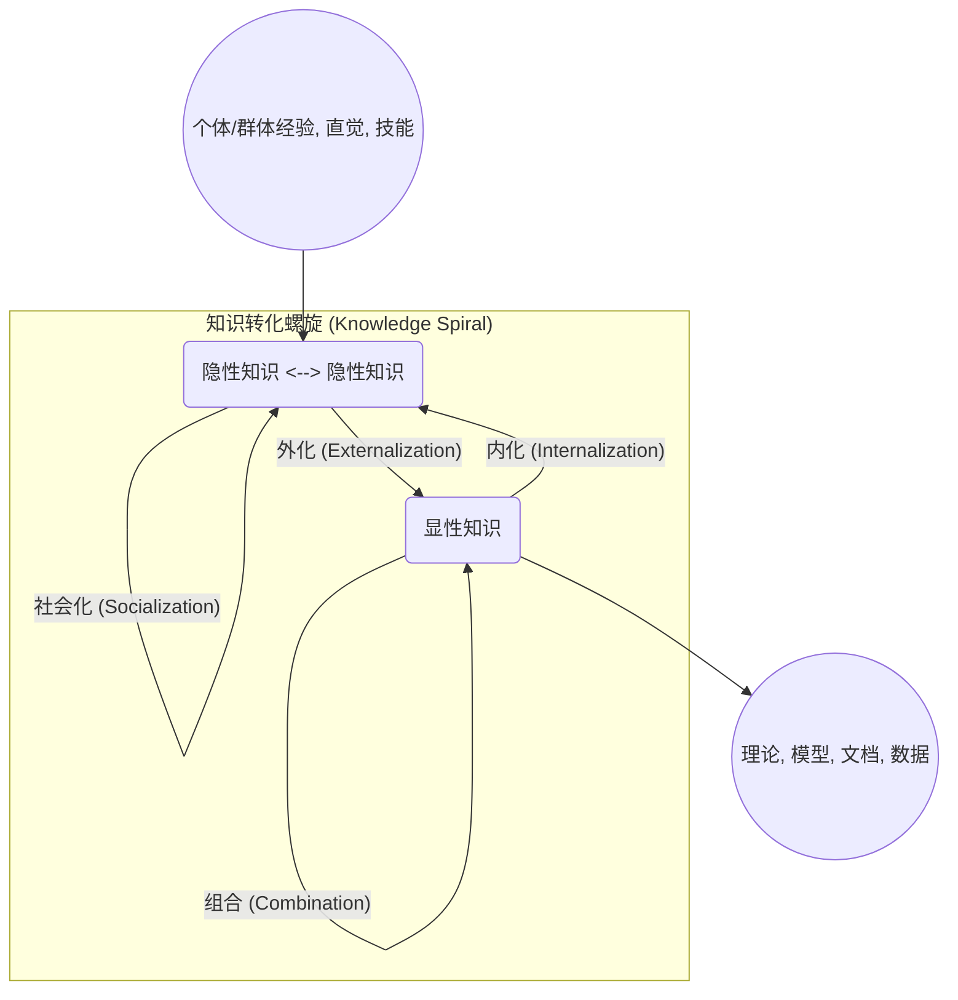
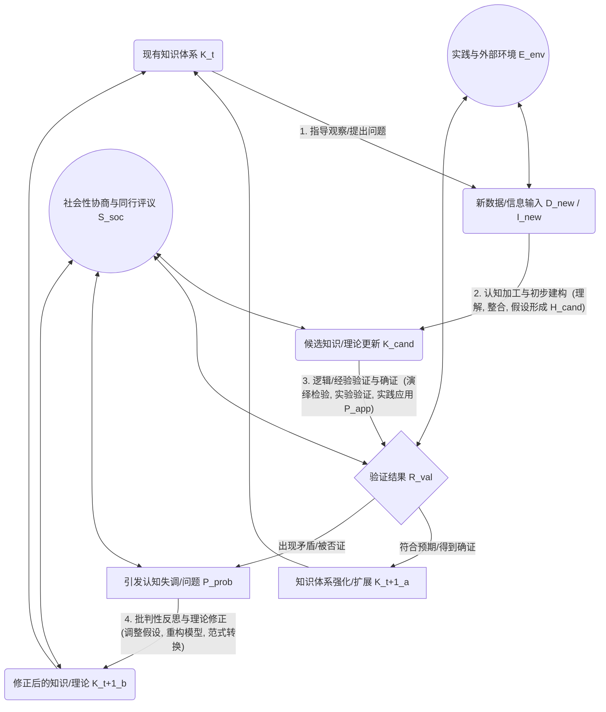
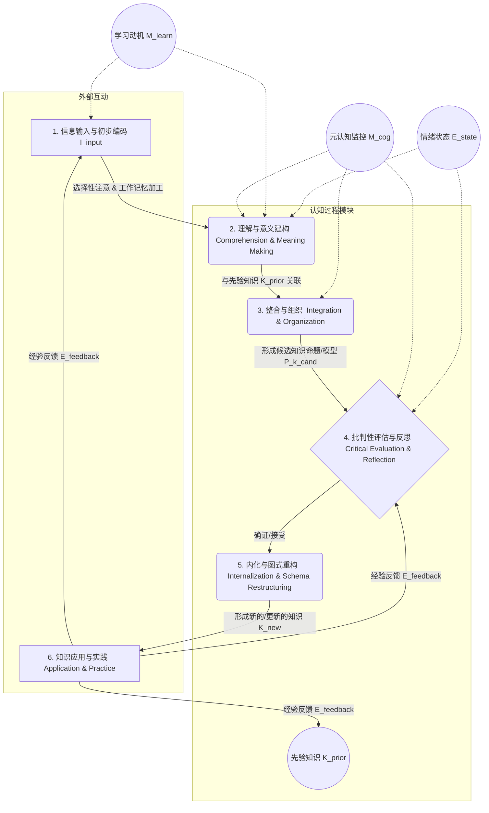
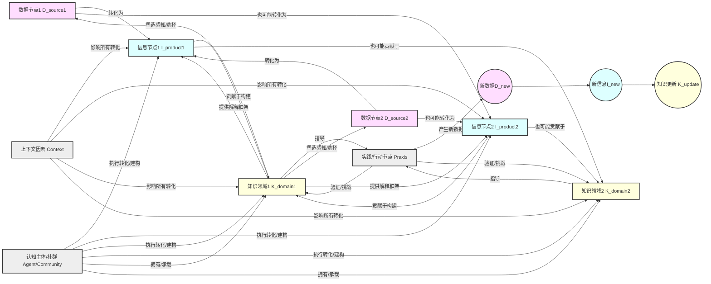

# 信息论、数据、信息与知识：关联、张力与批判性综合

## 摘要

本文对信息论、数据、信息及知识之间的复杂关联和内在张力进行深入的批判性分析与综合。
目标是超越传统线性或简化模型，通过对核心概念的丰富阐释与严谨论证，并辅以多种表征方式（包括结构化论证、文本图示和关系分析），
揭示其在理论层面和实践应用中的动态相互作用。
我们将批判性地审视信息论的贡献与局限（尤其强调其“意义悬置”的后果），考察数据如何在其“原始性”的迷思与建构的现实（及其潜在偏见）中，
通过情境化和认知/社会过程转化为信息，以及信息如何升华为结构化、可行动的知识。
本文强调这些概念间的非线性、循环影响，并深入探讨其间的权力与伦理维度，旨在构建一个更具整体性、批判性和操作性的理解框架。

## 目录

- [信息论、数据、信息与知识：关联、张力与批判性综合](#信息论数据信息与知识关联张力与批判性综合)
  - [摘要](#摘要)
  - [目录](#目录)
  - [1. 引论：重审D-I-K连续统的复杂性与批判之必要](#1-引论重审d-i-k连续统的复杂性与批判之必要)
    - [1.1. 时代背景：信息泛滥时代的认知与实践挑战](#11-时代背景信息泛滥时代的认知与实践挑战)
    - [1.2. 核心议题：数据、信息、知识关联的深层结构与内在张力](#12-核心议题数据信息知识关联的深层结构与内在张力)
    - [1.3. 分析路径与方法论：批判性审视、关联性分析、多重表征与综合重构](#13-分析路径与方法论批判性审视关联性分析多重表征与综合重构)
    - [1.4. 文本结构概览](#14-文本结构概览)
  - [2. 基石概念的批判性解构与关联初探](#2-基石概念的批判性解构与关联初探)
    - [2.1. 数据（Data）：原始表征的迷思与建构的现实](#21-数据data原始表征的迷思与建构的现实)
      - [2.1.1. 定义与特性：超越“原始事实”的表象——一种形式化表述的尝试](#211-定义与特性超越原始事实的表象一种形式化表述的尝试)
      - [2.1.2. 数据的潜在偏见：一个偏见注入的多层模型（文本图示）](#212-数据的潜在偏见一个偏见注入的多层模型文本图示)
      - [2.1.3. 数据与信息的关系：作为信息的素材与待激活的潜能——关联分析](#213-数据与信息的关系作为信息的素材与待激活的潜能关联分析)
    - [2.2. 信息论（Information Theory）：量化不确定性与意义的悬置](#22-信息论information-theory量化不确定性与意义的悬置)
      - [2.2.1. 核心原理：香农熵 (H(X))、信道容量 (C)——数学形式及其技术贡献](#221-核心原理香农熵-hx信道容量-c数学形式及其技术贡献)
      - [2.2.2. 信息论的边界：对“意义”的策略性忽略及其深远影响——批判性论证](#222-信息论的边界对意义的策略性忽略及其深远影响批判性论证)
      - [2.2.3. 信息论与数据处理：效率驱动下的价值取向与信息筛选——一个决策影响模型](#223-信息论与数据处理效率驱动下的价值取向与信息筛选一个决策影响模型)
    - [2.3. 信息（Information）：情境化数据与意义的生成](#23-信息information情境化数据与意义的生成)
      - [2.3.1. 定义与特性：作为 (f(\\text{Data, Context, CognitiveFramework, Goal})) 的信息](#231-定义与特性作为-ftextdata-context-cognitiveframework-goal-的信息)
      - [2.3.2. 从数据到信息：一个多阶段转化模型（文本图示与关联分析）](#232-从数据到信息一个多阶段转化模型文本图示与关联分析)
      - [2.3.3. 信息的质量与迷思：过载、误传与意义稀释的风险——结构化风险分析](#233-信息的质量与迷思过载误传与意义稀释的风险结构化风险分析)
      - [2.3.4. 信息与知识的关系：作为知识构建的桥梁与素材——必要非充分条件论证](#234-信息与知识的关系作为知识构建的桥梁与素材必要非充分条件论证)
    - [2.4. 知识（Knowledge）：结构化理解与可行动的智慧](#24-知识knowledge结构化理解与可行动的智慧)
      - [2.4.1. 定义与特性：超越信息累积的认知升华——一个区分性特征表](#241-定义与特性超越信息累积的认知升华一个区分性特征表)
      - [2.4.2. 知识的类型：显性、隐性及其相互作用（SECI模型的批判性借鉴）](#242-知识的类型显性隐性及其相互作用seci模型的批判性借鉴)
      - [2.4.3. 知识的动态性：一个建构-验证-演化的循环模型（文本图示）](#243-知识的动态性一个建构-验证-演化的循环模型文本图示)
      - [2.4.4. 知识对信息与数据感知的反向塑造作用——一个认知框架影响模型](#244-知识对信息与数据感知的反向塑造作用一个认知框架影响模型)
  - [3. D-I-K关联网络的批判性综合：动态、张力与循环](#3-d-i-k关联网络的批判性综合动态张力与循环)
    - [3.1. 数据到信息的转化：批判性审视关键机制与挑战](#31-数据到信息的转化批判性审视关键机制与挑战)
      - [3.1.1. “清洁”与预处理：(D\_{cleaned} = P(D\_{raw}, A\_{goal}, M\_{bias})) ——形式化偏见注入](#311-清洁与预处理d_cleaned--pd_raw-a_goal-m_bias-形式化偏见注入)
      - [3.1.2. 上下文的魔力： (I = \\text{Interpret}(D, K\_{prior}, C\_x, G\_{task})) ——情境依赖的形式化表达](#312-上下文的魔力-i--textinterpretd-k_prior-c_x-g_task-情境依赖的形式化表达)
      - [3.1.3. 算法的角色：自动化处理中的权力、偏见与“黑箱”——一个影响链条分析](#313-算法的角色自动化处理中的权力偏见与黑箱一个影响链条分析)
    - [3.2. 信息到知识的飞跃：认知、社会与确证的复杂互动](#32-信息到知识的飞跃认知社会与确证的复杂互动)
      - [3.2.1. 学习与内化：个体认知的主动建构与经验整合——一个认知加工流程图](#321-学习与内化个体认知的主动建构与经验整合一个认知加工流程图)
      - [3.2.2. 社会性建构：知识的共享、协商与权力结构影响——一个影响因素网络图](#322-社会性建构知识的共享协商与权力结构影响一个影响因素网络图)
      - [3.2.3. 确证与行动：知识的实践检验与可错性——波普尔思想的关联](#323-确证与行动知识的实践检验与可错性波普尔思想的关联)
    - [3.3. 超越线性模型（DIKW）：迈向循环、网络与生态系统观](#33-超越线性模型dikw迈向循环网络与生态系统观)
      - [3.3.1. DIKW模型的贡献与核心缺陷批判——一个对比分析表](#331-dikw模型的贡献与核心缺陷批判一个对比分析表)
      - [3.3.2. 反馈循环模型（文本图示）：知识如何引导数据采集与信息解读](#332-反馈循环模型文本图示知识如何引导数据采集与信息解读)
      - [3.3.3. 网络化关联模型（文本图示）：D-I-K节点间的相互依赖与共同演化](#333-网络化关联模型文本图示d-i-k节点间的相互依赖与共同演化)
    - [3.4. 信息论的幽灵：其原则如何渗透并塑造D-I-K全链条](#34-信息论的幽灵其原则如何渗透并塑造d-i-k全链条)
      - [3.4.1. 效率优先对信息质量和知识深度的潜在影响——一个权衡分析](#341-效率优先对信息质量和知识深度的潜在影响一个权衡分析)
      - [3.4.2. 量化思维对复杂现象理解的简化与遮蔽——一个批判性案例分析](#342-量化思维对复杂现象理解的简化与遮蔽一个批判性案例分析)
      - [3.4.3. “信号”与“噪声”的相对性：谁在定义？服务于谁？](#343-信号与噪声的相对性谁在定义服务于谁)
    - [4.4. 知识的权力与数字鸿沟：谁在定义、控制和受益？——一个权力关系图解](#44-知识的权力与数字鸿沟谁在定义控制和受益一个权力关系图解)
  - [5. 结论：走向整合的、批判的、情境化的D-I-K认知框架](#5-结论走向整合的批判的情境化的d-i-k认知框架)
    - [5.1. 核心论点的再综合：关联的复杂性与批判的必要性](#51-核心论点的再综合关联的复杂性与批判的必要性)
    - [5.2. 持续存在的张力与未解问题——一个问题清单与未来研究方向](#52-持续存在的张力与未解问题一个问题清单与未来研究方向)
    - [5.3. 对未来研究与实践的启示：培养批判性数字素养——一个能力构成模型](#53-对未来研究与实践的启示培养批判性数字素养一个能力构成模型)
  - [6. 文本思维导图](#6-文本思维导图)

---

## 1. 引论：重审D-I-K连续统的复杂性与批判之必要

### 1.1. 时代背景：信息泛滥时代的认知与实践挑战

我们生活在一个前所未有地被数据和信息所包围的时代。
据估计，全球每年产生的数据量以泽字节（ZB，`10<sup>21</sup>`字节）计，并且其增长速度仍在加快。
数字技术的发展使得数据的生产、存储和传播能力呈指数级增长，信息似乎触手可及。
然而，这种“信息泛滥”（Information Deluge）并未自然而然地带来更深刻的理解或更明智的决策。相反，它常常伴随着：

- **认知过载（Cognitive Overload）**：个体有限的认知资源难以处理和筛选海量输入。
- **意义模糊（Semantic Ambiguity）**：信息的快速传播和碎片化使其上下文缺失，导致意义难以确定。
- **虚假信息传播（Disinformation & Misinformation）**：利用数字平台的特性，有意或无意的错误信息得以广泛扩散。
- **决策困境（Decision Paralysis or Poor Decisions）**：过多的选择和不确定的信息质量反而阻碍了有效决策。

这使得我们迫切需要重新审视数据（Data）、信息（Information）、乃至知识（Knowledge）这些基本概念，以及它们之间错综复杂的关系。
这一通常被称为D-I-K（或DIKW，加上Wisdom）的连续统，构成了我们认知世界和进行实践的基础，但其内在机制和复杂性远未被充分理解。

### 1.2. 核心议题：数据、信息、知识关联的深层结构与内在张力

传统观点往往将数据、信息和知识视为一个简单的线性层级结构，例如广为人知的DIKW金字塔模型（Ackoff, 1989）。
该模型通常描述为：数据经过加工和组织变为信息，信息在理解和应用中升华为知识，知识经过提炼和反思最终形成智慧。
然而，这种简化模型因其过度线性和缺乏对转化过程的深刻揭示而广受批判（Rowley, 2007; Frické, 2009）。

本研究的核心议题在于，深入挖掘D-I-K关联的深层结构，揭示其内在的动态性、复杂性、循环性以及其中蕴含的张力：

- **数据的非中立性**：数据并非纯粹客观的“原材料”，其产生和表征本身即是选择和建构的结果，蕴含潜在偏见。
- **信息论的“意义鸿沟”**：信息论（Shannon, 1948）在提供强大的信息量化工具的同时，其对“意义”维度的策略性悬置如何影响后续信息的质量和知识的可靠性？
- **信息的建构性**：信息并非数据的简单加总或直接反映，其生成深受认知主体、上下文（context）、处理方法（如算法）以及社会文化环境的深刻影响。
- **知识的整合与行动性**：知识不仅是信息的累积，更是对信息进行结构化、系统化、批判性整合，并能指导有效行动的认知状态。
- 更重要的是，知识会反过来塑造我们对数据和信息的感知、选择与解读。

### 1.3. 分析路径与方法论：批判性审视、关联性分析、多重表征与综合重构

为达成上述目标，本文将采取一种多方法融合的分析路径：

- **批判性审视（Critical Scrutiny）**：借鉴批判理论（Critical Theory）和科学知识社会学（Sociology of Scientific Knowledge, SSK）的视角，
- 对每一个核心概念（数据、信息论、信息、知识）及其转化过程进行严格的审视。
- 这包括揭示其内在假设、理论局限性、潜在偏见、以及其中嵌入的权力意涵，避免不加鉴别地接受流行定义或模型。
- 我们将追问“谁的定义？”、“服务于谁的利益？”、“忽略了什么？”
- **关联性分析（Relational Analysis）**：着重运用系统思维（Systems Thinking）的方法，分析和论证这些概念之间如何相互定义、相互依赖、相互转化、相互制约。
- 强调其间的动态互动、反馈循环（feedback loops）和非线性特征（non-linearity），而非单一方向的层级递进。
- 我们将探讨“A如何影响B？”、“B又如何反作用于A？”、“A和B在何种条件下共生演化？”
- **多重表征（Multiple Representations）**：为了更清晰地阐释复杂的概念和关系，本文将尝试使用多种表征方式，包括：
  - **文本图示（Textual Diagrams/Charts）**：如流程图、层级图、网络图、影响因素图等，用以直观展示过程、结构和关系。
  - **结构化论证（Structured Arguments）**：采用类似逻辑学中的前提-结论形式，或明确列出论证步骤，以增强论证的清晰度和严谨性。
  - **形式化表述的尝试（Illustrative Formalisms）**：在适当之处，引入简化的、说明性的类形式化符号或数学函数式表达，
  - 以精确捕捉某些概念的核心特征或转化关系，例如 \( I = f(D, C, K_f, G) \)。
  - 这并非旨在建立严格的数学理论，而是作为一种增强概念精确性的辅助手段。
- **综合重构（Integrated Synthesis）**：在批判和关联分析的基础上，尝试超越现有模型的局限，构建一个更为整合、动态、情境化和批判性的D-I-K理解框架。
- 该框架旨在更好地反映其复杂性，并为在数字时代更有效地驾驭数据、信息和知识提供具有操作性的认知基础。

本文力求通过持续的批判性追问、对多重关联的细致揭示以及对不同理论视角的综合借鉴，呈现一个充满内在张力但又相互联结、不断演化的D-I-K认知图景。

### 1.4. 文本结构概览

本文结构安排如下：

- **第二部分**将对数据、信息论、信息和知识四个基石概念进行深入的批判性解构，阐释其核心定义、特性、局限性，并初步探讨它们之间的两两关联，辅以图示和结构化论证。
- **第三部分**将致力于D-I-K关联网络的批判性综合，重点分析从数据到信息、信息到知识的关键转化过程，
- 深入批判传统线性模型的不足，并提出更具动态性的循环和网络模型，同时探讨信息论原则对全链条的深层、有时是隐性的影响。
- **第四部分**将讨论这些分析在数字时代的具体意涵，特别是大数据、算法决策、“后真相”现象带来的机遇、挑战以及亟需的伦理反思，
- 并将尝试使用风险评估矩阵和权力关系图等方式进行分析。
- **第五部分**进行总结，凝练核心论点，提出一个整合的、批判的、情境化的D-I-K认知框架，并基于此展望未来的研究方向和实践启示，特别是关于批判性数字素养的培养。
- 最后附上全文的**文本思维导图**，作为内容的结构化索引。

---

## 2. 基石概念的批判性解构与关联初探

本部分旨在对构成D-I-K连续统的四个核心概念——数据、信息论、信息、知识——进行逐一的批判性解构。
我们将不仅阐述其传统定义和主要特性，更重要的是，揭示这些定义背后的假设、局限性，并分析它们之间初步但至关重要的相互关联。

### 2.1. 数据（Data）：原始表征的迷思与建构的现实

#### 2.1.1. 定义与特性：超越“原始事实”的表象——一种形式化表述的尝试

传统上，数据（Data）常被定义为未经处理的（raw）、离散的（discrete）事实（facts）、观察记录（observations）、符号（symbols）或信号（signals）的集合。
例如，温度读数“25°C”、一段文本“Hello World”、一次交易记录“A购买了B，价格￥100”。
这种定义暗示了数据的客观性（objectivity）、中立性（neutrality）和原子性（atomicity），仿佛它们是世界本来面貌的直接、无偏的映射。

然而，批判性视角要求我们彻底质疑这种“原始性”和“客观性”的迷思。
任何数据都是人类（或机器代理人）通过特定的 **观察（Observation, \(O\)）**、**测量（Measurement, \(M\)）**、**记录（Recording, \(R_{ec}\)）** 工具和方法，
从复杂的 **现实（Reality, \(\mathcal{R}\)）** 中，
根据特定的 **目标（Goal, \(G\)）** 和 **认知/理论框架（Framework, \(F_k\)）**,**选择（Selection, \(S\)）** 和 **表征（Representation, \(R_{ep}\)）** 出来的。

我们可以尝试用一个说明性的形式化表述来捕捉这个建构过程：

Let \(\mathcal{R}\) be the unconstrained reality.
Let \(P \subset \mathcal{R}\) be a specific phenomenon of interest within \(\mathcal{R}\).
Let \(F_k\) be the prevailing cognitive, theoretical, or operational framework guiding the datafication process.
Let \(G\) be the goal or purpose for collecting data about \(P\).
Let \(O_m\) be the set of available observation and measurement methods/tools, each with its own characteristics (e.g., precision, bias \(\beta_{om}\)).
Let \(S(P, F_k, G) \subseteq P\) be the selection function that chooses which aspects of \(P\) to focus on.
Let \(M_{sel} \in O_m\) be the chosen measurement method for \(S(P, F_k, G)\).
Let \(R_{ep}(S(P, F_k, G), M_{sel}, F_k)\) be the representation function that encodes the measured aspects into a symbolic form
 (e.g., numerical, textual, categorical).

Then, a datum \(d\) can be seen as an outcome of this process:
\[ d = R_{ep}( M_{sel}(S(P, F_k, G)), F_k ) \]
This formulation highlights that \(d\) is not \(P\) itself, nor even a direct, unmediated trace of \(P\). Instead,
\(d\) is a **mediated construct**, shaped by \(F_k, G, S, M_{sel}\), and \(R_{ep}\).

**核心特性（批判性视角）：**

- **建构性（Constructedness）**：数据是人为建构的，而非自然存在的“原始物”。它们是特定视角、方法和技术作用于现实的结果。
- **选择性（Selectivity）**：数据的产生总是伴随着对现实的选择性关注和忽略。我们选择测量什么，就意味着我们同时选择不测量什么。
- **表征性（Representational Nature）**：数据是对现实的某种表征，而非现实本身。任何表征都涉及简化、抽象和编码，可能引入失真或歧义。
- **理论负载性（Theory-Ladenness）**：观察和测量往往受到现有理论框架的指导和影响（Hanson, 1958）。我们“看到”什么数据，部分取决于我们“相信”什么。
- **工具依赖性（Instrument-Dependence）**：测量工具的精度、误差范围、操作方式等都会直接影响数据的质量和特性。
- **语境依赖性（Context-Dependence）**：数据的意义和可解释性离不开其产生的具体语境（时间、地点、环境、目的等）。

#### 2.1.2. 数据的潜在偏见：一个偏见注入的多层模型（文本图示）

由于数据是建构的产物，其产生过程的每一个环节都可能成为偏见（Bias, \(\beta\)） 注入的源头。
这些偏见并非总是恶意的，很多时候是无意识的或系统性的。

我们可以用一个多层模型来图示偏见注入的过程：

|层级 (Layer)          | 偏见来源示例 (Examples of Bias Sources)             | 表现形式 \(\beta_i\)|
|:----|:----|:----|
|1. 现实与现象定义 (Reality & Phenomenon Definition   | \(\beta_{def}\): 对研究对象或问题的定义本身带有局限或预设 (Conceptualization Bias, Framing Bias)   | e.g., 贫困线的定义影响贫困数据|
|2. 数据采集设计 (Data Collection  Design)  | \(\beta_{sel}\): 选择偏差 (Selection Bias) - 样本非代表性 | e.g., 仅调查网络用户导致覆盖不足|
|    | \(\beta_{cov}\): 覆盖偏差 (Coverage Bias) - 某些群体被系统性忽略 | e.g., 传感器未覆盖偏远地区|
|    | \(\beta_{inst}\): 工具偏差 (Instrument Bias) - 测量工具不准确或不一致 | e.g., 问卷问题诱导性太强|
|    | \(\beta_{obs}\): 观察者偏差 (Observer Bias) - 观察者的主观影响 | e.g., 田野调查员的期望效应|
|3. 数据记录与编码(Data Recording & Encoding)  | \(\beta_{rec}\): 记录错误 (Recording Errors) - 人为或机器错误 | e.g., 数据录入错误|
|    | \(\beta_{enc}\): 编码偏差 (Encoding Bias) - 分类标准不当或不一致 | e.g., 种族分类过于粗略或不适用|
|    | \(\beta_{agg}\): 聚合偏差 (Aggregation Bias) - 聚合掩盖重要细节 | e.g., 平均数掩盖了极端值|
|4. 数据存储与管理  (Data Storage &  Management) | \(\beta_{ret}\): 数据保留偏差 (Retention Bias) - 选择性保留或删除 | e.g., 为节省空间删除“异常”数据|
|    | \(\beta_{link}\): 数据链接偏差 (Linkage Bias) - 错误链接不同数据集 | e.g., 基于不准确标识符合并记录|

-**结构化论证：数据偏见的必然性**

1. **前提1**：任何数据的产生都涉及对复杂现实的选择性观察、测量、表征和记录（如2.1.1所述）。
2. **前提2**：选择、测量、表征和记录的过程均由人（或人设计的系统）根据特定目标、理论框架和可用工具来执行。
3. **前提3**：人的认知、理论框架、目标设定和工具设计都可能包含（有意识或无意识的）局限性、预设、价值判断和系统性误差，这些构成潜在的偏见源（\(\beta_{source}\)）。
4. **前提4**：当\(\beta_{source}\)实际影响了数据的选择、测量、表征或记录过程时，偏见（\(\beta_d\)）就被注入到了数据中。
5. **结论**：因此，几乎所有的数据在某种程度上都不可避免地携带了其产生过程所引入的偏见（\(D_{actual} = D_{ideal} + \sum \beta_i\))。
认识到这一点，是对数据进行批判性使用的第一步。

#### 2.1.3. 数据与信息的关系：作为信息的素材与待激活的潜能——关联分析

数据与信息之间存在着基石与建筑般的紧密关系，但二者绝非等同。

- **数据是信息的原材料（Raw Material）**：信息是从数据中提炼、加工和建构出来的。没有数据，信息的产生便无从谈起。
- 数据为信息的生成提供了必要的符号和记录基础。
  - *例证*：气象站记录的每小时温度、湿度、风速等数值（数据）是生成天气预报（信息）的基础。
- **数据是“潜在的”信息（Potential Information）**：孤立的数据点或未经组织的数据集本身往往不直接传递明确的意义或回答特定的问题。
- 它们如同未被解读的密码，蕴含着转化为信息的可能性，但这种可能性需要被激活。
  - *关联强度*：数据本身的信息潜能与其质量（准确性、完整性、一致性）、丰富性（多维度、大规模）以及可解释性相关。
  - 高质量、丰富的数据集通常具有更大的信息提炼潜力。
- **从数据到信息的转化是非唯一的（Non-unique Transformation）**：同一份数据集，由于分析目标、上下文、解释框架或处理方法的不同，可以被转化为多种不同甚至矛盾的信息。
  - *例证*：同一组公司销售数据，分析师A可能解读为“市场份额稳定”（信息1），而分析师B可能结合竞争对手的增长数据解读为“相对衰退风险”（信息2）。
- **数据本身不直接减少不确定性，而是通过转化为信息来间接实现**：信息的核心功能之一是减少接收者的不确定性（Shannon, 1948; Bateson, 1972 “a difference that makes a difference”）。
- 数据需要被置于一个能使其“产生差异”的框架中，才能实现这一功能。

**总结性关联**：数据是构成信息的本体论基础和必要条件，但并非充分条件。
数据的存在为信息的产生提供了可能性，但信息的实际生成是一个依赖于认知主体、上下文、工具和目标的建构过程。
因此，对数据的批判性审视（其来源、质量、潜在偏见）是确保后续信息质量和可靠性的关键前提。

### 2.2. 信息论（Information Theory）：量化不确定性与意义的悬置

#### 2.2.1. 核心原理：香农熵 \(H(X)\)、信道容量 \(C\)——数学形式及其技术贡献

克劳德·香农（Claude Shannon）在1948年发表的《通信的数学理论》（A Mathematical Theory of Communication）是信息论的奠基之作。
其核心贡献在于将“信息”从其日常语义中剥离出来，赋予其严格的数学定义和量化方法，主要服务于通信工程中的信号传输问题。

**核心概念与数学形式：**

- **信息量（Amount of Information / Self-Information）**：一个事件（或消息符号）\(x_i\) 发生所提供的信息量定义为其出现概率 \(p(x_i)\) 的函数：
    \[ I(x_i) = -\log_b p(x_i) \]
    通常 \(b=2\)，单位为比特（bits）。概率越小的事件发生，提供的信息量越大（即越“意外”）。
- **信息熵（Entropy, \(H(X)\)）**：对于一个离散随机变量 \(X\)（代表信源），
- 其可能取值为 \(\{x_1, x_2, ..., x_n\}\) 对应的概率分布为 \(\{p(x_1), p(x_2), ..., p(x_n)\}\)，
- 则该信源的平均不确定性或平均信息量（即信息熵）定义为：
    \[ H(X) = E[I(X)] = -\sum_{i=1}^{n} p(x_i) \log_b p(x_i) \]
    熵越大，信源的不确定性越高，每个符号平均携带的信息量也越大。
    当所有符号等概率出现时，熵达到最大值 \(\log_b n\)。
- **信道容量（Channel Capacity, \(C\)）**：在有噪声信道中，单位时间内能够可靠传输的最大信息速率（比特/秒）。
- 香农的信道编码定理指出，只要信息传输速率 \(R < C\)，总能找到一种编码方式使得传输错误率任意小。
    \[ C = \max_{p(x)} I(X;Y) \]
    其中 \(I(X;Y) = H(X) - H(X|Y)\) 是互信息，表示信宿 \(Y\) 提供了多少关于信源 \(X\) 的信息。

**技术贡献：**
信息论的这些核心原理为现代数字通信和数据处理技术奠定了坚实的理论基础：

1. **数据压缩（Data Compression）**：通过分析信源的统计特性（如符号频率），设计更高效的编码（如霍夫曼编码、LZW算法），去除冗余，
在不损失（或有限损失）“技术信息”的前提下，显著减少数据存储空间和传输带宽。
其理论极限与信源熵 \(H(X)\) 相关。
2. **差错控制编码（Error Control Coding）**：通过在数据中加入受控的冗余（如奇偶校验码、汉明码、LDPC码），使得在有噪信道中传输时能够检测和纠正错误，提高通信的可靠性。
3. **通信系统设计优化**：为调制、解调、信道选择等提供了理论指导，以逼近信道容量，实现高效可靠的通信。
4. **密码学与信息安全**：信息熵等概念也被用于评估密码系统的强度和信息的保密性。

信息论的伟大之处在于其高度的抽象性和普适性，它抓住了信息传输的共性问题，并提供了精确的数学工具进行分析和优化。

#### 2.2.2. 信息论的边界：对“意义”的策略性忽略及其深远影响——批判性论证

尽管信息论在技术层面取得了辉煌成就，但其核心特征
——对信息“意义”（meaning）、“语义”（semantics）、“语用”（pragmatics）以及“价值”（value）的策略性忽略
——是其深刻的局限性，也是对其应用进行批判性审视的起点。
香农本人非常清楚这一点，他在其论文开篇即指出：“这些语义方面与工程问题无关，但具有一定的哲学意义。”（Shannon, 1948）。

-**结构化论证：信息论的“意义盲点”及其后果**

1. **前提1（信息论的核心定义）**：信息论（香农范式）主要关注消息序列的统计特性、可预测性（不确定性）以及在信道中精确复制和传输的效率和可靠性。其核心度量（如熵）是基于概率分布的，与消息的具体内容或解释无关。
    - *形式化表达*：\(H(X)\) 是 \(P(X)\) 的函数，而不是消息 \(m \in X\) 的语义内容 \(Sem(m)\) 的函数。两条具有相同出现概率但意义截然不同的消息，其香农信息量相同。

2. **前提2（人类认知与实践的核心关切）**：在人类认知、决策和社会互动中，信息的意义、真实性、相关性、价值和语境是至关重要的。我们关心的是“这条信息告诉我什么？”、“它是否真实可靠？”、“它与我的目标是否相关？”、“它对我有什么用？”
    - *例证*：“股市将暴跌”和“明天会下雨”（假设两者概率相同）在香农信息量上可能相等，但对投资者的意义和价值截然不同。

3. **推论1（信息论的“意义盲点”）**：因此，信息论本身无法区分有意义的信息与无意义的噪声（只要统计特性相似），无法评估信息的真实性、相关性或价值，也无法处理由歧义、误解或文化差异导致的“语义噪声”。
    - *后果a（无法指导内容选择）*：一个旨在最大化香农信息传输的系统，可能高效传输了大量无用或错误的内容。
    - *后果b（无法评估信息质量）*：信息论的“保真度”主要指符号序列的精确复制，而非语义内涵的完整保留或真实性的保障。

4. **前提3（信息技术对D-I-K链条的渗透）**：基于信息论原理发展起来的数据压缩、传输和处理技术，深刻地影响着数据如何被采集、存储、筛选、呈现，进而影响信息和知识的形成。
    - *例证*：搜索引擎的排序算法（部分受信息检索理论影响，而信息检索与信息论有渊源）决定了我们优先看到哪些信息；社交媒体的信息流算法影响我们接触到的观点。

5. **结论（“意义盲点”的深远影响）**：如果D-I-K链条中的关键技术环节过分强调信息论的“效率”和“数量”指标，而忽视或未能有效整合对“意义”、“质量”和“价值”的考量，则可能导致：
    - **意义的扁平化与失落**：在追求高效传输大量“比特”的过程中，信息的深层结构、细微差别和丰富内涵可能被牺牲。
    - **知识构建的扭曲**：基于被“技术性过滤”或“统计性优先”处理过的数据和信息所构建的知识，可能是不全面、有偏见甚至错误的。
    - **价值判断的旁落**：技术系统的“中立”表象可能掩盖了其设计中隐含的价值取向（如效率优先于公平，或商业利益优先于公共利益），使得对信息和知识的伦理与社会价值判断被边缘化。

因此，批判性地认识信息论的边界，对于理解其在D-I-K生态系统中的恰当角色，以及发展能够弥合“意义鸿沟”的新理论和技术至关重要（例如语义信息论、语用信息论、整合信息论等仍在探索中）。

#### 2.2.3. 信息论与数据处理：效率驱动下的价值取向与信息筛选——一个决策影响模型

信息论的原则，尤其是以信源熵为基础的压缩理论，不仅影响技术实现，也潜移默化地影响了数据处理中的价值取向和信息筛选决策。

**决策影响模型（文本图示）：**

```mermaid
graph TD
    A[原始数据集 D_raw] --> B{数据处理目标设定};
    B -- "主要目标: 传输/存储效率最大化 (受信息论启发)" --> C[采用基于统计冗余的压缩算法 Algo_compress];
    B -- "次要/潜在忽略目标: 保留语义完整性/异常值重要性" --> D[对 Algo_compress 的选择标准或参数调整];
    C --> E{数据压缩与筛选过程};
    D -.-> E;
    E -- "丢弃统计上'不重要'或'冗余'的数据分量 d_discard" --> F[压缩后的数据集 D_compressed];
    E -- "保留统计上'重要'或'高效编码'的数据分量 d_retain" --> F;
    F --> G[后续的信息提取与知识发现];
    H[潜在的语义信息损失或关键异常值丢失 \(\Delta Sem\), \(\Delta Anomaly\)] <-.-> E;
    H --> I{对最终知识K的质量影响};

    subgraph "价值取向与决策层面"
        B; D;
    end
    subgraph "技术操作层面"
        A; C; E; F;
    end
    subgraph "潜在后果层面"
        G; H; I;
    end
```

**模型解释与论证：**

1. **目标设定中的价值取向**：当数据处理（如大规模数据归档、网络传输）的主要目标被设定为最大化效率（减少存储空间、降低带宽占用）时，信息论提供的关于信源熵和最优编码的理论自然成为指导思想。
2. **算法选择与参数调整**：基于此目标，开发者和使用者会倾向于选择那些压缩率高、编码效率优的算法。这些算法的设计往往基于识别和消除数据的统计冗余（如高频模式的短编码，低频模式的长编码或近似处理）。
3. **数据筛选的隐性标准**：在压缩过程中，那些对降低整体熵贡献不大（即统计上出现概率低，或与其他数据相关性弱）的数据点或特征，即使在语义上可能非常重要（如预示系统故障的罕见异常信号，或具有创新潜力的“离群”思想），也可能被算法视为“噪声”或“可容忍的损失”而被丢弃、平滑或粗略近似。
    - *形式化类比*：若将数据看作特征向量的集合，压缩过程可以视为一种降维或量化操作，其优化函数 \(J\) 主要关注 \(size(D_{compressed})\) 的最小化，而对 \(SemanticPreservation(D_{raw}, D_{compressed})\) 的约束可能较弱或未被充分定义。
4. **对后续环节的影响**：基于这样“效率优先”处理过的数据集 \(D_{compressed}\) 进行信息提取和知识发现，可能会因为关键信息的缺失或失真，导致最终形成的知识 \(K\) 存在偏差、不完整或无法捕捉到某些重要现象。
    - *例证*：在医学影像压缩中，如果过度追求压缩率而丢失了微小的早期病灶特征，将直接影响诊断（信息）和治疗方案（基于知识的决策）。在金融市场数据分析中，罕见但预示危机的“黑天鹅”信号如果被平滑处理，将导致风险模型失效。

**批判性结论**：信息论的效率原则在技术上是宝贵的，但将其不加批判地推广为数据处理和信息筛选的首要甚至唯一价值标准，则可能带来严重的负面后果。需要在效率与意义、统计显著性与语义重要性之间进行审慎的权衡和多目标优化，并充分认识到任何数据处理步骤都可能是一种具有价值倾向的“信息守门”（information gatekeeping）行为。

### 2.3. 信息（Information）：情境化数据与意义的生成

#### 2.3.1. 定义与特性：作为 \(f(\text{Data, Context, CognitiveFramework, Goal})\) 的信息

与数据相比，信息（Information）的定义更强调其与接收者和特定情境的关联。
一个被广泛接受的观点是，
**信息是能够减少接收者不确定性（uncertainty reduction）、或改变接收者认知状态（change in cognitive state）、或对接收者具有“意义”（meaningfulness）和“相关性”（relevance）的、经过处理和组织的数据。**
 (Bateson, 1972; Davis & Olson, 1985; Checkland & Holwell, 1998).

我们可以将信息的生成视为一个函数，其输入至少包含以下要素：
\[ I = f(D, C_x, F_c, G_t) \]
其中：

- \(I\)：生成的信息（Information product）。
- \(D\)：原始或预处理过的数据集（Data set）。
- \(C_x\)：上下文（Context），包括时间、地点、环境因素、相关事件、社会文化背景等。上下文为数据提供了参照系。
- \(F_c\)：认知框架（Cognitive Framework），指解读数据所依赖的先验知识、理论模型、信念系统、价值取向、认知偏好等。这可以是人类认知者的框架，也可以是AI系统中嵌入的规则或模型。
- \(G_t\)：目标或任务（Goal or Task），指生成信息的具体目的，如回答特定问题、支持特定决策、完成特定任务等。目标驱动着对数据的选择、关注和解释方向。

**信息的关键特性：**

- **意义性（Meaningfulness）**：信息具有指涉性，它关乎“某事”（aboutness），能够被理解和解释。其意义并非数据固有，而是在上述函数 \(f\) 的作用下建构生成的。
- **相关性（Relevance）**：有用的信息必须与接收者的特定需求、目标或当前情境相关。不相关的数据，即使经过处理，也难以构成有效信息。
- **目的性（Purposiveness）**：信息的生成和使用通常服务于特定的目的，如解决问题、做出决策、增进理解等。
- **情境依赖性（Context-Sensitivity）**：信息的意义和价值高度依赖于其产生的具体情境。脱离情境，信息可能变得模糊不清甚至产生误导。
- **主观建构性（Subjective Construction / Intersubjective Agreement）**：虽然信息基于相对客观的数据，但其最终形态深受解读主体 \(F_c\) 的影响。高质量的信息往往需要在不同主体间达成一定程度的互主观认同（intersubjective agreement）。
- **时效性（Timeliness）**：许多信息的价值会随时间推移而衰减。及时获取和传递信息对于决策和行动至关重要。
- **形式多样性（Variety of Forms）**：信息可以以文本、图像、声音、视频、图表、报告、指令等多种形式存在。

#### 2.3.2. 从数据到信息：一个多阶段转化模型（文本图示与关联分析）

数据转化为信息是一个复杂的多阶段过程，而非一步到位的简单映射。
以下是一个说明性的转化模型

```mermaid
graph LR
    A[原始数据 (D_raw)] -- "1. 选择与过滤 (Selection & Filtering)"P_s(D_raw, G_t, F_c) --> B(相关数据子集 D_sel);
    B -- "2. 组织与结构化 (Organization & Structuring)"O_s(D_sel, F_c) --> C(结构化数据 D_struct);
    C -- "3. 上下文赋予 (Contextualization)"C_x(D_struct, K_context) --> D(情境化数据 D_context);
    D -- "4. 分析与解释 (Analysis & Interpretation)"I_p(D_context, F_c, M_analysis) --> E(候选模式/意义 P_cand);
    E -- "5. 验证与提炼 (Validation & Refinement)"V_r(P_cand, G_t, K_domain) --> F[最终信息产品 (I_final)];

    subgraph "数据层面"
        A; B; C;
    end
    subgraph "向信息过渡层面"
        D; E;
    end
    subgraph "信息层面"
        F;
    end

    %% 描述每个阶段的关键输入/影响因素
    G_t((目标 G_t)) -.-> A;
    F_c((认知框架 F_c)) -.-> A;
    F_c -.-> B;
    K_context((上下文知识 K_context)) -.-> C;
    F_c -.-> D;
    M_analysis((分析模型/方法 M_analysis)) -.-> D;
    G_t -.-> E;
    K_domain((领域知识 K_domain)) -.-> E;
```

**模型阶段解释与关联分析：**

1. **选择与过滤（Selection & Filtering）**：
    - *过程*：根据当前的目标 \(G_t\) 和认知框架 \(F_c\)（例如，哪些数据类型是重要的，哪些范围是相关的），从原始数据集 \(D_{raw}\) 中筛选出相关的子集 \(D_{sel}\)。
    - *关联*：此阶段直接体现了数据的“选择性”偏见。选择标准 \(P_s\) 的设定至关重要，不同的标准会导致后续信息构建的起点完全不同。
    - *批判点*：谁定义了 \(G_t\) 和 \(F_c\)? 它们的合理性和潜在偏见是什么？
2. **组织与结构化（Organization & Structuring）**：
    - *过程*：将筛选出的数据 \(D_{sel}\) 按照某种逻辑结构（如时间序列、分类、关系表、层级等）进行组织，形成结构化数据 \(D_{struct}\)。这有助于揭示数据间的内在关系。
    - *关联*：组织结构 \(O_s\) 的选择也受到认知框架 \(F_c\) 的影响。例如，采用关系数据库模型还是图数据库模型，反映了对数据关系的理解不同。
    - *批判点*：所选的结构是否适合数据的本质？是否会因为结构化而丢失某些非结构化数据的价值？
3. **上下文赋予（Contextualization）**：
    - *过程*：将结构化数据 \(D_{struct}\) 与相关的上下文知识 \(K_{context}\)（如时间、地点、历史背景、相关事件、领域常识等）相结合，形成情境化数据 \(D_{context}\)。这是数据开始获得初步“意义”的关键步骤。
    - *关联*：上下文的丰富性和准确性直接影响最终信息的质量。上下文缺失或错误，可能导致对数据的严重误读。
    - *批判点*：\(K_{context}\) 本身是否可靠？是否存在多种相关上下文，而我们只选择了一种？
4. **分析与解释（Analysis & Interpretation）**：
    - *过程*：对情境化数据 \(D_{context}\) 应用特定的分析模型或方法 \(M_{analysis}\)（如统计分析、模式识别、逻辑推理、文本挖掘等），在认知框架 \(F_c\) 的指导下，识别出潜在的模式、趋势、关联、异常或含义，形成候选模式或意义 \(P_{cand}\)。
    - *关联*：分析方法 \(M_{analysis}\) 的选择和使用（例如，线性回归 vs. 神经网络）会极大地影响结果。认知框架 \(F_c\) 在此阶段的解释作用尤为突出。
    - *批判点*：\(M_{analysis}\) 是否适用于数据类型和问题？其假设是否成立？解释过程是否受到认知偏差（如确认偏误）的影响？
5. **验证与提炼（Validation & Refinement）**：
    - *过程*：对候选模式/意义 \(P_{cand}\) 进行验证（如与领域知识 \(K_{domain}\) 对比，与目标 \(G_t\) 的相关性评估，交叉验证等），剔除不可靠或不相关的部分，对有价值的部分进行提炼、概括和清晰化表述，最终形成可供使用的信息产品 \(I_{final}\)。
    - *关联*：此阶段是确保信息质量的关键。验证标准 \(V_r\) 的严格程度和全面性决定了信息的可靠性。
    - *批判点*：验证过程是否充分？ \(K_{domain}\) 本身是否也需要更新？提炼过程是否过度简化或引入新的表述偏差？

这个多阶段模型强调了从数据到信息是一个 **迭代的、建构性的、充满决策点和潜在偏见注入的过程**。每个阶段都受到认知、技术和社会因素的共同影响。

#### 2.3.3. 信息的质量与迷思：过载、误传与意义稀释的风险——结构化风险分析

尽管信息的目标是积极的（减少不确定性、辅助决策等），但在现实中，我们常常面临各种“信息问题”或“信息病态”（information pathologies）。

**信息质量的维度（Illustrative Dimensions, based on Wang & Strong, 1996; Pipino et al., 2002）：**

- **内在质量（Intrinsic Quality）**：准确性（Accuracy）、客观性（Objectivity）、可信度（Believability）、声誉（Reputation）。
- **上下文质量（Contextual Quality）**：相关性（Relevancy）、价值增益（Value-Added）、及时性（Timeliness）、完整性（Completeness）、信息量适当（Appropriate Amount of Information）。
- **表征质量（Representational Quality）**：可解释性（Interpretability）、易理解性（Ease of Understanding）、简洁表述（Concise Representation）、一致表述（Consistent Representation）。
- **可访问性质量（Accessibility Quality）**：可获取性（Accessibility）、访问安全（Access Security）。

**结构化风险分析（Textual Table）：**

| 风险类别 (Risk Category) | 描述 (Description) | 主要成因 (Key Causes) | 潜在后果 (Potential Consequences) |
|:-----|:----|:-----|
| **信息过载 (Information Overload)** | 接收到的信息量远超个体或系统的处理能力，导致难以筛选和吸收有价值信息。| 数字技术导致信息生产和传播成本极低；缺乏有效过滤机制；“越多越好”的错误观念。| 认知疲劳；决策质量下降；重要信息被淹没；焦虑感增加。|
| **信息误传 (Misinformation)** | 无意中传播了错误或不准确的信息。| 数据错误；分析失误；理解偏差；传播过程中的信息失真；缺乏事实核查。| 错误的信念；不当的行动；声誉损害；资源浪费。|
| **信息 disinformation (Disinformation)** | 有意制造和传播虚假或误导性信息，通常带有特定目的（如政治、商业、个人）。 | 恶意操纵；宣传鼓动；网络水军；算法放大；媒体素养不足。| 社会信任侵蚀；舆论极化；公共安全威胁；民主过程干扰。|
| **信息稀释/意义失落 (Meaning Dilution/Loss of Significance)** | 过多冗余、低质、碎片化或矛盾的信息，使得核心意义难以凸显，或导致对重要议题的麻木。 | 信息娱乐化；追求点击率和即时性；缺乏深度分析和批判性整合；上下文缺失。| 对复杂问题理解肤浅；难以形成共识；社会注意力分散；价值判断困难。|
| **信息不对称 (Information Asymmetry)** | 某些个体或群体拥有比其他方更多或更高质量的相关信息，导致权力失衡和不公平。| 数据垄断；信息壁垒；专业知识的不可及性；数字鸿沟。| 市场失灵；剥削行为；决策不公；社会分化加剧。|
| **信息偏见 (Information Bias)** | 信息系统性地倾向于特定视角、群体或结论，未能客观全面地反映现实。| 数据偏见（见2.1.2）；算法偏见；认知偏见（如确认偏误）；媒体立场；利益相关者的选择性呈现。| 认知扭曲；刻板印象强化；不公正对待；社会矛盾激化。|
| **信息茧房/回音室 (Filter Bubbles/Echo Chambers)** | 个体主要或只接触到与其已有信念和偏好一致的信息，导致视野狭隘和观点极化。| 个性化推荐算法；社交媒体的选择性关注；个体主动回避异见。 | 缺乏多元视角；批判性思维能力下降；群体极化；社会共识难以达成。 |

**批判性反思**：这些风险的存在，进一步凸显了从数据到信息的转化过程并非总是良性的。
它要求我们不仅关注信息的技术生产，更要关注信息的社会生态、伦理意涵以及接收者的批判性解读能力。

#### 2.3.4. 信息与知识的关系：作为知识构建的桥梁与素材——必要非充分条件论证

信息与知识之间存在着紧密而又复杂的递进关系。信息通常被视为构建知识的基础和桥梁。

-**结构化论证：信息是知识的必要（但非充分）条件**

1. **前提1（知识的定义特征）**：知识（如2.4将详述）涉及对现象的理解（understanding）、解释（explanation）、预测（prediction）和指导行动（action guidance）的能力。它通常是结构化的、系统化的、经过验证或确证的（justified）。
2. **前提2（信息的功能）**：信息通过组织和解释数据，提供关于特定事实、事件、模式或关系的描述或陈述，旨在减少不确定性或改变认知状态。
3. **论证“必要性”**：
    - **3a. 无信息则无知识基础**：若要形成对某事物的知识，至少需要关于该事物的相关信息作为认知加工的起点和素材。完全缺乏相关信息输入，则无法启动理解、解释等构建知识所需的认知过程。例如，不接触任何关于“量子力学”的信息（如教科书、论文、科普文章），就不可能形成关于量子力学的知识。
    - **3b. 知识的验证依赖信息**：知识主张的合理性（justification）通常需要新的信息（如实验数据、观察证据、逻辑论证中的前提信息）来支持或反驳。
    - **结论1**：因此，信息是知识形成的必要条件（\(K \implies I\)，即若有知识K，则必先有信息I作为其基础）。

4. **论证“非充分性”**：
    - **4a. 信息不等于理解**：拥有大量关于某主题的信息，并不等同于对该主题有深刻的理解。信息可以是碎片化的、未被整合的，而知识强调系统性和融贯性。例如，一个人可以记住很多历史事件的日期和名称（信息），但若不能理解它们之间的因果联系和历史背景，则不能说拥有了真正的历史知识。
    - **4b. 信息不直接导致行动能力**：信息告知“是什么”（know-what），但知识更包含“如何做”（know-how）和“为什么”（know-why）。知道食谱（信息）不等于会做菜（知识/技能）。
    - **4c. 信息质量参差不齐**：错误或误导性的信息，如果未经批判性评估和过滤就被接受，反而会阻碍真实知识的形成，甚至导致“负知识”（错误信念）。
    - **结论2**：因此，仅仅拥有信息并不足以构成知识（\(I \not\implies K\)，即有信息I，未必能形成知识K）。从信息到知识的转化，需要更复杂的认知加工、批判性反思、经验整合和实践验证。

**总结性关联**：信息是知识不可或缺的“养料”和“积木”，为知识的构建提供了原材料和线索。然而，知识的形成是一个远比信息获取更为主动、深刻和综合的认知升华过程。信息的数量和可得性固然重要，但更关键的是对信息进行高质量的加工、整合和批判性运用，才能实现向知识的飞跃。

### 2.4. 知识（Knowledge）：结构化理解与可行动的智慧

#### 2.4.1. 定义与特性：超越信息累积的认知升华——一个区分性特征表

知识（Knowledge）通常被认为是比数据和信息更高层次的认知形态。它不是信息的简单集合或线性累积，而是信息经过个体或群体主动的、深度的认知加工（如理解、整合、抽象、推理、反思、验证）后，形成的**系统化、结构化、内在融贯的认知成果，这种成果能够有效地用于解释现象、预测趋势、解决问题、进行创新并指导明智的行动。**

**信息（Information） vs. 知识（Knowledge）的区分性特征表：**

| 特征维度 (Dimension) | 信息 (Information) | 知识 (Knowledge) |
|:----|:----|:----|
| **本质 (Nature)** | 经过组织和解释的数据；关于“什么/谁/何时/何地”的陈述。| 经过验证/确证的、结构化的理解；包含“如何做”(how-to)和“为什么”(know-why)。|
| **结构性 (Structure)**    | 相对离散、碎片化，或简单的组织结构。 | 高度结构化、系统化、概念间存在丰富联系，形成内在融贯的认知模型或理论。|
| **加工深度 (Processing Depth)** | 较浅层次的加工（如选择、分类、格式化、简单关联）。| 深层次的认知加工（如理解、推理、抽象、批判性评估、整合、反思）。|
| **与行动关系 (Relation to Action)** | 提供行动的潜在输入或背景；不直接等同于行动能力。| 直接指导和赋能有效行动；是技能、能力和智慧的基础。|
| **确证性 (Justification)** | 对真实性、准确性的要求不一，可能包含未经严格验证的内容。| 通常要求具有一定程度的确证（justification），如经验证据、逻辑一致性、专家共识等。|
| **可传递性 (Transferability)** | 相对容易通过符号（文本、图像等）直接传递。 | 显性知识部分可传递，但隐性知识（经验、直觉、技能）的传递更为困难，常需实践和体验。|
| **动态性 (Dynamism)**  | 更新速度快，时效性强。| 相对稳定，但也是动态演化的，通过学习、经验和批判反思不断修正和发展。|
| **个体性/社会性 (Individuality/Sociality)** | 可以是高度个体化的，也可以是社会共享的。| 既有个体知识，也有集体知识（如组织知识、文化知识），其形成和验证常具社会性。|
| **价值 (Value)**  | 价值取决于其对特定目标的相关性和及时性。 | 价值更体现在其解释力、预测力、问题解决能力和创新潜力上，具有更持久和根本的价值。|

-**结构化论证：知识是对信息的认知升华**

1. **前提1**：信息为认知主体提供了关于世界的描述性内容（事实、事件、关系等）。
2. **前提2**：认知主体通过学习、经验、推理和反思等高级认知功能，对输入的信息进行加工，包括：
    - **理解（Comprehension）**：把握信息的深层含义，而非表面符号。
    - **整合（Integration）**：将新信息与已有知识结构（信念、模型、理论）相联系，建立融贯的联系。
    - **抽象（Abstraction）**：从具体信息中提炼出普遍的模式、原则或概念。
    - **评估（Evaluation）**：批判性地审视信息的来源、可靠性、逻辑一致性和潜在偏见。
    - **确证（Justification）**：为接受某些信息为“真”或“合理”寻找充分的理由和证据。
3. **前提3**：经过上述深度认知加工后，信息不再是孤立的片段，而是被组织成一个相互关联、内在一致、能够被灵活应用的结构化体系。
4. **前提4**：这个结构化的体系使得认知主体能够对相关现象做出更深刻的解释，对未来趋势做出更可靠的预测，对复杂问题提出更有效的解决方案，并采取更明智的行动。
5. **结论**：因此，知识是信息经过深度认知加工和系统化整合后的升华产物，它超越了信息的描述层面，达到了理解、解释、预测和指导行动的层面。

#### 2.4.2. 知识的类型：显性、隐性及其相互作用（SECI模型的批判性借鉴）

知识可以从多个维度进行分类。其中，迈克尔·波兰尼（Michael Polanyi, 1966）提出的**显性知识（Explicit Knowledge）**和**隐性知识（Tacit Knowledge）**的区分，对于理解知识的复杂性和管理实践具有深远影响。

- **显性知识（Explicit Knowledge）**：
  - *定义*：可以用形式化的、系统的语言（文字、数字、图表、公式、代码等）清晰地表达、编码、存储和传播的知识。
  - *特征*：客观化、逻辑化、系统化、易于共享和获取。
  - *例子*：教科书中的理论、科学论文、操作手册、数据库中的信息、软件代码、法律条文。
- **隐性知识（Tacit Knowledge）**：
  - *定义*：高度个体化、难以形式化和清晰表达的知识，通常深植于个体的经验、直觉、体悟、技能诀窍、价值观和心智模型中。波兰尼的名言是：“我们知道的比我们能说出来的多（We can know more than we can tell）。”
  - *特征*：主观性、情境性、经验性、难以编码和直接传授。
  - *例子*：骑自行车的平衡感、有经验的医生诊断疑难杂症的“直觉”、优秀厨师调味的“手感”、企业家洞察市场机会的“商业嗅觉”、科研人员产生创新想法的“灵感”。

野中郁次郎和竹内弘高（Nonaka & Takeuchi, 1995）在其著名的**SECI模型**中，进一步探讨了显性知识和隐性知识之间的动态转化过程，构成了组织知识创造的螺旋：

1. **社会化（Socialization）**：隐性知识到隐性知识的转化。通过共享经验、观察模仿、在岗培训、非正式交流等方式，个体间传递隐性知识。 (Tacit → Tacit)
    - *例子*：师傅带徒弟，团队成员通过共同工作学习彼此的默契和技巧。
2. **外化（Externalization）**：隐性知识到显性知识的转化。将个体头脑中的隐性知识通过隐喻、类比、概念、模型、假设等方式清晰地表达出来，使其成为可共享的显性知识。这是知识创造中最关键也最困难的一步。 (Tacit → Explicit)
    - *例子*：一个经验丰富的工程师将其解决问题的思路总结成流程图或设计原则。
3. **组合（Combination）**：显性知识到显性知识的转化。通过对已有的、分散的显性知识进行收集、分类、排序、组合、编辑、分析和综合，形成新的、更系统化、更复杂的显性知识体系。 (Explicit → Explicit)
    - *例子*：撰写文献综述、构建数据库、开发复杂的理论模型、制定商业计划。
4. **内化（Internalization）**：显性知识到隐性知识的转化。个体通过学习、实践、应用和反思显性知识（如阅读报告、操作手册、学习理论），将其融入自身的经验和心智模型，形成新的隐性知识（“干中学”，learning by doing）。 (Explicit → Tacit)
    - *例子*：飞行员通过模拟器训练和实际飞行，将飞行手册上的规程（显性）转化为熟练的驾驶技能和应急处理能力（隐性）。

**SECI模型的文本图示：**



**批判性借鉴SECI模型：**

- **贡献**：SECI模型强调了知识的动态性和隐性知识的重要性，打破了以往知识管理过于偏重显性知识（如文档管理）的局限，为促进组织学习和创新提供了有价值的框架。
- **局限与批判**：
  - **文化适用性**：模型源于对日本企业的研究，其在不同文化背景（尤其是西方强调个体主义和显性分析的文化）中的普适性受到质疑。
  - **转化过程的简化**：四个转化过程的划分和描述可能过于简化和理想化，实际的知识转化往往更复杂、更混乱、更依赖具体情境。
  - **对“隐性”的理解**：对隐性知识的界定和“外化”的可能性仍存在争议。有些深层隐性知识（如基于身体的直觉）可能永远无法完全显性化。
  - **权力与冲突的忽视**：模型较少关注组织内权力关系、利益冲突、认知差异等因素对知识共享和创造的阻碍作用。

尽管存在这些局限，SECI模型仍为我们理解知识的动态性和不同类型知识间的互动提供了一个有用的启发性框架。
它提醒我们，有效的知识管理和创造，必须同时关注显性知识的系统化和隐性知识的培育与共享。

#### 2.4.3. 知识的动态性：一个建构-验证-演化的循环模型（文本图示）

知识并非一成不变的静态“库存”，而是一个持续演化、开放修正的动态过程。
这种动态性源于知识的建构本质、其与实践的互动以及社群的批判性检验。

**建构-验证-演化的循环模型（文本图示）：**



**模型解释：**

1. **指导观察/提出问题**：个体或社群已有的知识体系 \(K_t\)（包括理论、模型、经验、价值观）为其认识世界提供了框架，指导其关注哪些现象、如何收集新的数据 \(D_{new}\) 或信息 \(I_{new}\)，以及提出什么样的问题。
2. **认知加工与初步建构**：面对新的输入，认知主体进行理解、整合，并可能基于此形成新的假设、解释或候选知识 \(K_{cand}\)。这个过程深受个体认知能力和创造力的影响。
3. **逻辑/经验验证与确证**：候选知识 \(K_{cand}\) 需要接受检验。这可以是通过逻辑演绎其推论并检查其内部一致性，也可以是通过实验设计、观察收集经验证据，或将其应用于解决实际问题 \(P_{app}\) 来检验其有效性。社会性因素如同行评议 \(S_{soc}\) 在科学知识的确证中也扮演重要角色。
4. **验证结果与反馈**：
    - 若验证结果 \(R_{val}\) 符合预期，或在一定程度上确证了 \(K_{cand}\)，则现有知识体系 \(K_t\) 得到强化或扩展，形成 \(K_{t+1_a}\)。
    - 若验证结果与预期矛盾，或否证了 \(K_{cand}\)，则会引发认知失调或暴露原有知识体系的问题 \(P_{prob}\)。
5. **批判性反思与理论修正**：面对矛盾或问题，认知主体（或社群）需要进行批判性反思，可能需要调整原有假设、修正理论模型，甚至在某些情况下（如科学革命，Kuhn, 1962）经历根本性的范式转换，从而形成修正后的知识体系 \(K_{t+1_b}\)。
6. **循环往复**：更新后的知识体系 \(K_{t+1_a}\) 或 \(K_{t+1_b}\) 又成为下一轮认知活动的起点，如此循环往复，推动知识的不断演化和逼近更深刻的理解。

**知识动态性的核心驱动力：**

- **好奇心与求知欲**：人类探索未知、理解世界的内在驱动。
- **实践需求**：解决现实问题、改善生存与发展条件的需要。
- **认知失调与矛盾**：当现有知识无法解释新现象或内部出现矛盾时，会激发修正和创新的动力。
- **社会互动与批判**：不同观点、理论的交流、竞争和批判性检验，是知识去伪存真、不断完善的重要机制。
- **技术与工具的进步**：新的观察工具、分析方法和计算能力，不断拓展我们获取数据、处理信息和构建知识的边界。

承认知识的动态性和可错性（fallibilism），是保持认知谦逊和开放性的前提，也是科学精神和社会进步的基石。

#### 2.4.4. 知识对信息与数据感知的反向塑造作用——一个认知框架影响模型

传统上，我们倾向于认为D-I-K是一个单向流动的过程。
然而，一个更深刻的理解是，已形成的知识体系（Knowledge Structures, \(K_S\)) 会显著地、主动地反向塑造（shape back）我们对低层次数据（Data, \(D\)) 和信息（Information, \(I\)) 的感知、选择、组织和解释。
这种反向塑造作用是D-I-K系统动态性和循环性的核心体现。

**认知框架影响模型（文本图示）：**

```mermaid
graph LR
    KS[现有知识体系 K_S  (理论, 模型, 信念, 经验, 价值观)] -- "影响/指导" --> Filter;

    subgraph "认知前端：数据/信息感知与初步处理"
        direction LR
        RawInput[原始感官输入/数据流 D_raw_stream] --> Attention;
        Attention[选择性注意过滤器 A_filter  (由K_S设定关注点)] --> SelectedInput;
        SelectedInput --> Perception;
        Perception[感知与模式识别 P_rec  (由K_S提供识别模板)] --> PerceivedData;
        PerceivedData --> Interpretation;
        Interpretation[初步解释与意义赋予 I_assign  (由K_S提供解释框架)] --> InfoCandidate;
    end

    Filter[认知框架 K_S 作为多层面过滤器/塑造器] -.-> Attention;
    Filter -.-> Perception;
    Filter -.-> Interpretation;

    InfoCandidate -- "进一步加工与整合" --> HigherLevelInfo[高级信息 I_adv];
    HigherLevelInfo -- "学习/反思/验证" --> KS_Update[知识体系更新 K_S'];

    KS_Update -.-> KS;
```

**模型解释与论证：**

1. **知识体系 (\(K_S\)) 作为认知预设**：个体或群体在长期的学习和经验中形成的知识体系 \(K_S\)，构成了其认识世界的基本“操作系统”或“认知图式”（cognitive schemata）。它包含了我们对世界如何运作的理解、重要的概念和分类、解决问题的方法、以及潜在的期望和偏见。
2. **\(K_S\) 对选择性注意（Selective Attention）的影响**：面对海量的外部刺激或数据流 (\(D_{raw\_stream}\))，我们的认知系统并不能也无需处理所有输入。\(K_S\) 会引导我们的注意力，使我们倾向于关注那些与我们现有知识、目标或期望相关的部分，而忽略其他部分。
    - *例证*：一个植物学家（拥有植物学知识）在森林中更容易注意到稀有植物，而普通人可能视而不见。
    - *形式化类比*：\(A_{filter} = f_{attention}(D_{raw\_stream}, K_S, CurrentGoal)\)。
3. **\(K_S\) 对感知与模式识别（Perception & Pattern Recognition）的影响**：我们并非被动地“看见”或“听见”世界，而是主动地将感官输入与 \(K_S\) 中存储的模式、概念和期望进行匹配和组织，从而“构建”出我们所感知的对象和事件 (\(PerceivedData\))。
    - *例证*：著名的“鸭兔图”或“老妇少女图”说明了同样的视觉刺激可以因观察者采用的认知框架（或被引导的期望）不同而被感知为不同的图像。在嘈杂环境中，我们更容易听清楚别人呼唤我们的名字，因为“名字”是我们知识库中的重要模式。
    - *关联*：这与格式塔心理学的“整体大于部分之和”以及认知心理学中的“自上而下处理”（top-down processing）概念密切相关。
4. **\(K_S\) 对初步解释与意义赋予（Interpretation & Meaning Assignment）的影响**：对于感知到的数据，\(K_S\) 提供了将其组织起来并赋予初步意义和解释 (\(InfoCandidate\)) 的框架。我们用已有的概念、理论和信念来理解新的输入，将其纳入已有的认知结构中。
    - *例证*：看到股市K线图（感知数据），一个信奉技术分析的投资者（\(K_S\)包含技术分析理论）会从中解读出买入或卖出信号（信息），而一个对此无知的人可能只看到无意义的曲线。
    - *批判点*：如果 \(K_S\) 本身存在错误、偏见或局限性（例如，基于过时的理论或刻板印象），那么这种自上而下的解释过程就可能导致对新数据和信息的系统性误读或扭曲。

**反向塑造的后果与意义：**

- **认知效率与偏见的双刃剑**：\(K_S\) 的反向塑造作用使得我们能够快速有效地处理和理解复杂环境，避免了对每个新刺激都从零开始分析的低效。但它也可能导致我们陷入“认知定势”（cognitive set）或“确认偏误”（confirmation bias），即倾向于寻找和解释那些符合我们既有信念的信息，而忽略或歪曲那些不符合的。
- **知识的“自我强化”与“范式锁定”**：由于 \(K_S\) 影响我们看到什么和如何理解，它可能形成一种自我强化的循环，使得我们越来越相信自己原有的知识体系，难以接受新的、颠覆性的思想。这在科学史上表现为库恩所说的“范式”（paradigm）及其在常规科学时期的主导作用和在科学革命时期的抗拒变革。
- **D-I-K的真正循环性**：这一反向塑造机制，使得数据、信息、知识之间的关系真正成为一个**相互构建、共同演化的动态循环**，而非简单的线性序列。知识指导数据的“发现”和信息的“生成”，而新的数据和信息又反过来验证、修正或挑战已有的知识。

因此，深刻理解和批判性反思我们自身的知识体系 \(K_S\) 及其对信息感知的塑造作用，对于保持认知的开放性、避免系统性偏见、以及促进知识的健康发展至关重要。

---

## 3. D-I-K关联网络的批判性综合：动态、张力与循环

在第二部分对D、I、K及信息论等核心概念进行独立解构和初步关联分析的基础上，本部分旨在将它们置于一个更广阔、更动态的关联网络中进行批判性综合。
我们将深入剖析从数据到信息、再从信息到知识的关键转化过程，揭示其中的复杂机制、内在张力以及传统线性模型（如DIKW）的局限性。
最终目标是呈现一个更符合现实复杂性的、以循环、网络和生态系统为特征的D-I-K互动图景，并特别关注信息论原则在其中扮演的深层、有时是隐性的塑造角色。

### 3.1. 数据到信息的转化：批判性审视关键机制与挑战

从原始数据（D）到有意义的信息（I）的转化，是整个D-I-K链条中的第一个关键跃升。
这个过程远非简单的“提取”或“呈现”，而是一个充满主动建构、价值判断和潜在偏见的多步骤操作。

#### 3.1.1. “清洁”与预处理：\(D_{cleaned} = P(D_{raw}, A_{goal}, M_{bias})\) ——形式化偏见注入

原始数据（\(D_{raw}\)) 在用于分析之前，通常需要经过一系列所谓的“清洁”（cleaning）和预处理（preprocessing）步骤。这些步骤旨在处理缺失值、异常值、不一致性、格式转换等问题，以期获得“更高质量”的数据集 (\(D_{cleaned}\)) 供后续分析。常见的操作包括：

- **缺失值处理**：删除含缺失值的记录、用均值/中位数/众数填充、基于模型预测填充等。
- **异常值检测与处理**：基于统计方法（如Z-score, IQR）或领域知识识别异常点，并选择删除、修正或单独分析。
- **数据标准化/归一化**：将不同尺度或单位的数据转换为可比较的范围。
- **数据去重与合并**：识别并处理重复记录，或将来自不同来源的关联数据进行合并。
- **格式转换与编码**：如将文本数据转换为数值向量（词袋模型、TF-IDF、词嵌入）。

然而，这些看似技术中立的操作，实际上是基于特定的**分析目标 (\(A_{goal}\))** 和隐含的 **偏见模型 (\(M_{bias}\))** 进行的。我们可以尝试形式化这个过程：

Let \(D_{raw}\) be the raw dataset.
Let \(A_{goal}\) be the analytical goal which dictates what constitutes "clean" or "useful" data.
Let \(Ops_{pre}\) be the set of available preprocessing operations \(\{op_1, op_2, ..., op_n\}\).
Let \(Seq_{ops} = (op_{s1}, op_{s2}, ..., op_{sk})\) be a chosen sequence of operations from \(Ops_{pre}\).
Each \(op_i\) may have parameters \(\theta_i\) which are set based on \(A_{goal}\) and assumptions about the data generating process or desired outcome.
Let \(M_{bias}\) represent the collective biases embedded in the choice of \(Seq_{ops}\), the setting of \(\theta_i\), and the implicit assumptions about what to keep, what to discard, and how to transform. These biases can stem from the analyst's prior beliefs, domain conventions, tool defaults, or even societal prejudices reflected in data definitions (as discussed in 2.1.2).

Then, the "cleaned" dataset can be represented as:
\[ D_{cleaned} = P(D_{raw}, Seq_{ops}(\Theta), A_{goal}, M_{bias}) \]
where \(P\) is the overall preprocessing pipeline, and \(\Theta = \{\theta_{s1}, ..., \theta_{sk}\}\).

**批判性审视与偏见注入点：**

1. **“异常”的定义是相对的**：什么是“异常值”？对于一个旨在检测罕见欺诈交易的系统，这些“异常”点恰恰是目标信号；但对于一个旨在分析平均用户行为的模型，它们可能被视为需要剔除的“噪声”。\(A_{goal}\) 直接决定了异常的定义，而这个定义本身可能带有偏见（例如，只关注某种类型的欺诈，而忽略了其他新型欺诈模式）。
2. **缺失值填充引入假设**：用均值填充缺失的收入数据，会低估收入差距；用模型预测填充，则模型的偏见会传递到数据中。选择何种填充方法，本身就是一种基于特定假设的决策，可能系统性地改变数据的分布和后续分析结果。
3. **选择性保留与丢弃**：决定删除哪些记录或特征，往往基于对“重要性”的判断。如果这种判断标准与某些受保护群体特征（如种族、性别）相关联（即使是间接的），就可能导致歧视性的偏见被固化到 \(D_{cleaned}\) 中。
4. **工具的默认设置**：许多数据分析软件和库为预处理操作提供了默认参数。用户若不加批判地接受这些默认设置，工具设计者（及其潜在偏见）的影响就会悄然渗入。
5. **“清洁”掩盖了原始面貌**：过度“清洁”或不当的预处理，可能不仅未能提升数据质量，反而会扭曲原始数据的真实分布，掩盖重要的结构或信号，甚至制造出虚假模式。保留处理过程的元数据（metadata of processing steps）和可追溯性至关重要。

-**结构化论证：预处理是价值负载的干预**

1. **前提1**：数据预处理旨在“改善”数据质量以适应特定分析目标。
2. **前提2**：“改善”的标准（什么是“好”数据）和具体操作的选择（如何处理“坏”数据）必然涉及判断、假设和选择。
3. **前提3**：这些判断、假设和选择深受分析者（或工具设计者）的认知框架、领域知识、潜在偏见以及分析目标的驱动。
4. **结论**：因此，数据预处理并非纯粹的技术操作，而是一种价值负载的、具有潜在偏向性的干预行为，它主动地塑造了后续信息生成的基础。对其过程和后果进行透明化记录和批判性反思是不可或缺的。

#### 3.1.2. 上下文的魔力： \(I = \text{Interpret}(D, K_{prior}, C_x, G_{task})\) ——情境依赖的形式化表达

如2.3.1所述，数据本身通常不直接传递意义。
它需要被置于特定的**上下文（Context, \(C_x\))** 中，并由拥有一定**先验知识（Prior Knowledge, \(K_{prior}\))** 的主体，为了特定的**任务目标（Task Goal, \(G_{task}\))** 进行**解读（Interpretation）**，才能转化为信息（\(I\))。

我们可以将这个解读过程形式化地表达为：
\[ I = \text{Interpret}(D_{processed}, K_{prior}, C_x, G_{task}, M_{interpret}) \]
其中：

- \(D_{processed}\)：经过预处理的数据。
- \(K_{prior}\)：解读主体（人或机器）所拥有的与当前数据和任务相关的背景知识、理论模型、经验法则、词汇表等。
- \(C_x\)：当前情境，可以是一个多维向量，包含：
  - \(C_{temporal}\)：时间戳、历史背景、时序信息。
  - \(C_{spatial}\)：地理位置、空间关系。
  - \(C_{social}\)：社会规范、文化背景、组织环境、权力关系。
  - \(C_{domain}\)：特定领域的约束、规则、标准。
  - \(C_{situational}\)：与当前具体场景相关的其他因素（如天气、市场情绪、特定事件）。
- \(G_{task}\)：解读数据以期达成的具体目标，如回答一个问题、做出一个预测、识别一个模式、支持一个决策等。
- \(M_{interpret}\)：解读模型或方法，可以是人类的认知启发式、逻辑推理规则，也可以是机器学习算法（如分类器、聚类算法、自然语言理解模型）。

**上下文的关键作用（关联分析）：**

1. **消歧（Disambiguation）**：同一数据在不同上下文中可以有截然不同的含义。
    - *例证*：数据点“12/10”在美式日期上下文中是12月10日，在英式日期上下文中是10月12日。股票价格数据“上涨5%”在牛市初期和熊市反弹的上下文中，其指示意义和投资者情绪反应可能完全不同。
2. **赋予意义（Meaning Assignment）**：上下文为原本孤立的数据点之间建立联系，或将数据与外部世界的实体和概念相关联，从而使其具有可理解的意义。
    - *例证*：一组GPS坐标数据（\(D_{processed}\))，结合地图数据和实时交通数据 (\(C_x\))，以及导航目标 (\(G_{task}\))，可以被解读为“前方拥堵，建议绕行”的信息 (\(I\))。
3. **确定相关性（Relevance Determination）**：上下文帮助判断哪些数据是与当前任务目标 (\(G_{task}\)) 相关的，哪些是可以忽略的。
    - *例证*：在分析“某药物对特定疾病的疗效”(\(G_{task}\)) 时，病人的年龄、性别、病史 (\(C_x\)) 是高度相关的数据，而其星座或血型可能就不那么相关（除非有特定理论 \(K_{prior}\) 支持）。
4. **校准解释（Calibration of Interpretation）**：先验知识 (\(K_{prior}\)) 和当前上下文 (\(C_x\)) 会校准我们对数据的解释。
    - *例证*：如果一个国家的历史失业率数据 (\(K_{prior}\)) 通常在5-7%之间，那么当月失业率数据为6% (\(D_{processed}\)) 可能被解读为“正常波动”(\(I\))；但如果历史数据通常在2-3%，那么6%就可能被解读为“严重恶化”。

-**批判性思考：上下文的复杂性与潜在陷阱**

- **上下文的界定是主观的**：选择哪些上下文因素纳入考量，以及如何界定这些因素的边界，本身就是一个主观决策，可能受到认知偏差或特定议程的影响。
- **上下文知识 (\(K_{prior}\)) 的可靠性**：如果用于解读数据的背景知识本身是错误或过时的，那么即使数据准确，产生的信息也可能是误导性的。
- **“情境剥夺”与“情境误用”**：
  - *情境剥夺（Context Stripping）*：为了追求数据的“通用性”或简化分析，有时会过度剥离其产生的具体情境，导致信息失真或变得毫无意义（如统计数据脱离其收集方法和定义）。
  - *情境误用（Context Misappropriation）*：将一个情境下产生的数据或信息，不加鉴别地应用于另一个完全不同的情境，可能导致灾难性后果。
- **算法的“上下文理解”局限**：当前的AI系统（尤其是基于统计学习的模型）在理解和利用复杂、动态、微妙的上下文方面仍有很大局限性，它们主要依赖于训练数据中出现的显式模式，难以处理未见过的新情境或进行深层常识推理。

因此，对数据进行情境化解读是生成有意义信息的关键，但这需要对上下文的选择、背景知识的可靠性以及解读模型的适用性进行持续的批判性评估。

#### 3.1.3. 算法的角色：自动化处理中的权力、偏见与“黑箱”——一个影响链条分析

在从数据到信息的转化过程中，算法（Algorithms, \(Alg\))，特别是机器学习算法，扮演着越来越核心的角色。
它们被用于自动化地进行数据筛选、模式识别、分类、聚类、预测和内容生成等任务。
虽然算法带来了前所未有的效率和处理大规模数据的能力，但它们也引入了新的复杂性和挑战，尤其是在权力分配、偏见放大和透明度缺失方面。

**算法影响链条分析（文本图示）：**

```mermaid
graph TD
    A[1. 数据选择与表征 (Data Selection & Representation)] -- "影响算法输入" --> B(2. 算法设计与训练  Alg_design(D_train, Obj_func, Archi));
    B -- "内嵌设计者偏见/目标函数取向" --> C(3. 训练后的算法模型 Alg_trained);
    C -- "应用于新数据 D_new" --> D{4. 算法输出/决策  Output = Alg_trained(D_new)};
    D -- "直接生成信息或作为信息基础" --> E[5. 形成的信息 I_alg];
    E -- "影响个体/社会" --> F[6. 社会经济后果  (资源分配, 机会获得, 认知塑造)];

    subgraph "偏见与权力注入点"
        Bias_data[数据偏见源于A] -.-> B;
        Bias_designer[设计者偏见/目标函数偏好源于B] -.-> C;
        Opacity[算法不透明性/黑箱效应源于C/D] -.-> D;
        FeedbackLoop[反馈循环: F的结果可能影响未来的A和B] -.-> A;
        FeedbackLoop -.-> B;
    end

    Power[权力行使: 算法设计者/部署者通过B,C,D施加影响] -- "贯穿始终" --> B;
    Power -- "贯穿始终" --> C;
    Power -- "贯穿始终" --> D;
```

**影响链条各环节的批判性分析：**

1. **数据选择与表征 (\(A\))**：
    - *权力*：谁有权决定收集什么数据、如何标记数据、选择哪些特征来表征现实？这些决策往往由数据所有者、平台公司或研究机构做出，其选择直接塑造了算法学习的“世界观”。
    - *偏见*：如果训练数据 (\(D_{train}\)) 本身就存在历史性偏见（如2.1.2所述的性别、种族偏见），算法很可能会学习并复制甚至放大这些偏见。例如，如果用于训练招聘模型的历史数据中女性工程师比例较低，模型可能会“学会”对女性求职者评分偏低。
2. **算法设计与训练 (\(B\))**：
    - *权力*：算法设计者（工程师、数据科学家）通过选择模型架构 (\(Archi\))、定义目标函数 (\(Obj\_func\))（即算法试图优化的指标，如准确率、点击率、利润）、设定超参数等，对算法的行为施加了决定性影响。
    - *偏见*：
        - **目标函数偏好**：如果目标函数只关注单一指标（如短期用户参与度），可能会导致算法推荐耸人听闻或极端化的内容（信息），而牺牲了信息的多样性或真实性。
        - **设计者自身偏见**：设计者无意识的文化背景、价值观或认知偏差也可能嵌入到算法逻辑中。
        - **代理变量的风险**：有时为了优化难以直接度量的目标（如“好员工潜质”），会选择一些易于度量的代理变量（如“名校毕业”）。如果代理变量与真实目标之间存在系统性偏差，或与受保护群体特征不当关联，就会产生偏见。
3. **训练后的算法模型 (\(C\))**：
    - *权力*：一旦训练完成并部署，算法模型就成为一种自动化的决策或信息生成代理，其影响可能非常广泛且难以人工干预。
    - *偏见*：模型可能学到数据中的虚假关联（spurious correlations），或者对训练数据中未充分代表的子群体表现不佳（泛化能力差）。
4. **算法输出/决策 (\(D\)) 与形成的信息 (\(E\))**：
    - *权力*：算法的输出（如信用评分、个性化新闻推荐、医疗诊断建议）直接构成了影响个体的信息，或成为决策的依据。谁来为这些算法生成的信息或决策的质量和后果负责？
    - *偏见*：有偏见的算法输出会系统性地对某些群体产生不利的信息或决策结果，如更高的贷款利率、更少的就业机会、错误的医疗判断。
    - **“黑箱”效应（Black Box Effect）**：许多先进的算法（如深度神经网络）内部运作逻辑极其复杂，难以被人类理解和解释，使得其决策过程不透明。当算法出错或产生歧视性结果时，很难追溯原因并进行有效纠错，这削弱了问责性和公众信任。
5. **社会经济后果 (\(F\)) 与反馈循环**：
    - 算法生成的信息和决策会产生真实的社会经济后果，影响资源分配、机会获得、社会认知甚至法律判决。
    - 这些后果又可能通过**反馈循环（Feedback Loop）**进一步强化原有的数据偏见和算法偏见。例如，如果一个预测性警务算法将更多警力部署到特定少数族裔社区（可能基于有偏见的历史逮捕数据），这可能导致该社区更高的逮捕率，这些新的逮捕数据又被反馈到算法中，进一步“证实”其最初的偏见，形成恶性循环。

**对算法角色的批判性总结**：
算法在从数据到信息的转化中扮演了“双刃剑”的角色。它们是强大的赋能工具，但也可能成为**权力不对称的放大器、偏见传播的加速器、以及责任稀释的掩护所**。
因此，对算法进行严格的伦理审查、偏见检测与缓解、透明度提升（如可解释AI，XAI）、以及建立健全的问责机制，是确保其在D-I-K生态系统中发挥建设性而非破坏性作用的关键。
这需要跨学科的努力，包括计算机科学家、社会科学家、法学家、伦理学家和公众的共同参与。

---

### 3.2. 信息到知识的飞跃：认知、社会与确证的复杂互动

从信息（Information, I）到知识（Knowledge, K）的转化，是D-I-K链条中更为深刻和复杂的认知与社会升华过程。
它不仅仅是对信息的简单累积或筛选，而是涉及个体和群体对信息进行深层理解、批判性评估、系统性整合、实践应用和意义建构的复杂互动。
这个“飞跃”并非总是自动或必然发生的，它需要主动的认知努力、社会性的协商确证以及与实践经验的持续对话。

#### 3.2.1. 学习与内化：个体认知的主动建构与经验整合——一个认知加工流程图

在个体层面，信息转化为知识的核心机制是**学习（Learning）**和**内化（Internalization）**。
这涉及一系列复杂的认知过程，将外部输入的信息与个体已有的认知结构（先验知识、信念、经验、技能）相联系，并对其进行重组、精炼和整合，最终形成新的、更稳定、更具解释力和行动指导力的知识。

**个体认知加工流程图（信息 -> 知识）：**



**流程图各阶段解释与认知机制：**

1. **信息输入与初步编码 (\(I_{input}\))**：
    - 个体通过感官接收外部信息（如阅读文本、听讲座、观察现象）。
    - **选择性注意（Selective Attention）**：根据当前目标和兴趣筛选相关信息。
    - **工作记忆（Working Memory）**：对筛选后的信息进行短时存储和初步加工（如识别词义、建立简单联系）。
    - *关联*：信息的表征质量（清晰度、组织性）和个体的工作记忆容量会影响此阶段的效率。
2. **理解与意义建构（Comprehension & Meaning Making）**：
    - 个体试图理解信息的深层含义，而不仅仅是表面符号。
    - **语义编码（Semantic Encoding）**：将信息与已有的概念和意义联系起来。
    - **推理（Inference）**：填补信息中未明言的空白，建立逻辑联系。
    - **心智模型构建（Mental Model Construction）**：为信息所描述的现象或系统构建一个内部的、可操作的表征。
    - *关联*：此阶段严重依赖于个体的**先验知识 (\(K_{prior}\))**。理解的深度取决于能否将新信息有效地锚定在已有的认知结构上。
3. **整合与组织（Integration & Organization）**：
    - 将新理解的信息与 \(K_{prior}\) 中相关的知识进行系统性的整合和组织。
    - **知识重组（Knowledge Restructuring）**：可能需要修改原有的知识结构以容纳新信息，或将新旧知识组合成更高层次的抽象概念或规则。
    - **概念图构建（Concept Mapping）**：在头脑中（或显性地）建立不同概念之间的层级、因果、关联等关系。
    - 形成候选的知识命题或模型 (\(P_{k\_cand}\))。
    - *关联*：有效的组织能增强知识的提取和应用效率。
4. **批判性评估与反思（Critical Evaluation & Reflection）**：
    - 个体对候选的知识命题 (\(P_{k\_cand}\)) 或整合后的信息进行审慎的评估。
    - **逻辑一致性检验**：检查其内部是否存在矛盾。
    - **证据评估**：考察支持该命题的信息来源是否可靠、证据是否充分。
    - **与已有信念的比较**：评估其与个体核心信念的相容性或冲突性。
    - **元认知（Metacognition）**：对自身的理解过程和评估标准进行反思（“我真的理解了吗？”“我的判断是否客观？”）。
    - *关联*：这是区分简单信息接收与真正知识构建的关键环节。缺乏批判性评估可能导致盲从或错误知识的形成。
5. **内化与图式重构（Internalization & Schema Restructuring）**：
    - 当候选知识通过了批判性评估（或经过修正后被接受），它会被个体真正“吸收”并融入其长时记忆中的认知图式（cognitive schema）。
    - **图式同化（Schema Assimilation）**：新知识被纳入现有图式，使其更丰富。
    - **图式顺应（Schema Accommodation）**：新知识与现有图式冲突，导致对原有图式的根本性修改或重构。这是更深层次学习的标志（Piaget, 1952）。
    - 形成新的或更新的知识 (\(K_{new}\))。
    - *关联*：内化程度决定了知识的稳固性和可迁移性。
6. **知识应用与实践（Application & Practice）**：
    - 将新形成的知识 (\(K_{new}\)) 应用于解决实际问题、做出决策、进行创造或指导行为。
    - 实践是检验和巩固知识的重要途径。
    - **经验反馈 (\(E_{feedback}\))**：从实践结果中获得反馈，进一步验证、修正或深化已有的知识，也可能暴露新的信息需求，启动新一轮的学习循环。
    - *关联*：知识的价值最终体现在其行动指导力上。“行动中的知识”（knowing-in-action, Schön, 1983）。

**影响个体知识构建的关键因素：**

- **先验知识基础（Prior Knowledge Base）**：这是最重要的因素之一。丰富的、结构良好的先验知识能促进对新信息的理解、整合和批判性评估。反之，则可能导致理解困难或误解。
- **学习动机（Learning Motivation）**：内在动机（如好奇心、求知欲、个人成长需求）通常比外在动机（如考试、奖励）更能驱动深层学习和知识构建。
- **元认知能力（Metacognitive Skills）**：计划、监控和调节自身学习过程的能力，对有效学习至关重要。
- **认知策略（Cognitive Strategies）**：如精细化复述、组织、提问、自我解释等学习策略的运用。
- **情绪状态（Emotional State）**：积极情绪（如兴趣、愉悦）有助于学习，而消极情绪（如焦虑、厌倦）则可能阻碍学习。
- **学习环境（Learning Environment）**：支持性的、鼓励探索和批判性思维的环境，更有利于知识构建。

#### 3.2.2. 社会性建构：知识的共享、协商与权力结构影响——一个影响因素网络图

知识的形成和发展，尤其是那些被广泛接受为“公共知识”或“学科知识”的体系，并不仅仅是个体认知活动的产物，它在很大程度上是一个**社会性建构（Social Construction）**的过程。
这意味着知识是在特定的社会文化情境中，通过个体间的互动、沟通、协商、辩论、竞争、合作以及权力关系的运作而共同塑造、确证和传播的。

**社会性建构知识的影响因素网络图：**

```mermaid
graph TD
    KC[核心知识主张/候选 K_cand]

    subgraph "认知与个体层面因素"
        CogInd[个体A的认知加工  (基于其 K_prior_A, 经验 E_A)] --> KC_A_Prop(个体A提出的 K_cand_A);
        CogIndB[个体B的认知加工  (基于其 K_prior_B, 经验 E_B)] --> KC_B_Prop(个体B提出的 K_cand_B);
    end

    subgraph "社会互动与协商层面"
        Comm[沟通与传播渠道  (语言, 媒介, 平台)]
        Debate[辩论与批判  (同行评议, 公开讨论)]
        Negotiate[协商与意义共建  (寻求共识, 融合观点)]
        Collab[合作与集体智慧  (共同研究, 知识共享)]
    end

    KC_A_Prop -- "通过 Comm" --> Debate;
    KC_B_Prop -- "通过 Comm" --> Debate;
    Debate -- "通过 Negotiate & Collab" --> AcceptedK[被社群接受/确证的知识 K_accepted];
    AcceptedK -.-> KC; %% 最终候选的公共知识

    subgraph "宏观社会文化与制度层面"
        Culture[文化价值观与规范  (影响何为重要/可接受知识)]
        Institution[制度性结构  (教育体系, 科研机构, 资助机制)]
        Power[权力关系与利益格局  (谁的声音被听到? 谁定义标准?)]
        Tech[技术基础设施  (影响知识生产/传播方式)]
    end

    Culture -.-> CogInd; Culture -.-> CogIndB;
    Culture -.-> Debate; Culture -.-> Negotiate;
    Institution -.-> Comm; Institution -.-> Debate; Institution -.-> Collab;
    Power -.-> Institution; Power -.-> Debate; Power -.-> AcceptedK;
    Tech -.-> Comm; Tech -.-> Collab;

    %% 知识的应用与反馈
    AcceptedK -- "应用于社会实践 P_soc" --> Impact[社会影响与后果];
    Impact -- "反馈修正或强化" --> AcceptedK;
    Impact -- "可能挑战" --> Power;
    Impact -- "可能促进" --> Tech;
```

**网络图关键节点与关系解释：**

1. **个体认知作为起点**：知识的最初萌芽往往源于个体（如科学家、思想家、实践者）基于其先验知识、经验观察和认知加工，提出的候选知识主张 (\(K_{cand\_A}\), \(K_{cand\_B}\))。
2. **沟通与传播**：这些个体性的见解需要通过特定的沟通渠道（语言、文字、图像、学术会议、大众传媒、网络平台等）进行传播，才能进入公共领域，为他人所知。
    - *权力影响*：并非所有声音都有平等的传播机会。拥有更多资源、更高地位或更符合主流话语的个体或群体，其观点更容易被传播和听到。
3. **辩论与批判**：一旦进入公共领域，候选知识主张就会面临来自其他个体和群体的审视、质疑、批判和辩论（如科学界的同行评议、学术争鸣、公共政策辩论）。这是知识去伪存真、剔除谬误、增强严谨性的关键过程。
    - *权力影响*：批判标准本身可能受到特定范式或权力结构的影响。挑战主流观点的“异端”思想可能面临压制。
4. **协商与意义共建**：在辩论和批判的基础上，相关行动者（stakeholders）可能会就不同观点进行协商，试图弥合分歧，寻求共识，共同建构对特定现象或问题的共享理解。这个过程可能涉及妥协、综合和对原有主张的修正。
5. **合作与集体智慧**：许多复杂的知识（尤其是科学知识和工程知识）是通过大规模、有组织的集体合作（如大型科研项目、开源社区、知识共享平台）产生的，汇聚了众多参与者的智慧和努力。
6. **被社群接受/确证的知识 (\(K_{accepted}\))**：经过上述社会互动过程（可能还包括与实践经验的反复检验，见3.2.3），某些知识主张逐渐被特定的认知社群（如科学共同体、专业协会、特定文化群体）所接受、采纳和确证，成为该社群共享的“知识”。
    - *权力影响*：社群内部的权威结构、守门人（gatekeepers）以及外部的资助机构、政治力量等，都可能影响哪些知识最终被“合法化”和“经典化”。
7. **宏观社会文化与制度背景的深层塑造**：
    - **文化价值观与规范**：不同的文化对知识的类型、获取方式、真理标准等可能有不同的偏好和预设（例如，强调经验实证 vs. 强调思辨推理；重视集体传承 vs. 鼓励个体创新）。
    - **制度性结构**：教育体系塑造着年轻一代的知识基础和认知方式；科研机构的组织方式、评价体系和资助机制直接影响着知识生产的方向和优先序；法律和伦理规范界定了知识探索和应用的边界。
    - **权力关系与利益格局**：社会中占主导地位的权力集团（如政治、经济、宗教势力）往往会通过各种显性或隐性的方式，影响知识的生产、传播和解释，使其服务于自身利益或意识形态。福柯（Foucault）深刻揭示了知识与权力的共生关系（“知识即权力，权力即知识”）。
    - **技术基础设施**：印刷术、互联网、数据库、AI等技术，极大地改变了知识的存储、检索、传播、协作和生成方式，从而也间接塑造了知识的内容和形态。
8. **知识的应用与社会反馈**：被接受的知识应用于社会实践，会产生相应的社会影响和后果。这些后果又会反过来对知识本身进行验证或挑战，可能促使其进一步修正、发展，甚至被颠覆。

**批判性启示：**

- **知识的非绝对性与历史性**：社会建构论视角提醒我们，知识并非永恒不变的绝对真理，而是特定历史时期、特定社会文化情境下人类认知和社会互动的产物，它总是可能被修正、被超越，甚至被证明是错误的。
- **警惕“客观中立”的表象**：许多被宣称为“客观”、“中立”、“普适”的知识，实际上可能深深烙印着其产生环境的特定文化假定、价值偏好或权力印记。进行批判性反思，揭示这些潜在的“地方性”和“建构性”至关重要。
- **知识生产的伦理责任**：认识到知识的社会影响力和权力效应，意味着知识的生产者和传播者需要承担相应的伦理责任，关注其工作可能带来的社会后果，警惕知识被滥用或用于维护不公正的结构。
- **促进更包容、更多元的知识生态**：需要努力打破知识生产中的各种壁垒（如学科壁垒、文化壁垒、权力壁垒），鼓励不同视角、不同经验、不同声音的参与和对话，以期形成更全面、更公正、更具韧性的知识体系。

#### 3.2.3. 确证与行动：知识的实践检验与可错性——波普尔思想的关联

信息转化为知识，不仅需要个体内在的认知建构和社会性的协商，更需要通过**实践行动（Praxis）**的检验和**确证（Justification / Confirmation / Corroboration）**过程来获得其有效性和可靠性。在这个方面，卡尔·波普尔（Karl Popper）关于科学知识增长的批判理性主义思想，特别是其对“可证伪性”（falsifiability）和“逼真性”（verisimilitude）的强调，为我们理解知识的确证与演化提供了深刻洞见，尽管其思想主要针对科学知识，但其核心原则对广义知识的确证过程也具有启发意义。

**知识的实践检验与演化循环（关联波普尔思想）：**

```mermaid
graph TD
    A[1. 基于现有知识 K_t 提出理论/假设 H] -- "演绎推导 (Deduction)" --> B(2. 得出可检验的预测 P_test);
    B -- "设计实验/观察/实践行动 Action_test" --> C{3. 将预测 P_test 与实践结果 O_observed 进行比较};
    C -- "若 O_observed 与 P_test 一致 (暂时确证)" --> D[4a. 假设 H 得到增强的确信度 (Corroboration)  K_t -> K_t+1 (逼真性可能增加)];
    C -- "若 O_observed 与 P_test 冲突 (遭遇否证 Falsification)" --> E[4b. 假设 H 被否证或面临严峻挑战];
    E -- "问题解决/理论修正 (Problem Solving / Theory Revision)" --> F[5. 提出新的/修正的假设 H' (旨在解决先前问题或更好地解释现象)];
    F --> A; %% 新一轮循环
    D --> A; %% 持续检验和应用

    subgraph "波普尔思想核心环节"
        direction LR
        Falsifiability((可证伪性原则: H必须能产生可被经验否证的P_test)) -.-> A;
        Corroboration((确证度: H经受住严格检验而未被否证的程度)) -.-> D;
        Verisimilitude((逼真性: H与真理的接近程度, 虽不可知但可追求)) -.-> D;
    end

    ProblemSolving((问题驱动的知识增长: 科学始于问题,终于问题)) -.-> E;
    ProblemSolving -.-> F;
```

**循环解释与波普尔思想的关联：**

1. **理论/假设的提出 (\(H\))**：基于已有的知识体系 (\(K_t\))（可能包括对某些信息模式的归纳、对现象的初步解释、或大胆的猜测），个体或社群提出一个具有解释力或预测力的理论或假设 (\(H\))。
    - **波普尔关联**：波普尔认为科学理论的来源可以是多样的（甚至是非理性的直觉），关键不在于其来源，而在于其是否**可证伪（falsifiable）**。即，一个真正的科学理论必须能够做出一些大胆的、可能被经验证据所推翻的预测。不可证伪的理论（如某些形式的占星术或精神分析理论的某些解释）在他看来不属于科学范畴。
2. **演绎预测 (\(P_{test}\))**：从理论/假设 \(H\) 出发，通过逻辑演绎，推导出一系列具体的、可以在经验层面（通过观察、实验或实践行动）进行检验的预测 (\(P_{test}\))。
3. **实践检验与比较 (\(O_{observed}\) vs. \(P_{test}\))**：设计并执行相关的实验、进行系统的观察，或在实际情境中应用该理论指导行动，然后将获得的实践结果或观察数据 (\(O_{observed}\)) 与理论预测 (\(P_{test}\)) 进行严格比较。
4. **结果评估与理论反馈**：
    - **4a. 暂时确证/增强确信度 (\(D\))**：如果观察结果 \(O_{observed}\) 与预测 \(P_{test}\) 相符，那么理论 \(H\) 就暂时经受住了检验，其**确证度（degree of corroboration）**得到增强。这并不意味着 \(H\) 被最终“证实”为绝对真理（波普尔反对归纳主义的证实观），而只是表明它在迄今为止的检验中表现良好，我们有理由暂时接受它，并相信它可能比其竞争对手更接近真理（具有更高的**逼真性/似真性（verisimilitude）**）。知识体系 \(K_t\) 因此得到巩固或小幅改进。
    - **4b. 遭遇否证/面临挑战 (\(E\))**：如果观察结果 \(O_{observed}\) 与预测 \(P_{test}\) 显著冲突，那么理论 \(H\) 就遭遇了**否证（falsification）**，或至少面临严峻挑战。这是科学进步的关键时刻。
5. **问题解决与理论修正 (\(F\))**：面对否证，科学家（或知识寻求者）不能简单地忽视反面证据或随意打补丁（ad hoc modifications），而应将其视为一个待解决的“问题”（problem situation）。这会驱动他们去批判性地审视原有理论的缺陷，并努力提出新的、修正的理论 \(H'\)，这个新理论应该能够解释先前理论能解释的现象，同时也能解释导致旧理论被否证的那个“反常”现象，并且最好能做出一些新的、可检验的预测。
6. **循环与知识增长**：新的理论 \(H'\) 又将进入新一轮的“演绎预测 -> 实践检验 -> 结果评估”的循环。通过这种不断的“猜测与反驳”（conjectures and refutations）的过程，知识体系不断地清除错误、修正缺陷、逼近更深刻和更广泛的理解。在波普尔看来，科学知识的增长不是线性的累积，而是一个动态的、问题驱动的、通过试错法不断演化的过程。

**实践检验对广义知识的意义：**
虽然波普尔的理论主要针对科学知识，但其强调“实践是检验真理（或至少是知识有效性）的重要标准”以及“知识的可错性和持续修正”的核心思想，对广义知识（包括日常知识、专业技能、社会规范等）的形成和确证也具有重要意义：

- **行动导向的知识**：许多知识的价值直接体现在其能否有效地指导我们的行动并带来预期的结果。例如，一项商业策略（知识）是否有效，最终要看它能否在市场竞争中取得成功。
- **经验的反馈作用**：我们在生活和工作中通过不断尝试、从成功和失败中学习，逐步积累和完善我们的个人知识和技能。这种基于经验反馈的调整过程，与波普尔的试错模型有相似之处。
- **“默会知识”的实践性**：如前所述（2.4.2），许多隐性知识（如手艺、临床诊断的直觉）本身就是通过长期的实践内化而成的，其有效性也主要体现在实践操作的流畅性和结果的满意度上。
- **社会规范与制度的演化**：社会规范、法律制度、伦理准则等社会知识体系，也在其应用过程中不断接受社会实践的检验。当它们与社会现实发生冲突或导致不良后果时，就可能面临被质疑、修正乃至被新的规范所取代的压力。

**批判性反思与波普尔思想的局限：**

- **否证的复杂性**：在实践中，“否证”一个复杂的理论往往并非那么简单直接。实验结果可能受到辅助假设、测量误差、背景条件等多种因素的影响（迪昂-蒯因论题，Duhem-Quine thesis）。一个负面结果究竟是否证了核心理论，还是仅仅暴露了某个辅助条件的错误，往往需要复杂的判断和进一步研究。
- **理论的韧性与范式转换**：科学家有时并不会因为少数反常现象就轻易放弃一个富有成效的理论范式（库恩，1962）。理论具有一定的“韧性”，可能会通过修正辅助假设或引入新的概念来“消化”反常。只有当反常积累到一定程度，并且出现了更有解释力的新范式时，科学革命才可能发生。
- **社会和心理因素**：波普尔的模型在一定程度上理想化了科学家的理性和客观性，可能低估了社会、心理、经济和政治因素对理论选择和知识确证过程的影响。
- **非科学知识的确证**：对于人文社科领域的知识、伦理价值判断、审美判断等，其确证方式与自然科学可能存在显著差异，简单套用“可证伪性”标准可能不完全适用。这些领域的知识确证可能更依赖于历史解释的融贯性、逻辑论证的严密性、价值共识的达成、以及对人类经验的深刻洞察等。

尽管存在这些复杂性和局限性，但波普尔思想所强调的**批判精神、对知识可错性的坦诚、以及通过严格检验和持续修正来追求更优知识的承诺**，对于任何严肃的知识探求活动都是极其宝贵的。
它提醒我们，从信息到知识的飞跃，不仅需要认知建构和社会协商，更离不开在实践的熔炉中不断接受检验和锤炼的勇气与智慧。

---

### 3.3. 超越线性模型（DIKW）：迈向循环、网络与生态系统观

长期以来，数据（Data）、信息（Information）、知识（Knowledge）乃至智慧（Wisdom）之间的关系，经常被一个简单直观的层级模型所概括，即所谓的**DIKW金字塔模型**。该模型通常将这四个概念描绘成一个逐级向上、范围收窄、价值递增的金字塔结构：数据是基础，信息是对数据的加工，知识是对信息的理解和应用，智慧则是知识的升华与伦理判断。然而，正如前文的分析所不断揭示的，这种线性、单向、层级化的理解，远不足以捕捉D-I-K之间真实存在的复杂、动态、循环和网络化的相互作用。本节将首先批判性地审视DIKW模型的贡献与核心缺陷，然后提出更具解释力的循环模型、网络模型和生态系统观。

#### 3.3.1. DIKW模型的贡献与核心缺陷批判——一个对比分析表

DIKW金字塔模型（Ackoff, 1989，其思想根源可追溯更早）因其简洁明了，在信息管理、知识管理、教育等领域产生了广泛影响，并在一定程度上促进了人们对信息价值链的初步认识。

**DIKW模型的通常描绘：**

```mermaid
graph TD
    D[数据 (Data)  符号, 事实, 观察记录] --> I[信息 (Information)  被赋予上下文和意义的数据  回答 "谁/什么/何时/何地"];
    I --> K[知识 (Knowledge)  被理解和应用的结构化信息  回答 "如何做"];
    K --> W[智慧 (Wisdom)  应用知识进行判断和伦理反思  回答 "为什么做/什么是最好的"];

    subgraph "DIKW 金字塔"
        direction TB
        W; K; I; D;
    end
    style D fill:#f9f,stroke:#333,stroke-width:2px
    style I fill:#ccf,stroke:#333,stroke-width:2px
    style K fill:#9cf,stroke:#333,stroke-width:2px
    style W fill:#6c9,stroke:#333,stroke-width:2px
```

**贡献与核心缺陷对比分析表：**

| 方面 (Aspect) | DIKW模型的贡献 (Contributions of DIKW Model)  | DIKW模型的核心缺陷与批判 (Core Deficiencies & Critiques of DIKW Model) |
|:----|:----|:----|
| **概念区分 (Conceptual Distinction)** | 首次明确区分了数据、信息、知识等概念，强调了它们之间的**层级性**和**价值递增**关系，为后续研究提供了初步框架。 | **定义模糊且主观**：对D/I/K/W的具体定义往往含糊不清，不同学者有不同解释，缺乏操作性。所谓的“价值”也难以客观衡量。**本体论地位不明**：未能清晰界定这些概念是客观存在、主观建构还是社会共识。|
| **转化过程 (Transformation Process)** | 暗示了从低层到高层的转化过程（数据->信息->知识->智慧），强调了**加工、理解、应用**等步骤的重要性。               | **过度简化和线性化**：将复杂、迭代、非线性的转化过程描绘成单向的、机械的流水线，忽视了**反馈循环**和**并行互动**。**转化机制黑箱**：未能具体阐释从一个层级到另一个层级的认知机制、社会过程和影响因素。所谓的“赋予意义”、“理解”等过程被视为理所当然。 |
| **认知主体 (Cognitive Agent)** | 隐含了承认认知主体的作用（如“理解”、“应用”知识）。                                   | **主体性弱化/缺席**：未能充分突出认知主体的**能动性、先验知识、认知框架、目标驱动**在D-I-K转化中的核心和塑造作用。模型似乎暗示转化是数据/信息自身的属性驱动的。**忽视个体差异**：未考虑不同个体在认知能力、经验背景上的差异如何影响转化过程。                 |
| **上下文 (Context)**        | 某种程度上承认了信息与上下文的关联（“信息是被赋予上下文的数据”）。                             | **上下文处理不足**：对上下文的复杂性、动态性及其在意义生成中的关键作用（如3.1.2所述）理解肤浅，未能将其整合为模型的核心要素。                                                                                                |
| **知识的本质 (Nature of Knowledge)** | 将知识置于比信息更高的层次，强调其与“应用”和“如何做”的联系。                             | **对知识的理解片面**：主要关注显性知识和工具性知识（know-how），对隐性知识、批判性知识（know-why-not）、伦理知识以及知识的社会建构性、动态演化性（如3.2所述）等方面重视不够。                                                                          |
| **循环与互动 (Circularity & Interaction)** | 基本没有体现。                                                                   | **完全忽视反向塑造**：未能揭示知识如何反过来指导数据的选择与收集、信息的感知与解释（如2.4.4所述的认知框架影响模型）。D-I-K之间是**相互依赖、共同演化**的关系，而非单向决定。                                                                    |
| **实践应用 (Practical Application)** | 为信息系统设计、知识管理项目提供了简单的概念模型和沟通工具。                               | **指导性有限且可能误导**：由于其过度简化，基于此模型设计的系统或策略可能难以应对现实的复杂性，甚至可能因为追求线性流程而压制了创新和灵活性。例如，可能导致过度强调显性知识的收集而忽视隐性知识的培育。                                                           |
| **“智慧”的加入 (Inclusion of "Wisdom")** | 试图将认知链条延伸到更高层次的判断和伦理层面。                                         | **“智慧”难以操作化和模型化**：“智慧”是一个高度复杂、情境依赖、且充满哲学争议的概念，将其简单置于金字塔顶端并不能真正阐明其内涵或实现路径。这使得W在DIKW中常常是最模糊、最受诟病的一环（Frické, 2009）。                                                              |

**批判性学者观点总结：**

- **Rowley (2007)** 指出DIKW模型更多是一种“隐喻”而非成熟的理论，其概念定义和转化过程缺乏严谨性，且忽视了不同类型知识和信息的多样性。
- **Frické (2009)** 认为DIKW模型存在根本性的逻辑缺陷，特别是从信息到知识的转化，以及知识到智慧的转化，都缺乏令人信服的机制解释，并且“智慧”的加入更像是一个哲学空谈。他认为信息本身就可以直接指导行动（如交通信号灯的信息直接导致驾驶员行动，无需复杂知识推理）。
- **Baskarada & Koronios (2013)** 通过文献回顾，强调了DIKW定义的不一致性和上下文的缺失，并呼吁需要更动态、更整合的框架。
- **Zins (2007)** 通过对多位学者的调查，揭示了对数据、信息、知识概念理解的巨大分歧，进一步动摇了DIKW作为普适模型的根基。他发现，信息可以是客观的（信号），也可以是主观的（理解），这与DIKW的线性层级不符。

**结论**：尽管DIKW模型在历史上起到了普及概念的作用，但其理论上的粗疏和对复杂现实的过度简化，使其难以成为指导我们深刻理解和有效管理D-I-K关系的可靠框架。我们需要超越这种线性思维，转向更能反映其动态性、互动性和情境性的模型。

#### 3.3.2. 反馈循环模型（文本图示）：知识如何引导数据采集与信息解读

对DIKW线性模型的首要修正，就是要引入**反馈循环（Feedback Loops）**机制，特别是要强调高层次的认知结构（如知识、信念、理论）如何反向塑造低层次元素的生成和处理（如数据采集、信息解读）。

**一个简化的D-I-K反馈循环模型（文本图示）：**

```mermaid
graph LR
    A[环境/现实 (Environment/Reality)] --> B{1. 数据感知与采集  (Data Perception & Collection)};
    B -- "原始数据 (D_raw)" --> C{2. 数据 -> 信息转化  (Data to Information Transformation)};
    C -- "情境化信息 (I_contextualized)" --> D{3. 信息 -> 知识建构  (Information to Knowledge Construction)};
    D -- "内化知识 (K_internalized)" --> E[4. 知识应用与行动  (Knowledge Application & Action)];
    E -- "作用于环境" --> A;

    %% 反馈循环
    D -- "K指导I的解读 (K guides I interpretation)  (认知框架, 解释模型)" --> C;
    D -- "K指导D的选择与过滤 (K guides D selection & filtering)  (关注点, 优先级, 理论负载性)" --> B;
    E -- "行动结果反馈 (Action outcome feedback for K validation/revision)" --> D;
    C -- "信息需求驱动数据采集 (Info needs drive data collection)" --> B;


    subgraph "认知主体内部 (Cognitive Agent)"
        direction LR
        Filter[先验知识/认知框架 K_prior (源于D)] --> B_Proc(处理B);
        Filter --> C_Proc(处理C);
        Filter --> D_Proc(处理D);
    end
```

**模型解释与核心反馈路径：**

1. **知识对信息解读的指导（K → I）**：
    - 如2.4.4所述，我们已有的知识体系（理论、模型、信念、经验）为我们解读新的信息提供了认知框架。我们用已知去理解未知，将新信息置于现有知识结构中进行比较、关联和赋予意义。
    - *例证*：一个医生（拥有医学知识）在看到X光片（信息）时，会运用其解剖学、病理学知识来判断是否存在异常。没有这些知识，X光片只是一堆无意义的黑白影像。
2. **知识对数据感知与采集的指导（K → D）**：
    - 我们的知识和理论不仅影响我们如何解释数据，更深远地，它们决定了我们**去观察什么、收集什么数据、使用什么工具和方法**。科学研究的整个过程——从提出问题、设计实验到收集和分析数据——都深受现有理论和范式（知识）的指导。这就是所谓的“理论负载性”（theory-ladenness of observation）。
    - *例证*：在粒子物理学中，标准模型（知识）的存在，指导了科学家们设计何种对撞机实验、寻找何种衰变信号（数据）来验证或挑战该模型。在社会调查中，研究者对社会问题的理论理解（知识）会影响其问卷设计、抽样方法和关注的变量（数据）。
3. **行动结果对知识的验证与修正（Action Outcome → K）**：
    - 我们将知识应用于实践行动，行动的结果（成功或失败，符合预期或出现意外）会反过来验证、修正、丰富或挑战我们原有的知识。这是知识动态演化的核心机制之一（如3.2.3所述）。
    - *例证*：工程师根据工程力学知识设计桥梁，如果桥梁在实际使用中出现问题，这些问题（行动结果）就会促使其反思和修正原有的设计知识。
4. **信息需求对数据采集的驱动（I Needs → D）**：
    - 当我们试图回答特定问题、解决特定任务或减少特定不确定性（即有明确的信息需求）时，这种需求会反过来驱动我们去主动寻找、收集或生成相关的数据。
    - *例证*：为了进行市场分析（信息需求），公司会去收集消费者偏好数据、竞争对手数据等。

**反馈循环模型的意义：**

- **打破线性僵局**：明确了D-I-K之间不是单向流动，而是存在多重、双向的反馈与互动。
- **强调认知主体的主动性**：突出了认知主体（及其先验知识）在整个过程中的核心建构和引导作用。
- **解释知识的演化**：提供了一个更合理的框架来理解知识是如何通过与信息和实践的互动而不断发展和完善的。

然而，即使是简单的反馈循环模型，也可能未能充分捕捉到D-I-K各要素之间更为复杂、多对多、非层级的网络化关联。

#### 3.3.3. 网络化关联模型（文本图示）：D-I-K节点间的相互依赖与共同演化

为了更全面地反映D-I-K系统的复杂性，我们需要从线性或简单循环思维，转向一种**网络化（Networked）**或**系统化（Systemic）**的视角。在这种视角下，数据、信息、知识（甚至可以包括相关的认知主体、工具、任务、上下文等）被视为网络中的相互连接、相互依赖、共同演化的节点。它们之间的关系不是固定的层级，而是动态的、多向的、且强度可变的连接。

**一个D-I-K网络化关联示意图（文本图示）：**



**网络化模型的特征与启示：**

1. **多对多关系（Many-to-Many Relationships）**：
    - 多个数据源可以共同构成一条信息。
    - 同一份数据可以被解读成多种不同的信息（取决于上下文、目标、认知框架）。
    - 多条信息可以共同构建一个知识领域。
    - 同一条信息可能对多个知识领域都有贡献。
    - 多个知识领域可能共同指导一项实践活动。
2. **非层级性与异质性（Non-Hierarchical & Heterogeneous）**：
    - 节点之间没有固定的、预设的层级关系。一个“知识”节点在某个情境下可能作为另一个更高阶“知识”的“数据”或“信息”来源（例如，科学论文K1中的结论，可能成为另一篇综述文章K2的引用数据）。
    - 网络中的节点可以是异质的，包括不同类型的数据、信息、知识，以及相关的行动者（人、组织）、工具、资源、目标、环境等。
3. **动态连接与权重（Dynamic Links & Weights）**：
    - 节点之间的连接强度（如一条信息对某个知识主张的支持程度）不是固定不变的，而是会随着新的证据、新的理解或情境的变化而动态调整。
    - 新的连接可能会出现（如发现不同知识领域之间的新关联），旧的连接可能会断裂（如某个理论被证伪后，其与相关信息的连接减弱）。
4. **涌现性（Emergence）**：
    - 网络整体的行为和特性（如整个知识体系的解释力、特定社群的创新能力）可能不仅仅是其各个节点属性的简单加总，而是通过节点间的复杂互动而“涌现”出来的。
5. **路径依赖与共同演化（Path Dependency & Co-evolution）**：
    - D-I-K网络的当前状态会受到其历史演化路径的影响。早期的知识结构或数据收集偏好，可能会对后续的发展方向产生持久影响。
    - 数据、信息、知识以及相关的认知主体和环境，在网络中相互作用、相互塑造，共同演化。例如，新的科学仪器的发明（工具/数据层面）可能导致新的科学发现（知识层面），而新的科学理论（知识层面）又可能催生对新型仪器的需求。
6. **韧性与脆弱性（Resilience & Vulnerability）**：
    - 高度连接和多样化的D-I-K网络可能具有较强的韧性，能够抵抗局部扰动或错误。
    - 但也可能因为某些关键节点（如被广泛依赖的核心理论或数据集）的失效或被污染，而导致整个网络系统性的崩溃或功能障碍。

**迈向生态系统观（Ecosystem Perspective）：**
网络化模型可以进一步提升到一种**D-I-K生态系统（Ecosystem）**的视角。这种视角将数据、信息、知识的产生、流动、转化、应用、废弃和再生，看作是一个类似于自然生态系统中物质循环和能量流动的复杂动态过程。

**D-I-K生态系统的核心要素与隐喻：**

- **物种（Species）**：不同类型的数据源、信息产品、知识领域、理论范式、认知工具、实践技能等，可以看作生态系统中的不同“物种”。
- **栖息地（Habitats）**：特定的学科领域、专业社群、组织机构、文化环境等，为D-I-K的“物种”提供了生存和演化的“栖息地”。
- **资源流（Resource Flows）**：数据流、信息流、资金流、人才流等，是维持生态系统运转的“资源”。
- **相互作用（Interactions）**：
  - **共生（Symbiosis）**：不同知识领域的交叉融合产生创新。
  - **竞争（Competition）**：不同理论范式或技术方案之间的竞争。
  - **捕食（Predation）**：一个理论取代或颠覆另一个理论（如科学革命）。
  - **分解（Decomposition）**：过时或错误的知识被识别、批判和废弃，其有价值的成分可能被“分解”并重新吸收到新的知识体系中。
- **演化与适应（Evolution & Adaptation）**：D-I-K生态系统会随着外部环境（如技术变革、社会需求变化）的变化而不断演化和适应。那些更能适应环境、解决问题的“物种”和“互动模式”会得到发展和传播。
- **健康与可持续性（Health & Sustainability）**：一个健康的D-I-K生态系统应该具有多样性、开放性、批判性、创新性和伦理自觉性，能够持续产生有价值的知识并服务于人类福祉。

**生态系统观的优势：**

- **整体性与动态性**：强调整体大于部分之和，以及系统各要素间的持续互动和共同演化。
- **情境嵌入性**：强调D-I-K系统与其所处的更广阔的社会、文化、技术和自然环境的嵌入关系。
- **关注生命周期**：不仅关注D-I-K的产生，也关注其传播、应用、老化、废弃和再生。
- **引入价值和伦理维度**：更容易将生态系统的“健康”、“可持续性”、“公平性”等价值和伦理考量纳入分析框架。

**结论**：超越DIKW的线性层级模型，采纳循环、网络乃至生态系统的视角，能够为我们理解和驾驭日益复杂的数据、信息和知识世界提供更强大、更灵活、更具洞察力的认知工具。
这要求我们不仅关注D-I-K链条中的单个环节，更要关注它们之间的动态关联、互动机制以及它们所嵌入的整体系统环境。

---

### 3.4. 信息论的幽灵：其原则如何渗透并塑造D-I-K全链条

克劳德·香农（Claude Shannon）创立的信息论（Information Theory），以其对信息量的精确数学度量（熵）、信道容量的定义以及编码理论的突破，为现代数字通信和数据处理奠定了基石（见2.2.1）。
其核心目标是解决信号在有噪信道中高效、可靠传输的工程问题，并为此策略性地悬置了信息的“意义”（meaning）和“语境”（context）。
然而，这种最初为特定工程领域设计的理论框架及其核心原则，如同一个无形的“幽灵”，在数字时代广泛渗透到数据、信息、乃至知识的生产、传播和评价的各个环节。
其影响是双重的：一方面，它带来了前所未有的效率提升和技术可能性；
另一方面，当其原则被不加批判地泛化应用，或其内在的价值取向被忽视时，也可能对D-I-K生态系统的健康发展带来潜在的扭曲和遮蔽。

#### 3.4.1. 效率优先对信息质量和知识深度的潜在影响——一个权衡分析

信息论的核心追求之一是**效率（Efficiency）**：以最少的资源（如比特数、带宽、存储空间、时间）传输或存储最大量的不确定性缩减（即香农信息）。这种“效率优先”的原则，在技术层面是合理的，但当它被推广为衡量和优化整个D-I-K链条的首要标准时，就可能与信息的内容质量（如准确性、相关性、完整性、意义深度）和知识的深层构建产生张力。

**效率 vs. 质量/深度的权衡分析（Illustrative Trade-off Dimensions）：**

| 维度 (Dimension) | 信息论驱动的“效率”倾向 (Efficiency Focus, IT-driven) | 潜在牺牲的“质量/深度” (Potentially Sacrificed Quality/Depth) |
|:----|:----|:----|
| **数据采集与表征 (Data Collection & Representation)** | - 追求数据量最大化（“多多益善”，越多数据熵越大，潜在信息越多）。- 偏好易于量化、标准化、可压缩的数据格式。                                                                   | - **数据质量参差不齐**：为追求量而牺牲准确性、完整性、代表性。- **忽略“难量化”数据**：如定性数据、情境信息、默会知识载体，因其难以高效编码和处理而被边缘化。- **过度简化表征**：为压缩而可能丢失数据的细微差别和丰富内涵。                      |
| **信息处理与传播 (Information Processing & Dissemination)** | - **速度至上**：强调信息传递的即时性和快速响应。- **压缩与摘要**：通过算法自动压缩文本、生成摘要，以提高传输和阅读效率。- **个性化推送**：基于用户历史行为（统计模式）高效推送“相关”信息。 | - **深度思考不足**：快节奏的信息流挤压了对信息进行批判性反思、意义建构和知识内化的时间与空间。- **意义曲解与肤浅化**：算法摘要可能无法准确捕捉原文的核心论点或微妙含义，导致理解偏差。过度依赖摘要可能削弱深度阅读能力。- **信息茧房与视野狭隘**：高效推送可能强化已有偏好，减少接触异质观点的机会。 |
| **知识构建与评估 (Knowledge Construction & Evaluation)** | - **知识的“可计算性”偏好**：倾向于那些可以用形式化模型、算法、数据库来表示和处理的知识（如显性知识、结构化知识）。- **以“连接数”、“引用率”等量化指标评估知识价值**。             | - **忽视隐性知识与实践智慧**：难以形式化和量化的隐性知识、情境化经验、伦理判断等“软知识”的重要性被低估。- **知识的工具化与碎片化**：知识被视为解决特定问题的“工具包”，其内在的系统性、历史性和人文意涵可能被忽略。- **“指标异化”**：过度追求量化指标可能导致学术研究的短期化、功利化，牺牲了对根本性、长周期问题的探索。 |
| **学习与教育 (Learning & Education)**             | - **信息传递效率**：强调快速传递大量“知识点”（信息单元）。- **标准化测试**：通过易于量化评估的方式来衡量学习成果。                                                                     | - **批判性思维与创造力培养不足**：侧重于信息的记忆和复述，而非培养学生独立思考、提出问题、进行深度探究和知识创新的能力。- **学习过程的个体化与情境化被忽视**：标准化的“高效”教学可能无法满足不同学习者的个性化需求和节奏，也难以将知识与真实生活情境有效结合。 |

-**结构化论证：效率优先原则的内在张力**

1. **前提1**：信息论的“效率”主要指在技术层面（信道、存储）以最小代价传递最大数量的、能减少统计不确定性的“信号”。
2. **前提2**：高质量的信息和深度的知识，其核心价值在于其语义的准确性、逻辑的严密性、解释的深刻性、应用的有效性、以及与人类认知和实践的良好契合。这些价值的实现，往往需要耗费时间、认知资源进行精细加工、批判反思、情境理解和实践检验。
3. **前提3**：在资源有限（如时间、注意力、计算能力）的情况下，对“技术效率”的极致追求，可能导致对那些保障“语义质量”和“认知深度”所需投入的资源（如人工审核、深度分析、跨学科对话、伦理考量、长期验证）的挤压或忽略。
4. **结论**：因此，信息论的效率优先原则，如果从其原初的工程领域不加反思地迁移到更广泛的D-I-K实践中，就可能与信息质量的保障和知识深度的培育之间产生内在的张力与权衡。需要在两者之间寻求动态平衡，而非单一地最大化技术效率。

#### 3.4.2. 量化思维对复杂现象理解的简化与遮蔽——一个批判性案例分析

信息论的另一个核心特征是其**量化（Quantification）**取向：将信息等同于可度量的“比特”，将不确定性归结为概率分布和熵值。这种量化方法在特定领域（如数字通信、数据压缩）取得了巨大成功，但当这种“万物皆可量化”的思维模式被不恰当地推广到对复杂社会现象、人类行为和意义世界的理解时，就可能导致过度简化、本质遮蔽和价值扭曲。

**量化思维渗透的批判性案例分析（以“社会信用评分系统”为例）：**

- **现象描述**：一些国家或地区试图建立“社会信用评分系统”，通过收集公民在经济、社会、法律等多方面行为的数据（如按时还款、遵守交规、网络言论、志愿服务等），利用算法将其量化为一个综合信用评分。这个评分可能影响公民获得贷款、就业、出行、公共服务乃至社会声誉。
- **信息论原则的潜在渗透**：
    1. **数据驱动与最大化“信息”**：试图收集尽可能广泛的个体行为数据，认为数据越多，对个体“信用”的刻画就越“全面”（信息量越大）。
    2. **量化一切行为**：将复杂的、多维度、情境依赖的个体行为（如一次迟到、一句网络评论）强行转化为可加减的数值，以便进行统一的“信用”计算。这类似于将所有信号都编码为比特流。
    3. **算法化聚合与预测**：利用算法（可能基于统计模型或机器学习）对这些量化数据进行聚合，形成单一的信用分，并试图基于此预测个体未来的“可信度”或“风险性”。这类似于从信号中提取模式并进行解码。
    4. **追求“客观”、“高效”的社会治理**：系统设计者可能声称这种量化评分能够提供一种比传统人工判断更“客观”、更“高效”的社会管理和风险控制手段。

- **量化思维在此案例中的简化与遮蔽效应**：
    1. **简化个体复杂性**：将活生生的、具有丰富内心世界和复杂社会关系的个体，简化为一个冷冰冰的数字分数，忽略了其行为背后的动机、情境、苦衷以及改过自新的可能性。人的尊严和独特性被消解。
    2. **遮蔽行为的真实意义与伦理维度**：
        - 一次“不诚信”记录（如未能按时归还共享单车）可能因为客观原因（如系统故障、突发疾病），但量化系统可能只记录结果而不问情由。
        - 某些“加分”行为（如频繁举报他人）在量化上可能提升信用，但在伦理上可能助长社会不信任和告密文化。
        - 对“网络言论”的评分标准可能模糊不清，易被滥用于压制异见或进行思想控制，遮蔽了言论自由的根本价值。
    3. **制造虚假的“客观性”与“精确性”**：
        - 信用评分的计算过程（数据权重、算法逻辑）往往不透明（“黑箱”），公众难以理解和质疑其合理性，但其数字形式却给人一种精确和客观的错觉。
        - 不同行为数据之间的可比性和可加性存在根本问题（例如，一次交通违章和一次慈善捐款如何在“信用”维度上进行量化换算？），强行量化可能毫无道理。
    4. **放大偏见与导致歧视**：
        - 如果用于评分的数据本身就带有历史性偏见（如某些群体更容易被负面记录），或者算法模型在训练中习得了偏见，那么评分结果就会系统性地对这些群体不利，形成新的数字鸿沟和制度性歧视。
        - 单一评分可能导致“一刀切”的对待，忽略了个体差异和特殊需求。
    5. **侵犯隐私与数据滥用风险**：对个体行为数据的无孔不入的收集和量化，本身就构成了对个人隐私的严重威胁，也为数据泄露和滥用打开了大门。
    6. **行为的“工具化”与社会信任的侵蚀**：当公民意识到自己的几乎所有行为都被量化监控并直接影响其切身利益时，可能会倾向于做出“符合评分标准”的表面行为，而非出于内心的道德自觉。这可能导致社会行为的工具化、表演化，并可能侵蚀人与人之间基于真实情感和自发善意的信任基础。

**批判性结论**：社会信用评分系统这类尝试，在某种程度上可以看作是信息论的量化思维和效率追求在社会治理领域的一种极端化、异化的应用。它警示我们，对于涉及人类价值、伦理判断、社会公正和个体尊严的复杂领域，简单套用源自工程技术领域的量化和效率原则，不仅可能无法达到预期目标，反而可能带来严重的负面社会后果。我们需要对“可量化性”的边界保持高度警惕，并坚持以人为本、以价值为核心的原则来审视和设计社会信息系统。

#### 3.4.3. “信号”与“噪声”的相对性：谁在定义？服务于谁？

信息论中一个基础性的区分是“信号”（Signal）与“噪声”（Noise）。
信号是期望传输的、有用的信息；噪声则是干扰信号传输的、无用的随机扰动。
通信系统的目标就是尽可能地从噪声中准确恢复信号。
这个看似清晰的技术二分法，
当被隐喻性地应用于更广泛的D-I-K语境（如从海量数据中“提取信号”、从纷杂信息中“过滤噪声”、识别知识体系中的“核心信号”与“边缘噪声”）时，
其界定标准就变得不再那么客观和中立，而是充满了相对性、情境性和权力意涵。

**“信号”与“噪声”定义的相对性与权力分析：**

1. **依赖于观察者/接收者的目标与框架（Observer/Receiver Dependency）**：
    - 在香农模型中，什么是“信号”是由通信系统的设计者（发送者和期望的接收者）预先定义的。
    - 在更广阔的D-I-K情境中，对于同一组数据或信息，不同的观察者，由于其**认知目标、先验知识、理论框架、价值立场**的不同，可能会将不同的部分视为“信号”或“噪声”。
        - *例证1（科学发现）*：历史上，许多重大的科学发现最初被主流科学界视为“异常数据”（噪声），因为它们不符合当时的理论范式（信号）。只有当少数具有洞察力的科学家坚持对其进行研究，并最终导致范式转换时，这些“噪声”才被重新解读为揭示新规律的“强信号”。（例如，宇宙微波背景辐射的发现）。
        - *例证2（社会议题）*：对于某个社会政策的评估数据，政府官员可能将符合其政策预期的正面数据视为“信号”，而将揭示负面影响或反对声音的数据视为“干扰噪声”或“不和谐音”。反之，社会活动家或反对派可能将后者视为重要的“信号”。
        - *例证3（艺术创新）*：在艺术领域，突破传统规范的创新作品，最初可能被保守的评论家斥为“胡闹”（噪声），但随着时间推移和审美观念的演变，它们可能被后人尊为开创性的“杰作”（强信号）。

2. **定义权力的不对称（Asymmetry in Definitional Power）**：
    - 谁拥有将某些现象、数据、信息或观点定义为“信号”（值得关注、保留、放大）或“噪声”（可以忽略、过滤、压制）的权力？这种定义权往往是不对称分配的。
    - **机构权力**：政府、大型企业、主流媒体、权威科研机构等，通常拥有更强的议程设置能力和话语权，能够将其关注的议题、认可的数据、推广的叙事定义为“主流信号”，而将不符合其利益或意识形态的内容边缘化为“噪声”。
        - *例证*：在某些商业搜索引擎或社交媒体平台，其推荐算法（由平台设计和控制）会决定哪些内容作为“个性化信号”优先推送给用户，而哪些内容被视为“低质噪声”而被限流或屏蔽。这个定义过程往往不透明，且服务于平台的商业利益（如最大化用户停留时间或广告点击率）。
    - **专业权力/知识霸权**：特定领域的专家或学科范式，可能会将其内部认可的理论、方法、数据视为“科学信号”，而将来自其他领域、非专业人士或挑战主流范式的观点斥为“民科噪声”或“伪科学”。虽然专业判断有其必要性，但也可能压制潜在的创新火花或跨学科洞见。
    - **文化权力/主流价值观**：社会中占主导地位的文化规范和价值观，会潜移默化地影响人们对“正常/重要信号”和“异常/无关噪声”的判断。少数群体的文化表达、非主流的生活方式等，可能被无意识地视为“噪声”而被社会忽视或排斥。

3. **“过滤噪声”行为的潜在后果**：
    - **信息损失与认知偏差**：如果对“噪声”的定义过于宽泛或带有偏见，那么在“过滤噪声”的过程中，可能将许多有价值的、预示变化的反常信号、少数派观点、早期预警信息或具有创新潜力的“弱信号”一并过滤掉，导致决策失误、认知固化、错过机遇。
    - **压制异见与维护现状**：当权者或既得利益集团，可能滥用“过滤噪声”（如以“打击谣言”、“维护稳定”为名）的权力，来压制对其不利的批评声音、掩盖真相、阻止社会变革。
    - **创新受阻与社会活力下降**：一个过度强调“信号纯度”、对“噪声”容忍度过低的系统（无论是认知系统还是社会系统），可能会变得僵化、缺乏创造力和适应性。有时，“噪声”中恰恰孕育着系统演化的新可能性。

-**批判性反思与实践启示：**

- **对“信号/噪声”的定义保持批判性自觉**：在处理数据、信息和知识时，要时刻反思：我们是基于什么标准来区分“信号”和“噪声”的？这个标准是谁制定的？它服务于谁的利益？它可能忽略或压制了什么？
- **重视“弱信号”与“反常现象”**：对于那些不符合预期、与主流不一致的“噪声”或“异常”，不应轻易放过，而应给予适当的关注和探究，它们可能是创新、变革或风险的早期指示器。
- **促进多视角对话与包容性**：鼓励不同立场、不同经验、不同知识背景的参与者共同参与对“信号”和“噪声”的解读和定义，以避免单一视角的偏狭。
- **设计具有“噪声容忍度”和“多样性”的系统**：在信息系统、知识管理系统乃至社会治理系统的设计中，应考虑保留一定的“冗余”、“多样性”和对“噪声”的适度容忍，以增强系统的韧性、适应性和创新潜力。
- **警惕“算法定义一切”的倾向**：当算法被大规模用于自动区分“信号”与“噪声”（如内容审核、个性化推荐、风险评估）时，必须对其内在的定义标准、潜在偏见和权力效应进行严格的审查和持续的监督。

信息论关于“信号”与“噪声”的区分，在其原初的技术语境下是有效的，但将其隐喻性地应用于复杂的社会和认知领域时，我们必须清醒地认识到其定义的相对性、权力性和潜在的伦理意涵。一个真正追求智慧和进步的D-I-K生态系统，不应仅仅致力于放大“既定信号”和消除“所有噪声”，而更应具备从“噪声”中辨识潜在“新信号”的洞察力，以及对不同“声音”保持开放和尊重的胸怀。

---

Okay, I will now proceed to develop **Section 4: 数字时代的意涵、挑战与伦理反思**. This section will build upon the previous analyses of D-I-K relationships and the influence of information theory, and apply these insights to understand the specific challenges and ethical considerations emerging in our current digital, data-saturated era.

```markdown
# 信息论、数据、信息与知识：关联、张力与批判性综合

## 摘要
*(摘要内容保持不变)*

## 目录
*(目录内容保持不变, 后续完成时会更新)*

---
*(引论、第二部分、第三部分内容保持不变，接续如下)*
---

## 4. 数字时代的意涵、挑战与伦理反思

前述对数据、信息、知识之间复杂关联、信息论原则的渗透及其批判性审视，在当今由数字技术深度塑造的时代背景下，具有尤为重要和紧迫的现实意涵。数字技术（如互联网、大数据、人工智能、物联网、社交媒体）极大地改变了D-I-K的产生、存储、处理、传播和应用方式，带来了前所未有的机遇，同时也催生了一系列深刻的挑战和亟待回应的伦理困境。本部分将聚焦于数字时代D-I-K生态系统的几个关键特征及其引发的深层反思。

### 4.1. 大数据与“数据驱动”范式：机遇、神话与批判性警惕——一个辩证影响表

**大数据（Big Data）**通常指那些因其体量（Volume）、高速（Velocity）、多样性（Variety）、价值密度低（Value，有时也指Veracity真实性存疑）而难以用传统方法处理的数据集。伴随大数据而来的是一种强劲的**“数据驱动”（Data-Driven）范式**，即认为通过收集和分析海量数据，可以自动揭示规律、预测未来、优化决策，甚至宣称“理论的终结”（Anderson, 2008），主张让数据“自己说话”。

**大数据与“数据驱动”范式的辩证影响表：**

| 方面 (Aspect)               | 机遇与积极影响 (Opportunities & Positive Impacts)                                                                                                                               | “神话”/潜在风险与批判性警惕 (Myths/Potential Risks & Critical Vigilance)                                                                                                                                                                                                                                                                                                                                                      |
|-----------------------------|---------------------------------------------------------------------------------------------------------------------------------------------------------------------------------|-------------------------------------------------------------------------------------------------------------------------------------------------------------------------------------------------------------------------------------------------------------------------------------------------------------------------------------------------------------------------------------------------------------------------------------------------|
| **认知与发现 (Cognition & Discovery)** | - **发现新模式与洞见**：处理海量、多源数据可能揭示传统小样本研究难以发现的复杂关联、微弱信号和非预期模式，推动科学发现和商业创新。<br/>- **全景式理解**：在某些领域（如公共卫生、城市交通）可能提供更接近“总体”而非“抽样”的全局视野。                                                                   | - **“原始数据客观性”神话**：大数据并非“原始”或“客观”的现实镜像，其产生、收集、清洗过程充满选择、偏见和建构（见2.1）。“Garbage in, garbage out”在大数据时代依然适用，甚至更隐蔽。<br/>- **“相关性取代因果性”的误区**：过度强调数据间的统计相关性，可能忽视或错误判断真实的因果机制，导致伪关联（spurious correlations）和错误的决策。找到相关性只是起点，理解其背后的“为什么”仍需理论和领域知识。 |
| **决策与效率 (Decision-making & Efficiency)** | - **更精准的预测**：基于历史大数据的机器学习模型在某些预测任务（如天气预报、市场需求预测、疾病风险评估）上可能超越传统模型。<br/>- **个性化与定制化**：为个体提供更精准匹配其需求的产品、服务和信息（如个性化医疗、精准营销、自适应学习）。<br/>- **自动化与效率提升**：在金融风控、工业生产、物流配送等领域实现流程自动化和效率大幅提升。 | - **“数据中立性”与“算法客观性”神话**：认为数据驱动的决策天然比人类决策更客观、更少偏见。但如前述（2.1.2, 3.1.3），数据和算法都可能内嵌并放大偏见，导致歧视性或不公正的决策，且更难被察觉和追责（“算法黑箱”）。<br/>- **决策的去情境化与非人化**：过度依赖量化数据和自动化算法，可能忽略决策中重要的情境因素、伦理考量、人文关怀和个体特殊性，导致僵化和不人道的处理方式。                                                                 |
| **社会治理与公共服务 (Social Governance & Public Service)** | - **提升公共服务效率与质量**：如智能交通管理、智慧城市建设、疫情精准防控。<br/>- **增强政策制定的证据基础**：为政策评估和调整提供更丰富的数据支持。                                                                                             | - **“全知全能”的监控与控制风险**：大数据技术可能被滥用于构建对公民进行全方位、无死角监控的体系，侵犯隐私，压制异见，强化社会控制（如社会信用评分系统）。<br/>- **数字鸿沟加剧社会不公**：缺乏数字技能或数据接入能力的群体，可能在数据驱动的社会中被进一步边缘化，无法公平分享技术红利，甚至成为被“优化”掉的对象。                                                                                                           |
| **知识生产模式 (Knowledge Production Models)** | - **“第四范式”的兴起**：数据密集型科学发现（Data-Intensive Scientific Discovery, Hey et al., 2009），强调从数据中直接归纳知识，补充了传统的理论、实验和计算范式。<br/>- **开放数据与公民科学**：促进数据共享和公众参与知识生产。                                                               | - **“理论的终结”的过度宣扬**：认为大数据分析可以完全取代理论指导和假设驱动的研究。但理论对于提出有意义的问题、设计合理的分析框架、解释数据模式的深层原因、以及将发现推广到新情境仍然至关重要。缺乏理论指导的数据挖掘可能只是“在数据海洋中捞针”，捞到的也可能是无意义的“相关性垃圾”。<br/>- **知识的碎片化与浅层化**：过度关注从数据中快速提取“可操作的洞见”，可能忽视对知识进行系统性整合、深层理论建构和批判性反思。   |

**对“数据驱动”范式的批判性警惕：**
1.  **警惕“数据至上主义”（Dataism）**：一种将世界和人类简化为数据流，认为所有问题都可以通过收集更多数据和运行更强算法来解决的意识形态（Harari, 2016）。这种思想可能导致对人类自由意志、主观经验、伦理价值和非量化智慧的贬低。
2.  **数据并非“自己说话”**：数据总是需要被**解释（interpreted）**。解释过程离不开人的认知框架、理论假设、分析工具、以及特定目标和语境。谁在解释数据？为了什么目的解释？采用什么方法解释？这些问题比数据本身更重要。
3.  **关注数据的“黑暗面”**：
    *   **数据的质量与偏见**：数据的收集、存储、清洗、标注、共享过程中都可能引入错误和偏见。
    *   **数据的安全与隐私**：大数据应用必须以强有力的隐私保护和数据安全措施为前提。
    *   **数据的权属与治理**：谁拥有数据？谁能从数据中获益？如何确保数据利益的公平分配和数据权力的有效制约？
4.  **保持理论自觉与批判性思维**：在拥抱大数据带来的机遇的同时，必须坚持理论的指导作用，保持对数据和算法输出的批判性审视能力，理解其局限性、潜在偏见和适用边界。知识的进步不能仅仅依赖于数据的“量”，更要依赖于思想的“质”。
5.  **“慢思考”的价值**：在追求“快速洞察”的时代，更要珍视和保护进行深度分析、系统思考、伦理反思和创造性想象所需的“慢思考”空间。

大数据和数据驱动范式无疑为D-I-K生态系统注入了强大活力，但也对其平衡、健康和可持续发展提出了严峻挑战。我们需要一种更审慎、更具批判性和更负责任的方式来驾驭这股洪流。

### 4.2. 算法决策的兴起：效率、不透明性与公平性挑战——一个风险评估矩阵

算法，特别是基于机器学习的复杂算法，正越来越多地被用于做出对个体生活、社会运行和资源分配具有重大影响的决策。例如，招聘筛选、信贷审批、保险定价、个性化推荐、司法风险评估、医疗诊断辅助等。这种**算法决策（Algorithmic Decision-Making, ADM）**的兴起，在提升效率和处理复杂性的同时，也带来了关于透明度、公平性、问责性和权力分配的深刻挑战。

**算法决策（ADM）的风险评估矩阵（Illustrative）：**

| 风险维度 (Risk Dimension)        | 低影响场景 (Low Impact Scenario) <br/> *例: 音乐推荐算法*                                                                                                | 中影响场景 (Medium Impact Scenario) <br/> *例: 电商个性化定价算法*                                                                                                                                                              | 高影响场景 (High Impact Scenario) <br/> *例: 刑事司法风险评估算法, 自动驾驶汽车决策算法*                                                                                                                                                                                                                                                                                                                                                      |
|-----------------------------------|------------------------------------------------------------------------------------------------------------------------------------------------------|------------------------------------------------------------------------------------------------------------------------------------------------------------------------------------------------------------------------------|-------------------------------------------------------------------------------------------------------------------------------------------------------------------------------------------------------------------------------------------------------------------------------------------------------------------------------------------------------------------------------------------------------------------------------------------------|
| **不透明性/黑箱效应 (Opacity / Black Box)** | - 模型逻辑可能复杂但对用户影响较小。<br/>- 用户通常不深究推荐原因。                                                                                                | - 定价逻辑对用户不透明，可能存在价格歧视。<br/>- 用户难以理解为何自己看到的价格与他人不同。                                                                                                                                    | - **极高风险**：模型内部机制（如深度神经网络）极其复杂，设计者也难以完全解释其具体决策逻辑。<br/>- 影响重大的决策（如被告保释风险、车辆紧急避险对象选择）缺乏可解释性，难以进行有效的人工审查和错误追溯，严重损害程序正义和公众信任。                                                                                                                                                                                                              |
| **偏见与歧视 (Bias & Discrimination)** | - 可能基于用户群体画像推荐刻板印象的内容，但后果通常不严重。                                                                                             | - 可能基于用户的某些敏感属性（如地理位置推断的收入水平、浏览历史推断的消费能力）进行差异化定价，涉嫌歧视。<br/>- 如果训练数据包含历史偏见，算法可能复制并放大这些偏见。                                                                     | - **极高风险**：若算法（如招聘、信贷、司法风评）因训练数据偏见或模型设计缺陷而对特定受保护群体（如种族、性别、年龄）产生系统性不利的决策，将造成严重的社会不公和人权侵害。<br/>- “技术中立”的表象可能掩盖歧视的发生，使其更难被识别和纠正。                                                                                                                                                                                                |
| **问责性缺失 (Lack of Accountability)** | - 推荐错误通常由用户自行忽略，平台责任较轻。                                                                                                       | - 若用户认为定价不公，维权途径可能复杂且成本高，平台责任界定可能模糊。                                                                                                                                                            | - **极高风险**：当算法决策导致严重损害（如错误的司法判决、自动驾驶事故造成伤亡）时，如何确定责任主体（算法设计者？数据提供者？部署者？使用者？）是一个巨大的法律和伦理难题。“算法替罪羊”现象可能出现，导致无人真正负责。                                                                                                                                                                                                        |
| **错误与鲁棒性 (Errors & Robustness)** | - 推荐错误或不相关内容常见，但容错率较高。                                                                                                         | - 算法错误可能导致用户经济损失或不良体验，但通常不致命。                                                                                                                                                                  | - **极高风险**：高风险场景下（如医疗诊断、关键基础设施控制），算法的微小错误或对未见数据的鲁棒性不足，都可能导致灾难性后果。<br/>- 算法可能被恶意攻击（如对抗性样本）所欺骗，产生错误输出。                                                                                                                                                                                                                                    |
| **对人类自主性的影响 (Impact on Human Autonomy)** | - 用户在一定程度上仍有选择忽略推荐的自由。                                                                                                      | - 算法的“精准推送”和“价格操纵”可能在潜移默化中影响用户的消费选择和行为模式，削弱其自主判断能力。                                                                                                                                | - **极高风险**：过度依赖算法进行重大决策（如职业选择、医疗方案），可能导致个体丧失自主思考和独立判断的能力，形成“算法依赖症”。<br/>- 在监控和评级场景下，算法可能规训和塑造个体行为，使其趋向“算法友好型”而非真实自我。                                                                                                                                                                                                    |
| **权力集中与控制 (Power Concentration & Control)** | - 平台通过推荐算法影响用户注意力，但控制力相对分散。                                                                                                  | - 大型电商平台通过定价和推荐算法，可能对市场竞争格局和消费者福利产生显著影响。                                                                                                                                                  | - **极高风险**：掌握核心算法和海量数据的少数科技巨头或国家机构，可能获得对社会经济运行和个体命运的巨大控制权，形成新的“算法独裁”或“数字利维坦”风险。<br/>- 算法决策的标准化和集中化，可能扼杀多样性和创新。                                                                                                                                                                                                      |

**应对算法决策挑战的关键原则与路径：**
1.  **透明度与可解释性（Transparency & Explainability, XAI）**：
    *   对于影响重大的算法决策，应尽可能提高其决策逻辑的透明度和可解释性，允许受影响者理解决策原因，并为人工审查和错误纠正提供基础。
    *   发展可解释AI技术，如模型无关解释方法（LIME, SHAP）、规则提取、可视化等。
2.  **公平性、无偏性与反歧视（Fairness, Non-Discrimination）**：
    *   在算法设计、训练和部署的全生命周期中，主动进行偏见检测、评估和缓解。
    *   发展“公平感知”的机器学习算法（Fairness-Aware Machine Learning）。
    *   确保算法决策过程和结果对所有群体（特别是弱势群体和受保护群体）的公平对待，避免产生或加剧歧视。
3.  **问责制与法律规制（Accountability & Regulation）**：
    *   建立清晰的算法决策责任框架，明确各方（设计者、部署者、使用者等）的法律和伦理责任。
    *   针对高风险领域的算法应用，制定专门的法律法规和伦理指南，进行事前风险评估、事中审计监督和事后救济补偿。
    *   设立独立的算法监管机构或伦理委员会。
4.  **人类监督与控制（Human Oversight & Control）**：
    *   在关键决策环节，特别是高风险场景，必须保留有意义的**人类监督和干预机制（Human-in-the-Loop, Human-on-the-Loop）**。不能将最终决策权完全让渡给机器。
    *   确保人类操作员对算法系统有足够的理解和控制能力，能够在必要时否决或修正算法的建议。
5.  **数据治理与权利保障（Data Governance & Rights Protection）**：
    *   加强对个人数据的保护，确保算法决策所使用数据的合法性、准确性和相关性。
    *   保障个体在算法决策中的知情权、解释请求权、更正权、拒绝权等权利。
6.  **多方参与和社会对话（Multi-stakeholder Engagement & Societal Dialogue）**：
    *   算法的设计、部署和治理，应广泛听取技术专家、领域专家、法律学者、伦理学者、受影响群体代表和公众的意见，形成社会共识。
    *   加强对公众的算法素养教育。

算法决策是数字时代不可逆转的趋势，关键在于如何兴利除弊，确保其发展服务于人类福祉和共同价值，而非成为少数人控制多数人、技术凌驾于人性的工具。

### 4.3. 信息过载与“后真相”：意义的消解与批判性思维的迫切性——一个因果链分析

数字技术（尤其是互联网和社交媒体）使得信息的生产和传播成本急剧下降，数量呈指数级爆炸式增长，形成了**信息过载（Information Overload）**的局面。与此同时，我们也进入了一个所谓的**“后真相”（Post-Truth）时代**，其特征是客观事实对塑造公众舆论和政治议程的影响力下降，而诉诸情感、个人信念和主观叙事的“故事”反而更具传播力和影响力。这两种现象相互交织，对D-I-K生态系统的健康和个体认知能力构成了严峻挑战，特别是导致了意义的消解和对批判性思维能力的空前需求。

**信息过载与“后真相”的因果链分析（文本图示）：**

```mermaid
graph TD
    A[1. 数字技术驱动的信息生产与传播指数级增长] --> B(2. 信息过载: 个体认知处理能力远超信息总量);
    B --> C1(3a. 注意力稀缺与认知浅层化 <br/> - 用户倾向于快速浏览, 点击诱饵 <br/> - 深度阅读和思考时间被挤压);
    B --> C2(3b. 信息筛选与过滤压力增大 <br/> - 依赖算法推荐或社交圈子 <br/> - 真伪难辨, 质量参差不齐);

    A --> D(4. 社交媒体的崛起与媒体生态改变 <br/> - 去中心化内容生产 (人人皆可发声) <br/> - 回音室与过滤气泡效应 <br/> - 算法驱动的内容分发 (追求用户粘性));

    C1 --> E1(5a. 意义的碎片化与稀释 <br/> - 上下文缺失, 断章取义普遍 <br/> - 娱乐化, 情绪化内容更易传播);
    C2 --> E2(5b. 虚假信息与阴谋论泛滥 <br/> - 制造和传播成本低, 速度快 <br/> - “真相衰退” (Truth Decay));
    D -- "加剧" --> E1;
    D -- "加剧" --> E2;

    E1 & E2 --> F{6. “后真相”现象凸显 <br/> - 客观事实影响力下降 <br/> - 情感, 信念, 叙事主导舆论};

    F --> G1(7a. 公众信任危机 <br/> - 对传统权威 (媒体, 专家, 机构) 的不信任加剧);
    F --> G2(7b. 社会极化与共识撕裂 <br/> - 不同群体活在平行的“事实”宇宙中);
    F --> G3(7c. 理性对话与循证决策困难);

    H((对个体/社会的影响)) <== G1 & G2 & G3;
    I((对批判性思维能力的迫切需求)) <== F;
```

**因果链各环节解释：**

1. **信息生产与传播的指数级增长**：互联网、智能手机、社交媒体等数字技术，使得任何人都可以低成本、高效率地创造和传播文本、图像、音视频等各种形式的信息。
2. **信息过载**：个体有限的认知带宽（注意力、工作记忆、处理速度）无法应对海量涌入的信息，导致信息过载成为常态。
3. **信息过载的直接后果**：
    - **3a. 注意力稀缺与认知浅层化**：为了在短时间内处理更多信息，用户倾向于快速扫描、跳跃式阅读、“标题党”驱动的点击，深度阅读、专注思考和细致辨析的时间被严重压缩。认知方式趋向浅层化、碎片化。
    - **3b. 信息筛选与过滤压力增大**：个体难以独立有效地从海量信息中筛选出高质量、相关的部分，往往依赖于搜索引擎的算法排序、社交媒体平台的信息流推荐，或自己社交圈子内的信息分享。这使得信息获取的质量和多样性受到这些中介机制的显著影响。
4. **社交媒体的崛起与媒体生态改变**：
    - 社交媒体打破了传统媒体对信息发布的垄断，赋予了普通用户前所未有的发声能力，但也降低了信息发布的门槛和质量控制标准。
    - 算法驱动的内容分发机制，往往以最大化用户参与度（点赞、评论、分享、停留时间）为目标，这可能导致更具煽动性、情绪化、争议性或娱乐性的内容（无论其真实性如何）获得更广泛的传播。
    - “回音室”（Echo Chambers）和“过滤气泡”（Filter Bubbles）效应使得用户更容易接触到与其既有观点一致的信息，而较少接触到不同或对立的观点，从而强化原有偏见，降低对复杂问题的全面认知。
5. **意义的消解与虚假信息的泛滥**：
    - **5a. 意义的碎片化与稀释**：在快速、海量、碎片化的信息流冲击下，信息的上下文常常被忽略或剥离，导致断章取义和意义曲解。深度、系统、结构化的意义阐释变得困难，表层、即时、娱乐化的“信息消费”成为主流。
    - **5b. 虚假信息（Misinformation/Disinformation）与阴谋论泛滥**：由于缺乏有效的守门人机制、事实核查机制，加之社交媒体的病毒式传播特性，虚假信息、谣言、宣传和阴谋论得以以前所未有的速度和广度扩散，且往往比真实信息更具“吸引力”和“传播力”。兰德公司将此现象称为“真相衰退”（Truth Decay）。
6. **“后真相”现象凸显**：当客观事实、科学证据和理性论证在公众舆论和政治动员中的影响力，让位于个人情感、主观信念、党派立场和精心编织的叙事时，“后真相”时代便降临了。在这种环境下，“感觉真实”（feels true）比“实际真实”（is true）更能驱动人们的判断和行为。
7. **“后真相”的深层社会后果**：
    - **7a. 公众信任危机**：对传统信息权威（如主流媒体、科研机构、政府部门、专家学者）的信任度普遍下降，因为它们也可能被视为特定利益或叙事的代言人，或者其声音被淹没在众声喧哗之中。
    - **7b. 社会极化与共识撕裂**：不同社会群体基于不同的“事实”来源和叙事框架，形成相互隔绝甚至对立的认知社群，社会共识的基础遭到侵蚀，导致政治极化和社会分裂加剧。
    - **7c. 理性对话与循证决策困难**：当基本事实都无法达成一致时，基于证据的理性对话和公共决策就变得异常困难，社会可能陷入无休止的“口水战”或基于情绪的冲动决策。

**批判性思维的迫切性：**
在信息过载和“后真相”的挑战面前，培养和提升个体与社会整体的**批判性思维（Critical Thinking）**能力，显得尤为迫切和重要。批判性思维至少应包括：

- **信息来源评估能力**：审视信息发布者的身份、资质、动机、潜在偏见。
- **论证质量分析能力**：识别论点、论据、逻辑结构，评估论证的有效性和可靠性，发现逻辑谬误。
- **证据辨别能力**：区分事实、观点、断言、猜测；评估证据的真实性、相关性、充分性。
- **识别偏见与操纵能力**：察觉自身和他人的认知偏见（如确认偏误、锚定效应），识别宣传、鼓动、误导等信息操纵手法。
- **多视角思考与开放性**：主动接触不同观点，理解其合理性，对复杂问题保持开放和审慎的态度，避免简单化和绝对化。
- **事实核查习惯与媒介素养**：养成对可疑信息进行多方求证的习惯，理解不同媒介的特性及其对信息呈现的影响。
- **元认知反思能力**：对自身的思考过程和判断结果进行监控和反思。

教育体系、媒体机构、技术平台以及每个公民，都需要在培养批判性思维方面承担起相应的责任。
这不仅是D-I-K生态系统健康发展的需要，也是维护理性社会和个体认知自主性的基石。

### 4.4. 知识的权力与数字鸿沟：谁在定义、控制和受益？——一个权力关系图解

数字技术在赋予一部分人前所未有的知识获取和创造能力的同时，也可能在新的维度上复制、放大甚至创造出新的**知识鸿沟（Knowledge Gaps）**和**权力不对称（Power Asymmetries）**。
谁有能力定义什么是“有效知识”？
谁控制着知识生产和传播的关键基础设施？
谁能从数字时代的知识爆炸中真正受益？
这些问题凸显了知识与权力之间千丝万缕的联系。

**数字时代知识权力关系图解（Illustrative Power Dynamics Map）：**

```mermaid
graph TD
    A[1. 数据与信息基础设施的控制者 <br/> (如: 大型科技公司, 政府机构)]
    B[2. 算法与人工智能的开发者与部署者]
    C[3. 拥有优质数据资源与分析能力的机构/个体]
    D[4. 具备高度数字素养与批判性思维的个体/群体]
    E[5. 缺乏数字接入, 技能或素养的边缘化群体]
    F[6. 传统知识权威与新兴知识网红/意见领袖]
    G[7. 教育与科研机构]
    H[8. 资本与市场力量]

    A -- "制定平台规则, 控制数据流向与可见性" --> KnowledgeAccess((知识的获取与可见性));
    A -- "可能垄断关键数据资源" --> C;
    B -- "通过算法定义相关性, 真实性(表观), 价值" --> KnowledgeAccess;
    B -- "算法偏见可能系统性排除E的声音或需求" --> E_Impact((对E群体的不利影响));
    C -- "将数据转化为高价值知识产权或决策优势" --> Benefits((知识的受益者));
    C -- "可能形成新的知识垄断" --> KnowledgeAccess;
    D -- "更能有效利用数字资源进行学习与创新" --> Benefits;
    D -- "更能辨别虚假信息, 抵制操纵" --> Autonomy((认知自主性));
    E -- "数字接入障碍, 技能匮乏" --> KnowledgeAccess_Limited((知识获取受限));
    E -- "更容易受到虚假信息影响, 被算法边缘化" --> E_Impact;
    E_Impact --> CycleOfDisadvantage(((弱势地位固化循环)));
    KnowledgeAccess_Limited --> CycleOfDisadvantage;

    F -- "争夺知识定义权与话语影响力" --> KnowledgeNarrative((主流知识叙事与议程));
    G -- "知识的生产, 传承与认证 (但面临挑战)" --> KnowledgeNarrative;
    G -- "数字技能培养 (机遇与责任)" --> D;
    G -- "科研成果转化 (受H影响)" --> Benefits;
    H -- "投资驱动技术发展方向 (A, B, C)" --> A; H -- "投资驱动技术发展方向 (A, B, C)" --> B; H -- "投资驱动技术发展方向 (A, B, C)" --> C;
    H -- "影响知识的商品化与市场价值评估" --> Benefits;
    H -- "可能加剧知识获取的不平等 (付费墙等)" --> KnowledgeAccess_Limited;

    subgraph "权力中心与施加者 (Power Centers & Wielders)"
        A; B; C; H;
    end
    subgraph "知识的接受者与影响对象 (Knowledge Receivers & Affected Parties)"
        D; E;
    end
    subgraph "知识的塑造与传播中介 (Knowledge Shaping & Dissemination Intermediaries)"
        F; G;
    end

    Benefits -- "回馈强化" --> A; Benefits -- "回馈强化" --> B; Benefits -- "回回馈强化" --> C; Benefits -- "回馈强化" --> D; Benefits -- "回馈强化" --> H;
```

**图解中的权力动态分析：**

1. **基础设施控制者的权力（节点A）**：
    - 少数大型科技公司（如Google, Meta, Amazon, Microsoft, Apple等，以及中国的BAT等）和某些政府机构，控制着互联网、云计算、大数据平台、社交媒体等关键的数字基础设施。
    - 它们通过制定平台规则、设计算法、控制数据流向和内容可见性，极大地影响着公众能接触到什么信息和知识，以及这些D-I-K如何被组织和呈现。
    - 对关键数据资源的垄断（如搜索数据、社交数据、消费数据）使其在利用数据洞察和开发AI应用方面拥有巨大优势。
2. **算法与AI开发部署者的权力（节点B）**：
    - AI工程师和数据科学家在设计和训练算法时，其选择的目标函数、模型架构、训练数据集等，实际上是在对“相关性”、“有效性”、“价值”乃至“真实性”（表观上的）进行编码和操作化定义。
    - 算法的“黑箱”特性和潜在偏见，可能在用户不知情的情况下，系统性地影响其认知、决策和机会，特别是对那些缺乏技术理解和话语权的边缘化群体（节点E）。
3. **优质数据资源与分析能力的拥有者的权力（节点C）**：
    - 能够合法或非法地获取、整合和分析大规模、高质量数据的机构（如金融机构、市场研究公司、情报部门）或个体，能从中提炼出具有高度战略价值或商业价值的知识和洞见，从而获得竞争优势或决策权力。
    - 这可能导致新的知识垄断和信息不对称，使得数据富裕者愈富，数据贫困者愈贫。
4. **数字素养与批判性思维的赋权效应（节点D）**：
    - 具备高度数字素养（包括技术技能、信息评估能力、媒介理解力）和批判性思维能力的个体或群体，更能有效地利用数字时代的D-I-K资源进行自主学习、创新创造、辨别虚假信息、维护自身权益，从而成为知识的主要受益者，并保持较高的认知自主性。
5. **边缘化群体的失权风险（节点E）**：
    - 那些因经济条件、地理位置、教育水平、年龄、残障等原因而缺乏数字设备接入、互联网连接、必要数字技能或批判性素养的群体，不仅难以分享数字知识经济的红利，反而可能因算法歧视、虚假信息侵害、数字监控等而进一步陷入不利境地，形成恶性循环。
6. **知识定义权与话语影响力的争夺（节点F, G）**：
    - 传统知识权威（如学术机构、专业协会、主流媒体）在数字时代面临来自新兴知识行动者（如科技博主、网络意见领袖（KOLs）、自媒体、维基百科等众包知识平台）的挑战。
    - 关于“什么是有效知识”、“谁是可信专家”、“哪些议题重要”的定义权和话语影响力，成为多方争夺的焦点。这既可能带来知识民主化和多元化的机遇，也可能导致知识质量良莠不齐和权威消解的风险。
    - 教育与科研机构（节点G）在培养数字素养、传承批判性知识、以及进行负责任的知识创新方面，肩负着重要使命，但也受到市场力量和技术变革的深刻影响。
7. **资本与市场力量的驱动（节点H）**：
    - 资本投向显著影响着数字技术（A,B,C）的发展方向和应用领域，往往优先考虑具有商业变现潜力的技术和知识。
    - 知识的商品化趋势（如付费数据库、在线课程、咨询服务）在促进知识传播的同时，也可能通过“付费墙”等方式加剧知识获取的不平等。市场价值标准可能在一定程度上取代学术价值或社会价值标准，影响知识生产的优先序。

**伦理反思与应对策略：**

- **促进数字包容与公平**：通过公共政策和社群努力，致力于消除数字鸿沟，保障所有公民平等的数字接入权、技能学习权和知识受益权。特别关注弱势群体的需求。
- **强化数据与算法治理**：建立健全法律法规和伦理规范，对数据基础设施控制者和算法开发部署者的权力进行有效约束和监督，防止垄断，保障透明、公平和问责。
- **提升全民数字素养与批判性思维**：将数字素养和批判性思维教育作为国民教育的核心组成部分，赋能公民在复杂数字环境中进行自主判断和理性行动。
- **倡导开放知识与数据共享**：在保障合理权益的前提下，鼓励科研数据、公共数据和教育资源的开放共享，打破知识壁垒，促进协同创新和知识普惠。
- **捍卫知识的多样性与公共性**：警惕资本和市场逻辑对知识生产的过度支配，保护那些可能不具短期商业价值但对人类文明和社会福祉具有长远意义的知识领域（如基础研究、人文艺术、地方性知识）。维护知识作为一种“公共品”的属性。
- **构建负责任的创新伦理框架**：在数字技术和知识创新的过程中，始终将人的尊严、权利和福祉置于核心地位，进行充分的伦理风险评估和社会影响考量。

数字时代的知识权力结构正在经历深刻的重塑。能否构建一个更公平、更包容、更负责任、更赋能于人的D-I-K生态系统，将直接关系到人类社会的未来走向。

---

## 5. 结论：走向整合的、批判的、情境化的D-I-K认知框架

历经对数据、信息论、信息、知识核心概念的解构与关联分析，对其转化过程的机制、张力与模型的批判性审视，以及对数字时代D-I-K生态系统挑战与伦理意涵的深入探讨，本文旨在超越传统的线性、简化视角，构建一个更能反映其内在复杂性的认知框架。我们主张，理解和驾驭当今的数据洪流与知识图景，需要一个**整合的（Integrated）、批判的（Critical）、且高度情境化（Contextualized）的D-I-K认知框架**。

### 5.1. 核心论点的再综合：关联的复杂性与批判的必要性

本文的核心论点可以再综合为以下几个方面：

1. **D-I-K并非简单的线性层级，而是复杂的动态网络与生态系统**：
    - 数据是建构的、理论负载的、且可能内嵌偏见的表征，而非中立的“原材料”。
    - 信息是数据在特定认知框架、上下文和目标驱动下被解读和赋予意义的产物，其转化过程充满主动建构和潜在风险（如过载、误传、意义稀释）。
    - 知识是对信息的深层理解、系统整合、批判性确证和实践应用的认知升华，涉及个体学习内化和社会性建构与检验。
    - 信息论原则（如效率优先、量化思维、“信号/噪声”二分）虽在技术层面贡献巨大，但其“意义悬置”的特性，使其在D-I-K全链条的渗透需要被批判性审视，警惕其对质量、深度和价值判断的潜在遮蔽与扭曲。
    - D-I-K各要素之间存在着多向的反馈循环和网络化的相互依赖，知识反向塑造数据感知与信息解读，实践经验驱动知识演化。超越DIKW的简单模型，采用循环、网络乃至生态系统观，更能把握其复杂动态。

2. **批判性思维是驾驭D-I-K生态系统的核心能力**：
    - 在数据的产生、信息的生成、知识的构建和应用的每一个环节，都内含着潜在的假设、偏见、价值取向和权力关系。
    - 面对信息过载、“后真相”现象、算法决策的不透明性以及数字鸿沟带来的权力不对称，个体和社会都需要持续培养和运用批判性思维能力，以辨别真伪、抵制操纵、促进公正、维护认知自主性。
    - 对“客观性”、“中立性”、“普适性”的宣称保持警惕，主动探究其背后的建构过程、利益关联和适用边界。

3. **情境性是理解和应用D-I-K的关键维度**：
    - 任何数据、信息和知识的意义与价值都不是绝对的、孤立存在的，而是深深嵌入在特定的历史、文化、社会、技术和应用情境之中。
    - 脱离情境的D-I-K分析往往是片面的、误导性的。有效的知识管理和应用，必须充分考虑具体情境的约束、机遇和伦理要求。
    - 在追求普适性模型和通用算法的同时，必须为地方性知识、情境化智慧和个体特殊性留有空间。

4. **数字时代的D-I-K生态系统面临深刻的伦理挑战与治理需求**：
    - 大数据、人工智能等数字技术在赋能D-I-K创新的同时，也带来了关于隐私保护、算法偏见、决策问责、权力集中、数字鸿沟、以及人类自主性受损等一系列严峻的伦理挑战。
    - 构建一个健康、公正、可持续的数字时代D-I-K生态系统，需要多方参与的治理框架，包括法律规制、伦理指南、技术标准、教育赋能和社会监督。其核心目标应是确保技术发展服务于人类福祉和共同价值。

### 5.2. 持续存在的张力与未解问题——一个问题清单与未来研究方向

尽管本文试图提供一个更整合、批判和情境化的D-I-K认知框架，但在理论层面和实践层面，依然存在许多持续的张力（Tensions）和悬而未决的问题（Open Questions），这些也构成了未来值得深入研究的方向。

**持续存在的张力清单：**

- **普适性 vs. 情境特殊性**：如何在追求具有一定普适性的D-I-K理论模型与充分尊重具体情境的特殊性之间取得平衡？
- **技术效率 vs. 意义深度与伦理价值**：在资源有限的条件下，如何在信息处理的技术效率与保障信息质量、知识深度以及恪守伦理价值之间进行有效权衡与整合？
- **量化分析 vs. 定性理解**：如何更好地结合量化数据分析的优势与定性人文理解的深刻性，以应对复杂现象，避免“只见树木不见森林”或“只见森林不见树木”？
- **自动化赋能 vs. 人类自主性维护**：在推动算法决策和人工智能应用的进程中，如何既充分利用其赋能潜力，又有效维护人类的认知自主性、判断力和最终控制权？
- **开放共享 vs. 隐私保护与知识产权**：如何在促进数据和知识的开放共享以激发创新与公益的同时，有效保护个人隐私、数据安全和合法的知识产权？
- **创新驱动 vs. 风险控制与伦理规制**：如何在鼓励D-I-K领域快速创新发展的同时，建立有效的风险评估、伦理审查和法律规制机制，以防范潜在危害？
- **精英专业主义 vs. 公众参与和知识民主化**：如何在尊重专业知识权威性的同时，促进更广泛的公众参与D-I-K的生产、评估和治理，实现更高程度的知识民主化？

**未来研究方向与未解问题举例：**

1. **D-I-K转化的认知神经机制与计算模型**：结合认知科学、神经科学和人工智能，能否建立更精细的、可计算的D-I-K转化过程模型，揭示其在个体和群体层面更深层的认知与神经机制？
2. **“意义”的计算与表征**：在现有信息论（主要关注语法信息）和语义信息论的基础上，能否发展出更有效的方法来计算、表征和处理信息的“意义”、“价值”和“语用”维度，以弥合香农信息的“意义鸿沟”？
3. **复杂系统中的知识涌现与演化动力学**：将D-I-K生态系统视为复杂自适应系统，如何运用复杂性科学的理论和方法（如网络理论、演化博弈论、多主体建模）来模拟和理解其中知识的涌现、传播、竞争、合作与演化动力学？
4. **算法偏见的检测、度量与缓解的整合框架**：目前已有多种针对算法偏见的技术和伦理方案，但如何将它们整合到一个覆盖算法全生命周期（从数据准备、模型设计、训练部署到持续监控）的、兼顾技术有效性与社会公平性的综合治理框架中？
5. **“后真相”时代的信任重建与批判性数字素养教育的有效模式**：面对日益严峻的虚假信息和信任危机，如何设计和实施更有效的批判性数字素养教育项目，以提升公众的辨别能力和理性精神？如何利用技术和社群力量重建可信的信息生态？
6. **数字劳动与知识创造中的价值分配与伦理**：在平台经济和人工智能时代，大量用户数据和隐性的“数字劳动”（如数据标注、内容贡献）成为知识创造和价值产生的来源，如何确保其间的价值分配公平合理，并保障参与者的权益？
7. **跨文化D-I-K比较研究**：不同文化背景下，人们对数据、信息、知识的理解、评价标准、获取方式、以及相关的伦理规范可能存在显著差异。进行跨文化的比较研究，有助于丰富我们对D-I-K多样性的认识，并促进全球数字治理中的相互理解。
8. **面向“智慧”的D-I-K整合：理论与实践路径**：尽管“智慧”难以精确定义和操作化，但如何将对人类长期福祉、伦理判断、系统洞察、以及在不确定和复杂情境下做出明智选择的追求，更有效地整合到D-I-K的研究、教育和实践中，仍是一个具有终极意义的开放性挑战。

### 5.3. 对未来研究与实践的启示：培养批判性数字素养——一个能力构成模型

走向一个整合的、批判的、情境化的D-I-K认知框架，不仅是理论探索的目标，更对我们如何在数字时代进行有效的研究、学习、工作和生活，具有重要的实践启示。
其中，核心的启示之一在于，个体和社会都必须致力于培养和提升一种综合性的**批判性数字素养（Critical Digital Literacy, CDL）**。
这不仅是信息素养和媒介素养的简单延伸，更是融合了技术理解力、认知反思力、社会洞察力和伦理行动力的综合能力。

**批判性数字素养能力构成模型（文本图示）：**

```mermaid
graph BT
    A[核心: 批判性数字素养 (CDL)]

    subgraph "层面一: 技术理解与操作 (Technical Understanding & Operation)"
        A1[数字工具与平台的使用技能]
        A2[数据处理与分析基础能力]
        A3[算法与AI基本原理认知]
        A4[网络安全与隐私保护意识]
    end

    subgraph "层面二: 信息辨析与意义建构 (Information Discernment & Meaning Making)"
        B1[信息来源与质量评估]
        B2[事实核查与虚假信息识别]
        B3[论证分析与逻辑谬误洞察]
        B4[上下文理解与意义的批判性建构]
        B5[多模态信息解读能力 (文本,图像,音视频)]
    end

    subgraph "层面三: 社会洞察与伦理反思 (Social Insight & Ethical Reflection)"
        C1[数字权力结构与不平等认知 (如数字鸿沟,算法偏见)]
        C2[媒介的社会影响与意识形态分析]
        C3[数字伦理困境的识别与价值判断]
        C4[对自身数字足迹与在线行为的反思]
        C5[对数字技术与社会变迁关系的理解]
    end

    subgraph "层面四: 参与行动与负责任创新 (Participatory Action & Responsible Innovation)"
        D1[利用数字工具进行有效的学习与合作]
        D2[负责任的数字内容创作与传播]
        D3[参与数字公共领域建设性对话]
        D4[倡导和践行数字权利与伦理规范]
        D5[运用D-I-K进行社会创新与问题解决]
    end

    A --> A1; A --> A2; A --> A3; A --> A4;
    A --> B1; A --> B2; A --> B3; A --> B4; A --> B5;
    A --> C1; A --> C2; A --> C3; A --> C4; A --> C5;
    A --> D1; A --> D2; A --> D3; A --> D4; A --> D5;

    %% 相互关联
    A1 & A2 & A3 & A4 <-.-> B1 & B2 & B3 & B4 & B5;
    B1 & B2 & B3 & B4 & B5 <-.-> C1 & C2 & C3 & C4 & C5;
    C1 & C2 & C3 & C4 & C5 <-.-> D1 & D2 & D3 & D4 & D5;
```

**模型解释**：这个模型将批判性数字素养构想为一个多层面、相互关联的能力体系。

- **技术理解与操作**是基础，强调对数字工具、数据、算法和网络安全的基本认知与应用技能。
- **信息辨析与意义建构**是核心认知能力，强调对信息的来源、质量、论证、意义进行批判性评估和自主建构。
- **社会洞察与伦理反思**提升到社会和价值层面，强调对数字技术背后的权力、社会影响和伦理意涵的深刻理解与反思。
- **参与行动与负责任创新**则指向实践层面，强调利用D-I-K进行积极的社会参与、负责任的数字实践和创新的问题解决。

培养这种综合性的批判性数字素养，需要教育体系的系统性改革（从K-12到高等教育和终身学习），需要媒体平台和技术公司的责任担当，也需要每个社会成员的持续学习和自觉践行。

**最终展望**：
我们正处在一个D-I-K生产和应用范式发生深刻变革的时代。信息论的遗产，既为我们提供了强大的技术工具，也因其固有的“意义盲点”和对量化效率的偏重，提醒我们在拥抱技术赋能的同时，必须时刻保持人文的关怀、批判的眼光和对情境复杂性的尊重。通过构建一个整合的、批判的、情境化的D-I-K认知框架，并致力于提升全民的批判性数字素养，我们或许能更有智慧地航行于数字时代的机遇与风浪之中，让数据真正服务于信息的质量，让信息有效地升华为有价值的知识，最终让知识引向更明智、更公正、更可持续的未来。这不仅是对D-I-K关系的理论重构，更是对我们这个时代认知使命的积极回应。

---

## 6. 文本思维导图

```text
主线：信息论、数据、信息与知识：关联、张力与批判性综合 (D-I-K Critical Synthesis)

├── 1. 引论 (Introduction)
│   ├── 1.1. 时代背景：信息泛滥与认知挑战
│   ├── 1.2. 核心议题：D-I-K关联的深层结构与张力
│   ├── 1.3. 分析路径与方法论：批判审视、关联分析、多重表征、综合重构
│   └── 1.4. 文本结构概览

├── 2. 基石概念的批判性解构与关联初探 (Foundational Concepts: Deconstruction & Initial Links)
│   ├── 2.1. 数据 (Data)：原始表征的迷思与建构的现实
│   │   ├── 2.1.1. 定义与特性：超越“原始事实”，形式化表述尝试
│   │   ├── 2.1.2. 潜在偏见：偏见注入的多层模型 (图示)
│   │   └── 2.1.3. 与信息的关系：素材与待激活潜能 (关联分析)
│   ├── 2.2. 信息论 (Information Theory)：量化不确定性与意义的悬置
│   │   ├── 2.2.1. 核心原理：香农熵, 信道容量 (数学形式与贡献)
│   │   ├── 2.2.2. 边界：对“意义”的策略性忽略及其影响 (批判论证)
│   │   └── 2.2.3. 与数据处理：效率驱动下的价值取向 (决策影响模型)
│   ├── 2.3. 信息 (Information)：情境化数据与意义的生成
│   │   ├── 2.3.1. 定义与特性：作为 f(Data, Context, CognitiveFramework, Goal)
│   │   ├── 2.3.2. 从数据到信息：多阶段转化模型 (图示与关联分析)
│   │   ├── 2.3.3. 质量与迷思：过载、误传、意义稀释 (结构化风险分析)
│   │   └── 2.3.4. 与知识的关系：桥梁与素材 (必要非充分条件论证)
│   └── 2.4. 知识 (Knowledge)：结构化理解与可行动的智慧
│       ├── 2.4.1. 定义与特性：超越信息累积 (区分性特征表)
│       ├── 2.4.2. 类型：显性、隐性及其相互作用 (SECI模型批判借鉴)
│       ├── 2.4.3. 动态性：建构-验证-演化循环模型 (图示)
│       └── 2.4.4. 对信息与数据感知的反向塑造 (认知框架影响模型)

├── 3. D-I-K关联网络的批判性综合：动态、张力与循环 (D-I-K Network: Dynamics, Tensions, Circulation)
│   ├── 3.1. 数据到信息的转化：批判审视关键机制与挑战
│   │   ├── 3.1.1. “清洁”与预处理：形式化偏见注入
│   │   ├── 3.1.2. 上下文的魔力：情境依赖的形式化表达
│   │   └── 3.1.3. 算法的角色：权力、偏见与“黑箱” (影响链条分析)
│   ├── 3.2. 信息到知识的飞跃：认知、社会与确证的复杂互动
│   │   ├── 3.2.1. 学习与内化：个体认知的主动建构 (认知加工流程图)
│   │   ├── 3.2.2. 社会性建构：共享、协商与权力结构 (影响因素网络图)
│   │   └── 3.2.3. 确证与行动：实践检验与可错性 (波普尔思想关联)
│   ├── 3.3. 超越线性模型（DIKW）：迈向循环、网络与生态系统观
│   │   ├── 3.3.1. DIKW模型的贡献与核心缺陷批判 (对比分析表)
│   │   ├── 3.3.2. 反馈循环模型 (图示)：知识的反向引导
│   │   └── 3.3.3. 网络化关联模型 (图示)与生态系统观
│   └── 3.4. 信息论的幽灵：其原则如何渗透并塑造D-I-K全链条
│       ├── 3.4.1. 效率优先对信息质量和知识深度的潜在影响 (权衡分析)
│       ├── 3.4.2. 量化思维对复杂现象理解的简化与遮蔽 (批判案例分析)
│       └── 3.4.3. “信号”与“噪声”的相对性：谁在定义？服务于谁？

├── 4. 数字时代的意涵、挑战与伦理反思 (Digital Age: Implications, Challenges, Ethics)
│   ├── 4.1. 大数据与“数据驱动”范式：机遇、神话与批判警惕 (辩证影响表)
│   ├── 4.2. 算法决策的兴起：效率、不透明性与公平性挑战 (风险评估矩阵)
│   ├── 4.3. 信息过载与“后真相”：意义的消解与批判性思维迫切性 (因果链分析)
│   └── 4.4. 知识的权力与数字鸿沟：谁在定义、控制和受益？ (权力关系图解)

├── 5. 结论：走向整合的、批判的、情境化的D-I-K认知框架 (Conclusion: Towards an Integrated, Critical, Contextualized Framework)
│   ├── 5.1. 核心论点的再综合：关联的复杂性与批判的必要性
│   ├── 5.2. 持续存在的张力与未解问题 (问题清单与未来研究方向)
│   └── 5.3. 对未来研究与实践的启示：培养批判性数字素养 (能力构成模型)

└── 6. 文本思维导图 (This Mind Map)
```
