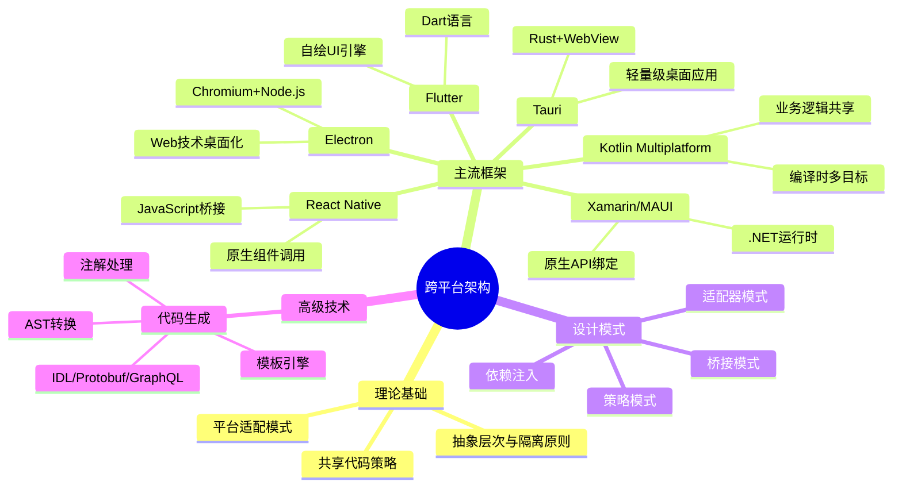

# 跨平台开发架构技术与成熟框架分析

## 目录

- [跨平台开发架构技术与成熟框架分析](#跨平台开发架构技术与成熟框架分析)
  - [目录](#目录)
  - [1. 引言](#1-引言)
    - [1.1 跨平台开发概述](#11-跨平台开发概述)
    - [1.2 跨平台架构的演进](#12-跨平台架构的演进)
  - [2. 跨平台架构理论基础](#2-跨平台架构理论基础)
    - [2.1 抽象层次与隔离原则](#21-抽象层次与隔离原则)
    - [2.2 共享代码策略](#22-共享代码策略)
    - [2.3 平台适配模式](#23-平台适配模式)
  - [3. 主流跨平台开发框架分析](#3-主流跨平台开发框架分析)
    - [3.1 React Native](#31-react-native)
    - [3.2 Flutter](#32-flutter)
    - [3.3 Xamarin/MAUI](#33-xamarinmaui)
    - [3.4 Electron](#34-electron)
    - [3.5 Tauri](#35-tauri)
    - [3.6 Kotlin Multiplatform](#36-kotlin-multiplatform)
  - [4. 跨平台架构设计模式](#4-跨平台架构设计模式)
    - [4.1 桥接模式](#41-桥接模式)
    - [4.2 适配器模式](#42-适配器模式)
    - [4.3 策略模式](#43-策略模式)
    - [4.4 依赖注入与服务定位](#44-依赖注入与服务定位)
  - [5. 高级跨平台架构实现技术](#5-高级跨平台架构实现技术)
    - [5.1 代码生成技术](#51-代码生成技术)
      - [5.1.1 基于Protobuf的跨平台代码生成](#511-基于protobuf的跨平台代码生成)
      - [5.1.2 GraphQL与代码生成](#512-graphql与代码生成)
      - [5.1.3 跨平台架构中代码生成的最佳实践](#513-跨平台架构中代码生成的最佳实践)
    - [5.2 思维导图](#52-思维导图)
  - [6. 总结与未来趋势](#6-总结与未来趋势)
    - [未来发展趋势](#未来发展趋势)

## 1. 引言

### 1.1 跨平台开发概述

**定义**：跨平台开发是指通过单一代码库或技术栈创建可在多种操作系统和设备上运行的应用程序的方法。

跨平台开发的主要目标是降低开发与维护成本，同时保持在不同平台上的功能一致性和用户体验。
在当前多设备、多系统的环境下，跨平台技术已从早期的"写一次，到处编译"发展为更复杂的架构体系。

**跨平台开发的核心挑战**：

1. 平台差异性：各平台的API、功能和设计规范各不相同
2. 性能表现：跨平台方案通常面临性能与原生应用的差距
3. 用户体验：如何平衡统一体验与符合平台特性的设计
4. 维护成本：平台特性更新与框架升级可能导致兼容问题

### 1.2 跨平台架构的演进

跨平台开发架构经历了几个重要发展阶段：

1. **早期跨编译方案**：如Java的"一次编写，到处运行"理念
2. **Web技术扩展**：HTML5和响应式Web设计
3. **混合应用框架**：Cordova/PhoneGap将网页包装为原生应用
4. **JavaScript桥接方案**：React Native通过JS桥接调用原生组件
5. **自绘UI引擎**：Flutter通过自绘UI实现跨平台一致性
6. **编译时多目标**：Kotlin Multiplatform在编译时生成各平台代码
7. **WebAssembly方案**：编译为中间代码在多平台运行

每一代技术都在解决前代的某些问题，同时可能引入新的复杂性。

## 2. 跨平台架构理论基础

### 2.1 抽象层次与隔离原则

成功的跨平台架构基于有效的抽象和关注点分离。
这可以通过层次化架构实现：

```text
┌─────────────────────────────────────┐
│        业务逻辑/应用核心层           │ ← 平台无关代码
├─────────────────────────────────────┤
│         领域模型/数据层              │ ← 平台无关代码
├─────────────────────────────────────┤
│           平台抽象接口               │ ← 定义平台能力接口
├─────────┬─────────┬─────────┬───────┤
│ iOS实现  │Android实现│ Web实现 │桌面实现│ ← 平台特定实现
└─────────┴─────────┴─────────┴───────┘
```

**抽象隔离原则**：
通过定义清晰的抽象接口，将应用逻辑与平台特定实现隔离。
这样可以实现同一业务逻辑在不同平台上重用，同时允许针对特定平台进行优化。

**理论证明**：
利用里氏替换原则(LSP)，任何平台特定实现都可以替换抽象接口，而不影响业务逻辑的正确性。

```kotlin
// 平台抽象接口
interface StorageService {
    suspend fun saveData(key: String, value: String): Boolean
    suspend fun getData(key: String): String?
    suspend fun removeData(key: String): Boolean
}

// 业务逻辑 - 平台无关
class UserRepository(private val storageService: StorageService) {
    suspend fun saveUser(user: User): Boolean {
        val userData = user.toJson()
        return storageService.saveData("user_${user.id}", userData)
    }
    
    suspend fun getUser(userId: String): User? {
        val userData = storageService.getData("user_$userId") ?: return null
        return User.fromJson(userData)
    }
}

// iOS平台实现
class IOSStorageService : StorageService {
    override suspend fun saveData(key: String, value: String): Boolean {
        // 使用NSUserDefaults实现
        return NSUserDefaults.standardUserDefaults().setObject(value, forKey: key)
    }
    
    // 其他方法实现...
}

// Android平台实现
class AndroidStorageService(private val context: Context) : StorageService {
    override suspend fun saveData(key: String, value: String): Boolean {
        // 使用SharedPreferences实现
        val prefs = context.getSharedPreferences("app_data", Context.MODE_PRIVATE)
        return prefs.edit().putString(key, value).commit()
    }
    
    // 其他方法实现...
}
```

### 2.2 共享代码策略

共享代码策略决定了代码在多平台之间的重用方式和程度。主要策略包括：

**1. 共享通用逻辑**：核心业务逻辑、算法、数据模型等在平台间共享

**2. 共享 UI 逻辑**：视图模型、状态管理、导航逻辑等共享

**3. 共享 UI 组件**：框架决定是否将 UI 组件抽象化或统一渲染

共享策略数学模型：如果将每个平台完全独立开发的成本记为C，那么跨平台开发的总成本可表示为：

```math
Ctotal = Cshared + Σ(Cplatform_i)
```

其中，Cshared是共享代码开发成本，Cplatform_i是每个平台特定代码的成本。

理论上，当 `Cshared + Σ(Cplatform_i) < Σ(C)` 时，跨平台开发是有成本优势的。

共享代码示例：

```typescript
// 共享业务逻辑 (TypeScript)
export class AuthenticationService {
  private user: User | null = null;
  
  async login(username: string, password: string): Promise<User> {
    try {
      // 通用登录逻辑
      const response = await this.apiClient.post('/auth/login', { username, password });
      this.user = new User(response.data);
      await this.storageService.saveData('auth_token', response.data.token);
      return this.user;
    } catch (error) {
      throw new AuthError('Login failed', error);
    }
  }
  
  async logout(): Promise<void> {
    // 通用注销逻辑
    await this.storageService.removeData('auth_token');
    this.user = null;
  }
  
  async getAuthenticatedUser(): Promise<User | null> {
    if (this.user) return this.user;
    
    const token = await this.storageService.getData('auth_token');
    if (!token) return null;
    
    try {
      const response = await this.apiClient.get('/auth/user');
      this.user = new User(response.data);
      return this.user;
    } catch (error) {
      await this.storageService.removeData('auth_token');
      return null;
    }
  }
}
```

### 2.3 平台适配模式

平台适配模式定义了如何处理不同平台之间的差异，主要包括：

**1. 能力检测模式**：在运行时检测平台特性，根据可用能力调整行为

```javascript
// 能力检测示例
class LocationService {
  async getCurrentLocation() {
    if (typeof navigator !== 'undefined' && navigator.geolocation) {
      // 浏览器环境使用Web API
      return new Promise((resolve, reject) => {
        navigator.geolocation.getCurrentPosition(
          position => resolve({
            latitude: position.coords.latitude,
            longitude: position.coords.longitude,
            accuracy: position.coords.accuracy
          }),
          error => reject(new Error(`Geolocation error: ${error.message}`))
        );
      });
    } else if (Platform.OS === 'ios' || Platform.OS === 'android') {
      // React Native环境使用原生模块
      try {
        const location = await NativeModules.LocationModule.getCurrentLocation();
        return {
          latitude: location.latitude,
          longitude: location.longitude,
          accuracy: location.accuracy
        };
      } catch (error) {
        throw new Error(`Native location error: ${error.message}`);
      }
    } else {
      throw new Error('Geolocation not available on this platform');
    }
  }
}
```

**2. 编译时条件编译**：使用预处理器或编译器标志来选择平台特定代码

```kotlin
// Kotlin Multiplatform条件编译
expect class PlatformFile {
    fun readBytes(): ByteArray
    fun writeBytes(data: ByteArray)
}

// iOS实现
actual class PlatformFile actual constructor(private val path: String) {
    private val file = NSFileManager.defaultManager()
    
    actual fun readBytes(): ByteArray {
        return file.contentsAtPath(path)?.toByteArray() ?: ByteArray(0)
    }
    
    actual fun writeBytes(data: ByteArray) {
        val nsData = data.toNSData()
        file.createFileAtPath(path, nsData, null)
    }
}

// Android实现
actual class PlatformFile actual constructor(private val path: String) {
    actual fun readBytes(): ByteArray {
        val file = java.io.File(path)
        return file.readBytes()
    }
    
    actual fun writeBytes(data: ByteArray) {
        val file = java.io.File(path)
        file.writeBytes(data)
    }
}
```

**3. 依赖注入模式**：在应用启动时注入平台特定实现

```typescript
// 依赖注入示例
// 平台接口定义
interface IPlatformServices {
  storage: IStorageService;
  network: INetworkService;
  notifications: INotificationService;
}

// 应用入口
class Application {
  constructor(private platformServices: IPlatformServices) {}
  
  async initialize() {
    // 使用已注入的平台服务
    await this.platformServices.storage.initialize();
    // ...
  }
}

// Android平台服务实现
class AndroidPlatformServices implements IPlatformServices {
  storage = new AndroidStorageService();
  network = new AndroidNetworkService();
  notifications = new AndroidNotificationService();
}

// iOS平台入口
function bootstrapIOSApp() {
  const services = new IOSPlatformServices();
  const app = new Application(services);
  app.initialize();
}

// Android平台入口
function bootstrapAndroidApp(context: Context) {
  const services = new AndroidPlatformServices(context);
  const app = new Application(services);
  app.initialize();
}
```

**形式化证明**：
平台适配模式的有效性可以通过接口一致性来证明。
如果所有平台实现都满足相同的接口契约，
则在任何平台上对该接口的调用都能正确执行，
这保证了应用逻辑的平台无关性。

## 3. 主流跨平台开发框架分析

### 3.1 React Native

**核心架构**：基于JavaScript引擎与原生组件桥接的跨平台框架

```math
┌─────────────────────────────────────────────────┐
│                React应用代码                     │
├─────────────────────────────────────────────────┤
│                React核心                        │
├─────────────────────────────────────────────────┤
│                JavaScript引擎                   │
│       (JavaScriptCore / Hermes / V8)            │
├─────────────────────────────────────────────────┤
│                JS Bridge                        │
├───────────────────┬─────────────────────────────┤
│     原生模块(iOS)  │       原生模块(Android)     │
└───────────────────┴─────────────────────────────┘
```

**技术原理**：
React Native使用JavaScript编写应用逻辑和UI，通过"桥"与原生平台通信，将UI操作转换为原生视图的调用。

**优势**：

1. 使用广泛流行的React开发模式
2. 可以直接访问原生组件，性能优于纯WebView
3. 热重载加快开发速度
4. 庞大的社区和生态系统

**局限性**：

1. 桥接通信存在性能瓶颈
2. 复杂动画和交互可能遇到性能问题
3. 初始加载时间较长
4. 依赖第三方库接入原生功能

**代码示例**：

```jsx
// React Native组件示例
import React, { useState, useEffect } from 'react';
import { View, Text, FlatList, StyleSheet, Platform } from 'react-native';

// 平台特定代码
const platformStyles = Platform.select({
  ios: {
    fontFamily: 'Helvetica',
    shadowColor: '#000',
    shadowOffset: { width: 0, height: 2 },
    shadowOpacity: 0.2,
    shadowRadius: 4,
  },
  android: {
    fontFamily: 'Roboto',
    elevation: 4,
  },
  default: {
    // web或其他平台
    fontFamily: 'System',
    boxShadow: '0px 2px 4px rgba(0, 0, 0, 0.2)',
  },
});

const TaskList = ({ tasks }) => {
  const [filteredTasks, setFilteredTasks] = useState([]);
  
  useEffect(() => {
    // 通用业务逻辑
    setFilteredTasks(tasks.filter(task => !task.completed));
  }, [tasks]);
  
  return (
    <View style={styles.container}>
      <Text style={[styles.title, platformStyles]}>任务列表</Text>
      <FlatList
        data={filteredTasks}
        keyExtractor={item => item.id.toString()}
        renderItem={({ item }) => (
          <View style={[styles.taskItem, platformStyles]}>
            <Text>{item.title}</Text>
          </View>
        )}
      />
    </View>
  );
};

const styles = StyleSheet.create({
  container: {
    flex: 1,
    backgroundColor: '#fff',
    padding: 16,
  },
  title: {
    fontSize: 22,
    fontWeight: 'bold',
    marginBottom: 16,
  },
  taskItem: {
    padding: 16,
    borderRadius: 8,
    backgroundColor: '#f9f9f9',
    marginBottom: 8,
  },
});

export default TaskList;
```

### 3.2 Flutter

**核心架构**：自绘UI引擎的跨平台框架，使用Dart语言

```text
┌─────────────────────────────────────────────────┐
│                Flutter应用代码                   │
├─────────────────────────────────────────────────┤
│                Flutter框架                       │
│  (Material/Cupertino Widgets, Animation, etc.)  │
├─────────────────────────────────────────────────┤
│                Flutter引擎                       │
│          (Skia, Dart Runtime, etc.)             │
├───────────────────┬─────────────────────────────┤
│   平台嵌入层(iOS)   │     平台嵌入层(Android)      │
└───────────────────┴─────────────────────────────┘
```

**技术原理**：Flutter不依赖原生UI组件，而是使用自己的渲染引擎(Skia)直接绘制UI，实现像素级的控制和一致性。

**优势**：

1. 高性能自绘引擎，接近原生的性能体验
2. 一致的渲染结果消除平台差异
3. 热重载开发体验
4. 丰富的内置UI组件库

**局限性**：

1. 应用体积较大
2. 自绘UI可能难以实现与系统深度集成
3. Dart语言学习曲线
4. 生态系统相对较新

**代码示例**：

```dart
// Flutter组件示例
import 'package:flutter/material.dart';
import 'package:flutter/cupertino.dart';
import 'dart:io' show Platform;

class TaskList extends StatefulWidget {
  final List<Task> tasks;
  
  TaskList({required this.tasks});
  
  @override
  _TaskListState createState() => _TaskListState();
}

class _TaskListState extends State<TaskList> {
  late List<Task> filteredTasks;
  
  @override
  void initState() {
    super.initState();
    // 通用业务逻辑
    filteredTasks = widget.tasks.where((task) => !task.completed).toList();
  }
  
  @override
  void didUpdateWidget(TaskList oldWidget) {
    super.didUpdateWidget(oldWidget);
    if (widget.tasks != oldWidget.tasks) {
      setState(() {
        filteredTasks = widget.tasks.where((task) => !task.completed).toList();
      });
    }
  }
  
  @override
  Widget build(BuildContext context) {
    // 根据平台选择不同风格的组件
    return Platform.isIOS
        ? _buildCupertinoList()
        : _buildMaterialList();
  }
  
  Widget _buildMaterialList() {
    return Scaffold(
      appBar: AppBar(
        title: Text('任务列表'),
      ),
      body: ListView.builder(
        itemCount: filteredTasks.length,
        itemBuilder: (context, index) {
          final task = filteredTasks[index];
          return Card(
            elevation: 2.0,
            margin: EdgeInsets.symmetric(horizontal: 16, vertical: 8),
            child: ListTile(
              title: Text(task.title),
              subtitle: Text(task.description ?? ''),
              trailing: Icon(Icons.arrow_forward_ios),
              onTap: () {
                // 处理点击事件
              },
            ),
          );
        },
      ),
    );
  }
  
  Widget _buildCupertinoList() {
    return CupertinoPageScaffold(
      navigationBar: CupertinoNavigationBar(
        middle: Text('任务列表'),
      ),
      child: ListView.builder(
        itemCount: filteredTasks.length,
        itemBuilder: (context, index) {
          final task = filteredTasks[index];
          return CupertinoListTile(
            title: Text(task.title),
            subtitle: Text(task.description ?? ''),
            trailing: CupertinoIcon(CupertinoIcons.right_chevron),
            onTap: () {
              // 处理点击事件
            },
          );
        },
      ),
    );
  }
}

class Task {
  final int id;
  final String title;
  final String? description;
  final bool completed;
  
  Task({
    required this.id,
    required this.title,
    this.description,
    this.completed = false,
  });
}
```

### 3.3 Xamarin/MAUI

**核心架构**：基于.NET平台的跨平台开发框架

```text
┌─────────────────────────────────────────────────┐
│               MAUI应用代码 (C#)                  │
├─────────────────────────────────────────────────┤
│                .NET MAUI框架                     │
├─────────────────────────────────────────────────┤
│                .NET运行时                        │
├───────────┬───────────┬───────────┬─────────────┤
│  iOS绑定   │Android绑定 │ Windows绑定│ macOS绑定   │
└───────────┴───────────┴───────────┴─────────────┘
```

**技术原理**：使用C#和.NET平台，通过绑定原生平台API，在保持平台特性的同时实现代码共享。

**优势**：

1. 高度共享的C#代码
2. 完全访问原生API
3. 与Visual Studio深度集成的开发体验
4. 支持桌面与移动平台

**局限性**：

1. 主要面向.NET生态系统开发者
2. 社区规模相对较小
3. 热重载支持有限
4. 应用体积较大

**代码示例**：

```csharp
// MAUI应用示例
using Microsoft.Maui;
using Microsoft.Maui.Controls;
using System.Collections.ObjectModel;
using System.Linq;

namespace TaskManagerApp
{
    public class TasksViewModel : BindableObject
    {
        private ObservableCollection<TaskItem> _tasks;
        private ObservableCollection<TaskItem> _filteredTasks;
        
        public ObservableCollection<TaskItem> Tasks
        {
            get => _tasks;
            set
            {
                _tasks = value;
                OnPropertyChanged();
                UpdateFilteredTasks();
            }
        }
        
        public ObservableCollection<TaskItem> FilteredTasks
        {
            get => _filteredTasks;
            private set
            {
                _filteredTasks = value;
                OnPropertyChanged();
            }
        }
        
        public TasksViewModel()
        {
            _tasks = new ObservableCollection<TaskItem>();
            _filteredTasks = new ObservableCollection<TaskItem>();
        }
        
        private void UpdateFilteredTasks()
        {
            // 通用业务逻辑
            FilteredTasks = new ObservableCollection<TaskItem>(
                Tasks.Where(t => !t.IsCompleted)
            );
        }
    }
    
    public class TaskListPage : ContentPage
    {
        private TasksViewModel _viewModel;
        
        public TaskListPage(TasksViewModel viewModel)
        {
            _viewModel = viewModel;
            BindingContext = _viewModel;
            
            Title = "任务列表";
            
            // 创建UI
            Content = new StackLayout
            {
                Children =
                {
                    new ListView
                    {
                        ItemsSource = new Binding("FilteredTasks"),
                        ItemTemplate = new DataTemplate(() =>
                        {
                            var cell = new ViewCell();
                            
                            // 根据平台定制UI
                            if (DeviceInfo.Platform == DevicePlatform.iOS)
                            {
                                // iOS风格样式
                                var grid = new Grid
                                {
                                    Padding = new Thickness(16),
                                    RowDefinitions =
                                    {
                                        new RowDefinition { Height = GridLength.Auto }
                                    },
                                    ColumnDefinitions =
                                    {
                                        new ColumnDefinition { Width = GridLength.Star },
                                        new ColumnDefinition { Width = GridLength.Auto }
                                    }
                                };
                                
                                var label = new Label { FontFamily = "Helvetica" };
                                label.SetBinding(Label.TextProperty, "Title");
                                
                                var indicator = new Image { Source = "chevron.png", WidthRequest = 12 };
                                
                                grid.Children.Add(label, 0, 0);
                                grid.Children.Add(indicator, 1, 0);
                                
                                cell.View = grid;
                            }
                            else
                            {
                                // Android/其他平台风格
                                var grid = new Grid
                                {
                                    Padding = new Thickness(16),
                                    RowDefinitions =
                                    {
                                        new RowDefinition { Height = GridLength.Auto }
                                    },
                                    ColumnDefinitions =
                                    {
                                        new ColumnDefinition { Width = GridLength.Star },
                                        new ColumnDefinition { Width = GridLength.Auto }
                                    }
                                };
                                
                                var label = new Label { FontFamily = "Roboto" };
                                label.SetBinding(Label.TextProperty, "Title");
                                
                                var indicator = new Image { Source = "arrow_forward.png", WidthRequest = 24 };
                                
                                grid.Children.Add(label, 0, 0);
                                grid.Children.Add(indicator, 1, 0);
                                
                                cell.View = grid;
                            }
                            
                            return cell;
                        })
                    }
                }
            };
        }
    }
    
    public class TaskItem
    {
        public int Id { get; set; }
        public string Title { get; set; }
        public string Description { get; set; }
        public bool IsCompleted { get; set; }
    }
}
```

### 3.4 Electron

**核心架构**：基于Chromium和Node.js的桌面应用框架

```text
┌─────────────────────────────────────────────────┐
│                 Web应用代码                      │
│          (HTML, CSS, JavaScript/TypeScript)     │
├─────────────────────────────────────────────────┤
│                 Electron API                    │
├─────────────────┬───────────────────────────────┤
│     Chromium    │           Node.js             │
│  (渲染进程)      │        (主进程)               │
├─────────────────┴───────────────────────────────┤
│       Windows/macOS/Linux 原生API               │
└─────────────────────────────────────────────────┘

```

**技术原理**：将Web技术与Node.js结合，通过Chromium渲染引擎显示UI，同时可通过Node.js访问系统API。

**优势**：

1. 使用熟悉的Web技术栈开发桌面应用
2. 支持Windows、macOS和Linux
3. 强大的原生功能访问能力
4. 大量现有Web应用可以轻松移植

**局限性**：

1. 应用体积大，内存占用高
2. 启动速度较慢
3. 电池消耗相对较高
4. 与原生应用的集成度较低

**代码示例**：

```javascript
// Electron应用示例
// main.js - 主进程
const { app, BrowserWindow, ipcMain } = require('electron');
const path = require('path');
const fs = require('fs');

// 平台特定配置
const getPlatformConfig = () => {
  switch (process.platform) {
    case 'darwin': // macOS
      return {
        titleBarStyle: 'hiddenInset',
        frame: false,
        vibrancy: 'under-window',
        transparent: true
      };
    case 'win32': // Windows
      return {
        frame: false,
        backgroundColor: '#ffffff',
        transparent: false
      };
    default: // Linux和其他
      return {
        frame: true,
        backgroundColor: '#f5f5f5',
        transparent: false
      };
  }
};

let mainWindow;

function createWindow() {
  const platformConfig = getPlatformConfig();
  
  mainWindow = new BrowserWindow({
    width: 900,
    height: 600,
    ...platformConfig,
    webPreferences: {
      preload: path.join(__dirname, 'preload.js'),
      contextIsolation: true,
      nodeIntegration: false
    }
  });

  mainWindow.loadFile('index.html');
  
  // macOS特定菜单
  if (process.platform === 'darwin') {
    const { Menu } = require('electron');
    const template = [
      {
        label: app.name,
        submenu: [
          { role: 'about' },
          { type: 'separator' },
          { role: 'services' },
          { type: 'separator' },
          { role: 'hide' },
          { role: 'hideOthers' },
          { role: 'unhide' },
          { type: 'separator' },
          { role: 'quit' }
        ]
      }
      // 其他菜单项...
    ];
    Menu.setApplicationMenu(Menu.buildFromTemplate(template));
  }
}

app.whenReady().then(() => {
  createWindow();
  
  app.on('activate', function () {
    // macOS特定行为
    if (BrowserWindow.getAllWindows().length === 0) createWindow();
  });
});

app.on('window-all-closed', function () {
  // 在macOS上保持应用运行直到用户明确退出
  if (process.platform !== 'darwin') app.quit();
});

// 处理任务相关IPC通信
ipcMain.handle('get-tasks', async () => {
  // 使用Node.js文件系统API读取任务
  try {
    const dataPath = path.join(app.getPath('userData'), 'tasks.json');
    if (fs.existsSync(dataPath)) {
      const data = fs.readFileSync(dataPath, 'utf8');
      return JSON.parse(data);
    }
    return [];
  } catch (error) {
    console.error('Failed to read tasks:', error);
    return [];
  }
});

ipcMain.handle('save-tasks', async (event, tasks) => {
  try {
    const dataPath = path.join(app.getPath('userData'), 'tasks.json');
    fs.writeFileSync(dataPath, JSON.stringify(tasks, null, 2));
    return true;
  } catch (error) {
    console.error('Failed to save tasks:', error);
    return false;
  }
});

// preload.js - 预加载脚本
const { contextBridge, ipcRenderer } = require('electron');

// 暴露安全的API给渲染进程
contextBridge.exposeInMainWorld('electronAPI', {
  getTasks: () => ipcRenderer.invoke('get-tasks'),
  saveTasks: (tasks) => ipcRenderer.invoke('save-tasks', tasks),
  platform: process.platform
});

// renderer.js - 渲染进程
document.addEventListener('DOMContentLoaded', async () => {
  const app = new Vue({
    el: '#app',
    data: {
      tasks: [],
      newTaskTitle: '',
      platform: window.electronAPI.platform
    },
    computed: {
      uncompletedTasks() {
        // 共享的业务逻辑
        return this.tasks.filter(task => !task.completed);
      },
      platformClass() {
        return `platform-${this.platform}`;
      }
    },
    methods: {
      async loadTasks() {
        this.tasks = await window.electronAPI.getTasks();
      },
      async saveTask() {
        if (!this.newTaskTitle.trim()) return;
        
        const newTask = {
          id: Date.now(),
          title: this.newTaskTitle,
          completed: false,
          createdAt: new Date().toISOString()
        };
        
        this.tasks.push(newTask);
        await window.electronAPI.saveTasks(this.tasks);
        this.newTaskTitle = '';
      },
      async toggleTaskStatus(task) {
        task.completed = !task.completed;
        await window.electronAPI.saveTasks(this.tasks);
      }
    },
    mounted() {
      this.loadTasks();
      
      // 平台特定UI调整
      document.body.classList.add(this.platformClass);
    }
  });
});
```

### 3.5 Tauri

**核心架构**：基于Rust和WebView的桌面应用框架

```text
┌─────────────────────────────────────────────────┐
│                 前端代码                        │
│       (HTML, CSS, JavaScript/TypeScript)        │
├─────────────────────────────────────────────────┤
│                Tauri JS API                     │
├─────────────────────────────────────────────────┤
│                Tauri 核心(Rust)                 │
├─────────────────────────────────────────────────┤
│               WebView渲染引擎                   │
│   (WKWebView/WebView2/WebKitGTK)               │
├─────────────────────────────────────────────────┤
│       Windows/macOS/Linux 系统API              │
└─────────────────────────────────────────────────┘
```

**技术原理**：
使用系统自带的WebView组件渲染UI，用Rust编写后端逻辑，通过桥接API通信，
提供比Electron更轻量的桌面应用解决方案。

**优势**：

1. 极小的应用体积
2. 低内存占用和更好的性能
3. 强大的安全模型
4. 几乎可以使用任何前端框架

**局限性**：

1. 生态系统相对较新
2. API没有Electron丰富
3. 学习Rust的额外成本
4. WebView在不同平台可能有差异

**代码示例**：

```rust
// Tauri应用示例
// src-tauri/src/main.rs - Rust后端
#![cfg_attr(
  all(not(debug_assertions), target_os = "windows"),
  windows_subsystem = "windows"
)]

use tauri::{Manager, Runtime};
use std::fs;
use std::path::PathBuf;
use serde::{Deserialize, Serialize};
use std::sync::Mutex;
use std::collections::HashMap;

#[derive(Serialize, Deserialize, Clone, Debug)]
struct Task {
  id: u64,
  title: String,
  description: Option<String>,
  completed: bool,
  created_at: String,
}

struct AppState {
  tasks_cache: Mutex<HashMap<u64, Task>>,
}

#[tauri::command]
fn get_tasks(state: tauri::State<AppState>, app_handle: tauri::AppHandle) -> Result<Vec<Task>, String> {
  // 优先使用缓存
  let cache = state.tasks_cache.lock().unwrap();
  if !cache.is_empty() {
    return Ok(cache.values().cloned().collect());
  }
  
  // 读取文件系统
  let app_dir = app_handle.path_resolver().app_data_dir().expect("failed to get app data dir");
  let tasks_file = app_dir.join("tasks.json");
  
  // 确保目录存在
  if !app_dir.exists() {
    fs::create_dir_all(&app_dir).map_err(|e| e.to_string())?;
  }
  
  if tasks_file.exists() {
    let content = fs::read_to_string(tasks_file).map_err(|e| e.to_string())?;
    let tasks: Vec<Task> = serde_json::from_str(&content).map_err(|e| e.to_string())?;
    
    // 更新缓存
    let mut cache = state.tasks_cache.lock().unwrap();
    for task in &tasks {
      cache.insert(task.id, task.clone());
    }
    
    Ok(tasks)
  } else {
    Ok(Vec::new())
  }
}

#[tauri::command]
fn save_tasks(tasks: Vec<Task>, app_handle: tauri::AppHandle, state: tauri::State<AppState>) -> Result<bool, String> {
  let app_dir = app_handle.path_resolver().app_data_dir().expect("failed to get app data dir");
  let tasks_file = app_dir.join("tasks.json");
  
  // 确保目录存在
  if !app_dir.exists() {
    fs::create_dir_all(&app_dir).map_err(|e| e.to_string())?;
  }
  
  // 序列化任务
  let json = serde_json::to_string_pretty(&tasks).map_err(|e| e.to_string())?;
  
  // 写入文件
  fs::write(tasks_file, json).map_err(|e| e.to_string())?;
  
  // 更新缓存
  let mut cache = state.tasks_cache.lock().unwrap();
  cache.clear();
  for task in tasks {
    cache.insert(task.id, task);
  }
  
  Ok(true)
}

fn main() {
  let state = AppState {
    tasks_cache: Mutex::new(HashMap::new()),
  };
  
  tauri::Builder::default()
    .manage(state)
    .invoke_handler(tauri::generate_handler![get_tasks, save_tasks])
    .run(tauri::generate_context!())
    .expect("error while running tauri application");
}
```

```typescript
// src/App.svelte - Svelte前端
<script lang="ts">
  import { onMount } from 'svelte';
  import { invoke } from '@tauri-apps/api/tauri';
  import { appWindow } from '@tauri-apps/api/window';
  import { platform } from '@tauri-apps/api/os';
  
  interface Task {
    id: number;
    title: string;
    description?: string;
    completed: boolean;
    created_at: string;
  }
  
  let tasks: Task[] = [];
  let newTaskTitle = '';
  let currentPlatform = '';
  
  $: uncompletedTasks = tasks.filter(task => !task.completed);
  
  async function loadTasks() {
    try {
      tasks = await invoke('get_tasks');
    } catch (error) {
      console.error('Failed to load tasks:', error);
    }
  }
  
  async function saveTask() {
    if (!newTaskTitle.trim()) return;
    
    const newTask: Task = {
      id: Date.now(),
      title: newTaskTitle,
      completed: false,
      created_at: new Date().toISOString()
    };
    
    tasks = [...tasks, newTask];
    await invoke('save_tasks', { tasks });
    newTaskTitle = '';
  }
  
  async function toggleTaskStatus(task: Task) {
    task.completed = !task.completed;
    await invoke('save_tasks', { tasks });
  }
  
  onMount(async () => {
    await loadTasks();
    currentPlatform = await platform();
    
    // 平台特定窗口处理
    if (currentPlatform === 'darwin') {
      // macOS特定处理
      document.body.classList.add('macos');
      // 处理标题栏拖拽
      document.getElementById('titlebar')?.addEventListener('mousedown', () => {
        appWindow.startDragging();
      });
    } else if (currentPlatform === 'win32') {
      // Windows特定处理
      document.body.classList.add('windows');
    } else {
      // Linux特定处理
      document.body.classList.add('linux');
    }
  });
</script>

<main class="container {currentPlatform}">
  {#if currentPlatform === 'darwin' || currentPlatform === 'win32'}
    <div id="titlebar" class="titlebar">
      <div class="title">任务管理器</div>
      {#if currentPlatform === 'win32'}
        <div class="window-controls">
          <button class="minimize" on:click={() => appWindow.minimize()}>-</button>
          <button class="maximize" on:click={() => appWindow.toggleMaximize()}>□</button>
          <button class="close" on:click={() => appWindow.close()}>×</button>
        </div>
      {/if}
    </div>
  {/if}
  
  <h1>任务列表</h1>
  
  <div class="new-task">
    <input
      type="text"
      placeholder="输入新任务"
      bind:value={newTaskTitle}
      on:keydown={e => e.key === 'Enter' && saveTask()}
    />
    <button on:click={saveTask}>添加</button>
  </div>
  
  <div class="task-list">
    {#each uncompletedTasks as task (task.id)}
      <div class="task-item">
        <input
          type="checkbox"
          checked={task.completed}
          on:change={() => toggleTaskStatus(task)}
        />
        <span class="task-title">{task.title}</span>
      </div>
    {/each}
    
    {#if uncompletedTasks.length === 0}
      <div class="empty-state">没有未完成的任务</div>
    {/if}
  </div>
</main>

<style>
  .container {
    padding: 20px;
    font-family: system-ui, -apple-system, BlinkMacSystemFont, 'Segoe UI', Roboto, sans-serif;
  }
  
  /* 平台特定样式 */
  .container.win32 {
    font-family: 'Segoe UI', Tahoma, Geneva, Verdana, sans-serif;
  }
  
  .container.darwin {
    font-family: -apple-system, BlinkMacSystemFont, sans-serif;
  }
  
  .container.linux {
    font-family: Ubuntu, 'Open Sans', sans-serif;
  }
  
  .titlebar {
    display: flex;
    justify-content: space-between;
    align-items: center;
    height: 30px;
    padding: 0 8px;
    -webkit-app-region: drag;
  }
  
  .window-controls {
    display: flex;
    -webkit-app-region: no-drag;
  }
  
  .window-controls button {
    border: none;
    background: transparent;
    font-size: 16px;
    width: 30px;
    height: 30px;
    cursor: pointer;
  }
  
  /* 其他样式... */
</style>
```

### 3.6 Kotlin Multiplatform

**核心架构**：
Kotlin编译器支持的跨平台框架

```text
┌─────────────────────────────────────────────────┐
│             共享Kotlin代码                      │
│         (业务逻辑、数据模型、网络)              │
├─────────────────────┬───────────────────────────┤
│      Kotlin/JVM      │      Kotlin/Native       │
│ (Android, JVM后端)    │  (iOS, macOS, Windows)   │
├─────────────────────┼───────────────────────────┤
│     Android API      │     iOS API (Objective-C) │
└─────────────────────┴───────────────────────────┘
```

**技术原理**：
利用Kotlin的多平台编译能力，将共享代码编译为各目标平台的原生代码，同时允许平台特定代码直接访问原生API。

**优势**：

1. 高度共享的业务逻辑代码
2. 强大的类型系统
3. 原生性能
4. 灵活的平台特定代码

**局限性**：

1. UI通常需要为每个平台单独实现
2. 生态系统还在发展中
3. 设置和构建系统较复杂
4. 与现有Android/iOS项目集成可能有挑战

**代码示例**：

```kotlin
// Kotlin Multiplatform示例
// 共享代码 - commonMain/kotlin/com/example/tasklist/TaskRepository.kt
package com.example.tasklist

import kotlinx.coroutines.flow.Flow
import kotlinx.coroutines.flow.MutableStateFlow
import kotlinx.coroutines.flow.map
import kotlinx.datetime.Clock
import kotlinx.datetime.Instant

class TaskRepository(private val taskStorage: TaskStorage) {
    // 内存中的任务缓存
    private val _tasks = MutableStateFlow<List<Task>>(emptyList())
    val tasks: Flow<List<Task>> = _tasks
    
    // 未完成任务的流
    val uncompletedTasks: Flow<List<Task>> = tasks.map { taskList ->
        taskList.filter { !it.completed }
    }
    
    suspend fun loadTasks() {
        val loadedTasks = taskStorage.loadTasks()
        _tasks.value = loadedTasks
    }
    
    suspend fun addTask(title: String, description: String? = null): Task {
        val newTask = Task(
            id = generateId(),
            title = title,
            description = description,
            completed = false,
            createdAt = Clock.System.now()
        )
        
        val updatedTasks = _tasks.value + newTask
        _tasks.value = updatedTasks
        taskStorage.saveTasks(updatedTasks)
        
        return newTask
    }
    
    suspend fun toggleTaskCompletion(taskId: String) {
        val taskList = _tasks.value
        val updatedTasks = taskList.map { task ->
            if (task.id == taskId) {
                task.copy(completed = !task.completed)
            } else {
                task
            }
        }
        
        _tasks.value = updatedTasks
        taskStorage.saveTasks(updatedTasks)
    }
    
    private fun generateId(): String = "${Clock.System.now().toEpochMilliseconds()}-${(0..9999).random()}"
}

// 共享的数据模型
data class Task(
    val id: String,
    val title: String,
    val description: String? = null,
    val completed: Boolean = false,
    val createdAt: Instant
)

// 平台特定存储的期望声明
expect class TaskStorage {
    suspend fun loadTasks(): List<Task>
    suspend fun saveTasks(tasks: List<Task>): Boolean
}

// Android实现 - androidMain/kotlin/com/example/tasklist/TaskStorage.kt
package com.example.tasklist

import android.content.Context
import kotlinx.coroutines.Dispatchers
import kotlinx.coroutines.withContext
import kotlinx.serialization.decodeFromString
import kotlinx.serialization.encodeToString
import kotlinx.serialization.json.Json

actual class TaskStorage(private val context: Context) {
    private val json = Json { ignoreUnknownKeys = true }
    private val fileName = "tasks.json"
    
    actual suspend fun loadTasks(): List<Task> = withContext(Dispatchers.IO) {
        try {
            val file = context.getFileStreamPath(fileName)
            if (!file.exists()) {
                return@withContext emptyList()
            }
            
            val inputStream = context.openFileInput(fileName)
            val jsonString = inputStream.bufferedReader().use { it.readText() }
            json.decodeFromString(jsonString)
        } catch (e: Exception) {
            e.printStackTrace()
            emptyList()
        }
    }
    
    actual suspend fun saveTasks(tasks: List<Task>): Boolean = withContext(Dispatchers.IO) {
        try {
            val jsonString = json.encodeToString(tasks)
            context.openFileOutput(fileName, Context.MODE_PRIVATE).use { 
                it.write(jsonString.toByteArray())
            }
            true
        } catch (e: Exception) {
            e.printStackTrace()
            false
        }
    }
}

// iOS实现 - iosMain/kotlin/com/example/tasklist/TaskStorage.kt
package com.example.tasklist

import kotlinx.coroutines.Dispatchers
import kotlinx.coroutines.withContext
import kotlinx.serialization.decodeFromString
import kotlinx.serialization.encodeToString
import kotlinx.serialization.json.Json
import platform.Foundation.*

actual class TaskStorage {
    private val json = Json { ignoreUnknownKeys = true }
    
    actual suspend fun loadTasks(): List<Task> = withContext(Dispatchers.Default) {
        try {
            val fileManager = NSFileManager.defaultManager
            val documentsDirectory = fileManager.URLsForDirectory(
                NSDocumentDirectory,
                NSUserDomainMask
            ).firstOrNull() as? NSURL ?: return@withContext emptyList()
            
            val fileURL = documentsDirectory.URLByAppendingPathComponent("tasks.json")
            
            if (fileManager.fileExistsAtPath(fileURL.path ?: "")) {
                val jsonData = NSData.dataWithContentsOfURL(fileURL) ?: return@withContext emptyList()
                val jsonString = NSString.create(data = jsonData, encoding = NSUTF8StringEncoding) as String
                json.decodeFromString(jsonString)
            } else {
                emptyList()
            }
        } catch (e: Exception) {
            e.printStackTrace()
            emptyList()
        }
    }
    
    actual suspend fun saveTasks(tasks: List<Task>): Boolean = withContext(Dispatchers.Default) {
        try {
            val fileManager = NSFileManager.defaultManager
            val documentsDirectory = fileManager.URLsForDirectory(
                NSDocumentDirectory,
                NSUserDomainMask
            ).firstOrNull() as? NSURL ?: return@withContext false
            
            val fileURL = documentsDirectory.URLByAppendingPathComponent("tasks.json")
            
            val jsonString = json.encodeToString(tasks)
            val data = jsonString.encodeToByteArray()
            val nsData = NSData.dataWithBytes(data.refTo(0), length = data.size.toULong())
            
            nsData.writeToURL(fileURL, atomically = true)
        } catch (e: Exception) {
            e.printStackTrace()
            false
        }
    }
}

// Android UI实现 - MainActivity.kt
class MainActivity : AppCompatActivity() {
    private val viewModel: TaskViewModel by viewModels {
        TaskViewModelFactory(TaskRepository(TaskStorage(applicationContext)))
    }
    
    override fun onCreate(savedInstanceState: Bundle?) {
        super.onCreate(savedInstanceState)
        setContentView(R.layout.activity_main)
        
        val recyclerView = findViewById<RecyclerView>(R.id.taskRecyclerView)
        val adapter = TaskAdapter { taskId ->
            lifecycleScope.launch {
                viewModel.toggleTaskCompletion(taskId)
            }
        }
        
        recyclerView.adapter = adapter
        recyclerView.layoutManager = LinearLayoutManager(this)
        
        // 观察任务列表变化
        lifecycleScope.launch {
            viewModel.uncompletedTasks.collect { tasks ->
                adapter.submitList(tasks)
            }
        }
        
        // 添加新任务
        val addButton = findViewById<Button>(R.id.addTaskButton)
        val titleInput = findViewById<EditText>(R.id.taskTitleInput)
        
        addButton.setOnClickListener {
            val title = titleInput.text.toString().trim()
            if (title.isNotEmpty()) {
                lifecycleScope.launch {
                    viewModel.addTask(title)
                    titleInput.text.clear()
                }
            }
        }
    }
}

// iOS UI实现 - TaskListViewController.swift
class TaskListViewController: UIViewController, UITableViewDataSource, UITableViewDelegate {
    private let tableView = UITableView()
    private let addButton = UIButton()
    private let titleTextField = UITextField()
    
    private var tasks: [Task] = []
    private let repository: TaskRepository
    
    init(repository: TaskRepository) {
        self.repository = repository
        super.init(nibName: nil, bundle: nil)
    }
    
    required init?(coder: NSCoder) {
        fatalError("init(coder:) has not been implemented")
    }
    
    override func viewDidLoad() {
        super.viewDidLoad()
        setupUI()
        
        // 加载任务并观察更新
        repository.loadTasks()
        
        // 使用Combine框架订阅Flow
        observeTasks()
    }
    
    private func observeTasks() {
        // 将Kotlin Flow转换为Publisher
        let publisher = repository.uncompletedTasks.asPublisher()
        
        publisher
            .receive(on: DispatchQueue.main)
            .sink { [weak self] tasks in
                self?.tasks = tasks
                self?.tableView.reloadData()
            }
            .store(in: &cancellables)
    }
    
    @objc private func addTask() {
        guard let title = titleTextField.text?.trimmingCharacters(in: .whitespacesAndNewlines), 
              !title.isEmpty else {
            return
        }
        
        // 添加任务
        DispatchQueue.global().async {
            self.repository.addTask(title: title, description: nil)
        }
        
        titleTextField.text = ""
    }
    
    // TableView数据源方法
    func tableView(_ tableView: UITableView, numberOfRowsInSection section: Int) -> Int {
        return tasks.count
    }
    
    func tableView(_ tableView: UITableView, cellForRowAt indexPath: IndexPath) -> UITableViewCell {
        let cell = tableView.dequeueReusableCell(withIdentifier: "TaskCell", for: indexPath)
        let task = tasks[indexPath.row]
        
        cell.textLabel?.text = task.title
        cell.accessoryType = task.completed ? .checkmark : .none
        
        return cell
    }
    
    // TableView委托方法
    func tableView(_ tableView: UITableView, didSelectRowAt indexPath: IndexPath) {
        tableView.deselectRow(at: indexPath, animated: true)
        
        let task = tasks[indexPath.row]
        
        // 切换任务完成状态
        DispatchQueue.global().async {
            self.repository.toggleTaskCompletion(taskId: task.id)
        }
    }
}
```

## 4. 跨平台架构设计模式

### 4.1 桥接模式

桥接模式是跨平台架构中最常用的设计模式之一，它将抽象部分与实现部分分离，使它们可以独立变化。

**理论基础**：
桥接模式使用组合而非继承来分离接口和实现，通过依赖注入实现动态选择合适的平台实现。

**形式定义**：
如果将抽象部分表示为A，实现部分表示为I，则桥接模式建立了从A到I的映射关系M: A → I，
使得对A的操作可以通过I实现。

```kotlin
// Kotlin中的桥接模式示例
// 抽象部分
interface NotificationService {
    fun notify(message: String, recipient: String)
    fun scheduleNotification(message: String, recipient: String, delayInSeconds: Int)
    fun cancelAllNotifications()
}

// 平台实现接口
interface NotificationImplementation {
    fun showNotification(title: String, message: String, id: String)
    fun scheduleNotification(title: String, message: String, id: String, triggerAtMillis: Long)
    fun cancelNotification(id: String)
    fun cancelAllNotifications()
}

// 抽象层实现
class DefaultNotificationService(private val implementation: NotificationImplementation) : NotificationService {
    override fun notify(message: String, recipient: String) {
        implementation.showNotification(
            title = "Message for $recipient",
            message = message,
            id = "${System.currentTimeMillis()}"
        )
    }
    
    override fun scheduleNotification(message: String, recipient: String, delayInSeconds: Int) {
        val triggerTime = System.
```kotlin
    override fun scheduleNotification(message: String, recipient: String, delayInSeconds: Int) {
        val triggerTime = System.currentTimeMillis() + (delayInSeconds * 1000L)
        implementation.scheduleNotification(
            title = "Message for $recipient",
            message = message,
            id = "${System.currentTimeMillis()}-${recipient.hashCode()}",
            triggerAtMillis = triggerTime
        )
    }
    
    override fun cancelAllNotifications() {
        implementation.cancelAllNotifications()
    }
}

// iOS平台实现
class IOSNotificationImplementation : NotificationImplementation {
    private val notificationCenter = UNUserNotificationCenter.current()
    
    override fun showNotification(title: String, message: String, id: String) {
        val content = UNMutableNotificationContent().apply {
            this.title = title
            this.body = message
            this.sound = UNNotificationSound.default
        }
        
        val request = UNNotificationRequest(
            identifier = id,
            content = content,
            trigger = UNTimeIntervalNotificationTrigger(timeInterval = 0.1, repeats = false)
        )
        
        notificationCenter.add(request, null)
    }
    
    override fun scheduleNotification(title: String, message: String, id: String, triggerAtMillis: Long) {
        val content = UNMutableNotificationContent().apply {
            this.title = title
            this.body = message
            this.sound = UNNotificationSound.default
        }
        
        val triggerSeconds = (triggerAtMillis - System.currentTimeMillis()) / 1000.0
        val trigger = UNTimeIntervalNotificationTrigger(timeInterval = triggerSeconds, repeats = false)
        
        val request = UNNotificationRequest(identifier = id, content = content, trigger = trigger)
        notificationCenter.add(request, null)
    }
    
    override fun cancelNotification(id: String) {
        notificationCenter.removePendingNotificationRequests(withIdentifiers = listOf(id))
        notificationCenter.removeDeliveredNotifications(withIdentifiers = listOf(id))
    }
    
    override fun cancelAllNotifications() {
        notificationCenter.removeAllPendingNotificationRequests()
        notificationCenter.removeAllDeliveredNotifications()
    }
}

// Android平台实现
class AndroidNotificationImplementation(private val context: Context) : NotificationImplementation {
    private val notificationManager = context.getSystemService(Context.NOTIFICATION_SERVICE) as NotificationManager
    private val channelId = "app_notifications"
    
    init {
        // 为Android 8.0及以上创建通知渠道
        if (Build.VERSION.SDK_INT >= Build.VERSION_CODES.O) {
            val channel = NotificationChannel(
                channelId,
                "App Notifications",
                NotificationManager.IMPORTANCE_DEFAULT
            ).apply {
                description = "App notification channel"
                enableLights(true)
                lightColor = Color.BLUE
            }
            notificationManager.createNotificationChannel(channel)
        }
    }
    
    override fun showNotification(title: String, message: String, id: String) {
        val builder = NotificationCompat.Builder(context, channelId)
            .setSmallIcon(R.drawable.ic_notification)
            .setContentTitle(title)
            .setContentText(message)
            .setPriority(NotificationCompat.PRIORITY_DEFAULT)
        
        notificationManager.notify(id.hashCode(), builder.build())
    }
    
    override fun scheduleNotification(title: String, message: String, id: String, triggerAtMillis: Long) {
        val intent = Intent(context, NotificationReceiver::class.java).apply {
            putExtra("notification_id", id.hashCode())
            putExtra("title", title)
            putExtra("message", message)
        }
        
        val pendingIntent = PendingIntent.getBroadcast(
            context,
            id.hashCode(),
            intent,
            PendingIntent.FLAG_UPDATE_CURRENT or PendingIntent.FLAG_IMMUTABLE
        )
        
        val alarmManager = context.getSystemService(Context.ALARM_SERVICE) as AlarmManager
        alarmManager.setExactAndAllowWhileIdle(
            AlarmManager.RTC_WAKEUP,
            triggerAtMillis,
            pendingIntent
        )
    }
    
    override fun cancelNotification(id: String) {
        notificationManager.cancel(id.hashCode())
        
        // 取消任何待定的通知
        val intent = Intent(context, NotificationReceiver::class.java)
        val pendingIntent = PendingIntent.getBroadcast(
            context,
            id.hashCode(),
            intent,
            PendingIntent.FLAG_UPDATE_CURRENT or PendingIntent.FLAG_IMMUTABLE
        )
        
        val alarmManager = context.getSystemService(Context.ALARM_SERVICE) as AlarmManager
        alarmManager.cancel(pendingIntent)
    }
    
    override fun cancelAllNotifications() {
        notificationManager.cancelAll()
    }
}
```

桥接模式的优势在于它允许抽象和实现独立变化，非常适合跨平台架构。
在上面的示例中，`NotificationService`提供了应用程序所需的高级API，
而不同平台的`NotificationImplementation`则提供了平台特定实现。

### 4.2 适配器模式

适配器模式用于将不兼容的接口转换为可兼容的接口，在跨平台开发中常用于适配各平台的原生API。

**理论基础**：适配器模式创建一个统一接口，将各平台特定API的不同接口转换为应用程序可以一致使用的接口。

**形式定义**：如果目标接口为T，平台特定接口为S，则适配器创建了函数 f: S → T，使得对S的操作可以通过T来表达。

```typescript
// TypeScript中的适配器模式示例
// 目标接口
interface FileSystem {
  readFile(path: string): Promise<string>;
  writeFile(path: string, content: string): Promise<void>;
  removeFile(path: string): Promise<boolean>;
  listFiles(directory: string): Promise<string[]>;
  fileExists(path: string): Promise<boolean>;
}

// Web平台适配器
class WebFileSystemAdapter implements FileSystem {
  private indexedDB: IDBDatabase | null = null;
  
  constructor() {
    this.initDB();
  }
  
  private async initDB(): Promise<void> {
    return new Promise((resolve, reject) => {
      const request = indexedDB.open('FileSystemDB', 1);
      
      request.onerror = () => reject(new Error('Failed to open database'));
      
      request.onupgradeneeded = (event) => {
        const db = (event.target as IDBOpenDBRequest).result;
        if (!db.objectStoreNames.contains('files')) {
          db.createObjectStore('files', { keyPath: 'path' });
        }
      };
      
      request.onsuccess = (event) => {
        this.indexedDB = (event.target as IDBOpenDBRequest).result;
        resolve();
      };
    });
  }
  
  async readFile(path: string): Promise<string> {
    await this.ensureDBInitialized();
    
    return new Promise((resolve, reject) => {
      const transaction = this.indexedDB!.transaction(['files'], 'readonly');
      const store = transaction.objectStore('files');
      const request = store.get(path);
      
      request.onerror = () => reject(new Error(`Error reading file: ${path}`));
      
      request.onsuccess = () => {
        if (request.result) {
          resolve(request.result.content);
        } else {
          reject(new Error(`File not found: ${path}`));
        }
      };
    });
  }
  
  async writeFile(path: string, content: string): Promise<void> {
    await this.ensureDBInitialized();
    
    return new Promise((resolve, reject) => {
      const transaction = this.indexedDB!.transaction(['files'], 'readwrite');
      const store = transaction.objectStore('files');
      const request = store.put({ path, content, timestamp: Date.now() });
      
      request.onerror = () => reject(new Error(`Error writing file: ${path}`));
      request.onsuccess = () => resolve();
    });
  }
  
  async removeFile(path: string): Promise<boolean> {
    await this.ensureDBInitialized();
    
    return new Promise((resolve, reject) => {
      const transaction = this.indexedDB!.transaction(['files'], 'readwrite');
      const store = transaction.objectStore('files');
      const request = store.delete(path);
      
      request.onerror = () => reject(new Error(`Error deleting file: ${path}`));
      
      request.onsuccess = () => {
        resolve(true);
      };
    });
  }
  
  async listFiles(directory: string): Promise<string[]> {
    await this.ensureDBInitialized();
    
    return new Promise((resolve, reject) => {
      const transaction = this.indexedDB!.transaction(['files'], 'readonly');
      const store = transaction.objectStore('files');
      const request = store.openCursor();
      
      const files: string[] = [];
      
      request.onerror = () => reject(new Error(`Error listing files in: ${directory}`));
      
      request.onsuccess = (event) => {
        const cursor = (event.target as IDBRequest).result;
        
        if (cursor) {
          const path = cursor.value.path;
          
          // Only include files in the specified directory
          if (path.startsWith(directory)) {
            const relativePath = path.substring(directory.length);
            if (relativePath && !relativePath.includes('/')) {
              files.push(path);
            }
          }
          
          cursor.continue();
        } else {
          resolve(files);
        }
      };
    });
  }
  
  async fileExists(path: string): Promise<boolean> {
    await this.ensureDBInitialized();
    
    return new Promise((resolve) => {
      const transaction = this.indexedDB!.transaction(['files'], 'readonly');
      const store = transaction.objectStore('files');
      const request = store.count(path);
      
      request.onsuccess = () => {
        resolve(request.result > 0);
      };
      
      request.onerror = () => {
        resolve(false);
      };
    });
  }
  
  private async ensureDBInitialized(): Promise<void> {
    if (!this.indexedDB) {
      await this.initDB();
    }
  }
}

// Node.js平台适配器
class NodeFileSystemAdapter implements FileSystem {
  private fs: typeof import('fs/promises');
  
  constructor() {
    this.fs = require('fs/promises');
  }
  
  async readFile(path: string): Promise<string> {
    try {
      return await this.fs.readFile(path, 'utf-8');
    } catch (error) {
      throw new Error(`Error reading file: ${path} - ${error.message}`);
    }
  }
  
  async writeFile(path: string, content: string): Promise<void> {
    try {
      await this.fs.writeFile(path, content, 'utf-8');
    } catch (error) {
      throw new Error(`Error writing file: ${path} - ${error.message}`);
    }
  }
  
  async removeFile(path: string): Promise<boolean> {
    try {
      await this.fs.unlink(path);
      return true;
    } catch (error) {
      if (error.code === 'ENOENT') {
        return false;
      }
      throw new Error(`Error removing file: ${path} - ${error.message}`);
    }
  }
  
  async listFiles(directory: string): Promise<string[]> {
    try {
      const entries = await this.fs.readdir(directory, { withFileTypes: true });
      return entries
        .filter(entry => entry.isFile())
        .map(entry => `${directory}/${entry.name}`);
    } catch (error) {
      throw new Error(`Error listing files in: ${directory} - ${error.message}`);
    }
  }
  
  async fileExists(path: string): Promise<boolean> {
    try {
      await this.fs.access(path);
      return true;
    } catch {
      return false;
    }
  }
}

// React Native适配器
class ReactNativeFileSystemAdapter implements FileSystem {
  private RNFS: typeof import('react-native-fs');
  
  constructor() {
    this.RNFS = require('react-native-fs');
  }
  
  async readFile(path: string): Promise<string> {
    try {
      return await this.RNFS.readFile(path, 'utf8');
    } catch (error) {
      throw new Error(`Error reading file: ${path} - ${error.message}`);
    }
  }
  
  async writeFile(path: string, content: string): Promise<void> {
    try {
      await this.RNFS.writeFile(path, content, 'utf8');
    } catch (error) {
      throw new Error(`Error writing file: ${path} - ${error.message}`);
    }
  }
  
  async removeFile(path: string): Promise<boolean> {
    try {
      await this.RNFS.unlink(path);
      return true;
    } catch (error) {
      if (error.code === 'ENOENT') {
        return false;
      }
      throw new Error(`Error removing file: ${path} - ${error.message}`);
    }
  }
  
  async listFiles(directory: string): Promise<string[]> {
    try {
      const result = await this.RNFS.readDir(directory);
      return result
        .filter(item => item.isFile())
        .map(item => item.path);
    } catch (error) {
      throw new Error(`Error listing files in: ${directory} - ${error.message}`);
    }
  }
  
  async fileExists(path: string): Promise<boolean> {
    try {
      return await this.RNFS.exists(path);
    } catch {
      return false;
    }
  }
}

// 创建适当的文件系统适配器
function createFileSystem(): FileSystem {
  if (typeof document !== 'undefined') {
    // Web环境
    return new WebFileSystemAdapter();
  } else if (typeof navigator !== 'undefined' && navigator.product === 'ReactNative') {
    // React Native环境
    return new ReactNativeFileSystemAdapter();
  } else if (typeof process !== 'undefined' && process.versions && process.versions.node) {
    // Node.js环境
    return new NodeFileSystemAdapter();
  }
  
  throw new Error('Unsupported platform');
}

// 使用统一的文件系统API
const fileSystem = createFileSystem();

async function saveUserSettings(settings: object): Promise<void> {
  try {
    const settingsJson = JSON.stringify(settings);
    await fileSystem.writeFile('user_settings.json', settingsJson);
    console.log('Settings saved successfully');
  } catch (error) {
    console.error('Failed to save settings:', error);
  }
}
```

适配器模式的关键优势是允许现有接口在不修改的情况下与目标接口协同工作，使跨平台代码能够使用统一API，同时利用各平台特有的实现。

### 4.3 策略模式

策略模式定义了一系列算法，将每个算法封装起来，并使它们可以互换。
在跨平台开发中，它通常用于为不同平台选择适当的实现策略。

**理论基础**：
策略模式将算法族封装为一组独立的策略类，使它们可以互相替换，同时允许算法在不影响客户端的情况下独立变化。

**形式定义**：
如果有一组算法 {A₁, A₂, ..., Aₙ}，策略模式定义了一个策略选择函数s，
使得针对特定平台p，s(p) ∈ {A₁, A₂, ..., Aₙ}。

```swift
// Swift中的策略模式示例
// 策略协议
protocol NavigationStrategy {
    func navigateTo(destination: String, options: [String: Any]?)
    func canHandle(destination: String) -> Bool
}

// Web导航策略
class WebNavigationStrategy: NavigationStrategy {
    func navigateTo(destination: String, options: [String: Any]?) {
        // 使用URL和window.location API
        if let url = URL(string: destination) {
            if url.scheme == nil {
                // 相对路径
                let jsCode = "window.location.href = '\(destination)';"
                // 执行JavaScript
                WebView.evaluateJavaScript(jsCode)
            } else {
                // 绝对URL
                WebView.loadURL(url)
            }
        }
    }
    
    func canHandle(destination: String) -> Bool {
        // Web视图可以处理几乎所有URL类型
        return true
    }
}

// Native导航策略
class NativeNavigationStrategy: NavigationStrategy {
    func navigateTo(destination: String, options: [String: Any]?) {
        guard let destType = getDestinationType(destination) else {
            print("Unknown destination type: \(destination)")
            return
        }
        
        switch destType {
        case .screen:
            let screenName = destination.replacingOccurrences(of: "screen://", with: "")
            navigateToScreen(screenName, parameters: options)
        case .external:
            if let url = URL(string: destination), UIApplication.shared.canOpenURL(url) {
                UIApplication.shared.open(url)
            }
        case .deeplinking:
            let urlString = destination.replacingOccurrences(of: "app://", with: "myapp://")
            if let url = URL(string: urlString), UIApplication.shared.canOpenURL(url) {
                UIApplication.shared.open(url)
            }
        }
    }
    
    func canHandle(destination: String) -> Bool {
        return getDestinationType(destination) != nil
    }
    
    private enum DestinationType {
        case screen
        case external
        case deeplinking
    }
    
    private func getDestinationType(_ destination: String) -> DestinationType? {
        if destination.starts(with: "screen://") {
            return .screen
        } else if destination.starts(with: "http://") || destination.starts(with: "https://") {
            return .external
        } else if destination.starts(with: "app://") {
            return .deeplinking
        }
        return nil
    }
    
    private func navigateToScreen(_ screenName: String, parameters: [String: Any]?) {
        // 查找视图控制器
        guard let viewController = instantiateViewController(screenName, parameters: parameters) else {
            print("Failed to instantiate view controller for screen: \(screenName)")
            return
        }
        
        // 获取当前的导航控制器
        guard let navController = UIApplication.shared.keyWindow?.rootViewController as? UINavigationController else {
            print("Root view controller is not a navigation controller")
            return
        }
        
        // 导航到新屏幕
        navController.pushViewController(viewController, animated: true)
    }
    
    private func instantiateViewController(_ screenName: String, parameters: [String: Any]?) -> UIViewController? {
        // 实例化视图控制器的逻辑...
        // 这取决于你的应用程序架构
        return nil
    }
}

// 导航上下文
class NavigationManager {
    private var strategies: [NavigationStrategy] = []
    private var fallbackStrategy: NavigationStrategy?
    
    init() {
        // 注册策略
        registerStrategy()
    }
    
    private func registerStrategy() {
        // 根据平台注册适当的策略
        #if os(iOS)
        strategies.append(NativeNavigationStrategy())
        fallbackStrategy = WebNavigationStrategy()
        #elseif os(macOS)
        strategies.append(MacOSNavigationStrategy())
        fallbackStrategy = WebNavigationStrategy()
        #else
        strategies.append(WebNavigationStrategy())
        #endif
    }
    
    func navigateTo(destination: String, options: [String: Any]? = nil) {
        // 尝试找到可以处理此目标的策略
        for strategy in strategies {
            if strategy.canHandle(destination) {
                strategy.navigateTo(destination: destination, options: options)
                return
            }
        }
        
        // 使用后备策略
        fallbackStrategy?.navigateTo(destination: destination, options: options)
    }
}

// 使用示例
let navigationManager = NavigationManager()

// 应用程序中的任何地方
navigationManager.navigateTo(destination: "screen://profile", options: ["userId": "12345"])
navigationManager.navigateTo(destination: "https://example.com")
navigationManager.navigateTo(destination: "app://products/1234")
```

策略模式使得应用程序可以根据当前平台动态选择最合适的行为实现，同时保持统一的接口，非常适合需要针对不同平台优化特定功能的跨平台应用。

### 4.4 依赖注入与服务定位

依赖注入和服务定位是实现松耦合跨平台架构的重要模式，它们允许在运行时或编译时注入合适的平台实现。

**理论基础**：
依赖注入通过外部提供依赖而非在类内创建依赖，减少了组件间的耦合。
服务定位器提供了一个中央注册表，用于查找和获取特定服务的实例。

**形式定义**：
依赖注入可以表示为函数D，对于消费类C和服务接口S，D将一个S的实现注入到C中，
使得C可以使用S而不需要直接依赖任何具体实现。

```dart
// Dart/Flutter中的依赖注入示例
// 抽象服务接口
abstract class AnalyticsService {
  void logEvent(String name, [Map<String, dynamic>? parameters]);
  void setUserId(String userId);
  void setUserProperty(String name, dynamic value);
}

// iOS实现
class IOSAnalyticsService implements AnalyticsService {
  final FirebaseAnalytics _analytics = FirebaseAnalytics.instance;
  
  @override
  void logEvent(String name, [Map<String, dynamic>? parameters]) {
    _analytics.logEvent(name: name, parameters: parameters);
  }
  
  @override
  void setUserId(String userId) {
    _analytics.setUserId(id: userId);
  }
  
  @override
  void setUserProperty(String name, dynamic value) {
    _analytics.setUserProperty(name: name, value: value.toString());
  }
}

// Android实现
class AndroidAnalyticsService implements AnalyticsService {
  final FirebaseAnalytics _analytics = FirebaseAnalytics.instance;
  
  @override
  void logEvent(String name, [Map<String, dynamic>? parameters]) {
    // Android特定的配置或调整
    final adjustedParams = parameters != null 
        ? Map<String, dynamic>.from(parameters)
        : <String, dynamic>{};
        
    // 添加Android特定参数
    adjustedParams['platform'] = 'android';
    _analytics.logEvent(name: name, parameters: adjustedParams);
  }
  
  @override
  void setUserId(String userId) {
    _analytics.setUserId(id: userId);
  }
  
  @override
  void setUserProperty(String name, dynamic value) {
    _analytics.setUserProperty(name: name, value: value.toString());
  }
}

// Web实现
class WebAnalyticsService implements AnalyticsService {
  // Web分析库实例
  
  @override
  void logEvent(String name, [Map<String, dynamic>? parameters]) {
    // 实现Web GA4或其他分析
    js.context.callMethod('gtag', ['event', name, parameters ?? {}]);
  }
  
  @override
  void setUserId(String userId) {
    js.context.callMethod('gtag', ['config', 'G-XXXXXXXX', {'user_id': userId}]);
  }
  
  @override
  void setUserProperty(String name, dynamic value) {
    js.context.callMethod('gtag', ['set', 'user_properties', {name: value}]);
  }
}

// 服务定位器
class ServiceLocator {
  static final ServiceLocator _instance = ServiceLocator._internal();
  
  factory ServiceLocator() {
    return _instance;
  }
  
  ServiceLocator._internal();
  
  final Map<Type, Object> _services = {};
  
  void registerSingleton<T extends Object>(T instance) {
    _services[T] = instance;
  }
  
  T get<T>() {
    final service = _services[T];
    if (service == null) {
      throw Exception('Service not found: ${T.toString()}');
    }
    return service as T;
  }
  
  bool isRegistered<T>() {
    return _services.containsKey(T);
  }
}

// 应用程序启动时初始化服务
void initServices() {
  final serviceLocator = ServiceLocator();
  
  // 根据平台注册不同的服务实现
  if (Platform.isIOS) {
    serviceLocator.registerSingleton<AnalyticsService>(IOSAnalyticsService());
  } else if (Platform.isAndroid) {
    serviceLocator.registerSingleton<AnalyticsService>(AndroidAnalyticsService());
  } else if (kIsWeb) {
    serviceLocator.registerSingleton<AnalyticsService>(WebAnalyticsService());
  } else {
    // 默认实现或空实现
    serviceLocator.registerSingleton<AnalyticsService>(EmptyAnalyticsService());
  }
  
  // 注册其他服务...
}

// 在应用程序中使用服务
class AnalyticsManager {
  final AnalyticsService _analyticsService = ServiceLocator().get<AnalyticsService>();
  
  void trackScreenView(String screenName) {
    _analyticsService.logEvent('screen_view', {'screen_name': screenName});
  }
  
  void trackUserAction(String action, Map<String, dynamic> details) {
    _analyticsService.logEvent('user_action', {
      'action': action,
      ...details,
    });
  }
  
  void identifyUser(String userId, {String? email, String? name}) {
    _analyticsService.setUserId(userId);
    
    if (email != null) {
      _analyticsService.setUserProperty('email', email);
    }
    
    if (name != null) {
      _analyticsService.setUserProperty('name', name);
    }
  }
}

// 使用示例
void onProfilePageLoaded(BuildContext context, User user) {
  final analytics = AnalyticsManager();
  
  // 跟踪屏幕查看
  analytics.trackScreenView('Profile');
  
  // 标识用户
  analytics.identifyUser(
    user.id,
    email: user.email,
    name: user.displayName
  );
}
```

依赖注入和服务定位器使跨平台应用能够以一种松耦合的方式集成平台特定功能，同时保持代码的可测试性和可维护性。

## 5. 高级跨平台架构实现技术

### 5.1 代码生成技术

代码生成是构建跨平台应用的强大技术，它通过将高级抽象转换为特定平台代码来减少重复工作和错误。

**理论基础**：
代码生成基于将领域特定语言(DSL)或高级模型转换为平台特定代码的转换函数。
如果我们将模型表示为M，目标平台表示为P₁, P₂, ..., Pₙ，
则转换函数为一组{f₁, f₂, ..., fₙ}，其中fᵢ(M) 产生平台Pᵢ的代码。

**实现方式**：

1. **模板引擎**：使用如Handlebars、EJS等模板引擎，基于数据模型渲染代码模板
2. **AST变换**：解析源代码为抽象语法树(AST)，转换后生成目标代码
3. **注解/装饰器处理**：在编译时解析源代码中的注解，生成额外代码
4. **IDL(接口定义语言)**：从接口定义生成多语言客户端和服务器代码

**代码生成应用场景**：

1. 数据模型生成 - 从单一定义生成多平台数据类
2. API客户端生成 - 基于OpenAPI/Swagger规范生成多语言API客户端
3. 界面代码生成 - 从设计工具或DSL生成UI代码
4. 跨平台接口实现 - 生成平台特定的接口实现代码

```typescript
// TypeScript代码生成示例 - 使用模板生成多平台模型代码

// 定义模型架构
interface ModelDefinition {
  name: string;
  fields: Field[];
}

interface Field {
  name: string;
  type: string;
  required: boolean;
  defaultValue?: any;
}

// 示例模型定义
const userModel: ModelDefinition = {
  name: 'User',
  fields: [
    { name: 'id', type: 'string', required: true },
    { name: 'username', type: 'string', required: true },
    { name: 'email', type: 'string', required: true },
    { name: 'firstName', type: 'string', required: false },
    { name: 'lastName', type: 'string', required: false },
    { name: 'age', type: 'number', required: false },
    { name: 'createdAt', type: 'date', required: true, defaultValue: 'new Date()' },
    { name: 'isActive', type: 'boolean', required: false, defaultValue: true }
  ]
};

// 类型映射
const typeMapping = {
  kotlin: {
    'string': 'String',
    'number': 'Int',
    'boolean': 'Boolean',
    'date': 'java.util.Date'
  },
  swift: {
    'string': 'String',
    'number': 'Int',
    'boolean': 'Bool',
    'date': 'Date'
  },
  typescript: {
    'string': 'string',
    'number': 'number',
    'boolean': 'boolean',
    'date': 'Date'
  }
};

// Kotlin 模型生成器
function generateKotlinModel(model: ModelDefinition): string {
  let code = `data class ${model.name}(\n`;
  
  // 字段定义
  const fields = model.fields.map(field => {
    const kotlinType = typeMapping.kotlin[field.type];
    const nullableMark = field.required ? '' : '?';
    const defaultValue = field.defaultValue 
      ? ` = ${field.type === 'date' ? 'java.util.Date()' : field.defaultValue}`
      : field.required ? '' : ' = null';
    
    return `    val ${field.name}: ${kotlinType}${nullableMark}${defaultValue}`;
  });
  
  code += fields.join(',\n');
  code += '\n)';
  
  return code;
}

// Swift 模型生成器
function generateSwiftModel(model: ModelDefinition): string {
  let code = `struct ${model.name}: Codable {\n`;
  
  // 字段定义
  model.fields.forEach(field => {
    const swiftType = typeMapping.swift[field.type];
    const optionalMark = field.required ? '' : '?';
    
    code += `    let ${field.name}: ${swiftType}${optionalMark}\n`;
  });
  
  // 初始化方法
  code += '\n    init(';
  const initParams = model.fields.map(field => {
    const swiftType = typeMapping.swift[field.type];
    const optionalMark = field.required ? '' : '?';
    const defaultValue = field.defaultValue && !field.required
      ? ` = ${field.type === 'date' ? 'Date()' : field.defaultValue}`
      : '';
    
    return `${field.name}: ${swiftType}${optionalMark}${defaultValue}`;
  });
  code += initParams.join(', ');
  code += ') {\n';
  
  model.fields.forEach(field => {
    code += `        self.${field.name} = ${field.name}\n`;
  });
  
  code += '    }\n';
  code += '}';
  
  return code;
}

// TypeScript 模型生成器
function generateTypeScriptModel(model: ModelDefinition): string {
  let code = `export interface ${model.name} {\n`;
  
  // 属性定义
  model.fields.forEach(field => {
    const tsType = typeMapping.typescript[field.type];
    const optionalMark = field.required ? '' : '?';
    
    code += `  ${field.name}${optionalMark}: ${tsType};\n`;
  });
  
  code += '}\n\n';
  
  // 创建实例的工厂函数
  code += `export function create${model.name}(data: Partial<${model.name}>): ${model.name} {\n`;
  code += '  return {\n';
  
  model.fields.forEach(field => {
    if (field.defaultValue) {
      code += `    ${field.name}: data.${field.name} ?? ${field.type === 'date' ? 'new Date()' : field.defaultValue},\n`;
    } else if (field.required) {
      code += `    ${field.name}: data.${field.name}!,\n`;
    } else {
      code += `    ${field.name}: data.${field.name},\n`;
    }
  });
  
  code += '  };\n';
  code += '}';
  
  return code;
}

// 生成所有平台代码
function generateMultiPlatformModels(model: ModelDefinition) {
  return {
    kotlin: generateKotlinModel(model),
    swift: generateSwiftModel(model),
    typescript: generateTypeScriptModel(model)
  };
}

// 示例输出
const generatedCode = generateMultiPlatformModels(userModel);

console.log("=== Kotlin ===");
console.log(generatedCode.kotlin);
console.log("\n=== Swift ===");
console.log(generatedCode.swift);
console.log("\n=== TypeScript ===");
console.log(generatedCode.typescript);
```

生成代码的输出示例：

```kotlin
// Kotlin
data class User(
    val id: String,
    val username: String,
    val email: String,
    val firstName: String? = null,
    val lastName: String? = null,
    val age: Int? = null,
    val createdAt: java.util.Date = java.util.Date(),
    val isActive: Boolean? = true
)
```

```swift
// Swift
struct User: Codable {
    let id: String
    let username: String
    let email: String
    let firstName: String?
    let lastName: String?
    let age: Int?
    let createdAt: Date
    let isActive: Bool?

    init(id: String, username: String, email: String, firstName: String? = nil, lastName: String? = nil, age: Int? = nil, createdAt: Date, isActive: Bool? = true) {
        self.id = id
        self.username = username
        self.email = email
        self.firstName = firstName
        self.lastName = lastName
        self.age = age
        self.createdAt = createdAt
        self.isActive = isActive
    }
}
```

```typescript
// TypeScript
export interface User {
  id: string;
  username: string;
  email: string;
  firstName?: string;
  lastName?: string;
  age?: number;
  createdAt: Date;
  isActive?: boolean;
}

export function createUser(data: Partial<User>): User {
  return {
    id: data.id!,
    username: data.username!,
    email: data.email!,
    firstName: data.firstName,
    lastName: data.lastName,
    age: data.age,
    createdAt: data.createdAt ?? new Date(),
    isActive: data.isActive ?? true,
  };
}
```

#### 5.1.1 基于Protobuf的跨平台代码生成

Protocol Buffers (Protobuf) 是一种语言中立、平台中立的可扩展机制，用于序列化结构化数据。
使用Protobuf定义消息格式，可以生成多种语言的代码，实现跨平台通信。

```protobuf
// task.proto
syntax = "proto3";

package taskapp;

message Task {
  string id = 1;
  string title = 2;
  optional string description = 3;
  bool completed = 4;
  int64 created_timestamp = 5;
  optional int64 due_timestamp = 6;
  repeated string tags = 7;
  
  enum Priority {
    NONE = 0;
    LOW = 1;
    MEDIUM = 2;
    HIGH = 3;
  }
  
  Priority priority = 8;
}

message TaskList {
  string id = 1;
  string name = 2;
  repeated Task tasks = 3;
}

service TaskService {
  rpc GetTask(GetTaskRequest) returns (Task);
  rpc ListTasks(ListTasksRequest) returns (TaskList);
  rpc CreateTask(Task) returns (Task);
  rpc UpdateTask(Task) returns (Task);
  rpc DeleteTask(DeleteTaskRequest) returns (DeleteTaskResponse);
}

message GetTaskRequest {
  string task_id = 1;
}

message ListTasksRequest {
  string list_id = 1;
  bool include_completed = 2;
}

message DeleteTaskRequest {
  string task_id = 1;
}

message DeleteTaskResponse {
  bool success = 1;
}
```

通过protoc编译器生成各语言代码：

```bash
# 生成Java代码
protoc --java_out=./android/app/src/main/java task.proto

# 生成Swift代码
protoc --swift_out=./ios/App task.proto

# 生成TypeScript代码
protoc --ts_out=./web/src task.proto
```

这种方式可以确保不同平台的数据模型保持一致，并自动处理序列化/反序列化。

#### 5.1.2 GraphQL与代码生成

GraphQL也是一种流行的跨平台代码生成方案，通过定义统一的类型系统，可以为各平台生成类型安全的代码。

```graphql
# schema.graphql
type User {
  id: ID!
  username: String!
  email: String!
  firstName: String
  lastName: String
  age: Int
  createdAt: DateTime!
  isActive: Boolean
  tasks: [Task!]
}

type Task {
  id: ID!
  title: String!
  description: String
  completed: Boolean!
  dueDate: DateTime
  assignee: User
  tags: [String!]
}

input CreateTaskInput {
  title: String!
  description: String
  dueDate: DateTime
  assigneeId: ID
}

type Query {
  me: User
  task(id: ID!): Task
  tasks(completed: Boolean): [Task!]!
}

type Mutation {
  createTask(input: CreateTaskInput!): Task!
  updateTask(id: ID!, input: CreateTaskInput!): Task!
  deleteTask(id: ID!): Boolean!
  markTaskCompleted(id: ID!, completed: Boolean!): Task!
}
```

使用工具生成各平台客户端代码：

```bash
# 使用Apollo codegen生成TypeScript代码
apollo client:codegen --target typescript --outputFlat ./src/generated

# 使用SwiftGraphQL生成Swift代码
swiftgraphql generate --schema schema.graphql --output ./iOS/App/GraphQL

# 使用Apollo Android生成Java/Kotlin代码
./gradlew generateApolloSources
```

生成的代码包括类型定义、查询/变更操作的类型安全接口，以及运行时支持。

#### 5.1.3 跨平台架构中代码生成的最佳实践

1. **使用单一真相源**：定义模型和API的单一来源，从中生成所有平台的代码
2. **版本控制生成的代码**：将生成的代码纳入版本控制，确保构建的可重复性
3. **自动化生成过程**：将代码生成集成到构建流程，确保生成代码与源模型同步
4. **类型安全优先**：确保生成的代码在各平台上都是类型安全的
5. **测试生成的代码**：为生成的代码编写测试，验证其行为符合预期
6. **文档和注释**：在模型定义中添加文档，确保生成的代码包含适当的注释
7. **处理平台差异**：在代码生成器中考虑平台特性差异，需要时生成平台特定代码

通过代码生成技术，跨平台开发可以实现更高的开发效率和代码一致性，减少因手动实现多平台代码可能引入的错误，同时确保各平台间的数据模型和API使用保持同步。

### 5.2 思维导图



## 6. 总结与未来趋势

跨平台开发架构已经从早期简单的"写一次，到处运行"理念，发展为多种各具特色的成熟方案。通过本文的分析可以看出：

1. **没有万能方案**：每种跨平台架构都有其适用场景和局限性，选择时需考虑项目需求、团队技能和目标平台特点
2. **共享与原生平衡**：成功的跨平台架构在共享代码与原生体验之间找到平衡点
3. **架构模式重要性**：桥接、适配器等设计模式是构建灵活跨平台架构的关键
4. **代码生成崛起**：自动化代码生成正成为跨平台开发的重要辅助技术

### 未来发展趋势

1. **WebAssembly扩展**：WebAssembly将使更多语言能够在多平台运行，模糊平台边界
2. **AI辅助开发**：AI将辅助跨平台代码转换、自动适配和兼容性检测
3. **声明式UI统一**：声明式UI框架将进一步统一多平台UI开发范式
4. **原生性能突破**：新一代框架将缩小与原生应用的性能差距
5. **多平台工具链整合**：开发工具将更好地支持一站式多平台开发

跨平台开发架构将继续演进，但其核心原则—抽象、隔离、共享与适配—将保持不变。
理解这些原则和相关模式，对于构建高效、可维护的跨平台应用至关重要。
