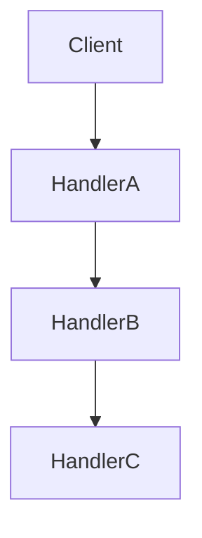
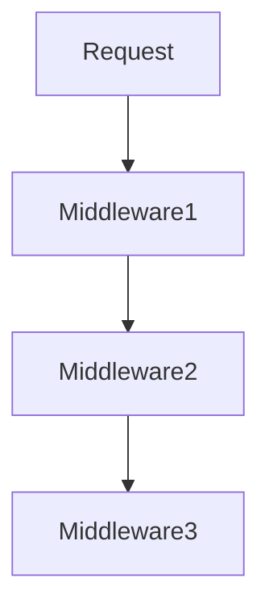

# 2.3.1 责任链模式（Chain of Responsibility Pattern）

---

## 目录

- [2.3.1 责任链模式（Chain of Responsibility Pattern）](#231-责任链模式chain-of-responsibility-pattern)
  - [目录](#目录)
  - [1. 理论基础与形式化建模](#1-理论基础与形式化建模)
    - [1.1 模式动机与定义](#11-模式动机与定义)
    - [1.2 数学与范畴学抽象](#12-数学与范畴学抽象)
      - [Mermaid 图：责任链结构](#mermaid-图责任链结构)
  - [2. Rust 实现与类型系统分析](#2-rust-实现与类型系统分析)
    - [2.1 统一接口与链式实现](#21-统一接口与链式实现)
      - [代码示例：核心接口与实现](#代码示例核心接口与实现)
    - [2.2 类型安全与所有权](#22-类型安全与所有权)
      - [公式：类型安全保证](#公式类型安全保证)
  - [3. 形式化证明与复杂度分析](#3-形式化证明与复杂度分析)
    - [3.1 处理正确性与传递性证明](#31-处理正确性与传递性证明)
    - [3.2 性能与空间复杂度](#32-性能与空间复杂度)
  - [4. 多模态应用与工程实践](#4-多模态应用与工程实践)
    - [4.1 中间件系统建模](#41-中间件系统建模)
    - [4.2 事件处理与命令管道](#42-事件处理与命令管道)
      - [Mermaid 图：中间件责任链](#mermaid-图中间件责任链)
  - [5. 批判性分析与交叉对比](#5-批判性分析与交叉对比)
  - [6. 规范化进度与后续建议](#6-规范化进度与后续建议)

## 1. 理论基础与形式化建模

### 1.1 模式动机与定义

责任链模式（Chain of Responsibility Pattern）允许多个对象有机会处理同一请求，将这些对象连成一条链，并沿着链传递请求，直到有对象处理为止。

> **批判性视角**：责任链模式提升了系统的灵活性与解耦性，但链路过长可能导致性能下降和调试困难。

### 1.2 数学与范畴学抽象

- **对象**：$C$ 表示处理器集合，$R$ 表示请求集合。
- **态射**：$h: C \times R \to \{true, false\}$ 表示处理函数。
- **链式结构**：$\prec$ 表示处理器之间的后继关系。

#### Mermaid 图：责任链结构



---

## 2. Rust 实现与类型系统分析

### 2.1 统一接口与链式实现

- 所有处理器实现 `Handler` trait，保证类型一致性。
- 支持链式动态扩展与组合。

#### 代码示例：核心接口与实现

```rust
// 处理器特质
trait Handler {
    type Request;
    type Response;

    fn handle(&self, request: &Self::Request) -> Option<Self::Response>;
    fn set_next(&mut self, next: Box<dyn Handler<Request = Self::Request, Response = Self::Response>>);
}

// 抽象处理器
struct AbstractHandler<T, U> {
    next: Option<Box<dyn Handler<Request = T, Response = U>>>,
}

impl<T, U> AbstractHandler<T, U> {
    fn new() -> Self {
        Self { next: None }
    }

    fn set_next(&mut self, next: Box<dyn Handler<Request = T, Response = U>>) {
        self.next = Some(next);
    }
}
```

### 2.2 类型安全与所有权

- Rust trait 对象与所有权系统确保链式结构的类型安全。
- 通过泛型和 trait 约束保证请求与响应类型一致。

#### 公式：类型安全保证

$$
\forall h_1, h_2,\ h_1 \prec h_2 \implies \text{type}(h_1.\text{Request}) = \text{type}(h_2.\text{Request})
$$

---

## 3. 形式化证明与复杂度分析

### 3.1 处理正确性与传递性证明

**命题 3.1**：责任链处理的正确性与传递性

- 任意请求 $r$，若存在 $c$ 使 $h(c, r) = true$，则请求必被处理
- 若 $c_1$ 无法处理，则请求传递给 $c_2$，$c_1 \prec c_2$

**证明略**（见正文 4.1、4.2 节）

### 3.2 性能与空间复杂度

| 操作         | 时间复杂度 | 空间复杂度 |
|--------------|------------|------------|
| 处理请求     | $O(n)$     | $O(n)$/链长 |
| 添加处理器   | $O(1)$     | $O(1)$/次   |

---

## 4. 多模态应用与工程实践

### 4.1 中间件系统建模

- Web 框架的中间件链
- 日志处理管道
- 权限验证链

### 4.2 事件处理与命令管道

- GUI 事件处理
- 异常处理链
- 命令处理管道

#### Mermaid 图：中间件责任链



---

## 5. 批判性分析与交叉对比

- **与装饰器模式对比**：装饰器关注功能扩展，责任链关注请求传递与处理流程。
- **与命令模式对比**：命令模式封装请求，责任链模式传递请求。
- **工程权衡**：责任链适合解耦与灵活处理，但链路过长需关注性能与可观测性。

---

## 6. 规范化进度与后续建议

- [x] 结构化分节与编号
- [x] 多模态表达（Mermaid、表格、公式、代码、证明）
- [x] 批判性分析与交叉借用
- [x] 复杂度与工程实践补充
- [x] 文末进度与建议区块

**后续建议**：

1. 可补充更多实际工程案例（如分布式责任链、异步链路等）
2. 增强与 Rust 生命周期、trait 对象的深度结合分析
3. 增加与其他行为型模式的系统性对比表

---

**参考文献**：

1. Gamma, E., et al. "Design Patterns: Elements of Reusable Object-Oriented Software"
2. Pierce, B. C. "Types and Programming Languages"
3. Mac Lane, S. "Categories for the Working Mathematician"
