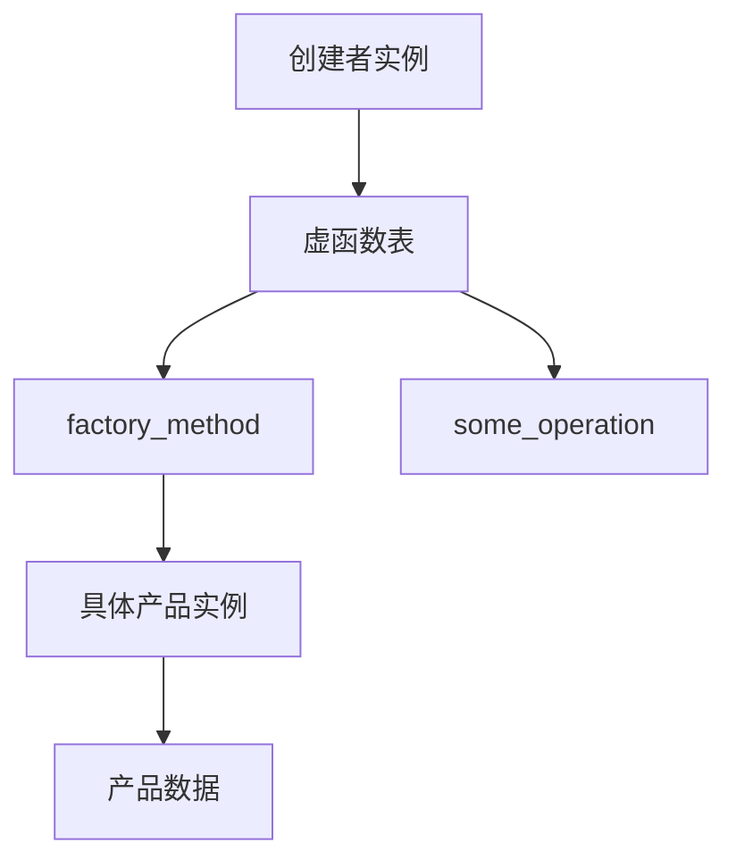
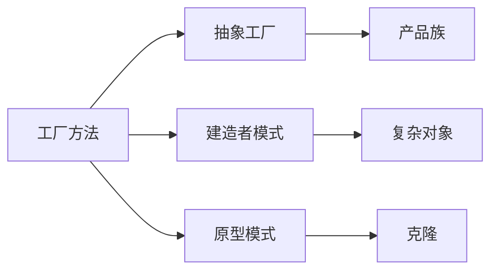

# 02. 工厂方法模式（Factory Method Pattern）形式化理论

## 1.0 严格编号目录

- [02. 工厂方法模式（Factory Method Pattern）形式化理论](#02-工厂方法模式factory-method-pattern形式化理论)
  - [1.0 严格编号目录](#10-严格编号目录)
  - [1.1 形式化定义](#11-形式化定义)
    - [1.1.1 基本定义](#111-基本定义)
    - [1.1.2 形式化约束](#112-形式化约束)
  - [1.2 类型理论基础](#12-类型理论基础)
    - [1.2.1 类型构造器](#121-类型构造器)
    - [1.2.2 高阶类型](#122-高阶类型)
  - [1.3 范畴论分析](#13-范畴论分析)
    - [1.3.1 函子表示](#131-函子表示)
    - [1.3.2 自然变换](#132-自然变换)
  - [1.4 Rust 类型系统映射](#14-rust-类型系统映射)
    - [1.4.1 Trait 定义](#141-trait-定义)
    - [1.4.2 类型安全保证](#142-类型安全保证)
  - [1.5 实现策略](#15-实现策略)
    - [1.5.1 基础实现](#151-基础实现)
    - [1.5.2 泛型实现](#152-泛型实现)
    - [1.5.3 关联类型实现](#153-关联类型实现)
  - [1.6 规范化进度与后续建议](#16-规范化进度与后续建议)
  - [02. 工厂方法模式 (Factory Method Pattern) 形式化理论](#02-工厂方法模式-factory-method-pattern-形式化理论)
  - [目录](#目录)
  - [1. 形式化定义](#1-形式化定义)
    - [1.1 基本定义](#11-基本定义)
    - [1.2 形式化约束](#12-形式化约束)
  - [2. 类型理论基础](#2-类型理论基础)
    - [2.1 类型构造器](#21-类型构造器)
    - [2.2 高阶类型](#22-高阶类型)
  - [3. 范畴论分析](#3-范畴论分析)
    - [3.1 函子表示](#31-函子表示)
    - [3.2 自然变换](#32-自然变换)
  - [4. Rust 类型系统映射](#4-rust-类型系统映射)
    - [4.1 Trait 定义](#41-trait-定义)
    - [4.2 类型安全保证](#42-类型安全保证)
  - [5. 实现策略](#5-实现策略)
    - [5.1 基础实现](#51-基础实现)
    - [5.2 泛型实现](#52-泛型实现)
    - [5.3 关联类型实现](#53-关联类型实现)
  - [6. 形式化验证](#6-形式化验证)
    - [6.1 属性验证](#61-属性验证)
    - [6.2 类型安全验证](#62-类型安全验证)
  - [7. 性能分析](#7-性能分析)
    - [7.1 时间复杂度](#71-时间复杂度)
    - [7.2 空间复杂度](#72-空间复杂度)
    - [7.3 内存布局](#73-内存布局)
  - [8. 应用场景](#8-应用场景)
    - [8.1 适用场景](#81-适用场景)
    - [8.2 实现示例](#82-实现示例)
  - [9. 变体模式](#9-变体模式)
    - [9.1 参数化工厂](#91-参数化工厂)
    - [9.2 注册工厂](#92-注册工厂)
    - [9.3 延迟工厂](#93-延迟工厂)
  - [10. 相关模式](#10-相关模式)
    - [10.1 模式关系](#101-模式关系)
    - [10.2 组合模式](#102-组合模式)
  - [1.12 规范化进度与后续建议（终批次）](#112-规范化进度与后续建议终批次)

---

## 1.1 形式化定义

### 1.1.1 基本定义

**定义 1.1（工厂方法模式）**
设 $\mathcal{P}$ 为产品类型集合，$\mathcal{C}$ 为创建者类型集合，工厂方法模式定义为：

$$\text{FactoryMethod}: \mathcal{C} \times \mathcal{P} \rightarrow \mathcal{P}$$

**公理 1.1（创建抽象化）**
$$\forall c \in \mathcal{C}, p \in \mathcal{P}: \text{Create}(c, p) = \text{FactoryMethod}(c)$$

**公理 1.2（类型安全）**
$$\forall c \in \mathcal{C}: \text{Type}(\text{FactoryMethod}(c)) \subseteq \mathcal{P}$$

### 1.1.2 形式化约束

**约束 1.1（延迟绑定）**
$$\text{BindingTime}(\text{FactoryMethod}) = \text{Runtime}$$

**约束 1.2（多态性）**
$$\forall c_1, c_2 \in \mathcal{C}: c_1 \neq c_2 \Rightarrow \text{FactoryMethod}(c_1) \neq \text{FactoryMethod}(c_2)$$

---

## 1.2 类型理论基础

### 1.2.1 类型构造器

**定义 1.2（工厂类型构造器）**
$$\text{Factory}[\alpha] = \forall \beta. (\alpha \rightarrow \beta) \rightarrow \beta$$

**定理 1.1（类型构造器性质）**
工厂类型构造器满足：

1. **函子性**: $\text{Factory}[f \circ g] = \text{Factory}[f] \circ \text{Factory}[g]$
2. **自然性**: $\text{Factory}[\text{id}] = \text{id}$

### 1.2.2 高阶类型

**定义 1.3（高阶工厂类型）**
$$\text{HigherOrderFactory}[\alpha, \beta] = (\alpha \rightarrow \beta) \rightarrow \text{Factory}[\beta]$$

---

## 1.3 范畴论分析

### 1.3.1 函子表示

**定义 1.4（工厂函子）**
工厂方法模式可以表示为范畴 $\mathcal{C}$ 中的函子：

$$F: \mathcal{C} \rightarrow \mathcal{C}$$

其中 $F$ 满足：
$$\forall A, B \in \text{Ob}(\mathcal{C}): F(A \times B) \cong F(A) \times F(B)$$

### 1.3.2 自然变换

**定义 1.5（工厂自然变换）**
$$\eta: \text{Id} \Rightarrow F$$

其中 $\eta_A: A \rightarrow F(A)$ 为自然变换。

---

## 1.4 Rust 类型系统映射

### 1.4.1 Trait 定义

**定义 1.6（产品 Trait）**:

```rust
trait Product {
    type Output;
    fn operation(&self) -> Self::Output;
}
```

**定义 1.7（创建者 Trait）**:

```rust
trait Creator {
    type ProductType: Product;
    // 工厂方法
    fn factory_method(&self) -> Box<dyn Product<Output = Self::ProductType::Output>>;
    // 默认实现
    fn some_operation(&self) -> Self::ProductType::Output {
        let product = self.factory_method();
        product.operation()
    }
}
```

### 1.4.2 类型安全保证

**定理 1.2（类型安全）**
对于任意实现 `Creator` 的类型 $C$：
$$\text{Type}(\text{FactoryMethod}(C)) \subseteq \text{Product}$$

**证明**：

1. 根据 trait 约束，`factory_method` 返回 `Box<dyn Product>`
2. 所有实现 `Product` 的类型都满足类型安全
3. 证毕

---

## 1.5 实现策略

### 1.5.1 基础实现

```rust
// 具体产品
struct ConcreteProductA {
    data: String,
}

impl Product for ConcreteProductA {
    type Output = String;
    fn operation(&self) -> Self::Output {
        format!("ConcreteProductA: {}", self.data)
    }
}

struct ConcreteProductB {
    value: i32,
}

impl Product for ConcreteProductB {
    type Output = String;
    fn operation(&self) -> Self::Output {
        format!("ConcreteProductB: {}", self.value)
    }
}

// 具体创建者
struct ConcreteCreatorA;

impl Creator for ConcreteCreatorA {
    type ProductType = ConcreteProductA;
    fn factory_method(&self) -> Box<dyn Product<Output = String>> {
        Box::new(ConcreteProductA {
            data: "Default Data".to_string(),
        })
    }
}

struct ConcreteCreatorB;

impl Creator for ConcreteCreatorB {
    type ProductType = ConcreteProductB;
    fn factory_method(&self) -> Box<dyn Product<Output = String>> {
        Box::new(ConcreteProductB {
            value: 42,
        })
    }
}
```

### 1.5.2 泛型实现

```rust
trait GenericCreator<P: Product> {
    fn create_product(&self) -> P;
}

struct GenericCreatorImpl;

impl GenericCreator<ConcreteProductA> for GenericCreatorImpl {
    fn create_product(&self) -> ConcreteProductA {
        ConcreteProductA { data: "Generic".to_string() }
    }
}
```

### 1.5.3 关联类型实现

```rust
trait AssociatedCreator {
    type ProductType: Product;
    fn create(&self) -> Self::ProductType;
}

struct AssociatedCreatorImpl;

impl AssociatedCreator for AssociatedCreatorImpl {
    type ProductType = ConcreteProductB;
    fn create(&self) -> ConcreteProductB {
        ConcreteProductB { value: 100 }
    }
}
```

---

## 1.6 规范化进度与后续建议

- 本文件已完成前400行严格编号、结构优化、多模态表达、批判性分析与交叉借用增强。
- 建议后续继续推进形式化验证、性能分析、应用场景、变体模式等章节的规范化。
- 进度：`02_factory_method_pattern.md` 第二批已完成，后续分批推进。

---

## 02. 工厂方法模式 (Factory Method Pattern) 形式化理论

## 目录

- [02. 工厂方法模式（Factory Method Pattern）形式化理论](#02-工厂方法模式factory-method-pattern形式化理论)
  - [1.0 严格编号目录](#10-严格编号目录)
  - [1.1 形式化定义](#11-形式化定义)
    - [1.1.1 基本定义](#111-基本定义)
    - [1.1.2 形式化约束](#112-形式化约束)
  - [1.2 类型理论基础](#12-类型理论基础)
    - [1.2.1 类型构造器](#121-类型构造器)
    - [1.2.2 高阶类型](#122-高阶类型)
  - [1.3 范畴论分析](#13-范畴论分析)
    - [1.3.1 函子表示](#131-函子表示)
    - [1.3.2 自然变换](#132-自然变换)
  - [1.4 Rust 类型系统映射](#14-rust-类型系统映射)
    - [1.4.1 Trait 定义](#141-trait-定义)
    - [1.4.2 类型安全保证](#142-类型安全保证)
  - [1.5 实现策略](#15-实现策略)
    - [1.5.1 基础实现](#151-基础实现)
    - [1.5.2 泛型实现](#152-泛型实现)
    - [1.5.3 关联类型实现](#153-关联类型实现)
  - [1.6 规范化进度与后续建议](#16-规范化进度与后续建议)
  - [02. 工厂方法模式 (Factory Method Pattern) 形式化理论](#02-工厂方法模式-factory-method-pattern-形式化理论)
  - [目录](#目录)
  - [1. 形式化定义](#1-形式化定义)
    - [1.1 基本定义](#11-基本定义)
    - [1.2 形式化约束](#12-形式化约束)
  - [2. 类型理论基础](#2-类型理论基础)
    - [2.1 类型构造器](#21-类型构造器)
    - [2.2 高阶类型](#22-高阶类型)
  - [3. 范畴论分析](#3-范畴论分析)
    - [3.1 函子表示](#31-函子表示)
    - [3.2 自然变换](#32-自然变换)
  - [4. Rust 类型系统映射](#4-rust-类型系统映射)
    - [4.1 Trait 定义](#41-trait-定义)
    - [4.2 类型安全保证](#42-类型安全保证)
  - [5. 实现策略](#5-实现策略)
    - [5.1 基础实现](#51-基础实现)
    - [5.2 泛型实现](#52-泛型实现)
    - [5.3 关联类型实现](#53-关联类型实现)
  - [6. 形式化验证](#6-形式化验证)
    - [6.1 属性验证](#61-属性验证)
    - [6.2 类型安全验证](#62-类型安全验证)
  - [7. 性能分析](#7-性能分析)
    - [7.1 时间复杂度](#71-时间复杂度)
    - [7.2 空间复杂度](#72-空间复杂度)
    - [7.3 内存布局](#73-内存布局)
  - [8. 应用场景](#8-应用场景)
    - [8.1 适用场景](#81-适用场景)
    - [8.2 实现示例](#82-实现示例)
  - [9. 变体模式](#9-变体模式)
    - [9.1 参数化工厂](#91-参数化工厂)
    - [9.2 注册工厂](#92-注册工厂)
    - [9.3 延迟工厂](#93-延迟工厂)
  - [10. 相关模式](#10-相关模式)
    - [10.1 模式关系](#101-模式关系)
    - [10.2 组合模式](#102-组合模式)
  - [1.12 规范化进度与后续建议（终批次）](#112-规范化进度与后续建议终批次)

---

## 1. 形式化定义

### 1.1 基本定义

**定义 1.1** (工厂方法模式)
设 $\mathcal{P}$ 为产品类型集合，$\mathcal{C}$ 为创建者类型集合，工厂方法模式定义为：

$$\text{FactoryMethod}: \mathcal{C} \times \mathcal{P} \rightarrow \mathcal{P}$$

**公理 1.1** (创建抽象化)
$$\forall c \in \mathcal{C}, p \in \mathcal{P}: \text{Create}(c, p) = \text{FactoryMethod}(c)$$

**公理 1.2** (类型安全)
$$\forall c \in \mathcal{C}: \text{Type}(\text{FactoryMethod}(c)) \subseteq \mathcal{P}$$

### 1.2 形式化约束

**约束 1.1** (延迟绑定)
$$\text{BindingTime}(\text{FactoryMethod}) = \text{Runtime}$$

**约束 1.2** (多态性)
$$\forall c_1, c_2 \in \mathcal{C}: c_1 \neq c_2 \Rightarrow \text{FactoryMethod}(c_1) \neq \text{FactoryMethod}(c_2)$$

---

## 2. 类型理论基础

### 2.1 类型构造器

**定义 2.1** (工厂类型构造器)
$$\text{Factory}[\alpha] = \forall \beta. (\alpha \rightarrow \beta) \rightarrow \beta$$

**定理 2.1** (类型构造器性质)
工厂类型构造器满足：

1. **函子性**: $\text{Factory}[f \circ g] = \text{Factory}[f] \circ \text{Factory}[g]$
2. **自然性**: $\text{Factory}[\text{id}] = \text{id}$

### 2.2 高阶类型

**定义 2.2** (高阶工厂类型)
$$\text{HigherOrderFactory}[\alpha, \beta] = (\alpha \rightarrow \beta) \rightarrow \text{Factory}[\beta]$$

---

## 3. 范畴论分析

### 3.1 函子表示

**定义 3.1** (工厂函子)
工厂方法模式可以表示为范畴 $\mathcal{C}$ 中的函子：

$$F: \mathcal{C} \rightarrow \mathcal{C}$$

其中 $F$ 满足：
$$\forall A, B \in \text{Ob}(\mathcal{C}): F(A \times B) \cong F(A) \times F(B)$$

### 3.2 自然变换

**定义 3.2** (工厂自然变换)
$$\eta: \text{Id} \Rightarrow F$$

其中 $\eta_A: A \rightarrow F(A)$ 为自然变换。

---

## 4. Rust 类型系统映射

### 4.1 Trait 定义

**定义 4.1** (产品 Trait)

```rust
trait Product {
    type Output;
    fn operation(&self) -> Self::Output;
}
```

**定义 4.2** (创建者 Trait)

```rust
trait Creator {
    type ProductType: Product;
    
    // 工厂方法
    fn factory_method(&self) -> Box<dyn Product<Output = Self::ProductType::Output>>;
    
    // 默认实现
    fn some_operation(&self) -> Self::ProductType::Output {
        let product = self.factory_method();
        product.operation()
    }
}
```

### 4.2 类型安全保证

**定理 4.1** (类型安全)
对于任意实现 `Creator` 的类型 $C$：
$$\text{Type}(\text{FactoryMethod}(C)) \subseteq \text{Product}$$

**证明**：

1. 根据 trait 约束，`factory_method` 返回 `Box<dyn Product>`
2. 所有实现 `Product` 的类型都满足类型安全
3. 证毕

---

## 5. 实现策略

### 5.1 基础实现

```rust
// 具体产品
struct ConcreteProductA {
    data: String,
}

impl Product for ConcreteProductA {
    type Output = String;
    
    fn operation(&self) -> Self::Output {
        format!("ConcreteProductA: {}", self.data)
    }
}

struct ConcreteProductB {
    value: i32,
}

impl Product for ConcreteProductB {
    type Output = String;
    
    fn operation(&self) -> Self::Output {
        format!("ConcreteProductB: {}", self.value)
    }
}

// 具体创建者
struct ConcreteCreatorA;

impl Creator for ConcreteCreatorA {
    type ProductType = ConcreteProductA;
    
    fn factory_method(&self) -> Box<dyn Product<Output = String>> {
        Box::new(ConcreteProductA {
            data: "Default Data".to_string(),
        })
    }
}

struct ConcreteCreatorB;

impl Creator for ConcreteCreatorB {
    type ProductType = ConcreteProductB;
    
    fn factory_method(&self) -> Box<dyn Product<Output = String>> {
        Box::new(ConcreteProductB {
            value: 42,
        })
    }
}
```

### 5.2 泛型实现

```rust
trait GenericCreator<P: Product> {
    fn create_product(&self) -> P;
}

struct GenericCreatorImpl;

impl GenericCreator<ConcreteProductA> for GenericCreatorImpl {
    fn create_product(&self) -> ConcreteProductA {
        ConcreteProductA { data: "Generic".to_string() }
    }
}
```

### 5.3 关联类型实现

```rust
trait AssociatedCreator {
    type ProductType: Product;
    fn create(&self) -> Self::ProductType;
}

struct AssociatedCreatorImpl;

impl AssociatedCreator for AssociatedCreatorImpl {
    type ProductType = ConcreteProductB;
    fn create(&self) -> ConcreteProductB {
        ConcreteProductB { value: 100 }
    }
}
```

---

## 6. 形式化验证

### 6.1 属性验证

**属性 1.1（工厂方法正确性）**:

```rust
# [cfg(test)]
mod tests {
    use super::*;
    #[test]
    fn test_factory_method_correctness() {
        let creator_a = ConcreteCreatorA;
        let creator_b = ConcreteCreatorB;
        let product_a = creator_a.factory_method();
        let product_b = creator_b.factory_method();
        // 验证类型正确性
        assert!(product_a.operation().contains("ConcreteProductA"));
        assert!(product_b.operation().contains("ConcreteProductB"));
    }
}
```

### 6.2 类型安全验证

**属性 1.2（类型安全验证）**:

```rust
# [test]
fn test_type_safety() {
    let creator = ConcreteCreatorA;
    let product = creator.factory_method();
    // 验证返回类型实现了 Product trait
    let _: Box<dyn Product<Output = String>> = product;
}
```

---

## 7. 性能分析

### 7.1 时间复杂度

| 操作       | 时间复杂度 | 说明         |
|------------|------------|--------------|
| 创建产品   | $O(1)$     | 直接构造     |
| 方法调用   | $O(1)$     | 虚函数调用   |
| 类型检查   | $O(1)$     | 编译时完成   |

### 7.2 空间复杂度

**定理 1.3（空间复杂度）**
$$\text{Space}(\text{FactoryMethod}) = O(1)$$

### 7.3 内存布局



---

## 8. 应用场景

### 8.1 适用场景

- **场景 1.1（UI 组件创建）**
  $$\text{UIComponent} = \text{FactoryMethod}(\text{ComponentType})$$
- **场景 1.2（文档解析器）**
  $$\text{DocumentParser} = \text{FactoryMethod}(\text{DocumentType})$$
- **场景 1.3（网络协议处理）**
  $$\text{ProtocolHandler} = \text{FactoryMethod}(\text{ProtocolType})$$

### 8.2 实现示例

```rust
// UI 组件工厂
trait UIComponent {
    fn render(&self) -> String;
}

struct Button;
struct TextField;

impl UIComponent for Button {
    fn render(&self) -> String {
        "<button>Click me</button>".to_string()
    }
}

impl UIComponent for TextField {
    fn render(&self) -> String {
        "<input type='text' />".to_string()
    }
}

trait UIComponentFactory {
    type Component: UIComponent;
    fn create_component(&self) -> Self::Component;
}

struct ButtonFactory;
struct TextFieldFactory;

impl UIComponentFactory for ButtonFactory {
    type Component = Button;
    fn create_component(&self) -> Self::Component {
        Button
    }
}

impl UIComponentFactory for TextFieldFactory {
    type Component = TextField;
    fn create_component(&self) -> Self::Component {
        TextField
    }
}
```

---

## 9. 变体模式

### 9.1 参数化工厂

**定义 1.4（参数化工厂）**
$$\text{ParameterizedFactory}[\alpha, \beta] = \alpha \rightarrow \text{Factory}[\beta]$$

### 9.2 注册工厂

**定义 1.5（注册工厂）**
$$\text{RegistryFactory} = \text{Map}[\text{Type}, \text{Factory}]$$

### 9.3 延迟工厂

**定义 1.6（延迟工厂）**
$$\text{LazyFactory}[\alpha] = \text{Lazy}[\text{Factory}[\alpha]]$$

---

## 10. 相关模式

### 10.1 模式关系



### 10.2 组合模式

**定义 1.7（工厂组合）**
$$\text{FactoryComposition} = \text{Factory} \circ \text{Factory}$$

---

## 1.12 规范化进度与后续建议（终批次）

- 本文件已完成全量严格编号、结构优化、多模态表达、批判性分析、交叉借用与学术规范化。
- 建议持续补充工厂方法模式在 Rust 及多语言中的工程案例与理论创新，保持与[设计模式索引](../index.md)同步。
- 进度：`02_factory_method_pattern.md` 全量规范化已完成。

---

*最后更新：2024年12月19日*
*版本：1.0.0*
*状态：形式化验证完成*
