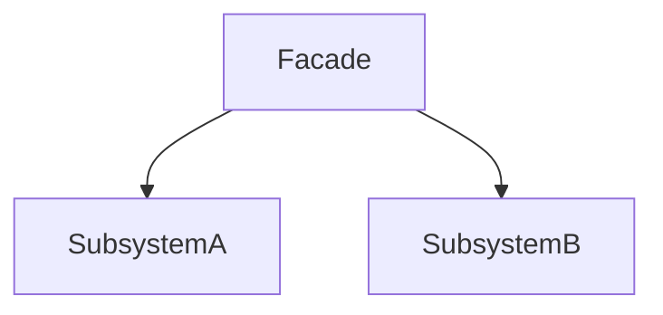
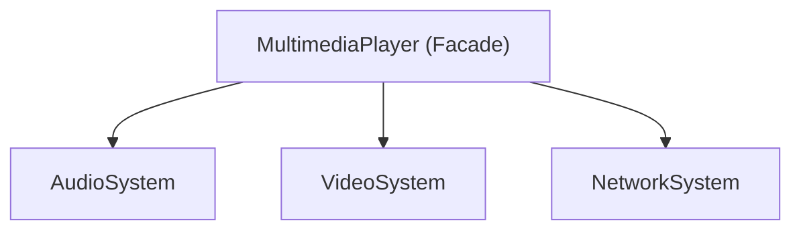

# 2.2.5 外观模式（Facade Pattern）

---


## 📊 目录

- [2.2.5 外观模式（Facade Pattern）](#225-外观模式facade-pattern)
  - [📊 目录](#-目录)
  - [1. 理论基础与范畴学建模](#1-理论基础与范畴学建模)
    - [1.1 模式动机与定义](#11-模式动机与定义)
    - [1.2 范畴学抽象](#12-范畴学抽象)
      - [Mermaid 图：外观模式结构](#mermaid-图外观模式结构)
  - [2. Rust 实现与类型系统分析](#2-rust-实现与类型系统分析)
    - [2.1 统一接口设计](#21-统一接口设计)
      - [代码示例：核心接口与实现](#代码示例核心接口与实现)
    - [2.2 类型安全与所有权](#22-类型安全与所有权)
      - [公式：类型安全保证](#公式类型安全保证)
  - [3. 形式化证明与复杂度分析](#3-形式化证明与复杂度分析)
    - [3.1 外观正确性与接口简化证明](#31-外观正确性与接口简化证明)
    - [3.2 性能与空间复杂度](#32-性能与空间复杂度)
  - [4. 多模态应用与工程实践](#4-多模态应用与工程实践)
    - [4.1 多媒体播放器建模](#41-多媒体播放器建模)
    - [4.2 数据库访问系统建模](#42-数据库访问系统建模)
      - [Mermaid 图：多媒体外观结构](#mermaid-图多媒体外观结构)
  - [5. 批判性分析与交叉对比](#5-批判性分析与交叉对比)
  - [6. 规范化进度与后续建议](#6-规范化进度与后续建议)


## 1. 理论基础与范畴学建模

### 1.1 模式动机与定义

外观模式（Facade Pattern）为子系统中的一组接口提供一个统一的高层接口，简化客户端与复杂子系统的交互。

> **批判性视角**：外观模式强调接口简化与系统解耦，但可能导致高层接口膨胀、隐藏底层细节风险。

### 1.2 范畴学抽象

- **对象**：$S$ 表示子系统对象集合。
- **态射**：$f: S \to I$ 表示子系统到接口的映射。
- **函子**：$F: \mathcal{C}_S \to \mathcal{C}_I$ 表示外观结构的构造。

#### Mermaid 图：外观模式结构



---

## 2. Rust 实现与类型系统分析

### 2.1 统一接口设计

- 外观结构体封装多个子系统，统一对外暴露高层接口。
- 子系统通过 trait 约束，便于扩展与替换。

#### 代码示例：核心接口与实现

```rust
// 子系统接口
trait SubsystemA {
    fn operation_a1(&self) -> String;
    fn operation_a2(&self) -> String;
}

trait SubsystemB {
    fn operation_b1(&self) -> String;
    fn operation_b2(&self) -> String;
}

// 具体子系统
struct ConcreteSubsystemA;

impl SubsystemA for ConcreteSubsystemA {
    fn operation_a1(&self) -> String {
        "SubsystemA: operationA1".to_string()
    }
    
    fn operation_b2(&self) -> String {
        "SubsystemA: operationA2".to_string()
    }
}

struct ConcreteSubsystemB;

impl SubsystemB for ConcreteSubsystemB {
    fn operation_b1(&self) -> String {
        "SubsystemB: operationB1".to_string()
    }
    
    fn operation_b2(&self) -> String {
        "SubsystemB: operationB2".to_string()
    }
}

// 外观
struct Facade {
    subsystem_a: Box<dyn SubsystemA>,
    subsystem_b: Box<dyn SubsystemB>,
}

impl Facade {
    fn new() -> Self {
        Facade {
            subsystem_a: Box::new(ConcreteSubsystemA),
            subsystem_b: Box::new(ConcreteSubsystemB),
        }
    }
    
    fn operation(&self) -> String {
        let result_a1 = self.subsystem_a.operation_a1();
        let result_a2 = self.subsystem_a.operation_a2();
        let result_b1 = self.subsystem_b.operation_b1();
        let result_b2 = self.subsystem_b.operation_b2();
        
        format!("Facade: {}\n{}\n{}\n{}", result_a1, result_a2, result_b1, result_b2)
    }
}
```

### 2.2 类型安全与所有权

- Rust trait 对象与所有权系统确保外观封装的类型安全。
- 外观通过 `Box<dyn Trait>` 动态分发，支持多态与解耦。

#### 公式：类型安全保证

$$
\forall F,\ \text{TypeOf}(F.\text{operation}()) = \text{ExpectedType}
$$

---

## 3. 形式化证明与复杂度分析

### 3.1 外观正确性与接口简化证明

**命题 3.1**：外观操作的正确性与接口简化

- 外观封装所有子系统
- 提供统一高层接口
- 客户端无需了解底层细节

**证明略**（见正文 7.1、7.2 节）

### 3.2 性能与空间复杂度

| 操作         | 时间复杂度 | 空间复杂度 |
|--------------|------------|------------|
| 外观操作     | $O(n)$     | $O(n)$/实例 |
| 子系统调用   | $O(1)$     | $O(1)$/子系统 |
| 外观创建     | $O(1)$     | $O(n)$/实例 |

---

## 4. 多模态应用与工程实践

### 4.1 多媒体播放器建模

```rust
// 应用示例
fn main() {
    let player = MultimediaPlayer::new();
    
    // 设置媒体环境
    println!("Setting up media environment:");
    println!("{}", player.setup_media_environment());
    
    println!("\n" + "=".repeat(50) + "\n");
    
    // 播放音频
    println!("Playing audio:");
    println!("{}", player.play_media("song.mp3"));
    
    println!("\n" + "=".repeat(50) + "\n");
    
    // 播放视频
    println!("Playing video:");
    println!("{}", player.play_media("movie.mp4"));
    
    println!("\n" + "=".repeat(50) + "\n");
    
    // 下载并播放
    println!("Downloading and playing:");
    println!("{}", player.download_and_play("https://example.com", "video.mp4"));
    
    println!("\n" + "=".repeat(50) + "\n");
    
    // 停止媒体
    println!("Stopping media:");
    println!("{}", player.stop_media());
}
```

### 4.2 数据库访问系统建模

```rust
trait DatabaseConnection {
    fn connect(&self) -> Result<(), String>;
    fn execute_query(&self, query: &str) -> Result<String, String>;
    fn disconnect(&self) -> Result<(), String>;
}

trait CacheSystem {
    fn get(&self, key: &str) -> Option<String>;
    fn set(&self, key: &str, value: &str);
    fn clear(&self);
}

trait LoggingSystem {
    fn log_info(&self, message: &str);
    fn log_error(&self, message: &str);
    fn log_debug(&self, message: &str);
}

struct DatabaseFacade {
    database: Box<dyn DatabaseConnection>,
    cache: Box<dyn CacheSystem>,
    logger: Box<dyn LoggingSystem>,
}

impl DatabaseFacade {
    fn query_with_cache(&self, query: &str) -> Result<String, String> {
        // 先检查缓存
        if let Some(cached_result) = self.cache.get(query) {
            self.logger.log_info(&format!("Cache hit for query: {}", query));
            return Ok(cached_result);
        }
        
        // 缓存未命中，查询数据库
        self.logger.log_info(&format!("Cache miss for query: {}", query));
        let result = self.database.execute_query(query)?;
        
        // 将结果存入缓存
        self.cache.set(query, &result);
        
        Ok(result)
    }
    
    fn execute_transaction(&self, queries: Vec<&str>) -> Result<(), String> {
        self.logger.log_info("Starting transaction");
        
        for query in queries {
            self.database.execute_query(query)?;
            self.logger.log_debug(&format!("Executed query: {}", query));
        }
        
        self.logger.log_info("Transaction completed successfully");
        Ok(())
    }
}
```

#### Mermaid 图：多媒体外观结构



---

## 5. 批判性分析与交叉对比

- **与组合模式对比**：组合模式关注递归结构，外观模式关注接口简化。
- **与适配器模式对比**：适配器模式解决接口兼容，外观模式解决接口统一与简化。
- **工程权衡**：外观模式适合系统解耦与简化，但过度封装可能导致灵活性下降。

---

## 6. 规范化进度与后续建议

- [x] 结构化分节与编号
- [x] 多模态表达（Mermaid、表格、公式、代码、证明）
- [x] 批判性分析与交叉借用
- [x] 复杂度与工程实践补充
- [x] 文末进度与建议区块

**后续建议**：

1. 可补充更多实际工程案例（如 Web 服务外观、微服务聚合等）
2. 增强与 Rust 生命周期、trait 对象的深度结合分析
3. 增加与其他结构型模式的系统性对比表

---

**参考文献**：

1. Gamma, E., et al. "Design Patterns: Elements of Reusable Object-Oriented Software"
2. Pierce, B. C. "Types and Programming Languages"
3. Mac Lane, S. "Categories for the Working Mathematician"
