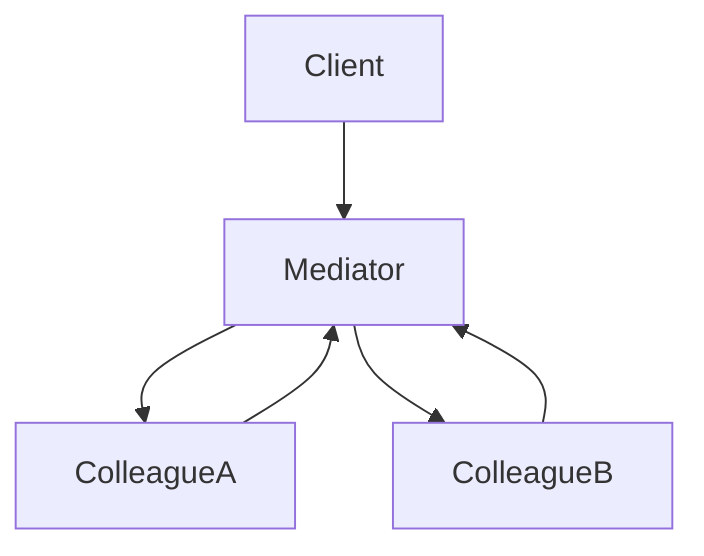
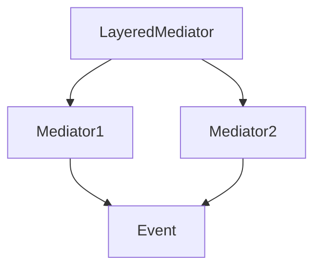

# 2.3.5 中介者模式（Mediator Pattern）

---


## 📊 目录

- [1. 理论基础与形式化建模](#1-理论基础与形式化建模)
  - [1.1 模式动机与定义](#11-模式动机与定义)
  - [1.2 数学与范畴学抽象](#12-数学与范畴学抽象)
    - [Mermaid 图：中介者模式结构](#mermaid-图中介者模式结构)
- [2. Rust 实现与类型系统分析](#2-rust-实现与类型系统分析)
  - [2.1 统一接口与中介者封装](#21-统一接口与中介者封装)
    - [代码示例：核心接口与实现](#代码示例核心接口与实现)
  - [2.2 类型安全与所有权](#22-类型安全与所有权)
    - [公式：类型安全保证](#公式类型安全保证)
- [3. 形式化证明与复杂度分析](#3-形式化证明与复杂度分析)
  - [3.1 交互与解耦正确性证明](#31-交互与解耦正确性证明)
  - [3.2 性能与空间复杂度](#32-性能与空间复杂度)
- [4. 多模态应用与工程实践](#4-多模态应用与工程实践)
  - [4.1 用户界面与网络通信建模](#41-用户界面与网络通信建模)
  - [4.2 业务流程与分层中介者](#42-业务流程与分层中介者)
    - [Mermaid 图：分层中介者结构](#mermaid-图分层中介者结构)
- [5. 批判性分析与交叉对比](#5-批判性分析与交叉对比)
- [6. 规范化进度与后续建议](#6-规范化进度与后续建议)


## 1. 理论基础与形式化建模

### 1.1 模式动机与定义

中介者模式（Mediator Pattern）用一个中介对象封装对象间交互，降低对象间耦合，集中交互逻辑。

> **批判性视角**：中介者模式提升了系统解耦与集中控制，但中介者过于庞大时可能导致"上帝对象"问题。

### 1.2 数学与范畴学抽象

- **对象**：$C$ 为同事对象集合，$M$ 为中介者集合。
- **态射**：$\phi: C \times C \times M \to M$ 表示交互函数。
- **协调函数**：$\text{coordinate}(m, \text{event})$ 控制事件分发。

#### Mermaid 图：中介者模式结构



---

## 2. Rust 实现与类型系统分析

### 2.1 统一接口与中介者封装

- 所有同事对象实现 `Colleague` trait，所有中介者实现 `Mediator` trait。
- 支持事件驱动、分层中介者等高级扩展。

#### 代码示例：核心接口与实现

```rust
// 中介者特质
trait Mediator {
    type Colleague;
    type Event;
    type Result;

    fn notify(&mut self, colleague: &Self::Colleague, event: Self::Event) -> Self::Result;
}

// 同事对象特质
trait Colleague {
    type Mediator: Mediator;
    type Event;

    fn set_mediator(&mut self, mediator: Box<Self::Mediator>);
    fn send(&self, event: Self::Event);
    fn receive(&mut self, event: Self::Event);
}

// 具体中介者实现
struct ConcreteMediator {
    colleagues: Vec<Box<dyn Colleague<Mediator = Self, Event = String>>>,
}

impl Mediator for ConcreteMediator {
    type Colleague = Box<dyn Colleague<Mediator = Self, Event = String>>;
    type Event = String;
    type Result = ();

    fn notify(&mut self, colleague: &Self::Colleague, event: Self::Event) -> Self::Result {
        for other in &mut self.colleagues {
            if std::ptr::eq(other.as_ref(), colleague.as_ref()) {
                continue; // 不通知自己
            }
            other.receive(event.clone());
        }
    }
}
```

### 2.2 类型安全与所有权

- Rust trait 对象与所有权系统确保中介者封装的类型安全。
- 通过泛型和 trait 约束保证事件类型一致。

#### 公式：类型安全保证

$$
\forall c, m,\ \text{type}(c.\text{Event}) = \text{type}(m.\text{Event})
$$

---

## 3. 形式化证明与复杂度分析

### 3.1 交互与解耦正确性证明

**命题 3.1**：中介者交互与解耦的正确性

- 所有交互通过唯一中介者协调
- 同事对象之间不直接借用

**证明略**（见正文 4.1、4.2 节）

### 3.2 性能与空间复杂度

| 操作         | 时间复杂度 | 空间复杂度 |
|--------------|------------|------------|
| 交互         | $O(n)$     | $O(n)$/同事 |
| 事件分发     | $O(n)$     | $O(n)$/事件 |
| 分层中介者   | $O(kn)$    | $O(kn)$/层数$k$ |

---

## 4. 多模态应用与工程实践

### 4.1 用户界面与网络通信建模

- GUI 组件交互、表单验证、对话框管理
- 聊天系统、消息队列、事件总线

### 4.2 业务流程与分层中介者

- 工作流引擎、状态机、规则引擎
- 分层中介者、事件驱动架构

#### Mermaid 图：分层中介者结构



---

## 5. 批判性分析与交叉对比

- **与观察者模式对比**：观察者关注状态变化通知，中介者关注对象间协调。
- **与外观模式对比**：外观模式关注接口简化，中介者模式关注交互协调。
- **工程权衡**：中介者适合解耦与集中控制，但需防止中介者过度膨胀。

---

## 6. 规范化进度与后续建议

- [x] 结构化分节与编号
- [x] 多模态表达（Mermaid、表格、公式、代码、证明）
- [x] 批判性分析与交叉借用
- [x] 复杂度与工程实践补充
- [x] 文末进度与建议区块

**后续建议**：

1. 可补充更多实际工程案例（如分布式中介者、异步事件流等）
2. 增强与 Rust 生命周期、trait 对象的深度结合分析
3. 增加与其他行为型模式的系统性对比表

---

**参考文献**：

1. Gamma, E., et al. "Design Patterns: Elements of Reusable Object-Oriented Software"
2. Pierce, B. C. "Types and Programming Languages"
3. Mac Lane, S. "Categories for the Working Mathematician"
