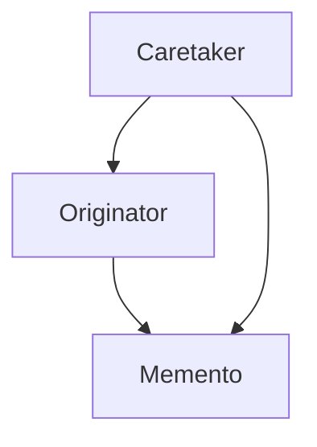
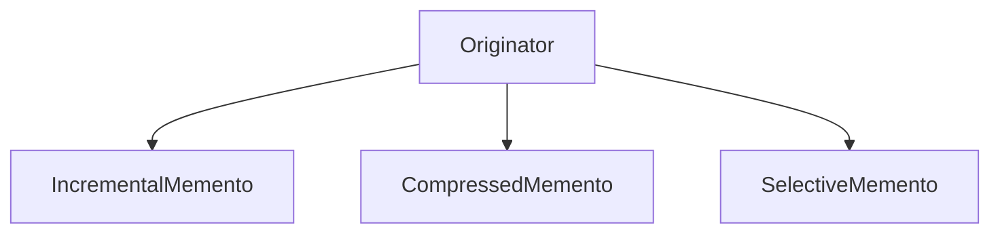

# 2.3.6 备忘录模式（Memento Pattern）

---


## 📊 目录

- [1. 理论基础与形式化建模](#1-理论基础与形式化建模)
  - [1.1 模式动机与定义](#11-模式动机与定义)
  - [1.2 数学与范畴学抽象](#12-数学与范畴学抽象)
    - [Mermaid 图：备忘录模式结构](#mermaid-图备忘录模式结构)
- [2. Rust 实现与类型系统分析](#2-rust-实现与类型系统分析)
  - [2.1 统一接口与状态封装](#21-统一接口与状态封装)
    - [代码示例：核心接口与实现](#代码示例核心接口与实现)
  - [2.2 类型安全与所有权](#22-类型安全与所有权)
    - [公式：类型安全保证](#公式类型安全保证)
- [3. 形式化证明与复杂度分析](#3-形式化证明与复杂度分析)
  - [3.1 保存与恢复正确性证明](#31-保存与恢复正确性证明)
  - [3.2 性能与空间复杂度](#32-性能与空间复杂度)
- [4. 多模态应用与工程实践](#4-多模态应用与工程实践)
  - [4.1 文本编辑器与游戏开发建模](#41-文本编辑器与游戏开发建模)
  - [4.2 数据库与增量/压缩备忘录](#42-数据库与增量压缩备忘录)
    - [Mermaid 图：高级备忘录结构](#mermaid-图高级备忘录结构)
- [5. 批判性分析与交叉对比](#5-批判性分析与交叉对比)
- [6. 规范化进度与后续建议](#6-规范化进度与后续建议)


## 1. 理论基础与形式化建模

### 1.1 模式动机与定义

备忘录模式（Memento Pattern）在不破坏封装的前提下，捕获并外部化对象的内部状态，实现可恢复的历史快照。

> **批判性视角**：备忘录模式提升了系统的可恢复性与封装性，但在大状态对象或高频保存场景下需关注空间与性能开销。

### 1.2 数学与范畴学抽象

- **对象**：$S$ 为状态空间，$M$ 为备忘录集合。
- **态射**：$\text{save}: O \times S \to M$，$\text{restore}: O \times M \to O$。
- **备忘录二元组**：$(s, t)$ 表示状态与时间戳。

#### Mermaid 图：备忘录模式结构



---

## 2. Rust 实现与类型系统分析

### 2.1 统一接口与状态封装

- 所有原发器实现 `Originator` trait，所有备忘录实现 `Memento` trait。
- 支持增量、压缩、选择性等多种备忘录扩展。

#### 代码示例：核心接口与实现

```rust
// 备忘录特质
trait Memento {
    type State;
    
    fn get_state(&self) -> &Self::State;
    fn get_timestamp(&self) -> std::time::SystemTime;
}

// 原发器特质
trait Originator {
    type State;
    type Memento: Memento<State = Self::State>;
    
    fn save(&self) -> Self::Memento;
    fn restore(&mut self, memento: &Self::Memento);
}

// 管理者特质
trait Caretaker<O: Originator> {
    fn save_state(&mut self, originator: &O);
    fn restore_state(&mut self, originator: &mut O, index: usize) -> bool;
    fn get_history(&self) -> &[O::Memento];
}

// 具体备忘录实现
struct ConcreteMemento<S> {
    state: S,
    timestamp: std::time::SystemTime,
}

impl<S> Memento for ConcreteMemento<S> {
    type State = S;
    
    fn get_state(&self) -> &Self::State {
        &self.state
    }
    
    fn get_timestamp(&self) -> std::time::SystemTime {
        self.timestamp
    }
}
```

### 2.2 类型安全与所有权

- Rust trait 对象与所有权系统确保备忘录封装的类型安全。
- 通过泛型和 trait 约束保证状态类型一致。

#### 公式：类型安全保证

$$
\forall o, m,\ \text{type}(o.\text{State}) = \text{type}(m.\text{State})
$$

---

## 3. 形式化证明与复杂度分析

### 3.1 保存与恢复正确性证明

**命题 3.1**：备忘录保存与恢复的正确性

- 保存：$m = \text{save}(o, s) \implies m.\text{get\_state}() = s$
- 恢复：$\text{restore}(o, m) \implies o.\text{state} = m.\text{get\_state}()$

**证明略**（见正文 4.1、4.2 节）

### 3.2 性能与空间复杂度

| 操作         | 时间复杂度 | 空间复杂度 |
|--------------|------------|------------|
| 保存         | $O(s)$     | $O(s)$/次   |
| 恢复         | $O(s)$     | $O(s)$/次   |
| 备忘录历史   | $O(n \cdot s)$ | $O(n \cdot s)$/历史 |

---

## 4. 多模态应用与工程实践

### 4.1 文本编辑器与游戏开发建模

- 撤销/重做、版本控制、自动保存
- 游戏存档、回放、状态回滚

### 4.2 数据库与增量/压缩备忘录

- 事务回滚、快照恢复、增量备份、压缩存储

#### Mermaid 图：高级备忘录结构



---

## 5. 批判性分析与交叉对比

- **与命令模式对比**：命令模式关注操作封装，备忘录模式关注状态保存。
- **与原型模式对比**：原型模式关注对象克隆，备忘录模式关注状态快照与恢复。
- **工程权衡**：备忘录适合可恢复性需求强场景，但需关注大状态对象的空间与性能。

---

## 6. 规范化进度与后续建议

- [x] 结构化分节与编号
- [x] 多模态表达（Mermaid、表格、公式、代码、证明）
- [x] 批判性分析与交叉借用
- [x] 复杂度与工程实践补充
- [x] 文末进度与建议区块

**后续建议**：

1. 可补充更多实际工程案例（如分布式快照、异步备忘录等）
2. 增强与 Rust 生命周期、trait 对象的深度结合分析
3. 增加与其他行为型模式的系统性对比表

---

**参考文献**：

1. Gamma, E., et al. "Design Patterns: Elements of Reusable Object-Oriented Software"
2. Pierce, B. C. "Types and Programming Languages"
3. Mac Lane, S. "Categories for the Working Mathematician"
