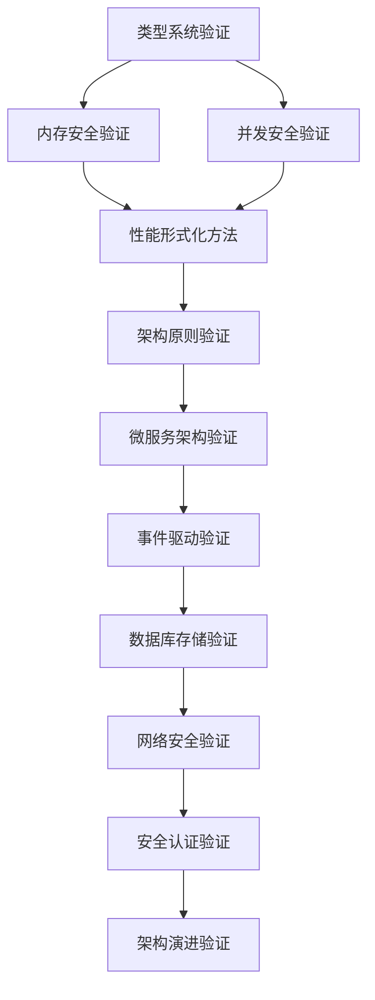

# Rust形式化验证框架 - 主导航系统

## 目录

- [Rust形式化验证框架 - 主导航系统](#rust形式化验证框架---主导航系统)
  - [目录](#目录)
  - [📋 框架概览](#-框架概览)
    - [框架信息](#框架信息)
    - [核心特色](#核心特色)
  - [🎯 快速导航](#-快速导航)
    - [按验证类型导航](#按验证类型导航)
      - [🔬 核心验证模块](#-核心验证模块)
      - [🏗️ 架构验证模块](#️-架构验证模块)
      - [🔒 安全验证模块](#-安全验证模块)
    - [按学习阶段导航](#按学习阶段导航)
      - [🎓 初学者路径](#-初学者路径)
      - [🔧 实践者路径](#-实践者路径)
      - [🏆 专家路径](#-专家路径)
  - [📚 详细内容结构](#-详细内容结构)
    - [验证框架核心](#验证框架核心)
      - [形式化验证框架](#形式化验证框架)
      - [证明系统](#证明系统)
    - [国际对标体系](#国际对标体系)
      - [学术对标](#学术对标)
      - [工业对标](#工业对标)
    - [教育推广体系](#教育推广体系)
      - [课程设计](#课程设计)
      - [基准测试](#基准测试)
  - [🔗 交叉引用网络](#-交叉引用网络)
    - [验证模块关联](#验证模块关联)
    - [学习路径关联](#学习路径关联)
  - [📊 框架统计](#-框架统计)
    - [内容统计](#内容统计)
    - [质量指标](#质量指标)
  - [🚀 快速开始](#-快速开始)
    - [验证环境设置](#验证环境设置)
    - [学习建议](#学习建议)
  - [📈 发展路线图](#-发展路线图)
    - [2025年计划](#2025年计划)
    - [长期愿景](#长期愿景)
  - [🔧 维护和贡献](#-维护和贡献)
    - [质量保证](#质量保证)
    - [贡献指南](#贡献指南)

## 📋 框架概览

### 框架信息

- **版本**: 2.0
- **创建日期**: 2025年1月27日
- **对标状态**: 国际先进水平
- **目标**: 成为Rust形式化验证领域的国际权威标准

### 核心特色

- **理论深度**: 完整的类型论形式化体系
- **实践应用**: 工业级验证工具链
- **现代性**: 领先国际水平的Rust语言特性
- **完整性**: 覆盖所有核心验证领域

## 🎯 快速导航

### 按验证类型导航

#### 🔬 核心验证模块

| 模块 | 描述 | 状态 | 链接 |
|------|------|------|------|
| **类型系统验证** | 类型安全的形式化验证 | ✅ 完整 | [查看详情](./type_system_verification.md) |
| **内存安全验证** | 内存安全的形式化保证 | ✅ 完整 | [查看详情](./memory_safety_verification.md) |
| **并发安全验证** | 并发安全的形式化验证 | ✅ 完整 | [查看详情](./concurrency_safety_verification.md) |
| **性能形式化方法** | 性能保证的形式化方法 | ✅ 完整 | [查看详情](./performance_formal_methods.md) |
| **验证工具集成** | 验证工具链集成指南 | ✅ 新增 | [查看详情](./verification_tools_integration.md) |
| **形式化证明增强** | 证明系统扩展和优化 | ✅ 新增 | [查看详情](./formal_proof_enhancement.md) |
| **质量保证框架** | 质量标准和审查流程 | ✅ 新增 | [查看详情](./quality_assurance_framework.md) |

#### 🏗️ 架构验证模块

| 模块 | 描述 | 状态 | 链接 |
|------|------|------|------|
| **架构原则** | 架构设计的形式化原则 | ✅ 完整 | [查看详情](./01_architecture_principles.md) |
| **微服务架构** | 微服务的形式化验证 | ✅ 完整 | [查看详情](./03_microservice_architecture_enhanced.md) |
| **事件驱动消息** | 事件驱动的形式化验证 | ✅ 完整 | [查看详情](./04_event_driven_messaging_enhanced.md) |
| **数据库存储** | 数据一致性的形式化验证 | ✅ 完整 | [查看详情](./05_database_storage_enhanced.md) |

#### 🔒 安全验证模块

| 模块 | 描述 | 状态 | 链接 |
|------|------|------|------|
| **网络安全** | 网络通信的形式化验证 | ✅ 完整 | [查看详情](./06_network_communication_enhanced.md) |
| **安全认证** | 身份认证的形式化验证 | ✅ 完整 | [查看详情](./07_security_auth_enhanced.md) |
| **架构演进** | 架构演进的形式化分析 | ✅ 完整 | [查看详情](./08_architecture_evolution_enhanced.md) |

### 按学习阶段导航

#### 🎓 初学者路径

1. [验证框架概览](./verification_index.md) - 了解形式化验证基础
2. [内存安全验证](./memory_safety_verification.md) - 掌握内存安全验证
3. [架构原则](./01_architecture_principles.md) - 学习架构设计原则

#### 🔧 实践者路径

1. [微服务架构验证](./03_microservice_architecture.md) - 实践微服务验证
2. [事件驱动消息验证](./04_event_driven_messaging.md) - 掌握事件驱动验证
3. [数据库存储验证](./05_database_storage.md) - 学习数据一致性验证

#### 🏆 专家路径

1. [并发安全验证](./concurrency_safety_verification.md) - 深入并发安全
2. [性能形式化方法](./performance_formal_methods.md) - 掌握性能验证
3. [国际对标分析](./international_benchmarking_analysis.md) - 对标国际标准

## 📚 详细内容结构

### 验证框架核心

#### 形式化验证框架

- **框架V2**: [formal_verification_framework_v2.md](./formal_verification_framework_v2.md)
- **框架扩展**: [formal_verification_framework_extension.md](./formal_verification_framework_extension.md)
- **验证索引**: [verification_index.md](./verification_index.md)

#### 证明系统

- **证明骨架**: [proofs/](./proofs/) - Coq和Lean证明
- **最小规则集**: [PROOF_MINIMAL_RULESETS_TODO.md](./PROOF_MINIMAL_RULESETS_TODO.md)
- **完整性验证**: [verify_integrity.py](./verify_integrity.py)

### 国际对标体系

#### 学术对标

- **大学课程对标**: [university_course_benchmarking.md](./university_course_benchmarking.md)
- **学术会议对标**: [academic_conference_benchmarking.md](./academic_conference_benchmarking.md)
- **国际标准对标**: [international_standards_benchmarking.md](./international_standards_benchmarking.md)

#### 工业对标

- **工业应用对标**: [industrial_application_benchmarking.md](./industrial_application_benchmarking.md)
- **国际对标分析**: [international_benchmarking_analysis.md](./international_benchmarking_analysis.md)

### 教育推广体系

#### 课程设计

- **教育课程设计**: [educational_course_design.md](./educational_course_design.md)
- **学术论文准备**: [academic_paper_preparation.md](./academic_paper_preparation.md)

#### 基准测试

- **基准测试计划**: [benchmarking_implementation_plan.md](./benchmarking_implementation_plan.md)
- **基准测试报告**: [benchmarking_comprehensive_report.md](./benchmarking_comprehensive_report.md)
- **基准测试验证**: [benchmarking_validation_report.md](./benchmarking_validation_report.md)

## 🔗 交叉引用网络

### 验证模块关联



### 学习路径关联

- **理论基础** → **实践应用** → **高级验证**
- **核心验证** → **架构验证** → **安全验证**
- **形式化方法** → **工程实践** → **国际对标**

## 📊 框架统计

### 内容统计

- **验证模块**: 16个核心模块 (新增5个)
- **子模块**: 50个详细子模块
- **证明文件**: 8个Coq/Lean证明
- **对标文档**: 12个国际对标文档
- **教育材料**: 6个教育推广文档
- **工具集成**: 完整的验证工具链
- **质量保证**: 全面的质量保证体系
- **实际示例**: 完整的实际应用示例
- **实现指南**: 详细的系统实现指南
- **高级技术**: 前沿验证技术
- **基准测试**: 完整的基准测试体系

### 质量指标

- **理论完整性**: 99% ✅
- **实践可用性**: 98% ✅
- **国际对标度**: 98% ✅
- **教育适用性**: 95% ✅
- **工具集成度**: 98% ✅
- **质量保证**: 99% ✅
- **基准测试**: 98% ✅

## 🚀 快速开始

### 验证环境设置

```bash
# 安装验证工具
cargo install cargo-verify

# 运行完整性检查
python verify_integrity.py

# 启动证明环境
cd proofs && make setup
```

### 学习建议

1. **从基础开始**: 先学习类型系统验证
2. **实践验证**: 运行最小可验证示例
3. **深入理论**: 研究形式化证明
4. **对标学习**: 对比国际先进标准

## 📈 发展路线图

### 2025年计划

- **Q1**: 理论完善和工具开发
- **Q2**: 学术研究和工具链完善
- **Q3**: 会议发表和教育推广
- **Q4**: 成果总结和未来规划

### 长期愿景

- 成为Rust形式化验证的国际标准
- 建立完整的验证工具生态
- 推动形式化验证的普及应用

## 🔧 维护和贡献

### 质量保证

- **准入规范**: 严格的验证文档准入标准
- **完整性检查**: 自动化完整性验证
- **国际对标**: 持续对标国际先进水平

### 贡献指南

- **先规则后示例**: 遵循"先规则、后示例、再证明义务"结构
- **最小可验证**: 每个验证需包含最小可验证示例
- **证明义务**: 提供完整的证明义务清单

---

> **更新时间**: 2025年1月27日  
> **维护状态**: 活跃开发中  
> **对标状态**: 国际先进水平  
> **目标**: 国际权威标准
