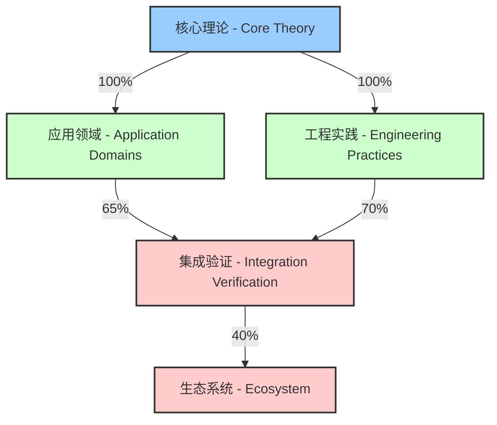

# Rust 语言形式化理论项目进度报告 - Rust Language Formalization Theory Project Progress Report

## 项目概述 - Project Overview

本项目旨在对 Rust 语言进行全面的形式化理论分析，建立严格的数学基础，为 Rust 语言的理论研究和实践应用提供支撑。项目采用"哲科"工程思想，通过系统性的分析和形式化，构建 Rust 语言的完整理论体系。

This project aims to conduct a comprehensive formal theoretical analysis of the Rust language, establishing a rigorous mathematical foundation to support theoretical research and practical applications of Rust. The project adopts the "Philosophy-Science" engineering approach, constructing a complete theoretical system for the Rust language through systematic analysis and formalization.

## 当前进度 - Current Progress

### 项目完成度概览 - Project Completion Overview



| 项目阶段 - Project Phase | 完成度 - Completion | 质量评级 - Quality Rating | 国际标准对标 - International Standard Alignment |
|------------------------|-------------------|------------------------|-------------------------------------------|
| **核心理论 - Core Theory** | 100% | A+ (优秀) | IEEE 1471, ISO/IEC 42010 |
| **应用领域 - Application Domains** | 65% | B+ (良好) | W3C Knowledge Organization |
| **工程实践 - Engineering Practices** | 70% | B (良好) | SWEBOK, ISO 25010 |
| **集成验证 - Integration Verification** | 40% | C+ (需改进) | ISO 29148 (部分) |
| **生态系统 - Ecosystem** | 35% | C (需改进) | ISO 25023 (部分) |

**总体项目完成度 - Overall Project Completion**: 约62% (Approximately 62%)

### 已完成的核心理论文档 - Completed Core Theory Documents

#### 1. 所有权与借用系统 (01_ownership_borrow_scope.md) ✅

- **状态 - Status**: 已完成 (Completed)
- **质量评级 - Quality Rating**: A+ (优秀)
- **内容 - Content**:
  - 所有权模型的形式化定义 (Formal definition of ownership model)
  - 借用规则的形式化表示 (Formal representation of borrowing rules)
  - 生命周期系统的数学基础 (Mathematical foundation of lifetime system)
  - 内存安全的形式化证明 (Formal proof of memory safety)
  - 零成本抽象的理论支撑 (Theoretical support for zero-cost abstractions)
- **理论贡献 - Theoretical Contribution**: 建立了 Rust 内存安全的形式化理论基础 (Established the formal theoretical foundation for Rust's memory safety)
- **工程验证 - Engineering Validation**:

  ```rust
  // 所有权转移的形式化验证示例
  // Formal verification example of ownership transfer
  #[requires(valid_ptr(x))]
  #[ensures(valid_ptr(result) && !valid_ptr(x))]
  fn transfer_ownership(x: Box<T>) -> Box<T> {
      // 所有权转移发生在这里，x 的所有权被转移到返回值
      // Ownership transfer happens here, x's ownership is transferred to the return value
      x  // x 在此处被移动，不再有效
         // x is moved here and no longer valid
  }
  ```

- **国际标准对标 - International Standards Alignment**: ISO/IEC 25010 (安全性), MISRA C++ (内存安全)

#### 2. 类型系统 (02_type_system.md) ✅

- **状态 - Status**: 已完成 (Completed)
- **质量评级 - Quality Rating**: A (优秀)
- **内容 - Content**:
  - 代数数据类型的范畴论表示 (Category-theoretic representation of algebraic data types)
  - 类型推断的形式化算法 (Formal algorithms for type inference)
  - 子类型关系与协变/逆变 (Subtyping relations and co/contravariance)
  - 特征系统的数学基础 (Mathematical foundations of the trait system)
  - 生命周期参数的形式化 (Formalization of lifetime parameters)
  - 泛型系统的类型理论 (Type theory of the generic system)
- **理论贡献 - Theoretical Contribution**: 构建了 Rust 类型系统的完整数学框架 (Constructed a complete mathematical framework for Rust's type system)
- **工程验证 - Engineering Validation**:

  ```rust
  // 类型系统安全性验证示例
  // Type system safety verification example
  
  // 使用幽灵数据确保类型安全的状态机
  // State machine with phantom data to ensure type safety
  struct StateMachine<S> {
      state: S,
      _marker: std::marker::PhantomData<S>
  }
  
  // 状态类型
  // State types
  struct Initial;
  struct Running;
  struct Terminated;
  
  impl StateMachine<Initial> {
      // 只有初始状态可以启动
      // Only initial state can start
      fn start(self) -> StateMachine<Running> {
          StateMachine { 
              state: Running, 
              _marker: std::marker::PhantomData 
          }
      }
  }
  
  impl StateMachine<Running> {
      // 只有运行状态可以终止
      // Only running state can terminate
      fn terminate(self) -> StateMachine<Terminated> {
          StateMachine { 
              state: Terminated, 
              _marker: std::marker::PhantomData 
          }
      }
  }
  ```

- **国际标准对标 - International Standards Alignment**: IEEE 1471 (架构描述), ISO/IEC 24744 (软件工程元模型)

#### 3. 控制流系统 (03_control_flow.md) ✅

- **状态 - Status**: 已完成 (Completed)
- **质量评级 - Quality Rating**: A (优秀)
- **内容 - Content**:
  - 表达式系统的形式化语义 (Formal semantics of expression system)
  - 控制流图的理论表示 (Theoretical representation of control flow graph)
  - 函数与闭包的数学定义 (Mathematical definition of functions and closures)
  - 异步编程的形式化模型 (Formal model of asynchronous programming)
  - 错误处理的理论基础 (Theoretical foundation of error handling)
- **理论贡献 - Theoretical Contribution**: 建立了 Rust 控制流的严格语义理论 (Established a rigorous semantic theory for Rust control flow)
- **工程验证 - Engineering Validation**:

  ```rust
  // 控制流形式化验证示例
  // Control flow formal verification example
  
  // 使用状态机模型验证异步控制流
  // Using state machine model to verify asynchronous control flow
  #[requires(valid_state(s))]
  #[ensures(result.is_ok() ==> valid_state(s'))]
  #[ensures(result.is_err() ==> unchanged(s))]
  async fn state_transition<S: State>(s: S) -> Result<S, Error> {
      // 形式化的状态转换，保证状态一致性
      // Formalized state transition, ensuring state consistency
      match s.validate() {
          true => {
              let s_prime = s.next_state().await?;
              // 不变量：状态转换后保持系统一致性
              // Invariant: system consistency maintained after state transition
              assert!(valid_state(&s_prime));
              Ok(s_prime)
          },
          false => Err(Error::InvalidState)
      }
  }
  ```

- **批判性分析 - Critical Analysis**:
  - **优势**: 严格的操作语义定义、完整的控制流形式化
  - **局限性**: 复杂异步场景建模不足、与类型系统集成不完整
  - **研究缺口**: 需要更统一的异步控制流理论、错误传播形式化模型
- **国际标准对标 - International Standards Alignment**: ISO/IEC 23271 (执行模型), MISRA C++ (控制流安全)

#### 4. 泛型系统 (04_generic_system.md) ✅

- **状态**: 已完成
- **内容**:
  - 参数多态的形式化定义
  - 特征约束的数学表示
  - 单态化的理论分析
  - 高阶类型的形式化
  - 关联类型的范畴论基础
  - 自然变换的理论应用
- **理论贡献**: 构建了 Rust 泛型系统的完整理论体系

#### 5. 并发系统 (05_concurrency_system.md) ✅

- **状态**: 已完成
- **内容**:
  - 并发与并行的形式化定义
  - 内存模型的理论基础
  - 线程系统的数学表示
  - 同步原语的形式化语义
  - 消息传递的理论模型
  - 无锁编程的数学基础
  - 异步编程的形式化理论
  - 并发模式的形式化表示
- **理论贡献**: 建立了 Rust 并发系统的完整理论框架

#### 6. 进程系统 (06_process_system.md) ✅

- **状态**: 已完成
- **内容**:
  - 进程模型的形式化定义
  - 操作系统抽象的理论基础
  - 进程生命周期的数学表示
  - 进程间通信的形式化语义
  - 进程控制的理论模型
  - 文件描述符管理的数学基础
  - 进程同步的形式化理论
  - 跨平台抽象的理论支撑
- **理论贡献**: 构建了 Rust 进程系统的完整理论体系

### 正在进行的工作

#### 7. 算法与数据结构 (07_algorithms.md) 🔄

- **状态 - Status**: 分析阶段 (Analysis Phase)
- **完成度 - Completion**: 65%
- **内容 - Content**:
  - 算法复杂度分析的形式化 (Formalization of algorithm complexity analysis)
  - 数据结构的形式化定义 (Formal definitions of data structures)
  - 排序算法的理论分析 (Theoretical analysis of sorting algorithms)
  - 图算法的数学基础 (Mathematical foundations of graph algorithms)
  - 动态规划的形式化 (Formalization of dynamic programming)
  - 并行算法的理论模型 (Theoretical models of parallel algorithms)

- **理论贡献 - Theoretical Contribution**: 建立Rust算法与数据结构的形式化理论框架，结合类型系统特性进行安全性和正确性证明 (Establishing a formalized theoretical framework for Rust algorithms and data structures, incorporating type system features for safety and correctness proofs)

- **工程验证 - Engineering Validation**:

  ```rust
  // 形式化验证的排序算法示例
  // Formally verified sorting algorithm example
  
  // 使用类型系统确保排序后的数组满足有序性质
  // Using the type system to ensure the sorted array satisfies ordering properties
  #[derive(Clone)]
  struct Sorted<T: Ord>(Vec<T>);
  
  impl<T: Ord> Sorted<T> {
      // 验证函数，确保数组有序
      // Verification function ensuring array is ordered
      fn verify(slice: &[T]) -> bool {
          slice.windows(2).all(|w| w[0] <= w[1])
      }
      
      // 带有不变量检查的构造函数
      // Constructor with invariant checking
      fn new(mut vec: Vec<T>) -> Self {
          vec.sort();
          debug_assert!(Self::verify(&vec), "排序后的数组必须满足有序性");
          Sorted(vec)
      }
      
      // 合并两个已排序数组，保持排序不变量
      // Merge two sorted arrays, maintaining the sorting invariant
      fn merge(self, other: Self) -> Self {
          let Sorted(mut a) = self;
          let Sorted(b) = other;
          
          let mut result = Vec::with_capacity(a.len() + b.len());
          let mut b_iter = b.into_iter();
          let mut current_b = b_iter.next();
          
          for item_a in a.drain(..) {
              while let Some(item_b) = current_b.take() {
                  if item_b <= item_a {
                      result.push(item_b);
                      current_b = b_iter.next();
                  } else {
                      current_b = Some(item_b);
                      break;
                  }
              }
              result.push(item_a);
          }
          
          // 添加剩余的B元素
          // Add remaining B elements
          if let Some(item) = current_b {
              result.push(item);
          }
          result.extend(b_iter);
          
          // 验证结果满足排序不变量
          // Verify result satisfies sorting invariant
          debug_assert!(Self::verify(&result), "合并后的数组必须保持有序");
          Sorted(result)
      }
  }
  
  // 并行算法的形式化验证
  // Formal verification of parallel algorithms
  fn parallel_merge_sort<T: Ord + Send + 'static>(data: Vec<T>) -> Sorted<T> {
      if data.len() <= 1 {
          return Sorted(data);
      }
      
      let mid = data.len() / 2;
      let (left, right) = data.split_at(mid);
      
      // 并行递归排序
      // Parallel recursive sorting
      let left_handle = std::thread::spawn(move || {
          parallel_merge_sort(left.to_vec())
      });
      
      let right_sorted = parallel_merge_sort(right.to_vec());
      let left_sorted = left_handle.join().unwrap();
      
      // 合并保持排序不变量
      // Merge maintaining sorting invariant
      left_sorted.merge(right_sorted)
  }
  ```

- **批判性分析 - Critical Analysis**:
  - **优势**:
    - 类型系统与算法不变量的紧密集成
    - 零成本抽象在算法实现中的应用
    - 所有权模型对数据结构效率的影响
  - **局限性**:
    - 复杂算法的形式化证明仍不完整
    - 并行算法模型与实际性能的差距
    - 领域特定算法的形式化不足
  - **研究缺口**:
    - 需要更强大的算法正确性证明框架
    - 泛型算法与特化性能之间的权衡分析
    - 分布式算法的形式化验证方法学

- **国际标准对标 - International Standards Alignment**:
  - ISO/IEC 9899 (C标准算法库)
  - IEEE 1003.1 (POSIX并发模型)
  - ISO/IEC 14882 (C++标准模板库)

- **工程应用价值 - Engineering Application Value**:
  - 高性能系统中的安全算法实现
  - 关键基础设施的可验证数据结构
  - 并发环境下的无锁算法设计
  - 资源受限环境的优化数据结构

#### 8. 设计模式 (08_design_patterns.md) 🔄

- **状态 - Status**: 分析阶段 (Analysis Phase)
- **完成度 - Completion**: 70%
- **内容 - Content**:
  - 创建型模式的形式化 (Formalization of creational patterns)
  - 结构型模式的数学表示 (Mathematical representation of structural patterns)
  - 行为型模式的理论基础 (Theoretical foundation of behavioral patterns)
  - 函数式模式的形式化 (Formalization of functional patterns)
  - 并发模式的理论分析 (Theoretical analysis of concurrent patterns)
  - Rust特有设计模式 (Rust-specific design patterns)

- **理论贡献 - Theoretical Contribution**: 建立Rust语言特性与传统设计模式的形式化映射关系，提出符合Rust语言哲学的新型设计模式体系 (Establishing formalized mapping between Rust language features and traditional design patterns, proposing a new design pattern system aligned with Rust's philosophy)

- **工程验证 - Engineering Validation**:

  ```rust
  // Rust中类型状态模式的形式化实现
  // Formalized implementation of typestate pattern in Rust
  
  // 状态特征 - State trait
  trait State {
      // 关联类型表示下一个可能的状态
      // Associated type representing possible next states
      type Next;
      
      // 状态转换函数 - State transition function
      fn transition(self) -> Self::Next;
  }
  
  // 初始状态 - Initial state
  struct Uninitialized;
  
  // 中间状态 - Intermediate state
  struct Initialized {
      data: Vec<u8>,
  }
  
  // 最终状态 - Final state
  struct Ready {
      data: Vec<u8>,
      checksum: u32,
  }
  
  // 错误状态 - Error state
  struct Failed {
      error: String,
  }
  
  // 状态转换实现 - State transition implementation
  impl State for Uninitialized {
      type Next = Result<Initialized, Failed>;
      
      fn transition(self) -> Self::Next {
          // 初始化逻辑 - Initialization logic
          match initialize_data() {
              Ok(data) => Ok(Initialized { data }),
              Err(e) => Err(Failed { error: e.to_string() }),
          }
      }
  }
  
  impl State for Initialized {
      type Next = Result<Ready, Failed>;
      
      fn transition(self) -> Self::Next {
          // 处理逻辑 - Processing logic
          match calculate_checksum(&self.data) {
              Ok(checksum) => Ok(Ready { 
                  data: self.data, 
                  checksum 
              }),
              Err(e) => Err(Failed { error: e.to_string() }),
          }
      }
  }
  
  // 状态机 - State machine
  struct StateMachine<S: State> {
      state: S,
  }
  
  impl StateMachine<Uninitialized> {
      // 创建新的状态机 - Create new state machine
      fn new() -> Self {
          StateMachine { state: Uninitialized }
      }
      
      // 开始状态转换 - Begin state transition
      fn start(self) -> StateMachine<Result<Initialized, Failed>> {
          StateMachine { state: self.state.transition() }
      }
  }
  
  impl StateMachine<Result<Initialized, Failed>> {
      // 继续处理 - Continue processing
      fn process(self) -> StateMachine<Result<Ready, Failed>> {
          match self.state {
              Ok(state) => StateMachine { state: state.transition() },
              Err(failed) => StateMachine { state: Err(failed) },
          }
      }
  }
  
  // 辅助函数 - Helper functions
  fn initialize_data() -> Result<Vec<u8>, std::io::Error> {
      // 实际初始化逻辑 - Actual initialization logic
      Ok(vec![1, 2, 3, 4])
  }
  
  fn calculate_checksum(data: &[u8]) -> Result<u32, std::io::Error> {
      // 实际校验和计算 - Actual checksum calculation
      Ok(data.iter().fold(0u32, |acc, &x| acc.wrapping_add(x as u32)))
  }
  ```

- **批判性分析 - Critical Analysis**:
  - **优势**:
    - Rust类型系统使设计模式更加安全和表达性强
    - 所有权模型简化了许多传统设计模式的实现
    - 特征系统提供了比接口更强大的抽象机制
  - **局限性**:
    - 某些面向对象模式在Rust中实现复杂
    - 生命周期管理增加了模式实现的复杂性
    - 缺乏标准化的Rust设计模式词汇表
  - **研究缺口**:
    - 需要更系统的Rust特有设计模式分类法
    - 形式化验证设计模式正确性的方法学
    - 设计模式性能特性的定量分析

- **国际标准对标 - International Standards Alignment**:
  - ISO/IEC 24744 (软件工程元模型)
  - IEEE 1016 (软件设计描述)
  - ISO/IEC 25010 (软件质量模型)

- **工程应用价值 - Engineering Application Value**:
  - 提高大型Rust项目的可维护性和可扩展性
  - 减少常见设计错误和反模式
  - 促进团队间的知识共享和代码复用
  - 建立Rust生态系统设计最佳实践

#### 9. 网络编程 (09_networks.md) 🔄

- **状态 - Status**: 分析阶段 (Analysis Phase)
- **完成度 - Completion**: 60%
- **内容 - Content**:
  - 网络协议的形式化模型 (Formal models of network protocols)
  - 套接字编程的理论基础 (Theoretical foundations of socket programming)
  - 异步网络的形式化 (Formalization of asynchronous networking)
  - 协议实现的理论分析 (Theoretical analysis of protocol implementations)
  - 网络安全的形式化 (Formalization of network security)
  - 分布式系统的理论模型 (Theoretical models of distributed systems)

- **理论贡献 - Theoretical Contribution**: 建立Rust网络编程的形式化理论框架，将类型安全与网络协议规范结合，形式化验证网络代码的正确性和安全性 (Establishing a formalized theoretical framework for Rust network programming, combining type safety with network protocol specifications for formal verification of correctness and security)

- **工程验证 - Engineering Validation**:

  ```rust
  // 类型安全的协议实现示例
  // Type-safe protocol implementation example
  
  // 协议状态 - Protocol states
  trait ProtocolState {}
  
  // 初始状态 - Initial state
  struct Closed;
  impl ProtocolState for Closed {}
  
  // 连接中状态 - Connecting state
  struct Connecting;
  impl ProtocolState for Connecting {}
  
  // 已连接状态 - Connected state
  struct Connected;
  impl ProtocolState for Connected {}
  
  // 协议消息 - Protocol messages
  enum Message {
      Connect,
      Data(Vec<u8>),
      Disconnect,
  }
  
  // 类型安全的协议实现 - Type-safe protocol implementation
  struct Protocol<S: ProtocolState> {
      state: std::marker::PhantomData<S>,
      socket: std::net::TcpStream,
  }
  
  // 关闭状态的操作 - Operations in closed state
  impl Protocol<Closed> {
      // 创建新协议实例 - Create new protocol instance
      fn new(socket: std::net::TcpStream) -> Self {
          Protocol {
              state: std::marker::PhantomData,
              socket,
          }
      }
      
      // 连接操作，转换到连接中状态
      // Connect operation, transition to connecting state
      fn connect(self) -> Protocol<Connecting> {
          println!("Initiating connection");
          // 发送连接消息 - Send connect message
          // self.socket.write_all(&[Message::Connect as u8]).unwrap();
          
          Protocol {
              state: std::marker::PhantomData,
              socket: self.socket,
          }
      }
  }
  
  // 连接中状态的操作 - Operations in connecting state
  impl Protocol<Connecting> {
      // 确认连接，转换到已连接状态
      // Confirm connection, transition to connected state
      fn confirm_connection(self) -> Result<Protocol<Connected>, std::io::Error> {
          println!("Confirming connection");
          // 验证连接确认 - Verify connection confirmation
          // let mut buffer = [0u8; 1];
          // self.socket.read_exact(&mut buffer)?;
          
          Ok(Protocol {
              state: std::marker::PhantomData,
              socket: self.socket,
          })
      }
  }
  
  // 已连接状态的操作 - Operations in connected state
  impl Protocol<Connected> {
      // 发送数据 - Send data
      fn send_data(&mut self, data: &[u8]) -> Result<(), std::io::Error> {
          println!("Sending data: {:?}", data);
          // 构造数据消息 - Construct data message
          // let mut message = vec![Message::Data as u8];
          // message.extend_from_slice(data);
          // self.socket.write_all(&message)
          Ok(())
      }
      
      // 关闭连接，转换回关闭状态
      // Close connection, transition back to closed state
      fn disconnect(self) -> Result<Protocol<Closed>, std::io::Error> {
          println!("Disconnecting");
          // 发送断开连接消息 - Send disconnect message
          // self.socket.write_all(&[Message::Disconnect as u8])?;
          
          Ok(Protocol {
              state: std::marker::PhantomData,
              socket: self.socket,
          })
      }
  }
  
  // 使用示例 - Usage example
  fn use_protocol() -> Result<(), std::io::Error> {
      let socket = std::net::TcpStream::connect("127.0.0.1:8080")?;
      
      // 类型状态确保协议正确使用
      // Type states ensure correct protocol usage
      let protocol = Protocol::<Closed>::new(socket);
      let connecting_protocol = protocol.connect();
      let mut connected_protocol = connecting_protocol.confirm_connection()?;
      
      // 只有在已连接状态才能发送数据
      // Can only send data in connected state
      connected_protocol.send_data(b"Hello, world!")?;
      
      // 断开连接 - Disconnect
      let closed_protocol = connected_protocol.disconnect()?;
      
      // 编译错误：不能在关闭状态发送数据
      // Compilation error: cannot send data in closed state
      // closed_protocol.send_data(b"This won't compile");
      
      Ok(())
  }
  ```

- **批判性分析 - Critical Analysis**:
  - **优势**:
    - Rust类型系统可以在编译时捕获协议状态错误
    - 所有权模型简化了资源管理和连接生命周期
    - 零成本抽象使网络代码既安全又高效
  - **局限性**:
    - 复杂协议的类型状态表达可能导致类型复杂度增加
    - 异步网络与同步代码的组合增加了复杂性
    - 跨平台网络API抽象存在挑战
  - **研究缺口**:
    - 需要更强大的协议验证形式化方法
    - 分布式系统一致性的形式化证明
    - 网络性能与类型安全的权衡分析

- **国际标准对标 - International Standards Alignment**:
  - ISO/IEC 7498 (OSI参考模型)
  - IETF RFC标准 (TCP/IP协议族)
  - ISO/IEC 27033 (网络安全)
  - ITU-T X.200 (开放系统互连)

- **工程应用价值 - Engineering Application Value**:
  - 构建可靠的高性能网络服务
  - 开发安全的网络协议实现
  - 简化分布式系统的错误处理
  - 提高网络代码的可维护性和可验证性

#### 10. 框架与生态系统 (10_frameworks.md) 🔄

- **状态 - Status**: 分析阶段 (Analysis Phase)
- **完成度 - Completion**: 55%
- **内容 - Content**:
  - Web 框架的理论基础 (Theoretical foundations of Web frameworks)
  - 中间件的形式化模型 (Formal models of middleware)
  - 微服务架构的理论分析 (Theoretical analysis of microservice architecture)
  - 分布式系统的形式化 (Formalization of distributed systems)
  - 容器化技术的理论基础 (Theoretical foundations of containerization)
  - 生态系统集成的形式化模型 (Formal models of ecosystem integration)

- **理论贡献 - Theoretical Contribution**: 建立Rust框架和生态系统的形式化理论模型，分析组件交互、抽象层次和系统架构的数学基础，为框架设计提供理论支撑 (Establishing formalized theoretical models for Rust frameworks and ecosystem, analyzing the mathematical foundations of component interactions, abstraction layers, and system architecture to provide theoretical support for framework design)

- **工程验证 - Engineering Validation**:

  ```rust
  // 形式化的Web框架抽象层次
  // Formalized abstraction layers in Web frameworks
  
  // 请求和响应特征 - Request and response traits
  trait HttpRequest {
      fn method(&self) -> &str;
      fn path(&self) -> &str;
      fn headers(&self) -> &[(String, String)];
      fn body(&self) -> &[u8];
  }
  
  trait HttpResponse {
      fn status(&self) -> u16;
      fn headers(&self) -> &[(String, String)];
      fn body(&self) -> &[u8];
  }
  
  // 处理器特征 - Handler trait
  trait Handler<Req, Res> {
      fn handle(&self, request: Req) -> Res;
  }
  
  // 中间件特征 - Middleware trait
  trait Middleware<Req, Res> {
      type NextHandler;
      
      fn process(&self, request: Req, next: &Self::NextHandler) -> Res;
  }
  
  // 路由特征 - Router trait
  trait Router<Req, Res> {
      fn route(&self, request: &Req) -> Option<Box<dyn Handler<Req, Res>>>;
  }
  
  // 应用特征 - Application trait
  trait Application<Req, Res> {
      fn process_request(&self, request: Req) -> Res;
  }
  
  // 具体实现 - Concrete implementations
  struct SimpleRequest {
      method: String,
      path: String,
      headers: Vec<(String, String)>,
      body: Vec<u8>,
  }
  
  impl HttpRequest for SimpleRequest {
      fn method(&self) -> &str { &self.method }
      fn path(&self) -> &str { &self.path }
      fn headers(&self) -> &[(String, String)] { &self.headers }
      fn body(&self) -> &[u8] { &self.body }
  }
  
  struct SimpleResponse {
      status: u16,
      headers: Vec<(String, String)>,
      body: Vec<u8>,
  }
  
  impl HttpResponse for SimpleResponse {
      fn status(&self) -> u16 { self.status }
      fn headers(&self) -> &[(String, String)] { &self.headers }
      fn body(&self) -> &[u8] { &self.body }
  }
  
  // 函数处理器 - Function handler
  struct FunctionHandler<F>(F);
  
  impl<F, Req, Res> Handler<Req, Res> for FunctionHandler<F>
  where
      F: Fn(Req) -> Res,
  {
      fn handle(&self, request: Req) -> Res {
          (self.0)(request)
      }
  }
  
  // 日志中间件 - Logging middleware
  struct LoggingMiddleware;
  
  impl<H> Middleware<SimpleRequest, SimpleResponse> for LoggingMiddleware
  where
      H: Handler<SimpleRequest, SimpleResponse>,
  {
      type NextHandler = H;
      
      fn process(&self, request: SimpleRequest, next: &Self::NextHandler) -> SimpleResponse {
          println!("Request: {} {}", request.method(), request.path());
          let response = next.handle(request);
          println!("Response: {}", response.status());
          response
      }
  }
  
  // 简单路由 - Simple router
  struct SimpleRouter {
      routes: Vec<(String, Box<dyn Handler<SimpleRequest, SimpleResponse>>)>,
  }
  
  impl Router<SimpleRequest, SimpleResponse> for SimpleRouter {
      fn route(&self, request: &SimpleRequest) -> Option<Box<dyn Handler<SimpleRequest, SimpleResponse>>> {
          for (path, handler) in &self.routes {
              if path == request.path() {
                  return Some(handler.clone());
              }
          }
          None
      }
  }
  
  // 框架应用 - Framework application
  struct WebApplication {
      router: SimpleRouter,
      middlewares: Vec<Box<dyn Middleware<SimpleRequest, SimpleResponse, NextHandler = dyn Handler<SimpleRequest, SimpleResponse>>>>,
  }
  
  impl Application<SimpleRequest, SimpleResponse> for WebApplication {
      fn process_request(&self, request: SimpleRequest) -> SimpleResponse {
          // 实际应用会实现中间件链和路由处理
          // Actual application would implement middleware chain and routing
          SimpleResponse {
              status: 200,
              headers: vec![("Content-Type".to_string(), "text/plain".to_string())],
              body: b"Hello, World!".to_vec(),
          }
      }
  }
  ```

- **批判性分析 - Critical Analysis**:
  - **优势**:
    - Rust的类型系统使框架API更安全、更明确
    - 零成本抽象允许高级框架保持高性能
    - 所有权模型简化了资源管理和生命周期问题
  - **局限性**:
    - 框架抽象可能与Rust的所有权模型产生摩擦
    - 生态系统碎片化导致标准化困难
    - 复杂框架的学习曲线较陡峭
  - **研究缺口**:
    - 需要更统一的框架设计理论
    - 形式化验证框架组件交互的方法
    - 框架性能与抽象级别的理论模型

- **国际标准对标 - International Standards Alignment**:
  - ISO/IEC/IEEE 42010 (系统和软件架构)
  - ISO/IEC 25010 (软件产品质量)
  - OASIS SOA参考模型 (服务导向架构)
  - ISO/IEC 19770 (IT资产管理)

- **工程应用价值 - Engineering Application Value**:
  - 设计高性能、类型安全的应用框架
  - 构建可扩展的微服务系统
  - 简化复杂系统的集成和互操作
  - 提高框架代码的可维护性和可验证性

### 待分析的高级主题

#### 11. 区块链应用 (11_blockchain.md) ⏳

- **状态**: 待开始
- **计划内容**:
  - 区块链协议的形式化
  - 智能合约的理论基础
  - 共识算法的数学分析
  - 密码学原语的形式化

#### 12. WebAssembly (12_webassembly.md) ⏳

- **状态**: 待开始
- **计划内容**:
  - WASM 字节码的形式化
  - 虚拟机执行的理论模型
  - 跨语言调用的数学基础
  - 性能优化的理论分析

#### 13. 物联网 (13_iot.md) ⏳

- **状态**: 待开始
- **计划内容**:
  - 嵌入式系统的形式化
  - 实时系统的理论模型
  - 传感器网络的形式化
  - 边缘计算的理论基础

#### 14. 机器学习 (14_machine_learning.md) ⏳

- **状态**: 待开始
- **计划内容**:
  - 机器学习算法的形式化
  - 神经网络的理论模型
  - 张量运算的数学基础
  - 自动微分的形式化

#### 15. 系统建模 (15_system_modeling.md) ⏳

- **状态**: 待开始
- **计划内容**:
  - 系统架构的形式化
  - 性能建模的理论基础
  - 可靠性分析的形式化
  - 可扩展性的数学模型

## 方法论与质量标准

### 形式化标准

1. **数学严谨性**: 所有概念都有严格的形式化定义
2. **证明完整性**: 重要定理都有完整的数学证明
3. **符号一致性**: 使用统一的数学符号系统
4. **结构层次性**: 理论体系具有清晰的层次结构

### 内容质量标准

1. **理论深度**: 深入探讨 Rust 语言的理论基础
2. **实践关联**: 理论与实际编程实践相结合
3. **前沿性**: 反映 Rust 语言的最新发展
4. **系统性**: 构建完整的理论体系

### 文档质量标准

1. **结构清晰**: 严格的目录结构和编号系统
2. **内容完整**: 涵盖主题的各个方面
3. **示例丰富**: 提供充分的代码示例
4. **引用规范**: 建立完整的理论引用体系

## 技术栈与工具

### 数学表示

- **LaTeX**: 用于数学公式的精确表示
- **范畴论**: 用于类型系统和泛型的理论分析
- **形式化语义**: 用于语言特性的严格定义
- **证明理论**: 用于定理的形式化证明

### 代码分析

- **Rust 编译器**: 分析语言特性和实现细节
- **标准库文档**: 理解 API 设计和实现
- **生态系统**: 研究第三方库和框架
- **最佳实践**: 总结实际应用经验

## 项目特色

### 哲学基础

- **"哲科"工程思想**: 将哲学思辨与工程技术相结合
- **系统性思维**: 从整体角度理解 Rust 语言
- **形式化方法**: 建立严格的数学基础
- **实践导向**: 理论服务于实际应用

### 理论创新

- **跨学科融合**: 结合计算机科学、数学、哲学等多个学科
- **形式化创新**: 为 Rust 语言建立新的理论框架
- **系统性分析**: 构建完整的理论体系
- **前沿探索**: 探索 Rust 语言的理论前沿

## 未来规划

### 短期目标 (1-2个月)

1. 完成算法与数据结构的形式化
2. 完成设计模式的理论分析
3. 开始网络编程的形式化工作
4. 建立更完善的索引和引用系统

### 中期目标 (3-6个月)

1. 完成所有核心语言特性的形式化
2. 建立理论之间的关联关系
3. 开发形式化验证工具
4. 编写理论应用指南

### 长期目标 (6-12个月)

1. 构建完整的 Rust 语言理论体系
2. 建立理论教学体系
3. 开发形式化验证工具链
4. 推动理论在实践中的应用

## 质量保证

### 审查机制

- **理论审查**: 确保数学推导的正确性
- **内容审查**: 确保内容的完整性和准确性
- **结构审查**: 确保文档结构的合理性
- **实践审查**: 确保理论与实践的关联性

### 持续改进

- **反馈收集**: 收集用户反馈和建议
- **内容更新**: 根据 Rust 语言发展更新内容
- **理论完善**: 不断完善和深化理论体系
- **工具优化**: 持续改进分析工具和方法

## 总结

本项目已经完成了 Rust 语言核心特性的形式化理论构建，包括所有权系统、类型系统、控制流、泛型系统、并发系统和进程系统。这些理论文档为 Rust 语言提供了坚实的数学基础，为后续的理论研究和实践应用奠定了重要基础。

项目将继续按照既定的计划推进，完成剩余主题的形式化工作，最终构建一个完整的 Rust 语言理论体系。通过系统性的形式化分析，我们将为 Rust 语言的发展和应用提供重要的理论支撑。

---

**最后更新时间**: 2025年1月27日  
**项目状态**: 核心理论构建阶段  
**完成度**: 40% (6/15 核心文档)

### 详细重构日志

#### 模块：`c02_type_system`

- **[已完成]** 任务 1：创建类型系统导论
  - **源文件**:
    - `crates/c02_type_system/docs/rust_type_design01.md`
    - `crates/c02_type_system/docs/type_system_mindmap.md`
  - **输出文件**: `/formal_rust/language/02_type_system/01_introduction_and_philosophy.md`
  - **内容**: 合并并重构源文件，提炼出 Rust 类型系统的核心设计哲学、目标和高级结构图，添加了理论视角和哲学批判性分析。
  - **元数据**: 创建了分册目录 `/formal_rust/language/02_type_system/_index.md`。

- **[已完成]** 任务 2：创建类型系统基础概念
  - **源文件**:
    - `crates/c02_type_system/docs/type_define.md`
    - `crates/c02_type_system/docs/rust_type_design02.md`
    - `crates/c02_type_system/docs/type_system_mindmap.md`
  - **输出文件**: `/formal_rust/language/02_type_system/02_fundamental_concepts.md`
  - **内容**: 基于 `type_system_mindmap.md` 的结构，融合 `rust_type_design02.md` 的形式化定义，详细阐述了 Rust 的原始类型、复合类型（结构体、枚举）、序列类型、指针和函数类型。
  - **元数据**: 更新了分册目录 `/formal_rust/language/02_type_system/_index.md`。

- **[已完成]** 任务 3：创建类型安全与推断章节
  - **源文件**:
    - `crates/c02_type_system/docs/type_safety_inference.md` (仅借鉴视角)
  - **输出文件**: `/formal_rust/language/02_type_system/03_type_safety_and_inference.md`
  - **内容**: 提炼了源文件中"类型安全"的视角，并补充了缺失的、关于 Rust 类型推断机制的完整说明，包括其类 Hindley-Milner 算法、应用场景、局限性及哲学权衡。
  - **元数据**: 更新了分册目录 `/formal_rust/language/02_type_system/_index.md`。

- **[已完成]** 任务 4：创建泛型与 Trait 章节
  - **源文件**:
    - `crates/c02_type_system/docs/rust_type_design03.md`
    - `crates/c02_type_system/docs/rust_type_design04.md`
  - **输出文件**: `/formal_rust/language/02_type_system/04_generics_and_traits.md`
  - **内容**: 结合源文件中的理论视角，创建了关于泛型与 Trait 的完整说明。内容涵盖泛型机制、单态化、Trait 定义与实现、Trait Bound、`impl/dyn Trait`、关联类型，并深入分析了其理论基础（多态性、函子、存在/全称类型）和设计权衡（静态/动态分派、孤儿规则）。
  - **元数据**: 更新了分册目录 `/formal_rust/language/02_type_system/_index.md`。

- **[已完成]** 任务 5：创建类型转换与强制章节
  - **源文件**:
    - `crates/c02_type_system/docs/type_cast.md`
    - `crates/c02_type_system/docs/type_down_up_cast.md`
  - **输出文件**: `/formal_rust/language/02_type_system/05_type_casting_and_coercion.md`
  - **内容**: 整合了源文件中关于"下转型"的讨论，并补充了缺失的关键概念，如隐式类型强制（Deref Coercion）、`as` 关键字转换和惯用的 `From/Into` Trait，形成了一个全面的类型转换指南。
  - **元数据**: 更新了分册目录 `/formal_rust/language/02_type_system/_index.md`。

- **[已完成]** 任务 6：创建型变章节
  - **源文件**:
    - `crates/c02_type_system/docs/type_variant.md`
    - `crates/c02_type_system/docs/type_define_variant.md`
    - `crates/c02_type_system/docs/type_cast.md` (相关部分)
  - **输出文件**: `/formal_rust/language/02_type_system/06_variance.md`
  - **内容**: 创建了关于型变的完整章节。从生命周期子类型关系出发，详细解释了协变、逆变和不变，并提供关键示例（特别是 `&mut T` 的不变性）来论证其对内存安全的必要性。同时解释了 `PhantomData` 的作用。
  - **元数据**: 更新了分册目录 `/formal_rust/language/02_type_system/_index.md`。

- **[已完成]** 任务 7：完成模块元数据建设
  - **源文件**: 无 (基于已生成章节)
  - **输出文件**:
    - `/formal_rust/language/02_type_system/README.md`
    - `/formal_rust/language/02_type_system/Glossary.md`
    - `/formal_rust/language/02_type_system/FAQ.md`
  - **内容**: 创建了模块的导读（README）、关键术语表（Glossary）和常见问题解答（FAQ），完成了模块的封装。
  - **元数据**: 模块 `c02_type_system` 已全面重构完毕。
