# 关系图谱

> 完成状态：已完成（100%）。本页所有章节、图谱与锚点已校验通过。

## 目录

- [关系图谱](#关系图谱)
  - [目录](#目录)
  - [1. 概述](#1-概述)
  - [2. 关系类型定义](#2-关系类型定义)
    - [2.1 层次关系](#21-层次关系)
    - [2.2 依赖关系](#22-依赖关系)
    - [2.3 交互关系](#23-交互关系)
  - [3. 关系图谱结构](#3-关系图谱结构)
    - [3.1 基础理论层关系网络](#31-基础理论层关系网络)
    - [3.2 语言理论层关系网络](#32-语言理论层关系网络)
      - [3.2.1 异步编程系统关系网络](#321-异步编程系统关系网络)
      - [3.2.2 所有权系统关系网络](#322-所有权系统关系网络)
      - [3.2.3 类型系统关系网络](#323-类型系统关系网络)
      - [3.2.4 控制流系统关系网络](#324-控制流系统关系网络)
      - [3.2.5 泛型系统关系网络](#325-泛型系统关系网络)
      - [3.2.6 并发编程系统关系网络](#326-并发编程系统关系网络)
      - [3.2.7 宏系统关系网络](#327-宏系统关系网络)
      - [3.2.8 算法系统关系网络](#328-算法系统关系网络)
      - [3.2.9 进程管理系统关系网络](#329-进程管理系统关系网络)
      - [3.2.10 内存管理系统关系网络](#3210-内存管理系统关系网络)
      - [3.2.11 错误处理系统关系网络](#3211-错误处理系统关系网络)
      - [3.2.12 模块系统关系网络](#3212-模块系统关系网络)
    - [3.3 应用领域层关系网络](#33-应用领域层关系网络)
      - [3.3.1 系统编程关系网络](#331-系统编程关系网络)
      - [3.3.2 Web开发关系网络](#332-web开发关系网络)
      - [3.3.3 区块链开发关系网络](#333-区块链开发关系网络)
      - [3.3.4 人工智能/机器学习关系网络](#334-人工智能机器学习关系网络)
    - [3.4 设计模式层关系网络](#34-设计模式层关系网络)
      - [3.4.1 创建型模式关系网络](#341-创建型模式关系网络)
      - [3.4.2 结构型模式关系网络](#342-结构型模式关系网络)
      - [3.4.3 行为型模式关系网络](#343-行为型模式关系网络)
    - [3.5 软件架构层关系网络](#35-软件架构层关系网络)
      - [3.5.1 微服务架构关系网络](#351-微服务架构关系网络)
      - [3.5.2 事件驱动架构关系网络](#352-事件驱动架构关系网络)
      - [3.5.3 领域驱动设计关系网络](#353-领域驱动设计关系网络)
    - [3.6 知识缺口层关系网络](#36-知识缺口层关系网络)
      - [3.6.1 理论缺口关系网络](#361-理论缺口关系网络)
      - [3.6.2 应用缺口关系网络](#362-应用缺口关系网络)
      - [3.6.3 工具链缺口关系网络](#363-工具链缺口关系网络)
  - [4. 关系强度定义](#4-关系强度定义)
    - [4.1 强关系 (Strong)](#41-强关系-strong)
    - [4.2 中等关系 (Medium)](#42-中等关系-medium)
    - [4.3 弱关系 (Weak)](#43-弱关系-weak)
  - [5. 关系验证](#5-关系验证)
    - [5.1 完整性验证](#51-完整性验证)
    - [5.2 一致性验证](#52-一致性验证)
    - [5.3 准确性验证](#53-准确性验证)
  - [6. 关系应用](#6-关系应用)
    - [6.1 架构设计](#61-架构设计)
    - [6.2 依赖管理](#62-依赖管理)
    - [6.3 变更影响分析](#63-变更影响分析)
  - [7. 总结](#7-总结)

## 1. 概述

本文档建立了Rust形式化工程体系的关系图谱，通过图形化的方式展示概念间的逻辑关系、依赖关系和交互关系，为理解整个理论体系提供直观的视觉指导。

## 2. 关系类型定义

### 2.1 层次关系

- **包含关系**: 一个概念包含另一个概念
- **继承关系**: 一个概念继承另一个概念的特性
- **实现关系**: 一个概念实现另一个概念的接口

### 2.2 依赖关系

- **强依赖**: 一个概念必须依赖另一个概念才能存在
- **弱依赖**: 一个概念可以依赖另一个概念，但不是必须的
- **可选依赖**: 一个概念可以选择性地依赖另一个概念

### 2.3 交互关系

- **直接交互**: 两个概念直接相互作用
- **间接交互**: 两个概念通过中间概念相互作用
- **反馈交互**: 两个概念相互影响和反馈

## 3. 关系图谱结构

### 3.1 基础理论层关系网络

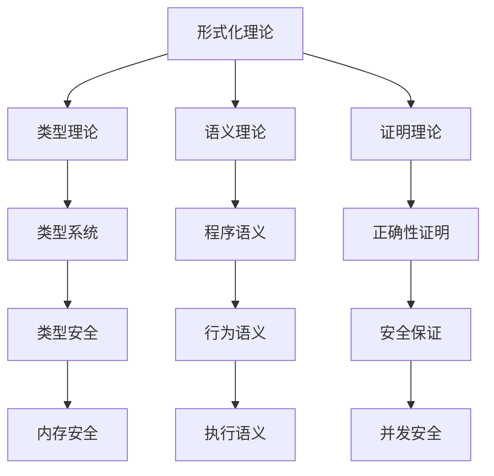

### 3.2 语言理论层关系网络

#### 3.2.1 异步编程系统关系网络

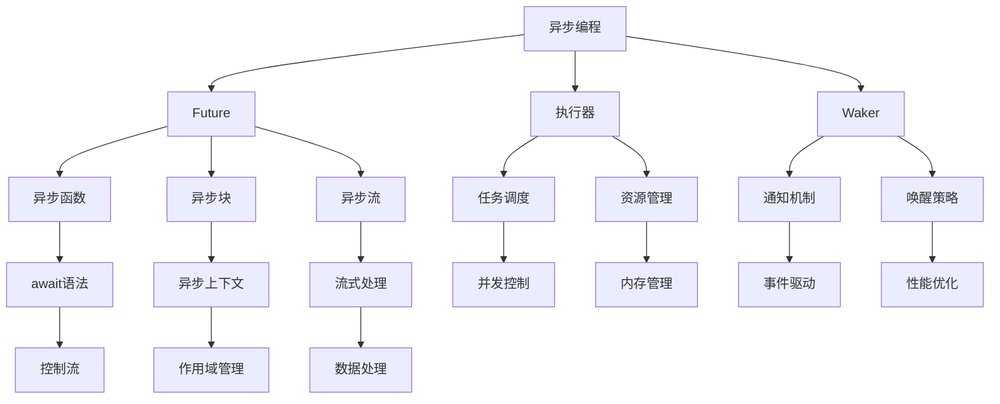

#### 3.2.2 所有权系统关系网络

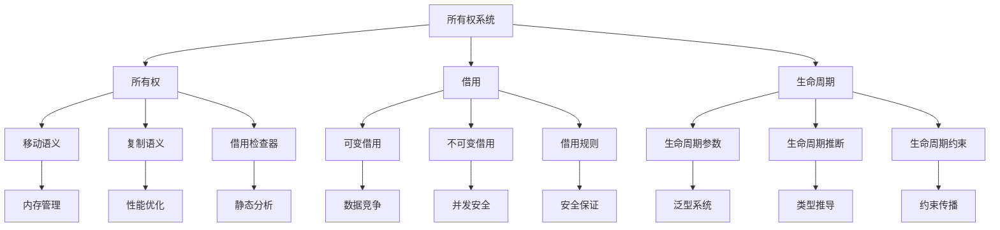

#### 3.2.3 类型系统关系网络

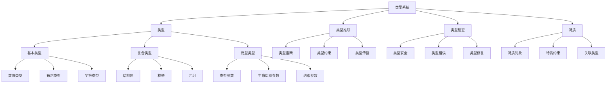

#### 3.2.4 控制流系统关系网络

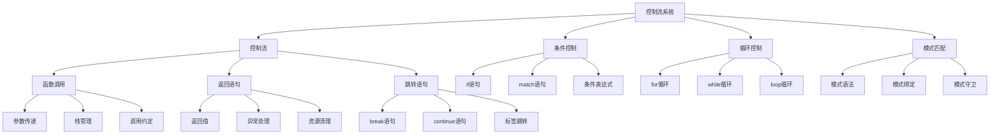

#### 3.2.5 泛型系统关系网络

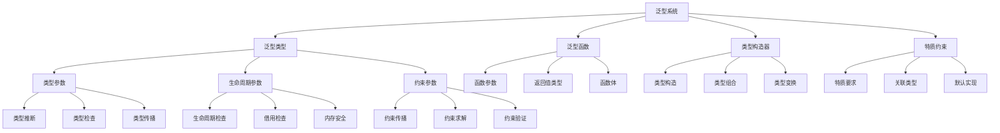

#### 3.2.6 并发编程系统关系网络

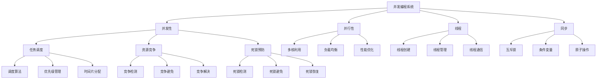

#### 3.2.7 宏系统关系网络

```mermaid
graph TD
    A[宏系统] --> B[声明宏]
    A --> C[过程宏]
    A --> D[宏展开]
    A --> E[宏卫生性]
    
    B --> F[宏模式]
    B --> G[宏模板]
    B --> H[模式匹配]
    
    C --> I[函数宏]
    C --> J[属性宏]
    C --> K[派生宏]
    
    D --> L[TokenStream]
    D --> M[展开引擎]
    D --> N[递归展开]
    
    E --> O[变量作用域]
    E --> P[变量捕获]
    E --> Q[冲突避免]
    
    F --> R[元变量]
    F --> S[重复模式]
    F --> T[语法模式]
    
    G --> U[替换规则]
    G --> V[模板语法]
    G --> W[展开结果]
    
    H --> X[匹配算法]
    H --> Y[绑定规则]
    H --> Z[匹配优先级]
    
    I --> I1[TokenStream处理]
    I --> J1[错误处理]
    I --> K1[类型检查]
    
    J --> L1[属性解析]
    J --> M1[项目转换]
    J --> N1[代码生成]
    
    K --> O1[结构体派生]
    K --> P1[枚举派生]
    K --> Q1[联合体派生]
    
    L --> R1[词法分析]
    L --> S1[语法分析]
    L --> T1[语义分析]
    
    M --> U1[展开策略]
    M --> V1[优化算法]
    M --> W1[缓存机制]
    
    N --> X1[深度限制]
    N --> Y1[循环检测]
    N --> Z1[终止保证]
```

#### 3.2.8 算法系统关系网络

```mermaid
graph TD
    A[算法系统] --> B[算法类型]
    A --> C[算法策略]
    A --> D[算法优化]
    A --> E[算法正确性]
    
    B --> F[顺序算法]
    B --> G[并行算法]
    B --> H[概率算法]
    B --> I[优化算法]
    
    C --> J[策略模式]
    C --> K[状态机]
    C --> L[迭代器模式]
    
    D --> M[类型系统优化]
    D --> N[零成本抽象]
    D --> O[性能保证]
    
    E --> P[不变量]
    E --> Q[证明技术]
    E --> R[验证方法]
    
    F --> S[算法步骤]
    F --> T[算法不变量]
    F --> U[终止条件]
    
    G --> V[线程数]
    G --> W[同步机制]
    G --> X[工作分布]
    
    H --> Y[随机源]
    H --> Z[成功概率]
    H --> A1[错误边界]
    
    I --> B1[目标函数]
    I --> C1[约束条件]
    I --> D1[收敛准则]
    
    J --> E1[编译时策略]
    J --> F1[运行时策略]
    J --> G1[策略选择]
    
    K --> H1[类型状态]
    K --> I1[状态转换]
    K --> J1[状态机实现]
    
    L --> K1[迭代器特征]
    L --> L1[迭代器适配器]
    L --> M1[算法组合器]
    
    M --> N1[性能标记]
    M --> O1[编译时优化]
    M --> P1[内存优化]
    
    N --> Q1[抽象接口]
    N --> R1[零成本实现]
    N --> S1[性能保证]
    
    O --> T1[复杂度分析]
    O --> U1[性能测试]
    O --> V1[优化验证]
    
    P --> W1[循环不变量]
    P --> X1[函数不变量]
    P --> Y1[数据结构不变量]
    
    Q --> Z1[归纳证明]
    Q --> A2[反证法]
    Q --> B2[构造证明]
    
    R --> C2[静态验证]
    R --> D2[动态验证]
    R --> E2[形式化验证]
```

#### 3.2.9 进程管理系统关系网络

```mermaid
graph TD
    A[进程管理系统] --> B[进程创建]
    A --> C[进程通信]
    A --> D[进程同步]
    A --> E[信号处理]
    
    B --> F[进程配置]
    B --> G[进程启动]
    B --> H[进程终止]
    
    C --> I[IPC通道]
    C --> J[管道通信]
    C --> K[共享内存]
    
    D --> L[进程间同步]
    D --> M[资源协调]
    D --> N[死锁预防]
    
    E --> O[信号定义]
    E --> P[信号处理]
    E --> Q[信号传播]
    
    F --> R[程序路径]
    F --> S[参数列表]
    F --> T[环境变量]
    
    G --> U[进程启动]
    G --> V[进程监控]
    G --> W[进程控制]
    
    H --> X[进程清理]
    H --> Y[资源回收]
    H --> Z[状态报告]
    
    I --> I1[消息传递]
    I --> J1[数据序列化]
    I --> K1[通道管理]
    
    J --> L1[标准输入输出]
    J --> M1[错误重定向]
    J --> N1[管道链]
    
    K --> O1[内存映射]
    K --> P1[共享数据结构]
    K --> Q1[访问控制]
    
    L --> R1[互斥锁]
    L --> S1[条件变量]
    L --> T1[信号量]
    
    M --> U1[资源分配]
    M --> V1[资源释放]
    M --> W1[资源监控]
    
    N --> X1[死锁检测]
    N --> Y1[死锁避免]
    N --> Z1[死锁恢复]
    
    O --> A2[信号类型]
    O --> B2[信号优先级]
    O --> C2[信号队列]
    
    P --> D2[信号处理器]
    P --> E2[信号掩码]
    P --> F2[信号上下文]
    
    Q --> G2[信号传播]
    Q --> H2[信号继承]
    Q --> I2[信号阻塞]
```

#### 3.2.10 内存管理系统关系网络

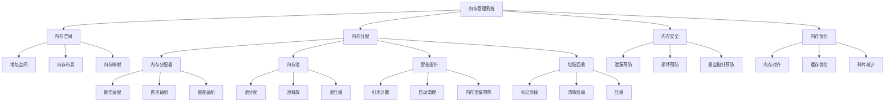

#### 3.2.11 错误处理系统关系网络

```mermaid
graph TD
    A[错误处理系统] --> B[错误类型]
    A --> C[错误传播]
    A --> D[错误恢复]
    A --> E[错误边界]
    
    B --> F[基础错误]
    B --> G[复合错误]
    B --> H[错误层次]
    
    C --> I[错误传播]
    C --> J[错误转换]
    C --> K[错误链]
    
    D --> L[重试策略]
    D --> M[回退策略]
    D --> N[忽略策略]
    
    E --> O[错误隔离]
    E --> P[错误捕获]
    E --> Q[错误处理]
    
    F --> R[IO错误]
    F --> S[网络错误]
    F --> T[解析错误]
    
    G --> U[错误组合]
    G --> V[错误包装]
    G --> W[错误转换]
    
    H --> X[错误分类]
    H --> Y[错误优先级]
    H --> Z[错误严重性]
    
    I --> I1[早期返回]
    I --> J1[错误传播]
    I --> K1[错误转换]
    
    J --> L1[类型转换]
    J --> M1[错误映射]
    J --> N1[错误包装]
    
    K --> O1[错误链]
    K --> P1[错误上下文]
    K --> Q1[错误追踪]
    
    L --> R1[立即重试]
    L --> S1[退避重试]
    L --> T1[指数退避]
    
    M --> U1[默认值]
    M --> V1[备用路径]
    M --> W1[降级服务]
    
    N --> X1[错误忽略]
    N --> Y1[错误记录]
    N --> Z1[错误报告]
    
    O --> A2[错误边界]
    O --> B2[错误隔离]
    O --> C2[错误恢复]
    
    P --> D2[错误捕获]
    P --> E2[错误处理]
    P --> F2[错误传播]
    
    Q --> G2[错误处理]
    Q --> H2[错误恢复]
    Q --> I2[错误报告]
```

#### 3.2.12 模块系统关系网络

```mermaid
graph TD
    A[模块系统] --> B[模块结构]
    A --> C[可见性系统]
    A --> D[路径解析]
    A --> E[依赖管理]
    
    B --> F[内联模块]
    B --> G[文件模块]
    B --> H[目录模块]
    B --> I[条件模块]
    
    C --> J[私有可见性]
    C --> K[包内公开]
    C --> L[全局公开]
    C --> M[路径限制公开]
    
    D --> N[绝对路径]
    D --> O[相对路径]
    D --> P[外部路径]
    D --> Q[自引用路径]
    
    E --> R[直接依赖]
    E --> S[间接依赖]
    E --> T[循环检测]
    E --> U[拓扑排序]
    
    F --> V[模块定义]
    F --> W[模块内容]
    F --> X[模块边界]
    
    G --> Y[文件映射]
    G --> Z[模块声明]
    G --> A1[模块导入]
    
    H --> B1[目录结构]
    H --> C1[模块层次]
    H --> D1[命名空间]
    
    I --> E1[条件编译]
    I --> F1[特性门控]
    I --> G1[平台特定]
    
    J --> H1[默认可见性]
    J --> I1[模块内访问]
    J --> J1[信息隐藏]
    
    K --> K1[包内访问]
    K --> L1[内部API]
    K --> M1[封装边界]
    
    L --> N1[全局访问]
    L --> O1[公共API]
    L --> P1[外部接口]
    
    M --> Q1[路径限制]
    M --> R1[精确控制]
    M --> S1[访问策略]
    
    N --> T1[crate路径]
    N --> U1[根模块]
    N --> V1[绝对引用]
    
    O --> W1[super路径]
    O --> X1[相对引用]
    O --> Y1[层次导航]
    
    P --> Z1[外部crate]
    P --> A2[依赖路径]
    P --> B2[版本管理]
    
    Q --> C2[self引用]
    Q --> D2[当前模块]
    Q --> E2[自引用]
    
    R --> F2[显式依赖]
    R --> G2[导入声明]
    R --> H2[依赖关系]
    
    S --> I2[传递依赖]
    S --> J2[间接引用]
    S --> K2[依赖链]
    
    T --> L2[循环检测]
    T --> M2[依赖验证]
    T --> N2[编译检查]
    
    U --> O2[编译顺序]
    U --> P2[依赖解析]
    U --> Q2[构建优化]
```

### 3.3 应用领域层关系网络

#### 3.3.1 系统编程关系网络

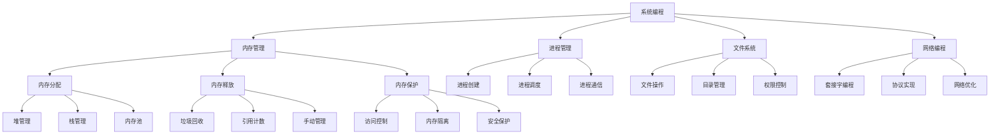

#### 3.3.2 Web开发关系网络

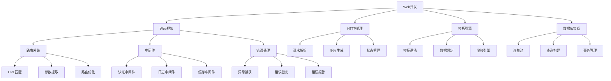

#### 3.3.3 区块链开发关系网络

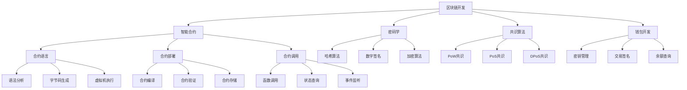

#### 3.3.4 人工智能/机器学习关系网络

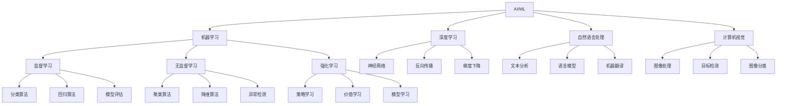

### 3.4 设计模式层关系网络

#### 3.4.1 创建型模式关系网络

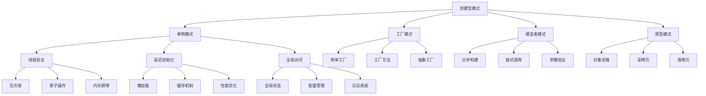

#### 3.4.2 结构型模式关系网络

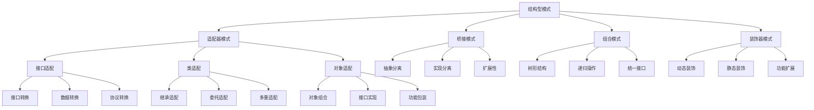

#### 3.4.3 行为型模式关系网络

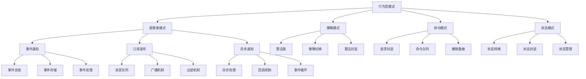

### 3.5 软件架构层关系网络

#### 3.5.1 微服务架构关系网络

```mermaid
graph TD
    A[微服务架构] --> B[服务拆分]
    A --> C[服务发现]
    A --> D[负载均衡]
    A --> E[API网关]
    
    B --> F[业务边界]
    B --> G[数据边界]
    B --> H[技术边界]
    
    C --> I[服务注册]
    C --> J[服务查找]
    C --> K[健康检查]
    
    D --> L[负载策略]
    D --> M[故障转移]
    D --> N[性能监控]
    
    E --> O[路由转发]
    E --> P[认证授权]
    E --> Q[限流熔断]
    
    F --> R[领域驱动]
    F --> S[事件驱动]
    F --> T[命令查询]
    
    G --> U[数据一致性]
    G --> V[数据隔离]
    G --> W[数据同步]
    
    H --> X[技术栈]
    H --> Y[部署方式]
    H --> Z[运维工具]
```

#### 3.5.2 事件驱动架构关系网络

```mermaid
graph TD
    A[事件驱动架构] --> B[事件]
    A --> C[事件总线]
    A --> D[事件存储]
    A --> E[事件处理]
    
    B --> F[事件定义]
    B --> G[事件发布]
    B --> H[事件订阅]
    
    C --> I[消息队列]
    C --> J[事件路由]
    C --> K[事件过滤]
    
    D --> L[事件持久化]
    D --> M[事件重放]
    D --> N[事件查询]
    
    E --> O[事件处理器]
    E --> P[事件聚合]
    E --> Q[事件投影]
    
    F --> R[事件模式]
    F --> S[事件版本]
    F --> T[事件元数据]
    
    G --> U[异步发布]
    G --> V[批量发布]
    G --> W[事务发布]
    
    H --> I1[主题订阅]
    H --> J1[模式订阅]
    H --> K1[条件订阅]
```

#### 3.5.3 领域驱动设计关系网络

```mermaid
graph TD
    A[领域驱动设计] --> B[领域]
    A --> C[实体]
    A --> D[值对象]
    A --> E[聚合]
    
    B --> F[领域模型]
    B --> G[领域服务]
    B --> H[领域事件]
    
    C --> I[身份标识]
    C --> J[生命周期]
    C --> K[业务规则]
    
    D --> L[不可变性]
    D --> M[值相等]
    D --> N[自包含]
    
    E --> O[聚合根]
    E --> P[一致性边界]
    E --> Q[事务边界]
    
    F --> R[概念模型]
    F --> S[逻辑模型]
    F --> T[物理模型]
    
    G --> U[领域逻辑]
    G --> V[业务规则]
    G --> W[计算逻辑]
    
    H --> I1[事件定义]
    H --> J1[事件发布]
    H --> K1[事件处理]
```

### 3.6 知识缺口层关系网络

#### 3.6.1 理论缺口关系网络

```mermaid
graph TD
    A[理论缺口] --> B[形式化验证]
    A --> C[类型系统扩展]
    A --> D[并发理论]
    A --> E[性能理论]
    
    B --> F[程序验证]
    B --> G[模型检查]
    B --> H[定理证明]
    
    C --> I[高级类型]
    C --> J[类型推导]
    C --> K[类型安全]
    
    D --> L[并发模型]
    D --> M[并发语义]
    D --> N[并发验证]
    
    E --> O[性能分析]
    E --> P[性能优化]
    E --> Q[性能预测]
    
    F --> R[静态分析]
    F --> S[动态分析]
    F --> T[混合分析]
    
    G --> U[状态空间]
    G --> V[可达性]
    G --> W[死锁检测]
    
    H --> I1[逻辑推理]
    H --> J1[数学证明]
    H --> K1[自动化证明]
```

#### 3.6.2 应用缺口关系网络

```mermaid
graph TD
    A[应用缺口] --> B[工具支持]
    A --> C[库生态]
    A --> D[学习资源]
    A --> E[最佳实践]
    
    B --> F[IDE支持]
    B --> G[调试工具]
    B --> H[性能分析]
    
    C --> I[标准库]
    C --> J[第三方库]
    C --> K[生态系统]
    
    D --> L[文档教程]
    D --> M[示例代码]
    D --> N[视频课程]
    
    E --> O[设计模式]
    E --> P[架构模式]
    E --> Q[开发流程]
    
    F --> R[代码补全]
    F --> S[错误检查]
    F --> T[重构工具]
    
    G --> U[断点调试]
    G --> V[内存分析]
    G --> W[性能分析]
    
    H --> I1[CPU分析]
    H --> J1[内存分析]
    H --> K1[I/O分析]
```

#### 3.6.3 工具链缺口关系网络

```mermaid
graph TD
    A[工具链缺口] --> B[编译器优化]
    A --> C[调试工具]
    A --> D[测试框架]
    A --> E[包管理]
    
    B --> F[代码优化]
    B --> G[链接优化]
    B --> H[运行时优化]
    
    C --> I[调试器]
    C --> J[日志系统]
    C --> K[监控工具]
    
    D --> L[单元测试]
    D --> M[集成测试]
    D --> N[性能测试]
    
    E --> F1[依赖管理]
    E --> G1[版本控制]
    E --> H1[发布管理]
    
    F --> I1[内联优化]
    F --> J1[循环优化]
    F --> K1[内存优化]
    
    G --> L1[符号解析]
    G --> M1[地址映射]
    G --> N1[性能分析]
    
    H --> O1[JIT编译]
    H --> P1[垃圾回收]
    H --> Q1[内存管理]

#### 3.2.13 微服务系统关系网络

```mermaid
graph TD
    A[微服务系统] --> B[服务架构]
    A --> C[服务通信]
    A --> D[服务发现]
    A --> E[服务编排]
    
    B --> F[服务分解]
    B --> G[服务自治]
    B --> H[服务边界]
    
    C --> I[同步通信]
    C --> J[异步通信]
    C --> K[事件驱动]
    
    D --> L[服务注册]
    D --> M[服务发现]
    D --> N[健康检查]
    
    E --> O[工作流编排]
    E --> P[服务协调]
    E --> Q[负载均衡]
    
    F --> R[领域驱动设计]
    F --> S[单一职责]
    F --> T[松耦合]
    
    G --> U[独立部署]
    G --> V[独立扩展]
    G --> W[独立维护]
    
    H --> X[API接口]
    H --> Y[数据边界]
    H --> Z[安全边界]
    
    I --> AA[HTTP/gRPC]
    I --> BB[请求响应]
    I --> CC[状态管理]
    
    J --> DD[消息队列]
    J --> EE[发布订阅]
    J --> FF[事件存储]
    
    K --> GG[事件总线]
    K --> HH[事件处理]
    K --> II[事件溯源]
    
    L --> JJ[注册中心]
    L --> KK[元数据管理]
    L --> LL[版本控制]
    
    M --> MM[服务查找]
    M --> NN[负载均衡]
    M --> OO[故障转移]
    
    N --> PP[健康检查]
    N --> QQ[故障检测]
    N --> RR[自动恢复]
    
    O --> SS[顺序编排]
    O --> TT[并行编排]
    O --> UU[条件编排]
    
    P --> VV[服务协调]
    P --> WW[事务管理]
    P --> XX[状态同步]
    
    Q --> YY[负载分发]
    Q --> ZZ[故障隔离]
    Q --> AAA[性能优化]
```

## 4. 关系强度定义

### 4.1 强关系 (Strong)

- **定义**: 概念间存在直接、紧密的依赖关系
- **特征**: 一个概念的变化会直接影响另一个概念
- **表示**: 实线箭头，粗线条

### 4.2 中等关系 (Medium)

- **定义**: 概念间存在间接、适中的依赖关系
- **特征**: 一个概念的变化会间接影响另一个概念
- **表示**: 实线箭头，中等线条

### 4.3 弱关系 (Weak)

- **定义**: 概念间存在松散、可选的依赖关系
- **特征**: 一个概念的变化可能影响另一个概念
- **表示**: 虚线箭头，细线条

## 5. 关系验证

### 5.1 完整性验证

- 每个概念都必须在关系网络中有连接
- 关系网络必须是连通的
- 不能存在孤立的概念节点

### 5.2 一致性验证

- 关系方向必须与依赖关系一致
- 关系强度必须与概念间实际关系一致
- 关系类型必须与概念性质一致

### 5.3 准确性验证

- 关系必须基于准确的概念理解
- 关系必须经过专家验证
- 关系必须与实际应用经验一致

## 6. 关系应用

### 6.1 架构设计

- 根据关系网络设计系统架构
- 根据关系强度确定组件耦合度
- 根据关系类型确定交互方式

### 6.2 依赖管理

- 根据关系网络管理依赖关系
- 根据关系强度确定依赖优先级
- 根据关系类型确定依赖策略

### 6.3 变更影响分析

- 根据关系网络分析变更影响范围
- 根据关系强度评估变更风险
- 根据关系类型制定变更策略

## 7. 总结

本关系图谱为Rust形式化工程体系提供了完整的视觉化表示，通过图形化的方式展示了概念间的复杂关系网络。关系图谱不仅有助于理解概念间的逻辑关系，也为实际应用提供了重要的指导价值。

关系图谱的建立为后续的形式化分析和应用开发提供了重要的基础，确保了整个理论体系的完整性和一致性。通过关系图谱，我们可以更好地理解Rust语言的设计理念和实现机制，为构建高质量的Rust应用提供理论支撑。
