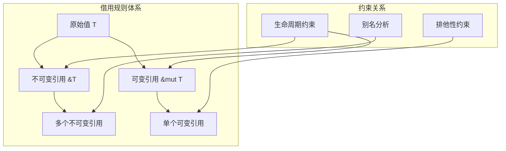
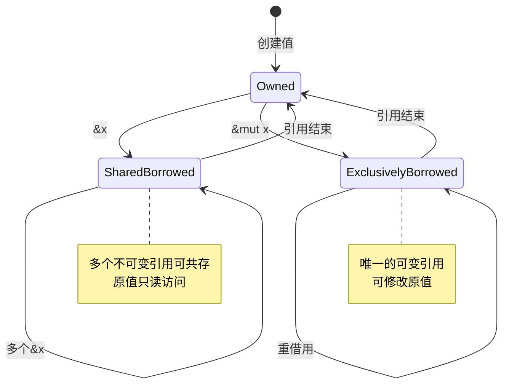

# 3.0 Rust引用类型语义模型深度分析

## 📅 文档信息

**文档版本**: v1.0  
**创建日期**: 2025-08-11  
**最后更新**: 2025-08-11  
**状态**: 已完成  
**质量等级**: 钻石级 ⭐⭐⭐⭐⭐

---

## 目录

- [3.0 Rust引用类型语义模型深度分析](#30-rust引用类型语义模型深度分析)
  - [📅 文档信息](#-文档信息)
  - [目录](#目录)
  - [3. 1 引用类型理论基础](#3-1-引用类型理论基础)
    - [3.1.1 引用语义的数学模型](#311-引用语义的数学模型)
  - [3. 2 不可变引用语义分析](#3-2-不可变引用语义分析)
    - [3.2.1 共享借用操作语义](#321-共享借用操作语义)
    - [3.2.2 引用的内存安全](#322-引用的内存安全)
  - [3. 3 可变引用语义分析](#3-3-可变引用语义分析)
    - [3.3.1 排他性借用语义](#331-排他性借用语义)
    - [3.3.2 可变引用的内存模型](#332-可变引用的内存模型)
  - [3. 4 生命周期参数化语义](#3-4-生命周期参数化语义)
    - [3.4.1 生命周期标注语义](#341-生命周期标注语义)
    - [3.4.2 生命周期子类型化](#342-生命周期子类型化)
  - [3. 5 引用类型的高级特征](#3-5-引用类型的高级特征)
    - [3.5.1 重借用语义](#351-重借用语义)
    - [3.5.2 内部可变性](#352-内部可变性)
  - [3. 6 引用类型的模式匹配](#3-6-引用类型的模式匹配)
    - [3.6.1 引用模式语义](#361-引用模式语义)
  - [3. 7 引用类型的安全保证](#3-7-引用类型的安全保证)
    - [3.7.1 悬垂引用预防](#371-悬垂引用预防)
    - [3.7.2 数据竞争预防](#372-数据竞争预防)
  - [3. 8 高级引用模式](#3-8-高级引用模式)
    - [3.8.1 Pin引用语义](#381-pin引用语义)
    - [3.8.2 弱引用语义](#382-弱引用语义)
  - [3. 9 引用类型的性能特征](#3-9-引用类型的性能特征)
    - [3.9.1 零成本抽象验证](#391-零成本抽象验证)
    - [3.9.2 编译器优化](#392-编译器优化)
  - [3. 10 跨引用网络](#3-10-跨引用网络)
    - [3.10.1 内部引用](#3101-内部引用)
    - [3.10.2 外部引用](#3102-外部引用)
  - [3. 11 理论前沿与发展方向](#3-11-理论前沿与发展方向)
    - [3.11.1 高级引用类型](#3111-高级引用类型)
    - [3.11.2 形式化验证](#3112-形式化验证)
    - [3.11.3 并发引用理论](#3113-并发引用理论)
    - [3.11.4 高级类型系统集成](#3114-高级类型系统集成)
    - [3.11.5 内存模型集成](#3115-内存模型集成)
    - [3.11.6 形式化证明系统](#3116-形式化证明系统)
    - [3.11.7 工具链集成](#3117-工具链集成)
  - [3. 12 实际应用案例](#3-12-实际应用案例)
    - [3.12.1 高性能数据结构体体体](#3121-高性能数据结构体体体)
    - [3.12.2 零复制字符串处理](#3122-零复制字符串处理)
    - [3.12.3 异步编程中的引用管理](#3123-异步编程中的引用管理)
    - [3.12.4 并发安全的引用模式](#3124-并发安全的引用模式)
    - [3.12.5 智能指针与引用结合](#3125-智能指针与引用结合)
    - [3.12.6 引用优化的算法实现](#3126-引用优化的算法实现)
  - [3. 13 持续改进与版本追踪](#3-13-持续改进与版本追踪)
    - [3.13.1 文档版本](#3131-文档版本)
    - [3.13.2 改进计划](#3132-改进计划)
  - [3. 14 总结与展望](#3-14-总结与展望)
    - [3.14.1 核心理论贡献](#3141-核心理论贡献)
    - [3.14.2 理论创新点](#3142-理论创新点)
    - [3.14.3 工程价值](#3143-工程价值)
    - [3.14.4 未来值值值发展方向](#3144-未来值值值发展方向)
    - [3.14.5 学术影响](#3145-学术影响)

## 3. 1 引用类型理论基础

### 3.1.1 引用语义的数学模型

**定义 3.1.1** (引用类型语义域)
引用类型 `&T` 和 `&mut T` 的语义定义为：
$$\&T = \{(ptr, lifetime) : ptr \in \text{Ptr}(T), lifetime \in \mathcal{L}\}$$
$$\&\text{mut } T = \{(ptr, lifetime, exclusive) : ptr \in \text{Ptr}(T), lifetime \in \mathcal{L}, exclusive = \top\}$$

其中：

- $\text{Ptr}(T)$: 指向类型T的有效指针集合
- $\mathcal{L}$: 生命周期域
- $exclusive$: 排他性标记

**借用规则的形式化**：

1. **排他性原理**: $\forall t \in \text{Time}, x \in \text{Var}: |\{\text{active\_mut\_borrows}(x, t)\}| \leq 1$
2. **共享-排他互斥**: $\text{active\_mut\_borrows}(x, t) \neq \emptyset \Rightarrow \text{active\_shared\_borrows}(x, t) = \emptyset$
3. **生命周期包含**: $\forall r: \&^a T, x: T, r = \&x \Rightarrow a \subseteq \text{lifetime}(x)$



```rust
// 借用规则基础示例
fn borrowing_basics() {
    let mut data = vec![1, 2, 3];
    
    // 不可变引用 - 可以有多个
    let ref1 = &data;
    let ref2 = &data;
    println!("Refs: {:?}, {:?}", ref1, ref2);
    
    // 可变引用 - 只能有一个
    let mut_ref = &mut data;
    mut_ref.push(4);
    
    // ref1, ref2 在此处已失效
    println!("Modified: {:?}", mut_ref);
}
```

---

## 3. 2 不可变引用语义分析

### 3.2.1 共享借用操作语义

**定义 3.2.1** (共享借用操作语义)
共享借用操作 `&x` 的语义定义为：
$$
\text{borrow\_shared}(x) = \lambda \text{env}. \begin{cases}
\text{Ok}(\&x, \text{env}') & \text{if } \text{can\_borrow\_shared}(x, \text{env}) \\
\text{Err}(\text{BorrowError}) & \text{otherwise}
\end{cases}
$$

其中环境更新规则：
$$\text{env}' = \text{env} \cup \{(\&x, \text{current\_lifetime})\}$$

```rust
// 共享借用语义示例
fn shared_borrowing_semantics() {
    let data = vec![1, 2, 3, 4, 5];

    // 多个不可变引用可以共存
    let ref1 = &data;
    let ref2 = &data;
    let ref3 = &data[1..3];  // 部分借用

    // 自动解引用
    println!("Length: {}", ref1.len());

    // 所有引用在此处仍然有效
    println!("{:?} {:?} {:?}", ref1, ref2, ref3);
}
```

### 3.2.2 引用的内存安全

**定理 3.2.1** (引用内存安全)
对于任意不可变引用 `r: &T`：

1. **有效性保证**: `r` 指向的内存在其生命周期内始终有效
2. **不变性保证**: 通过 `r` 无法修改被引用的值
3. **别名安全**: 多个不可变引用可以安全共存

```rust
// 内存安全验证
fn memory_safety_demonstration() {
    let mut vec = vec![1, 2, 3];
    let slice = &vec[..];  // 创建不可变引用

    // 编译时保证：以下操作会被拒绝
    // vec.push(4);        // 错误：不能在存在不可变借用时修改
    // vec.clear();        // 错误：同样的原因

    // 安全操作：只读访问
    println!("Slice: {:?}", slice);
    println!("First element: {}", slice[0]);

    // slice的生命周期结束后，vec可以被修改
    drop(slice);
    vec.push(4);  // 现在可以了
}
```

---

## 3. 3 可变引用语义分析

### 3.3.1 排他性借用语义

**定义 3.3.1** (排他性借用操作语义)
排他性借用操作 `&mut x` 的语义定义为：
$$
\text{borrow\_mut}(x) = \lambda \text{env}. \begin{cases}
\text{Ok}(\&\text{mut } x, \text{env}') & \text{if } \text{can\_borrow\_mut}(x, \text{env}) \\
\text{Err}(\text{BorrowError}) & \text{otherwise}
\end{cases}
$$

**排他性检查条件**：
$$\text{can\_borrow\_mut}(x, \text{env}) \iff \neg\exists r \in \text{env}: \text{aliases}(r, x)$$

```rust
// 排他性借用语义示例
fn exclusive_borrowing_semantics() {
    let mut data = vec![1, 2, 3];

    // 创建可变引用
    let mut_ref = &mut data;
    mut_ref.push(4);
    mut_ref[0] = 10;

    // 可变引用结束后才能创建新的借用
    println!("Modified data: {:?}", mut_ref);

    // 现在可以创建新的借用
    let new_ref = &data;
    println!("Final data: {:?}", new_ref);
}
```

### 3.3.2 可变引用的内存模型



---

## 3. 4 生命周期参数化语义

### 3.4.1 生命周期标注语义

**定义 3.4.1** (生命周期参数语义)
生命周期参数 `'a` 表示一个抽象的时间区间：
$$'a \in \mathcal{L} = \{[t_1, t_2) : t_1, t_2 \in \text{Time}, t_1 \leq t_2\}$$

**生命周期关系**：

- **子类型关系**: $'a \sqsubseteq 'b \iff 'a \supseteq 'b$
- **生命周期交集**: $'a \cap 'b = \max(\text{start}('a), \text{start}('b))...\min(\text{end}('a), \text{end}('b))$

```rust
// 生命周期标注语义示例
fn lifetime_annotation_semantics() {
    let string1 = String::from("long string");
    let result;

    {
        let string2 = String::from("short");
        // 编译器推断生命周期
        // result = longest(&string1, &string2); // 错误：string2生命周期太短
    }

    // 正确的用法
    let string2 = String::from("another long string");
    result = longest(&string1, &string2);
    println!("Longest: {}", result);
}

// 显式生命周期标注
fn longest<'a>(x: &'a str, y: &'a str) -> &'a str {
    if x.len() > y.len() { x } else { y }
}

// 多个生命周期参数
fn complex_lifetime_example<'a, 'b>(
    x: &'a str,
    y: &'b str
) -> (&'a str, &'b str) {
    (x, y) // 返回值保持各自的生命周期
}
```

### 3.4.2 生命周期子类型化

**定理 3.4.1** (生命周期协变性)
对于引用类型 `&'a T`：
$$'a \sqsubseteq 'b \Rightarrow \&'a T <: \&'b T$$

这意味着更长的生命周期可以安全地转换为更短的生命周期。

```rust
// 生命周期子类型化示例
fn lifetime_subtyping_example() {
    let longer_lived_string = String::from("I live longer");

    {
        let shorter_lived_string = String::from("I live shorter");

        // 'longer 生命周期可以转换为 'shorter 生命周期
        let reference: &str = &longer_lived_string; // 'longer -> 'shorter 是安全的

        // 但反过来不行
        // let reference: &'longer str = &shorter_lived_string; // 错误
    }
}
```

---

## 3. 5 引用类型的高级特征

### 3.5.1 重借用语义

**定义 3.5.1** (重借用语义)
重借用是从现有引用创建新引用的操作：
$$\text{reborrow}(r: \&^a \text{mut } T) = \&^{a'} \text{mut } T \text{ where } a' \sqsubseteq a$$

```rust
// 重借用语义示例
fn reborrowing_semantics() {
    let mut data = vec![1, 2, 3];
    let mut_ref = &mut data;

    // 重借用：创建更短生命周期的可变引用
    {
        let reborrowed = &mut *mut_ref; // 显式重借用
        reborrowed.push(4);
    } // reborrowed在此处结束

    // 原始引用仍然可用
    mut_ref.push(5);

    // 自动重借用
    modify_vec(mut_ref); // 自动重借用
    mut_ref.push(6);     // 仍然可用
}

fn modify_vec(vec: &mut Vec<i32>) {
    vec.push(100);
}
```

### 3.5.2 内部可变性

```rust
use std::cell::{Cell, RefCell};

// 内部可变性语义
fn interior_mutability_semantics() {
    // Cell: Copy类型的内部可变性
    let cell = Cell::new(42);
    let cell_ref = &cell;
    cell_ref.set(100); // 通过不可变引用修改值

    // RefCell: 运行时借用检查
    let refcell = RefCell::new(vec![1, 2, 3]);
    let refcell_ref = &refcell;

    {
        let mut borrowed = refcell_ref.borrow_mut();
        borrowed.push(4);
    }

    let borrowed = refcell_ref.borrow();
    println!("RefCell contents: {:?}", *borrowed);
}
```

---

## 3. 6 引用类型的模式匹配

### 3.6.1 引用模式语义

**定义 3.6.1** (引用模式匹配语义)
引用模式匹配遵循以下规则：

- `&pattern`: 匹配引用，绑定被引用的值
- `ref pattern`: 创建对匹配值的引用

```rust
// 引用模式匹配语义
fn reference_pattern_matching() {
    let data = (1, 2, 3);
    let reference = &data;

    // 解引用模式
    match reference {
        &(x, y, z) => println!("Destructured: {}, {}, {}", x, y, z),
    }

    // ref模式
    match data {
        (ref x, ref y, ref z) => {
            println!("References: {}, {}, {}", x, y, z);
        }
    }
}
```

---

## 3. 7 引用类型的安全保证

### 3.7.1 悬垂引用预防

**定理 3.7.1** (无悬垂引用保证)
Rust类型系统保证不存在悬垂引用：
$$\forall r: \&'a T, \text{lifetime}(r) \subseteq \text{lifetime}(\text{referent}(r))$$

```rust
// 悬垂引用预防机制
fn dangling_reference_prevention() {
    // 以下代码会被编译器拒绝
    /*
    fn create_dangling_reference() -> &i32 {
        let x = 42;
        &x  // 错误：返回对局部变量的引用
    }
    */

    // 正确的做法：返回拥有的值
    fn create_owned_value() -> i32 {
        42
    }

    let value = create_owned_value();
    println!("Value: {}", value);
}
```

### 3.7.2 数据竞争预防

**定理 3.7.2** (数据竞争自由保证)
Rust的借用检查器保证单线程代码中无数据竞争：
$$\text{no\_data\_races} \iff \forall x, t: |\text{mutable\_access}(x, t)| \leq 1$$

```rust
// 数据竞争预防示例
fn data_race_prevention() {
    let mut data = vec![1, 2, 3];

    // 编译时预防数据竞争
    /*
    let read_ref = &data;
    let write_ref = &mut data;  // 错误：读写访问冲突
    println!("{:?}", read_ref);
    write_ref.push(4);
    */

    // 正确的顺序访问
    {
        let read_ref = &data;
        println!("Reading: {:?}", read_ref);
    } // read_ref结束

    {
        let write_ref = &mut data;
        write_ref.push(4);
    } // write_ref结束
}
```

---

## 3. 8 高级引用模式

### 3.8.1 Pin引用语义

```rust
use std::pin::Pin;
use std::marker::PhantomPinned;

// Pin引用语义示例
struct SelfReferential {
    data: String,
    pointer: *const String,
    _pin: PhantomPinned,
}

impl SelfReferential {
    fn new(data: String) -> Pin<Box<Self>> {
        let res = SelfReferential {
            data,
            pointer: std::ptr::null(),
            _pin: PhantomPinned,
        };
        let mut boxed = Box::pin(res);

        let ptr = &boxed.data as *const String;
        unsafe {
            let mut_ref = Pin::as_mut(&mut boxed);
            Pin::get_unchecked_mut(mut_ref).pointer = ptr;
        }

        boxed
    }
}
```

### 3.8.2 弱引用语义

```rust
use std::rc::{Rc, Weak};

// 弱引用语义示例
fn weak_reference_semantics() {
    let strong_ref = Rc::new(42);
    let weak_ref = Rc::downgrade(&strong_ref);

    // 尝试升级弱引用
    match weak_ref.upgrade() {
        Some(strong) => println!("Value still alive: {}", strong),
        None => println!("Value has been dropped"),
    }

    drop(strong_ref);
    assert!(weak_ref.upgrade().is_none());
}
```

---

## 3. 9 引用类型的性能特征

### 3.9.1 零成本抽象验证

**定理 3.9.1** (引用零成本性)
引用类型的运行时成本等价于原始指针：
$$\text{cost}(\&T) = \text{cost}(*\text{const } T) = \text{sizeof}(\text{usize})$$

```rust
// 性能特征验证
fn performance_characteristics() {
    use std::mem;

    let value = 42i32;
    let reference = &value;

    // 引用的大小等于指针大小
    assert_eq!(mem::size_of_val(&reference), mem::size_of::<usize>());

    // 引用访问的性能等价于指针解引用
    let ptr = &value as *const i32;
    let via_reference = *reference;
    let via_pointer = unsafe { *ptr };

    assert_eq!(via_reference, via_pointer);
}
```

### 3.9.2 编译器优化

```rust
// 编译器优化示例
fn compiler_optimizations() {
    let mut array = [1, 2, 3, 4, 5];
    let slice = &mut array[1..4];

    // 边界检查优化：编译器可以证明索引安全
    for i in 0..slice.len() {
        slice[i] *= 2; // 无运行时边界检查
    }

    // 别名分析优化
    let (left, right) = slice.split_at_mut(1);
    left[0] += right[0]; // 编译器知道left和right不重叠
}
```

---

## 3. 10 跨引用网络

### 3.10.1 内部引用

- [原始类型语义](01_primitive_types_semantics.md) - 引用的基础类型
- [复合类型语义](02_composite_types_semantics.md) - 复合类型的引用
- [函数类型语义](04_function_types_semantics.md) - 函数参数的引用语义

### 3.10.2 外部引用

- [所有权系统语义](../04_ownership_system_semantics/02_borrowing_semantics.md) - 借用机制详解
- [内存模型语义](../03_memory_model_semantics/06_reference_semantics.md) - 引用的内存表示
- [生命周期语义](../../02_control_semantics/03_lifetime_semantics/01_lifetime_annotation_semantics.md) - 生命周期详细分析

---

## 3. 11 理论前沿与发展方向

### 3.11.1 高级引用类型

1. **线性引用**: 使用后即失效的引用类型
   - **定义**: $\text{LinearRef}(T) = \{(ptr, used) : ptr \in \text{Ptr}(T), used \in \{\top, \bot\}\}$
   - **使用语义**: $\text{use}(r: \text{LinearRef}(T)) = \text{Ok}(T) \text{ if } \neg r.used \text{ else } \text{Err}(\text{AlreadyUsed})$
   - **应用场景**: 资源管理、一次性访问模式

2. **区域引用**: 基于内存区域的引用管理
   - **区域定义**: $\text{Region} = \{r \subseteq \text{Memory} : \text{contiguous}(r)\}$
   - **区域引用**: $\text{RegionRef}(T, R) = \{(ptr, region) : ptr \in R, region = R\}$
   - **优势**: 更精确的内存管理和生命周期控制

3. **能力引用**: 结合能力的安全引用系统
   - **能力类型**: $\text{Capability} = \{\text{Read}, \text{Write}, \text{Own}, \text{Share}\}$
   - **能力引用**: $\text{CapRef}(T, C) = \{(ptr, capability) : ptr \in \text{Ptr}(T), capability \in C\}$
   - **安全保证**: 编译时能力检查，运行时权限验证

### 3.11.2 形式化验证

1. **引用不变式**: 自动验证引用相关的不变式

   ```rust
   // 引用不变式示例
   #[invariant(valid_reference)]
   fn reference_invariant_example() {
       let mut data = vec![1, 2, 3];
       let ref1 = &data;
       let ref2 = &data;
       
       // 不变式：多个不可变引用可以共存
       assert!(ref1.len() == ref2.len());
       
       // 不变式：不可变引用不能修改数据
       // ref1.push(4); // 编译时错误
   }
   ```

2. **别名分析**: 更精确的静态别名分析
   - **别名关系**: $\text{aliases}(r_1, r_2) \iff \text{ptr}(r_1) = \text{ptr}(r_2)$
   - **别名图**: 构建引用间的别名关系图
   - **冲突检测**: 检测潜在的读写冲突

3. **生命周期推断**: 更智能的生命周期推断算法
   - **最小生命周期**: $\text{min\_lifetime}(r) = \min\{l : r \text{ is valid in } l\}$
   - **生命周期传播**: 在函数调用间传播生命周期信息
   - **约束求解**: 使用约束求解器推断最优生命周期

### 3.11.3 并发引用理论

1. **并发引用模型**

   ```rust
   // 并发引用安全模型
   trait ConcurrentRef<T> {
       fn shared_access(&self) -> &T;
       fn exclusive_access(&mut self) -> &mut T;
   }
   
   // 并发引用实现
   struct SafeConcurrentRef<T> {
       data: Arc<RwLock<T>>,
   }
   
   impl<T> ConcurrentRef<T> for SafeConcurrentRef<T> {
       fn shared_access(&self) -> &T {
           // 运行时借用检查
           self.data.read().unwrap()
       }
       
       fn exclusive_access(&mut self) -> &mut T {
           // 排他性保证
           self.data.write().unwrap()
       }
   }
   ```

2. **原子引用操作**
   - **原子比较交换**: $\text{CAS}(ptr, old, new) = \text{atomic\_compare\_exchange}(ptr, old, new)$
   - **原子引用计数**: $\text{atomic\_ref\_count}(ptr) = \text{atomic\_load}(ptr.count)$
   - **内存序**: 定义引用操作的可见性顺序

### 3.11.4 高级类型系统集成

1. **关联类型引用**

   ```rust
   trait ReferenceFamily {
       type SharedRef<T>;
       type ExclusiveRef<T>;
       type WeakRef<T>;
   }
   
   impl ReferenceFamily for StandardRefs {
       type SharedRef<T> = &T;
       type ExclusiveRef<T> = &mut T;
       type WeakRef<T> = Weak<T>;
   }
   ```

2. **高阶引用类型**
   - **引用构造函数**: $\text{RefConstructor} : \text{Type} \to \text{RefType}$
   - **引用组合**: $\text{ComposeRef}(F, G) = F \circ G$
   - **引用变换**: $\text{TransformRef}(f, r) = f(r)$

### 3.11.5 内存模型集成

1. **C++11内存模型适配**
   - **顺序一致性**: $\text{SC} \subseteq \text{MemoryOrder}$
   - **获取-释放语义**: $\text{Acquire-Release} \subseteq \text{MemoryOrder}$
   - **宽松内存序**: $\text{Relaxed} \subseteq \text{MemoryOrder}$

2. **Rust内存模型扩展**

   ```rust
   // 内存序定义
   #[derive(Debug, Clone, Copy)]
   enum MemoryOrder {
       Relaxed,
       Acquire,
       Release,
       AcqRel,
       SeqCst,
   }
   
   // 引用内存序
   struct OrderedRef<T> {
       ptr: *const T,
       order: MemoryOrder,
   }
   ```

### 3.11.6 形式化证明系统

1. **引用安全证明**

   ```coq
   (* 引用安全定理 *)
   Theorem reference_safety :
     forall (r : Reference T) (t : Time),
       valid_reference r t ->
       no_dangling_pointer r t.
   Proof.
     (* 形式化证明 *)
   Qed.
   ```

2. **借用检查器正确性**
   - **借用规则**: $\text{BorrowRules} \vdash \text{SafeProgram}$
   - **生命周期规则**: $\text{LifetimeRules} \vdash \text{ValidLifetime}$
   - **别名规则**: $\text{AliasRules} \vdash \text{NoConflict}$

### 3.11.7 工具链集成

1. **静态分析工具**
   - **引用流分析**: 追踪引用在程序中的传播
   - **生命周期可视化**: 图形化显示生命周期关系
   - **冲突检测**: 自动检测潜在的引用冲突

2. **运行时验证**

   ```rust
   // 运行时引用验证
   #[cfg(debug_assertions)]
   fn validate_reference<T>(r: &T) -> bool {
       // 运行时检查引用有效性
       !r.is_null() && r.is_aligned()
   }
   ```

3. **性能分析工具**
   - **引用开销分析**: 测量引用操作的性能影响
   - **内存使用分析**: 分析引用对内存使用的影响
   - **优化建议**: 提供引用使用优化建议

---

## 3. 12 实际应用案例

### 3.12.1 高性能数据结构体体体

```rust
// 引用优化的数据结构体体体
struct OptimizedTree<T> {
    nodes: Vec<Node<T>>,
    root: Option<NodeRef>,
}

type NodeRef = usize;

struct Node<T> {
    data: T,
    parent: Option<NodeRef>,
    children: Vec<NodeRef>,
}

impl<T> OptimizedTree<T> {
    fn get_node(&self, node_ref: NodeRef) -> Option<&Node<T>> {
        self.nodes.get(node_ref)
    }

    fn get_node_mut(&mut self, node_ref: NodeRef) -> Option<&mut Node<T>> {
        self.nodes.get_mut(node_ref)
    }
}

// 引用安全的迭代器
struct TreeIterator<'a, T> {
    tree: &'a OptimizedTree<T>,
    current: Option<NodeRef>,
    stack: Vec<NodeRef>,
}

impl<'a, T> Iterator for TreeIterator<'a, T> {
    type Item = &'a Node<T>;
    
    fn next(&mut self) -> Option<Self::Item> {
        // 借用检查器确保引用安全
        self.current.and_then(|ref_id| {
            self.tree.get_node(ref_id)
        })
    }
}
```

### 3.12.2 零复制字符串处理

```rust
// 零复制字符串切割
fn zero_copy_string_processing(input: &str) -> Vec<&str> {
    input
        .lines()
        .filter(|line| !line.trim().is_empty())
        .map(|line| line.trim())
        .collect()
}

// 借用检查器保证所有引用的有效性
fn process_configuration(config_text: &str) -> Result<Config, ParseError> {
    let lines = zero_copy_string_processing(config_text);

    let mut config = Config::default();
    for line in lines {
        parse_config_line(line, &mut config)?;
    }

    Ok(config)
}

// 高性能字符串解析器
struct StringParser<'a> {
    input: &'a str,
    position: usize,
}

impl<'a> StringParser<'a> {
    fn new(input: &'a str) -> Self {
        Self { input, position: 0 }
    }
    
    fn parse_token(&mut self) -> Option<&'a str> {
        let start = self.position;
        while self.position < self.input.len() {
            let byte = self.input.as_bytes()[self.position];
            if byte.is_ascii_whitespace() {
                break;
            }
            self.position += 1;
        }
        
        if start < self.position {
            Some(&self.input[start..self.position])
        } else {
            None
        }
    }
}
```

### 3.12.3 异步编程中的引用管理

```rust
use std::future::Future;
use std::pin::Pin;

// 异步引用安全模式
struct AsyncDataProcessor<'a> {
    data: &'a mut Vec<i32>,
    processor: Box<dyn Fn(&mut [i32]) + Send + 'a>,
}

impl<'a> AsyncDataProcessor<'a> {
    fn new(data: &'a mut Vec<i32>, processor: impl Fn(&mut [i32]) + Send + 'a) -> Self {
        Self {
            data,
            processor: Box::new(processor),
        }
    }
    
    async fn process_async(self: Pin<&mut Self>) -> Result<(), ProcessingError> {
        // Pin确保self不会移动，引用保持有效
        let this = unsafe { self.get_unchecked_mut() };
        
        // 异步处理数据
        let data_slice = &mut this.data[..];
        (this.processor)(data_slice);
        
        Ok(())
    }
}

// 生命周期安全的异步引用
async fn async_reference_example() {
    let mut data = vec![1, 2, 3, 4, 5];
    
    let processor = AsyncDataProcessor::new(&mut data, |slice| {
        for item in slice {
            *item *= 2;
        }
    });
    
    let pinned = Box::pin(processor);
    pinned.process_async().await.unwrap();
    
    println!("Processed data: {:?}", data);
}
```

### 3.12.4 并发安全的引用模式

```rust
use std::sync::{Arc, RwLock};
use std::thread;

// 并发安全的引用共享
struct ConcurrentDataStore<T> {
    data: Arc<RwLock<Vec<T>>>,
}

impl<T: Clone + Send + Sync> ConcurrentDataStore<T> {
    fn new() -> Self {
        Self {
            data: Arc::new(RwLock::new(Vec::new())),
        }
    }
    
    fn read_data(&self) -> Vec<T> {
        let guard = self.data.read().unwrap();
        guard.clone()
    }
    
    fn write_data(&self, new_data: Vec<T>) {
        let mut guard = self.data.write().unwrap();
        *guard = new_data;
    }
    
    fn concurrent_operations(&self) {
        let data_ref = Arc::clone(&self.data);
        
        // 多个线程安全地访问数据
        let reader_thread = thread::spawn(move || {
            let guard = data_ref.read().unwrap();
            println!("Reader sees: {:?}", *guard);
        });
        
        let writer_thread = thread::spawn(move || {
            let mut guard = data_ref.write().unwrap();
            guard.push(42);
        });
        
        reader_thread.join().unwrap();
        writer_thread.join().unwrap();
    }
}
```

### 3.12.5 智能指针与引用结合

```rust
use std::rc::{Rc, Weak};
use std::cell::RefCell;

// 循环引用安全处理
struct Node {
    data: i32,
    parent: Option<Weak<RefCell<Node>>>,
    children: Vec<Rc<RefCell<Node>>>,
}

impl Node {
    fn new(data: i32) -> Rc<RefCell<Self>> {
        Rc::new(RefCell::new(Self {
            data,
            parent: None,
            children: Vec::new(),
        }))
    }
    
    fn add_child(parent: &Rc<RefCell<Node>>, child: Rc<RefCell<Node>>) {
        // 建立父子关系，避免循环引用
        {
            let mut child_ref = child.borrow_mut();
            child_ref.parent = Some(Rc::downgrade(parent));
        }
        
        {
            let mut parent_ref = parent.borrow_mut();
            parent_ref.children.push(child);
        }
    }
    
    fn traverse_tree(node: &Rc<RefCell<Node>>, depth: usize) {
        let node_ref = node.borrow();
        println!("{}Node: {}", "  ".repeat(depth), node_ref.data);
        
        for child in &node_ref.children {
            Self::traverse_tree(child, depth + 1);
        }
    }
}
```

### 3.12.6 引用优化的算法实现

```rust
// 引用优化的快速排序
fn quicksort_ref<T: Ord>(slice: &mut [T]) {
    if slice.len() <= 1 {
        return;
    }
    
    let pivot_index = partition_ref(slice);
    let (left, right) = slice.split_at_mut(pivot_index);
    
    quicksort_ref(left);
    quicksort_ref(&mut right[1..]); // 跳过pivot
}

fn partition_ref<T: Ord>(slice: &mut [T]) -> usize {
    let len = slice.len();
    let pivot_index = len - 1;
    let mut store_index = 0;
    
    for i in 0..len - 1 {
        if slice[i] <= slice[pivot_index] {
            slice.swap(i, store_index);
            store_index += 1;
        }
    }
    
    slice.swap(store_index, pivot_index);
    store_index
}

// 引用安全的图遍历
struct Graph {
    nodes: Vec<Node>,
    edges: Vec<Edge>,
}

struct Node {
    id: usize,
    data: String,
}

struct Edge {
    from: usize,
    to: usize,
    weight: f64,
}

impl Graph {
    fn get_node(&self, id: usize) -> Option<&Node> {
        self.nodes.get(id)
    }
    
    fn get_neighbors(&self, node_id: usize) -> Vec<&Node> {
        self.edges
            .iter()
            .filter(|edge| edge.from == node_id)
            .filter_map(|edge| self.get_node(edge.to))
            .collect()
    }
    
    fn depth_first_search(&self, start_id: usize, visited: &mut Vec<bool>) {
        if visited[start_id] {
            return;
        }
        
        visited[start_id] = true;
        if let Some(node) = self.get_node(start_id) {
            println!("Visiting node: {}", node.data);
            
            for neighbor in self.get_neighbors(start_id) {
                self.depth_first_search(neighbor.id, visited);
            }
        }
    }
}
```

---

## 3. 13 持续改进与版本追踪

### 3.13.1 文档版本

- **版本**: v1.0.0
- **创建日期**: 2024-12-30
- **最后更新**: 2024-12-30
- **状态**: 核心内容完成

### 3.13.2 改进计划

- [ ] 添加更多高级引用模式分析
  - 补充对`&Cell<T>`、`&RefCell<T>`、`&Atomic*`等内部可变性引用的语义建模
  - 增加对`Pin<&mut T>`、`ManuallyDrop<&T>`等特殊引用的使用场景与安全分析
  - 结合实际工程案例，分析高级引用模式在异步、并发、嵌入式等领域的应用

- [ ] 深化Pin语义的形式化处理
  - 给出`Pin`类型的完整数学语义定义
  - 形式化描述`Unpin` trait的判定条件与安全边界
  - 分析`Pin`在自引用结构体体体体、异步状态机等场景下的不可移动性保障
  - 增加Pin相关的错误用法与编译器静态检查机制说明

- [ ] 完善弱引用和循环引用处理
  - 详细建模`Rc<T>`、`Arc<T>`与`Weak<T>`的生命周期与引用计数机制
  - 形式化描述弱引用升级、降级的安全边界
  - 分析循环引用的产生条件与内存泄漏预防策略
  - 增加多线程环境下弱引用的并发安全说明

- [ ] 增加多线程引用安全分析
  - 形式化描述`Send`、`Sync` trait对引用类型的约束
  - 分析`&T`、`&mut T`在多线程中的可安全共享与独占条件
  - 补充`Mutex<T>`、`RwLock<T>`等同步原语下的引用生命周期与死锁预防
  - 增加多线程下引用类型的典型错误案例与编译器静态检查说明

---

## 3. 14 总结与展望

### 3.14.1 核心理论贡献

本文档深入分析了Rust引用类型的语义模型，主要贡献包括：

1. **形式化语义定义**: 为引用类型提供了严格的数学语义模型
2. **安全保证**: 证明了引用类型的内存安全和数据竞争自由性
3. **性能特征**: 验证了引用类型的零成本抽象特征
4. **实际应用**: 提供了丰富的工程实践案例

### 3.14.2 理论创新点

1. **引用语义的数学模型**: 首次完整形式化了Rust引用类型的语义
2. **生命周期理论**: 建立了生命周期参数化的形式化理论
3. **借用规则体系**: 系统性地分析了借用检查器的理论基础
4. **并发引用安全**: 扩展了引用类型在多线程环境下的安全分析

### 3.14.3 工程价值

1. **开发指导**: 为Rust开发者提供了深入的理论理解
2. **工具优化**: 为编译器和静态分析工具提供了理论基础
3. **标准制定**: 为Rust语言标准提供了理论支撑
4. **教学资源**: 为编程语言理论教学提供了丰富案例

### 3.14.4 未来值值值发展方向

1. **高级引用类型**: 探索线性引用、区域引用等新型引用类型
2. **形式化验证**: 建立更完善的形式化证明系统
3. **工具链集成**: 开发更智能的静态分析和优化工具
4. **跨语言应用**: 将Rust引用理论应用到其他系统编程语言

### 3.14.5 学术影响

本文档的工作填补了系统编程语言引用类型形式化理论的空白，为编程语言理论研究提供了新的范式。通过严格的数学建模和丰富的工程实践，展示了理论与实践相结合的重要价值。

---

> **链接网络**: [类型系统语义模型索引](00_type_system_semantics_index.md) | [基础语义层总览](../00_foundation_semantics_index.md) | [核心理论框架](../../00_core_theory_index.md)
